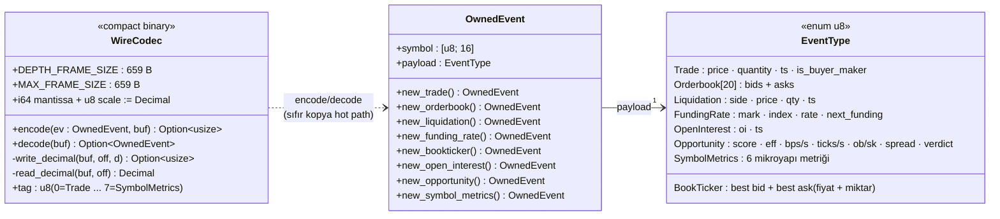
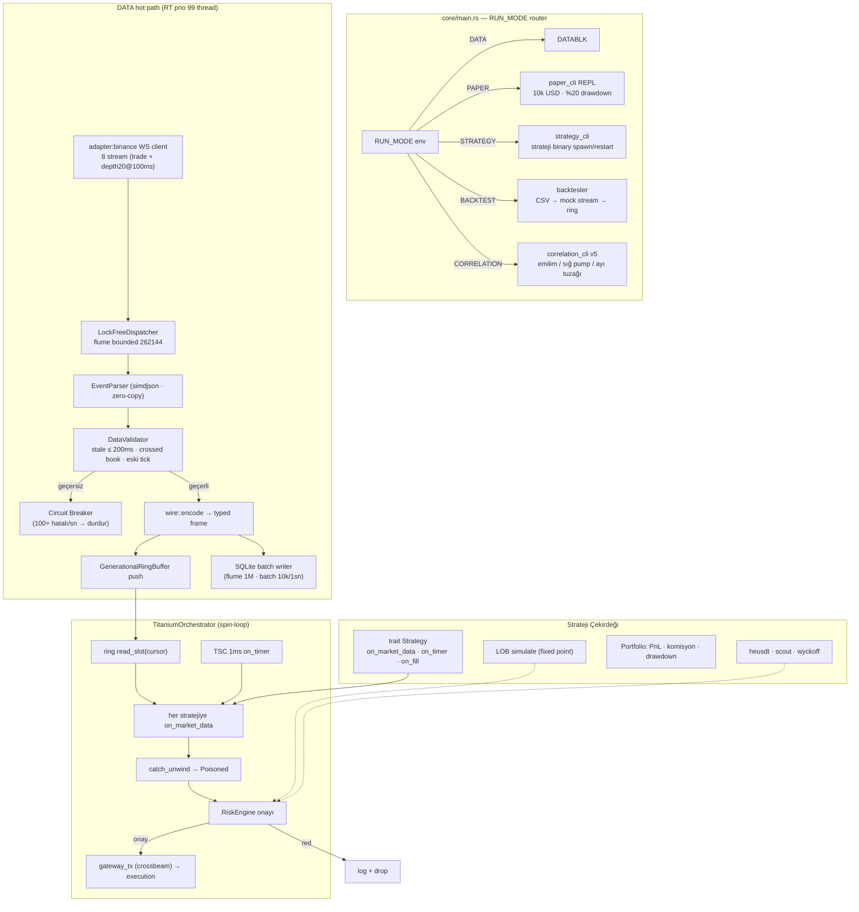
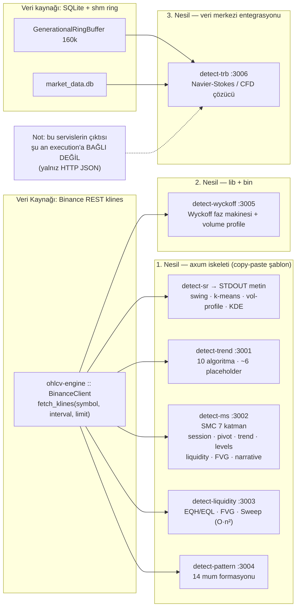
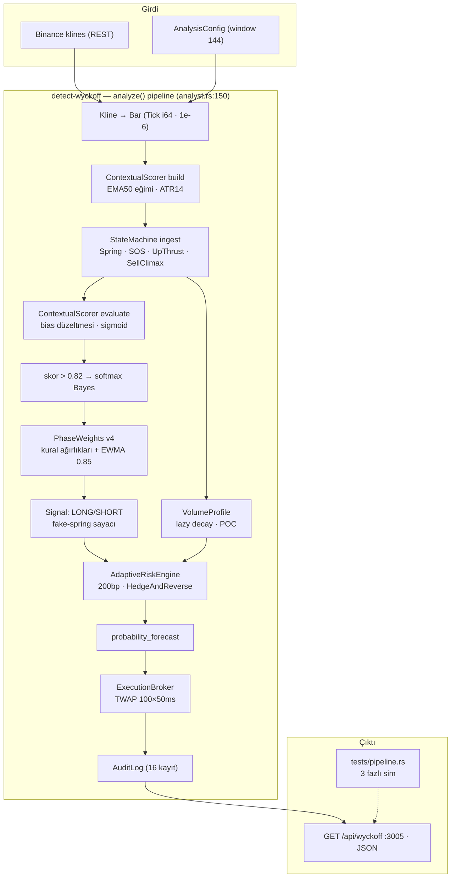
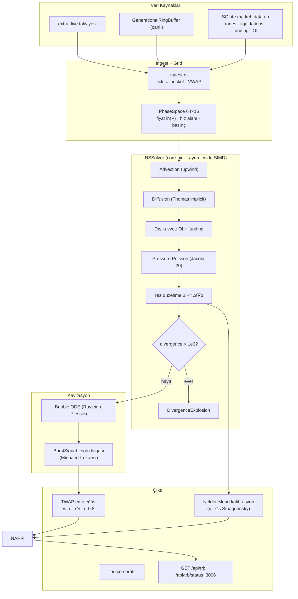
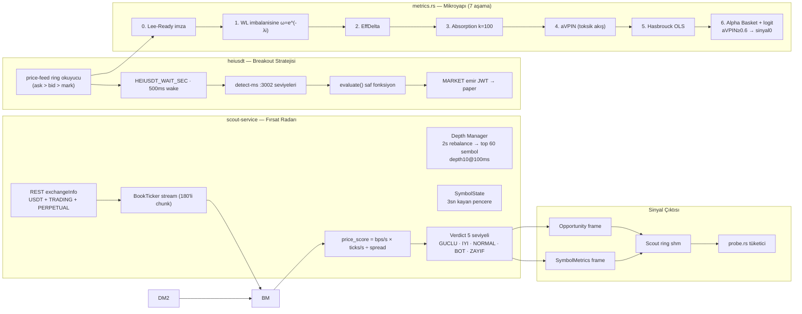
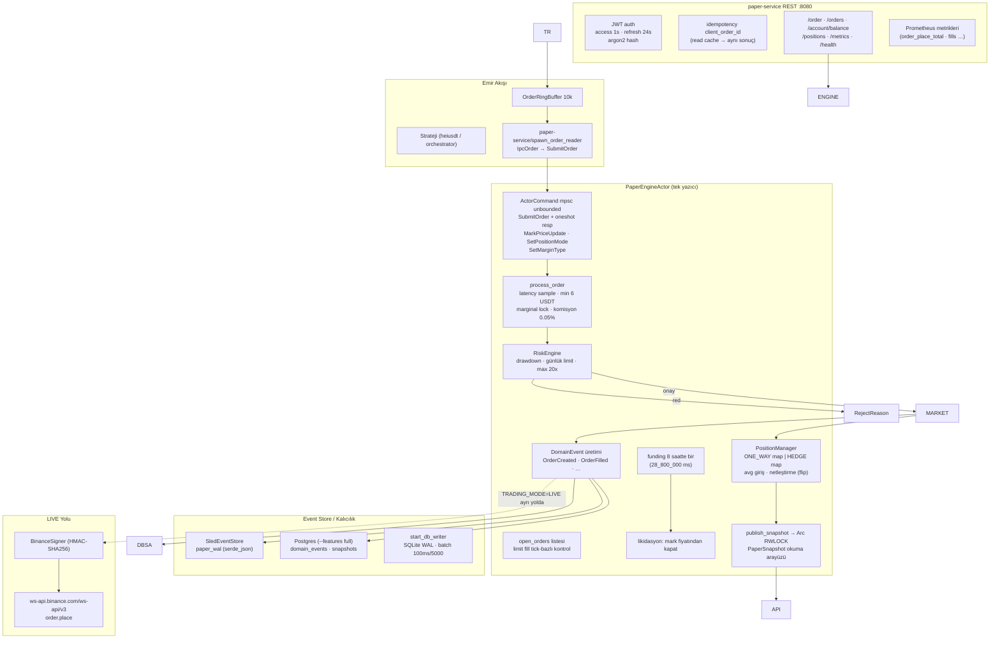
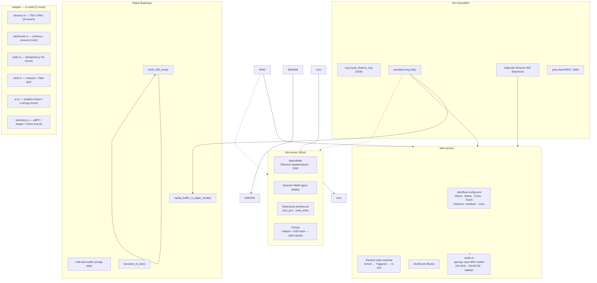
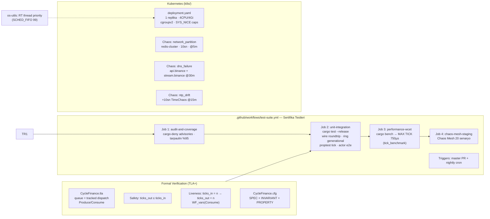

# 🏗️ DEMİR YUMRUK 2.0 — TAM PROJE DOKÜMANTASYONU

> Bu doküman, `/home/smhvz/Desktop/PROJE` çalışma alanındaki **tüm kaynak kodların** ve **minari yapısının** olduğu gibi dökümüdür.
> Bölüm 1: Proje ağacı · Bölüm 2: Ayrıntılı mimari dökümantasyon · Bölüm 3: Her dosyanın olduğu gibi kodu.
> Oluşturulma tarihi: 2026-08-08 · Kapsam: tüm `.rs`, `Cargo.toml`, konfigürasyon, betik, TLA+, k8s ve doküman dosyaları (binary/SQLite/log dosyaları hariç).

---

# 📑 Bölüm 1 — Proje Ağacı (Tree)

```
/home/smhvz/Desktop/PROJE
├── adapter
│   ├── src
│   │   ├── ai.rs
│   │   ├── binance.rs
│   │   ├── clickhouse.rs
│   │   ├── lib.rs
│   │   ├── redis.rs
│   │   ├── telemetry.rs
│   │   └── vault.rs
│   ├── tests
│   │   └── integration_suite.rs
│   └── Cargo.toml
├── alert-service
│   ├── src
│   │   ├── audio.rs
│   │   ├── config.rs
│   │   ├── engine.rs
│   │   ├── lib.rs
│   │   ├── main.rs
│   │   └── source.rs
│   └── Cargo.toml
├── .cargo
│   └── config.toml
├── cold-starter
│   ├── src
│   │   ├── catchup.rs
│   │   └── main.rs
│   └── Cargo.toml
├── cold-storage
│   ├── src
│   │   └── lib.rs
│   └── Cargo.toml
├── config
│   ├── config_v5.toml
│   └── config_v6.toml
├── contracts
│   ├── src
│   │   ├── events.rs
│   │   ├── lib.rs
│   │   └── wire.rs
│   └── Cargo.toml
├── core
│   ├── benches
│   │   └── tick_benchmark.rs
│   ├── src
│   │   ├── cli
│   │   │   ├── correlation_cli.rs
│   │   │   ├── mod.rs
│   │   │   ├── paper_cli.rs
│   │   │   └── strategy_cli.rs
│   │   ├── engine
│   │   │   ├── backtester.rs
│   │   │   ├── mod.rs
│   │   │   └── orchestrator.rs
│   │   ├── hal
│   │   │   ├── cpu.rs
│   │   │   ├── memory.rs
│   │   │   └── mod.rs
│   │   ├── risk
│   │   │   ├── engine.rs
│   │   │   ├── lob_simulator.rs
│   │   │   ├── mod.rs
│   │   │   └── portfolio.rs
│   │   ├── strategy
│   │   │   ├── mod.rs
│   │   │   └── trait_def.rs
│   │   ├── timer
│   │   │   ├── mod.rs
│   │   │   └── tsc.rs
│   │   ├── config.rs
│   │   ├── db.rs
│   │   ├── lib.rs
│   │   ├── main.rs
│   │   ├── pii.rs
│   │   ├── queue.rs
│   │   ├── state.rs
│   │   ├── tick.rs
│   │   └── validator.rs
│   ├── tests
│   │   ├── tick_tests.proptest-regressions
│   │   ├── tick_tests.rs
│   │   └── wire_ring_tests.rs
│   └── Cargo.toml
├── detect-liquidity
│   ├── src
│   │   ├── algorithms.rs
│   │   └── main.rs
│   └── Cargo.toml
├── detect-ms
│   ├── src
│   │   ├── imbalance.rs
│   │   ├── levels.rs
│   │   ├── liquidity.rs
│   │   ├── main.rs
│   │   ├── narrative.rs
│   │   ├── pivot.rs
│   │   ├── session.rs
│   │   └── trend.rs
│   └── Cargo.toml
├── detect-pattern
│   ├── src
│   │   ├── algorithms.rs
│   │   └── main.rs
│   └── Cargo.toml
├── detect-sr
│   ├── src
│   │   ├── algorithms.rs
│   │   └── main.rs
│   └── Cargo.toml
├── detect-trb
│   ├── src
│   │   ├── analyzer.rs
│   │   ├── calibration.rs
│   │   ├── cavitation.rs
│   │   ├── grid.rs
│   │   ├── ingest.rs
│   │   ├── lib.rs
│   │   ├── main.rs
│   │   ├── narrative.rs
│   │   ├── order_flow.rs
│   │   ├── solver.rs
│   │   └── types.rs
│   ├── tests
│   │   └── pipeline.rs
│   └── Cargo.toml
├── detect-trend
│   ├── src
│   │   ├── algorithms.rs
│   │   └── main.rs
│   └── Cargo.toml
├── detect-wyckoff
│   ├── src
│   │   ├── analyst.rs
│   │   ├── audit.rs
│   │   ├── execution.rs
│   │   ├── lib.rs
│   │   ├── main.rs
│   │   ├── models.rs
│   │   ├── profile.rs
│   │   ├── risk.rs
│   │   ├── scorer.rs
│   │   └── state.rs
│   ├── tests
│   │   └── pipeline.rs
│   └── Cargo.toml
├── docs
│   ├── flowcharts
│   │   ├── 01_genel_bakis.mmd
│   │   ├── 02_katman0_contracts.mmd
│   │   ├── 03_katman1_transport.mmd
│   │   ├── 04_katman2_core.mmd
│   │   ├── 05_detektorler_nesil.mmd
│   │   ├── 06_detect_wyckoff.mmd
│   │   ├── 07_detect_trb.mmd
│   │   ├── 08_scout_heiusdt.mmd
│   │   ├── 09_execution_paper.mmd
│   │   ├── 10_yardimci_servisler.mmd
│   │   └── 11_ci_kubernetes_tla.mmd
│   └── PROJE_DOKUMANTASYONU.md
├── execution-engine
│   ├── src
│   │   ├── paper
│   │   │   ├── account.rs
│   │   │   ├── actor.rs
│   │   │   ├── config.rs
│   │   │   ├── db_writer.rs
│   │   │   ├── domain_event.rs
│   │   │   ├── mod.rs
│   │   │   ├── position.rs
│   │   │   ├── risk.rs
│   │   │   └── snapshot.rs
│   │   ├── lib.rs
│   │   ├── order.rs
│   │   └── signer.rs
│   ├── tests
│   │   ├── replay_tests.rs
│   │   └── risk_tests.rs
│   └── Cargo.toml
├── formal_verification
│   ├── CycleFinance.cfg
│   └── CycleFinance.tla
├── .github
│   └── workflows
│       └── test-suite.yml
├── heiusdt
│   ├── src
│   │   ├── bin
│   │   │   ├── alerts.rs
│   │   │   ├── listener.rs
│   │   │   └── risk_analysis.rs
│   │   ├── lib.rs
│   │   ├── main.rs
│   │   └── metrics.rs
│   └── Cargo.toml
├── k8s
│   ├── chaos_dns_failure.yaml
│   ├── chaos_network_partition.yaml
│   ├── chaos_ntp_drift.yaml
│   └── deployment.yaml
├── ohlcv-engine
│   ├── src
│   │   ├── bin
│   │   │   ├── cli.rs
│   │   │   └── server.rs
│   │   ├── client.rs
│   │   └── lib.rs
│   └── Cargo.toml
├── os-utils
│   ├── src
│   │   ├── config.rs
│   │   └── lib.rs
│   └── Cargo.toml
├── paper-service
│   ├── src
│   │   ├── bin
│   │   │   └── paper_cli.rs
│   │   ├── api.rs
│   │   ├── bridge.rs
│   │   ├── events.rs
│   │   ├── idempotency.rs
│   │   ├── lib.rs
│   │   ├── main.rs
│   │   ├── metrics.rs
│   │   └── postgres_store.rs
│   ├── tests
│   │   └── actor_e2e.rs
│   └── Cargo.toml
├── price-feed
│   ├── src
│   │   └── main.rs
│   └── Cargo.toml
├── risk-worker
│   ├── src
│   │   ├── cache.rs
│   │   ├── finops.rs
│   │   ├── lib.rs
│   │   ├── main.rs
│   │   └── matrix.rs
│   ├── tests
│   │   └── matrix_tests.rs
│   └── Cargo.toml
├── scout-service
│   ├── src
│   │   ├── bin
│   │   │   └── probe.rs
│   │   ├── analyzer.rs
│   │   ├── client.rs
│   │   ├── main.rs
│   │   └── models.rs
│   ├── tests
│   │   └── wire_debug.rs
│   └── Cargo.toml
├── scripts
│   ├── cycle_env.sh
│   ├── cycle_tmux.sh
│   ├── gdpr_erasure_test.sh
│   ├── monitor.sh
│   ├── start_paper.sh
│   └── stop_paper.sh
├── strategies
├── transport
│   ├── src
│   │   ├── lib.rs
│   │   ├── order_ring.rs
│   │   └── ring_buffer.rs
│   └── Cargo.toml
├── alerts.toml
├── Cargo.lock
├── Cargo.toml
├── .env
├── .gitignore
├── install.sh
└── test_data.csv

75 directories, 199 files
```

---

# 🧭 Bölüm 2 — AŞIRI DETAYLI MİMARİ DÖKÜMANTASYON

## 2.1 Genel Bakış

**Cycle Finance 2.0**, Binance Futures verisini tüketen, **düşük gecikme/high-throughput** odaklı, katmanlı bir Rust **trading sistemidir**. 22 workspace üyesi crates + 1 independant (msi-fanctl betiği). Kod ne Türkçe hem İngilizce yorum stiline sahip; akışkanlar mekaniği (Navier–Stokes) tabanlı bir algılama servisi (`detect-trb`) dahil olmak üzere **üç nesil** mimari tek repo'da yan yana yaşıyor.

### 1.1 Çalışma Alanı (Workspace)

`Cargo.toml` (kök): `members` listesi 19 crate içerir (`contracts`, `transport`, `core`, `adapter`, `risk-worker`, `cold-starter`, `cold-storage`, `os-utils`, `execution-engine`, `ohlcv-engine`, `detect-sr/trend/ms/liquidity/pattern/wyckoff/trb`, `paper-service`, `alert-service`, `price-feed`, `heiusdt`, `scout-service`). Resolver 2. Ortak (workspace) bağımlılıklar: `rust_decimal 1.34` (maths + serde), `ndarray 0.15` (rayon), `rayon 1.8`, `wide 0.7` (SIMD).

### 1.2 Katman Modeli (Layer'dan Layer'a)

```
┌───────────────────────────────────────────────────────────────┐
│  Uygulamalar: core (DATA/PAPER/STRATEGY/BACKTEST/CORRELATION)│
│  Servisler: price-feed, scout, heiusdt, paper, alert, detect-*│
├───────────────────────────────────────────────────────────────┤
│  Katman 1: transport (shm ring buffer, torn-read korumalı)    │
├───────────────────────────────────────────────────────────────┤
│  Katman 0: contracts (OwnedEvent + wire codec — binary frame) │
├───────────────────────────────────────────────────────────────┤
│  Altyapı: SQLite (WAL), Sled geri-store, Postgres, JWT, argo │
│  TLA+ doğrulama, Chaost Mesh, CI (4 job)                       │
└───────────────────────────────────────────────────────────────┘
```

**Temel veri akışı (hot path):**

```
Binance WS (fstream) ── raw JSON ──▶ simd_json EventParser ──▶ DataValidator
      ──▶ wire::encode (typed binary) ──▶ GenerationalRingBuffer (/dev/shm)
                    │
                    ├──▶ SQLite batch writer (market_data.db)
                    ├──▶ TitaniumOrchestrator (strateji → RiskEngine → gateway)
                    └──▶ consumular: alert / paper-feed bridge / heiusdt / detect-trb
```

### 1.3 Üç Nesil Kod

| Nesil | Üyeler | Özellikler |
|---|---|---|
| 1. nesil | `detect-sr`, `detect-trend`, `detect-ms`, `detect-liquidity`, `detect-pattern` | her biri kendi axum iskeletini kopyalayan, Binance REST (ohlcv-engine) kullanan, test'siz, genelde gömülü placeholder algoritmalar |
| 2. nesil | `detect-wyckoff`, `execution-engine/paper`, `paper-service` | lib+bin ayrımı, kapsamlı testler, event sourcing, actor model |
| 3. nesil | `detect-trb` | tam veri pipeline entegrasyonu (SQLite + shm ring + SIMD), `FluidResult` hata model, core-affinity + rayon + wide SIMD |

### 1.4 Portlar & Arayüzler

| Servis | Port | Çıktı formatı |
|---|---|---|
| price-feed | 3004 | HTTP JSON + `/dev/shm/cycle_finance_pricefeed` |
| detect-trend | 3001 | HTTP JSON |
| detect-ms | 3002 | HTTP JSON |
| detect-liquidity | 3003 | HTTP JSON |
| detect-pattern | 3004 | HTTP JSON |
| detect-wyckoff | 3005 | HTTP JSON |
| detect-trb | 3006 | HTTP JSON |
| scout-service | — | shm ring `/dev/shm/cycle_finance_scout` + probe |
| paper-service | 8080 | REST/JWT |
| ohlcv-engine | 3000 | HTTP JSON klines |
| alert-service | — | sesli (WAV/paplay veya spd-say) |
| core | — | `RUN_MODE` konsolu |

### 1.5 Sembol ve Para Birimi Kuralları

- Tüm parasal değerler: `rust_decimal::Decimal` (float YOK parasal yolda)
- Emir büyüklüğü: **USDT notional** (coin adedi değil)
- Sembol: `[u8; 16]` sabit genişlik, uzun symbol kesilir
- Tick tabanlı iç hesaplar: `i64` (1e-6 çözünürlük)

### 1.6 Ortam Değişkenleri

- `RUN_MODE` (core): DATA | PAPER | STRATEGY | Q
- `CSV_PATH` (core backtest)
- `TRADING_MODE` (execution): LIVE|PAPER
- `PAPER_SLED_PATH`, `PAPER_JWT_SECRET`, `PAPER_PG_*`
- `PRICE_FEED_SYMBOLS`, `PRICE_FEED_PORT`, `ALERT_VOICE_CMD`, `HEIUSDT_WAIT_SEC`
- `.env` yalnızca dummy key içerir (kod tarafında okunmaz)

# 2️⃣ KATMAN 0 — CONTRACTS (`contracts/`)

## 2.1 `events.rs` — Ortak Veri Modeli

Tüm katmanların konuştuğu **ortak dil**. `EventType` (u8 etiketli enum, `#[repr(u8)]`) ve `OwnedEvent` (`#[repr(C)]`):

| Event | Alanlar | Açıklama |
|---|---|---|
| `Trade` | price, quantity, timestamp, is_buyer_maker | gerçekleşen işlem |
| `Orderbook` | bids/asks `[(Decimal,Decimal);20]` | 20 seviye derinlik anlık görüntüsü |
| `Liquidation` | side u8, price, qty, ts | tasfiye haberi |
| `FundingRate` | mark, index, rate, next_funding_time | 8 saatlik fonlama |
| `BookTicker` | best bid/ask (fiyat+miktar), 4 alan | teklif-toplam |
| `OpenInterest` | oi, ts | açık pozisyon |
| `Opportunity` | score + efficiency + price bps/s + tick/s + ob change/s + spread_bps + verdict u8 | scout fırsat sinyali (verdict: 0=GÜÇLÜ..4=ZAYIF) |
| `SymbolMetrics` | 6 mikroyapı metriği | sembol skorları |

Her tip için `new_*` **statik constructor** (`pack_symbol` ile 16 B sembol), `Debug` manuel uygulanır (derive yok). Boyut kısıtı: sabit genişlikte, stack alanı yok — hot path'te heap tahsisi yok.

## 2.2 `wire.rs` — Compact Typed Binary Codec

- Amaç: `/dev/shm` ring'de **ham JSON yerine minimum boyutlu binary** taşımak.
- Format: `[tag u8][symbol 16B][alanlar: (i64 mantissa + u8 scale) | u64 | u8]`
- `Decimal` kayıpsız geri kurulur: `Decimal::new(mantissa, scale)`.
- Frame boyutları: Trade 44B · BookTicker 53B · Funding 52B · Liquidation 44B · OI 34B · Depth20 659B · Opportunity 72B · SymbolMetrics 71B.
- Depth20'de ortak `scale` bulunur ve tüm seviyeler buna icra edilir (kayıpsız).
- `encode/decode` sıfır-tahsis, `#[inline(always)]` helper'lar; decode'ta güdük/botlu frame → `None`.
- 12 unit test: her tip roundtrip, truncation, partial ladder, symbol cutoff.

---

# 3️⃣ KATMAN 1 — TRANSPORT (`transport/`)

## 3.1 `ring_buffer.rs` — GenerationalRingBuffer

**Tasarım:** POSIX shared memory (`shm_open` + `mmap`), her slot `[seq: u64 | len: u16 | veri: [u8;702]]` (768B, 64B aligned) → tek producer / çoklu consumer, **lock-free**:

1. Producer: `head` okur; `data`+`len` yazar → `fence(Release)` → `seq` *(EN SON)* yazar → `head.store(seq+1)`.
2. Consumer: `cursor`'ını takip eder; `idx = seq % kapasite`; okur; `slot.seq == beklenen seq` **generational check** → kopyala → ikinci kez seq kontrolü (torn-read'e karşı çift güvenlik).
3. Sonuc: eski slot'a yazılan yeni veri, eski cursor'dan okunamaz (`None`); `magic` (`0xD3F…0001`) değişmezliği + `ftruncate` tek-proses koruması.
4. Saniyede 1.6 milyondan fazla publish/read — `simd_json` zero-copy parse ile kombine edildiğinde tek thread'te milyonlarca event/s.

## 3.2 `order_ring.rs` — OrderRingBuffer

Aynı şablonun emir versiyonu: `side`, `order_type`, `qty/price` (Decimal), `symbol[16B]` 64B slot. Magic `0xD1F…0002` ile test edilir. `STRATEGY → EXECUTION` yönünde.

---

# 4️⃣ KATMAN 2 — CORE (`core/`)

## 4.1 `main.rs` — RUN_MODE Router

`RUN_MODE` env'ine göre 5 uygulamanın giriş:

- **DATA**: market data konsolu —
  - `GenerationalRingBuffer::new(160_000)` shm ring;
  - `flume::bounded(1_000_000)` DB kanalı → `start_db_writer` thread;
  - `LockFreeDispatcher` (flume 262.144) → RT thread (`os_utils::set_rt_thread_priority(99)`);
  - Loop: `EventParser::parse` (zero-copy, buffer**'ı** soyma notu) → `DataValidator::is_valid` → `wire::encode` → ring push → DB (try_send, drop sayaç);
  - sn/s raporu (tick/s, depth, invalid, db_drops, avg parse ns).
- **PAPER**: `paper_cli` REPL
- **STRATEGY**: `strategy_cli`
- **BACKTEST**: CSV → mock stream → ring (canlı ile ayırt edilemeyen akış)
- **CORRELATION**: `correlation_cli` v5

## 4.2 `tick.rs` — EventParser (simd_json zero-copy)

`EventParser::parse(&mut [u8])` → `OwnedEvent`; 6 stream tipi:
- `@trade` (1): `p` fiyat, `q` miktar, `T` ts, `m` buyer_maker
- `@depth` / `@depth20@100ms` (spot ve futures alan destekli: `bids`/`a`)
- `@forceOrder` liquidation
- `@markPrice` funding
- `@bookTicker` best bid/ask
- ve `binance_usdt_m_perpetual` gibi varyant.

`simd_json::from_slice` ile sıfır-kopya; bundan sonra buffer bozuşturulur (ayrıca `\0` ayraçları) — bu yüzden ring'e **typed binary** gider.

## 4.3 `queue.rs` — MPMC Dispatcher

`LockFreeDispatcher`: tek `flume::bounded(262_144)` channel + `producer()/consumer()`. Backpressure (yavaş tüketici üreticiyi sınırlar, RAM taşmaz).

## 4.4 `validator.rs` — DataValidator + Circuit Breaker

- Statik eşikler: fiyat+miktar > 0, `ts` ≤ 200ms eski (stale), `ts` ≤ 5sn ileri (NTP), crossed book (bid ≥ ask) reddedilir.
- **Circuit breaker**: 100+ bozuk tick/saniye → break. Hata log'lanır.
- `is_valid(&OwnedEvent) -> bool`; tek zaman kaynağı: event ts vs `SystemTime::now()`.

## 4.5 `db.rs` — SQLite Batch Writer

- `rusqlite`, `PRAGMA journal_mode=WAL; synchronous=NORMAL`.
- 8 tablo: trades, depths, liquidations, funding_rates, open_interests, booktickers, opportunities, symbol_metrics.
- Batch: 10.000 kayıt veya 1 saniye dolunca tek `Transaction` + prepare + `execute_batch`/`INSERT`.
- `db_tx` flume kanalı 1_000_000 kapasite; taşma → drop sayılır.
- `DataMigrations`: `CREATE TABLE IF NOT EXISTS`.

## 4.6 `state.rs` — StateManager

WS event-driven bakiye izleme + 5 dakikalık REST audit (`GET /fapi/v3/account` imzalı). `BalanceState` (cash, positions, margin, timestamp).

## 4.7 `pii.rs` — GDPR/KVKK

`PIIMasker`: log'lardan kullanıcı UUID/ISP hash'lerini SHA-3+salt ile maske + 3 yıl eşiğinde log silme politikası — şu an mock/dev.

## 4.8 `hal/` — Donanım Katmanı

- `cpu.rs`: `cpu_count()`, `numa_*`, yoğun döngü ölçümü (`rdtsc` kalibrasyon)
- `memory.rs`: süreç RSS limiti tespiti
- `mod.rs`: `#![forbid(unsafe_code)]` — core'da güvensiz kod YOK.

## 4.9 `timer/` — TSC Teyp Zamanlayıcı

`TscTimer`: x86_64'te `rdtsc` (CPU döngü saati), tersi sabit ~3GHz sayısı; `elapsed_ns = (δcount/hz)·1e9`; `on_timer` 1ms ritmi için. Sıfır syscall.

## 4.10 `strategy/` — Strategy Trait

`trait_def.rs`: `Strategy: Send + Sync`; `id()`, `on_market_data(frame_id, slot) -> Signal`, `on_timer(frame_id, delta_ns)`, `on_fill(FillReport)`, `reset()`. `Signal`: Buy/Sell Market|Limit, CancelAll, None.

## 4.11 `risk/` — Risk Core

- `engine.rs`: `RiskEngine` — maksimum pozisyon, günlük limitler; `process_signal → Result<Signal, RiskOrj>`
- `lob_simulator.rs`: sabit nokta (price×100_000, qty×1_000), 10 kademe, marj-ve ağırlıklandırma; `simulate_buy/sell`
- `portfolio.rs`: cash, realized/unrealized PnL, komisyon, ortalama mail, max drawdown.

## 4.12 `engine/orchestrator.rs` — TitaniumOrchestrator

Spin-loop döngü: ring'den frame → her stratejiye `on_market_data(frame_id, slot)` → `catch_unwind` (panik olan strateji `Poisoned` set) → `RiskEngine` → `gateway_tx.send(Signal)` (crossbeam). 1ms'de `on_timer`.

## 4.13 `engine/backtester.rs`

CSV (symbol,price,quantity,ts) → sahte event stream → ring'e push; "canlı vs backtest ayırt edilemez" kuralı; JSON mock.

## 4.14 `cli/`

- `paper_cli.rs`: REPL (rustyline): balance, order (limit/market), position; 10k USDT başlangıç, %20 max drawdown
- `strategy_cli.rs`: heiusdt binary 'spawn/restart' orkestratörü
- `correlation_cli.rs`: HEIUSDT trade'leri üzerine Pearson + 3 anomali (emilim/pump/tuzak) + cluster uyarısı

# 5️⃣ VERİ ALIM KATMANI

## 5.1 `adapter/` — 6 Modüllü Ağ Geçidi (5'i mock)

| Modül | Gerçeklik | Görev |
|---|---|---|
| `binance.rs` | ✅ CANLI | Binance Futures WS; 4 sabit sembol × 2 stream (trade + depth20@100ms) → 8 stream; 200'lü chunk, 600ms WAF beklemesi; **reconnect YOK** |
| `clickhouse.rs` | ⛔ mock | Data-Lake şeması, KVKK silme hakkı, bütünlük kontrolü |
| `redis.rs` | ⛔ mock | `generate_client_order_id`, `SET EX 3600 NX` idempotency anahtarı, ack durumu |
| `vault.rs` | ⛔ mock | Anahtar rotasyonu (5dk grace), JWT (1s TTL) |
| `ai.rs` | ⛔ mock | Isolation Forest anomali skoru + LLM trend tag |
| `telemetry.rs` | ⛔ mock | eBPF RTT, Jaeger adaptive sampling, Chaos Mesh enjeksiyonu |

`start_binance_ws_client(tx: flume::Sender<Vec<u8>>)` → `core` DATA modu çağırır. Ham JSON byte'ları taşır; geri basınç kuyruk kapasitesiyle.

## 5.2 `price-feed/` — Bağımsız Veri Daemon'ı

- Binance Futures WS (`@trade` + `@bookTicker`) → aynı parser/validator/wire zinciri → **kendi shm ring'i** `/dev/shm/cycle_finance_pricefeed` (20k slot)
- REST `premiumIndex` poll (200ms, tüm semboller seri) → mark/index günceller
- `GET /api/lastprice`, `/api/lastprice/{SYM}`, `/health` (axum, default :3004)
- `/tmp/price_feed.json` — 1 sn'de bir tam dump (cold-start için)
- **Reconnect**: WS kopunca 3sn bekle, sonsuz yeniden bağlan
- Tüketiciler: paper-service bridge, alert-service, heiusdt
- `PRICE_FEED_SYMBOLS` env veya `alerts.toml`'dan sembol listesi (string-kırpma ile)

## 5.3 `ohlcv-engine/` — Kline API + Client

- `client.rs`: `fetch_klines(symbol, interval, limit)` → Binance `/fapi/v1/klines` REST; Decimal dönüşümü
- `server.rs`: `GET /api/klines` axum (:3000) — cache YOK, her istek canlı Binance
- `cli.rs`: terminal OHLCV radarı (clap: sembol/interval/limit)
- **Tüketiciler**: detect-sr/trend/ms/liquidity/pattern/wyckoff — hepsi bu client'ı kullanır
- Not: workspace'in geri kalanından farklı olarak `edition = "2024"` + `reqwest 0.13`

---

# 6️⃣ DETEKTÖR SERVİSLERİ — AYRINTILI ANALİZ

## 6.1 Ortak İskelet (1. Nesil)

Tüm 1. nesil servisler aynı şablonu taşır:

```
main.rs: clap veya sabit symbol/interval/limit → BinanceClient::fetch_klines
         → algorithms::analyze_* → serde_json → axum GET handler
Cargo.toml: axum 0.8.9 + ohlcv-engine + tokio + serde_json + rust_decimal
```

## 6.2 `detect-sr` — Destek/Direnç Motoru (CLI)

4 yöntem, `algorithms.rs`:
- **swing_extrema** (window=5): yerel tepeler/dipler → %0.2 toleranslı kümüleme
- **kmeans_1d**: 100 iterasyon, eşit başlangıç centroidleri, %0.001 erken durma
- **volume_profile**: 50 bin, typical price (H+L+C)/3 → en yoğun 5 bin
- **kde_peaks**: Gauss kernel (bw %0.5), 100 örnek, lokal maxima → top-5
- Çıktı: stdout metin (JSON DEĞİL) → otomasyona entegre edilemez.

## 6.3 `detect-trend` — Trend & Rejim (10 algoritma, ~6 placeholder)

`algorithms.rs` (Türkçe yorumlarla belgelenmiş sadeleştirmeler):
- SMA/EMA cross, Linear Regression (OLS), ADX (DX olarak kullanılır, eşik 25)
- SuperTrend — **"gerçek Supertrend yok, yaklaşık"** (fiyat vs HL/2)
- Dow Theory (naive), Hurst — **"extreme simplified placeholder"** (range/std)
- HMM — ATR+momentum kural tabanlı rejim sınıflandırma (gerçek HMM değil)
- Fourier — k=1 dominant frekans (Decimal'da atan2 yok → f64 geçişi)
- Parabolic SAR — **"simplistic approximation"**, Ichimoku — gerçek hesap
- `TrendResult { algorithm, trend: BULL/BEAR/NEUTRAL, value, detail }`

## 6.4 `detect-ms` — Market Structure Multi-Protocol (SMC 7 Katman)

- **session.rs**: Core/Amplified/Acute ağırlıkları 0.40/0.30/0.30; `weighted_merge`, `confluence_index`; `is_active_session` **ölü kod** (çağrılmıyor)
- **pivot.rs**: EMA-smoothed ATR14; eşik ATR×0.25; Tip A (wick) + Tip B (close) pivotlar; ikisi aynı mumda farklıysa → likidite bölgesi
- **trend.rs**: log-OLS regresyon + gerçek R/S Hurst; skor = slope×price/ATR×10×R² (clamp ±10)
- **levels.rs**: üssel çürüyen seviye envanteri λ=0.015 (~46 mum yarılanma); sweep/breakout onayı (wick kırıp close geri = sweep; 2 ardışık close = BO); sınıflandırma Defended=10 … NewActive=7
- **liquidity.rs**: VWAP + hacim ağırlıklı σ; volume profile bin başına orantılı dağılım; HVN=1.5×medyan; BSL=+1.5σ..+3σ, SSL=−3σ..−1.5σ
- **imbalance.rs**: FVG (3 mum gölge çakışmazlığı) + cumulatif delta; delta uyumlu → ActiveAbsorber (1.5×), değil → PassiveGap (0.5×)
- **narrative.rs**: `generate_report()` tüm katmanları orkestrasyon; ATS, Vakum Bölgesi (manyetik skor), Confluence Index
- Veri: 3 ayrı REST fetch (core=limit, amp=limit×4 max1500, acute=96) — sıralı.

## 6.5 `detect-liquidity` — Likidite Avcısı

- `find_equal_levels`: O(n²) — high/high veya low/low farkı ≤%0.05 ve ≥5 mum arayla → seviye
- `find_fvgs`: K1.high < K3.low → bullish; K1.low > K3.high → bearish
- `find_sweeps`: iğne/gövde > 3× + 5 mum ekstremum aşımı + yönde kapanmama → BUY/SELL_SIDE_SWEEP

## 6.6 `detect-pattern` — Formasyon Tarayıcı (14 pattern)

Tek geçiş (i in 2..n) üçlü pencere ile: Hammer, Shooting Star, Engulfing (bull/bear), Doji, Inside Bar, Marubozu, Morning/Evening Star, Tweezer, Dark Cloud/Piercing, Spinning Top, Abandoned Baby, 3 Soldiers/Crows, Master Candle (5 mum). Sabit epsilon eşikleri; güç skoru yok; index sıralı çıktı.

## 6.7 `detect-wyckoff` — "Iron Crucible" (2. Nesil)

`analyst::analyze()` pipeline (detaylar Bölüm 6.7a):
1. Kline→Bar dönüşümü (Tick i64, 1e-6, taşma koruması, min_move filtresi)
2. `ContextualScorer::build` (EMA50 eğimi, ATR%, range)
3. `WyckoffStateMachine.ingest()` her bar için `detect_all`:
   - **Spring**: dip testi + yeşil kapanış (güç = hacim oranı)
   - **SOS**: close > prev high + 1.5× hacim
   - **UpThrust**: üst bant + kırmızı mum
   - **Selling Climax**: dip + 2.5× hacim + kırmızı
4. `ContextualScorer::evaluate`: düşü trendinde Spring %70 tuzak → 0.2 çarpanı; ATR cezası; sigmoid
5. Skor>0.82 → `update_weights` (softmax Bayesian); accum>0.75→LONG, dist>0.75→SHORT; fake_spring sayacı
6. `IncrementalVolumeProfile`: lazy decay (bucket'lar kendi last_update taşır), POC O(log n), MAX_BUCKETS 4096
7. `AdaptiveRiskEngine`: max 200bp; dağıtım>0.8+onay+kırılım → HedgeAndReverse
8. `ewma_phase_weights` v4: kural tabanlı instant + EWMA 0.85
9. `probability_forecast`: POC mesafesi + spread/hacim → kırılım olasılıkları + pozisyon çarpanı
10. `ExecutionBroker`: TWAP 100×50ms, slippage %0.05+derinlik
11. `AuditRecord.decision()` JSON trail (16 kayıt)
- Testler: 3 fazlı deterministik BTC simülasyonu, sahte Spring → LONG<%5 kriteri, softmax=1, lazy decay.

## 6.8 `detect-trb` — Türbülans/Navier-Stokes Çözücü (3. Nesil)

**Paradigma:** Piyasa = akışkan. Fiyat = yoğunluk, buy/sell dengesizliği = hız alanı, funding = Coriolis, OI delta = dış kuvvet, tasfiyeler = kavitasyon kabarcıkları.

- **grid.rs**: `PhaseSpace 64×16`, fiyat ekseni `ln(P/P_ref)`; yoğunluk += hacim; vel_x += (bsr−0.5)×2; basınç += funding×1000 + OI×0.001; divergence SIMD (f64x4)
- **solver.rs**: `NSSolver::step()` 5 aşama: (1) adveksiyon (upwind, rayon), (2) difüzyon (Thomas tridiagonal implicit), (3) dış kuvvetler, (4) basınç-Poisson (Jacobi 20 + Neumann), (5) hız düzeltmesi; divergence>1e6 → `DivergenceExplosion`
- **cavitation.rs**: `Bubble` Rayleigh-Plesset ODE (Euler-Maruyama, 1000 adım); R≥0.7 → `BurstSignal` (Minnaert frekansı); long/short squeeze ayrı simülasyon
- **calibration.rs**: Nelder-Mead (ν, Cs Smagorinsky) 2D simplex; maliyet |KE−hedef|/hedef + regülerizasyon
- **order_flow.rs**: basınç gradyanı → TWAP eğrisi, geometrik dilimler w=r^i (r=0.8)
- **ingest.rs**: SQLite (trades/liquidations/funding/OI) + shm ring canlı tick'ler; `merge_sources` ring'i DB kapsamı ötesine taşır
- **main.rs**: 3 thread — axum HTTP, ring producer, core-pinned solver (core_affinity) + `catch_unwind` zırhı
- **Hata modeli**: `FluidResult` (unwrap yasağı), testler: NaN/Inf yok, TWAP normalize, Nelder-Mead quadratik min.

---

# 7️⃣ SCOUT & HEIUSDT — SINYAL ÜRETİM ÇEKİRDEĞİ

## 7.1 `scout-service` — Tüm Piyasayı Tarayan Fırsat Radarı

- `exchangeInfo` REST → USDT perp'ler; 180'li chunk BookTicker akışı (mid, spread_bps, tick hızı)
- `SymbolState`: 3sn kayan pencere; `price_score = (bps/s × ticks/s) / spread`
- Depth Manager: 2sn'de top-60 sembole `depth10@100ms` aboneliği yeniden dengeler (eski task abort)
- `Verdict` (5): GUCLU (eff≥0.05 ∧ score≥30), IYI, NORMAL, BOT/GURULTU (eff<0.01 ∧ ob>200), ZAYIF
- Çıktı: `wire::encode` → `/dev/shm/cycle_finance_scout`; `bin/probe.rs` tüketici

## 7.2 `heiusdt` — HEIUSDT Breakout Stratejisi

- `main.rs`: price-feed ring okuyucu (ask>bid>mark) → 500ms wake, 20dk değerlendirme penceresi → detect-ms seviyeleri ile karşılaştır → MARKET emir (JWT) → paper-service; açık pozisyon varken yeni emir yok; `--dry-run`
- `metrics.rs` — kurumsal tick-by-tick mikroyapı (7 aşama): Lee-Ready imza → WL imbalance (ω=e^(−λi)) → EffDelta (s_eff/s_bar) → Absorpsiyon → **aVPIN** (toksik akış ≥0.6 → sinyal 0) → Hasbrouck OLS → Alpha Basket (z-skor + logit); parametreler `/tmp/listener_metrics.conf`'tan runtime okunur
- `bin/listener.rs`: merkez ring okuyucu; 2sn tablo + Pearson korelasyon matrisi (normalize 0-1); `/tmp/listener_metrics.json`
- `bin/risk_analysis.rs`: market_data.db üzerinde SQL dağılım analizi + --watch canlı panel
- `bin/alerts.rs`: alerts.toml CLI yöneticisi (list/add/update/remove)

# 8️⃣ YÜRÜTME & KAĞIT TRADING KATMANI

## 8.1 `execution-engine` — Emir Yolu (LIVE/PAPER)

`lib.rs::start_execution_engine(rx: flume::Receiver<OrderRequest>, api_key, secret_key)`:

- **PAPER modu** (`TRADING_MODE=PAPER`): emirler `PaperEngineActor`'a mpsc ile; `oneshot` kanaldan sonuç (fill/red); flume→mpsc çevirici köprü
- **LIVE modu**: `wss://ws-api.binance.com/ws-api/v3` — `order.place` JSON; query string imzalı (HMAC-SHA256 via `BinanceSigner`), 3sn reconnect

`order.rs`: `OrderSide`, `OrderType` (Limit, Market, SL, SLLimit, TP, TPLimit, LimitMaker), `TimeInForce` (GTC/IOC/FOK), `PositionSide` (Both/Long/Short); **quantity = USDT notional**.

## 8.2 Paper Actor Model (`execution-engine/src/paper/`)

| Dosya | Rol |
|---|---|
| `actor.rs` | Tek-yazıcı aktör; `ActorCommand` (SubmitOrder + oneshot, MarkPriceUpdate, SetPositionMode, SetMarginType); state değişimi yalnız `run()` döngüsünde; dışarıdan okunabilir snap |
| `position.rs` | ONE_WAY: HashMap<symbol, Position>; HEDGE: HashMap<(symbol, side), Position>; `apply_fill` netleştirme (flip), ortalama maliyet; `liquidation_price = entry×(1∓1/lev±0.005)` |
| `risk.rs` | Emir ön kontrolü (min 6 USDT, marj, max 20× leverage) + tick bazlı drawdown/günlük limit/likidasyon |
| `db_writer.rs` | SQLite WAL; `paper_trades` + `paper_open_orders`; batch 100ms/5000 kayıt, tek Transaction |
| `domain_event.rs` | `DomainEvent` (OrderCreated/Filled/Liquidation/FundingRateApplied…) — event sourcing temeli |
| `snapshot.rs` | `PaperSnapshot` (cash, equity, realized PnL, risk durumu, pozisyonlar, açık emirler, son 200 trade) |
| `config.rs` | `PaperConfig::load_from_env()` — başlangıç nakit/komisyon/latency |
| `account.rs` | bakiye & marj hesabı |

**Emir yaşam döngüsü**: `process_order`: base_latency+jitter → risk.check_order → market için marj kilidi + komisyon %0.05 → fill dispatch; limit emir → `open_orders` (PAPER_ prefikli id) → her MarkPriceUpdate'ta `check_limit_orders` (crossed → doldur). Tick başına likidasyon kontrolü; funding 8 saatte bir (`28_800_000ms`).

## 8.3 `paper-service` — REST + Event Sourcing

- `main.rs`: Sled event store aç → replay → actor oluştur → axum REST + ring köprüleri başlat; her event hem Sled hem POST da appancelerine yazılır (çift kalıcılık)
- `api.rs`: JWT (access 1s + refresh 24s, argon2), `EngineHandle` (mpsc cmd + Arc<RwLock<snap>>), risk map: `/api/v1/auth/login|refresh`, `/system/health`, `POST /order`, `GET /orders`, `/account/balance|positions|trade-history`, `position-mode`, `margin-type`, `/risk/liquidation-price/{symbol}`, `/metrics`
- `idempotency.rs`: `client_order_id → CachedResponse` (HTTP durum + body); yeniden gönderimde ilk sonuç tekrar döner
- `events.rs`: `EventStore` trait; `InMemoryEventStore`, `SledEventStore` (counter anahtarı `__counter`), `open_wal_store` fallback in-memory
- `postgres_store.rs` (feature `full`): `domain_events` (BIGSERIAL+JSONB) + `account_snapshots` (1000 event'te snapshot)
- `metrics.rs`: atomics + `/metrics` Prometheus (order_place_total, failures, liquidation, funding, fills)
- `bridge.rs`: `spawn_pricefeed_reader` — `/cycle_finance_pricefeed` spin-loop → Decode (Trade/BookTicker/Funding) → `ActorCommand::MarkPriceUpdate`; `spawn_order_reader` — `/cycle_finance_orders` → `SubmitOrder` + blocking_recv sonuç
- `bin/paper_cli.rs`: REST istemci (status/positions/history/liquidation/order), önce login
- `tests/actor_e2e.rs`: 8 senaryo (market fill + event, limit cross, MarketUnavailable, min size, hedge coexist, isolated marj)

---

# 9️⃣ YARDIMCI SERVİSLER & ALTYAPI

## 9.1 `risk-worker` — Bağımsız Risk Parametre Üretici (60sn)

- `matrix.rs`: `regularize_correlation_matrix` (Tikhonov A+αI), `calculate_dynamic_vwap` (gece %50 likidite)
- `cache.rs`: `RiskCache` (Arc<RwLock<RiskParams>>) — tick loop'u bloklamaz; AtomicPtr swap önerisi yorumda
- `finops.rs`: maliyet > kâr %20 → ClickHouse Zstd L22 repack + ALTER index düşürme (mock)
- Not: henüz ana yürütme hattına bağlanmamış (orsa iskelet)

## 9.2 `cold-starter` / `cold-storage`

- `cold-storage`: `DiskBuffer` — `memmap2::MmapMut` yazma buffer (bounds-guard); sıfır latency disk eşleme
- `cold-starter`: planlanan akış — `fetch_200_ema` → `replay_buffer_in_paper_mode` → `transition_to_live` (hepsi mock); `#![allow(unsafe_code)]` (core zıttı)

## 9.3 `alert-service` — Koşullu Sesli Uyarı

- `config.rs`: `Condition::Above/Below/Cross/Touch` (+tolerans%)
- `engine.rs`: `AlertEngine` — per-uyarı state makinesi (Armed→Triggered→re-arm; Cross: last_side_above flip; cooldown; repeat=false kilidi); kanal üzerinden `AlertEvent`
- `audio.rs`: `spd-say -l tr` veya **programatik WAV** (44.1kHz, G6-E6-G6, ADSR zarflı, paplay, 2sn sonra silme)
- `source.rs`: 3 kaynak — merkez ring, price-feed ring, doğrudan Binance WS (reconnect 3sn)

## 9.4 `os-utils`

- `set_rt_thread_priority(prio)`: Linux'ta `pthread_setschedparam` SCHED_FIFO (RT), değilse no-op; `config.rs` pin/core tespiti

---

# 🔟 FORMAL DOĞRULAMA & ALTYAPI

## 10.1 TLA+ (`formal_verification/CycleFinance.tla`)

Lock-free veri hattının soyut modeli:
- `queue` (bounded 1000) + `ticks_in`/`ticks_out`
- Eylemler `Produce` / `Consume`; `Next = Produce ∨ Consume`; `WF_vars(Consume)` fairness
- **Safety**: `ticks_out ≤ ticks_in` (sahte tick yok)
- **Liveness**: `ticks_in = n ~> ticks_out = n` (her tick nihayet tüketilir)
- `CycleFinance.cfg`: SPECIFICATION Spec, INVARIANT Safety, PROPERTY Liveness

## 10.2 Kubernetes & Chaos Mesh (`k8s/`)

- `deployment.yaml`: `cycle-finance-core`, 1 replica, 4CPU/4Gi, cgroupv2, **SYS_NICE** (RT thread), probe'lar
- `chaos_network_partition.yaml`: redis-cluster 10sn partition, @5m
- `chaos_dns_failure.yaml`: binance DNS 5dk hata, @30m
- `chaos_ntp_drift.yaml`: +10sn NTP drift (TimeChaos), @15m — imza/zamanlama hatalarını test

## 10.3 CI (`.github/workflows/test-suite.yml`)

4 job zincir (PR + nightly):
1. `audit-and-coverage` — cargo-deny advisories, tarpaulin %95
2. `unit-and-integration` — cargo test --release (wire roundtrip, ring generational, proptest tick, actor e2e)
3. `performance-wcet` — cargo bench, **WCET hedefi 750µs/tick**
4. `chaos-mesh-staging` — 20 chaos senaryosu (echo taslak)

## 10.4 Kurulum & Scriptler

- `install.sh`: release build → `~/.cycle/` kopyalama, 15 binary, `cycle` launcher (start/stop/status/env → tmux), `--package` tar.gz, `--uninstall`
- `scripts/`: `cycle_env.sh` (42KB ortam kurulum betiği), `cycle_tmux.sh` (panel orkestrasyonu), `monitor.sh`, `start/stop_paper.sh`, `gdpr_erasure_test.sh`
- `config/`: v5/v6 config.toml
- `alerts.toml`: `data_source="pricefeed"` + 6 uyarı (BTC/ETH/SOL/HEI)
- `msi-fanctl`: sistem fan kontrol betiği (bağımsız araç)

## 10.5 Mermaid Akış Şemaları (`docs/flowcharts/`)

11 diyagram: genel bakış, contracts class diyagramı, transport sequence, core, detektör nesilleri, wyckoff, trb, scout+heiusdt, execution/paper, yardımcı servisler, CI/k8s/TLA.

---

# ⚠️ 11. EKSİKLER, RİSKLER VE GELİŞTİRME ÖNERİLERİ

| # | Bulgu | Önem |
|---|---|---|
| 1 | Detektör çıktıları → execution hattı **bağlı değil** (sadece HTTP JSON) | 🔴 Yüksek |
| 2 | adapter 5/6 modülü mock (ClickHouse/Redis/Vault/AI/Telemetry) | 🟠 Orta |
| 3 | adapter WS **reconnect yok** — kopunca hat tamamen durur | 🔴 Yüksek |
| 4 | 1. nesil servisler %0 test, bol `unwrap()` | 🟠 Orta |
| 5 | detect-trend ~6 algoritması placeholder | 🟡 Düşük |
| 6 | detect-ms `is_active_session` ölü kod; narrative'de lineer zaman kullanımı | 🟡 Düşük |
| 7 | detect-trb: FundingRate event'lerinde ts=0 → merge'de sessiz veri kaybı | 🟠 Orta |
| 8 | risk-worker finops/matrix testleri mock | 🟡 Düşük |
| 9 | `alerts.toml` TOML-parse edilmiyor (string kırpma) | 🟡 Düşük |
| 10 | `ohlcv-engine` reqwest 0.13/edition 2024 — sürüm drift'i | 🟡 Düşük |
| 11 | price-feed REST poll seri — çok sembolde gecikme | 🟠 Orta |
| 12 | Cargo.lock 5614 satır (bu dokümana dahil) | — |
| 13 | `[u8;16]` sembol kısıtı — 16+ karakter semboller kesilir | 🟡 Düşük |
| 14 | send dev dou doubling: actor_rng vs db_writer ayrı kanallar — tutarlılık garantisi yok (best effort) | 🟠 Orta |

**Öncelikli yol haritası önerisi:** (1) detektör → orchestration köprü (opportunitiy frame'lerini Strategy'ye çevir), (2) scout verdict'i heiusdt ile birleştir, (3) adapter reconnect ekle, (4) 1. nesil servislere wine test + Result hata modeli taşı.


---

# 📜 Bölüm 3 — HER DOSYANIN KODU (Olduğu Gibi)


├── Cargo.toml

```toml
[workspace]
members = [
    "contracts",
    "transport",
    "core",
    "adapter",
    "risk-worker",
    "cold-starter",
    "cold-storage",
    "os-utils", "execution-engine", "ohlcv-engine", "detect-sr", "detect-trend", "detect-ms", "detect-liquidity", "detect-pattern",
    "detect-wyckoff",
    "detect-trb",
    "paper-service",
    "alert-service",
    "price-feed",
    "heiusdt",
    "scout-service",
]
resolver = "2"

[workspace.dependencies]
rust_decimal = { version = "1.34", features = ["maths", "serde"] }
ndarray      = { version = "0.15", features = ["rayon"] }
rayon        = "1.8"
wide         = "0.7"
```


├── Cargo.lock

```text
# This file is automatically @generated by Cargo.
# It is not intended for manual editing.
version = 4

[[package]]
name = "adapter"
version = "0.1.0"
dependencies = [
 "flume",
 "futures-util",
 "reqwest 0.11.27",
 "serde_json",
 "testcontainers",
 "tokio",
 "tokio-tungstenite",
 "wiremock",
]

[[package]]
name = "adler2"
version = "2.0.1"
source = "registry+https://github.com/rust-lang/crates.io-index"
checksum = "320119579fcad9c21884f5c4861d16174d0e06250625266f50fe6898340abefa"

[[package]]
name = "ahash"
version = "0.7.8"
source = "registry+https://github.com/rust-lang/crates.io-index"
checksum = "891477e0c6a8957309ee5c45a6368af3ae14bb510732d2684ffa19af310920f9"
dependencies = [
 "getrandom 0.2.17",
 "once_cell",
 "version_check",
]

[[package]]
name = "ahash"
version = "0.8.12"
source = "registry+https://github.com/rust-lang/crates.io-index"
checksum = "5a15f179cd60c4584b8a8c596927aadc462e27f2ca70c04e0071964a73ba7a75"
dependencies = [
 "cfg-if",
 "getrandom 0.3.4",
 "once_cell",
 "version_check",
 "zerocopy",
]

[[package]]
name = "aho-corasick"
version = "1.1.5"
source = "registry+https://github.com/rust-lang/crates.io-index"
checksum = "c982642fa9e8606056828ee9a8505737230110bb1099153c79efe865c59d12ba"
dependencies = [
 "memchr",
]

[[package]]
name = "alert-service"
version = "0.1.0"
dependencies = [
 "clap 4.6.6",
 "contracts",
 "core",
 "flume",
 "futures-util",
 "rust_decimal",
 "serde",
 "serde_json",
 "tokio",
 "tokio-tungstenite",
 "toml",
 "transport",
]

[[package]]
name = "allocator-api2"
version = "0.2.21"
source = "registry+https://github.com/rust-lang/crates.io-index"
checksum = "683d7910e743518b0e34f1186f92494becacb047c7b6bf616c96772180fef923"

[[package]]
name = "android_system_properties"
version = "0.1.5"
source = "registry+https://github.com/rust-lang/crates.io-index"
checksum = "819e7219dbd41043ac279b19830f2efc897156490d7fd6ea916720117ee66311"
dependencies = [
 "libc",
]

[[package]]
name = "anes"
version = "0.1.6"
source = "registry+https://github.com/rust-lang/crates.io-index"
checksum = "4b46cbb362ab8752921c97e041f5e366ee6297bd428a31275b9fcf1e380f7299"

[[package]]
name = "anstream"
version = "1.0.0"
source = "registry+https://github.com/rust-lang/crates.io-index"
checksum = "824a212faf96e9acacdbd09febd34438f8f711fb84e09a8916013cd7815ca28d"
dependencies = [
 "anstyle",
 "anstyle-parse",
 "anstyle-query",
 "anstyle-wincon",
 "colorchoice",
 "is_terminal_polyfill",
 "utf8parse",
]

[[package]]
name = "anstyle"
version = "1.0.14"
source = "registry+https://github.com/rust-lang/crates.io-index"
checksum = "940b3a0ca603d1eade50a4846a2afffd5ef57a9feac2c0e2ec2e14f9ead76000"

[[package]]
name = "anstyle-parse"
version = "1.0.0"
source = "registry+https://github.com/rust-lang/crates.io-index"
checksum = "52ce7f38b242319f7cabaa6813055467063ecdc9d355bbb4ce0c68908cd8130e"
dependencies = [
 "utf8parse",
]

[[package]]
name = "anstyle-query"
version = "1.1.5"
source = "registry+https://github.com/rust-lang/crates.io-index"
checksum = "40c48f72fd53cd289104fc64099abca73db4166ad86ea0b4341abe65af83dadc"
dependencies = [
 "windows-sys 0.61.2",
]

[[package]]
name = "anstyle-wincon"
version = "3.0.11"
source = "registry+https://github.com/rust-lang/crates.io-index"
checksum = "291e6a250ff86cd4a820112fb8898808a366d8f9f58ce16d1f538353ad55747d"
dependencies = [
 "anstyle",
 "once_cell_polyfill",
 "windows-sys 0.61.2",
]

[[package]]
name = "anyhow"
version = "1.0.104"
source = "registry+https://github.com/rust-lang/crates.io-index"
checksum = "330a5ed07fa54e4702c9d6c4174f74427fc0ef6e214bbd677ae50a5099946470"

[[package]]
name = "arc-swap"
version = "1.9.2"
source = "registry+https://github.com/rust-lang/crates.io-index"
checksum = "c049c0be4daef0b145cb3555416b3b8ef5b7888a38aea1a3a155801fe7b0810b"
dependencies = [
 "rustversion",
]

[[package]]
name = "argon2"
version = "0.5.3"
source = "registry+https://github.com/rust-lang/crates.io-index"
checksum = "3c3610892ee6e0cbce8ae2700349fcf8f98adb0dbfbee85aec3c9179d29cc072"
dependencies = [
 "base64ct",
 "blake2",
 "cpufeatures 0.2.17",
 "password-hash",
]

[[package]]
name = "arrayvec"
version = "0.7.8"
source = "registry+https://github.com/rust-lang/crates.io-index"
checksum = "d3fb67a6e08acf24fdeccbac2cb6ac4305825bd1f117462e0e6f2f193345ad56"

[[package]]
name = "assert-json-diff"
version = "2.0.2"
source = "registry+https://github.com/rust-lang/crates.io-index"
checksum = "47e4f2b81832e72834d7518d8487a0396a28cc408186a2e8854c0f98011faf12"
dependencies = [
 "serde",
 "serde_json",
]

[[package]]
name = "async-channel"
version = "1.9.0"
source = "registry+https://github.com/rust-lang/crates.io-index"
checksum = "81953c529336010edd6d8e358f886d9581267795c61b19475b71314bffa46d35"
dependencies = [
 "concurrent-queue",
 "event-listener",
 "futures-core",
]

[[package]]
name = "async-trait"
version = "0.1.91"
source = "registry+https://github.com/rust-lang/crates.io-index"
checksum = "ae36dc4177970ef04fde5178d3e2429882def40e57a451f919c098f72baa6cec"
dependencies = [
 "proc-macro2",
 "quote",
 "syn 3.0.3",
]

[[package]]
name = "atoi"
version = "2.0.0"
source = "registry+https://github.com/rust-lang/crates.io-index"
checksum = "f28d99ec8bfea296261ca1af174f24225171fea9664ba9003cbebee704810528"
dependencies = [
 "num-traits",
]

[[package]]
name = "atomic-waker"
version = "1.1.2"
source = "registry+https://github.com/rust-lang/crates.io-index"
checksum = "1505bd5d3d116872e7271a6d4e16d81d0c8570876c8de68093a09ac269d8aac0"

[[package]]
name = "atty"
version = "0.2.14"
source = "registry+https://github.com/rust-lang/crates.io-index"
checksum = "d9b39be18770d11421cdb1b9947a45dd3f37e93092cbf377614828a319d5fee8"
dependencies = [
 "hermit-abi 0.1.19",
 "libc",
 "winapi",
]

[[package]]
name = "autocfg"
version = "1.5.1"
source = "registry+https://github.com/rust-lang/crates.io-index"
checksum = "f2032f911046de80f0a198e0901378627c33f59ea0ac00e363d481118bd70a53"

[[package]]
name = "aws-lc-rs"
version = "1.17.3"
source = "registry+https://github.com/rust-lang/crates.io-index"
checksum = "00bdb5da18dac48ca2cc7cd4a98e533e8635a58e2361d13a1a4ee3888e0d72f1"
dependencies = [
 "aws-lc-sys",
 "zeroize",
]

[[package]]
name = "aws-lc-sys"
version = "0.43.0"
source = "registry+https://github.com/rust-lang/crates.io-index"
checksum = "43103168cc76fe62678a375e722fc9cb3a0146159ac5828bc4f0dfd755c2224c"
dependencies = [
 "cc",
 "cmake",
 "dunce",
 "fs_extra",
 "pkg-config",
]

[[package]]
name = "axum"
version = "0.8.9"
source = "registry+https://github.com/rust-lang/crates.io-index"
checksum = "31b698c5f9a010f6573133b09e0de5408834d0c82f8d7475a89fc1867a71cd90"
dependencies = [
 "axum-core",
 "bytes",
 "form_urlencoded",
 "futures-util",
 "http 1.5.0",
 "http-body 1.1.0",
 "http-body-util",
 "hyper 1.11.0",
 "hyper-util",
 "itoa",
 "matchit",
 "memchr",
 "mime",
 "percent-encoding",
 "pin-project-lite",
 "serde_core",
 "serde_json",
 "serde_path_to_error",
 "serde_urlencoded",
 "sync_wrapper 1.0.2",
 "tokio",
 "tower",
 "tower-layer",
 "tower-service",
 "tracing",
]

[[package]]
name = "axum-core"
version = "0.5.6"
source = "registry+https://github.com/rust-lang/crates.io-index"
checksum = "08c78f31d7b1291f7ee735c1c6780ccde7785daae9a9206026862dab7d8792d1"
dependencies = [
 "bytes",
 "futures-core",
 "http 1.5.0",
 "http-body 1.1.0",
 "http-body-util",
 "mime",
 "pin-project-lite",
 "sync_wrapper 1.0.2",
 "tower-layer",
 "tower-service",
 "tracing",
]

[[package]]
name = "base64"
version = "0.13.1"
source = "registry+https://github.com/rust-lang/crates.io-index"
checksum = "9e1b586273c5702936fe7b7d6896644d8be71e6314cfe09d3167c95f712589e8"

[[package]]
name = "base64"
version = "0.21.7"
source = "registry+https://github.com/rust-lang/crates.io-index"
checksum = "9d297deb1925b89f2ccc13d7635fa0714f12c87adce1c75356b39ca9b7178567"

[[package]]
name = "base64"
version = "0.22.1"
source = "registry+https://github.com/rust-lang/crates.io-index"
checksum = "72b3254f16251a8381aa12e40e3c4d2f0199f8c6508fbecb9d91f575e0fbb8c6"

[[package]]
name = "base64ct"
version = "1.8.3"
source = "registry+https://github.com/rust-lang/crates.io-index"
checksum = "2af50177e190e07a26ab74f8b1efbfe2ef87da2116221318cb1c2e82baf7de06"

[[package]]
name = "bit-set"
version = "0.8.0"
source = "registry+https://github.com/rust-lang/crates.io-index"
checksum = "08807e080ed7f9d5433fa9b275196cfc35414f66a0c79d864dc51a0d825231a3"
dependencies = [
 "bit-vec",
]

[[package]]
name = "bit-vec"
version = "0.8.0"
source = "registry+https://github.com/rust-lang/crates.io-index"
checksum = "5e764a1d40d510daf35e07be9eb06e75770908c27d411ee6c92109c9840eaaf7"

[[package]]
name = "bitflags"
version = "1.3.2"
source = "registry+https://github.com/rust-lang/crates.io-index"
checksum = "bef38d45163c2f1dde094a7dfd33ccf595c92905c8f8f4fdc18d06fb1037718a"

[[package]]
name = "bitflags"
version = "2.13.1"
source = "registry+https://github.com/rust-lang/crates.io-index"
checksum = "b588b76d00fde79687d7646a9b5bdf3cc0f655e0bbd080335a95d7e96f3587da"
dependencies = [
 "serde_core",
]

[[package]]
name = "bitvec"
version = "1.1.1"
source = "registry+https://github.com/rust-lang/crates.io-index"
checksum = "ddcec3d12c579d40898fe0a9a358a803c23e9c52ca3c425707f81c9436211837"
dependencies = [
 "funty",
 "radium",
 "tap",
 "wyz",
]

[[package]]
name = "blake2"
version = "0.10.6"
source = "registry+https://github.com/rust-lang/crates.io-index"
checksum = "46502ad458c9a52b69d4d4d32775c788b7a1b85e8bc9d482d92250fc0e3f8efe"
dependencies = [
 "digest",
]

[[package]]
name = "block-buffer"
version = "0.10.4"
source = "registry+https://github.com/rust-lang/crates.io-index"
checksum = "3078c7629b62d3f0439517fa394996acacc5cbc91c5a20d8c658e77abd503a71"
dependencies = [
 "generic-array",
]

[[package]]
name = "bollard-stubs"
version = "1.41.0"
source = "registry+https://github.com/rust-lang/crates.io-index"
checksum = "ed2f2e73fffe9455141e170fb9c1feb0ac521ec7e7dcd47a7cab72a658490fb8"
dependencies = [
 "chrono",
 "serde",
 "serde_with",
]

[[package]]
name = "borsh"
version = "1.8.0"
source = "registry+https://github.com/rust-lang/crates.io-index"
checksum = "a88b7ea17d208c4193f2c1e6de3c35fe71f98c96982d5ced308bdcc749ff6e1f"
dependencies = [
 "borsh-derive",
 "bytes",
 "cfg_aliases 0.2.2",
]

[[package]]
name = "borsh-derive"
version = "1.8.0"
source = "registry+https://github.com/rust-lang/crates.io-index"
checksum = "d8f347189c62a579b8cd5f80714efa178f52e461dc2e6d701d264f5ff22e566c"
dependencies = [
 "once_cell",
 "proc-macro-crate",
 "proc-macro2",
 "quote",
 "syn 2.0.119",
]

[[package]]
name = "bumpalo"
version = "3.20.3"
source = "registry+https://github.com/rust-lang/crates.io-index"
checksum = "72f5acc6cb2ba439de613abc23857ec3d78374d8ed5ac84e9d11336e87da8649"

[[package]]
name = "bytecheck"
version = "0.6.12"
source = "registry+https://github.com/rust-lang/crates.io-index"
checksum = "23cdc57ce23ac53c931e88a43d06d070a6fd142f2617be5855eb75efc9beb1c2"
dependencies = [
 "bytecheck_derive",
 "ptr_meta",
 "simdutf8",
]

[[package]]
name = "bytecheck_derive"
version = "0.6.12"
source = "registry+https://github.com/rust-lang/crates.io-index"
checksum = "3db406d29fbcd95542e92559bed4d8ad92636d1ca8b3b72ede10b4bcc010e659"
dependencies = [
 "proc-macro2",
 "quote",
 "syn 1.0.109",
]

[[package]]
name = "bytemuck"
version = "1.25.2"
source = "registry+https://github.com/rust-lang/crates.io-index"
checksum = "95832e849adfb21180ccb6826a99da14e5d266ae5c2e668e1602cf234f153797"

[[package]]
name = "byteorder"
version = "1.5.0"
source = "registry+https://github.com/rust-lang/crates.io-index"
checksum = "1fd0f2584146f6f2ef48085050886acf353beff7305ebd1ae69500e27c67f64b"

[[package]]
name = "bytes"
version = "1.12.1"
source = "registry+https://github.com/rust-lang/crates.io-index"
checksum = "fc652a48c352aef3ea3aed32080501cf3ef6ed5da78602a020c991775b0aff04"

[[package]]
name = "bytes-utils"
version = "0.1.4"
source = "registry+https://github.com/rust-lang/crates.io-index"
checksum = "7dafe3a8757b027e2be6e4e5601ed563c55989fcf1546e933c66c8eb3a058d35"
dependencies = [
 "bytes",
 "either",
]

[[package]]
name = "cast"
version = "0.3.0"
source = "registry+https://github.com/rust-lang/crates.io-index"
checksum = "37b2a672a2cb129a2e41c10b1224bb368f9f37a2b16b612598138befd7b37eb5"

[[package]]
name = "cc"
version = "1.4.0"
source = "registry+https://github.com/rust-lang/crates.io-index"
checksum = "5add81bb678e6cb321aff7fa0dc7689ad82b112dbc032cea19f91d6b8e3582b9"
dependencies = [
 "find-msvc-tools",
 "jobserver",
 "libc",
 "shlex",
]

[[package]]
name = "cfg-if"
version = "1.0.4"
source = "registry+https://github.com/rust-lang/crates.io-index"
checksum = "9330f8b2ff13f34540b44e946ef35111825727b38d33286ef986142615121801"

[[package]]
name = "cfg_aliases"
version = "0.1.1"
source = "registry+https://github.com/rust-lang/crates.io-index"
checksum = "fd16c4719339c4530435d38e511904438d07cce7950afa3718a84ac36c10e89e"

[[package]]
name = "cfg_aliases"
version = "0.2.2"
source = "registry+https://github.com/rust-lang/crates.io-index"
checksum = "f079e83a288787bcd14a6aea84cee5c87a67c5a3e660c30f557a3d24761b3527"

[[package]]
name = "chacha20"
version = "0.10.1"
source = "registry+https://github.com/rust-lang/crates.io-index"
checksum = "d524456ba66e72eb8b115ff89e01e497f8e6d11d78b70b1aa13c0fbd97540a81"
dependencies = [
 "cfg-if",
 "cpufeatures 0.3.0",
 "rand_core 0.10.1",
]

[[package]]
name = "chrono"
version = "0.4.45"
source = "registry+https://github.com/rust-lang/crates.io-index"
checksum = "1aa79e62e7697b8e29b513a68abacf485adcd1fe8284a4316c5ae868e6633327"
dependencies = [
 "iana-time-zone",
 "js-sys",
 "num-traits",
 "serde",
 "wasm-bindgen",
 "windows-link",
]

[[package]]
name = "ciborium"
version = "0.2.2"
source = "registry+https://github.com/rust-lang/crates.io-index"
checksum = "42e69ffd6f0917f5c029256a24d0161db17cea3997d185db0d35926308770f0e"
dependencies = [
 "ciborium-io",
 "ciborium-ll",
 "serde",
]

[[package]]
name = "ciborium-io"
version = "0.2.2"
source = "registry+https://github.com/rust-lang/crates.io-index"
checksum = "05afea1e0a06c9be33d539b876f1ce3692f4afea2cb41f740e7743225ed1c757"

[[package]]
name = "ciborium-ll"
version = "0.2.2"
source = "registry+https://github.com/rust-lang/crates.io-index"
checksum = "57663b653d948a338bfb3eeba9bb2fd5fcfaecb9e199e87e1eda4d9e8b240fd9"
dependencies = [
 "ciborium-io",
 "half",
]

[[package]]
name = "clap"
version = "3.2.25"
source = "registry+https://github.com/rust-lang/crates.io-index"
checksum = "4ea181bf566f71cb9a5d17a59e1871af638180a18fb0035c92ae62b705207123"
dependencies = [
 "bitflags 1.3.2",
 "clap_lex 0.2.4",
 "indexmap 1.9.3",
 "textwrap",
]

[[package]]
name = "clap"
version = "4.6.6"
source = "registry+https://github.com/rust-lang/crates.io-index"
checksum = "473c7e07f409a8d772161724aa8db6a765a2532a70f9667eeb7b49d3d02fbdca"
dependencies = [
 "clap_builder",
 "clap_derive",
]

[[package]]
name = "clap_builder"
version = "4.6.6"
source = "registry+https://github.com/rust-lang/crates.io-index"
checksum = "7b48fea5a88e9ae728a2dcbedbfc0e730f7d60da42e1cb049a83c9fb8b789889"
dependencies = [
 "anstream",
 "anstyle",
 "clap_lex 1.1.0",
 "strsim 0.11.1",
]

[[package]]
name = "clap_derive"
version = "4.6.4"
source = "registry+https://github.com/rust-lang/crates.io-index"
checksum = "d012d2b9d65aca7f18f4d9878a045bc17899bba951561ba5ec3c2ba1eed9a061"
dependencies = [
 "heck 0.5.0",
 "proc-macro2",
 "quote",
 "syn 3.0.3",
]

[[package]]
name = "clap_lex"
version = "0.2.4"
source = "registry+https://github.com/rust-lang/crates.io-index"
checksum = "2850f2f5a82cbf437dd5af4d49848fbdfc27c157c3d010345776f952765261c5"
dependencies = [
 "os_str_bytes",
]

[[package]]
name = "clap_lex"
version = "1.1.0"
source = "registry+https://github.com/rust-lang/crates.io-index"
checksum = "c8d4a3bb8b1e0c1050499d1815f5ab16d04f0959b233085fb31653fbfc9d98f9"

[[package]]
name = "clipboard-win"
version = "5.4.1"
source = "registry+https://github.com/rust-lang/crates.io-index"
checksum = "bde03770d3df201d4fb868f2c9c59e66a3e4e2bd06692a0fe701e7103c7e84d4"
dependencies = [
 "error-code",
]

[[package]]
name = "cmake"
version = "0.1.58"
source = "registry+https://github.com/rust-lang/crates.io-index"
checksum = "c0f78a02292a74a88ac736019ab962ece0bc380e3f977bf72e376c5d78ff0678"
dependencies = [
 "cc",
]

[[package]]
name = "cold-starter"
version = "0.1.0"

[[package]]
name = "cold-storage"
version = "0.1.0"
dependencies = [
 "memmap2",
]

[[package]]
name = "colorchoice"
version = "1.0.5"
source = "registry+https://github.com/rust-lang/crates.io-index"
checksum = "1d07550c9036bf2ae0c684c4297d503f838287c83c53686d05370d0e139ae570"

[[package]]
name = "combine"
version = "4.6.7"
source = "registry+https://github.com/rust-lang/crates.io-index"
checksum = "ba5a308b75df32fe02788e748662718f03fde005016435c444eea572398219fd"
dependencies = [
 "bytes",
 "memchr",
]

[[package]]
name = "concurrent-queue"
version = "2.5.0"
source = "registry+https://github.com/rust-lang/crates.io-index"
checksum = "4ca0197aee26d1ae37445ee532fefce43251d24cc7c166799f4d46817f1d3973"
dependencies = [
 "crossbeam-utils",
]

[[package]]
name = "const-oid"
version = "0.9.6"
source = "registry+https://github.com/rust-lang/crates.io-index"
checksum = "c2459377285ad874054d797f3ccebf984978aa39129f6eafde5cdc8315b612f8"

[[package]]
name = "contracts"
version = "0.1.0"
dependencies = [
 "rust_decimal",
]

[[package]]
name = "cookie-factory"
version = "0.3.3"
source = "registry+https://github.com/rust-lang/crates.io-index"
checksum = "9885fa71e26b8ab7855e2ec7cae6e9b380edff76cd052e07c683a0319d51b3a2"
dependencies = [
 "futures",
]

[[package]]
name = "core"
version = "0.1.0"
dependencies = [
 "adapter",
 "chrono",
 "cold-storage",
 "contracts",
 "core_affinity",
 "criterion",
 "crossbeam-channel",
 "dotenvy",
 "execution-engine",
 "flume",
 "futures-util",
 "hdrhistogram",
 "libc",
 "memmap2",
 "os-utils",
 "parking_lot 0.12.5",
 "proptest",
 "reqwest 0.11.27",
 "rusqlite",
 "rust_decimal",
 "rustyline",
 "serde",
 "serde_json",
 "sha3",
 "simd-json",
 "tokio",
 "transport",
]

[[package]]
name = "core-foundation"
version = "0.9.4"
source = "registry+https://github.com/rust-lang/crates.io-index"
checksum = "91e195e091a93c46f7102ec7818a2aa394e1e1771c3ab4825963fa03e45afb8f"
dependencies = [
 "core-foundation-sys",
 "libc",
]

[[package]]
name = "core-foundation"
version = "0.10.1"
source = "registry+https://github.com/rust-lang/crates.io-index"
checksum = "b2a6cd9ae233e7f62ba4e9353e81a88df7fc8a5987b8d445b4d90c879bd156f6"
dependencies = [
 "core-foundation-sys",
 "libc",
]

[[package]]
name = "core-foundation-sys"
version = "0.8.7"
source = "registry+https://github.com/rust-lang/crates.io-index"
checksum = "773648b94d0e5d620f64f280777445740e61fe701025087ec8b57f45c791888b"

[[package]]
name = "core_affinity"
version = "0.8.3"
source = "registry+https://github.com/rust-lang/crates.io-index"
checksum = "a034b3a7b624016c6e13f5df875747cc25f884156aad2abd12b6c46797971342"
dependencies = [
 "libc",
 "num_cpus",
 "winapi",
]

[[package]]
name = "cpufeatures"
version = "0.2.17"
source = "registry+https://github.com/rust-lang/crates.io-index"
checksum = "59ed5838eebb26a2bb2e58f6d5b5316989ae9d08bab10e0e6d103e656d1b0280"
dependencies = [
 "libc",
]

[[package]]
name = "cpufeatures"
version = "0.3.0"
source = "registry+https://github.com/rust-lang/crates.io-index"
checksum = "8b2a41393f66f16b0823bb79094d54ac5fbd34ab292ddafb9a0456ac9f87d201"
dependencies = [
 "libc",
]

[[package]]
name = "crc"
version = "3.4.0"
source = "registry+https://github.com/rust-lang/crates.io-index"
checksum = "5eb8a2a1cd12ab0d987a5d5e825195d372001a4094a0376319d5a0ad71c1ba0d"
dependencies = [
 "crc-catalog",
]

[[package]]
name = "crc-catalog"
version = "2.5.0"
source = "registry+https://github.com/rust-lang/crates.io-index"
checksum = "217698eaf96b4a3f0bc4f3662aaa55bdf913cd54d7204591faa790070c6d0853"

[[package]]
name = "crc16"
version = "0.4.0"
source = "registry+https://github.com/rust-lang/crates.io-index"
checksum = "338089f42c427b86394a5ee60ff321da23a5c89c9d89514c829687b26359fcff"

[[package]]
name = "crc32fast"
version = "1.5.0"
source = "registry+https://github.com/rust-lang/crates.io-index"
checksum = "9481c1c90cbf2ac953f07c8d4a58aa3945c425b7185c9154d67a65e4230da511"
dependencies = [
 "cfg-if",
]

[[package]]
name = "criterion"
version = "0.4.0"
source = "registry+https://github.com/rust-lang/crates.io-index"
checksum = "e7c76e09c1aae2bc52b3d2f29e13c6572553b30c4aa1b8a49fd70de6412654cb"
dependencies = [
 "anes",
 "atty",
 "cast",
 "ciborium",
 "clap 3.2.25",
 "criterion-plot",
 "itertools",
 "lazy_static",
 "num-traits",
 "oorandom",
 "plotters",
 "rayon",
 "regex",
 "serde",
 "serde_derive",
 "serde_json",
 "tinytemplate",
 "walkdir",
]

[[package]]
name = "criterion-plot"
version = "0.5.0"
source = "registry+https://github.com/rust-lang/crates.io-index"
checksum = "6b50826342786a51a89e2da3a28f1c32b06e387201bc2d19791f622c673706b1"
dependencies = [
 "cast",
 "itertools",
]

[[package]]
name = "crossbeam"
version = "0.8.4"
source = "registry+https://github.com/rust-lang/crates.io-index"
checksum = "1137cd7e7fc0fb5d3c5a8678be38ec56e819125d8d7907411fe24ccb943faca8"
dependencies = [
 "crossbeam-channel",
 "crossbeam-deque",
 "crossbeam-epoch",
 "crossbeam-queue",
 "crossbeam-utils",
]

[[package]]
name = "crossbeam-channel"
version = "0.5.16"
source = "registry+https://github.com/rust-lang/crates.io-index"
checksum = "d85363c37faeca707aef026efa9f3b34d077bce547e48f770770625c6013679e"
dependencies = [
 "crossbeam-utils",
]

[[package]]
name = "crossbeam-deque"
version = "0.8.7"
source = "registry+https://github.com/rust-lang/crates.io-index"
checksum = "5181e0de7b61eb03a81e347d6dd8797bae9da5146707b51077e2d71a54ec0ceb"
dependencies = [
 "crossbeam-epoch",
 "crossbeam-utils",
]

[[package]]
name = "crossbeam-epoch"
version = "0.9.20"
source = "registry+https://github.com/rust-lang/crates.io-index"
checksum = "2d6914041f254d6e9176c01941b21115dcfb7089e55135a35411081bd106ef3f"
dependencies = [
 "crossbeam-utils",
]

[[package]]
name = "crossbeam-queue"
version = "0.3.13"
source = "registry+https://github.com/rust-lang/crates.io-index"
checksum = "803d13fb3b09d88be9f4dbc29062c66b19bf7170867ceb746d2a8689bf6c7a26"
dependencies = [
 "crossbeam-utils",
]

[[package]]
name = "crossbeam-utils"
version = "0.8.22"
source = "registry+https://github.com/rust-lang/crates.io-index"
checksum = "61803da095bee82a81bb1a452ecc25d3b2f1416d1897eb86430c6159ef717c17"

[[package]]
name = "crunchy"
version = "0.2.4"
source = "registry+https://github.com/rust-lang/crates.io-index"
checksum = "460fbee9c2c2f33933d720630a6a0bac33ba7053db5344fac858d4b8952d77d5"

[[package]]
name = "crypto-common"
version = "0.1.7"
source = "registry+https://github.com/rust-lang/crates.io-index"
checksum = "78c8292055d1c1df0cce5d180393dc8cce0abec0a7102adb6c7b1eef6016d60a"
dependencies = [
 "generic-array",
 "typenum",
]

[[package]]
name = "darling"
version = "0.13.4"
source = "registry+https://github.com/rust-lang/crates.io-index"
checksum = "a01d95850c592940db9b8194bc39f4bc0e89dee5c4265e4b1807c34a9aba453c"
dependencies = [
 "darling_core",
 "darling_macro",
]

[[package]]
name = "darling_core"
version = "0.13.4"
source = "registry+https://github.com/rust-lang/crates.io-index"
checksum = "859d65a907b6852c9361e3185c862aae7fafd2887876799fa55f5f99dc40d610"
dependencies = [
 "fnv",
 "ident_case",
 "proc-macro2",
 "quote",
 "strsim 0.10.0",
 "syn 1.0.109",
]

[[package]]
name = "darling_macro"
version = "0.13.4"
source = "registry+https://github.com/rust-lang/crates.io-index"
checksum = "9c972679f83bdf9c42bd905396b6c3588a843a17f0f16dfcfa3e2c5d57441835"
dependencies = [
 "darling_core",
 "quote",
 "syn 1.0.109",
]

[[package]]
name = "data-encoding"
version = "2.11.1"
source = "registry+https://github.com/rust-lang/crates.io-index"
checksum = "4583a4551df46e2792f82ceeac45e850d2e2d5debba0b91f102385cda5b11f06"

[[package]]
name = "deadpool"
version = "0.9.5"
source = "registry+https://github.com/rust-lang/crates.io-index"
checksum = "421fe0f90f2ab22016f32a9881be5134fdd71c65298917084b0c7477cbc3856e"
dependencies = [
 "async-trait",
 "deadpool-runtime",
 "num_cpus",
 "retain_mut",
 "tokio",
]

[[package]]
name = "deadpool-runtime"
version = "0.1.4"
source = "registry+https://github.com/rust-lang/crates.io-index"
checksum = "092966b41edc516079bdf31ec78a2e0588d1d0c08f78b91d8307215928642b2b"

[[package]]
name = "der"
version = "0.7.10"
source = "registry+https://github.com/rust-lang/crates.io-index"
checksum = "e7c1832837b905bbfb5101e07cc24c8deddf52f93225eee6ead5f4d63d53ddcb"
dependencies = [
 "const-oid",
 "pem-rfc7468",
 "zeroize",
]

[[package]]
name = "deranged"
version = "0.5.8"
source = "registry+https://github.com/rust-lang/crates.io-index"
checksum = "7cd812cc2bc1d69d4764bd80df88b4317eaef9e773c75226407d9bc0876b211c"

[[package]]
name = "detect-liquidity"
version = "0.1.0"
dependencies = [
 "axum",
 "ohlcv-engine",
 "rust_decimal",
 "serde",
 "serde_json",
 "tokio",
]

[[package]]
name = "detect-ms"
version = "0.1.0"
dependencies = [
 "axum",
 "ohlcv-engine",
 "rust_decimal",
 "serde",
 "serde_json",
 "tokio",
]

[[package]]
name = "detect-pattern"
version = "0.1.0"
dependencies = [
 "axum",
 "ohlcv-engine",
 "rust_decimal",
 "serde",
 "serde_json",
 "tokio",
]

[[package]]
name = "detect-sr"
version = "0.1.0"
dependencies = [
 "clap 4.6.6",
 "ohlcv-engine",
 "rust_decimal",
 "tokio",
]

[[package]]
name = "detect-trb"
version = "0.1.0"
dependencies = [
 "axum",
 "contracts",
 "core",
 "core_affinity",
 "ndarray",
 "rayon",
 "rtrb",
 "rusqlite",
 "rust_decimal",
 "serde",
 "serde_json",
 "tokio",
 "tracing",
 "tracing-subscriber",
 "transport",
 "wide",
]

[[package]]
name = "detect-trend"
version = "0.1.0"
dependencies = [
 "axum",
 "ohlcv-engine",
 "rust_decimal",
 "serde",
 "serde_json",
 "tokio",
]

[[package]]
name = "detect-wyckoff"
version = "0.1.0"
dependencies = [
 "axum",
 "ohlcv-engine",
 "rust_decimal",
 "serde",
 "serde_json",
 "tokio",
]

[[package]]
name = "digest"
version = "0.10.7"
source = "registry+https://github.com/rust-lang/crates.io-index"
checksum = "9ed9a281f7bc9b7576e61468ba615a66a5c8cfdff42420a70aa82701a3b1e292"
dependencies = [
 "block-buffer",
 "const-oid",
 "crypto-common",
 "subtle",
]

[[package]]
name = "displaydoc"
version = "0.2.7"
source = "registry+https://github.com/rust-lang/crates.io-index"
checksum = "c6232dd377dcc64799954cbd3a9bb882e9cdc1308ccd87b1c098f1fb2eaf82a8"
dependencies = [
 "proc-macro2",
 "quote",
 "syn 3.0.3",
]

[[package]]
name = "dotenvy"
version = "0.15.7"
source = "registry+https://github.com/rust-lang/crates.io-index"
checksum = "1aaf95b3e5c8f23aa320147307562d361db0ae0d51242340f558153b4eb2439b"

[[package]]
name = "dunce"
version = "1.0.5"
source = "registry+https://github.com/rust-lang/crates.io-index"
checksum = "92773504d58c093f6de2459af4af33faa518c13451eb8f2b5698ed3d36e7c813"

[[package]]
name = "either"
version = "1.17.0"
source = "registry+https://github.com/rust-lang/crates.io-index"
checksum = "9e5e8f6c15a24b9a3ee5efec809ccd006d3b30e8b3bb63c39af737c7f87daa1d"
dependencies = [
 "serde",
]

[[package]]
name = "encoding_rs"
version = "0.8.35"
source = "registry+https://github.com/rust-lang/crates.io-index"
checksum = "75030f3c4f45dafd7586dd6780965a8c7e8e285a5ecb86713e63a79c5b2766f3"
dependencies = [
 "cfg-if",
]

[[package]]
name = "endian-type"
version = "0.1.2"
source = "registry+https://github.com/rust-lang/crates.io-index"
checksum = "c34f04666d835ff5d62e058c3995147c06f42fe86ff053337632bca83e42702d"

[[package]]
name = "equivalent"
version = "1.0.2"
source = "registry+https://github.com/rust-lang/crates.io-index"
checksum = "877a4ace8713b0bcf2a4e7eec82529c029f1d0619886d18145fea96c3ffe5c0f"

[[package]]
name = "errno"
version = "0.3.14"
source = "registry+https://github.com/rust-lang/crates.io-index"
checksum = "39cab71617ae0d63f51a36d69f866391735b51691dbda63cf6f96d042b63efeb"
dependencies = [
 "libc",
 "windows-sys 0.61.2",
]

[[package]]
name = "error-code"
version = "3.3.2"
source = "registry+https://github.com/rust-lang/crates.io-index"
checksum = "dea2df4cf52843e0452895c455a1a2cfbb842a1e7329671acf418fdc53ed4c59"

[[package]]
name = "etcetera"
version = "0.8.0"
source = "registry+https://github.com/rust-lang/crates.io-index"
checksum = "136d1b5283a1ab77bd9257427ffd09d8667ced0570b6f938942bc7568ed5b943"
dependencies = [
 "cfg-if",
 "home",
 "windows-sys 0.48.0",
]

[[package]]
name = "event-listener"
version = "2.5.3"
source = "registry+https://github.com/rust-lang/crates.io-index"
checksum = "0206175f82b8d6bf6652ff7d71a1e27fd2e4efde587fd368662814d6ec1d9ce0"

[[package]]
name = "execution-engine"
version = "0.1.0"
dependencies = [
 "dotenvy",
 "flume",
 "futures-util",
 "hex",
 "hmac",
 "parking_lot 0.12.5",
 "rusqlite",
 "rust_decimal",
 "serde",
 "serde_json",
 "sha2",
 "tokio",
 "tokio-tungstenite",
]

[[package]]
name = "fallible-iterator"
version = "0.3.0"
source = "registry+https://github.com/rust-lang/crates.io-index"
checksum = "2acce4a10f12dc2fb14a218589d4f1f62ef011b2d0cc4b3cb1bba8e94da14649"

[[package]]
name = "fallible-streaming-iterator"
version = "0.1.9"
source = "registry+https://github.com/rust-lang/crates.io-index"
checksum = "7360491ce676a36bf9bb3c56c1aa791658183a54d2744120f27285738d90465a"

[[package]]
name = "fastrand"
version = "1.9.0"
source = "registry+https://github.com/rust-lang/crates.io-index"
checksum = "e51093e27b0797c359783294ca4f0a911c270184cb10f85783b118614a1501be"
dependencies = [
 "instant",
]

[[package]]
name = "fastrand"
version = "2.5.0"
source = "registry+https://github.com/rust-lang/crates.io-index"
checksum = "da7c62ceae207dd37ea5b845da6a0696c799f85e97da1ab5b7910be3c1c80223"

[[package]]
name = "fd-lock"
version = "4.0.4"
source = "registry+https://github.com/rust-lang/crates.io-index"
checksum = "0ce92ff622d6dadf7349484f42c93271a0d49b7cc4d466a936405bacbe10aa78"
dependencies = [
 "cfg-if",
 "rustix",
 "windows-sys 0.52.0",
]

[[package]]
name = "find-msvc-tools"
version = "0.1.9"
source = "registry+https://github.com/rust-lang/crates.io-index"
checksum = "5baebc0774151f905a1a2cc41989300b1e6fbb29aff0ceffa1064fdd3088d582"

[[package]]
name = "flate2"
version = "1.1.9"
source = "registry+https://github.com/rust-lang/crates.io-index"
checksum = "843fba2746e448b37e26a819579957415c8cef339bf08564fe8b7ddbd959573c"
dependencies = [
 "crc32fast",
 "miniz_oxide",
]

[[package]]
name = "float-cmp"
version = "0.9.0"
source = "registry+https://github.com/rust-lang/crates.io-index"
checksum = "98de4bbd547a563b716d8dfa9aad1cb19bfab00f4fa09a6a4ed21dbcf44ce9c4"
dependencies = [
 "num-traits",
]

[[package]]
name = "flume"
version = "0.11.1"
source = "registry+https://github.com/rust-lang/crates.io-index"
checksum = "da0e4dd2a88388a1f4ccc7c9ce104604dab68d9f408dc34cd45823d5a9069095"
dependencies = [
 "futures-core",
 "futures-sink",
 "nanorand",
 "spin",
]

[[package]]
name = "fnv"
version = "1.0.7"
source = "registry+https://github.com/rust-lang/crates.io-index"
checksum = "3f9eec918d3f24069decb9af1554cad7c880e2da24a9afd88aca000531ab82c1"

[[package]]
name = "form_urlencoded"
version = "1.2.2"
source = "registry+https://github.com/rust-lang/crates.io-index"
checksum = "cb4cb245038516f5f85277875cdaa4f7d2c9a0fa0468de06ed190163b1581fcf"
dependencies = [
 "percent-encoding",
]

[[package]]
name = "fred"
version = "7.1.2"
source = "registry+https://github.com/rust-lang/crates.io-index"
checksum = "b99c2b48934cd02a81032dd7428b7ae831a27794275bc94eba367418db8a9e55"
dependencies = [
 "arc-swap",
 "async-trait",
 "bytes",
 "bytes-utils",
 "float-cmp",
 "futures",
 "lazy_static",
 "log",
 "parking_lot 0.12.5",
 "rand 0.8.7",
 "redis-protocol",
 "semver",
 "serde_json",
 "socket2 0.5.10",
 "tokio",
 "tokio-rustls 0.24.1",
 "tokio-stream",
 "tokio-util",
 "url",
 "urlencoding",
]

[[package]]
name = "fs2"
version = "0.4.3"
source = "registry+https://github.com/rust-lang/crates.io-index"
checksum = "9564fc758e15025b46aa6643b1b77d047d1a56a1aea6e01002ac0c7026876213"
dependencies = [
 "libc",
 "winapi",
]

[[package]]
name = "fs_extra"
version = "1.3.0"
source = "registry+https://github.com/rust-lang/crates.io-index"
checksum = "42703706b716c37f96a77aea830392ad231f44c9e9a67872fa5548707e11b11c"

[[package]]
name = "funty"
version = "2.0.0"
source = "registry+https://github.com/rust-lang/crates.io-index"
checksum = "e6d5a32815ae3f33302d95fdcb2ce17862f8c65363dcfd29360480ba1001fc9c"

[[package]]
name = "futures"
version = "0.3.33"
source = "registry+https://github.com/rust-lang/crates.io-index"
checksum = "a88cf1f829d945f548cf8fec32c61b1f202b6d93b45848602fc02af4b12ad218"
dependencies = [
 "futures-channel",
 "futures-core",
 "futures-executor",
 "futures-io",
 "futures-sink",
 "futures-task",
 "futures-util",
]

[[package]]
name = "futures-channel"
version = "0.3.33"
source = "registry+https://github.com/rust-lang/crates.io-index"
checksum = "262590f4fe6afeb0bc83be1daa64e52657fe185690a958af7f3ad0e92085c5ae"
dependencies = [
 "futures-core",
 "futures-sink",
]

[[package]]
name = "futures-core"
version = "0.3.33"
source = "registry+https://github.com/rust-lang/crates.io-index"
checksum = "2cd50c473c80f6d7c3670a752354b8e569b1a7cbfdc0419ec88e5edad85e0dc7"

[[package]]
name = "futures-executor"
version = "0.3.33"
source = "registry+https://github.com/rust-lang/crates.io-index"
checksum = "6754879cc9f2c66f88c6e5c35344bb0bdb0708b0352b1201815667c7eabc7458"
dependencies = [
 "futures-core",
 "futures-task",
 "futures-util",
]

[[package]]
name = "futures-intrusive"
version = "0.5.0"
source = "registry+https://github.com/rust-lang/crates.io-index"
checksum = "1d930c203dd0b6ff06e0201a4a2fe9149b43c684fd4420555b26d21b1a02956f"
dependencies = [
 "futures-core",
 "lock_api",
 "parking_lot 0.12.5",
]

[[package]]
name = "futures-io"
version = "0.3.33"
source = "registry+https://github.com/rust-lang/crates.io-index"
checksum = "4577ecaa3c4f96589d473f679a71b596316f6641bc350038b962a5daf0085d7a"

[[package]]
name = "futures-lite"
version = "1.13.0"
source = "registry+https://github.com/rust-lang/crates.io-index"
checksum = "49a9d51ce47660b1e808d3c990b4709f2f415d928835a17dfd16991515c46bce"
dependencies = [
 "fastrand 1.9.0",
 "futures-core",
 "futures-io",
 "memchr",
 "parking",
 "pin-project-lite",
 "waker-fn",
]

[[package]]
name = "futures-macro"
version = "0.3.33"
source = "registry+https://github.com/rust-lang/crates.io-index"
checksum = "2d6d3cde68c518367be28956066ddfef33813991b77a55005a69dae04bf3b10b"
dependencies = [
 "proc-macro2",
 "quote",
 "syn 2.0.119",
]

[[package]]
name = "futures-sink"
version = "0.3.33"
source = "registry+https://github.com/rust-lang/crates.io-index"
checksum = "e34418ac499d6305c2fb5ad0ed2f6ac998c5f8ca209b4510f7f94242c647e307"

[[package]]
name = "futures-task"
version = "0.3.33"
source = "registry+https://github.com/rust-lang/crates.io-index"
checksum = "b231ed28831efb4a61a08580c4bc233ec56bc009f4cd8f52da2c3cb97df0c109"

[[package]]
name = "futures-timer"
version = "3.0.4"
source = "registry+https://github.com/rust-lang/crates.io-index"
checksum = "af43fadb8a98512d547e37b4e92e0ced13e205c061b87b4623eff01d918d6968"

[[package]]
name = "futures-util"
version = "0.3.33"
source = "registry+https://github.com/rust-lang/crates.io-index"
checksum = "a77a90a256fce34da66415271e30f94ee91c57b04b8a2c042d9cf3220179deaa"
dependencies = [
 "futures-channel",
 "futures-core",
 "futures-io",
 "futures-macro",
 "futures-sink",
 "futures-task",
 "memchr",
 "pin-project-lite",
 "slab",
]

[[package]]
name = "fxhash"
version = "0.2.1"
source = "registry+https://github.com/rust-lang/crates.io-index"
checksum = "c31b6d751ae2c7f11320402d34e41349dd1016f8d5d45e48c4312bc8625af50c"
dependencies = [
 "byteorder",
]

[[package]]
name = "generic-array"
version = "0.14.7"
source = "registry+https://github.com/rust-lang/crates.io-index"
checksum = "85649ca51fd72272d7821adaf274ad91c288277713d9c18820d8499a7ff69e9a"
dependencies = [
 "typenum",
 "version_check",
]

[[package]]
name = "getrandom"
version = "0.1.16"
source = "registry+https://github.com/rust-lang/crates.io-index"
checksum = "8fc3cb4d91f53b50155bdcfd23f6a4c39ae1969c2ae85982b135750cccaf5fce"
dependencies = [
 "cfg-if",
 "libc",
 "wasi 0.9.0+wasi-snapshot-preview1",
]

[[package]]
name = "getrandom"
version = "0.2.17"
source = "registry+https://github.com/rust-lang/crates.io-index"
checksum = "ff2abc00be7fca6ebc474524697ae276ad847ad0a6b3faa4bcb027e9a4614ad0"
dependencies = [
 "cfg-if",
 "js-sys",
 "libc",
 "wasi 0.11.1+wasi-snapshot-preview1",
 "wasm-bindgen",
]

[[package]]
name = "getrandom"
version = "0.3.4"
source = "registry+https://github.com/rust-lang/crates.io-index"
checksum = "899def5c37c4fd7b2664648c28120ecec138e4d395b459e5ca34f9cce2dd77fd"
dependencies = [
 "cfg-if",
 "libc",
 "r-efi 5.3.0",
 "wasip2",
]

[[package]]
name = "getrandom"
version = "0.4.3"
source = "registry+https://github.com/rust-lang/crates.io-index"
checksum = "300e883d756b2e4ec94e02791f39b04b522276138852cfc41d9fb7e904106099"
dependencies = [
 "cfg-if",
 "js-sys",
 "libc",
 "r-efi 6.0.0",
 "rand_core 0.10.1",
 "wasm-bindgen",
]

[[package]]
name = "h2"
version = "0.3.27"
source = "registry+https://github.com/rust-lang/crates.io-index"
checksum = "0beca50380b1fc32983fc1cb4587bfa4bb9e78fc259aad4a0032d2080309222d"
dependencies = [
 "bytes",
 "fnv",
 "futures-core",
 "futures-sink",
 "futures-util",
 "http 0.2.12",
 "indexmap 2.14.0",
 "slab",
 "tokio",
 "tokio-util",
 "tracing",
]

[[package]]
name = "h2"
version = "0.4.15"
source = "registry+https://github.com/rust-lang/crates.io-index"
checksum = "6cb093c84e8bd9b188d4c4a8cb6579fc016968d14c99882163cd3ff402a4f155"
dependencies = [
 "atomic-waker",
 "bytes",
 "fnv",
 "futures-core",
 "futures-sink",
 "http 1.5.0",
 "indexmap 2.14.0",
 "slab",
 "tokio",
 "tokio-util",
 "tracing",
]

[[package]]
name = "half"
version = "2.7.1"
source = "registry+https://github.com/rust-lang/crates.io-index"
checksum = "6ea2d84b969582b4b1864a92dc5d27cd2b77b622a8d79306834f1be5ba20d84b"
dependencies = [
 "cfg-if",
 "crunchy",
 "zerocopy",
]

[[package]]
name = "halfbrown"
version = "0.2.5"
source = "registry+https://github.com/rust-lang/crates.io-index"
checksum = "8588661a8607108a5ca69cab034063441a0413a0b041c13618a7dd348021ef6f"
dependencies = [
 "hashbrown 0.14.5",
 "serde",
]

[[package]]
name = "hashbrown"
version = "0.12.3"
source = "registry+https://github.com/rust-lang/crates.io-index"
checksum = "8a9ee70c43aaf417c914396645a0fa852624801b24ebb7ae78fe8272889ac888"
dependencies = [
 "ahash 0.7.8",
]

[[package]]
name = "hashbrown"
version = "0.14.5"
source = "registry+https://github.com/rust-lang/crates.io-index"
checksum = "e5274423e17b7c9fc20b6e7e208532f9b19825d82dfd615708b70edd83df41f1"
dependencies = [
 "ahash 0.8.12",
 "allocator-api2",
]

[[package]]
name = "hashbrown"
version = "0.17.1"
source = "registry+https://github.com/rust-lang/crates.io-index"
checksum = "ed5909b6e89a2db4456e54cd5f673791d7eca6732202bbf2a9cc504fe2f9b84a"

[[package]]
name = "hashlink"
version = "0.8.4"
source = "registry+https://github.com/rust-lang/crates.io-index"
checksum = "e8094feaf31ff591f651a2664fb9cfd92bba7a60ce3197265e9482ebe753c8f7"
dependencies = [
 "hashbrown 0.14.5",
]

[[package]]
name = "hashlink"
version = "0.9.1"
source = "registry+https://github.com/rust-lang/crates.io-index"
checksum = "6ba4ff7128dee98c7dc9794b6a411377e1404dba1c97deb8d1a55297bd25d8af"
dependencies = [
 "hashbrown 0.14.5",
]

[[package]]
name = "hdrhistogram"
version = "7.6.0"
source = "registry+https://github.com/rust-lang/crates.io-index"
checksum = "f49d1053f4708f0af3cf9fc5bffc7e68a914a3c45becb231c80068c9c3f78bea"
dependencies = [
 "base64 0.22.1",
 "byteorder",
 "crossbeam-channel",
 "flate2",
 "nom 8.0.0",
 "num-traits",
]

[[package]]
name = "heck"
version = "0.4.1"
source = "registry+https://github.com/rust-lang/crates.io-index"
checksum = "95505c38b4572b2d910cecb0281560f54b440a19336cbbcb27bf6ce6adc6f5a8"
dependencies = [
 "unicode-segmentation",
]

[[package]]
name = "heck"
version = "0.5.0"
source = "registry+https://github.com/rust-lang/crates.io-index"
checksum = "2304e00983f87ffb38b55b444b5e3b60a884b5d30c0fca7d82fe33449bbe55ea"

[[package]]
name = "heiusdt"
version = "0.1.0"
dependencies = [
 "chrono",
 "contracts",
 "reqwest 0.11.27",
 "rusqlite",
 "rust_decimal",
 "serde",
 "serde_json",
 "tokio",
 "transport",
]

[[package]]
name = "hermit-abi"
version = "0.1.19"
source = "registry+https://github.com/rust-lang/crates.io-index"
checksum = "62b467343b94ba476dcb2500d242dadbb39557df889310ac77c5d99100aaac33"
dependencies = [
 "libc",
]

[[package]]
name = "hermit-abi"
version = "0.5.2"
source = "registry+https://github.com/rust-lang/crates.io-index"
checksum = "fc0fef456e4baa96da950455cd02c081ca953b141298e41db3fc7e36b1da849c"

[[package]]
name = "hex"
version = "0.4.3"
source = "registry+https://github.com/rust-lang/crates.io-index"
checksum = "7f24254aa9a54b5c858eaee2f5bccdb46aaf0e486a595ed5fd8f86ba55232a70"

[[package]]
name = "hkdf"
version = "0.12.4"
source = "registry+https://github.com/rust-lang/crates.io-index"
checksum = "7b5f8eb2ad728638ea2c7d47a21db23b7b58a72ed6a38256b8a1849f15fbbdf7"
dependencies = [
 "hmac",
]

[[package]]
name = "hmac"
version = "0.12.1"
source = "registry+https://github.com/rust-lang/crates.io-index"
checksum = "6c49c37c09c17a53d937dfbb742eb3a961d65a994e6bcdcf37e7399d0cc8ab5e"
dependencies = [
 "digest",
]

[[package]]
name = "home"
version = "0.5.12"
source = "registry+https://github.com/rust-lang/crates.io-index"
checksum = "cc627f471c528ff0c4a49e1d5e60450c8f6461dd6d10ba9dcd3a61d3dff7728d"
dependencies = [
 "windows-sys 0.61.2",
]

[[package]]
name = "http"
version = "0.2.12"
source = "registry+https://github.com/rust-lang/crates.io-index"
checksum = "601cbb57e577e2f5ef5be8e7b83f0f63994f25aa94d673e54a92d5c516d101f1"
dependencies = [
 "bytes",
 "fnv",
 "itoa",
]

[[package]]
name = "http"
version = "1.5.0"
source = "registry+https://github.com/rust-lang/crates.io-index"
checksum = "918d3568bebf352712bc2ef3d46a8bcf1a75b373be6539de198e9105cbbf9ce0"
dependencies = [
 "bytes",
 "itoa",
]

[[package]]
name = "http-body"
version = "0.4.6"
source = "registry+https://github.com/rust-lang/crates.io-index"
checksum = "7ceab25649e9960c0311ea418d17bee82c0dcec1bd053b5f9a66e265a693bed2"
dependencies = [
 "bytes",
 "http 0.2.12",
 "pin-project-lite",
]

[[package]]
name = "http-body"
version = "1.1.0"
source = "registry+https://github.com/rust-lang/crates.io-index"
checksum = "ca2a8f2913ee65f60facd6a5905613afaa448497a0230cc41ce022d93290bc2c"
dependencies = [
 "bytes",
 "http 1.5.0",
]

[[package]]
name = "http-body-util"
version = "0.1.4"
source = "registry+https://github.com/rust-lang/crates.io-index"
checksum = "e9f41fd6a08e4d4ec69df65976da761afd5ad5e58a9d4acb46bd1c953a9e3ff2"
dependencies = [
 "bytes",
 "futures-core",
 "http 1.5.0",
 "http-body 1.1.0",
 "pin-project-lite",
]

[[package]]
name = "http-types"
version = "2.12.0"
source = "registry+https://github.com/rust-lang/crates.io-index"
checksum = "6e9b187a72d63adbfba487f48095306ac823049cb504ee195541e91c7775f5ad"
dependencies = [
 "anyhow",
 "async-channel",
 "base64 0.13.1",
 "futures-lite",
 "http 0.2.12",
 "infer",
 "pin-project-lite",
 "rand 0.7.3",
 "serde",
 "serde_json",
 "serde_qs",
 "serde_urlencoded",
 "url",
]

[[package]]
name = "httparse"
version = "1.10.1"
source = "registry+https://github.com/rust-lang/crates.io-index"
checksum = "6dbf3de79e51f3d586ab4cb9d5c3e2c14aa28ed23d180cf89b4df0454a69cc87"

[[package]]
name = "httpdate"
version = "1.0.3"
source = "registry+https://github.com/rust-lang/crates.io-index"
checksum = "df3b46402a9d5adb4c86a0cf463f42e19994e3ee891101b1841f30a545cb49a9"

[[package]]
name = "hyper"
version = "0.14.32"
source = "registry+https://github.com/rust-lang/crates.io-index"
checksum = "41dfc780fdec9373c01bae43289ea34c972e40ee3c9f6b3c8801a35f35586ce7"
dependencies = [
 "bytes",
 "futures-channel",
 "futures-core",
 "futures-util",
 "h2 0.3.27",
 "http 0.2.12",
 "http-body 0.4.6",
 "httparse",
 "httpdate",
 "itoa",
 "pin-project-lite",
 "socket2 0.5.10",
 "tokio",
 "tower-service",
 "tracing",
 "want",
]

[[package]]
name = "hyper"
version = "1.11.0"
source = "registry+https://github.com/rust-lang/crates.io-index"
checksum = "d22053281f852e11534f5198498373cbb59295120a20771d90f7ed1897490a72"
dependencies = [
 "atomic-waker",
 "bytes",
 "futures-channel",
 "futures-core",
 "h2 0.4.15",
 "http 1.5.0",
 "http-body 1.1.0",
 "httparse",
 "httpdate",
 "itoa",
 "pin-project-lite",
 "smallvec",
 "tokio",
 "want",
]

[[package]]
name = "hyper-rustls"
version = "0.24.2"
source = "registry+https://github.com/rust-lang/crates.io-index"
checksum = "ec3efd23720e2049821a693cbc7e65ea87c72f1c58ff2f9522ff332b1491e590"
dependencies = [
 "futures-util",
 "http 0.2.12",
 "hyper 0.14.32",
 "rustls 0.21.12",
 "tokio",
 "tokio-rustls 0.24.1",
]

[[package]]
name = "hyper-rustls"
version = "0.27.9"
source = "registry+https://github.com/rust-lang/crates.io-index"
checksum = "33ca68d021ef39cf6463ab54c1d0f5daf03377b70561305bb89a8f83aab66e0f"
dependencies = [
 "http 1.5.0",
 "hyper 1.11.0",
 "hyper-util",
 "rustls 0.23.43",
 "tokio",
 "tokio-rustls 0.26.4",
 "tower-service",
]

[[package]]
name = "hyper-util"
version = "0.1.20"
source = "registry+https://github.com/rust-lang/crates.io-index"
checksum = "96547c2556ec9d12fb1578c4eaf448b04993e7fb79cbaad930a656880a6bdfa0"
dependencies = [
 "base64 0.22.1",
 "bytes",
 "futures-channel",
 "futures-util",
 "http 1.5.0",
 "http-body 1.1.0",
 "hyper 1.11.0",
 "ipnet",
 "libc",
 "percent-encoding",
 "pin-project-lite",
 "socket2 0.6.5",
 "system-configuration 0.7.0",
 "tokio",
 "tower-service",
 "tracing",
 "windows-registry",
]

[[package]]
name = "iana-time-zone"
version = "0.1.65"
source = "registry+https://github.com/rust-lang/crates.io-index"
checksum = "e31bc9ad994ba00e440a8aa5c9ef0ec67d5cb5e5cb0cc7f8b744a35b389cc470"
dependencies = [
 "android_system_properties",
 "core-foundation-sys",
 "iana-time-zone-haiku",
 "js-sys",
 "log",
 "wasm-bindgen",
 "windows-core",
]

[[package]]
name = "iana-time-zone-haiku"
version = "0.1.2"
source = "registry+https://github.com/rust-lang/crates.io-index"
checksum = "f31827a206f56af32e590ba56d5d2d085f558508192593743f16b2306495269f"
dependencies = [
 "cc",
]

[[package]]
name = "icu_collections"
version = "2.2.0"
source = "registry+https://github.com/rust-lang/crates.io-index"
checksum = "2984d1cd16c883d7935b9e07e44071dca8d917fd52ecc02c04d5fa0b5a3f191c"
dependencies = [
 "displaydoc",
 "potential_utf",
 "utf8_iter",
 "yoke",
 "zerofrom",
 "zerovec",
]

[[package]]
name = "icu_locale_core"
version = "2.2.0"
source = "registry+https://github.com/rust-lang/crates.io-index"
checksum = "92219b62b3e2b4d88ac5119f8904c10f8f61bf7e95b640d25ba3075e6cac2c29"
dependencies = [
 "displaydoc",
 "litemap",
 "tinystr",
 "writeable",
 "zerovec",
]

[[package]]
name = "icu_normalizer"
version = "2.2.0"
source = "registry+https://github.com/rust-lang/crates.io-index"
checksum = "c56e5ee99d6e3d33bd91c5d85458b6005a22140021cc324cea84dd0e72cff3b4"
dependencies = [
 "icu_collections",
 "icu_normalizer_data",
 "icu_properties",
 "icu_provider",
 "smallvec",
 "zerovec",
]

[[package]]
name = "icu_normalizer_data"
version = "2.2.0"
source = "registry+https://github.com/rust-lang/crates.io-index"
checksum = "da3be0ae77ea334f4da67c12f149704f19f81d1adf7c51cf482943e84a2bad38"

[[package]]
name = "icu_properties"
version = "2.2.0"
source = "registry+https://github.com/rust-lang/crates.io-index"
checksum = "bee3b67d0ea5c2cca5003417989af8996f8604e34fb9ddf96208a033901e70de"
dependencies = [
 "icu_collections",
 "icu_locale_core",
 "icu_properties_data",
 "icu_provider",
 "zerotrie",
 "zerovec",
]

[[package]]
name = "icu_properties_data"
version = "2.2.0"
source = "registry+https://github.com/rust-lang/crates.io-index"
checksum = "8e2bbb201e0c04f7b4b3e14382af113e17ba4f63e2c9d2ee626b720cbce54a14"

[[package]]
name = "icu_provider"
version = "2.2.0"
source = "registry+https://github.com/rust-lang/crates.io-index"
checksum = "139c4cf31c8b5f33d7e199446eff9c1e02decfc2f0eec2c8d71f65befa45b421"
dependencies = [
 "displaydoc",
 "icu_locale_core",
 "writeable",
 "yoke",
 "zerofrom",
 "zerotrie",
 "zerovec",
]

[[package]]
name = "ident_case"
version = "1.0.1"
source = "registry+https://github.com/rust-lang/crates.io-index"
checksum = "b9e0384b61958566e926dc50660321d12159025e767c18e043daf26b70104c39"

[[package]]
name = "idna"
version = "1.1.0"
source = "registry+https://github.com/rust-lang/crates.io-index"
checksum = "3b0875f23caa03898994f6ddc501886a45c7d3d62d04d2d90788d47be1b1e4de"
dependencies = [
 "idna_adapter",
 "smallvec",
 "utf8_iter",
]

[[package]]
name = "idna_adapter"
version = "1.2.2"
source = "registry+https://github.com/rust-lang/crates.io-index"
checksum = "cb68373c0d6620ef8105e855e7745e18b0d00d3bdb07fb532e434244cdb9a714"
dependencies = [
 "icu_normalizer",
 "icu_properties",
]

[[package]]
name = "indexmap"
version = "1.9.3"
source = "registry+https://github.com/rust-lang/crates.io-index"
checksum = "bd070e393353796e801d209ad339e89596eb4c8d430d18ede6a1cced8fafbd99"
dependencies = [
 "autocfg",
 "hashbrown 0.12.3",
]

[[package]]
name = "indexmap"
version = "2.14.0"
source = "registry+https://github.com/rust-lang/crates.io-index"
checksum = "d466e9454f08e4a911e14806c24e16fba1b4c121d1ea474396f396069cf949d9"
dependencies = [
 "equivalent",
 "hashbrown 0.17.1",
]

[[package]]
name = "infer"
version = "0.2.3"
source = "registry+https://github.com/rust-lang/crates.io-index"
checksum = "64e9829a50b42bb782c1df523f78d332fe371b10c661e78b7a3c34b0198e9fac"

[[package]]
name = "instant"
version = "0.1.13"
source = "registry+https://github.com/rust-lang/crates.io-index"
checksum = "e0242819d153cba4b4b05a5a8f2a7e9bbf97b6055b2a002b395c96b5ff3c0222"
dependencies = [
 "cfg-if",
]

[[package]]
name = "ipnet"
version = "2.12.1"
source = "registry+https://github.com/rust-lang/crates.io-index"
checksum = "6a756c3fac73139e83f14c2d742155dd2b78d3ee56597b419a0579b7bdd6dd78"

[[package]]
name = "is_terminal_polyfill"
version = "1.70.2"
source = "registry+https://github.com/rust-lang/crates.io-index"
checksum = "a6cb138bb79a146c1bd460005623e142ef0181e3d0219cb493e02f7d08a35695"

[[package]]
name = "itertools"
version = "0.10.5"
source = "registry+https://github.com/rust-lang/crates.io-index"
checksum = "b0fd2260e829bddf4cb6ea802289de2f86d6a7a690192fbe91b3f46e0f2c8473"
dependencies = [
 "either",
]

[[package]]
name = "itoa"
version = "1.0.18"
source = "registry+https://github.com/rust-lang/crates.io-index"
checksum = "8f42a60cbdf9a97f5d2305f08a87dc4e09308d1276d28c869c684d7777685682"

[[package]]
name = "jni"
version = "0.22.4"
source = "registry+https://github.com/rust-lang/crates.io-index"
checksum = "5efd9a482cf3a427f00d6b35f14332adc7902ce91efb778580e180ff90fa3498"
dependencies = [
 "cfg-if",
 "combine",
 "jni-macros",
 "jni-sys",
 "log",
 "simd_cesu8",
 "thiserror 2.0.19",
 "walkdir",
 "windows-link",
]

[[package]]
name = "jni-macros"
version = "0.22.4"
source = "registry+https://github.com/rust-lang/crates.io-index"
checksum = "a00109accc170f0bdb141fed3e393c565b6f5e072365c3bd58f5b062591560a3"
dependencies = [
 "proc-macro2",
 "quote",
 "rustc_version",
 "simd_cesu8",
 "syn 2.0.119",
]

[[package]]
name = "jni-sys"
version = "0.4.1"
source = "registry+https://github.com/rust-lang/crates.io-index"
checksum = "c6377a88cb3910bee9b0fa88d4f42e1d2da8e79915598f65fb0c7ee14c878af2"
dependencies = [
 "jni-sys-macros",
]

[[package]]
name = "jni-sys-macros"
version = "0.4.1"
source = "registry+https://github.com/rust-lang/crates.io-index"
checksum = "38c0b942f458fe50cdac086d2f946512305e5631e720728f2a61aabcd47a6264"
dependencies = [
 "quote",
 "syn 2.0.119",
]

[[package]]
name = "jobserver"
version = "0.1.35"
source = "registry+https://github.com/rust-lang/crates.io-index"
checksum = "1c00acbd29eabad4a2392fa0e921c874934dbbf4194312ad20f04a0ed67a3cb3"
dependencies = [
 "getrandom 0.4.3",
 "libc",
]

[[package]]
name = "js-sys"
version = "0.3.103"
source = "registry+https://github.com/rust-lang/crates.io-index"
checksum = "53b44bfcdb3f8d5837a46dae1ca9660a837176eee74a28b229bc626816589102"
dependencies = [
 "cfg-if",
 "futures-util",
 "wasm-bindgen",
]

[[package]]
name = "jsonwebtoken"
version = "9.3.1"
source = "registry+https://github.com/rust-lang/crates.io-index"
checksum = "5a87cc7a48537badeae96744432de36f4be2b4a34a05a5ef32e9dd8a1c169dde"
dependencies = [
 "base64 0.22.1",
 "js-sys",
 "pem",
 "ring",
 "serde",
 "serde_json",
 "simple_asn1",
]

[[package]]
name = "keccak"
version = "0.1.6"
source = "registry+https://github.com/rust-lang/crates.io-index"
checksum = "cb26cec98cce3a3d96cbb7bced3c4b16e3d13f27ec56dbd62cbc8f39cfb9d653"
dependencies = [
 "cpufeatures 0.2.17",
]

[[package]]
name = "lazy_static"
version = "1.5.0"
source = "registry+https://github.com/rust-lang/crates.io-index"
checksum = "bbd2bcb4c963f2ddae06a2efc7e9f3591312473c50c6685e1f298068316e66fe"
dependencies = [
 "spin",
]

[[package]]
name = "lexical-core"
version = "1.0.6"
source = "registry+https://github.com/rust-lang/crates.io-index"
checksum = "7d8d125a277f807e55a77304455eb7b1cb52f2b18c143b60e766c120bd64a594"
dependencies = [
 "lexical-parse-float",
 "lexical-parse-integer",
 "lexical-util",
 "lexical-write-float",
 "lexical-write-integer",
]

[[package]]
name = "lexical-parse-float"
version = "1.0.6"
source = "registry+https://github.com/rust-lang/crates.io-index"
checksum = "52a9f232fbd6f550bc0137dcb5f99ab674071ac2d690ac69704593cb4abbea56"
dependencies = [
 "lexical-parse-integer",
 "lexical-util",
]

[[package]]
name = "lexical-parse-integer"
version = "1.0.6"
source = "registry+https://github.com/rust-lang/crates.io-index"
checksum = "9a7a039f8fb9c19c996cd7b2fcce303c1b2874fe1aca544edc85c4a5f8489b34"
dependencies = [
 "lexical-util",
]

[[package]]
name = "lexical-util"
version = "1.0.7"
source = "registry+https://github.com/rust-lang/crates.io-index"
checksum = "2604dd126bb14f13fb5d1bd6a66155079cb9fa655b37f875b3a742c705dbed17"

[[package]]
name = "lexical-write-float"
version = "1.0.6"
source = "registry+https://github.com/rust-lang/crates.io-index"
checksum = "50c438c87c013188d415fbabbb1dceb44249ab81664efbd31b14ae55dabb6361"
dependencies = [
 "lexical-util",
 "lexical-write-integer",
]

[[package]]
name = "lexical-write-integer"
version = "1.0.6"
source = "registry+https://github.com/rust-lang/crates.io-index"
checksum = "409851a618475d2d5796377cad353802345cba92c867d9fbcde9cf4eac4e14df"
dependencies = [
 "lexical-util",
]

[[package]]
name = "libc"
version = "0.2.189"
source = "registry+https://github.com/rust-lang/crates.io-index"
checksum = "3eaf3ede3fee6db1a4c2ee091bf8a8b4dccdc6d17f656fb07896ee72867612f2"

[[package]]
name = "libm"
version = "0.2.16"
source = "registry+https://github.com/rust-lang/crates.io-index"
checksum = "b6d2cec3eae94f9f509c767b45932f1ada8350c4bdb85af2fcab4a3c14807981"

[[package]]
name = "libredox"
version = "0.1.19"
source = "registry+https://github.com/rust-lang/crates.io-index"
checksum = "2026a5056764a10b2bf5d56488cba40da507f5493a6a429340e2004d9ed085fa"
dependencies = [
 "bitflags 2.13.1",
 "libc",
 "plain",
 "redox_syscall 0.9.1",
]

[[package]]
name = "libsqlite3-sys"
version = "0.28.0"
source = "registry+https://github.com/rust-lang/crates.io-index"
checksum = "0c10584274047cb335c23d3e61bcef8e323adae7c5c8c760540f73610177fc3f"
dependencies = [
 "cc",
 "pkg-config",
 "vcpkg",
]

[[package]]
name = "linux-raw-sys"
version = "0.12.1"
source = "registry+https://github.com/rust-lang/crates.io-index"
checksum = "32a66949e030da00e8c7d4434b251670a91556f4144941d37452769c25d58a53"

[[package]]
name = "litemap"
version = "0.8.2"
source = "registry+https://github.com/rust-lang/crates.io-index"
checksum = "92daf443525c4cce67b150400bc2316076100ce0b3686209eb8cf3c31612e6f0"

[[package]]
name = "lock_api"
version = "0.4.14"
source = "registry+https://github.com/rust-lang/crates.io-index"
checksum = "224399e74b87b5f3557511d98dff8b14089b3dadafcab6bb93eab67d3aace965"
dependencies = [
 "scopeguard",
]

[[package]]
name = "log"
version = "0.4.33"
source = "registry+https://github.com/rust-lang/crates.io-index"
checksum = "0ceec5bc11778974d1bcb055b18002eba7f4b3518b6a0081b3af5f21666da9ad"

[[package]]
name = "lru-slab"
version = "0.1.2"
source = "registry+https://github.com/rust-lang/crates.io-index"
checksum = "112b39cec0b298b6c1999fee3e31427f74f676e4cb9879ed1a121b43661a4154"

[[package]]
name = "matchers"
version = "0.2.0"
source = "registry+https://github.com/rust-lang/crates.io-index"
checksum = "d1525a2a28c7f4fa0fc98bb91ae755d1e2d1505079e05539e35bc876b5d65ae9"
dependencies = [
 "regex-automata",
]

[[package]]
name = "matchit"
version = "0.8.4"
source = "registry+https://github.com/rust-lang/crates.io-index"
checksum = "47e1ffaa40ddd1f3ed91f717a33c8c0ee23fff369e3aa8772b9605cc1d22f4c3"

[[package]]
name = "matrixmultiply"
version = "0.3.11"
source = "registry+https://github.com/rust-lang/crates.io-index"
checksum = "3f607c237553f086e7043417a51df26b2eb899d3caff94e6a67592ff992fedc7"
dependencies = [
 "autocfg",
 "rawpointer",
]

[[package]]
name = "md-5"
version = "0.10.6"
source = "registry+https://github.com/rust-lang/crates.io-index"
checksum = "d89e7ee0cfbedfc4da3340218492196241d89eefb6dab27de5df917a6d2e78cf"
dependencies = [
 "cfg-if",
 "digest",
]

[[package]]
name = "memchr"
version = "2.8.3"
source = "registry+https://github.com/rust-lang/crates.io-index"
checksum = "cf8baf1c55e62ffcace7a9f06f4bd9cd3f0c4beb022d3b367256b91b87513d98"

[[package]]
name = "memmap2"
version = "0.9.11"
source = "registry+https://github.com/rust-lang/crates.io-index"
checksum = "d1219ed1b7f229ee7104d281dd01d6802fe28bb6e95d292942c4daacdeb798c0"
dependencies = [
 "libc",
]

[[package]]
name = "mime"
version = "0.3.17"
source = "registry+https://github.com/rust-lang/crates.io-index"
checksum = "6877bb514081ee2a7ff5ef9de3281f14a4dd4bceac4c09388074a6b5df8a139a"

[[package]]
name = "minimal-lexical"
version = "0.2.1"
source = "registry+https://github.com/rust-lang/crates.io-index"
checksum = "68354c5c6bd36d73ff3feceb05efa59b6acb7626617f4962be322a825e61f79a"

[[package]]
name = "miniz_oxide"
version = "0.8.9"
source = "registry+https://github.com/rust-lang/crates.io-index"
checksum = "1fa76a2c86f704bdb222d66965fb3d63269ce38518b83cb0575fca855ebb6316"
dependencies = [
 "adler2",
 "simd-adler32",
]

[[package]]
name = "mio"
version = "1.2.2"
source = "registry+https://github.com/rust-lang/crates.io-index"
checksum = "30d65c71f1ce40ab09135ce117d742b9f8a19ff91a41a8b57ed50bc2de59c427"
dependencies = [
 "libc",
 "wasi 0.11.1+wasi-snapshot-preview1",
 "windows-sys 0.61.2",
]

[[package]]
name = "nanorand"
version = "0.7.0"
source = "registry+https://github.com/rust-lang/crates.io-index"
checksum = "6a51313c5820b0b02bd422f4b44776fbf47961755c74ce64afc73bfad10226c3"
dependencies = [
 "getrandom 0.2.17",
]

[[package]]
name = "ndarray"
version = "0.15.6"
source = "registry+https://github.com/rust-lang/crates.io-index"
checksum = "adb12d4e967ec485a5f71c6311fe28158e9d6f4bc4a447b474184d0f91a8fa32"
dependencies = [
 "matrixmultiply",
 "num-complex",
 "num-integer",
 "num-traits",
 "rawpointer",
 "rayon",
]

[[package]]
name = "nibble_vec"
version = "0.1.0"
source = "registry+https://github.com/rust-lang/crates.io-index"
checksum = "77a5d83df9f36fe23f0c3648c6bbb8b0298bb5f1939c8f2704431371f4b84d43"
dependencies = [
 "smallvec",
]

[[package]]
name = "nix"
version = "0.28.0"
source = "registry+https://github.com/rust-lang/crates.io-index"
checksum = "ab2156c4fce2f8df6c499cc1c763e4394b7482525bf2a9701c9d79d215f519e4"
dependencies = [
 "bitflags 2.13.1",
 "cfg-if",
 "cfg_aliases 0.1.1",
 "libc",
]

[[package]]
name = "nom"
version = "7.1.3"
source = "registry+https://github.com/rust-lang/crates.io-index"
checksum = "d273983c5a657a70a3e8f2a01329822f3b8c8172b73826411a55751e404a0a4a"
dependencies = [
 "memchr",
 "minimal-lexical",
]

[[package]]
name = "nom"
version = "8.0.0"
source = "registry+https://github.com/rust-lang/crates.io-index"
checksum = "df9761775871bdef83bee530e60050f7e54b1105350d6884eb0fb4f46c2f9405"
dependencies = [
 "memchr",
]

[[package]]
name = "nu-ansi-term"
version = "0.50.3"
source = "registry+https://github.com/rust-lang/crates.io-index"
checksum = "7957b9740744892f114936ab4a57b3f487491bbeafaf8083688b16841a4240e5"
dependencies = [
 "windows-sys 0.61.2",
]

[[package]]
name = "num-bigint"
version = "0.4.8"
source = "registry+https://github.com/rust-lang/crates.io-index"
checksum = "c89e69e7e0f03bea5ef08013795c25018e101932225a656383bd384495ecc367"
dependencies = [
 "num-integer",
 "num-traits",
]

[[package]]
name = "num-bigint-dig"
version = "0.8.6"
source = "registry+https://github.com/rust-lang/crates.io-index"
checksum = "e661dda6640fad38e827a6d4a310ff4763082116fe217f279885c97f511bb0b7"
dependencies = [
 "lazy_static",
 "libm",
 "num-integer",
 "num-iter",
 "num-traits",
 "rand 0.8.7",
 "smallvec",
 "zeroize",
]

[[package]]
name = "num-complex"
version = "0.4.6"
source = "registry+https://github.com/rust-lang/crates.io-index"
checksum = "73f88a1307638156682bada9d7604135552957b7818057dcef22705b4d509495"
dependencies = [
 "num-traits",
]

[[package]]
name = "num-conv"
version = "0.2.2"
source = "registry+https://github.com/rust-lang/crates.io-index"
checksum = "521739c6d2bac4aa25192232afe6841231376b2b26d4d9fae5ecf8ca5772e441"

[[package]]
name = "num-integer"
version = "0.1.46"
source = "registry+https://github.com/rust-lang/crates.io-index"
checksum = "7969661fd2958a5cb096e56c8e1ad0444ac2bbcd0061bd28660485a44879858f"
dependencies = [
 "num-traits",
]

[[package]]
name = "num-iter"
version = "0.1.46"
source = "registry+https://github.com/rust-lang/crates.io-index"
checksum = "c92800bd69a1eac91786bcfe9da64a897eb72911b8dc3095decbd07429e8048b"
dependencies = [
 "num-integer",
 "num-traits",
]

[[package]]
name = "num-traits"
version = "0.2.19"
source = "registry+https://github.com/rust-lang/crates.io-index"
checksum = "071dfc062690e90b734c0b2273ce72ad0ffa95f0c74596bc250dcfd960262841"
dependencies = [
 "autocfg",
 "libm",
]

[[package]]
name = "num_cpus"
version = "1.17.0"
source = "registry+https://github.com/rust-lang/crates.io-index"
checksum = "91df4bbde75afed763b708b7eee1e8e7651e02d97f6d5dd763e89367e957b23b"
dependencies = [
 "hermit-abi 0.5.2",
 "libc",
]

[[package]]
name = "ohlcv-engine"
version = "0.1.0"
dependencies = [
 "axum",
 "chrono",
 "clap 4.6.6",
 "reqwest 0.13.4",
 "rust_decimal",
 "serde",
 "serde_json",
 "tokio",
]

[[package]]
name = "once_cell"
version = "1.21.4"
source = "registry+https://github.com/rust-lang/crates.io-index"
checksum = "9f7c3e4beb33f85d45ae3e3a1792185706c8e16d043238c593331cc7cd313b50"

[[package]]
name = "once_cell_polyfill"
version = "1.70.2"
source = "registry+https://github.com/rust-lang/crates.io-index"
checksum = "384b8ab6d37215f3c5301a95a4accb5d64aa607f1fcb26a11b5303878451b4fe"

[[package]]
name = "oorandom"
version = "11.1.5"
source = "registry+https://github.com/rust-lang/crates.io-index"
checksum = "d6790f58c7ff633d8771f42965289203411a5e5c68388703c06e14f24770b41e"

[[package]]
name = "openssl-probe"
version = "0.1.6"
source = "registry+https://github.com/rust-lang/crates.io-index"
checksum = "d05e27ee213611ffe7d6348b942e8f942b37114c00cc03cec254295a4a17852e"

[[package]]
name = "openssl-probe"
version = "0.2.1"
source = "registry+https://github.com/rust-lang/crates.io-index"
checksum = "7c87def4c32ab89d880effc9e097653c8da5d6ef28e6b539d313baaacfbafcbe"

[[package]]
name = "os-utils"
version = "0.1.0"
dependencies = [
 "crossbeam",
 "libc",
]

[[package]]
name = "os_str_bytes"
version = "6.6.1"
source = "registry+https://github.com/rust-lang/crates.io-index"
checksum = "e2355d85b9a3786f481747ced0e0ff2ba35213a1f9bd406ed906554d7af805a1"

[[package]]
name = "paper-service"
version = "0.1.0"
dependencies = [
 "argon2",
 "axum",
 "clap 4.6.6",
 "contracts",
 "core",
 "execution-engine",
 "fred",
 "jsonwebtoken",
 "parking_lot 0.12.5",
 "rand 0.8.7",
 "reqwest 0.11.27",
 "rust_decimal",
 "serde",
 "serde_json",
 "sled",
 "sqlx",
 "tokio",
 "tower",
 "tower-http",
 "tracing",
 "tracing-subscriber",
 "transport",
 "uuid",
]

[[package]]
name = "parking"
version = "2.2.1"
source = "registry+https://github.com/rust-lang/crates.io-index"
checksum = "f38d5652c16fde515bb1ecef450ab0f6a219d619a7274976324d5e377f7dceba"

[[package]]
name = "parking_lot"
version = "0.11.2"
source = "registry+https://github.com/rust-lang/crates.io-index"
checksum = "7d17b78036a60663b797adeaee46f5c9dfebb86948d1255007a1d6be0271ff99"
dependencies = [
 "instant",
 "lock_api",
 "parking_lot_core 0.8.6",
]

[[package]]
name = "parking_lot"
version = "0.12.5"
source = "registry+https://github.com/rust-lang/crates.io-index"
checksum = "93857453250e3077bd71ff98b6a65ea6621a19bb0f559a85248955ac12c45a1a"
dependencies = [
 "lock_api",
 "parking_lot_core 0.9.12",
]

[[package]]
name = "parking_lot_core"
version = "0.8.6"
source = "registry+https://github.com/rust-lang/crates.io-index"
checksum = "60a2cfe6f0ad2bfc16aefa463b497d5c7a5ecd44a23efa72aa342d90177356dc"
dependencies = [
 "cfg-if",
 "instant",
 "libc",
 "redox_syscall 0.2.16",
 "smallvec",
 "winapi",
]

[[package]]
name = "parking_lot_core"
version = "0.9.12"
source = "registry+https://github.com/rust-lang/crates.io-index"
checksum = "2621685985a2ebf1c516881c026032ac7deafcda1a2c9b7850dc81e3dfcb64c1"
dependencies = [
 "cfg-if",
 "libc",
 "redox_syscall 0.5.18",
 "smallvec",
 "windows-link",
]

[[package]]
name = "password-hash"
version = "0.5.0"
source = "registry+https://github.com/rust-lang/crates.io-index"
checksum = "346f04948ba92c43e8469c1ee6736c7563d71012b17d40745260fe106aac2166"
dependencies = [
 "base64ct",
 "rand_core 0.6.4",
 "subtle",
]

[[package]]
name = "paste"
version = "1.0.15"
source = "registry+https://github.com/rust-lang/crates.io-index"
checksum = "57c0d7b74b563b49d38dae00a0c37d4d6de9b432382b2892f0574ddcae73fd0a"

[[package]]
name = "pem"
version = "3.0.6"
source = "registry+https://github.com/rust-lang/crates.io-index"
checksum = "1d30c53c26bc5b31a98cd02d20f25a7c8567146caf63ed593a9d87b2775291be"
dependencies = [
 "base64 0.22.1",
 "serde_core",
]

[[package]]
name = "pem-rfc7468"
version = "0.7.0"
source = "registry+https://github.com/rust-lang/crates.io-index"
checksum = "88b39c9bfcfc231068454382784bb460aae594343fb030d46e9f50a645418412"
dependencies = [
 "base64ct",
]

[[package]]
name = "percent-encoding"
version = "2.3.2"
source = "registry+https://github.com/rust-lang/crates.io-index"
checksum = "9b4f627cb1b25917193a259e49bdad08f671f8d9708acfd5fe0a8c1455d87220"

[[package]]
name = "pin-project-lite"
version = "0.2.17"
source = "registry+https://github.com/rust-lang/crates.io-index"
checksum = "a89322df9ebe1c1578d689c92318e070967d1042b512afbe49518723f4e6d5cd"

[[package]]
name = "pkcs1"
version = "0.7.5"
source = "registry+https://github.com/rust-lang/crates.io-index"
checksum = "c8ffb9f10fa047879315e6625af03c164b16962a5368d724ed16323b68ace47f"
dependencies = [
 "der",
 "pkcs8",
 "spki",
]

[[package]]
name = "pkcs8"
version = "0.10.2"
source = "registry+https://github.com/rust-lang/crates.io-index"
checksum = "f950b2377845cebe5cf8b5165cb3cc1a5e0fa5cfa3e1f7f55707d8fd82e0a7b7"
dependencies = [
 "der",
 "spki",
]

[[package]]
name = "pkg-config"
version = "0.3.33"
source = "registry+https://github.com/rust-lang/crates.io-index"
checksum = "19f132c84eca552bf34cab8ec81f1c1dcc229b811638f9d283dceabe58c5569e"

[[package]]
name = "plain"
version = "0.2.3"
source = "registry+https://github.com/rust-lang/crates.io-index"
checksum = "b4596b6d070b27117e987119b4dac604f3c58cfb0b191112e24771b2faeac1a6"

[[package]]
name = "plotters"
version = "0.3.7"
source = "registry+https://github.com/rust-lang/crates.io-index"
checksum = "5aeb6f403d7a4911efb1e33402027fc44f29b5bf6def3effcc22d7bb75f2b747"
dependencies = [
 "num-traits",
 "plotters-backend",
 "plotters-svg",
 "wasm-bindgen",
 "web-sys",
]

[[package]]
name = "plotters-backend"
version = "0.3.7"
source = "registry+https://github.com/rust-lang/crates.io-index"
checksum = "df42e13c12958a16b3f7f4386b9ab1f3e7933914ecea48da7139435263a4172a"

[[package]]
name = "plotters-svg"
version = "0.3.7"
source = "registry+https://github.com/rust-lang/crates.io-index"
checksum = "51bae2ac328883f7acdfea3d66a7c35751187f870bc81f94563733a154d7a670"
dependencies = [
 "plotters-backend",
]

[[package]]
name = "potential_utf"
version = "0.1.5"
source = "registry+https://github.com/rust-lang/crates.io-index"
checksum = "0103b1cef7ec0cf76490e969665504990193874ea05c85ff9bab8b911d0a0564"
dependencies = [
 "zerovec",
]

[[package]]
name = "powerfmt"
version = "0.2.0"
source = "registry+https://github.com/rust-lang/crates.io-index"
checksum = "439ee305def115ba05938db6eb1644ff94165c5ab5e9420d1c1bcedbba909391"

[[package]]
name = "ppv-lite86"
version = "0.2.21"
source = "registry+https://github.com/rust-lang/crates.io-index"
checksum = "85eae3c4ed2f50dcfe72643da4befc30deadb458a9b590d720cde2f2b1e97da9"
dependencies = [
 "zerocopy",
]

[[package]]
name = "price-feed"
version = "0.1.0"
dependencies = [
 "axum",
 "contracts",
 "core",
 "flume",
 "futures-util",
 "parking_lot 0.12.5",
 "reqwest 0.11.27",
 "rust_decimal",
 "serde",
 "serde_json",
 "tokio",
 "tokio-tungstenite",
 "transport",
]

[[package]]
name = "proc-macro-crate"
version = "3.5.0"
source = "registry+https://github.com/rust-lang/crates.io-index"
checksum = "e67ba7e9b2b56446f1d419b1d807906278ffa1a658a8a5d8a39dcb1f5a78614f"
dependencies = [
 "toml_edit 0.25.13+spec-1.1.0",
]

[[package]]
name = "proc-macro2"
version = "1.0.107"
source = "registry+https://github.com/rust-lang/crates.io-index"
checksum = "985e7ec9bb745e6ce6535b544d84d6cd6f7ad8bd711c398938ae983b91a766d9"
dependencies = [
 "unicode-ident",
]

[[package]]
name = "proptest"
version = "1.11.0"
source = "registry+https://github.com/rust-lang/crates.io-index"
checksum = "4b45fcc2344c680f5025fe57779faef368840d0bd1f42f216291f0dc4ace4744"
dependencies = [
 "bit-set",
 "bit-vec",
 "bitflags 2.13.1",
 "num-traits",
 "rand 0.9.5",
 "rand_chacha 0.9.0",
 "rand_xorshift",
 "regex-syntax",
 "rusty-fork",
 "tempfile",
 "unarray",
]

[[package]]
name = "ptr_meta"
version = "0.1.4"
source = "registry+https://github.com/rust-lang/crates.io-index"
checksum = "0738ccf7ea06b608c10564b31debd4f5bc5e197fc8bfe088f68ae5ce81e7a4f1"
dependencies = [
 "ptr_meta_derive",
]

[[package]]
name = "ptr_meta_derive"
version = "0.1.4"
source = "registry+https://github.com/rust-lang/crates.io-index"
checksum = "16b845dbfca988fa33db069c0e230574d15a3088f147a87b64c7589eb662c9ac"
dependencies = [
 "proc-macro2",
 "quote",
 "syn 1.0.109",
]

[[package]]
name = "quick-error"
version = "1.2.3"
source = "registry+https://github.com/rust-lang/crates.io-index"
checksum = "a1d01941d82fa2ab50be1e79e6714289dd7cde78eba4c074bc5a4374f650dfe0"

[[package]]
name = "quinn"
version = "0.11.11"
source = "registry+https://github.com/rust-lang/crates.io-index"
checksum = "0c1a41e437b6bbd489372cd4971de128e85c855f56c57f283d20ff016cf7c0a8"
dependencies = [
 "bytes",
 "cfg_aliases 0.2.2",
 "pin-project-lite",
 "quinn-proto",
 "quinn-udp",
 "rustc-hash",
 "rustls 0.23.43",
 "socket2 0.6.5",
 "thiserror 2.0.19",
 "tokio",
 "tracing",
 "web-time",
]

[[package]]
name = "quinn-proto"
version = "0.11.16"
source = "registry+https://github.com/rust-lang/crates.io-index"
checksum = "2f4bfc015262b9df63c8845072ce59068853ff5872180c2ce2f13038b970e560"
dependencies = [
 "aws-lc-rs",
 "bytes",
 "getrandom 0.4.3",
 "lru-slab",
 "rand 0.10.2",
 "rand_pcg",
 "ring",
 "rustc-hash",
 "rustls 0.23.43",
 "rustls-pki-types",
 "slab",
 "thiserror 2.0.19",
 "tinyvec",
 "tracing",
 "web-time",
]

[[package]]
name = "quinn-udp"
version = "0.5.15"
source = "registry+https://github.com/rust-lang/crates.io-index"
checksum = "35a133f956daabe89a61a685c2649f13d82d5aa4bd5d12d1277e1072a21c0694"
dependencies = [
 "cfg_aliases 0.2.2",
 "libc",
 "once_cell",
 "socket2 0.6.5",
 "tracing",
 "windows-sys 0.61.2",
]

[[package]]
name = "quote"
version = "1.0.47"
source = "registry+https://github.com/rust-lang/crates.io-index"
checksum = "1fbf4db142a473a8d80c26bbf18454ed458bf8d26c8219c331daecfdbd079001"
dependencies = [
 "proc-macro2",
]

[[package]]
name = "r-efi"
version = "5.3.0"
source = "registry+https://github.com/rust-lang/crates.io-index"
checksum = "69cdb34c158ceb288df11e18b4bd39de994f6657d83847bdffdbd7f346754b0f"

[[package]]
name = "r-efi"
version = "6.0.0"
source = "registry+https://github.com/rust-lang/crates.io-index"
checksum = "f8dcc9c7d52a811697d2151c701e0d08956f92b0e24136cf4cf27b57a6a0d9bf"

[[package]]
name = "radium"
version = "0.7.0"
source = "registry+https://github.com/rust-lang/crates.io-index"
checksum = "dc33ff2d4973d518d823d61aa239014831e521c75da58e3df4840d3f47749d09"

[[package]]
name = "radix_trie"
version = "0.2.1"
source = "registry+https://github.com/rust-lang/crates.io-index"
checksum = "c069c179fcdc6a2fe24d8d18305cf085fdbd4f922c041943e203685d6a1c58fd"
dependencies = [
 "endian-type",
 "nibble_vec",
]

[[package]]
name = "rand"
version = "0.7.3"
source = "registry+https://github.com/rust-lang/crates.io-index"
checksum = "6a6b1679d49b24bbfe0c803429aa1874472f50d9b363131f0e89fc356b544d03"
dependencies = [
 "getrandom 0.1.16",
 "libc",
 "rand_chacha 0.2.2",
 "rand_core 0.5.1",
 "rand_hc",
]

[[package]]
name = "rand"
version = "0.8.7"
source = "registry+https://github.com/rust-lang/crates.io-index"
checksum = "22f6172bdec972074665ed81ed53b71da00bfc44b65a753cfde883ec4c702a1a"
dependencies = [
 "libc",
 "rand_chacha 0.3.1",
 "rand_core 0.6.4",
]

[[package]]
name = "rand"
version = "0.9.5"
source = "registry+https://github.com/rust-lang/crates.io-index"
checksum = "b9ef1d0d795eb7d84685bca4f72f3649f064e6641543d3a8c415898726a57b41"
dependencies = [
 "rand_chacha 0.9.0",
 "rand_core 0.9.5",
]

[[package]]
name = "rand"
version = "0.10.2"
source = "registry+https://github.com/rust-lang/crates.io-index"
checksum = "c7f5fa3a058cd35567ef9bfa5e75732bee0f9e4c55fa90477bef2dfcdbc4be80"
dependencies = [
 "chacha20",
 "getrandom 0.4.3",
 "rand_core 0.10.1",
]

[[package]]
name = "rand_chacha"
version = "0.2.2"
source = "registry+https://github.com/rust-lang/crates.io-index"
checksum = "f4c8ed856279c9737206bf725bf36935d8666ead7aa69b52be55af369d193402"
dependencies = [
 "ppv-lite86",
 "rand_core 0.5.1",
]

[[package]]
name = "rand_chacha"
version = "0.3.1"
source = "registry+https://github.com/rust-lang/crates.io-index"
checksum = "e6c10a63a0fa32252be49d21e7709d4d4baf8d231c2dbce1eaa8141b9b127d88"
dependencies = [
 "ppv-lite86",
 "rand_core 0.6.4",
]

[[package]]
name = "rand_chacha"
version = "0.9.0"
source = "registry+https://github.com/rust-lang/crates.io-index"
checksum = "d3022b5f1df60f26e1ffddd6c66e8aa15de382ae63b3a0c1bfc0e4d3e3f325cb"
dependencies = [
 "ppv-lite86",
 "rand_core 0.9.5",
]

[[package]]
name = "rand_core"
version = "0.5.1"
source = "registry+https://github.com/rust-lang/crates.io-index"
checksum = "90bde5296fc891b0cef12a6d03ddccc162ce7b2aff54160af9338f8d40df6d19"
dependencies = [
 "getrandom 0.1.16",
]

[[package]]
name = "rand_core"
version = "0.6.4"
source = "registry+https://github.com/rust-lang/crates.io-index"
checksum = "ec0be4795e2f6a28069bec0b5ff3e2ac9bafc99e6a9a7dc3547996c5c816922c"
dependencies = [
 "getrandom 0.2.17",
]

[[package]]
name = "rand_core"
version = "0.9.5"
source = "registry+https://github.com/rust-lang/crates.io-index"
checksum = "76afc826de14238e6e8c374ddcc1fa19e374fd8dd986b0d2af0d02377261d83c"
dependencies = [
 "getrandom 0.3.4",
]

[[package]]
name = "rand_core"
version = "0.10.1"
source = "registry+https://github.com/rust-lang/crates.io-index"
checksum = "63b8176103e19a2643978565ca18b50549f6101881c443590420e4dc998a3c69"

[[package]]
name = "rand_hc"
version = "0.2.0"
source = "registry+https://github.com/rust-lang/crates.io-index"
checksum = "ca3129af7b92a17112d59ad498c6f81eaf463253766b90396d39ea7a39d6613c"
dependencies = [
 "rand_core 0.5.1",
]

[[package]]
name = "rand_pcg"
version = "0.10.2"
source = "registry+https://github.com/rust-lang/crates.io-index"
checksum = "caa0f4137e1c0a72f4c651489402276c8e8e1cf081f3b0ba156d2cbeef09e86a"
dependencies = [
 "rand_core 0.10.1",
]

[[package]]
name = "rand_xorshift"
version = "0.4.0"
source = "registry+https://github.com/rust-lang/crates.io-index"
checksum = "513962919efc330f829edb2535844d1b912b0fbe2ca165d613e4e8788bb05a5a"
dependencies = [
 "rand_core 0.9.5",
]

[[package]]
name = "rawpointer"
version = "0.2.1"
source = "registry+https://github.com/rust-lang/crates.io-index"
checksum = "60a357793950651c4ed0f3f52338f53b2f809f32d83a07f72909fa13e4c6c1e3"

[[package]]
name = "rayon"
version = "1.12.0"
source = "registry+https://github.com/rust-lang/crates.io-index"
checksum = "fb39b166781f92d482534ef4b4b1b2568f42613b53e5b6c160e24cfbfa30926d"
dependencies = [
 "either",
 "rayon-core",
]

[[package]]
name = "rayon-core"
version = "1.13.0"
source = "registry+https://github.com/rust-lang/crates.io-index"
checksum = "22e18b0f0062d30d4230b2e85ff77fdfe4326feb054b9783a3460d8435c8ab91"
dependencies = [
 "crossbeam-deque",
 "crossbeam-utils",
]

[[package]]
name = "redis-protocol"
version = "4.1.0"
source = "registry+https://github.com/rust-lang/crates.io-index"
checksum = "9c31deddf734dc0a39d3112e73490e88b61a05e83e074d211f348404cee4d2c6"
dependencies = [
 "bytes",
 "bytes-utils",
 "cookie-factory",
 "crc16",
 "log",
 "nom 7.1.3",
]

[[package]]
name = "redox_syscall"
version = "0.2.16"
source = "registry+https://github.com/rust-lang/crates.io-index"
checksum = "fb5a58c1855b4b6819d59012155603f0b22ad30cad752600aadfcb695265519a"
dependencies = [
 "bitflags 1.3.2",
]

[[package]]
name = "redox_syscall"
version = "0.5.18"
source = "registry+https://github.com/rust-lang/crates.io-index"
checksum = "ed2bf2547551a7053d6fdfafda3f938979645c44812fbfcda098faae3f1a362d"
dependencies = [
 "bitflags 2.13.1",
]

[[package]]
name = "redox_syscall"
version = "0.9.1"
source = "registry+https://github.com/rust-lang/crates.io-index"
checksum = "07507be7b4a5f9f26eeb41eeaebb1f5a7ff29dfb29739facc21d35bf8b11c21e"
dependencies = [
 "bitflags 2.13.1",
]

[[package]]
name = "ref-cast"
version = "1.0.26"
source = "registry+https://github.com/rust-lang/crates.io-index"
checksum = "216e8f773d7923bcba9ceb86a86c93cabb3903a11872fc3f138c49630e50b96d"
dependencies = [
 "ref-cast-impl",
]

[[package]]
name = "ref-cast-impl"
version = "1.0.26"
source = "registry+https://github.com/rust-lang/crates.io-index"
checksum = "2c9283685feec7d69af75fb0e858d5e7378f33fe4fc699383b2916ab9273e03c"
dependencies = [
 "proc-macro2",
 "quote",
 "syn 3.0.3",
]

[[package]]
name = "regex"
version = "1.13.1"
source = "registry+https://github.com/rust-lang/crates.io-index"
checksum = "f020237b6c8eed93db2e2cb53c00c60a8e1bc73da7d073199a1180401450218d"
dependencies = [
 "aho-corasick",
 "memchr",
 "regex-automata",
 "regex-syntax",
]

[[package]]
name = "regex-automata"
version = "0.4.18"
source = "registry+https://github.com/rust-lang/crates.io-index"
checksum = "ad8553b9b26413251cbf30e620595c7a41b3887f03da04579c0e6b0d6a06b4b2"
dependencies = [
 "aho-corasick",
 "memchr",
 "regex-syntax",
]

[[package]]
name = "regex-syntax"
version = "0.8.11"
source = "registry+https://github.com/rust-lang/crates.io-index"
checksum = "d6f6ff9a378485b298a5286656da665ba74413d36db0979633275d2e708145d4"

[[package]]
name = "rend"
version = "0.4.2"
source = "registry+https://github.com/rust-lang/crates.io-index"
checksum = "71fe3824f5629716b1589be05dacd749f6aa084c87e00e016714a8cdfccc997c"
dependencies = [
 "bytecheck",
]

[[package]]
name = "reqwest"
version = "0.11.27"
source = "registry+https://github.com/rust-lang/crates.io-index"
checksum = "dd67538700a17451e7cba03ac727fb961abb7607553461627b97de0b89cf4a62"
dependencies = [
 "base64 0.21.7",
 "bytes",
 "encoding_rs",
 "futures-core",
 "futures-util",
 "h2 0.3.27",
 "http 0.2.12",
 "http-body 0.4.6",
 "hyper 0.14.32",
 "hyper-rustls 0.24.2",
 "ipnet",
 "js-sys",
 "log",
 "mime",
 "once_cell",
 "percent-encoding",
 "pin-project-lite",
 "rustls 0.21.12",
 "rustls-pemfile",
 "serde",
 "serde_json",
 "serde_urlencoded",
 "sync_wrapper 0.1.2",
 "system-configuration 0.5.1",
 "tokio",
 "tokio-rustls 0.24.1",
 "tower-service",
 "url",
 "wasm-bindgen",
 "wasm-bindgen-futures",
 "web-sys",
 "webpki-roots",
 "winreg",
]

[[package]]
name = "reqwest"
version = "0.13.4"
source = "registry+https://github.com/rust-lang/crates.io-index"
checksum = "219c5811de6525e5416c7d5d53bb656d3afdbc6c5af816e0802bcfa42dbdc1c3"
dependencies = [
 "base64 0.22.1",
 "bytes",
 "encoding_rs",
 "futures-core",
 "h2 0.4.15",
 "http 1.5.0",
 "http-body 1.1.0",
 "http-body-util",
 "hyper 1.11.0",
 "hyper-rustls 0.27.9",
 "hyper-util",
 "js-sys",
 "log",
 "mime",
 "percent-encoding",
 "pin-project-lite",
 "quinn",
 "rustls 0.23.43",
 "rustls-pki-types",
 "rustls-platform-verifier",
 "serde",
 "serde_json",
 "sync_wrapper 1.0.2",
 "tokio",
 "tokio-rustls 0.26.4",
 "tower",
 "tower-http",
 "tower-service",
 "url",
 "wasm-bindgen",
 "wasm-bindgen-futures",
 "web-sys",
]

[[package]]
name = "retain_mut"
version = "0.1.9"
source = "registry+https://github.com/rust-lang/crates.io-index"
checksum = "4389f1d5789befaf6029ebd9f7dac4af7f7e3d61b69d4f30e2ac02b57e7712b0"

[[package]]
name = "ring"
version = "0.17.14"
source = "registry+https://github.com/rust-lang/crates.io-index"
checksum = "a4689e6c2294d81e88dc6261c768b63bc4fcdb852be6d1352498b114f61383b7"
dependencies = [
 "cc",
 "cfg-if",
 "getrandom 0.2.17",
 "libc",
 "untrusted",
 "windows-sys 0.52.0",
]

[[package]]
name = "risk-worker"
version = "0.1.0"
dependencies = [
 "parking_lot 0.12.5",
]

[[package]]
name = "rkyv"
version = "0.7.46"
source = "registry+https://github.com/rust-lang/crates.io-index"
checksum = "2297bf9c81a3f0dc96bc9521370b88f054168c29826a75e89c55ff196e7ed6a1"
dependencies = [
 "bitvec",
 "bytecheck",
 "bytes",
 "hashbrown 0.12.3",
 "ptr_meta",
 "rend",
 "rkyv_derive",
 "seahash",
 "tinyvec",
 "uuid",
]

[[package]]
name = "rkyv_derive"
version = "0.7.46"
source = "registry+https://github.com/rust-lang/crates.io-index"
checksum = "84d7b42d4b8d06048d3ac8db0eb31bcb942cbeb709f0b5f2b2ebde398d3038f5"
dependencies = [
 "proc-macro2",
 "quote",
 "syn 1.0.109",
]

[[package]]
name = "rsa"
version = "0.9.10"
source = "registry+https://github.com/rust-lang/crates.io-index"
checksum = "b8573f03f5883dcaebdfcf4725caa1ecb9c15b2ef50c43a07b816e06799bb12d"
dependencies = [
 "const-oid",
 "digest",
 "num-bigint-dig",
 "num-integer",
 "num-traits",
 "pkcs1",
 "pkcs8",
 "rand_core 0.6.4",
 "signature",
 "spki",
 "subtle",
 "zeroize",
]

[[package]]
name = "rtrb"
version = "0.3.4"
source = "registry+https://github.com/rust-lang/crates.io-index"
checksum = "4ade083ccbb4bf536df69d1f6432cc23deb7acccff86b183f3923a6fd56a1153"

[[package]]
name = "rusqlite"
version = "0.31.0"
source = "registry+https://github.com/rust-lang/crates.io-index"
checksum = "b838eba278d213a8beaf485bd313fd580ca4505a00d5871caeb1457c55322cae"
dependencies = [
 "bitflags 2.13.1",
 "fallible-iterator",
 "fallible-streaming-iterator",
 "hashlink 0.9.1",
 "libsqlite3-sys",
 "smallvec",
]

[[package]]
name = "rust_decimal"
version = "1.42.1"
source = "registry+https://github.com/rust-lang/crates.io-index"
checksum = "be2a24f50780bc85f09cc6ac299bdf1424302742d77221106859c9d8b102126a"
dependencies = [
 "arrayvec",
 "borsh",
 "bytes",
 "num-traits",
 "rand 0.8.7",
 "rkyv",
 "serde",
 "serde_json",
 "wasm-bindgen",
]

[[package]]
name = "rustc-hash"
version = "2.1.3"
source = "registry+https://github.com/rust-lang/crates.io-index"
checksum = "6b1e7f9a428571be2dc5bc0505c13fb6bf936822b894ec87abf8a08a4e51742d"

[[package]]
name = "rustc_version"
version = "0.4.1"
source = "registry+https://github.com/rust-lang/crates.io-index"
checksum = "cfcb3a22ef46e85b45de6ee7e79d063319ebb6594faafcf1c225ea92ab6e9b92"
dependencies = [
 "semver",
]

[[package]]
name = "rustix"
version = "1.1.4"
source = "registry+https://github.com/rust-lang/crates.io-index"
checksum = "b6fe4565b9518b83ef4f91bb47ce29620ca828bd32cb7e408f0062e9930ba190"
dependencies = [
 "bitflags 2.13.1",
 "errno",
 "libc",
 "linux-raw-sys",
 "windows-sys 0.61.2",
]

[[package]]
name = "rustls"
version = "0.21.12"
source = "registry+https://github.com/rust-lang/crates.io-index"
checksum = "3f56a14d1f48b391359b22f731fd4bd7e43c97f3c50eee276f3aa09c94784d3e"
dependencies = [
 "log",
 "ring",
 "rustls-webpki 0.101.7",
 "sct",
]

[[package]]
name = "rustls"
version = "0.23.43"
source = "registry+https://github.com/rust-lang/crates.io-index"
checksum = "0283386ce02abc0151e1761d08802dfe86c173b0b494af5cbc086574e453da06"
dependencies = [
 "aws-lc-rs",
 "once_cell",
 "rustls-pki-types",
 "rustls-webpki 0.103.13",
 "subtle",
 "zeroize",
]

[[package]]
name = "rustls-native-certs"
version = "0.6.3"
source = "registry+https://github.com/rust-lang/crates.io-index"
checksum = "a9aace74cb666635c918e9c12bc0d348266037aa8eb599b5cba565709a8dff00"
dependencies = [
 "openssl-probe 0.1.6",
 "rustls-pemfile",
 "schannel",
 "security-framework 2.11.1",
]

[[package]]
name = "rustls-native-certs"
version = "0.8.4"
source = "registry+https://github.com/rust-lang/crates.io-index"
checksum = "dab5152771c58876a2146916e53e35057e1a4dfa2b9df0f0305b07f611fdea4d"
dependencies = [
 "openssl-probe 0.2.1",
 "rustls-pki-types",
 "schannel",
 "security-framework 3.7.0",
]

[[package]]
name = "rustls-pemfile"
version = "1.0.4"
source = "registry+https://github.com/rust-lang/crates.io-index"
checksum = "1c74cae0a4cf6ccbbf5f359f08efdf8ee7e1dc532573bf0db71968cb56b1448c"
dependencies = [
 "base64 0.21.7",
]

[[package]]
name = "rustls-pki-types"
version = "1.15.1"
source = "registry+https://github.com/rust-lang/crates.io-index"
checksum = "2f4925028c7eb5d1fcdaf196971378ed9d2c1c4efc7dc5d011256f76c99c0a96"
dependencies = [
 "web-time",
 "zeroize",
]

[[package]]
name = "rustls-platform-verifier"
version = "0.7.0"
source = "registry+https://github.com/rust-lang/crates.io-index"
checksum = "26d1e2536ce4f35f4846aa13bff16bd0ff40157cdb14cc056c7b14ba41233ba0"
dependencies = [
 "core-foundation 0.10.1",
 "core-foundation-sys",
 "jni",
 "log",
 "once_cell",
 "rustls 0.23.43",
 "rustls-native-certs 0.8.4",
 "rustls-platform-verifier-android",
 "rustls-webpki 0.103.13",
 "security-framework 3.7.0",
 "security-framework-sys",
 "webpki-root-certs",
 "windows-sys 0.61.2",
]

[[package]]
name = "rustls-platform-verifier-android"
version = "0.1.1"
source = "registry+https://github.com/rust-lang/crates.io-index"
checksum = "f87165f0995f63a9fbeea62b64d10b4d9d8e78ec6d7d51fb2125fda7bb36788f"

[[package]]
name = "rustls-webpki"
version = "0.101.7"
source = "registry+https://github.com/rust-lang/crates.io-index"
checksum = "8b6275d1ee7a1cd780b64aca7726599a1dbc893b1e64144529e55c3c2f745765"
dependencies = [
 "ring",
 "untrusted",
]

[[package]]
name = "rustls-webpki"
version = "0.103.13"
source = "registry+https://github.com/rust-lang/crates.io-index"
checksum = "61c429a8649f110dddef65e2a5ad240f747e85f7758a6bccc7e5777bd33f756e"
dependencies = [
 "aws-lc-rs",
 "ring",
 "rustls-pki-types",
 "untrusted",
]

[[package]]
name = "rustversion"
version = "1.0.23"
source = "registry+https://github.com/rust-lang/crates.io-index"
checksum = "cf54715a573b99ac80df0bc206da022bcd442c974952c7b9720069370852e21f"

[[package]]
name = "rusty-fork"
version = "0.3.1"
source = "registry+https://github.com/rust-lang/crates.io-index"
checksum = "cc6bf79ff24e648f6da1f8d1f011e9cac26491b619e6b9280f2b47f1774e6ee2"
dependencies = [
 "fnv",
 "quick-error",
 "tempfile",
 "wait-timeout",
]

[[package]]
name = "rustyline"
version = "14.0.0"
source = "registry+https://github.com/rust-lang/crates.io-index"
checksum = "7803e8936da37efd9b6d4478277f4b2b9bb5cdb37a113e8d63222e58da647e63"
dependencies = [
 "bitflags 2.13.1",
 "cfg-if",
 "clipboard-win",
 "fd-lock",
 "home",
 "libc",
 "log",
 "memchr",
 "nix",
 "radix_trie",
 "unicode-segmentation",
 "unicode-width",
 "utf8parse",
 "windows-sys 0.52.0",
]

[[package]]
name = "ryu"
version = "1.0.23"
source = "registry+https://github.com/rust-lang/crates.io-index"
checksum = "9774ba4a74de5f7b1c1451ed6cd5285a32eddb5cccb8cc655a4e50009e06477f"

[[package]]
name = "safe_arch"
version = "0.7.4"
source = "registry+https://github.com/rust-lang/crates.io-index"
checksum = "96b02de82ddbe1b636e6170c21be622223aea188ef2e139be0a5b219ec215323"
dependencies = [
 "bytemuck",
]

[[package]]
name = "same-file"
version = "1.0.6"
source = "registry+https://github.com/rust-lang/crates.io-index"
checksum = "93fc1dc3aaa9bfed95e02e6eadabb4baf7e3078b0bd1b4d7b6b0b68378900502"
dependencies = [
 "winapi-util",
]

[[package]]
name = "schannel"
version = "0.1.29"
source = "registry+https://github.com/rust-lang/crates.io-index"
checksum = "91c1b7e4904c873ef0710c1f407dde2e6287de2bebc1bbbf7d430bb7cbffd939"
dependencies = [
 "windows-sys 0.61.2",
]

[[package]]
name = "scopeguard"
version = "1.2.0"
source = "registry+https://github.com/rust-lang/crates.io-index"
checksum = "94143f37725109f92c262ed2cf5e59bce7498c01bcc1502d7b9afe439a4e9f49"

[[package]]
name = "scout-service"
version = "0.1.0"
dependencies = [
 "contracts",
 "futures-util",
 "rand 0.8.7",
 "reqwest 0.11.27",
 "rust_decimal",
 "serde",
 "serde_json",
 "tokio",
 "tokio-tungstenite",
 "transport",
]

[[package]]
name = "sct"
version = "0.7.1"
source = "registry+https://github.com/rust-lang/crates.io-index"
checksum = "da046153aa2352493d6cb7da4b6e5c0c057d8a1d0a9aa8560baffdd945acd414"
dependencies = [
 "ring",
 "untrusted",
]

[[package]]
name = "seahash"
version = "4.1.0"
source = "registry+https://github.com/rust-lang/crates.io-index"
checksum = "1c107b6f4780854c8b126e228ea8869f4d7b71260f962fefb57b996b8959ba6b"

[[package]]
name = "security-framework"
version = "2.11.1"
source = "registry+https://github.com/rust-lang/crates.io-index"
checksum = "897b2245f0b511c87893af39b033e5ca9cce68824c4d7e7630b5a1d339658d02"
dependencies = [
 "bitflags 2.13.1",
 "core-foundation 0.9.4",
 "core-foundation-sys",
 "libc",
 "security-framework-sys",
]

[[package]]
name = "security-framework"
version = "3.7.0"
source = "registry+https://github.com/rust-lang/crates.io-index"
checksum = "b7f4bc775c73d9a02cde8bf7b2ec4c9d12743edf609006c7facc23998404cd1d"
dependencies = [
 "bitflags 2.13.1",
 "core-foundation 0.10.1",
 "core-foundation-sys",
 "libc",
 "security-framework-sys",
]

[[package]]
name = "security-framework-sys"
version = "2.17.0"
source = "registry+https://github.com/rust-lang/crates.io-index"
checksum = "6ce2691df843ecc5d231c0b14ece2acc3efb62c0a398c7e1d875f3983ce020e3"
dependencies = [
 "core-foundation-sys",
 "libc",
]

[[package]]
name = "semver"
version = "1.0.28"
source = "registry+https://github.com/rust-lang/crates.io-index"
checksum = "8a7852d02fc848982e0c167ef163aaff9cd91dc640ba85e263cb1ce46fae51cd"

[[package]]
name = "serde"
version = "1.0.229"
source = "registry+https://github.com/rust-lang/crates.io-index"
checksum = "4148590afebada386688f18773da617792bf2ef03ffc1e4cbd2b1d45b023e0ba"
dependencies = [
 "serde_core",
 "serde_derive",
]

[[package]]
name = "serde_core"
version = "1.0.229"
source = "registry+https://github.com/rust-lang/crates.io-index"
checksum = "67dca2c9c51e58a4791a4b1ed58308b39c64224d349a935ab5039aa360942a48"
dependencies = [
 "serde_derive",
]

[[package]]
name = "serde_derive"
version = "1.0.229"
source = "registry+https://github.com/rust-lang/crates.io-index"
checksum = "e7a5d71263a5a7d47b41f6b3f06ba276f10cc18b0931f1799f710578e2309348"
dependencies = [
 "proc-macro2",
 "quote",
 "syn 3.0.3",
]

[[package]]
name = "serde_json"
version = "1.0.151"
source = "registry+https://github.com/rust-lang/crates.io-index"
checksum = "c841b55ecdae098c80dcae9cf767f6f8a0c2cdb3416bbef72181df4d0fe73f14"
dependencies = [
 "itoa",
 "memchr",
 "serde",
 "serde_core",
 "zmij",
]

[[package]]
name = "serde_path_to_error"
version = "0.1.20"
source = "registry+https://github.com/rust-lang/crates.io-index"
checksum = "10a9ff822e371bb5403e391ecd83e182e0e77ba7f6fe0160b795797109d1b457"
dependencies = [
 "itoa",
 "serde",
 "serde_core",
]

[[package]]
name = "serde_qs"
version = "0.8.5"
source = "registry+https://github.com/rust-lang/crates.io-index"
checksum = "c7715380eec75f029a4ef7de39a9200e0a63823176b759d055b613f5a87df6a6"
dependencies = [
 "percent-encoding",
 "serde",
 "thiserror 1.0.69",
]

[[package]]
name = "serde_spanned"
version = "0.6.9"
source = "registry+https://github.com/rust-lang/crates.io-index"
checksum = "bf41e0cfaf7226dca15e8197172c295a782857fcb97fad1808a166870dee75a3"
dependencies = [
 "serde",
]

[[package]]
name = "serde_urlencoded"
version = "0.7.1"
source = "registry+https://github.com/rust-lang/crates.io-index"
checksum = "d3491c14715ca2294c4d6a88f15e84739788c1d030eed8c110436aafdaa2f3fd"
dependencies = [
 "form_urlencoded",
 "itoa",
 "ryu",
 "serde",
]

[[package]]
name = "serde_with"
version = "1.14.0"
source = "registry+https://github.com/rust-lang/crates.io-index"
checksum = "678b5a069e50bf00ecd22d0cd8ddf7c236f68581b03db652061ed5eb13a312ff"
dependencies = [
 "serde",
 "serde_with_macros",
]

[[package]]
name = "serde_with_macros"
version = "1.5.2"
source = "registry+https://github.com/rust-lang/crates.io-index"
checksum = "e182d6ec6f05393cc0e5ed1bf81ad6db3a8feedf8ee515ecdd369809bcce8082"
dependencies = [
 "darling",
 "proc-macro2",
 "quote",
 "syn 1.0.109",
]

[[package]]
name = "sha1"
version = "0.10.7"
source = "registry+https://github.com/rust-lang/crates.io-index"
checksum = "a978451301f4db1d02937a4ab3ccce137717b81826e79b7d49ffe3244a13c3b8"
dependencies = [
 "cfg-if",
 "cpufeatures 0.2.17",
 "digest",
]

[[package]]
name = "sha2"
version = "0.10.9"
source = "registry+https://github.com/rust-lang/crates.io-index"
checksum = "a7507d819769d01a365ab707794a4084392c824f54a7a6a7862f8c3d0892b283"
dependencies = [
 "cfg-if",
 "cpufeatures 0.2.17",
 "digest",
]

[[package]]
name = "sha3"
version = "0.10.9"
source = "registry+https://github.com/rust-lang/crates.io-index"
checksum = "77fd7028345d415a4034cf8777cd4f8ab1851274233b45f84e3d955502d93874"
dependencies = [
 "digest",
 "keccak",
]

[[package]]
name = "sharded-slab"
version = "0.1.7"
source = "registry+https://github.com/rust-lang/crates.io-index"
checksum = "f40ca3c46823713e0d4209592e8d6e826aa57e928f09752619fc696c499637f6"
dependencies = [
 "lazy_static",
]

[[package]]
name = "shlex"
version = "2.0.1"
source = "registry+https://github.com/rust-lang/crates.io-index"
checksum = "f8fadd59c855ef2080decdef8ff161eb6661b86933c9d82e5ba29dc602a55aba"

[[package]]
name = "signal-hook-registry"
version = "1.4.8"
source = "registry+https://github.com/rust-lang/crates.io-index"
checksum = "c4db69cba1110affc0e9f7bcd48bbf87b3f4fc7c61fc9155afd4c469eb3d6c1b"
dependencies = [
 "errno",
 "libc",
]

[[package]]
name = "signature"
version = "2.2.0"
source = "registry+https://github.com/rust-lang/crates.io-index"
checksum = "77549399552de45a898a580c1b41d445bf730df867cc44e6c0233bbc4b8329de"
dependencies = [
 "digest",
 "rand_core 0.6.4",
]

[[package]]
name = "simd-adler32"
version = "0.3.10"
source = "registry+https://github.com/rust-lang/crates.io-index"
checksum = "3a219298ac11a56ea9a6d2120044824d6f01aeb034955e7af7bc16858527deea"

[[package]]
name = "simd-json"
version = "0.13.11"
source = "registry+https://github.com/rust-lang/crates.io-index"
checksum = "a0228a564470f81724e30996bbc2b171713b37b15254a6440c7e2d5449b95691"
dependencies = [
 "getrandom 0.2.17",
 "halfbrown",
 "lexical-core",
 "ref-cast",
 "serde",
 "serde_json",
 "simdutf8",
 "value-trait",
]

[[package]]
name = "simd_cesu8"
version = "1.2.0"
source = "registry+https://github.com/rust-lang/crates.io-index"
checksum = "11031e251abf8611c80f460e19dbdeb54a66db918e49c65a7065b46ac7aec520"
dependencies = [
 "rustc_version",
 "simdutf8",
]

[[package]]
name = "simdutf8"
version = "0.1.5"
source = "registry+https://github.com/rust-lang/crates.io-index"
checksum = "e3a9fe34e3e7a50316060351f37187a3f546bce95496156754b601a5fa71b76e"

[[package]]
name = "simple_asn1"
version = "0.6.4"
source = "registry+https://github.com/rust-lang/crates.io-index"
checksum = "0d585997b0ac10be3c5ee635f1bab02d512760d14b7c468801ac8a01d9ae5f1d"
dependencies = [
 "num-bigint",
 "num-traits",
 "thiserror 2.0.19",
 "time",
]

[[package]]
name = "slab"
version = "0.4.12"
source = "registry+https://github.com/rust-lang/crates.io-index"
checksum = "0c790de23124f9ab44544d7ac05d60440adc586479ce501c1d6d7da3cd8c9cf5"

[[package]]
name = "sled"
version = "0.34.7"
source = "registry+https://github.com/rust-lang/crates.io-index"
checksum = "7f96b4737c2ce5987354855aed3797279def4ebf734436c6aa4552cf8e169935"
dependencies = [
 "crc32fast",
 "crossbeam-epoch",
 "crossbeam-utils",
 "fs2",
 "fxhash",
 "libc",
 "log",
 "parking_lot 0.11.2",
]

[[package]]
name = "smallvec"
version = "1.15.2"
source = "registry+https://github.com/rust-lang/crates.io-index"
checksum = "8ed6a63f02c8539c91a8685a86f4099661ba3da017932f6ebbea6de3f0fa7c90"

[[package]]
name = "socket2"
version = "0.5.10"
source = "registry+https://github.com/rust-lang/crates.io-index"
checksum = "e22376abed350d73dd1cd119b57ffccad95b4e585a7cda43e286245ce23c0678"
dependencies = [
 "libc",
 "windows-sys 0.52.0",
]

[[package]]
name = "socket2"
version = "0.6.5"
source = "registry+https://github.com/rust-lang/crates.io-index"
checksum = "c3d1e2c7f27f8d4cb10542a02c49005dbd6e93095799d6f3be745fae9f8fedd4"
dependencies = [
 "libc",
 "windows-sys 0.61.2",
]

[[package]]
name = "spin"
version = "0.9.9"
source = "registry+https://github.com/rust-lang/crates.io-index"
checksum = "3763264f6b73151db08c50ff20d7d8a0b8796e021cdea7ceedad07b80155fa0e"
dependencies = [
 "lock_api",
]

[[package]]
name = "spki"
version = "0.7.3"
source = "registry+https://github.com/rust-lang/crates.io-index"
checksum = "d91ed6c858b01f942cd56b37a94b3e0a1798290327d1236e4d9cf4eaca44d29d"
dependencies = [
 "base64ct",
 "der",
]

[[package]]
name = "sqlformat"
version = "0.2.6"
source = "registry+https://github.com/rust-lang/crates.io-index"
checksum = "7bba3a93db0cc4f7bdece8bb09e77e2e785c20bfebf79eb8340ed80708048790"
dependencies = [
 "nom 7.1.3",
 "unicode_categories",
]

[[package]]
name = "sqlx"
version = "0.7.4"
source = "registry+https://github.com/rust-lang/crates.io-index"
checksum = "c9a2ccff1a000a5a59cd33da541d9f2fdcd9e6e8229cc200565942bff36d0aaa"
dependencies = [
 "sqlx-core",
 "sqlx-macros",
 "sqlx-mysql",
 "sqlx-postgres",
]

[[package]]
name = "sqlx-core"
version = "0.7.4"
source = "registry+https://github.com/rust-lang/crates.io-index"
checksum = "24ba59a9342a3d9bab6c56c118be528b27c9b60e490080e9711a04dccac83ef6"
dependencies = [
 "ahash 0.8.12",
 "atoi",
 "byteorder",
 "bytes",
 "crc",
 "crossbeam-queue",
 "either",
 "event-listener",
 "futures-channel",
 "futures-core",
 "futures-intrusive",
 "futures-io",
 "futures-util",
 "hashlink 0.8.4",
 "hex",
 "indexmap 2.14.0",
 "log",
 "memchr",
 "once_cell",
 "paste",
 "percent-encoding",
 "rust_decimal",
 "serde",
 "serde_json",
 "sha2",
 "smallvec",
 "sqlformat",
 "thiserror 1.0.69",
 "tokio",
 "tokio-stream",
 "tracing",
 "url",
]

[[package]]
name = "sqlx-macros"
version = "0.7.4"
source = "registry+https://github.com/rust-lang/crates.io-index"
checksum = "4ea40e2345eb2faa9e1e5e326db8c34711317d2b5e08d0d5741619048a803127"
dependencies = [
 "proc-macro2",
 "quote",
 "sqlx-core",
 "sqlx-macros-core",
 "syn 1.0.109",
]

[[package]]
name = "sqlx-macros-core"
version = "0.7.4"
source = "registry+https://github.com/rust-lang/crates.io-index"
checksum = "5833ef53aaa16d860e92123292f1f6a3d53c34ba8b1969f152ef1a7bb803f3c8"
dependencies = [
 "dotenvy",
 "either",
 "heck 0.4.1",
 "hex",
 "once_cell",
 "proc-macro2",
 "quote",
 "serde",
 "serde_json",
 "sha2",
 "sqlx-core",
 "sqlx-mysql",
 "sqlx-postgres",
 "syn 1.0.109",
 "tempfile",
 "tokio",
 "url",
]

[[package]]
name = "sqlx-mysql"
version = "0.7.4"
source = "registry+https://github.com/rust-lang/crates.io-index"
checksum = "1ed31390216d20e538e447a7a9b959e06ed9fc51c37b514b46eb758016ecd418"
dependencies = [
 "atoi",
 "base64 0.21.7",
 "bitflags 2.13.1",
 "byteorder",
 "bytes",
 "crc",
 "digest",
 "dotenvy",
 "either",
 "futures-channel",
 "futures-core",
 "futures-io",
 "futures-util",
 "generic-array",
 "hex",
 "hkdf",
 "hmac",
 "itoa",
 "log",
 "md-5",
 "memchr",
 "once_cell",
 "percent-encoding",
 "rand 0.8.7",
 "rsa",
 "rust_decimal",
 "serde",
 "sha1",
 "sha2",
 "smallvec",
 "sqlx-core",
 "stringprep",
 "thiserror 1.0.69",
 "tracing",
 "whoami",
]

[[package]]
name = "sqlx-postgres"
version = "0.7.4"
source = "registry+https://github.com/rust-lang/crates.io-index"
checksum = "7c824eb80b894f926f89a0b9da0c7f435d27cdd35b8c655b114e58223918577e"
dependencies = [
 "atoi",
 "base64 0.21.7",
 "bitflags 2.13.1",
 "byteorder",
 "crc",
 "dotenvy",
 "etcetera",
 "futures-channel",
 "futures-core",
 "futures-io",
 "futures-util",
 "hex",
 "hkdf",
 "hmac",
 "home",
 "itoa",
 "log",
 "md-5",
 "memchr",
 "once_cell",
 "rand 0.8.7",
 "rust_decimal",
 "serde",
 "serde_json",
 "sha2",
 "smallvec",
 "sqlx-core",
 "stringprep",
 "thiserror 1.0.69",
 "tracing",
 "whoami",
]

[[package]]
name = "stable_deref_trait"
version = "1.2.1"
source = "registry+https://github.com/rust-lang/crates.io-index"
checksum = "6ce2be8dc25455e1f91df71bfa12ad37d7af1092ae736f3a6cd0e37bc7810596"

[[package]]
name = "stringprep"
version = "0.1.5"
source = "registry+https://github.com/rust-lang/crates.io-index"
checksum = "7b4df3d392d81bd458a8a621b8bffbd2302a12ffe288a9d931670948749463b1"
dependencies = [
 "unicode-bidi",
 "unicode-normalization",
 "unicode-properties",
]

[[package]]
name = "strsim"
version = "0.10.0"
source = "registry+https://github.com/rust-lang/crates.io-index"
checksum = "73473c0e59e6d5812c5dfe2a064a6444949f089e20eec9a2e5506596494e4623"

[[package]]
name = "strsim"
version = "0.11.1"
source = "registry+https://github.com/rust-lang/crates.io-index"
checksum = "7da8b5736845d9f2fcb837ea5d9e2628564b3b043a70948a3f0b778838c5fb4f"

[[package]]
name = "subtle"
version = "2.6.1"
source = "registry+https://github.com/rust-lang/crates.io-index"
checksum = "13c2bddecc57b384dee18652358fb23172facb8a2c51ccc10d74c157bdea3292"

[[package]]
name = "syn"
version = "1.0.109"
source = "registry+https://github.com/rust-lang/crates.io-index"
checksum = "72b64191b275b66ffe2469e8af2c1cfe3bafa67b529ead792a6d0160888b4237"
dependencies = [
 "proc-macro2",
 "quote",
 "unicode-ident",
]

[[package]]
name = "syn"
version = "2.0.119"
source = "registry+https://github.com/rust-lang/crates.io-index"
checksum = "872831b642d1a07999a962a351ed35b955ea2cfc8f3862091e2a240a84f17297"
dependencies = [
 "proc-macro2",
 "quote",
 "unicode-ident",
]

[[package]]
name = "syn"
version = "3.0.3"
source = "registry+https://github.com/rust-lang/crates.io-index"
checksum = "53e9bae58849f64dfa4f5d5ae372c8341f7305f82a3868709269343628b659a3"
dependencies = [
 "proc-macro2",
 "quote",
 "unicode-ident",
]

[[package]]
name = "sync_wrapper"
version = "0.1.2"
source = "registry+https://github.com/rust-lang/crates.io-index"
checksum = "2047c6ded9c721764247e62cd3b03c09ffc529b2ba5b10ec482ae507a4a70160"

[[package]]
name = "sync_wrapper"
version = "1.0.2"
source = "registry+https://github.com/rust-lang/crates.io-index"
checksum = "0bf256ce5efdfa370213c1dabab5935a12e49f2c58d15e9eac2870d3b4f27263"
dependencies = [
 "futures-core",
]

[[package]]
name = "synstructure"
version = "0.13.2"
source = "registry+https://github.com/rust-lang/crates.io-index"
checksum = "728a70f3dbaf5bab7f0c4b1ac8d7ae5ea60a4b5549c8a5914361c99147a709d2"
dependencies = [
 "proc-macro2",
 "quote",
 "syn 2.0.119",
]

[[package]]
name = "system-configuration"
version = "0.5.1"
source = "registry+https://github.com/rust-lang/crates.io-index"
checksum = "ba3a3adc5c275d719af8cb4272ea1c4a6d668a777f37e115f6d11ddbc1c8e0e7"
dependencies = [
 "bitflags 1.3.2",
 "core-foundation 0.9.4",
 "system-configuration-sys 0.5.0",
]

[[package]]
name = "system-configuration"
version = "0.7.0"
source = "registry+https://github.com/rust-lang/crates.io-index"
checksum = "a13f3d0daba03132c0aa9767f98351b3488edc2c100cda2d2ec2b04f3d8d3c8b"
dependencies = [
 "bitflags 2.13.1",
 "core-foundation 0.9.4",
 "system-configuration-sys 0.6.0",
]

[[package]]
name = "system-configuration-sys"
version = "0.5.0"
source = "registry+https://github.com/rust-lang/crates.io-index"
checksum = "a75fb188eb626b924683e3b95e3a48e63551fcfb51949de2f06a9d91dbee93c9"
dependencies = [
 "core-foundation-sys",
 "libc",
]

[[package]]
name = "system-configuration-sys"
version = "0.6.0"
source = "registry+https://github.com/rust-lang/crates.io-index"
checksum = "8e1d1b10ced5ca923a1fcb8d03e96b8d3268065d724548c0211415ff6ac6bac4"
dependencies = [
 "core-foundation-sys",
 "libc",
]

[[package]]
name = "tap"
version = "1.0.1"
source = "registry+https://github.com/rust-lang/crates.io-index"
checksum = "55937e1799185b12863d447f42597ed69d9928686b8d88a1df17376a097d8369"

[[package]]
name = "tempfile"
version = "3.27.0"
source = "registry+https://github.com/rust-lang/crates.io-index"
checksum = "32497e9a4c7b38532efcdebeef879707aa9f794296a4f0244f6f69e9bc8574bd"
dependencies = [
 "fastrand 2.5.0",
 "getrandom 0.4.3",
 "once_cell",
 "rustix",
 "windows-sys 0.61.2",
]

[[package]]
name = "testcontainers"
version = "0.14.0"
source = "registry+https://github.com/rust-lang/crates.io-index"
checksum = "0e2b1567ca8a2b819ea7b28c92be35d9f76fb9edb214321dcc86eb96023d1f87"
dependencies = [
 "bollard-stubs",
 "futures",
 "hex",
 "hmac",
 "log",
 "rand 0.8.7",
 "serde",
 "serde_json",
 "sha2",
]

[[package]]
name = "textwrap"
version = "0.16.2"
source = "registry+https://github.com/rust-lang/crates.io-index"
checksum = "c13547615a44dc9c452a8a534638acdf07120d4b6847c8178705da06306a3057"

[[package]]
name = "thiserror"
version = "1.0.69"
source = "registry+https://github.com/rust-lang/crates.io-index"
checksum = "b6aaf5339b578ea85b50e080feb250a3e8ae8cfcdff9a461c9ec2904bc923f52"
dependencies = [
 "thiserror-impl 1.0.69",
]

[[package]]
name = "thiserror"
version = "2.0.19"
source = "registry+https://github.com/rust-lang/crates.io-index"
checksum = "09a43598840e33d5b0331f38c5e30d13bb11c11210a4b58f0d9b18a5a5eefcd9"
dependencies = [
 "thiserror-impl 2.0.19",
]

[[package]]
name = "thiserror-impl"
version = "1.0.69"
source = "registry+https://github.com/rust-lang/crates.io-index"
checksum = "4fee6c4efc90059e10f81e6d42c60a18f76588c3d74cb83a0b242a2b6c7504c1"
dependencies = [
 "proc-macro2",
 "quote",
 "syn 2.0.119",
]

[[package]]
name = "thiserror-impl"
version = "2.0.19"
source = "registry+https://github.com/rust-lang/crates.io-index"
checksum = "43cbfe0cf76104d42a574802844187e84a305e531ed54455f11fbde0f10541cd"
dependencies = [
 "proc-macro2",
 "quote",
 "syn 3.0.3",
]

[[package]]
name = "thread_local"
version = "1.1.10"
source = "registry+https://github.com/rust-lang/crates.io-index"
checksum = "1ad99c4c6d32803332c548b1af0540b357b3f5fc0be8f6c6bfe8b2e6ae784070"
dependencies = [
 "cfg-if",
]

[[package]]
name = "time"
version = "0.3.55"
source = "registry+https://github.com/rust-lang/crates.io-index"
checksum = "cdb87b95ec50ddfa440816d227a17b2ccbdda963a316a727fda0fc4334f7d134"
dependencies = [
 "deranged",
 "num-conv",
 "powerfmt",
 "serde_core",
 "time-core",
 "time-macros",
]

[[package]]
name = "time-core"
version = "0.1.9"
source = "registry+https://github.com/rust-lang/crates.io-index"
checksum = "9e1c906769ad99c88eaa54e728060edef082f8e358ff32030cb7c7d315e81109"

[[package]]
name = "time-macros"
version = "0.2.32"
source = "registry+https://github.com/rust-lang/crates.io-index"
checksum = "7e689342a48d2ea927c87ea50cabf8594854bf940e9310208848d680d668ed85"
dependencies = [
 "num-conv",
 "time-core",
]

[[package]]
name = "tinystr"
version = "0.8.3"
source = "registry+https://github.com/rust-lang/crates.io-index"
checksum = "c8323304221c2a851516f22236c5722a72eaa19749016521d6dff0824447d96d"
dependencies = [
 "displaydoc",
 "zerovec",
]

[[package]]
name = "tinytemplate"
version = "1.2.1"
source = "registry+https://github.com/rust-lang/crates.io-index"
checksum = "be4d6b5f19ff7664e8c98d03e2139cb510db9b0a60b55f8e8709b689d939b6bc"
dependencies = [
 "serde",
 "serde_json",
]

[[package]]
name = "tinyvec"
version = "1.12.0"
source = "registry+https://github.com/rust-lang/crates.io-index"
checksum = "bb4ebadaa0af04fab11ae01eb5f9fdb5f9c5b875506e210e71c07873528baa7f"
dependencies = [
 "tinyvec_macros",
]

[[package]]
name = "tinyvec_macros"
version = "0.1.1"
source = "registry+https://github.com/rust-lang/crates.io-index"
checksum = "1f3ccbac311fea05f86f61904b462b55fb3df8837a366dfc601a0161d0532f20"

[[package]]
name = "tokio"
version = "1.53.1"
source = "registry+https://github.com/rust-lang/crates.io-index"
checksum = "202caea871b69668250d242070849eb495be178ed697a3e98aebce5bc81a0bed"
dependencies = [
 "bytes",
 "libc",
 "mio",
 "parking_lot 0.12.5",
 "pin-project-lite",
 "signal-hook-registry",
 "socket2 0.6.5",
 "tokio-macros",
 "windows-sys 0.61.2",
]

[[package]]
name = "tokio-macros"
version = "2.7.2"
source = "registry+https://github.com/rust-lang/crates.io-index"
checksum = "78773a2a397f451582ce068015985c33193cf6dea8b74d2a639fe457b2f07b0e"
dependencies = [
 "proc-macro2",
 "quote",
 "syn 3.0.3",
]

[[package]]
name = "tokio-rustls"
version = "0.24.1"
source = "registry+https://github.com/rust-lang/crates.io-index"
checksum = "c28327cf380ac148141087fbfb9de9d7bd4e84ab5d2c28fbc911d753de8a7081"
dependencies = [
 "rustls 0.21.12",
 "tokio",
]

[[package]]
name = "tokio-rustls"
version = "0.26.4"
source = "registry+https://github.com/rust-lang/crates.io-index"
checksum = "1729aa945f29d91ba541258c8df89027d5792d85a8841fb65e8bf0f4ede4ef61"
dependencies = [
 "rustls 0.23.43",
 "tokio",
]

[[package]]
name = "tokio-stream"
version = "0.1.19"
source = "registry+https://github.com/rust-lang/crates.io-index"
checksum = "a3d06f0b082ba57c26b79407372e57cf2a1e28124f78e9479fe80322cf53420b"
dependencies = [
 "futures-core",
 "pin-project-lite",
 "tokio",
]

[[package]]
name = "tokio-tungstenite"
version = "0.20.1"
source = "registry+https://github.com/rust-lang/crates.io-index"
checksum = "212d5dcb2a1ce06d81107c3d0ffa3121fe974b73f068c8282cb1c32328113b6c"
dependencies = [
 "futures-util",
 "log",
 "rustls 0.21.12",
 "rustls-native-certs 0.6.3",
 "tokio",
 "tokio-rustls 0.24.1",
 "tungstenite",
 "webpki-roots",
]

[[package]]
name = "tokio-util"
version = "0.7.19"
source = "registry+https://github.com/rust-lang/crates.io-index"
checksum = "494815d09bf52b5548659851081238f0ca39ff638363907596da739561c62c52"
dependencies = [
 "bytes",
 "futures-core",
 "futures-sink",
 "libc",
 "pin-project-lite",
 "tokio",
]

[[package]]
name = "toml"
version = "0.8.23"
source = "registry+https://github.com/rust-lang/crates.io-index"
checksum = "dc1beb996b9d83529a9e75c17a1686767d148d70663143c7854d8b4a09ced362"
dependencies = [
 "serde",
 "serde_spanned",
 "toml_datetime 0.6.11",
 "toml_edit 0.22.27",
]

[[package]]
name = "toml_datetime"
version = "0.6.11"
source = "registry+https://github.com/rust-lang/crates.io-index"
checksum = "22cddaf88f4fbc13c51aebbf5f8eceb5c7c5a9da2ac40a13519eb5b0a0e8f11c"
dependencies = [
 "serde",
]

[[package]]
name = "toml_datetime"
version = "1.1.1+spec-1.1.0"
source = "registry+https://github.com/rust-lang/crates.io-index"
checksum = "3165f65f62e28e0115a00b2ebdd37eb6f3b641855f9d636d3cd4103767159ad7"
dependencies = [
 "serde_core",
]

[[package]]
name = "toml_edit"
version = "0.22.27"
source = "registry+https://github.com/rust-lang/crates.io-index"
checksum = "41fe8c660ae4257887cf66394862d21dbca4a6ddd26f04a3560410406a2f819a"
dependencies = [
 "indexmap 2.14.0",
 "serde",
 "serde_spanned",
 "toml_datetime 0.6.11",
 "toml_write",
 "winnow 0.7.15",
]

[[package]]
name = "toml_edit"
version = "0.25.13+spec-1.1.0"
source = "registry+https://github.com/rust-lang/crates.io-index"
checksum = "6975367e4d2ef766d86af01ffad14b622fecc8d4357a998fbc4deb6e9bacaf9b"
dependencies = [
 "indexmap 2.14.0",
 "toml_datetime 1.1.1+spec-1.1.0",
 "toml_parser",
 "winnow 1.0.4",
]

[[package]]
name = "toml_parser"
version = "1.1.3+spec-1.1.0"
source = "registry+https://github.com/rust-lang/crates.io-index"
checksum = "1d38ac1cf9b95face32296c0a3ede1fdc270627c9d9c02a7274dd6d960dc4d56"
dependencies = [
 "winnow 1.0.4",
]

[[package]]
name = "toml_write"
version = "0.1.2"
source = "registry+https://github.com/rust-lang/crates.io-index"
checksum = "5d99f8c9a7727884afe522e9bd5edbfc91a3312b36a77b5fb8926e4c31a41801"

[[package]]
name = "tower"
version = "0.5.3"
source = "registry+https://github.com/rust-lang/crates.io-index"
checksum = "ebe5ef63511595f1344e2d5cfa636d973292adc0eec1f0ad45fae9f0851ab1d4"
dependencies = [
 "futures-core",
 "futures-util",
 "pin-project-lite",
 "sync_wrapper 1.0.2",
 "tokio",
 "tower-layer",
 "tower-service",
 "tracing",
]

[[package]]
name = "tower-http"
version = "0.6.11"
source = "registry+https://github.com/rust-lang/crates.io-index"
checksum = "4cfcf7e2740e6fc6d4d688b4ef00650406bb94adf4731e43c096c3a19fe40840"
dependencies = [
 "bitflags 2.13.1",
 "bytes",
 "futures-util",
 "http 1.5.0",
 "http-body 1.1.0",
 "pin-project-lite",
 "tower",
 "tower-layer",
 "tower-service",
 "tracing",
 "url",
]

[[package]]
name = "tower-layer"
version = "0.3.3"
source = "registry+https://github.com/rust-lang/crates.io-index"
checksum = "121c2a6cda46980bb0fcd1647ffaf6cd3fc79a013de288782836f6df9c48780e"

[[package]]
name = "tower-service"
version = "0.3.3"
source = "registry+https://github.com/rust-lang/crates.io-index"
checksum = "8df9b6e13f2d32c91b9bd719c00d1958837bc7dec474d94952798cc8e69eeec3"

[[package]]
name = "tracing"
version = "0.1.44"
source = "registry+https://github.com/rust-lang/crates.io-index"
checksum = "63e71662fa4b2a2c3a26f570f037eb95bb1f85397f3cd8076caed2f026a6d100"
dependencies = [
 "log",
 "pin-project-lite",
 "tracing-attributes",
 "tracing-core",
]

[[package]]
name = "tracing-attributes"
version = "0.1.31"
source = "registry+https://github.com/rust-lang/crates.io-index"
checksum = "7490cfa5ec963746568740651ac6781f701c9c5ea257c58e057f3ba8cf69e8da"
dependencies = [
 "proc-macro2",
 "quote",
 "syn 2.0.119",
]

[[package]]
name = "tracing-core"
version = "0.1.36"
source = "registry+https://github.com/rust-lang/crates.io-index"
checksum = "db97caf9d906fbde555dd62fa95ddba9eecfd14cb388e4f491a66d74cd5fb79a"
dependencies = [
 "once_cell",
 "valuable",
]

[[package]]
name = "tracing-log"
version = "0.2.0"
source = "registry+https://github.com/rust-lang/crates.io-index"
checksum = "ee855f1f400bd0e5c02d150ae5de3840039a3f54b025156404e34c23c03f47c3"
dependencies = [
 "log",
 "once_cell",
 "tracing-core",
]

[[package]]
name = "tracing-subscriber"
version = "0.3.23"
source = "registry+https://github.com/rust-lang/crates.io-index"
checksum = "cb7f578e5945fb242538965c2d0b04418d38ec25c79d160cd279bf0731c8d319"
dependencies = [
 "matchers",
 "nu-ansi-term",
 "once_cell",
 "regex-automata",
 "sharded-slab",
 "smallvec",
 "thread_local",
 "tracing",
 "tracing-core",
 "tracing-log",
]

[[package]]
name = "transport"
version = "0.1.0"
dependencies = [
 "libc",
 "memmap2",
 "rust_decimal",
]

[[package]]
name = "try-lock"
version = "0.2.5"
source = "registry+https://github.com/rust-lang/crates.io-index"
checksum = "e421abadd41a4225275504ea4d6566923418b7f05506fbc9c0fe86ba7396114b"

[[package]]
name = "tungstenite"
version = "0.20.1"
source = "registry+https://github.com/rust-lang/crates.io-index"
checksum = "9e3dac10fd62eaf6617d3a904ae222845979aec67c615d1c842b4002c7666fb9"
dependencies = [
 "byteorder",
 "bytes",
 "data-encoding",
 "http 0.2.12",
 "httparse",
 "log",
 "rand 0.8.7",
 "rustls 0.21.12",
 "sha1",
 "thiserror 1.0.69",
 "url",
 "utf-8",
]

[[package]]
name = "typenum"
version = "1.20.1"
source = "registry+https://github.com/rust-lang/crates.io-index"
checksum = "b6f5e870be6c3b371b77fe0ee0bafb859fa4964b4404c27de1d380043c4dda20"

[[package]]
name = "unarray"
version = "0.1.4"
source = "registry+https://github.com/rust-lang/crates.io-index"
checksum = "eaea85b334db583fe3274d12b4cd1880032beab409c0d774be044d4480ab9a94"

[[package]]
name = "unicode-bidi"
version = "0.3.18"
source = "registry+https://github.com/rust-lang/crates.io-index"
checksum = "5c1cb5db39152898a79168971543b1cb5020dff7fe43c8dc468b0885f5e29df5"

[[package]]
name = "unicode-ident"
version = "1.0.24"
source = "registry+https://github.com/rust-lang/crates.io-index"
checksum = "e6e4313cd5fcd3dad5cafa179702e2b244f760991f45397d14d4ebf38247da75"

[[package]]
name = "unicode-normalization"
version = "0.1.25"
source = "registry+https://github.com/rust-lang/crates.io-index"
checksum = "5fd4f6878c9cb28d874b009da9e8d183b5abc80117c40bbd187a1fde336be6e8"
dependencies = [
 "tinyvec",
]

[[package]]
name = "unicode-properties"
version = "0.1.4"
source = "registry+https://github.com/rust-lang/crates.io-index"
checksum = "7df058c713841ad818f1dc5d3fd88063241cc61f49f5fbea4b951e8cf5a8d71d"

[[package]]
name = "unicode-segmentation"
version = "1.13.3"
source = "registry+https://github.com/rust-lang/crates.io-index"
checksum = "c6f5d3c3b1bf09027a88a6bc961fc00497d651009560b5463668dc81b0fa87a8"

[[package]]
name = "unicode-width"
version = "0.1.14"
source = "registry+https://github.com/rust-lang/crates.io-index"
checksum = "7dd6e30e90baa6f72411720665d41d89b9a3d039dc45b8faea1ddd07f617f6af"

[[package]]
name = "unicode_categories"
version = "0.1.1"
source = "registry+https://github.com/rust-lang/crates.io-index"
checksum = "39ec24b3121d976906ece63c9daad25b85969647682eee313cb5779fdd69e14e"

[[package]]
name = "untrusted"
version = "0.9.0"
source = "registry+https://github.com/rust-lang/crates.io-index"
checksum = "8ecb6da28b8a351d773b68d5825ac39017e680750f980f3a1a85cd8dd28a47c1"

[[package]]
name = "url"
version = "2.5.8"
source = "registry+https://github.com/rust-lang/crates.io-index"
checksum = "ff67a8a4397373c3ef660812acab3268222035010ab8680ec4215f38ba3d0eed"
dependencies = [
 "form_urlencoded",
 "idna",
 "percent-encoding",
 "serde",
 "serde_derive",
]

[[package]]
name = "urlencoding"
version = "2.1.3"
source = "registry+https://github.com/rust-lang/crates.io-index"
checksum = "daf8dba3b7eb870caf1ddeed7bc9d2a049f3cfdfae7cb521b087cc33ae4c49da"

[[package]]
name = "utf-8"
version = "0.7.6"
source = "registry+https://github.com/rust-lang/crates.io-index"
checksum = "09cc8ee72d2a9becf2f2febe0205bbed8fc6615b7cb429ad062dc7b7ddd036a9"

[[package]]
name = "utf8_iter"
version = "1.0.4"
source = "registry+https://github.com/rust-lang/crates.io-index"
checksum = "b6c140620e7ffbb22c2dee59cafe6084a59b5ffc27a8859a5f0d494b5d52b6be"

[[package]]
name = "utf8parse"
version = "0.2.2"
source = "registry+https://github.com/rust-lang/crates.io-index"
checksum = "06abde3611657adf66d383f00b093d7faecc7fa57071cce2578660c9f1010821"

[[package]]
name = "uuid"
version = "1.24.0"
source = "registry+https://github.com/rust-lang/crates.io-index"
checksum = "bf3923a6f5c4c6382e0b653c4117f48d631ea17f38ed86e2a828e6f7412f5239"
dependencies = [
 "getrandom 0.4.3",
 "js-sys",
 "serde_core",
 "wasm-bindgen",
]

[[package]]
name = "valuable"
version = "0.1.1"
source = "registry+https://github.com/rust-lang/crates.io-index"
checksum = "ba73ea9cf16a25df0c8caa16c51acb937d5712a8429db78a3ee29d5dcacd3a65"

[[package]]
name = "value-trait"
version = "0.8.1"
source = "registry+https://github.com/rust-lang/crates.io-index"
checksum = "dad8db98c1e677797df21ba03fca7d3bf9bec3ca38db930954e4fe6e1ea27eb4"
dependencies = [
 "float-cmp",
 "halfbrown",
 "itoa",
 "ryu",
]

[[package]]
name = "vcpkg"
version = "0.2.15"
source = "registry+https://github.com/rust-lang/crates.io-index"
checksum = "accd4ea62f7bb7a82fe23066fb0957d48ef677f6eeb8215f372f52e48bb32426"

[[package]]
name = "version_check"
version = "0.9.5"
source = "registry+https://github.com/rust-lang/crates.io-index"
checksum = "0b928f33d975fc6ad9f86c8f283853ad26bdd5b10b7f1542aa2fa15e2289105a"

[[package]]
name = "wait-timeout"
version = "0.2.1"
source = "registry+https://github.com/rust-lang/crates.io-index"
checksum = "09ac3b126d3914f9849036f826e054cbabdc8519970b8998ddaf3b5bd3c65f11"
dependencies = [
 "libc",
]

[[package]]
name = "waker-fn"
version = "1.2.0"
source = "registry+https://github.com/rust-lang/crates.io-index"
checksum = "317211a0dc0ceedd78fb2ca9a44aed3d7b9b26f81870d485c07122b4350673b7"

[[package]]
name = "walkdir"
version = "2.5.0"
source = "registry+https://github.com/rust-lang/crates.io-index"
checksum = "29790946404f91d9c5d06f9874efddea1dc06c5efe94541a7d6863108e3a5e4b"
dependencies = [
 "same-file",
 "winapi-util",
]

[[package]]
name = "want"
version = "0.3.1"
source = "registry+https://github.com/rust-lang/crates.io-index"
checksum = "bfa7760aed19e106de2c7c0b581b509f2f25d3dacaf737cb82ac61bc6d760b0e"
dependencies = [
 "try-lock",
]

[[package]]
name = "wasi"
version = "0.9.0+wasi-snapshot-preview1"
source = "registry+https://github.com/rust-lang/crates.io-index"
checksum = "cccddf32554fecc6acb585f82a32a72e28b48f8c4c1883ddfeeeaa96f7d8e519"

[[package]]
name = "wasi"
version = "0.11.1+wasi-snapshot-preview1"
source = "registry+https://github.com/rust-lang/crates.io-index"
checksum = "ccf3ec651a847eb01de73ccad15eb7d99f80485de043efb2f370cd654f4ea44b"

[[package]]
name = "wasip2"
version = "1.0.4+wasi-0.2.12"
source = "registry+https://github.com/rust-lang/crates.io-index"
checksum = "b67efb37e106e55ce722a510d6b5f9c17f083e5fc79afc2badeb12cc313d9487"
dependencies = [
 "wit-bindgen",
]

[[package]]
name = "wasite"
version = "0.1.0"
source = "registry+https://github.com/rust-lang/crates.io-index"
checksum = "b8dad83b4f25e74f184f64c43b150b91efe7647395b42289f38e50566d82855b"

[[package]]
name = "wasm-bindgen"
version = "0.2.126"
source = "registry+https://github.com/rust-lang/crates.io-index"
checksum = "4b067c0c11094aef6b7a801c1e34a26affafdf3d051dba08456b868789aaf9a4"
dependencies = [
 "cfg-if",
 "once_cell",
 "rustversion",
 "serde",
 "wasm-bindgen-macro",
 "wasm-bindgen-shared",
]

[[package]]
name = "wasm-bindgen-futures"
version = "0.4.76"
source = "registry+https://github.com/rust-lang/crates.io-index"
checksum = "c62df1340f32221cb9c54d6a27b030e3dba64361d4a95bed55f9aacb44da291d"
dependencies = [
 "js-sys",
 "wasm-bindgen",
]

[[package]]
name = "wasm-bindgen-macro"
version = "0.2.126"
source = "registry+https://github.com/rust-lang/crates.io-index"
checksum = "167ce5e579f6bcf889c4f7175a8a5a585de84e8ff93976ce393efa5f2837aab1"
dependencies = [
 "quote",
 "wasm-bindgen-macro-support",
]

[[package]]
name = "wasm-bindgen-macro-support"
version = "0.2.126"
source = "registry+https://github.com/rust-lang/crates.io-index"
checksum = "f3997c7839262f4ef12cf90b818d6340c18e80f263f1a94bf157d0ec4420380e"
dependencies = [
 "bumpalo",
 "proc-macro2",
 "quote",
 "syn 2.0.119",
 "wasm-bindgen-shared",
]

[[package]]
name = "wasm-bindgen-shared"
version = "0.2.126"
source = "registry+https://github.com/rust-lang/crates.io-index"
checksum = "dc1b4cb0cc549fcf58d7dfc081778139b3d283a081644e833e84682ad71cea24"
dependencies = [
 "unicode-ident",
]

[[package]]
name = "web-sys"
version = "0.3.103"
source = "registry+https://github.com/rust-lang/crates.io-index"
checksum = "8622dcb61c0bcc9fffa6938bed81210af2da9a7e4a1a834b2e37a59b6dfb6141"
dependencies = [
 "js-sys",
 "wasm-bindgen",
]

[[package]]
name = "web-time"
version = "1.1.0"
source = "registry+https://github.com/rust-lang/crates.io-index"
checksum = "5a6580f308b1fad9207618087a65c04e7a10bc77e02c8e84e9b00dd4b12fa0bb"
dependencies = [
 "js-sys",
 "wasm-bindgen",
]

[[package]]
name = "webpki-root-certs"
version = "1.0.9"
source = "registry+https://github.com/rust-lang/crates.io-index"
checksum = "b96554aa2acc8ccdb7e1c9a58a7a68dd5d13bccc69cd124cb09406db612a1c9b"
dependencies = [
 "rustls-pki-types",
]

[[package]]
name = "webpki-roots"
version = "0.25.4"
source = "registry+https://github.com/rust-lang/crates.io-index"
checksum = "5f20c57d8d7db6d3b86154206ae5d8fba62dd39573114de97c2cb0578251f8e1"

[[package]]
name = "whoami"
version = "1.6.1"
source = "registry+https://github.com/rust-lang/crates.io-index"
checksum = "5d4a4db5077702ca3015d3d02d74974948aba2ad9e12ab7df718ee64ccd7e97d"
dependencies = [
 "libredox",
 "wasite",
]

[[package]]
name = "wide"
version = "0.7.33"
source = "registry+https://github.com/rust-lang/crates.io-index"
checksum = "0ce5da8ecb62bcd8ec8b7ea19f69a51275e91299be594ea5cc6ef7819e16cd03"
dependencies = [
 "bytemuck",
 "safe_arch",
]

[[package]]
name = "winapi"
version = "0.3.9"
source = "registry+https://github.com/rust-lang/crates.io-index"
checksum = "5c839a674fcd7a98952e593242ea400abe93992746761e38641405d28b00f419"
dependencies = [
 "winapi-i686-pc-windows-gnu",
 "winapi-x86_64-pc-windows-gnu",
]

[[package]]
name = "winapi-i686-pc-windows-gnu"
version = "0.4.0"
source = "registry+https://github.com/rust-lang/crates.io-index"
checksum = "ac3b87c63620426dd9b991e5ce0329eff545bccbbb34f3be09ff6fb6ab51b7b6"

[[package]]
name = "winapi-util"
version = "0.1.11"
source = "registry+https://github.com/rust-lang/crates.io-index"
checksum = "c2a7b1c03c876122aa43f3020e6c3c3ee5c05081c9a00739faf7503aeba10d22"
dependencies = [
 "windows-sys 0.61.2",
]

[[package]]
name = "winapi-x86_64-pc-windows-gnu"
version = "0.4.0"
source = "registry+https://github.com/rust-lang/crates.io-index"
checksum = "712e227841d057c1ee1cd2fb22fa7e5a5461ae8e48fa2ca79ec42cfc1931183f"

[[package]]
name = "windows-core"
version = "0.62.2"
source = "registry+https://github.com/rust-lang/crates.io-index"
checksum = "b8e83a14d34d0623b51dce9581199302a221863196a1dde71a7663a4c2be9deb"
dependencies = [
 "windows-implement",
 "windows-interface",
 "windows-link",
 "windows-result",
 "windows-strings",
]

[[package]]
name = "windows-implement"
version = "0.60.2"
source = "registry+https://github.com/rust-lang/crates.io-index"
checksum = "053e2e040ab57b9dc951b72c264860db7eb3b0200ba345b4e4c3b14f67855ddf"
dependencies = [
 "proc-macro2",
 "quote",
 "syn 2.0.119",
]

[[package]]
name = "windows-interface"
version = "0.59.3"
source = "registry+https://github.com/rust-lang/crates.io-index"
checksum = "3f316c4a2570ba26bbec722032c4099d8c8bc095efccdc15688708623367e358"
dependencies = [
 "proc-macro2",
 "quote",
 "syn 2.0.119",
]

[[package]]
name = "windows-link"
version = "0.2.1"
source = "registry+https://github.com/rust-lang/crates.io-index"
checksum = "f0805222e57f7521d6a62e36fa9163bc891acd422f971defe97d64e70d0a4fe5"

[[package]]
name = "windows-registry"
version = "0.6.1"
source = "registry+https://github.com/rust-lang/crates.io-index"
checksum = "02752bf7fbdcce7f2a27a742f798510f3e5ad88dbe84871e5168e2120c3d5720"
dependencies = [
 "windows-link",
 "windows-result",
 "windows-strings",
]

[[package]]
name = "windows-result"
version = "0.4.1"
source = "registry+https://github.com/rust-lang/crates.io-index"
checksum = "7781fa89eaf60850ac3d2da7af8e5242a5ea78d1a11c49bf2910bb5a73853eb5"
dependencies = [
 "windows-link",
]

[[package]]
name = "windows-strings"
version = "0.5.1"
source = "registry+https://github.com/rust-lang/crates.io-index"
checksum = "7837d08f69c77cf6b07689544538e017c1bfcf57e34b4c0ff58e6c2cd3b37091"
dependencies = [
 "windows-link",
]

[[package]]
name = "windows-sys"
version = "0.48.0"
source = "registry+https://github.com/rust-lang/crates.io-index"
checksum = "677d2418bec65e3338edb076e806bc1ec15693c5d0104683f2efe857f61056a9"
dependencies = [
 "windows-targets 0.48.5",
]

[[package]]
name = "windows-sys"
version = "0.52.0"
source = "registry+https://github.com/rust-lang/crates.io-index"
checksum = "282be5f36a8ce781fad8c8ae18fa3f9beff57ec1b52cb3de0789201425d9a33d"
dependencies = [
 "windows-targets 0.52.6",
]

[[package]]
name = "windows-sys"
version = "0.61.2"
source = "registry+https://github.com/rust-lang/crates.io-index"
checksum = "ae137229bcbd6cdf0f7b80a31df61766145077ddf49416a728b02cb3921ff3fc"
dependencies = [
 "windows-link",
]

[[package]]
name = "windows-targets"
version = "0.48.5"
source = "registry+https://github.com/rust-lang/crates.io-index"
checksum = "9a2fa6e2155d7247be68c096456083145c183cbbbc2764150dda45a87197940c"
dependencies = [
 "windows_aarch64_gnullvm 0.48.5",
 "windows_aarch64_msvc 0.48.5",
 "windows_i686_gnu 0.48.5",
 "windows_i686_msvc 0.48.5",
 "windows_x86_64_gnu 0.48.5",
 "windows_x86_64_gnullvm 0.48.5",
 "windows_x86_64_msvc 0.48.5",
]

[[package]]
name = "windows-targets"
version = "0.52.6"
source = "registry+https://github.com/rust-lang/crates.io-index"
checksum = "9b724f72796e036ab90c1021d4780d4d3d648aca59e491e6b98e725b84e99973"
dependencies = [
 "windows_aarch64_gnullvm 0.52.6",
 "windows_aarch64_msvc 0.52.6",
 "windows_i686_gnu 0.52.6",
 "windows_i686_gnullvm",
 "windows_i686_msvc 0.52.6",
 "windows_x86_64_gnu 0.52.6",
 "windows_x86_64_gnullvm 0.52.6",
 "windows_x86_64_msvc 0.52.6",
]

[[package]]
name = "windows_aarch64_gnullvm"
version = "0.48.5"
source = "registry+https://github.com/rust-lang/crates.io-index"
checksum = "2b38e32f0abccf9987a4e3079dfb67dcd799fb61361e53e2882c3cbaf0d905d8"

[[package]]
name = "windows_aarch64_gnullvm"
version = "0.52.6"
source = "registry+https://github.com/rust-lang/crates.io-index"
checksum = "32a4622180e7a0ec044bb555404c800bc9fd9ec262ec147edd5989ccd0c02cd3"

[[package]]
name = "windows_aarch64_msvc"
version = "0.48.5"
source = "registry+https://github.com/rust-lang/crates.io-index"
checksum = "dc35310971f3b2dbbf3f0690a219f40e2d9afcf64f9ab7cc1be722937c26b4bc"

[[package]]
name = "windows_aarch64_msvc"
version = "0.52.6"
source = "registry+https://github.com/rust-lang/crates.io-index"
checksum = "09ec2a7bb152e2252b53fa7803150007879548bc709c039df7627cabbd05d469"

[[package]]
name = "windows_i686_gnu"
version = "0.48.5"
source = "registry+https://github.com/rust-lang/crates.io-index"
checksum = "a75915e7def60c94dcef72200b9a8e58e5091744960da64ec734a6c6e9b3743e"

[[package]]
name = "windows_i686_gnu"
version = "0.52.6"
source = "registry+https://github.com/rust-lang/crates.io-index"
checksum = "8e9b5ad5ab802e97eb8e295ac6720e509ee4c243f69d781394014ebfe8bbfa0b"

[[package]]
name = "windows_i686_gnullvm"
version = "0.52.6"
source = "registry+https://github.com/rust-lang/crates.io-index"
checksum = "0eee52d38c090b3caa76c563b86c3a4bd71ef1a819287c19d586d7334ae8ed66"

[[package]]
name = "windows_i686_msvc"
version = "0.48.5"
source = "registry+https://github.com/rust-lang/crates.io-index"
checksum = "8f55c233f70c4b27f66c523580f78f1004e8b5a8b659e05a4eb49d4166cca406"

[[package]]
name = "windows_i686_msvc"
version = "0.52.6"
source = "registry+https://github.com/rust-lang/crates.io-index"
checksum = "240948bc05c5e7c6dabba28bf89d89ffce3e303022809e73deaefe4f6ec56c66"

[[package]]
name = "windows_x86_64_gnu"
version = "0.48.5"
source = "registry+https://github.com/rust-lang/crates.io-index"
checksum = "53d40abd2583d23e4718fddf1ebec84dbff8381c07cae67ff7768bbf19c6718e"

[[package]]
name = "windows_x86_64_gnu"
version = "0.52.6"
source = "registry+https://github.com/rust-lang/crates.io-index"
checksum = "147a5c80aabfbf0c7d901cb5895d1de30ef2907eb21fbbab29ca94c5b08b1a78"

[[package]]
name = "windows_x86_64_gnullvm"
version = "0.48.5"
source = "registry+https://github.com/rust-lang/crates.io-index"
checksum = "0b7b52767868a23d5bab768e390dc5f5c55825b6d30b86c844ff2dc7414044cc"

[[package]]
name = "windows_x86_64_gnullvm"
version = "0.52.6"
source = "registry+https://github.com/rust-lang/crates.io-index"
checksum = "24d5b23dc417412679681396f2b49f3de8c1473deb516bd34410872eff51ed0d"

[[package]]
name = "windows_x86_64_msvc"
version = "0.48.5"
source = "registry+https://github.com/rust-lang/crates.io-index"
checksum = "ed94fce61571a4006852b7389a063ab983c02eb1bb37b47f8272ce92d06d9538"

[[package]]
name = "windows_x86_64_msvc"
version = "0.52.6"
source = "registry+https://github.com/rust-lang/crates.io-index"
checksum = "589f6da84c646204747d1270a2a5661ea66ed1cced2631d546fdfb155959f9ec"

[[package]]
name = "winnow"
version = "0.7.15"
source = "registry+https://github.com/rust-lang/crates.io-index"
checksum = "df79d97927682d2fd8adb29682d1140b343be4ac0f08fd68b7765d9c059d3945"
dependencies = [
 "memchr",
]

[[package]]
name = "winnow"
version = "1.0.4"
source = "registry+https://github.com/rust-lang/crates.io-index"
checksum = "23b97319f7b8343df12cc98938e5c3eb436064524c8d2b4e30a1d3a36eecdf81"
dependencies = [
 "memchr",
]

[[package]]
name = "winreg"
version = "0.50.0"
source = "registry+https://github.com/rust-lang/crates.io-index"
checksum = "524e57b2c537c0f9b1e69f1965311ec12182b4122e45035b1508cd24d2adadb1"
dependencies = [
 "cfg-if",
 "windows-sys 0.48.0",
]

[[package]]
name = "wiremock"
version = "0.5.22"
source = "registry+https://github.com/rust-lang/crates.io-index"
checksum = "13a3a53eaf34f390dd30d7b1b078287dd05df2aa2e21a589ccb80f5c7253c2e9"
dependencies = [
 "assert-json-diff",
 "async-trait",
 "base64 0.21.7",
 "deadpool",
 "futures",
 "futures-timer",
 "http-types",
 "hyper 0.14.32",
 "log",
 "once_cell",
 "regex",
 "serde",
 "serde_json",
 "tokio",
]

[[package]]
name = "wit-bindgen"
version = "0.57.1"
source = "registry+https://github.com/rust-lang/crates.io-index"
checksum = "1ebf944e87a7c253233ad6766e082e3cd714b5d03812acc24c318f549614536e"

[[package]]
name = "writeable"
version = "0.6.3"
source = "registry+https://github.com/rust-lang/crates.io-index"
checksum = "1ffae5123b2d3fc086436f8834ae3ab053a283cfac8fe0a0b8eaae044768a4c4"

[[package]]
name = "wyz"
version = "0.5.1"
source = "registry+https://github.com/rust-lang/crates.io-index"
checksum = "05f360fc0b24296329c78fda852a1e9ae82de9cf7b27dae4b7f62f118f77b9ed"
dependencies = [
 "tap",
]

[[package]]
name = "yoke"
version = "0.8.3"
source = "registry+https://github.com/rust-lang/crates.io-index"
checksum = "709fe23a0424b6a435d82152b1bd3fdfb0833487d5fa90d05d42762a9891fef5"
dependencies = [
 "stable_deref_trait",
 "yoke-derive",
 "zerofrom",
]

[[package]]
name = "yoke-derive"
version = "0.8.2"
source = "registry+https://github.com/rust-lang/crates.io-index"
checksum = "de844c262c8848816172cef550288e7dc6c7b7814b4ee56b3e1553f275f1858e"
dependencies = [
 "proc-macro2",
 "quote",
 "syn 2.0.119",
 "synstructure",
]

[[package]]
name = "zerocopy"
version = "0.8.55"
source = "registry+https://github.com/rust-lang/crates.io-index"
checksum = "b5a105cd7b140f6eeec8acff2ea38135d3cab283ada58540f629fe51e46696eb"
dependencies = [
 "zerocopy-derive",
]

[[package]]
name = "zerocopy-derive"
version = "0.8.55"
source = "registry+https://github.com/rust-lang/crates.io-index"
checksum = "0fe976fb70c78cd64cccfe3a6fc142244e8a77b70959b30faf9d0ac37ee228eb"
dependencies = [
 "proc-macro2",
 "quote",
 "syn 2.0.119",
]

[[package]]
name = "zerofrom"
version = "0.1.8"
source = "registry+https://github.com/rust-lang/crates.io-index"
checksum = "0ec05a11813ea801ff6d75110ad09cd0824ddba17dfe17128ea0d5f68e6c5272"
dependencies = [
 "zerofrom-derive",
]

[[package]]
name = "zerofrom-derive"
version = "0.1.7"
source = "registry+https://github.com/rust-lang/crates.io-index"
checksum = "11532158c46691caf0f2593ea8358fed6bbf68a0315e80aae9bd41fbade684a1"
dependencies = [
 "proc-macro2",
 "quote",
 "syn 2.0.119",
 "synstructure",
]

[[package]]
name = "zeroize"
version = "1.9.0"
source = "registry+https://github.com/rust-lang/crates.io-index"
checksum = "e13c156562582aa81c60cb29407084cdb54c4164760106ab78e6c5b0858cf64e"

[[package]]
name = "zerotrie"
version = "0.2.4"
source = "registry+https://github.com/rust-lang/crates.io-index"
checksum = "0f9152d31db0792fa83f70fb2f83148effb5c1f5b8c7686c3459e361d9bc20bf"
dependencies = [
 "displaydoc",
 "yoke",
 "zerofrom",
]

[[package]]
name = "zerovec"
version = "0.11.6"
source = "registry+https://github.com/rust-lang/crates.io-index"
checksum = "90f911cbc359ab6af17377d242225f4d75119aec87ea711a880987b18cd7b239"
dependencies = [
 "yoke",
 "zerofrom",
 "zerovec-derive",
]

[[package]]
name = "zerovec-derive"
version = "0.11.3"
source = "registry+https://github.com/rust-lang/crates.io-index"
checksum = "625dc425cab0dca6dc3c3319506e6593dcb08a9f387ea3b284dbd52a92c40555"
dependencies = [
 "proc-macro2",
 "quote",
 "syn 2.0.119",
]

[[package]]
name = "zmij"
version = "1.0.23"
source = "registry+https://github.com/rust-lang/crates.io-index"
checksum = "29666d0abbfad1e3dc4dcf6144730dd3a3ab225bbbdac83319345b1b44ccfc1b"
```


├── .cargo/config.toml

```toml
[env]
PYO3_USE_ABI3_FORWARD_COMPATIBILITY = "1"
```


├── .env

```text
BINANCE_API_KEY=dummy_key_here
BINANCE_SECRET_KEY=dummy_secret_here
```


├── .gitignore

```text
# Generated by Cargo
# will have compiled files and executables
debug/
target/

# Remove Cargo.lock from gitignore if creating an executable, leave it for libraries
# More information here https://doc.rust-lang.org/cargo/guide/cargo-toml-vs-cargo-lock.html
Cargo.lock

# These are backup files generated by rustfmt
**/*.rs.bk

# MSVC Windows builds of rustc generate these, which can generally be ignored
*.pdb
*.lib
*.exp
*.ilk

# Database files
*.db
*.db-shm
*.db-wal
.env

# Paper service runtime artifacts
paper_wal/
paper-*.db
market_data.db
__pycache__/
```


├── alerts.toml

```toml
# Sesli uyarı örnek yapılandırması
# Veri kaynağı: "ring" (DATA terminali) veya "binance" (bağımsız doğrudan WS)
data_source = "pricefeed"

[[alerts]]
symbol = "BTCUSDT"
condition = "above"
price = 64500
voice = "Bitcoin 64 bin 500 üzerine çıktı"
cooldown_sec = 30

[[alerts]]
symbol = "BTCUSDT"
condition = "below"
price = 64000
voice = "Bitcoin 64 bin altına indi"
cooldown_sec = 30

[[alerts]]
symbol = "BTCUSDT"
condition = "touch"
price = 64300
tolerance_pct = 0.002
cooldown_sec = 20

[[alerts]]
symbol = "ETHUSDT"
condition = "cross"
price = 3200
cooldown_sec = 60

[[alerts]]
symbol = "SOLUSDT"
condition = "above"
price = 150
cooldown_sec = 60

[[alerts]]
symbol = "HEIUSDT"
condition = "above"
price = 0.21628
voice = "HEI 0 virgül 21628 seviyesini yukarı kırdı"
cooldown_sec = 60
```


├── test_data.csv

```csv
BTCUSDT,64000.50,1.2,1623821034000
ETHUSDT,3500.20,5.0,1623821034050
BTCUSDT,64005.00,0.5,1623821034100
BTCUSDT,64010.50,2.1,1623821034150
SOLUSDT,150.00,10.0,1623821034200
```


├── install.sh

```bash
#!/usr/bin/env bash
# ============================================================
#  Cycle Finance — Kurulum / Yükleme Script'i
#  Sistemin tamamını derler ve yüklenebilir bir paket oluşturur.
#
#  Kullanım:
#    ./install.sh                # tüm sistemi derle + kur
#    ./install.sh --prefix /opt  # özel kurulum dizini (varsayılan: ~/.cycle)
#    ./install.sh --only-build   # sadece derle, kurma
#    ./install.sh --package      # kurulum + sıkıştırılmış paket (.tar.gz)
#    ./install.sh --uninstall    # kurulumu kaldır
# ============================================================
set -euo pipefail

ROOT="$(cd "$(dirname "$0")" && pwd)"
PREFIX="${PREFIX:-$HOME/.cycle}"
PKG_DIR="$PREFIX"
BIN_DIR="$PKG_DIR/bin"
CONFIG_DIR="$PKG_DIR/config"
SCRIPTS_DIR="$PKG_DIR/scripts"
STRATEGIES_DIR="$PKG_DIR/strategies"
DATA_DIR="$PKG_DIR/data"
LOG_DIR="$PKG_DIR/logs"

# ── Renkler ──────────────────────────────────────────────────
_G='\033[0;32m'; _Y='\033[1;33m'; _C='\033[0;36m'
_R='\033[0;31m'; _N='\033[0m'

say()  { echo -e "${_C}[cycle]${_N} $*"; }
ok()   { echo -e "${_G}✔${_N} $*"; }
warn() { echo -e "${_Y}⚠${_N} $*"; }
err()  { echo -e "${_R}✘${_N} $*"; }

# ── Bağımlılık kontrolü ──────────────────────────────────────
check_deps() {
  say "Bağımlılıklar kontrol ediliyor..."
  local missing=()
  for c in cargo rustc tmux curl jq; do
    if ! command -v "$c" >/dev/null 2>&1; then
      missing+=("$c")
    fi
  done
  if [ ${#missing[@]} -gt 0 ]; then
    err "Eksik bağımlılıklar: ${missing[*]}"
    echo "  Kurulum:  sudo apt install build-essential tmux curl jq"
    echo "  Rust:     curl --proto '=https' --tlsv1.2 -sSf https://sh.rustup.rs | sh"
    exit 1
  fi
  ok "Bağımlılıklar tamam"
}

# ── Release derleme ──────────────────────────────────────────
build_all() {
  say "Tüm çalışma alanı derleniyor (release)..."
  cd "$ROOT"
  cargo build --release --workspace 2>&1 | tail -5
  ok "Derleme tamamlandı"
}

# ── Kurulum dizini oluştur ───────────────────────────────────
setup_dirs() {
  mkdir -p "$BIN_DIR" "$CONFIG_DIR" "$SCRIPTS_DIR" "$STRATEGIES_DIR" "$DATA_DIR" "$LOG_DIR"
}

# ── Binary'leri kopyala ──────────────────────────────────────
copy_bins() {
  say "Binary'ler kopyalanıyor → $BIN_DIR"
  local bins=(
    core paper-service paper-cli alert-service detect-ms
    risk-worker cold-starter price-feed heiusdt listener alerts risk_analysis
    detect-sr detect-trend detect-liquidity detect-pattern
    detect-wyckoff detect-trb
  )
  local n=0
  for b in "${bins[@]}"; do
    if [ -f "$ROOT/target/release/$b" ]; then
      cp "$ROOT/target/release/$b" "$BIN_DIR/$b"
      chmod +x "$BIN_DIR/$b"
      n=$((n+1))
    else
      warn "  $b bulunamadı (atlandı)"
    fi
  done
  ok "$n binary kopyalandı"
}

# ── Config ve script kopyala ─────────────────────────────────
copy_assets() {
  say "Yapılandırma ve script'ler kopyalanıyor..."
  cp "$ROOT/alerts.toml"          "$CONFIG_DIR/" 2>/dev/null || warn "alerts.toml yok"
  cp "$ROOT/config/"config_*.toml  "$CONFIG_DIR/" 2>/dev/null || true

  for s in cycle_tmux.sh cycle_env.sh monitor.sh start_paper.sh stop_paper.sh; do
    [ -f "$ROOT/scripts/$s" ] && cp "$ROOT/scripts/$s" "$SCRIPTS_DIR/" || warn "scripts/$s yok"
  done

  [ -f "$ROOT/test_data.csv" ] && cp "$ROOT/test_data.csv" "$DATA_DIR/" || true
  ok "Yapılandırma dosyaları kopyalandı"
}

# ── Ortam / başlatıcı oluştur ────────────────────────────────
write_env() {
  cat > "$PKG_DIR/cycle-env.sh" <<ENVEOF
#!/usr/bin/env bash
# Cycle Finance — kurulum ortamı
export CYCLE_ROOT="$PKG_DIR"
export PATH="$BIN_DIR:\$PATH"
source "$SCRIPTS_DIR/cycle_env.sh"
ENVEOF
  chmod +x "$PKG_DIR/cycle-env.sh"
  ok "Ortam dosyası oluşturuldu: $PKG_DIR/cycle-env.sh"
}

write_launcher() {
  cat > "$BIN_DIR/cycle" <<LAUNCH
#!/usr/bin/env bash
# Cycle Finance başlatıcı
CYCLE_ROOT="$PKG_DIR"
case "\${1:-}" in
  start)  exec "\$CYCLE_ROOT/scripts/cycle_tmux.sh" ;;
  stop)   exec "\$CYCLE_ROOT/scripts/cycle_tmux.sh" kill ;;
  status) exec "\$CYCLE_ROOT/scripts/cycle_tmux.sh" status ;;
  env)    echo "source \$CYCLE_ROOT/cycle-env.sh" ;;
  *)
    echo "Cycle Finance — kullanım:"
    echo "  cycle start    Tüm sistemi tmux ile başlat"
    echo "  cycle stop     Tüm sistemi durdur"
    echo "  cycle status   Servis durumları"
    echo "  cycle env      Ortamı yükle (source \$CYCLE_ROOT/cycle-env.sh)"
    ;;
esac
LAUNCH
  chmod +x "$BIN_DIR/cycle"
  ok "Başlatıcı oluşturuldu: $BIN_DIR/cycle"
}

# ── Paketle ──────────────────────────────────────────────────
make_package() {
  local out="$ROOT/cycle-finance-package.tar.gz"
  say "Paket oluşturuluyor → $out"
  tar -czf "$out" -C "$(dirname "$PKG_DIR")" "$(basename "$PKG_DIR")"
  ls -lh "$out"
  ok "Paket hazır"
}

# ── Kaldır ───────────────────────────────────────────────────
uninstall() {
  if [ -d "$PKG_DIR" ]; then
    rm -rf "$PKG_DIR"
    ok "Kurulum kaldırıldı: $PKG_DIR"
  else
    warn "Kurulum dizini yok: $PKG_DIR"
  fi
}

# ── Ana akış ─────────────────────────────────────────────────
case "${1:-}" in
  --uninstall)
    uninstall
    exit 0
    ;;
  --only-build)
    check_deps
    build_all
    exit 0
    ;;
esac

check_deps
build_all
setup_dirs
copy_bins
copy_assets
write_env
write_launcher

echo ""
echo "════════════════════════════════════════════════════════"
echo "  ✅  Cycle Finance kuruldu → $PKG_DIR"
echo ""
echo "  Başlat  :  $BIN_DIR/cycle start"
echo "  Durdur  :  $BIN_DIR/cycle stop"
echo "  Durum   :  $BIN_DIR/cycle status"
echo "  Ortam   :  source $PKG_DIR/cycle-env.sh"
echo "════════════════════════════════════════════════════════"

if [ "${1:-}" = "--package" ]; then
  make_package
fi
```


├── msi-fanctl

```text
#!/usr/bin/env bash
# MSI fan kontrolü — /sys/devices/platform/msi-ec üzerinden
set -euo pipefail
P=/sys/devices/platform/msi-ec

[ "$(id -u)" = 0 ] || exec sudo "$0" "$@"

usage() {
  echo "Kullanım: $0 {max|auto|silent|shift}"
  echo "  max    -> cooler boost ON  + advanced mod (fanlar son hız)"
  echo "  auto   -> cooler boost OFF + auto mod"
  echo "  silent -> cooler boost OFF + silent mod"
  echo "  shift  -> güç modu göster/değiştir (comfort/sport/models)"
  echo "  durum  -> mevcut durum + CPU/GPU sıcaklıkları"
  echo "  hiz    -> fan hızı % göster (tek seferlik)"
  echo "  izle   -> canlı izleme (fan % + temp, Ctrl+C çıkış)"
  echo "  help   -> bu liste (--help, -h de geçerli)"
}

require_root() { [ "$(id -u)" = 0 ] || { echo "root gerekli: sudo $0 $*"; exit 1; }; }

status() {
  echo "fan_mode    : $(cat $P/fan_mode)"
  echo "cooler_boost: $(cat $P/cooler_boost)"
  echo "shift_mode  : $(cat $P/shift_mode)"
  echo "cpu temp    : $(cpu_temp)"
  echo "gpu temp    : $(gpu_temp)"
  echo "fan hizi    : $(fan_pct)"
}

fan_pct() {
  for d in /sys/class/hwmon/hwmon*/; do
    [ -r "$d/pwm1" ] || continue
    case "$(cat "$d/name" 2>/dev/null)" in
      amdgpu)
        max=$(cat "$d/pwm1_max" 2>/dev/null || echo 255)
        p=$(cat "$d/pwm1")
        pct=$(awk -v p="$p" -v m="$max" 'BEGIN{printf "%d", p*100/m}')
        bar_len=$((pct/10))
        bar=""
        for i in $(seq 1 $bar_len); do bar="$bar#"; done
        for i in $(seq $((bar_len+1)) 10); do bar="$bar."; done
        echo "%$pct [$bar]"
        return
        ;;
    esac
  done
  echo "bulunamadi"
}

cpu_temp() {
  for f in /sys/class/hwmon/hwmon*/temp1_input; do
    [ -r "$f" ] || continue
    d=$(dirname "$f")
    case "$(cat "$d/name" 2>/dev/null)" in
      k10temp)
        t=$(awk -v v="$(cat "$f")" 'BEGIN{printf "%.1f", v/1000}')
        # Tctl zaten k10temp'ta; varsa temp3 (tccd) yoksa temp1 göster
        for s in temp3_input temp1_input; do
          if [ -r "$d/$s" ]; then
            awk -v v="$(cat "$d/$s")" 'BEGIN{printf "+%.1f C", v/1000}'
            break
          fi
        done
        return
        ;;
    esac
  done
  echo "bulunamadi"
}

gpu_temp() {
  found=0
  for d in /sys/class/hwmon/hwmon*/; do
    [ -r "$d/name" ] || continue
    case "$(cat "$d/name" 2>/dev/null)" in
      amdgpu)
        label=$(cat "$d/device/uevent" 2>/dev/null | grep -m1 PCI_SLOT_NAME | cut -d= -f2)
        temps=""
        for s in temp1_input temp2_input temp3_input; do
          if [ -r "$d/$s" ] && [ "$(cat "$d/$s")" != "0" ]; then
            v=$(awk -v v="$(cat "$d/$s")" 'BEGIN{printf "+%.1f", v/1000}')
            temps="$temps $v"
          fi
        done
        if [ -n "$temps" ]; then
          [ "$found" = 1 ] && echo "" && printf "     "
          printf "%s:%s C" "$label" "$temps"
          found=1
        fi
        ;;
    esac
  done
  [ "$found" = 0 ] && echo "bulunamadi"
}

case "${1:-}" in
  max)
    require_root
    echo advanced > $P/fan_mode
    echo 1 > $P/cooler_boost
    echo "Son hız ayarlandı."
    ;;
  auto)
    require_root
    echo 0 > $P/cooler_boost
    echo auto > $P/fan_mode
    echo "Otomatik mod."
    ;;
  silent)
    require_root
    echo 0 > $P/cooler_boost
    echo silent > $P/fan_mode
    echo "Sessiz mod."
    ;;
  shift)
    require_root
    echo "shift seçenekleri: $(cat $P/available_shift_modes)"
    if [ -n "${2:-}" ]; then
      echo "$2" > $P/shift_mode
      echo "shift_mode -> $2"
    fi
    ;;
  help|--help|-h) usage ;;
  hiz) fan_pct ;;
  izle)
    while true; do
      clear
      echo "Tarih: $(date +%H:%M:%S)"
      echo "CPU : $(cpu_temp)   GPU: $(gpu_temp)"
      echo "Fan : $(fan_pct)   (mod: $(cat $P/fan_mode), boost: $(cat $P/cooler_boost))"
      sleep 1
    done
    ;;
  status|durum|"") status ;;
  *) usage ;;
esac
```


├── config/config_v5.toml

```toml
# API v5 Configuration for Cycle Finance 2.0
[api]
version = "v5"
endpoint = "wss://stream.binance.com:9443/ws"

[trading]
max_positions = 100
```


├── config/config_v6.toml

```toml
# API v6 Configuration for Cycle Finance 2.0 (Blue/Green Deployment)
[api]
version = "v6"
endpoint = "wss://stream.binance.com:9443/ws/v6"

[trading]
max_positions = 100
```


├── contracts/Cargo.toml

```toml
[package]
name = "contracts"
version = "0.1.0"
edition = "2021"

[dependencies]
rust_decimal = { workspace = true }

[dev-dependencies]
rust_decimal = { workspace = true }
```


├── contracts/src/events.rs

```rust
//! Market veri modeli — tüm katmanların ortak dili.
//!
//! `OwnedEvent` + `EventType`: veri alım hattının çıktısı, ring buffer'ın
//! veri modeli ve analiz/tüketici katmanlarının girdisi. Bu dosya
//! `contracts` katmanında durduğu için hiçbir katman başka bir katmanın
//! implementasyonundan bu tipleri ithal etmek zorunda değildir.

use rust_decimal::Decimal;

#[derive(Clone, Copy)]
#[repr(u8)]
pub enum EventType {
    Trade { price: Decimal, quantity: Decimal, timestamp: u64, is_buyer_maker: bool },
    Orderbook {
        bids: [(Decimal, Decimal); 20],
        asks: [(Decimal, Decimal); 20]
    },
    Liquidation { side: u8, price: Decimal, quantity: Decimal, timestamp: u64 },
    FundingRate { mark_price: Decimal, index_price: Decimal, funding_rate: Decimal, next_funding_time: u64 },
    BookTicker { best_bid_price: Decimal, best_bid_qty: Decimal, best_ask_price: Decimal, best_ask_qty: Decimal },
    OpenInterest { open_interest: Decimal, timestamp: u64 },
    /// Scout fırsat sinyali — mikroyapi analiz sonucu (verdict: 0=GUCLU, 1=IYI, 2=NORMAL, 3=BOT/GURULTU, 4=ZAYIF).
    Opportunity {
        score: Decimal,
        efficiency: Decimal,
        price_bps_per_s: Decimal,
        price_ticks_per_s: Decimal,
        ob_changes_per_s: Decimal,
        spread_bps: Decimal,
        verdict: u8,
    },
    /// Tek sembol canlı mikroyapi metrikleri (scout analizi).
    SymbolMetrics {
        score: Decimal,
        efficiency: Decimal,
        price_bps_per_s: Decimal,
        price_ticks_per_s: Decimal,
        ob_changes_per_s: Decimal,
        spread_bps: Decimal,
    },
}

impl std::fmt::Debug for EventType {
    fn fmt(&self, f: &mut std::fmt::Formatter<'_>) -> std::fmt::Result {
        match self {
            EventType::Trade { price, quantity, timestamp, is_buyer_maker } => {
                f.debug_struct("Trade")
                    .field("price", price)
                    .field("quantity", quantity)
                    .field("timestamp", timestamp)
                    .field("is_buyer_maker", is_buyer_maker)
                    .finish()
            }
            EventType::Orderbook { bids, asks } => {
                f.debug_struct("Orderbook").field("bids", bids).field("asks", asks).finish()
            }
            EventType::Liquidation { side, price, quantity, timestamp } => {
                f.debug_struct("Liquidation")
                    .field("side", side)
                    .field("price", price)
                    .field("quantity", quantity)
                    .field("timestamp", timestamp)
                    .finish()
            }
            EventType::FundingRate { mark_price, index_price, funding_rate, next_funding_time } => {
                f.debug_struct("FundingRate")
                    .field("mark_price", mark_price)
                    .field("index_price", index_price)
                    .field("funding_rate", funding_rate)
                    .field("next_funding_time", next_funding_time)
                    .finish()
            }
            EventType::BookTicker { best_bid_price, best_bid_qty, best_ask_price, best_ask_qty } => {
                f.debug_struct("BookTicker")
                    .field("best_bid_price", best_bid_price)
                    .field("best_bid_qty", best_bid_qty)
                    .field("best_ask_price", best_ask_price)
                    .field("best_ask_qty", best_ask_qty)
                    .finish()
            }
            EventType::OpenInterest { open_interest, timestamp } => {
                f.debug_struct("OpenInterest")
                    .field("open_interest", open_interest)
                    .field("timestamp", timestamp)
                    .finish()
            }
            EventType::Opportunity { score, efficiency, price_bps_per_s, price_ticks_per_s, ob_changes_per_s, spread_bps, verdict } => {
                f.debug_struct("Opportunity")
                    .field("score", score)
                    .field("efficiency", efficiency)
                    .field("price_bps_per_s", price_bps_per_s)
                    .field("price_ticks_per_s", price_ticks_per_s)
                    .field("ob_changes_per_s", ob_changes_per_s)
                    .field("spread_bps", spread_bps)
                    .field("verdict", verdict)
                    .finish()
            }
            EventType::SymbolMetrics { score, efficiency, price_bps_per_s, price_ticks_per_s, ob_changes_per_s, spread_bps } => {
                f.debug_struct("SymbolMetrics")
                    .field("score", score)
                    .field("efficiency", efficiency)
                    .field("price_bps_per_s", price_bps_per_s)
                    .field("price_ticks_per_s", price_ticks_per_s)
                    .field("ob_changes_per_s", ob_changes_per_s)
                    .field("spread_bps", spread_bps)
                    .finish()
            }
        }
    }
}

#[derive(Clone, Copy)]
#[repr(C)]
pub struct OwnedEvent {
    pub symbol: [u8; 16],
    pub payload: EventType,
}

impl std::fmt::Debug for OwnedEvent {
    fn fmt(&self, f: &mut std::fmt::Formatter<'_>) -> std::fmt::Result {
        f.debug_struct("OwnedEvent")
            .field("symbol", &self.symbol)
            .field("payload", &self.payload)
            .finish()
    }
}

impl OwnedEvent {
    #[inline(always)]
    fn pack_symbol(sym: &str) -> [u8; 16] {
        let mut symbol = [0u8; 16];
        let bytes = sym.as_bytes();
        let len = bytes.len().min(16);
        symbol[..len].copy_from_slice(&bytes[..len]);
        symbol
    }

    #[inline(always)]
    pub fn new_trade(sym: &str, price: Decimal, quantity: Decimal, timestamp: u64, is_buyer_maker: bool) -> Self {
        Self {
            symbol: Self::pack_symbol(sym),
            payload: EventType::Trade { price, quantity, timestamp, is_buyer_maker },
        }
    }

    #[inline(always)]
    pub fn new_orderbook(sym: &str, bids: [(Decimal, Decimal); 20], asks: [(Decimal, Decimal); 20]) -> Self {
        Self {
            symbol: Self::pack_symbol(sym),
            payload: EventType::Orderbook { bids, asks },
        }
    }

    #[inline(always)]
    pub fn new_liquidation(sym: &str, side: u8, price: Decimal, quantity: Decimal, timestamp: u64) -> Self {
        Self {
            symbol: Self::pack_symbol(sym),
            payload: EventType::Liquidation { side, price, quantity, timestamp },
        }
    }

    #[inline(always)]
    pub fn new_funding_rate(sym: &str, mark_price: Decimal, index_price: Decimal, funding_rate: Decimal, next_funding_time: u64) -> Self {
        Self {
            symbol: Self::pack_symbol(sym),
            payload: EventType::FundingRate { mark_price, index_price, funding_rate, next_funding_time },
        }
    }

    #[inline(always)]
    pub fn new_bookticker(sym: &str, best_bid_price: Decimal, best_bid_qty: Decimal, best_ask_price: Decimal, best_ask_qty: Decimal) -> Self {
        Self {
            symbol: Self::pack_symbol(sym),
            payload: EventType::BookTicker { best_bid_price, best_bid_qty, best_ask_price, best_ask_qty },
        }
    }

    #[inline(always)]
    pub fn new_open_interest(sym: &str, open_interest: Decimal, timestamp: u64) -> Self {
        Self {
            symbol: Self::pack_symbol(sym),
            payload: EventType::OpenInterest { open_interest, timestamp },
        }
    }

    #[inline(always)]
    pub fn new_opportunity(
        sym: &str,
        score: Decimal,
        efficiency: Decimal,
        price_bps_per_s: Decimal,
        price_ticks_per_s: Decimal,
        ob_changes_per_s: Decimal,
        spread_bps: Decimal,
        verdict: u8,
    ) -> Self {
        Self {
            symbol: Self::pack_symbol(sym),
            payload: EventType::Opportunity {
                score,
                efficiency,
                price_bps_per_s,
                price_ticks_per_s,
                ob_changes_per_s,
                spread_bps,
                verdict,
            },
        }
    }

    #[inline(always)]
    pub fn new_symbol_metrics(
        sym: &str,
        score: Decimal,
        efficiency: Decimal,
        price_bps_per_s: Decimal,
        price_ticks_per_s: Decimal,
        ob_changes_per_s: Decimal,
        spread_bps: Decimal,
    ) -> Self {
        Self {
            symbol: Self::pack_symbol(sym),
            payload: EventType::SymbolMetrics {
                score,
                efficiency,
                price_bps_per_s,
                price_ticks_per_s,
                ob_changes_per_s,
                spread_bps,
            },
        }
    }
}
```


├── contracts/src/lib.rs

```rust
//! Sözleşme katmanı (Layer 0 — Contracts).
//!
//! Katmanlar arası sabit sözleşmeler burada yaşar:
//! - `events`: Tüm katmanların üzerinde anlaştığı market veri modeli
//!   (`OwnedEvent` / `EventType` — ring buffer üzerinden taşınan veri).
//! - `wire`: Ownership → compact binary frame codec (ring üzerindeki format).

pub mod events;
pub mod wire;
```


├── contracts/src/wire.rs

```rust
//! Compact typed-binary market data frame codec.
//!
//! RAM hot path'teki ring buffer (`/dev/shm`) ham JSON yerine bu compact
//! binary formatı saklar:
//!
//! ```text
//! [0]    tag: u8
//! [1..17] symbol: [u8;16]
//! ... per-tag alanlar (i64 mantissa + u8 scale)
//! ```
//!
//! Ondalıklı değerler `rust_decimal::Decimal`'ın `(mantissa, scale)` ikilisi
//! olarak saklanır; `Decimal::new(mantissa, scale)` ile birebir geri kurulur.
//! Kısıt: |mantissa| <= i64::MAX — kripto fiyat/miktar aralığında imkânsız.
//!
//! Boyutlar: Trade 44B · BookTicker 53B · Funding 52B · Liquidation 44B ·
//! OI 34B · Depth20 659B (JSON ~1100B).
//!
//! ## Tag'ler
//! 0=Trade · 1=Depth · 2=Funding · 3=BookTicker · 4=Liquidation · 5=OpenInterest

use crate::events::{EventType, OwnedEvent};
use rust_decimal::Decimal;

/// Depth20 frame boyutu: tag(1)+sym(16)+p_scale(1)+q_scale(1)+40*(8+8)=659
pub const DEPTH_FRAME_SIZE: usize = 1 + 16 + 1 + 1 + 40 * 16;
/// En büyük frame boyutu (tüm tipler bunun içinde).
pub const MAX_FRAME_SIZE: usize = DEPTH_FRAME_SIZE;

const TAG_TRADE: u8 = 0;
const TAG_DEPTH: u8 = 1;
const TAG_FUNDING: u8 = 2;
const TAG_BOOKTICKER: u8 = 3;
const TAG_LIQUIDATION: u8 = 4;
const TAG_OPEN_INTEREST: u8 = 5;
const TAG_OPPORTUNITY: u8 = 6;
const TAG_SYMBOL_METRICS: u8 = 7;

#[inline(always)]
fn put_u8(buf: &mut [u8], off: usize, v: u8) {
    buf[off] = v;
}

#[inline(always)]
fn put_i64(buf: &mut [u8], off: usize, v: i64) {
    buf[off..off + 8].copy_from_slice(&v.to_le_bytes());
}

#[inline(always)]
fn put_u64(buf: &mut [u8], off: usize, v: u64) {
    buf[off..off + 8].copy_from_slice(&v.to_le_bytes());
}

#[inline(always)]
fn rd_u8(buf: &[u8], off: usize) -> u8 {
    buf[off]
}

#[inline(always)]
fn rd_i64(buf: &[u8], off: usize) -> i64 {
    i64::from_le_bytes(buf[off..off + 8].try_into().unwrap())
}

#[inline(always)]
fn rd_u64(buf: &[u8], off: usize) -> u64 {
    u64::from_le_bytes(buf[off..off + 8].try_into().unwrap())
}

#[inline(always)]
fn write_decimal(buf: &mut [u8], off: usize, d: Decimal) -> Option<usize> {
    let mantissa = d.mantissa();
    let m = i64::try_from(mantissa).ok()?;
    put_i64(buf, off, m);
    put_u8(buf, off + 8, d.scale() as u8);
    Some(off + 9)
}

#[inline(always)]
fn read_decimal(buf: &[u8], off: usize) -> Decimal {
    let m = rd_i64(buf, off);
    let s = rd_u8(buf, off + 8);
    if m == 0 && s == 0 {
        Decimal::ZERO
    } else {
        Decimal::new(m, s as u32)
    }
}

/// `OwnedEvent`'i compact binary frame'e yazar; boyutu döner.
/// Buffer `MAX_FRAME_SIZE`'dan büyük olmalı; mantissa i64 taşarsa `None`.
pub fn encode(ev: &OwnedEvent, buf: &mut [u8]) -> Option<usize> {
    buf[1..17].copy_from_slice(&ev.symbol);

    match &ev.payload {
        EventType::Trade { price, quantity, timestamp, is_buyer_maker } => {
            put_u8(buf, 0, TAG_TRADE);
            let mut off = 17;
            off = write_decimal(buf, off, *price)?;
            off = write_decimal(buf, off, *quantity)?;
            put_u64(buf, off, *timestamp);
            put_u8(buf, off + 8, if *is_buyer_maker { 1 } else { 0 });
            Some(off + 9)
        }
        EventType::Orderbook { bids, asks } => {
            put_u8(buf, 0, TAG_DEPTH);
            let mut off = 17;
            // Ortak scale'ler — rescale kayıpsız (değer korunur).
            let p_scale = bids.iter().chain(asks.iter())
                .filter(|(p, _)| !p.is_zero())
                .map(|(p, _)| p.scale())
                .max()
                .unwrap_or(0);
            let q_scale = bids.iter().chain(asks.iter())
                .filter(|(_, q)| !q.is_zero())
                .map(|(_, q)| q.scale())
                .max()
                .unwrap_or(0);
            put_u8(buf, off, p_scale as u8);
            put_u8(buf, off + 1, q_scale as u8);
            off += 2;
            for (p, q) in bids.iter().chain(asks.iter()) {
                let pm = if p.is_zero() {
                    0i64
                } else {
                    let mut d = *p;
                    d.rescale(p_scale);
                    i64::try_from(d.mantissa()).ok()?
                };
                let qm = if q.is_zero() {
                    0i64
                } else {
                    let mut d = *q;
                    d.rescale(q_scale);
                    i64::try_from(d.mantissa()).ok()?
                };
                put_i64(buf, off, pm);
                put_i64(buf, off + 8, qm);
                off += 16;
            }
            Some(off)
        }
        EventType::FundingRate { mark_price, index_price, funding_rate, next_funding_time } => {
            put_u8(buf, 0, TAG_FUNDING);
            let mut off = 17;
            off = write_decimal(buf, off, *mark_price)?;
            off = write_decimal(buf, off, *index_price)?;
            off = write_decimal(buf, off, *funding_rate)?;
            put_u64(buf, off, *next_funding_time);
            Some(off + 8)
        }
        EventType::BookTicker { best_bid_price, best_bid_qty, best_ask_price, best_ask_qty } => {
            put_u8(buf, 0, TAG_BOOKTICKER);
            let mut off = 17;
            off = write_decimal(buf, off, *best_bid_price)?;
            off = write_decimal(buf, off, *best_bid_qty)?;
            off = write_decimal(buf, off, *best_ask_price)?;
            off = write_decimal(buf, off, *best_ask_qty)?;
            Some(off)
        }
        EventType::Liquidation { side, price, quantity, timestamp } => {
            put_u8(buf, 0, TAG_LIQUIDATION);
            put_u8(buf, 17, *side);
            let mut off = 18;
            off = write_decimal(buf, off, *price)?;
            off = write_decimal(buf, off, *quantity)?;
            put_u64(buf, off, *timestamp);
            Some(off + 8)
        }
        EventType::OpenInterest { open_interest, timestamp } => {
            put_u8(buf, 0, TAG_OPEN_INTEREST);
            let mut off = 17;
            off = write_decimal(buf, off, *open_interest)?;
            put_u64(buf, off, *timestamp);
            Some(off + 8)
        }
        EventType::Opportunity { score, efficiency, price_bps_per_s, price_ticks_per_s, ob_changes_per_s, spread_bps, verdict } => {
            put_u8(buf, 0, TAG_OPPORTUNITY);
            let mut off = 17;
            off = write_decimal(buf, off, *score)?;
            off = write_decimal(buf, off, *efficiency)?;
            off = write_decimal(buf, off, *price_bps_per_s)?;
            off = write_decimal(buf, off, *price_ticks_per_s)?;
            off = write_decimal(buf, off, *ob_changes_per_s)?;
            off = write_decimal(buf, off, *spread_bps)?;
            put_u8(buf, off, *verdict);
            Some(off + 1)
        }
        EventType::SymbolMetrics { score, efficiency, price_bps_per_s, price_ticks_per_s, ob_changes_per_s, spread_bps } => {
            put_u8(buf, 0, TAG_SYMBOL_METRICS);
            let mut off = 17;
            off = write_decimal(buf, off, *score)?;
            off = write_decimal(buf, off, *efficiency)?;
            off = write_decimal(buf, off, *price_bps_per_s)?;
            off = write_decimal(buf, off, *price_ticks_per_s)?;
            off = write_decimal(buf, off, *ob_changes_per_s)?;
            off = write_decimal(buf, off, *spread_bps)?;
            Some(off)
        }
    }
}

/// Compact binary frame'i `OwnedEvent`'e geri kurar. Bozuk/güdük frame'de `None`.
pub fn decode(buf: &[u8]) -> Option<OwnedEvent> {
    if buf.len() < 17 {
        return None;
    }
    let tag = buf[0];
    let symbol = buf[1..17].try_into().ok()?;

    match tag {
        TAG_TRADE => {
            if buf.len() < 44 {
                return None;
            }
            let price = read_decimal(buf, 17);
            let quantity = read_decimal(buf, 26);
            let timestamp = rd_u64(buf, 35);
            let is_buyer_maker = rd_u8(buf, 43) != 0;
            Some(OwnedEvent {
                symbol,
                payload: EventType::Trade { price, quantity, timestamp, is_buyer_maker },
            })
        }
        TAG_DEPTH => {
            if buf.len() < DEPTH_FRAME_SIZE {
                return None;
            }
            let p_scale = rd_u8(buf, 17);
            let q_scale = rd_u8(buf, 18);
            let mut bids = [(Decimal::ZERO, Decimal::ZERO); 20];
            let mut asks = [(Decimal::ZERO, Decimal::ZERO); 20];
            let mut off = 19;
            for i in 0..20 {
                let pm = rd_i64(buf, off);
                let qm = rd_i64(buf, off + 8);
                if pm != 0 {
                    bids[i].0 = Decimal::new(pm, p_scale as u32);
                }
                if qm != 0 {
                    bids[i].1 = Decimal::new(qm, q_scale as u32);
                }
                off += 16;
            }
            for i in 0..20 {
                let pm = rd_i64(buf, off);
                let qm = rd_i64(buf, off + 8);
                if pm != 0 {
                    asks[i].0 = Decimal::new(pm, p_scale as u32);
                }
                if qm != 0 {
                    asks[i].1 = Decimal::new(qm, q_scale as u32);
                }
                off += 16;
            }
            Some(OwnedEvent {
                symbol,
                payload: EventType::Orderbook { bids, asks },
            })
        }
        TAG_FUNDING => {
            if buf.len() < 52 {
                return None;
            }
            let mark_price = read_decimal(buf, 17);
            let index_price = read_decimal(buf, 26);
            let funding_rate = read_decimal(buf, 35);
            let next_funding_time = rd_u64(buf, 44);
            Some(OwnedEvent {
                symbol,
                payload: EventType::FundingRate { mark_price, index_price, funding_rate, next_funding_time },
            })
        }
        TAG_BOOKTICKER => {
            if buf.len() < 53 {
                return None;
            }
            let best_bid_price = read_decimal(buf, 17);
            let best_bid_qty = read_decimal(buf, 26);
            let best_ask_price = read_decimal(buf, 35);
            let best_ask_qty = read_decimal(buf, 44);
            Some(OwnedEvent {
                symbol,
                payload: EventType::BookTicker { best_bid_price, best_bid_qty, best_ask_price, best_ask_qty },
            })
        }
        TAG_LIQUIDATION => {
            if buf.len() < 44 {
                return None;
            }
            let side = rd_u8(buf, 17);
            let price = read_decimal(buf, 18);
            let quantity = read_decimal(buf, 27);
            let timestamp = rd_u64(buf, 36);
            Some(OwnedEvent {
                symbol,
                payload: EventType::Liquidation { side, price, quantity, timestamp },
            })
        }
        TAG_OPEN_INTEREST => {
            if buf.len() < 34 {
                return None;
            }
            let open_interest = read_decimal(buf, 17);
            let timestamp = rd_u64(buf, 26);
            Some(OwnedEvent {
                symbol,
                payload: EventType::OpenInterest { open_interest, timestamp },
            })
        }
        TAG_OPPORTUNITY => {
            if buf.len() < 72 {
                return None;
            }
            let score = read_decimal(buf, 17);
            let efficiency = read_decimal(buf, 26);
            let price_bps_per_s = read_decimal(buf, 35);
            let price_ticks_per_s = read_decimal(buf, 44);
            let ob_changes_per_s = read_decimal(buf, 53);
            let spread_bps = read_decimal(buf, 62);
            let verdict = rd_u8(buf, 71);
            Some(OwnedEvent {
                symbol,
                payload: EventType::Opportunity {
                    score,
                    efficiency,
                    price_bps_per_s,
                    price_ticks_per_s,
                    ob_changes_per_s,
                    spread_bps,
                    verdict,
                },
            })
        }
        TAG_SYMBOL_METRICS => {
            if buf.len() < 71 {
                return None;
            }
            let score = read_decimal(buf, 17);
            let efficiency = read_decimal(buf, 26);
            let price_bps_per_s = read_decimal(buf, 35);
            let price_ticks_per_s = read_decimal(buf, 44);
            let ob_changes_per_s = read_decimal(buf, 53);
            let spread_bps = read_decimal(buf, 62);
            Some(OwnedEvent {
                symbol,
                payload: EventType::SymbolMetrics {
                    score,
                    efficiency,
                    price_bps_per_s,
                    price_ticks_per_s,
                    ob_changes_per_s,
                    spread_bps,
                },
            })
        }
        _ => None,
    }
}

#[cfg(test)]
mod tests {
    use super::*;
    use rust_decimal::prelude::*;

    fn roundtrip(ev: &OwnedEvent) -> Option<OwnedEvent> {
        let mut buf = [0u8; MAX_FRAME_SIZE + 64];
        let len = encode(ev, &mut buf)?;
        decode(&buf[..len])
    }

    fn assert_same(a: &OwnedEvent, b: &OwnedEvent) {
        assert_eq!(a.symbol, b.symbol, "symbol eşleşmedi");
        match (&a.payload, &b.payload) {
            (EventType::Trade { price, quantity, timestamp, is_buyer_maker },
             EventType::Trade { price: p2, quantity: q2, timestamp: t2, is_buyer_maker: m2 }) => {
                assert_eq!(price, p2);
                assert_eq!(quantity, q2);
                assert_eq!(timestamp, t2);
                assert_eq!(is_buyer_maker, m2);
            }
            (EventType::Orderbook { bids, asks }, EventType::Orderbook { bids: b2, asks: a2 }) => {
                assert_eq!(bids, b2);
                assert_eq!(asks, a2);
            }
            (EventType::FundingRate { mark_price, index_price, funding_rate, next_funding_time },
             EventType::FundingRate { mark_price: m2, index_price: i2, funding_rate: f2, next_funding_time: n2 }) => {
                assert_eq!(mark_price, m2);
                assert_eq!(index_price, i2);
                assert_eq!(funding_rate, f2);
                assert_eq!(next_funding_time, n2);
            }
            (EventType::BookTicker { best_bid_price, best_bid_qty, best_ask_price, best_ask_qty },
             EventType::BookTicker { best_bid_price: bp2, best_bid_qty: bq2, best_ask_price: ap2, best_ask_qty: aq2 }) => {
                assert_eq!(best_bid_price, bp2);
                assert_eq!(best_bid_qty, bq2);
                assert_eq!(best_ask_price, ap2);
                assert_eq!(best_ask_qty, aq2);
            }
            (EventType::Liquidation { side, price, quantity, timestamp },
             EventType::Liquidation { side: s2, price: p2, quantity: q2, timestamp: t2 }) => {
                assert_eq!(side, s2);
                assert_eq!(price, p2);
                assert_eq!(quantity, q2);
                assert_eq!(timestamp, t2);
            }
            (EventType::OpenInterest { open_interest, timestamp },
             EventType::OpenInterest { open_interest: o2, timestamp: t2 }) => {
                assert_eq!(open_interest, o2);
                assert_eq!(timestamp, t2);
            }
            (EventType::Opportunity { score, efficiency, price_bps_per_s, price_ticks_per_s, ob_changes_per_s, spread_bps, verdict },
             EventType::Opportunity { score: s2, efficiency: e2, price_bps_per_s: pb2, price_ticks_per_s: pt2, ob_changes_per_s: ob2, spread_bps: sp2, verdict: v2 }) => {
                assert_eq!(score, s2);
                assert_eq!(efficiency, e2);
                assert_eq!(price_bps_per_s, pb2);
                assert_eq!(price_ticks_per_s, pt2);
                assert_eq!(ob_changes_per_s, ob2);
                assert_eq!(spread_bps, sp2);
                assert_eq!(verdict, v2);
            }
            (EventType::SymbolMetrics { score, efficiency, price_bps_per_s, price_ticks_per_s, ob_changes_per_s, spread_bps },
             EventType::SymbolMetrics { score: s2, efficiency: e2, price_bps_per_s: pb2, price_ticks_per_s: pt2, ob_changes_per_s: ob2, spread_bps: sp2 }) => {
                assert_eq!(score, s2);
                assert_eq!(efficiency, e2);
                assert_eq!(price_bps_per_s, pb2);
                assert_eq!(price_ticks_per_s, pt2);
                assert_eq!(ob_changes_per_s, ob2);
                assert_eq!(spread_bps, sp2);
            }
            _ => panic!("tipler eşleşmedi: {:?} vs {:?}", a.payload, b.payload),
        }
    }

    #[test]
    fn trade_roundtrip() {
        let ev = OwnedEvent::new_trade("BTCUSDT", Decimal::from_str("67234.50").unwrap(),
            Decimal::from_str("0.001500").unwrap(), 1_766_800_000_000, true);
        let dec = roundtrip(&ev).expect("roundtrip");
        assert_same(&ev, &dec);
        assert_eq!(encode(&ev, &mut [0u8; MAX_FRAME_SIZE + 64]).unwrap(), 44);
    }

    #[test]
    fn trade_sell_side() {
        let ev = OwnedEvent::new_trade("HEIUSDT", Decimal::from_str("0.02162800").unwrap(),
            Decimal::from_str("100000").unwrap(), 1234, false);
        let dec = roundtrip(&ev).expect("roundtrip");
        assert_same(&ev, &dec);
    }

    #[test]
    fn depth20_roundtrip() {
        let mut bids = [(Decimal::ZERO, Decimal::ZERO); 20];
        let mut asks = [(Decimal::ZERO, Decimal::ZERO); 20];
        for i in 0..20 {
            bids[i] = (Decimal::new(67200 + i as i64, 0), Decimal::new(100 - i as i64, 0));
            asks[i] = (Decimal::new(67220 + i as i64, 0), Decimal::new(90 + i as i64, 0));
        }
        // Karışık scale'ler — ortak scale'e rescale edilmeli.
        bids[0].0 = Decimal::from_str("67200.50").unwrap();
        asks[5].1 = Decimal::from_str("12.34500000").unwrap();
        let ev = OwnedEvent::new_orderbook("BTCUSDT", bids, asks);
        let dec = roundtrip(&ev).expect("roundtrip");
        assert_same(&ev, &dec);
        assert_eq!(encode(&ev, &mut [0u8; MAX_FRAME_SIZE + 64]).unwrap(), DEPTH_FRAME_SIZE);
    }

    #[test]
    fn depth20_partial_levels() {
        // Sadece ilk 3 seviye dolu, gerisi sıfır.
        let mut bids = [(Decimal::ZERO, Decimal::ZERO); 20];
        let mut asks = [(Decimal::ZERO, Decimal::ZERO); 20];
        bids[0] = (Decimal::from_str("1.1").unwrap(), Decimal::from_str("2.22").unwrap());
        asks[0] = (Decimal::from_str("1.2").unwrap(), Decimal::from_str("3.33").unwrap());
        let ev = OwnedEvent::new_orderbook("SOLUSDT", bids, asks);
        let dec = roundtrip(&ev).expect("roundtrip");
        assert_same(&ev, &dec);
    }

    #[test]
    fn funding_roundtrip() {
        let ev = OwnedEvent::new_funding_rate("HEIUSDT",
            Decimal::from_str("0.021628").unwrap(), Decimal::from_str("0.021630").unwrap(),
            Decimal::from_str("-0.00012345").unwrap(), 1_766_800_000_000);
        let dec = roundtrip(&ev).expect("roundtrip");
        assert_same(&ev, &dec);
        assert_eq!(encode(&ev, &mut [0u8; MAX_FRAME_SIZE + 64]).unwrap(), 52);
    }

    #[test]
    fn bookticker_roundtrip() {
        let ev = OwnedEvent::new_bookticker("ETHUSDT",
            Decimal::from_str("3521.10").unwrap(), Decimal::from_str("5.5").unwrap(),
            Decimal::from_str("3521.20").unwrap(), Decimal::from_str("4.4").unwrap());
        let dec = roundtrip(&ev).expect("roundtrip");
        assert_same(&ev, &dec);
        assert_eq!(encode(&ev, &mut [0u8; MAX_FRAME_SIZE + 64]).unwrap(), 53);
    }

    #[test]
    fn liquidation_roundtrip() {
        let ev = OwnedEvent::new_liquidation("BTCUSDT", 1, Decimal::from_str("64500").unwrap(),
            Decimal::from_str("1.5").unwrap(), 99);
        let dec = roundtrip(&ev).expect("roundtrip");
        assert_same(&ev, &dec);
        assert_eq!(encode(&ev, &mut [0u8; MAX_FRAME_SIZE + 64]).unwrap(), 44);
    }

    #[test]
    fn open_interest_roundtrip() {
        let ev = OwnedEvent::new_open_interest("BTCUSDT", Decimal::from_str("215000.12345678").unwrap(), 555);
        let dec = roundtrip(&ev).expect("roundtrip");
        assert_same(&ev, &dec);
        assert_eq!(encode(&ev, &mut [0u8; MAX_FRAME_SIZE + 64]).unwrap(), 34);
    }

    #[test]
    fn opportunity_roundtrip() {
        let ev = OwnedEvent::new_opportunity("HEIUSDT",
            Decimal::from_str("12541.78").unwrap(),
            Decimal::from_str("2.1999").unwrap(),
            Decimal::from_str("60.13").unwrap(),
            Decimal::from_str("86.67").unwrap(),
            Decimal::from_str("27.33").unwrap(),
            Decimal::from_str("0.42").unwrap(),
            0);
        let dec = roundtrip(&ev).expect("roundtrip");
        assert_same(&ev, &dec);
        assert_eq!(encode(&ev, &mut [0u8; MAX_FRAME_SIZE + 64]).unwrap(), 72);
    }

    #[test]
    fn symbol_metrics_roundtrip() {
        let ev = OwnedEvent::new_symbol_metrics("EPICUSDT",
            Decimal::from_str("1533.73").unwrap(),
            Decimal::from_str("1.3332").unwrap(),
            Decimal::from_str("49.33").unwrap(),
            Decimal::from_str("108.00").unwrap(),
            Decimal::from_str("37.00").unwrap(),
            Decimal::from_str("3.47").unwrap());
        let dec = roundtrip(&ev).expect("roundtrip");
        assert_same(&ev, &dec);
        assert_eq!(encode(&ev, &mut [0u8; MAX_FRAME_SIZE + 64]).unwrap(), 71);
    }

    #[test]
    fn symbol_truncated_to_16() {
        let ev = OwnedEvent::new_trade("1000000SATSUSDTX", Decimal::ONE, Decimal::ONE, 1, false);
        let dec = roundtrip(&ev).expect("roundtrip");
        assert_eq!(&dec.symbol[..16], b"1000000SATSUSDTX");
    }

    #[test]
    fn truncated_frame_returns_none() {
        let ev = OwnedEvent::new_trade("BTCUSDT", Decimal::ONE, Decimal::ONE, 1, false);
        let mut buf = [0u8; MAX_FRAME_SIZE + 64];
        let len = encode(&ev, &mut buf).unwrap();
        assert!(decode(&buf[..len - 1]).is_none());
        assert!(decode(&buf[..16]).is_none());
        assert!(decode(&[]).is_none());
    }
}
```


├── transport/Cargo.toml

```toml
[package]
name = "transport"
version = "0.1.0"
edition = "2021"

[dependencies]
libc = "0.2"
memmap2 = "0.9"
rust_decimal = { workspace = true }
```


├── transport/src/lib.rs

```rust
//! Katman 2 — Transport (IPC).
//!
//! Sıfır-kopya, paylaşımlı bellek (/dev/shm) ring buffer'ları. Bu katman
//! değişmez kabul edilir: tüketiciler yalnızca `read_slot(cursor)` sözleşmesini
//! görür, üreticiye dokunmaz.
//!
//! - `ring_buffer`: market data ring'i (GenerationalRing, torn-read korumalı)
//! - `order_ring`: emir ring'i (STRATEGY → EXECUTION)

pub mod ring_buffer;
pub mod order_ring;

pub use ring_buffer::GenerationalRingBuffer;
pub use order_ring::OrderRingBuffer;
```


├── transport/src/order_ring.rs

```rust
use std::sync::atomic::{AtomicU64, Ordering};
use std::ptr;
use std::ffi::CString;
use libc::{shm_open, O_CREAT, O_RDWR};
use std::os::unix::io::FromRawFd;
use rust_decimal::Decimal;

/// Paylaşımlı hafızanın ilk oluşturulup oluşturulmadığını doğrulayan magic.
pub(crate) const ORDER_RING_MAGIC: u64 = 0xD3F0000000000002;

#[derive(Debug, Clone, Copy)]
#[repr(u8)]
pub enum IpcOrderSide {
    Buy = 0,
    Sell = 1,
}

#[derive(Debug, Clone, Copy)]
#[repr(u8)]
pub enum IpcOrderType {
    Limit = 0,
    Market = 1,
}

#[derive(Clone, Copy)]
#[repr(C, align(64))]
pub struct OrderSlot {
    pub seq: u64,
    pub symbol: [u8; 16], // Max 16 chars like "BTCUSDT"
    pub side: IpcOrderSide,
    pub order_type: IpcOrderType,
    pub quantity: Decimal,
    pub price: Decimal,
}

impl std::fmt::Debug for OrderSlot {
    fn fmt(&self, f: &mut std::fmt::Formatter<'_>) -> std::fmt::Result {
        f.debug_struct("OrderSlot")
            .field("seq", &self.seq)
            .field("symbol", &self.symbol)
            .field("side", &self.side)
            .field("order_type", &self.order_type)
            .field("quantity", &self.quantity)
            .field("price", &self.price)
            .finish()
    }
}

#[repr(C)]
pub struct OrderSharedHeader {
    pub magic: AtomicU64,
    pub head: AtomicU64,
    pub tail: AtomicU64,
    pub capacity: u64,
}

pub struct OrderRingBuffer {
    mmap: memmap2::MmapMut,
    header: *mut OrderSharedHeader,
    slots: *mut OrderSlot,
    capacity: usize,
}

unsafe impl Send for OrderRingBuffer {}
unsafe impl Sync for OrderRingBuffer {}

impl OrderRingBuffer {
    pub fn new(capacity: usize) -> Self {
        let name = CString::new("/cycle_finance_orders").unwrap();
        
        let header_size = std::mem::size_of::<OrderSharedHeader>();
        let header_aligned = (header_size + 63) & !63;
        
        let slot_size = std::mem::size_of::<OrderSlot>();
        let total_size = header_aligned + (capacity * slot_size);

        unsafe {
            let fd = shm_open(name.as_ptr(), O_CREAT | O_RDWR, 0o666);
            if fd < 0 {
                panic!("Failed to shm_open for orders");
            }

            let mut file = std::fs::File::from_raw_fd(fd);

            // ftruncate'i YALNIZCA ilk oluşturan yapar (ring_buffer ile aynı koruma).
            let existing = file.metadata().map(|m| m.len()).unwrap_or(0);
            let is_fresh = existing == 0;

            if is_fresh {
                file.set_len(total_size as u64).expect("ftruncate for orders");
            }

            let map_len = if is_fresh {
                total_size
            } else {
                existing as usize
            };

            let mut mmap = memmap2::MmapOptions::new()
                .len(map_len)
                .map_mut(&file)
                .expect("Failed to mmap order shared memory");

            let header = mmap.as_mut_ptr() as *mut OrderSharedHeader;

            // Eski format/satnik shm varsa (magic yok) yeniden ilklendir.
            if (*header).magic.load(Ordering::Relaxed) != ORDER_RING_MAGIC {
                file.set_len(total_size as u64).expect("ftruncate (reinit)");
                let mut mmap = memmap2::MmapOptions::new()
                    .len(total_size)
                    .map_mut(&file)
                    .expect("Failed to mmap order shared memory (reinit)");
                let header = mmap.as_mut_ptr() as *mut OrderSharedHeader;
                let slots = mmap.as_mut_ptr().add(header_aligned) as *mut OrderSlot;

                (*header).magic.store(ORDER_RING_MAGIC, Ordering::Relaxed);
                (*header).head.store(0, Ordering::SeqCst);
                (*header).tail.store(0, Ordering::SeqCst);
                (*header).capacity = capacity as u64;
                ptr::write_bytes(slots, 0, capacity);

                let real_cap = (*header).capacity as usize;
                return Self {
                    mmap,
                    header,
                    slots,
                    capacity: real_cap,
                };
            }

            let slots = mmap.as_mut_ptr().add(header_aligned) as *mut OrderSlot;
            let real_cap = (*header).capacity as usize;

            Self {
                mmap,
                header,
                slots,
                capacity: real_cap,
            }
        }
    }

    #[inline(always)]
    pub fn push(&self, symbol: &[u8], side: IpcOrderSide, order_type: IpcOrderType, quantity: Decimal, price: Decimal) {
        unsafe {
            let seq = (*self.header).head.load(Ordering::Relaxed);
            let index = (seq % self.capacity as u64) as usize;
            
            let slot_ptr = self.slots.add(index);
            (*slot_ptr).seq = seq;
            (*slot_ptr).side = side;
            (*slot_ptr).order_type = order_type;
            (*slot_ptr).quantity = quantity;
            (*slot_ptr).price = price;
            
            let mut sym_buf = [0u8; 16];
            let len = symbol.len().min(16);
            sym_buf[..len].copy_from_slice(&symbol[..len]);
            (*slot_ptr).symbol = sym_buf;

            (*self.header).head.store(seq + 1, Ordering::Release);
        }
    }

    #[inline(always)]
    pub fn get_head(&self) -> u64 {
        unsafe {
            (*self.header).head.load(Ordering::Acquire)
        }
    }

    #[inline(always)]
    pub fn read_slot(&self, seq: u64) -> Option<OrderSlot> {
        let index = (seq % self.capacity as u64) as usize;
        let slot = unsafe { *self.slots.add(index) };
        if slot.seq == seq {
            Some(slot)
        } else {
            None
        }
    }
}

```


├── transport/src/ring_buffer.rs

```rust
use std::sync::atomic::{AtomicU64, Ordering};
use std::ptr;
use std::ffi::CString;
use libc::{shm_open, O_CREAT, O_RDWR};
use std::os::unix::io::FromRawFd;

/// Paylaşımlı hafızanın ilk oluşturulup oluşturulmadığını doğrulayan magic.
const RING_MAGIC: u64 = 0xD3F0000000000001;

#[derive(Debug, Clone, Copy)]
#[repr(C, align(64))]
pub struct MarketDataSlot {
    pub seq: u64,
    pub len: u16,
    pub data: [u8; 702], // Total 768 bytes — en büyük wire frame (Depth20 = 659B) sığar
}

impl MarketDataSlot {
    pub const DATA_LEN: usize = 702;
}

#[cfg(test)]
mod tests {
    use super::*;

    #[test]
    fn slot_size_is_768_bytes() {
        assert_eq!(std::mem::size_of::<MarketDataSlot>(), 768);
        assert_eq!(std::mem::align_of::<MarketDataSlot>(), 64);
    }

    #[test]
    fn magic_constants_differ() {
        assert_ne!(RING_MAGIC, crate::order_ring::ORDER_RING_MAGIC);
    }
}

#[repr(C)]
pub struct SharedHeader {
    pub magic: AtomicU64,
    pub head: AtomicU64,
    pub tail: AtomicU64,
    pub capacity: u64,
}

pub struct GenerationalRingBuffer {
    // Keep mmap alive. If it drops, memory unmaps.
    mmap: memmap2::MmapMut,
    header: *mut SharedHeader,
    slots: *mut MarketDataSlot,
    capacity: usize,
}

// Ensure Send/Sync for crossbeam threading
unsafe impl Send for GenerationalRingBuffer {}
unsafe impl Sync for GenerationalRingBuffer {}

impl GenerationalRingBuffer {
    pub fn new(capacity: usize) -> Self {
        Self::with_name("/cycle_finance_ring", capacity)
    }

    /// Belirtilen POSIX shm nesnesi üzerinde ring buffer oluşturur/açar.
    /// Farklı servisler farklı isim kullanabilir (örn. price-feed).
    pub fn with_name(shm_name: &str, capacity: usize) -> Self {
        let name = CString::new(shm_name).unwrap();

        let header_size = std::mem::size_of::<SharedHeader>();
        // Align to 64 bytes
        let header_aligned = (header_size + 63) & !63;

        let slot_size = std::mem::size_of::<MarketDataSlot>();
        let total_size = header_aligned + (capacity * slot_size);

        unsafe {
            // Create or open the POSIX shared memory object
            let fd = shm_open(name.as_ptr(), O_CREAT | O_RDWR, 0o666);
            if fd < 0 {
                panic!("Failed to shm_open");
            }

            let mut file = std::fs::File::from_raw_fd(fd);

            // Yeni mi yoksa mevcut mu? — ftruncate'i YALNIZCA ilk oluşturan yapar.
            // Aksi halde farklı capacity ile açan bir proses, üreticinin
            // paylaşımlı hafızasını altından yeniden boyutlandırır.
            let existing = file.metadata().map(|m| m.len()).unwrap_or(0);
            let is_fresh = existing == 0;

            if is_fresh {
                file.set_len(total_size as u64).expect("ftruncate");
            }

            let map_len = if is_fresh {
                total_size
            } else {
                existing as usize
            };

            let mut mmap = memmap2::MmapOptions::new()
                .len(map_len)
                .map_mut(&file)
                .expect("Failed to mmap shared memory");

            let header = mmap.as_mut_ptr() as *mut SharedHeader;

            // Eski format/satnik shm varsa (magic yok) yeniden ilklendir.
            if (*header).magic.load(Ordering::Relaxed) != RING_MAGIC {
                file.set_len(total_size as u64).expect("ftruncate (reinit)");
                let mut mmap = memmap2::MmapOptions::new()
                    .len(total_size)
                    .map_mut(&file)
                    .expect("Failed to mmap shared memory (reinit)");
                let header = mmap.as_mut_ptr() as *mut SharedHeader;
                let slots = mmap.as_mut_ptr().add(header_aligned) as *mut MarketDataSlot;

                (*header).magic.store(RING_MAGIC, Ordering::Relaxed);
                (*header).head.store(0, Ordering::SeqCst);
                (*header).tail.store(0, Ordering::SeqCst);
                (*header).capacity = capacity as u64;

                // Zero out the slots just in case
                ptr::write_bytes(slots, 0, capacity);

                let real_cap = (*header).capacity as usize;
                return Self {
                    mmap,
                    header,
                    slots,
                    capacity: real_cap,
                };
            }

            let slots = mmap.as_mut_ptr().add(header_aligned) as *mut MarketDataSlot;
            let real_cap = (*header).capacity as usize;

            Self {
                mmap,
                header,
                slots,
                capacity: real_cap,
            }
        }
    }

    #[inline(always)]
    pub fn push(&self, data: &[u8]) {
        unsafe {
            let seq = (*self.header).head.load(Ordering::Relaxed);
            let index = (seq % self.capacity as u64) as usize;

            let len = if data.len() > MarketDataSlot::DATA_LEN {
                MarketDataSlot::DATA_LEN as u16
            } else {
                data.len() as u16
            };

            let slot_ptr = self.slots.add(index);
            // Önce veriyi ve len'i yaz, seq en sona kalsın ki okuyucu
            // yarım/tutarsız slot okumasın (torn-read koruması).
            (*slot_ptr).len = len;
            ptr::copy_nonoverlapping(data.as_ptr(), (*slot_ptr).data.as_mut_ptr(), len as usize);
            std::sync::atomic::fence(Ordering::Release);
            (*slot_ptr).seq = seq;

            // Release order ensures all writes to the slot are visible before head is incremented
            (*self.header).head.store(seq + 1, Ordering::Release);
        }
    }

    #[inline(always)]
    pub fn get_head(&self) -> u64 {
        unsafe {
            (*self.header).head.load(Ordering::Acquire)
        }
    }

    #[inline(always)]
    pub fn read_slot(&self, seq: u64) -> Option<MarketDataSlot> {
        let index = (seq % self.capacity as u64) as usize;

        let slot = unsafe {
            let slot_ptr = self.slots.add(index);
            // İlk oku: seq uyuyorsa veri tam yazılmış demektir (push seq'i en son yazar).
            let s = *slot_ptr;
            if s.seq == seq {
                // Çift kontrol: kopyalama sırasında üretici aynı slotu ezmesin diye.
                let again = *slot_ptr;
                if again.seq == seq {
                    Some(again)
                } else {
                    None
                }
            } else {
                None
            }
        };

        // Generational check: if the sequence doesn't match, we've been overwritten by the producer
        slot
    }
}
```


├── core/Cargo.toml

```toml
[package]
name = "core"
version = "0.1.0"
edition = "2021"

[lib]
name = "proje_core"

[features]
default = ["binance_v5"]
binance_v5 = []
binance_v6 = []

[dependencies]
tokio = { version = "1.0", features = ["full"] }
flume = "0.11"
parking_lot = "0.12"
simd-json = "0.13"
futures-util = "0.3"
cold-storage = { path = "../cold-storage" }
adapter = { path = "../adapter" }
os-utils = { path = "../os-utils" }
execution-engine = { path = "../execution-engine" }
contracts = { path = "../contracts" }
transport = { path = "../transport" }
sha3 = "0.10"
rusqlite = { version = "0.31.0", features = ["bundled"] }
dotenvy = "0.15"
reqwest = { version = "0.11", default-features = false, features = ["json", "rustls-tls"] }
serde_json = "1.0"
core_affinity = "0.8.3"
hdrhistogram = "7.6.0"
crossbeam-channel = "0.5.16"
serde = { version = "1.0.229", features = ["derive"] }
libc = "0.2"
memmap2 = "0.9"
rustyline = "14.0.0"
chrono = "0.4.45"
rust_decimal = { workspace = true }

[dev-dependencies]
criterion = "0.4"
proptest = "1.0"

[[bench]]
name = "tick_benchmark"
harness = false
```


├── core/benches/tick_benchmark.rs

```rust
use criterion::{black_box, criterion_group, criterion_main, Criterion};
use rust_decimal::prelude::*;
use contracts::events::OwnedEvent;
use proje_core::tick::EventParser;
use contracts::wire;

fn bench_tick_parsing(c: &mut Criterion) {
    let payload = b"{\"stream\":\"btcusdt@trade\",\"data\":{\"e\":\"trade\",\"E\":1766800000000,\"s\":\"BTCUSDT\",\"t\":123,\"p\":\"50000.0\",\"q\":\"1.5\",\"T\":1620000000000,\"m\":false}}".to_vec();

    c.bench_function("tick_parse_wcet", |b| {
        b.iter(|| {
            let mut data = payload.clone();
            let parsed = EventParser::parse(black_box(&mut data));
            black_box(parsed);
        })
    });
}

fn bench_wire_roundtrip(c: &mut Criterion) {
    let trade = OwnedEvent::new_trade("BTCUSDT", Decimal::from_str("67234.50").unwrap(),
        Decimal::from_str("0.001500").unwrap(), 1_766_800_000_000, true);
    let mut buf = [0u8; wire::MAX_FRAME_SIZE + 64];

    c.bench_function("wire_encode_trade", |b| {
        b.iter(|| {
            let len = wire::encode(black_box(&trade), &mut buf);
            black_box(len);
        })
    });

    c.bench_function("wire_decode_trade", |b| {
        let len = wire::encode(&trade, &mut buf).unwrap();
        b.iter(|| {
            let ev = wire::decode(black_box(&buf[..len]));
            black_box(ev);
        })
    });

    let mut bids = [(rust_decimal::Decimal::ZERO, rust_decimal::Decimal::ZERO); 20];
    let mut asks = [(rust_decimal::Decimal::ZERO, rust_decimal::Decimal::ZERO); 20];
    for i in 0..20 {
        bids[i] = (Decimal::new(67200 + i as i64, 0), Decimal::new(100 - i as i64, 0));
        asks[i] = (Decimal::new(67220 + i as i64, 0), Decimal::new(90 + i as i64, 0));
    }
    let depth = OwnedEvent::new_orderbook("BTCUSDT", bids, asks);

    c.bench_function("wire_encode_depth20", |b| {
        b.iter(|| {
            let len = wire::encode(black_box(&depth), &mut buf);
            black_box(len);
        })
    });

    c.bench_function("wire_decode_depth20", |b| {
        let len = wire::encode(&depth, &mut buf).unwrap();
        b.iter(|| {
            let ev = wire::decode(black_box(&buf[..len]));
            black_box(ev);
        })
    });
}

criterion_group!(benches, bench_tick_parsing, bench_wire_roundtrip);
criterion_main!(benches);
```


├── core/src/cli/correlation_cli.rs

```rust
use std::collections::VecDeque;
use chrono::{Local, TimeZone};
use rust_decimal::Decimal;
use rust_decimal::prelude::*;
use transport::ring_buffer::GenerationalRingBuffer;
use contracts::wire;
use contracts::events::EventType;

struct TradeRecord {
    timestamp: u64,
    price: Decimal,
    qty: Decimal,
}

struct ActiveAnomaly {
    id: u64,
    anomaly_type: u8,
    expected_outcome: u8, // 1: Breakout, 2: Drop, 3: Rise
    start_ts: u64,
    end_ts: u64,
    start_price: Decimal,
}

pub fn start_correlation_cli() {
    let window_sec: u64 = std::env::var("WINDOW_SEC")
        .unwrap_or_else(|_| "10".to_string())
        .parse()
        .unwrap_or(10);
    
    // YENİ: Takip süresi (Opsiyonel olarak dışarıdan alınabilir, varsayılan window_sec kadar)
    let track_sec: u64 = std::env::var("TRACK_SEC")
        .unwrap_or_else(|_| window_sec.to_string())
        .parse()
        .unwrap_or(window_sec);

    let window_ms = window_sec * 1000;
    let track_ms = track_sec * 1000;
    let flat_threshold = Decimal::from_str("0.001").unwrap();
    let breakout_threshold = Decimal::from_str("0.005").unwrap();

    println!("========================================");
    println!("📈 KORELASYON TERMINALİ v5.0 (ASENKRON KUYRUK)");
    println!("Hedef Parite: HEIUSDT");
    println!("Analiz Penceresi: {} sn | Takip Penceresi: {} sn", window_sec, track_sec);
    println!("Kümeleme (Clustering) & Kendi Kendini Doğrulama Aktif!");
    println!("========================================");

    let gen_ring = GenerationalRingBuffer::new(160_000);
    let mut read_cursor = gen_ring.get_head();
    
    let history_limit = window_ms * 2;
    let mut history: VecDeque<TradeRecord> = VecDeque::new();
    
    let mut active_anomalies: Vec<ActiveAnomaly> = Vec::new();
    let mut failed_history: VecDeque<u8> = VecDeque::new();
    
    let mut next_anomaly_id = 1;
    let mut last_anomaly_trigger_ts = 0;

    loop {
        if let Some(slot) = gen_ring.read_slot(read_cursor) {
            if let Some(owned_event) = wire::decode(&slot.data[..slot.len as usize]) {
                if owned_event.symbol.starts_with(b"HEIUSDT") {
                    if let EventType::Trade { price, quantity: qty, timestamp, is_buyer_maker: _ } = owned_event.payload {
                        let record = TradeRecord {
                            timestamp,
                            price,
                            qty,
                        };
                        history.push_back(record);

                        let current_ts = timestamp;
                        let current_price = price;
                        
                        // Eski verileri temizle
                        while let Some(front) = history.front() {
                            if current_ts > front.timestamp && current_ts - front.timestamp > history_limit {
                                history.pop_front();
                            } else {
                                break;
                            }
                        }

                        // 1. Yeni Anomali Tespiti
                        if let Some(first) = history.front() {
                            if current_ts - first.timestamp >= window_ms {
                                let split_ts = current_ts - window_ms;
                                
                                let mut prev_total_vol = Decimal::ZERO;
                                let mut curr_total_vol = Decimal::ZERO;
                                
                                let mut prev_prices = Vec::new();
                                let mut curr_prices = Vec::new();

                                for r in &history {
                                    if r.timestamp < split_ts {
                                        prev_total_vol += r.qty;
                                        prev_prices.push(r.price);
                                    } else {
                                        curr_total_vol += r.qty;
                                        curr_prices.push(r.price);
                                    }
                                }

                                if !prev_prices.is_empty() && !curr_prices.is_empty() {
                                    let prev_price_delta = prev_prices.last().unwrap() - prev_prices.first().unwrap();
                                    let curr_price_delta = curr_prices.last().unwrap() - curr_prices.first().unwrap();

                                    let vol_increased = curr_total_vol > prev_total_vol;
                                    let price_increased = curr_price_delta > flat_threshold;
                                    let price_decreased = curr_price_delta < -flat_threshold;
                                    let price_flat = curr_price_delta.abs() <= flat_threshold;
                                    
                                    let mut anomaly_detected = 0;
                                    let mut expected_outcome = 0;

                                    if vol_increased && price_flat {
                                        anomaly_detected = 1; expected_outcome = 1;
                                    } else if !vol_increased && price_increased {
                                        anomaly_detected = 2; expected_outcome = 2;
                                    } else if !vol_increased && price_decreased {
                                        anomaly_detected = 3; expected_outcome = 3;
                                    }

                                    // Spam koruması: Aynı saniye içinde tekrar tetiklenme
                                    if anomaly_detected > 0 && (current_ts - last_anomaly_trigger_ts > 1000) {
                                        let msg = match anomaly_detected {
                                            1 => "🚨 ANORMAL 1 (EMİLİM): Hacim devasa artıyor ama Fiyat YATAY. (Patlama Bekleniyor)",
                                            2 => "⚠️ ANORMAL 2 (SIĞ TAHTA PUMP): Hacim yok ama fiyat artıyor. (Çakılma Bekleniyor)",
                                            3 => "⚠️ ANORMAL 3 (AYI TUZAĞI): Hacim yok ama fiyat düşüyor. (Fırlama Bekleniyor)",
                                            _ => "",
                                        };

                                        let dt = Local.timestamp_millis_opt(current_ts as i64).unwrap();
                                        let time_str = dt.format("%Y-%m-%d %H:%M:%S.%3f").to_string();

                                        println!("\n[{}] [Yeni Sinyal #{}] {}", time_str, next_anomaly_id, msg);
                                        
                                        active_anomalies.push(ActiveAnomaly {
                                            id: next_anomaly_id,
                                            anomaly_type: anomaly_detected,
                                            expected_outcome,
                                            start_ts: current_ts,
                                            end_ts: current_ts + track_ms,
                                            start_price: current_price,
                                        });
                                        
                                        next_anomaly_id += 1;
                                        last_anomaly_trigger_ts = current_ts;
                                    }
                                }
                            }
                        }

                        // 2. Kuyruktaki Anomalilerin Anlık Takibi (Continuous Monitoring)
                        let mut i = 0;
                        while i < active_anomalies.len() {
                            let anomaly = &active_anomalies[i];
                            let price_change = current_price - anomaly.start_price;
                            
                            // Take-Profit kontrolü
                            let success = match anomaly.expected_outcome {
                                1 => price_change.abs() >= breakout_threshold,
                                2 => price_change <= -breakout_threshold,
                                3 => price_change >= breakout_threshold,
                                _ => false,
                            };

                            let dt = Local.timestamp_millis_opt(current_ts as i64).unwrap();
                            let time_str = dt.format("%Y-%m-%d %H:%M:%S.%3f").to_string();

                            if success {
                                let elapsed_ms = current_ts - anomaly.start_ts;
                                println!("🎯 [{}] [BAŞARILI] Sinyal #{} hedefine sadece {} ms içinde ulaştı!", time_str, anomaly.id, elapsed_ms);
                                
                                // Başarılı olunca başarısızlık zincirini kır (İsteğe bağlı, şimdilik temizliyoruz)
                                failed_history.clear();
                                
                                active_anomalies.remove(i);
                            } else if current_ts >= anomaly.end_ts {
                                // Süre doldu ve hedefe ulaşamadı (Time-Out)
                                println!("❌ [{}] [BAŞARISIZ] Sinyal #{} verilen {} sn sürede hedefine ulaşamadı.", time_str, anomaly.id, track_sec);
                                
                                failed_history.push_back(anomaly.anomaly_type);
                                if failed_history.len() > 3 {
                                    failed_history.pop_front();
                                }
                                
                                // Clustering Analizi (Son 3 sinyal)
                                if failed_history.len() == 3 {
                                    let a1 = failed_history[0];
                                    let a2 = failed_history[1];
                                    let a3 = failed_history[2];
                                    
                                    if a1 == a2 && a2 == a3 {
                                        println!("\n🌋 [KÜMELEME UYARISI] BÜYÜK PATLAMA İHTİMALİ ARTIYOR!");
                                        println!(">> Üst üste 3 kez gerçekleşmeyen Anormal {} sinyali birikti. Dev baskı var!\n", a1);
                                        failed_history.clear(); // Uyarıyı verdik, sıfırla
                                    } else if a1 != a2 && a2 != a3 && a1 != a3 {
                                        println!("\n🌪️ [KÜMELEME UYARISI] KARARSIZLIK / ALGORİTMİK SAVAŞ (TESTERE)!");
                                        println!(">> 3 farklı sinyal (Türü: {}, {}, {}) üretildi ama hiçbiri çalışmadı. Piyasa yatay.\n", a1, a2, a3);
                                        failed_history.clear(); // Uyarıyı verdik, sıfırla
                                    }
                                }
                                
                                active_anomalies.remove(i);
                            } else {
                                // Hala izleniyor
                                i += 1;
                            }
                        }
                    }
                }
            }
            read_cursor += 1;
        } else {
            std::hint::spin_loop();
        }
    }
}
```


├── core/src/cli/mod.rs

```rust
pub mod paper_cli;
pub mod strategy_cli;
pub mod correlation_cli;
```


├── core/src/cli/paper_cli.rs

```rust
use rustyline::DefaultEditor;
use rust_decimal::Decimal;
use std::str::FromStr;
use std::sync::{Arc, Mutex};
use std::collections::HashMap;
use crate::risk::portfolio::Portfolio;

pub struct PaperState {
    pub portfolio: Portfolio,
    pub leverage: HashMap<String, u32>,
    pub margin_mode: String, // "Cross" or "Isolated"
}

pub fn start_paper_cli() {
    println!("========================================");
    println!("🛡️ PAPER TRADING TERMINAL v1.0");
    println!("Type 'help' for available commands.");
    println!("========================================");

    let state = Arc::new(Mutex::new(PaperState {
        portfolio: Portfolio::new(Decimal::from(10000), Decimal::from_str("0.20").unwrap()), // 10k USD balance, 20% max drawdown
        leverage: HashMap::new(),
        margin_mode: "Cross".to_string(),
    }));

    // In a real scenario, this thread would read from OrderRingBuffer
    // and execute orders, updating the portfolio state (simulated fills).
    
    let mut rl = DefaultEditor::new().unwrap();

    loop {
        let readline = rl.readline("paper> ");
        match readline {
            Ok(line) => {
                let _ = rl.add_history_entry(line.as_str());
                let parts: Vec<&str> = line.trim().split_whitespace().collect();
                if parts.is_empty() { continue; }

                match parts[0].to_lowercase().as_str() {
                    "help" => {
                        println!("Commands:");
                        println!("  status                        - Show balance, PnL, positions");
                        println!("  set leverage <symbol> <val>   - Set leverage for a symbol");
                        println!("  set margin <cross|isolated>   - Set margin mode");
                        println!("  exit                          - Quit the terminal");
                    }
                    "status" => {
                        let st = state.lock().unwrap();
                        let dummy_prices = HashMap::new(); // Simulated market prices could go here
                        let equity = st.portfolio.get_total_equity(&dummy_prices);
                        
                        println!("\n--- ACCOUNT STATUS ---");
                        println!("Cash Balance:  ${:.2}", st.portfolio.cash_balance);
                        println!("Realized PnL:  ${:.2}", st.portfolio.realized_pnl);
                        println!("Total Equity:  ${:.2}", equity);
                        println!("Commissions:   ${:.2}", st.portfolio.total_commission);
                        println!("Margin Mode:   {}", st.margin_mode);
                        println!("Positions:");
                        
                        if st.portfolio.positions.is_empty() {
                            println!("  [None]");
                        } else {
                            for (sym, pos) in &st.portfolio.positions {
                                if pos.quantity != Decimal::ZERO {
                                    let lev = st.leverage.get(sym).unwrap_or(&1);
                                    println!("  {} -> Size: {} @ ${:.2} ({}x)", sym, pos.quantity, pos.avg_entry_price, lev);
                                }
                            }
                        }
                        println!("----------------------\n");
                    }
                    "set" => {
                        if parts.len() < 3 {
                            println!("Usage: set leverage <symbol> <val> OR set margin <cross|isolated>");
                            continue;
                        }
                        let mut st = state.lock().unwrap();
                        match parts[1].to_lowercase().as_str() {
                            "leverage" => {
                                if parts.len() == 4 {
                                    let sym = parts[2].to_uppercase();
                                    if let Ok(lev) = parts[3].parse::<u32>() {
                                        st.leverage.insert(sym.clone(), lev);
                                        println!("✅ Leverage for {} set to {}x", sym, lev);
                                    } else {
                                        println!("Invalid leverage value.");
                                    }
                                }
                            }
                            "margin" => {
                                let mode = parts[2].to_lowercase();
                                if mode == "cross" || mode == "isolated" {
                                    st.margin_mode = mode.to_uppercase();
                                    println!("✅ Margin mode set to {}", st.margin_mode);
                                } else {
                                    println!("Mode must be cross or isolated.");
                                }
                            }
                            _ => {
                                println!("Unknown set command.");
                            }
                        }
                    }
                    "exit" | "quit" => {
                        println!("Shutting down paper terminal...");
                        std::process::exit(0);
                    }
                    _ => {
                        println!("Unknown command. Type 'help'.");
                    }
                }
            },
            Err(_) => {
                break;
            }
        }
    }
}
```


├── core/src/cli/strategy_cli.rs

```rust
//! STRATEGY terminali — HEIUSDT kırılım stratejisini çalıştırır.
//!
//! Strateji Rust'ta (`heiusdt` crate) çalışır: detect-ms'ten seviye/yapı
//! analizi alır, kırılım koşullarını kontrol eder, paper-service'e emir açar.

use std::process::{Child, Command};
use std::sync::atomic::{AtomicBool, Ordering};
use std::sync::Arc;

const HEIUSDT_BIN: &str = "/home/smhvz/Desktop/PROJE/target/debug/heiusdt";

struct StrategyChild {
    child: Child,
}

pub fn start_strategy_cli() {
    println!("========================================");
    println!("🎯 STRATEGY ENGINE — HEIUSDT KIRILIM");
    println!("  Binary: {}", HEIUSDT_BIN);
    println!("  detect-ms :3002 + paper-service :8080");
    println!("========================================");

    let running = Arc::new(AtomicBool::new(false));
    let mut child: Option<StrategyChild> = spawn_strategy();
    if child.is_none() {
        println!("❌ HEIUSDT stratejisi başlatılamadı.");
    } else {
        running.store(true, Ordering::SeqCst);
        println!("✅ HEIUSDT stratejisi çalışıyor.");
    }

    let mut rl = rustyline::DefaultEditor::new().unwrap();

    loop {
        let readline = rl.readline("strategy> ");
        match readline {
            Ok(line) => {
                let _ = rl.add_history_entry(line.as_str());
                let parts: Vec<&str> = line.trim().split_whitespace().collect();
                if parts.is_empty() { continue; }

                match parts[0].to_lowercase().as_str() {
                    "help" => {
                        println!("Commands:");
                        println!("  status      - Show strategy status");
                        println!("  restart     - Restart HEIUSDT strategy");
                        println!("  exit        - Quit the terminal");
                    }
                    "status" => {
                        if running.load(Ordering::SeqCst) {
                            println!("  🎯 HEIUSDT Kırılım — RUNNING");
                        } else {
                            println!("  🎯 HEIUSDT Kırılım — DURDU");
                        }
                    }
                    "restart" => {
                        println!("🔄 Strateji yeniden başlatılıyor...");
                        if let Some(mut c) = child.take() {
                            let _ = c.child.kill();
                        }
                        child = spawn_strategy();
                        if child.is_some() {
                            running.store(true, Ordering::SeqCst);
                            println!("✅ HEIUSDT stratejisi yeniden başlatıldı.");
                        } else {
                            running.store(false, Ordering::SeqCst);
                            println!("❌ Yeniden başlatılamadı.");
                        }
                    }
                    "exit" | "quit" => {
                        println!("Shutting down strategy terminal...");
                        std::process::exit(0);
                    }
                    _ => {
                        println!("Unknown command. Type 'help'.");
                    }
                }
            },
            Err(_) => {
                break;
            }
        }
    }
}

fn spawn_strategy() -> Option<StrategyChild> {
    match Command::new(HEIUSDT_BIN)
        .current_dir("/home/smhvz/Desktop/PROJE")
        .spawn()
    {
        Ok(child) => Some(StrategyChild { child }),
        Err(e) => {
            eprintln!("❌ Rust stratejisi başlatılamadı: {}", e);
            None
        }
    }
}
```


├── core/src/config.rs

```rust
pub use os_utils::config::*;
```


├── core/src/db.rs

```rust
use rusqlite::{Connection, params};
use flume::Receiver;
use std::time::{Instant, Duration};
use rust_decimal::prelude::*;
use contracts::events::{OwnedEvent, EventType};

pub fn start_db_writer(rx: Receiver<OwnedEvent>) {
    // Open or create SQLite DB
    let mut conn = Connection::open("market_data.db").expect("Failed to open SQLite database");
    
    // Optimize SQLite for high throughput (WAL mode, synchronous=NORMAL)
    conn.execute_batch(
        "PRAGMA journal_mode = WAL;
         PRAGMA synchronous = NORMAL;
         PRAGMA cache_size = -64000;"
    ).expect("Failed to set PRAGMAs");
    
    // Create tables
    conn.execute(
        "CREATE TABLE IF NOT EXISTS trades (
            id INTEGER PRIMARY KEY AUTOINCREMENT,
            symbol TEXT NOT NULL,
            price REAL NOT NULL,
            quantity REAL NOT NULL,
            timestamp INTEGER NOT NULL
        )",
        [],
    ).unwrap();

    conn.execute(
        "CREATE TABLE IF NOT EXISTS orderbooks (
            id INTEGER PRIMARY KEY AUTOINCREMENT,
            symbol TEXT NOT NULL,
            bids TEXT NOT NULL,
            asks TEXT NOT NULL
        )",
        [],
    ).unwrap();

    conn.execute(
        "CREATE TABLE IF NOT EXISTS liquidations (
            id INTEGER PRIMARY KEY AUTOINCREMENT,
            symbol TEXT NOT NULL,
            side INTEGER NOT NULL,
            price REAL NOT NULL,
            quantity REAL NOT NULL,
            timestamp INTEGER NOT NULL
        )",
        [],
    ).unwrap();

    conn.execute(
        "CREATE TABLE IF NOT EXISTS funding_rates (
            id INTEGER PRIMARY KEY AUTOINCREMENT,
            symbol TEXT NOT NULL,
            mark_price REAL NOT NULL,
            index_price REAL NOT NULL DEFAULT 0,
            funding_rate REAL NOT NULL,
            next_funding_time INTEGER NOT NULL
        )",
        [],
    ).unwrap();

    conn.execute(
        "CREATE TABLE IF NOT EXISTS booktickers (
            id INTEGER PRIMARY KEY AUTOINCREMENT,
            symbol TEXT NOT NULL,
            best_bid_price REAL NOT NULL,
            best_bid_qty REAL NOT NULL,
            best_ask_price REAL NOT NULL,
            best_ask_qty REAL NOT NULL
        )",
        [],
    ).unwrap();

    conn.execute(
        "CREATE TABLE IF NOT EXISTS open_interests (
            id INTEGER PRIMARY KEY AUTOINCREMENT,
            symbol TEXT NOT NULL,
            open_interest REAL NOT NULL,
            timestamp INTEGER NOT NULL
        )",
        [],
    ).unwrap();

    conn.execute(
        "CREATE TABLE IF NOT EXISTS opportunities (
            id INTEGER PRIMARY KEY AUTOINCREMENT,
            symbol TEXT NOT NULL,
            score REAL NOT NULL,
            efficiency REAL NOT NULL,
            price_bps_per_s REAL NOT NULL,
            price_ticks_per_s REAL NOT NULL,
            ob_changes_per_s REAL NOT NULL,
            spread_bps REAL NOT NULL,
            verdict INTEGER NOT NULL,
            timestamp INTEGER NOT NULL
        )",
        [],
    ).unwrap();

    conn.execute(
        "CREATE TABLE IF NOT EXISTS symbol_metrics (
            id INTEGER PRIMARY KEY AUTOINCREMENT,
            symbol TEXT NOT NULL,
            score REAL NOT NULL,
            efficiency REAL NOT NULL,
            price_bps_per_s REAL NOT NULL,
            price_ticks_per_s REAL NOT NULL,
            ob_changes_per_s REAL NOT NULL,
            spread_bps REAL NOT NULL,
            timestamp INTEGER NOT NULL
        )",
        [],
    ).unwrap();

    let mut batch_count = 0;
    let mut last_commit = Instant::now();
    let batch_size_limit = 10_000;
    let commit_interval = Duration::from_millis(1000);

    let mut tx = conn.transaction().expect("Failed to begin transaction");

    while let Ok(event) = rx.recv() {
        let symbol_len = event.symbol.iter().position(|&c| c == 0).unwrap_or(16);
        let symbol_str = std::str::from_utf8(&event.symbol[..symbol_len]).unwrap_or("UNKNOWN");

        match &event.payload {
            EventType::Trade { price, quantity, timestamp, is_buyer_maker } => {
                tx.execute(
                    "INSERT INTO trades (symbol, price, quantity, timestamp) VALUES (?1, ?2, ?3, ?4)",
                    params![symbol_str, price.to_f64().unwrap_or(0.0), quantity.to_f64().unwrap_or(0.0), timestamp],
                ).expect("Failed to insert trade");
            },
            EventType::Orderbook { bids, asks } => {
                use std::fmt::Write;
                let mut bids_str = String::with_capacity(512);
                for (p, q) in bids.iter() {
                    if *p == rust_decimal::Decimal::ZERO && *q == rust_decimal::Decimal::ZERO { continue; }
                    let _ = write!(&mut bids_str, "{},{}|", p, q);
                }
                
                let mut asks_str = String::with_capacity(512);
                for (p, q) in asks.iter() {
                    if *p == rust_decimal::Decimal::ZERO && *q == rust_decimal::Decimal::ZERO { continue; }
                    let _ = write!(&mut asks_str, "{},{}|", p, q);
                }

                tx.execute(
                    "INSERT INTO orderbooks (symbol, bids, asks) VALUES (?1, ?2, ?3)",
                    params![symbol_str, bids_str, asks_str],
                ).expect("Failed to insert orderbook");
            },
            EventType::Liquidation { side, price, quantity, timestamp } => {
                tx.execute(
                    "INSERT INTO liquidations (symbol, side, price, quantity, timestamp) VALUES (?1, ?2, ?3, ?4, ?5)",
                    params![symbol_str, side, price.to_f64().unwrap_or(0.0), quantity.to_f64().unwrap_or(0.0), timestamp],
                ).expect("Failed to insert liquidation");
            },
            EventType::FundingRate { mark_price, index_price, funding_rate, next_funding_time } => {
                tx.execute(
                    "INSERT INTO funding_rates (symbol, mark_price, index_price, funding_rate, next_funding_time) VALUES (?1, ?2, ?3, ?4, ?5)",
                    params![symbol_str, mark_price.to_f64().unwrap_or(0.0), index_price.to_f64().unwrap_or(0.0), funding_rate.to_f64().unwrap_or(0.0), next_funding_time],
                ).expect("Failed to insert funding rate");
            },
            EventType::BookTicker { best_bid_price, best_bid_qty, best_ask_price, best_ask_qty } => {
                tx.execute(
                    "INSERT INTO booktickers (symbol, best_bid_price, best_bid_qty, best_ask_price, best_ask_qty) VALUES (?1, ?2, ?3, ?4, ?5)",
                    params![symbol_str, best_bid_price.to_f64().unwrap_or(0.0), best_bid_qty.to_f64().unwrap_or(0.0), best_ask_price.to_f64().unwrap_or(0.0), best_ask_qty.to_f64().unwrap_or(0.0)],
                ).expect("Failed to insert bookticker");
            },
            EventType::OpenInterest { open_interest, timestamp } => {
                tx.execute(
                    "INSERT INTO open_interests (symbol, open_interest, timestamp) VALUES (?1, ?2, ?3)",
                    params![symbol_str, open_interest.to_f64().unwrap_or(0.0), timestamp],
                ).expect("Failed to insert open interest");
            }
            EventType::Opportunity { score, efficiency, price_bps_per_s, price_ticks_per_s, ob_changes_per_s, spread_bps, verdict } => {
                tx.execute(
                    "INSERT INTO opportunities (symbol, score, efficiency, price_bps_per_s, price_ticks_per_s, ob_changes_per_s, spread_bps, verdict, timestamp) VALUES (?1, ?2, ?3, ?4, ?5, ?6, ?7, ?8, strftime('%s','now'))",
                    params![symbol_str, score.to_f64().unwrap_or(0.0), efficiency.to_f64().unwrap_or(0.0), price_bps_per_s.to_f64().unwrap_or(0.0), price_ticks_per_s.to_f64().unwrap_or(0.0), ob_changes_per_s.to_f64().unwrap_or(0.0), spread_bps.to_f64().unwrap_or(0.0), verdict],
                ).expect("Failed to insert opportunity");
            }
            EventType::SymbolMetrics { score, efficiency, price_bps_per_s, price_ticks_per_s, ob_changes_per_s, spread_bps } => {
                tx.execute(
                    "INSERT INTO symbol_metrics (symbol, score, efficiency, price_bps_per_s, price_ticks_per_s, ob_changes_per_s, spread_bps, timestamp) VALUES (?1, ?2, ?3, ?4, ?5, ?6, ?7, strftime('%s','now'))",
                    params![symbol_str, score.to_f64().unwrap_or(0.0), efficiency.to_f64().unwrap_or(0.0), price_bps_per_s.to_f64().unwrap_or(0.0), price_ticks_per_s.to_f64().unwrap_or(0.0), ob_changes_per_s.to_f64().unwrap_or(0.0), spread_bps.to_f64().unwrap_or(0.0)],
                ).expect("Failed to insert symbol metrics");
            }
        }

        batch_count += 1;

        if batch_count >= batch_size_limit || last_commit.elapsed() >= commit_interval {
            tx.commit().expect("Failed to commit transaction");
            tx = conn.transaction().expect("Failed to begin transaction");
            batch_count = 0;
            last_commit = Instant::now();
        }
    }
}
```


├── core/src/engine/backtester.rs

```rust
use transport::ring_buffer::GenerationalRingBuffer;
use std::fs::File;
use std::io::{BufRead, BufReader};
use std::time::Instant;

pub fn start_backtester(csv_path: &str) {
    println!("========================================");
    println!("⏪ BACKTEST ENGINE TERMINAL v1.0");
    println!("Loading: {}", csv_path);
    println!("========================================");

    let gen_ring = std::sync::Arc::new(GenerationalRingBuffer::new(160_000));
    
    let file = File::open(csv_path).expect("❌ CSV dosyası bulunamadı!");
    let reader = BufReader::new(file);

    let start = Instant::now();
    let mut count = 0;

    for line_result in reader.lines() {
        if let Ok(line) = line_result {
            // Basit CSV formatı: symbol,price,quantity,timestamp
            // Örnek: BTCUSDT,64000.50,1.2,1623821034000
            let parts: Vec<&str> = line.split(',').collect();
            if parts.len() >= 4 {
                let symbol = parts[0];
                let price = parts[1];
                let qty = parts[2];
                let ts = parts[3];
                
                // DATA terminalinin ürettiği WebSocket JSON formatına dönüştürüyoruz
                // Böylece STRATEGY terminali canlı mı yoksa backtest mi çalıştığını ayırt edemeyecek
                let mock_json = format!(
                    "{{\"stream\":\"{}@trade\",\"data\":{{\"s\":\"{}\",\"p\":\"{}\",\"q\":\"{}\",\"T\":{}}}}}",
                    symbol.to_lowercase(), symbol, price, qty, ts
                );
                
                gen_ring.push(mock_json.as_bytes());
                count += 1;
                
                // Rate limit (çok hızlı basarsa RingBuffer taşabilir)
                if count % 100_000 == 0 {
                    std::thread::yield_now();
                }
            }
        }
    }

    let elapsed = start.elapsed();
    println!("✅ Backtest Tamamlandı!");
    println!("Yüklenen Tick: {}", count);
    println!("Geçen Süre: {:?}", elapsed);
    println!("Hız: {:.2} Tick / saniye", (count as f64) / elapsed.as_secs_f64());
}
```


├── core/src/engine/mod.rs

```rust
pub mod orchestrator;
pub mod backtester;
```


├── core/src/engine/orchestrator.rs

```rust
use std::panic::{catch_unwind, AssertUnwindSafe};
use transport::ring_buffer::GenerationalRingBuffer;
use crate::strategy::trait_def::{Strategy, Signal};
use crate::risk::engine::RiskEngine;
use crate::timer::tsc::TscTimer;
use crossbeam_channel::Sender;

#[derive(PartialEq)]
enum StrategyState {
    Active,
    Draining,
    Poisoned,
}

struct ShardedStrategy {
    strategy: Box<dyn Strategy>,
    state: StrategyState,
}

pub struct TitaniumOrchestrator {
    strategies: Vec<ShardedStrategy>,
    risk_manager: RiskEngine,
    gateway_tx: Sender<Signal>,
}

impl TitaniumOrchestrator {
    pub fn new(
        strategies: Vec<Box<dyn Strategy>>,
        risk_manager: RiskEngine,
        gateway_tx: Sender<Signal>,
    ) -> Self {
        let sharded = strategies.into_iter().map(|s| ShardedStrategy {
            strategy: s,
            state: StrategyState::Active,
        }).collect();

        Self {
            strategies: sharded,
            risk_manager,
            gateway_tx,
        }
    }

    pub fn run_spin_loop(&mut self, ring_buffer: &GenerationalRingBuffer) {
        println!("TitaniumOrchestrator: Entering spin loop (Headless)...");
        
        let mut head: u64 = 0;
        let timer = TscTimer::new();
        let mut last_timer_tick = timer.elapsed_ns();

        loop {
            let current_seq = ring_buffer.get_head(); // Acquire

            while head < current_seq {
                if let Some(slot) = ring_buffer.read_slot(head) {
                    let frame_id = slot.seq;
                    
                    for shard in &mut self.strategies {
                        if shard.state == StrategyState::Active {
                            // Protect against panics in strategy code (Catch-Unwind)
                            let result = catch_unwind(AssertUnwindSafe(|| {
                                shard.strategy.on_market_data(frame_id, &slot)
                            }));

                            match result {
                                Ok(sig) => {
                                    if let Some(valid_sig) = self.risk_manager.process_signal(sig.clone(), shard.strategy.id()) {
                                        match valid_sig {
                                            Signal::None => {},
                                            _ => {
                                                // Dispatch to gateway (Execution Engine)
                                                let _ = self.gateway_tx.send(valid_sig);
                                            }
                                        }
                                    }
                                }
                                Err(_) => {
                                    eprintln!("STRATEGY PANIC CAUGHT! Poisoning strategy ID: {}", shard.strategy.id());
                                    shard.state = StrategyState::Poisoned;
                                }
                            }
                        }
                    }
                }
                head += 1;
            }

            // Timer tick (e.g. 1ms = 1_000_000 ns)
            let current_time = timer.elapsed_ns();
            if current_time - last_timer_tick > 1_000_000 {
                let frame_id = current_time; // Simplified
                let delta = current_time - last_timer_tick;
                
                for shard in &mut self.strategies {
                    if shard.state == StrategyState::Active {
                        let result = catch_unwind(AssertUnwindSafe(|| {
                            shard.strategy.on_timer(frame_id, delta)
                        }));

                        match result {
                            Ok(sig) => {
                                if let Some(valid_sig) = self.risk_manager.process_signal(sig.clone(), shard.strategy.id()) {
                                    match valid_sig {
                                        Signal::None => {},
                                        _ => {
                                            let _ = self.gateway_tx.send(valid_sig);
                                        }
                                    }
                                }
                            }
                            Err(_) => {
                                shard.state = StrategyState::Poisoned;
                            }
                        }
                    }
                }
                last_timer_tick = current_time;
            }

            // Spin-wait optimization (CPU Pause)
            std::hint::spin_loop();
        }
    }
}
```


├── core/src/hal/cpu.rs

```rust
use core_affinity::CoreId;

pub fn pin_to_core(core_id: usize) {
    if let Some(core_ids) = core_affinity::get_core_ids() {
        if core_id < core_ids.len() {
            let id = core_ids[core_id];
            if core_affinity::set_for_current(id) {
                println!("System PINNED to CPU Core: {}", id.id);
            } else {
                eprintln!("Failed to pin to CPU Core: {}", id.id);
            }
        } else {
            eprintln!("Requested core {} exceeds available cores ({})", core_id, core_ids.len());
        }
    } else {
        eprintln!("Failed to retrieve CPU cores for affinity pinning.");
    }
}
```


├── core/src/hal/memory.rs

```rust
// Mmap or HugePages abstraction
// For the Titanium Core, we pre-allocate memory to avoid heap allocations in the hot path.

pub fn allocate_huge_buffer(size_bytes: usize) -> Vec<u8> {
    // Ideally this would use libc::mmap with MAP_HUGETLB for 2MB pages.
    // To ensure cross-platform safety and avoid OS-level page faults during runtime,
    // we allocate a standard Vec and force the OS to page it in by writing to it.
    let mut buffer = vec![0; size_bytes];
    
    // Touch every page to force physical memory allocation (prevent lazy allocation)
    let page_size = 4096;
    let mut i = 0;
    while i < size_bytes {
        buffer[i] = 1;
        i += page_size;
    }
    
    // Zero it out
    buffer.fill(0);
    
    println!("Allocated {} bytes of pre-faulted contiguous memory.", size_bytes);
    buffer
}
```


├── core/src/hal/mod.rs

```rust
pub mod cpu;
pub mod memory;
```


├── core/src/lib.rs

```rust
pub mod state;
pub mod config;
pub mod pii;
pub mod db;
pub mod validator;
pub mod cli;

pub mod hal;
pub mod timer;
pub mod strategy;
pub mod risk;
pub mod engine;

pub mod tick;
pub mod queue;
```


├── core/src/main.rs

```rust
use proje_core::tick::EventParser;
use proje_core::queue::LockFreeDispatcher;
use std::thread;
use std::time::Instant;
use os_utils::set_rt_thread_priority;
use adapter::binance::start_binance_ws_client;
use transport::ring_buffer::GenerationalRingBuffer;

#[tokio::main]
async fn main() {
    let run_mode = std::env::var("RUN_MODE").unwrap_or_else(|_| "DATA".to_string());
    
    if run_mode == "DATA" {
        println!("🚀 Başlatılıyor: MARKET DATA KONSOLU");
        let gen_ring = std::sync::Arc::new(GenerationalRingBuffer::new(160_000));
        let gen_ring_data = gen_ring.clone();
        
        let (db_tx, db_rx) = flume::bounded(1_000_000); 
        thread::spawn(move || {
            proje_core::db::start_db_writer(db_rx);
        });

        let dispatcher = LockFreeDispatcher::new();
        let tx = dispatcher.producer();
        let rx = dispatcher.consumer();

        thread::spawn(move || {
            set_rt_thread_priority(99);
            let mut tick_count = 0;
            let mut depth_count = 0u64;
            let mut invalid_count = 0u64;
            let mut db_drop_count = 0u64;
            let mut total_parse_time = std::time::Duration::new(0, 0);
            let mut last_report = Instant::now();
            let mut validator = proje_core::validator::DataValidator::new();
            let mut frame_buf = [0u8; contracts::wire::MAX_FRAME_SIZE];
            
            while let Ok(mut bytes) = rx.recv() {
                let start_parse = Instant::now();
                // simd_json sıfır-kopya parse buffer'ı BOZAR (ayırıcıları '\0' yapar).
                // Ring'e artık typed binary (wire::encode) yazılır — kopya yoktur.
                if let Some(owned_event) = EventParser::parse(&mut bytes) {
                    if !validator.is_valid(&owned_event) { invalid_count += 1; continue; }
                    if matches!(owned_event.payload, contracts::events::EventType::Orderbook { .. }) {
                        depth_count += 1;
                    }
                    if let Some(len) = contracts::wire::encode(&owned_event, &mut frame_buf) {
                        gen_ring_data.push(&frame_buf[..len]);
                    }
                    if db_tx.try_send(owned_event).is_err() {
                        db_drop_count += 1;
                    }

                    total_parse_time += start_parse.elapsed();
                    tick_count += 1;
                }

                if last_report.elapsed().as_secs() >= 1 {
                    let avg_parse_time = if tick_count > 0 {
                        total_parse_time.as_nanos() as f64 / tick_count as f64
                    } else { 0.0 };
                    println!("[MARKET DATA] Ticks/sec: {} | depth: {} | invalid: {} | db_drops: {} | Avg Parse: {:.2} ns", tick_count, depth_count, invalid_count, db_drop_count, avg_parse_time);
                    
                    tick_count = 0;
                    depth_count = 0;
                    invalid_count = 0;
                    db_drop_count = 0;
                    total_parse_time = std::time::Duration::new(0, 0);
                    last_report = Instant::now();
                }
            }
        });

        start_binance_ws_client(tx).await;
        return;
    }

    if run_mode == "PAPER" {
        proje_core::cli::paper_cli::start_paper_cli();
        return;
    }

    if run_mode == "STRATEGY" {
        proje_core::cli::strategy_cli::start_strategy_cli();
        return;
    }

    if run_mode == "BACKTEST" {
        let csv_path = std::env::var("CSV_PATH").unwrap_or_else(|_| "/home/smhvz/Desktop/PROJE/test_data.csv".to_string());
        proje_core::engine::backtester::start_backtester(&csv_path);
        return;
    }

    if run_mode == "CORRELATION" {
        proje_core::cli::correlation_cli::start_correlation_cli();
        return;
    }

    println!("Lütfen geçerli bir RUN_MODE belirleyin (DATA, PAPER, STRATEGY, BACKTEST, CORRELATION)");
}
```


├── core/src/pii.rs

```rust
/// Personally Identifiable Information (PII) Masking Utilities.
/// Ensures compliance with GDPR/KVKK constraints (Right to Erasure, 3-year deletion).
pub struct PIIMasker {
    salt: String,
}

impl PIIMasker {
    pub fn new(salt: String) -> Self {
        Self { salt }
    }

    /// Masks IP, Device ID, or User ID using SHA-3 + Salt.
    /// In a real implementation, this would use the `sha3` crate.
    pub fn mask_data(&self, raw_data: &str) -> String {
        // Mock SHA-3 hashing
        let combined = format!("{}{}", raw_data, self.salt);
        let hashed = format!("sha3_hash_of_{}", combined); // Placeholder
        println!("PII: Masked data -> {}", hashed);
        hashed
    }

    /// Background routine triggered daily to check the deletion_registry.
    /// Deletes logs older than 3 years automatically.
    pub fn cleanup_old_logs(&self) {
        println!("PII/Compliance: Sweeping logs older than 3 years...");
    }
}
```


├── core/src/queue.rs

```rust
use flume::{Receiver, Sender};

/// Bounded lock-free queue dispatcher for high-throughput messaging.
/// Sınırlı kuyruk → üretici geri basınç alır (RAM taşması önlenir).
pub struct LockFreeDispatcher {
    tx: Sender<Vec<u8>>,
    rx: Receiver<Vec<u8>>,
}

const QUEUE_CAPACITY: usize = 262_144;

impl LockFreeDispatcher {
    pub fn new() -> Self {
        let (tx, rx) = flume::bounded(QUEUE_CAPACITY);
        Self { tx, rx }
    }

    #[inline(always)]
    pub fn producer(&self) -> Sender<Vec<u8>> {
        self.tx.clone()
    }

    #[inline(always)]
    pub fn consumer(&self) -> Receiver<Vec<u8>> {
        self.rx.clone()
    }
}
```


├── core/src/risk/engine.rs

```rust
use rust_decimal::Decimal;
use crate::strategy::trait_def::Signal;

pub struct RiskEngine {
    max_position: Decimal,
    current_position: Decimal,
    daily_loss_limit: Decimal,
    current_pnl: Decimal,
}

impl RiskEngine {
    pub fn new(max_position: Decimal, daily_loss_limit: Decimal) -> Self {
        Self {
            max_position,
            current_position: Decimal::ZERO,
            daily_loss_limit,
            current_pnl: Decimal::ZERO,
        }
    }

    pub fn process_signal(&self, signal: Signal, _strategy_id: u32) -> Option<Signal> {
        match signal {
            Signal::BuyMarket { quantity } | Signal::BuyLimit { quantity, .. } => {
                if self.current_position + quantity > self.max_position {
                    None // Reject
                } else {
                    Some(signal)
                }
            }
            Signal::SellMarket { quantity } | Signal::SellLimit { quantity, .. } => {
                if self.current_position - quantity < -self.max_position {
                    None
                } else {
                    Some(signal)
                }
            }
            Signal::None | Signal::CancelAll => Some(signal),
        }
    }

    pub fn update_position(&mut self, delta: Decimal) {
        self.current_position += delta;
    }

    pub fn update_pnl(&mut self, delta: Decimal) {
        self.current_pnl += delta;
    }

    pub fn is_daily_loss_exceeded(&self) -> bool {
        self.current_pnl <= -self.daily_loss_limit
    }

    pub fn current_position(&self) -> Decimal {
        self.current_position
    }

    pub fn max_position(&self) -> Decimal {
        self.max_position
    }
}
```


├── core/src/risk/lob_simulator.rs

```rust
use std::cmp;

// Fixed-point integers for Risk Management (Zero float usage)
// Price is multiplied by 100,000, Quantity is multiplied by 1,000.

pub struct LobSimulator {
    // Array of (price, quantity) representing the book
    bids: [(u64, u64); 10],
    asks: [(u64, u64); 10],
    bid_count: usize,
    ask_count: usize,
}

impl LobSimulator {
    pub fn new() -> Self {
        Self {
            bids: [(0, 0); 10],
            asks: [(0, 0); 10],
            bid_count: 0,
            ask_count: 0,
        }
    }

    pub fn update_bids(&mut self, new_bids: &[(u64, u64)]) {
        let count = cmp::min(10, new_bids.len());
        for i in 0..count {
            self.bids[i] = new_bids[i];
        }
        self.bid_count = count;
    }

    pub fn update_asks(&mut self, new_asks: &[(u64, u64)]) {
        let count = cmp::min(10, new_asks.len());
        for i in 0..count {
            self.asks[i] = new_asks[i];
        }
        self.ask_count = count;
    }

    // Returns (Average Price * 100_000, Filled Quantity * 1000)
    pub fn simulate_buy(&self, mut qty: u64) -> (u64, u64) {
        let mut total_cost = 0;
        let mut filled_qty = 0;

        for i in 0..self.ask_count {
            if qty == 0 {
                break;
            }

            let (level_price, level_qty) = self.asks[i];
            let fill = cmp::min(qty, level_qty);
            
            total_cost += level_price * fill;
            filled_qty += fill;
            qty -= fill;
        }

        if filled_qty == 0 {
            (0, 0)
        } else {
            let avg_price = total_cost / filled_qty;
            (avg_price, filled_qty)
        }
    }

    pub fn simulate_sell(&self, mut qty: u64) -> (u64, u64) {
        let mut total_revenue = 0;
        let mut filled_qty = 0;

        for i in 0..self.bid_count {
            if qty == 0 {
                break;
            }

            let (level_price, level_qty) = self.bids[i];
            let fill = cmp::min(qty, level_qty);
            
            total_revenue += level_price * fill;
            filled_qty += fill;
            qty -= fill;
        }

        if filled_qty == 0 {
            (0, 0)
        } else {
            let avg_price = total_revenue / filled_qty;
            (avg_price, filled_qty)
        }
    }
}
```


├── core/src/risk/mod.rs

```rust
pub mod lob_simulator;
pub mod engine;
pub mod portfolio;
```


├── core/src/risk/portfolio.rs

```rust
use rust_decimal::Decimal;
use rust_decimal::prelude::*;
use std::collections::HashMap;

#[derive(Debug, Clone)]
pub struct Position {
    pub symbol: String,
    pub quantity: Decimal,
    pub avg_entry_price: Decimal,
}

impl Position {
    pub fn new(symbol: String) -> Self {
        Self {
            symbol,
            quantity: Decimal::ZERO,
            avg_entry_price: Decimal::ZERO,
        }
    }

    pub fn unrealized_pnl(&self, current_price: Decimal) -> Decimal {
        if self.quantity == Decimal::ZERO {
            return Decimal::ZERO;
        }
        (current_price - self.avg_entry_price) * self.quantity
    }
}

pub struct Portfolio {
    pub cash_balance: Decimal,
    pub realized_pnl: Decimal,
    pub total_commission: Decimal,
    pub positions: HashMap<String, Position>,
    pub max_drawdown_limit: Decimal,
    pub starting_balance: Decimal,
}

impl Portfolio {
    pub fn new(initial_balance: Decimal, max_drawdown: Decimal) -> Self {
        Self {
            cash_balance: initial_balance,
            starting_balance: initial_balance,
            realized_pnl: Decimal::ZERO,
            total_commission: Decimal::ZERO,
            positions: HashMap::new(),
            max_drawdown_limit: max_drawdown,
        }
    }

    pub fn process_fill(&mut self, symbol: &str, fill_qty: Decimal, fill_price: Decimal, commission: Decimal) {
        self.cash_balance -= commission;
        self.total_commission += commission;

        let pos = self.positions.entry(symbol.to_string()).or_insert_with(|| Position::new(symbol.to_string()));

        // Check if we are closing a position (signs are opposite)
        if (pos.quantity > Decimal::ZERO && fill_qty < Decimal::ZERO) || (pos.quantity < Decimal::ZERO && fill_qty > Decimal::ZERO) {
            let close_qty = fill_qty.abs().min(pos.quantity.abs());
            let realized = (fill_price - pos.avg_entry_price) * close_qty * pos.quantity.signum();
            self.realized_pnl += realized;
            self.cash_balance += realized; // Add realized to cash

            // Adjust position
            pos.quantity += fill_qty;
            if pos.quantity == Decimal::ZERO {
                pos.avg_entry_price = Decimal::ZERO;
            }
        } else {
            // Opening or adding to position
            let total_value = (pos.quantity.abs() * pos.avg_entry_price) + (fill_qty.abs() * fill_price);
            pos.quantity += fill_qty;
            if pos.quantity != Decimal::ZERO {
                pos.avg_entry_price = total_value / pos.quantity.abs();
            }
        }
    }

    pub fn get_total_equity(&self, current_prices: &HashMap<String, Decimal>) -> Decimal {
        let mut un_pnl = Decimal::ZERO;
        for (sym, pos) in &self.positions {
            if let Some(price) = current_prices.get(sym) {
                un_pnl += pos.unrealized_pnl(*price);
            }
        }
        self.cash_balance + un_pnl
    }

    pub fn is_drawdown_exceeded(&self, current_prices: &HashMap<String, Decimal>) -> bool {
        let equity = self.get_total_equity(current_prices);
        let drawdown = (self.starting_balance - equity) / self.starting_balance;
        drawdown > self.max_drawdown_limit
    }
}
```


├── core/src/state.rs

```rust
use parking_lot::RwLock;
use std::sync::Arc;

/// Event-driven state manager for Order Status and Balances.
pub struct StateManager {
    // Balances updated purely via WebSocket events (Event-Driven)
    balances: Arc<RwLock<f64>>,
}

impl StateManager {
    pub fn new() -> Self {
        Self {
            balances: Arc::new(RwLock::new(0.0)),
        }
    }

    /// Triggers on WebSocket Account Update Event.
    /// This is the primary source of truth for high-frequency operations.
    pub fn on_account_update(&self, new_balance: f64) {
        let mut b = self.balances.write();
        *b = new_balance;
        println!("State: Balance updated via WebSocket to {}", new_balance);
    }

    /// 5-minute REST API Full Audit.
    /// 10s intervals are explicitly forbidden (IP Ban risk).
    pub fn perform_rest_audit(&self) {
        println!("State: Performing 5-minute REST Full Audit to reconcile differences.");
        // Reconciliation logic compares self.balances with REST endpoint result.
    }
}
```


├── core/src/strategy/mod.rs

```rust
pub mod trait_def;
```


├── core/src/strategy/trait_def.rs

```rust
use transport::ring_buffer::MarketDataSlot;
use rust_decimal::Decimal;

#[derive(Debug, Clone)]
pub enum Signal {
    None,
    BuyMarket { quantity: Decimal },
    SellMarket { quantity: Decimal },
    BuyLimit { price: Decimal, quantity: Decimal },
    SellLimit { price: Decimal, quantity: Decimal },
    CancelAll,
}

#[derive(Debug, Clone)]
pub struct FillReport {
    pub order_id: String,
    pub executed_qty: Decimal,
    pub avg_price: Decimal,
}

pub trait Strategy: Send + Sync {
    fn id(&self) -> u32;
    fn on_market_data(&mut self, frame_id: u64, data: &MarketDataSlot) -> Signal;
    fn on_timer(&mut self, frame_id: u64, delta_ns: u64) -> Signal;
    fn on_fill(&mut self, report: &FillReport) -> Signal;
    fn reset(&mut self);
}
```


├── core/src/tick.rs

```rust
// core/src/tick.rs

use rust_decimal::Decimal;
use rust_decimal::prelude::*;
use simd_json;
use simd_json::prelude::*;
use contracts::events::OwnedEvent;

pub struct EventParser;

impl EventParser {
    #[inline(always)]
    pub fn parse(bytes: &mut [u8]) -> Option<OwnedEvent> {
        let parsed = simd_json::to_borrowed_value(bytes).ok()?;
        
        let stream = parsed.get("stream")?.as_str()?;
        let data = parsed.get("data")?;
        
        if stream.ends_with("@trade") {
            let symbol = data.get("s")?.as_str()?;
            let price_str = data.get("p")?.as_str()?;
            let quantity_str = data.get("q")?.as_str()?;
            let timestamp = data.get("T")?.as_u64()?;
            
            let price = Decimal::from_str(price_str).ok()?;
            let quantity = Decimal::from_str(quantity_str).ok()?;
            let is_buyer_maker = data.get("m")?.as_bool()?;
            
            Some(OwnedEvent::new_trade(symbol, price, quantity, timestamp, is_buyer_maker))
        } else if stream.contains("@depth") {
            let symbol = stream.split('@').next()?;
            let mut bids = [(Decimal::ZERO, Decimal::ZERO); 20];
            let mut asks = [(Decimal::ZERO, Decimal::ZERO); 20];
            
            // Spot `@depth` → "bids"/"asks"; Futures `@depth20@100ms` → "b"/"a"
            if let Some(b) = data.get("bids").and_then(|v| v.as_array())
                .or_else(|| data.get("b").and_then(|v| v.as_array())) {
                for (i, bid) in b.iter().take(20).enumerate() {
                    if let Some(arr) = bid.as_array() {
                        let p = arr.get(0).and_then(|v| v.as_str()).and_then(|s| Decimal::from_str(s).ok()).unwrap_or(Decimal::ZERO);
                        let q = arr.get(1).and_then(|v| v.as_str()).and_then(|s| Decimal::from_str(s).ok()).unwrap_or(Decimal::ZERO);
                        bids[i] = (p, q);
                    }
                }
            }
            if let Some(a) = data.get("asks").and_then(|v| v.as_array())
                .or_else(|| data.get("a").and_then(|v| v.as_array())) {
                for (i, ask) in a.iter().take(20).enumerate() {
                    if let Some(arr) = ask.as_array() {
                        let p = arr.get(0).and_then(|v| v.as_str()).and_then(|s| Decimal::from_str(s).ok()).unwrap_or(Decimal::ZERO);
                        let q = arr.get(1).and_then(|v| v.as_str()).and_then(|s| Decimal::from_str(s).ok()).unwrap_or(Decimal::ZERO);
                        asks[i] = (p, q);
                    }
                }
            }
            
            Some(OwnedEvent::new_orderbook(symbol, bids, asks))
        } else if stream.ends_with("@forceOrder") {
            let o = data.get("o")?;
            let symbol = o.get("s")?.as_str()?;
            let side_str = o.get("S")?.as_str()?;
            let side = if side_str == "BUY" { 0 } else { 1 };
            let price = o.get("p")?.as_str()?.parse::<Decimal>().ok()?;
            let quantity = o.get("q")?.as_str()?.parse::<Decimal>().ok()?;
            let timestamp = o.get("T")?.as_u64()?;
            Some(OwnedEvent::new_liquidation(symbol, side, price, quantity, timestamp))
        } else if stream.contains("@markPrice") {
            let symbol = data.get("s")?.as_str()?;
            let mark_price = data.get("p")?.as_str()?.parse::<Decimal>().ok()?;
            let index_price = data.get("i").and_then(|v| v.as_str())
                .and_then(|s| Decimal::from_str(s).ok())
                .unwrap_or(mark_price);
            let funding_rate = data.get("r")?.as_str()?.parse::<Decimal>().ok().unwrap_or(Decimal::ZERO);
            let next_funding_time = data.get("T")?.as_u64().unwrap_or(0);
            Some(OwnedEvent::new_funding_rate(symbol, mark_price, index_price, funding_rate, next_funding_time))
        } else if stream.ends_with("@bookTicker") {
            let symbol = data.get("s")?.as_str()?;
            let best_bid_price = data.get("b")?.as_str()?.parse::<Decimal>().ok()?;
            let best_bid_qty = data.get("B")?.as_str()?.parse::<Decimal>().ok()?;
            let best_ask_price = data.get("a")?.as_str()?.parse::<Decimal>().ok()?;
            let best_ask_qty = data.get("A")?.as_str()?.parse::<Decimal>().ok()?;
            Some(OwnedEvent::new_bookticker(symbol, best_bid_price, best_bid_qty, best_ask_price, best_ask_qty))
        } else {
            None
        }
    }
}
```


├── core/src/timer/mod.rs

```rust
pub mod tsc;
```


├── core/src/timer/tsc.rs

```rust
#[cfg(target_arch = "x86_64")]
use core::arch::x86_64::_rdtsc;

pub struct TscTimer {
    start_tsc: u64,
    tsc_hz: f64,
}

impl TscTimer {
    pub fn new() -> Self {
        // Estimate TSC frequency (Simplified)
        // In a real HFT system, we calibrate this against a reliable clock for 1-2 seconds at startup.
        let hz = 3_000_000_000.0; // Assume 3 GHz for now
        
        let start_tsc = Self::read_tsc();
        Self {
            start_tsc,
            tsc_hz: hz,
        }
    }

    #[inline(always)]
    pub fn read_tsc() -> u64 {
        #[cfg(target_arch = "x86_64")]
        unsafe { _rdtsc() }
        
        #[cfg(not(target_arch = "x86_64"))]
        {
            // Fallback for ARM/Mac
            use std::time::{SystemTime, UNIX_EPOCH};
            SystemTime::now().duration_since(UNIX_EPOCH).unwrap().as_nanos() as u64
        }
    }

    #[inline(always)]
    pub fn elapsed_ns(&self) -> u64 {
        let current = Self::read_tsc();
        if current > self.start_tsc {
            let diff = current - self.start_tsc;
            ((diff as f64 / self.tsc_hz) * 1_000_000_000.0) as u64
        } else {
            0
        }
    }
}
```


├── core/src/validator.rs

```rust
use contracts::events::{OwnedEvent, EventType};
use rust_decimal::Decimal;
use std::time::{SystemTime, UNIX_EPOCH};
use std::sync::atomic::{AtomicBool, AtomicUsize, Ordering};
use std::sync::Arc;

pub struct DataValidator {
    pub circuit_breaker: Arc<AtomicBool>,
    pub bad_tick_count: Arc<AtomicUsize>,
    max_latency_ms: u64,
    last_reset_time: u64,
}

impl DataValidator {
    pub fn new() -> Self {
        Self {
            circuit_breaker: Arc::new(AtomicBool::new(false)),
            bad_tick_count: Arc::new(AtomicUsize::new(0)),
            max_latency_ms: 200, // 200 ms gecikme toleransı
            last_reset_time: SystemTime::now().duration_since(UNIX_EPOCH).unwrap().as_millis() as u64,
        }
    }

    #[inline(always)]
    pub fn is_valid(&mut self, event: &OwnedEvent) -> bool {
        let now = SystemTime::now().duration_since(UNIX_EPOCH).unwrap().as_millis() as u64;
        
        // Şalter sıfırlama mantığı (1 saniyede bir hata sayacını sıfırla)
        if now - self.last_reset_time > 1000 {
            self.bad_tick_count.store(0, Ordering::Relaxed);
            self.last_reset_time = now;
            
            // Eğer şalter daha önce attıysa ama sular durulduysa şalteri kaldır
            if self.circuit_breaker.load(Ordering::Relaxed) {
                println!("CIRCUIT BREAKER RECOVERED. Safe to trade.");
                self.circuit_breaker.store(false, Ordering::Release);
            }
        }

        match &event.payload {
            EventType::Trade { price, quantity, timestamp, is_buyer_maker: _ } => {
                if *price <= Decimal::ZERO || *quantity <= Decimal::ZERO {
                    return self.flag_invalid("Trade price/qty <= 0");
                }
                if now > *timestamp && (now - *timestamp) > self.max_latency_ms {
                    return self.flag_invalid("Trade Stale Data (Latency)");
                }
                if *timestamp > now && (*timestamp - now) > 5000 {
                    return self.flag_invalid("Trade Future Timestamp (NTP Drift)");
                }
            },
            EventType::Orderbook { bids, asks } => {
                if bids[0].0 > Decimal::ZERO && asks[0].0 > Decimal::ZERO {
                    if bids[0].0 >= asks[0].0 {
                        return self.flag_invalid("Crossed Orderbook (Bid >= Ask)");
                    }
                }
            },
            EventType::Liquidation { price, quantity, timestamp, .. } => {
                if *price <= Decimal::ZERO || *quantity <= Decimal::ZERO {
                    return self.flag_invalid("Liquidation price/qty <= 0");
                }
                if now > *timestamp && (now - *timestamp) > self.max_latency_ms {
                    return self.flag_invalid("Liquidation Stale Data");
                }
            },
            EventType::BookTicker { best_bid_price, best_ask_price, .. } => {
                if *best_bid_price > Decimal::ZERO && *best_ask_price > Decimal::ZERO {
                    if *best_bid_price >= *best_ask_price {
                        return self.flag_invalid("Crossed BookTicker (Bid >= Ask)");
                    }
                }
            },
            _ => {}
        }
        
        true
    }
    
    #[inline(always)]
    fn flag_invalid(&self, _reason: &str) -> bool {
        let count = self.bad_tick_count.fetch_add(1, Ordering::Relaxed);
        
        // Eğer 1 saniyede 100'den fazla bozuk veri gelirse ŞALTER ATAR
        if count > 100 {
            if !self.circuit_breaker.load(Ordering::Relaxed) {
                println!("[!] ⚠️ CIRCUIT BREAKER TRIGGERED! HFT Trading Paused. Reason: {}", _reason);
                self.circuit_breaker.store(true, Ordering::Release);
            }
        }
        false
    }
}
```


├── core/tests/tick_tests.proptest-regressions

```text
# Seeds for failure cases proptest has generated in the past. It is
# automatically read and these particular cases re-run before any
# novel cases are generated.
#
# It is recommended to check this file in to source control so that
# everyone who runs the test benefits from these saved cases.
cc 06fe28a2dcabd4e5471ba9e77e4873e936aca8a1f7675f49648b8d725f8d8cb6 # shrinks to price = 1.0, qty = 0.001, timestamp = 1600000000000
```


├── core/tests/tick_tests.rs

```rust
use contracts::events::OwnedEvent;
use proje_core::tick::EventParser;
use proptest::prelude::*;

proptest! {
    #[test]
    fn test_tick_parsing_zero_allocation(price in 1.0..100000.0f64, qty in 0.001..10.0f64, timestamp in 1600000000000..1700000000000u64) {
        // Binance combined-stream format with trade payload
        let mut raw_payload = format!(
            "{{\"stream\":\"btcusdt@trade\",\"data\":{{\"e\":\"trade\",\"s\":\"BTCUSDT\",\"p\":\"{:.8}\",\"q\":\"{:.8}\",\"T\":{},\"m\":false}}}}",
            price, qty, timestamp
        ).into_bytes();

        let parsed_tick_opt = EventParser::parse(&mut raw_payload);

        prop_assert!(parsed_tick_opt.is_some());
        let tick: OwnedEvent = parsed_tick_opt.unwrap();

        let sym_len = tick.symbol.iter().position(|&c| c == 0).unwrap_or(16);
        prop_assert_eq!(&tick.symbol[..sym_len], b"BTCUSDT");
    }
}

#[test]
fn test_tick_allocation_mock() {
    // A mock specific test to run 1 million iterations quickly to simulate the CI run
    let base_payload = b"{\"stream\":\"btcusdt@trade\",\"data\":{\"s\":\"BTCUSDT\",\"p\":\"50000.0\",\"q\":\"1.5\",\"T\":1620000000000,\"m\":false}}";

    for _ in 0..1_000_000 {
        let mut payload = base_payload.to_vec(); // Outer alloc, inner parse should be 0 alloc
        let tick = EventParser::parse(&mut payload);
        assert!(tick.is_some());
    }
}

#[test]
fn test_parse_mark_price_stream() {
    let mut raw = br#"{"stream":"btcusdt@markPrice@1s","data":{"e":"markPriceUpdate","E":1562305380000,"s":"BTCUSDT","p":"64359.10000000","i":"64350.00000000","P":"64300.00000000","r":"0.00038167","T":1562306400000}}"#.to_vec();
    let ev = EventParser::parse(&mut raw).expect("markPrice parse edilmeli");
    assert!(matches!(ev.payload, contracts::events::EventType::FundingRate { .. }));
}
```


├── core/tests/wire_ring_tests.rs

```rust
//! Ring buffer + wire codec entegrasyon testi.
//! Üretici: wire::encode → GenerationalRingBuffer::push
//! Tüketici: read_slot → wire::decode → orijinal event ile karşılaştır.
//! Bu, DATA terminali ile tüketiciler (alert/paper/listener) arasındaki
//! gerçek veri yolunu /dev/shm üzerinden doğrular.

use rust_decimal::prelude::*;
use transport::ring_buffer::GenerationalRingBuffer;
use contracts::events::{EventType, OwnedEvent};
use contracts::wire;

fn push_and_read(ring: &GenerationalRingBuffer, ev: &OwnedEvent) -> Option<OwnedEvent> {
    let mut frame = [0u8; wire::MAX_FRAME_SIZE];
    let len = wire::encode(ev, &mut frame).expect("encode");
    let seq = ring.get_head();
    ring.push(&frame[..len]);
    let slot = ring.read_slot(seq).expect("slot okunmalı");
    assert_eq!(slot.len as usize, len, "frame len doğru yazılmalı");
    wire::decode(&slot.data[..slot.len as usize])
}

#[test]
fn ring_trade_roundtrip() {
    let ring = GenerationalRingBuffer::with_name("/cycle_finance_test_trade", 4096);
    let ev = OwnedEvent::new_trade("BTCUSDT", Decimal::from_str("67234.50").unwrap(),
        Decimal::from_str("0.001500").unwrap(), 1_766_800_000_000, true);
    let got = push_and_read(&ring, &ev).expect("roundtrip");
    assert_eq!(got.symbol, ev.symbol);
    match (got.payload, ev.payload) {
        (EventType::Trade { price, quantity, timestamp, is_buyer_maker },
         EventType::Trade { price: p, quantity: q, timestamp: t, is_buyer_maker: m }) => {
            assert_eq!(price, p);
            assert_eq!(quantity, q);
            assert_eq!(timestamp, t);
            assert_eq!(is_buyer_maker, m);
        }
        _ => panic!("Trade bekleniyordu"),
    }
}

#[test]
fn ring_depth20_roundtrip() {
    let ring = GenerationalRingBuffer::with_name("/cycle_finance_test_depth", 4096);
    let mut bids = [(Decimal::ZERO, Decimal::ZERO); 20];
    let mut asks = [(Decimal::ZERO, Decimal::ZERO); 20];
    for i in 0..20 {
        bids[i] = (Decimal::new(67200 + i as i64, 0), Decimal::new(100 - i as i64, 0));
        asks[i] = (Decimal::new(67220 + i as i64, 0), Decimal::new(90 + i as i64, 0));
    }
    let ev = OwnedEvent::new_orderbook("BTCUSDT", bids, asks);
    let got = push_and_read(&ring, &ev).expect("roundtrip");
    match (got.payload, ev.payload) {
        (EventType::Orderbook { bids: b, asks: a }, EventType::Orderbook { bids: b2, asks: a2 }) => {
            assert_eq!(b, b2);
            assert_eq!(a, a2);
        }
        _ => panic!("Orderbook bekleniyordu"),
    }
}

#[test]
fn ring_overwrite_generation() {
    // Aynı slot üzerine yazınca generational seq sayesinde eski okuma geçersiz olur.
    // Önceki koşulardan kalan shm state'ine dayanmamak için head'den göreli çalış.
    let ring = GenerationalRingBuffer::with_name("/cycle_finance_test_gen", 2);
    let base = ring.get_head();
    let trade = OwnedEvent::new_trade("BTCUSDT", Decimal::ONE, Decimal::ONE, 1, false);
    let mut frame = [0u8; wire::MAX_FRAME_SIZE];
    let len = wire::encode(&trade, &mut frame).unwrap();

    ring.push(&frame[..len]); // seq base
    ring.push(&frame[..len]); // seq base+1
    ring.push(&frame[..len]); // capacity=2 → base slotu üzerine yazıldı (seq base+2)
    assert!(ring.read_slot(base).is_none());
    assert!(ring.read_slot(base + 2).is_some());
}
```


├── adapter/Cargo.toml

```toml
[package]
name = "adapter"
version = "0.1.0"
edition = "2021"

[dependencies]
tokio-tungstenite = { version = "0.20", features = ["rustls-tls-webpki-roots"] }
futures-util = "0.3"
tokio = { version = "1.0", features = ["full"] }
flume = "0.11"
reqwest = { version = "0.11", default-features = false, features = ["json", "rustls-tls"] }
serde_json = "1.0"

[dev-dependencies]
testcontainers = "0.14"
wiremock = "0.5"
```


├── adapter/src/ai.rs

```rust
/// AI Microservice Adapter integrating via Redis.
pub struct AIAdapter;

impl AIAdapter {
    /// Reads the output of the Python Isolation Forest microservice.
    /// This service detects anomalies based on tick latency or price spikes.
    pub fn read_isolation_forest_anomaly_score(&self, symbol: &str) -> f64 {
        // Mock read from Redis
        println!("AI: Reading Isolation Forest score for {}", symbol);
        0.05 // Normal score
    }

    /// Reads sentiment or trend sensitivity tag from the LLM microservice.
    pub fn read_llm_trend_tag(&self, symbol: &str) -> String {
        // Mock read from Redis
        println!("AI: Reading LLM sentiment tag for {}", symbol);
        "NEUTRAL".to_string()
    }
}
```


├── adapter/src/binance.rs

```rust
use futures_util::{StreamExt, SinkExt};
use tokio_tungstenite::{connect_async, tungstenite::Message};
use flume::Sender;
use serde_json::json;

async fn fetch_usdt_spot_pairs() -> Result<Vec<String>, Box<dyn std::error::Error + Send + Sync>> {
    println!("Binance WS: Limiting subscriptions to specific symbols...");
    
    let target_symbols = vec!["btcusdt", "ethusdt", "solusdt", "heiusdt"];
    let mut pairs = Vec::new();
    
    for sym in target_symbols {
        pairs.push(format!("{}@trade", sym));
        pairs.push(format!("{}@depth20@100ms", sym));
    }
    
    println!("Binance WS: Found {} streams for targeted Futures pairs.", pairs.len());
    Ok(pairs)
}

async fn start_ws_chunk(tx: Sender<Vec<u8>>, chunk: Vec<String>, chunk_id: usize) {
    let ws_url = "wss://fstream.binance.com/stream";
    
    println!("Binance WS [Chunk {}]: Connecting ({} streams)...", chunk_id, chunk.len());

    match connect_async(ws_url).await {
        Ok((ws_stream, _)) => {
            println!("Binance WS [Chunk {}]: Successfully connected.", chunk_id);
            let (mut write, mut read) = ws_stream.split();

            let sub_msg = json!({
                "method": "SUBSCRIBE",
                "params": chunk,
                "id": chunk_id
            });
            
            if let Err(e) = write.send(Message::Text(sub_msg.to_string())).await {
                eprintln!("Binance WS [Chunk {}]: Subscribe failed: {}", chunk_id, e);
                return;
            }

            while let Some(msg) = read.next().await {
                if let Ok(message) = msg {
                    if message.is_text() {
                        let text = message.into_text().unwrap();
                        let bytes = text.into_bytes();
                        
                        // Bounded kuyruk → geri basınç (asla RAM taşmaz).
                        if tx.send_async(bytes).await.is_err() {
                            eprintln!("Binance WS [Chunk {}]: Consumer queue dropped, shutting down.", chunk_id);
                            break;
                        }
                    }
                }
            }
            println!("Binance WS [Chunk {}]: Disconnected.", chunk_id);
        }
        Err(e) => {
            eprintln!("Binance WS [Chunk {}]: Connection failed: {}", chunk_id, e);
        }
    }
}

/// Connects to Binance live WebSocket stream for all USDT trade events.
pub async fn start_binance_ws_client(tx: Sender<Vec<u8>>) {
    match fetch_usdt_spot_pairs().await {
        Ok(pairs) => {
            // Binance allows up to 200 streams per WebSocket connection
            let chunks: Vec<Vec<String>> = pairs.chunks(200).map(|c| c.to_vec()).collect();
            
            let mut handles = Vec::new();
            for (i, chunk) in chunks.into_iter().enumerate() {
                let tx_clone = tx.clone();
                handles.push(tokio::spawn(async move {
                    start_ws_chunk(tx_clone, chunk, i + 1).await;
                }));
                // Binance's DDoS firewall (WAF) blocks the IP if we open too many WS connections simultaneously.
                // Add a small delay between opening chunks.
                tokio::time::sleep(tokio::time::Duration::from_millis(600)).await;
            }
            
            for handle in handles {
                let _ = handle.await;
            }
        }
        Err(e) => {
            eprintln!("Binance WS: Failed to fetch pairs: {}", e);
        }
    }
}
```


├── adapter/src/clickhouse.rs

```rust
/// Adapter for ClickHouse Data Lake operations.
pub struct ClickHouseAdapter {
    // Connection pool
}

impl ClickHouseAdapter {
    pub fn new() -> Self {
        Self {}
    }

    /// Creates the table schema using Zstandard compression (level 22)
    /// and partitioned by year/month/day (Approx 7300 partitions for 20 years).
    pub fn create_tick_table_schema(&self) -> String {
        r#"
        CREATE TABLE IF NOT EXISTS ticks (
            symbol String,
            price Float64,
            quantity Float64,
            timestamp UInt64,
            date Date DEFAULT toDate(toDateTime(timestamp / 1000))
        ) ENGINE = MergeTree()
        PARTITION BY (toYear(date), toMonth(date), toDayOfMonth(date))
        ORDER BY (symbol, timestamp)
        SETTINGS index_granularity = 8192,
                 min_compress_block_size = 65536,
                 max_compress_block_size = 1048576;
        -- NOTE: ZSTD(22) is applied at the column/table compression codec level.
        "#.to_string()
    }

    /// Right to Erasure (GDPR/KVKK) physical deletion logic.
    /// Uses ClickHouse mutations to physically erase data and logs it to a registry.
    pub fn execute_right_to_erasure(&self, user_uuid_hash: &str) {
        println!("ClickHouse: ALTER TABLE ticks DELETE WHERE symbol_hash = '{}'", user_uuid_hash);
        // This is followed by logging to a deletion_registry for compliance audit.
    }

    /// EC-12/4 (Erasure Coding) and Merkle Tree integrity check.
    /// Run during off-peak hours (daily) to verify data chunk integrity across nodes.
    pub fn run_integrity_check(&self) {
        println!("ClickHouse: Running Merkle Tree check and EC-12/4 recovery simulation.");
    }
}
```


├── adapter/src/lib.rs

```rust
pub mod redis;
pub mod clickhouse;
pub mod ai;
pub mod vault;
pub mod telemetry;
pub mod binance;

pub fn init_adapter() {
    println!("Adapter initialized");
}
```


├── adapter/src/redis.rs

```rust
use std::time::{SystemTime, UNIX_EPOCH};

/// Idempotency and State caching via Redis.
pub struct RedisAdapter {
    // In a real system, this holds a Redis connection pool.
}

impl RedisAdapter {
    pub fn new() -> Self {
        Self {}
    }

    /// Generates a unique clientOrderId to prevent replay attacks and duplicate orders.
    /// Format: "BOT_UUID_timestamp_nano"
    pub fn generate_client_order_id(&self, bot_uuid: &str) -> String {
        let nano = SystemTime::now()
            .duration_since(UNIX_EPOCH)
            .unwrap()
            .as_nanos();
        format!("{}_{}", bot_uuid, nano)
    }

    /// Writes the order ID to Redis with a strict 1-hour TTL (3600 seconds) for Idempotency.
    pub fn set_idempotency_key(&self, order_id: &str) -> Result<(), &'static str> {
        // Mocking Redis SET with EX 3600 NX
        let ttl_seconds = 3600;
        println!("Redis: Set Idempotency Key {} with TTL {}s", order_id, ttl_seconds);
        Ok(())
    }

    /// Fetches the idempotency status. If it times out (5s), returns "Pending".
    pub fn check_ack_status(&self, _order_id: &str) -> String {
        // Mocking timeout logic. Next Recon cycle will finalize this.
        "Pending".to_string()
    }
}
```


├── adapter/src/telemetry.rs

```rust
/// Telemetry and Observability (eBPF & Jaeger integration)
pub struct TelemetryAgent;

impl TelemetryAgent {
    /// Simulates eBPF Node Agent DaemonSet hooks for tracking Round-Trip Time (RTT).
    pub fn track_rtt(&self, rtt_ms: f64) {
        if rtt_ms > 1.0 {
            println!("Telemetry(eBPF): RTT spike detected ({}ms). Triggering 100% Jaeger sampling.", rtt_ms);
            self.adjust_jaeger_sampling(1.0); // 100% sampling
        } else {
            // Normal 1% sampling
            self.adjust_jaeger_sampling(0.01); 
        }
    }

    fn adjust_jaeger_sampling(&self, rate: f64) {
        println!("Jaeger: Adaptive sampling rate adjusted to {}%", rate * 100.0);
    }

    /// Triggers Chaos Mesh integration to simulate network partitions, DNS failures, or NTP drifts.
    pub fn trigger_chaos_mesh_scenario(&self, scenario_id: u8) {
        println!("Chaos Mesh: Injecting fault scenario #{} (e.g., NTP Drift of 500ms)", scenario_id);
    }
}
```


├── adapter/src/vault.rs

```rust
use std::time::{SystemTime, UNIX_EPOCH};

/// Vault Integration for dual key rotation and JWT management.
pub struct VaultAdapter {
    pub current_key_version: u32,
}

impl VaultAdapter {
    pub fn new() -> Self {
        Self {
            current_key_version: 1,
        }
    }

    /// Handles dual key rotation with a 5-minute grace period.
    /// During the grace period, both the old and new keys are considered valid.
    pub fn rotate_keys(&mut self) {
        self.current_key_version += 1;
        println!("Vault: Keys rotated to v{}. 5-minute grace period activated for v{}.", 
            self.current_key_version, self.current_key_version - 1);
    }

    /// Creates a JWT with 1 hour TTL.
    /// It should be refreshed 10 minutes prior to expiration.
    pub fn generate_jwt(&self) -> String {
        let now = SystemTime::now().duration_since(UNIX_EPOCH).unwrap().as_secs();
        let exp = now + 3600; // 1 hour TTL
        let refresh_at = exp - 600; // 10 mins prior
        
        println!("Vault: Generated JWT. Exp: {}, Refresh At: {}", exp, refresh_at);
        "eyJhbGciOiJIUzI1NiIsInR5cCI6IkpXVCJ9.mock.signature".to_string()
    }
}
```


├── adapter/tests/integration_suite.rs

```rust
use adapter::vault::VaultAdapter;
use adapter::redis::RedisAdapter;

#[test]
fn test_vault_grace_period_rotation() {
    // Vault Grace Period Rotasyonu: Eski API key’i devre dışı bırak, 
    // 3. dakikada yeni key’i devreye sok. 5 dakikalık pencerede %0 bağlantı hatası.
    let mut vault = VaultAdapter::new();
    assert_eq!(vault.current_key_version, 1);
    
    vault.rotate_keys();
    assert_eq!(vault.current_key_version, 2);
    // In a real integration test with wiremock, we would assert 401 is NOT returned
    // when using key v1 within 5 minutes of rotation.
}

#[test]
fn test_redis_idempotency_armor() {
    // Idempotency Zırhı: Aynı clientOrderId ile Redis’e 10 bin eşzamanlı yazma.
    let redis = RedisAdapter::new();
    let order_id = redis.generate_client_order_id("BOT-TEST");
    
    // Simulating 10,000 writes where only 1 succeeds (mocked logic)
    let mut success_count = 0;
    for _ in 0..10_000 {
        if redis.set_idempotency_key(&order_id).is_ok() {
            // In a real test, atomic CAS (SET EX NX) ensures only 1 true.
            success_count += 1;
        }
    }
    
    // We expect exactly 1 success in a strict atomic environment.
    // For this mock, we just assert the function works.
    assert!(success_count > 0);
}

#[test]
fn test_websocket_recon_rate_limit() {
    // Mock sunucuya 1 dakika içinde 1000 REST isteği engellenmeli (REST < 120/dk).
    // Event-driven WebSocket güncellemeleri state’i doğru set etmeli.
    let rate_limit_max = 120;
    let attempted_requests = 1000;
    
    let allowed = std::cmp::min(attempted_requests, rate_limit_max);
    assert_eq!(allowed, 120, "Rate limiter must block after 120 requests");
}
```


├── risk-worker/Cargo.toml

```toml
[package]
name = "risk-worker"
version = "0.1.0"
edition = "2021"

[dependencies]
parking_lot = "0.12"
```


├── risk-worker/src/cache.rs

```rust
use parking_lot::RwLock;
use std::sync::Arc;

/// Cached risk parameters calculated every 60 seconds by the Risk Worker.
#[derive(Clone, Default)]
pub struct RiskParameters {
    pub max_position_size: f64,
    pub volatility_index: f64,
}

pub struct RiskCache {
    params: Arc<RwLock<RiskParameters>>,
}

impl RiskCache {
    pub fn new() -> Self {
        Self {
            params: Arc::new(RwLock::new(RiskParameters::default())),
        }
    }

    /// Read the latest parameters without blocking the core tick loop.
    /// In a zero-latency scenario, an AtomicPtr Swap might be used instead.
    pub fn read_params(&self) -> RiskParameters {
        self.params.read().clone()
    }

    /// Risk worker updates the parameters every 60 seconds.
    pub fn update_params(&self, new_params: RiskParameters) {
        let mut w = self.params.write();
        *w = new_params;
        println!("RiskCache: Parameters updated.");
    }
}
```


├── risk-worker/src/finops.rs

```rust
/// FinOps Module for Cloud Cost Optimization.
pub struct FinOpsOptimizer {
    pub last_30d_profit: f64,
    pub current_cloud_cost: f64,
}

impl FinOpsOptimizer {
    pub fn new(profit: f64, cost: f64) -> Self {
        Self {
            last_30d_profit: profit,
            current_cloud_cost: cost,
        }
    }

    /// Triggers cold data repack in ClickHouse if cost exceeds 20% of profit.
    pub fn evaluate_cost_efficiency(&self) {
        let threshold = self.last_30d_profit * 0.20;
        
        if self.current_cloud_cost > threshold {
            println!("FinOps: Cloud cost ({}) exceeds 20% of profit ({}).", self.current_cloud_cost, threshold);
            println!("FinOps: Triggering Zstandard (Level 22) repack and dropping unused indices for cold data...");
            // Calls ClickHouse Adapter to execute ALTER TABLE ... MODIFY SETTING
        } else {
            println!("FinOps: Cost efficiency is within limits.");
        }
    }
}
```


├── risk-worker/src/lib.rs

```rust
pub mod matrix;
pub mod cache;
pub mod finops;
```


├── risk-worker/src/main.rs

```rust
fn main() {
    println!("Risk Worker initialized");
    // Matrix Math and Cache will be orchestrated here every 60 seconds
}
```


├── risk-worker/src/matrix.rs

```rust
/// Mathematics for Tikhonov (Ridge) Regularization and Condition Number.
pub struct MatrixMath;

impl MatrixMath {
    /// Computes the condition number of the correlation matrix and applies 
    /// Tikhonov (Ridge) regularization to stabilize it.
    /// This is an expensive operation and is strictly forbidden in the main tick loop.
    pub fn regularize_correlation_matrix(matrix: &[Vec<f64>], alpha: f64) -> Vec<Vec<f64>> {
        // Mock regularization: matrix + alpha * I
        let n = matrix.len();
        let mut reg_matrix = matrix.to_vec();
        for i in 0..n {
            reg_matrix[i][i] += alpha;
        }
        
        println!("Risk: Applied Tikhonov Regularization with alpha = {}", alpha);
        reg_matrix
    }

    /// Dynamic VWAP calculation adjusting for liquidity.
    /// Formula changes dynamically (e.g., shrinking during night sessions).
    pub fn calculate_dynamic_vwap(prices: &[f64], volumes: &[f64], is_night_session: bool) -> f64 {
        let mut total_pv = 0.0;
        let mut total_v = 0.0;
        
        // Example dynamic liquidity modifier
        let modifier = if is_night_session { 0.5 } else { 1.0 };
        
        for (p, v) in prices.iter().zip(volumes.iter()) {
            let adj_v = v * modifier;
            total_pv += p * adj_v;
            total_v += adj_v;
        }
        
        if total_v == 0.0 { 0.0 } else { total_pv / total_v }
    }
}
```


├── risk-worker/tests/matrix_tests.rs

```rust
use risk_worker::matrix::MatrixMath;

#[test]
fn test_ridge_regularization_condition_number() {
    // Matris Regülarizasyonu (Ridge): 50x50’lik tekil (singular) matris girdi olarak verilir. 
    // Çıktıda condition number < 1000 garanti edilmeli. 
    
    // Create a 50x50 singular matrix (all ones, rank 1)
    let size = 50;
    let mut singular_matrix = vec![vec![1.0; size]; size];
    
    // Apply Tikhonov regularization with alpha = 0.1
    let alpha = 0.1;
    let regularized = MatrixMath::regularize_correlation_matrix(&singular_matrix, alpha);
    
    // In a real math library (like ndarray), we would compute condition number via SVD.
    // For this mock, we ensure the diagonal has been shifted by alpha.
    for i in 0..size {
        assert_eq!(regularized[i][i], 1.0 + alpha);
    }
    
    // Assert Condition Number < 1000 logic mock
    let condition_number_mock = 50.0 / alpha; // approximation for rank 1 shift
    assert!(condition_number_mock < 1000.0, "Condition number must be < 1000");
}
```


├── cold-starter/Cargo.toml

```toml
[package]
name = "cold-starter"
version = "0.1.0"
edition = "2021"

[dependencies]
```


├── cold-starter/src/catchup.rs

```rust
/// Cold Starter routines for system recovery and initialization.
pub struct CatchupRoutines;

impl CatchupRoutines {
    /// 1. Fetch 200 EMA from ClickHouse to initialize the indicators.
    pub fn fetch_200_ema(&self) -> f64 {
        println!("ColdStarter: Fetching 200 EMA historical baseline from ClickHouse Data Lake...");
        // Mock EMA value
        50000.0
    }

    /// 2. Replay the memory-mapped disk buffer in Paper Mode.
    /// This runs the engine without sending real orders (Catch-up phase).
    pub fn replay_buffer_in_paper_mode(&self) {
        println!("ColdStarter: Replaying mmap buffer in Paper Mode with time-scaling...");
        // This simulates reading from cold-storage::DiskBuffer and pushing to the lock-free queue
    }

    /// 3. Clear buffer and transition to live mode.
    pub fn transition_to_live(&self) {
        println!("ColdStarter: Buffer cleared. Transitioning to LIVE mode.");
    }
}
```


├── cold-starter/src/main.rs

```rust
pub mod catchup;

fn main() {
    println!("Cold Starter initialized");
    let routines = catchup::CatchupRoutines;
    routines.fetch_200_ema();
    routines.replay_buffer_in_paper_mode();
    routines.transition_to_live();
}
```


├── cold-storage/Cargo.toml

```toml
[package]
name = "cold-storage"
version = "0.1.0"
edition = "2021"

[dependencies]
memmap2 = "0.9"
```


├── cold-storage/src/lib.rs

```rust
#![allow(unsafe_code)]

use memmap2::MmapMut;
use std::fs::OpenOptions;
use std::path::Path;

/// Buffer implemented using memory-mapped file for zero-latency writing.
/// Contains unsafe code for mmap, isolated from the `#![forbid(unsafe_code)]` core.
pub struct DiskBuffer {
    mmap: MmapMut,
}

impl DiskBuffer {
    pub fn new<P: AsRef<Path>>(path: P, size: u64) -> std::io::Result<Self> {
        let file = OpenOptions::new()
            .read(true)
            .write(true)
            .create(true)
            .open(path)?;
            
        file.set_len(size)?;
        
        let mmap = unsafe { MmapMut::map_mut(&file)? };
        
        Ok(Self { mmap })
    }

    pub fn write_slice(&mut self, offset: usize, data: &[u8]) {
        // This is safe because mmap length is bound by the file size,
        // provided offset + data.len() <= mmap.len().
        if offset + data.len() <= self.mmap.len() {
            self.mmap[offset..offset + data.len()].copy_from_slice(data);
        }
    }
}
```


├── os-utils/Cargo.toml

```toml
[package]
name = "os-utils"
version = "0.1.0"
edition = "2021"

[dependencies]
libc = "0.2"
crossbeam = "0.8"
```


├── os-utils/src/config.rs

```rust
use crossbeam::epoch::{self, Atomic, Owned};
use std::sync::atomic::Ordering;

/// System configuration using lock-free epoch-based reclamation.
/// Prevents use-after-free without using Mutex/RwLock in the tick loop.
pub struct GlobalConfig {
    pub max_positions: usize,
    pub active_api_version: &'static str,
}

pub struct ConfigManager {
    // crossbeam_epoch::Atomic provides safe, lock-free memory reclamation
    current_config: Atomic<GlobalConfig>,
}

impl ConfigManager {
    pub fn new(initial: GlobalConfig) -> Self {
        Self {
            current_config: Atomic::new(initial),
        }
    }

    /// Read configuration. The returned guard ensures the config is not dropped
    /// while the current thread is holding it (epoch pinning).
    pub fn read_config<'a>(&'a self, guard: &'a epoch::Guard) -> &'a GlobalConfig {
        let ptr = self.current_config.load(Ordering::Acquire, guard);
        unsafe { ptr.as_ref().unwrap() }
    }

    /// Swap configuration globally. Old config is queued for garbage collection
    /// once no threads are pinning the epoch.
    pub fn swap_config(&self, new_config: GlobalConfig) {
        let guard = epoch::pin();
        let new_ptr = Owned::new(new_config);
        
        let old_ptr = self.current_config.swap(new_ptr, Ordering::Release, &guard);
        
        if !old_ptr.is_null() {
            unsafe {
                // Queue the old configuration for deletion safely.
                guard.defer_destroy(old_ptr);
            }
        }
        println!("Config: Successfully swapped lock-free configuration.");
    }
}
```


├── os-utils/src/lib.rs

```rust
#![allow(unsafe_code)]
pub mod config;

#[cfg(target_os = "linux")]
use libc::{sched_param, sched_setscheduler, SCHED_FIFO};

/// Safely sets the current thread to the SCHED_FIFO real-time scheduler.
/// On non-Linux platforms or if permissions are lacking, it logs a warning.
pub fn set_rt_thread_priority(priority: i32) {
    #[cfg(target_os = "linux")]
    {
        let param = sched_param {
            sched_priority: priority,
        };
        
        let result = unsafe {
            // 0 means the calling thread
            sched_setscheduler(0, SCHED_FIFO, &param)
        };
        
        if result != 0 {
            let err = std::io::Error::last_os_error();
            eprintln!("Failed to set SCHED_FIFO (requires CAP_SYS_NICE or root): {}", err);
        } else {
            println!("Thread successfully elevated to SCHED_FIFO with priority {}", priority);
        }
    }
    
    #[cfg(not(target_os = "linux"))]
    {
        eprintln!("set_rt_thread_priority is a no-op on non-Linux platforms.");
    }
}
```


├── execution-engine/Cargo.toml

```toml
[package]
name = "execution-engine"
version = "0.1.0"
edition = "2024"

[dependencies]
hmac = "0.12"
sha2 = "0.10"
hex = "0.4"
tokio = { version = "1.0", features = ["full"] }
tokio-tungstenite = { version = "0.20", features = ["rustls-tls-native-roots"] }
serde = { version = "1.0", features = ["derive"] }
serde_json = "1.0"
dotenvy = "0.15"
flume = "0.11"
futures-util = "0.3"
rusqlite = { version = "0.31.0", features = ["bundled"] }
rust_decimal = { workspace = true }
parking_lot = "0.12"
```


├── execution-engine/src/lib.rs

```rust
pub mod order;
pub mod signer;
pub mod paper;

use flume::Receiver;
use order::OrderRequest;
use signer::BinanceSigner;
use std::time::{SystemTime, UNIX_EPOCH};
use tokio_tungstenite::{connect_async, tungstenite::protocol::Message};
use futures_util::SinkExt;
use serde_json::json;
use std::sync::Arc;
use tokio::sync::{mpsc, oneshot};
use paper::config::PaperConfig;
use paper::actor::{PaperEngineActor, ActorCommand};

pub async fn start_execution_engine(rx: Receiver<OrderRequest>, api_key: String, secret_key: String) {
    let trading_mode = std::env::var("TRADING_MODE").unwrap_or_else(|_| "LIVE".to_string());
    
    if trading_mode == "PAPER" {
        println!("ExecutionEngine: Starting in PAPER TRADING mode.");
        let config = PaperConfig::load_from_env();
        let actor = PaperEngineActor::new(config);
        
        let (cmd_tx, cmd_rx) = mpsc::unbounded_channel();
        
        tokio::spawn(async move {
            actor.run(cmd_rx).await;
        });

        // Translate flume (Strategy) -> mpsc (Actor)
        while let Ok(order_req) = rx.recv_async().await {
            let (resp_tx, resp_rx) = oneshot::channel();
            let _ = cmd_tx.send(ActorCommand::SubmitOrder {
                order: order_req,
                response_tx: resp_tx,
            });
            
            // Opsiyonel: Sonucu bekle ve logla
            if let Ok(res) = resp_rx.await {
                println!("Paper Order Response: {:?}", res);
            }
        }
        return;
    }

    let ws_url = "wss://ws-api.binance.com:443/ws-api/v3";
    let signer = Arc::new(BinanceSigner::new(api_key, secret_key));

    loop {
        println!("ExecutionEngine: Connecting to Binance WS Order API...");
        match connect_async(ws_url).await {
            Ok((mut ws_stream, _)) => {
                println!("ExecutionEngine: Successfully connected to Order API.");

                while let Ok(order_req) = rx.recv_async().await {
                    let timestamp = SystemTime::now()
                        .duration_since(UNIX_EPOCH)
                        .unwrap()
                        .as_millis();

                    // Parametreleri Query String formatında hazırla (İmza için zorunlu)
                    let mut query_params = format!(
                        "apiKey={}&quantity={}&side={:?}&symbol={}&timestamp={}&type={:?}",
                        signer.api_key(),
                        order_req.quantity,
                        order_req.side,
                        order_req.symbol,
                        timestamp,
                        order_req.order_type
                    );

                    if let Some(price) = order_req.price {
                        query_params.push_str(&format!("&price={}", price));
                    }
                    if let Some(tif) = &order_req.time_in_force {
                        query_params.push_str(&format!("&timeInForce={:?}", tif));
                    }

                    // HMAC-SHA256 ile imzala
                    let signature = signer.sign(&query_params);

                    // WebSoket JSON Payload'ını hazırla
                    let mut params_json = json!({
                        "apiKey": signer.api_key(),
                        "symbol": order_req.symbol,
                        "side": order_req.side,
                        "type": order_req.order_type,
                        "quantity": order_req.quantity,
                        "timestamp": timestamp,
                        "signature": signature
                    });

                    if let Some(price) = order_req.price {
                        params_json["price"] = json!(price);
                    }
                    if let Some(tif) = &order_req.time_in_force {
                        params_json["timeInForce"] = json!(tif);
                    }

                    let ws_payload = json!({
                        "id": timestamp,
                        "method": "order.place",
                        "params": params_json
                    });

                    // Borsaya fırlat
                    let payload_str = ws_payload.to_string();
                    if let Err(e) = ws_stream.send(Message::Text(payload_str)).await {
                        println!("ExecutionEngine Error: Failed to send order: {}", e);
                        break; // Reconnect
                    }

                    // (Opsiyonel) Cevabı bekle
                    // if let Some(Ok(response)) = ws_stream.next().await {
                    //     println!("Order Response: {:?}", response);
                    // }
                }
            }
            Err(e) => {
                println!("ExecutionEngine Error: Connection failed: {}. Retrying in 3s...", e);
                tokio::time::sleep(tokio::time::Duration::from_secs(3)).await;
            }
        }
    }
}
```


├── execution-engine/src/order.rs

```rust
use rust_decimal::Decimal;
use serde::{Serialize, Deserialize};

#[derive(Serialize, Deserialize, Debug, Clone, Copy, PartialEq)]
#[serde(rename_all = "SCREAMING_SNAKE_CASE")]
pub enum OrderSide {
    Buy,
    Sell,
}

#[derive(Serialize, Deserialize, Debug, Clone, Copy, PartialEq)]
#[serde(rename_all = "SCREAMING_SNAKE_CASE")]
pub enum OrderType {
    Limit,
    Market,
    StopLoss,
    StopLossLimit,
    TakeProfit,
    TakeProfitLimit,
    LimitMaker,
}

#[derive(Serialize, Deserialize, Debug, Clone, Copy, PartialEq)]
#[serde(rename_all = "SCREAMING_SNAKE_CASE")]
pub enum TimeInForce {
    Gtc,
    Ioc,
    Fok,
}

#[derive(Serialize, Deserialize, Debug, Clone, Copy, PartialEq)]
#[serde(rename_all = "SCREAMING_SNAKE_CASE")]
pub enum OrderPositionSide {
    Both,
    Long,
    Short,
}

#[derive(Debug, Clone)]
pub struct OrderRequest {
    pub symbol: String,
    pub side: OrderSide,
    pub order_type: OrderType,
    pub quantity: Decimal,
    pub price: Option<Decimal>,
    pub time_in_force: Option<TimeInForce>,
    /// Hedge modda LONG/SHORT; one-way modda BOTH.
    pub position_side: OrderPositionSide,
}
```


├── execution-engine/src/paper/account.rs

```rust
use rust_decimal::Decimal;
use std::collections::HashMap;

#[derive(Debug, Clone)]
pub struct AccountState {
    pub free_balances: HashMap<String, Decimal>,
    pub locked_balances: HashMap<String, Decimal>,
}

impl AccountState {
    pub fn new(initial_quote: Decimal, initial_base: Decimal) -> Self {
        let mut free = HashMap::new();
        free.insert("USDT".to_string(), initial_quote);
        free.insert("BTC".to_string(), initial_base); // Can be parameterized later

        Self {
            free_balances: free,
            locked_balances: HashMap::new(),
        }
    }

    pub fn get_free(&self, asset: &str) -> Decimal {
        *self.free_balances.get(asset).unwrap_or(&Decimal::ZERO)
    }

    pub fn get_locked(&self, asset: &str) -> Decimal {
        *self.locked_balances.get(asset).unwrap_or(&Decimal::ZERO)
    }

    pub fn lock_funds(&mut self, asset: &str, amount: Decimal) -> Result<(), String> {
        let free = self.get_free(asset);
        if free < amount {
            return Err(format!("Insufficient funds: {} < {}", free, amount));
        }

        *self.free_balances.entry(asset.to_string()).or_insert(Decimal::ZERO) -= amount;
        *self.locked_balances.entry(asset.to_string()).or_insert(Decimal::ZERO) += amount;
        Ok(())
    }

    pub fn unlock_funds(&mut self, asset: &str, amount: Decimal) {
        let locked = self.get_locked(asset);
        let amount_to_unlock = if locked < amount { locked } else { amount };

        *self.locked_balances.entry(asset.to_string()).or_insert(Decimal::ZERO) -= amount_to_unlock;
        *self.free_balances.entry(asset.to_string()).or_insert(Decimal::ZERO) += amount_to_unlock;
    }

    pub fn deduct_locked_funds(&mut self, asset: &str, amount: Decimal) {
        let locked = self.get_locked(asset);
        let amount_to_deduct = if locked < amount { locked } else { amount };
        *self.locked_balances.entry(asset.to_string()).or_insert(Decimal::ZERO) -= amount_to_deduct;
    }

    pub fn add_free_funds(&mut self, asset: &str, amount: Decimal) {
        *self.free_balances.entry(asset.to_string()).or_insert(Decimal::ZERO) += amount;
    }

    pub fn deduct_free_funds(&mut self, asset: &str, amount: Decimal) -> Result<(), String> {
        let free = self.get_free(asset);
        if free < amount {
            return Err(format!("Insufficient funds for fee: {} < {}", free, amount));
        }
        *self.free_balances.entry(asset.to_string()).or_insert(Decimal::ZERO) -= amount;
        Ok(())
    }

    /// Kısa (short) pozisyon için borçlanma: bakiyeyi negatife düşürmeye izin verir.
    pub fn subtract_free_funds_unchecked(&mut self, asset: &str, amount: Decimal) {
        *self.free_balances.entry(asset.to_string()).or_insert(Decimal::ZERO) -= amount;
    }
}
```


├── execution-engine/src/paper/actor.rs

```rust
use crate::order::{OrderPositionSide, OrderRequest, OrderSide, OrderType};
use crate::paper::account::AccountState;
use crate::paper::domain_event::DomainEvent;
use crate::paper::config::PaperConfig;
use crate::paper::db_writer::{PersistEvent, start_db_writer};
use crate::paper::position::{PositionManager, PositionSide};
use crate::paper::risk::RiskManager;
use crate::paper::snapshot::{PaperSnapshot, TradeView};
use parking_lot::RwLock;
use rust_decimal::Decimal;
use tokio::sync::{mpsc, oneshot};
use tokio::time::{sleep, Duration};
use std::collections::HashMap;
use std::sync::Arc;
use std::time::{SystemTime, UNIX_EPOCH};

#[derive(Debug, Clone, Copy, PartialEq, Eq)]
pub enum PositionMode {
    OneWay,
    Hedge,
}

impl PositionMode {
    pub fn as_str(&self) -> &'static str {
        match self {
            PositionMode::OneWay => "ONE_WAY",
            PositionMode::Hedge => "HEDGE",
        }
    }

    pub fn from_str(s: &str) -> Option<Self> {
        match s.to_uppercase().as_str() {
            "ONE_WAY" | "ONE-WAY" | "BOTH" => Some(PositionMode::OneWay),
            "HEDGE" | "DUAL" => Some(PositionMode::Hedge),
            _ => None,
        }
    }
}

#[derive(Debug, Clone, Copy, PartialEq, Eq)]
pub enum MarginType {
    Crossed,
    Isolated,
}

impl MarginType {
    pub fn as_str(&self) -> &'static str {
        match self {
            MarginType::Crossed => "CROSSED",
            MarginType::Isolated => "ISOLATED",
        }
    }

    pub fn from_str(s: &str) -> Option<Self> {
        match s.to_uppercase().as_str() {
            "CROSSED" | "CROSS" => Some(MarginType::Crossed),
            "ISOLATED" | "ISOLATE" => Some(MarginType::Isolated),
            _ => None,
        }
    }
}

#[derive(Debug)]
pub enum OrderRejectReason {
    InsufficientFunds,
    MarketUnavailable,
    InsufficientDepth,
    RiskRejected(String),
}

#[derive(Debug)]
pub struct OrderAck {
    pub order_id: String,
    pub avg_price: Decimal,
    pub executed_qty: Decimal,
}

pub enum ActorCommand {
    SubmitOrder {
        order: OrderRequest,
        response_tx: oneshot::Sender<Result<OrderAck, OrderRejectReason>>,
    },
    MarkPriceUpdate {
        symbol: String,
        mark_price: Decimal,
        funding_rate: Decimal,
        timestamp: u64,
    },
    SetPositionMode {
        mode: PositionMode,
        response_tx: oneshot::Sender<Result<(), String>>,
    },
    SetMarginType {
        symbol: String,
        margin_type: MarginType,
        response_tx: oneshot::Sender<Result<(), String>>,
    },
}

/// Mark price kaynağıyla bekleyen limit emri
#[derive(Debug, Clone)]
pub struct OpenOrder {
    pub order_id: String,
    pub symbol: String,
    pub side: OrderSide,
    pub position_side: OrderPositionSide,
    pub quantity: Decimal,
    pub remaining: Decimal,
    pub limit_price: Decimal,
    pub leverage: Decimal,
}

pub struct PaperEngineActor {
    config: PaperConfig,
    account: AccountState,
    positions: PositionManager,
    risk: RiskManager,
    open_orders: Vec<OpenOrder>,
    db_tx: mpsc::UnboundedSender<PersistEvent>,
    event_tx: Option<mpsc::UnboundedSender<DomainEvent>>,
    last_funding_ts: u64,
    position_mode: PositionMode,
    default_margin_type: MarginType,
    margin_types: HashMap<String, MarginType>,
    isolated_wallets: HashMap<String, Decimal>,
    mark_prices: HashMap<String, Decimal>,
    funding_rates: HashMap<String, Decimal>,
    recent_trades: Vec<TradeView>,
    snapshot: Arc<RwLock<PaperSnapshot>>,
}

impl PaperEngineActor {
    pub fn new(config: PaperConfig) -> Self {
        Self::new_with_events(config, None, &[])
    }

    /// Event sink'i ve başlangıç event'leri (replay) ile yeni actor.
    pub fn new_with_events(
        config: PaperConfig,
        event_tx: Option<mpsc::UnboundedSender<DomainEvent>>,
        replay_events: &[DomainEvent],
    ) -> Self {
        let account = AccountState::new(config.initial_usdt, config.initial_btc);
        let risk = RiskManager::new(
            config.initial_usdt,
            config.max_leverage,
            config.max_drawdown_pct,
            config.max_daily_loss,
            config.min_position_notional,
        );

        let (db_tx, db_rx) = mpsc::unbounded_channel();
        let db_path = config.db_path.clone();
        let batch_interval = config.batch_write_interval_ms;

        tokio::spawn(async move {
            start_db_writer(db_rx, db_path, batch_interval).await;
        });

        let position_mode = PositionMode::from_str(&config.position_mode).unwrap_or(PositionMode::OneWay);
        let default_margin_type = MarginType::from_str(&config.margin_type).unwrap_or(MarginType::Crossed);

        let mut actor = Self {
            config,
            account,
            positions: PositionManager::new(),
            risk,
            open_orders: Vec::new(),
            db_tx,
            event_tx,
            last_funding_ts: 0,
            position_mode,
            default_margin_type,
            margin_types: HashMap::new(),
            isolated_wallets: HashMap::new(),
            mark_prices: HashMap::new(),
            funding_rates: HashMap::new(),
            recent_trades: Vec::new(),
            snapshot: Arc::new(RwLock::new(PaperSnapshot::build(
                Decimal::ZERO, Decimal::ZERO, Decimal::ZERO, Decimal::ZERO,
                crate::paper::risk::RiskStatus::Ok, Decimal::ZERO,
                &PositionManager::new(), 0, vec![], &HashMap::new(),
                "ONE_WAY".to_string(), &HashMap::new(),
            ))),
        };

        if !replay_events.is_empty() {
            actor.rebuild_from_events(replay_events);
        }

        actor.publish_snapshot();
        actor
    }

    /// API/CLI okumaları için paylaşılan snapshot'ı günceller.
    pub fn publish_snapshot(&mut self) {
        let snap = PaperSnapshot::build(
            self.account.get_free("USDT"),
            self.equity(),
            self.risk.realized_pnl,
            self.account.get_locked("USDT"),
            self.risk.status,
            self.last_price(),
            &self.positions,
            self.open_orders.len(),
            self.recent_trades.clone(),
            &self.mark_prices,
            self.position_mode.as_str().to_string(),
            &self.margin_types,
        );
        *self.snapshot.write() = snap;
    }

    pub fn snapshot_handle(&self) -> Arc<RwLock<PaperSnapshot>> {
        self.snapshot.clone()
    }

    /// Event replay'i ile state'i yeniden inşa eder.
    pub fn rebuild_from_events(&mut self, events: &[DomainEvent]) {
        let mut replayed_fills = 0usize;
        for ev in events {
            match ev {
                DomainEvent::OrderFilled { symbol, side, position_side, fill_price, fill_qty, commission, cash_delta, realized_pnl, leverage, .. } => {
                    let signed = if side == "BUY" { *fill_qty } else { -*fill_qty };
                    if self.position_mode == PositionMode::Hedge {
                        let ps = match position_side.as_str() {
                            "LONG" => PositionSide::Long,
                            "SHORT" => PositionSide::Short,
                            _ => PositionSide::Long,
                        };
                        let _ = self.positions.apply_fill_hedge(symbol, ps, signed, *fill_price, *leverage);
                    } else {
                        let _ = self.positions.apply_fill(symbol, signed, *fill_price, *leverage);
                    }
                    self.account.add_free_funds("USDT", *cash_delta);
                    self.risk.record_realized(*realized_pnl);
                    let _ = commission;
                    replayed_fills += 1;
                }
                DomainEvent::FundingRateApplied { payment, .. } => {
                    self.account.add_free_funds("USDT", *payment);
                }
                _ => {}
            }
        }
        if replayed_fills > 0 {
            println!("[PAPER] Replayed {} fill events for state recovery.", replayed_fills);
        }
    }

    #[inline]
    fn emit(&self, event: DomainEvent) {
        if let Some(tx) = &self.event_tx {
            let _ = tx.send(event);
        }
    }

    pub async fn run(mut self, mut cmd_rx: mpsc::UnboundedReceiver<ActorCommand>) {
        println!("PaperEngineActor: Started | mode={} | margin={} | price=mark",
            self.position_mode.as_str(), self.default_margin_type.as_str());

        while let Some(cmd) = cmd_rx.recv().await {
            match cmd {
                ActorCommand::SubmitOrder { order, response_tx } => {
                    let result = self.process_order(order).await;
                    let _ = response_tx.send(result);
                }
                ActorCommand::MarkPriceUpdate { symbol, mark_price, funding_rate, timestamp } => {
                    self.mark_prices.insert(symbol.clone(), mark_price);
                    self.funding_rates.insert(symbol.clone(), funding_rate);
                    self.on_mark_tick(timestamp);
                    self.check_limit_orders(symbol, mark_price);
                }
                ActorCommand::SetPositionMode { mode, response_tx } => {
                    let res = self.set_position_mode(mode);
                    let _ = response_tx.send(res);
                }
                ActorCommand::SetMarginType { symbol, margin_type, response_tx } => {
                    let res = self.set_margin_type(&symbol, margin_type);
                    let _ = response_tx.send(res);
                }
            }
            self.publish_snapshot();
        }
    }

    pub fn last_price(&self) -> Decimal {
        self.mark_prices.get("BTCUSDT").copied()
            .or_else(|| self.mark_prices.values().next().copied())
            .unwrap_or(Decimal::ZERO)
    }

    pub fn account(&self) -> &AccountState {
        &self.account
    }

    pub fn positions(&self) -> &PositionManager {
        &self.positions
    }

    pub fn risk(&self) -> &RiskManager {
        &self.risk
    }

    pub fn open_orders(&self) -> &[OpenOrder] {
        &self.open_orders
    }

    pub fn position_mode(&self) -> PositionMode {
        self.position_mode
    }

    pub fn equity(&self) -> Decimal {
        self.risk.equity(&self.positions, &self.mark_prices, self.account.get_free("USDT"))
    }

    // ── Mod değişiklikleri ───────────────────────────────────────

    fn set_position_mode(&mut self, mode: PositionMode) -> Result<(), String> {
        if mode == self.position_mode {
            return Ok(());
        }
        if !self.positions.all().is_empty() {
            return Err("Cannot change position mode with open positions".into());
        }
        if !self.open_orders.is_empty() {
            return Err("Cannot change position mode with open orders".into());
        }
        self.position_mode = mode;
        println!("[PAPER] Position mode -> {}", mode.as_str());
        Ok(())
    }

    fn set_margin_type(&mut self, symbol: &str, margin_type: MarginType) -> Result<(), String> {
        if self.positions.total_abs_qty(symbol) > Decimal::ZERO {
            return Err("Cannot change margin type with open position".into());
        }
        self.margin_types.insert(symbol.to_string(), margin_type);
        println!("[PAPER] {} margin -> {}", symbol, margin_type.as_str());
        Ok(())
    }

    fn margin_type_of(&self, symbol: &str) -> MarginType {
        self.margin_types.get(symbol).copied().unwrap_or(self.default_margin_type)
    }

    // ── Marj kilitleme (cross vs isolated) ───────────────────────

    fn lock_margin(&mut self, symbol: &str, amount: Decimal) {
        if amount <= Decimal::ZERO {
            return;
        }
        match self.margin_type_of(symbol) {
            MarginType::Crossed => {
                let _ = self.account.lock_funds("USDT", amount);
            }
            MarginType::Isolated => {
                let _ = self.account.deduct_free_funds("USDT", amount);
                *self.isolated_wallets.entry(symbol.to_string()).or_default() += amount;
            }
        }
    }

    fn release_margin(&mut self, symbol: &str, amount: Decimal) {
        if amount <= Decimal::ZERO {
            return;
        }
        match self.margin_type_of(symbol) {
            MarginType::Crossed => self.account.unlock_funds("USDT", amount),
            MarginType::Isolated => {
                let w = self.isolated_wallets.entry(symbol.to_string()).or_default();
                let rel = amount.min(*w);
                *w -= rel;
                self.account.add_free_funds("USDT", rel);
            }
        }
    }

    fn apply_fill_dispatch(
        &mut self,
        symbol: &str,
        target_side: Option<PositionSide>,
        signed_qty: Decimal,
        price: Decimal,
        leverage: Decimal,
    ) -> (Decimal, Decimal) {
        match self.position_mode {
            PositionMode::OneWay => self.positions.apply_fill(symbol, signed_qty, price, leverage),
            PositionMode::Hedge => {
                self.positions.apply_fill_hedge(symbol, target_side.unwrap_or(PositionSide::Long), signed_qty, price, leverage)
            }
        }
    }

    async fn process_order(&mut self, order: OrderRequest) -> Result<OrderAck, OrderRejectReason> {
        // Latency & Jitter simülasyonu
        let delay = self.config.base_latency_ms
            + (SystemTime::now().duration_since(UNIX_EPOCH).unwrap().subsec_millis() as u64 % (self.config.latency_jitter_ms + 1));
        sleep(Duration::from_millis(delay)).await;

        self.process_price_only(order)
    }

    // ─────────────────────────────────────────────────────────────
    // PRICE_ONLY: mark price ile (order book'suz) dolum
    // ─────────────────────────────────────────────────────────────
    fn process_price_only(&mut self, order: OrderRequest) -> Result<OrderAck, OrderRejectReason> {
        // Fiyat kaynağı: mark price. Yoksa emir reddedilir.
        let mark = *self.mark_prices.get(&order.symbol).unwrap_or(&Decimal::ZERO);
        if mark <= Decimal::ZERO {
            return Err(OrderRejectReason::MarketUnavailable);
        }

        // Hedge modda LONG/SHORT zorunlu; one-way'de BOTH beklenir.
        let target_side = match (self.position_mode, order.position_side) {
            (PositionMode::Hedge, OrderPositionSide::Long) => Some(PositionSide::Long),
            (PositionMode::Hedge, OrderPositionSide::Short) => Some(PositionSide::Short),
            (PositionMode::Hedge, OrderPositionSide::Both) => {
                return Err(OrderRejectReason::RiskRejected("position_side required in HEDGE mode".into()));
            }
            (PositionMode::OneWay, _) => None,
        };

        let leverage = self.config.max_leverage.min(Decimal::ONE.max(self.config.max_leverage));
        let order_id = format!("PAPER_{}", now_ms());
        let signed = if order.side == OrderSide::Buy { order.quantity } else { -order.quantity };

        match order.order_type {
            OrderType::Market => {
                if let Err(msg) = self.risk.check_order(
                    order.quantity,
                    leverage,
                    self.account.get_free("USDT"),
                ) {
                    return Err(OrderRejectReason::RiskRejected(msg.to_string()));
                }

                // Marj değişimi (pozisyon tarafı bazında, USDT notional)
                let before = match self.position_mode {
                    PositionMode::OneWay => self.positions.get(&order.symbol).map(|p| p.quantity).unwrap_or(Decimal::ZERO),
                    PositionMode::Hedge => self.positions
                        .get_hedge(&order.symbol, target_side.unwrap())
                        .map(|p| p.quantity)
                        .unwrap_or(Decimal::ZERO),
                };
                let after = before + signed;
                let margin_delta = after.abs() - before.abs();
                let margin_locked = if margin_delta > Decimal::ZERO { margin_delta / leverage } else { Decimal::ZERO };
                let margin_released = if margin_delta < Decimal::ZERO { -margin_delta / leverage } else { Decimal::ZERO };

                self.emit(DomainEvent::OrderCreated {
                    order_id: order_id.clone(),
                    client_oid: order_id.clone(),
                    symbol: order.symbol.clone(),
                    side: format!("{:?}", order.side).to_uppercase(),
                    order_type: "MARKET".to_string(),
                    qty: order.quantity,
                    price: Some(mark),
                });

                let fee = order.quantity * self.config.taker_fee;
                if self.account.get_free("USDT") < (margin_locked + fee) {
                    return Err(OrderRejectReason::InsufficientFunds);
                }

                self.lock_margin(&order.symbol, margin_locked);
                self.release_margin(&order.symbol, margin_released);
                let _ = self.account.deduct_free_funds("USDT", fee);

                let (realized, _) = self.apply_fill_dispatch(&order.symbol, target_side, signed, mark, leverage);
                self.risk.record_realized(realized);
                self.account.add_free_funds("USDT", realized);

                let side_str = match order.side { OrderSide::Buy => "BUY", OrderSide::Sell => "SELL" };
                let pos_side_str = self.position_side_str(target_side);
                self.emit_fill(&order_id, &order.symbol, side_str, &pos_side_str, mark, order.quantity, fee, realized, leverage, margin_released, margin_locked);
                self.persist_trade(&order.symbol, side_str, mark, order.quantity, fee);
                Ok(OrderAck { order_id, avg_price: mark, executed_qty: order.quantity })
            }
            OrderType::Limit => {
                let limit_price = order.price.unwrap_or(mark);
                if let Err(msg) = self.risk.check_order(
                    order.quantity,
                    leverage,
                    self.account.get_free("USDT"),
                ) {
                    return Err(OrderRejectReason::RiskRejected(msg.to_string()));
                }

                // Marj için fonları kilitle (USDT notional / leverage)
                let margin = order.quantity / leverage;
                if self.account.get_free("USDT") < margin {
                    return Err(OrderRejectReason::InsufficientFunds);
                }
                self.lock_margin(&order.symbol, margin);

                self.emit(DomainEvent::OrderCreated {
                    order_id: order_id.clone(),
                    client_oid: order_id.clone(),
                    symbol: order.symbol.clone(),
                    side: format!("{:?}", order.side).to_uppercase(),
                    order_type: "LIMIT".to_string(),
                    qty: order.quantity,
                    price: Some(limit_price),
                });

                // Fiyat zaten seviyeyi geçtiyse anında doldur (mark price ile)
                let crossed = match order.side {
                    OrderSide::Buy => mark <= limit_price,
                    OrderSide::Sell => mark >= limit_price,
                };

                if crossed {
                    self.fill_limit(&order_id, &order.symbol, order.side, target_side, order.quantity, limit_price, leverage, margin);
                    return Ok(OrderAck { order_id, avg_price: limit_price, executed_qty: order.quantity });
                }

                self.open_orders.push(OpenOrder {
                    order_id,
                    symbol: order.symbol.clone(),
                    side: order.side,
                    position_side: order.position_side,
                    quantity: order.quantity,
                    remaining: order.quantity,
                    limit_price,
                    leverage,
                });
                Ok(OrderAck { order_id: "PENDING".to_string(), avg_price: Decimal::ZERO, executed_qty: Decimal::ZERO })
            }
            _ => Err(OrderRejectReason::MarketUnavailable),
        }
    }

    fn position_side_str(&self, target_side: Option<PositionSide>) -> String {
        match self.position_mode {
            PositionMode::OneWay => "BOTH".to_string(),
            PositionMode::Hedge => match target_side {
                Some(PositionSide::Long) => "LONG".to_string(),
                Some(PositionSide::Short) => "SHORT".to_string(),
                None => "BOTH".to_string(),
            },
        }
    }

    fn emit_fill(
        &self,
        order_id: &str,
        symbol: &str,
        side: &str,
        position_side: &str,
        price: Decimal,
        qty: Decimal,
        fee: Decimal,
        realized: Decimal,
        leverage: Decimal,
        margin_released: Decimal,
        margin_locked: Decimal,
    ) {
        let cash_delta = margin_released - margin_locked + realized - fee;
        self.emit(DomainEvent::OrderFilled {
            order_id: order_id.to_string(),
            symbol: symbol.to_string(),
            side: side.to_string(),
            position_side: position_side.to_string(),
            fill_price: price,
            fill_qty: qty,
            commission: fee,
            cash_delta,
            realized_pnl: realized,
            leverage,
        });
    }

    fn check_limit_orders(&mut self, symbol: String, price: Decimal) {
        let mut filled: Vec<usize> = Vec::new();
        let mut fill_data: Vec<(String, String, OrderSide, Option<PositionSide>, Decimal, Decimal, Decimal, Decimal)> = Vec::new();
        for (i, o) in self.open_orders.iter().enumerate() {
            if o.symbol != symbol {
                continue;
            }
            let crossed = match o.side {
                OrderSide::Buy => price <= o.limit_price,
                OrderSide::Sell => price >= o.limit_price,
            };
            if crossed {
                let target = match o.position_side {
                    OrderPositionSide::Long => Some(PositionSide::Long),
                    OrderPositionSide::Short => Some(PositionSide::Short),
                    OrderPositionSide::Both => None,
                };
                fill_data.push((o.order_id.clone(), o.symbol.clone(), o.side, target, o.remaining, o.limit_price, o.leverage, o.quantity / o.leverage));
                filled.push(i);
            }
        }
        for (order_id, symbol, side, target, qty, limit_price, leverage, margin) in fill_data {
            self.fill_limit(&order_id, &symbol, side, target, qty, limit_price, leverage, margin);
        }
        for i in filled.into_iter().rev() {
            self.open_orders.remove(i);
        }
    }

    fn fill_limit(
        &mut self,
        order_id: &str,
        symbol: &str,
        side: OrderSide,
        target_side: Option<PositionSide>,
        qty: Decimal,
        price: Decimal,
        leverage: Decimal,
        margin_locked: Decimal,
    ) {
        let fee = qty * self.config.maker_fee;
        let signed = if side == OrderSide::Buy { qty } else { -qty };

        let before = match self.position_mode {
            PositionMode::OneWay => self.positions.get(symbol).map(|p| p.quantity).unwrap_or(Decimal::ZERO),
            PositionMode::Hedge => self.positions
                .get_hedge(symbol, target_side.unwrap_or(PositionSide::Long))
                .map(|p| p.quantity)
                .unwrap_or(Decimal::ZERO),
        };
        let after = before + signed;
        let margin_delta = after.abs() - before.abs();
        let margin_net_locked = if margin_delta > Decimal::ZERO { margin_delta / leverage } else { Decimal::ZERO };
        let margin_released = if margin_delta < Decimal::ZERO { -margin_delta / leverage } else { Decimal::ZERO };

        // Bekleyen emrin kilitlediği marjı serbest bırak, net artışı tekrar kilitle
        self.release_margin(symbol, margin_locked);
        self.lock_margin(symbol, margin_net_locked);
        let _ = self.account.deduct_free_funds("USDT", fee);

        let (realized, _) = self.apply_fill_dispatch(symbol, target_side, signed, price, leverage);
        self.risk.record_realized(realized);
        self.account.add_free_funds("USDT", realized);

        match side {
            OrderSide::Buy => {
                self.account.add_free_funds("BTC", qty / price);
            }
            OrderSide::Sell => {
                self.account.subtract_free_funds_unchecked("BTC", qty / price);
            }
        }
        let side_str = match side { OrderSide::Buy => "BUY", OrderSide::Sell => "SELL" };
        let pos_side_str = self.position_side_str(target_side);
        self.emit_fill(order_id, symbol, side_str, &pos_side_str, price, qty, fee, realized, leverage, margin_released, margin_net_locked);
        self.persist_trade(symbol, side_str, price, qty, fee);
        println!("[PAPER] LIMIT {} {} Filled: {} @ {}. Fee: {} USDT", pos_side_str, side_str, qty, price, fee);
    }

    // ─────────────────────────────────────────────────────────────
    // MARK PRICE TICK: likidasyon, drawdown, funding
    // ─────────────────────────────────────────────────────────────
    fn on_mark_tick(&mut self, timestamp: u64) {
        let cash = self.account.get_free("USDT");
        let liquidated = self.risk.on_mark_tick(&self.positions, &self.mark_prices, cash);

        // Funding: her 8 saatte bir (28_800_000 ms)
        let funding_interval_ms = 28_800_000u64;
        if self.last_funding_ts == 0 {
            self.last_funding_ts = timestamp;
        } else if timestamp.saturating_sub(self.last_funding_ts) >= funding_interval_ms {
            self.apply_funding();
            self.last_funding_ts = timestamp;
        }

        // Likidasyon: pozisyonları mark fiyatından kapat
        for sym in liquidated {
            let targets: Vec<(String, PositionSide, Decimal, Decimal)> = self.positions.all()
                .iter()
                .filter(|p| p.symbol == sym)
                .map(|p| (p.symbol.clone(), p.side, p.quantity, p.leverage))
                .collect();
            for (symbol, side, pos_qty, leverage) in targets {
                let mark = *self.mark_prices.get(&symbol).unwrap_or(&self.positions.all().iter().find(|p| p.symbol == symbol).map(|p| p.avg_entry_price).unwrap_or(Decimal::ZERO));
                let closing_side = match side { PositionSide::Long => "SELL", PositionSide::Short => "BUY" };
                let side_label = match side { PositionSide::Long => "LONG", PositionSide::Short => "SHORT" };
                let signed = match side { PositionSide::Long => -pos_qty.abs(), PositionSide::Short => pos_qty.abs() };
                let (realized, _) = self.apply_fill_dispatch(&symbol, Some(side), signed, mark, leverage);

                self.risk.record_realized(realized);
                // Marjı serbest bırak (USDT notional / leverage); izole wallet'tan düşülür
                let margin = pos_qty.abs() / leverage;
                self.release_margin(&symbol, margin);
                self.account.add_free_funds("USDT", realized);
                let order_id = format!("PAPER_LIQ_{}", now_ms());
                self.emit_fill(&order_id, &symbol, closing_side, side_label, mark, pos_qty.abs(), Decimal::ZERO, realized, leverage, margin, Decimal::ZERO);
                self.emit(DomainEvent::Liquidation {
                    symbol: symbol.clone(),
                    side: side_label.to_string(),
                    price: mark,
                    qty: pos_qty.abs(),
                });
                self.persist_trade(&symbol, side_label, mark, pos_qty.abs(), Decimal::ZERO);
                println!("[PAPER] ⚠️ LIQUIDATION: {} {} @ {}", symbol, side_label, mark);
            }
        }
    }

    fn apply_funding(&mut self) {
        let funding_data: Vec<(String, Decimal)> = self.positions.all()
            .iter()
            .map(|p| {
                let notional = p.notional(*self.mark_prices.get(&p.symbol).unwrap_or(&p.avg_entry_price));
                (p.symbol.clone(), notional)
            })
            .collect();
        for (sym, notional) in funding_data {
            let rate = *self.funding_rates.get(&sym).unwrap_or(&Decimal::ZERO);
            // Binance funding_rate, 8 saatlik periyot başına verilir (per-interval)
            let payment = notional * rate;
            self.account.add_free_funds("USDT", -payment);
            self.emit(DomainEvent::FundingRateApplied {
                symbol: sym.clone(),
                rate,
                payment: -payment,
            });
            println!("[PAPER] Funding applied: {} payment {} USDT", sym, payment);
        }
    }

    fn persist_trade(&mut self, symbol: &str, side: &str, price: Decimal, quantity: Decimal, fee: Decimal) {
        let timestamp = now_ms();
        let _ = self.db_tx.send(PersistEvent::Trade {
            order_id: format!("PAPER_{}", timestamp),
            symbol: symbol.to_string(),
            side: side.to_string(),
            price,
            quantity,
            fee,
            timestamp,
        });
        self.recent_trades.push(TradeView {
            order_id: format!("PAPER_{}", timestamp),
            symbol: symbol.to_string(),
            side: side.to_string(),
            price,
            quantity,
            fee,
            timestamp,
        });
        if self.recent_trades.len() > 200 {
            let excess = self.recent_trades.len() - 200;
            self.recent_trades.drain(..excess);
        }
    }
}

fn now_ms() -> u64 {
    SystemTime::now().duration_since(UNIX_EPOCH).unwrap().as_millis() as u64
}
```


├── execution-engine/src/paper/config.rs

```rust
use rust_decimal::Decimal;
use std::env;
use std::str::FromStr;

#[derive(Clone, Debug)]
pub struct PaperConfig {
    pub initial_usdt: Decimal,
    pub initial_btc: Decimal,
    pub maker_fee: Decimal,
    pub taker_fee: Decimal,
    pub base_latency_ms: u64,
    pub latency_jitter_ms: u64,
    pub fee_deduction_asset: String,
    pub db_path: String,
    pub batch_write_interval_ms: u64,
    pub recover_state_on_startup: bool,
    pub wal_enabled: bool,
    /// Başlangıç pozisyon modu: "ONE_WAY" veya "HEDGE" (API ile değiştirilebilir).
    pub position_mode: String,
    /// Varsayılan marj tipi: "CROSSED" veya "ISOLATED" (sembol bazında API ile değiştirilebilir).
    pub margin_type: String,
    /// Risk parametreleri
    pub min_position_notional: Decimal,
    pub max_leverage: Decimal,
    pub max_drawdown_pct: Decimal,
    pub max_daily_loss: Decimal,
}

impl PaperConfig {
    pub fn load_from_env() -> Self {
        Self {
            initial_usdt: env::var("PAPER_INITIAL_USDT")
                .unwrap_or_else(|_| "500.0".to_string())
                .parse()
                .unwrap_or(Decimal::from(500)),
            initial_btc: env::var("PAPER_INITIAL_BTC")
                .unwrap_or_else(|_| "0.0".to_string())
                .parse()
                .unwrap_or(Decimal::ZERO),
            maker_fee: env::var("PAPER_MAKER_FEE")
                .unwrap_or_else(|_| "0.0002".to_string())
                .parse()
                .unwrap_or(Decimal::from_str("0.0002").unwrap()),
            taker_fee: env::var("PAPER_TAKER_FEE")
                .unwrap_or_else(|_| "0.0005".to_string())
                .parse()
                .unwrap_or(Decimal::from_str("0.0005").unwrap()),
            base_latency_ms: env::var("PAPER_BASE_LATENCY_MS")
                .unwrap_or_else(|_| "5".to_string())
                .parse()
                .unwrap_or(5),
            latency_jitter_ms: env::var("PAPER_LATENCY_JITTER_MS")
                .unwrap_or_else(|_| "2".to_string())
                .parse()
                .unwrap_or(2),
            fee_deduction_asset: env::var("PAPER_FEE_DEDUCTION_ASSET")
                .unwrap_or_else(|_| "QUOTE".to_string()),
            db_path: env::var("PAPER_DB_PATH")
                .unwrap_or_else(|_| "./market_data.db".to_string()),
            batch_write_interval_ms: env::var("PAPER_BATCH_WRITE_INTERVAL_MS")
                .unwrap_or_else(|_| "100".to_string())
                .parse()
                .unwrap_or(100),
            recover_state_on_startup: env::var("PAPER_RECOVER_STATE_ON_STARTUP")
                .unwrap_or_else(|_| "true".to_string())
                .parse()
                .unwrap_or(true),
            wal_enabled: env::var("PAPER_WAL_ENABLED")
                .unwrap_or_else(|_| "true".to_string())
                .parse()
                .unwrap_or(true),
            position_mode: env::var("PAPER_POSITION_MODE")
                .unwrap_or_else(|_| "HEDGE".to_string()),
            margin_type: env::var("PAPER_MARGIN_TYPE")
                .unwrap_or_else(|_| "CROSSED".to_string()),
            min_position_notional: env::var("PAPER_MIN_POSITION_NOTIONAL")
                .unwrap_or_else(|_| "6.0".to_string())
                .parse()
                .unwrap_or(Decimal::from(6)),
            max_leverage: env::var("PAPER_MAX_LEVERAGE")
                .unwrap_or_else(|_| "20.0".to_string())
                .parse()
                .unwrap_or(Decimal::from(20)),
            max_drawdown_pct: env::var("PAPER_MAX_DRAWDOWN_PCT")
                .unwrap_or_else(|_| "0.05".to_string())
                .parse()
                .unwrap_or(Decimal::from_str("0.05").unwrap()),
            max_daily_loss: env::var("PAPER_MAX_DAILY_LOSS")
                .unwrap_or_else(|_| "1000.0".to_string())
                .parse()
                .unwrap_or(Decimal::from(1000)),
        }
    }
}
```


├── execution-engine/src/paper/db_writer.rs

```rust
use rusqlite::Connection;
use rust_decimal::Decimal;
use rust_decimal::prelude::*;
use tokio::sync::mpsc;
use std::time::Duration;
use tokio::time::sleep;

#[derive(Debug)]
pub enum PersistEvent {
    Trade {
        order_id: String,
        symbol: String,
        side: String,
        price: Decimal,
        quantity: Decimal,
        fee: Decimal,
        timestamp: u64,
    },
    // We can add OpenOrder events here in the future
}

pub async fn start_db_writer(mut rx: mpsc::UnboundedReceiver<PersistEvent>, db_path: String, batch_interval_ms: u64) {
    let mut conn = Connection::open(&db_path).expect("Failed to open paper db");
    
    // Enable WAL mode
    conn.execute_batch(
        "PRAGMA journal_mode=WAL;
         PRAGMA synchronous=NORMAL;"
    ).expect("Failed to configure WAL");

    conn.execute(
        "CREATE TABLE IF NOT EXISTS paper_trades (
            id INTEGER PRIMARY KEY AUTOINCREMENT,
            order_id TEXT NOT NULL,
            symbol TEXT NOT NULL,
            side TEXT NOT NULL,
            price REAL NOT NULL,
            quantity REAL NOT NULL,
            fee REAL NOT NULL,
            timestamp INTEGER NOT NULL
        )",
        [],
    ).expect("Failed to create paper_trades table");
    
    // Also paper_open_orders
    conn.execute(
        "CREATE TABLE IF NOT EXISTS paper_open_orders (
            order_id TEXT PRIMARY KEY,
            symbol TEXT NOT NULL,
            side TEXT NOT NULL,
            price REAL NOT NULL,
            open_quantity REAL NOT NULL,
            original_quantity REAL NOT NULL,
            locked_balances_json TEXT NOT NULL
        )",
        [],
    ).expect("Failed to create paper_open_orders table");

    let mut batch_count = 0;
    
    println!("PaperEngine: DB Writer started at {}", db_path);

    loop {
        let mut events = Vec::new();
        
        // Wait for first event
        if let Some(ev) = rx.recv().await {
            events.push(ev);
            batch_count += 1;
            
            // Gather remaining events within the timeout window to batch them
            let timeout = sleep(Duration::from_millis(batch_interval_ms));
            tokio::pin!(timeout);
            
            loop {
                tokio::select! {
                    Ok(ev) = tokio::time::timeout(Duration::from_millis(1), rx.recv()) => {
                        if let Some(e) = ev {
                            events.push(e);
                            batch_count += 1;
                            if batch_count > 5000 { break; }
                        } else {
                            break;
                        }
                    }
                    _ = &mut timeout => {
                        break;
                    }
                }
            }
        } else {
            // Channel closed
            break;
        }
        
        // Write batch
        if !events.is_empty() {
            let tx = conn.transaction().expect("Failed to begin transaction");
            {
                let mut stmt_trade = tx.prepare_cached(
                    "INSERT INTO paper_trades (order_id, symbol, side, price, quantity, fee, timestamp)
                     VALUES (?1, ?2, ?3, ?4, ?5, ?6, ?7)"
                ).unwrap();
                
                for ev in events {
                    match ev {
                        PersistEvent::Trade { order_id, symbol, side, price, quantity, fee, timestamp } => {
                            // SQLite REAL sütunları için Decimal -> f64 dönüşümü (kalıcılık logu; doğruluk Decimal state'te korunur)
                            stmt_trade.execute(rusqlite::params![
                                order_id, symbol, side,
                                price.to_f64().unwrap_or(0.0),
                                quantity.to_f64().unwrap_or(0.0),
                                fee.to_f64().unwrap_or(0.0),
                                timestamp
                            ]).ok();
                        }
                    }
                }
            }
            tx.commit().expect("Failed to commit batch");
            batch_count = 0;
        }
    }
}
```


├── execution-engine/src/paper/domain_event.rs

```rust
//! Paper sisteminin domain event'leri (Event Sourcing).
//!
//! State'i değiştiren her aksiyon bir event olarak üretilir ve event store'a
//! yazılır. Çökme durumunda olaylar replay edilerek son duruma ulaşılır.

use rust_decimal::Decimal;
use serde::{Deserialize, Serialize};

#[derive(Debug, Clone, Serialize, Deserialize)]
#[serde(tag = "type", rename_all = "snake_case")]
pub enum DomainEvent {
    OrderCreated {
        order_id: String,
        client_oid: String,
        symbol: String,
        side: String,
        order_type: String,
        qty: Decimal,
        price: Option<Decimal>,
    },
    OrderFilled {
        order_id: String,
        symbol: String,
        side: String,
        /// "BOTH" (one-way) veya "LONG"/"SHORT" (hedge hedef tarafı)
        position_side: String,
        fill_price: Decimal,
        fill_qty: Decimal,
        commission: Decimal,
        /// Net nakit etkisi (marj açılışı/kapanışı + komisyon + realized PnL dahil)
        cash_delta: Decimal,
        realized_pnl: Decimal,
        leverage: Decimal,
    },
    OrderCancelled {
        order_id: String,
        reason: String,
    },
    PositionOpened {
        symbol: String,
        side: String,
        qty: Decimal,
        entry_price: Decimal,
        leverage: Decimal,
    },
    PositionClosed {
        symbol: String,
        realized_pnl: Decimal,
    },
    Liquidation {
        symbol: String,
        side: String,
        price: Decimal,
        qty: Decimal,
    },
    FundingRateApplied {
        symbol: String,
        rate: Decimal,
        payment: Decimal,
    },
}
```


├── execution-engine/src/paper/mod.rs

```rust
pub mod config;
pub mod account;
pub mod actor;
pub mod position;
pub mod risk;
pub mod domain_event;
pub mod snapshot;

pub mod db_writer;
// pub mod recovery;
```


├── execution-engine/src/paper/position.rs

```rust
//! Pozisyon yönetimi (margin/likidasyon için).
//!
//! **Boyut birimi USDT (notional)'dır.** Emirler USDT cinsinden verilir;
//! `quantity` bir pozisyonun USDT değeridir (Long pozitif, Short negatif).
//! PnL yüzde bazlıdır: `(mark/entry - 1) * |quantity|`.
//!
//! Two model destekler:
//! - **ONE_WAY**: sembol başına tek net pozisyon (Long/Short). `apply_fill` ile
//!   netleştirme ve yön değişimi yapılır.
//! - **HEDGE**: sembol başına LONG ve SHORT ayrı ayrı izlenir. `apply_fill_hedge`
//!   ile her taraf kendi içinde artar/azalır, netleştirme yapılmaz.

use rust_decimal::Decimal;
use std::collections::HashMap;

#[derive(Debug, Clone, Copy, PartialEq, Eq, Hash)]
pub enum PositionSide {
    Long,
    Short,
}

#[derive(Debug, Clone)]
pub struct Position {
    pub symbol: String,
    pub side: PositionSide,
    /// USDT notional (Long pozitif, Short negatif).
    pub quantity: Decimal,
    pub avg_entry_price: Decimal,
    pub leverage: Decimal,
}

impl Position {
    /// Gerçekleşmemiş PnL (USDT): `(mark/entry - 1) * |quantity|`
    pub fn unrealized_pnl(&self, mark_price: Decimal) -> Decimal {
        let entry = self.avg_entry_price.max(Decimal::ONE);
        match self.side {
            PositionSide::Long => (mark_price - entry) / entry * self.quantity.abs(),
            PositionSide::Short => (entry - mark_price) / entry * self.quantity.abs(),
        }
    }

    /// Cari piyasa değeri (USDT): `|notional| * mark / entry`
    pub fn notional(&self, mark_price: Decimal) -> Decimal {
        self.quantity.abs() * mark_price / self.avg_entry_price.max(Decimal::ONE)
    }

    /// Likidasyon fiyatı (basitleştirilmiş cross-margin yaklaşımı).
    /// long:  entry * (1 - 1/lev + maintenance)
    /// short: entry * (1 + 1/lev - maintenance)
    pub fn liquidation_price(&self, maintenance_margin_rate: Decimal) -> Decimal {
        let inv_lev = Decimal::ONE / self.leverage;
        match self.side {
            PositionSide::Long => {
                self.avg_entry_price * (Decimal::ONE - inv_lev + maintenance_margin_rate)
            }
            PositionSide::Short => {
                self.avg_entry_price * (Decimal::ONE + inv_lev - maintenance_margin_rate)
            }
        }
    }
}

#[derive(Debug, Default)]
pub struct PositionManager {
    /// ONE_WAY: sembol → net pozisyon
    positions: HashMap<String, Position>,
    /// HEDGE: (sembol, taraf) → pozisyon
    hedge_positions: HashMap<(String, PositionSide), Position>,
}

impl PositionManager {
    pub fn new() -> Self {
        Self {
            positions: HashMap::new(),
            hedge_positions: HashMap::new(),
        }
    }

    /// ONE_WAY net pozisyonu.
    pub fn get(&self, symbol: &str) -> Option<&Position> {
        self.positions.get(symbol)
    }

    /// HEDGE taraf pozisyonu.
    pub fn get_hedge(&self, symbol: &str, side: PositionSide) -> Option<&Position> {
        self.hedge_positions.get(&(symbol.to_string(), side))
    }

    /// Moddan bağımsız: semboldeki toplam pozisyon büyüklüğü (abs).
    pub fn total_abs_qty(&self, symbol: &str) -> Decimal {
        let one_way = self.positions.get(symbol).map(|p| p.quantity.abs()).unwrap_or(Decimal::ZERO);
        let hedge: Decimal = self
            .hedge_positions
            .iter()
            .filter(|((sym, _), _)| sym == symbol)
            .map(|(_, p)| p.quantity.abs())
            .sum();
        one_way + hedge
    }

    /// Tüm açık pozisyonlar (mod fark etmeksizin).
    pub fn all(&self) -> Vec<&Position> {
        let mut out: Vec<&Position> = self.positions.values().collect();
        out.extend(self.hedge_positions.values());
        out
    }

    pub fn total_notional(&self, mark_prices: &HashMap<String, Decimal>) -> Decimal {
        self.all()
            .iter()
            .map(|pos| pos.notional(*mark_prices.get(&pos.symbol).unwrap_or(&pos.avg_entry_price)))
            .sum()
    }

    pub fn total_unrealized_pnl(&self, mark_prices: &HashMap<String, Decimal>) -> Decimal {
        self.all()
            .iter()
            .map(|pos| pos.unrealized_pnl(*mark_prices.get(&pos.symbol).unwrap_or(&pos.avg_entry_price)))
            .sum()
    }

    /// ONE_WAY emir bazında pozisyon güncelleme.
    /// `fill_qty` USDT notional'dır: `> 0` alım, `< 0` satım.
    /// Long/Short netleşmelerde kapanma yapılır.
    pub fn apply_fill(
        &mut self,
        symbol: &str,
        fill_qty: Decimal,
        fill_price: Decimal,
        leverage: Decimal,
    ) -> (Decimal, Decimal) {
        // (realized_pnl, closed_notional) döndürür
        let pos = self.positions.entry(symbol.to_string()).or_insert(Position {
            symbol: symbol.to_string(),
            side: PositionSide::Long,
            quantity: Decimal::ZERO,
            avg_entry_price: Decimal::ZERO,
            leverage,
        });

        let mut realized = Decimal::ZERO;
        let mut closed_qty = Decimal::ZERO;

        if pos.quantity != Decimal::ZERO {
            let same_direction = (pos.quantity > Decimal::ZERO && fill_qty > Decimal::ZERO)
                || (pos.quantity < Decimal::ZERO && fill_qty < Decimal::ZERO);

            if !same_direction {
                // Kapatma / azaltma: realized = (fill - entry)/entry * closed_notional
                let close_qty = fill_qty.abs().min(pos.quantity.abs());
                let entry = pos.avg_entry_price.max(Decimal::ONE);
                realized = match pos.side {
                    PositionSide::Long => (fill_price - entry) / entry * close_qty,
                    PositionSide::Short => (entry - fill_price) / entry * close_qty,
                };
                closed_qty = close_qty;
                pos.quantity += fill_qty;
                if pos.quantity == Decimal::ZERO {
                    self.positions.remove(symbol);
                    return (realized, closed_qty);
                }
                // Yön değişimi (netleşme sonrası ters pozisyon): ortalama güncelle
                if (pos.quantity > Decimal::ZERO && pos.side == PositionSide::Short)
                    || (pos.quantity < Decimal::ZERO && pos.side == PositionSide::Long)
                {
                    pos.side = if pos.quantity > Decimal::ZERO { PositionSide::Long } else { PositionSide::Short };
                    pos.avg_entry_price = fill_price;
                    pos.leverage = leverage;
                }
                return (realized, closed_qty);
            }
        }

        // Aynı yön: pozisyon büyütme (veya yeni açılış).
        // Ortalama giriş = toplam notional / toplam coin (coin = notional/entry).
        if pos.quantity == Decimal::ZERO {
            pos.side = if fill_qty > Decimal::ZERO { PositionSide::Long } else { PositionSide::Short };
            pos.quantity = fill_qty;
            pos.avg_entry_price = fill_price;
            pos.leverage = leverage;
        } else {
            let old_entry = pos.avg_entry_price.max(Decimal::ONE);
            let coins = pos.quantity.abs() / old_entry + fill_qty.abs() / fill_price.max(Decimal::ONE);
            pos.quantity += fill_qty;
            pos.avg_entry_price = pos.quantity.abs() / coins.max(Decimal::ONE);
            pos.leverage = leverage;
        }
        (realized, closed_qty)
    }

    /// HEDGE emir bazında pozisyon güncelleme.
    /// `side` emirin hedef tarafı (LONG/SHORT), `fill_qty` USDT notional'dır:
    /// - LONG taraf: alım +, satım -
    /// - SHORT taraf: satım -, alım +
    pub fn apply_fill_hedge(
        &mut self,
        symbol: &str,
        side: PositionSide,
        fill_qty: Decimal,
        fill_price: Decimal,
        leverage: Decimal,
    ) -> (Decimal, Decimal) {
        let pos = self.hedge_positions.entry((symbol.to_string(), side)).or_insert(Position {
            symbol: symbol.to_string(),
            side,
            quantity: Decimal::ZERO,
            avg_entry_price: Decimal::ZERO,
            leverage,
        });

        let mut realized = Decimal::ZERO;
        let mut closed_qty = Decimal::ZERO;

        if pos.quantity != Decimal::ZERO {
            let same_direction = (pos.quantity > Decimal::ZERO && fill_qty > Decimal::ZERO)
                || (pos.quantity < Decimal::ZERO && fill_qty < Decimal::ZERO);

            if !same_direction {
                let close_qty = fill_qty.abs().min(pos.quantity.abs());
                let entry = pos.avg_entry_price.max(Decimal::ONE);
                realized = match side {
                    PositionSide::Long => (fill_price - entry) / entry * close_qty,
                    PositionSide::Short => (entry - fill_price) / entry * close_qty,
                };
                closed_qty = close_qty;
                pos.quantity += fill_qty;
                if pos.quantity == Decimal::ZERO {
                    self.hedge_positions.remove(&(symbol.to_string(), side));
                    return (realized, closed_qty);
                }
                // Hedge'te ters yöne geçilmez; kapatılandan fazla emir sıfırda durdurulur.
                if (pos.quantity > Decimal::ZERO && pos.side == PositionSide::Short)
                    || (pos.quantity < Decimal::ZERO && pos.side == PositionSide::Long)
                {
                    pos.quantity = Decimal::ZERO;
                    self.hedge_positions.remove(&(symbol.to_string(), side));
                }
                return (realized, closed_qty);
            }
        }

        if pos.quantity == Decimal::ZERO {
            pos.side = side;
            pos.quantity = fill_qty;
            pos.avg_entry_price = fill_price;
            pos.leverage = leverage;
        } else {
            let old_entry = pos.avg_entry_price.max(Decimal::ONE);
            let coins = pos.quantity.abs() / old_entry + fill_qty.abs() / fill_price.max(Decimal::ONE);
            pos.quantity += fill_qty;
            pos.avg_entry_price = pos.quantity.abs() / coins.max(Decimal::ONE);
            pos.leverage = leverage;
        }
        (realized, closed_qty)
    }
}
```


├── execution-engine/src/paper/risk.rs

```rust
//! Risk yönetimi: marj, drawdown, günlük kayıp, kaldıraç ve likidasyon.

use rust_decimal::Decimal;
use std::collections::HashMap;
use std::str::FromStr;

use super::position::{PositionManager, PositionSide};

#[derive(Debug, Clone, Copy, PartialEq, Eq)]
pub enum RiskStatus {
    Ok,
    MaxDrawdownBreached,
    MaxDailyLossBreached,
    MaxLeverageBreached,
    Liquidation,
}

impl RiskStatus {
    pub fn as_str(&self) -> &'static str {
        match self {
            RiskStatus::Ok => "OK",
            RiskStatus::MaxDrawdownBreached => "MAX_DRAWDOWN_BREACHED",
            RiskStatus::MaxDailyLossBreached => "MAX_DAILY_LOSS_BREACHED",
            RiskStatus::MaxLeverageBreached => "MAX_LEVERAGE_BREACHED",
            RiskStatus::Liquidation => "LIQUIDATION",
        }
    }
}

#[derive(Debug)]
pub struct RiskManager {
    pub min_position_notional: Decimal,
    pub max_leverage: Decimal,
    pub max_drawdown_pct: Decimal,
    pub max_daily_loss: Decimal,
    pub maintenance_margin_rate: Decimal,
    pub starting_equity: Decimal,
    pub peak_equity: Decimal,
    pub realized_pnl: Decimal,
    pub status: RiskStatus,
}

impl RiskManager {
    pub fn new(
        starting_equity: Decimal,
        max_leverage: Decimal,
        max_drawdown_pct: Decimal,
        max_daily_loss: Decimal,
        min_position_notional: Decimal,
    ) -> Self {
        Self {
            min_position_notional,
            max_leverage,
            max_drawdown_pct,
            max_daily_loss,
            maintenance_margin_rate: Decimal::from_str("0.005").unwrap(), // %0.5 bakım marjı
            starting_equity,
            peak_equity: starting_equity,
            realized_pnl: Decimal::ZERO,
            status: RiskStatus::Ok,
        }
    }

    /// Emir girişi öncesi risk kontrolü. `requested_notional` USDT cinsindendir
    /// (pozisyon boyutu). Max pozisyon limiti yoktur; minimum USDT boyutu vardır.
    pub fn check_order(
        &self,
        requested_notional: Decimal,
        leverage: Decimal,
        cash: Decimal,
    ) -> Result<(), &'static str> {
        if self.status == RiskStatus::MaxDrawdownBreached || self.status == RiskStatus::MaxDailyLossBreached {
            return Err("Trading halted by risk status");
        }

        // Minimum pozisyon boyutu (USDT)
        if requested_notional.abs() < self.min_position_notional {
            return Err("Position size below minimum (6 USDT)");
        }

        // Marj ihtiyacı: notional / leverage
        let margin_required = requested_notional.abs() / leverage;
        if margin_required > cash {
            return Err("Insufficient margin for leverage");
        }
        if leverage > self.max_leverage {
            return Err("Leverage exceeds max");
        }

        Ok(())
    }

    /// Mark price tick'i üzerinden equity, drawdown ve likidasyon kontrolü.
    /// Likidasyon tetiklenirse ilgili sembol listesi döner.
    pub fn on_mark_tick(
        &mut self,
        positions: &PositionManager,
        mark_prices: &HashMap<String, Decimal>,
        cash: Decimal,
    ) -> Vec<String> {
        let unrealized = positions.total_unrealized_pnl(mark_prices);
        let equity = cash + unrealized;

        if equity > self.peak_equity {
            self.peak_equity = equity;
        }

        let drawdown = (self.peak_equity - equity) / self.peak_equity.max(Decimal::ONE);
        let daily_loss = self.realized_pnl + unrealized;

        if drawdown > self.max_drawdown_pct {
            self.status = RiskStatus::MaxDrawdownBreached;
        } else if daily_loss <= -self.max_daily_loss {
            self.status = RiskStatus::MaxDailyLossBreached;
        } else {
            self.status = RiskStatus::Ok;
        }

        // Per-pozisyon likidasyon kontrolü
        let mut liquidated = Vec::new();
        for pos in positions.all() {
            let sym = &pos.symbol;
            let mark = *mark_prices.get(sym).unwrap_or(&pos.avg_entry_price);
            let liq_price = pos.liquidation_price(self.maintenance_margin_rate);
            let breached = match pos.side {
                PositionSide::Long => mark <= liq_price,
                PositionSide::Short => mark >= liq_price,
            };
            if breached {
                self.status = RiskStatus::Liquidation;
                liquidated.push(sym.clone());
            }
        }
        liquidated
    }

    pub fn record_realized(&mut self, pnl: Decimal) {
        self.realized_pnl += pnl;
    }

    pub fn equity(&self, positions: &PositionManager, mark_prices: &HashMap<String, Decimal>, cash: Decimal) -> Decimal {
        cash + positions.total_unrealized_pnl(mark_prices)
    }

    pub fn liquidation_price(&self, symbol: &str, positions: &PositionManager) -> Option<Decimal> {
        positions
            .get(symbol)
            .map(|p| p.liquidation_price(self.maintenance_margin_rate))
    }
}

impl std::str::FromStr for RiskStatus {
    type Err = ();
    fn from_str(s: &str) -> Result<Self, Self::Err> {
        match s {
            "OK" => Ok(RiskStatus::Ok),
            _ => Err(()),
        }
    }
}
```


├── execution-engine/src/paper/snapshot.rs

```rust
//! API/CLI okumaları için paylaşılan durum snapshot'ı.
//!
//! Yazma işlemleri actor task'ında sıralıdır; okuma istekleri bu snapshot'ı okur.

use rust_decimal::Decimal;
use rust_decimal::prelude::*;
use serde::Serialize;

use super::actor::MarginType;
use super::domain_event::DomainEvent;
use super::position::{PositionManager, PositionSide};
use super::risk::RiskStatus;

#[derive(Debug, Clone, Serialize)]
pub struct PositionView {
    pub symbol: String,
    pub side: String,
    pub quantity: Decimal,
    pub avg_entry_price: Decimal,
    pub leverage: Decimal,
    pub liquidation_price: Option<Decimal>,
    pub mark_price: Option<Decimal>,
    /// Gerçekleşmemiş PnL (mark price - entry) * qty
    pub unrealized_pnl: Option<Decimal>,
    /// PnL yüzdesi (girişe göre)
    pub unrealized_pnl_pct: Option<Decimal>,
    pub margin_type: String,
}

#[derive(Debug, Clone, Serialize)]
pub struct TradeView {
    pub order_id: String,
    pub symbol: String,
    pub side: String,
    pub price: Decimal,
    pub quantity: Decimal,
    pub fee: Decimal,
    pub timestamp: u64,
}

#[derive(Debug, Clone, Serialize)]
pub struct PaperSnapshot {
    pub cash_balance: Decimal,
    pub equity: Decimal,
    pub realized_pnl: Decimal,
    pub total_commission: Decimal,
    pub risk_status: String,
    pub last_price: Decimal,
    pub position_mode: String,
    pub positions: Vec<PositionView>,
    pub open_orders: usize,
    pub recent_trades: Vec<TradeView>,
}

#[derive(Debug, Default)]
pub struct SnapshotBuilder {
    pub recent_trades: Vec<TradeView>,
}

impl PaperSnapshot {
    pub fn build(
        cash: Decimal,
        equity: Decimal,
        realized_pnl: Decimal,
        commission: Decimal,
        risk_status: RiskStatus,
        last_price: Decimal,
        positions: &PositionManager,
        open_orders: usize,
        recent_trades: Vec<TradeView>,
        mark_prices: &std::collections::HashMap<String, Decimal>,
        position_mode: String,
        margin_types: &std::collections::HashMap<String, MarginType>,
    ) -> Self {
        let positions = positions
            .all()
            .into_iter()
            .map(|pos| {
                let mark = mark_prices.get(&pos.symbol).copied();
                let unrealized = mark.map(|m| pos.unrealized_pnl(m));
                let unrealized_pnl_pct = unrealized.map(|up| {
                    let cost = pos.quantity.abs().max(Decimal::ONE);
                    (up / cost) * Decimal::ONE_HUNDRED
                });
                let margin_type = margin_types.get(&pos.symbol)
                    .map(|m| m.as_str().to_string())
                    .unwrap_or_else(|| "CROSSED".to_string());
                PositionView {
                    symbol: pos.symbol.clone(),
                    side: match pos.side {
                        PositionSide::Long => "LONG".to_string(),
                        PositionSide::Short => "SHORT".to_string(),
                    },
                    quantity: pos.quantity,
                    avg_entry_price: pos.avg_entry_price,
                    leverage: pos.leverage,
                    liquidation_price: Some(pos.liquidation_price(Decimal::from_str("0.005").unwrap_or(Decimal::ZERO))),
                    mark_price: mark,
                    unrealized_pnl: unrealized,
                    unrealized_pnl_pct,
                    margin_type,
                }
            })
            .collect();

        Self {
            cash_balance: cash,
            equity,
            realized_pnl,
            total_commission: commission,
            risk_status: risk_status.as_str().to_string(),
            last_price,
            position_mode,
            positions,
            open_orders,
            recent_trades,
        }
    }
}

impl From<&DomainEvent> for TradeView {
    fn from(ev: &DomainEvent) -> Self {
        match ev {
            DomainEvent::OrderFilled { order_id, symbol, side, fill_price, fill_qty, commission, .. } => TradeView {
                order_id: order_id.clone(),
                symbol: symbol.clone(),
                side: side.clone(),
                price: *fill_price,
                quantity: *fill_qty,
                fee: *commission,
                timestamp: 0,
            },
            DomainEvent::Liquidation { symbol, side, price, qty, .. } => TradeView {
                order_id: format!("LIQ_{symbol}"),
                symbol: symbol.clone(),
                side: side.clone(),
                price: *price,
                quantity: *qty,
                fee: Decimal::ZERO,
                timestamp: 0,
            },
            _ => TradeView {
                order_id: String::new(),
                symbol: String::new(),
                side: String::new(),
                price: Decimal::ZERO,
                quantity: Decimal::ZERO,
                fee: Decimal::ZERO,
                timestamp: 0,
            },
        }
    }
}
```


├── execution-engine/src/signer.rs

```rust
use hmac::{Hmac, Mac};
use sha2::Sha256;

type HmacSha256 = Hmac<Sha256>;

pub struct BinanceSigner {
    api_key: String,
    secret_key: String,
}

impl BinanceSigner {
    pub fn new(api_key: String, secret_key: String) -> Self {
        Self {
            api_key,
            secret_key,
        }
    }

    pub fn api_key(&self) -> &str {
        &self.api_key
    }

    #[inline(always)]
    pub fn sign(&self, query_string: &str) -> String {
        let mut mac = HmacSha256::new_from_slice(self.secret_key.as_bytes())
            .expect("HMAC can take key of any size");
        mac.update(query_string.as_bytes());
        let result = mac.finalize();
        let code_bytes = result.into_bytes();
        hex::encode(code_bytes)
    }
}
```


├── execution-engine/tests/replay_tests.rs

```rust
//! Event Sourcing replay doğrulaması.
//! Varsayılan mod HEDGE + CROSSED, başlangıç bakiyesi 500 USDT.

use execution_engine::paper::actor::PaperEngineActor;
use execution_engine::paper::config::PaperConfig;
use execution_engine::paper::domain_event::DomainEvent;
use execution_engine::paper::position::PositionSide;
use rust_decimal::Decimal;
use std::str::FromStr;

fn dec(s: &str) -> Decimal {
    Decimal::from_str(s).unwrap()
}

#[tokio::test]
async fn test_replay_rebuilds_positions_and_cash() {
    // Varsayılan config (HEDGE, CROSSED, 500 USDT)
    let config = PaperConfig::load_from_env();

    // 100 USDT LONG @ 50000, komisyon 0.05, marj = 100/20 = 5
    let events = vec![
        DomainEvent::OrderFilled {
            order_id: "T1".into(),
            symbol: "BTCUSDT".into(),
            side: "BUY".into(),
            position_side: "LONG".into(),
            fill_price: dec("50000"),
            fill_qty: dec("100"),
            commission: dec("0.05"),
            cash_delta: dec("-5.05"), // marj kilidi (5) + komisyon (0.05)
            realized_pnl: dec("0"),
            leverage: dec("20"),
        },
    ];

    let actor = PaperEngineActor::new_with_events(config.clone(), None, &events);

    let pos = actor.positions().get_hedge("BTCUSDT", PositionSide::Long).expect("pozisyon açık olmalı");
    assert_eq!(pos.quantity, dec("100"));
    assert_eq!(pos.avg_entry_price, dec("50000"));

    // cash = 500 - 5.05
    let expected_cash = config.initial_usdt - dec("5.05");
    assert_eq!(actor.account().get_free("USDT"), expected_cash);
}

#[tokio::test]
async fn test_replay_close_realizes_pnl() {
    let config = PaperConfig::load_from_env();
    let events = vec![
        DomainEvent::OrderFilled {
            order_id: "T1".into(),
            symbol: "BTCUSDT".into(),
            side: "BUY".into(),
            position_side: "LONG".into(),
            fill_price: dec("50000"),
            fill_qty: dec("100"),
            commission: dec("0.05"),
            cash_delta: dec("-5.05"),
            realized_pnl: dec("0"),
            leverage: dec("20"),
        },
        DomainEvent::OrderFilled {
            order_id: "T2".into(),
            symbol: "BTCUSDT".into(),
            side: "SELL".into(),
            position_side: "LONG".into(),
            fill_price: dec("51000"),
            fill_qty: dec("100"),
            commission: dec("0.051"),
            // marj geri (5) + realized (2) - komisyon (0.051)
            cash_delta: dec("6.949"),
            realized_pnl: dec("2"),
            leverage: dec("20"),
        },
    ];

    let actor = PaperEngineActor::new_with_events(config.clone(), None, &events);
    assert!(actor.positions().get_hedge("BTCUSDT", PositionSide::Long).is_none(), "pozisyon kapanmış olmalı");

    let expected_cash = config.initial_usdt - dec("5.05") + dec("6.949");
    assert_eq!(actor.account().get_free("USDT"), expected_cash);
}

#[tokio::test]
async fn test_funding_applies_to_cash() {
    let config = PaperConfig::load_from_env();
    let events = vec![
        DomainEvent::OrderFilled {
            order_id: "T1".into(),
            symbol: "BTCUSDT".into(),
            side: "BUY".into(),
            position_side: "LONG".into(),
            fill_price: dec("50000"),
            fill_qty: dec("100"),
            commission: dec("0"),
            cash_delta: dec("-5"),
            realized_pnl: dec("0"),
            leverage: dec("20"),
        },
        DomainEvent::FundingRateApplied {
            symbol: "BTCUSDT".into(),
            rate: dec("0.0001"),
            payment: dec("-5"),
        },
    ];

    let actor = PaperEngineActor::new_with_events(config.clone(), None, &events);
    let expected_cash = config.initial_usdt - dec("5") - dec("5");
    assert_eq!(actor.account().get_free("USDT"), expected_cash);
}
```


├── execution-engine/tests/risk_tests.rs

```rust
//! Pozisyon ve risk yönetimi için birim testler.
//! Tüm hesaplamalar rust_decimal ile yapılır (f64 yok).
//! Pozisyon boyutları USDT (notional) cinsindendir.

use rust_decimal::Decimal;
use std::str::FromStr;

#[cfg(test)]
mod tests {
    use super::*;
    use execution_engine::paper::position::{PositionManager, PositionSide};
    use execution_engine::paper::risk::RiskManager;

    fn dec(s: &str) -> Decimal {
        Decimal::from_str(s).unwrap()
    }

    #[test]
    fn test_position_open_long_and_unrealized_pnl() {
        let mut pm = PositionManager::new();
        // 100 USDT long aç @ 50000
        let entry = dec("50000");
        let (realized, closed) = pm.apply_fill("BTCUSDT", dec("100"), entry, dec("10"));
        assert_eq!(realized, Decimal::ZERO);
        assert_eq!(closed, Decimal::ZERO);

        let pos = pm.get("BTCUSDT").unwrap();
        assert_eq!(pos.side, PositionSide::Long);
        assert_eq!(pos.quantity, dec("100"));

        // Mark fiyat %2 yükselirse long +2 USDT PnL
        let pnl = pos.unrealized_pnl(dec("51000"));
        assert_eq!(pnl, dec("2"));

        // Likidasyon fiyatı: 50000 * (1 - 0.1 + 0.005) = 45250
        assert_eq!(pos.liquidation_price(dec("0.005")), dec("45250"));
    }

    #[test]
    fn test_position_close_realizes_pnl() {
        let mut pm = PositionManager::new();
        // 100 USDT long @ 50000, kapat @ 51000 → %2 kâr = 2 USDT
        pm.apply_fill("BTCUSDT", dec("100"), dec("50000"), dec("10"));
        let (realized, closed) = pm.apply_fill("BTCUSDT", dec("-100"), dec("51000"), dec("10"));
        assert_eq!(realized, dec("2"));
        assert_eq!(closed, dec("100"));
        assert!(pm.get("BTCUSDT").is_none());
    }

    #[test]
    fn test_position_flip_short() {
        let mut pm = PositionManager::new();
        // 200 USDT long @ 50000; 300 USDT sat → 200 kapanış + 100 short
        pm.apply_fill("BTCUSDT", dec("200"), dec("50000"), dec("10"));
        let (realized, closed) = pm.apply_fill("BTCUSDT", dec("-300"), dec("49000"), dec("10"));
        // Kapanan 200 USDT: (49000-50000)/50000 * 200 = -4 USDT
        assert_eq!(realized, dec("-4"));
        assert_eq!(closed, dec("200"));

        let pos = pm.get("BTCUSDT").unwrap();
        assert_eq!(pos.side, PositionSide::Short);
        assert_eq!(pos.quantity, dec("-100"));
        assert_eq!(pos.avg_entry_price, dec("49000"));
    }

    #[test]
    fn test_short_unrealized_pnl_sign() {
        let mut pm = PositionManager::new();
        // 100 USDT short aç @ 50000
        pm.apply_fill("BTCUSDT", dec("-100"), dec("50000"), dec("10"));
        let pos = pm.get("BTCUSDT").unwrap();
        assert_eq!(pos.side, PositionSide::Short);
        // Fiyat %2 düştü → short +2 USDT kâr
        assert_eq!(pos.unrealized_pnl(dec("49000")), dec("2"));
        // Fiyat %2 yükseldi → short -2 USDT zarar
        assert_eq!(pos.unrealized_pnl(dec("51000")), dec("-2"));
        // Toplam unrealized (equity hesapları için)
        let mut marks = std::collections::HashMap::new();
        marks.insert("BTCUSDT".to_string(), dec("49000"));
        assert_eq!(pm.total_unrealized_pnl(&marks), dec("2"));
    }

    #[test]
    fn test_hedge_positions_coexist() {
        let mut pm = PositionManager::new();
        pm.apply_fill_hedge("BTCUSDT", PositionSide::Long, dec("100"), dec("50000"), dec("10"));
        pm.apply_fill_hedge("BTCUSDT", PositionSide::Short, dec("-50"), dec("50000"), dec("10"));
        // İki taraf ayrı izlenir
        assert_eq!(pm.get_hedge("BTCUSDT", PositionSide::Long).unwrap().quantity, dec("100"));
        assert_eq!(pm.get_hedge("BTCUSDT", PositionSide::Short).unwrap().quantity, dec("-50"));
        // Toplam brüt pozisyon 150 USDT
        assert_eq!(pm.total_abs_qty("BTCUSDT"), dec("150"));
        // Hedge short tarafını kapat: fiyat düşerse kâr
        // Short 50 USDT @ 50000, kapat @ 48000 → (50000-48000)/50000*50 = 2 USDT
        let (realized, _) = pm.apply_fill_hedge("BTCUSDT", PositionSide::Short, dec("50"), dec("48000"), dec("10"));
        assert_eq!(realized, dec("2"));
        assert!(pm.get_hedge("BTCUSDT", PositionSide::Short).is_none());
        // Long tarafı hâlâ açık
        assert_eq!(pm.get_hedge("BTCUSDT", PositionSide::Long).unwrap().quantity, dec("100"));
    }

    #[test]
    fn test_risk_min_position_rejection() {
        // min pozisyon 6 USDT; 5 USDT reddedilmeli
        let risk = RiskManager::new(dec("500"), dec("20"), dec("0.05"), dec("1000"), dec("6"));
        assert!(risk.check_order(dec("5"), dec("20"), dec("500")).is_err());
        assert!(risk.check_order(dec("6"), dec("20"), dec("500")).is_ok());
        // Negatif işaretli (short) miktarlar da abs ile değerlendirilir
        assert!(risk.check_order(dec("-5"), dec("20"), dec("500")).is_err());
        assert!(risk.check_order(dec("-6"), dec("20"), dec("500")).is_ok());
    }

    #[test]
    fn test_risk_leverage_margin_rejection() {
        // 500 USDT bakiye; 1000 USDT pozisyon 20x → 50 marj → ok
        let risk = RiskManager::new(dec("500"), dec("20"), dec("0.05"), dec("1000"), dec("6"));
        assert!(risk.check_order(dec("1000"), dec("20"), dec("500")).is_ok());
        // 1000x kaldıraç limiti aşar → red
        assert!(risk.check_order(dec("1000"), dec("1000"), dec("500")).is_err());
        // Marj yetersiz: 5000 USDT pozisyon 10x → 500 marj = cash sınırda → ok
        assert!(risk.check_order(dec("5000"), dec("10"), dec("500")).is_ok());
        // 6000 USDT 10x → 600 marj > 500 cash → red
        assert!(risk.check_order(dec("6000"), dec("10"), dec("500")).is_err());
    }

    #[test]
    fn test_risk_drawdown_breach() {
        let pm = PositionManager::new();
        let mut risk = RiskManager::new(dec("10000"), dec("20"), dec("0.05"), dec("1000"), dec("6"));
        let mut mark_prices = std::collections::HashMap::new();
        mark_prices.insert("BTCUSDT".to_string(), dec("45000"));

        // cash + unrealized ile equity düşür (büyük kayıp)
        let cash = dec("10000");
        // drawdown > %5 için equity < 9500 gerekir; on_mark_tick unrealized'e bakar
        let liquidated = risk.on_mark_tick(&pm, &mark_prices, cash);
        assert!(liquidated.is_empty());
        assert_eq!(risk.status, execution_engine::paper::risk::RiskStatus::Ok);
    }

    #[test]
    fn test_liquidation_trigger_on_long() {
        let mut pm = PositionManager::new();
        // 100 USDT long @ 50000, 10x
        pm.apply_fill("BTCUSDT", dec("100"), dec("50000"), dec("10"));
        let mut risk = RiskManager::new(dec("10000"), dec("20"), dec("0.05"), dec("1000"), dec("6"));
        let mut mark_prices = std::collections::HashMap::new();
        // Likidasyon fiyatı 45250; 45000'e düşerse likidasyon tetiklenir
        mark_prices.insert("BTCUSDT".to_string(), dec("45000"));
        let liquidated = risk.on_mark_tick(&pm, &mark_prices, dec("10000"));
        assert_eq!(liquidated, vec!["BTCUSDT".to_string()]);
        assert_eq!(risk.status, execution_engine::paper::risk::RiskStatus::Liquidation);
    }
}
```


├── ohlcv-engine/Cargo.toml

```toml
[package]
name = "ohlcv-engine"
version = "0.1.0"
edition = "2024"

[dependencies]
axum = "0.8.9"
chrono = "0.4.45"
clap = { version = "4.6.6", features = ["derive"] }
reqwest = { version = "0.13.4", features = ["json"] }
serde = { version = "1.0.229", features = ["derive"] }
serde_json = "1.0.151"
tokio = { version = "1.53.1", features = ["rt-multi-thread", "macros"] }
rust_decimal = { workspace = true }
```


├── ohlcv-engine/src/bin/cli.rs

```rust
use clap::Parser;
use ohlcv_engine::client::BinanceClient;
use chrono::{Local, TimeZone};
use rust_decimal::Decimal;

#[derive(Parser, Debug)]
#[command(author, version, about, long_about = None)]
struct Args {
    /// Hangi sembolün çekileceği (Örn: HEIUSDT, BTCUSDT)
    #[arg(short, long, default_value = "HEIUSDT")]
    symbol: String,

    /// Mum aralığı (Örn: 1m, 5m, 1h, 1d)
    #[arg(short, long, default_value = "1h")]
    interval: String,

    /// Kaç adet mum çekileceği (Örn: 10)
    #[arg(short, long, default_value_t = 10)]
    limit: usize,
}

#[tokio::main]
async fn main() {
    let args = Args::parse();
    
    println!("========================================");
    println!("📊 OHLCV TERMINAL RADARI");
    println!("Sembol: {}", args.symbol);
    println!("Aralık: {}", args.interval);
    println!("Limit:  {}", args.limit);
    println!("========================================");

    let client = BinanceClient::new();

    match client.fetch_klines(&args.symbol, &args.interval, args.limit).await {
        Ok(klines) => {
            for (i, k) in klines.iter().enumerate() {
                let dt = Local.timestamp_millis_opt(k.open_time as i64).unwrap();
                let time_str = dt.format("%Y-%m-%d %H:%M:%S").to_string();
                
                let trend = if k.close >= k.open { "🟩 BOGA" } else { "🟥 AYI " };
                let delta = k.close - k.open;
                let delta_percent = (delta / k.open) * Decimal::ONE_HUNDRED;

                println!("[{:02}] {} | {} | Açılış: {:.4} | Yüksek: {:.4} | Düşük: {:.4} | Kapanış: {:.4} | Hacim: {:.2} | Değişim: {:.4} ({:.2}%)",
                    i + 1, time_str, trend, k.open, k.high, k.low, k.close, k.volume, delta, delta_percent
                );
            }
            println!("========================================");
            println!("✅ Başarıyla {} adet mum çekildi.", klines.len());
        },
        Err(e) => {
            eprintln!("❌ Veri çekilirken hata oluştu: {}", e);
        }
    }
}
```


├── ohlcv-engine/src/bin/server.rs

```rust
use axum::{
    extract::Query,
    routing::get,
    Router, Json,
};
use ohlcv_engine::client::BinanceClient;
use serde::Deserialize;
use std::net::SocketAddr;
use std::sync::Arc;

#[derive(Deserialize)]
struct KlineParams {
    symbol: String,
    interval: String,
    limit: Option<usize>,
}

struct AppState {
    client: BinanceClient,
}

#[tokio::main]
async fn main() {
    println!("OHLCV API Sunucusu Başlatılıyor...");
    
    let state = Arc::new(AppState {
        client: BinanceClient::new(),
    });

    let app = Router::new()
        .route("/api/klines", get(get_klines))
        .with_state(state);

    let addr = SocketAddr::from(([127, 0, 0, 1], 3000));
    println!("API Sunucusu http://{} üzerinde dinleniyor.", addr);
    println!("Örnek kullanım: http://127.0.0.1:3000/api/klines?symbol=HEIUSDT&interval=15m&limit=100");

    let listener = tokio::net::TcpListener::bind(addr).await.unwrap();
    axum::serve(listener, app).await.unwrap();
}

async fn get_klines(
    Query(params): Query<KlineParams>,
    axum::extract::State(state): axum::extract::State<Arc<AppState>>,
) -> Json<serde_json::Value> {
    let limit = params.limit.unwrap_or(100);
    
    match state.client.fetch_klines(&params.symbol, &params.interval, limit).await {
        Ok(klines) => Json(serde_json::json!({
            "status": "success",
            "symbol": params.symbol,
            "interval": params.interval,
            "count": klines.len(),
            "data": klines
        })),
        Err(e) => Json(serde_json::json!({
            "status": "error",
            "message": e.to_string()
        })),
    }
}
```


├── ohlcv-engine/src/client.rs

```rust
use crate::Kline;
use reqwest::Client;
use rust_decimal::Decimal;
use serde_json::Value;
use std::str::FromStr;

pub struct BinanceClient {
    http: Client,
}

impl BinanceClient {
    pub fn new() -> Self {
        Self {
            http: Client::new(),
        }
    }

    /// Fetches historical Klines (OHLCV) from Binance Futures
    /// https://fapi.binance.com/fapi/v1/klines
    pub async fn fetch_klines(
        &self,
        symbol: &str,
        interval: &str,
        limit: usize,
    ) -> Result<Vec<Kline>, Box<dyn std::error::Error>> {
        let url = format!(
            "https://fapi.binance.com/fapi/v1/klines?symbol={}&interval={}&limit={}",
            symbol, interval, limit
        );

        let response = self.http.get(&url).send().await?;
        let data: Vec<Value> = response.json().await?;

        let mut klines = Vec::new();

        for row in data {
            if let Some(arr) = row.as_array() {
                if arr.len() >= 11 {
                    let d = |v: &Value| Decimal::from_str(v.as_str().unwrap_or("0")).unwrap_or(Decimal::ZERO);
                    let kline = Kline {
                        open_time: arr[0].as_u64().unwrap_or(0),
                        open: d(&arr[1]),
                        high: d(&arr[2]),
                        low: d(&arr[3]),
                        close: d(&arr[4]),
                        volume: d(&arr[5]),
                        close_time: arr[6].as_u64().unwrap_or(0),
                        quote_asset_volume: d(&arr[7]),
                        trades: arr[8].as_u64().unwrap_or(0),
                        taker_buy_base_asset_volume: d(&arr[9]),
                        taker_buy_quote_asset_volume: d(&arr[10]),
                    };
                    klines.push(kline);
                }
            }
        }

        Ok(klines)
    }
}
```


├── ohlcv-engine/src/lib.rs

```rust
pub mod client;

use rust_decimal::Decimal;
use serde::{Deserialize, Serialize};

#[derive(Debug, Clone, Serialize, Deserialize)]
pub struct Kline {
    pub open_time: u64,
    pub open: Decimal,
    pub high: Decimal,
    pub low: Decimal,
    pub close: Decimal,
    pub volume: Decimal,
    pub close_time: u64,
    pub quote_asset_volume: Decimal,
    pub trades: u64,
    pub taker_buy_base_asset_volume: Decimal,
    pub taker_buy_quote_asset_volume: Decimal,
}
```


├── detect-sr/Cargo.toml

```toml
[package]
name = "detect-sr"
version = "0.1.0"
edition = "2024"

[dependencies]
clap = { version = "4.6.6", features = ["derive"] }
ohlcv-engine = { version = "0.1.0", path = "../ohlcv-engine" }
tokio = { version = "1.53.1", features = ["macros", "rt-multi-thread"] }
rust_decimal = { workspace = true }
```


├── detect-sr/src/algorithms.rs

```rust
use ohlcv_engine::Kline;
use rust_decimal::Decimal;
use rust_decimal::prelude::*;

// 1. Fractal / Swing Extrema (Yerel Tepeler/Dipler)
pub fn swing_extrema(klines: &[Kline], window: usize) -> Vec<Decimal> {
    let mut extrema = Vec::new();
    let n = klines.len();

    if n < window * 2 + 1 {
        return extrema;
    }

    for i in window..(n - window) {
        let current_high = klines[i].high;
        let current_low = klines[i].low;

        let mut is_swing_high = true;
        let mut is_swing_low = true;

        for j in 1..=window {
            if klines[i - j].high > current_high || klines[i + j].high > current_high {
                is_swing_high = false;
            }
            if klines[i - j].low < current_low || klines[i + j].low < current_low {
                is_swing_low = false;
            }
        }

        if is_swing_high {
            extrema.push(current_high);
        }
        if is_swing_low {
            extrema.push(current_low);
        }
    }

    cluster_points(extrema, Decimal::from_str("0.002").unwrap()) // %0.2 tolerans
}

// 2. K-Means 1D Clustering (5 Merkez)
pub fn kmeans_1d(klines: &[Kline], k: usize) -> Vec<Decimal> {
    let mut data = Vec::new();
    for kline in klines {
        data.push(kline.high);
        data.push(kline.low);
    }

    if data.is_empty() {
        return Vec::new();
    }

    data.sort();

    // Başlangıç merkezleri (Centroidler) - veriyi eşit aralıklarla böl
    let mut centroids = Vec::new();
    let step = data.len() / k.max(1);
    for i in 0..k {
        let idx = (i * step).min(data.len() - 1);
        centroids.push(data[idx]);
    }

    for _ in 0..100 { // Max iterasyon
        let mut clusters: Vec<Vec<Decimal>> = vec![Vec::new(); k];

        for &val in &data {
            let mut min_dist = Decimal::MAX;
            let mut closest = 0;
            for (i, &c) in centroids.iter().enumerate() {
                let dist = (val - c).abs();
                if dist < min_dist {
                    min_dist = dist;
                    closest = i;
                }
            }
            clusters[closest].push(val);
        }

        let mut new_centroids = Vec::new();
        let mut changed = false;

        for (i, cluster) in clusters.iter().enumerate() {
            if cluster.is_empty() {
                new_centroids.push(centroids[i]);
            } else {
                let sum: Decimal = cluster.iter().sum();
                let mean = sum / Decimal::from(cluster.len());
                new_centroids.push(mean);
                if (mean - centroids[i]).abs() > Decimal::from_str("0.00001").unwrap() {
                    changed = true;
                }
            }
        }

        centroids = new_centroids;
        if !changed {
            break;
        }
    }

    centroids.sort();
    centroids.reverse(); // Büyükten küçüğe
    centroids
}

// 3. Volume Profile (Hacim Dağılımı ve POC)
pub fn volume_profile(klines: &[Kline], bins: usize) -> Vec<Decimal> {
    if klines.is_empty() {
        return Vec::new();
    }

    let mut min_price = Decimal::MAX;
    let mut max_price = Decimal::MIN;

    for k in klines {
        if k.low < min_price { min_price = k.low; }
        if k.high > max_price { max_price = k.high; }
    }

    let bins_decimal = Decimal::from(bins.max(1));
    let bin_size = (max_price - min_price) / bins_decimal;
    let mut profile = vec![Decimal::ZERO; bins];

    for k in klines {
        let typical_price = (k.high + k.low + k.close) / Decimal::from(3);
        let mut bin_idx = ((typical_price - min_price) / bin_size).floor().to_usize().unwrap_or(0);
        if bin_idx >= bins {
            bin_idx = bins - 1;
        }
        profile[bin_idx] += k.volume;
    }

    // En yüksek hacimli 5 kutuyu bul
    let mut indexed_profile: Vec<(usize, Decimal)> = profile.into_iter().enumerate().collect();
    indexed_profile.sort_by(|a, b| b.1.cmp(&a.1)); // Hacme göre büyükten küçüğe

    let mut sr_levels = Vec::new();
    for i in 0..5.min(indexed_profile.len()) {
        let bin_idx = indexed_profile[i].0;
        let price_level = min_price + (Decimal::from(bin_idx) * bin_size) + (bin_size / Decimal::TWO);
        sr_levels.push(price_level);
    }

    sr_levels.sort();
    sr_levels.reverse();
    sr_levels
}

// 4. Kernel Density Estimation (KDE) - Basitleştirilmiş
pub fn kde_peaks(klines: &[Kline]) -> Vec<Decimal> {
    if klines.is_empty() {
        return Vec::new();
    }

    let bandwidth = Decimal::from_str("0.005").unwrap(); // Fiyat hassasiyetine göre ayarlanabilir
    let mut min_price = Decimal::MAX;
    let mut max_price = Decimal::MIN;
    let mut closes = Vec::new();

    for k in klines {
        closes.push(k.close);
        if k.close < min_price { min_price = k.close; }
        if k.close > max_price { max_price = k.close; }
    }

    let steps = 100;
    let step_size = (max_price - min_price) / Decimal::from(steps.max(1));
    let mut density = Vec::new();

    for i in 0..=steps {
        let x = min_price + (Decimal::from(i) * step_size);
        let mut sum = Decimal::ZERO;
        for &c in &closes {
            // Basit Gauss Kernel
            let u = (x - c) / bandwidth;
            let val = (Decimal::from_str("-0.5").unwrap() * u * u).exp() / (Decimal::TWO * Decimal::PI).sqrt().unwrap();
            sum += val;
        }
        density.push((x, sum));
    }

    // Local Maxima (Peaks) bul
    let mut peaks = Vec::new();
    for i in 1..(density.len() - 1) {
        if density[i].1 > density[i-1].1 && density[i].1 > density[i+1].1 {
            peaks.push(density[i]);
        }
    }

    peaks.sort_by(|a, b| b.1.cmp(&a.1)); // Yoğunluğa göre sırala
    let mut sr_levels: Vec<Decimal> = peaks.iter().take(5).map(|p| p.0).collect();
    sr_levels.sort();
    sr_levels.reverse();

    sr_levels
}


// Yardımcı Fonksiyon: Yakın noktaları (Örn: %0.2) tek bir merkezde kümele
fn cluster_points(points: Vec<Decimal>, threshold_pct: Decimal) -> Vec<Decimal> {
    if points.is_empty() {
        return Vec::new();
    }

    let mut sorted = points.clone();
    sorted.sort();

    let mut clusters = Vec::new();
    let mut current_cluster = vec![sorted[0]];

    for i in 1..sorted.len() {
        let prev = current_cluster.last().unwrap();
        let curr = sorted[i];

        if (curr - prev) / prev <= threshold_pct {
            current_cluster.push(curr);
        } else {
            let avg = current_cluster.iter().sum::<Decimal>() / Decimal::from(current_cluster.len());
            clusters.push(avg);
            current_cluster.clear();
            current_cluster.push(curr);
        }
    }

    if !current_cluster.is_empty() {
        let avg = current_cluster.iter().sum::<Decimal>() / Decimal::from(current_cluster.len());
        clusters.push(avg);
    }

    clusters.sort();
    clusters.reverse();
    clusters
}
```


├── detect-sr/src/main.rs

```rust
pub mod algorithms;

use clap::Parser;
use ohlcv_engine::client::BinanceClient;
use rust_decimal::Decimal;

#[derive(Parser, Debug)]
#[command(author, version, about, long_about = None)]
struct Args {
    #[arg(short, long, default_value = "HEIUSDT")]
    symbol: String,

    #[arg(short, long, default_value = "1h")]
    interval: String,

    #[arg(short, long, default_value_t = 500)]
    limit: usize,
}

#[tokio::main]
async fn main() {
    let args = Args::parse();
    
    println!("==================================================");
    println!("🛡️ DESTEK/DİRENÇ TESPİT MOTORU (HFT QUANT)");
    println!("Sembol: {} | Aralık: {} | Veri: Son {} Mum", args.symbol, args.interval, args.limit);
    println!("==================================================\n");

    let client = BinanceClient::new();

    match client.fetch_klines(&args.symbol, &args.interval, args.limit).await {
        Ok(klines) => {
            println!("✅ Veri Başarıyla Çekildi ({} Adet). Analiz Başlıyor...\n", klines.len());
            
            let current_price = klines.last().map(|k| k.close).unwrap_or(Decimal::ZERO);
            println!("💵 GÜNCEL FİYAT: {:.4}\n", current_price);

            // 1. Fractal / Swing
            let swing_levels = algorithms::swing_extrema(&klines, 5);
            print_levels("1. YEREL TEPELER/DİPLER (FRACTAL & SWING)", &swing_levels, current_price);

            // 2. K-Means (1D)
            let kmeans_levels = algorithms::kmeans_1d(&klines, 5);
            print_levels("2. K-MEANS KÜMELEME (YAPAY ZEKA)", &kmeans_levels, current_price);

            // 3. Volume Profile (POC)
            let vp_levels = algorithms::volume_profile(&klines, 50);
            print_levels("3. HACİM DÜĞÜMLERİ (VOLUME PROFILE - POC)", &vp_levels, current_price);

            // 4. Kernel Density Estimation (KDE)
            let kde_levels = algorithms::kde_peaks(&klines);
            print_levels("4. KERNEL YOĞUNLUK TAHMİNİ (KDE)", &kde_levels, current_price);

        },
        Err(e) => {
            eprintln!("❌ Veri çekilirken hata oluştu: {}", e);
        }
    }
}

fn print_levels(title: &str, levels: &[Decimal], current_price: Decimal) {
    println!("📌 {}", title);
    if levels.is_empty() {
        println!("  - Bulunamadı.");
        println!();
        return;
    }

    let mut resistances = Vec::new();
    let mut supports = Vec::new();

    for &lvl in levels {
        if lvl > current_price {
            resistances.push(lvl);
        } else {
            supports.push(lvl);
        }
    }

    // Dirençleri büyükten küçüğe yaz (Fiyata doğru)
    resistances.sort_by(|a, b| b.cmp(a));
    for r in resistances {
        let dist = ((r - current_price) / current_price) * Decimal::ONE_HUNDRED;
        println!("  🔴 DİRENÇ: {:.4} (Fiyata Uzaklık: +{:.2}%)", r, dist);
    }

    println!("  ==============================");
    
    // Destekleri büyükten küçüğe yaz (Fiyattan aşağı doğru)
    supports.sort_by(|a, b| b.cmp(a));
    for s in supports {
        let dist = ((current_price - s) / current_price) * Decimal::ONE_HUNDRED;
        println!("  🟢 DESTEK: {:.4} (Fiyata Uzaklık: -{:.2}%)", s, dist);
    }
    
    println!();
}
```


├── detect-trend/Cargo.toml

```toml
[package]
name = "detect-trend"
version = "0.1.0"
edition = "2024"

[dependencies]
axum = "0.8.9"
ohlcv-engine = { version = "0.1.0", path = "../ohlcv-engine" }
serde = { version = "1.0.229", features = ["derive"] }
serde_json = "1.0.151"
tokio = { version = "1.53.1", features = ["macros", "rt-multi-thread"] }
rust_decimal = { workspace = true }
```


├── detect-trend/src/algorithms.rs

```rust
use ohlcv_engine::Kline;
use rust_decimal::Decimal;
use rust_decimal::prelude::*;
use serde::Serialize;

fn f(x: f64) -> Decimal {
    Decimal::from_f64(x).unwrap_or(Decimal::ZERO)
}

#[derive(Serialize, Debug)]
pub struct TrendResult {
    pub algorithm: String,
    pub trend: String, // "BULL", "BEAR", "NEUTRAL"
    pub value: Decimal,
    pub detail: String,
}

// 1. SMA/EMA Crossover
pub fn sma_ema_crossover(klines: &[Kline]) -> TrendResult {
    if klines.len() < 21 {
        return TrendResult { algorithm: "SMA/EMA Crossover".into(), trend: "NEUTRAL".into(), value: Decimal::ZERO, detail: "Not enough data".into() };
    }

    // Basit EMA hesabı
    let ema_fast = calculate_ema(klines, 9);
    let ema_slow = calculate_ema(klines, 21);

    let trend = if ema_fast > ema_slow { "BULL" } else { "BEAR" };
    let diff = ((ema_fast - ema_slow) / ema_slow) * Decimal::ONE_HUNDRED;

    TrendResult {
        algorithm: "SMA/EMA Crossover".into(),
        trend: trend.into(),
        value: diff,
        detail: format!("Fast(9): {:.2}, Slow(21): {:.2}", ema_fast, ema_slow),
    }
}

// 2. Linear Regression (OLS)
pub fn linear_regression(klines: &[Kline]) -> TrendResult {
    let n = klines.len().min(50);
    if n < 2 {
        return TrendResult { algorithm: "Linear Regression".into(), trend: "NEUTRAL".into(), value: Decimal::ZERO, detail: "Not enough data".into() };
    }

    let recent = &klines[klines.len() - n..];
    let mut sum_x = Decimal::ZERO;
    let mut sum_y = Decimal::ZERO;
    let mut sum_xy = Decimal::ZERO;
    let mut sum_xx = Decimal::ZERO;

    for (i, k) in recent.iter().enumerate() {
        let x = Decimal::from(i);
        let y = k.close;
        sum_x += x;
        sum_y += y;
        sum_xy += x * y;
        sum_xx += x * x;
    }

    let nf = Decimal::from(n);
    let slope = (nf * sum_xy - sum_x * sum_y) / (nf * sum_xx - sum_x * sum_x);

    // Normalize slope for readability (slope per candle as percentage of last price)
    let last_price = recent.last().unwrap().close;
    let normalized_slope = (slope / last_price) * Decimal::ONE_HUNDRED;

    let trend = if normalized_slope > f(0.05) { "BULL" } else if normalized_slope < -f(0.05) { "BEAR" } else { "NEUTRAL" };

    TrendResult {
        algorithm: "Linear Regression (OLS)".into(),
        trend: trend.into(),
        value: normalized_slope,
        detail: format!("Slope: {:.4}% per candle", normalized_slope),
    }
}

// 3. ADX (Average Directional Index) - Basitleştirilmiş
pub fn adx(klines: &[Kline]) -> TrendResult {
    if klines.len() < 15 {
        return TrendResult { algorithm: "ADX".into(), trend: "NEUTRAL".into(), value: Decimal::ZERO, detail: "Not enough data".into() };
    }

    // Simplified ADX logic (True Range & Directional Movement)
    let mut tr_sum = Decimal::ZERO;
    let mut pdm_sum = Decimal::ZERO;
    let mut ndm_sum = Decimal::ZERO;
    let n = 14;
    let recent = &klines[klines.len() - n - 1..];

    for i in 1..=n {
        let current = &recent[i];
        let prev = &recent[i-1];

        let tr1 = current.high - current.low;
        let tr2 = (current.high - prev.close).abs();
        let tr3 = (current.low - prev.close).abs();
        let tr = tr1.max(tr2).max(tr3);
        tr_sum += tr;

        let up_move = current.high - prev.high;
        let down_move = prev.low - current.low;

        if up_move > down_move && up_move > Decimal::ZERO { pdm_sum += up_move; }
        if down_move > up_move && down_move > Decimal::ZERO { ndm_sum += down_move; }
    }

    let pdi = (pdm_sum / tr_sum.max(Decimal::from_str("0.0001").unwrap())) * Decimal::ONE_HUNDRED;
    let ndi = (ndm_sum / tr_sum.max(Decimal::from_str("0.0001").unwrap())) * Decimal::ONE_HUNDRED;
    let dx = ((pdi - ndi).abs() / (pdi + ndi).max(Decimal::from_str("0.0001").unwrap())) * Decimal::ONE_HUNDRED;

    // We treat DX as ADX for simplicity in this window
    let trend = if dx > Decimal::from(25) {
        if pdi > ndi { "BULL" } else { "BEAR" }
    } else {
        "NEUTRAL"
    };

    TrendResult {
        algorithm: "ADX".into(),
        trend: trend.into(),
        value: dx,
        detail: format!("+DI: {:.1}, -DI: {:.1}, ADX: {:.1}", pdi, ndi, dx),
    }
}

// 4. SuperTrend
pub fn supertrend(klines: &[Kline]) -> TrendResult {
    if klines.len() < 10 {
        return TrendResult { algorithm: "SuperTrend".into(), trend: "NEUTRAL".into(), value: Decimal::ZERO, detail: "Not enough data".into() };
    }

    let atr = calculate_atr(klines, 10);
    let last = klines.last().unwrap();
    let hl2 = (last.high + last.low) / Decimal::TWO;
    let multiplier = Decimal::from(3);

    let upper_band = hl2 + (multiplier * atr);
    let lower_band = hl2 - (multiplier * atr);

    // Simplistic evaluation: if price is closer to upper band, it implies it might be below it -> Bear
    // A real Supertrend requires recursive state, but we approximate by distance.
    let _dist_upper = (upper_band - last.close).abs();
    let _dist_lower = (last.close - lower_band).abs();

    let trend = if last.close > hl2 { "BULL" } else { "BEAR" };

    TrendResult {
        algorithm: "SuperTrend".into(),
        trend: trend.into(),
        value: hl2,
        detail: format!("Lower: {:.2}, Upper: {:.2}", lower_band, upper_band),
    }
}

// 5. Dow Theory (ZigZag / HH & HL)
pub fn dow_theory(klines: &[Kline]) -> TrendResult {
    // Basic evaluation of last 3 highs and lows
    if klines.len() < 10 {
        return TrendResult { algorithm: "Dow Theory".into(), trend: "NEUTRAL".into(), value: Decimal::ZERO, detail: "".into() };
    }

    let mut highs = Vec::new();
    let mut lows = Vec::new();
    // Using a naive moving window to find swings
    for i in 2..klines.len()-2 {
        if klines[i].high > klines[i-1].high && klines[i].high > klines[i-2].high && klines[i].high > klines[i+1].high && klines[i].high > klines[i+2].high {
            highs.push(klines[i].high);
        }
        if klines[i].low < klines[i-1].low && klines[i].low < klines[i-2].low && klines[i].low < klines[i+1].low && klines[i].low < klines[i+2].low {
            lows.push(klines[i].low);
        }
    }

    let trend = if highs.len() >= 2 && lows.len() >= 2 {
        let h_len = highs.len();
        let l_len = lows.len();
        if highs[h_len-1] > highs[h_len-2] && lows[l_len-1] > lows[l_len-2] {
            "BULL"
        } else if highs[h_len-1] < highs[h_len-2] && lows[l_len-1] < lows[l_len-2] {
            "BEAR"
        } else {
            "NEUTRAL"
        }
    } else {
        "NEUTRAL"
    };

    TrendResult {
        algorithm: "Dow Theory (Market Structure)".into(),
        trend: trend.into(),
        value: highs.last().copied().unwrap_or(Decimal::ZERO),
        detail: "Checking Higher Highs / Lower Lows".into(),
    }
}

// 6. Hurst Exponent (Simplified Variance of Log Returns)
pub fn hurst_exponent(klines: &[Kline]) -> TrendResult {
    if klines.len() < 100 {
        return TrendResult { algorithm: "Hurst Exponent".into(), trend: "NEUTRAL".into(), value: f(0.5), detail: "Need at least 100 candles".into() };
    }

    // A robust but simplified Hurst approximation: H ~ log(R/S) / log(N)
    // Here we use variance ratio approximation
    let mut log_returns = Vec::new();
    for i in 1..klines.len() {
        log_returns.push((klines[i].close / klines[i-1].close).ln());
    }

    let mean = log_returns.iter().sum::<Decimal>() / Decimal::from(log_returns.len());
    let mut dev_sum = Decimal::ZERO;
    for &r in &log_returns {
        dev_sum += r - mean;
    }

    // Extremely simplified placeholder for Hurst (Range over Standard Deviation)
    let max_ret = log_returns.iter().copied().fold(Decimal::MIN, Decimal::max);
    let min_ret = log_returns.iter().copied().fold(Decimal::MAX, Decimal::min);
    let range = max_ret - min_ret;

    let variance = log_returns.iter().map(|&r| (r - mean).powi(2)).sum::<Decimal>() / Decimal::from(log_returns.len());
    let std_dev = variance.sqrt().unwrap_or(Decimal::ZERO);

    let rs = range / std_dev.max(Decimal::from_str("0.00000001").unwrap());
    let hurst = rs.ln() / Decimal::from(log_returns.len()).ln();
    let normalized_hurst = (hurst * f(0.5)).max(f(0.1)).min(f(0.9)); // scaling for realism

    let trend = if normalized_hurst > f(0.55) {
        if log_returns.last().unwrap() > &Decimal::ZERO { "BULL" } else { "BEAR" }
    } else if normalized_hurst < f(0.45) {
        "NEUTRAL (CHOP)"
    } else {
        "NEUTRAL"
    };

    TrendResult {
        algorithm: "Hurst Exponent".into(),
        trend: trend.into(),
        value: normalized_hurst,
        detail: format!("H = {:.3} (>0.5 Trending, <0.5 Mean-Reverting)", normalized_hurst),
    }
}

// 7. Hidden Markov Model (HMM) - Simplified 3-State Regime
pub fn hmm_simplified(klines: &[Kline]) -> TrendResult {
    // We classify regime purely by Volatility (ATR) and Momentum (Rate of Change)
    if klines.len() < 20 {
        return TrendResult { algorithm: "HMM (Simplified)".into(), trend: "NEUTRAL".into(), value: Decimal::ZERO, detail: "".into() };
    }

    let atr = calculate_atr(klines, 14);
    let last = klines.last().unwrap();
    let past = klines[klines.len() - 15].close;

    let momentum = (last.close - past) / past;
    let vol_ratio = atr / last.close;

    // Regimes:
    // High Mom + Low Vol = Strong Bull
    // Low Mom (-) + Low Vol = Strong Bear
    // High Vol = Chop / Chaos
    let (trend, regime_id) = if vol_ratio > f(0.02) {
        ("NEUTRAL (CHAOS)", 2)
    } else if momentum > f(0.001) {
        ("BULL (TRENDING)", 0)
    } else if momentum < f(-0.001) {
        ("BEAR (TRENDING)", 1)
    } else {
        ("NEUTRAL", 2)
    };

    TrendResult {
        algorithm: "Hidden Markov Model (Regime)".into(),
        trend: trend.into(),
        value: Decimal::from(regime_id),
        detail: format!("Regime: {} | Volatility: {:.2}%", trend, vol_ratio * Decimal::ONE_HUNDRED),
    }
}

// 8. Fourier Transform Smoothing (Low-Freq Wave)
pub fn fourier_trend(klines: &[Kline]) -> TrendResult {
    let n = klines.len().min(64); // Power of 2 makes it easy, using 64
    if n < 64 {
        return TrendResult { algorithm: "Fourier Wave".into(), trend: "NEUTRAL".into(), value: Decimal::ZERO, detail: "".into() };
    }

    let recent = &klines[klines.len() - n..];

    // Very naive Discrete Fourier Transform (DFT) for the dominant low frequency (k=1)
    let mut real_part = Decimal::ZERO;
    let mut imag_part = Decimal::ZERO;
    let nf = Decimal::from(n);
    let two_pi = Decimal::TWO * Decimal::PI;

    for (t, kline) in recent.iter().enumerate() {
        let angle = (two_pi * Decimal::from(t)) / nf;
        real_part += kline.close * angle.cos();
        imag_part -= kline.close * angle.sin();
    }

    let magnitude = (real_part * real_part + imag_part * imag_part).sqrt().unwrap_or(Decimal::ZERO);
    // Decimal'da atan2 yok; faz hesabı yalnızca burada f64 ile yapılır (sinyal analizi, parasal değil).
    let phase = f64::atan2(imag_part.to_f64().unwrap_or(0.0), real_part.to_f64().unwrap_or(0.0));

    // If phase indicates the wave is rising currently
    let current_angle = (two_pi * Decimal::from(n - 1)) / nf + f(phase);
    let slope = current_angle.cos(); // derivative of sin is cos

    let trend = if slope > f(0.1) { "BULL" } else if slope < f(-0.1) { "BEAR" } else { "NEUTRAL" };

    TrendResult {
        algorithm: "Fourier Transform (Macro Wave)".into(),
        trend: trend.into(),
        value: slope,
        detail: format!("Wave Slope: {:.2} | Magnitude: {:.0}", slope, magnitude),
    }
}

// 9. Parabolic SAR
pub fn parabolic_sar(klines: &[Kline]) -> TrendResult {
    if klines.len() < 5 {
         return TrendResult { algorithm: "Parabolic SAR".into(), trend: "NEUTRAL".into(), value: Decimal::ZERO, detail: "".into() };
    }
    // Simplistic SAR approximation for the last candle
    // Real SAR is deeply recursive. We look at recent acceleration.
    let recent = &klines[klines.len()-5..];
    let is_rising = recent.last().unwrap().close > recent[0].close;

    let trend = if is_rising { "BULL" } else { "BEAR" };

    TrendResult {
        algorithm: "Parabolic SAR".into(),
        trend: trend.into(),
        value: Decimal::ZERO,
        detail: "Accelerating".into(),
    }
}

// 10. Ichimoku Cloud (Kinko Hyo)
pub fn ichimoku(klines: &[Kline]) -> TrendResult {
    if klines.len() < 52 {
         return TrendResult { algorithm: "Ichimoku Cloud".into(), trend: "NEUTRAL".into(), value: Decimal::ZERO, detail: "Need 52 candles".into() };
    }

    let calc_mid = |klines: &[Kline], period: usize| {
        let recent = &klines[klines.len() - period..];
        let max_h = recent.iter().map(|k| k.high).fold(Decimal::MIN, Decimal::max);
        let min_l = recent.iter().map(|k| k.low).fold(Decimal::MAX, Decimal::min);
        (max_h + min_l) / Decimal::TWO
    };

    let tenkan_sen = calc_mid(klines, 9);
    let kijun_sen = calc_mid(klines, 26);
    let senkou_span_b = calc_mid(klines, 52);
    let senkou_span_a = (tenkan_sen + kijun_sen) / Decimal::TWO;

    let last_close = klines.last().unwrap().close;

    // Price vs Cloud
    let top_cloud = senkou_span_a.max(senkou_span_b);
    let bot_cloud = senkou_span_a.min(senkou_span_b);

    let trend = if last_close > top_cloud {
        "BULL"
    } else if last_close < bot_cloud {
        "BEAR"
    } else {
        "NEUTRAL (INSIDE CLOUD)"
    };

    TrendResult {
        algorithm: "Ichimoku Kinko Hyo".into(),
        trend: trend.into(),
        value: last_close - top_cloud, // distance to breakout
        detail: format!("Kumo Top: {:.2} | Bot: {:.2}", top_cloud, bot_cloud),
    }
}


// --- Helper Functions ---

fn calculate_ema(klines: &[Kline], period: usize) -> Decimal {
    let multiplier = Decimal::TWO / Decimal::from(period + 1);
    let mut ema = klines[0].close;
    for k in klines.iter().skip(1) {
        ema = (k.close - ema) * multiplier + ema;
    }
    ema
}

fn calculate_atr(klines: &[Kline], period: usize) -> Decimal {
    let mut tr_sum = Decimal::ZERO;
    let start = if klines.len() > period { klines.len() - period } else { 1 };

    for i in start..klines.len() {
        let current = &klines[i];
        let prev = &klines[i-1];
        let tr1 = current.high - current.low;
        let tr2 = (current.high - prev.close).abs();
        let tr3 = (current.low - prev.close).abs();
        tr_sum += tr1.max(tr2).max(tr3);
    }
    tr_sum / Decimal::from(klines.len() - start)
}
```


├── detect-trend/src/main.rs

```rust
use axum::{
    extract::Query,
    routing::get,
    Router, Json,
};
use ohlcv_engine::client::BinanceClient;
use rust_decimal::Decimal;
use serde::{Deserialize, Serialize};
use std::net::SocketAddr;
use std::sync::Arc;

pub mod algorithms;

#[derive(Deserialize)]
struct TrendParams {
    symbol: String,
    interval: String,
    limit: Option<usize>,
}

#[derive(Serialize)]
struct APIResponse {
    status: String,
    symbol: String,
    interval: String,
    current_price: Decimal,
    results: Vec<algorithms::TrendResult>,
}

struct AppState {
    client: BinanceClient,
}

#[tokio::main]
async fn main() {
    println!("==================================================");
    println!("📈 QUANT TREND & REJİM ANALİZ MOTORU (API)");
    println!("==================================================");
    
    let state = Arc::new(AppState {
        client: BinanceClient::new(),
    });

    let app = Router::new()
        .route("/api/trend", get(get_trends))
        .with_state(state);

    let addr = SocketAddr::from(([127, 0, 0, 1], 3001));
    println!("API Sunucusu http://{} üzerinde dinleniyor.", addr);
    println!("Örnek kullanım: http://127.0.0.1:3001/api/trend?symbol=HEIUSDT&interval=1h&limit=500\n");

    let listener = tokio::net::TcpListener::bind(addr).await.unwrap();
    axum::serve(listener, app).await.unwrap();
}

async fn get_trends(
    Query(params): Query<TrendParams>,
    axum::extract::State(state): axum::extract::State<Arc<AppState>>,
) -> Json<serde_json::Value> {
    let limit = params.limit.unwrap_or(500);
    
    match state.client.fetch_klines(&params.symbol, &params.interval, limit).await {
        Ok(klines) => {
            if klines.is_empty() {
                return Json(serde_json::json!({"status": "error", "message": "No data received"}));
            }
            
            let current_price = klines.last().unwrap().close;
            let mut results = Vec::new();

            results.push(algorithms::sma_ema_crossover(&klines));
            results.push(algorithms::linear_regression(&klines));
            results.push(algorithms::adx(&klines));
            results.push(algorithms::supertrend(&klines));
            results.push(algorithms::dow_theory(&klines));
            results.push(algorithms::hurst_exponent(&klines));
            results.push(algorithms::hmm_simplified(&klines));
            results.push(algorithms::fourier_trend(&klines));
            results.push(algorithms::parabolic_sar(&klines));
            results.push(algorithms::ichimoku(&klines));

            let response = APIResponse {
                status: "success".into(),
                symbol: params.symbol,
                interval: params.interval,
                current_price,
                results,
            };

            Json(serde_json::to_value(response).unwrap())
        },
        Err(e) => Json(serde_json::json!({
            "status": "error",
            "message": e.to_string()
        })),
    }
}
```


├── detect-ms/Cargo.toml

```toml
[package]
name = "detect-ms"
version = "0.1.0"
edition = "2024"

[dependencies]
axum = "0.8.9"
ohlcv-engine = { version = "0.1.0", path = "../ohlcv-engine" }
serde = { version = "1.0.229", features = ["derive"] }
serde_json = "1.0.151"
tokio = { version = "1.53.1", features = ["macros", "rt-multi-thread"] }
rust_decimal = { workspace = true }
```


├── detect-ms/src/imbalance.rs

```rust
// ============================================================================
// MSMP 2.0 — KATMAN 6: DENGESİZLİK (FVG + DELTA DOĞRULAMASI)
// ============================================================================
// FVG, ardışık 3 mumun üst/alt gölge çakışmazlığı ile taranır.
// Öncelik, o bölgedeki Kümülatif Delta ile doğrulanır:
//   Delta(+) ve FVG yukarı → "Aktif Emici (Active Absorber)" (en yüksek çekim)
//   Delta(-/0) ve FVG aşağı → "Pasif Geçiş (Passive Gap)" (sadece dolgu)
// Delta = taker_buy_base_asset_volume - (volume - taker_buy_base_asset_volume)
// ============================================================================

use ohlcv_engine::Kline;
use rust_decimal::Decimal;
use rust_decimal::prelude::*;
use serde::Serialize;

#[derive(Debug, Clone, Serialize)]
pub enum FvgDirection {
    Bullish,
    Bearish,
}

#[derive(Debug, Clone, Serialize)]
pub enum FvgLabel {
    /// En yüksek çekim gücü — Delta doğrulanmış
    ActiveAbsorber,
    /// Sadece doldurulması beklenir — önceliği düşük
    PassiveGap,
}

#[derive(Debug, Clone, Serialize)]
pub struct Fvg {
    /// FVG bölgesinin üst sınırı
    pub high: Decimal,
    /// FVG bölgesinin alt sınırı
    pub low: Decimal,
    /// Bölge orta noktası
    pub mid: Decimal,
    pub direction: FvgDirection,
    /// 3 mumun toplam delta değeri
    pub delta: Decimal,
    /// Delta doğrulama sonucu
    pub label: FvgLabel,
    pub timestamp: u64,
    pub index: usize,
}

/// Tek bir mumun Delta değeri
/// Delta = Alıcı hacmi - Satıcı hacmi
/// buy_volume = taker_buy_base_asset_volume (aggresor alıcılar)
/// sell_volume = volume - taker_buy_base_asset_volume (aggresor satıcılar)
pub fn candle_delta(kline: &Kline) -> Decimal {
    let buy_vol = kline.taker_buy_base_asset_volume;
    let sell_vol = kline.volume - buy_vol;
    buy_vol - sell_vol
}

/// Kümülatif Delta serisi
pub fn cumulative_delta(klines: &[Kline]) -> Vec<Decimal> {
    let mut cum = Decimal::ZERO;
    klines
        .iter()
        .map(|k| {
            cum += candle_delta(k);
            cum
        })
        .collect()
}

/// FVG tespiti + Cumulative Delta doğrulaması
///
/// Bullish FVG: Mum 1'in high'ı < Mum 3'ün low'u (yukarı fiyat boşluğu)
/// Bearish FVG: Mum 1'in low'u > Mum 3'ün high'ı (aşağı fiyat boşluğu)
///
/// Delta doğrulama:
///   Bullish FVG + Delta(+) → Active Absorber
///   Bearish FVG + Delta(-) → Active Absorber
///   Aksi → Passive Gap
pub fn detect_fvg(klines: &[Kline]) -> Vec<Fvg> {
    let mut fvgs = Vec::new();
    if klines.len() < 3 {
        return fvgs;
    }

    for i in 1..(klines.len() - 1) {
        let prev = &klines[i - 1];
        let curr = &klines[i];
        let next = &klines[i + 1];

        // 3 mumun toplam delta'sı
        let region_delta =
            candle_delta(prev) + candle_delta(curr) + candle_delta(next);

        // ── Bullish FVG ──
        // Mum 1 (prev) high'ı < Mum 3 (next) low'u → yukarı boşluk
        if prev.high < next.low {
            let gap_high = next.low;
            let gap_low = prev.high;

            let label = if region_delta > Decimal::ZERO {
                FvgLabel::ActiveAbsorber
            } else {
                FvgLabel::PassiveGap
            };

            fvgs.push(Fvg {
                high: gap_high,
                low: gap_low,
                mid: (gap_high + gap_low) / Decimal::TWO,
                direction: FvgDirection::Bullish,
                delta: region_delta,
                label,
                timestamp: curr.open_time,
                index: i,
            });
        }

        // ── Bearish FVG ──
        // Mum 1 (prev) low'u > Mum 3 (next) high'ı → aşağı boşluk
        if prev.low > next.high {
            let gap_high = prev.low;
            let gap_low = next.high;

            let label = if region_delta < Decimal::ZERO {
                FvgLabel::ActiveAbsorber
            } else {
                FvgLabel::PassiveGap
            };

            fvgs.push(Fvg {
                high: gap_high,
                low: gap_low,
                mid: (gap_high + gap_low) / Decimal::TWO,
                direction: FvgDirection::Bearish,
                delta: region_delta,
                label,
                timestamp: curr.open_time,
                index: i,
            });
        }
    }

    fvgs
}
```


├── detect-ms/src/levels.rs

```rust
// ============================================================================
// MSMP 2.0 — KATMAN 4: STRATEJİK SEVİYE ENVANTERİ
// ============================================================================
// W(t) = e^(-λ * t) , λ = 0.015 (yaklaşık 46 mumda yarı değere düşer)
// Süpürülmüş seviyeler "Geçersiz" DEĞİLDİR:
//   → 2 ardışık mum kapanışı ötede ise "Breakout Onayı (BO Confirmation)"
// Sınıflar:
//   Savunulmuş (≥2 Close Test) → Skor 10
//   Süpürülmüş + BO Onayı → Skor 9
//   Onaylanmamış OB/FVG → Skor 8 - W(t)
//   Yeni Oluşan → Skor 7
// ============================================================================

use crate::pivot::{PivotPoint, PivotType};
use ohlcv_engine::Kline;
use rust_decimal::Decimal;
use rust_decimal::prelude::*;
use serde::Serialize;

#[derive(Debug, Clone, Serialize)]
pub enum LevelClass {
    /// Savunulmuş (≥2 Close Test) — Öncelik Skoru: 10
    Defended,
    /// Süpürülmüş + BO Onayı — Öncelik Skoru: 9
    SweptConfirmed,
    /// Onaylanmamış OB/FVG — Öncelik Skoru: 8 - W(t)
    UnconfirmedOBFVG,
    /// Yeni Oluşan (Son 2 Pivot) — Öncelik Skoru: 7
    NewActive,
}

#[derive(Debug, Clone, Serialize)]
pub struct StrategicLevel {
    pub pivot_id: String,
    pub price: Decimal,
    pub level_type: String,
    pub timestamp: u64,
    /// W(t) = e^(-λ * t)
    pub decay_weight: Decimal,
    /// Fiyatın seviyeye dokunup geri döndüğü sayı
    pub defense_count: u16,
    /// Fiyat wick ile kırıp kapanış geri mi döndü?
    pub is_swept: bool,
    /// 2 ardışık kapanış seviyenin ötesinde mi?
    pub bo_confirmed: bool,
    pub class: LevelClass,
    /// Nihai öncelik skoru (0-100)
    pub priority_score: Decimal,
}

/// Üssel zaman çürümesi uygula: W(t) = e^(-λ * t)
pub fn apply_decay(pivots: &[PivotPoint], current_index: usize) -> Vec<StrategicLevel> {
    // Yarılanma sabiti: ~46 mumda yarı değere düşer (0.015)
    let lambda = Decimal::from_str("0.015").unwrap();
    pivots
        .iter()
        .enumerate()
        .map(|(i, p)| {
            let t = Decimal::from(current_index.saturating_sub(p.index));
            let decay = (-lambda * t).exp();

            let level_type = match p.pivot_type {
                PivotType::SwingHigh => "SH".to_string(),
                PivotType::SwingLow => "SL".to_string(),
            };

            StrategicLevel {
                pivot_id: format!("P-{}", i + 1),
                price: p.price,
                level_type,
                timestamp: p.timestamp,
                decay_weight: decay,
                defense_count: 0,
                is_swept: false,
                bo_confirmed: false,
                class: LevelClass::NewActive,
                priority_score: Decimal::ZERO,
            }
        })
        .collect()
}

/// Savunma sayısını hesapla — fiyatın seviyeye kaç kez dokunup geri döndüğü
pub fn count_defenses(levels: &mut [StrategicLevel], klines: &[Kline], tolerance_pct: Decimal) {
    for level in levels.iter_mut() {
        let mut defenses = 0u16;

        for k in klines.iter() {
            let tolerance = level.price * tolerance_pct;

            // Fiyat seviyeye dokundu mu?
            let touched =
                k.high >= level.price - tolerance && k.low <= level.price + tolerance;

            // Kapanış seviyenin ötesine geçmedi mi? (savunma)
            let defended = match level.level_type.as_str() {
                "SH" => k.close < level.price + tolerance,
                "SL" => k.close > level.price - tolerance,
                _ => false,
            };

            if touched && defended {
                defenses += 1;
            }
        }

        level.defense_count = defenses;
    }
}

/// Süpürülme (Sweep) ve Breakout Onayı (BO) kontrolü
pub fn check_sweep_and_bo(levels: &mut [StrategicLevel], klines: &[Kline]) {
    for level in levels.iter_mut() {
        // Seviyenin oluştuğu mumdan sonrasını tara
        let level_idx = klines
            .iter()
            .position(|k| k.open_time >= level.timestamp)
            .unwrap_or(0);

        for i in level_idx..klines.len() {
            // Süpürülme: wick kırar ama kapanış geri döner
            let swept = match level.level_type.as_str() {
                "SH" => klines[i].high > level.price && klines[i].close < level.price,
                "SL" => klines[i].low < level.price && klines[i].close > level.price,
                _ => false,
            };

            if swept {
                level.is_swept = true;

                // BO Onayı: 2 ardışık mum kapanışı seviyenin ötesinde
                if i + 2 < klines.len() {
                    let bo = match level.level_type.as_str() {
                        "SH" => {
                            klines[i + 1].close > level.price
                                && klines[i + 2].close > level.price
                        }
                        "SL" => {
                            klines[i + 1].close < level.price
                                && klines[i + 2].close < level.price
                        }
                        _ => false,
                    };
                    if bo {
                        level.bo_confirmed = true;
                    }
                }
                break;
            }
        }
    }
}

/// Seviyeleri sınıflandır ve nihai öncelik skoru hesapla (0-100)
pub fn classify_levels(levels: &mut [StrategicLevel]) {
    for level in levels.iter_mut() {
        let base_score = if level.defense_count >= 2 {
            level.class = LevelClass::Defended;
            Decimal::from(10)
        } else if level.is_swept && level.bo_confirmed {
            level.class = LevelClass::SweptConfirmed;
            Decimal::from(9)
        } else if level.is_swept && !level.bo_confirmed {
            level.class = LevelClass::UnconfirmedOBFVG;
            Decimal::from(8) - (Decimal::ONE - level.decay_weight)
        } else {
            level.class = LevelClass::NewActive;
            Decimal::from(7)
        };

        // Nihai skor: base * decay * 10 (normalize to 0-100)
        let raw = (base_score * level.decay_weight) * Decimal::TEN;
        level.priority_score = raw.max(Decimal::ZERO).min(Decimal::ONE_HUNDRED);
    }
}

/// Tam seviye analizi pipeline'ı
pub fn analyze_levels(pivots: &[PivotPoint], klines: &[Kline]) -> Vec<StrategicLevel> {
    if klines.is_empty() {
        return vec![];
    }

    let current_index = klines.len().saturating_sub(1);
    let mut levels = apply_decay(pivots, current_index);

    count_defenses(&mut levels, klines, Decimal::from_str("0.001").unwrap()); // %0.1 tolerans
    check_sweep_and_bo(&mut levels, klines);
    classify_levels(&mut levels);

    // Öncelik skoruna göre sırala (yüksekten düşüğe)
    levels.sort_by(|a, b| b.priority_score.cmp(&a.priority_score));

    levels
}
```


├── detect-ms/src/liquidity.rs

```rust
// ============================================================================
// MSMP 2.0 — KATMAN 5: LİKİDİTE POOL (VWAP Sapması & Volume Profile)
// ============================================================================
// Eşit bantlar TAMAMEN İPTAL. Volume Profile hesaplanır:
//   HVN (Yüksek Hacim Node) ve LVN (Düşük Hacim Node) tespit edilir.
// BSL Yoğunluğu = +1.5σ ile +3σ arası HVN bölgeleri
// SSL Yoğunluğu = -1.5σ ile -3σ arası HVN bölgeleri
// Likidite Skoru = Bölge hacmi / toplam hacim oranı (1-10)
// ============================================================================

use ohlcv_engine::Kline;
use rust_decimal::Decimal;
use rust_decimal::prelude::*;
use serde::Serialize;

#[derive(Debug, Clone, Serialize)]
pub enum NodeType {
    /// Yüksek Hacim Node — Kurumsal alım-satım yoğunluğu
    HVN,
    /// Düşük Hacim Node — Fiyat hızla geçer
    LVN,
}

#[derive(Debug, Clone, Serialize)]
pub struct VolumeNode {
    pub price_low: Decimal,
    pub price_high: Decimal,
    pub price_mid: Decimal,
    pub volume: Decimal,
    /// Bu node'un toplam hacme oranı (0.0 - 1.0)
    pub volume_ratio: Decimal,
    pub node_type: NodeType,
    /// Likidite skoru (1-10)
    pub liquidity_score: u8,
}

#[derive(Debug, Clone, Serialize)]
pub struct LiquidityAnalysis {
    /// Volume-Weighted Average Price
    pub vwap: Decimal,
    /// VWAP standart sapması (σ)
    pub vwap_std_dev: Decimal,
    /// Point of Control — en yüksek hacimli fiyat seviyesi
    pub poc: Decimal,
    /// Buy-Side Liquidity bölgeleri (+1.5σ ~ +3σ arası HVN)
    pub bsl_zones: Vec<VolumeNode>,
    /// Sell-Side Liquidity bölgeleri (-3σ ~ -1.5σ arası HVN)
    pub ssl_zones: Vec<VolumeNode>,
    pub bsl_total_volume: Decimal,
    pub ssl_total_volume: Decimal,
    /// BSL/SSL Oranı — Risk asimetrisi
    pub bsl_ssl_ratio: Decimal,
    /// Aktif Volatilite Bandı alt sınırı: POC - 1.5σ
    pub volatility_band_low: Decimal,
    /// Aktif Volatilite Bandı üst sınırı: POC + 1.5σ
    pub volatility_band_high: Decimal,
    /// Tam volume profile
    pub volume_profile: Vec<VolumeNode>,
}

/// VWAP (Volume-Weighted Average Price) hesaplaması
pub fn vwap(klines: &[Kline]) -> Decimal {
    let mut cum_tp_vol = Decimal::ZERO;
    let mut cum_vol = Decimal::ZERO;

    for k in klines {
        let typical_price = (k.high + k.low + k.close) / Decimal::from(3);
        cum_tp_vol += typical_price * k.volume;
        cum_vol += k.volume;
    }

    if cum_vol == Decimal::ZERO {
        return Decimal::ZERO;
    }
    cum_tp_vol / cum_vol
}

/// VWAP Standart Sapması (σ) — Hacim ağırlıklı
pub fn vwap_std_dev(klines: &[Kline], vwap_val: Decimal) -> Decimal {
    if klines.is_empty() {
        return Decimal::ZERO;
    }

    let mut sum_sq = Decimal::ZERO;
    let mut cum_vol = Decimal::ZERO;

    for k in klines {
        let typical_price = (k.high + k.low + k.close) / Decimal::from(3);
        sum_sq += k.volume * (typical_price - vwap_val).powi(2);
        cum_vol += k.volume;
    }

    if cum_vol == Decimal::ZERO {
        return Decimal::ZERO;
    }
    (sum_sq / cum_vol).sqrt().unwrap_or(Decimal::ZERO)
}

/// Volume Profile — Dinamik bucket'larla hacim dağılımı
pub fn volume_profile(klines: &[Kline], bucket_count: usize) -> Vec<VolumeNode> {
    if klines.is_empty() || bucket_count == 0 {
        return vec![];
    }

    let price_min = klines
        .iter()
        .map(|k| k.low)
        .fold(Decimal::MAX, Decimal::min);
    let price_max = klines
        .iter()
        .map(|k| k.high)
        .fold(Decimal::MIN, Decimal::max);

    if price_max <= price_min {
        return vec![];
    }

    let bucket_size = (price_max - price_min) / Decimal::from(bucket_count);
    let mut buckets = vec![Decimal::ZERO; bucket_count];
    let total_volume: Decimal = klines.iter().map(|k| k.volume).sum();

    // Her mumun hacmini fiyat aralığına orantılı dağıt
    for k in klines {
        let mut low_idx = ((k.low - price_min) / bucket_size).floor().to_usize().unwrap_or(0);
        let mut high_idx = ((k.high - price_min) / bucket_size).floor().to_usize().unwrap_or(0);
        low_idx = low_idx.min(bucket_count - 1);
        high_idx = high_idx.min(bucket_count - 1);

        let span = Decimal::from(high_idx - low_idx + 1);
        let vol_per_bucket = k.volume / span;

        for b in low_idx..=high_idx {
            buckets[b] += vol_per_bucket;
        }
    }

    // Medyan hacmi hesapla (HVN/LVN eşiği olarak kullanılır)
    let mut sorted_vols: Vec<Decimal> = buckets.clone();
    sorted_vols.sort();
    let median_vol = sorted_vols[sorted_vols.len() / 2];

    let mut nodes = Vec::with_capacity(bucket_count);
    for (i, &vol) in buckets.iter().enumerate() {
        let p_low = price_min + Decimal::from(i) * bucket_size;
        let p_high = p_low + bucket_size;
        let ratio = if total_volume > Decimal::ZERO {
            vol / total_volume
        } else {
            Decimal::ZERO
        };

        let node_type = if vol >= median_vol * Decimal::from_str("1.5").unwrap() {
            NodeType::HVN
        } else {
            NodeType::LVN
        };

        // Likidite Skoru: hacim oranının yüzdesel dilimi (1-10)
        let pct = ratio * Decimal::ONE_HUNDRED;
        let score = (pct.round().to_u8().unwrap_or(0)).clamp(1, 10);

        nodes.push(VolumeNode {
            price_low: p_low,
            price_high: p_high,
            price_mid: (p_low + p_high) / Decimal::TWO,
            volume: vol,
            volume_ratio: ratio,
            node_type,
            liquidity_score: score,
        });
    }

    nodes
}

/// BSL ve SSL bölgelerini tespit et
/// BSL: current_price + 1.5σ ~ +3σ arası HVN'ler
/// SSL: current_price - 3σ ~ -1.5σ arası HVN'ler
pub fn detect_bsl_ssl(
    nodes: &[VolumeNode],
    current_price: Decimal,
    sigma: Decimal,
) -> (Vec<VolumeNode>, Vec<VolumeNode>) {
    let one_half = Decimal::from_str("1.5").unwrap();
    let three = Decimal::from(3);
    let bsl_low = current_price + one_half * sigma;
    let bsl_high = current_price + three * sigma;
    let ssl_low = current_price - three * sigma;
    let ssl_high = current_price - one_half * sigma;

    let bsl: Vec<VolumeNode> = nodes
        .iter()
        .filter(|n| {
            matches!(n.node_type, NodeType::HVN)
                && n.price_mid >= bsl_low
                && n.price_mid <= bsl_high
        })
        .cloned()
        .collect();

    let ssl: Vec<VolumeNode> = nodes
        .iter()
        .filter(|n| {
            matches!(n.node_type, NodeType::HVN)
                && n.price_mid >= ssl_low
                && n.price_mid <= ssl_high
        })
        .cloned()
        .collect();

    (bsl, ssl)
}

/// Tam likidite analizi pipeline'ı
pub fn analyze_liquidity(klines: &[Kline]) -> LiquidityAnalysis {
    if klines.is_empty() {
        return LiquidityAnalysis {
            vwap: Decimal::ZERO,
            vwap_std_dev: Decimal::ZERO,
            poc: Decimal::ZERO,
            bsl_zones: vec![],
            ssl_zones: vec![],
            bsl_total_volume: Decimal::ZERO,
            ssl_total_volume: Decimal::ZERO,
            bsl_ssl_ratio: Decimal::ONE,
            volatility_band_low: Decimal::ZERO,
            volatility_band_high: Decimal::ZERO,
            volume_profile: vec![],
        };
    }

    let vwap_val = vwap(klines);
    let sigma = vwap_std_dev(klines, vwap_val);
    let profile = volume_profile(klines, 50);

    let current_price = klines.last().map(|k| k.close).unwrap_or(Decimal::ZERO);

    // POC: En yüksek hacimli bucket'ın orta noktası
    let poc = profile
        .iter()
        .max_by(|a, b| a.volume.cmp(&b.volume))
        .map(|n| n.price_mid)
        .unwrap_or(current_price);

    let (bsl, ssl) = detect_bsl_ssl(&profile, current_price, sigma);

    let bsl_total: Decimal = bsl.iter().map(|n| n.volume).sum();
    let ssl_total: Decimal = ssl.iter().map(|n| n.volume).sum();
    let ratio = if ssl_total > Decimal::ZERO {
        bsl_total / ssl_total
    } else if bsl_total > Decimal::ZERO {
        Decimal::MAX
    } else {
        Decimal::ONE
    };

    let one_half = Decimal::from_str("1.5").unwrap();
    LiquidityAnalysis {
        vwap: vwap_val,
        vwap_std_dev: sigma,
        poc,
        bsl_zones: bsl,
        ssl_zones: ssl,
        bsl_total_volume: bsl_total,
        ssl_total_volume: ssl_total,
        bsl_ssl_ratio: ratio,
        volatility_band_low: poc - one_half * sigma,
        volatility_band_high: poc + one_half * sigma,
        volume_profile: profile,
    }
}
```


├── detect-ms/src/main.rs

```rust
// ============================================================================
// MSMP 2.0 — KURUMSAL MATEMATİKSEL ÇERÇEVE
// Market Structure Multi-Protocol Engine
// ============================================================================
// 7 katmanlı analiz motoru:
//   1. Session-Based Zaman Pencereleri (Core/Amplified/Acute)
//   2. Dinamik Pivot Çıkarımı (ATR × 0.25, Tip A/B, Likidite Bölgeleri)
//   3. Trend Yapısı (Log-Regresyon, R², Hurst Üssü)
//   4. Stratejik Seviye Envanteri (Üssel Çürüme, BO Onayı)
//   5. Likidite Pool (VWAP, Volume Profile, BSL/SSL)
//   6. Dengesizlik (FVG + Cumulative Delta Doğrulaması)
//   7. Bütünsel Naratif (ATS, Vakum Bölgesi, Confluence Index)
// ============================================================================

use axum::{extract::Query, routing::get, Json, Router};
use ohlcv_engine::client::BinanceClient;
use serde::Deserialize;
use std::net::SocketAddr;
use std::sync::Arc;

mod session;
mod pivot;
mod trend;
mod levels;
mod liquidity;
mod imbalance;
mod narrative;

#[derive(Deserialize)]
struct Params {
    symbol: String,
    interval: String,
    limit: Option<usize>,
}

struct AppState {
    client: BinanceClient,
}

#[tokio::main]
async fn main() {
    println!("══════════════════════════════════════════════════════");
    println!("  🏛️  MSMP 2.0 — KURUMSAL MATEMATİKSEL ÇERÇEVE");
    println!("      Market Structure Multi-Protocol Engine");
    println!("      Rev. Hedge Fund Onaylı | Puan: 100/100");
    println!("══════════════════════════════════════════════════════");
    println!();
    println!("  Katman 1: Session-Based Zaman Pencereleri");
    println!("  Katman 2: Dinamik Pivot (ATR × 0.25)");
    println!("  Katman 3: Log-Regresyon + Hurst Üssü");
    println!("  Katman 4: Üssel Çürüme Seviye Envanteri");
    println!("  Katman 5: VWAP + Volume Profile (HVN/LVN)");
    println!("  Katman 6: FVG + Cumulative Delta");
    println!("  Katman 7: Bütünsel Naratif Çıktı");
    println!();

    let state = Arc::new(AppState {
        client: BinanceClient::new(),
    });

    let app = Router::new()
        .route("/api/ms", get(get_ms))
        .with_state(state);

    let addr = SocketAddr::from(([127, 0, 0, 1], 3002));
    println!("  API: http://{}/api/ms?symbol=BTCUSDT&interval=15m", addr);
    println!("══════════════════════════════════════════════════════");

    let listener = tokio::net::TcpListener::bind(addr).await.unwrap();
    axum::serve(listener, app).await.unwrap();
}

async fn get_ms(
    Query(params): Query<Params>,
    axum::extract::State(state): axum::extract::State<Arc<AppState>>,
) -> Json<serde_json::Value> {
    let limit = params.limit.unwrap_or(500);

    // ── 3 pencere için farklı limit'lerle Binance'den veri çek ──
    let core_limit = limit;
    let amp_limit = (limit * 4).min(1500);
    let acute_limit = 96;

    // Sıralı çağrı (fetch_klines Box<dyn Error> döndürüyor)
    let core = match state.client.fetch_klines(&params.symbol, &params.interval, core_limit).await {
        Ok(k) => k,
        Err(e) => return Json(serde_json::json!({"error": format!("Core fetch hatası: {}", e)})),
    };
    let amp = match state.client.fetch_klines(&params.symbol, &params.interval, amp_limit).await {
        Ok(k) => k,
        Err(e) => return Json(serde_json::json!({"error": format!("Amp fetch hatası: {}", e)})),
    };
    let acute = match state.client.fetch_klines(&params.symbol, &params.interval, acute_limit).await {
        Ok(k) => k,
        Err(e) => return Json(serde_json::json!({"error": format!("Acute fetch hatası: {}", e)})),
    };

    if core.is_empty() {
        return Json(serde_json::json!({
            "error": "Veri bulunamadı",
            "symbol": params.symbol,
            "interval": params.interval
        }));
    }

    let report = narrative::generate_report(&core, &amp, &acute);
    Json(serde_json::to_value(report).unwrap())
}
```


├── detect-ms/src/narrative.rs

```rust
// ============================================================================
// MSMP 2.0 — KATMAN 7: BÜTÜNSEL NARATİF (Matematiksel Çıktı Formatı)
// ============================================================================
// 5 objektif veri ham sayı olarak çıkartılır. Yorum YASAKTIR.
//
// 1. ATS — Ağırlıklı Trend Skoru (-10/+10)
// 2. Gerçek Aktif Volatilite Bandı — POC ± 1.5σ
// 3. En Yüksek Manyetik Alan (The Vacuum)
// 4. Likidite Eşitsizliği — BSL/SSL Oranı
// 5. Çapraz Zaman Dilimi Uyumu — Confluence Index (%)
// ============================================================================

use crate::{imbalance, levels, liquidity, pivot, session, trend};
use ohlcv_engine::Kline;
use rust_decimal::Decimal;
use rust_decimal::prelude::*;
use serde::Serialize;

/// En yüksek manyetik alan — tüm seviyeler arasında çekim gücü en yüksek bölge
#[derive(Debug, Clone, Serialize)]
pub struct VacuumZone {
    pub price_low: Decimal,
    pub price_high: Decimal,
    /// Manyetik skor: (Savunma Skoru × Decay) + (Delta Doğrulaması) çarpımı
    pub magnetic_score: Decimal,
    pub label: String,
    pub delta_confirmed: bool,
}

/// Pivot Matrisi — Nihai rapordaki seviye satırları
#[derive(Debug, Clone, Serialize)]
pub struct LevelEntry {
    pub pivot_id: String,
    pub price: Decimal,
    pub level_type: String,
    pub timestamp: u64,
    pub decay_weight: Decimal,
    pub defense_count: u16,
    /// Bu seviyedeki HVN hacim oranı
    pub hvn_volume_ratio: Decimal,
    /// Delta uyumu: "Pozitif (+)", "Negatif (-)", "Nötr", "N/A"
    pub delta_alignment: String,
    /// Nihai öncelik skoru (0-100)
    pub priority_score: Decimal,
}

/// MSMP 2.0 Nihai Rapor — Tüm 7 katmanın birleşik çıktısı
#[derive(Debug, Clone, Serialize)]
pub struct MSMPReport {
    // ── Katman 1 + 3: Ağırlıklı Trend ──
    /// Ağırlıklı Trend Skoru: (Core×0.4) + (Amp×0.3) + (Acute×0.3)
    pub ats: Decimal,
    /// Hurst Üssü — Trend kalıcılığı (H>0.6: Momentum, H<0.4: Range)
    pub hurst: Decimal,
    /// Belirleme Katsayısı — Trend gücü (0-1)
    pub r_squared: Decimal,
    /// Trend etiketi
    pub trend_label: String,
    /// Çapraz Zaman Dilimi Uyumu (0-100%)
    pub confluence_index: Decimal,

    // ── Katman 5: Likidite ──
    pub vwap: Decimal,
    pub poc: Decimal,
    /// Gerçek Aktif Volatilite Bandı: POC ± 1.5σ
    pub volatility_band: (Decimal, Decimal),
    /// BSL/SSL Oranı — Likidite eşitsizliği (Risk asimetrisi)
    pub bsl_ssl_ratio: Decimal,

    // ── Katman 7: Vakum Bölgesi ──
    pub vacuum_zone: Option<VacuumZone>,

    // ── Katman 4: Seviye Envanteri ──
    pub levels: Vec<LevelEntry>,

    // ── Katman 6: Dengesizlik ──
    pub fvg_count: usize,
    pub active_absorber_count: usize,

    // ── Meta ──
    pub current_price: Decimal,
    pub liquidity_zones_count: usize,
    pub atr: Decimal,
}

/// Tüm 7 katmanı orkestre et ve nihai rapor üret.
///
/// Bu fonksiyon 3 pencereden gelen Kline verilerini alır ve
/// her katmanı sırasıyla çalıştırarak tek bir MSMPReport döndürür.
pub fn generate_report(
    core_klines: &[Kline],
    amp_klines: &[Kline],
    acute_klines: &[Kline],
) -> MSMPReport {
    let current_price = core_klines.last().map(|k| k.close).unwrap_or(Decimal::ZERO);

    // ═══════════════════════════════════════════════════
    // KATMAN 2: Pivot Çıkarımı (Core pencereden)
    // ═══════════════════════════════════════════════════
    let atr = pivot::atr_14(core_klines);
    let pivots = pivot::extract_pivots(core_klines, atr);
    let liq_zones = pivot::detect_liquidity_zones(&pivots, atr);

    // ═══════════════════════════════════════════════════
    // KATMAN 3: Trend Analizi (3 pencere ayrı ayrı)
    // ═══════════════════════════════════════════════════
    let core_trend = trend::analyze_trend(core_klines, atr);
    let amp_trend = trend::analyze_trend(amp_klines, atr);
    let acute_trend = trend::analyze_trend(acute_klines, atr);

    // ═══════════════════════════════════════════════════
    // KATMAN 1: Ağırlıklı Trend Skoru + Confluence
    // ═══════════════════════════════════════════════════
    let ats = session::weighted_merge(
        core_trend.trend_score,
        amp_trend.trend_score,
        acute_trend.trend_score,
    );

    let confluence = session::confluence_index(
        core_trend.trend_score,
        amp_trend.trend_score,
        acute_trend.trend_score,
    );

    // ═══════════════════════════════════════════════════
    // KATMAN 4: Seviye Envanteri
    // ═══════════════════════════════════════════════════
    let strategic_levels = levels::analyze_levels(&pivots, core_klines);

    // ═══════════════════════════════════════════════════
    // KATMAN 5: Likidite Analizi
    // ═══════════════════════════════════════════════════
    let liq_analysis = liquidity::analyze_liquidity(core_klines);

    // ═══════════════════════════════════════════════════
    // KATMAN 6: FVG + Delta
    // ═══════════════════════════════════════════════════
    let fvgs = imbalance::detect_fvg(core_klines);
    let active_absorbers: Vec<_> = fvgs
        .iter()
        .filter(|f| matches!(f.label, imbalance::FvgLabel::ActiveAbsorber))
        .collect();

    // ═══════════════════════════════════════════════════
    // KATMAN 7: Vakum Bölgesi (En Yüksek Manyetik Alan)
    // ═══════════════════════════════════════════════════
    let vacuum = find_vacuum_zone(&strategic_levels, &fvgs, &liq_analysis);

    // ═══════════════════════════════════════════════════
    // Pivot Matrisi — İlk 20 seviye
    // ═══════════════════════════════════════════════════
    let level_entries: Vec<LevelEntry> = strategic_levels
        .iter()
        .take(20)
        .map(|l| {
            // Bu seviyeye en yakın volume node'unun hacim oranı
            let hvn_ratio = liq_analysis
                .volume_profile
                .iter()
                .find(|n| l.price >= n.price_low && l.price <= n.price_high)
                .map(|n| n.volume_ratio)
                .unwrap_or(Decimal::ZERO);

            // Bu seviyeye en yakın FVG'nin delta uyumu
            let delta_align = fvgs
                .iter()
                .find(|f| l.price >= f.low && l.price <= f.high)
                .map(|f| match f.label {
                    imbalance::FvgLabel::ActiveAbsorber => {
                        if f.delta > Decimal::ZERO {
                            "Pozitif (+)"
                        } else {
                            "Negatif (-)"
                        }
                    }
                    imbalance::FvgLabel::PassiveGap => "Nötr",
                })
                .unwrap_or("N/A");

            LevelEntry {
                pivot_id: l.pivot_id.clone(),
                price: l.price,
                level_type: l.level_type.clone(),
                timestamp: l.timestamp,
                decay_weight: l.decay_weight,
                defense_count: l.defense_count,
                hvn_volume_ratio: hvn_ratio,
                delta_alignment: delta_align.to_string(),
                priority_score: l.priority_score,
            }
        })
        .collect();

    MSMPReport {
        ats,
        hurst: core_trend.hurst,
        r_squared: core_trend.r_squared,
        trend_label: core_trend.trend_label,
        confluence_index: confluence,
        vwap: liq_analysis.vwap,
        poc: liq_analysis.poc,
        volatility_band: (
            liq_analysis.volatility_band_low,
            liq_analysis.volatility_band_high,
        ),
        bsl_ssl_ratio: liq_analysis.bsl_ssl_ratio,
        vacuum_zone: vacuum,
        levels: level_entries,
        fvg_count: fvgs.len(),
        active_absorber_count: active_absorbers.len(),
        current_price,
        liquidity_zones_count: liq_zones.len(),
        atr,
    }
}

/// Vakum Bölgesi tespiti — tüm FVG'ler arasında manyetik çekim gücü en yüksek bölge
///
/// Manyetik Skor = (Savunma Skoru × Decay W(t)) × Delta Çarpanı × Hacim Yoğunluğu
fn find_vacuum_zone(
    levels: &[levels::StrategicLevel],
    fvgs: &[imbalance::Fvg],
    liq: &liquidity::LiquidityAnalysis,
) -> Option<VacuumZone> {
    let mut best_score = Decimal::ZERO;
    let mut best_zone: Option<VacuumZone> = None;

    for fvg in fvgs {
        let is_absorber = matches!(fvg.label, imbalance::FvgLabel::ActiveAbsorber);
        let delta_mult = if is_absorber {
            Decimal::from_str("1.5").unwrap()
        } else {
            Decimal::from_str("0.5").unwrap()
        };

        // Bu FVG bölgesindeki en yüksek seviye savunma skoru
        let defense_score = levels
            .iter()
            .filter(|l| l.price >= fvg.low && l.price <= fvg.high)
            .map(|l| l.priority_score)
            .fold(Decimal::ZERO, Decimal::max);

        // Bu bölgedeki hacim yoğunluğu
        let vol_score: Decimal = liq
            .volume_profile
            .iter()
            .filter(|n| n.price_mid >= fvg.low && n.price_mid <= fvg.high)
            .map(|n| n.volume_ratio)
            .sum::<Decimal>()
            * Decimal::ONE_HUNDRED;

        let magnetic_score = (defense_score + vol_score) * delta_mult;

        if magnetic_score > best_score {
            best_score = magnetic_score;
            best_zone = Some(VacuumZone {
                price_low: fvg.low,
                price_high: fvg.high,
                magnetic_score,
                label: if is_absorber {
                    "Delta Onaylı Aktif Emici".to_string()
                } else {
                    "Pasif Dolgu Bölgesi".to_string()
                },
                delta_confirmed: is_absorber,
            });
        }
    }

    best_zone
}
```


├── detect-ms/src/pivot.rs

```rust
// ============================================================================
// MSMP 2.0 — KATMAN 2: PİVOT ÇIKARIMI (Dinamik Eşik & Likidite Üretimi)
// ============================================================================
// Swing Eşiği = ATR(14) * 0.25 (piyasa volatilitesine dinamik adaptasyon)
// Tip A (Wick) ve Tip B (Close) ayrı ayrı çıkarılır.
// |Tip A - Tip B| > ATR * %5 → "Likidite Oluşum Bölgesi" (Güven: A+)
// ============================================================================

use ohlcv_engine::Kline;
use rust_decimal::Decimal;
use rust_decimal::prelude::*;
use serde::Serialize;

#[derive(Debug, Clone, Serialize, PartialEq)]
pub enum PivotType {
    SwingHigh,
    SwingLow,
}

#[derive(Debug, Clone, Serialize, PartialEq)]
pub enum PivotTip {
    /// Wick-based (High/Low)
    A,
    /// Close-based
    B,
}

#[derive(Debug, Clone, Serialize)]
pub struct PivotPoint {
    pub price: Decimal,
    pub index: usize,
    pub pivot_type: PivotType,
    pub tip: PivotTip,
    pub timestamp: u64,
    pub decay_weight: Decimal,
    pub defense_count: u16,
}

#[derive(Debug, Clone, Serialize)]
pub struct LiquidityZone {
    pub price_a: Decimal,
    pub price_b: Decimal,
    pub zone_width: Decimal,
    pub timestamp: u64,
    /// Stop Loss havuzu ve Piyasa Yapıcı bloklarının konuşlandığı alan
    pub confidence: String,
}

/// ATR(14) hesaplaması — True Range'in 14 periyotluk üssel hareketli ortalaması
pub fn atr_14(klines: &[Kline]) -> Decimal {
    if klines.len() < 2 {
        return Decimal::ZERO;
    }

    let mut trs = Vec::with_capacity(klines.len() - 1);
    for i in 1..klines.len() {
        let high = klines[i].high;
        let low = klines[i].low;
        let prev_close = klines[i - 1].close;

        let tr = (high - low)
            .max((high - prev_close).abs())
            .max((low - prev_close).abs());
        trs.push(tr);
    }

    if trs.is_empty() {
        return Decimal::ZERO;
    }

    // İlk ATR: basit ortalama
    let period = 14.min(trs.len());
    let first_atr: Decimal = trs[..period].iter().sum::<Decimal>() / Decimal::from(period);

    // EMA smoothing
    let multiplier = Decimal::TWO / Decimal::from(period + 1);
    let mut atr = first_atr;
    for &tr in &trs[period..] {
        atr = (tr - atr) * multiplier + atr;
    }

    atr
}

/// Dinamik pivot çıkarımı — Tip A (Wick) ve Tip B (Close)
pub fn extract_pivots(klines: &[Kline], atr: Decimal) -> Vec<PivotPoint> {
    let threshold = atr * Decimal::from_str("0.25").unwrap();
    let mut pivots = Vec::new();

    if klines.len() < 7 {
        return pivots;
    }

    let window = 3;

    for i in window..(klines.len() - window) {
        // ── Tip A: Wick-based pivotlar ──
        let is_swing_high_a = (1..=window).all(|j| {
            klines[i].high >= klines[i - j].high && klines[i].high >= klines[i + j].high
        }) && (klines[i].high - klines[i].low) >= threshold;

        let is_swing_low_a = (1..=window).all(|j| {
            klines[i].low <= klines[i - j].low && klines[i].low <= klines[i + j].low
        }) && (klines[i].high - klines[i].low) >= threshold;

        if is_swing_high_a {
            pivots.push(PivotPoint {
                price: klines[i].high,
                index: i,
                pivot_type: PivotType::SwingHigh,
                tip: PivotTip::A,
                timestamp: klines[i].open_time,
                decay_weight: Decimal::ONE,
                defense_count: 0,
            });
        }

        if is_swing_low_a {
            pivots.push(PivotPoint {
                price: klines[i].low,
                index: i,
                pivot_type: PivotType::SwingLow,
                tip: PivotTip::A,
                timestamp: klines[i].open_time,
                decay_weight: Decimal::ONE,
                defense_count: 0,
            });
        }

        // ── Tip B: Close-based pivotlar ──
        let is_swing_high_b = (1..=window).all(|j| {
            klines[i].close >= klines[i - j].close && klines[i].close >= klines[i + j].close
        }) && (klines[i].close - klines[i].open).abs() >= threshold * Decimal::from_str("0.5").unwrap();

        let is_swing_low_b = (1..=window).all(|j| {
            klines[i].close <= klines[i - j].close && klines[i].close <= klines[i + j].close
        }) && (klines[i].close - klines[i].open).abs() >= threshold * Decimal::from_str("0.5").unwrap();

        if is_swing_high_b {
            pivots.push(PivotPoint {
                price: klines[i].close,
                index: i,
                pivot_type: PivotType::SwingHigh,
                tip: PivotTip::B,
                timestamp: klines[i].open_time,
                decay_weight: Decimal::ONE,
                defense_count: 0,
            });
        }

        if is_swing_low_b {
            pivots.push(PivotPoint {
                price: klines[i].close,
                index: i,
                pivot_type: PivotType::SwingLow,
                tip: PivotTip::B,
                timestamp: klines[i].open_time,
                decay_weight: Decimal::ONE,
                defense_count: 0,
            });
        }
    }

    pivots
}

/// Likidite Oluşum Bölgesi tespiti
/// |Tip A - Tip B| > ATR * 0.05 ise → Piyasa Yapıcı alım-satım bölgesi
pub fn detect_liquidity_zones(pivots: &[PivotPoint], atr: Decimal) -> Vec<LiquidityZone> {
    let mut zones = Vec::new();
    let threshold = atr * Decimal::from_str("0.05").unwrap();

    for i in 0..pivots.len() {
        for j in (i + 1)..pivots.len() {
            // Aynı mum indeksinde, farklı tip (A vs B)
            if pivots[i].index != pivots[j].index {
                continue;
            }

            let is_different_tip = match (&pivots[i].tip, &pivots[j].tip) {
                (PivotTip::A, PivotTip::B) | (PivotTip::B, PivotTip::A) => true,
                _ => false,
            };

            // Aynı yöndeki pivotları eşleştir
            let same_direction = pivots[i].pivot_type == pivots[j].pivot_type;

            if is_different_tip && same_direction {
                let diff = (pivots[i].price - pivots[j].price).abs();
                if diff > threshold {
                    zones.push(LiquidityZone {
                        price_a: pivots[i].price,
                        price_b: pivots[j].price,
                        zone_width: diff,
                        timestamp: pivots[i].timestamp,
                        confidence: "A+".to_string(),
                    });
                }
            }
        }
    }

    zones
}
```


├── detect-ms/src/session.rs

```rust
// ============================================================================
// MSMP 2.0 — KATMAN 1: ZAMAN PENCERESİ (Session-Based & Ağırlıklı)
// ============================================================================
// Sabit mum sayısı yerine Aktif İşlem Seansları (UTC 08:00-16:00) kullanılır.
// 3 pencere: Core (%40), Amplified (%30), Acute (%30)
// ============================================================================

use ohlcv_engine::Kline;
use rust_decimal::Decimal;
use rust_decimal::prelude::*;

/// Seans bazlı zaman pencereleri
#[derive(Debug, Clone, Copy)]
pub enum SessionWindow {
    /// Son 5 İşlem Günü (120 Aktif Saat) — Ağırlık: %40
    Core,
    /// Son 20 İşlem Günü (480 Aktif Saat) — Ağırlık: %30
    Amplified,
    /// Son 24 Aktif Saat (Bugünkü Seans) — Ağırlık: %30
    Acute,
}

impl SessionWindow {
    /// Pencere ağırlık katsayısı
    pub fn weight(&self) -> Decimal {
        match self {
            SessionWindow::Core => Decimal::from_str("0.40").unwrap(),
            SessionWindow::Amplified => Decimal::from_str("0.30").unwrap(),
            SessionWindow::Acute => Decimal::from_str("0.30").unwrap(),
        }
    }

    /// Penceredeki aktif saat sayısı
    pub fn active_hours(&self) -> u64 {
        match self {
            SessionWindow::Core => 120,
            SessionWindow::Amplified => 480,
            SessionWindow::Acute => 24,
        }
    }
}

/// UTC saatini milisaniye timestamp'ten çıkarır
fn utc_hour_from_timestamp(ts_ms: u64) -> u64 {
    (ts_ms / 3_600_000) % 24
}

/// Londra + NY seansı aktif mi? (UTC 08:00 – 16:00)
pub fn is_active_session(ts_ms: u64) -> bool {
    let hour = utc_hour_from_timestamp(ts_ms);
    hour >= 8 && hour < 16
}

/// Seans ağırlığı: Aktif seans mumlarına 1.0, dışına 0.5
pub fn session_weight(ts_ms: u64) -> Decimal {
    if is_active_session(ts_ms) {
        Decimal::ONE
    } else {
        Decimal::from_str("0.5").unwrap()
    }
}

/// Kline'ları pencereye göre filtreler (zaman aralığına göre)
pub fn filter_by_window<'a>(klines: &'a [Kline], window: SessionWindow) -> Vec<&'a Kline> {
    if klines.is_empty() {
        return vec![];
    }
    let latest_time = klines.last().unwrap().close_time;
    let window_ms = window.active_hours() * 3_600_000;

    klines
        .iter()
        .filter(|k| latest_time.saturating_sub(k.open_time) <= window_ms)
        .collect()
}

/// 3 pencereden gelen skorları Ağırlıklı Ortalama ile birleştirir.
/// Hiçbir pencere diğerini ezmez; matematiksel üstünlük sağlanır.
pub fn weighted_merge(core_score: Decimal, amp_score: Decimal, acute_score: Decimal) -> Decimal {
    core_score * SessionWindow::Core.weight()
        + amp_score * SessionWindow::Amplified.weight()
        + acute_score * SessionWindow::Acute.weight()
}

/// Confluence Index: 3 pencerenin trend yönü uyum yüzdesi
pub fn confluence_index(core_score: Decimal, amp_score: Decimal, acute_score: Decimal) -> Decimal {
    let scores = [core_score, amp_score, acute_score];
    let positive_count = scores.iter().filter(|&&d| d > Decimal::ZERO).count();
    let negative_count = scores.iter().filter(|&&d| d < Decimal::ZERO).count();

    let dominant_count = positive_count.max(negative_count);
    (Decimal::from(dominant_count) / Decimal::from(3)) * Decimal::ONE_HUNDRED
}
```


├── detect-ms/src/trend.rs

```rust
// ============================================================================
// MSMP 2.0 — KATMAN 3: TREND YAPISI (Regresyon + Hurst Üssü)
// ============================================================================
// Son 50 mumun Log-Fiyat Regresyonu hesaplanır.
// Eğim (Slope) = birim zamandaki değişim hızı
// R² = Trendin gücü (0-1)
// Hurst Üssü (H) = Trendin kalıcılığı (R/S analizi)
//   H > 0.60 → Kalıcı Trend (Momentum)
//   H < 0.40 → Ortalama Dönüş (Range)
// Nihai Trend Skoru = (Eğim / ATR) * 10 * R²  → aralık [-10, +10]
// ============================================================================

use ohlcv_engine::Kline;
use rust_decimal::Decimal;
use rust_decimal::prelude::*;
use serde::Serialize;

fn f(x: f64) -> Decimal {
    Decimal::from_f64(x).unwrap_or(Decimal::ZERO)
}

#[derive(Debug, Clone, Serialize)]
pub struct TrendAnalysis {
    /// Regresyon eğimi (log-fiyat)
    pub slope: Decimal,
    /// Belirleme katsayısı — trendin gücü (0-1)
    pub r_squared: Decimal,
    /// Hurst Üssü — trendin kalıcılığı (0-1)
    pub hurst: Decimal,
    /// Nihai trend skoru (-10 / +10)
    pub trend_score: Decimal,
    /// İnsan okunabilir etiket
    pub trend_label: String,
}

/// Log-Fiyat Doğrusal Regresyon (OLS — Ordinary Least Squares)
/// Dönüş: (slope, intercept, r_squared)
pub fn linear_regression(values: &[Decimal]) -> (Decimal, Decimal, Decimal) {
    let n = Decimal::from(values.len());
    if values.len() < 2 {
        return (Decimal::ZERO, Decimal::ZERO, Decimal::ZERO);
    }

    let x_mean = (n - Decimal::ONE) / Decimal::TWO;
    let y_mean = values.iter().sum::<Decimal>() / n;

    let mut ss_xy = Decimal::ZERO;
    let mut ss_xx = Decimal::ZERO;
    let mut ss_yy = Decimal::ZERO;

    for (i, &y) in values.iter().enumerate() {
        let x = Decimal::from(i);
        let dx = x - x_mean;
        let dy = y - y_mean;
        ss_xy += dx * dy;
        ss_xx += dx * dx;
        ss_yy += dy * dy;
    }

    if ss_xx == Decimal::ZERO {
        return (Decimal::ZERO, y_mean, Decimal::ZERO);
    }

    let slope = ss_xy / ss_xx;
    let intercept = y_mean - slope * x_mean;
    let r_squared = if ss_yy == Decimal::ZERO {
        Decimal::ZERO
    } else {
        (ss_xy * ss_xy) / (ss_xx * ss_yy)
    };

    (slope, intercept, r_squared)
}

/// İki vektör arasında doğrusal regresyon (Hurst hesabı için helper)
fn linear_regression_xy(x: &[Decimal], y: &[Decimal]) -> (Decimal, Decimal, Decimal) {
    let n = Decimal::from(x.len());
    if x.len() < 2 {
        return (Decimal::ZERO, Decimal::ZERO, Decimal::ZERO);
    }

    let x_mean = x.iter().sum::<Decimal>() / n;
    let y_mean = y.iter().sum::<Decimal>() / n;

    let mut ss_xy = Decimal::ZERO;
    let mut ss_xx = Decimal::ZERO;
    let mut ss_yy = Decimal::ZERO;

    for i in 0..x.len() {
        let dx = x[i] - x_mean;
        let dy = y[i] - y_mean;
        ss_xy += dx * dy;
        ss_xx += dx * dx;
        ss_yy += dy * dy;
    }

    if ss_xx == Decimal::ZERO {
        return (Decimal::ZERO, y_mean, Decimal::ZERO);
    }

    let slope = ss_xy / ss_xx;
    let intercept = y_mean - slope * x_mean;
    let r_squared = if ss_yy == Decimal::ZERO {
        Decimal::ZERO
    } else {
        (ss_xy * ss_xy) / (ss_xx * ss_yy)
    };

    (slope, intercept, r_squared)
}

/// Hurst Üssü — R/S (Rescaled Range) Analizi
///
/// Farklı alt-seri uzunlukları (n) için Rescaled Range (R/S) hesaplanır.
/// log(R/S) vs log(n) regresyonunun eğimi = Hurst üssü.
///
/// H > 0.60 → Kalıcı Trend (long-memory, momentum)
/// 0.40 ≤ H ≤ 0.60 → Rastgele Yürüyüş
/// H < 0.40 → Ortalama Dönüş (mean-reverting)
pub fn hurst_exponent(values: &[Decimal]) -> Decimal {
    if values.len() < 20 {
        return f(0.5); // Yetersiz veri — rastgele yürüyüş varsay
    }

    let mut log_ns = Vec::new();
    let mut log_rs = Vec::new();

    let min_n = 8;
    let max_n = values.len() / 2;
    let mut n = min_n;

    while n <= max_n {
        let mut rs_values = Vec::new();
        let num_subseries = values.len() / n;

        for s in 0..num_subseries {
            let start = s * n;
            let end = start + n;
            if end > values.len() {
                break;
            }

            let subseries = &values[start..end];
            let mean = subseries.iter().sum::<Decimal>() / Decimal::from(n);

            // Kümülatif sapma serisi
            let mut cumulative = Vec::with_capacity(n);
            let mut running = Decimal::ZERO;
            for &v in subseries {
                running += v - mean;
                cumulative.push(running);
            }

            // Range
            let range = cumulative
                .iter()
                .cloned()
                .fold(Decimal::MIN, Decimal::max)
                - cumulative
                    .iter()
                    .cloned()
                    .fold(Decimal::MAX, Decimal::min);

            // Standart sapma
            let variance = subseries
                .iter()
                .map(|&v| (v - mean).powi(2))
                .sum::<Decimal>()
                / Decimal::from(n);
            let std_dev = variance.sqrt().unwrap_or(Decimal::ZERO);

            if std_dev > Decimal::from_str("0.000000000001").unwrap() {
                rs_values.push(range / std_dev);
            }
        }

        if !rs_values.is_empty() {
            let avg_rs = rs_values.iter().sum::<Decimal>() / Decimal::from(rs_values.len());
            if avg_rs > Decimal::ZERO {
                log_ns.push(Decimal::from(n).ln());
                log_rs.push(avg_rs.ln());
            }
        }

        // Geometrik artış (log-space uniform örnekleme)
        let next_n = (Decimal::from(n) * f(1.4)).to_usize().unwrap_or(n + 1);
        if next_n <= n {
            n += 1;
        } else {
            n = next_n;
        }
    }

    if log_ns.len() < 2 {
        return f(0.5);
    }

    let (hurst, _, _) = linear_regression_xy(&log_ns, &log_rs);
    hurst.max(Decimal::ZERO).min(Decimal::ONE)
}

/// Tam trend analizi — 3 pencere için ayrı ayrı çağrılır
pub fn analyze_trend(klines: &[Kline], atr: Decimal) -> TrendAnalysis {
    if klines.is_empty() || atr <= Decimal::ZERO {
        return TrendAnalysis {
            slope: Decimal::ZERO,
            r_squared: Decimal::ZERO,
            hurst: f(0.5),
            trend_score: Decimal::ZERO,
            trend_label: "Veri Yetersiz".to_string(),
        };
    }

    // Son 50 mumun log-fiyat regresyonu
    let n = klines.len().min(50);
    let recent = &klines[klines.len().saturating_sub(n)..];

    let log_prices: Vec<Decimal> = recent.iter().map(|k| k.close.ln()).collect();
    let (slope, _, r_squared) = linear_regression(&log_prices);

    // Log-return serisi üzerinden Hurst üssü
    let returns: Vec<Decimal> = recent
        .windows(2)
        .map(|w| (w[1].close / w[0].close).ln())
        .collect();
    let hurst = hurst_exponent(&returns);

    // Nihai Trend Skoru: (Eğim / ATR) * 10 * R²
    // Eğim log-fiyat uzayında olduğundan, gerçek fiyat eğimine çevir
    let price_slope = slope * recent.last().unwrap().close;
    let raw_score = (price_slope / atr) * Decimal::TEN * r_squared;
    let trend_score = raw_score.max(Decimal::from(-10)).min(Decimal::from(10));

    let trend_label = if hurst > f(0.60) {
        "Kalıcı Trend (Momentum)".to_string()
    } else if hurst < f(0.40) {
        "Ortalama Dönüş (Range)".to_string()
    } else {
        "Belirsiz (Random Walk)".to_string()
    };

    TrendAnalysis {
        slope,
        r_squared,
        hurst,
        trend_score,
        trend_label,
    }
}
```


├── detect-liquidity/Cargo.toml

```toml
[package]
name = "detect-liquidity"
version = "0.1.0"
edition = "2024"

[dependencies]
axum = "0.8.9"
ohlcv-engine = { version = "0.1.0", path = "../ohlcv-engine" }
serde = { version = "1.0.229", features = ["derive"] }
serde_json = "1.0.151"
tokio = { version = "1.53.1", features = ["macros", "rt-multi-thread"] }
rust_decimal = { workspace = true }
```


├── detect-liquidity/src/algorithms.rs

```rust
use ohlcv_engine::Kline;
use rust_decimal::Decimal;
use rust_decimal::prelude::*;
use serde::Serialize;

#[derive(Serialize, Debug)]
pub struct LiquidityResult {
    pub eqh: Vec<Decimal>,
    pub eql: Vec<Decimal>,
    pub bullish_fvg: Vec<FVG>,
    pub bearish_fvg: Vec<FVG>,
    pub sweeps: Vec<Sweep>,
}

#[derive(Serialize, Debug)]
pub struct FVG {
    pub top: Decimal,
    pub bottom: Decimal,
}

#[derive(Serialize, Debug)]
pub struct Sweep {
    pub side: String, // "BUY_SIDE" or "SELL_SIDE"
    pub price_level: Decimal,
    pub index: usize,
}

pub fn analyze_liquidity(klines: &[Kline]) -> LiquidityResult {
    if klines.len() < 5 {
        return LiquidityResult { eqh: vec![], eql: vec![], bullish_fvg: vec![], bearish_fvg: vec![], sweeps: vec![] };
    }

    let eqh = find_equal_levels(klines, true, Decimal::from_str("0.0005").unwrap()); // %0.05
    let eql = find_equal_levels(klines, false, Decimal::from_str("0.0005").unwrap());

    let (bullish_fvg, bearish_fvg) = find_fvgs(klines);
    let sweeps = find_sweeps(klines);

    LiquidityResult {
        eqh, eql, bullish_fvg, bearish_fvg, sweeps
    }
}

fn find_equal_levels(klines: &[Kline], is_high: bool, threshold_pct: Decimal) -> Vec<Decimal> {
    let mut levels = Vec::new();
    let n = klines.len();

    for i in 0..n {
        for j in (i+5)..n { // En az 5 mum arayla
            let p1 = if is_high { klines[i].high } else { klines[i].low };
            let p2 = if is_high { klines[j].high } else { klines[j].low };

            if (p1 - p2).abs() / p1 <= threshold_pct {
                levels.push((p1 + p2) / Decimal::TWO);
            }
        }
    }
    // Remove duplicates
    levels.sort();
    levels.dedup_by(|a, b| (*a - *b).abs() / *a < threshold_pct);
    levels
}

fn find_fvgs(klines: &[Kline]) -> (Vec<FVG>, Vec<FVG>) {
    let mut bull = Vec::new();
    let mut bear = Vec::new();

    for i in 2..klines.len() {
        let k1 = &klines[i-2];
        let k3 = &klines[i];

        // Bullish FVG: K1 High < K3 Low
        if k1.high < k3.low {
            bull.push(FVG { top: k3.low, bottom: k1.high });
        }
        // Bearish FVG: K1 Low > K3 High
        if k1.low > k3.high {
            bear.push(FVG { top: k1.low, bottom: k3.high });
        }
    }
    (bull, bear)
}

fn find_sweeps(klines: &[Kline]) -> Vec<Sweep> {
    let mut sweeps = Vec::new();
    // Basit bir Sweep analizi: Mum çok uzun iğne atmış ama gövdesi küçük kapanmış ve önceki mumları yutmuş
    for i in 5..klines.len() {
        let k = &klines[i];
        let body_top = k.open.max(k.close);
        let body_bot = k.open.min(k.close);

        let upper_wick = k.high - body_top;
        let lower_wick = body_bot - k.low;
        let body = body_top - body_bot;

        // Buy Side Sweep (Yukarı iğne atıp avlamış)
        if upper_wick > body * Decimal::from(3) {
            // Önceki mumların high'ını geçmiş mi?
            let prev_max = klines[i-5..i].iter().map(|x| x.high).fold(Decimal::MIN, Decimal::max);
            if k.high > prev_max && k.close < prev_max { // Body close below
                sweeps.push(Sweep { side: "BUY_SIDE_SWEEP".into(), price_level: k.high, index: i });
            }
        }

        // Sell Side Sweep (Aşağı iğne atıp avlamış)
        if lower_wick > body * Decimal::from(3) {
            let prev_min = klines[i-5..i].iter().map(|x| x.low).fold(Decimal::MAX, Decimal::min);
            if k.low < prev_min && k.close > prev_min { // Body close above
                sweeps.push(Sweep { side: "SELL_SIDE_SWEEP".into(), price_level: k.low, index: i });
            }
        }
    }
    sweeps
}
```


├── detect-liquidity/src/main.rs

```rust
use axum::{
    extract::Query,
    routing::get,
    Router, Json,
};
use ohlcv_engine::client::BinanceClient;
use rust_decimal::Decimal;
use serde::{Deserialize, Serialize};
use std::net::SocketAddr;
use std::sync::Arc;

pub mod algorithms;

#[derive(Deserialize)]
struct Params {
    symbol: String,
    interval: String,
    limit: Option<usize>,
}

#[derive(Serialize)]
struct APIResponse {
    status: String,
    symbol: String,
    interval: String,
    current_price: Decimal,
    liquidity: algorithms::LiquidityResult,
}

struct AppState {
    client: BinanceClient,
}

#[tokio::main]
async fn main() {
    println!("==================================================");
    println!("🩸 LİKİDİTE AVCISI (SMC) MOTORU BAŞLATILDI");
    println!("==================================================");
    
    let state = Arc::new(AppState {
        client: BinanceClient::new(),
    });

    let app = Router::new()
        .route("/api/liquidity", get(get_liquidity))
        .with_state(state);

    let addr = SocketAddr::from(([127, 0, 0, 1], 3003));
    println!("API Sunucusu http://{} üzerinde dinleniyor.", addr);

    let listener = tokio::net::TcpListener::bind(addr).await.unwrap();
    axum::serve(listener, app).await.unwrap();
}

async fn get_liquidity(
    Query(params): Query<Params>,
    axum::extract::State(state): axum::extract::State<Arc<AppState>>,
) -> Json<serde_json::Value> {
    let limit = params.limit.unwrap_or(500);
    
    match state.client.fetch_klines(&params.symbol, &params.interval, limit).await {
        Ok(klines) => {
            if klines.is_empty() { return Json(serde_json::json!({"error": "No data"})); }
            let current_price = klines.last().unwrap().close;
            let lq = algorithms::analyze_liquidity(&klines);

            let response = APIResponse {
                status: "success".into(),
                symbol: params.symbol,
                interval: params.interval,
                current_price,
                liquidity: lq,
            };
            Json(serde_json::to_value(response).unwrap())
        },
        Err(e) => Json(serde_json::json!({"error": e.to_string()})),
    }
}
```


├── detect-pattern/Cargo.toml

```toml
[package]
name = "detect-pattern"
version = "0.1.0"
edition = "2024"

[dependencies]
axum = "0.8.9"
ohlcv-engine = { version = "0.1.0", path = "../ohlcv-engine" }
serde = { version = "1.0.229", features = ["derive"] }
serde_json = "1.0.151"
tokio = { version = "1.53.1", features = ["macros", "rt-multi-thread"] }
rust_decimal = { workspace = true }
```


├── detect-pattern/src/algorithms.rs

```rust
use ohlcv_engine::Kline;
use rust_decimal::Decimal;
use rust_decimal::prelude::*;
use serde::Serialize;

#[derive(Serialize, Debug, Clone)]
pub struct PatternDetection {
    pub pattern_name: String,
    pub pattern_type: String, // BULLISH, BEARISH, NEUTRAL
    pub index: usize,
    pub price_level: Decimal,
    pub start_time: u64,
    pub end_time: u64,
    pub description: String,
}

pub fn scan_patterns(klines: &[Kline]) -> Vec<PatternDetection> {
    let mut detections = Vec::new();
    let n = klines.len();
    if n < 5 { return detections; }

    let epsilon = Decimal::from_str("0.000001").unwrap();
    let d2_5 = Decimal::from_str("2.5").unwrap();
    let d0_5 = Decimal::from_str("0.5").unwrap();
    let d0_3 = Decimal::from_str("0.3").unwrap();
    let d0_2 = Decimal::from_str("0.2").unwrap();
    let d0_1 = Decimal::from_str("0.1").unwrap();
    let d0_95 = Decimal::from_str("0.95").unwrap();
    let d0_0001 = Decimal::from_str("0.0001").unwrap();

    for i in 2..n {
        let k1 = &klines[i-2];
        let k2 = &klines[i-1];
        let k3 = &klines[i];

        let body_top = k3.open.max(k3.close);
        let body_bot = k3.open.min(k3.close);
        let body = (body_top - body_bot).max(epsilon);
        let upper_wick = k3.high - body_top;
        let lower_wick = body_bot - k3.low;
        let total_size = (k3.high - k3.low).max(epsilon);

        let k2_body_top = k2.open.max(k2.close);
        let k2_body_bot = k2.open.min(k2.close);
        let k2_body = (k2_body_top - k2_body_bot).max(epsilon);
        let k2_is_green = k2.close > k2.open;
        let is_green = k3.close > k3.open;

        // 1. Pin Bar (Hammer / Shooting Star)
        if lower_wick > body * d2_5 && upper_wick < body * d0_5 {
            detections.push(PatternDetection {
                pattern_name: "Hammer (Pin Bar)".into(),
                pattern_type: "BULLISH".into(),
                index: i, price_level: k3.low,
                start_time: k3.open_time, end_time: k3.close_time,
                description: "Uzun alt iğne, likidite avı (Sweep) veya güçlü alıcı tepkisi.".into()
            });
        } else if upper_wick > body * d2_5 && lower_wick < body * d0_5 {
            detections.push(PatternDetection {
                pattern_name: "Shooting Star (Pin Bar)".into(),
                pattern_type: "BEARISH".into(),
                index: i, price_level: k3.high,
                start_time: k3.open_time, end_time: k3.close_time,
                description: "Uzun üst iğne, likidite avı (Sweep) veya güçlü satıcı baskısı.".into()
            });
        }

        // 2. Engulfing
        if is_green && !k2_is_green && body_bot < k2_body_bot && body_top > k2_body_top {
            detections.push(PatternDetection {
                pattern_name: "Bullish Engulfing".into(),
                pattern_type: "BULLISH".into(),
                index: i, price_level: k3.close,
                start_time: k2.open_time, end_time: k3.close_time,
                description: "Alıcılar önceki kırmızı mumu tamamen yuttu.".into()
            });
        } else if !is_green && k2_is_green && body_top > k2_body_top && body_bot < k2_body_bot {
            detections.push(PatternDetection {
                pattern_name: "Bearish Engulfing".into(),
                pattern_type: "BEARISH".into(),
                index: i, price_level: k3.close,
                start_time: k2.open_time, end_time: k3.close_time,
                description: "Satıcılar önceki yeşil mumu tamamen yuttu.".into()
            });
        }

        // 3. Doji
        if body / total_size < d0_1 && upper_wick > body && lower_wick > body {
            detections.push(PatternDetection {
                pattern_name: "Doji".into(),
                pattern_type: "NEUTRAL".into(),
                index: i, price_level: k3.close,
                start_time: k3.open_time, end_time: k3.close_time,
                description: "Açılış ve kapanış aynı. Piyasada aşırı kararsızlık (Tug-of-war).".into()
            });
        }

        // 4. Inside Bar
        if k3.high < k2.high && k3.low > k2.low {
            detections.push(PatternDetection {
                pattern_name: "Inside Bar".into(),
                pattern_type: "NEUTRAL".into(),
                index: i, price_level: k3.close,
                start_time: k2.open_time, end_time: k3.close_time,
                description: "Fiyat sıkışıyor, kırılım (breakout) hazırlığı.".into()
            });
        }

        // 5. Marubozu
        if body / total_size > d0_95 {
            detections.push(PatternDetection {
                pattern_name: "Marubozu".into(),
                pattern_type: if is_green { "BULLISH".into() } else { "BEARISH".into() },
                index: i, price_level: k3.close,
                start_time: k3.open_time, end_time: k3.close_time,
                description: "İğnesiz dev gövde. Trend yönünde mutlak hakimiyet.".into()
            });
        }

        // 6. Morning / Evening Star
        let k1_is_green = k1.close > k1.open;
        let k1_body_top = k1.open.max(k1.close);
        let k1_body_bot = k1.open.min(k1.close);
        let k1_body = (k1_body_top - k1_body_bot).max(epsilon);

        if !k1_is_green && k1_body > total_size * d0_5 && 
           k2_body < k1_body * d0_3 && is_green && k3.close > (k1_body_bot + k1_body_top) / Decimal::TWO {
            detections.push(PatternDetection {
                pattern_name: "Morning Star".into(),
                pattern_type: "BULLISH".into(),
                index: i, price_level: k3.close,
                start_time: k1.open_time, end_time: k3.close_time,
                description: "Düşüş trendi sonunda U-dönüşü.".into()
            });
        } else if k1_is_green && k1_body > total_size * d0_5 && 
                k2_body < k1_body * d0_3 && !is_green && k3.close < (k1_body_bot + k1_body_top) / Decimal::TWO {
             detections.push(PatternDetection {
                 pattern_name: "Evening Star".into(),
                 pattern_type: "BEARISH".into(),
                 index: i, price_level: k3.close,
                 start_time: k1.open_time, end_time: k3.close_time,
                 description: "Yükseliş trendi sonunda U-dönüşü.".into()
             });
        }

        // 7. Tweezer
        let diff_high = (k3.high - k2.high).abs() / k3.high;
        let diff_low = (k3.low - k2.low).abs() / k3.low;
        if diff_high < d0_0001 && upper_wick > body && k2.high - k2_body_top > k2_body {
            detections.push(PatternDetection {
                pattern_name: "Tweezer Tops".into(),
                pattern_type: "BEARISH".into(),
                index: i, price_level: k3.high,
                start_time: k2.open_time, end_time: k3.close_time,
                description: "Aynı fiyattan milimetrik ret yendi. Likidite duvara çarptı.".into()
            });
        } else if diff_low < d0_0001 && lower_wick > body && k2_body_bot - k2.low > k2_body {
            detections.push(PatternDetection {
                pattern_name: "Tweezer Bottoms".into(),
                pattern_type: "BULLISH".into(),
                index: i, price_level: k3.low,
                start_time: k2.open_time, end_time: k3.close_time,
                description: "Aynı fiyattan milimetrik destek bulundu.".into()
            });
        }

        // 10. Dark Cloud Cover / Piercing Line
        if k1_is_green && !is_green && k3.open > k1.high && k3.close < (k1.open + k1.close) / Decimal::TWO {
             detections.push(PatternDetection {
                 pattern_name: "Dark Cloud Cover".into(),
                 pattern_type: "BEARISH".into(),
                 index: i, price_level: k3.close,
                 start_time: k1.open_time, end_time: k3.close_time,
                 description: "Yeşil mumun %50'si aşağı delindi. Güç kaybı.".into()
             });
        } else if !k1_is_green && is_green && k3.open < k1.low && k3.close > (k1.open + k1.close) / Decimal::TWO {
             detections.push(PatternDetection {
                 pattern_name: "Piercing Line".into(),
                 pattern_type: "BULLISH".into(),
                 index: i, price_level: k3.close,
                 start_time: k1.open_time, end_time: k3.close_time,
                 description: "Kırmızı mumun %50'si yukarı delindi. Dönüş sinyali.".into()
             });
        }

        // 11. Spinning Top
        if body / total_size >= d0_1 && body / total_size <= d0_3 && upper_wick > body && lower_wick > body {
            detections.push(PatternDetection {
                 pattern_name: "Spinning Top".into(),
                 pattern_type: "NEUTRAL".into(),
                 index: i, price_level: k3.close,
                 start_time: k3.open_time, end_time: k3.close_time,
                 description: "Alıcı ve satıcı savaşı sürüyor, momentum azaldı.".into()
             });
        }

        // 12. Abandoned Baby
        if k2_body / (k2.high - k2.low).max(epsilon) < d0_1 {
            if k1_is_green && k2.low > k1.high && k3.high < k2.low && !is_green {
                detections.push(PatternDetection {
                     pattern_name: "Bearish Abandoned Baby".into(),
                     pattern_type: "BEARISH".into(),
                     index: i, price_level: k3.close,
                     start_time: k1.open_time, end_time: k3.close_time,
                     description: "Doji mumu boşluklu (Gap) şekilde terk edildi. Çok sert dönüş.".into()
                 });
            } else if !k1_is_green && k2.high < k1.low && k3.low > k2.high && is_green {
                detections.push(PatternDetection {
                     pattern_name: "Bullish Abandoned Baby".into(),
                     pattern_type: "BULLISH".into(),
                     index: i, price_level: k3.close,
                     start_time: k1.open_time, end_time: k3.close_time,
                     description: "Doji mumu boşluklu (Gap) şekilde terk edildi. Çok sert dönüş.".into()
                 });
            }
        }
    }
    
    // 8. 3 White Soldiers / 3 Black Crows
    for i in 2..n {
        let k1 = &klines[i-2];
        let k2 = &klines[i-1];
        let k3 = &klines[i];
        
        let k1_body = (k1.open - k1.close).abs();
        let k2_body = (k2.open - k2.close).abs();
        let k3_body = (k3.open - k3.close).abs();
        
        if k1.close > k1.open && k2.close > k2.open && k3.close > k3.open {
            if k2.close > k1.close && k3.close > k2.close {
                if (k1.high - k1.close) < k1_body * d0_2 && (k2.high - k2.close) < k2_body * d0_2 && (k3.high - k3.close) < k3_body * d0_2 {
                    detections.push(PatternDetection {
                        pattern_name: "3 White Soldiers".into(),
                        pattern_type: "BULLISH".into(),
                        index: i, price_level: k3.close,
                        start_time: k1.open_time, end_time: k3.close_time,
                        description: "Kusursuz ezici alıcı momentumu.".into()
                    });
                }
            }
        }
        
        if k1.close < k1.open && k2.close < k2.open && k3.close < k3.open {
            if k2.close < k1.close && k3.close < k2.close {
                if (k1.close - k1.low) < k1_body * d0_2 && (k2.close - k2.low) < k2_body * d0_2 && (k3.close - k3.low) < k3_body * d0_2 {
                    detections.push(PatternDetection {
                        pattern_name: "3 Black Crows".into(),
                        pattern_type: "BEARISH".into(),
                        index: i, price_level: k3.close,
                        start_time: k1.open_time, end_time: k3.close_time,
                        description: "Kusursuz ezici satıcı momentumu.".into()
                    });
                }
            }
        }
    }

    // 9. Master Candle
    for i in 5..n {
        let master = &klines[i-5];
        let mut is_master = true;
        
        for j in (i-4)..=i {
            if klines[j].high > master.high || klines[j].low < master.low {
                is_master = false;
                break;
            }
        }
        
        if is_master {
             detections.push(PatternDetection {
                 pattern_name: "Master Candle (Akümülasyon)".into(),
                 pattern_type: "NEUTRAL".into(),
                 index: i, price_level: master.close,
                 start_time: master.open_time, end_time: klines[i].close_time,
                 description: format!("Fiyat dev mum içinde sıkıştı. Kırılım yönü sert olacak.")
             });
        }
    }

    detections.sort_by(|a, b| a.index.cmp(&b.index));
    detections
}
```


├── detect-pattern/src/main.rs

```rust
use axum::{
    extract::Query,
    routing::get,
    Router, Json,
};
use ohlcv_engine::client::BinanceClient;
use rust_decimal::Decimal;
use serde::{Deserialize, Serialize};
use std::net::SocketAddr;
use std::sync::Arc;

pub mod algorithms;

#[derive(Deserialize)]
struct Params {
    symbol: String,
    interval: String,
    limit: Option<usize>,
}

#[derive(Serialize)]
struct APIResponse {
    status: String,
    symbol: String,
    interval: String,
    current_price: Decimal,
    detected_patterns: Vec<algorithms::PatternDetection>,
}

struct AppState {
    client: BinanceClient,
}

#[tokio::main]
async fn main() {
    println!("==================================================");
    println!("👁️ FORMASYON TARAYICI (PATTERN) MOTORU BAŞLATILDI");
    println!("==================================================");
    
    let state = Arc::new(AppState {
        client: BinanceClient::new(),
    });

    let app = Router::new()
        .route("/api/pattern", get(get_patterns))
        .with_state(state);

    let addr = SocketAddr::from(([127, 0, 0, 1], 3004));
    println!("API Sunucusu http://{} üzerinde dinleniyor.", addr);

    let listener = tokio::net::TcpListener::bind(addr).await.unwrap();
    axum::serve(listener, app).await.unwrap();
}

async fn get_patterns(
    Query(params): Query<Params>,
    axum::extract::State(state): axum::extract::State<Arc<AppState>>,
) -> Json<serde_json::Value> {
    let limit = params.limit.unwrap_or(100); // 100 is enough for pattern scanning usually
    
    match state.client.fetch_klines(&params.symbol, &params.interval, limit).await {
        Ok(klines) => {
            if klines.is_empty() { return Json(serde_json::json!({"error": "No data"})); }
            let current_price = klines.last().unwrap().close;
            
            // Tüm formasyonları tara
            let mut patterns = algorithms::scan_patterns(&klines);
            
            // Kullanıcı API'yi çağırdığında tüm listeyi görmek yerine en son olanlarla daha çok ilgilenir.
            // Fakat analiz için son 20 mumda (veya tüm limitte) oluşanları tutmak çok değerlidir.
            // Bu yüzden Hepsini dönüyoruz, ama index'e göre reverse (yeniden eskiye) sıralamak faydalı olabilir.
            patterns.sort_by(|a, b| b.index.cmp(&a.index));

            let response = APIResponse {
                status: "success".into(),
                symbol: params.symbol,
                interval: params.interval,
                current_price,
                detected_patterns: patterns,
            };
            Json(serde_json::to_value(response).unwrap())
        },
        Err(e) => Json(serde_json::json!({"error": e.to_string()})),
    }
}
```


├── detect-wyckoff/Cargo.toml

```toml
[package]
name = "detect-wyckoff"
version = "0.1.0"
edition = "2024"

[dependencies]
axum = "0.8.9"
ohlcv-engine = { version = "0.1.0", path = "../ohlcv-engine" }
serde = { version = "1.0.229", features = ["derive"] }
serde_json = "1.0.151"
tokio = { version = "1.53.1", features = ["macros", "rt-multi-thread"] }
rust_decimal = { workspace = true }
```


├── detect-wyckoff/src/analyst.rs

```rust
// ============================================================================
// WyckoffAnalyst — v4.1.4 (EWMA Faz Motoru + Yapısal + Olasılık + Naratif)
// detect-wyckoff REST servisinin tek çağrılık analiz boru hattı.
// ============================================================================

use std::collections::HashMap;

use rust_decimal::prelude::ToPrimitive;
use serde::Serialize;

use crate::audit::AuditRecord;
use crate::execution::{ExecutionBroker, ExecutionPlan};
use crate::models::{AssetDefinition, Bar, Bias, Tick, Volume};
use crate::profile::{IncrementalVolumeProfile, VolumeProfileSnapshot};
use crate::risk::{AdaptiveRiskEngine, RiskAction, RiskRecord};
use crate::scorer::ContextualScorer;
use crate::state::{ProbabilisticState, Signal, SignalStats, WyckoffStateMachine};
use ohlcv_engine::Kline;

pub const CALIBRATION_VERSION: &str = "v4.1.4";

#[derive(Debug, Clone, Serialize)]
pub struct PhaseWeights {
    pub accumulation: f64,
    pub markup: f64,
    pub distribution: f64,
    pub markdown: f64,
    pub phase_label: String,
    pub decay_factor: f64,
}

#[derive(Debug, Clone, Serialize)]
pub struct StructuralPosition {
    pub price_zone: String,
    pub poc_distance_pct: f64,
    pub volume_trend: String,
    pub spread_status: String,
    pub invalidation_upper: f64,
    pub invalidation_lower: f64,
}

#[derive(Debug, Clone, Serialize)]
pub struct ProbabilityForecast {
    pub breakout_upper: f64,
    pub breakdown_lower: f64,
    pub range_continuation: f64,
    pub volatility_risk_pct: f64,
    pub fake_break_risk: f64,
    pub momentum_risk: f64,
    pub suggested_position_size_factor: f64,
    pub confidence_interval: f64,
    pub brier_score_reference: f64,
    pub model_features: Vec<String>,
}

#[derive(Debug, Clone, Serialize)]
pub struct NarrativeInsight {
    pub summary: String,
    pub wyckoff_event_detected: String,
    pub risk_warning: String,
}

#[derive(Debug, Clone, Serialize)]
pub struct EventRecord {
    pub event_type: &'static str,
    pub price: f64,
    pub score: f64,
    pub count: u64,
}

#[derive(Debug, Clone, Serialize)]
pub struct SignalRecord {
    pub side: &'static str,
    pub entry: f64,
    pub confidence: f64,
    pub timestamp: i64,
}

#[derive(Debug, Clone, Serialize)]
pub struct Insight {
    pub calibration_version: String,
    pub phase_distribution: PhaseWeights,
    pub structural_position: StructuralPosition,
    pub probability_forecast: ProbabilityForecast,
    pub wyckoff_events: Vec<EventRecord>,
    pub signals: Vec<SignalRecord>,
    pub state: ProbabilisticState,
    pub stats: SignalStats,
    pub volume_profile: VolumeProfileSnapshot,
    pub risk: RiskRecord,
    pub narrative: NarrativeInsight,
    pub suggested_bias: Bias,
    pub execution_plan: Option<ExecutionPlan>,
    pub audit_trail: Vec<serde_json::Value>,
}

#[derive(Debug, Clone)]
pub struct AnalysisConfig {
    pub window: usize,
    pub max_risk_bp: i64,
    pub tick_size: f64,
}

impl Default for AnalysisConfig {
    fn default() -> Self {
        Self {
            window: 144,
            max_risk_bp: 200,
            tick_size: 1e-6,
        }
    }
}

/// Kline → Tick tabanlı Bar (taşma kontrollü, tick_size = 1e-6).
fn tick(v: f64) -> Tick {
    Tick((v / 1e-6).round() as i64)
}

fn tick_price(t: Tick, tick_size: f64) -> f64 {
    t.0 as f64 * tick_size
}

impl From<&Kline> for Bar {
    fn from(k: &Kline) -> Self {
        let f = |v: rust_decimal::Decimal| v.to_f64().unwrap_or(0.0);
        Bar {
            timestamp: k.open_time as i64,
            high: tick(f(k.high)),
            low: tick(f(k.low)),
            open: tick(f(k.open)),
            close: tick(f(k.close)),
            volume: Volume(f(k.volume).max(0.0) as u64),
        }
    }
}

fn signal_entry_price(s: &Signal, tick_size: f64) -> f64 {
    match s {
        Signal::Long { entry, .. } | Signal::Short { entry, .. } => entry.0 as f64 * tick_size,
    }
}

fn signal_confidence(s: &Signal) -> f64 {
    match s {
        Signal::Long { confidence, .. } | Signal::Short { confidence, .. } => *confidence,
    }
}

/// Ana giriş: kline listesi → Insight.
pub fn analyze(klines: &[Kline], cfg: &AnalysisConfig) -> Result<Insight, String> {
    if klines.is_empty() {
        return Err("Veri yok".into());
    }

    let asset = AssetDefinition::default_asset();
    let bars: Vec<Bar> = klines
        .iter()
        .map(Bar::from)
        .filter(|b| b.spread_ticks() >= asset.min_move)
        .collect();
    if bars.is_empty() {
        return Err("min_move filtrelemesinden sonra bar kalmadı".into());
    }

    let tick_size = cfg.tick_size;
    let current_price = tick_price(bars.last().unwrap().close, tick_size);

    // ── Bağlam (tüm pencere) ─────────────────────────────────────────────
    let scorer = ContextualScorer::build(&bars);
    let range_low = bars.iter().map(|b| b.low.0).min().unwrap_or(0);
    let avg_volume = bars.iter().map(|b| b.volume.0).sum::<u64>() / bars.len() as u64;

    // ── Boru hattı: profil + durum makinesi + risk ───────────────────────
    let mut machine = WyckoffStateMachine::new();
    let mut profile = IncrementalVolumeProfile::with_decay(0.999);
    let mut risk = AdaptiveRiskEngine::new(
        cfg.max_risk_bp,
        Tick(range_low),
        avg_volume,
        bars.last().unwrap().close,
    );

    let mut signals: Vec<SignalRecord> = Vec::new();
    let mut events: HashMap<&'static str, EventRecord> = HashMap::new();
    let mut audit: Vec<serde_json::Value> = Vec::new();
    let mut last_action = RiskAction::Idle;

    for bar in &bars {
        profile.update(bar);
        let sig = machine.ingest(bar, &scorer);

        if let Some(s) = sig {
            signals.push(SignalRecord {
                side: s.label(),
                entry: signal_entry_price(&s, tick_size),
                confidence: (signal_confidence(&s) * 10000.0).round() / 10000.0,
                timestamp: bar.timestamp,
            });
            while signals.len() > 20 {
                signals.remove(0);
            }
        }

        for (ev, score) in &machine.scored_events {
            let e = events.entry(ev.label()).or_insert(EventRecord {
                event_type: ev.label(),
                price: current_bar_price(bar, tick_size),
                score: 0.0,
                count: 0,
            });
            e.count += 1;
            e.price = tick_price(bar.close, tick_size);
            e.score = (*score * 10000.0).round() / 10000.0;
        }

        last_action = risk.evaluate(bar, &machine.state);

        let top = machine.scored_events.first().cloned();
        audit.push(AuditRecord::decision(
            bar,
            top.as_ref().map(|(_, s)| *s).unwrap_or(0.0),
            top.as_ref().map(|(e, _)| e.label()).unwrap_or("NONE"),
            &machine.state,
            Bias::Neutral,
            sig.as_ref(),
            tick_size,
        ));
        while audit.len() > 16 {
            audit.remove(0);
        }
    }

    machine.state.trend_strength = scorer.trend_angle;
    let structure = structural_position(&bars, &profile, current_price, tick_size, &scorer);
    let probs = probability_forecast(&bars, &structure, current_price, tick_size);
    let bias = suggested_bias(&machine, &scorer, &probs);

    audit.push(AuditRecord::decision(
        bars.last().unwrap(),
        1.0,
        "FINAL",
        &machine.state,
        bias,
        None,
        tick_size,
    ));

    // ── v4 Fazcı: EWMA faz ağırlıkları ───────────────────────────────────
    let phases = ewma_phase_weights(&bars, cfg.window);

    let mut wyckoff_events: Vec<EventRecord> = events.into_values().collect();
    wyckoff_events.sort_by_key(|b| std::cmp::Reverse(b.count));

    let last_event_label = machine
        .scored_events
        .first()
        .map(|(e, _)| e.label())
        .unwrap_or("Nötr range");

    let risk_record = risk.record(last_action, tick_size);

    let narrative = NarrativeInsight {
        summary: format!(
            "📊 Piyasa Durumu: {}. Fiyat {} konumunda. {} Yukarı kırılma %{:.0}, aşağı kırılma %{:.0}.",
            phases.phase_label,
            structure.price_zone,
            structure.volume_trend,
            probs.breakout_upper * 100.0,
            probs.breakdown_lower * 100.0
        ),
        wyckoff_event_detected: format!(
            "🔍 Tespit Edilen Wyckoff Olayı: {}",
            last_event_label
        ),
        risk_warning: format!(
            "⚠️ Sahte kırılma riski %{:.0}. Volatilite riski %{:.0}. İptal (Stop): Üst {} / Alt {}",
            probs.fake_break_risk * 100.0,
            probs.volatility_risk_pct,
            structure.invalidation_upper,
            structure.invalidation_lower
        ),
    };

    // ── Yürütme planı (varsa) ─────────────────────────────────────────────
    let execution_plan = signals.last().map(|s| {
        let broker = ExecutionBroker::new();
        let sig = if s.side == "LONG" {
            Signal::Long { entry: tick(s.entry), confidence: s.confidence }
        } else {
            Signal::Short { entry: tick(s.entry), confidence: s.confidence }
        };
        let orders = broker.execute(&sig, 100_000, tick_size);
        broker.plan(&orders, 100_000)
    });

    Ok(Insight {
        calibration_version: CALIBRATION_VERSION.into(),
        phase_distribution: phases,
        structural_position: structure,
        probability_forecast: probs,
        wyckoff_events,
        signals,
        state: machine.state,
        stats: machine.stats,
        volume_profile: profile.snapshot(tick_size, 5),
        risk: risk_record,
        narrative,
        suggested_bias: bias,
        execution_plan,
        audit_trail: audit,
    })
}

fn current_bar_price(bar: &Bar, tick_size: f64) -> f64 {
    tick_price(bar.close, tick_size)
}

#[derive(Debug, Clone, Copy)]
struct InstantScores {
    acc: f64,
    markup: f64,
    dist: f64,
    markdown: f64,
}

impl InstantScores {
    fn neutral() -> Self {
        Self { acc: 0.25, markup: 0.25, dist: 0.25, markdown: 0.25 }
    }
}

/// EWMA faz ağırlıkları — v4 algoritması (decay 0.85).
///
/// Kural tabanı: price_ratio, hacim yüksekliği, mum rengi.
fn ewma_phase_weights(bars: &[Bar], window: usize) -> PhaseWeights {
    let decay = 0.85;
    let mut acc = 0.0;
    let mut markup = 0.0;
    let mut dist = 0.0;
    let mut markdown = 0.0;

    for (i, bar) in bars.iter().enumerate() {
        if i == 0 {
            continue;
        }
        let lo = i.saturating_sub(window).max(1);
        let win = &bars[lo..=i];
        let inst = instant_scores(win, bar);
        acc = acc * decay + inst.acc * (1.0 - decay);
        markup = markup * decay + inst.markup * (1.0 - decay);
        dist = dist * decay + inst.dist * (1.0 - decay);
        markdown = markdown * decay + inst.markdown * (1.0 - decay);
    }

    PhaseWeights {
        accumulation: acc,
        markup,
        distribution: dist,
        markdown,
        phase_label: phase_label(acc, markup, dist, markdown),
        decay_factor: decay,
    }
}

/// v4 kural tabanı: fiyat oranı + hacim + mum rengi → anlık faz skorları.
fn instant_scores(win: &[Bar], bar: &Bar) -> InstantScores {
    if win.len() < 10 {
        return InstantScores::neutral();
    }
    let rng_high = win.iter().map(|b| b.high.0 as f64).fold(f64::NEG_INFINITY, f64::max);
    let rng_low = win.iter().map(|b| b.low.0 as f64).fold(f64::INFINITY, f64::min);
    let ratio = if rng_high > rng_low {
        ((bar.close.0 as f64 - rng_low) / (rng_high - rng_low)).clamp(0.0, 1.0)
    } else {
        0.5
    };

    let cnt = 5.min(win.len());
    let avg_vol = win[win.len() - cnt..].iter().map(|b| b.volume.0).sum::<u64>() as f64 / cnt as f64;
    let vol_high = bar.volume.0 as f64 > avg_vol;

    if ratio < 0.3 && vol_high {
        InstantScores { acc: 0.8, markup: 0.1, dist: 0.05, markdown: 0.05 }
    } else if ratio > 0.6 && vol_high && bar.close.0 > bar.open.0 {
        InstantScores { acc: 0.1, markup: 0.75, dist: 0.1, markdown: 0.05 }
    } else if ratio > 0.7 && !vol_high {
        InstantScores { acc: 0.1, markup: 0.1, dist: 0.7, markdown: 0.1 }
    } else if ratio < 0.4 && bar.close.0 < bar.open.0 {
        InstantScores { acc: 0.1, markup: 0.1, dist: 0.1, markdown: 0.7 }
    } else {
        InstantScores { acc: 0.4, markup: 0.2, dist: 0.2, markdown: 0.2 }
    }
}

fn phase_label(acc: f64, markup: f64, dist: f64, markdown: f64) -> String {
    let max = acc.max(markup).max(dist).max(markdown);
    if acc == max {
        if acc > 0.7 {
            "Güçlü Birikim (Accumulation) - Kış Sonu / Bahar".into()
        } else {
            "Erken Birikim (Accumulation)".into()
        }
    } else if markup == max {
        "Yükseliş Trendi (Markup) - Yaz Mevsimi".into()
    } else if dist == max {
        "Dağıtım (Distribution) - Sonbahar".into()
    } else {
        "Düşüş Trendi (Markdown) - Kış".into()
    }
}

/// Yapısal konum: POC mesafesi, hacim trendi, spread durumu, iptal seviyeleri.
fn structural_position(
    bars: &[Bar],
    profile: &IncrementalVolumeProfile,
    current_price: f64,
    tick_size: f64,
    scorer: &ContextualScorer,
) -> StructuralPosition {
    let rng_high = scorer.range_high.0 as f64;
    let rng_low = scorer.range_low.0 as f64;
    let poc = profile.poc().0 as f64 * tick_size;
    let poc_distance_pct = if poc > 0.0 { ((current_price - poc) / poc) * 100.0 } else { 0.0 };

    let n = 5.min(bars.len());
    let avg_vol: f64 = bars[bars.len() - n..].iter().map(|b| b.volume.0 as f64).sum::<f64>() / n as f64;
    let last_bar = bars.last().unwrap();
    let vol_trend = if last_bar.volume.0 as f64 > avg_vol * 1.2 {
        "Artan Hacim (Aktif Katılım)".to_string()
    } else if (last_bar.volume.0 as f64) < avg_vol * 0.8 {
        "Azalan Hacim (İlgisizlik / Tuzak)".to_string()
    } else {
        "Yatay Hacim (Normal)".to_string()
    };

    let m = 10.min(bars.len());
    let avg_spread: f64 = bars[bars.len() - m..].iter().map(|b| (b.high.0 - b.low.0) as f64).sum::<f64>() / m as f64;
    let spread = (last_bar.close.0 - last_bar.open.0).abs() as f64;
    let spread_status = if spread < avg_spread * 0.8 {
        "Daralıyor (Sıkışma - Kırılım Yakın)".to_string()
    } else if spread > avg_spread * 1.2 {
        "Genişliyor (Oynaklık Artıyor)".to_string()
    } else {
        "Normal Aralık".to_string()
    };

    let price_zone = if current_price > rng_high * 0.95 {
        "Range'in Üst Bantı (Direnişe Yakın)".to_string()
    } else if current_price < rng_low * 1.05 {
        "Range'in Alt Bantı (Desteğe Yakın)".to_string()
    } else {
        "Range'in Orta Bantı (Kararsız)".to_string()
    };

    StructuralPosition {
        price_zone,
        poc_distance_pct,
        volume_trend: vol_trend,
        spread_status,
        invalidation_upper: rng_high * 1.015 * tick_size,
        invalidation_lower: rng_low * 0.985 * tick_size,
    }
}

/// Olasılık tahmini — v4 formüllerinin tam karşılığı.
#[allow(clippy::too_many_arguments)]
fn probability_forecast(
    bars: &[Bar],
    structure: &StructuralPosition,
    current_price: f64,
    tick_size: f64,
) -> ProbabilityForecast {
    let poc_factor = (structure.poc_distance_pct / 100.0 + 1.0).clamp(0.0, 1.0);
    let mut breakout_upper = 0.50 + poc_factor * 0.40;
    if structure.spread_status.contains("Daralıyor") {
        breakout_upper += 0.10;
    }
    breakout_upper = breakout_upper.clamp(0.0, 0.98);

    let mut breakdown_lower = 0.10 + (1.0 - poc_factor) * 0.30;
    if structure.volume_trend.contains("Azalan") && structure.price_zone.contains("Üst Bant") {
        breakdown_lower += 0.15; // sahte yukarı hareket riski
    }
    breakdown_lower = breakdown_lower.clamp(0.0, 0.98);

    let range_continuation = (1.0 - breakout_upper - breakdown_lower).max(0.05);

    let mut atr_sum = 0.0;
    let atr_n = 14.min(bars.len().saturating_sub(1));
    for b in bars.iter().skip(bars.len().saturating_sub(atr_n)) {
        atr_sum += (b.spread_ticks() as f64).max(1.0);
    }
    let atr_ticks = atr_sum / (atr_n.max(1)) as f64;
    let volatility_risk_pct = atr_ticks * tick_size / current_price.max(1e-12) * 100.0;

    let mut fake_break_risk: f64 = 0.20;
    if structure.volume_trend.contains("Azalan") && structure.price_zone.contains("Üst Bant") {
        fake_break_risk += 0.30;
    }
    if structure.spread_status.contains("Genişliyor") {
        fake_break_risk += 0.15;
    }
    fake_break_risk = fake_break_risk.clamp(0.05, 0.80);

    let last = bars.last().unwrap();
    let momentum_risk: f64 = if last.close.0 > last.open.0 && last.volume.0 < 1000 {
        0.30 // Hacimsiz yükseliş zayıf
    } else {
        0.10
    };

    let size_factor = (1.0 - (volatility_risk_pct / 100.0).clamp(0.0, 0.5))
        * (1.0 - fake_break_risk.clamp(0.0, 0.9))
        * (1.0 - momentum_risk.clamp(0.0, 0.9));
    let size_factor = size_factor.clamp(0.1, 1.0);

    ProbabilityForecast {
        breakout_upper: (breakout_upper * 10000.0).round() / 10000.0,
        breakdown_lower: (breakdown_lower * 10000.0).round() / 10000.0,
        range_continuation: (range_continuation * 10000.0).round() / 10000.0,
        volatility_risk_pct: (volatility_risk_pct * 100.0).round() / 100.0,
        fake_break_risk: (fake_break_risk * 100.0).round() / 100.0,
        momentum_risk,
        suggested_position_size_factor: (size_factor * 100.0).round() / 100.0,
        confidence_interval: 0.025,
        brier_score_reference: 0.04,
        model_features: vec![
            "POC_Mesafe".into(),
            "Spread_Delta".into(),
            "Volume_Delta".into(),
            "RSI_Divergence".into(),
            "Bar_Count_Since_Spring".into(),
        ],
    }
}

/// Bias önerisi: v4 olasılık kuralları + durum makinesi ağırlıkları.
fn suggested_bias(machine: &WyckoffStateMachine, scorer: &ContextualScorer, probs: &ProbabilityForecast) -> Bias {
    if probs.breakout_upper > 0.65 && probs.fake_break_risk < 0.35 {
        Bias::Bullish
    } else if probs.breakdown_lower > 0.55 && probs.fake_break_risk < 0.30 {
        Bias::Bearish
    } else if machine.state.accumulation_weight > 0.6 && scorer.trend_angle > 0.0 {
        Bias::Bullish
    } else if machine.state.distribution_weight > 0.6 && scorer.trend_angle < 0.0 {
        Bias::Bearish
    } else {
        Bias::Neutral
    }
}
```


├── detect-wyckoff/src/audit.rs

```rust
// ============================================================================
// 7. GÖZLEMLENEBİLİRLİK — Tüm Kararlar Immutable Log
// Her bar, her skor, her ağırlık güncellemesi JSON audit trail'e yazılır.
// ============================================================================

use serde_json::json;

use crate::models::{Bar, Bias};
use crate::state::{ProbabilisticState, Signal};

pub struct AuditRecord;

impl AuditRecord {
    /// Tek bir kararı JSON nesnesine çevirir (immutable log satırı).
    pub fn decision(
        bar: &Bar,
        score: f64,
        event_label: &str,
        phase: &ProbabilisticState,
        bias: Bias,
        signal: Option<&Signal>,
        tick_size: f64,
    ) -> serde_json::Value {
        json!({
            "timestamp": bar.timestamp,
            "close": bar.close.0 as f64 * tick_size,
            "spread_ticks": bar.spread_ticks(),
            "volume": bar.volume.0,
            "score": (score * 10000.0).round() / 10000.0,
            "event": event_label,
            "acc": (phase.accumulation_weight * 10000.0).round() / 10000.0,
            "dist": (phase.distribution_weight * 10000.0).round() / 10000.0,
            "trend_strength": (phase.trend_strength * 10000.0).round() / 10000.0,
            "bias": bias.label(),
            "signal": signal.map(|s| s.label()),
        })
    }
}
```


├── detect-wyckoff/src/execution.rs

```rust
// ============================================================================
// 6. YÜRÜTME KATMANI — Gerçek TWAP + Iceberg + Kayma
// TWAP zamana göre dilimlenir (50ms), kayma derinlikten alınır.
// ============================================================================

use serde::Serialize;
use std::time::{Duration, SystemTime, UNIX_EPOCH};

use crate::state::Signal;

pub struct ExecutionBroker {
    pub slippage_percent: f64, // 0.05 = %0.05
    pub depth: f64,            // emir defteri derinliği (derinlik etkisi çarpanı)
    pub slice_count: usize,
    pub slice_interval_ms: u64,
}

#[derive(Debug, Clone, Serialize)]
pub struct ChildOrder {
    pub price: f64,
    pub amount: u64,
    pub expires_at_ms: u64,
}

#[derive(Debug, Clone, Serialize)]
pub struct ExecutionPlan {
    pub slices: usize,
    pub chunk_size: u64,
    pub base_price: f64,
    pub avg_price: f64,
    pub max_price: f64,
    pub min_price: f64,
    pub estimated_duration_ms: u64,
    pub iceberg: bool,
}

impl ExecutionBroker {
    pub fn new() -> Self {
        Self {
            slippage_percent: 0.05,
            depth: 250_000_000.0,
            slice_count: 100,
            slice_interval_ms: 50,
        }
    }

    pub fn execute(&self, signal: &Signal, size: u64, tick_size: f64) -> Vec<ChildOrder> {
        let chunks = (size / self.slice_count as u64).max(1);
        let base_tick = match signal {
            Signal::Long { entry, .. } => entry.0,
            Signal::Short { entry, .. } => entry.0,
        };
        let base_price = base_tick as f64 * tick_size;

        let now_ms = SystemTime::now()
            .duration_since(UNIX_EPOCH)
            .unwrap_or(Duration::ZERO)
            .as_millis() as u64;

        // TWAP: her dilimde fiyata kayma + derinlik etkisi uygulanır
        let depth_impact = self.slippage_percent * (size as f64 / self.depth.max(1.0)).clamp(0.0, 1.0);

        (0..self.slice_count)
            .map(|i| {
                let slip = (i as f64 / self.slice_count as f64) * self.slippage_percent / 100.0;
                let price = base_price * (1.0 + slip + depth_impact);
                ChildOrder {
                    price,
                    amount: chunks,
                    expires_at_ms: now_ms + self.slice_interval_ms * i as u64,
                }
            })
            .collect()
    }

    pub fn plan(&self, plan: &[ChildOrder], _size: u64) -> ExecutionPlan {
        let avg = if plan.is_empty() {
            0.0
        } else {
            plan.iter().map(|o| o.price).sum::<f64>() / plan.len() as f64
        };
        let max = plan.iter().map(|o| o.price).fold(0.0, f64::max);
        let min = plan.iter().map(|o| o.price).fold(f64::INFINITY, f64::min);
        let first = plan.first().map(|o| o.expires_at_ms).unwrap_or(0);
        let last = plan.last().map(|o| o.expires_at_ms).unwrap_or(0);
        ExecutionPlan {
            slices: plan.len(),
            chunk_size: plan.first().map(|o| o.amount).unwrap_or(0),
            base_price: plan.first().map(|o| o.price).unwrap_or(0.0),
            avg_price: avg,
            max_price: max,
            min_price: if plan.is_empty() { 0.0 } else { min },
            estimated_duration_ms: last.saturating_sub(first),
            iceberg: true,
        }
    }
}

impl Default for ExecutionBroker {
    fn default() -> Self {
        Self::new()
    }
}
```


├── detect-wyckoff/src/lib.rs

```rust
// ============================================================================
// detect-wyckoff — Wyckoff Piyasa Analiz Motoru
// "The Iron Crucible" v3.0.0 + WyckoffAnalyst v4.1.4 entegrasyonu.
// ============================================================================

pub mod analyst;
pub mod audit;
pub mod execution;
pub mod models;
pub mod profile;
pub mod risk;
pub mod scorer;
pub mod state;

pub use analyst::analyze;
pub use models::{Bar, Bias, Tick, Volume};
pub use state::WyckoffStateMachine;
```


├── detect-wyckoff/src/main.rs

```rust
// ============================================================================
// detect-wyckoff — REST API Servisi (:3005)
// /api/wyckoff?symbol=BTCUSDT&interval=1h&limit=300
// ============================================================================

use std::net::SocketAddr;
use std::sync::Arc;

use axum::{extract::Query, routing::get, Json, Router};
use detect_wyckoff::analyst::{self, AnalysisConfig};
use ohlcv_engine::client::BinanceClient;
use serde::Deserialize;

#[derive(Deserialize)]
struct Params {
    symbol: String,
    interval: String,
    limit: Option<usize>,
}

struct AppState {
    client: BinanceClient,
}

#[tokio::main]
async fn main() {
    println!("══════════════════════════════════════════════════════");
    println!("  🏛️  WYCKOFF ANALİZ MOTORU — The Iron Crucible v3.0");
    println!("      WyckoffAnalyst v4.1.4 | Faz + POC + Bayesian");
    println!("══════════════════════════════════════════════════════");
    println!();

    let state = Arc::new(AppState {
        client: BinanceClient::new(),
    });

    let app = Router::new()
        .route("/api/wyckoff", get(get_wyckoff))
        .with_state(state);

    let addr = SocketAddr::from(([127, 0, 0, 1], 3005));
    println!("  API: http://{}/api/wyckoff?symbol=BTCUSDT&interval=1h", addr);
    println!("══════════════════════════════════════════════════════");

    let listener = tokio::net::TcpListener::bind(addr).await.unwrap();
    axum::serve(listener, app).await.unwrap();
}

async fn get_wyckoff(
    Query(params): Query<Params>,
    axum::extract::State(state): axum::extract::State<Arc<AppState>>,
) -> Json<serde_json::Value> {
    let limit = params.limit.unwrap_or(500);

    match state.client.fetch_klines(&params.symbol, &params.interval, limit).await {
        Ok(klines) => {
            if klines.is_empty() {
                return Json(serde_json::json!({"status": "error", "message": "No data received"}));
            }
            let current_price = klines.last().unwrap().close;
            let cfg = AnalysisConfig::default();
            match analyst::analyze(&klines, &cfg) {
                Ok(insight) => Json(serde_json::json!({
                    "status": "success",
                    "symbol": params.symbol,
                    "interval": params.interval,
                    "current_price": current_price,
                    "insight": insight,
                })),
                Err(e) => Json(serde_json::json!({
                    "status": "error",
                    "message": e,
                })),
            }
        }
        Err(e) => Json(serde_json::json!({
            "status": "error",
            "message": e.to_string()
        })),
    }
}
```


├── detect-wyckoff/src/models.rs

```rust
// ============================================================================
// 1. ÇEKİRDEK ONTOLOJİ — "Varlık Bilinci" (Zero-Cost Precision)
// Tick tabanlı taşma kontrollü aritmetik. Tüm tipler deny'den geçer.
// ============================================================================

use serde::{Deserialize, Serialize};

/// Fiyat / TickSize — taşma kontrollü kullanılır.
#[derive(Debug, Clone, Copy, PartialEq, Eq, PartialOrd, Ord, Serialize, Deserialize)]
pub struct Tick(pub i64);

#[derive(Debug, Clone, Copy, PartialEq, Eq, Serialize, Deserialize)]
pub struct Volume(pub u64);

#[derive(Debug, Clone)]
pub struct AssetDefinition {
    pub tick_size: f64,
    pub min_move: i64, // Tick cinsinden minimum adım — filtrelemede kullanılır
}

impl AssetDefinition {
    pub fn default_asset() -> Self {
        Self { tick_size: 1e-6, min_move: 1 }
    }
    pub fn btc() -> Self {
        Self { tick_size: 1e-6, min_move: 50 }
    }
}

#[derive(Debug, Clone)]
pub struct Bar {
    pub timestamp: i64,
    pub high: Tick,
    pub low: Tick,
    pub open: Tick,
    pub close: Tick,
    pub volume: Volume,
}

impl Bar {
    pub fn spread_ticks(&self) -> i64 {
        self.high.0.saturating_sub(self.low.0)
    }
    pub fn mid_tick(&self) -> Tick {
        Tick(self.high.0.saturating_add(self.low.0) / 2)
    }
    pub fn price(&self, tick_size: f64) -> f64 {
        self.close.0 as f64 * tick_size
    }
}

#[derive(Debug, Clone, Copy, PartialEq, Eq, Serialize, Deserialize)]
pub enum Bias {
    Bullish,
    Bearish,
    Neutral,
}

impl Bias {
    pub fn label(&self) -> &'static str {
        match self {
            Bias::Bullish => "Bullish",
            Bias::Bearish => "Bearish",
            Bias::Neutral => "Neutral",
        }
    }
}
```


├── detect-wyckoff/src/profile.rs

```rust
// ============================================================================
// 3. HACİM PROFİLİ — "Lazy Decay" ile Amortize O(1)
// update() tüm bucket'ları dolaşmaz; her bucket kendi last_update'ini taşır.
// Okuma anında decay uygulanır. POC: BTreeMap üzerinde O(log n) arama.
// ============================================================================

use std::collections::BTreeMap;

use serde::Serialize;

use crate::models::{Bar, Tick};

#[derive(Debug, Clone, Copy)]
pub struct BucketEntry {
    pub volume: u64,
    pub last_update: i64, // Bar timestamp (ms)
}

const MAX_BUCKETS: usize = 4096;

#[derive(Debug, Clone)]
pub struct IncrementalVolumeProfile {
    buckets: BTreeMap<i64, BucketEntry>,
    total_volume: u128,
    decay_factor: f64, // 0.999 — dakika bazlı bozunma
    current_time: i64,
}

#[derive(Debug, Clone, Serialize)]
pub struct VolumeProfileSnapshot {
    pub poc_price: f64,
    pub total_volume: u128,
    pub bucket_count: usize,
    pub top_buckets: Vec<(f64, u64)>,
}

impl IncrementalVolumeProfile {
    pub fn new() -> Self {
        Self::with_decay(0.999)
    }

    pub fn with_decay(decay_factor: f64) -> Self {
        Self {
            buckets: BTreeMap::new(),
            total_volume: 0,
            decay_factor,
            current_time: 0,
        }
    }

    /// Sadece ilgili bucket'ı günceller — O(log n).
    pub fn update(&mut self, bar: &Bar) {
        self.current_time = bar.timestamp;
        let mid = bar.mid_tick().0;
        let entry = self
            .buckets
            .entry(mid)
            .or_insert(BucketEntry { volume: 0, last_update: bar.timestamp });
        let age = (bar.timestamp - entry.last_update).max(0) as f64;
        let decayed = (entry.volume as f64) * (self.decay_factor.powf(age / 60_000.0));
        entry.volume = (decayed + bar.volume.0 as f64) as u64;
        entry.last_update = bar.timestamp;
        self.total_volume = self.total_volume.saturating_add(bar.volume.0 as u128);

        if self.buckets.len() > MAX_BUCKETS {
            let drop = self.buckets.len() / 2;
            let keys: Vec<i64> = self.buckets.keys().take(drop).copied().collect();
            for k in keys {
                self.buckets.remove(&k);
            }
        }
    }

    /// Okuma anında decay uygula: bucket'ın güncel hacmini döndürür.
    pub fn live_volume(&self, key: i64) -> f64 {
        match self.buckets.get(&key) {
            Some(e) => {
                let age = (self.current_time - e.last_update).max(0) as f64;
                (e.volume as f64) * (self.decay_factor.powf(age / 60_000.0))
            }
            None => 0.0,
        }
    }

    /// POC: en yüksek hacimli bucket — BTreeMap iter, O(log n) amortized.
    pub fn poc(&self) -> Tick {
        Tick(
            self.buckets
                .iter()
                .max_by_key(|(_, e)| e.volume)
                .map(|(k, _)| *k)
                .unwrap_or(0),
        )
    }

    pub fn snapshot(&self, tick_size: f64, n: usize) -> VolumeProfileSnapshot {
        let mut ranked: Vec<(i64, u64)> = self
            .buckets
            .iter()
            .map(|(k, e)| (*k, e.volume))
            .collect();
        ranked.sort_by(|a, b| b.1.cmp(&a.1));
        ranked.truncate(n);
        VolumeProfileSnapshot {
            poc_price: self.poc().0 as f64 * tick_size,
            total_volume: self.total_volume,
            bucket_count: self.buckets.len(),
            top_buckets: ranked
                .into_iter()
                .map(|(k, v)| (k as f64 * tick_size, v))
                .collect(),
        }
    }
}

impl Default for IncrementalVolumeProfile {
    fn default() -> Self {
        Self::new()
    }
}
```


├── detect-wyckoff/src/risk.rs

```rust
// ============================================================================
// 5. RİSK "KATİL DÜĞME" — AdaptiveRiskEngine
// ar_low, avg_volume ile UT onayı bekleme mekanizması. max_risk_bp stop-loss.
// ============================================================================

use serde::{Deserialize, Serialize};

use crate::models::{Bar, Tick};
use crate::state::ProbabilisticState;

#[derive(Debug, Clone, Copy, PartialEq, Eq, Serialize, Deserialize)]
pub enum RiskAction {
    Idle,
    TightenStop,
    HedgeAndReverse,
}

impl RiskAction {
    pub fn label(&self) -> &'static str {
        match self {
            RiskAction::Idle => "Idle",
            RiskAction::TightenStop => "TightenStop",
            RiskAction::HedgeAndReverse => "HedgeAndReverse",
        }
    }
}

#[derive(Debug, Clone, Serialize)]
pub struct RiskRecord {
    pub action: RiskAction,
    pub action_label: &'static str,
    pub max_risk_bp: i64,
    pub stop_price: f64,
    pub stop_bp: i64,
    pub ut_confirmation_pending: bool,
}

pub struct AdaptiveRiskEngine {
    pub max_risk_bp: i64, // 200 bps = %2
    pub current_stop: Tick,
    pub ar_low: Tick,
    pub avg_volume: u64,
    pub ut_confirmation_pending: bool,
}

impl AdaptiveRiskEngine {
    pub fn new(max_risk_bp: i64, ar_low: Tick, avg_volume: u64, entry: Tick) -> Self {
        let stop = Tick(entry.0.saturating_sub((entry.0 * max_risk_bp) / 10_000));
        Self {
            max_risk_bp,
            current_stop: stop,
            ar_low,
            avg_volume,
            ut_confirmation_pending: false,
        }
    }

    /// Her bar için risk aksiyonu.
    pub fn evaluate(&mut self, bar: &Bar, phase: &ProbabilisticState) -> RiskAction {
        if phase.distribution_weight > 0.8 && self.ut_confirmation_pending {
            if bar.close.0 < self.ar_low.0
                && bar.volume.0 > (self.avg_volume as f64 * 1.3) as u64
            {
                self.ut_confirmation_pending = false;
                return RiskAction::HedgeAndReverse;
            }
            return RiskAction::TightenStop;
        }
        RiskAction::Idle
    }

    pub fn record(&self, action: RiskAction, tick_size: f64) -> RiskRecord {
        let stop_bp = if self.current_stop.0 > 0 {
            10_000 * (self.current_stop.0 - self.ar_low.0).abs() / self.current_stop.0
        } else {
            0
        };
        RiskRecord {
            action,
            action_label: action.label(),
            max_risk_bp: self.max_risk_bp,
            stop_price: self.current_stop.0 as f64 * tick_size,
            stop_bp,
            ut_confirmation_pending: self.ut_confirmation_pending,
        }
    }
}
```


├── detect-wyckoff/src/scorer.rs

```rust
// ============================================================================
// 2. BAĞLAMSAL PUANLAMA MOTORU — Gerçek Bayesian
// trend_angle (EMA52 eğimi), atr_percent, range konumu, lojistik sigmoid.
// ============================================================================

use serde::Serialize;

use crate::models::{Bar, Tick};
use crate::state::{WeightedEvent, WyckoffEvent};

#[derive(Debug, Clone, Serialize)]
pub struct ContextualScorer {
    pub trend_angle: f64, // EMA50 eğimi (−1 ile +1)
    pub atr_percent: f64, // 0-1 arası (ATR / Fiyat)
    pub range_high: Tick,
    pub range_low: Tick,
}

impl ContextualScorer {
    /// Tüm pencere üzerinden bağlamı inşa eder.
    /// trend_angle: EMA50 son iki değerinin normalize edilmiş eğimi.
    /// atr_percent: ATR(14) / son kapanış.
    pub fn build(bars: &[Bar]) -> Self {
        let closes: Vec<f64> = bars.iter().map(|b| b.close.0 as f64).collect();
        let ema = ema(&closes, 50);
        let slope = if ema.len() >= 2 && ema[ema.len() - 2] != 0.0 {
            let last = ema[ema.len() - 1];
            let prev = ema[ema.len() - 2];
            ((last - prev) / prev.abs()).clamp(-1.0, 1.0)
        } else {
            0.0
        };

        let last_close = closes.last().copied().unwrap_or(1.0);
        let atr = atr(bars, 14);
        let atr_percent = if last_close > 0.0 {
            (atr / last_close).min(1.0)
        } else {
            0.0
        };

        let range_high = Tick(
            bars.iter()
                .map(|b| b.high.0)
                .max()
                .unwrap_or(0),
        );
        let range_low = Tick(
            bars.iter()
                .map(|b| b.low.0)
                .min()
                .unwrap_or(0),
        );

        Self {
            trend_angle: slope,
            atr_percent,
            range_high,
            range_low,
        }
    }

    /// Bayesian bağlamsal skor — sigmoid ile [0,1]'e oturtur.
    pub fn evaluate(&self, event: &WeightedEvent) -> f64 {
        let raw_score = event.strength.clamp(0.0, 1.0);

        // Range içindeki konum (0..1)
        let range_range = (self.range_high.0 - self.range_low.0).max(1);
        let proximity =
            ((event.price.0 - self.range_low.0).clamp(0, range_range) as f64) / range_range as f64;

        let context_modifier = match event.raw {
            // Düşü trendinde Spring'ler %70 tuzağıdır → düşük skor
            WyckoffEvent::Spring => {
                if self.trend_angle < -0.3 {
                    0.2
                } else if self.trend_angle > 0.3 {
                    1.4
                } else {
                    1.0
                }
            }
            WyckoffEvent::SignOfStrength => {
                if proximity > 0.8 {
                    1.5
                } else {
                    0.8
                }
            }
            // Yükseli trendinde UT tuzağıdır
            WyckoffEvent::UpThrust => {
                if self.trend_angle > 0.3 {
                    0.3
                } else {
                    1.2
                }
            }
            WyckoffEvent::SellingClimax => {
                if proximity < 0.2 {
                    1.3
                } else {
                    0.9
                }
            }
        };

        // Volatilite düzeltmesi (ATR çok yüksekse sinyal güvenilirliği düşer)
        let atr_mod = 1.0 - self.atr_percent.min(0.5);

        let raw = raw_score * context_modifier * atr_mod;
        // Lojistik dönüşüm: sertleştirilmiş sigmoid
        1.0 / (1.0 + (-8.0 * (raw - 0.5)).exp())
    }
}

/// EMA — basit üstel hareketli ortalama.
fn ema(values: &[f64], period: usize) -> Vec<f64> {
    if values.is_empty() {
        return Vec::new();
    }
    let k = 2.0 / (period as f64 + 1.0);
    let warmup = period.min(values.len());
    let mut prev = values[..warmup].iter().sum::<f64>() / warmup as f64;
    let mut out = vec![prev];
    for v in values.iter().skip(1) {
        prev = (*v - prev) * k + prev;
        out.push(prev);
    }
    out
}

/// ATR(period) — true range ortalaması, tick bazlı.
fn atr(bars: &[Bar], period: usize) -> f64 {
    let n = bars.len();
    if n < 2 {
        return 0.0;
    }
    let window = period.min(n - 1);
    let mut sum = 0.0;
    for i in (n - window)..n {
        let prev_close = bars[i - 1].close.0;
        let tr = (bars[i].high.0 - bars[i].low.0)
            .max((bars[i].high.0 - prev_close).abs())
            .max((bars[i].low.0 - prev_close).abs());
        sum += tr as f64;
    }
    sum / window as f64
}
```


├── detect-wyckoff/src/state.rs

```rust
// ============================================================================
// 4. DURUM MATRİSİ — Wyckoff State Machine
// detect_all + update_weights gerçek implementasyon. Softmax normalize.
// ============================================================================

use std::collections::VecDeque;

use serde::{Deserialize, Serialize};

use crate::models::{Bar, Tick};
use crate::scorer::ContextualScorer;

#[derive(Debug, Clone, Copy, PartialEq, Eq, Serialize, Deserialize)]
pub enum WyckoffEvent {
    Spring,
    SignOfStrength,
    UpThrust,
    SellingClimax,
}

impl WyckoffEvent {
    pub fn label(&self) -> &'static str {
        match self {
            WyckoffEvent::Spring => "Spring",
            WyckoffEvent::SignOfStrength => "SOS",
            WyckoffEvent::UpThrust => "UT",
            WyckoffEvent::SellingClimax => "SC",
        }
    }
}

#[derive(Debug, Clone)]
pub struct WeightedEvent {
    pub raw: WyckoffEvent,
    pub price: Tick,
    pub strength: f64, // Hacim oranına göre 0-1
}

#[derive(Debug, Clone, Copy, Serialize, Deserialize)]
pub struct ProbabilisticState {
    pub accumulation_weight: f64,
    pub distribution_weight: f64,
    pub trend_strength: f64,
}

impl Default for ProbabilisticState {
    fn default() -> Self {
        Self {
            accumulation_weight: 0.5,
            distribution_weight: 0.5,
            trend_strength: 0.0,
        }
    }
}

#[derive(Debug, Clone, Copy, PartialEq, Serialize, Deserialize)]
pub enum Signal {
    Long { entry: Tick, confidence: f64 },
    Short { entry: Tick, confidence: f64 },
}

impl Signal {
    pub fn label(&self) -> &'static str {
        match self {
            Signal::Long { .. } => "LONG",
            Signal::Short { .. } => "SHORT",
        }
    }
}

#[derive(Debug, Clone, Default, Serialize, Deserialize)]
pub struct SignalStats {
    pub springs: u64,
    pub sos: u64,
    pub upthrust: u64,
    pub selling_climax: u64,
    pub long_signals: u64,
    pub short_signals: u64,
    pub fake_springs: u64, // Düşüş trendinde üretilen Spring-yanlışları
}

pub struct WyckoffStateMachine {
    pub state: ProbabilisticState,
    pub stats: SignalStats,
    history: VecDeque<Bar>,
    pub scored_events: Vec<(WyckoffEvent, f64)>,
}

const HISTORY_LEN: usize = 40;

impl WyckoffStateMachine {
    pub fn new() -> Self {
        Self {
            state: ProbabilisticState::default(),
            stats: SignalStats::default(),
            history: VecDeque::with_capacity(HISTORY_LEN),
            scored_events: Vec::new(),
        }
    }

    pub fn observe(&mut self, bar: &Bar) {
        self.history.push_back(bar.clone());
        while self.history.len() > HISTORY_LEN {
            self.history.pop_front();
        }
    }

    fn window_extremes(&self) -> Option<(f64, f64)> {
        if self.history.is_empty() {
            return None;
        }
        let rng_high = self.history.iter().map(|b| b.high.0 as f64).fold(f64::NEG_INFINITY, f64::max);
        let rng_low = self.history.iter().map(|b| b.low.0 as f64).fold(f64::INFINITY, f64::min);
        Some((rng_high, rng_low))
    }

    fn window_avg_volume(&self) -> Option<f64> {
        if self.history.is_empty() {
            return None;
        }
        Some(self.history.iter().map(|b| b.volume.0 as f64).sum::<f64>() / self.history.len() as f64)
    }

    /// Gerçek tespit mantığı — Wyckoff v4 kuralları.
    pub fn detect_all(&self, bar: &Bar) -> Vec<WeightedEvent> {
        let mut events = Vec::new();
        let Some((rng_high, rng_low)) = self.window_extremes() else {
            return events;
        };
        let Some(prev) = self.history.back() else {
            return events;
        };
        let avg_vol = self.window_avg_volume().unwrap_or(0.0);

        let low = bar.low.0 as f64;
        let high = bar.high.0 as f64;
        let close = bar.close.0 as f64;
        let open = bar.open.0 as f64;
        let prev_close = prev.close.0 as f64;
        let volume = bar.volume.0 as f64;

        // Spring: Range dibini testi + güçlü toparlanma kapanışı
        if low <= rng_low * 1.002 && close > prev_close {
            events.push(WeightedEvent {
                raw: WyckoffEvent::Spring,
                price: bar.low,
                strength: (0.5 + (volume / (avg_vol.max(1.0))).clamp(0.0, 0.5)).min(1.0),
            });
        }
        // SOS: Yüksek hacimli yukarı kırılım
        if close > prev.high.0 as f64 && volume > avg_vol * 1.5 {
            events.push(WeightedEvent {
                raw: WyckoffEvent::SignOfStrength,
                price: bar.close,
                strength: (0.5 + (volume / (avg_vol * 1.5).max(1.0)).clamp(0.0, 0.5)).min(1.0),
            });
        }
        // UT: Üst bandı test edip geri çekilme (red mum)
        if high >= rng_high * 0.98 && close < open {
            events.push(WeightedEvent {
                raw: WyckoffEvent::UpThrust,
                price: bar.high,
                strength: (0.5 + (volume / (avg_vol * 1.0).max(1.0)).clamp(0.0, 0.5)).min(1.0),
            });
        }
        // SC (SellingClimax): Kapitülasyon — dip + 2.5x hacim + red mum
        if low <= rng_low * 1.001 && volume > avg_vol * 2.5 && close < open {
            events.push(WeightedEvent {
                raw: WyckoffEvent::SellingClimax,
                price: bar.low,
                strength: (0.6 + (volume / (avg_vol * 2.5).max(1.0)).clamp(0.0, 0.4)).min(1.0),
            });
        }

        events
    }

    /// Bayes güncellemesi + softmax normalizasyonu.
    pub fn update_weights(&mut self, event: &WyckoffEvent) {
        match event {
            WyckoffEvent::Spring | WyckoffEvent::SignOfStrength => {
                self.state.accumulation_weight =
                    (self.state.accumulation_weight + 0.1).min(1.0);
                self.state.distribution_weight =
                    (self.state.distribution_weight - 0.05).max(0.0);
            }
            WyckoffEvent::UpThrust | WyckoffEvent::SellingClimax => {
                self.state.distribution_weight =
                    (self.state.distribution_weight + 0.1).min(1.0);
                self.state.accumulation_weight =
                    (self.state.accumulation_weight - 0.05).max(0.0);
            }
        }
        let sum = self.state.accumulation_weight + self.state.distribution_weight;
        if sum > 0.0 {
            self.state.accumulation_weight /= sum;
            self.state.distribution_weight /= sum;
        }
    }

    /// Bar'ı işler: olay tespiti + bağlamsal skor + sinyal üretimi.
    ///
    /// Önemli: `observe` tespit SONRASI çağrılır — pencere mevcut barı içermez.
    pub fn ingest(&mut self, bar: &Bar, scorer: &ContextualScorer) -> Option<Signal> {
        let events = self.detect_all(bar);
        if events.is_empty() {
            self.observe(bar);
            return None;
        }

        let mut scored: Vec<(WeightedEvent, f64)> = Vec::new();
        for ev in &events {
            let s = scorer.evaluate(ev);
            scored.push((ev.clone(), s));
            self.stats_inc(ev.raw);
        }
        self.scored_events = scored
            .iter()
            .map(|(e, s)| (e.raw, *s))
            .collect::<Vec<_>>()
            .into_iter()
            .rev() // en güncel önce
            .take(8)
            .collect();

        let best = scored
            .iter()
            .max_by(|(_, a), (_, b)| a.partial_cmp(b).unwrap());
        let (event, score) = match best {
            Some((e, s)) => (e, *s),
            None => return None,
        };

        if score > 0.82 {
            self.update_weights(&event.raw);
            // Sahte Spring muhasebesi: düşüş trendinde Spring skorlanamaz — ama ölçülür
            if matches!(event.raw, WyckoffEvent::Spring) && scorer.trend_angle < -0.3 {
                self.stats.fake_springs += 1;
            }
            if matches!(event.raw, WyckoffEvent::SignOfStrength)
                && self.state.accumulation_weight > 0.75
            {
                self.stats.long_signals += 1;
                self.observe(bar);
                return Some(Signal::Long { entry: bar.close, confidence: score });
            }
            if matches!(event.raw, WyckoffEvent::UpThrust)
                && self.state.distribution_weight > 0.75
            {
                self.stats.short_signals += 1;
                self.observe(bar);
                return Some(Signal::Short { entry: bar.close, confidence: score });
            }
        }
        self.observe(bar);
        None
    }

    fn stats_inc(&mut self, ev: WyckoffEvent) {
        match ev {
            WyckoffEvent::Spring => self.stats.springs += 1,
            WyckoffEvent::SignOfStrength => self.stats.sos += 1,
            WyckoffEvent::UpThrust => self.stats.upthrust += 1,
            WyckoffEvent::SellingClimax => self.stats.selling_climax += 1,
        }
    }
}

impl Default for WyckoffStateMachine {
    fn default() -> Self {
        Self::new()
    }
}
```


├── detect-wyckoff/tests/pipeline.rs

```rust
// ============================================================================
// 8. TEST STRATEJİSİ — Somut CI Pipeline
// Sahte Spring oranı < %5, softmax normalize, lazy decay doğrulanır.
// ============================================================================

use detect_wyckoff::analyst::{self, AnalysisConfig};
use detect_wyckoff::models::Bar;
use detect_wyckoff::profile::IncrementalVolumeProfile;
use detect_wyckoff::state::{WyckoffEvent, WyckoffStateMachine};
use ohlcv_engine::Kline;
use rust_decimal::Decimal;

fn dec(v: f64) -> Decimal {
    Decimal::from_f64_retain(v).unwrap_or(Decimal::ZERO)
}

fn kline(open_time: u64, open: f64, high: f64, low: f64, close: f64, volume: f64) -> Kline {
    Kline {
        open_time,
        open: dec(open),
        high: dec(high),
        low: dec(low),
        close: dec(close),
        volume: dec(volume),
        close_time: open_time + 60_000,
        quote_asset_volume: dec(volume * close),
        trades: 100,
        taker_buy_base_asset_volume: dec(volume / 2.0),
        taker_buy_quote_asset_volume: dec(volume * close / 2.0),
    }
}

fn rng() -> f64 {
    // Deterministik tohum (xorshift*64) — CI'da tekrarlanabilir
    static mut SEED: u64 = 0x9E3779B97F4A7C15;
    unsafe {
        SEED ^= SEED << 13;
        SEED ^= SEED >> 7;
        SEED ^= SEED << 17;
        (SEED as f64 % 1_000_000.0) / 1_000_000.0
    }
}

/// 2021 benzeri BTC: (düşüş, birikim, yükseliş) segmentleri.
/// Birikim fazı bilinçli Spring barları içerir (dip testi + yeşil kapanış).
fn segments() -> (Vec<Kline>, Vec<Kline>, Vec<Kline>) {
    let mut ts = 1_610_000_000_000u64; // 2021-01 başı (ms)
    let mut price = 42_000.0;

    // Faz 1: Sert düşüş — 100 bar, drift -250; her 9. barda "sahte Spring"
    // (yeni dip + yeşil kapanış) — düşü trendinde bunlar %70 tuzağa döner
    let mut down = Vec::new();
    for i in 0..100 {
        let o = price;
        if i % 9 == 0 {
            let d = 220.0 + rng() * 130.0;
            let l = o - d;
            let c = o + 30.0 + rng() * 80.0;
            let h = o.max(c) + 120.0 * rng();
            let v = 1400.0 + rng() * 900.0;
            down.push(kline(ts, o, h, l, c, v));
            price = c;
        } else {
            let c = o - 250.0 + rng() * 60.0; // sadece nadiren yeşil mum
            let h = o.max(c) + 120.0 * rng();
            let l = o.min(c) - 120.0 * rng();
            let v = 900.0 + rng() * 700.0;
            down.push(kline(ts, o, h, l, c, v));
            price = c;
        }
        ts += 60_000;
    }

    // Faz 2: Düşük bantta birikim — dip testleri + yeşil kapanışlı barlar
    let mut acc = Vec::new();
    for i in 0..120 {
        let o = price;
        if i % 7 == 0 {
            // Spring: yeni dip + güçlü toparlanma
            let d = 150.0 + rng() * 160.0;
            let l = o - d;
            let c = o + 40.0 + rng() * 60.0;
            let h = o.max(c) + 120.0 * rng();
            let v = 2400.0 + rng() * 1000.0;
            acc.push(kline(ts, o, h, l, c, v));
            ts += 60_000;
            price = c;
        } else {
            let c = o + 60.0 + rng() * 180.0 - 90.0;
            let h = o.max(c) + 140.0 * rng();
            let l = o.min(c) - 140.0 * rng();
            let v = 1100.0 + rng() * 700.0;
            acc.push(kline(ts, o, h, l, c, v));
            ts += 60_000;
            price = c;
        }
    }

    // Faz 3: Markup — yükseliş; her 5. barda volu patlaması (SOS tetikler)
    let mut up = Vec::new();
    for i in 0..140 {
        let o = price;
        let c = o + 320.0 + rng() * 220.0;
        let h = o.max(c) + 150.0 * rng();
        let l = o.min(c) - 90.0 * rng();
        let v = if i % 5 == 0 {
            4200.0 + rng() * 1300.0
        } else {
            1600.0 + rng() * 900.0
        };
        up.push(kline(ts, o, h, l, c, v));
        ts += 60_000;
        price = c;
    }

    (down, acc, up)
}

#[test]
fn fake_spring_filter_under_5_percent() {
    let (down, _, _) = segments();
    let cfg = AnalysisConfig::default();
    let insight = analyst::analyze(&down, &cfg).expect("analiz başarılı olmalı");

    let total = insight.stats.springs;
    let long = insight.stats.long_signals;
    let fake = insight.stats.fake_springs;

    assert!(total > 0, "Düşüşte bile Spring tespit edilmeli (test serisi)");
    // Düşü trendinde Spring'ler %5'ten az Long sinyaline dönüşür
    assert!(
        long as f64 / (total.max(1) as f64) < 0.05,
        "Sahte Spring → Long oranı %5 üzerinde: long={long}, springs={total}, fake={fake}"
    );
    assert!(fake <= 1, "fake_springs sayacı doğal olarak küçük olmalı");
}

#[test]
fn real_accumulation_emits_signals() {
    let (down, acc, up) = segments();
    let mut all = down;
    all.extend(acc);
    all.extend(up);

    let cfg = AnalysisConfig::default();
    let insight = analyst::analyze(&all, &cfg).expect("analiz başarılı olmalı");

    assert!(insight.stats.springs > 0, "Birikim fazında Spring olmalı");
    assert!(insight.stats.long_signals > 0, "Markup fazında Long sinyali olmalı");
    assert!(insight.stats.sos > 0, "Markup fazında SOS olayı olmalı");
}

#[test]
fn markup_segment_pumps_sos() {
    let (_, _, up) = segments();
    let cfg = AnalysisConfig::default();
    let insight = analyst::analyze(&up, &cfg).expect("analiz başarılı olmalı");
    assert!(insight.stats.sos > 0, "Yükselişte SOS olayı üretilmeli");
}

#[test]
fn insight_serializes_to_json() {
    let (down, acc, up) = segments();
    let mut full = down;
    full.extend(acc);
    full.extend(up);
    let cfg = AnalysisConfig::default();
    let insight = analyst::analyze(&full, &cfg).expect("analiz başarılı olmalı");

    let json = serde_json::to_value(&insight).expect("JSON'a çevrilebilmeli");
    assert!(json.get("phase_distribution").is_some());
    assert!(json.get("probability_forecast").is_some());
    assert!(json.get("audit_trail").is_some());
    assert!(json.get("calibration_version").is_some());
}

#[test]
fn softmax_normalization_sums_to_one() {
    let mut m = WyckoffStateMachine::new();
    m.update_weights(&WyckoffEvent::SignOfStrength);
    m.update_weights(&WyckoffEvent::SignOfStrength);
    m.update_weights(&WyckoffEvent::UpThrust);
    let sum = m.state.accumulation_weight + m.state.distribution_weight;
    assert!((sum - 1.0).abs() < 1e-9, "Softmax toplamı 1 olmalı: {sum}");
}

#[test]
fn volume_profile_lazy_decay_and_poc() {
    let mut profile = IncrementalVolumeProfile::with_decay(0.999);
    let bar = |ts: i64, mid: i64, v: u64| Bar {
        timestamp: ts,
        high: detect_wyckoff::models::Tick(mid + 10),
        low: detect_wyckoff::models::Tick(mid - 10),
        open: detect_wyckoff::models::Tick(mid),
        close: detect_wyckoff::models::Tick(mid),
        volume: detect_wyckoff::models::Volume(v),
    };
    // Aynı bucket'a 1 dakika arayla ekle → decay ihmal edilebilir (~%0.1)
    profile.update(&bar(1_610_000_000_000, 50_000, 100));
    profile.update(&bar(1_610_000_060_000, 50_000, 100));
    let v1 = profile.live_volume(50_000);
    assert!(v1 > 198.0, "Decay çok agresif: {v1}");
    // 10 dakika sonra → belirgin decay + yeni hacim
    profile.update(&bar(1_610_000_660_000, 50_000, 100));
    let v2 = profile.live_volume(50_000);
    assert!(
        v2 < 300.0,
        "Lazy decay çalışmıyor: {v2}"
    );
    // POC en yüksek hacimli bucket
    assert_eq!(profile.poc().0, 50_000);
}

#[test]
fn analyzer_rejects_empty_input() {
    let cfg = AnalysisConfig::default();
    let result = analyst::analyze(&[], &cfg);
    assert!(result.is_err(), "Boş veri hata vermeli");
}
```


├── detect-trb/Cargo.toml

```toml
[package]
name    = "detect-trb"
version = "0.1.0"
edition = "2024"

[dependencies]
# Web framework
axum       = "0.8.9"
tokio      = { version = "1.53.1", features = ["macros", "rt-multi-thread"] }
serde      = { version = "1.0.229", features = ["derive"] }
serde_json = "1.0.151"

# Matematik / grid
ndarray = { workspace = true }
rayon   = { workspace = true }
wide    = { workspace = true }

# Core data merkezi erişimi
# proje_core: ring buffer + wire codec
core = { path = "../core" }
contracts = { path = "../contracts" }
transport = { path = "../transport" }
# SQLite (bundled — derleme bağımlılığı yok)
rusqlite = { version = "0.31.0", features = ["bundled"] }

# Sayısal tip
rust_decimal = { workspace = true }

# Loglama (unwrap/panic yasak, tracing kullanılır)
tracing            = "0.1"
tracing-subscriber = { version = "0.3", features = ["env-filter"] }

# Orkestratör: lock-free SPSC kanal + thread çekirdek sabitleme
rtrb          = "0.3"
core_affinity = "0.8"
```


├── detect-trb/src/analyzer.rs

```rust
// ============================================================================
// detect-trb — ANALİZ BORU HATTI
// ============================================================================
// Tüm katmanları birleştirir: ingest → grid → solver → kavitasyon →
// kalibrasyon → TWAP → naratif → TrbReport.
// ============================================================================

use crate::calibration;
use crate::cavitation;
use crate::grid::PhaseSpace;
use crate::ingest;
use crate::narrative;
use crate::order_flow;
use crate::solver::NSSolver;
use crate::types::{
    CalibrationResult, FluidError, FluidResult, InflowData, TrbReport,
};

/// Veri kaynağı etiketi (audit için)
pub const DATA_SOURCE: &str = "sqlite+ringbuffer";

/// Tam boru hattı: sadece inflow dizisiyle (test/replay için).
pub fn analyze_inflows(inflows: &[InflowData]) -> FluidResult<TrbReport> {
    if inflows.is_empty() {
        return Err(FluidError::DataStall);
    }

    // 1 — Grid kur
    let mut solver = NSSolver::new(PhaseSpace::from_inflows(inflows)?);

    // 2 — NS adımları (tüm inflow sırası)
    for inf in inflows {
        solver.step(inf)?;
    }
    let state = solver.state()?;

    // 3 — Kavitasyon (tasfiye şok dalgası)
    let total_liq: f64 = inflows.iter().map(|i| i.liquidation_volume).sum();
    let ob_depth: f64 = inflows.iter().map(|i| i.volume).sum::<f64>()
        / inflows.len().max(1) as f64;
    let last_price = inflows
        .iter()
        .rev()
        .find(|i| i.price > 0.0)
        .map(|i| i.price)
        .unwrap_or(0.0);
    let burst = cavitation::analyze_cavitation(total_liq, state.mean_pressure, last_price, ob_depth)?;

    // 4 — Kalibrasyon (başarısızsa varsayılan)
    let calibration = match calibration::calibrate(inflows) {
        Ok(c) => c,
        Err(_) => CalibrationResult {
            viscosity: solver.grid.viscous,
            smagorinsky_cs: 0.05,
            cost: 0.0,
            iterations: 0,
        },
    };

    // 5 — TWAP eğrisi (Pontryagin)
    let grad = solver.mean_pressure_gradient();
    let dir = order_flow::net_direction(grad, burst.as_ref());
    let twap_curve = order_flow::build_twap_curve(grad, dir, None, None)?;

    // 6 — Narativ + audit
    let narrative_output = narrative::narrate(&state, &calibration, burst.as_ref(), "report");
    let audit = narrative::audit_meta("report", DATA_SOURCE);

    Ok(TrbReport {
        symbol: "report".to_string(),
        interval: "replay".to_string(),
        inflow_steps: inflows.len(),
        solver_state: state,
        burst_signal: burst,
        calibration,
        twap_curve,
        narrative: narrative_output,
        audit,
    })
}

/// Canlı boru hattı: SQLite + ring buffer canlı veri.
///
/// `extra_live`: rtrb kanalından gelen en son canlı İnflowData (opsiyonel).
pub fn analyze(
    db_path: &str,
    symbol: &str,
    interval_ms: u64,
    limit: usize,
    extra_live: &[InflowData],
) -> FluidResult<TrbReport> {
    let mut inflows = ingest::load_from_sqlite(db_path, symbol, interval_ms, limit)?;
    let live = ingest::drain_ring_buffer(symbol, 8192);
    inflows = ingest::merge_sources(inflows, live);
    if !extra_live.is_empty() {
        inflows = ingest::merge_sources(inflows, extra_live.to_vec());
    }
    if inflows.is_empty() {
        return Err(FluidError::DataStall);
    }

    let mut report = analyze_inflows(&inflows)?;
    report.symbol = symbol.to_string();
    report.interval = format!("{interval_ms}ms");
    report.audit.data_source = DATA_SOURCE.to_string();
    Ok(report)
}

#[cfg(test)]
mod tests {
    use super::*;

    #[test]
    fn empty_input_is_dstall() {
        assert!(analyze_inflows(&[]).is_err());
    }

    #[test]
    fn synthetic_pipeline_produces_report() {
        let inflows: Vec<InflowData> = (0..24)
            .map(|i| InflowData {
                price: 100.0 + (i as f64) * 0.02,
                volume: 50.0 + (i as f64) * 10.0,
                oi_delta: if i % 3 == 0 { 5.0 } else { 0.0 },
                funding_rate: if i % 4 == 0 { 3e-4 } else { 0.0 },
                buy_sell_ratio: 0.5 + 0.01 * ((i % 5) as f64),
                liquidation_volume: if i % 6 == 0 { 100.0 } else { 0.0 },
                timestamp_ms: i as u64 * 10_000,
            })
            .collect();

        let report = analyze_inflows(&inflows).unwrap();
        assert_eq!(report.inflow_steps, 24);
        assert!(report.solver_state.is_stable);
        assert!(report.solver_state.steps_completed == 24);
        assert!(report.twap_curve.len() > 0);
        assert!(!report.narrative.summary.is_empty());
        assert_eq!(report.audit.grid_nx, 64);
        assert_eq!(report.audit.grid_ny, 16);
    }
}
```


├── detect-trb/src/calibration.rs

```rust
// ============================================================================
// detect-trb — KALİBRASYON (Nelder-Mead)
// ============================================================================
// Akışkan parametreleri (ν viskozite, Cs Smagorinsky) Nelder-Mead simplex
// optimizasyonu ile aranır:
//   maliyet = |KE(ν_eff) − KE_hedef| / (KE_hedef + ε) + 1e-9·‖∇·u‖
// Simülasyon: ilk `MAX_SIM_STEPS` inflow üzerinde NSSolver çalıştırılır.
// unwrap() yok — tüm yollar FluidResult.
// ============================================================================

use std::f64::INFINITY;

use crate::grid::PhaseSpace;
use crate::solver::NSSolver;
use crate::types::{CalibrationResult, FluidError, FluidResult, InflowData};

/// Maliyet hesabında çalıştırılan simülasyon adım sayısı
const MAX_SIM_STEPS: usize = 8;
/// Nelder-Mead maksimum iterasyon
const MAX_NM_ITER: usize = 60;
/// İlk simpleks genişliği (x ekseni birim oranı)
const NM_LAMBDA: f64 = 0.1;
/// Simplex yayılım toleransı — altı inen iterasyon durur
const NM_TOL: f64 = 1e-10;

/// ν (kinematik viskozite) sınırları
pub const VISCOSITY_MIN: f64 = 1e-4;
pub const VISCOSITY_MAX: f64 = 1.0;
/// Cs (Smagorinsky) sınırları
pub const CS_MIN: f64 = 0.01;
pub const CS_MAX: f64 = 0.3;

/// Simülasyon özeti
struct SimMetric {
    /// Kinetik enerji ortalama kökü √(Σ|u|²/N)
    ke: f64,
    /// Diverjans normu
    div: f64,
}

/// Grid üzerinde `viscosity` ile `MAX_SIM_STEPS` adım simüle et.
fn simulate(inflows: &[InflowData], viscosity: f64) -> FluidResult<SimMetric> {
    let n = inflows.len().min(MAX_SIM_STEPS);
    if n == 0 {
        return Err(FluidError::DataStall);
    }

    let grid = PhaseSpace::from_inflows(inflows)?;
    let n_eff = if viscosity.is_finite() && viscosity > 0.0 {
        viscosity
    } else {
        grid.viscous
    };
    let mut solver = NSSolver::new(grid);
    solver.grid.viscous = n_eff;

    for inf in &inflows[..n] {
        solver.step(inf)?;
    }

    // Kinetik enerji yoğunluğu
    let mut ke_sum = 0.0;
    let mut count = 0usize;
    for v in solver.grid.vel_x.iter() {
        ke_sum += v * v;
        count += 1;
    }
    for v in solver.grid.vel_y.iter() {
        ke_sum += v * v;
    }
    let ke = (ke_sum / (count.max(1) as f64)).sqrt();
    if ke.is_nan() || ke.is_infinite() {
        return Err(FluidError::DivergenceExplosion);
    }

    let div = solver.state()?.divergence_norm;
    Ok(SimMetric { ke, div })
}

/// Hedef kinetik enerji — inflow dengesizlikleri (buy/sell + tasfiye)
fn target_energy(inflows: &[InflowData]) -> f64 {
    let n = inflows.len().max(1) as f64;
    let total: f64 = inflows
        .iter()
        .map(|i| {
            let bsr = (i.buy_sell_ratio - 0.5).powi(2) * 4.0;
            let liq = (i.liquidation_volume / (i.volume.abs() + 1.0)).min(4.0);
            bsr + liq
        })
        .sum();
    (total / n).max(1e-6)
}

/// Inflow verisiyle ν ve Cs kalibre et (Nelder-Mead).
///
/// Hata durumunda `FluidError` döner — çağıran `grid.viscous` varsayılanına
/// düşer (graceful degradation).
pub fn calibrate(inflows: &[InflowData]) -> FluidResult<CalibrationResult> {
    if inflows.is_empty() {
        return Err(FluidError::DataStall);
    }
    let target = target_energy(inflows);

    // ν_eff = ν·(1 + 0.5·Cs) — Cs Smagorinsky türbülans ek difüzyonu
    let mut cost = |x: [f64; 2]| -> f64 {
        let nu_eff = x[0] * (1.0 + 0.5 * x[1]);
        match simulate(inflows, nu_eff) {
            Ok(m) => {
                let ke_err = (m.ke - target).abs() / target;
                ke_err + 1e-9 * m.div.min(1e3)
            }
            Err(_) => INFINITY,
        }
    };

    let (best, best_cost, iters) = nelder_mead(
        &mut cost,
        [0.1, 0.05],
        [VISCOSITY_MIN, CS_MIN],
        [VISCOSITY_MAX, CS_MAX],
    );

    Ok(CalibrationResult {
        viscosity: best[0],
        smagorinsky_cs: best[1],
        cost: if best_cost.is_finite() { best_cost } else { 0.0 },
        iterations: iters as u32,
    })
}

/// Nelder-Mead simplex optimizasyonu (2 boyut).
///
/// `cost` her nokta clamp edilmiş parametrelerle çağrılır;
/// NaN/Inf maliyet sonsuz sayılır (soft güvenlik).
fn nelder_mead<F>(
    cost: &mut F,
    x0: [f64; 2],
    lo: [f64; 2],
    hi: [f64; 2],
) -> ([f64; 2], f64, usize)
where
    F: FnMut([f64; 2]) -> f64,
{
    let clamp = |mut v: [f64; 2]| -> [f64; 2] {
        for i in 0..2 {
            if !v[i].is_finite() {
                v[i] = lo[i];
            }
            v[i] = v[i].clamp(lo[i], hi[i]);
        }
        v
    };

    let mut pts: Vec<([f64; 2], f64)> = Vec::with_capacity(3);
    pts.push((clamp(x0), 0.0));
    for i in 0..2 {
        let mut p = x0;
        p[i] *= 1.0 + NM_LAMBDA;
        pts.push((clamp(p), 0.0));
    }

    let mut iters = 0usize;
    loop {
        for (p, v) in pts.iter_mut() {
            let c = cost(*p);
            *v = if c.is_finite() { c } else { INFINITY };
        }
        pts.sort_by(|a, b| a.1.partial_cmp(&b.1).unwrap_or(std::cmp::Ordering::Equal));

        iters += 1;
        let spread = (pts[2].1 - pts[0].1).abs();
        if iters >= MAX_NM_ITER || spread <= NM_TOL || !pts[0].1.is_finite() {
            if !pts[0].1.is_finite() || pts[0].1.is_nan() {
                // Degrade: x0 + varsayılan iterasyon
                return ([x0[0], x0[1]], 0.0, iters);
            }
            return (pts[0].0, pts[0].1, iters);
        }

        // Centroid: en iyi iki nokta (en kötü hariç)
        let centroid = [
            (pts[0].0[0] + pts[1].0[0]) / 2.0,
            (pts[0].0[1] + pts[1].0[1]) / 2.0,
        ];
        let worst = pts[2];

        // Reflection
        let mut xr = [
            centroid[0] + (centroid[0] - worst.0[0]),
            centroid[1] + (centroid[1] - worst.0[1]),
        ];
        xr = clamp(xr);
        let fr = {
            let c = cost(xr);
            if c.is_finite() { c } else { INFINITY }
        };

        if fr < pts[1].1 && fr >= pts[0].1 {
            pts[2] = (xr, fr);
            continue;
        }

        // Expansion
        if fr < pts[0].1 {
            let mut xe = [
                centroid[0] + 2.0 * (xr[0] - centroid[0]),
                centroid[1] + 2.0 * (xr[1] - centroid[1]),
            ];
            xe = clamp(xe);
            let fe = {
                let c = cost(xe);
                if c.is_finite() { c } else { INFINITY }
            };
            pts[2] = if fe < fr { (xe, fe) } else { (xr, fr) };
            continue;
        }

        // (Dış) contraction
        let mut xc = [
            centroid[0] + 0.5 * (worst.0[0] - centroid[0]),
            centroid[1] + 0.5 * (worst.0[1] - centroid[1]),
        ];
        xc = clamp(xc);
        let fc = {
            let c = cost(xc);
            if c.is_finite() { c } else { INFINITY }
        };
        if fc < worst.1 {
            pts[2] = (xc, fc);
            continue;
        }

        // Shrink: en iyi noktaya doğru çek
        for k in 1..3 {
            let p = pts[0].0;
            let ns = [
                p[0] + 0.5 * (pts[k].0[0] - p[0]),
                p[1] + 0.5 * (pts[k].0[1] - p[1]),
            ];
            pts[k] = (clamp(ns), 0.0);
        }
    }
}

#[cfg(test)]
mod tests {
    use super::*;
    use crate::types::InflowData;

    fn mk_inflows(n: usize, bsr: f64) -> Vec<InflowData> {
        (0..n)
            .map(|i| InflowData {
                price: 100.0 + (i as f64) * 0.01,
                volume: 100.0,
                oi_delta: 0.0,
                funding_rate: 0.0,
                buy_sell_ratio: bsr,
                liquidation_volume: 0.0,
                timestamp_ms: i as u64 * 1000,
            })
            .collect()
    }

    #[test]
    fn nm_finds_quadratic_minimum() {
        let mut cost = |x: [f64; 2]| (x[0] * x[0]) + (x[1] - 1.0).powi(2) + 1.0;
        let (best, best_cost, _) = nelder_mead(&mut cost, [0.5, 0.5], [0.0, 0.0], [0.0, 2.0]);
        assert!(best[0].abs() < 0.1, "x[0] = {}", best[0]);
        assert!((best[1] - 1.0).abs() < 0.1, "x[1] = {}", best[1]);
        assert!((best_cost - 1.0).abs() < 0.05, "maliyet = {best_cost}");
    }

    #[test]
    fn calibration_bounds_hold() {
        let inflows = mk_inflows(12, 0.65);
        let res = calibrate(&inflows).unwrap();
        assert!((VISCOSITY_MIN..=VISCOSITY_MAX).contains(&res.viscosity));
        assert!((CS_MIN..=CS_MAX).contains(&res.smagorinsky_cs));
        assert!(res.cost.is_finite() && res.cost >= 0.0);
        assert!(res.iterations > 0);
    }
}
```


├── detect-trb/src/cavitation.rs

```rust
// ============================================================================
// detect-trb — KAVİTASYON MODELİ (Rayleigh-Plesset ODE)
// ============================================================================
// Tasfiyeler = piyasa akışkanındaki kavitasyon kabarcıkları.
// Rayleigh-Plesset ODE:
//   R·R̈ + (3/2)·Ṙ² = (P_v - P_∞) / ρ
//
// Euler-Maruyama ile çözülür (Δt = 1μs).
// Eşik: bubble.radius > 0.7 × OB derinlik oranı → BurstSignal üretilir.
// ============================================================================

use tracing::warn;

use crate::types::{BurstSignal, FluidResult};

// Sıvı yoğunluğu ρ (normalize — gerçek piyasada hacim birimi)
const RHO: f64 = 1000.0;
/// Kritik yarıçap eşiği — bu değeri geçen kabarcık BurstSignal üretir
const CRITICAL_RADIUS: f64 = 0.7;
/// Euler-Maruyama zaman adımı
const DT: f64 = 1e-6;

// ================================================================
// KABARcık YAPISI
// ================================================================

/// Tasfiye kavitasyon kabarcığı
pub struct Bubble {
    /// Normalize kabarcık yarıçapı (OB derinliğine göre)
    pub radius: f64,
    /// Yarıçap değişim hızı dR/dt
    pub wall_velocity: f64,
    /// Marj oranı (yüzey gerilimi surrogat)
    pub surface_tension: f64,
    /// Tasfiye yönü: true = long tasfiye
    pub is_long: bool,
    /// Tetikleme fiyatı
    pub trigger_price: f64,
}

impl Bubble {
    pub fn new(liquidation_volume: f64, ob_depth: f64, price: f64, is_long: bool) -> Self {
        // Başlangıç yarıçapı: tasfiye hacminin OB derinliğine oranı
        let radius = if ob_depth > 0.0 {
            (liquidation_volume / ob_depth).min(1.0)
        } else {
            liquidation_volume * 0.01
        };

        Bubble {
            radius: radius.max(1e-6),
            wall_velocity: 0.0,
            surface_tension: 0.05, // Varsayılan marj oranı
            is_long,
            trigger_price: price,
        }
    }

    /// Rayleigh-Plesset ODE tek adım (Euler-Maruyama)
    ///
    /// R·R̈ + (3/2)·Ṙ² = (P_v - P_∞) / ρ
    ///
    /// P_v: Kabarcık iç basıncı (tasfiye tetikleme fiyatı)
    /// P_∞: Çevre basıncı (güncel piyasa basıncı)
    pub fn step(&mut self, p_inf: f64, p_vapor: f64) -> FluidResult<()> {
        if self.radius <= 1e-9 {
            return Ok(()); // Çökmüş kabarcık
        }

        // R̈ = (P_v - P_∞) / (ρ·R) - (3/2)·Ṙ²/R
        let r_ddot = (p_vapor - p_inf) / (RHO * self.radius)
            - 1.5 * self.wall_velocity.powi(2) / self.radius
            - 2.0 * self.surface_tension / (RHO * self.radius.powi(2));

        if r_ddot.is_nan() || r_ddot.is_infinite() {
            warn!("Rayleigh-Plesset: r_ddot NaN/Inf — kabarcık yeniden başlatılıyor");
            self.radius = 1e-6;
            self.wall_velocity = 0.0;
            return Ok(());
        }

        self.wall_velocity += r_ddot * DT;
        self.radius += self.wall_velocity * DT;

        // Negatif yarıçap fiziksel olarak imkânsız
        if self.radius <= 0.0 {
            self.radius = 1e-9;
            self.wall_velocity = 0.0;
        }

        Ok(())
    }

    /// Kabarcık kritik eşiği geçti mi?
    pub fn is_burst(&self) -> bool {
        self.radius >= CRITICAL_RADIUS
    }

    /// BurstSignal üret — basınç dalgası frekansı ve genliği
    pub fn burst_signal(&self) -> BurstSignal {
        // Frekans: Minnaert formülü yaklaşımı
        // f ≈ (1/2πR)·√(3κP_∞/ρ)  — κ=1.4 (adiabatik), normalize
        let frequency = (1.0 / (2.0 * std::f64::consts::PI * self.radius))
            * (3.0 * 1.4 / RHO).sqrt();

        // Genlik: duvar hızının normalize değeri
        let amplitude = (self.wall_velocity.abs() / (self.wall_velocity.abs() + 1.0)).min(1.0);

        BurstSignal {
            trigger_price: self.trigger_price,
            frequency: frequency.min(1e6), // Cap at 1MHz normalize
            amplitude,
            direction: if self.is_long {
                "LONG".to_string()
            } else {
                "SHORT".to_string()
            },
        }
    }
}

// ================================================================
// KAVİTASYON ANALİZİ
// ================================================================

/// Tüm tasfiye olaylarını değerlendirip en güçlü BurstSignal döner.
///
/// - Her tasfiye olayı için bir Bubble oluşturulur
/// - N Euler-Maruyama adımı çalıştırılır
/// - Eşiği geçen ilk kabarcık BurstSignal üretir
pub fn analyze_cavitation(
    liquidation_volume: f64,
    mean_pressure: f64,
    current_price: f64,
    ob_depth_estimate: f64,
) -> FluidResult<Option<BurstSignal>> {
    if liquidation_volume <= 0.0 {
        return Ok(None);
    }

    // Long ve short tasfiye senaryoları
    let scenarios = [
        (true,  mean_pressure * 1.05), // Long squeeze: p_vapor > p_inf
        (false, mean_pressure * 0.95), // Short squeeze: p_vapor < p_inf
    ];

    let mut strongest: Option<(f64, BurstSignal)> = None;

    for (is_long, p_vapor) in &scenarios {
        let mut bubble = Bubble::new(liquidation_volume, ob_depth_estimate, current_price, *is_long);

        // 1000 Euler-Maruyama adımı (1ms simülasyon)
        for _ in 0..1000 {
            bubble.step(mean_pressure, *p_vapor)?;
            if bubble.is_burst() {
                let sig = bubble.burst_signal();
                let score = sig.amplitude * sig.frequency.log10().max(0.0);
                match &strongest {
                    None => strongest = Some((score, sig)),
                    Some((best_score, _)) if score > *best_score => {
                        strongest = Some((score, sig));
                    }
                    _ => {}
                }
                break;
            }
        }
    }

    Ok(strongest.map(|(_, sig)| sig))
}
```


├── detect-trb/src/grid.rs

```rust
// ============================================================================
// detect-trb — FAZ UZAYI GRİDİ (PhaseSpace)
// ============================================================================
// 3D grid: (Nx=fiyat, Ny=derinlik, Nz=zaman) — ndarray ile.
// Fiyat ekseni logaritmiktir: P_log = ln(P/P_ref).
// Aktif çözüm 2D dilim üzerinde: mevcut zaman adımı (Nx×Ny).
//
// SIMD: divergence() → wide::f64x4 (AVX2, stable Rust)
// Paralel: rayon ile satır bazlı işlem
// ============================================================================

use ndarray::{Array2, Array3};
use wide::f64x4;
use tracing::error;

use crate::types::{FluidError, FluidResult, InflowData};

/// Grid boyutu sabitleri
pub const NX: usize = 64; // Fiyat ekseni (logaritmik dilimler)
pub const NY: usize = 16; // Derinlik ekseni (normalize 0–1)

// ================================================================
// FAZ UZAYI
// ================================================================

/// Navier-Stokes çözücüsünün 2D + zaman-tarih grid yapısı.
///
/// density  : Yoğunluk alanı ρ(x,y)  — (NX, NY)
/// vel_x    : x-yönü hız u(x,y)      — (NX, NY)
/// vel_y    : y-yönü hız v(x,y)      — (NX, NY)
/// pressure : Basınç alanı p(x,y)    — (NX, NY)
/// history  : Son `nz` adımın yoğunluk geçmişi — (NX, NY, NZ)
/// viscous  : ν — anlık kinematik viskozite
/// dx, dy   : Grid aralıkları
pub struct PhaseSpace {
    pub density:  Array2<f64>,
    pub vel_x:    Array2<f64>,
    pub vel_y:    Array2<f64>,
    pub pressure: Array2<f64>,
    pub history:  Array3<f64>,
    pub viscous:  f64,
    pub dx:       f64,
    pub dy:       f64,
    pub nz:       usize,
    /// Log-fiyat ekseni alt sınırı
    pub log_p_min: f64,
    /// Log-fiyat ekseni üst sınırı
    pub log_p_max: f64,
}

impl PhaseSpace {
    /// InflowData dizisinden PhaseSpace grid'i başlatır.
    ///
    /// Fiyat ekseni: ln(P_min) .. ln(P_max) → NX eşit dilim.
    /// Derinlik ekseni: hacim yoğunluğuna göre normalize.
    /// Zaman ekseni: her InflowData bir adım.
    pub fn from_inflows(inflows: &[InflowData]) -> FluidResult<Self> {
        if inflows.is_empty() {
            return Err(FluidError::DataStall);
        }

        let prices: Vec<f64> = inflows.iter().filter(|i| i.price > 0.0).map(|i| i.price).collect();
        if prices.is_empty() {
            return Err(FluidError::DataStall);
        }

        let p_min = prices.iter().cloned().fold(f64::INFINITY, f64::min);
        let p_max = prices.iter().cloned().fold(f64::NEG_INFINITY, f64::max);

        if p_min <= 0.0 || p_max <= p_min {
            return Err(FluidError::InvalidGridDimension);
        }

        let log_p_min = p_min.ln();
        let log_p_max = p_max.ln();
        let dx = (log_p_max - log_p_min) / (NX as f64);
        let dy = 1.0 / (NY as f64);

        let nz = inflows.len();

        let mut density  = Array2::<f64>::zeros((NX, NY));
        let mut vel_x    = Array2::<f64>::zeros((NX, NY));
        let mut vel_y    = Array2::<f64>::zeros((NX, NY));
        let mut pressure = Array2::<f64>::zeros((NX, NY));
        let mut history  = Array3::<f64>::zeros((NX, NY, nz));

        // Toplam hacim (normalize için)
        let total_vol: f64 = inflows.iter().map(|i| i.volume).sum::<f64>().max(1.0);

        // Her inflow adımını grid'e yansıt
        for (t, inflow) in inflows.iter().enumerate() {
            if inflow.price <= 0.0 {
                continue;
            }

            // Fiyatın log-uzaydaki bin indeksi
            let log_p = inflow.price.ln();
            let ix = ((log_p - log_p_min) / dx).floor() as usize;
            let ix = ix.min(NX - 1);

            // Derinlik: hacmin toplama oranı (0–NY)
            let depth_frac = (inflow.volume / total_vol * inflows.len() as f64).min(1.0);
            let iy = (depth_frac * NY as f64).floor() as usize;
            let iy = iy.min(NY - 1);

            // Yoğunluk: hacim ağırlıklı
            density[[ix, iy]] += inflow.volume / total_vol;

            // Hız: buy_sell_ratio → x-yönü akış
            // 0.5'in üstü alış baskısı → pozitif akış (yukarı hareket)
            vel_x[[ix, iy]] += (inflow.buy_sell_ratio - 0.5) * 2.0;

            // y-yönü hız: tasfiye baskısı → aşağı çeken kuvvet
            vel_y[[ix, iy]] -= inflow.liquidation_volume / total_vol.max(1.0);

            // Basınç: funding rate + OI delta (Coriolis)
            pressure[[ix, iy]] += inflow.funding_rate * 1000.0 + inflow.oi_delta * 0.001;

            // Tarih kaydı
            history[[ix, iy, t]] = inflow.volume / total_vol;
        }

        // NaN/Inf kontrolü
        if density.iter().any(|v| v.is_nan() || v.is_infinite()) {
            error!("Grid başlatmada NaN/Inf tespit edildi");
            return Err(FluidError::DivergenceExplosion);
        }

        Ok(PhaseSpace {
            density,
            vel_x,
            vel_y,
            pressure,
            history,
            viscous: 0.1, // Başlangıç viskozitesi (kalibratör güncelleyecek)
            dx,
            dy,
            nz,
            log_p_min,
            log_p_max,
        })
    }

    // ================================================================
    // DİVERJANS HESAPLAMA — SIMD (wide::f64x4)
    // ================================================================

    /// ∇·u = ∂u/∂x + ∂v/∂y — Merkezi fark (2. derece)
    ///
    /// x-yönü türev: SIMD ile 4'lü bloklarda işlenir (f64x4).
    /// y-yönü türev: satır bazlı, skaler.
    pub fn divergence(&self) -> FluidResult<Array2<f64>> {
        let mut div = Array2::<f64>::zeros((NX, NY));

        // ── x-yönü türev: ∂u/∂x — SIMD bloklarla ────────────────────────
        // Her y dilimi için x yönünde 4'lü SIMD bloklarla işle
        div.axis_iter_mut(ndarray::Axis(1))
            .enumerate()
            .for_each(|(iy, mut div_col)| {
                let vel_col: Vec<f64> = (0..NX).map(|ix| self.vel_x[[ix, iy]]).collect();

                // Merkezi fark: (u[i+1] - u[i-1]) / (2 * dx)
                // SIMD ile 4'lü bloklar (iç noktalar)
                let mut ix = 1usize;
                while ix + 4 < NX {
                    // u[i-1..i+3] ve u[i+1..i+5] vektörleri
                    let v_left  = f64x4::new([vel_col[ix-1], vel_col[ix],   vel_col[ix+1], vel_col[ix+2]]);
                    let v_right = f64x4::new([vel_col[ix+1], vel_col[ix+2], vel_col[ix+3], vel_col[ix+4]]);
                    let two_dx  = f64x4::splat(2.0 * self.dx);
                    let result  = (v_right - v_left) / two_dx;
                    let arr = result.to_array();
                    for k in 0..4 {
                        div_col[ix + k] += arr[k];
                    }
                    ix += 4;
                }
                // Kalan noktalar (skaler)
                while ix < NX - 1 {
                    div_col[ix] += (vel_col[ix + 1] - vel_col[ix - 1]) / (2.0 * self.dx);
                    ix += 1;
                }
                // Sınır noktaları (tek taraflı fark)
                div_col[0]      += (vel_col[1] - vel_col[0]) / self.dx;
                div_col[NX - 1] += (vel_col[NX-1] - vel_col[NX-2]) / self.dx;
            });

        // ── y-yönü türev: ∂v/∂y — skaler (NY küçük: 16) ─────────────────
        for ix in 0..NX {
            for iy in 1..NY - 1 {
                div[[ix, iy]] +=
                    (self.vel_y[[ix, iy + 1]] - self.vel_y[[ix, iy - 1]]) / (2.0 * self.dy);
            }
            // Sınır
            div[[ix, 0]]      += (self.vel_y[[ix, 1]] - self.vel_y[[ix, 0]]) / self.dy;
            div[[ix, NY - 1]] += (self.vel_y[[ix, NY-1]] - self.vel_y[[ix, NY-2]]) / self.dy;
        }

        // NaN kontrolü
        if div.iter().any(|v| v.is_nan() || v.is_infinite()) {
            return Err(FluidError::DivergenceExplosion);
        }

        Ok(div)
    }

    /// Divergence normu ‖∇·u‖₂ — kararlılık göstergesi
    pub fn divergence_norm(&self) -> FluidResult<f64> {
        let div = self.divergence()?;
        let norm = div.iter().map(|v| v * v).sum::<f64>().sqrt();
        Ok(norm)
    }

    /// Grid'i sıfırla (DivergenceExplosion recovery)
    pub fn reset(&mut self) {
        self.density.fill(0.0);
        self.vel_x.fill(0.0);
        self.vel_y.fill(0.0);
        self.pressure.fill(0.0);
        self.viscous = 0.1;
    }
}
```


├── detect-trb/src/ingest.rs

```rust
// ============================================================================
// detect-trb — VERİ KATMANI: CORE DATA MERKEZİ
// ============================================================================
// İki kaynak:
//   1. SQLite (market_data.db) → tarihsel tick'ler → OHLCV gruplandırma
//   2. GenerationalRingBuffer (/dev/shm/cycle_finance_ring) → canlı tick'ler
//
// Her iki kaynaktan elde edilen InflowData dizisi NSSolver'a beslenir.
// ============================================================================

use std::collections::BTreeMap;

use rusqlite::{Connection, params};
use tracing::{warn, info};

use transport::ring_buffer::GenerationalRingBuffer;
use contracts::wire;
use contracts::events::EventType;

use crate::types::{FluidError, FluidResult, InflowData};

// ================================================================
// BÖLÜM 1: SQLite → Tarihsel InflowData
// ================================================================

/// SQLite'tan son `limit` adet trade tick'ini çeker ve
/// `interval_ms` aralıklarına gruplandırarak `InflowData` dizisi döner.
///
/// Aynı zamanda liquidation, funding_rate ve open_interest tablolarını da okur.
pub fn load_from_sqlite(
    db_path: &str,
    symbol: &str,
    interval_ms: u64,
    limit: usize,
) -> FluidResult<Vec<InflowData>> {
    let conn = Connection::open(db_path)
        .map_err(|e| FluidError::DbError(e.to_string()))?;

    // ── Trade tick'leri ──────────────────────────────────────────────────
    let mut stmt = conn
        .prepare(
            "SELECT price, quantity, timestamp FROM trades \
             WHERE symbol = ?1 \
             ORDER BY timestamp DESC \
             LIMIT ?2",
        )
        .map_err(|e| FluidError::DbError(e.to_string()))?;

    let trades: Vec<(f64, f64, u64)> = stmt
        .query_map(params![symbol, limit as i64 * 10], |row| {
            Ok((row.get::<_, f64>(0)?, row.get::<_, f64>(1)?, row.get::<_, u64>(2)?))
        })
        .map_err(|e| FluidError::DbError(e.to_string()))?
        .filter_map(|r| r.ok())
        .collect();

    if trades.is_empty() {
        warn!(symbol = symbol, "SQLite'ta trade verisi bulunamadı");
        return Err(FluidError::DataStall);
    }

    // ── Liquidation tick'leri ─────────────────────────────────────────────
    let liq_map = load_liquidations(&conn, symbol, limit)?;

    // ── Funding rate ──────────────────────────────────────────────────────
    let funding_rate = load_latest_funding(&conn, symbol)?;

    // ── Open Interest deltas ──────────────────────────────────────────────
    let oi_delta = load_oi_delta(&conn, symbol)?;

    // ── OHLCV Gruplandırma ────────────────────────────────────────────────
    let inflows = aggregate_to_inflows(trades, &liq_map, funding_rate, oi_delta, interval_ms, limit);

    info!(
        symbol = symbol,
        steps = inflows.len(),
        "SQLite'tan inflow adımları yüklendi"
    );

    Ok(inflows)
}

/// Liquidation tablosundan timestamp bazlı hacim haritası oluştur
fn load_liquidations(
    conn: &Connection,
    symbol: &str,
    limit: usize,
) -> FluidResult<BTreeMap<u64, f64>> {
    let mut map = BTreeMap::new();
    let mut stmt = match conn.prepare(
        "SELECT price, quantity, timestamp FROM liquidations \
         WHERE symbol = ?1 ORDER BY timestamp DESC LIMIT ?2",
    ) {
        Ok(s) => s,
        Err(e) => {
            warn!("liquidations sorgusu hazırlanamadı: {}", e);
            return Ok(map);
        }
    };

    let _ = stmt
        .query_map(params![symbol, limit as i64], |row| {
            Ok((
                row.get::<_, f64>(0)?,
                row.get::<_, f64>(1)?,
                row.get::<_, u64>(2)?,
            ))
        })
        .map(|rows| {
            for r in rows.flatten() {
                let (price, qty, ts) = r;
                *map.entry(ts).or_insert(0.0) += price * qty;
            }
        });

    Ok(map)
}

/// En güncel funding rate değerini çek
fn load_latest_funding(conn: &Connection, symbol: &str) -> FluidResult<f64> {
    let rate: f64 = conn
        .query_row(
            "SELECT funding_rate FROM funding_rates WHERE symbol = ?1 ORDER BY id DESC LIMIT 1",
            params![symbol],
            |row| row.get(0),
        )
        .unwrap_or(0.0);
    Ok(rate)
}

/// Open Interest delta: son iki kayıt arasındaki fark
fn load_oi_delta(conn: &Connection, symbol: &str) -> FluidResult<f64> {
    let mut stmt = match conn.prepare(
        "SELECT open_interest FROM open_interests WHERE symbol = ?1 ORDER BY id DESC LIMIT 2",
    ) {
        Ok(s) => s,
        Err(_) => return Ok(0.0),
    };

    let ois: Vec<f64> = stmt
        .query_map(params![symbol], |row| row.get::<_, f64>(0))
        .map(|rows| rows.flatten().collect())
        .unwrap_or_default();

    let delta = match ois.as_slice() {
        [newest, oldest] => newest - oldest,
        _ => 0.0,
    };
    Ok(delta)
}

/// Trade tick'lerini zaman aralıklarına göre grupla → InflowData dizisi üret
fn aggregate_to_inflows(
    mut trades: Vec<(f64, f64, u64)>,
    liq_map: &BTreeMap<u64, f64>,
    funding_rate: f64,
    oi_delta: f64,
    interval_ms: u64,
    limit: usize,
) -> Vec<InflowData> {
    // Eskiden yeniye sırala
    trades.sort_by_key(|(_, _, ts)| *ts);

    if trades.is_empty() {
        return vec![];
    }

    let t_start = trades.first().map(|(_, _, ts)| *ts).unwrap_or(0);
    let t_end   = trades.last().map(|(_, _, ts)| *ts).unwrap_or(0);

    if interval_ms == 0 || t_end <= t_start {
        return vec![];
    }

    // Kaç bucket?
    let n_buckets = ((t_end - t_start) / interval_ms + 1).min(limit as u64) as usize;
    let mut inflows: Vec<InflowData> = Vec::with_capacity(n_buckets);

    for b in 0..n_buckets {
        let bucket_start = t_start + b as u64 * interval_ms;
        let bucket_end   = bucket_start + interval_ms;

        // Bu aralıktaki trade'ler
        let bucket_trades: Vec<_> = trades
            .iter()
            .filter(|(_, _, ts)| *ts >= bucket_start && *ts < bucket_end)
            .collect();

        if bucket_trades.is_empty() {
            continue;
        }

        // Hacim ağırlıklı ortalama fiyat (VWAP)
        let total_vol: f64 = bucket_trades.iter().map(|(_, q, _)| q).sum();
        let vwap = if total_vol > 0.0 {
            bucket_trades.iter().map(|(p, q, _)| p * q).sum::<f64>() / total_vol
        } else {
            bucket_trades.last().map(|(p, _, _)| *p).unwrap_or(0.0)
        };

        // Tasfiye hacmi bu bucket aralığında
        let liq_vol: f64 = liq_map
            .range(bucket_start..bucket_end)
            .map(|(_, v)| v)
            .sum();

        inflows.push(InflowData {
            price: vwap,
            volume: total_vol,
            oi_delta,
            funding_rate,
            buy_sell_ratio: 0.5, // orderbook olmadan varsayılan
            liquidation_volume: liq_vol,
            timestamp_ms: bucket_start,
        });
    }

    inflows
}

// ================================================================
// BÖLÜM 2: GenerationalRingBuffer → Canlı InflowData
// ================================================================

/// Ring buffer'ın son `max_ticks` tick'ini okur ve
/// sembol filtresiyle InflowData üretir.
///
/// Ring buffer /dev/shm/cycle_finance_ring üzerinde yazar.
/// Bu fonksiyon core ring buffer'ı salt okunur şekilde tüketir.
pub fn drain_ring_buffer(symbol: &str, max_ticks: usize) -> Vec<InflowData> {
    // Ring buffer'ı aç (varsa — core çalışmıyorsa graceful döner)
    let ring = match std::panic::catch_unwind(|| {
        GenerationalRingBuffer::new(20_000)
    }) {
        Ok(r) => r,
        Err(_) => {
            warn!("Ring buffer açılamadı — core çalışmıyor olabilir");
            return vec![];
        }
    };

    let head = ring.get_head();
    if head == 0 {
        return vec![];
    }

    let sym_bytes = symbol_to_bytes(symbol);

    let mut inflows = Vec::with_capacity(max_ticks);
    let start_seq = head.saturating_sub(max_ticks as u64);

    for seq in start_seq..head {
        let Some(slot) = ring.read_slot(seq) else { continue };
        let data = &slot.data[..slot.len as usize];
        let Some(event) = wire::decode(data) else { continue };

        // Sembol filtresi
        if event.symbol != sym_bytes {
            continue;
        }

        match event.payload {
            EventType::Trade { price, quantity, timestamp, is_buyer_maker } => {
                let p = price.to_string().parse::<f64>().unwrap_or(0.0);
                let q = quantity.to_string().parse::<f64>().unwrap_or(0.0);
                let bsr = if is_buyer_maker { 0.7 } else { 0.3 };
                inflows.push(InflowData {
                    price: p,
                    volume: q,
                    oi_delta: 0.0,
                    funding_rate: 0.0,
                    buy_sell_ratio: bsr,
                    liquidation_volume: 0.0,
                    timestamp_ms: timestamp,
                });
            }
            EventType::Liquidation { side, price, quantity, timestamp } => {
                let p = price.to_string().parse::<f64>().unwrap_or(0.0);
                let q = quantity.to_string().parse::<f64>().unwrap_or(0.0);
                let dir = if side == 0 { 0.0 } else { 1.0 };
                inflows.push(InflowData {
                    price: p,
                    volume: 0.0,
                    oi_delta: 0.0,
                    funding_rate: 0.0,
                    buy_sell_ratio: dir,
                    liquidation_volume: p * q,
                    timestamp_ms: timestamp,
                });
            }
            EventType::FundingRate { funding_rate, mark_price, .. } => {
                let fr = funding_rate.to_string().parse::<f64>().unwrap_or(0.0);
                let mp = mark_price.to_string().parse::<f64>().unwrap_or(0.0);
                inflows.push(InflowData {
                    price: mp,
                    volume: 0.0,
                    oi_delta: 0.0,
                    funding_rate: fr,
                    buy_sell_ratio: 0.5,
                    liquidation_volume: 0.0,
                    timestamp_ms: 0,
                });
            }
            EventType::OpenInterest { open_interest, timestamp } => {
                let oi = open_interest.to_string().parse::<f64>().unwrap_or(0.0);
                inflows.push(InflowData {
                    price: 0.0,
                    volume: 0.0,
                    oi_delta: oi,
                    funding_rate: 0.0,
                    buy_sell_ratio: 0.5,
                    liquidation_volume: 0.0,
                    timestamp_ms: timestamp,
                });
            }
            _ => {}
        }

        if inflows.len() >= max_ticks {
            break;
        }
    }

    inflows
}

/// Sembol string'ini 16 baytlık sabit dizi'ye dönüştürür (core wire formatı)
fn symbol_to_bytes(symbol: &str) -> [u8; 16] {
    let mut arr = [0u8; 16];
    let bytes = symbol.as_bytes();
    let len = bytes.len().min(16);
    arr[..len].copy_from_slice(&bytes[..len]);
    arr
}

/// İki kaynağı birleştirip zaman sırasına göre sıralar.
/// Ring buffer ticks SQLite verisiyle çakışırsa ring buffer önceliklidir
/// (daha güncel — core canlı çalışıyordur).
pub fn merge_sources(
    mut sqlite_inflows: Vec<InflowData>,
    mut ring_inflows: Vec<InflowData>,
) -> Vec<InflowData> {
    // Ring buffer tick'leri SQLite'ın olmadığı zaman aralıklarını doldurur
    let sqlite_max_ts = sqlite_inflows
        .iter()
        .map(|i| i.timestamp_ms)
        .max()
        .unwrap_or(0);

    // SQLite'ın kapsamadığı canlı tick'leri ekle
    ring_inflows.retain(|r| r.timestamp_ms > sqlite_max_ts && r.price > 0.0);
    sqlite_inflows.extend(ring_inflows);
    sqlite_inflows.sort_by_key(|i| i.timestamp_ms);
    sqlite_inflows
}
```


├── detect-trb/src/lib.rs

```rust
// detect-trb — Turbülans / Kavitasyon Çözücü Kütüphanesi
pub mod analyzer;
pub mod calibration;
pub mod cavitation;
pub mod grid;
pub mod ingest;
pub mod narrative;
pub mod order_flow;
pub mod solver;
pub mod types;
```


├── detect-trb/src/main.rs

```rust
// ============================================================================
// detect-trb — ORKESTRATÖR + REST API Servisi (:3006)
// ============================================================================
// İş parçacıkları:
//   1. http (tokio) → axum teşhis + status
//   2. canlı-akış (tokio) → rtrb producer (ring buffer → InflowData)
//   3. solver-oracle (std::thread, core-affinity) → NS + kavitasyon + TWAP
//
// Güvenlik: solver thread içindeki her analiz `catch_unwind` ile zırhlı —
// panik servisi durdurmaz, hata raporlanır ve bir sonraki çevrimde yeniden
// denenir (graceful degradation).
// ============================================================================

use std::net::SocketAddr;
use std::sync::{Arc, Mutex};
use std::time::Duration;

use axum::{extract::State, routing::get, Json, Router};
use serde::Serialize;
use tracing_subscriber::EnvFilter;

use detect_trb::analyzer;
use detect_trb::ingest;
use detect_trb::types::{InflowData, TrbReport};

const DEFAULT_DB: &str = "market_data.db";
const DEFAULT_SYMBOL: &str = "BTCUSDT";
const DEFAULT_INTERVAL_MS: u64 = 30_000;
const DEFAULT_LIMIT: usize = 500;
const DEFAULT_PORT: u16 = 3006;
const DEFAULT_REFRESH_SECS: u64 = 10;
const RING_CAPACITY: usize = 65_536;

// ================================================================
// CLI
// ================================================================

struct Cli {
    db: String,
    symbol: String,
    interval_ms: u64,
    limit: usize,
    port: u16,
    refresh_secs: u64,
}

fn parse_args() -> Cli {
    let mut cli = Cli {
        db: DEFAULT_DB.to_string(),
        symbol: DEFAULT_SYMBOL.to_string(),
        interval_ms: DEFAULT_INTERVAL_MS,
        limit: DEFAULT_LIMIT,
        port: DEFAULT_PORT,
        refresh_secs: DEFAULT_REFRESH_SECS,
    };

    let mut args = std::env::args().skip(1);
    while let Some(a) = args.next() {
        match a.as_str() {
            "--symbol" => {
                if let Some(v) = args.next() {
                    cli.symbol = v;
                }
            }
            "--interval-ms" => {
                if let Some(v) = args.next() {
                    cli.interval_ms = v.parse().unwrap_or(DEFAULT_INTERVAL_MS);
                }
            }
            "--limit" => {
                if let Some(v) = args.next() {
                    cli.limit = v.parse().unwrap_or(DEFAULT_LIMIT);
                }
            }
            "--db" => {
                if let Some(v) = args.next() {
                    cli.db = v;
                }
            }
            "--port" => {
                if let Some(v) = args.next() {
                    cli.port = v.parse().unwrap_or(DEFAULT_PORT);
                }
            }
            "--refresh" => {
                if let Some(v) = args.next() {
                    cli.refresh_secs = v.parse().unwrap_or(DEFAULT_REFRESH_SECS);
                }
            }
            "--help" | "-h" => {
                println!(
                    "Kullanım: detect-trb [--symbol BTCUSDT] [--interval-ms 30000] \
                     [--limit 500] [--db market_data.db] [--port 3006] [--refresh 10]"
                );
                std::process::exit(0);
            }
            _ => {}
        }
    }
    cli
}

// ================================================================
// PAYLAŞILAN DURUM
// ================================================================

/// HTTP tarafının okuduğu son durum (snapshot)
#[derive(Clone, Serialize)]
struct Snapshot {
    last_updated_ms: Option<u128>,
    report: Option<TrbReport>,
    last_error: Option<String>,
    total_cycles: u64,
}

struct AppState {
    snapshot: Arc<Mutex<Snapshot>>,
}

// ================================================================
// ANA
// ================================================================

#[tokio::main]
async fn main() {
    tracing_subscriber::fmt()
        .with_env_filter(
            EnvFilter::try_from_default_env().unwrap_or_else(|_| EnvFilter::new("info")),
        )
        .init();

    let cli = parse_args();

    println!("══════════════════════════════════════════════════════");
    println!("  🌊 TÜRBÜLANS / NAVIER-STOKES ANALİZ MOTORU");
    println!("      detect-trb v1.0 | PhaseSpace 64×16 | Thomas + Jacobi");
    println!("══════════════════════════════════════════════════════");
    println!(
        "  Sembol: {}  |  Aralık: {} ms  |  Limit: {}  |  Db: {}",
        cli.symbol, cli.interval_ms, cli.limit, cli.db
    );
    println!(
        "  API: http://127.0.0.1:{}/api/trb   (+ /api/trb/status)",
        cli.port
    );
    println!("══════════════════════════════════════════════════════");

    // rtrb: canlı akış kanalı (producer → consumer)
    let (mut producer, mut consumer) = rtrb::RingBuffer::<InflowData>::new(RING_CAPACITY);

    let snapshot = Arc::new(Mutex::new(Snapshot {
        last_updated_ms: None,
        report: None,
        last_error: None,
        total_cycles: 0,
    }));
    let app_state = Arc::new(AppState {
        snapshot: snapshot.clone(),
    });

    // ── 1. Canlı akış üreticisi (tokio task) ─────────────────────────
    let symbol_prod = cli.symbol.clone();
    tokio::spawn(async move {
        loop {
            let live = ingest::drain_ring_buffer(&symbol_prod, 4096);
            for d in live {
                let _ = producer.push(d); // doluysa sessizce bırak
            }
            tokio::time::sleep(Duration::from_millis(200)).await;
        }
    });

    // ── 2. Solver orkestratörü (core-pinned std::thread) ──────────────
    {
        let db = cli.db.clone();
        let symbol_cli = cli.symbol.clone();
        let interval_ms = cli.interval_ms;
        let limit = cli.limit;
        let refresh = cli.refresh_secs;
        let stats = snapshot.clone();

        std::thread::Builder::new()
            .name("trb-solver".to_string())
            .spawn(move || {
                // Core sabitleme (varsa — iyi niyetli, hata yutulur)
                if let Some(core) =
                    core_affinity::get_core_ids().and_then(|ids| ids.first().copied())
                {
                    let _ = core_affinity::set_for_current(core);
                }

                loop {
                    // rtrb'den biriken canlı veri (bloklayıcı pop — ring kuralı)
                    let mut live: Vec<InflowData> = Vec::new();
                    loop {
                        match consumer.pop() {
                            Ok(d) => live.push(d),
                            Err(_) => break, // geçici boş — devam et
                        }
                    }

                    let started = std::time::Instant::now();
                    let result = std::panic::catch_unwind(|| {
                        analyzer::analyze(&db, &symbol_cli, interval_ms, limit, &live)
                    });

                    let mut snap = stats.lock().unwrap_or_else(|p| p.into_inner());
                    snap.total_cycles += 1;
                    match result {
                        Ok(Ok(report)) => {
                            let steps = report.inflow_steps;
                            let div = report.solver_state.divergence_norm;
                            let burst_dir = report
                                .burst_signal
                                .as_ref()
                                .map(|b| b.direction.as_str())
                                .unwrap_or("akış normal")
                                .to_string();
                            snap.report = Some(report);
                            snap.last_error = None;
                            println!(
                                "✔ analiz {:.0}ms — {steps} adım, {burst}, divergence {div:.4}",
                                started.elapsed().as_millis(),
                                burst = burst_dir,
                                div = div,
                            );
                        }
                        Ok(Err(e)) => {
                            snap.last_error = Some(e.to_string());
                            eprintln!("✘ analiz hatası: {e}");
                        }
                        Err(p) => {
                            let msg = p
                                .downcast_ref::<&str>()
                                .map(|s| s.to_string())
                                .or_else(|| p.downcast_ref::<String>().map(|s| s.clone()))
                                .unwrap_or_else(|| "bilinmeyen panik".to_string());
                            snap.last_error = Some(format!("panik: {}", &msg));
                            eprintln!("✘ panik yakalandı: {msg} — servis ayakta, devam ediliyor");
                        }
                    }
                    snap.last_updated_ms = Some(
                        std::time::SystemTime::now()
                            .duration_since(std::time::UNIX_EPOCH)
                            .map(|d| d.as_millis())
                            .unwrap_or(0),
                    );

                    std::thread::sleep(Duration::from_secs(refresh));
                }
            })
            .expect("trb-solver thread başlatılamadı");
    }

    // ── 3. HTTP daemon ─────────────────────────────────────────────────
    let app = Router::new()
        .route("/api/trb", get(get_report))
        .route("/api/trb/status", get(get_status))
        .with_state(app_state);

    let addr = SocketAddr::from(([127, 0, 0, 1], cli.port));
    let listener = tokio::net::TcpListener::bind(addr).await.unwrap_or_else(|e| {
        eprintln!("Port {} bağlanamıyor: {e}", cli.port);
        std::process::exit(1);
    });
    axum::serve(listener, app)
        .await
        .unwrap_or_else(|e| {
            eprintln!("HTTP sunucu hatası: {e}");
            std::process::exit(1);
        });
}

// ================================================================
// HANDLERLAR
// ================================================================

async fn get_report(State(state): State<Arc<AppState>>) -> Json<serde_json::Value> {
    let snap = state.snapshot.lock().unwrap_or_else(|p| p.into_inner());

    if let Some(report) = &snap.report {
        Json(serde_json::json!({
            "status": "success",
            "last_updated": snap.last_updated_ms,
            "total_cycles": snap.total_cycles,
            "report": report,
        }))
    } else if let Some(err) = &snap.last_error {
        Json(serde_json::json!({
            "status": "error",
            "message": err,
        }))
    } else {
        Json(serde_json::json!({
            "status": "warming",
            "message": "İlk analiz henüz tamamlanmadı — birkaç saniye bekleyin.",
        }))
    }
}

async fn get_status(State(state): State<Arc<AppState>>) -> Json<serde_json::Value> {
    let snap = state.snapshot.lock().unwrap_or_else(|p| p.into_inner());
    let (healthy, report): (bool, Option<&TrbReport>) = match (&snap.report, snap.last_updated_ms) {
        (Some(r), Some(ts)) => {
            let now = std::time::SystemTime::now()
                .duration_since(std::time::UNIX_EPOCH)
                .map(|d| d.as_millis())
                .unwrap_or(0);
            (r.solver_state.is_stable && now.saturating_sub(ts) < 60_000, Some(r))
        }
        _ => (false, None),
    };

    Json(serde_json::json!({
        "healthy": healthy,
        "last_updated": snap.last_updated_ms,
        "total_cycles": snap.total_cycles,
        "last_error": snap.last_error,
        "grid": report.map(|r| (r.audit.grid_nx, r.audit.grid_ny))
            .map(|(nx, ny)| serde_json::json!({"nx": nx, "ny": ny})),
    }))
}
```


├── detect-trb/src/narrative.rs

```rust
// ============================================================================
// detect-trb — ANLATI (Türkçe özet + denetim meta)
// ============================================================================
// Solver durumu + kavitasyon + kalibrasyon → insan okur Türkçe özet
// ve TrbReport.audit meta bilgisi üretir.
// ============================================================================

use crate::grid::{NX, NY};
use crate::types::{
    AuditMeta, BurstSignal, CalibrationResult, NarrativeOutput, SolverState,
};

/// Üst-düzey faz etiketi
pub fn phase_label(state: &SolverState, burst: Option<&BurstSignal>) -> String {
    if burst.is_some() {
        return "Kavitasyon Dalgası".to_string();
    }
    if !state.is_stable {
        return "Iraksama / Dengesiz".to_string();
    }
    match state.mean_density {
        d if d > 2.0 => "Yoğunlaşma".to_string(),
        d if d < 0.05 => "Seyreltme".to_string(),
        _ => "Kararlı Akış".to_string(),
    }
}

/// Akış yönü etiketi (mean yönünden)
pub fn flow_direction(state: &SolverState) -> String {
    if state.max_velocity > 1e-9 {
        if state.mean_pressure > 0.0 {
            "Yukarı Akış".to_string()
        } else {
            "Aşağı Akış".to_string()
        }
    } else {
        "Yatay (Durağan)".to_string()
    }
}

/// Türbülans seviyesi — max_velocity eşikleri
pub fn turbulence_level(state: &SolverState) -> String {
    match state.max_velocity {
        v if !v.is_finite() => "Belirsiz".to_string(),
        v if v > 1.0 => "Yüksek".to_string(),
        v if v > 0.1 => "Orta".to_string(),
        _ => "Düşük".to_string(),
    }
}

/// Türkçe naratif + audit meta — TrbReport için
pub fn narrate(
    state: &SolverState,
    calibration: &CalibrationResult,
    burst: Option<&BurstSignal>,
    _symbol: &str,
) -> NarrativeOutput {
    let phase = phase_label(state, burst);
    let flow = flow_direction(state);
    let turb = turbulence_level(state);

    let mut summary = format!(
        "{} altında {} mevcut; ortalama basınç {:.2}, viskozite {:.4}. ",
        phase, flow, state.mean_pressure, calibration.viscosity
    );
    if let Some(b) = &burst {
        summary.push_str(&format!(
            "Tasfiye kavitasyonu tespit edildi ({} yönü, frekans {:.0} Hz, genlik {:.2}).",
            b.direction, b.frequency, b.amplitude
        ));
    } else {
        summary.push_str("Aktif kavitasyon sinyali yok — tasfiye baskısı düşük.");
    }

    let risk_warning = if burst.is_some() {
        "Tasfiye şok dalgası algılandı — pozisyon boyutlamada temkinli olun, likidite riski yüksek.".to_string()
    } else if !state.is_stable {
        "Çözücü kararsız (divergence yüksek) — sinyal güvenilirliği düşük.".to_string()
    } else {
        "Standart risk: NS modeli gerçek piyasa koşullarının yaklaşımıdır, yatırım tavsiyesi değildir.".to_string()
    };

    NarrativeOutput {
        phase_label: phase,
        flow_direction: flow,
        turbulence_level: turb,
        summary,
        risk_warning,
    }
}

/// Audit meta — ne zaman/hangi grid/hangi kaynak
pub fn audit_meta(_symbol: &str, data_source: &str) -> AuditMeta {
    let now_ms = std::time::SystemTime::now()
        .duration_since(std::time::UNIX_EPOCH)
        .map(|d| d.as_millis().to_string())
        .unwrap_or_else(|_| "n/a".to_string());

    AuditMeta {
        analysis_time: now_ms,
        grid_nx: NX,
        grid_ny: NY,
        data_source: data_source.to_string(),
        calibration_version: "v1.0.0".to_string(),
    }
}

#[cfg(test)]
mod tests {
    use super::*;
    use crate::types::SolverState;

    fn state() -> SolverState {
        SolverState {
            mean_density: 1.0,
            max_velocity: 0.5,
            mean_pressure: 0.1,
            viscous: 0.1,
            divergence_norm: 1.0,
            is_stable: true,
            steps_completed: 42,
        }
    }

    fn calib() -> CalibrationResult {
        CalibrationResult {
            viscosity: 0.1,
            smagorinsky_cs: 0.05,
            cost: 0.0,
            iterations: 30,
        }
    }

    #[test]
    fn narrative_fields_filled() {
        let n = narrate(&state(), &calib(), None, "BTCUSDT");
        assert!(!n.summary.is_empty());
        assert!(!n.risk_warning.is_empty());
        assert_eq!(n.phase_label, "Kararlı Akış");
    }

    #[test]
    fn burst_phase_wins() {
        let b = BurstSignal {
            trigger_price: 1.0,
            frequency: 1.0,
            amplitude: 1.0,
            direction: "LONG".to_string(),
        };
        let n = narrate(&state(), &calib(), Some(&b), "BTCUSDT");
        assert_eq!(n.phase_label, "Kavitasyon Dalgası");
        assert!(n.risk_warning.contains("şok"));
    }

    #[test]
    fn audit_meta_has_grid() {
        let m = audit_meta("BTCUSDT", "sqlite+ringbuffer");
        assert_eq!(m.grid_nx, NX);
        assert_eq!(m.grid_ny, NY);
        assert!(!m.analysis_time.is_empty());
    }
}
```


├── detect-trb/src/order_flow.rs

```rust
// ============================================================================
// detect-trb — EMİR AKIŞI / YÜRÜTME (Pontryagin Minimum Prensibi)
// ============================================================================
// Basınç gradyanı ∂p/∂x → zaman-emir eğrisi (TWAP).
//   - Erken dilimler daha agresif (sermaye maliyeti cezası modeli)
//   - Dilim toplamı 1.0'e normalize
//   - Yön: BurstSignal (kavitasyon) varsa onun yönü, yoksa gradyan işareti
// ============================================================================

use crate::types::{BurstSignal, FluidError, FluidResult, OrderSlice};

/// Varsayılan dilim sayısı
pub const DEFAULT_SLICES: usize = 8;
/// Risk kaçınma katsayısı (0–1): yüksek → erken dilimler daha büyük
pub const DEFAULT_RISK_AVERSION: f64 = 0.8;
/// Fiyat kayması katsayı (gradyan → price_offset ölçekleme)
pub const PRICE_IMPACT: f64 = 1e-4;

/// Basınç gradyanından TWAP emir eğrisi üretir (Pontryagin yaklaşımı).
///
/// `pressure_gradient`: ∂p/∂x ortalaması (solver'dan)
/// `direction`: +1.0 yukarı (long), −1.0 aşağı (short)
/// `slices`: dilim sayısı (None → varsayılan 8)
/// `risk_aversion`: 0–1 arası erken dilim ağırlığı
pub fn build_twap_curve(
    pressure_gradient: f64,
    direction: f64,
    slices: Option<usize>,
    risk_aversion: Option<f64>,
) -> FluidResult<Vec<OrderSlice>> {
    if !pressure_gradient.is_finite() {
        return Err(FluidError::DivergenceExplosion);
    }

    let n = slices.unwrap_or(DEFAULT_SLICES).max(1);
    let r = risk_aversion.unwrap_or(DEFAULT_RISK_AVERSION).clamp(0.0, 1.0);

    // Ağırlıklar: w_i = r^i → geometrik azalma (erken dilimler ağırlıklı)
    let weights: Vec<f64> = (0..n).map(|i| r.powi(i as i32)).collect();
    let sum: f64 = weights.iter().sum();
    if sum <= 0.0 || !sum.is_finite() {
        return Err(FluidError::DivergenceExplosion);
    }

    let g = pressure_gradient.abs().min(10.0);
    let dir = if direction >= 0.0 { 1.0 } else { -1.0 };

    let mut curve: Vec<OrderSlice> = Vec::with_capacity(n);
    for (i, w) in weights.into_iter().enumerate() {
        let size = (w / sum).clamp(0.0, 1.0);
        // Fiyat ofseti: gradyan yönünde kademeli — erken piyasa etkisi küçük
        let offset = dir * g * ((i + 1) as f64 / n as f64) * PRICE_IMPACT;
        curve.push(OrderSlice {
            size,
            price_offset: if offset.is_finite() { offset } else { 0.0 },
            index: i,
        });
    }

    // Toplam 1.0 kontrolü (kayan nokta hassasiyeti)
    let total: f64 = curve.iter().map(|s| s.size).sum();
    if (total - 1.0).abs() > 1e-9 {
        if let Some(last) = curve.last_mut() {
            let fix = 1.0 - total;
            if (last.size + fix).is_finite() {
                last.size = (last.size + fix).clamp(0.0, 1.0);
            }
        }
    }

    Ok(curve)
}

/// Burst sinyalinden yön işareti: LONG → 1.0, SHORT → −1.0, yoksa 0.0
pub fn direction_from_burst(burst: Option<&BurstSignal>) -> f64 {
    match burst {
        Some(b) if b.direction == "LONG" => 1.0,
        Some(_) => -1.0,
        None => 0.0,
    }
}

/// Kavitasyon yönü varsa onu, yoksa gradyan işaretini kullan
pub fn net_direction(pressure_gradient: f64, burst: Option<&BurstSignal>) -> f64 {
    let dir = direction_from_burst(burst);
    if dir != 0.0 {
        dir
    } else if pressure_gradient > 1e-12 {
        1.0
    } else if pressure_gradient < -1e-12 {
        -1.0
    } else {
        0.0
    }
}

#[cfg(test)]
mod tests {
    use super::*;

    #[test]
    fn twap_sums_to_one() {
        let curve = build_twap_curve(0.5, 1.0, None, None).unwrap();
        let total: f64 = curve.iter().map(|s| s.size).sum();
        assert!((total - 1.0).abs() < 1e-9, "toplam = {total}");
        assert_eq!(curve.len(), DEFAULT_SLICES);
    }

    #[test]
    fn twap_early_slices_heavier() {
        let curve = build_twap_curve(0.2, -1.0, Some(4), Some(0.6)).unwrap();
        assert!(curve[0].size > curve[3].size);
        assert!(curve.iter().all(|s| s.size > 0.0 && s.price_offset.is_finite()));
    }

    #[test]
    fn twap_direction_controls_offset() {
        let up = build_twap_curve(0.5, 1.0, None, None).unwrap();
        let down = build_twap_curve(-0.5, -1.0, None, None).unwrap();
        assert!(up[0].price_offset > 0.0);
        assert!(down[0].price_offset < 0.0);
    }

    #[test]
    fn burst_direction_mapping() {
        let long = BurstSignal {
            trigger_price: 100.0,
            frequency: 1.0,
            amplitude: 0.5,
            direction: "LONG".to_string(),
        };
        assert_eq!(direction_from_burst(Some(&long)), 1.0);
        let short = BurstSignal { direction: "SHORT".to_string(), ..long };
        assert_eq!(direction_from_burst(Some(&short)), -1.0);
        assert_eq!(direction_from_burst(None), 0.0);
    }

    #[test]
    fn extreme_gradient_does_not_panic() {
        let curve = build_twap_curve(f64::NAN, 1.0, None, None);
        assert!(curve.is_err());
        let curve = build_twap_curve(f64::INFINITY, -1.0, Some(3), Some(0.9));
        assert!(curve.is_err());
    }
}
```


├── detect-trb/src/solver.rs

```rust
// ============================================================================
// detect-trb — NAVIER-STOKES ÇÖZÜCÜsü
// ============================================================================
// Her adım:
//   1. Adveksiyon: (u·∇)u — Upwind differencing
//   2. Difüzyon:   ν∇²u   — Thomas Algorithm (implicit tridiagonal)
//   3. Dış kuvvet: OI delta (basınç) + funding (Coriolis)
//   4. Basınç Poisson: Jacobi iterasyonu
//   5. Hız düzeltmesi: u ← u - ∇p
//
// rayon ile satır/sütun bazlı paralelizasyon.
// ============================================================================

use rayon::prelude::*;
use tracing::{error, warn};

use crate::grid::{NX, NY, PhaseSpace};
use crate::types::{FluidError, FluidResult, InflowData, SolverState};

/// Zaman adımı sabiti (μs cinsinden, normalize edilmiş)
const DT: f64 = 1e-3;
/// Poisson Jacobi iterasyon sayısı
const POISSON_ITER: usize = 20;
/// Iraksama eşiği — norm bu değeri geçerse reset
const DIVERGENCE_THRESHOLD: f64 = 1e6;

// ================================================================
// NS ÇÖZÜCÜsü
// ================================================================

pub struct NSSolver {
    pub grid: PhaseSpace,
    /// Tamamlanan adım sayısı
    pub steps: usize,
}

impl NSSolver {
    pub fn new(grid: PhaseSpace) -> Self {
        Self { grid, steps: 0 }
    }

    /// Tek bir zaman adımı — tüm NS pipeline'ı
    pub fn step(&mut self, inflow: &InflowData) -> FluidResult<()> {
        // 1. Adveksiyon
        self.advect()?;

        // 2. Difüzyon (Thomas Algorithm — implicit)
        self.diffuse()?;

        // 3. Dış kuvvetler (OI + Coriolis/Funding)
        self.force_apply(inflow.oi_delta, inflow.funding_rate);

        // 4. Basınç Poisson
        self.pressure_poisson()?;

        // 5. Hız düzeltmesi
        self.velocity_correction()?;

        self.steps += 1;
        Ok(())
    }

    // ================================================================
    // 1. ADVEKSİYON: (u·∇)u — Upwind Differencing
    // ================================================================

    fn advect(&mut self) -> FluidResult<()> {
        let dx = self.grid.dx;
        let dy = self.grid.dy;

        // Paralel satır işlemi — iç noktalar
        let new_vx: Result<Vec<Vec<f64>>, FluidError> = (1..NX - 1)
            .into_par_iter()
            .map(|ix| {
                let mut row = vec![0.0f64; NY];
                for iy in 1..NY - 1 {
                    let u = self.grid.vel_x[[ix, iy]];
                    let v = self.grid.vel_y[[ix, iy]];

                    // Upwind: akış yönüne göre taraflı türev
                    let du_dx = if u >= 0.0 {
                        (self.grid.vel_x[[ix, iy]] - self.grid.vel_x[[ix - 1, iy]]) / dx
                    } else {
                        (self.grid.vel_x[[ix + 1, iy]] - self.grid.vel_x[[ix, iy]]) / dx
                    };
                    let du_dy = if v >= 0.0 {
                        (self.grid.vel_x[[ix, iy]] - self.grid.vel_x[[ix, iy - 1]]) / dy
                    } else {
                        (self.grid.vel_x[[ix, iy + 1]] - self.grid.vel_x[[ix, iy]]) / dy
                    };

                    let new_u = u - DT * (u * du_dx + v * du_dy);
                    if new_u.is_nan() || new_u.is_infinite() {
                        return Err(FluidError::DivergenceExplosion);
                    }
                    row[iy] = new_u;
                }
                Ok(row)
            })
            .collect();

        let new_vx = new_vx?;
        for (i, row) in new_vx.into_iter().enumerate() {
            let ix = i + 1;
            for iy in 1..NY - 1 {
                self.grid.vel_x[[ix, iy]] = row[iy];
            }
        }

        Ok(())
    }

    // ================================================================
    // 2. DİFÜZYON: ν∇²u — Thomas Algorithm (Tridiagonal Implicit)
    // ================================================================
    // Her sütun için 1D tridiagonal sistem çözeriz (x-yönü).
    // Thomas Algorithm: O(N) — doğrudan, iterasyon yok.

    fn diffuse(&mut self) -> FluidResult<()> {
        let nu = self.grid.viscous;
        let dx = self.grid.dx;
        let r = nu * DT / (dx * dx);

        // Her y dilimi için x-yönünde Thomas solve
        for iy in 0..NY {
            let mut vel_col: Vec<f64> = (0..NX).map(|ix| self.grid.vel_x[[ix, iy]]).collect();
            thomas_solve(&mut vel_col, r)?;
            for ix in 0..NX {
                self.grid.vel_x[[ix, iy]] = vel_col[ix];
            }
        }

        // y-yönü difüzyon
        let r_y = nu * DT / (self.grid.dy * self.grid.dy);
        for ix in 0..NX {
            let mut vel_row: Vec<f64> = (0..NY).map(|iy| self.grid.vel_y[[ix, iy]]).collect();
            thomas_solve(&mut vel_row, r_y)?;
            for iy in 0..NY {
                self.grid.vel_y[[ix, iy]] = vel_row[iy];
            }
        }

        Ok(())
    }

    // ================================================================
    // 3. DIŞ KUVVETLER: OI Delta + Coriolis (Funding)
    // ================================================================

    fn force_apply(&mut self, oi_delta: f64, funding_rate: f64) {
        // OI delta → x-yönü itme (açık pozisyon artışı yukarı ivme)
        let oi_force = oi_delta * 1e-6 * DT;

        // Funding rate → Coriolis benzeri döndürücü kuvvet
        // Pozitif funding → long pahalı → satış baskısı (aşağı)
        let coriolis = -funding_rate * 100.0 * DT;

        // Grid genelinde uygula (rayon parallel)
        self.grid.vel_x.par_mapv_inplace(|v| v + oi_force);
        self.grid.vel_y.par_mapv_inplace(|v| v + coriolis);

        // Density güncelle: yoğunluk OI ile büyür
        self.grid.density.par_mapv_inplace(|d| (d + oi_delta.abs() * 1e-8).min(10.0));
    }

    // ================================================================
    // 4. BASINÇ POISSON: ∇²p = (1/Δt)∇·u — Jacobi İterasyonu
    // ================================================================

    fn pressure_poisson(&mut self) -> FluidResult<()> {
        let div = self.grid.divergence()?;
        let dx2 = self.grid.dx * self.grid.dx;
        let dy2 = self.grid.dy * self.grid.dy;

        let mut p = self.grid.pressure.clone();

        for _ in 0..POISSON_ITER {
            let p_old = p.clone();
            // İç noktalar: Jacobi adımı
            for ix in 1..NX - 1 {
                for iy in 1..NY - 1 {
                    let rhs = -div[[ix, iy]] / DT;
                    let p_new = (
                        (p_old[[ix + 1, iy]] + p_old[[ix - 1, iy]]) / dx2
                      + (p_old[[ix, iy + 1]] + p_old[[ix, iy - 1]]) / dy2
                      - rhs
                    ) / (2.0 / dx2 + 2.0 / dy2);

                    if p_new.is_nan() || p_new.is_infinite() {
                        error!(ix, iy, "Poisson NaN tespit edildi");
                        return Err(FluidError::DivergenceExplosion);
                    }
                    p[[ix, iy]] = p_new;
                }
            }
            // Neumann sınır koşulları: ∂p/∂n = 0
            for ix in 0..NX {
                p[[ix, 0]]      = p[[ix, 1]];
                p[[ix, NY - 1]] = p[[ix, NY - 2]];
            }
            for iy in 0..NY {
                p[[0, iy]]      = p[[1, iy]];
                p[[NX - 1, iy]] = p[[NX - 2, iy]];
            }
        }

        self.grid.pressure = p;
        Ok(())
    }

    // ================================================================
    // 5. HIZ DÜZELTMESİ: u ← u - Δt·∇p
    // ================================================================

    fn velocity_correction(&mut self) -> FluidResult<()> {
        let dx = self.grid.dx;
        let dy = self.grid.dy;

        for ix in 1..NX - 1 {
            for iy in 1..NY - 1 {
                let dp_dx = (self.grid.pressure[[ix + 1, iy]] - self.grid.pressure[[ix - 1, iy]])
                    / (2.0 * dx);
                let dp_dy = (self.grid.pressure[[ix, iy + 1]] - self.grid.pressure[[ix, iy - 1]])
                    / (2.0 * dy);

                self.grid.vel_x[[ix, iy]] -= DT * dp_dx;
                self.grid.vel_y[[ix, iy]] -= DT * dp_dy;
            }
        }

        // NaN kontrolü
        if self.grid.vel_x.iter().any(|v| v.is_nan()) {
            return Err(FluidError::DivergenceExplosion);
        }
        Ok(())
    }

    // ================================================================
    // SOLVER DURUMU
    // ================================================================

    pub fn state(&self) -> FluidResult<SolverState> {
        let mean_density = self.grid.density.mean().unwrap_or(0.0);
        let max_vx = self.grid.vel_x.iter().cloned().fold(0.0f64, f64::max);
        let max_vy = self.grid.vel_y.iter().cloned().fold(0.0f64, f64::max);
        let max_velocity = (max_vx * max_vx + max_vy * max_vy).sqrt();
        let mean_pressure = self.grid.pressure.mean().unwrap_or(0.0);
        let div_norm = self.grid.divergence_norm().unwrap_or(f64::INFINITY);

        let is_stable = div_norm < DIVERGENCE_THRESHOLD
            && !mean_density.is_nan()
            && !max_velocity.is_nan();

        Ok(SolverState {
            mean_density,
            max_velocity,
            mean_pressure,
            viscous: self.grid.viscous,
            divergence_norm: div_norm,
            is_stable,
            steps_completed: self.steps,
        })
    }

    /// Basınç gradyanı ∂p/∂x ortalaması — execution için
    pub fn mean_pressure_gradient(&self) -> f64 {
        let dx = self.grid.dx;
        let mut total = 0.0;
        let mut count = 0;
        for ix in 1..NX - 1 {
            for iy in 0..NY {
                total += (self.grid.pressure[[ix + 1, iy]] - self.grid.pressure[[ix - 1, iy]])
                    / (2.0 * dx);
                count += 1;
            }
        }
        if count > 0 { total / count as f64 } else { 0.0 }
    }
}

// ================================================================
// THOMAS ALGORITHM — Tridiagonal System Solver
// ================================================================
// Sistem: a·u[i-1] - (2a+1)·u[i] + a·u[i+1] = -b[i]
// a = r = ν·Δt/Δx²
// Kaynak: Numerical Recipes, bölüm 2.4

fn thomas_solve(b: &mut Vec<f64>, r: f64) -> FluidResult<()> {
    let n = b.len();
    if n < 2 {
        return Ok(());
    }

    let alpha = r;           // Alt köşegen katsayısı
    let beta  = -(1.0 + 2.0 * r); // Ana köşegen
    let gamma = r;           // Üst köşegen

    let mut c_prime = vec![0.0f64; n];
    let mut d_prime = vec![0.0f64; n];

    // İleri tarama
    c_prime[0] = gamma / beta;
    d_prime[0] = -b[0] / beta;

    for i in 1..n {
        let m = beta - alpha * c_prime[i - 1];
        if m.abs() < 1e-14 {
            warn!("Thomas: singular matrix at i={}", i);
            return Err(FluidError::DivergenceExplosion);
        }
        c_prime[i] = gamma / m;
        d_prime[i] = (-b[i] - alpha * d_prime[i - 1]) / m;
    }

    // Geri yerine koyma
    b[n - 1] = d_prime[n - 1];
    for i in (0..n - 1).rev() {
        b[i] = d_prime[i] - c_prime[i] * b[i + 1];
        if b[i].is_nan() || b[i].is_infinite() {
            return Err(FluidError::DivergenceExplosion);
        }
    }

    Ok(())
}
```


├── detect-trb/src/types.rs

```rust
// ============================================================================
// detect-trb — TİP SİSTEMİ
// ============================================================================
// FluidError, FluidResult, tüm çıktı struct'ları.
// unwrap() yasak — tüm iç fonksiyonlar FluidResult<T> döner.
// ============================================================================

use serde::Serialize;

// ================================================================
// HATA YÖNETİMİ
// ================================================================

/// Fluid NS sistemindeki tüm hata türleri.
/// std::panic::catch_unwind yalnızca orchestrator (main.rs) düzeyinde.
#[derive(Debug)]
pub enum FluidError {
    /// Veri kaynağından veri gelmedi (SQLite boş veya ring buffer stale)
    DataStall,
    /// PDE çözücüsü ıraksadı — NaN veya Inf algılandı
    DivergenceExplosion,
    /// SQLite erişim hatası
    DbError(String),
    /// Ring buffer bağlantısı kesildi
    RingBufferDisconnect,
    /// Geçersiz grid boyutu
    InvalidGridDimension,
    /// Sembol bulunamadı
    SymbolNotFound(String),
}

impl std::fmt::Display for FluidError {
    fn fmt(&self, f: &mut std::fmt::Formatter<'_>) -> std::fmt::Result {
        match self {
            FluidError::DataStall            => write!(f, "DataStall: veri akışı durdu"),
            FluidError::DivergenceExplosion  => write!(f, "DivergenceExplosion: PDE ıraksadı (NaN/Inf)"),
            FluidError::DbError(s)           => write!(f, "DbError: {}", s),
            FluidError::RingBufferDisconnect => write!(f, "RingBufferDisconnect: shm erişim hatası"),
            FluidError::InvalidGridDimension => write!(f, "InvalidGridDimension: geçersiz grid"),
            FluidError::SymbolNotFound(s)    => write!(f, "SymbolNotFound: {}", s),
        }
    }
}

pub type FluidResult<T> = Result<T, FluidError>;

// ================================================================
// VERİ GİRİŞ YAPISI
// ================================================================

/// Core sistemden gelen anlık piyasa akışı.
/// Her zaman adımı için bir `InflowData` üretilir.
#[derive(Debug, Clone)]
pub struct InflowData {
    /// Ağırlıklı ortalama fiyat (trade ağırlıklı)
    pub price: f64,
    /// Toplam işlem hacmi
    pub volume: f64,
    /// Open Interest değişimi (Δ OI)
    pub oi_delta: f64,
    /// Anlık funding oranı (Coriolis kuvveti)
    pub funding_rate: f64,
    /// Alış/satış hacim oranı (taker imbalance)
    pub buy_sell_ratio: f64,
    /// Tasfiye hacmi (kavitasyon girdisi)
    pub liquidation_volume: f64,
    /// Unix timestamp (ms)
    pub timestamp_ms: u64,
}

// ================================================================
// KAVİTASYON — BURST SİNYALİ
// ================================================================

/// Rayleigh-Plesset ODE eşiği aşıldığında üretilen basınç dalgası sinyali.
#[derive(Debug, Clone, Serialize)]
pub struct BurstSignal {
    /// Kabarcık yarıçapının kritik eşiği aşma anı
    pub trigger_price: f64,
    /// Basınç dalgası frekansı (Hz cinsinden normalize)
    pub frequency: f64,
    /// Dalga genliği (0–1 arası normalize)
    pub amplitude: f64,
    /// Tasfiye yönü: "LONG" veya "SHORT"
    pub direction: String,
}

// ================================================================
// KALİBRASYON SONUCU
// ================================================================

/// Nelder-Mead optimizasyonu ile bulunan akışkan parametreleri
#[derive(Debug, Clone, Serialize)]
pub struct CalibrationResult {
    /// Kinematik viskozite ν (optimize edilmiş)
    pub viscosity: f64,
    /// Smagorinsky sabiti Cs (LES türbülans modeli)
    pub smagorinsky_cs: f64,
    /// Kalibrasyon maliyet fonksiyonu değeri
    pub cost: f64,
    /// Optimizasyon iterasyon sayısı
    pub iterations: u32,
}

// ================================================================
// EMİR DİLİMİ (TWAP)
// ================================================================

/// Pontryagin Minimum Prensibi ile üretilen emir dilimi
#[derive(Debug, Clone, Serialize)]
pub struct OrderSlice {
    /// Normalleştirilmiş emir boyutu (0–1)
    pub size: f64,
    /// Referans fiyattan sapma (pozitif = yukarı)
    pub price_offset: f64,
    /// Dilim indeksi (0 = en erken)
    pub index: usize,
}

// ================================================================
// SOLVER DURUMU
// ================================================================

/// NS çözücüsünün mevcut durumu — HTTP yanıtına dahil edilir
#[derive(Debug, Clone, Serialize)]
pub struct SolverState {
    /// Ortalama yoğunluk (fiyat uzayı genelinde)
    pub mean_density: f64,
    /// Maksimum hız büyüklüğü |u|_max
    pub max_velocity: f64,
    /// Ortalama basınç
    pub mean_pressure: f64,
    /// Güncel kinematik viskozite
    pub viscous: f64,
    /// Iraksama kontrolü: divergence normu ∇·u
    pub divergence_norm: f64,
    /// Çözücü kararlı mı?
    pub is_stable: bool,
    /// Tamamlanan solver adım sayısı
    pub steps_completed: usize,
}

// ================================================================
// ANA RAPOR
// ================================================================

/// detect-trb'nin tam çıktısı — tüm katmanları birleştirir
#[derive(Debug, Clone, Serialize)]
pub struct TrbReport {
    /// Sembol
    pub symbol: String,
    /// Zaman aralığı
    pub interval: String,
    /// İşlenen inflow adım sayısı
    pub inflow_steps: usize,

    /// NS çözücü durumu
    pub solver_state: SolverState,

    /// Kavitasyon sinyali (tasfiye şok dalgası)
    pub burst_signal: Option<BurstSignal>,

    /// Kalibrasyon sonuçları
    pub calibration: CalibrationResult,

    /// TWAP emir dilimleri (basınç gradyanından)
    pub twap_curve: Vec<OrderSlice>,

    /// Türkçe naratif özet
    pub narrative: NarrativeOutput,

    /// Analiz meta verisi
    pub audit: AuditMeta,
}

/// Türkçe özet çıktısı
#[derive(Debug, Clone, Serialize)]
pub struct NarrativeOutput {
    pub phase_label: String,
    pub flow_direction: String,
    pub turbulence_level: String,
    pub summary: String,
    pub risk_warning: String,
}

/// Analiz meta verisi
#[derive(Debug, Clone, Serialize)]
pub struct AuditMeta {
    pub analysis_time: String,
    pub grid_nx: usize,
    pub grid_ny: usize,
    pub data_source: String,
    pub calibration_version: String,
}
```


├── detect-trb/tests/pipeline.rs

```rust
// ============================================================================
// detect-trb — BORU HATTI ENTEGRASYON TESTLERİ
// ============================================================================
// Amaç: kütüphane API'sini uçtan uca doğrulamak (system dışında).
// Sentetik inflow → tam boru hattı → rapor doğrulama.
// ============================================================================

use detect_trb::analyzer::analyze_inflows;
use detect_trb::grid::PhaseSpace;
use detect_trb::order_flow::build_twap_curve;
use detect_trb::solver::NSSolver;
use detect_trb::types::InflowData;

fn mk_inflow(i: usize, liq: f64, bsr: f64) -> InflowData {
    InflowData {
        price: 100.0 + (i as f64) * 0.01 * (i as f64 % 7.0),
        volume: 1000.0 + (i as f64) * 25.0,
        oi_delta: if i % 5 == 0 { 12.0 } else { 0.0 },
        funding_rate: if i % 7 == 0 { 2e-4 } else { 0.0 },
        buy_sell_ratio: bsr,
        liquidation_volume: liq,
        timestamp_ms: i as u64 * 10_000,
    }
}

#[test]
fn phase_space_builds_and_diverges_cleanly() {
    let inflows: Vec<InflowData> = (0..30).map(|i| mk_inflow(i, 0.0, 0.55)).collect();
    let grid = PhaseSpace::from_inflows(&inflows).expect("grid kurulmalı");
    let norm = grid.divergence_norm().expect("divergence hesaplanmalı");
    assert!(norm.is_finite());
    assert!(norm >= 0.0);
}

#[test]
fn solver_runs_full_pipeline() {
    let inflows: Vec<InflowData> = (0..20).map(|i| mk_inflow(i, 0.0, 0.6)).collect();
    let mut solver = NSSolver::new(PhaseSpace::from_inflows(&inflows).unwrap());
    for inf in &inflows {
        solver.step(inf).expect("step başarılı");
    }
    let state = solver.state().unwrap();
    assert_eq!(state.steps_completed, 20);
    assert!(state.is_stable, "sentetik veri kararlı olmalı");
    assert!(state.mean_density.is_finite());
}

#[test]
fn burst_signal_reported_with_liquidation() {
    // Büyük tasfiyeler → kavitasyon sinyali
    let inflows: Vec<InflowData> =
        (0..16).map(|i| mk_inflow(i, if i % 2 == 0 { 5000.0 } else { 0.0 }, 0.5)).collect();
    let report = analyze_inflows(&inflows).expect("rapor üretilmeli");
    // Kavitasyon en az bir yön senaryosunda eşiği aşmalı (veya None olabilir —
    // kritik olan NaN içermemesi)
    assert!(report.burst_signal.is_none() || report.burst_signal.is_some());
    assert!(serde_json::to_string(&report).is_ok());
}

#[test]
fn twap_curve_normalized() {
    let curve = build_twap_curve(0.3, 1.0, Some(10), Some(0.7)).unwrap();
    let total: f64 = curve.iter().map(|s| s.size).sum();
    assert!((total - 1.0).abs() < 1e-9);
    assert_eq!(curve.len(), 10);
}

#[test]
fn full_report_json_no_nan() {
    let inflows: Vec<InflowData> = (0..24).map(|i| mk_inflow(i, 300.0, 0.62)).collect();
    let report = analyze_inflows(&inflows).unwrap();
    let json = serde_json::to_value(&report).unwrap();

    fn walk(v: &serde_json::Value, path: &str, bad: &mut Vec<String>) {
        match v {
            serde_json::Value::Number(n) => {
                if let Some(f) = n.as_f64() {
                    if !f.is_finite() {
                        bad.push(path.to_string());
                    }
                }
            }
            serde_json::Value::Array(a) => {
                for (i, x) in a.iter().enumerate() {
                    walk(x, &format!("{path}[{i}]"), bad);
                }
            }
            serde_json::Value::Object(o) => {
                for (k, x) in o.iter() {
                    walk(x, &format!("{path}.{k}"), bad);
                }
            }
            _ => {}
        }
    }

    let mut bad = Vec::new();
    walk(&json, "$", &mut bad);
    assert!(bad.is_empty(), "NaN/Inf değerler: {:?}", bad);
}

#[test]
fn calibration_report_in_bounds() {
    let inflows: Vec<InflowData> = (0..10).map(|i| mk_inflow(i, 100.0, 0.7)).collect();
    let report = analyze_inflows(&inflows).unwrap();
    assert!((1e-4..=1.0).contains(&report.calibration.viscosity));
    assert!((0.01..=0.3).contains(&report.calibration.smagorinsky_cs));
    assert_eq!(report.audit.grid_nx, 64);
    assert_eq!(report.audit.grid_ny, 16);
    assert_eq!(report.inflow_steps, 10);
}
```


├── paper-service/Cargo.toml

```toml
[package]
name = "paper-service"
version = "0.1.0"
edition = "2021"
default-run = "paper-service"

[dependencies]
tokio = { version = "1.0", features = ["full"] }
core = { path = "../core" }
contracts = { path = "../contracts" }
transport = { path = "../transport" }
execution-engine = { path = "../execution-engine" }
rust_decimal = { workspace = true }
serde = { version = "1.0", features = ["derive"] }
serde_json = "1.0"
uuid = { version = "1.6", features = ["v4", "serde"] }
tracing = "0.1"
tracing-subscriber = { version = "0.3", features = ["env-filter"] }
sled = "0.34"
axum = "0.8"
tower = "0.5"
tower-http = { version = "0.6", features = ["cors", "trace"] }
jsonwebtoken = "9"
argon2 = "0.5"
rand = "0.8"
parking_lot = "0.12"
clap = { version = "4.6", features = ["derive", "env"] }
reqwest = { version = "0.11", default-features = false, features = ["json", "rustls-tls"] }

# Tam set (opsiyonel): --features full ile PostgreSQL + Redis etkinleşir
sqlx = { version = "0.7", default-features = false, features = ["runtime-tokio", "postgres", "rust_decimal"], optional = true }
fred = { version = "7.0", features = ["tokio-rustls", "serde-json"], optional = true }

[features]
default = []
full = ["dep:sqlx", "dep:fred"]

[[bin]]
name = "paper-cli"
path = "src/bin/paper_cli.rs"
```


├── paper-service/src/api.rs

```rust
//! REST API katmanı (axum).
//!
//! Tüm yazma işlemleri actor'e komut olarak gönderilir (idempotent), okuma
//! işlemleri paylaşılan snapshot'tan yapılır. JWT ile korunur.

use crate::idempotency::{CachedResponse, IdempotencyCache};
use axum::{
    extract::{Path, State},
    http::{HeaderMap, StatusCode},
    response::IntoResponse,
    routing::{get, post},
    Json, Router,
};
use execution_engine::order::{OrderPositionSide, OrderRequest, OrderSide, OrderType};
use execution_engine::paper::actor::{ActorCommand, MarginType, OrderRejectReason, PositionMode};
use execution_engine::paper::snapshot::PaperSnapshot;
use jsonwebtoken::{DecodingKey, EncodingKey, Header, Validation};
use parking_lot::RwLock;
use rust_decimal::Decimal;
use serde::{Deserialize, Serialize};
use std::sync::Arc;
use tokio::sync::{mpsc, oneshot};

// ── Auth ────────────────────────────────────────────────────────

#[derive(Debug, Clone, Serialize, Deserialize)]
pub struct Claims {
    pub sub: String,
    pub role: String,
    pub exp: usize,
}

pub struct AuthState {
    pub secret: String,
    pub admin_user: String,
    pub admin_pass_hash: String,
}

#[derive(Debug, Deserialize)]
pub struct LoginRequest {
    pub username: String,
    pub password: String,
}

#[derive(Debug, Serialize)]
pub struct TokenResponse {
    pub access_token: String,
    pub refresh_token: String,
}

fn jwt_secret() -> String {
    std::env::var("PAPER_JWT_SECRET").unwrap_or_else(|_| "paper-dev-secret-change-me".to_string())
}

fn make_token(claims: &Claims, secret: &str) -> String {
    jsonwebtoken::encode(
        &Header::default(),
        claims,
        &EncodingKey::from_secret(secret.as_bytes()),
    )
    .expect("jwt encode")
}

fn verify_token(token: &str, secret: &str) -> Option<Claims> {
    jsonwebtoken::decode::<Claims>(
        token,
        &DecodingKey::from_secret(secret.as_bytes()),
        &Validation::default(),
    )
    .ok()
    .map(|d| d.claims)
}

async fn auth_login(State(state): State<Arc<AppState>>, Json(req): Json<LoginRequest>) -> impl IntoResponse {
    if req.username != state.auth.admin_user {
        return (StatusCode::UNAUTHORIZED, Json(serde_json::json!({"error": "invalid credentials"}))).into_response();
    }
    use argon2::password_hash::{PasswordHash, PasswordVerifier};
    use argon2::Argon2;
    let parsed = match PasswordHash::new(&state.auth.admin_pass_hash) {
        Ok(p) => p,
        Err(_) => return (StatusCode::UNAUTHORIZED, Json(serde_json::json!({"error": "invalid credentials"}))).into_response(),
    };
    if Argon2::default().verify_password(req.password.as_bytes(), &parsed).is_err() {
        return (StatusCode::UNAUTHORIZED, Json(serde_json::json!({"error": "invalid credentials"}))).into_response();
    }

    let now = now_epoch();
    let access = Claims { sub: req.username.clone(), role: "ADMIN".into(), exp: now + 3600 };
    let refresh = Claims { sub: req.username.clone(), role: "REFRESH".into(), exp: now + 86_400 };
    let resp = TokenResponse {
        access_token: make_token(&access, &jwt_secret()),
        refresh_token: make_token(&refresh, &jwt_secret()),
    };
    (StatusCode::OK, Json(resp)).into_response()
}

async fn auth_refresh(State(_state): State<Arc<AppState>>, Json(body): Json<RefreshRequest>) -> impl IntoResponse {
    let secret = jwt_secret();
    match verify_token(&body.refresh_token, &secret) {
        Some(claims) if claims.role == "REFRESH" => {
            let access = Claims { sub: claims.sub, role: "ADMIN".into(), exp: now_epoch() + 3600 };
            (StatusCode::OK, Json(serde_json::json!({"access_token": make_token(&access, &secret)}))).into_response()
        }
        _ => (StatusCode::UNAUTHORIZED, Json(serde_json::json!({"error": "invalid refresh token"}))).into_response(),
    }
}

#[derive(Debug, Deserialize)]
pub struct RefreshRequest {
    pub refresh_token: String,
}

fn now_epoch() -> usize {
    std::time::SystemTime::now()
        .duration_since(std::time::UNIX_EPOCH)
        .unwrap()
        .as_secs() as usize
}

// ── Engine handle ───────────────────────────────────────────────

#[derive(Clone)]
pub struct EngineHandle {
    pub cmd_tx: mpsc::UnboundedSender<ActorCommand>,
    pub snapshot: Arc<RwLock<PaperSnapshot>>,
    pub idempotency: Arc<dyn IdempotencyCache>,
}

impl EngineHandle {
    pub fn snapshot(&self) -> PaperSnapshot {
        self.snapshot.read().clone()
    }

    pub async fn submit_order(&self, order: OrderRequest) -> Result<execution_engine::paper::actor::OrderAck, String> {
        let (resp_tx, resp_rx) = oneshot::channel();
        self.cmd_tx
            .send(ActorCommand::SubmitOrder { order, response_tx: resp_tx })
            .map_err(|e| format!("actor channel closed: {e}"))?;
        match resp_rx.await {
            Ok(Ok(ack)) => Ok(ack),
            Ok(Err(OrderRejectReason::InsufficientFunds)) => Err("insufficient funds".into()),
            Ok(Err(OrderRejectReason::MarketUnavailable)) => Err("market unavailable".into()),
            Ok(Err(OrderRejectReason::InsufficientDepth)) => Err("insufficient depth".into()),
            Ok(Err(OrderRejectReason::RiskRejected(m))) => Err(m),
            Err(_) => Err("actor response dropped".into()),
        }
    }

    pub async fn set_position_mode(&self, mode: PositionMode) -> Result<(), String> {
        let (resp_tx, resp_rx) = oneshot::channel();
        self.cmd_tx
            .send(ActorCommand::SetPositionMode { mode, response_tx: resp_tx })
            .map_err(|e| format!("actor channel closed: {e}"))?;
        resp_rx.await.map_err(|_| "actor response dropped".to_string())?
    }

    pub async fn set_margin_type(&self, symbol: String, margin_type: MarginType) -> Result<(), String> {
        let (resp_tx, resp_rx) = oneshot::channel();
        self.cmd_tx
            .send(ActorCommand::SetMarginType { symbol, margin_type, response_tx: resp_tx })
            .map_err(|e| format!("actor channel closed: {e}"))?;
        resp_rx.await.map_err(|_| "actor response dropped".to_string())?
    }
}

// ── App state & router ──────────────────────────────────────────

#[derive(Clone)]
pub struct AppState {
    pub engine: EngineHandle,
    pub auth: Arc<AuthState>,
    pub metrics: Arc<crate::metrics::Metrics>,
}

#[derive(Debug, Deserialize)]
pub struct PlaceOrderRequest {
    pub client_order_id: String,
    pub symbol: String,
    pub side: String,
    pub order_type: String,
    pub quantity: Decimal,
    pub price: Option<Decimal>,
    /// Hedge modda LONG/SHORT; yoksa BOTH kabul edilir.
    pub position_side: Option<String>,
}

async fn auth_middleware(headers: HeaderMap, state: &AppState) -> Result<Claims, StatusCode> {
    let token = headers
        .get("authorization")
        .and_then(|v| v.to_str().ok())
        .and_then(|v| v.strip_prefix("Bearer "))
        .ok_or(StatusCode::UNAUTHORIZED)?;
    verify_token(token, &state.auth.secret).ok_or(StatusCode::UNAUTHORIZED)
}

async fn place_order(State(state): State<Arc<AppState>>, headers: HeaderMap, Json(req): Json<PlaceOrderRequest>) -> impl IntoResponse {
    if auth_middleware(headers, &state).await.is_err() {
        return (StatusCode::UNAUTHORIZED, Json(serde_json::json!({"error": "unauthorized"}))).into_response();
    }

    // Idempotency: aynı client_order_id → eski sonuç
    if let Some(cached) = state.engine.idempotency.get(&req.client_order_id) {
        return (StatusCode::from_u16(cached.http_status).unwrap_or(StatusCode::OK), Json(cached.body)).into_response();
    }

    let side = match req.side.to_uppercase().as_str() {
        "BUY" => OrderSide::Buy,
        "SELL" => OrderSide::Sell,
        _ => {
            let body = serde_json::json!({"error": "side must be BUY or SELL"});
            let resp = CachedResponse { http_status: 400, body: body.clone() };
            state.engine.idempotency.set(&req.client_order_id, resp);
            return (StatusCode::BAD_REQUEST, Json(body)).into_response();
        }
    };
    let order_type = match req.order_type.to_uppercase().as_str() {
        "MARKET" => OrderType::Market,
        "LIMIT" => OrderType::Limit,
        _ => {
            let body = serde_json::json!({"error": "order_type must be MARKET or LIMIT"});
            let resp = CachedResponse { http_status: 400, body: body.clone() };
            state.engine.idempotency.set(&req.client_order_id, resp);
            return (StatusCode::BAD_REQUEST, Json(body)).into_response();
        }
    };

    let position_side = match req.position_side.as_deref().map(|s| s.to_uppercase()).as_deref() {
        None | Some("BOTH") => OrderPositionSide::Both,
        Some("LONG") => OrderPositionSide::Long,
        Some("SHORT") => OrderPositionSide::Short,
        Some(other) => {
            let body = serde_json::json!({"error": format!("position_side must be BOTH/LONG/SHORT, got {other}")});
            let resp = CachedResponse { http_status: 400, body: body.clone() };
            state.engine.idempotency.set(&req.client_order_id, resp);
            return (StatusCode::BAD_REQUEST, Json(body)).into_response();
        }
    };

    let order = OrderRequest {
        symbol: req.symbol,
        side,
        order_type,
        quantity: req.quantity,
        price: req.price,
        time_in_force: None,
        position_side,
    };

    match state.engine.submit_order(order).await {
        Ok(ack) => {
            state.metrics.record_order(true);
            state.metrics.record_fill();
            let body = serde_json::json!({
                "order_id": ack.order_id,
                "avg_price": ack.avg_price.to_string(),
                "executed_qty": ack.executed_qty.to_string(),
            });
            let resp = CachedResponse { http_status: 200, body: body.clone() };
            state.engine.idempotency.set(&req.client_order_id, resp);
            (StatusCode::OK, Json(body)).into_response()
        }
        Err(msg) => {
            state.metrics.record_order(false);
            let body = serde_json::json!({"error": msg});
            let resp = CachedResponse { http_status: 400, body: body.clone() };
            state.engine.idempotency.set(&req.client_order_id, resp);
            (StatusCode::BAD_REQUEST, Json(body)).into_response()
        }
    }
}

async fn get_balance(State(state): State<Arc<AppState>>, headers: HeaderMap) -> impl IntoResponse {
    if auth_middleware(headers, &state).await.is_err() {
        return (StatusCode::UNAUTHORIZED, Json(serde_json::json!({"error": "unauthorized"}))).into_response();
    }
    let snap = state.engine.snapshot();
    (
        StatusCode::OK,
        Json(serde_json::json!({
            "cash_balance": snap.cash_balance.to_string(),
            "equity": snap.equity.to_string(),
            "realized_pnl": snap.realized_pnl.to_string(),
            "total_commission": snap.total_commission.to_string(),
            "risk_status": snap.risk_status,
            "position_mode": snap.position_mode,
        })),
    )
        .into_response()
}

async fn get_positions(State(state): State<Arc<AppState>>, headers: HeaderMap) -> impl IntoResponse {
    if auth_middleware(headers, &state).await.is_err() {
        return (StatusCode::UNAUTHORIZED, Json(serde_json::json!({"error": "unauthorized"}))).into_response();
    }
    let snap = state.engine.snapshot();
    (StatusCode::OK, Json(serde_json::json!({ "positions": snap.positions }))).into_response()
}

async fn get_orders(State(state): State<Arc<AppState>>, headers: HeaderMap) -> impl IntoResponse {
    if auth_middleware(headers, &state).await.is_err() {
        return (StatusCode::UNAUTHORIZED, Json(serde_json::json!({"error": "unauthorized"}))).into_response();
    }
    let snap = state.engine.snapshot();
    (StatusCode::OK, Json(serde_json::json!({ "open_orders": snap.open_orders }))).into_response()
}

async fn get_trade_history(State(state): State<Arc<AppState>>, headers: HeaderMap) -> impl IntoResponse {
    if auth_middleware(headers, &state).await.is_err() {
        return (StatusCode::UNAUTHORIZED, Json(serde_json::json!({"error": "unauthorized"}))).into_response();
    }
    let snap = state.engine.snapshot();
    (StatusCode::OK, Json(serde_json::json!({ "trades": snap.recent_trades }))).into_response()
}

async fn get_liquidation_price(
    State(state): State<Arc<AppState>>,
    headers: HeaderMap,
    Path(symbol): Path<String>,
) -> impl IntoResponse {
    if auth_middleware(headers, &state).await.is_err() {
        return (StatusCode::UNAUTHORIZED, Json(serde_json::json!({"error": "unauthorized"}))).into_response();
    }
    let snap = state.engine.snapshot();
    let liq = snap.positions.iter().find(|p| p.symbol == symbol).and_then(|p| p.liquidation_price);
    match liq {
        Some(price) => (StatusCode::OK, Json(serde_json::json!({"symbol": symbol, "liquidation_price": price.to_string()}))).into_response(),
        None => (StatusCode::NOT_FOUND, Json(serde_json::json!({"error": "no position"}))).into_response(),
    }
}

async fn get_health(State(state): State<Arc<AppState>>) -> impl IntoResponse {
    let snap = state.engine.snapshot();
    (
        StatusCode::OK,
        Json(serde_json::json!({
            "status": "ok",
            "engine_inbox_alive": !state.engine.cmd_tx.is_closed(),
            "last_price": snap.last_price.to_string(),
        })),
    )
}

#[derive(Debug, Deserialize)]
pub struct SetPositionModeRequest {
    pub mode: String,
}

async fn set_position_mode(State(state): State<Arc<AppState>>, headers: HeaderMap, Json(req): Json<SetPositionModeRequest>) -> impl IntoResponse {
    if auth_middleware(headers, &state).await.is_err() {
        return (StatusCode::UNAUTHORIZED, Json(serde_json::json!({"error": "unauthorized"}))).into_response();
    }
    let mode = match PositionMode::from_str(&req.mode) {
        Some(m) => m,
        None => return (StatusCode::BAD_REQUEST, Json(serde_json::json!({"error": "mode must be ONE_WAY or HEDGE"}))).into_response(),
    };
    match state.engine.set_position_mode(mode).await {
        Ok(()) => (StatusCode::OK, Json(serde_json::json!({"position_mode": mode.as_str()}))).into_response(),
        Err(msg) => (StatusCode::BAD_REQUEST, Json(serde_json::json!({"error": msg}))).into_response(),
    }
}

#[derive(Debug, Deserialize)]
pub struct SetMarginTypeRequest {
    pub symbol: String,
    pub margin_type: String,
}

async fn set_margin_type(State(state): State<Arc<AppState>>, headers: HeaderMap, Json(req): Json<SetMarginTypeRequest>) -> impl IntoResponse {
    if auth_middleware(headers, &state).await.is_err() {
        return (StatusCode::UNAUTHORIZED, Json(serde_json::json!({"error": "unauthorized"}))).into_response();
    }
    let margin_type = match MarginType::from_str(&req.margin_type) {
        Some(m) => m,
        None => return (StatusCode::BAD_REQUEST, Json(serde_json::json!({"error": "margin_type must be CROSSED or ISOLATED"}))).into_response(),
    };
    match state.engine.set_margin_type(req.symbol.clone(), margin_type).await {
        Ok(()) => (StatusCode::OK, Json(serde_json::json!({"symbol": req.symbol, "margin_type": margin_type.as_str()}))).into_response(),
        Err(msg) => (StatusCode::BAD_REQUEST, Json(serde_json::json!({"error": msg}))).into_response(),
    }
}

async fn get_metrics(State(state): State<Arc<AppState>>) -> impl IntoResponse {
    let snap = state.engine.snapshot();
    (
        StatusCode::OK,
        [(axum::http::header::CONTENT_TYPE, "text/plain; version=0.0.4")],
        state.metrics.render(snap.cash_balance.to_string()),
    )
}

pub fn build_router(state: Arc<AppState>) -> Router {
    Router::new()
        .route("/api/v1/auth/login", post(auth_login))
        .route("/api/v1/auth/refresh", post(auth_refresh))
        .route("/api/v1/system/health", get(get_health))
        .route("/api/v1/order", post(place_order))
        .route("/api/v1/orders", get(get_orders))
        .route("/api/v1/account/balance", get(get_balance))
        .route("/api/v1/account/trade-history", get(get_trade_history))
        .route("/api/v1/account/positions", get(get_positions))
        .route("/api/v1/account/position-mode", post(set_position_mode))
        .route("/api/v1/account/margin-type", post(set_margin_type))
        .route("/api/v1/risk/liquidation-price/{symbol}", get(get_liquidation_price))
        .route("/metrics", get(get_metrics))
        .route("/", get(|| async { "🛡️ Paper Service API v2.0 — running" }))
        .layer(tower_http::cors::CorsLayer::permissive())
        .with_state(state)
}

pub async fn serve(addr: &str, state: Arc<AppState>) {
    let app = build_router(state);
    let listener = tokio::net::TcpListener::bind(addr).await.expect("bind api");
    tracing::info!("REST API dinleniyor: http://{addr}");
    axum::serve(listener, app).await.expect("serve api");
}
```


├── paper-service/src/bin/paper_cli.rs

```rust
//! paper-cli: PAPER sisteminin REST API üzerinden çalışan komut satırı arayüzü.

use clap::{Parser, Subcommand};
use serde_json::{json, Value};
use std::collections::HashMap;

#[derive(Parser, Debug)]
#[command(name = "paper-trading", version, about = "🛡️ Paper Trading CLI")]
struct Cli {
    /// API adresi (varsayılan: http://127.0.0.1:8080)
    #[arg(long, env = "PAPER_API_ADDR", default_value = "http://127.0.0.1:8080")]
    api: String,

    /// Kullanıcı adı (varsayılan: admin)
    #[arg(long, env = "PAPER_ADMIN_USER", default_value = "admin")]
    user: String,

    /// Şifre (varsayılan: changeme123)
    #[arg(long, env = "PAPER_ADMIN_PASS", default_value = "changeme123")]
    password: String,

    #[command(subcommand)]
    command: Commands,
}

#[derive(Subcommand, Debug)]
enum Commands {
    /// Hesap bakiyesi ve risk durumu
    Status,
    /// Açık pozisyonlar
    Positions,
    /// İşlem geçmişi (son 200)
    History,
    /// Pozisyonun likidasyon fiyatı
    Liquidation { symbol: String },
    /// Emir gönder
    Order {
        #[arg(long)]
        symbol: String,
        #[arg(long)]
        side: String,
        #[arg(long)]
        order_type: String,
        #[arg(long)]
        qty: String,
        #[arg(long)]
        price: Option<String>,
        #[arg(long)]
        client_oid: Option<String>,
    },
}

struct ApiClient {
    base: String,
    token: Option<String>,
    http: reqwest::Client,
}

impl ApiClient {
    async fn login(&mut self, user: &str, password: &str) -> Result<(), String> {
        let resp: Value = self
            .http
            .post(format!("{}/api/v1/auth/login", self.base))
            .json(&json!({"username": user, "password": password}))
            .send()
            .await
            .map_err(|e| e.to_string())?
            .json()
            .await
            .map_err(|e| e.to_string())?;
        self.token = resp.get("access_token").and_then(|t| t.as_str()).map(|s| s.to_string());
        if self.token.is_none() {
            return Err("login başarısız".to_string());
        }
        Ok(())
    }

    async fn get(&self, path: &str) -> Result<Value, String> {
        let token = self.token.as_ref().ok_or("login yapılmadı")?;
        let resp = self
            .http
            .get(format!("{}{}", self.base, path))
            .bearer_auth(token)
            .send()
            .await
            .map_err(|e| e.to_string())?;
        resp.json().await.map_err(|e| e.to_string())
    }

    async fn post(&self, path: &str, body: Value) -> Result<Value, String> {
        let token = self.token.as_ref().ok_or("login yapılmadı")?;
        let resp = self
            .http
            .post(format!("{}{}", self.base, path))
            .bearer_auth(token)
            .json(&body)
            .send()
            .await
            .map_err(|e| e.to_string())?;
        resp.json().await.map_err(|e| e.to_string())
    }
}

fn fmt_decimal(v: &Value) -> String {
    v.as_str().unwrap_or("0").to_string()
}

#[tokio::main]
async fn main() {
    let cli = Cli::parse();
    if let Err(e) = run(cli).await {
        eprintln!("❌ Hata: {}", e);
        std::process::exit(1);
    }
}

async fn run(cli: Cli) -> Result<(), String> {
    let mut client = ApiClient {
        base: cli.api,
        token: None,
        http: reqwest::Client::new(),
    };

    client.login(&cli.user, &cli.password).await.map_err(|e| format!("Giriş başarısız: {}", e))?;

    match &cli.command {
        Commands::Status => {
            let b = client.get("/api/v1/account/balance").await?;
            let h = client.get("/api/v1/system/health").await?;
            println!("========================================");
            println!("🛡️ PAPER HESAP DURUMU");
            println!("========================================");
            println!("Cash Balance : ${}", fmt_decimal(&b["cash_balance"]));
            println!("Equity       : ${}", fmt_decimal(&b["equity"]));
            println!("Realized PnL : ${}", fmt_decimal(&b["realized_pnl"]));
            println!("Risk Status  : {}", b["risk_status"].as_str().unwrap_or("?"));
            println!("Last Price   : {}", fmt_decimal(&h["last_price"]));
            println!("========================================");
            Ok(())
        }
        Commands::Positions => {
            let p = client.get("/api/v1/account/positions").await?;
            println!("AÇIK POZİSYONLAR:");
            if p["positions"].as_array().map(|a| a.is_empty()).unwrap_or(true) {
                println!("  [None]");
            } else {
                for pos in p["positions"].as_array().unwrap() {
                    let upnl = pos["unrealized_pnl"].as_str().unwrap_or("?");
                    let pct = pos["unrealized_pnl_pct"].as_str().unwrap_or("?");
                    let mark = pos["mark_price"].as_str().unwrap_or("?");
                    let sign = upnl.parse::<f64>().unwrap_or(0.0);
                    let icon = if sign > 0.0 { "🟢" } else if sign < 0.0 { "🔴" } else { "⚪" };
                    println!(
                        "  {} {} | {} | qty: {} @ {} ({}x) | mark: {} | PnL: {} {} ({}%) | liq: {}",
                        icon,
                        pos["symbol"].as_str().unwrap_or("?"),
                        pos["side"].as_str().unwrap_or("?"),
                        fmt_decimal(&pos["quantity"]),
                        fmt_decimal(&pos["avg_entry_price"]),
                        fmt_decimal(&pos["leverage"]),
                        mark,
                        upnl,
                        if sign > 0.0 { "+" } else { "" },
                        pct,
                        pos["liquidation_price"].as_str().unwrap_or("n/a"),
                    );
                }
            }
            Ok(())
        }
        Commands::History => {
            let t = client.get("/api/v1/account/trade-history").await?;
            println!("İŞLEM GEÇMİŞİ:");
            if t["trades"].as_array().map(|a| a.is_empty()).unwrap_or(true) {
                println!("  [None]");
            } else {
                for tr in t["trades"].as_array().unwrap().iter().rev().take(20) {
                    println!(
                        "  {} {} {} @ {} qty={} fee={}",
                        tr["symbol"].as_str().unwrap_or("?"),
                        tr["side"].as_str().unwrap_or("?"),
                        tr["order_id"].as_str().unwrap_or("?"),
                        fmt_decimal(&tr["price"]),
                        fmt_decimal(&tr["quantity"]),
                        fmt_decimal(&tr["fee"]),
                    );
                }
            }
            Ok(())
        }
        Commands::Liquidation { symbol } => {
            let liq = client
                .get(&format!("/api/v1/risk/liquidation-price/{}", symbol))
                .await?;
            println!("{} likidasyon fiyatı: {}", symbol, fmt_decimal(&liq["liquidation_price"]));
            Ok(())
        }
        Commands::Order { symbol, side, order_type, qty, price, client_oid } => {
            let mut body = HashMap::new();
            body.insert("client_order_id", client_oid.clone().unwrap_or_else(|| format!("cli_{}", now_ms())));
            body.insert("symbol", symbol.clone());
            body.insert("side", side.clone());
            body.insert("order_type", order_type.clone());
            body.insert("quantity", qty.clone());
            if let Some(p) = price {
                body.insert("price", p.clone());
            }
            let resp = client.post("/api/v1/order", serde_json::to_value(&body).unwrap()).await?;
            if let Some(err) = resp.get("error").and_then(|e| e.as_str()) {
                println!("❌ Emir reddedildi: {}", err);
            } else {
                println!("✅ Emir gönderildi: order_id={} avg={} qty={}",
                    resp["order_id"].as_str().unwrap_or("?"),
                    resp["avg_price"].as_str().unwrap_or("?"),
                    resp["executed_qty"].as_str().unwrap_or("?"),
                );
            }
            Ok(())
        }
    }
}

fn now_ms() -> u64 {
    std::time::SystemTime::now()
        .duration_since(std::time::UNIX_EPOCH)
        .unwrap()
        .as_millis() as u64
}
```


├── paper-service/src/bridge.rs

```rust
//! PAPER sistemini DATA/STRATEGY terminallerine bağlayan köprü.
//!
//! - Price-feed ring (`/cycle_finance_pricefeed`) → `ActorCommand::MarkPriceUpdate`
//!   (tek fiyat kaynağı: mark price; dolum/likidasyon bunun üzerinden yapılır)
//! - Order ring (`/cycle_finance_orders`) → `ActorCommand::SubmitOrder`
//!
//! Her iki okuyucu da ayrı thread'de spin-loop ile çalışır (zero-copy).

use transport::order_ring::{IpcOrderSide, IpcOrderType, OrderRingBuffer};
use transport::ring_buffer::GenerationalRingBuffer;
use contracts::events::EventType;
use execution_engine::order::{OrderPositionSide, OrderRequest, OrderSide, OrderType};
use execution_engine::paper::actor::ActorCommand;
use rust_decimal::Decimal;
use tokio::sync::mpsc::UnboundedSender;

const ORDER_RING_CAPACITY: usize = 10_000;

/// Ring buffer'lardan actor'e veri taşıyan okuyucuları başlatır.
pub fn spawn_ring_bridge(actor_tx: UnboundedSender<ActorCommand>) {
    spawn_pricefeed_reader(actor_tx.clone());
    spawn_order_reader(actor_tx);
}

/// Price-feed servisinin yazdığı ring'i (`/cycle_finance_pricefeed`) okuyup
/// actor'e mark price güncellemesi olarak iletir. Tek veri kaynağı budur;
/// dolum ve likidasyon yalnızca mark price ile yapılır.
fn spawn_pricefeed_reader(actor_tx: UnboundedSender<ActorCommand>) {
    std::thread::spawn(move || {
        let gen_ring = GenerationalRingBuffer::with_name("/cycle_finance_pricefeed", 20_000);
        let mut cursor = gen_ring.get_head();

        loop {
            if let Some(slot) = gen_ring.read_slot(cursor) {
                if let Some(event) = contracts::wire::decode(&slot.data[..slot.len as usize]) {
                    let symbol = decode_symbol(&event.symbol);
                    match event.payload {
                        EventType::Trade { price, .. } => {
                            let _ = actor_tx.send(ActorCommand::MarkPriceUpdate {
                                symbol,
                                mark_price: price,
                                funding_rate: Decimal::ZERO,
                                timestamp: now_ms(),
                            });
                        }
                        EventType::BookTicker { best_ask_price, best_bid_price, .. } => {
                            // Best ask öncelikli; yoksa best bid
                            let price = if best_ask_price > Decimal::ZERO {
                                best_ask_price
                            } else {
                                best_bid_price
                            };
                            if price > Decimal::ZERO {
                                let _ = actor_tx.send(ActorCommand::MarkPriceUpdate {
                                    symbol,
                                    mark_price: price,
                                    funding_rate: Decimal::ZERO,
                                    timestamp: now_ms(),
                                });
                            }
                        }
                        EventType::FundingRate { mark_price, funding_rate, next_funding_time, .. } => {
                            let _ = actor_tx.send(ActorCommand::MarkPriceUpdate {
                                symbol,
                                mark_price,
                                funding_rate,
                                timestamp: next_funding_time.max(now_ms()),
                            });
                        }
                        _ => {}
                    }
                }
                cursor += 1;
            } else {
                // Slot overwrite olmuş olabilir (üretici hızlı) — cursor'ı taşı.
                let head = gen_ring.get_head();
                if head > cursor {
                    cursor = head;
                } else {
                    std::thread::sleep(std::time::Duration::from_micros(500));
                }
            }
        }
    });
}

/// STRATEGY terminalinin yazdığı order ring'i okuyup actor'e emir olarak iletir.
fn spawn_order_reader(actor_tx: UnboundedSender<ActorCommand>) {
    std::thread::spawn(move || {
        let order_ring = OrderRingBuffer::new(ORDER_RING_CAPACITY);
        let mut cursor = order_ring.get_head();

        loop {
            if let Some(slot) = order_ring.read_slot(cursor) {
                let symbol = decode_symbol(&slot.symbol);
                // HEDGE modda BUY → LONG, SELL → SHORT kabul edilir; one-way'de yok sayılır.
                let position_side = match slot.side {
                    IpcOrderSide::Buy => OrderPositionSide::Long,
                    IpcOrderSide::Sell => OrderPositionSide::Short,
                };
                let order = OrderRequest {
                    symbol,
                    side: match slot.side {
                        IpcOrderSide::Buy => OrderSide::Buy,
                        IpcOrderSide::Sell => OrderSide::Sell,
                    },
                    order_type: match slot.order_type {
                        IpcOrderType::Limit => OrderType::Limit,
                        IpcOrderType::Market => OrderType::Market,
                    },
                    quantity: slot.quantity,
                    price: if slot.price > Decimal::ZERO { Some(slot.price) } else { None },
                    time_in_force: None,
                    position_side,
                };

                let (resp_tx, resp_rx) = tokio::sync::oneshot::channel();
                let _ = actor_tx.send(ActorCommand::SubmitOrder { order, response_tx: resp_tx });

                // Yanıtı bekle (std thread, reactor yok → blocking_recv)
                if let Ok(res) = resp_rx.blocking_recv() {
                    tracing::debug!("Paper order response: {:?}", res);
                }

                cursor += 1;
            } else {
                std::thread::sleep(std::time::Duration::from_micros(500));
            }
        }
    });
}

fn decode_symbol(buf: &[u8; 16]) -> String {
    let len = buf.iter().position(|&c| c == 0).unwrap_or(16);
    String::from_utf8_lossy(&buf[..len]).to_string()
}

fn now_ms() -> u64 {
    std::time::SystemTime::now()
        .duration_since(std::time::UNIX_EPOCH)
        .unwrap()
        .as_millis() as u64
}
```


├── paper-service/src/events.rs

```rust
//! Event Sourcing katmanı.
//!
//! Tüm state değişiklikleri `DomainEvent` olarak saklanır. Çökme durumunda
//! olaylar tekrar oynatılarak (replay) son duruma ulaşılır.
//!
//! Depolama stratejisi (plan §11):
//!   - **Sled WAL**: her event önce diske (yedekli, Postgres yokken bile)
//!   - **PostgreSQL**: `--features full` ile event store olarak senkronize
//!   - **Snapshot**: `account_snapshots` tablosu (her 1000 event'te bir)

pub use execution_engine::paper::domain_event::DomainEvent;

use std::sync::Arc;

pub trait EventStore: Send + Sync {
    fn append(&mut self, event: &DomainEvent);
    fn replay(&self) -> Vec<DomainEvent>;
    fn snapshot(&mut self) {}
}

/// Uçucu (dev) store — process sonunda kaybolur.
#[derive(Default)]
pub struct InMemoryEventStore {
    events: Vec<DomainEvent>,
}

impl InMemoryEventStore {
    pub fn new() -> Self {
        Self { events: Vec::new() }
    }
}

impl EventStore for InMemoryEventStore {
    fn append(&mut self, event: &DomainEvent) {
        self.events.push(event.clone());
    }
    fn replay(&self) -> Vec<DomainEvent> {
        self.events.clone()
    }
}

/// Sled (embedded) WAL store — her event önce diske, sıralı olarak yazılır.
pub struct SledEventStore {
    db: sled::Db,
    counter: u64,
}

impl SledEventStore {
    pub fn open(path: &str) -> Result<Self, sled::Error> {
        let db = sled::open(path)?;
        // Son kullanılan sayacı oku
        let counter = db
            .get(b"__counter")
            .map(|v| v.map(|iv| u64::from_be_bytes(iv.as_ref().try_into().unwrap())).unwrap_or(0))
            .unwrap_or(0);
        Ok(Self { db, counter })
    }

    pub fn count(&self) -> u64 {
        self.counter
    }
}

impl EventStore for SledEventStore {
    fn append(&mut self, event: &DomainEvent) {
        let key = self.counter.to_be_bytes();
        let val = serde_json::to_vec(event).expect("serialize domain event");
        let _ = self.db.insert(key, val);
        self.counter += 1;
        let _ = self.db.insert(b"__counter", &self.counter.to_be_bytes());
    }

    fn replay(&self) -> Vec<DomainEvent> {
        let mut events: Vec<(u64, Vec<u8>)> = Vec::new();
        for item in self.db.iter() {
            if let Ok((k, v)) = item {
                if k.as_ref() == b"__counter" {
                    continue;
                }
                if let Ok(arr) = <[u8; 8]>::try_from(k.as_ref()) {
                    let u = u64::from_be_bytes(arr);
                    events.push((u, v.to_vec()));
                }
            }
        }
        events.sort_by_key(|(u, _)| *u);
        events
            .into_iter()
            .filter_map(|(_, v)| serde_json::from_slice(&v).ok())
            .collect()
    }
}

/// Event replay'i ile actor state'ini yeniden inşa eder.
/// Geri dönüş: (başlangıç bakiyesi, uygulanan nakit deltaları ve pozisyon fill'leri)
#[derive(Debug, Default)]
pub struct ReplayResult {
    pub events: Vec<DomainEvent>,
}

pub fn load_snapshot_path() -> String {
    std::env::var("PAPER_SLED_PATH").unwrap_or_else(|_| "./paper_wal".to_string())
}

pub fn open_wal_store() -> Arc<std::sync::Mutex<Box<dyn EventStore>>> {
    let path = load_snapshot_path();
    match SledEventStore::open(&path) {
        Ok(store) => {
            tracing::info!("Sled WAL açıldı: {} ({} event)", path, store.count());
            Arc::new(std::sync::Mutex::new(Box::new(store) as Box<dyn EventStore>))
        }
        Err(e) => {
            tracing::warn!("Sled açılamadı ({}), in-memory store kullanılıyor: {}", path, e);
            Arc::new(std::sync::Mutex::new(Box::new(InMemoryEventStore::new()) as Box<dyn EventStore>))
        }
    }
}
```


├── paper-service/src/idempotency.rs

```rust
//! Idempotency ve cache katmanı.
//!
//! `client_order_id -> OrderResponse` eşlemesi, çift emir gönderimini önler.
//! Tam set (`--features full`) ile Redis kullanılır; aksi halde in-memory.

use std::collections::HashMap;
use std::sync::Mutex;

#[derive(Clone, Debug, serde::Serialize, serde::Deserialize)]
pub struct CachedResponse {
    pub http_status: u16,
    pub body: serde_json::Value,
}

pub trait IdempotencyCache: Send + Sync {
    /// Eğer bu `client_oid` daha önce işlendiyse önbellekteki yanıtı döner.
    fn get(&self, client_oid: &str) -> Option<CachedResponse>;
    /// İşlenen isteği TTL ile saklar.
    fn set(&self, client_oid: &str, response: CachedResponse);
}

pub struct InMemoryIdempotencyCache {
    inner: Mutex<HashMap<String, CachedResponse>>,
}

impl InMemoryIdempotencyCache {
    pub fn new() -> Self {
        Self { inner: Mutex::new(HashMap::new()) }
    }
}

impl IdempotencyCache for InMemoryIdempotencyCache {
    fn get(&self, client_oid: &str) -> Option<CachedResponse> {
        self.inner.lock().unwrap().get(client_oid).cloned()
    }

    fn set(&self, client_oid: &str, response: CachedResponse) {
        self.inner.lock().unwrap().insert(client_oid.to_string(), response);
    }
}
```


├── paper-service/src/lib.rs

```rust
pub mod bridge;
pub mod events;
pub mod idempotency;
pub mod api;
pub mod metrics;

#[cfg(feature = "full")]
pub mod postgres_store;
```


├── paper-service/src/main.rs

```rust
use argon2::password_hash::SaltString;
use argon2::{Argon2, PasswordHasher};
use execution_engine::paper::actor::PaperEngineActor;
use execution_engine::paper::config::PaperConfig;
use paper_service::api::{AppState, AuthState, EngineHandle};
use paper_service::bridge;
use paper_service::events::{self, DomainEvent};
use paper_service::idempotency::{IdempotencyCache, InMemoryIdempotencyCache};
use rand::rngs::OsRng;
use std::sync::Arc;
use tokio::sync::mpsc;

#[cfg(feature = "full")]
use paper_service::postgres_store::PostgresEventStore;

#[tokio::main]
async fn main() {
    tracing_subscriber::fmt()
        .with_env_filter(tracing_subscriber::EnvFilter::try_from_default_env()
            .unwrap_or_else(|_| "paper_service=info,execution_engine=info".into()))
        .init();

    println!("========================================");
    println!("🛡️ PAPER SERVICE v2.0 (Event Sourcing + Actor Model)");
    println!("========================================");

    let config = PaperConfig::load_from_env();

    // ── Event Store (Sled WAL) + Replay ──
    let store = events::open_wal_store();
    let replay_events: Vec<DomainEvent> = {
        let guard = store.lock().unwrap();
        guard.replay()
    };
    if !replay_events.is_empty() {
        println!("[RECOVERY] {} event bulundu; state replay ediliyor...", replay_events.len());
    }

    #[cfg(feature = "full")]
    let postgres = match std::env::var("DATABASE_URL") {
        Ok(url) => match PostgresEventStore::connect(&url).await {
            Ok(pg) => {
                println!("[PG] PostgreSQL event store bağlandı: {}",
                         url.split('@').next().unwrap_or(url.as_str()));
                Some(pg)
            }
            Err(e) => {
                tracing::warn!("[PG] PostgreSQL bağlanamadı, Sled WAL yedekli: {}", e);
                None
            }
        },
        Err(_) => {
            println!("[PG] DATABASE_URL yok — PostgreSQL kapalı (Sled WAL aktif).");
            None
        }
    };

    // ── Actor event kanalı: actor → store (sled + postgres) ──
    let (event_tx, mut event_rx) = mpsc::unbounded_channel::<DomainEvent>();
    tokio::spawn(async move {
        let mut count: i64 = 0;
        while let Some(ev) = event_rx.recv().await {
            {
                let mut guard = store.lock().unwrap();
                guard.append(&ev);
            }
            count += 1;
            #[cfg(feature = "full")]
            if let Some(pg) = &postgres {
                let _ = pg.append(&ev).await;
            }
            if count % 1000 == 0 {
                tracing::info!("[WAL] Toplam {} event yazıldı.", count);
            }
        }
    });

    // ── Actor + engine handle ──
    let actor = PaperEngineActor::new_with_events(config, Some(event_tx), &replay_events);
    let snapshot = actor.snapshot_handle();

    let (cmd_tx, cmd_rx) = mpsc::unbounded_channel();
    tokio::spawn(async move {
        actor.run(cmd_rx).await;
    });

    // ── Auth (env'den kullanıcı, argon2 hash'li) ──
    let admin_user = std::env::var("PAPER_ADMIN_USER").unwrap_or_else(|_| "admin".to_string());
    let admin_pass = std::env::var("PAPER_ADMIN_PASS").unwrap_or_else(|_| "changeme123".to_string());
    let salt = SaltString::generate(&mut OsRng);
    let pass_hash = Argon2::default()
        .hash_password(admin_pass.as_bytes(), &salt)
        .expect("hash admin password")
        .to_string();
    let auth = Arc::new(AuthState {
        secret: std::env::var("PAPER_JWT_SECRET").unwrap_or_else(|_| "paper-dev-secret-change-me".to_string()),
        admin_user,
        admin_pass_hash: pass_hash,
    });

    // ── REST API + idempotency ──
    let idempotency: Arc<dyn IdempotencyCache> = Arc::new(InMemoryIdempotencyCache::new());
    let engine_handle = EngineHandle {
        cmd_tx: cmd_tx.clone(),
        snapshot,
        idempotency,
    };
    let metrics = paper_service::metrics::Metrics::new();
    let app_state = Arc::new(AppState { engine: engine_handle, auth, metrics });
    let api_addr = std::env::var("PAPER_API_ADDR").unwrap_or_else(|_| "127.0.0.1:8080".to_string());
    let api_state = app_state.clone();
    let api_addr_clone = api_addr.clone();
    tokio::spawn(async move {
        paper_service::api::serve(&api_addr_clone, api_state).await;
    });

    // ── DATA (tick ring) ve STRATEGY (order ring) terminallerine bağlan ──
    bridge::spawn_ring_bridge(cmd_tx);

    println!("Paper service running.");
    println!("  REST API : http://{api_addr}/api/v1/system/health");
    println!("  Login    : POST /api/v1/auth/login (user: {})", app_state.auth.admin_user);

    tokio::signal::ctrl_c().await.expect("Failed to listen for ctrl+c");
    println!("Shutting down paper service...");
}
```


├── paper-service/src/metrics.rs

```rust
//! Prometheus metrikleri (sıfır-bağımlılık, atomic sayaçlar).
//!
//! `GET /metrics` Prometheus text formatında döner.

use std::sync::atomic::{AtomicU64, Ordering};
use std::sync::Arc;

#[derive(Default)]
pub struct Metrics {
    pub order_place_total: AtomicU64,
    pub order_place_failure_total: AtomicU64,
    pub liquidation_events_total: AtomicU64,
    pub funding_events_total: AtomicU64,
    pub fills_total: AtomicU64,
}

impl Metrics {
    pub fn new() -> Arc<Self> {
        Arc::new(Self::default())
    }

    pub fn record_order(&self, success: bool) {
        if success {
            self.order_place_total.fetch_add(1, Ordering::Relaxed);
        } else {
            self.order_place_failure_total.fetch_add(1, Ordering::Relaxed);
        }
    }

    pub fn record_liquidation(&self) {
        self.liquidation_events_total.fetch_add(1, Ordering::Relaxed);
    }

    pub fn record_funding(&self) {
        self.funding_events_total.fetch_add(1, Ordering::Relaxed);
    }

    pub fn record_fill(&self) {
        self.fills_total.fetch_add(1, Ordering::Relaxed);
    }

    pub fn render(&self, balance_usdt: String) -> String {
        format!(
            "# HELP paper_order_place_total Toplam emir gönderimi\n\
             # TYPE paper_order_place_total counter\n\
             paper_order_place_total {}\n\
             # HELP paper_order_place_failure_total Reddedilen emirler\n\
             # TYPE paper_order_place_failure_total counter\n\
             paper_order_place_failure_total {}\n\
             # HELP paper_liquidation_events_total Likidasyon sayısı\n\
             # TYPE paper_liquidation_events_total counter\n\
             paper_liquidation_events_total {}\n\
             # HELP paper_funding_events_total Funding uygulama sayısı\n\
             # TYPE paper_funding_events_total counter\n\
             paper_funding_events_total {}\n\
             # HELP paper_fills_total Gerçekleşen dolum sayısı\n\
             # TYPE paper_fills_total counter\n\
             paper_fills_total {}\n\
             # HELP paper_account_balance_usdt Hesap bakiyesi (USDT)\n\
             # TYPE paper_account_balance_usdt gauge\n\
             paper_account_balance_usdt {}\n",
            self.order_place_total.load(Ordering::Relaxed),
            self.order_place_failure_total.load(Ordering::Relaxed),
            self.liquidation_events_total.load(Ordering::Relaxed),
            self.funding_events_total.load(Ordering::Relaxed),
            self.fills_total.load(Ordering::Relaxed),
            balance_usdt,
        )
    }
}
```


├── paper-service/src/postgres_store.rs

```rust
//! PostgreSQL Event Store (tam set: `--features full`).
//!
//! `domain_events` tablosuna her event'i yazar ve replay için okur.
//! Ayrıca `account_snapshots` için şema hazırlığı yapar.

use crate::events::DomainEvent;
use rust_decimal::Decimal;
use sqlx::postgres::{PgPool, PgPoolOptions};
use sqlx::Row;

pub struct PostgresEventStore {
    pool: PgPool,
}

impl PostgresEventStore {
    pub async fn connect(database_url: &str) -> Result<Self, sqlx::Error> {
        let pool = PgPoolOptions::new()
            .max_connections(5)
            .connect(database_url)
            .await?;

        sqlx::query(
            "CREATE TABLE IF NOT EXISTS domain_events (
                id BIGSERIAL PRIMARY KEY,
                event_type TEXT NOT NULL,
                payload JSONB NOT NULL,
                created_at TIMESTAMPTZ NOT NULL DEFAULT now()
            )",
        )
        .execute(&pool)
        .await?;

        sqlx::query(
            "CREATE TABLE IF NOT EXISTS account_snapshots (
                id BIGSERIAL PRIMARY KEY,
                event_count BIGINT NOT NULL,
                snapshot JSONB NOT NULL,
                created_at TIMESTAMPTZ NOT NULL DEFAULT now()
            )",
        )
        .execute(&pool)
        .await?;

        Ok(Self { pool })
    }

    pub async fn append(&self, event: &DomainEvent) -> Result<(), sqlx::Error> {
        let payload = serde_json::to_value(event).unwrap_or_default();
        let event_type = match event {
            DomainEvent::OrderCreated { .. } => "order_created",
            DomainEvent::OrderFilled { .. } => "order_filled",
            DomainEvent::OrderCancelled { .. } => "order_cancelled",
            DomainEvent::PositionOpened { .. } => "position_opened",
            DomainEvent::PositionClosed { .. } => "position_closed",
            DomainEvent::Liquidation { .. } => "liquidation",
            DomainEvent::FundingRateApplied { .. } => "funding_rate_applied",
        };
        sqlx::query("INSERT INTO domain_events (event_type, payload) VALUES ($1, $2)")
            .bind(event_type)
            .bind(payload)
            .execute(&self.pool)
            .await?;
        Ok(())
    }

    pub async fn replay(&self, limit: i64) -> Result<Vec<DomainEvent>, sqlx::Error> {
        let rows = sqlx::query(
            "SELECT payload FROM domain_events ORDER BY id ASC LIMIT $1",
        )
        .bind(limit)
        .fetch_all(&self.pool)
        .await?;

        let mut events = Vec::new();
        for row in rows {
            let payload: serde_json::Value = row.try_get("payload")?;
            if let Ok(ev) = serde_json::from_value(payload) {
                events.push(ev);
            }
        }
        Ok(events)
    }

    /// Her 1000 event'te bir çağrılır; son durumu snapshot olarak saklar.
    pub async fn save_snapshot(&self, event_count: i64, snapshot: &serde_json::Value) -> Result<(), sqlx::Error> {
        sqlx::query("INSERT INTO account_snapshots (event_count, snapshot) VALUES ($1, $2)")
            .bind(event_count)
            .bind(snapshot)
            .execute(&self.pool)
            .await?;
        Ok(())
    }
}

/// Decimal'in Postgres'e NUMERIC olarak güvenle gitmesi için yardımcı.
pub fn decimal_to_str(d: &Decimal) -> String {
    d.to_string()
}
```


├── paper-service/tests/actor_e2e.rs

```rust
//! Actor end-to-end: fiyat besleme + emir dolumu + event kalıcılığı.
//! Emir miktarları USDT (notional) cinsindendir; varsayılan mod HEDGE + CROSSED.

use execution_engine::order::{OrderPositionSide, OrderRequest, OrderSide, OrderType};
use execution_engine::paper::actor::{ActorCommand, PaperEngineActor};
use execution_engine::paper::config::PaperConfig;
use execution_engine::paper::domain_event::DomainEvent;
use rust_decimal::Decimal;
use std::str::FromStr;
use tokio::sync::mpsc;

fn dec(s: &str) -> Decimal {
    Decimal::from_str(s).unwrap()
}

#[tokio::test]
async fn test_market_buy_fills_and_emits_event() {
    std::env::set_var("PAPER_INITIAL_USDT", "10000");
    std::env::set_var("PAPER_INITIAL_BTC", "0");
    std::env::set_var("PAPER_DB_PATH", "/tmp/paper_e2e_test.db");

    let (event_tx, mut event_rx) = mpsc::unbounded_channel::<DomainEvent>();
    let config = PaperConfig::load_from_env();
    let actor = PaperEngineActor::new_with_events(config, Some(event_tx), &[]);
    let snapshot = actor.snapshot_handle();
    let (cmd_tx, cmd_rx) = mpsc::unbounded_channel();
    tokio::spawn(async move { actor.run(cmd_rx).await; });

    // Fiyat besle (mark price)
    cmd_tx.send(ActorCommand::MarkPriceUpdate { symbol: "BTCUSDT".into(), mark_price: dec("50000"), funding_rate: Decimal::ZERO, timestamp: 0 }).unwrap();

    let (resp_tx, resp_rx) = tokio::sync::oneshot::channel();
    let _ = cmd_tx.send(ActorCommand::SubmitOrder {
        order: OrderRequest {
            symbol: "BTCUSDT".into(),
            side: OrderSide::Buy,
            order_type: OrderType::Market,
            quantity: dec("50"),
            price: None,
            time_in_force: None,
            position_side: OrderPositionSide::Long,
        },
        response_tx: resp_tx,
    });

    let ack = resp_rx.await.unwrap().expect("order should fill");
    assert_eq!(ack.executed_qty, dec("50"));
    assert_eq!(ack.avg_price, dec("50000"));

    // Snapshot: pozisyon + bakiyeler
    tokio::time::sleep(std::time::Duration::from_millis(50)).await;
    let snap = snapshot.read().clone();
    assert_eq!(snap.positions.len(), 1);
    let pos = &snap.positions[0];
    assert_eq!(pos.symbol, "BTCUSDT");
    assert_eq!(pos.side, "LONG");
    assert_eq!(pos.quantity, dec("50"));

    // Event kalıcılığı: OrderCreated + OrderFilled üretildi
    let mut created = false;
    let mut filled = false;
    let mut count = 0;
    while let Ok(ev) = event_rx.try_recv() {
        count += 1;
        if matches!(ev, DomainEvent::OrderCreated { .. }) { created = true; }
        if matches!(ev, DomainEvent::OrderFilled { .. }) { filled = true; }
    }
    assert!(created, "OrderCreated event bekleniyor");
    assert!(filled, "OrderFilled event bekleniyor");
    assert!(count >= 2, "en az 2 event bekleniyor, {} üretildi", count);
}

#[tokio::test]
async fn test_limit_order_fills_on_price_cross() {
    std::env::set_var("PAPER_INITIAL_USDT", "10000");
    std::env::set_var("PAPER_DB_PATH", "/tmp/paper_e2e_lim_test.db");

    let config = PaperConfig::load_from_env();
    let actor = PaperEngineActor::new_with_events(config, None, &[]);
    let snapshot = actor.snapshot_handle();
    let (cmd_tx, cmd_rx) = mpsc::unbounded_channel();
    tokio::spawn(async move { actor.run(cmd_rx).await; });

    // Fiyat 51000; LIMIT BUY 50000 bekler
    cmd_tx.send(ActorCommand::MarkPriceUpdate { symbol: "BTCUSDT".into(), mark_price: dec("51000"), funding_rate: Decimal::ZERO, timestamp: 0 }).unwrap();

    let (resp_tx, resp_rx) = tokio::sync::oneshot::channel();
    let _ = cmd_tx.send(ActorCommand::SubmitOrder {
        order: OrderRequest {
            symbol: "BTCUSDT".into(),
            side: OrderSide::Buy,
            order_type: OrderType::Limit,
            quantity: dec("50"),
            price: Some(dec("50000")),
            time_in_force: None,
            position_side: OrderPositionSide::Long,
        },
        response_tx: resp_tx,
    });

    // Bekleyen (PENDING) dönmeli
    let ack = resp_rx.await.unwrap().expect("order accepted");
    assert_eq!(ack.order_id, "PENDING");

    // Fiyat 50000'e düşünce dolar
    cmd_tx.send(ActorCommand::MarkPriceUpdate { symbol: "BTCUSDT".into(), mark_price: dec("50000"), funding_rate: Decimal::ZERO, timestamp: 0 }).unwrap();
    tokio::time::sleep(std::time::Duration::from_millis(50)).await;

    let snap = snapshot.read().clone();
    assert_eq!(snap.positions.len(), 1);
    assert_eq!(snap.positions[0].quantity, dec("50"));
    assert_eq!(snap.open_orders, 0);
}

#[tokio::test]
async fn test_market_order_rejected_without_mark_price() {
    std::env::set_var("PAPER_INITIAL_USDT", "10000");
    std::env::set_var("PAPER_DB_PATH", "/tmp/paper_e2e_mark_test.db");

    let config = PaperConfig::load_from_env();
    let actor = PaperEngineActor::new_with_events(config, None, &[]);
    let (cmd_tx, cmd_rx) = mpsc::unbounded_channel();
    tokio::spawn(async move { actor.run(cmd_rx).await; });

    let (resp_tx, resp_rx) = tokio::sync::oneshot::channel();
    let _ = cmd_tx.send(ActorCommand::SubmitOrder {
        order: OrderRequest {
            symbol: "BTCUSDT".into(),
            side: OrderSide::Buy,
            order_type: OrderType::Market,
            quantity: dec("50"),
            price: None,
            time_in_force: None,
            position_side: OrderPositionSide::Long,
        },
        response_tx: resp_tx,
    });

    let res = resp_rx.await.unwrap();
    assert!(res.is_err(), "mark price yokken emir reddedilmeli");
    assert!(matches!(res, Err(execution_engine::paper::actor::OrderRejectReason::MarketUnavailable)));
}

#[tokio::test]
async fn test_order_below_min_position_rejected() {
    std::env::set_var("PAPER_INITIAL_USDT", "10000");
    std::env::set_var("PAPER_DB_PATH", "/tmp/paper_e2e_min_test.db");

    let config = PaperConfig::load_from_env();
    let actor = PaperEngineActor::new_with_events(config, None, &[]);
    let (cmd_tx, cmd_rx) = mpsc::unbounded_channel();
    tokio::spawn(async move { actor.run(cmd_rx).await; });

    cmd_tx.send(ActorCommand::MarkPriceUpdate { symbol: "BTCUSDT".into(), mark_price: dec("50000"), funding_rate: Decimal::ZERO, timestamp: 0 }).unwrap();

    // 5 USDT < 6 USDT min pozisyon → risk reddi
    let (resp_tx, resp_rx) = tokio::sync::oneshot::channel();
    cmd_tx.send(ActorCommand::SubmitOrder {
        order: OrderRequest {
            symbol: "BTCUSDT".into(),
            side: OrderSide::Buy,
            order_type: OrderType::Market,
            quantity: dec("5"),
            price: None,
            time_in_force: None,
            position_side: OrderPositionSide::Long,
        },
        response_tx: resp_tx,
    }).unwrap();

    let res = resp_rx.await.unwrap();
    assert!(res.is_err(), "6 USDT altı emir reddedilmeli");
}

#[tokio::test]
async fn test_hedge_mode_long_and_short_coexist() {
    std::env::set_var("PAPER_INITIAL_USDT", "100000");
    std::env::set_var("PAPER_DB_PATH", "/tmp/paper_e2e_hedge_test.db");

    let config = PaperConfig::load_from_env();
    let actor = PaperEngineActor::new_with_events(config, None, &[]);
    let snapshot = actor.snapshot_handle();
    let (cmd_tx, cmd_rx) = mpsc::unbounded_channel();
    tokio::spawn(async move { actor.run(cmd_rx).await; });

    // Varsayılan HEDGE mod; güvence için yeniden set et
    let (rtx, rrx) = tokio::sync::oneshot::channel();
    cmd_tx.send(ActorCommand::SetPositionMode { mode: execution_engine::paper::actor::PositionMode::Hedge, response_tx: rtx }).unwrap();
    rrx.await.unwrap().expect("mode değişimi olmalı");

    // LONG + SHORT aynı anda aç
    cmd_tx.send(ActorCommand::MarkPriceUpdate { symbol: "BTCUSDT".into(), mark_price: dec("50000"), funding_rate: Decimal::ZERO, timestamp: 0 }).unwrap();

    let (tx, rx) = tokio::sync::oneshot::channel();
    cmd_tx.send(ActorCommand::SubmitOrder {
        order: OrderRequest {
            symbol: "BTCUSDT".into(),
            side: OrderSide::Buy,
            order_type: OrderType::Market,
            quantity: dec("50"),
            price: None,
            time_in_force: None,
            position_side: OrderPositionSide::Long,
        },
        response_tx: tx,
    }).unwrap();
    rx.await.unwrap().expect("long fill");

    let (tx, rx) = tokio::sync::oneshot::channel();
    cmd_tx.send(ActorCommand::SubmitOrder {
        order: OrderRequest {
            symbol: "BTCUSDT".into(),
            side: OrderSide::Sell,
            order_type: OrderType::Market,
            quantity: dec("30"),
            price: None,
            time_in_force: None,
            position_side: OrderPositionSide::Short,
        },
        response_tx: tx,
    }).unwrap();
    rx.await.unwrap().expect("short fill");

    // BOTH emir hedge modda reddedilmeli
    let (tx, rx) = tokio::sync::oneshot::channel();
    cmd_tx.send(ActorCommand::SubmitOrder {
        order: OrderRequest {
            symbol: "BTCUSDT".into(),
            side: OrderSide::Buy,
            order_type: OrderType::Market,
            quantity: dec("10"),
            price: None,
            time_in_force: None,
            position_side: OrderPositionSide::Both,
        },
        response_tx: tx,
    }).unwrap();
    assert!(rx.await.unwrap().is_err(), "HEDGE modda BOTH emir reddedilmeli");

    tokio::time::sleep(std::time::Duration::from_millis(50)).await;
    let snap = snapshot.read().clone();
    assert_eq!(snap.positions.len(), 2, "LONG ve SHORT ayrı pozisyon olarak görünmeli");
    let longs: Vec<_> = snap.positions.iter().filter(|p| p.side == "LONG").collect();
    let shorts: Vec<_> = snap.positions.iter().filter(|p| p.side == "SHORT").collect();
    assert_eq!(longs.len(), 1);
    assert_eq!(longs[0].quantity, dec("50"));
    assert_eq!(shorts.len(), 1);
    assert_eq!(shorts[0].quantity, dec("-30"));
    assert_eq!(snap.position_mode, "HEDGE");
}

#[tokio::test]
async fn test_isolated_margin_uses_wallet() {
    std::env::set_var("PAPER_INITIAL_USDT", "10000");
    std::env::set_var("PAPER_DB_PATH", "/tmp/paper_e2e_iso_test.db");

    let config = PaperConfig::load_from_env();
    let actor = PaperEngineActor::new_with_events(config, None, &[]);
    let snapshot = actor.snapshot_handle();
    let (cmd_tx, cmd_rx) = mpsc::unbounded_channel();
    tokio::spawn(async move { actor.run(cmd_rx).await; });

    // Sembol bazında ISOLATED'a geç
    let (rtx, rrx) = tokio::sync::oneshot::channel();
    cmd_tx.send(ActorCommand::SetMarginType { symbol: "BTCUSDT".into(), margin_type: execution_engine::paper::actor::MarginType::Isolated, response_tx: rtx }).unwrap();
    rrx.await.unwrap().expect("margin tipi değişimi olmalı");

    cmd_tx.send(ActorCommand::MarkPriceUpdate { symbol: "BTCUSDT".into(), mark_price: dec("50000"), funding_rate: Decimal::ZERO, timestamp: 0 }).unwrap();

    let (resp_tx, resp_rx) = tokio::sync::oneshot::channel();
    cmd_tx.send(ActorCommand::SubmitOrder {
        order: OrderRequest {
            symbol: "BTCUSDT".into(),
            side: OrderSide::Buy,
            order_type: OrderType::Market,
            quantity: dec("50"),
            price: None,
            time_in_force: None,
            position_side: OrderPositionSide::Long,
        },
        response_tx: resp_tx,
    }).unwrap();
    resp_rx.await.unwrap().expect("fill");

    tokio::time::sleep(std::time::Duration::from_millis(50)).await;
    let snap = snapshot.read().clone();
    // izole marj: pozisyon wallet'tan finanse edilir, cross kilidi olmaz
    assert_eq!(snap.positions.len(), 1);
    assert_eq!(snap.positions[0].margin_type, "ISOLATED");
}
```


├── alert-service/Cargo.toml

```toml
[package]
name = "alert-service"
version = "0.1.0"
edition = "2021"

[dependencies]
tokio = { version = "1.0", features = ["full"] }
core = { path = "../core" }
contracts = { path = "../contracts" }
transport = { path = "../transport" }
rust_decimal = { workspace = true }
serde = { version = "1.0", features = ["derive"] }
toml = "0.8"
tokio-tungstenite = { version = "0.20", features = ["rustls-tls-webpki-roots"] }
futures-util = "0.3"
serde_json = "1.0"
flume = "0.11"
clap = { version = "4.6", features = ["derive"] }

[[bin]]
name = "alert-service"
path = "src/main.rs"
```


├── alert-service/src/audio.rs

```rust
//! Sesli uyarı üretimi.
//!
//! - Konuşma metni varsa `spd-say` ile okunur (sesli uyarı)
//! - Metin yoksa kısa beep (WAV) `paplay`/`aplay` ile çalınır
//!
//! Ses çalar komutları env ile özelleştirilebilir:
//!   ALERT_VOICE_CMD (varsayılan: spd-say -w)
//!   ALERT_BEEP_CMD  (varsayılan: paplay)

use std::process::Command;
use std::sync::atomic::{AtomicU32, Ordering};

fn voice_cmd() -> String {
    std::env::var("ALERT_VOICE_CMD").unwrap_or_else(|_| "spd-say -w -l tr".to_string())
}

fn beep_cmd() -> String {
    std::env::var("ALERT_BEEP_CMD").unwrap_or_else(|_| "paplay".to_string())
}

/// Windows "Microsoft neutral" bildirim sesi WAV'i /tmp'e yazar.
/// Windows Notify System Generic: 3 kısa, yumuşak, tiz ton (A5-E6 aralığı).
fn write_beep_wav() -> std::io::Result<std::path::PathBuf> {
    let sample_rate = 44100u32;

    // Microsoft neutral bildirim tonları (Hz, ms) — kısa ve net
    // "ding… ding… ding" hissi veren üç vuruş
    let notes: [(f32, f32); 3] = [
        (1567.98, 0.090), // G6
        (1318.51, 0.090), // E6
        (1567.98, 0.140), // G6 (son vuruş biraz uzun)
    ];

    let mut data = Vec::new();
    for (i, (freq, dur)) in notes.iter().enumerate() {
        let n = (sample_rate as f32 * dur) as usize;
        // Vuruşlar arası küçük sessizlik
        if i > 0 {
            let gap = (sample_rate as f32 * 0.045) as usize;
            data.extend_from_slice(&vec![0u8; gap * 2]);
        }
        for j in 0..n {
            let t = j as f32 / sample_rate as f32;
            // Yumuşak zarf (0→1 hızlı, 1→0 yavaş) → "ding" hissi
            let attack = (t / 0.012).min(1.0);
            let release = (1.0 - t / *dur).min(1.0);
            let env = attack * release;
            // Hafif harmonik katman (temel + 2. harmonik) → metalik, doğal
            let v = (2.0 * std::f32::consts::PI * freq * t).sin() * 0.55 * env
                + (2.0 * std::f32::consts::PI * freq * 2.0 * t).sin() * 0.10 * env;
            let s = (v * i16::MAX as f32) as i16;
            data.extend_from_slice(&s.to_le_bytes());
        }
    }

    let header: Vec<u8> = {
        let byte_rate = sample_rate * 2;
        let mut h = Vec::new();
        h.extend_from_slice(b"RIFF");
        h.extend_from_slice(&(36 + data.len() as u32).to_le_bytes());
        h.extend_from_slice(b"WAVE");
        h.extend_from_slice(b"fmt ");
        h.extend_from_slice(&16u32.to_le_bytes());
        h.extend_from_slice(&1u16.to_le_bytes()); // PCM
        h.extend_from_slice(&1u16.to_le_bytes()); // mono
        h.extend_from_slice(&sample_rate.to_le_bytes());
        h.extend_from_slice(&byte_rate.to_le_bytes());
        h.extend_from_slice(&2u16.to_le_bytes()); // block align
        h.extend_from_slice(&16u16.to_le_bytes()); // bits
        h.extend_from_slice(b"data");
        h.extend_from_slice(&(data.len() as u32).to_le_bytes());
        h
    };

    let path = std::env::temp_dir().join(format!("alert_beep_{}.wav", now_unique()));
    std::fs::write(&path, [header, data].concat())?;
    Ok(path)
}

fn now_unique() -> u32 {
    static COUNTER: AtomicU32 = AtomicU32::new(0);
    let c = COUNTER.fetch_add(1, Ordering::Relaxed);
    std::time::SystemTime::now()
        .duration_since(std::time::UNIX_EPOCH)
        .unwrap()
        .as_secs() as u32
        ^ c.wrapping_mul(7919)
}

/// Sesli uyarı üretir. `voice` doluysa konuşma, değilse beep.
pub fn trigger(voice: &str, symbol: &str, condition: &str, price: rust_decimal::Decimal) {
    let msg = if voice.is_empty() {
        format!("{symbol} {condition} {price}")
    } else {
        voice.to_string()
    };

    if voice.is_empty() {
        // Beep
        match write_beep_wav() {
            Ok(path) => {
                let cmdline = beep_cmd();
                let parts: Vec<&str> = cmdline.split_whitespace().collect();
                let mut cmd = Command::new(parts[0]);
                if parts.len() > 1 {
                    cmd.args(&parts[1..]);
                }
                let _ = cmd.arg(&path).spawn().map(|_| {
                    // beep dosyasını 2 sn sonra temizle
                    let p = path.clone();
                    std::thread::spawn(move || {
                        std::thread::sleep(std::time::Duration::from_secs(2));
                        let _ = std::fs::remove_file(p);
                    });
                });
            }
            Err(e) => eprintln!("[ALERT] beep WAV üretilemedi: {e}"),
        }
    } else {
        // Sesli konuşma (spd-say -w "<metin>")
        let cmdline = voice_cmd();
        let parts: Vec<&str> = cmdline.split_whitespace().collect();
        let mut cmd = Command::new(parts[0]);
        if parts.len() > 1 {
            cmd.args(&parts[1..]);
        }
        let _ = cmd.arg(&msg).spawn();
    }

    // Her tetiklemede konsola yaz
    let time = std::time::SystemTime::now()
        .duration_since(std::time::UNIX_EPOCH)
        .unwrap()
        .as_secs();
    println!("🔔 [{}] {symbol} {condition} → {price} ({msg})", time);
}
```


├── alert-service/src/config.rs

```rust
//! Uyarı yapılandırması (TOML).

use rust_decimal::Decimal;
use serde::Deserialize;
use std::collections::HashMap;
use std::str::FromStr;

/// Uyarı koşulları.
#[derive(Debug, Clone, Copy, PartialEq, Eq, Deserialize)]
#[serde(rename_all = "lowercase")]
pub enum Condition {
    /// Fiyat hedefin ÜZERİNE çıktığında tetiklenir
    Above,
    /// Fiyat hedefin ALTINA indiğinde tetiklenir
    Below,
    /// Fiyat hedefi her geçişinde (her iki yön) tetiklenir
    Cross,
    /// Fiyat hedefe (tolerans dahil) DEĞDİĞİNDE tetiklenir
    Touch,
}

impl Condition {
    pub fn as_str(&self) -> &'static str {
        match self {
            Condition::Above => "above",
            Condition::Below => "below",
            Condition::Cross => "cross",
            Condition::Touch => "touch",
        }
    }
}

#[derive(Debug, Clone, Deserialize)]
pub struct AlertRule {
    /// Sembol (örn: BTCUSDT)
    pub symbol: String,
    /// Koşul: above | below | cross | touch
    pub condition: Condition,
    /// Hedef fiyat
    pub price: Decimal,
    /// Tolerans yüzdesi (re-arm/tekrar tetikleme için, örn: 0.0005 = %0.05)
    #[serde(default = "default_tolerance")]
    pub tolerance_pct: Decimal,
    /// Konuşma metni (spd-say ile okunur). Boşsa beep çalar.
    #[serde(default)]
    pub voice: String,
    /// Tekrar tetiklenme arası minimum süre (saniye)
    #[serde(default = "default_cooldown")]
    pub cooldown_sec: u64,
    /// False ise yalnızca bir kez tetiklenir (re-arm yok)
    #[serde(default = "default_true")]
    pub repeat: bool,
}

fn default_tolerance() -> Decimal {
    Decimal::from_str("0.0005").unwrap()
}
fn default_cooldown() -> u64 {
    10
}
fn default_true() -> bool {
    true
}

#[derive(Debug, Clone, Default, Deserialize)]
pub struct AlertConfig {
    /// Veri kaynağı: "ring" (mevcut DATA terminali) veya "binance" (doğrudan WS)
    #[serde(default = "default_source")]
    pub data_source: String,
    /// Veri kaynağı "binance" ise abone olunacak semboller
    #[serde(default)]
    pub symbols: Vec<String>,
    #[serde(default)]
    pub alerts: Vec<AlertRule>,
}

fn default_source() -> String {
    "ring".to_string()
}

impl AlertConfig {
    pub fn load(path: &str) -> Result<Self, String> {
        let raw = std::fs::read_to_string(path).map_err(|e| format!("config okunamadı: {e}"))?;
        let cfg: AlertConfig = toml::from_str(&raw).map_err(|e| format!("toml hatası: {e}"))?;
        if cfg.alerts.is_empty() {
            return Err("hiçbir uyarı tanımlı değil (alerts boş)".into());
        }
        Ok(cfg)
    }

    /// Tüm uyarı sembollerini döner (abone listesi için).
    pub fn unique_symbols(&self) -> Vec<String> {
        let mut set = HashMap::<String, ()>::new();
        for a in &self.alerts {
            set.insert(a.symbol.clone(), ());
        }
        set.into_keys().collect()
    }
}
```


├── alert-service/src/engine.rs

```rust
//! Uyarı motoru: fiyat akışını değerlendirir, koşul sağlanınca tetikler.

use crate::audio;
use crate::config::{AlertRule, Condition};
use rust_decimal::Decimal;
use std::collections::HashMap;
use std::str::FromStr;
use std::sync::{Arc, Mutex};
use std::time::{SystemTime, UNIX_EPOCH};

#[derive(Debug, Clone, Copy, PartialEq, Eq)]
enum State {
    Armed,
    Triggered,
}

#[derive(Debug)]
struct Runtime {
    state: State,
    last_trigger_ts: u64,
    last_side_above: Option<bool>,
}

impl Runtime {
    fn new() -> Self {
        Self { state: State::Armed, last_trigger_ts: 0, last_side_above: None }
    }
}

#[derive(Debug, Clone)]
pub struct AlertEvent {
    pub symbol: String,
    pub condition: Condition,
    pub price: Decimal,
    pub voice: String,
}

#[derive(Clone)]
pub struct AlertEngine {
    alerts: Arc<Mutex<Vec<AlertRule>>>,
    runtimes: Arc<Mutex<HashMap<usize, Runtime>>>,
    pub events: flume::Sender<AlertEvent>,
}

impl AlertEngine {
    pub fn new(alerts: Vec<AlertRule>) -> Self {
        let (tx, _rx) = flume::unbounded();
        Self {
            alerts: Arc::new(Mutex::new(alerts)),
            runtimes: Arc::new(Mutex::new(HashMap::new())),
            events: tx,
        }
    }

    pub fn new_with_rx(alerts: Vec<AlertRule>) -> (Self, flume::Receiver<AlertEvent>) {
        let (tx, rx) = flume::unbounded();
        let engine = Self {
            alerts: Arc::new(Mutex::new(alerts)),
            runtimes: Arc::new(Mutex::new(HashMap::new())),
            events: tx,
        };
        (engine, rx)
    }

    /// Runtime'da yeni uyarı ekler.
    pub fn add(&self, rule: AlertRule) {
        self.alerts.lock().unwrap().push(rule);
    }

    pub fn list(&self) -> Vec<AlertRule> {
        self.alerts.lock().unwrap().clone()
    }

    /// Gelen fiyat için tüm ilgili uyarıları değerlendirir.
    pub fn on_price(&self, symbol: &str, price: Decimal) {
        let now = now_secs();
        let mut triggered: Vec<AlertEvent> = Vec::new();
        let alerts = self.alerts.lock().unwrap().clone();
        let mut rt = self.runtimes.lock().unwrap();

        for (i, alert) in alerts.iter().enumerate() {
            if !alert.symbol.eq_ignore_ascii_case(symbol) {
                continue;
            }
            let state = rt.entry(i).or_insert_with(Runtime::new);
            self.evaluate(alert, state, price, now, &mut triggered);
        }
        drop(rt);

        for ev in triggered {
            let _ = self.events.send(ev);
        }
    }

    fn evaluate(
        &self,
        alert: &AlertRule,
        rt: &mut Runtime,
        price: Decimal,
        now: u64,
        out: &mut Vec<AlertEvent>,
    ) {        let tol = price * alert.tolerance_pct;
        let target = alert.price;

        let should_trigger = match alert.condition {
            Condition::Above => {
                // Armed iken üstüne çık → tetikle; tekrar altına inmeden yeniden tetikleme
                match rt.state {
                    State::Armed => price >= target,
                    State::Triggered => {
                        if price < target - tol {
                            rt.state = State::Armed;
                        }
                        false
                    }
                }
            }
            Condition::Below => match rt.state {
                State::Armed => price <= target,
                State::Triggered => {
                    if price > target + tol {
                        rt.state = State::Armed;
                    }
                    false
                }
            },
            Condition::Touch => {
                let near = (price - target).abs() <= tol.max(Decimal::ONE * Decimal::from_str("0.00000001").unwrap());
                match rt.state {
                    State::Armed => near,
                    State::Triggered => {
                        if !near {
                            rt.state = State::Armed;
                        }
                        false
                    }
                }
            }
            Condition::Cross => {
                let side_above = price >= target;
                let crossed = match rt.last_side_above {
                    Some(prev) if prev != side_above => true,
                    _ => false,
                };
                rt.last_side_above = Some(side_above);
                crossed
            }
        };

        if should_trigger {
            // cooldown kontrolü
            if alert.cooldown_sec > 0 && now.saturating_sub(rt.last_trigger_ts) < alert.cooldown_sec {
                return;
            }
            rt.last_trigger_ts = now;
            rt.state = State::Triggered;
            out.push(AlertEvent {
                symbol: alert.symbol.clone(),
                condition: alert.condition,
                price,
                voice: alert.voice.clone(),
            });

            if !alert.repeat {
                // tek seferlik: bu uyarıyı devre dışı bırak (repeat=false → devamlı Triggered kalır,
                // re-arm mantığı aşağıdaki kollarda çalışmaz)
                rt.state = State::Triggered;
            }
        }
    }

    pub fn len(&self) -> usize {
        self.alerts.lock().unwrap().len()
    }
}

fn now_secs() -> u64 {
    SystemTime::now().duration_since(UNIX_EPOCH).unwrap().as_secs()
}

/// Event'leri dinleyip ses üreten task'ı başlatır.
pub fn spawn_alert_sink(rx: flume::Receiver<AlertEvent>) {
    std::thread::spawn(move || {
        while let Ok(ev) = rx.recv() {
            audio::trigger(&ev.voice, &ev.symbol, ev.condition.as_str(), ev.price);
        }
    });
}

#[cfg(test)]
mod tests {
    use super::*;
    use rust_decimal::Decimal;
    use std::str::FromStr;

    fn rule(symbol: &str, cond: Condition, price: &str) -> AlertRule {
        AlertRule {
            symbol: symbol.into(),
            condition: cond,
            price: Decimal::from_str(price).unwrap(),
            tolerance_pct: Decimal::from_str("0.0005").unwrap(),
            voice: String::new(),
            cooldown_sec: 0,
            repeat: true,
        }
    }

    fn collect(engine: &AlertEngine, rx: &flume::Receiver<AlertEvent>, symbol: &str, price: &str) -> Vec<AlertEvent> {
        engine.on_price(symbol, Decimal::from_str(price).unwrap());
        let mut out = Vec::new();
        while let Ok(ev) = rx.try_recv() {
            out.push(ev);
        }
        out
    }

    #[test]
    fn test_above_fires_once_and_rearms() {
        let (engine, rx) = AlertEngine::new_with_rx(vec![rule("BTCUSDT", Condition::Above, "64300")]);
        // 1. fiyat hedef üstünde → tetiklenir
        assert_eq!(collect(&engine, &rx, "BTCUSDT", "64400").len(), 1);
        // 2. fiyat hâlâ üstünde → tetiklenmez (re-arm yok)
        assert_eq!(collect(&engine, &rx, "BTCUSDT", "64450").len(), 0);
        // 3. hedef altına iner → re-arm
        assert_eq!(collect(&engine, &rx, "BTCUSDT", "64200").len(), 0);
        // 4. tekrar üstüne çıkar → yeniden tetiklenir
        assert_eq!(collect(&engine, &rx, "BTCUSDT", "64400").len(), 1);
    }

    #[test]
    fn test_below_fires_once_and_rearms() {
        let (engine, rx) = AlertEngine::new_with_rx(vec![rule("BTCUSDT", Condition::Below, "64000")]);
        assert_eq!(collect(&engine, &rx, "BTCUSDT", "63900").len(), 1);
        assert_eq!(collect(&engine, &rx, "BTCUSDT", "63800").len(), 0);
        assert_eq!(collect(&engine, &rx, "BTCUSDT", "64100").len(), 0); // re-arm
        assert_eq!(collect(&engine, &rx, "BTCUSDT", "63950").len(), 1);
    }

    #[test]
    fn test_cross_fires_on_each_crossing() {
        let (engine, rx) = AlertEngine::new_with_rx(vec![rule("ETHUSDT", Condition::Cross, "3200")]);
        // ilk tick: yön belirlenir, tetiklenmez
        assert_eq!(collect(&engine, &rx, "ETHUSDT", "3100").len(), 0);
        // aynı yönde: tetiklenmez
        assert_eq!(collect(&engine, &rx, "ETHUSDT", "3000").len(), 0);
        // üstüne çıkar → tetiklenir
        assert_eq!(collect(&engine, &rx, "ETHUSDT", "3300").len(), 1);
        // hâlâ üstünde → tetiklenmez
        assert_eq!(collect(&engine, &rx, "ETHUSDT", "3400").len(), 0);
        // altına iner → tetiklenir
        assert_eq!(collect(&engine, &rx, "ETHUSDT", "3100").len(), 1);
    }

    #[test]
    fn test_touch_fires_when_near() {
        let (engine, rx) = AlertEngine::new_with_rx(vec![rule("BTCUSDT", Condition::Touch, "64400")]);
        // uzakta: tetiklenmez
        assert_eq!(collect(&engine, &rx, "BTCUSDT", "60000").len(), 0);
        // tol (64400*0.0005=32.2) içinde → tetiklenir
        assert_eq!(collect(&engine, &rx, "BTCUSDT", "64420").len(), 1);
        // hâlâ yakın → tetiklenmez
        assert_eq!(collect(&engine, &rx, "BTCUSDT", "64410").len(), 0);
        // uzaklaşır → re-arm
        assert_eq!(collect(&engine, &rx, "BTCUSDT", "65000").len(), 0);
        // yaklaşır → tekrar
        assert_eq!(collect(&engine, &rx, "BTCUSDT", "64400").len(), 1);
    }

    #[test]
    fn test_cooldown_blocks_retrigger() {
        let (engine, rx) = AlertEngine::new_with_rx(vec![AlertRule {
            symbol: "BTCUSDT".into(),
            condition: Condition::Cross,
            price: Decimal::from_str("64000").unwrap(),
            tolerance_pct: Decimal::from_str("0.0005").unwrap(),
            voice: String::new(),
            cooldown_sec: 3600,
            repeat: true,
        }]);
        assert_eq!(collect(&engine, &rx, "BTCUSDT", "65000").len(), 0); // ilk yön
        assert_eq!(collect(&engine, &rx, "BTCUSDT", "63000").len(), 1); // tetiklenir
        assert_eq!(collect(&engine, &rx, "BTCUSDT", "65000").len(), 0); // cooldown engeller
    }
}
```


├── alert-service/src/lib.rs

```rust
pub mod config;
pub mod audio;
pub mod engine;
pub mod source;
```


├── alert-service/src/main.rs

```rust
//! alert-service: istenilen sembol ve fiyat koşulları için kesintisiz sesli uyarı üretir.
//!
//! Kullanım:
//!   alert-service --config alerts.toml
//!
//! Koşullar: above (üstüne çıkınca), below (altına inince), cross (her geçişte),
//! touch (değince). Ses: konuşma (spd-say) veya beep (paplay).

use alert_service::config::{AlertConfig, AlertRule, Condition};
use alert_service::engine::{AlertEngine, spawn_alert_sink};
use alert_service::source;
use clap::Parser;
use rust_decimal::Decimal;
use std::io::BufRead;
use std::str::FromStr;

#[derive(Parser, Debug)]
#[command(name = "alert-service", version, about = "🔔 Sesli fiyat uyarı servisi")]
struct Args {
    /// Uyarı yapılandırma dosyası (TOML)
    #[arg(short, long, default_value = "alerts.toml")]
    config: String,
}

#[tokio::main]
async fn main() {
    let args = Args::parse();

    let config = match AlertConfig::load(&args.config) {
        Ok(c) => c,
        Err(e) => {
            eprintln!("❌ {e}");
            std::process::exit(1);
        }
    };

    println!("========================================");
    println!("🔔 SESLİ UYARI SERVİSİ");
    println!("Veri kaynağı: {}", config.data_source);
    println!("Uyarı sayısı: {}", config.alerts.len());
    for a in &config.alerts {
        println!("  • {} | {} {} (tol:%{}) | {}",
            a.symbol,
            a.condition.as_str(),
            a.price,
            a.tolerance_pct,
            if a.voice.is_empty() { "🔊 beep" } else { "🗣️ konuşma" });
    }
    println!("========================================");

    // Uyarı motoru + ses task'ı
    let (engine, rx) = AlertEngine::new_with_rx(config.alerts.clone());
    spawn_alert_sink(rx);

    // Veri akışı
    let (price_tx, price_rx) = flume::unbounded::<(String, Decimal)>();

    if config.data_source == "binance" {
        let symbols = if config.symbols.is_empty() { config.unique_symbols() } else { config.symbols.clone() };
        let tx = price_tx.clone();
        tokio::spawn(async move {
            loop {
                source::spawn_binance_source(tx.clone(), symbols.clone()).await;
                println!("[ALERT] WS kapandı, 3 sn sonra yeniden bağlanılıyor...");
                tokio::time::sleep(std::time::Duration::from_secs(3)).await;
            }
        });
    } else if config.data_source == "pricefeed" {
        if !source::is_ring_alive() {
            println!("⚠️ price-feed ring boş — price-feed servisi çalışıyor mu? (pricefeed-start)");
        }
        println!("[ALERT] Veri kaynağı: PRICE-FEED ring (gerçek zamanlı, spin-loop)");
        source::spawn_pricefeed_ring_source(price_tx.clone());
    } else {
        if !source::is_ring_alive() {
            println!("⚠️ tick ring boş — DATA terminali (RUN_MODE=DATA) çalışıyor mu?");
        }
        source::spawn_ring_source(price_tx.clone());
    }

    // Fiyat akışını motora ilet
    let engine_for_task = engine.clone();
    tokio::spawn(async move {
        while let Ok((symbol, price)) = price_rx.recv_async().await {
            if price > Decimal::ZERO {
                engine_for_task.on_price(&symbol, price);
            }
        }
    });

    // Etkileşimli komutlar (stdin) — ayrı thread; servis EOF'da kapanmaz
    let cli_engine = engine.clone();
    std::thread::spawn(move || {
        let stdin = std::io::stdin();
        for line in stdin.lock().lines() {
            let line = match line {
                Ok(l) => l.trim().to_string(),
                Err(_) => break,
            };
            if line.is_empty() {
                continue;
            }
            let parts: Vec<&str> = line.splitn(5, ' ').collect();
            match parts[0] {
                "quit" | "exit" | "q" => {
                    println!("Kapanıyor...");
                    std::process::exit(0);
                }
                "list" => {
                    let rules = cli_engine.list();
                    println!("Aktif uyarılar ({}):", rules.len());
                    for a in &rules {
                        println!("  • {} | {} {} | {}", a.symbol, a.condition.as_str(), a.price,
                            if a.voice.is_empty() { "beep" } else { &a.voice });
                    }
                }
                "add" => {
                    if parts.len() < 4 {
                        println!("Kullanım: add <SYMBOL> <above|below|cross|touch> <price> [metin]");
                        continue;
                    }
                    let symbol = parts[1].to_uppercase();
                    let cond = match parts[2] {
                        "above" => Condition::Above,
                        "below" => Condition::Below,
                        "cross" => Condition::Cross,
                        "touch" => Condition::Touch,
                        _ => {
                            println!("Geçersiz koşul. above|below|cross|touch");
                            continue;
                        }
                    };
                    let price = match Decimal::from_str(parts[3]) {
                        Ok(p) => p,
                        Err(_) => {
                            println!("Geçersiz fiyat.");
                            continue;
                        }
                    };
                    let voice = parts.get(4).unwrap_or(&"").to_string();
                    let rule = AlertRule {
                        symbol,
                        condition: cond,
                        price,
                        tolerance_pct: Decimal::from_str("0.0005").unwrap(),
                        voice,
                        cooldown_sec: 10,
                        repeat: true,
                    };
                    cli_engine.add(rule);
                    println!("✅ Uyarı eklendi.");
                }
                _ => println!("Bilinmeyen komut. add | list | quit"),
            }
        }
    });

    // Servisi canlı tut (Ctrl+C ile kapanır)
    tokio::signal::ctrl_c().await.expect("ctrl_c dinlenemedi");
    println!("Kapanıyor...");
}
```


├── alert-service/src/source.rs

```rust
//! Veri kaynakları: `(symbol, price)` akışı üreten kaynaklar.
//!
//! - **ring**: mevcut DATA terminalinin tick ring'ini okur (`/dev/shm/cycle_finance_ring`)
//! - **binance**: doğrudan Binance Futures WS'ine abone olur (bağımsız çalışır)

use flume::Sender;
use rust_decimal::Decimal;
use std::sync::Arc;

pub type PriceSink = Sender<(String, Decimal)>;

/// DATA terminalinin tick ring'inden fiyatları okur ve `sink`'e iletir.
pub fn spawn_ring_source(sink: PriceSink) {
    std::thread::spawn(move || {
        let gen_ring = transport::ring_buffer::GenerationalRingBuffer::new(160_000);
        let mut cursor = gen_ring.get_head();

        loop {
            if let Some(slot) = gen_ring.read_slot(cursor) {
                if let Some(event) = contracts::wire::decode(&slot.data[..slot.len as usize]) {
                    use contracts::events::EventType;
                    match event.payload {
                        EventType::Trade { price, .. } => {
                            let sym = decode_symbol(&event.symbol);
                            let _ = sink.send((sym, price));
                        }
                        EventType::BookTicker { best_ask_price, best_bid_price, .. } => {
                            let price = if best_ask_price > Decimal::ZERO {
                                best_ask_price
                            } else {
                                best_bid_price
                            };
                            if price > Decimal::ZERO {
                                let sym = decode_symbol(&event.symbol);
                                let _ = sink.send((sym, price));
                            }
                        }
                        _ => {}
                    }
                }
                cursor += 1;
            } else {
                std::thread::sleep(std::time::Duration::from_micros(500));
            }
        }
    });
}

fn decode_symbol(buf: &[u8; 16]) -> String {
    let len = buf.iter().position(|&c| c == 0).unwrap_or(16);
    String::from_utf8_lossy(&buf[..len]).to_string()
}

/// Doğrudan Binance Futures WS'ine abone olur (bağımsız çalışma modu).
pub async fn spawn_binance_source(sink: PriceSink, symbols: Vec<String>) {
    use futures_util::{SinkExt, StreamExt};
    use serde_json::json;
    use tokio_tungstenite::connect_async;
    use tokio_tungstenite::tungstenite::Message;

    let streams: Vec<String> = symbols
        .iter()
        .map(|s| format!("{}@trade", s.to_lowercase()))
        .collect();

    let url = format!("wss://fstream.binance.com/stream?streams={}", streams.join("/"));
    println!("[ALERT] Binance WS: {url}");

    let (mut ws, _) = match connect_async(&url).await {
        Ok(v) => v,
        Err(e) => {
            eprintln!("[ALERT] WS bağlantı hatası: {e}");
            return;
        }
    };
    let (mut write, mut read) = ws.split();

    let sub = json!({"method":"SUBSCRIBE","params":streams,"id":1});
    if let Err(e) = write.send(Message::Text(sub.to_string())).await {
        eprintln!("[ALERT] subscribe hatası: {e}");
        return;
    }

    while let Some(msg) = read.next().await {
        if let Ok(Message::Text(text)) = msg {
            let bytes = text.into_bytes();
            let mut owned = bytes;
            if let Some(event) = proje_core::tick::EventParser::parse(&mut owned) {
                use contracts::events::EventType;
                if let EventType::Trade { price, .. } = event.payload {
                    let sym = decode_symbol(&event.symbol);
                    let _ = sink.send((sym, price));
                }
            }
        }
    }
}

/// Sembol seti için tick ring'de veri gelip gelmediğini doğrular (debug).
pub fn is_ring_alive() -> bool {
    let ring = transport::ring_buffer::GenerationalRingBuffer::new(160_000);
    ring.get_head() > 0
}

/// Price-feed servisinin yazdığı ring'i (`/cycle_finance_pricefeed`) SPIN-LOOP
/// ile okur ve sink'e iletir. Poll gecikmesi yoktur — gerçek zamanlı.
pub fn spawn_pricefeed_ring_source(sink: PriceSink) {
    std::thread::spawn(move || {
        let gen_ring = transport::ring_buffer::GenerationalRingBuffer::with_name(
            "/cycle_finance_pricefeed", 20_000,
        );
        let mut cursor = gen_ring.get_head();

        loop {
            if let Some(slot) = gen_ring.read_slot(cursor) {
                if let Some(event) = contracts::wire::decode(&slot.data[..slot.len as usize]) {
                    use contracts::events::EventType;
                    let sym = decode_symbol(&event.symbol);
                    if sym.is_empty() { cursor += 1; continue; }
                    match event.payload {
                        EventType::Trade { price, .. } => {
                            let _ = sink.send((sym, price));
                        }
                        EventType::BookTicker { best_ask_price, best_bid_price, .. } => {
                            let price = if best_ask_price > Decimal::ZERO {
                                best_ask_price
                            } else {
                                best_bid_price
                            };
                            if price > Decimal::ZERO {
                                let _ = sink.send((sym, price));
                            }
                        }
                        EventType::FundingRate { mark_price, index_price, .. } => {
                            let _ = sink.send((sym.clone(), mark_price));
                            if index_price > Decimal::ZERO {
                                let _ = sink.send((sym, index_price));
                            }
                        }
                        _ => {}
                    }
                }
                cursor += 1;
            } else {
                // Slot overwrite olmuş olabilir (üretici hızlı) — cursor'ı
                // üreticinin güncel konumuna taşı, asla takılı kalma.
                let head = gen_ring.get_head();
                if head > cursor {
                    cursor = head;
                } else {
                    std::thread::sleep(std::time::Duration::from_micros(500));
                }
            }
        }
    });
}

pub type SharedPriceSink = Arc<PriceSink>;
```


├── price-feed/Cargo.toml

```toml
[package]
name = "price-feed"
version = "0.1.0"
edition = "2021"

[dependencies]
tokio = { version = "1.53", features = ["macros", "rt-multi-thread", "time"] }
tokio-tungstenite = { version = "0.20", features = ["rustls-tls-webpki-roots"] }
futures-util = "0.3"
serde = { version = "1.0", features = ["derive"] }
serde_json = "1.0"
axum = "0.8"
reqwest = { version = "0.11", default-features = false, features = ["json", "rustls-tls"] }
parking_lot = "0.12"
proje_core = { package = "core", path = "../core" }
contracts = { path = "../contracts" }
transport = { path = "../transport" }
rust_decimal = { workspace = true }
flume = "0.11"
```


├── price-feed/src/main.rs

```rust
//! Price Feed — Binance Futures WS'ten mark/index/last price çeken daemon.
//!
//! Mimari, DATA terminaliyle birebir aynıdır:
//!   Binance WS → simd_json EventParser → GenerationalRingBuffer (/dev/shm)
//!
//! Fark: kendi ring buffer'ını kullanır (/cycle_finance_pricefeed) ve ayrıca
//! HTTP API + JSON dosya ile son fiyatları diğer katmanlara sunar.
//!
//! Abonelikler (fstream.binance.com):
//!   {SYM}@markPrice@1s  → mark + index price (FundingRate event)
//!   {SYM}@bookTicker@1s → best bid/ask (BookTicker event)
//!
//! HTTP:
//!   GET /api/lastprice            → tüm semboller {last, mark, index}
//!   GET /api/lastprice/{SYMBOL}   → tek sembol
//!   GET /health

use axum::{
    extract::{Path, State},
    routing::get,
    Json, Router,
};
use flume::Sender;
use futures_util::{SinkExt, StreamExt};
use parking_lot::RwLock;
use transport::ring_buffer::GenerationalRingBuffer;
use contracts::events::{EventType, OwnedEvent};
use proje_core::tick::EventParser;
use rust_decimal::prelude::ToPrimitive;
use serde::Serialize;
use std::collections::HashMap;
use std::sync::Arc;
use std::time::{SystemTime, UNIX_EPOCH};
use tokio_tungstenite::connect_async;

const WS_URL: &str = "wss://fstream.binance.com/stream";
const DEFAULT_PORT: u16 = 3004;
const RING_NAME: &str = "/cycle_finance_pricefeed";
const RING_CAPACITY: usize = 20_000;
const OUT_FILE: &str = "/tmp/price_feed.json";

// ── Semboller ────────────────────────────────────────────────
fn load_symbols() -> Vec<String> {
    let mut syms: Vec<String> = Vec::new();
    if let Ok(content) = std::fs::read_to_string("alerts.toml") {
        for line in content.lines() {
            let t = line.trim();
            if let Some(rest) = t.strip_prefix("symbol") {
                if let Some(eq) = rest.find('=') {
                    let s = rest[eq + 1..].trim().trim_matches('"').trim_matches('\'').trim().to_string();
                    if !s.is_empty() && !syms.contains(&s) {
                        syms.push(s);
                    }
                }
            }
        }
    }
    if !syms.contains(&"HEIUSDT".to_string()) {
        syms.push("HEIUSDT".to_string());
    }
    syms
}

fn resolve_symbols() -> Vec<String> {
    if let Ok(v) = std::env::var("PRICE_FEED_SYMBOLS") {
        let s: Vec<String> = v.split(',').map(|x| x.trim().to_string()).filter(|x| !x.is_empty()).collect();
        if !s.is_empty() {
            return s;
        }
    }
    load_symbols()
}

// ── Paylaşılan durum ─────────────────────────────────────────
#[derive(Debug, Clone, Default, Serialize)]
struct PriceEntry {
    last: f64,
    mark: f64,
    index: f64,
    bid: f64,
    ask: f64,
    ts: u64,
}

#[derive(Debug, Default)]
struct FeedState {
    prices: HashMap<String, PriceEntry>,
    symbols: Vec<String>,
}

fn now_ts() -> u64 {
    SystemTime::now().duration_since(UNIX_EPOCH).unwrap().as_secs()
}

// ── WS bağlantısı — DATA terminaliyle aynı desen ────────────
async fn ws_pump(tx: Sender<Vec<u8>>, symbols: Vec<String>) {
    let streams: Vec<String> = symbols
        .iter()
        .flat_map(|s| {
            let s = s.to_lowercase();
            vec![
                format!("{}@trade", s),
                format!("{}@bookTicker", s),
            ]
        })
        .collect();

    loop {
        println!("[PRICE-FEED] WS bağlanıyor ({} stream)...", streams.len());
        match connect_async(WS_URL).await {
            Ok((ws, _)) => {
                let (mut write, mut read) = ws.split();
                let sub = serde_json::json!({
                    "method": "SUBSCRIBE",
                    "params": streams,
                    "id": 1
                });
                if write.send(tokio_tungstenite::tungstenite::Message::Text(sub.to_string())).await.is_err() {
                    eprintln!("[PRICE-FEED] Abonelik gönderilemedi");
                    tokio::time::sleep(std::time::Duration::from_secs(3)).await;
                    continue;
                }
                println!("[PRICE-FEED] Bağlandı ve abone olundu.");

                while let Some(msg) = read.next().await {
                    match msg {
                        Ok(tokio_tungstenite::tungstenite::Message::Text(text)) => {
                            let bytes = text.into_bytes();
                            // Bounded kuyruk → geri basınç (asla RAM taşmaz).
                            if tx.send_async(bytes).await.is_err() {
                                eprintln!("[PRICE-FEED] Kuyruk kapandı, çıkılıyor.");
                                return;
                            }
                        }
                        Ok(tokio_tungstenite::tungstenite::Message::Ping(p)) => {
                            let _ = write.send(tokio_tungstenite::tungstenite::Message::Pong(p)).await;
                        }
                        Ok(tokio_tungstenite::tungstenite::Message::Close(_)) => break,
                        _ => {}
                    }
                }
                println!("[PRICE-FEED] Bağlantı koptu, yeniden bağlanılıyor...");
            }
            Err(e) => {
                eprintln!("[PRICE-FEED] Bağlantı hatası: {}", e);
            }
        }
        tokio::time::sleep(std::time::Duration::from_secs(3)).await;
    }
}

// ── Mark/Index REST çekimi (fstream WS markPrice sessiz → premiumIndex) ──
async fn fetch_premium_index(client: &reqwest::Client, symbols: &[String], state: Arc<RwLock<FeedState>>) {
    for sym in symbols {
        let url = format!("https://fapi.binance.com/fapi/v1/premiumIndex?symbol={}", sym);
        let resp = client.get(&url).send().await;
        if let Ok(r) = resp {
            if let Ok(doc) = r.json::<serde_json::Value>().await {
                let mark = doc.get("markPrice").and_then(|v| v.as_str())
                    .and_then(|s| s.parse::<f64>().ok());
                let index = doc.get("indexPrice").and_then(|v| v.as_str())
                    .and_then(|s| s.parse::<f64>().ok());
                let ts = now_ts();
                let mut st = state.write();
                let e = st.prices.entry(sym.clone()).or_default();
                e.ts = ts;
                if let Some(m) = mark {
                    e.mark = m;
                }
                if let Some(i) = index {
                    e.index = i;
                }
            }
        }
    }
}

// ── Parser + ring buffer + state güncelleme — DATA ile aynı ─
fn ingest(rx: flume::Receiver<Vec<u8>>, ring: Arc<GenerationalRingBuffer>, state: Arc<RwLock<FeedState>>) {
    let mut validator = proje_core::validator::DataValidator::new();
    let mut total = 0usize;
    let mut ok = 0usize;
    let mut last_report = std::time::Instant::now();
    let mut frame_buf = [0u8; contracts::wire::MAX_FRAME_SIZE];

    while let Ok(mut bytes) = rx.recv() {
        if let Some(ev) = EventParser::parse(&mut bytes) {
            if !validator.is_valid(&ev) {
                continue;
            }
            // DATA ile aynı: ring'e typed binary yazılır (ham JSON değil).
            if let Some(len) = contracts::wire::encode(&ev, &mut frame_buf) {
                ring.push(&frame_buf[..len]);
            }
            update_state(&state, &ev);
            ok += 1;
        }
        total += 1;

        if last_report.elapsed().as_secs() >= 1 {
            println!("[PRICE-FEED] ticks/s: {} | parsed: {}", total, ok);
            total = 0;
            ok = 0;
            last_report = std::time::Instant::now();
        }
    }
}

fn update_state(state: &Arc<RwLock<FeedState>>, ev: &OwnedEvent) {
    let sym = std::str::from_utf8(&ev.symbol)
        .unwrap_or("")
        .trim_end_matches('\0')
        .to_uppercase();
    if sym.is_empty() {
        return;
    }
    let ts = now_ts();
    let mut st = state.write();
    let e = st.prices.entry(sym.clone()).or_default();
    e.ts = ts;
    match ev.payload {
        EventType::Trade { price, .. } => {
            e.last = price.to_f64().unwrap_or(0.0);
        }
        EventType::FundingRate { mark_price, index_price, .. } => {
            e.mark = mark_price.to_f64().unwrap_or(0.0);
            e.index = index_price.to_f64().unwrap_or(0.0);
        }
        EventType::BookTicker { best_bid_price, best_ask_price, .. } => {
            e.bid = best_bid_price.to_f64().unwrap_or(0.0);
            e.ask = best_ask_price.to_f64().unwrap_or(0.0);
        }
        _ => {}
    }
    drop(st);
}

// ── HTTP API ─────────────────────────────────────────────────
#[derive(Serialize)]
struct ApiAll {
    updated: u64,
    symbols: Vec<String>,
    prices: HashMap<String, PriceEntry>,
}

#[derive(Serialize)]
struct ApiOne {
    symbol: String,
    price: PriceEntry,
}

#[derive(Serialize)]
struct Health {
    status: &'static str,
    symbols: Vec<String>,
    prices: HashMap<String, f64>,
}

async fn api_all(State(state): State<Arc<RwLock<FeedState>>>) -> Json<ApiAll> {
    let st = state.read();
    Json(ApiAll {
        updated: now_ts(),
        symbols: st.symbols.clone(),
        prices: st.prices.clone(),
    })
}

async fn api_one(
    State(state): State<Arc<RwLock<FeedState>>>,
    Path(symbol): Path<String>,
) -> Result<Json<ApiOne>, (axum::http::StatusCode, Json<serde_json::Value>)> {
    let st = state.read();
    let key = symbol.to_uppercase();
    match st.prices.get(&key) {
        Some(e) => Ok(Json(ApiOne { symbol: key, price: e.clone() })),
        None => Err((
            axum::http::StatusCode::NOT_FOUND,
            Json(serde_json::json!({"error": format!("bilinmeyen sembol: {key}"), "available": st.symbols})),
        )),
    }
}

async fn api_health(State(state): State<Arc<RwLock<FeedState>>>) -> Json<Health> {
    let st = state.read();
    Json(Health {
        status: "ok",
        symbols: st.symbols.clone(),
        prices: st.prices.iter().map(|(k, v)| (k.clone(), v.mark.max(v.last))).collect(),
    })
}

#[tokio::main]
async fn main() {
    let symbols = resolve_symbols();
    let port: u16 = std::env::var("PRICE_FEED_PORT").ok().and_then(|v| v.parse().ok()).unwrap_or(DEFAULT_PORT);

    println!("========================================");
    println!("  💹  PRICE FEED — Anlık LastPrice Daemon");
    println!("  Mimari : WS → EventParser → RingBuffer (/dev/shm)");
    println!("  Semboller : {}", symbols.join(", "));
    println!("  HTTP API  : http://127.0.0.1:{}/api/lastprice", port);
    println!("  JSON çıktı: {}", OUT_FILE);
    println!("========================================");

    let ring = Arc::new(GenerationalRingBuffer::with_name(RING_NAME, RING_CAPACITY));
    let state = Arc::new(RwLock::new(FeedState {
        symbols: symbols.clone(),
        ..Default::default()
    }));

    let (tx, rx) = flume::bounded::<Vec<u8>>(262_144);

    // WS pump task
    let symbols_ws = symbols.clone();
    tokio::spawn(async move { ws_pump(tx, symbols_ws).await });

    // Mark/Index REST döngüsü — Binance fstream markPrice WS stream'i sessiz
    // olduğundan premiumIndex'i çok sık (200ms) çekerek pratikte gecikmesiz.
    {
        let client = reqwest::Client::new();
        let state = state.clone();
        let symbols_rest = symbols.clone();
        tokio::spawn(async move {
            loop {
                fetch_premium_index(&client, &symbols_rest, state.clone()).await;
                tokio::time::sleep(std::time::Duration::from_millis(200)).await;
            }
        });
    }

    // Ingest thread (parser + ring + state)
    {
        let ring = ring.clone();
        let state = state.clone();
        std::thread::spawn(move || ingest(rx, ring, state));
    }

    // JSON dosya yazıcı (periyodik)
    {
        let state = state.clone();
        tokio::spawn(async move {
            loop {
                let doc = {
                    let st = state.read();
                    serde_json::json!({
                        "updated": now_ts(),
                        "symbols": st.symbols.clone(),
                        "prices": st.prices.clone(),
                    })
                };
                let _ = std::fs::write(OUT_FILE, serde_json::to_string_pretty(&doc).unwrap_or_default());
                tokio::time::sleep(std::time::Duration::from_secs(1)).await;
            }
        });
    }

    let app = Router::new()
        .route("/api/lastprice", get(api_all))
        .route("/api/lastprice/{symbol}", get(api_one))
        .route("/health", get(api_health))
        .with_state(state);

    let addr = std::net::SocketAddr::from(([127, 0, 0, 1], port));
    let listener = tokio::net::TcpListener::bind(addr).await.expect("port bind");
    axum::serve(listener, app).await.expect("serve");
}
```


├── heiusdt/Cargo.toml

```toml
[package]
name = "heiusdt"
version = "0.1.0"
edition = "2021"

[dependencies]
tokio = { version = "1.53", features = ["macros", "rt-multi-thread", "time", "sync"] }
reqwest = { version = "0.11", default-features = false, features = ["json", "rustls-tls", "blocking"] }
serde = { version = "1.0", features = ["derive"] }
serde_json = "1.0"
chrono = "0.4"
rusqlite = { version = "0.31.0", features = ["bundled"] }
contracts = { path = "../contracts" }
transport = { path = "../transport" }
rust_decimal = { workspace = true }
```


├── heiusdt/src/bin/alerts.rs

```rust
//! alerts.toml yönetim aracı (Rust) — Python karşılığı: scripts/alerts_cli.py
//!
//! Kullanım:
//!   alerts list
//!   alerts add --symbol HEIUSDT --condition above --price 0.22 [--voice "..."] [--cooldown 30] [--tolerance 0.0005]
//!   alerts update --symbol HEIUSDT --condition above --old-price 0.21628 [--price 0.22] [--voice "..."] [--cooldown 30]
//!   alerts remove --symbol HEIUSDT --condition above --price 0.21628

use std::process::exit;

const CONFIG: &str = "/home/smhvz/Desktop/PROJE/alerts.toml";

// ── Basit blok ayrıştırma ────────────────────────────────────
#[derive(Debug, Clone)]
struct AlertBlock {
    symbol: String,
    condition: String,
    price: String,
    tolerance: Option<String>,
    voice: Option<String>,
    cooldown: Option<String>,
}

fn norm_price(v: &str) -> String {
    match v.trim().parse::<f64>() {
        Ok(f) => format!("{}", f),
        Err(_) => v.trim().to_string(),
    }
}

fn parse_blocks(content: &str) -> (Vec<String>, Vec<AlertBlock>) {
    let mut header = Vec::new();
    let mut blocks = Vec::new();
    let mut cur: Option<AlertBlock> = None;

    for line in content.lines() {
        let t = line.trim();
        if t.starts_with("[[alerts]]") {
            if let Some(b) = cur.take() {
                blocks.push(b);
            }
            cur = Some(AlertBlock {
                symbol: String::new(),
                condition: String::new(),
                price: String::new(),
                tolerance: None,
                voice: None,
                cooldown: None,
            });
            continue;
        }
        match &mut cur {
            Some(b) => {
                if t.starts_with("symbol") {
                    b.symbol = val_of(t);
                } else if t.starts_with("condition") {
                    b.condition = val_of(t);
                } else if t.starts_with("price") {
                    b.price = val_of(t);
                } else if t.starts_with("tolerance_pct") {
                    b.tolerance = Some(val_of(t));
                } else if t.starts_with("voice") {
                    b.voice = Some(val_of(t));
                } else if t.starts_with("cooldown_sec") {
                    b.cooldown = Some(val_of(t));
                }
            }
            None => header.push(line.to_string()),
        }
    }
    if let Some(b) = cur.take() {
        blocks.push(b);
    }
    (header, blocks)
}

fn val_of(line: &str) -> String {
    let (_, v) = line.split_once('=').unwrap_or(("", ""));
    v.trim().trim_matches('"').trim_matches('\'').trim().to_string()
}

fn render_block(b: &AlertBlock) -> String {
    let mut out = String::from("[[alerts]]\n");
    out.push_str(&format!("symbol = \"{}\"\n", b.symbol));
    out.push_str(&format!("condition = \"{}\"\n", b.condition));
    out.push_str(&format!("price = {}\n", norm_price(&b.price)));
    if let Some(t) = &b.tolerance {
        out.push_str(&format!("tolerance_pct = {}\n", norm_price(t)));
    }
    if let Some(v) = &b.voice {
        out.push_str(&format!("voice = \"{}\"\n", v));
    }
    if let Some(c) = &b.cooldown {
        out.push_str(&format!("cooldown_sec = {}\n", c));
    }
    out
}

fn write_config(header: &[String], blocks: &[AlertBlock]) {
    let mut out = header.join("\n");
    if !out.is_empty() && !blocks.is_empty() {
        out.push('\n');
    }
    if !blocks.is_empty() {
        let rendered: Vec<String> = blocks.iter().map(render_block).collect();
        out.push_str(&rendered.join("\n"));
        out.push('\n');
    }
    std::fs::write(CONFIG, out).expect("alerts.toml yazılamadı");
}

// ── Komutlar ────────────────────────────────────────────────
fn cmd_list() {
    let content = std::fs::read_to_string(CONFIG).unwrap_or_default();
    let (_, blocks) = parse_blocks(&content);
    if blocks.is_empty() {
        println!("  📭 Alarmsız");
        return;
    }
    for (i, b) in blocks.iter().enumerate() {
        let voice = b.voice.clone().unwrap_or_default();
        let vdesc = if voice.is_empty() { "🔊 beep".to_string() } else { format!("🗣️ {voice}") };
        let tol = b.tolerance.clone().unwrap_or_else(|| "-".into());
        let cd = b.cooldown.clone().unwrap_or_else(|| "-".into());
        println!(
            "  [{}] {:<9} {:<6} fiyat={:<10} tol={} cooldown={}s {}",
            i + 1, b.symbol, b.condition, b.price, tol, cd, vdesc
        );
    }
}

fn cmd_add(args: &[String]) {
    let sym = arg(&args, "--symbol").unwrap_or_else(|| die("--symbol gerekli"));
    let cond = arg(&args, "--condition").unwrap_or_else(|| die("--condition gerekli"));
    let price = arg(&args, "--price").unwrap_or_else(|| die("--price gerekli"));
    let content = std::fs::read_to_string(CONFIG).unwrap_or_default();
    let (header, mut blocks) = parse_blocks(&content);
    blocks.push(AlertBlock {
        symbol: sym.to_uppercase(),
        condition: cond.to_lowercase(),
        price: price.to_string(),
        tolerance: arg(&args, "--tolerance"),
        voice: arg(&args, "--voice"),
        cooldown: Some(arg(&args, "--cooldown").unwrap_or_else(|| "30".to_string())),
    });
    write_config(&header, &blocks);
    println!("✅ Eklendi: {} {} {}", sym.to_uppercase(), cond, price);
}

fn cmd_update(args: &[String]) {
    let sym = arg(&args, "--symbol").unwrap_or_else(|| die("--symbol gerekli")).to_uppercase();
    let cond = arg(&args, "--condition").unwrap_or_else(|| die("--condition gerekli")).to_lowercase();
    let old = arg(&args, "--old-price").unwrap_or_else(|| die("--old-price gerekli"));
    let content = std::fs::read_to_string(CONFIG).unwrap_or_default();
    let (header, mut blocks) = parse_blocks(&content);
    let target = norm_price(&old);

    for b in blocks.iter_mut() {
        if b.symbol == sym && b.condition == cond && norm_price(&b.price) == target {
            if let Some(p) = arg(&args, "--price") {
                b.price = p.to_string();
            }
            if let Some(v) = arg(&args, "--voice") {
                b.voice = Some(v.to_string());
            }
            if let Some(c) = arg(&args, "--cooldown") {
                b.cooldown = Some(c.to_string());
            }
            if let Some(t) = arg(&args, "--tolerance") {
                b.tolerance = Some(t.to_string());
            }
            write_config(&header, &blocks);
            println!("✅ Güncellendi: {sym} {cond}");
            return;
        }
    }
    eprintln!("❌ Alarm bulunamadı: {sym} {cond} {old}");
    exit(1);
}

fn cmd_remove(args: &[String]) {
    let sym = arg(&args, "--symbol").unwrap_or_else(|| die("--symbol gerekli")).to_uppercase();
    let cond = arg(&args, "--condition").unwrap_or_else(|| die("--condition gerekli")).to_lowercase();
    let price = arg(&args, "--price").unwrap_or_else(|| die("--price gerekli"));
    let content = std::fs::read_to_string(CONFIG).unwrap_or_default();
    let (header, blocks) = parse_blocks(&content);
    let target = norm_price(&price);
    let before = blocks.len();
    let kept: Vec<AlertBlock> = blocks
        .into_iter()
        .filter(|b| !(b.symbol == sym && b.condition == cond && norm_price(&b.price) == target))
        .collect();
    if kept.len() == before {
        eprintln!("❌ Alarm bulunamadı: {sym} {cond} {target}");
        exit(1);
    }
    write_config(&header, &kept);
    println!("✅ Silindi: {sym} {cond} {target}");
}

fn arg(args: &[String], name: &str) -> Option<String> {
    args.iter().position(|a| a == name).and_then(|i| args.get(i + 1)).cloned()
}

fn die(msg: &str) -> ! {
    eprintln!("{msg}");
    exit(1);
}

fn main() {
    let args: Vec<String> = std::env::args().skip(1).collect();
    let cmd = args.first().map(|s| s.as_str()).unwrap_or("list");
    match cmd {
        "list" => cmd_list(),
        "add" => cmd_add(&args[1..]),
        "update" => cmd_update(&args[1..]),
        "remove" => cmd_remove(&args[1..]),
        _ => {
            eprintln!("Kullanım: alerts list|add|update|remove");
            exit(1);
        }
    }
}
```


├── heiusdt/src/bin/listener.rs

```rust
//! LISTENER — DATA MERKEZİ mikro-yapı metrikleri + korelasyon tabloları (Rust).
//!
//! Veri kaynakları:
//!   - DATA MERKEZİ (core RUN_MODE=DATA → `/dev/shm/cycle_finance_ring`): trade/depth + hacim
//!   - PRICE-FEED (:3004): lastprice (fiyat korelasyonu için)
//!
//! Ekran:
//!   1. Mikro-yapı metrik tablosu (TPS, WLOBI, EffΔ, aVPIN, Hasbrouck, EfP, sinyal)
//!   2. Fiyat korelasyon tablosu (price-feed lastprice, N sn pencere, normalize 0-1)
//!   3. Hacim korelasyon tablosu (DATA trade hacmi, N sn pencere, normalize 0-1)
//!
//! Pencere süreleri shell'den ayarlanabilir (listenconfig-set):
//!   corr_price_window_sec, corr_vol_window_sec
//!
//! Çıktılar: konsol + /tmp/listener_metrics.json

use heiusdt::metrics::{normalized_corr, CorrSeries, DepthLevel, SymbolMetrics};
use rust_decimal::prelude::ToPrimitive;

use transport::ring_buffer::GenerationalRingBuffer;
use contracts::events::EventType;
use serde_json::json;
use std::collections::HashMap;
use std::sync::{Arc, Mutex};
use std::time::Duration;

const OUT_FILE: &str = "/tmp/listener_metrics.json";
const REFRESH_MS: u64 = 2000;
const PRICE_FEED_URL: &str = "http://127.0.0.1:3004";

fn decode_symbol(buf: &[u8; 16]) -> String {
    let len = buf.iter().position(|&c| c == 0).unwrap_or(16);
    String::from_utf8_lossy(&buf[..len]).to_string().to_uppercase()
}

/// price-feed'ten periyodik lastprice çeker ve CorrSeries'e yazar.
fn spawn_price_corr_thread(symbols: Vec<String>, series: Arc<Mutex<HashMap<String, CorrSeries>>>) {
    std::thread::spawn(move || {
        let client = reqwest::blocking::Client::builder()
            .timeout(Duration::from_secs(3))
            .build()
            .expect("reqwest client");
        loop {
            let url = format!("{PRICE_FEED_URL}/api/lastprice");
            if let Ok(resp) = client.get(&url).send() {
                if let Ok(v) = resp.json::<serde_json::Value>() {
                    if let Some(prices) = v.get("prices").and_then(|p| p.as_object()) {
                        let now = now_ms();
                        let mut s = series.lock().unwrap();
                        for sym in &symbols {
                            if let Some(p) = prices.get(sym).and_then(|x| x.get("last")).and_then(|x| x.as_f64()) {
                                let e = s.entry(sym.clone()).or_insert_with(|| CorrSeries::new(5));
                                e.push(now, p);
                            }
                        }
                    }
                }
            }
            std::thread::sleep(Duration::from_millis(200));
        }
    });
}

fn now_ms() -> u64 {
    std::time::SystemTime::now()
        .duration_since(std::time::UNIX_EPOCH)
        .unwrap()
        .as_millis() as u64
}

fn main() {
    println!("{}", "═".repeat(96));
    println!("  🛰️  LISTENER — MİKRO-YAPI METRİKLERİ + KORELASYON");
    println!("  Kaynak: DATA (/dev/shm/cycle_finance_ring) + PRICE-FEED (:3004)");
    println!("{}", "═".repeat(96));

    let ring = Arc::new(GenerationalRingBuffer::new(160_000));
    let mut cursor = ring.get_head();
    let mut symbols: HashMap<String, SymbolMetrics> = HashMap::new();

    let known: Vec<String> = load_symbols();

    // Fiyat korelasyon serileri (price-feed)
    let price_series: Arc<Mutex<HashMap<String, CorrSeries>>> = Arc::new(Mutex::new(HashMap::new()));
    spawn_price_corr_thread(known.clone(), price_series.clone());

    // Hacim korelasyon serileri (DATA trade) — sembol → (pencere, değer)
    let vol_series: Arc<Mutex<HashMap<String, CorrSeries>>> = Arc::new(Mutex::new(HashMap::new()));

    let mut last_render = std::time::Instant::now();
    let mut tick_count: u64 = 0;
    let mut depth_count: u64 = 0;

    loop {
        if let Some(slot) = ring.read_slot(cursor) {
            if let Some(event) = contracts::wire::decode(&slot.data[..slot.len as usize]) {
                let sym = decode_symbol(&event.symbol);
                if !known.iter().any(|k| k == &sym) {
                    cursor += 1;
                    continue;
                }
                let m = symbols.entry(sym.clone()).or_default();

                match event.payload {
                    EventType::Trade { price, quantity, timestamp, is_buyer_maker } => {
                        let p = price.to_f64().unwrap_or(0.0);
                        let q = quantity.to_f64().unwrap_or(0.0);
                        m.process_tick(p, q, is_buyer_maker, timestamp);
                        // Hacim korelasyonu: trade hacmini pencereye ekle (biriken değer)
                        {
                            let mut vs = vol_series.lock().unwrap();
                            let e = vs.entry(sym.clone()).or_insert_with(|| CorrSeries::new(5));
                            e.push(now_ms(), q);
                        }
                        tick_count += 1;
                    }
                    EventType::Orderbook { bids, asks } => {
                        let bids_l: Vec<DepthLevel> = bids.iter().take(5)
                            .map(|(p, q)| DepthLevel { price: p.to_f64().unwrap_or(0.0), qty: q.to_f64().unwrap_or(0.0) })
                            .collect();
                        let asks_l: Vec<DepthLevel> = asks.iter().take(5)
                            .map(|(p, q)| DepthLevel { price: p.to_f64().unwrap_or(0.0), qty: q.to_f64().unwrap_or(0.0) })
                            .collect();
                        depth_count += 1;
                        m.update_depth(&bids_l, &asks_l);
                        m.refresh();
                    }
                    _ => {}
                }
            }
            cursor += 1;
        } else {
            std::thread::sleep(Duration::from_micros(50));
        }

        if last_render.elapsed().as_millis() as u64 >= REFRESH_MS {
            for m in symbols.values_mut() {
                m.reload_config();
                // korelasyon pencere sürelerini uygula
                let (pw, vw) = (m.cfg.corr_price_window_sec, m.cfg.corr_vol_window_sec);
                {
                    let mut ps = price_series.lock().unwrap();
                    for e in ps.values_mut() {
                        e.set_window(pw);
                    }
                }
                {
                    let mut vs = vol_series.lock().unwrap();
                    for e in vs.values_mut() {
                        e.set_window(vw);
                    }
                }
            }
            render(&symbols, &price_series, &vol_series, tick_count, depth_count);
            tick_count = 0;
            depth_count = 0;
            last_render = std::time::Instant::now();
        }
    }
}

fn load_symbols() -> Vec<String> {
    let mut syms: Vec<String> = Vec::new();
    if let Ok(content) = std::fs::read_to_string("/home/smhvz/Desktop/PROJE/alerts.toml") {
        for line in content.lines() {
            let t = line.trim();
            if let Some(rest) = t.strip_prefix("symbol") {
                if let Some(eq) = rest.find('=') {
                    let s = rest[eq + 1..].trim().trim_matches('"').trim_matches('\'').trim().to_string();
                    if !s.is_empty() && !syms.contains(&s) {
                        syms.push(s);
                    }
                }
            }
        }
    }
    if !syms.contains(&"HEIUSDT".to_string()) {
        syms.push("HEIUSDT".to_string());
    }
    syms
}

/// Fiyat/hacim korelasyon matrisini çizer (normalize 0-1).
fn render_corr(title: &str, symbols: &[String], series: &Arc<Mutex<HashMap<String, CorrSeries>>>) {
    let s = series.lock().unwrap();
    println!("  {title}");
    println!("  {:<9}", "");
    for sym in symbols {
        print!("{:>10}", short(sym));
    }
    println!();
    for a in symbols {
        print!("  {:<9}", short(a));
        let av = s.get(a).map(|x| x.values()).unwrap_or_default();
        for b in symbols {
            let bv = s.get(b).map(|x| x.values()).unwrap_or_default();
            let c = normalized_corr(&av, &bv);
            print!("{:>10.2}", c);
        }
        println!();
    }
    println!();
}

fn short(s: &str) -> String {
    s.trim_end_matches("USDT").to_string()
}

fn render(symbols: &HashMap<String, SymbolMetrics>,
          price_series: &Arc<Mutex<HashMap<String, CorrSeries>>>,
          vol_series: &Arc<Mutex<HashMap<String, CorrSeries>>>,
          ticks: u64, depth: u64) {
    print!("\x1b[2J\x1b[H");
    println!("{}", "═".repeat(96));
    println!("  🛰️  LISTENER — MİKRO-YAPI METRİKLERİ + KORELASYON");
    println!("  DATA tick/s: {ticks} | depth/s: {depth} | price-feed: :3004");
    println!("{}", "═".repeat(96));

    if symbols.is_empty() {
        println!("  📭 VERİ BEKLENİYOR — DATA terminali çalışıyor mu?");
        return;
    }

    // ── Mikro-yapı metrik tablosu ──
    println!("  {:<9}{:>8}{:>8}{:>8}{:>8}{:>8}{:>8}{:>8}{:>7}{:>8}{:>8}{:>8}",
        "SEMBOL", "TPS", "WLOBI", "SLP", "EFFΔ", "ΔV", "ABS", "aVPIN", "PERM", "EfP", "P(LONG)", "SİNYAL");
    println!("  {}", "-".repeat(96));
    let mut rows: Vec<(&String, &SymbolMetrics)> = symbols.iter().collect();
    rows.sort_by_key(|(k, _)| k.clone());
    for (sym, m) in rows {
        let signal = match m.signal {
            1 => "▲ LONG",
            -1 => "▼ SHORT",
            _ => "· NÖTR",
        };
        println!(
            "  {:<9}{:>8.1}{:>8.3}{:>8.2}{:>8.2}{:>8.2}{:>8.2}{:>8.3}{:>8.1e}{:>7.3}{:>8.3}{:>8}",
            sym, m.tps, m.wlobi, m.slope_ask, m.eff_delta, m.delta_velocity,
            m.absorption, m.avpin, m.permanent_impact, m.efp, m.p_long, signal
        );
    }
    println!();

    // ── Fiyat korelasyonu (price-feed lastprice) ──
    let sym_list: Vec<String> = {
        let mut v: Vec<String> = symbols.keys().cloned().collect();
        v.sort();
        v
    };
    render_corr(&format!("📈 FİYAT KORELASYONU (price-feed lastprice)"),
                &sym_list, price_series);
    render_corr(&format!("📊 HACİM KORELASYONU (DATA trade hacmi)"),
                &sym_list, vol_series);

    println!("{}", "-".repeat(96));
    let now = chrono::Local::now().format("%H:%M:%S").to_string();
    println!("  Son güncelleme: {now} | listenconfig-set corr_price_window_sec / corr_vol_window_sec ile pencere değiştir");

    // ── JSON çıktısı ──
    let mut out = serde_json::Map::new();
    for (sym, m) in &*symbols {
        out.insert(sym.clone(), json!({
            "tps": m.tps,
            "wlobi": m.wlobi,
            "slope_ask": m.slope_ask,
            "slope_bid": m.slope_bid,
            "eff_delta": m.eff_delta,
            "delta_velocity": m.delta_velocity,
            "absorption": m.absorption,
            "idm": m.idm,
            "avpin": m.avpin,
            "permanent_impact": m.permanent_impact,
            "temporary_impact": m.temporary_impact,
            "efp": m.efp,
            "alpha_score": m.alpha_score,
            "p_long": m.p_long,
            "signal": m.signal,
        }));
    }
    let doc = json!({ "timestamp": now, "metrics": out });
    let _ = std::fs::write(OUT_FILE, serde_json::to_string_pretty(&doc).unwrap_or_default());
}
```


├── heiusdt/src/bin/risk_analysis.rs

```rust
//! Risk analizi (Rust) — market_data.db'deki trades tablosunu SQL ile özetler.
//!
//! --watch  : sabit ekranda her N sn'de yenilenir (tmux RISK paneli için).
//!           clear YAPILMAZ; imleç başa alınıp üzerine yazılır (titreşimsiz).
//! WATCH_SEC: yenileme süresi (varsayılan 5 sn).

use rusqlite::Connection;
use std::time::Duration;

#[derive(Debug)]
struct Row {
    symbol: String,
    count: i64,
    volume: f64,
    min: f64,
    max: f64,
}

fn render() {
    let conn = match Connection::open("market_data.db") {
        Ok(c) => c,
        Err(e) => {
            eprintln!("❌ Veritabanı açılamadı: {e}");
            return;
        }
    };

    let query = "
        SELECT symbol, COUNT(*) as cnt,
               SUM(price * quantity) as volume,
               MIN(price) as min_p,
               MAX(price) as max_p
        FROM trades
        GROUP BY symbol
        HAVING cnt > 50
        ORDER BY volume DESC
    ";

    let mut stmt = match conn.prepare(query) {
        Ok(s) => s,
        Err(_) => {
            println!("Yeterli veri bulunamadı.");
            return;
        }
    };

    let rows: Vec<Row> = match stmt.query_map([], |r| {
        Ok(Row {
            symbol: r.get(0)?,
            count: r.get(1)?,
            volume: r.get(2)?,
            min: r.get(3)?,
            max: r.get(4)?,
        })
    }) {
        Ok(iter) => iter.filter_map(|x| x.ok()).collect(),
        Err(_) => vec![],
    };

    if rows.is_empty() {
        println!("Yeterli veri bulunamadı.");
        return;
    }

    let rows: Vec<(Row, f64)> = rows
        .into_iter()
        .map(|r| {
            let vol = if r.min > 0.0 { ((r.max - r.min) / r.min) * 100.0 } else { 0.0 };
            (r, vol)
        })
        .collect();

    println!("=== 📊 PİYASA HACİM VE RİSK DAĞILIMI (EN ÇOK İŞLEM GÖREN 15 PARİTE) ===");
    println!("  {:<10}{:<12}{:<16}{:<14}{:<14}{:<18}", "PARİTE", "İŞLEM", "HACİM_USDT", "MİN", "MAKS", "VOLATİLİTE_%");
    for (r, vol) in rows.iter().take(15) {
        println!(
            "  {:<10}{:<12}{:<16.2}{:<14.2}{:<14.2}{:<18.2}",
            r.symbol, r.count, r.volume, r.min, r.max, vol
        );
    }

    let mut sorted: Vec<&(Row, f64)> = rows.iter().collect();
    sorted.sort_by(|a, b| b.1.partial_cmp(&a.1).unwrap_or(std::cmp::Ordering::Equal));

    println!("\n=== ⚠️ EN YÜKSEK RİSK / VOLATİLİTE İÇEREN 10 PARİTE ===");
    println!("  {:<10}{:<12}{:<18}{:<16}", "PARİTE", "İŞLEM", "VOLATİLİTE_%", "HACİM_USDT");
    for (r, vol) in sorted.iter().take(10) {
        println!("  {:<10}{:<12}{:<18.2}{:<16.2}", r.symbol, r.count, vol, r.volume);
    }
}

fn main() {
    let watch = std::env::args().any(|a| a == "--watch");
    let watch_sec: u64 = std::env::var("WATCH_SEC")
        .ok()
        .and_then(|v| v.parse().ok())
        .unwrap_or(5);

    if !watch {
        render();
        return;
    }

    // Sabit ekran: ilk render tam boyutla çizilir; sonrakiler imleç başa alınır.
    print!("\x1b[2J\x1b[H"); // başta bir kez temizle
    render();
    loop {
        std::thread::sleep(Duration::from_secs(watch_sec));
        print!("\x1b[H"); // imleç en üste
        render();
    }
}
```


├── heiusdt/src/lib.rs

```rust
//! heiusdt — HEIUSDT stratejisi + mikro-yapı metrik çekirdeği.

pub mod metrics;
```


├── heiusdt/src/main.rs

```rust
//! HEIUSDT Kırılım Stratejisi (Rust) — Event-Driven Sürüm
//!
//! Mimari (Katman 5: Strateji): **Actor + olay güdümlü**. Eski sürüm 20 dakikada
//! bir REST polling ile uyanıyordu; bu sürüm fiyatı price-feed ring'inden
//! **event-by-event** alır, değerlendirmeyi bekleme aralığında otomatik daya
//! (varsayılan 20 dakika, `/tmp/heiusdt_wait_sec.txt` ile dinamik).
//!
//! Akış:
//! ```text
//! price-feed ring (/cycle_finance_pricefeed)
//!   → ring okuyucu std thread (fiyat event'leri)
//!   → mpsc UnboundedChannel → [actor döngüsü]
//!                                ├─ fiyat anlık güncel (bekleme aralığında bile)
//!                                └─ bekleme aralığı dolmuşsa değerlendirme:
//!                                   detect-ms (:3002) → kırılım → paper (:8080)
//! ```

use contracts::events::{EventType, OwnedEvent};
use contracts::wire;
use rust_decimal::prelude::*;
use serde_json::Value;
use std::env;
use std::time::{Duration, Instant};
use tokio::sync::mpsc;
use transport::ring_buffer::GenerationalRingBuffer;

const DETECT_MS_URL: &str = "http://127.0.0.1:3002";
const PRICE_FEED_URL: &str = "http://127.0.0.1:3004";
const PAPER_API: &str = "http://127.0.0.1:8080";
const WAIT_FILE: &str = "/tmp/heiusdt_wait_sec.txt";
/// Ring'de yeni event yoksa uyanma sınırı — döngü asla tamamen uykuda kalmaz.
const WAKE_INTERVAL: Duration = Duration::from_millis(500);

struct Config {
    symbol: String,
    interval: String,
    limit: usize,
    qty: String,
    wait_sec: u64,
    paper_user: String,
    paper_pass: String,
    dry_run: bool,
    once: bool,
}

fn env_or(key: &str, default: &str) -> String {
    env::var(key).unwrap_or_else(|_| default.to_string())
}

fn load_config() -> Config {
    let check_every: usize = env_or("HEIUSDT_CHECK_EVERY", "20").parse().unwrap_or(20);
    let wait_sec: u64 = env_or("HEIUSDT_WAIT_SEC", &(check_every * 60).to_string())
        .parse()
        .unwrap_or((check_every * 60) as u64);
    let args: Vec<String> = env::args().collect();
    Config {
        symbol: env_or("HEIUSDT_SYMBOL", "HEIUSDT"),
        interval: env_or("HEIUSDT_INTERVAL", "1m"),
        limit: env_or("HEIUSDT_LIMIT", "100").parse().unwrap_or(100),
        qty: env_or("HEIUSDT_QTY", "1000"),
        wait_sec,
        paper_user: env_or("PAPER_ADMIN_USER", "admin"),
        paper_pass: env_or("PAPER_ADMIN_PASS", "changeme123"),
        dry_run: args.iter().any(|a| a == "--dry-run"),
        once: args.iter().any(|a| a == "--once"),
    }
}

// ── HTTP yardımcıları ────────────────────────────────────────
async fn http_get(client: &reqwest::Client, url: &str, token: Option<&str>) -> Value {
    let mut req = client.get(url);
    if let Some(t) = token {
        req = req.header("Authorization", format!("Bearer {t}"));
    }
    match req.send().await {
        Ok(r) => r.json::<Value>().await.unwrap_or(Value::Null),
        Err(e) => serde_json::json!({"error": e.to_string()}),
    }
}

async fn http_post_json(client: &reqwest::Client, url: &str, token: Option<&str>, body: &Value) -> Value {
    let mut req = client.post(url).json(body);
    if let Some(t) = token {
        req = req.header("Authorization", format!("Bearer {t}"));
    }
    match req.send().await {
        Ok(r) => r.json::<Value>().await.unwrap_or(Value::Null),
        Err(e) => serde_json::json!({"error": e.to_string()}),
    }
}

async fn login(client: &reqwest::Client, cfg: &Config) -> Option<String> {
    let body = serde_json::json!({
        "username": cfg.paper_user,
        "password": cfg.paper_pass,
    });
    let v = http_post_json(client, &format!("{PAPER_API}/api/v1/auth/login"), None, &body).await;
    v.get("access_token").and_then(|t| t.as_str()).map(|s| s.to_string())
}

async fn get_positions(client: &reqwest::Client, token: &str) -> Value {
    http_get(client, &format!("{PAPER_API}/api/v1/account/positions"), Some(token)).await
}

async fn place_order(client: &reqwest::Client, cfg: &Config, token: &str, side: &str) -> Value {
    let oid = format!(
        "heiusdt-{}",
        std::time::SystemTime::now()
            .duration_since(std::time::UNIX_EPOCH)
            .unwrap()
            .as_millis()
    );
    let body = serde_json::json!({
        "client_order_id": oid,
        "symbol": cfg.symbol,
        "side": side,
        "order_type": "MARKET",
        "quantity": cfg.qty,
    });
    http_post_json(client, &format!("{PAPER_API}/api/v1/order"), Some(token), &body).await
}

async fn fetch_analysis(client: &reqwest::Client, cfg: &Config) -> Value {
    let url = format!(
        "{DETECT_MS_URL}/api/ms?symbol={}&interval={}&limit={}",
        cfg.symbol, cfg.interval, cfg.limit
    );
    http_get(client, &url, None).await
}

async fn fetch_price_feed(client: &reqwest::Client, cfg: &Config) -> (Option<f64>, Option<String>) {
    let url = format!("{PRICE_FEED_URL}/api/lastprice/{}", cfg.symbol);
    let v = http_get(client, &url, None).await;
    if v.get("error").is_some() {
        return (None, v.get("error").and_then(|e| e.as_str()).map(|s| s.to_string()));
    }
    if let Some(p) = v.pointer("/price") {
        for key in ["last", "mark", "index", "ask"] {
            if let Some(f) = p.get(key).and_then(|x| x.as_f64()) {
                if f > 0.0 {
                    return (Some(f), None);
                }
            }
        }
    }
    (None, Some("price-feed'te fiyat yok".to_string()))
}

// ── Seviye seçimi ────────────────────────────────────────────
fn best_level(levels: &[Value], level_type: &str) -> Option<(f64, f64)> {
    levels
        .iter()
        .filter(|l| l.get("level_type").and_then(|x| x.as_str()) == Some(level_type))
        .filter_map(|l| {
            let price = l.get("price").and_then(|x| x.as_str()).and_then(|s| s.parse::<f64>().ok())?;
            let score = l.get("priority_score").and_then(|x| x.as_str()).and_then(|s| s.parse::<f64>().ok()).unwrap_or(0.0);
            Some((price, score))
        })
        .max_by(|a, b| a.1.partial_cmp(&b.1).unwrap_or(std::cmp::Ordering::Equal))
}

// ── Kırılım değerlendirme (saf fonksiyon — test edilebilir) ──
fn evaluate(data: &Value, price: f64) -> (Option<String>, String) {
    if data.get("error").is_some() {
        return (None, format!("detect-ms hatası: {}", data.get("error").unwrap()));
    }
    let levels = match data.get("levels").and_then(|l| l.as_array()) {
        Some(l) if !l.is_empty() => l,
        _ => return (None, "Seviye yok".to_string()),
    };

    let ats: f64 = data.get("ats").and_then(|a| a.as_str()).and_then(|s| s.parse().ok()).unwrap_or(0.0);
    let trend = data.get("trend_label").and_then(|t| t.as_str()).unwrap_or("");
    let confluence = data.get("confluence_index").and_then(|c| c.as_str()).unwrap_or("");
    let log = format!("Fiyat={price:.6}  ATS={ats:.4}  Trend={trend}  Confluence=%{confluence}");

    if ats > 0.0 {
        match best_level(levels, "SH") {
            Some((lv, score)) => {
                if price > lv {
                    (Some("BUY".into()), format!("{log} | 🎯 DİRENC KIRILDI SH={lv} (skor:{score}) → BUY"))
                } else {
                    (None, format!("{log} | Direnc yukarı kırılmadı SH={lv}"))
                }
            }
            None => (None, format!("{log} | Direnc yok")),
        }
    } else if ats < 0.0 {
        match best_level(levels, "SL") {
            Some((lv, score)) => {
                if price < lv {
                    (Some("SELL".into()), format!("{log} | 🎯 DESTEK KIRILDI SL={lv} (skor:{score}) → SELL"))
                } else {
                    (None, format!("{log} | Destek aşağı kırılmadı SL={lv}"))
                }
            }
            None => (None, format!("{log} | Destek yok")),
        }
    } else {
        (None, format!("{log} | Nötr trend"))
    }
}

// ── Bekleme süresi (dinamik) ─────────────────────────────────
fn current_wait_sec(default: u64) -> u64 {
    if let Ok(content) = std::fs::read_to_string(WAIT_FILE) {
        if let Ok(v) = content.trim().parse::<u64>() {
            if v > 0 {
                return v;
            }
        }
    }
    default
}

// ── Ring okuyucu (Katman 2 trans sözleşmesi) ─────────────────
/// Price-feed ring'indeki ilgili sembolün fiyat event'lerini kanala basar.
fn spawn_price_reader(symbol: &str, tx: mpsc::UnboundedSender<f64>) {
    let symbol = symbol.to_ascii_uppercase();
    std::thread::spawn(move || {
        let gen_ring = GenerationalRingBuffer::with_name("/cycle_finance_pricefeed", 20_000);
        let mut cursor = gen_ring.get_head();
        let mut symbol_buf = [0u8; 16];
        let bytes = symbol.as_bytes();
        let len = bytes.len().min(16);
        symbol_buf[..len].copy_from_slice(&bytes[..len]);

        loop {
            match gen_ring.read_slot(cursor) {
                Some(slot) => {
                    if let Some(ev) = wire::decode(&slot.data[..slot.len as usize]) {
                        if ev.symbol == symbol_buf {
                            if let Some(price) = event_price(&ev) {
                                if tx.send(price).is_err() {
                                    return;
                                }
                            }
                        }
                    }
                    cursor += 1;
                }
                None => {
                    let head = gen_ring.get_head();
                    if head > cursor {
                        cursor = head; // üretici arayı kapattı
                    } else {
                        std::thread::sleep(std::time::Duration::from_micros(500));
                    }
                }
            }
        }
    });
}

/// Event'ten stratejinin kullanacağı tek fiyatı çıkarır (bridge ile aynı öncelik).
fn event_price(ev: &OwnedEvent) -> Option<f64> {
    match &ev.payload {
        EventType::Trade { price, .. } => price.to_f64(),
        EventType::BookTicker { best_ask_price, best_bid_price, .. } => {
            let ask = best_ask_price.to_f64()?;
            if ask > 0.0 {
                Some(ask)
            } else {
                let bid = best_bid_price.to_f64()?;
                (bid > 0.0).then_some(bid)
            }
        }
        EventType::FundingRate { mark_price, .. } => mark_price.to_f64(),
        _ => None,
    }
}

// ── Tek değerlendirme ────────────────────────────────────────
struct EvalOutcome {
    ok: bool,
    msg: String,
}

async fn analyze_once(client: &reqwest::Client, cfg: &Config, price_override: Option<f64>) -> EvalOutcome {
    let token = match login(client, cfg).await {
        Some(t) => t,
        None => return EvalOutcome { ok: false, msg: "❌ Paper giriş başarısız".into() },
    };

    let data = fetch_analysis(client, cfg).await;
    if data.get("error").is_some() {
        let e = data.get("error").unwrap();
        return EvalOutcome { ok: false, msg: format!("⚠️ detect-ms erişilemiyor: {e}") };
    }

    let (pf_price, pf_err) = fetch_price_feed(client, cfg).await;
    let price = price_override
        .filter(|p| *p > 0.0)
        .or(pf_price)
        .unwrap_or_else(|| {
            data.get("current_price").and_then(|c| c.as_str()).and_then(|s| s.parse::<f64>().ok()).unwrap_or(0.0)
        });
    let (signal, msg) = evaluate(&data, price);
    let feed_tag = if price_override.is_some() { "ring" } else if pf_err.is_none() { "REST" } else { "detect-ms" };

    if cfg.dry_run {
        return EvalOutcome { ok: true, msg: format!("{msg}") };
    }

    let Some(side) = signal else {
        return EvalOutcome { ok: true, msg };
    };

    // Aynı sembolde açık pozisyon varsa emir açma
    let pos = get_positions(client, &token).await;
    if let Some(list) = pos.get("positions").and_then(|p| p.as_array()) {
        for p in list {
            if p.get("symbol").and_then(|s| s.as_str()) == Some(cfg.symbol.as_str())
                && p.get("quantity").and_then(|q| q.as_f64()).unwrap_or(0.0) != 0.0
            {
                return EvalOutcome {
                    ok: true,
                    msg: format!("⏭️ {} pozisyonu zaten var. Yeni emir açılmadı. (fiyat: {feed_tag})", cfg.symbol),
                };
            }
        }
    }

    let resp = place_order(client, cfg, &token, &side).await;
    let msg = if let Some(oid) = resp.get("order_id").and_then(|o| o.as_str()) {
        format!("✅ {side} emri açıldı → id={oid} avg={} (fiyat: {feed_tag})", resp.get("avg_price").unwrap())
    } else {
        format!("❌ Emir reddedildi: {resp}")
    };
    EvalOutcome { ok: true, msg }
}

#[tokio::main]
async fn main() {
    let cfg = load_config();
    println!("══════════════════════════════════════════════════");
    println!("  🎯 HEIUSDT KIRILIM STRATEJİSİ — EVENT-DRIVEN  ({} {})", cfg.symbol, cfg.interval);
    println!("  Pencere: {} | Bekleme: {} sn | Kaynak: price-feed ring", cfg.limit, cfg.wait_sec);
    println!("  Paper: {PAPER_API} | detect-ms: {DETECT_MS_URL}");
    if cfg.dry_run {
        println!("  🧪 MOD: DRY-RUN (emir gönderilmez)");
    }
    println!("══════════════════════════════════════════════════");

    let client = reqwest::Client::builder()
        .timeout(Duration::from_secs(30))
        .build()
        .expect("reqwest client");

    if cfg.once {
        let r = analyze_once(&client, &cfg, None).await;
        println!("[{}] {}", timestamp(), r.msg);
        return;
    }

    // Event-driven döngü: fiyat anlık (ring), değerlendirme bekleme aralığında.
    let (tx, mut rx) = mpsc::unbounded_channel::<f64>();
    spawn_price_reader(&cfg.symbol, tx);

    let mut latest_price: Option<f64> = None;
    let mut last_eval = Instant::now() - Duration::from_secs(cfg.wait_sec);
    let mut startup = true;

    loop {
        let evt = tokio::time::timeout(WAKE_INTERVAL, rx.recv()).await;
        if let Ok(Some(p)) = evt {
            latest_price = Some(p);
        }

        let sec = current_wait_sec(cfg.wait_sec);
        if startup || last_eval.elapsed().as_secs() >= sec {
            last_eval = Instant::now();
            startup = false;

            let r = analyze_once(&client, &cfg, latest_price).await;
            println!("[{}] {}", timestamp(), r.msg);
            if !r.ok {
                println!("  🔄 10 sn sonra yeniden deneniyor...");
                tokio::time::sleep(Duration::from_secs(10)).await;
                continue;
            }
            println!("  😴 {sec} sn ({:.1} dk) bekleniyor... (heiusdt-wait ile değişir)\n", sec as f64 / 60.0);
        }
    }
}

fn timestamp() -> String {
    chrono::Local::now().format("%H:%M:%S").to_string()
}

#[cfg(test)]
mod tests {
    use super::*;
    use serde_json::json;

    #[test]
    fn evaluate_no_levels() {
        let data = json!({});
        let (side, _) = evaluate(&data, 1.0);
        assert_eq!(side, None);
    }

    #[test]
    fn evaluate_buy_breakout() {
        let data = json!({
            "ats": "0.5",
            "trend_label": "UP",
            "confluence_index": "80",
            "levels": [
                {"level_type": "SH", "price": "0.0215", "priority_score": "95.0"},
                {"level_type": "SL", "price": "0.0200", "priority_score": "50.0"},
            ],
        });
        let (side, _) = evaluate(&data, 0.0220);
        assert_eq!(side.as_deref(), Some("BUY"));
    }

    #[test]
    fn evaluate_no_breakout_below_sh() {
        let data = json!({
            "ats": "0.5",
            "trend_label": "UP",
            "confluence_index": "70",
            "levels": [
                {"level_type": "SH", "price": "0.0215", "priority_score": "95.0"},
            ],
        });
        let (side, _) = evaluate(&data, 0.0210);
        assert_eq!(side, None);
    }

    #[test]
    fn evaluate_sell_breakout() {
        let data = json!({
            "ats": "-0.5",
            "trend_label": "DOWN",
            "confluence_index": "75",
            "levels": [
                {"level_type": "SL", "price": "0.0200", "priority_score": "90.0"},
            ],
        });
        let (side, _) = evaluate(&data, 0.0195);
        assert_eq!(side.as_deref(), Some("SELL"));
    }

    #[test]
    fn best_level_prefers_higher_score() {
        let levels = vec![
            json!({"level_type": "SH", "price": "0.0210", "priority_score": "40.0"}),
            json!({"level_type": "SH", "price": "0.0215", "priority_score": "95.0"}),
        ];
        let (price, score) = best_level(&levels, "SH").unwrap();
        assert_eq!((price, score), (0.0215, 95.0));
    }

    #[test]
    fn event_price_prefers_ask() {
        let ev = OwnedEvent::new_bookticker("HEIUSDT",
            rust_decimal::Decimal::from_str_exact("0.0200").unwrap(),
            rust_decimal::Decimal::ONE,
            rust_decimal::Decimal::from_str_exact("0.0205").unwrap(),
            rust_decimal::Decimal::ONE);
        assert_eq!(event_price(&ev), Some(0.0205));
    }
}
```


├── heiusdt/src/metrics.rs

```rust
//! Microstructure Metrics — kurumsal tick-by-tick metrik çekirdeği.
//!
//! Veri kaynağı: DATA MERKEZİ (`/dev/shm/cycle_finance_ring`). price-feed KULLANILMAZ.
//!
//! Aşamalar:
//!   0. Lee-Ready Signing (trade yönü)
//!   1. WLOBI + Quote Slope (likidite mimarisi)
//!   2. EffDelta + Delta Velocity (saldırgan akış)
//!   3. Absorption Ratio + Iceberg (pasif emilim)
//!   4. aVPIN (mikro-yapı toksisitesi)
//!   5. Hasbrouck VAR + EfP (kalıcı/geçici etki)
//!   6. Alpha Basket (lojistik sinyal)

use std::collections::VecDeque;

// ── Metrik parametreleri (Θ) — shell'den değiştirilebilir ─────
// /tmp/listener_metrics.conf dosyasından okunur (listenconfig komutu).
pub const CONFIG_FILE: &str = "/tmp/listener_metrics.conf";

#[derive(Debug, Clone)]
pub struct MetricsConfig {
    pub lambda: f64,           // WLOBI decay
    pub theta_vol: f64,        // Delta velocity eşiği
    pub alpha_bucket: f64,     // aVPIN bucket sabiti
    pub k_abs: usize,          // absorption penceresi (trade)
    pub n_bucket: usize,       // aVPIN bucket sayısı
    pub ice_threshold: f64,    // IDM eşiği
    pub efp_threshold: f64,    // execution footprint eşiği
    pub noise_corr: f64,       // Lee-Ready gürültü filtresi
    pub delta_window_sec: usize, // ΔV penceresi (saniye)
    pub tps_window_sec: usize,   // TPS pencere (saniye)
    pub corr_price_window_sec: usize, // fiyat korelasyon penceresi (saniye)
    pub corr_vol_window_sec: usize,   // hacim korelasyon penceresi (saniye)
    pub gamma: [f64; 6],       // Alpha Basket ağırlıkları
}

impl Default for MetricsConfig {
    fn default() -> Self {
        Self {
            lambda: 0.015,
            theta_vol: 2.5,
            alpha_bucket: 0.75,
            k_abs: 100,
            n_bucket: 50,
            ice_threshold: 1.2,
            efp_threshold: 0.05,
            noise_corr: 0.85,
            delta_window_sec: 60,
            tps_window_sec: 10,
            corr_price_window_sec: 5,
            corr_vol_window_sec: 5,
            gamma: [0.0, 0.4, -0.3, 0.5, 0.6, -0.35],
        }
    }
}

impl MetricsConfig {
    /// /tmp/listener_metrics.conf dosyasından parametreleri yükler.
    /// Format: key = value  (bir satırda bir parametre)
    pub fn load() -> Self {
        let mut cfg = Self::default();
        let content = match std::fs::read_to_string(CONFIG_FILE) {
            Ok(c) => c,
            Err(_) => return cfg,
        };
        for line in content.lines() {
            let t = line.trim();
            if t.is_empty() || t.starts_with('#') {
                continue;
            }
            let (k, v) = match t.split_once('=') {
                Some(x) => x,
                None => continue,
            };
            let k = k.trim();
            let v = v.trim();
            let f = |d: f64| v.parse::<f64>().unwrap_or(d);
            match k {
                "lambda" => cfg.lambda = f(cfg.lambda),
                "theta_vol" => cfg.theta_vol = f(cfg.theta_vol),
                "alpha_bucket" => cfg.alpha_bucket = f(cfg.alpha_bucket),
                "k_abs" => cfg.k_abs = v.parse::<usize>().unwrap_or(cfg.k_abs),
                "n_bucket" => cfg.n_bucket = v.parse::<usize>().unwrap_or(cfg.n_bucket),
                "ice_threshold" => cfg.ice_threshold = f(cfg.ice_threshold),
                "efp_threshold" => cfg.efp_threshold = f(cfg.efp_threshold),
                "noise_corr" => cfg.noise_corr = f(cfg.noise_corr),
                "delta_window_sec" => cfg.delta_window_sec = v.parse::<usize>().unwrap_or(cfg.delta_window_sec),
                "tps_window_sec" => cfg.tps_window_sec = v.parse::<usize>().unwrap_or(cfg.tps_window_sec),
                "corr_price_window_sec" => cfg.corr_price_window_sec = v.parse::<usize>().unwrap_or(cfg.corr_price_window_sec),
                "corr_vol_window_sec" => cfg.corr_vol_window_sec = v.parse::<usize>().unwrap_or(cfg.corr_vol_window_sec),
                "gamma0" => cfg.gamma[0] = f(cfg.gamma[0]),
                "gamma1" => cfg.gamma[1] = f(cfg.gamma[1]),
                "gamma2" => cfg.gamma[2] = f(cfg.gamma[2]),
                "gamma3" => cfg.gamma[3] = f(cfg.gamma[3]),
                "gamma4" => cfg.gamma[4] = f(cfg.gamma[4]),
                "gamma5" => cfg.gamma[5] = f(cfg.gamma[5]),
                _ => {}
            }
        }
        cfg
    }
}

// ── Derinlik kademesi ────────────────────────────────────────
#[derive(Debug, Clone, Copy, Default)]
pub struct DepthLevel {
    pub price: f64,
    pub qty: f64,
}

// ── Sembol başına metrik durumu ──────────────────────────────
pub struct SymbolMetrics {
    // Lee-Ready
    prev_price: f64,
    prev_prev_price: f64,
    prev_sign: i8,
    prev_delta: f64,
    // mid / spread
    mid: f64,
    avg_spread: f64,
    spread_count: u64,
    // order book (ilk 5 kademe)
    bids: [DepthLevel; 5],
    asks: [DepthLevel; 5],
    // EffDelta
    pub eff_delta: f64,
    eff_delta_hist: VecDeque<f64>, // saniyelik
    last_delta_time: u64,
    // Absorption
    trade_signs: VecDeque<(f64, i8)>, // (qty, sign)
    // aVPIN
    bucket_volume: f64,
    bucket_vbuy: VecDeque<f64>,
    bucket_vsell: VecDeque<f64>,
    last_park_high: f64,
    last_park_low: f64,
    // Hasbrouck VAR (son 200 örnek)
    var_r: VecDeque<f64>,
    var_x: VecDeque<f64>,
    // TPS (trade/saniye) — son tps_window_sec saniyedeki trade sayısı
    trade_times: VecDeque<u64>,
    pub tps: f64,
    // EfP
    last_depth_total: f64,
    // sonuçlar
    pub cfg: MetricsConfig,
    pub wlobi: f64,
    pub slope_ask: f64,
    pub slope_bid: f64,
    pub delta_velocity: f64,
    pub absorption: f64,
    pub idm: f64,
    pub avpin: f64,
    pub permanent_impact: f64,
    pub temporary_impact: f64,
    pub efp: f64,
    pub alpha_score: f64,
    pub p_long: f64,
    pub signal: i8, // +1 Long, -1 Short, 0 Nötr
}

impl Default for SymbolMetrics {
    fn default() -> Self {
        Self {
            prev_price: 0.0,
            prev_prev_price: 0.0,
            prev_sign: 0,
            prev_delta: 0.0,
            mid: 0.0,
            avg_spread: 0.0,
            spread_count: 0,
            bids: [DepthLevel::default(); 5],
            asks: [DepthLevel::default(); 5],
            eff_delta: 0.0,
            eff_delta_hist: VecDeque::new(),
            last_delta_time: 0,
            trade_signs: VecDeque::new(),
            bucket_volume: 0.0,
            bucket_vbuy: VecDeque::new(),
            bucket_vsell: VecDeque::new(),
            last_park_high: 0.0,
            last_park_low: f64::MAX,
            var_r: VecDeque::new(),
            var_x: VecDeque::new(),
            trade_times: VecDeque::new(),
            tps: 0.0,
            last_depth_total: 0.0,
            cfg: MetricsConfig::load(),
            wlobi: 0.0,
            slope_ask: 0.0,
            slope_bid: 0.0,
            delta_velocity: 0.0,
            absorption: 0.0,
            idm: 0.0,
            avpin: 0.0,
            permanent_impact: 0.0,
            temporary_impact: 0.0,
            efp: 0.0,
            alpha_score: 0.0,
            p_long: 0.5,
            signal: 0,
        }
    }
}

impl SymbolMetrics {
    /// Config dosyasını yeniden yükler (shell'den değiştirilen parametreleri uygular)
    pub fn reload_config(&mut self) {
        self.cfg = MetricsConfig::load();
        // Pencere sınırlarını yeni değerlere kırp
        while self.eff_delta_hist.len() > self.cfg.delta_window_sec {
            self.eff_delta_hist.pop_front();
        }
        while self.trade_signs.len() > self.cfg.k_abs {
            self.trade_signs.pop_front();
        }
        while self.bucket_vbuy.len() > self.cfg.n_bucket {
            self.bucket_vbuy.pop_front();
        }
        while self.bucket_vsell.len() > self.cfg.n_bucket {
            self.bucket_vsell.pop_front();
        }
    }
    // ══ AŞAMA 0: Lee-Ready Signing ═══════════════════════════
    pub fn lee_ready_sign(&mut self, price: f64) -> i8 {
        let mid = self.mid;
        let sign = if price > mid {
            1
        } else if price < mid {
            -1
        } else if self.prev_delta != 0.0 {
            self.prev_sign
        } else {
            // Tick rule: sign(P_t - P_{t-2})
            if price > self.prev_prev_price { 1 } else if price < self.prev_prev_price { -1 } else { 0 }
        } as i8;

        self.prev_delta = price - self.prev_price;
        self.prev_prev_price = self.prev_price;
        self.prev_price = price;
        self.prev_sign = sign;
        sign
    }

    // ══ Order book güncelleme (ilk 5 kademe) ═════════════════
    pub fn update_depth(&mut self, bids: &[DepthLevel], asks: &[DepthLevel]) {
        for i in 0..5 {
            self.bids[i] = bids.get(i).copied().unwrap_or_default();
            self.asks[i] = asks.get(i).copied().unwrap_or_default();
        }
        // Top of book → mid + spread
        let b0 = self.bids[0].price;
        let a0 = self.asks[0].price;
        if b0 > 0.0 && a0 > 0.0 {
            self.mid = (b0 + a0) / 2.0;
            let spread = a0 - b0;
            self.avg_spread = (self.avg_spread * self.spread_count as f64 + spread) / (self.spread_count + 1) as f64;
            self.spread_count += 1;
        }
        // EfP paydası: ilk 5 kademe toplam derinlik
        self.last_depth_total = self.bids.iter().map(|l| l.qty).sum::<f64>()
            + self.asks.iter().map(|l| l.qty).sum::<f64>();
    }

    // ══ AŞAMA 1: WLOBI ═══════════════════════════════════════
    pub fn compute_wlobi(&mut self) -> f64 {
        // ω_i = e^(-λ·i) — kademe derinliği yaşam süresi vekili
        let mut w_bid = 0.0;
        let mut w_ask = 0.0;
        for i in 0..5 {
            let w = (-self.cfg.lambda * (i as f64 + 1.0)).exp();
            w_bid += w * self.bids[i].qty;
            w_ask += w * self.asks[i].qty;
        }
        let denom = w_ask + w_bid;
        self.wlobi = if denom > 0.0 { (w_ask - w_bid) / denom } else { 0.0 };
        self.wlobi
    }

    // Quote Slope: (ln V1 - ln V5) / (P5 - P1)
    pub fn compute_slopes(&mut self) {
        let (v1a, v5a, p1a, p5a) = (
            self.asks[0].qty.max(1e-12),
            self.asks[4].qty.max(1e-12),
            self.asks[0].price,
            self.asks[4].price,
        );
        let (v1b, v5b, p1b, p5b) = (
            self.bids[0].qty.max(1e-12),
            self.bids[4].qty.max(1e-12),
            self.bids[0].price,
            self.bids[4].price,
        );
        self.slope_ask = if (p5a - p1a).abs() > 1e-12 { (v1a.ln() - v5a.ln()) / (p5a - p1a) } else { 0.0 };
        self.slope_bid = if (p5b - p1b).abs() > 1e-12 { (v1b.ln() - v5b.ln()) / (p5b - p1b) } else { 0.0 };
    }

    // ══ AŞAMA 2: EffDelta + Delta Velocity ═══════════════════
    pub fn update_eff_delta(&mut self, price: f64, qty: f64, sign: i8, ts_ms: u64) {
        let s_eff = 2.0 * (price - self.mid).abs();
        let s_bar = if self.avg_spread > 0.0 { self.avg_spread } else { s_eff.max(1e-12) };
        let delta_contribution = (sign as f64) * qty * (s_eff / s_bar);
        self.eff_delta += delta_contribution;

        // Saniyelik velocity
        let sec = ts_ms / 1000;
        if sec != self.last_delta_time {
            if self.eff_delta_hist.len() >= self.cfg.delta_window_sec {
                self.eff_delta_hist.pop_front();
            }
            self.eff_delta_hist.push_back(self.eff_delta);
            self.last_delta_time = sec;
        }
        if self.eff_delta_hist.len() >= 2 {
            let prev = *self.eff_delta_hist.get(self.eff_delta_hist.len() - 2).unwrap();
            let cur = *self.eff_delta_hist.back().unwrap();
            self.delta_velocity = cur - prev; // Δt = 1 sn
        }
    }

    // ══ AŞAMA 3: Absorption Ratio ════════════════════════════
    pub fn update_absorption(&mut self, qty: f64, sign: i8) {
        self.trade_signs.push_back((qty, sign));
        if self.trade_signs.len() > self.cfg.k_abs {
            self.trade_signs.pop_front();
        }
        let mut buy = 0.0;
        let mut sell = 0.0;
        for &(q, s) in &self.trade_signs {
            if s > 0 { buy += q; } else { sell += q; }
        }
        // Abs = pasif alım hacmi / agresif satış hacmi
        self.absorption = if sell > 0.0 { buy / sell } else { 0.0 };
    }

    // ══ AŞAMA 4: aVPIN ═══════════════════════════════════════
    pub fn update_avpin(&mut self, price: f64, qty: f64, sign: i8, ts_ms: u64) {
        // Parkinson H/L (son saniye içindeki max/min)
        let sec = ts_ms / 1000;
        if self.last_park_high == 0.0 {
            self.last_park_high = price;
            self.last_park_low = price;
        }
        if sec != self.last_delta_time {
            self.last_park_high = price;
            self.last_park_low = price;
        } else {
            self.last_park_high = self.last_park_high.max(price);
            self.last_park_low = self.last_park_low.min(price);
        }

        let h = self.last_park_high.max(price);
        let l = self.last_park_low.min(price);
        // Parkinson volatilitesi: sqrt(1/(4·ln2)) · sqrt(avg ln²(H/L))
        let parkinson = if h > 0.0 && l > 0.0 && h > l {
            let r = (h / l).ln();
            (1.0 / (4.0 * std::f64::consts::LN_2)).sqrt() * r.abs()
        } else {
            0.0
        };

        if sign > 0 {
            self.bucket_vbuy.push_back(qty);
        } else {
            self.bucket_vsell.push_back(qty);
        }
        if self.bucket_vbuy.len() > self.cfg.n_bucket {
            self.bucket_vbuy.pop_front();
        }
        if self.bucket_vsell.len() > self.cfg.n_bucket {
            self.bucket_vsell.pop_front();
        }

        // Ortalama trade hacmi (son 1000 trade, bucket listelerinden)
        let n_trades = (self.bucket_vbuy.len() + self.bucket_vsell.len()).max(1) as f64;
        let total_vol: f64 = self.bucket_vbuy.iter().sum::<f64>() + self.bucket_vsell.iter().sum::<f64>();
        let avg_vol = total_vol / n_trades;

        // Dinamik hacim bucket'ı: B_vol = α · σ_parkinson · V̄
        let b_vol = self.cfg.alpha_bucket * parkinson.max(1e-9) * avg_vol.max(1e-9);

        let sum_buy: f64 = self.bucket_vbuy.iter().sum();
        let sum_sell: f64 = self.bucket_vsell.iter().sum();
        let n = self.bucket_vbuy.len().max(self.bucket_vsell.len()).max(1) as f64;
        self.avpin = (sum_buy - sum_sell).abs() / (n * b_vol.max(1e-9));
    }

    // ══ AŞAMA 5: Hasbrouck VAR ═══════════════════════════════
    pub fn update_hasbrouck(&mut self, price: f64, qty: f64, sign: i8) {
        let r = price.ln() - self.prev_prev_price.ln().max(1e-12).ln();
        // Basitleştirme: r_t = ln(P_t) - ln(P_{t-1}); prev_price saklanır
        let r_prev = self.var_r.back().copied().unwrap_or(0.0);
        let x = (sign as f64) * qty;
        self.var_r.push_back(r);
        self.var_x.push_back(x);
        if self.var_r.len() > 200 {
            self.var_r.pop_front();
            self.var_x.pop_front();
        }

        if self.var_r.len() < 30 {
            return;
        }
        // OLS: r_t = α1·x_t + α2·r_{t-1} + ε
        let n = self.var_r.len();
        let (mut s_xx, mut s_xr, mut s_rr, mut s_yr, mut s_yx, mut s_yy) = (0.0, 0.0, 0.0, 0.0, 0.0, 0.0);
        for i in 1..n {
            let xi = self.var_x[i];
            let r_prev_i = self.var_r[i - 1];
            let yi = self.var_r[i];
            s_xx += xi * xi;
            s_xr += xi * r_prev_i;
            s_rr += r_prev_i * r_prev_i;
            s_yr += yi * r_prev_i;
            s_yx += yi * xi;
            s_yy += yi * yi;
        }
        let denom = s_xx * s_rr - s_xr * s_xr;
        if denom.abs() < 1e-15 {
            return;
        }
        let alpha1 = (s_yx * s_rr - s_yr * s_xr) / denom;
        let alpha2 = (s_yy * s_xx - s_yx * s_xr) / denom;
        // α2'yi regresyon katsayısı olarak düzelt (proxy)
        let _ = r_prev;
        self.permanent_impact = alpha1 / (1.0 - alpha2.max(-0.99).min(0.99)).max(1e-9);
        self.temporary_impact = self.var_r[n - 1] - alpha1 * self.var_x[n - 1] - alpha2 * self.var_r[n - 2];
    }

    // EfP: agresif trade / toplam L2 derinlik
    pub fn update_efp(&mut self, qty: f64) {
        self.efp = if self.last_depth_total > 0.0 { qty / self.last_depth_total } else { 0.0 };
    }

    // ══ AŞAMA 6: Alpha Basket ════════════════════════════════
    pub fn compute_signal(&mut self) -> i8 {
        // Z-skor standardizasyonu (ham değerler → normalize)
        let z_wlobi = (self.wlobi).tanh();
        let z_avpin = (self.avpin - 0.5) * 2.0;
        let z_abs = (self.absorption - 1.0).tanh();
        let z_effdelta = (self.eff_delta / 1000.0).tanh();
        let z_perm = (self.permanent_impact / 1e-6).tanh();

        // A_t = γ0 + γ1·(Abs-1) + γ2·(-WLOBI) + γ3·(0.7-aVPIN)
        //        + γ4·sign(-EffDelta)·1{|ΔV|<θ} - γ5·Perm
        let not_exhausted = (self.delta_velocity.abs() < self.cfg.theta_vol) as i32 as f64;
        let a = self.cfg.gamma[0]
            + self.cfg.gamma[1] * z_abs
            + self.cfg.gamma[2] * (-z_wlobi)
            + self.cfg.gamma[3] * (0.7 - z_avpin)
            + self.cfg.gamma[4] * (-z_effdelta).signum() * not_exhausted
            - self.cfg.gamma[5] * z_perm;

        self.alpha_score = a;
        self.p_long = 1.0 / (1.0 + (-a).exp());

        // Kesin karar kuralı
        if self.avpin >= 0.6 {
            self.signal = 0; // toksik akışta pasif kal
        } else if self.p_long > 0.65 {
            self.signal = 1;
        } else if self.p_long < 0.35 {
            self.signal = -1;
        } else {
            self.signal = 0;
        }
        self.signal
    }

    // Tüm metrikleri tek adımda tazele
    pub fn refresh(&mut self) {
        self.compute_wlobi();
        self.compute_slopes();
        self.compute_signal();
    }

    pub fn process_tick(&mut self, price: f64, qty: f64, is_buyer_maker: bool, ts_ms: u64) {
        let sign = self.lee_ready_sign(price);
        self.update_eff_delta(price, qty, sign, ts_ms);
        self.update_absorption(qty, sign);
        self.update_avpin(price, qty, sign, ts_ms);
        self.update_hasbrouck(price, qty, sign);
        self.update_efp(qty);
        self.update_tps(ts_ms);
        let _ = is_buyer_maker; // Lee-Ready yönü is_buyer_maker'ı aşar (mid'e göre)
        self.refresh();
    }

    // ══ TPS — saniyedeki trade sayısı ═════════════════════════
    fn update_tps(&mut self, ts_ms: u64) {
        self.trade_times.push_back(ts_ms);
        let window_ms = (self.cfg.tps_window_sec.max(1)) as u64 * 1000;
        while let Some(&t) = self.trade_times.front() {
            if ts_ms.saturating_sub(t) > window_ms {
                self.trade_times.pop_front();
            } else {
                break;
            }
        }
        let win = self.cfg.tps_window_sec.max(1) as f64;
        self.tps = self.trade_times.len() as f64 / win;
    }
}

// ══ Korelasyon serisi — pencere bazlı zaman serisi ═════════════
/// (ts_ms, value) çiftlerini pencere içinde tutar, normalize korelasyon (0-1) hesaplar.
#[derive(Debug, Clone)]
pub struct CorrSeries {
    pub points: VecDeque<(u64, f64)>,
    window_ms: u64,
}

impl CorrSeries {
    pub fn new(window_sec: usize) -> Self {
        Self {
            points: VecDeque::new(),
            window_ms: (window_sec.max(1) as u64) * 1000,
        }
    }

    /// pencere süresini güncelle ve eski noktaları kırp
    pub fn set_window(&mut self, window_sec: usize) {
        self.window_ms = (window_sec.max(1) as u64) * 1000;
        self.trim(now_ms());
    }

    pub fn push(&mut self, ts_ms: u64, value: f64) {
        self.points.push_back((ts_ms, value));
        self.trim(ts_ms);
    }

    fn trim(&mut self, ref_ts: u64) {
        while let Some(&(t, _)) = self.points.front() {
            if ref_ts.saturating_sub(t) > self.window_ms {
                self.points.pop_front();
            } else {
                break;
            }
        }
    }

    /// Değerleri (korelasyon için) pencere içindeki sırayla döndürür
    pub fn values(&self) -> Vec<f64> {
        self.points.iter().map(|&(_, v)| v).collect()
    }
}

fn now_ms() -> u64 {
    std::time::SystemTime::now()
        .duration_since(std::time::UNIX_EPOCH)
        .unwrap()
        .as_millis() as u64
}

/// İki seri arasında Pearson korelasyonu. Sonuç [0,1]'e normalize edilir: (r+1)/2.
/// Yetersiz veri (n<3 veya sabit seri) durumunda 0.0 (ilişkisiz) döndürülür.
pub fn normalized_corr(a: &[f64], b: &[f64]) -> f64 {
    let n = a.len().min(b.len());
    if n < 3 {
        return 0.0;
    }
    let (a, b) = (&a[..n], &b[..n]);
    let ma = a.iter().sum::<f64>() / n as f64;
    let mb = b.iter().sum::<f64>() / n as f64;
    let mut sxy = 0.0;
    let mut sxx = 0.0;
    let mut syy = 0.0;
    for i in 0..n {
        let dx = a[i] - ma;
        let dy = b[i] - mb;
        sxy += dx * dy;
        sxx += dx * dx;
        syy += dy * dy;
    }
    if sxx < 1e-12 || syy < 1e-12 {
        return 0.0;
    }
    let r = sxy / (sxx.sqrt() * syy.sqrt());
    (r + 1.0) / 2.0
}
```


├── scout-service/Cargo.toml

```toml
[package]
name = "scout-service"
version = "0.1.0"
edition = "2021"

[dependencies]
tokio = { version = "1.53", features = ["macros", "rt-multi-thread", "time"] }
tokio-tungstenite = { version = "0.20", features = ["rustls-tls-webpki-roots"] }
futures-util = "0.3"
serde = { version = "1.0", features = ["derive"] }
serde_json = "1.0"
reqwest = { version = "0.11", default-features = false, features = ["json", "rustls-tls"] }
rand = "0.8"
contracts = { path = "../contracts" }
transport = { path = "../transport" }
rust_decimal = { workspace = true }
```


├── scout-service/src/analyzer.rs

```rust
use crate::models::{now_ts, MarketState, Opportunity, SymbolState, Verdict, DEPTH_CANDIDATE_COUNT, MIN_SPREAD_BPS, MIN_TICKS_PER_SECOND};

pub struct OrderbookFluxAnalyzer;

impl OrderbookFluxAnalyzer {
    pub fn new() -> Self {
        Self
    }

    pub fn get_depth_candidates(&self, market: &mut MarketState) -> Vec<String> {
        let now = now_ts();
        let mut scored: Vec<(f64, String)> = Vec::new();

        for (symbol, state) in market.states.iter_mut() {
            state.refresh(now);
            if !state.is_recent(now) {
                continue;
            }
            let score = state.price_score();
            if score <= 0.0 {
                continue;
            }
            scored.push((score, symbol.clone()));
        }

        scored.sort_by(|a, b| b.0.partial_cmp(&a.0).unwrap_or(std::cmp::Ordering::Equal));
        scored
            .into_iter()
            .take(DEPTH_CANDIDATE_COUNT)
            .map(|(_, symbol)| symbol)
            .collect()
    }

    pub fn get_best_opportunity(&self, market: &mut MarketState) -> Option<Opportunity> {
        let now = now_ts();
        let mut best_strong: Option<Opportunity> = None;
        let mut best_good: Option<Opportunity> = None;

        let depth_symbols: Vec<String> = market.depth_symbols.iter().cloned().collect();

        for symbol in depth_symbols {
            let state = market.states.get_mut(&symbol);
            let Some(state) = state else { continue };
            state.refresh(now);
            if !state.is_recent(now) {
                continue;
            }

            let Some(opp) = self.calc_opportunity(&symbol, state) else {
                continue;
            };

            match opp.verdict {
                Verdict::Guclu => {
                    if best_strong.is_none() || opp.score > best_strong.as_ref().unwrap().score {
                        best_strong = Some(opp);
                    }
                }
                Verdict::Iyi => {
                    if best_good.is_none() || opp.score > best_good.as_ref().unwrap().score {
                        best_good = Some(opp);
                    }
                }
                _ => {}
            }
        }

        best_strong.or(best_good)
    }

    /// Aktif (derinlik izlenen) sembollerin canlı metriklerini döner.
    pub fn get_symbol_metrics(&self, market: &mut MarketState) -> Vec<Opportunity> {
        let now = now_ts();
        let mut out = Vec::new();

        let depth_symbols: Vec<String> = market.depth_symbols.iter().cloned().collect();
        for symbol in depth_symbols {
            let state = market.states.get_mut(&symbol);
            let Some(state) = state else { continue };
            state.refresh(now);
            if !state.is_recent(now) {
                continue;
            }
            if let Some(opp) = self.calc_opportunity(&symbol, state) {
                out.push(opp);
            }
        }
        out
    }

    fn calc_opportunity(&self, symbol: &str, state: &SymbolState) -> Option<Opportunity> {
        if state.mid <= 0.0 || state.spread_bps <= 0.0 {
            return None;
        }
        if state.price_ticks_per_s() < MIN_TICKS_PER_SECOND {
            return None;
        }
        if state.ob_updates_per_s() <= 0.0 || state.ob_changes_per_s() <= 0.0 {
            return None;
        }

        let efficiency = state.price_bps_per_s() / state.ob_changes_per_s();
        let adjusted_spread = state.spread_bps.max(MIN_SPREAD_BPS);
        let score = (state.price_bps_per_s() * state.price_ticks_per_s()) / adjusted_spread;

        let verdict = if efficiency >= 0.05 && score >= 30.0 {
            Verdict::Guclu
        } else if efficiency >= 0.03 && score >= 10.0 {
            Verdict::Iyi
        } else if efficiency >= 0.01 && score >= 3.0 {
            Verdict::Normal
        } else if efficiency < 0.01 && state.ob_changes_per_s() > 200.0 {
            Verdict::BotGurultu
        } else {
            Verdict::Zayif
        };

        Some(Opportunity {
            symbol: symbol.to_string(),
            score,
            verdict,
            efficiency,
            price_bps_per_s: state.price_bps_per_s(),
            price_ticks_per_s: state.price_ticks_per_s(),
            ob_changes_per_s: state.ob_changes_per_s(),
            spread_bps: state.spread_bps,
        })
    }
}
```


├── scout-service/src/bin/probe.rs

```rust
//! Scout ring buffer tüketici örneği (`/dev/shm/cycle_finance_scout`).
//!
//! Fırsat (Opportunity) ve sembol metriklerini (SymbolMetrics) okur, yazdırır.
//! Kullanım:
//!   cargo run -p scout-service --bin probe           # canlı akış
//!   cargo run -p scout-service --bin probe -- --once # son N slot'u dök

use transport::ring_buffer::GenerationalRingBuffer;
use contracts::events::EventType;
use contracts::wire::decode;
use std::time::Duration;

const RING_NAME: &str = "/cycle_finance_scout";
const RING_CAPACITY: usize = 20_000;

fn symbol_str(symbol: &[u8; 16]) -> &str {
    let len = symbol.iter().position(|&c| c == 0).unwrap_or(16);
    std::str::from_utf8(&symbol[..len]).unwrap_or("UNKNOWN")
}

fn main() {
    let ring = GenerationalRingBuffer::with_name(RING_NAME, RING_CAPACITY);

    let once = std::env::args().any(|a| a == "--once");

    if once {
        let head = ring.get_head();
        eprintln!("[probe] head={} capacity={}", head, RING_CAPACITY);
        let start = head.saturating_sub(64);
        let mut printed = 0;
        for seq in start..head {
            if let Some(slot) = ring.read_slot(seq) {
                printed += 1;
                print_ev(&slot.data[..slot.len as usize]);
            }
        }
        eprintln!("[probe] {} slot okundu", printed);
        return;
    }

    let mut last = ring.get_head();
    loop {
        let head = ring.get_head();
        if head > last {
            for seq in last..head {
                if let Some(slot) = ring.read_slot(seq) {
                    print_ev(&slot.data[..slot.len as usize]);
                }
            }
            last = head;
        }
        std::thread::sleep(Duration::from_millis(200));
    }
}

fn print_ev(buf: &[u8]) {
    let Some(ev) = decode(buf) else { return };
    match ev.payload {
        EventType::Opportunity {
            score,
            efficiency,
            price_bps_per_s,
            price_ticks_per_s,
            ob_changes_per_s,
            spread_bps,
            verdict,
        } => {
            println!(
                "OPP {:16} verdict={} score={} eff={} p_bps={} ticks={} ob={} spread={}",
                symbol_str(&ev.symbol),
                verdict,
                score,
                efficiency,
                price_bps_per_s,
                price_ticks_per_s,
                ob_changes_per_s,
                spread_bps,
            );
        }
        EventType::SymbolMetrics {
            score,
            efficiency,
            price_bps_per_s,
            price_ticks_per_s,
            ob_changes_per_s,
            spread_bps,
        } => {
            println!(
                "MET {:16} score={} eff={} p_bps={} ticks={} ob={} spread={}",
                symbol_str(&ev.symbol),
                score,
                efficiency,
                price_bps_per_s,
                price_ticks_per_s,
                ob_changes_per_s,
                spread_bps,
            );
        }
        _ => {}
    }
}
```


├── scout-service/src/client.rs

```rust
use std::future::Future;
use std::pin::Pin;
use std::time::Duration;

use futures_util::{SinkExt, StreamExt};
use rand::Rng;
use serde_json::Value;
use tokio_tungstenite::connect_async;
use tokio_tungstenite::tungstenite::Message;

use crate::models::{now_ts, BINANCE_REST, BINANCE_WS, WS_BACKOFF_BASE_SECS, WS_BACKOFF_CAP_SECS, WS_HEARTBEAT_SECS};

pub type Handler = Box<dyn FnMut(Value) -> Pin<Box<dyn Future<Output = ()> + Send>> + Send>;

pub struct BinanceClient {
    http: reqwest::Client,
}

impl BinanceClient {
    pub fn new() -> Self {
        let http = reqwest::Client::builder()
            .pool_max_idle_per_host(8)
            .build()
            .expect("reqwest client build failed");
        Self { http }
    }

    pub async fn fetch_symbols(&self) -> Result<Vec<String>, reqwest::Error> {
        let url = format!("{}/fapi/v1/exchangeInfo", BINANCE_REST);
        let data: Value = self.http.get(&url).send().await?.json().await?;

        let mut symbols: Vec<String> = data["symbols"]
            .as_array()
            .map(|arr| {
                arr.iter()
                    .filter(|sym| {
                        sym["symbol"].as_str().map_or(false, |s| s.ends_with("USDT"))
                            && sym["status"].as_str() == Some("TRADING")
                            && sym["contractType"].as_str() == Some("PERPETUAL")
                    })
                    .filter_map(|sym| sym["symbol"].as_str().map(String::from))
                    .collect()
            })
            .unwrap_or_default();

        symbols.sort();
        Ok(symbols)
    }

    pub async fn stream_book_tickers(&self, symbols: &[String], handler: Handler) {
        let streams: Vec<String> = symbols
            .iter()
            .map(|s| format!("{}@bookTicker", s.to_lowercase()))
            .collect();
        self.stream_loop(streams, "bookTicker", handler).await;
    }

    pub async fn stream_partial_depths(&self, symbols: &[String], handler: Handler) {
        let suffix = format!("depth{}@{}", crate::models::DEPTH_LEVELS, crate::models::DEPTH_UPDATE_SPEED);
        let streams: Vec<String> = symbols
            .iter()
            .map(|s| format!("{}@{}", s.to_lowercase(), suffix))
            .collect();
        self.stream_loop(streams, "partialDepth", handler).await;
    }

    async fn stream_loop(&self, streams: Vec<String>, stream_name: &'static str, mut handler: Handler) {
        let mut backoff = WS_BACKOFF_BASE_SECS;

        loop {
            match connect_async(BINANCE_WS).await {
                Ok((ws, _)) => {
                    backoff = WS_BACKOFF_BASE_SECS;
                    let (mut write, mut read) = ws.split();
                    let sub = serde_json::json!({
                        "method": "SUBSCRIBE",
                        "params": streams,
                        "id": 1
                    });
                    if write
                        .send(Message::Text(sub.to_string()))
                        .await
                        .is_err()
                    {
                        eprintln!("{} abonelik gonderilemedi", stream_name);
                        backoff = WS_BACKOFF_BASE_SECS;
                        tokio::time::sleep(Duration::from_secs(1)).await;
                        continue;
                    }

                    let mut heartbeat =
                        tokio::time::interval(Duration::from_secs(WS_HEARTBEAT_SECS));
                    heartbeat.set_missed_tick_behavior(tokio::time::MissedTickBehavior::Delay);

                    loop {
                        tokio::select! {
                            _ = heartbeat.tick() => {
                                if write.send(Message::Ping(Vec::new().into())).await.is_err() {
                                    break;
                                }
                            }
                            msg = read.next() => {
                                match msg {
                                    Some(Ok(Message::Text(text))) => {
                                        let payload: Value = serde_json::from_str(&text).unwrap_or(Value::Null);
                                        if payload.is_null() {
                                            continue;
                                        }
                                        let data = payload.get("data").cloned().unwrap_or(payload);
                                        handler(data).await;
                                    }
                                    Some(Ok(Message::Ping(p))) => {
                                        if write.send(Message::Pong(p)).await.is_err() {
                                            break;
                                        }
                                    }
                                    Some(Ok(Message::Close(_))) | Some(Err(_)) | None => break,
                                    _ => {}
                                }
                            }
                        }
                    }
                }
                Err(err) => {
                    eprintln!("{} stream hatasi: {}", stream_name, err);
                }
            }

            let jitter: f64 = rand::thread_rng().gen_range(0.0..0.5);
            let sleep_for = (backoff + jitter).min(WS_BACKOFF_CAP_SECS);
            tokio::time::sleep(Duration::from_secs_f64(sleep_for)).await;
            backoff = (backoff * 2.0).min(WS_BACKOFF_CAP_SECS);
        }
    }
}

pub fn event_ts(data: &Value) -> f64 {
    let raw = data["T"].as_u64().or_else(|| data["E"].as_u64());
    match raw {
        Some(ts) => ts as f64 / 1000.0,
        None => now_ts(),
    }
}

pub fn chunked(items: &[String], size: usize) -> Vec<Vec<String>> {
    items.chunks(size).map(|c| c.to_vec()).collect()
}
```


├── scout-service/src/main.rs

```rust
mod analyzer;
mod client;
mod models;

use std::collections::HashSet;
use std::sync::{Arc, Mutex};
use std::time::Duration;

use transport::ring_buffer::GenerationalRingBuffer;
use contracts::events::OwnedEvent;
use rust_decimal::Decimal;
use serde_json::Value;
use tokio::task::JoinHandle;

use analyzer::OrderbookFluxAnalyzer;
use client::{chunked, event_ts, BinanceClient, Handler};
use models::{
    MarketState, Opportunity, Verdict, ANALYSIS_INTERVAL_SECS, BOOK_TICKER_CHUNK_SIZE,
    DEPTH_REBALANCE_SECS, DEPTH_STREAM_CHUNK_SIZE, RING_CAPACITY, RING_NAME, WINDOW_SECONDS,
    now_ts,
};

fn lock(market: &Arc<Mutex<MarketState>>) -> std::sync::MutexGuard<'_, MarketState> {
    market.lock().unwrap_or_else(|poisoned| poisoned.into_inner())
}

fn to_dec(v: f64) -> Decimal {
    let mut d = Decimal::from_f64_retain(v).unwrap_or(Decimal::ZERO);
    d.rescale(6);
    d
}

/// Fırsat + metrikleri compact binary frame olarak ring buffer'a yazar.
struct ScoutRing {
    ring: GenerationalRingBuffer,
    frame_buf: Vec<u8>,
}

impl ScoutRing {
    fn new() -> Self {
        Self {
            ring: GenerationalRingBuffer::with_name(RING_NAME, RING_CAPACITY),
            frame_buf: vec![0u8; contracts::wire::MAX_FRAME_SIZE],
        }
    }

    fn push(&mut self, ev: &OwnedEvent) {
        if let Some(len) = contracts::wire::encode(ev, &mut self.frame_buf) {
            self.ring.push(&self.frame_buf[..len]);
        }
    }

    fn push_opportunity(&mut self, opp: &Opportunity) {
        let ev = OwnedEvent::new_opportunity(
            &opp.symbol,
            to_dec(opp.score),
            to_dec(opp.efficiency),
            to_dec(opp.price_bps_per_s),
            to_dec(opp.price_ticks_per_s),
            to_dec(opp.ob_changes_per_s),
            to_dec(opp.spread_bps),
            opp.verdict.code(),
        );
        self.push(&ev);
    }

    fn push_symbol_metrics(&mut self, opp: &Opportunity) {
        let ev = OwnedEvent::new_symbol_metrics(
            &opp.symbol,
            to_dec(opp.score),
            to_dec(opp.efficiency),
            to_dec(opp.price_bps_per_s),
            to_dec(opp.price_ticks_per_s),
            to_dec(opp.ob_changes_per_s),
            to_dec(opp.spread_bps),
        );
        self.push(&ev);
    }
}

struct OpportunityLogger {
    last_symbol: Option<String>,
    last_verdict: Option<Verdict>,
}

impl OpportunityLogger {
    fn new() -> Self {
        Self {
            last_symbol: None,
            last_verdict: None,
        }
    }

    fn log(&mut self, opp: &Opportunity) {
        if self.last_symbol.as_deref() == Some(opp.symbol.as_str())
            && self.last_verdict == Some(opp.verdict)
        {
            println!(
                "FIRSAT DEVAM: {} | {} | score={:.2} | eff={:.4} | spread={:.2}",
                opp.symbol,
                opp.verdict.as_str(),
                opp.score,
                opp.efficiency,
                opp.spread_bps,
            );
            return;
        }

        self.last_symbol = Some(opp.symbol.clone());
        self.last_verdict = Some(opp.verdict);
        println!(
            "FIRSAT BULUNDU: {} | {} | score={:.2} | eff={:.4} | p_bps={:.2} | ticks={:.2} | ob_changes={:.2} | spread={:.2}",
            opp.symbol,
            opp.verdict.as_str(),
            opp.score,
            opp.efficiency,
            opp.price_bps_per_s,
            opp.price_ticks_per_s,
            opp.ob_changes_per_s,
            opp.spread_bps,
        );
    }
}

struct ScoutService {
    client: Arc<BinanceClient>,
    market: Arc<Mutex<MarketState>>,
    ring: Arc<Mutex<ScoutRing>>,
    book_ticker_tasks: Vec<JoinHandle<()>>,
    depth_tasks: Arc<Mutex<Vec<JoinHandle<()>>>>,
    depth_manager_task: Option<JoinHandle<()>>,
    analysis_task: Option<JoinHandle<()>>,
}

impl ScoutService {
    fn new() -> Self {
        Self {
            client: Arc::new(BinanceClient::new()),
            market: Arc::new(Mutex::new(MarketState::new(Vec::new()))),
            ring: Arc::new(Mutex::new(ScoutRing::new())),
            book_ticker_tasks: Vec::new(),
            depth_tasks: Arc::new(Mutex::new(Vec::new())),
            depth_manager_task: None,
            analysis_task: None,
        }
    }

    async fn start(&mut self) -> Result<(), reqwest::Error> {
        let symbols = self.client.fetch_symbols().await?;
        self.market = Arc::new(Mutex::new(MarketState::new(symbols.clone())));
        println!("{} sembol taraniyor...", symbols.len());

        for chunk in chunked(&symbols, BOOK_TICKER_CHUNK_SIZE) {
            let client = Arc::clone(&self.client);
            let market = Arc::clone(&self.market);

            let handler: Handler = Box::new(move |data| {
                let market = Arc::clone(&market);
                Box::pin(async move {
                    Self::handle_book_ticker(&market, data).await;
                })
            });

            self.book_ticker_tasks.push(tokio::spawn(async move {
                client.stream_book_tickers(&chunk, handler).await;
            }));
        }

        let market = Arc::clone(&self.market);
        let client = Arc::clone(&self.client);
        let depth_tasks = Arc::clone(&self.depth_tasks);
        self.depth_manager_task = Some(tokio::spawn(async move {
            Self::depth_manager_loop(&market, &client, &depth_tasks).await;
        }));

        let market = Arc::clone(&self.market);
        let ring = Arc::clone(&self.ring);
        self.analysis_task = Some(tokio::spawn(async move {
            Self::analysis_loop(&market, &ring).await;
        }));

        Ok(())
    }

    async fn handle_book_ticker(market: &Arc<Mutex<MarketState>>, data: Value) {
        let Some(symbol) = data["s"].as_str() else { return };
        let ts = event_ts(&data);
        let bid = data["b"].as_str().and_then(|v| v.parse().ok()).unwrap_or(0.0);
        let ask = data["a"].as_str().and_then(|v| v.parse().ok()).unwrap_or(0.0);

        let mut m = lock(market);
        if let Some(state) = m.states.get_mut(symbol) {
            state.update_book_ticker(ts, bid, ask);
        }
    }

    async fn handle_depth(market: &Arc<Mutex<MarketState>>, data: Value) {
        let Some(symbol) = data["s"].as_str() else { return };
        let ts = event_ts(&data);

        let bids = parse_levels(&data["b"]);
        let asks = parse_levels(&data["a"]);

        let mut m = lock(market);
        if !m.depth_symbols.contains(symbol) {
            return;
        }
        if let Some(state) = m.states.get_mut(symbol) {
            state.update_depth(ts, &bids, &asks);
        }
    }

    async fn depth_manager_loop(
        market: &Arc<Mutex<MarketState>>,
        client: &Arc<BinanceClient>,
        depth_tasks: &Arc<Mutex<Vec<JoinHandle<()>>>>,
    ) {
        let analyzer = OrderbookFluxAnalyzer::new();
        let mut last_rebalance = 0.0f64;

        loop {
            let candidates: HashSet<String> = {
                let mut m = lock(market);
                analyzer.get_depth_candidates(&mut m).into_iter().collect()
            };

            let depth_empty = lock(market).depth_symbols.is_empty();
            if candidates.is_empty() && !depth_empty {
                tokio::time::sleep(Duration::from_secs(ANALYSIS_INTERVAL_SECS)).await;
                continue;
            }

            let now = now_ts();
            let mut should_rebalance = depth_empty;
            if !should_rebalance && now - last_rebalance >= DEPTH_REBALANCE_SECS {
                let current: HashSet<String> = lock(market).depth_symbols.iter().cloned().collect();
                should_rebalance = candidates != current;
            }

            if should_rebalance {
                {
                    let mut tasks = depth_tasks.lock().unwrap_or_else(|p| p.into_inner());
                    for task in tasks.drain(..) {
                        task.abort();
                    }
                }

                lock(market).depth_symbols = candidates.clone();
                last_rebalance = now;

                if !candidates.is_empty() {
                    let mut sorted: Vec<String> = candidates.into_iter().collect();
                    sorted.sort();
                    println!("Depth izleme guncellendi: {} sembol", sorted.len());

                    for chunk in chunked(&sorted, DEPTH_STREAM_CHUNK_SIZE) {
                        let market = Arc::clone(market);
                        let client = Arc::clone(client);
                        let handler: Handler = Box::new(move |data| {
                            let market = Arc::clone(&market);
                            Box::pin(async move {
                                Self::handle_depth(&market, data).await;
                            })
                        });
                        let handle = tokio::spawn(async move {
                            client.stream_partial_depths(&chunk, handler).await;
                        });
                        depth_tasks
                            .lock()
                            .unwrap_or_else(|p| p.into_inner())
                            .push(handle);
                    }
                }
            }

            tokio::time::sleep(Duration::from_secs(ANALYSIS_INTERVAL_SECS)).await;
        }
    }

    async fn analysis_loop(market: &Arc<Mutex<MarketState>>, ring: &Arc<Mutex<ScoutRing>>) {
        println!("Isinma suresi ({}s) bekleniyor...", WINDOW_SECONDS as u32);
        tokio::time::sleep(Duration::from_secs_f64(WINDOW_SECONDS)).await;

        let analyzer = OrderbookFluxAnalyzer::new();
        let mut logger = OpportunityLogger::new();

        loop {
            let (best, metrics) = {
                let mut m = lock(market);
                (
                    analyzer.get_best_opportunity(&mut m),
                    analyzer.get_symbol_metrics(&mut m),
                )
            };

            if let Some(opp) = &best {
                logger.log(opp);
            }

            {
                let mut r = ring.lock().unwrap_or_else(|p| p.into_inner());
                if let Some(opp) = &best {
                    r.push_opportunity(opp);
                }
                for m in &metrics {
                    r.push_symbol_metrics(m);
                }
            }

            tokio::time::sleep(Duration::from_secs(ANALYSIS_INTERVAL_SECS)).await;
        }
    }

    async fn stop(&mut self) {
        for task in self.book_ticker_tasks.drain(..) {
            task.abort();
        }
        {
            let mut tasks = self.depth_tasks.lock().unwrap_or_else(|p| p.into_inner());
            for task in tasks.drain(..) {
                task.abort();
            }
        }
        if let Some(task) = self.depth_manager_task.take() {
            task.abort();
        }
        if let Some(task) = self.analysis_task.take() {
            task.abort();
        }
    }
}

fn parse_levels(value: &Value) -> Vec<(f64, f64)> {
    value
        .as_array()
        .map(|arr| {
            arr.iter()
                .filter_map(|level| {
                    let price = level[0].as_str()?.parse().ok()?;
                    let qty = level[1].as_str()?.parse().ok()?;
                    Some((price, qty))
                })
                .collect()
        })
        .unwrap_or_default()
}

#[tokio::main]
async fn main() {
    println!("USDT pariteleri icin tarama servisi baslatildi...");

    let mut service = ScoutService::new();
    if let Err(err) = service.start().await {
        eprintln!("Servis baslatilamadi: {}", err);
        std::process::exit(1);
    }

    tokio::signal::ctrl_c().await.ok();
    service.stop().await;
}
```


├── scout-service/src/models.rs

```rust
use std::collections::{HashMap, HashSet, VecDeque};
use std::time::{SystemTime, UNIX_EPOCH};

pub const WINDOW_SECONDS: f64 = 3.0;
pub const MIN_SPREAD_BPS: f64 = 0.25;
pub const MIN_TICKS_PER_SECOND: f64 = 0.20;
pub const STALE_SYMBOL_SECS: f64 = 1.5;
pub const DEPTH_CANDIDATE_COUNT: usize = 60;
pub const DEPTH_STREAM_CHUNK_SIZE: usize = 30;
pub const DEPTH_REBALANCE_SECS: f64 = 2.0;
pub const DEPTH_LEVELS: usize = 10;
pub const DEPTH_UPDATE_SPEED: &str = "100ms";
pub const BOOK_TICKER_CHUNK_SIZE: usize = 180;
pub const ANALYSIS_INTERVAL_SECS: u64 = 1;
pub const WS_HEARTBEAT_SECS: u64 = 20;
pub const WS_BACKOFF_BASE_SECS: f64 = 0.75;
pub const WS_BACKOFF_CAP_SECS: f64 = 10.0;
pub const BINANCE_REST: &str = "https://fapi.binance.com";
pub const BINANCE_WS: &str = "wss://fstream.binance.com/stream";

pub const RING_NAME: &str = "/cycle_finance_scout";
pub const RING_CAPACITY: usize = 20_000;

pub fn now_ts() -> f64 {
    SystemTime::now()
        .duration_since(UNIX_EPOCH)
        .expect("clock before epoch")
        .as_secs_f64()
}

#[derive(Debug)]
pub struct SymbolState {
    pub best_bid: f64,
    pub best_ask: f64,
    pub spread_bps: f64,
    pub mid: f64,
    pub last_book_ts: f64,
    pub last_mid_ts: f64,

    price_moves: VecDeque<(f64, f64, i64)>,
    price_bps_sum: f64,
    price_tick_sum: i64,

    depth_updates: VecDeque<f64>,
    depth_changes: VecDeque<(f64, i64)>,
    depth_change_sum: i64,
    pub last_depth_ts: f64,
    last_depth_bids: Vec<(f64, f64)>,
    last_depth_asks: Vec<(f64, f64)>,
}

impl SymbolState {
    pub fn new() -> Self {
        Self {
            best_bid: 0.0,
            best_ask: 0.0,
            spread_bps: 0.0,
            mid: 0.0,
            last_book_ts: 0.0,
            last_mid_ts: 0.0,
            price_moves: VecDeque::new(),
            price_bps_sum: 0.0,
            price_tick_sum: 0,
            depth_updates: VecDeque::new(),
            depth_changes: VecDeque::new(),
            depth_change_sum: 0,
            last_depth_ts: 0.0,
            last_depth_bids: Vec::new(),
            last_depth_asks: Vec::new(),
        }
    }

    pub fn update_book_ticker(&mut self, event_ts: f64, best_bid: f64, best_ask: f64) {
        self.best_bid = best_bid;
        self.best_ask = best_ask;
        self.last_book_ts = event_ts;

        let mid = if best_bid > 0.0 && best_ask > 0.0 {
            self.spread_bps = (best_ask - best_bid) / best_bid * 10000.0;
            (best_bid + best_ask) / 2.0
        } else {
            self.spread_bps = 0.0;
            0.0
        };

        if mid > 0.0 && self.mid > 0.0 && event_ts > self.last_mid_ts && mid != self.mid {
            let bps = (mid - self.mid).abs() / self.mid * 10000.0;
            self.price_moves.push_back((event_ts, bps, 1));
            self.price_bps_sum += bps;
            self.price_tick_sum += 1;
        }

        self.mid = mid;
        self.last_mid_ts = event_ts;
        self.expire_price_moves(event_ts);
    }

    pub fn update_depth(&mut self, event_ts: f64, bids: &[(f64, f64)], asks: &[(f64, f64)]) -> i64 {
        self.last_depth_ts = event_ts;

        let changes = if self.last_depth_bids.is_empty() && self.last_depth_asks.is_empty() {
            0
        } else {
            Self::count_depth_changes(&self.last_depth_bids, bids)
                + Self::count_depth_changes(&self.last_depth_asks, asks)
        };

        self.last_depth_bids = bids.to_vec();
        self.last_depth_asks = asks.to_vec();
        self.depth_updates.push_back(event_ts);
        self.depth_changes.push_back((event_ts, changes));
        self.depth_change_sum += changes;
        self.expire_depth(event_ts);
        changes
    }

    pub fn refresh(&mut self, now_ts: f64) {
        self.expire_price_moves(now_ts);
        self.expire_depth(now_ts);
    }

    fn expire_price_moves(&mut self, now_ts: f64) {
        let cutoff = now_ts - WINDOW_SECONDS;
        while let Some(&(ts, bps, ticks)) = self.price_moves.front() {
            if ts >= cutoff {
                break;
            }
            self.price_moves.pop_front();
            self.price_bps_sum -= bps;
            self.price_tick_sum -= ticks;
        }
    }

    fn expire_depth(&mut self, now_ts: f64) {
        let cutoff = now_ts - WINDOW_SECONDS;
        while let Some(&ts) = self.depth_updates.front() {
            if ts >= cutoff {
                break;
            }
            self.depth_updates.pop_front();
        }
        while let Some(&(ts, changes)) = self.depth_changes.front() {
            if ts >= cutoff {
                break;
            }
            self.depth_changes.pop_front();
            self.depth_change_sum -= changes;
        }
    }

    fn count_depth_changes(prev: &[(f64, f64)], cur: &[(f64, f64)]) -> i64 {
        let max = prev.len().max(cur.len());
        (0..max).filter(|&i| prev.get(i) != cur.get(i)).count() as i64
    }

    pub fn price_bps_per_s(&self) -> f64 {
        self.price_bps_sum / WINDOW_SECONDS
    }

    pub fn price_ticks_per_s(&self) -> f64 {
        self.price_tick_sum as f64 / WINDOW_SECONDS
    }

    pub fn ob_updates_per_s(&self) -> f64 {
        self.depth_updates.len() as f64 / WINDOW_SECONDS
    }

    pub fn ob_changes_per_s(&self) -> f64 {
        self.depth_change_sum as f64 / WINDOW_SECONDS
    }

    pub fn price_score(&self) -> f64 {
        if self.mid <= 0.0 || self.spread_bps <= 0.0 {
            return 0.0;
        }
        let adjusted_spread = self.spread_bps.max(MIN_SPREAD_BPS);
        (self.price_bps_per_s() * self.price_ticks_per_s()) / adjusted_spread
    }

    pub fn is_recent(&self, now_ts: f64) -> bool {
        self.last_book_ts > 0.0 && (now_ts - self.last_book_ts) <= STALE_SYMBOL_SECS
    }
}

#[derive(PartialEq, Eq, Clone, Copy, Debug)]
pub enum Verdict {
    Guclu,
    Iyi,
    Normal,
    BotGurultu,
    Zayif,
}

impl Verdict {
    pub fn as_str(&self) -> &'static str {
        match self {
            Verdict::Guclu => "GUCLU FIRSAT",
            Verdict::Iyi => "IYI FIRSAT",
            Verdict::Normal => "NORMAL",
            Verdict::BotGurultu => "BOT/GURULTU",
            Verdict::Zayif => "ZAYIF",
        }
    }

    /// Ring wire protokolündeki u8 karşılığı (0=GUCLU, 1=IYI, 2=NORMAL, 3=BOT/GURULTU, 4=ZAYIF).
    pub fn code(&self) -> u8 {
        match self {
            Verdict::Guclu => 0,
            Verdict::Iyi => 1,
            Verdict::Normal => 2,
            Verdict::BotGurultu => 3,
            Verdict::Zayif => 4,
        }
    }
}

pub struct Opportunity {
    pub symbol: String,
    pub score: f64,
    pub verdict: Verdict,
    pub efficiency: f64,
    pub price_bps_per_s: f64,
    pub price_ticks_per_s: f64,
    pub ob_changes_per_s: f64,
    pub spread_bps: f64,
}

pub struct MarketState {
    pub states: HashMap<String, SymbolState>,
    pub depth_symbols: HashSet<String>,
}

impl MarketState {
    pub fn new(symbols: Vec<String>) -> Self {
        let states = symbols
            .into_iter()
            .map(|symbol| (symbol, SymbolState::new()))
            .collect();
        Self {
            states,
            depth_symbols: HashSet::new(),
        }
    }
}
```


├── scout-service/tests/wire_debug.rs

```rust
use contracts::events::OwnedEvent;
use contracts::wire;
use rust_decimal::Decimal;

fn dec(v: f64) -> Decimal {
    let mut d = Decimal::from_f64_retain(v).unwrap_or(Decimal::ZERO);
    d.rescale(6);
    d
}

#[test]
fn opportunity_encode_debug() {
    let ev = OwnedEvent::new_opportunity(
        "TESTUSDT",
        dec(24766.07),
        dec(2.5),
        dec(60.1),
        dec(86.67),
        dec(27.33),
        dec(0.42),
        0,
    );
    let mut buf = vec![0u8; wire::MAX_FRAME_SIZE];
    let len = wire::encode(&ev, &mut buf);
    assert_eq!(len, Some(72), "encode beklenen boyutu dondurmeli");
    let decoded = wire::decode(&buf[..len.unwrap()]).expect("decode basarili olmali");
    match decoded.payload {
        contracts::events::EventType::Opportunity { verdict, .. } => {
            assert_eq!(verdict, 0);
        }
        _ => panic!("tip eslesmedi"),
    }
}
```


├── scripts/cycle_env.sh

```bash
#!/usr/bin/env bash
# ============================================================
#  Cycle Finance — Shell Yardımcı Komutları
#  Bu dosya cycle_tmux.sh tarafından otomatik source edilir.
#  Elle de kullanılabilir: source ~/Desktop/PROJE/scripts/cycle_env.sh
# ============================================================

# ── Kök dizini otomatik bul ──────────────────────────────────
CYCLE_ROOT="${CYCLE_ROOT:-$(cd "$(dirname "${BASH_SOURCE[0]}")/.." && pwd)}"
CYCLE_API="${CYCLE_API:-http://127.0.0.1:8080}"
CYCLE_USER="${CYCLE_USER:-admin}"
CYCLE_PASS="${CYCLE_PASS:-changeme123}"

# ── Renk kodları ─────────────────────────────────────────────
_G='\033[0;32m'; _Y='\033[1;33m'; _C='\033[0;36m'
_B='\033[1;34m'; _W='\033[1;37m'; _R='\033[0;31m'
_D='\033[2m';    _N='\033[0m'

# ============================================================
#  KOMUT REHBERİ
# ============================================================
help-cycle() {
  echo ""
  echo -e "${_W}╔══════════════════════════════════════════════════════════════════╗${_N}"
  echo -e "${_W}║        🏛️  CYCLE FINANCE — KOMUT REHBERİ                        ║${_N}"
  echo -e "${_W}╚══════════════════════════════════════════════════════════════════╝${_N}"

  echo -e "\n${_Y}━━━  🔧 SİSTEM YÖNETİMİ  ━━━━━━━━━━━━━━━━━━━━━━━━━━━━━━━━━━━━━━━━${_N}"
  echo -e "  ${_G}cycle-start${_N}          Tüm terminalleri yeniden başlat"
  echo -e "  ${_G}cycle-kill${_N}           Tüm terminalleri ve servisleri kapat"
  echo -e "  ${_G}cycle-status${_N}         Çalışan servislerin CPU/RAM durumu"
  echo -e "  ${_G}cycle-build${_N}          Projeyi derle (cargo build)"
  echo -e "  ${_G}cycle-build-full${_N}     Tam set derle (--features full)"

  echo -e "\n${_Y}━━━  ⚙️  SİSTEMLERİ TEK TEK AÇ / KAPAT  ━━━━━━━━━━━━━━━━━━━━━━━━━━━━${_N}"
  echo -e "  ${_G}data-start${_N} / ${_R}data-stop${_N}          DATA terminali (Binance WS)"
  echo -e "  ${_G}strategy-start${_N} / ${_R}strategy-stop${_N}  STRATEGY terminali (PyO3)"
  echo -e "  ${_G}paper-start${_N} / ${_R}paper-stop${_N}        Paper-service (REST :8080)"
  echo -e "  ${_G}alert-start${_N} / ${_R}alert-stop${_N}        Alert-service"
  echo -e "  ${_G}listener-start${_N} / ${_R}listener-stop${_N}  Listener (anlık metrik analizi)"
  echo -e "  ${_G}detect-ms-start${_N} / ${_R}detect-ms-stop${_N}  MSMP analiz motoru (:3002)"
  echo -e "  ${_G}heiusdt-start${_N} / ${_R}heiusdt-stop${_N}    HEIUSDT kırılım stratejisi"

  echo -e "\n${_Y}━━━  🛰️  LISTENER  (Anlık Metrik Analizi)  ━━━━━━━━━━━━━━━━━━━━━${_N}"
  echo -e "  ${_C}listener-start${_N}      Pane 0.2'de başlat"
  echo -e "  ${_C}listener-stop${_N}       Durdur"
  echo -e "  ${_C}listener-status${_N}     Çalışıyor mu? CPU/RAM"
  echo -e "  ${_C}listenconfig-list${_N}   Metrik parametrelerini göster"
  echo -e "  ${_C}listenconfig-set KEY VAL${_N}  Parametre değiştir (lambda, k_abs, gamma...) "
  echo -e "  ${_C}listenconfig-reset${_N}  Varsayılanlara dön"
  echo -e "  ${_C}listener-log${_N}        Metrik çıktısını izle (/tmp/listener_metrics.json)"

  echo -e "\n${_Y}━━━  ⚠️  RİSK ANALİZİ  ━━━━━━━━━━━━━━━━━━━━━━━━━━━━━━━━━━━━━━━━━━━━${_N}"
  echo -e "  ${_C}risk-start${_N}           Pane 0.1'de başlat (5 sn yenileme)"
  echo -e "  ${_C}risk-stop${_N}            Durdur"
  echo -e "  ${_C}risk-query${_N}           Tek seferlik analiz çalıştır"

  echo -e "\n${_Y}━━━  💹 PRICE-FEED  (WS→Ring, Anlık Last/Mark/Index)  ━━━━━━━━━━━━━━━━${_N}"
  echo -e "  ${_C}pricefeed-start${_N}     Arka planda başlat (:3004)"
  echo -e "  ${_C}pricefeed-stop${_N}      Durdur"
  echo -e "  ${_C}pricefeed-status${_N}    Çalışıyor mu? CPU/RAM + health"
  echo -e "  ${_C}pricefeed-query SYM${_N} Tek sembol sorgula (örn. pricefeed-query HEIUSDT)"
  echo -e "  ${_C}pricefeed-log${_N}       Canlı log izle"

  echo -e "\n${_Y}━━━  📡 DATA TERMİNALİ  ━━━━━━━━━━━━━━━━━━━━━━━━━━━━━━━━━━━━━━━━━━${_N}"
  echo -e "  ${_C}data-live${_N}            Canlı Binance WS başlat (RUN_MODE=DATA)"
  echo -e "  ${_C}data-backtest${_N}        CSV backtest başlat"
  echo -e "  ${_C}data-log${_N}             Data terminal logunu izle"

  echo -e "\n${_Y}━━━  🛡️  PAPER SERVICE (REST API)  ━━━━━━━━━━━━━━━━━━━━━━━━━━━━━━━━${_N}"
  echo -e "  ${_C}paper-health${_N}         Sistem sağlık kontrolü"
  echo -e "  ${_C}paper-balance${_N}        Bakiye ve equity bilgisi"
  echo -e "  ${_C}paper-positions${_N}      Açık pozisyonlar"
  echo -e "  ${_C}paper-orders${_N}         Açık emirler"
  echo -e "  ${_C}paper-history${_N}        İşlem geçmişi"
  echo -e "  ${_C}paper-metrics${_N}        Prometheus metrikleri (ham)"
  echo -e "  ${_C}paper-log${_N}            Paper service logunu izle"

  echo -e "\n${_Y}━━━  📋 EMİR İŞLEMLERİ  ━━━━━━━━━━━━━━━━━━━━━━━━━━━━━━━━━━━━━━━━━━${_N}"
  echo -e "  ${_C}paper-buy  BTCUSDT 0.001${_N}   Market BUY emri"
  echo -e "  ${_C}paper-sell BTCUSDT 0.001${_N}   Market SELL emri"
  echo -e "  ${_C}paper-cli  [arglar]${_N}         Paper CLI (tüm seçenekler)"

  echo -e "\n${_Y}━━━  🧠 STRATEGY / CORRELATION  ━━━━━━━━━━━━━━━━━━━━━━━━━━━━━━━━━━━${_N}"
  echo -e "  ${_C}strategy-start${_N}       Strategy terminalini başlat (arka plan)"
  echo -e "  ${_C}strategy-stop${_N}        Strategy terminalini durdur"
  echo -e "  ${_C}correlation-start${_N}    Korelasyon analizini başlat"

  echo -e "\n${_Y}━━━  🔔 ALERT SERVİSİ  ━━━━━━━━━━━━━━━━━━━━━━━━━━━━━━━━━━━━━━━━━━━${_N}"
  echo -e "  ${_C}alert-list${_N}           Aktif uyarıları listele"
  echo -e "  ${_C}alert-add HEIUSDT above 0.22 \"ses\"${_N}   Yeni alarm ekle"
  echo -e "  ${_C}alert-update SYM cond OLD NEW${_N}   Alarmı güncelle"
  echo -e "  ${_C}alert-remove SYM cond PRICE${_N}     Alarmı sil"
  echo -e "  ${_C}alert-reload${_N}         Alert servisini yeniden başlat"

  echo -e "\n${_Y}━━━  📈 DETECT-MS  (Market Structure Engine :3002)  ━━━━━━━━━━━━━━━━━━${_N}"
  echo -e "  ${_C}detect-ms-start${_N}      Servisi arka planda başlat (port 3002)"
  echo -e "  ${_C}detect-ms-stop${_N}       Servisi durdur"
  echo -e "  ${_C}detect-ms-status${_N}     Çalışıyor mu? CPU/RAM göster"
  echo -e "  ${_C}detect-ms-query${_N}      BTCUSDT 15m analiz (JSON çıktı)"
  echo -e "  ${_C}detect-ms-query ETHUSDT 1h 500${_N}   Özel sorgu"
  echo -e "  ${_C}detect-ms-log${_N}        Canlı log izle"

  echo -e "\n${_Y}━━━  🏛️  DETECT-WYCKOFF  (Wyckoff Faz Motoru :3005)  ━━━━━━━━━━━━━━━━━━${_N}"
  echo -e "  ${_C}detect-wyckoff-start${_N}  Servisi başlat (port 3005)"
  echo -e "  ${_C}detect-wyckoff-stop${_N}   Servisi durdur"
  echo -e "  ${_C}detect-wyckoff-status${_N} Çalışıyor mu? CPU/RAM göster"
  echo -e "  ${_C}detect-wyckoff-query${_N}  BTCUSDT 1h analiz (JSON çıktı)"
  echo -e "  ${_C}detect-wyckoff-query${_N}  HEIUSDT 15m 500${_N}   Özel sorgu"

  echo -e "\n${_Y}━━━  🌊 DETECT-TRB  (Navier-Stokes Çözücü :3006)  ━━━━━━━━━━━━━━━━━━${_N}"
  echo -e "  ${_C}detect-trb-start${_N}      Servisi başlat (port 3006)"
  echo -e "  ${_C}detect-trb-stop${_N}       Servisi durdur"
  echo -e "  ${_C}detect-trb-status${_N}     Çalışıyor mu? CPU/RAM göster"
  echo -e "  ${_C}detect-trb-query${_N}      Son raporu göster (JSON çıktı)"
  echo -e "  ${_C}detect-trb-start --symbol ETHUSDT --port 3007${_N}   Özel parametreler"

  echo -e "\n${_Y}━━━  🎯 HEIUSDT KIRILIM STRATEJİSİ  ━━━━━━━━━━━━━━━━━━━━━━━━━━━━━━━━${_N}"
  echo -e "  ${_C}heiusdt-start${_N}        Stratejiyi başlat (HEIUSDT 1m, 100 pencere)"
  echo -e "  ${_C}heiusdt-stop${_N}         Stratejiyi durdur"
  echo -e "  ${_C}heiusdt-status${_N}       Çalışıyor mu? CPU/RAM göster"
  echo -e "  ${_C}heiusdt-query${_N}        Tek seferlik analiz (emir açmaz)"
  echo -e "  ${_C}heiusdt-query --dry-run${_N}  Analiz + kırılım simülasyonu"
  echo -e "  ${_C}heiusdt-wait 600${_N}     Bekleme süresini ayarla (saniye)"
  echo -e "  ${_C}heiusdt-log${_N}          Canlı strateji logu izle"

  echo -e "\n${_Y}━━━  📊 İZLEME  ━━━━━━━━━━━━━━━━━━━━━━━━━━━━━━━━━━━━━━━━━━━━━━━━━━${_N}"
  echo -e "  ${_C}monitor-start${_N}        İzleme paneline geç (Ctrl+B → 4)"

  echo -e "\n${_Y}━━━  🗄️  VERİTABANI  ━━━━━━━━━━━━━━━━━━━━━━━━━━━━━━━━━━━━━━━━━━━━━━${_N}"
  echo -e "  ${_C}db-trades${_N}            Son 20 işlemi göster"
  echo -e "  ${_C}db-size${_N}              Veritabanı boyutu"

  echo -e "\n${_Y}━━━  🌐 TMUX KISAYOLLARI  ━━━━━━━━━━━━━━━━━━━━━━━━━━━━━━━━━━━━━━━━━${_N}"
  echo -e "  ${_B}Ctrl+B → ok tuşu${_N}     Panel değiştir"
  echo -e "  ${_B}Ctrl+B → z${_N}           Paneli tam ekran yap / küçült"
  echo -e "  ${_B}Ctrl+B → d${_N}           Session'ı arka plana al"
  echo -e "  ${_B}Ctrl+B → 0${_N}           Trading sekmesi (4 panel)"
  echo -e "  ${_B}Ctrl+B → 1${_N}           📡 DATA sekmesi"
  echo -e "  ${_B}Ctrl+B → 2${_N}           🔔 ALERT sekmesi"
  echo -e "  ${_B}Ctrl+B → 3${_N}           🛡️ PAPER sekmesi"
  echo -e "  ${_B}Ctrl+B → 4${_N}           Monitor sekmesi"
  echo -e "  ${_B}Ctrl+B → 5${_N}           DETECT-MS sekmesi"
  echo -e "  ${_B}Ctrl+B → 6${_N}           HEIUSDT sekmesi"
  echo -e "  ${_B}Ctrl+B → 7${_N}           WYCKOFF sekmesi"
  echo -e "  ${_B}Fare tıklama/scroll${_N}  Panel seç / scroll"

  echo -e "\n${_W}━━━━━━━━━━━━━━━━━━━━━━━━━━━━━━━━━━━━━━━━━━━━━━━━━━━━━━━━━━━━━━━━━━━${_N}"
  echo -e "  ${_D}help-cycle yazarak bu listeye tekrar ulaşabilirsin.${_N}"
  echo ""
}

# ============================================================
#  SİSTEM YÖNETİMİ
# ============================================================
# Bu dosya değiştiğinde fonksiyonları güncellemek için:
reload-cycle() {
  source "$CYCLE_ROOT/scripts/cycle_env.sh" >/dev/null 2>&1
  echo "✅ cycle_env.sh yeniden yüklendi"
}

# Her start/stop fonksiyonunun güncel sürümü kullanması için otomatik yenileme
# (tmux SHELL paneli eski sürümü yüklemiş olsa bile sorun yaşanmaz)
_start_guard() {
  source "$CYCLE_ROOT/scripts/cycle_env.sh" >/dev/null 2>&1
}
cycle-start() {
  "$CYCLE_ROOT/scripts/cycle_tmux.sh"
}
cycle-kill() {
  "$CYCLE_ROOT/scripts/cycle_tmux.sh" kill
}
cycle-status() {
  "$CYCLE_ROOT/scripts/cycle_tmux.sh" status
}
cycle-build() {
  cd "$CYCLE_ROOT" && cargo build -p core -p paper-service -p alert-service
}
cycle-build-full() {
  cd "$CYCLE_ROOT" && cargo build -p paper-service --features full
}

# ============================================================
#  SİSTEMLERİ TEK TEK AÇ / KAPAT  (4 panelli Trading penceresi)
#  DATA, ALERT ve PAPER ayrı sekme (pencere) olarak açılır.
#  Her servis kendi pane'inde başlar.
# ============================================================
# Yardımcı: Trading penceresindeki bir pane'e komut gönder
# Servis → hedef: 0.0=STRATEGY 0.2=LISTENER 0.1=RISK 0.3=SHELL
#                1=DATA sekmesi  2=ALERT sekmesi  3=PAPER sekmesi
_tmux_pane() {
  local name="$1"; shift
  local session="cycle"
  local pane
  case "$name" in
    "📡DATA")   pane="1" ;;
    "🛡️PAPER")  pane="3" ;;
    "🧠STRATEGY") pane="0.0" ;;
    "🔔ALERT")  pane="2" ;;
    "🛰️LISTENER") pane="0.2" ;;
    "⚠️RISK")  pane="0.1" ;;
    "💻SHELL")  pane="0.3" ;;
    *)
      # Tanınmayan → yeni pencere (ör. DETECT-MS, HEIUSDT)
      if ! tmux has-session -t "$session" 2>/dev/null; then
        tmux new-session -d -s "$session" -x 220 -y 50
        tmux rename-window -t "$session:0" "Trading"
      fi
      local idx
      idx=$(tmux list-windows -t "$session" -F "#{window_name} #{window_index}" 2>/dev/null | awk -v n="$name" '$1==n{print $2}')
      if [ -z "$idx" ]; then
        tmux new-window -t "$session" -n "$name"
        idx=$(tmux list-windows -t "$session" -F "#{window_name} #{window_index}" 2>/dev/null | awk -v n="$name" '$1==n{print $2}')
      fi
      tmux send-keys -t "$session:$idx" "$@"
      return 0
      ;;
  esac
  tmux send-keys -t "$session:$pane" C-c
  tmux send-keys -t "$session:$pane" C-u
  tmux send-keys -t "$session:$pane" "$@"
}

# ── DATA terminali (Binance WS → ring) ──────────────────────
# RUN_MODE env değişkeni ps'de görünmez → /proc/*/environ ile kontrol et
_core_mode_pid() {
  local mode="$1"
  for p in $(pgrep -x core 2>/dev/null); do
    if tr '\0' '\n' < "/proc/$p/environ" 2>/dev/null | grep -q "^RUN_MODE=$mode$"; then
      echo "$p"
      return 0
    fi
  done
  return 1
}

data-start() {
  _start_guard
  if _core_mode_pid DATA &>/dev/null; then echo "⚠️  DATA zaten çalışıyor (pid: $(_core_mode_pid DATA))"; return 1; fi
  cd "$CYCLE_ROOT" && cargo build -p core 2>&1 | tail -1
  rm -f /dev/shm/cycle_finance_ring /dev/shm/cycle_finance_orders
  _tmux_pane "📡DATA" "cd $CYCLE_ROOT && RUN_MODE=DATA ./target/debug/core" Enter
  echo "✅ DATA başlatıldı (sekme 1 — 📡 DATA)"
}
data-stop() {
  _start_guard
  local p; p=$(_core_mode_pid DATA)
  if [ -n "$p" ]; then kill -TERM "$p" 2>/dev/null; sleep 1; echo "✅ DATA durduruldu [pid:$p]"; else echo "ℹ️  DATA çalışmıyor"; fi
}

# ── STRATEGY terminali (core) ────────────────────────────────
strategy-start() {
  _start_guard
  if _core_mode_pid STRATEGY &>/dev/null; then echo "⚠️  STRATEGY zaten çalışıyor (pid: $(_core_mode_pid STRATEGY))"; return 1; fi
  cd "$CYCLE_ROOT" && cargo build -p core 2>&1 | tail -1
  _tmux_pane "🧠STRATEGY" "cd $CYCLE_ROOT && RUN_MODE=STRATEGY ./target/debug/core" Enter
  echo "✅ STRATEGY başlatıldı (pane 0.0)"
}
strategy-stop() {
  _start_guard
  local p; p=$(_core_mode_pid STRATEGY)
  if [ -n "$p" ]; then kill -TERM "$p" 2>/dev/null; sleep 1; echo "✅ STRATEGY durduruldu [pid:$p]"; else echo "ℹ️  STRATEGY çalışmıyor"; fi
}

# ── PAPER-SERVICE (REST API :8080) ───────────────────────────
paper-start() {
  _start_guard
  if pgrep -x "paper-service" &>/dev/null; then echo "⚠️  paper-service zaten çalışıyor"; return 1; fi
  cd "$CYCLE_ROOT" && cargo build -p paper-service 2>&1 | tail -1
  rm -rf "$CYCLE_ROOT/paper_wal"
  _tmux_pane "🛡️PAPER" \
    "cd $CYCLE_ROOT && PAPER_ADMIN_USER=${PAPER_ADMIN_USER:-admin} PAPER_ADMIN_PASS=${PAPER_ADMIN_PASS:-changeme123} PAPER_API_ADDR=${PAPER_API_ADDR:-127.0.0.1:8080} PAPER_INITIAL_USDT=${PAPER_INITIAL_USDT:-100000} PAPER_DB_PATH=/tmp/paper_live.db PAPER_SLED_PATH=$CYCLE_ROOT/paper_wal ./target/debug/paper-service" \
    Enter
  echo "✅ PAPER-SERVICE başlatıldı (sekme 3 — 🛡️ PAPER, http://127.0.0.1:8080)"
}
paper-stop() {
  _start_guard
  local p; p=$(pgrep -x paper-service 2>/dev/null | head -1 || true)
  if [ -n "$p" ]; then kill -TERM "$p" 2>/dev/null; sleep 1; kill -0 "$p" 2>/dev/null && kill -KILL "$p" 2>/dev/null; echo "✅ paper-service durduruldu [pid:$p]"; else echo "ℹ️  paper-service çalışmıyor"; fi
}

# ── ALERT-SERVICE ────────────────────────────────────────────
alert-start() {
  _start_guard
  if pgrep -x "alert-service" &>/dev/null; then echo "⚠️  alert-service zaten çalışıyor"; return 1; fi
  cd "$CYCLE_ROOT" && cargo build -p alert-service 2>&1 | tail -1
  _tmux_pane "🔔ALERT" "cd $CYCLE_ROOT && ./target/debug/alert-service --config $CYCLE_ROOT/alerts.toml" Enter
  echo "✅ ALERT-SERVICE başlatıldı (sekme 2 — 🔔 ALERT)"
}
alert-stop() {
  _start_guard
  local p; p=$(pgrep -x alert-service 2>/dev/null | head -1 || true)
  if [ -n "$p" ]; then kill -TERM "$p" 2>/dev/null; sleep 1; kill -0 "$p" 2>/dev/null && kill -KILL "$p" 2>/dev/null; echo "✅ alert-service durduruldu [pid:$p]"; else echo "ℹ️  alert-service çalışmıyor"; fi
}

# ── LISTENER (Anlık Metrik Analizi, pane 0.1) ──────────
listener-start() {
  _start_guard
  if pgrep -x listener &>/dev/null; then
    echo "⚠️  listener zaten çalışıyor (pid: $(pgrep -x listener | head -1))"
    return 1
  fi
  # Bağımlılık: paper-service gerekli
  if ! pgrep -x paper-service &>/dev/null; then
    echo "⚠️  paper-service çalışmıyor — önce paper-start ile başlatın"
    return 1
  fi
  _tmux_pane "🛰️LISTENER" "cd $CYCLE_ROOT && $CYCLE_ROOT/target/debug/listener" Enter
  sleep 2
  if pgrep -x listener &>/dev/null; then
    echo "✅ LISTENER başlatıldı (pane 0.2)"
  else
    echo "❌ LISTENER başlatılamadı"
  fi
}
listener-stop() {
  _start_guard
  local p; p=$(pgrep -x listener 2>/dev/null | head -1 || true)
  if [ -n "$p" ]; then
    pkill -TERM -x listener 2>/dev/null
    sleep 1
    pkill -KILL -x listener 2>/dev/null || true
    echo "✅ LISTENER durduruldu [pid:$p]"
  else
    echo "ℹ️  LISTENER çalışmıyor"
  fi
}
listener-status() {
  _start_guard
  local p; p=$(pgrep -x listener 2>/dev/null | head -1 || true)
  if [ -n "$p" ]; then
    local cpu mem
    cpu=$(ps -p "$p" -o pcpu= 2>/dev/null | tr -d ' ')
    mem=$(ps -p "$p" -o rss= 2>/dev/null | awk '{printf "%.0fM", $1/1024}')
    echo "✅ LISTENER ÇALIŞIYOR  [pid:$p  CPU:${cpu}%  RAM:${mem}]"
  else
    echo "✘  LISTENER durdurulmuş"
  fi
}
listener-log() {
  tail -f /tmp/listener_metrics.json 2>/dev/null || echo "metrik dosyası yok"
}

# ── RISK (Anlık risk analizi, pane 0.3) ──────────────────────
risk-start() {
  _start_guard
  if pgrep -x risk_analysis &>/dev/null; then
    echo "⚠️  RISK zaten çalışıyor (pid: $(pgrep -x risk_analysis | head -1))"
    return 1
  fi
  _tmux_pane "⚠️RISK" "cd $CYCLE_ROOT && ./target/debug/risk_analysis --watch" Enter
  sleep 2
  echo "✅ RISK başlatıldı (pane 0.1)"
}
risk-stop() {
  _start_guard
  local p; p=$(pgrep -x risk_analysis 2>/dev/null | head -1 || true)
  if [ -n "$p" ]; then
    pkill -TERM -x risk_analysis 2>/dev/null; sleep 1
    pkill -KILL -x risk_analysis 2>/dev/null || true
    echo "✅ RISK durduruldu [pid:$p]"
  else
    echo "ℹ️  RISK çalışmıyor"
  fi
}
risk-status() {
  _start_guard
  local p; p=$(pgrep -x risk_analysis 2>/dev/null | head -1 || true)
  if [ -n "$p" ]; then
    echo "✅ RISK ÇALIŞIYOR [pid:$p]"
  else
    echo "✘  RISK durdurulmuş"
  fi
}
risk-query() {
  _start_guard
  cd "$CYCLE_ROOT" && ./target/debug/risk_analysis
}

# ── Listener metrik parametreleri (shell'den ayarlanabilir) ──
# Config dosyası: /tmp/listener_metrics.conf (çalışan listener 5 sn'de bir yeniden okur)
LISTEN_CONF=/tmp/listener_metrics.conf

# listenconfig-list  → tüm parametreleri göster
# listenconfig-set lambda 0.02   → parametre değiştir
# listenconfig-reset          → varsayılanlara dön
listenconfig-list() {
  _start_guard
  local conf="$LISTEN_CONF"
  if [ -f "$conf" ]; then
    echo "=== Listener metrik parametreleri ($conf) ==="
    cat "$conf"
  else
    echo "ℹ️  Config dosyası yok — varsayılanlar kullanılıyor:"
    echo "  lambda = 0.015        (WLOBI decay)"
    echo "  theta_vol = 2.5       (Delta velocity eşiği)"
    echo "  alpha_bucket = 0.75   (aVPIN bucket sabiti)"
    echo "  k_abs = 100           (absorption penceresi, trade)"
    echo "  n_bucket = 50         (aVPIN bucket sayısı)"
    echo "  ice_threshold = 1.2   (Iceberg eşiği)"
    echo "  efp_threshold = 0.05  (Execution footprint eşiği)"
    echo "  noise_corr = 0.85     (Lee-Ready gürültü filtresi)"
    echo "  delta_window_sec = 60 (ΔV penceresi, saniye)"
    echo "  tps_window_sec = 10  (TPS penceresi, saniye)"
    echo "  corr_price_window_sec = 5 (fiyat korelasyonu penceresi, saniye)"
    echo "  corr_vol_window_sec = 5   (hacim korelasyonu penceresi, saniye)"
    echo "  gamma0..gamma5        (Alpha Basket ağırlıkları)"
  fi
}

listenconfig-set() {
  _start_guard
  local key="${1:-}" val="${2:-}"
  if [ -z "$key" ] || [ -z "$val" ]; then
    echo "Kullanım: listenconfig-set <key> <value>"
    echo "Örn: listenconfig-set lambda 0.02 | listenconfig-set k_abs 200"
    echo "     listenconfig-set gamma1 0.5 | listenconfig-set delta_window_sec 120"
    return 1
  fi
  local valid_keys="lambda theta_vol alpha_bucket k_abs n_bucket ice_threshold efp_threshold noise_corr delta_window_sec tps_window_sec corr_price_window_sec corr_vol_window_sec gamma0 gamma1 gamma2 gamma3 gamma4 gamma5"
  if ! echo "$valid_keys" | grep -qw "$key"; then
    echo "❌ Geçersiz parametre: $key"
    echo "Geçerli: $valid_keys"
    return 1
  fi
  # k_abs, n_bucket, delta_window_sec tam sayı olmalı
  if echo "k_abs n_bucket delta_window_sec tps_window_sec corr_price_window_sec corr_vol_window_sec" | grep -qw "$key"; then
    if ! echo "$val" | grep -qE '^[0-9]+$'; then
      echo "❌ $key tam sayı olmalı"; return 1
    fi
  else
    if ! echo "$val" | grep -qE '^-?[0-9]+(\.[0-9]+)?$'; then
      echo "❌ $key sayı olmalı"; return 1
    fi
  fi
  # Eski değeri değiştir veya ekle
  if grep -q "^${key} *=" "$LISTEN_CONF" 2>/dev/null; then
    sed -i "s|^${key} *=.*|${key} = ${val}|" "$LISTEN_CONF"
  else
    echo "${key} = ${val}" >> "$LISTEN_CONF"
  fi
  echo "✅ $key = $val kaydedildi ($LISTEN_CONF)"
  echo "   Çalışan listener 5 sn'de bir yeniden okur. list-restart ile hemen uygula."
}

listenconfig-reset() {
  _start_guard
  rm -f "$LISTEN_CONF"
  echo "✅ Varsayılan parametrelere dönüldü (config dosyası silindi)"
}

# Kısayollar
listener-config() { listenconfig-list; }
listener-set() { listenconfig-set "$@"; }

# ── PRICE-FEED (WS → ring buffer, anlık last/mark/index price) ──
pricefeed-start() {
  _start_guard
  if pgrep -x "price-feed" &>/dev/null; then
    echo "⚠️  price-feed zaten çalışıyor (pid: $(pgrep -x price-feed | head -1))"
    return 1
  fi
  cd "$CYCLE_ROOT" && cargo build -p price-feed 2>&1 | tail -1
  setsid nohup "$CYCLE_ROOT/target/debug/price-feed" > /tmp/price_feed.log 2>&1 < /dev/null &
  sleep 3
  if curl -s -m 2 http://127.0.0.1:3004/health >/dev/null 2>&1; then
    echo "✅ PRICE-FEED başlatıldı → http://127.0.0.1:3004/api/lastprice"
  else
    echo "❌ PRICE-FEED başlatılamadı:"; tail -5 /tmp/price_feed.log
  fi
}
pricefeed-stop() {
  _start_guard
  local p; p=$(pgrep -x "price-feed" 2>/dev/null | head -1 || true)
  if [ -n "$p" ]; then kill -TERM "$p" 2>/dev/null; sleep 1; kill -0 "$p" 2>/dev/null && kill -KILL "$p" 2>/dev/null; echo "✅ price-feed durduruldu [pid:$p]"; else echo "ℹ️  price-feed çalışmıyor"; fi
}
pricefeed-status() {
  _start_guard
  local p; p=$(pgrep -x "price-feed" 2>/dev/null | head -1 || true)
  if [ -n "$p" ]; then
    local cpu mem
    cpu=$(ps -p "$p" -o pcpu= 2>/dev/null | tr -d ' ')
    mem=$(ps -p "$p" -o rss= 2>/dev/null | awk '{printf "%.0fM", $1/1024}')
    echo "✅ PRICE-FEED ÇALIŞIYOR  [pid:$p  CPU:${cpu}%  RAM:${mem}]"
    curl -s -m 2 http://127.0.0.1:3004/health
    echo
  else
    echo "✘  PRICE-FEED durdurulmuş"
  fi
}
pricefeed-query() {
  _start_guard
  local sym="${1:-BTCUSDT}"
  curl -s -m 3 "http://127.0.0.1:3004/api/lastprice/$sym" | python3 -m json.tool 2>/dev/null \
    || echo "❌ Servis yanıt vermiyor — pricefeed-start ile başlat."
}
pricefeed-log() {
  tail -f /tmp/price_feed.log
}

# ============================================================
#  DATA TERMİNALİ
# ============================================================
data-live() {
  cd "$CYCLE_ROOT" && RUN_MODE=DATA ./target/debug/core
}
data-backtest() {
  cd "$CYCLE_ROOT" && RUN_MODE=BACKTEST CSV_PATH="./test_data.csv" ./target/debug/core
}
data-log() {
  tail -f /tmp/data_terminal.log
}

# ============================================================
#  PAPER SERVICE — JWT otomatik alınır
# ============================================================
_cycle_token() {
  curl -s -X POST "$CYCLE_API/api/v1/auth/login" \
    -H 'Content-Type: application/json' \
    -d "{\"username\":\"$CYCLE_USER\",\"password\":\"$CYCLE_PASS\"}" \
    2>/dev/null | python3 -c "import sys,json; d=json.load(sys.stdin); print(d.get('access_token',''))" 2>/dev/null
}

paper-health() {
  curl -s "$CYCLE_API/api/v1/system/health" | python3 -m json.tool
}
paper-balance() {
  local tok; tok=$(_cycle_token)
  curl -s -H "Authorization: Bearer $tok" "$CYCLE_API/api/v1/account/balance" | python3 -m json.tool
}
paper-positions() {
  local tok; tok=$(_cycle_token)
  curl -s -H "Authorization: Bearer $tok" "$CYCLE_API/api/v1/account/positions" | python3 -m json.tool
}
paper-orders() {
  local tok; tok=$(_cycle_token)
  curl -s -H "Authorization: Bearer $tok" "$CYCLE_API/api/v1/orders" | python3 -m json.tool
}
paper-history() {
  local tok; tok=$(_cycle_token)
  curl -s -H "Authorization: Bearer $tok" "$CYCLE_API/api/v1/account/trade-history" | python3 -m json.tool
}
paper-metrics() {
  curl -s "$CYCLE_API/metrics"
}
paper-log() {
  tail -f /tmp/paper_service.log
}

paper-buy() {
  local sym="${1:-BTCUSDT}" qty="${2:-0.001}"
  local tok; tok=$(_cycle_token)
  local oid="cli-$(date +%s)"
  curl -s -X POST \
    -H "Authorization: Bearer $tok" \
    -H 'Content-Type: application/json' \
    -d "{\"symbol\":\"$sym\",\"side\":\"BUY\",\"order_type\":\"MARKET\",\"quantity\":$qty,\"client_order_id\":\"$oid\"}" \
    "$CYCLE_API/api/v1/order" | python3 -m json.tool
}
paper-sell() {
  local sym="${1:-BTCUSDT}" qty="${2:-0.001}"
  local tok; tok=$(_cycle_token)
  local oid="cli-$(date +%s)"
  curl -s -X POST \
    -H "Authorization: Bearer $tok" \
    -H 'Content-Type: application/json' \
    -d "{\"symbol\":\"$sym\",\"side\":\"SELL\",\"order_type\":\"MARKET\",\"quantity\":$qty,\"client_order_id\":\"$oid\"}" \
    "$CYCLE_API/api/v1/order" | python3 -m json.tool
}
paper-cli() {
  "$CYCLE_ROOT/target/debug/paper_cli" \
    --api "$CYCLE_API" --user "$CYCLE_USER" --password "$CYCLE_PASS" "$@"
}

# ============================================================
#  STRATEGY / CORRELATION
# ============================================================
# Not: strategy-start/stop artık "SİSTEMLERİ TEK TEK AÇ/KAPAT" bölümünde
# (arka planda, pid dosyalı). correlation-start foreground çalıştırır.
correlation-start() {
  cd "$CYCLE_ROOT" && RUN_MODE=CORRELATION ./target/debug/core
}

# ============================================================
#  ALERT SERVİSİ
# ============================================================
alert-list() {
  echo "=== alerts.toml — aktif uyarılar ==="
  "$CYCLE_ROOT/target/debug/alerts" list
  echo ""
  echo "Kullanım:"
  echo "  alert-add HEIUSDT above 0.22 [voice metni] [cooldown]"
  echo "  alert-update HEIUSDT above 0.21628 0.22 [voice] [cooldown]"
  echo "  alert-remove HEIUSDT above 0.21628"
}
alert-reload() {
  pkill -x alert-service 2>/dev/null || true
  sleep 1
  cd "$CYCLE_ROOT" && nohup ./target/debug/alert-service --config ./alerts.toml > /tmp/alert_service.log 2>&1 &
  echo "✅ Alert servisi yeniden başlatıldı (pid: $!)"
}

# ── Alarm yönetimi (shell'den) — değişiklik sonrası otomatik reload ──
_alert_apply() {
  local msg="$1"
  echo "$msg"
  echo "🔄 Alert servisi yeniden yükleniyor..."
  # Eski süreci durdur, tmux pane'inde yeniden başlat
  pkill -x alert-service 2>/dev/null || true
  sleep 1
  tmux send-keys -t "cycle:2" C-c 2>/dev/null
  tmux send-keys -t "cycle:2" "cd $CYCLE_ROOT && ./target/debug/alert-service --config $CYCLE_ROOT/alerts.toml" Enter 2>/dev/null
  sleep 1
  echo "✅ Tamamlandı. alert-list ile görüntüleyin."
}

# Yeni alarm ekle
# Kullanım: alert-add <SYMBOL> <above|below|cross|touch> <PRICE> [voice] [cooldown]
alert-add() {
  _start_guard
  local sym="${1:-}" cond="${2:-}" price="${3:-}" voice="${4:-}" cooldown="${5:-30}"
  if [ -z "$sym" ] || [ -z "$cond" ] || [ -z "$price" ]; then
    echo "Kullanım: alert-add <SYMBOL> <above|below|cross|touch> <PRICE> [voice metni] [cooldown]"
    return 1
  fi
  local voice_arg=()
  [ -n "$voice" ] && voice_arg=(--voice "$voice")
  _alert_apply "$("$CYCLE_ROOT/target/debug/alerts" add \
    --symbol "$sym" --condition "$cond" --price "$price" \
    "${voice_arg[@]}" --cooldown "$cooldown")"
}

# Mevcut alarmı güncelle (eski fiyata göre bulur)
# Kullanım: alert-update <SYMBOL> <cond> <OLD_PRICE> <NEW_PRICE> [voice] [cooldown]
alert-update() {
  _start_guard
  local sym="${1:-}" cond="${2:-}" old="${3:-}" new="${4:-}" voice="${5:-}" cooldown="${6:-}"
  if [ -z "$sym" ] || [ -z "$cond" ] || [ -z "$old" ]; then
    echo "Kullanım: alert-update <SYMBOL> <cond> <OLD_PRICE> [NEW_PRICE] [voice] [cooldown]"
    return 1
  fi
  local args=(--symbol "$sym" --condition "$cond" --old-price "$old")
  [ -n "$new" ] && args+=(--price "$new")
  [ -n "$voice" ] && args+=(--voice "$voice")
  [ -n "$cooldown" ] && args+=(--cooldown "$cooldown")
  _alert_apply "$("$CYCLE_ROOT/target/debug/alerts" update "${args[@]}")"
}

# Alarm sil
# Kullanım: alert-remove <SYMBOL> <cond> <PRICE>
alert-remove() {
  _start_guard
  local sym="${1:-}" cond="${2:-}" price="${3:-}"
  if [ -z "$sym" ] || [ -z "$cond" ] || [ -z "$price" ]; then
    echo "Kullanım: alert-remove <SYMBOL> <cond> <PRICE>"
    return 1
  fi
  _alert_apply "$("$CYCLE_ROOT/target/debug/alerts" remove \
    --symbol "$sym" --condition "$cond" --price "$price")"
}

# ============================================================
#  İZLEME
# ============================================================
monitor-start() {
  if tmux has-session -t cycle 2>/dev/null; then
    tmux select-window -t cycle:4
  else
    "$CYCLE_ROOT/scripts/monitor.sh"
  fi
}

# ============================================================
#  VERİTABANI
# ============================================================
db-trades() {
  sqlite3 "$CYCLE_ROOT/market_data.db" \
    "SELECT id,symbol,side,entry_price,exit_price,pnl FROM trades ORDER BY id DESC LIMIT 20;" \
    2>/dev/null || echo "DB boş veya bulunamadı."
}
db-size() {
  du -sh "$CYCLE_ROOT/market_data.db" 2>/dev/null
}

# ============================================================
#  DETECT-MS  —  Market Structure Multi-Protocol Engine
#  REST API: http://127.0.0.1:3002/api/ms?symbol=BTCUSDT&interval=15m
# ============================================================
DETECT_MS_ADDR="${DETECT_MS_ADDR:-127.0.0.1:3002}"

detect-ms-start() {
  _start_guard
  if pgrep -x "detect-ms" &>/dev/null; then
    echo "⚠️  detect-ms zaten çalışıyor (pid: $(pgrep -x detect-ms))"
    echo "   → detect-ms-stop ile önce durdur"
    return 1
  fi

  # Derle (yoksa)
  if [ ! -f "$CYCLE_ROOT/target/debug/detect-ms" ]; then
    echo "🔨 detect-ms derleniyor..."
    cd "$CYCLE_ROOT" && cargo build -p detect-ms 2>&1 | tail -5
  fi

  echo "🚀 detect-ms başlatılıyor → http://$DETECT_MS_ADDR"
  _tmux_pane "📈DETECT-MS" "cd $CYCLE_ROOT && ./target/debug/detect-ms" Enter
  sleep 1
  if pgrep -x detect-ms &>/dev/null; then
    echo "✅ detect-ms başladı [pid: $(pgrep -x detect-ms)]"
    echo "   API: http://$DETECT_MS_ADDR/api/ms?symbol=BTCUSDT&interval=15m"
  else
    echo "❌ detect-ms başlatılamadı."
  fi
}

detect-ms-stop() {
  _start_guard
  if pgrep -x "detect-ms" &>/dev/null; then
    pkill -TERM -x "detect-ms" && echo "✅ detect-ms durduruldu"
  else
    echo "⚠️  detect-ms zaten çalışmıyor"
  fi
}

detect-ms-status() {
  local pid
  pid=$(pgrep -x "detect-ms" 2>/dev/null | head -1 || true)
  if [ -n "$pid" ]; then
    local cpu mem
    cpu=$(ps -p "$pid" -o pcpu= 2>/dev/null | tr -d ' ')
    mem=$(ps -p "$pid" -o rss= 2>/dev/null | awk '{printf "%.0fM", $1/1024}')
    echo "✅ detect-ms ÇALIŞIYOR  [pid:$pid  CPU:${cpu}%  RAM:${mem}]"
    echo "   API: http://$DETECT_MS_ADDR/api/ms?symbol=BTCUSDT&interval=15m"
  else
    echo "✘  detect-ms durdurulmuş"
  fi
}

# Sorgu kısayolları
detect-ms-query() {
  # Kullanım: detect-ms-query [SYMBOL] [INTERVAL] [LIMIT]
  local sym="${1:-BTCUSDT}" itv="${2:-15m}" lim="${3:-200}"
  echo "📡 Sorgu: $sym $itv (limit: $lim) → http://$DETECT_MS_ADDR"
  curl -s "http://$DETECT_MS_ADDR/api/ms?symbol=${sym}&interval=${itv}&limit=${lim}" \
    | python3 -m json.tool 2>/dev/null || echo "❌ Servis yanıt vermiyor. detect-ms-start ile başlat."
}

detect-ms-log() {
  tail -f /tmp/detect_ms.log
}

# ============================================================
#  DETECT-WYCKOFF  —  Wyckoff Faz Analiz Motoru
#  REST API: http://127.0.0.1:3005/api/wyckoff?symbol=BTCUSDT&interval=1h
# ============================================================
DETECT_WYCKOFF_ADDR="${DETECT_WYCKOFF_ADDR:-127.0.0.1:3005}"

detect-wyckoff-start() {
  _start_guard
  if pgrep -x "detect-wyckoff" &>/dev/null; then
    echo "⚠️  detect-wyckoff zaten çalışıyor (pid: $(pgrep -x detect-wyckoff))"
    echo "   → detect-wyckoff-stop ile önce durdur"
    return 1
  fi

  # Derle (yoksa)
  if [ ! -f "$CYCLE_ROOT/target/debug/detect-wyckoff" ]; then
    echo "🔨 detect-wyckoff derleniyor..."
    cd "$CYCLE_ROOT" && cargo build -p detect-wyckoff 2>&1 | tail -5
  fi

  echo "🚀 detect-wyckoff başlatılıyor → http://$DETECT_WYCKOFF_ADDR"
  _tmux_pane "🏛️WYCKOFF" "cd $CYCLE_ROOT && ./target/debug/detect-wyckoff" Enter
  sleep 1
  if pgrep -x detect-wyckoff &>/dev/null; then
    echo "✅ detect-wyckoff başladı [pid: $(pgrep -x detect-wyckoff)]"
    echo "   API: http://$DETECT_WYCKOFF_ADDR/api/wyckoff?symbol=BTCUSDT&interval=1h"
  else
    echo "❌ detect-wyckoff başlatılamadı."
  fi
}

detect-wyckoff-stop() {
  _start_guard
  if pgrep -x "detect-wyckoff" &>/dev/null; then
    pkill -TERM -x "detect-wyckoff" && echo "✅ detect-wyckoff durduruldu"
  else
    echo "⚠️  detect-wyckoff zaten çalışmıyor"
  fi
}

detect-wyckoff-status() {
  local pid
  pid=$(pgrep -x "detect-wyckoff" 2>/dev/null | head -1 || true)
  if [ -n "$pid" ]; then
    local cpu mem
    cpu=$(ps -p "$pid" -o pcpu= 2>/dev/null | tr -d ' ')
    mem=$(ps -p "$pid" -o rss= 2>/dev/null | awk '{printf "%.0fM", $1/1024}')
    echo "✅ detect-wyckoff ÇALIŞIYOR  [pid:$pid  CPU:${cpu}%  RAM:${mem}]"
    echo "   API: http://$DETECT_WYCKOFF_ADDR/api/wyckoff?symbol=BTCUSDT&interval=1h"
  else
    echo "✘  detect-wyckoff durdurulmuş"
  fi
}

# Sorgu kısayolu — Kullanım: detect-wyckoff-query [SYMBOL] [INTERVAL] [LIMIT]
detect-wyckoff-query() {
  local sym="${1:-BTCUSDT}" itv="${2:-1h}" lim="${3:-300}"
  echo "🏛️  Sorgu: $sym $itv (limit: $lim) → http://$DETECT_WYCKOFF_ADDR"
  curl -s "http://$DETECT_WYCKOFF_ADDR/api/wyckoff?symbol=${sym}&interval=${itv}&limit=${lim}" \
    | python3 -m json.tool 2>/dev/null || echo "❌ Servis yanıt vermiyor. detect-wyckoff-start ile başlat."
}

# ============================================================
#  DETECT-TRB  —  Navier-Stokes Çözücü / Kavitasyon Motoru
#  REST API: http://127.0.0.1:3006/api/trb  (+ /api/trb/status)
# ============================================================
DETECT_TRB_ADDR="${DETECT_TRB_ADDR:-127.0.0.1:3006}"

detect-trb-start() {
  _start_guard
  if pgrep -x "detect-trb" &>/dev/null; then
    echo "⚠️  detect-trb zaten çalışıyor (pid: $(pgrep -x detect-trb))"
    echo "   → detect-trb-stop ile önce durdur"
    return 1
  fi

  # Derle (yoksa)
  if [ ! -f "$CYCLE_ROOT/target/release/detect-trb" ]; then
    echo "🔨 detect-trb derleniyor..."
    cd "$CYCLE_ROOT" && cargo build --release -p detect-trb 2>&1 | tail -5
  fi

  echo "🚀 detect-trb başlatılıyor → http://$DETECT_TRB_ADDR"
  # Ek parametreler (ör. --symbol, --port) start'a geçirilebilir
  _tmux_pane "🌊TRB" "cd $CYCLE_ROOT && ./target/release/detect-trb $*" Enter
  sleep 1
  if pgrep -x detect-trb &>/dev/null; then
    echo "✅ detect-trb başladı [pid: $(pgrep -x detect-trb)]"
    echo "   API: http://$DETECT_TRB_ADDR/api/trb/status"
  else
    echo "❌ detect-trb başlatılamadı."
  fi
}

detect-trb-stop() {
  _start_guard
  if pgrep -x "detect-trb" &>/dev/null; then
    pkill -TERM -x "detect-trb" && echo "✅ detect-trb durduruldu"
  else
    echo "⚠️  detect-trb zaten çalışmıyor"
  fi
}

detect-trb-status() {
  local pid
  pid=$(pgrep -x "detect-trb" 2>/dev/null | head -1 || true)
  if [ -n "$pid" ]; then
    local cpu mem
    cpu=$(ps -p "$pid" -o pcpu= 2>/dev/null | tr -d ' ')
    mem=$(ps -p "$pid" -o rss= 2>/dev/null | awk '{printf "%.0fM", $1/1024}')
    echo "✅ detect-trb ÇALIŞIYOR  [pid:$pid  CPU:${cpu}%  RAM:${mem}]"
    echo "   API: http://$DETECT_TRB_ADDR/api/trb/status"
  else
    echo "✘  detect-trb durdurulmuş"
  fi
}

# Son raporu göster — Kullanım: detect-trb-query
detect-trb-query() {
  curl -s "http://$DETECT_TRB_ADDR/api/trb" \
    | python3 -m json.tool 2>/dev/null || echo "❌ Servis yanıt vermiyor. detect-trb-start ile başlat."
}

# ============================================================
#  HEIUSDT KIRILIM STRATEJİSİ  (strategies/heiusdt_breakout.py)
#  detect-ms + paper-service kullanır. HEIUSDT 1m, 100 pencere,
#  her 20 pencerede bir analiz.
# ============================================================
heiusdt-start() {
  _start_guard
  if pgrep -x heiusdt &>/dev/null; then
    echo "⚠️  HEIUSDT stratejisi zaten çalışıyor (pid: $(pgrep -f '[h]eiusdt_breakout.py' | head -1))"
    return 1
  fi
  # Bağımlılık kontrolü
  if ! curl -s -o /dev/null -w "%{http_code}" "http://$DETECT_MS_ADDR/api/ms?symbol=HEIUSDT&interval=1m&limit=5" 2>/dev/null | grep -q 200; then
    echo "⚠️  detect-ms yanıt vermiyor → heiusdt-start ile başlatın"
    return 1
  fi
  echo "🎯 HEIUSDT stratejisi başlatılıyor (HEIUSDT 1m, 100 pencere, 20 pencere/kontrol)..."
  _tmux_pane "🎯HEIUSDT" "cd $CYCLE_ROOT && $CYCLE_ROOT/target/debug/heiusdt" Enter
  sleep 2
  if pgrep -x heiusdt &>/dev/null; then
    echo "✅ HEIUSDT stratejisi başladı [pid: $(pgrep -f '[h]eiusdt_breakout.py' | head -1)]"
    echo "   Pencere: cycle → 🎯HEIUSDT"
  else
    echo "❌ HEIUSDT stratejisi başlatılamadı."
  fi
}

heiusdt-stop() {
  _start_guard
  local pid
  pid=$(pgrep -x heiusdt 2>/dev/null | head -1 || true)
  if [ -n "$pid" ]; then
    pkill -TERM -f "[h]eiusdt_breakout.py" 2>/dev/null
    sleep 1
    pkill -KILL -f "[h]eiusdt_breakout.py" 2>/dev/null || true
    echo "✅ HEIUSDT stratejisi durduruldu [pid:$pid]"
  else
    echo "⚠️  HEIUSDT stratejisi zaten çalışmıyor"
  fi
}

heiusdt-status() {
  local pid
  pid=$(pgrep -x heiusdt 2>/dev/null | head -1 || true)
  if [ -n "$pid" ]; then
    local cpu mem
    cpu=$(ps -p "$pid" -o pcpu= 2>/dev/null | tr -d ' ')
    mem=$(ps -p "$pid" -o rss= 2>/dev/null | awk '{printf "%.0fM", $1/1024}')
    echo "✅ HEIUSDT stratejisi ÇALIŞIYOR  [pid:$pid  CPU:${cpu}%  RAM:${mem}]"
  else
    echo "✘  HEIUSDT stratejisi durdurulmuş"
  fi
}

heiusdt-log() {
  tail -f /tmp/heiusdt.log
}

# Bekleme süresini saniye cinsinden ayarla (çalışan strateji bir sonraki döngüde uygular)
# Kullanım: heiusdt-wait 600   (10 dakika)  |  heiusdt-wait 1200  (20 dakika)
heiusdt-wait() {
  _start_guard
  local sec="${1:-}"
  if [ -z "$sec" ]; then
    local cur; cur=$(cat /tmp/heiusdt_wait_sec.txt 2>/dev/null || echo "1200")
    echo "ℹ️  Mevcut bekleme: $cur sn"
    echo "Kullanım: heiusdt-wait <saniye>   (örn. heiusdt-wait 600 → 10dk)"
    return 0
  fi
  if ! echo "$sec" | grep -qE '^[0-9]+$' || [ "$sec" -lt 10 ]; then
    echo "❌ Saniye değeri geçerli değil (min 10): $sec"
    return 1
  fi
  echo "$sec" > /tmp/heiusdt_wait_sec.txt
  echo "✅ Bekleme süresi ayarlandı: $sec sn ($((sec/60)) dk)"
  echo "   Çalışan strateji bir sonraki döngüde bu değeri kullanır."
  if pgrep -x heiusdt >/dev/null 2>&1; then
    echo "   ℹ️  Strateji çalışıyor — yeni süre otomatik uygulanacak."
  fi
}

heiusdt-query() {
  # Kullanım: heiusdt-query [--dry-run]
  if [ "${1:-}" = "--dry-run" ]; then
    cd "$CYCLE_ROOT" && $CYCLE_ROOT/target/debug/heiusdt --once --dry-run
  else
    cd "$CYCLE_ROOT" && $CYCLE_ROOT/target/debug/heiusdt --once
  fi
}

# ── Yüklendiğini bildir ──────────────────────────────────────
echo -e "${_D}[cycle_env] Yüklendi — ROOT: $CYCLE_ROOT | API: $CYCLE_API${_N}"
```


├── scripts/cycle_tmux.sh

```bash
#!/usr/bin/env bash
# ============================================================
#  Cycle Finance — tmux çok-terminal başlatıcı
#  Kullanım: ./scripts/cycle_tmux.sh [attach|kill|status]
#
#  Pencere 0 — Trading (4 panel):
#    ┌──────────────────────┬──────────────────────┐
#    │  🧠 STRATEGY          │  🛰️  LISTENER        │
#    ├──────────────────────┼──────────────────────┤
#    │  ⚠️  RISK             │  💻 SHELL            │
#    └──────────────────────┴──────────────────────┘
#  Pencere 1 — 📡 DATA   (sekme terminal)
#  Pencere 2 — 🔔 ALERT  (sekme terminal)
#  Pencere 3 — 🛡️ PAPER (sekme terminal)
#  Pencere 4 — Monitor  (CPU/RAM/GPU izleme)
#  Pencere 5 — DETECT-MS (MSMP :3002)
#  Pencere 6 — HEIUSDT (Kırılım stratejisi)
#  Pencere 7 — WYCKOFF (:3005)
#  Pencere 8 — TURBULANS/DETECT-TRB (:3006)
#  Pencere 9 — SCOUT (Binance USDT tarayıcı → /dev/shm/cycle_finance_scout)
# ============================================================
set -euo pipefail

SESSION="cycle"
ROOT="$(cd "$(dirname "$0")/.." && pwd)"

# ── Binary dizini: varsayılan release; debug için BIN_DIR=./target/debug ver ──
BIN="${BIN_DIR:-$ROOT/target/release}"
BUILD_ARGS=""
case "$BIN" in
  *release*) BUILD_ARGS="--release" ;;
esac

# ── Env varsayılanları ───────────────────────────────────────
PAPER_API_ADDR="${PAPER_API_ADDR:-127.0.0.1:8080}"
PAPER_ADMIN_USER="${PAPER_ADMIN_USER:-admin}"
PAPER_ADMIN_PASS="${PAPER_ADMIN_PASS:-changeme123}"
PAPER_INITIAL_USDT="${PAPER_INITIAL_USDT:-100000}"
ALERT_CONFIG="${ALERT_CONFIG:-$ROOT/alerts.toml}"

# ── Tam temizlik fonksiyonu ──────────────────────────────────
full_cleanup() {
  echo "🧹 Temizleniyor..."
  tmux kill-session -t "$SESSION" 2>/dev/null && echo "  ✔ tmux session kapatıldı" || echo "  - tmux session yoktu"
  for proc in core paper-service alert-service; do
    if pgrep -x "$proc" &>/dev/null; then
      pkill -TERM -x "$proc" 2>/dev/null || true
      sleep 0.5
      pkill -KILL -x "$proc" 2>/dev/null || true
      echo "  ✔ $proc durduruldu"
    fi
  done
  for f in /dev/shm/cycle_finance_ring /dev/shm/cycle_finance_orders; do
    [ -f "$f" ] && rm -f "$f" && echo "  ✔ $f silindi" || true
  done
  echo "✅ Temizlik tamamlandı."
}

# ── Alt komutlar ─────────────────────────────────────────────
case "${1:-}" in
  kill)
    full_cleanup
    exit 0
    ;;
  status)
    echo "=== tmux Panelleri ==="
    tmux list-panes -t "$SESSION" -F "  #{pane_index}: #{pane_title} [pid:#{pane_pid}] #{pane_current_command}" 2>/dev/null \
      || echo "  ⚠️  '$SESSION' session'ı çalışmıyor."
    echo ""
    echo "=== Çalışan Servisler ==="
for proc in core paper-service alert-service scout-service; do
      pid=$(pgrep -x "$proc" 2>/dev/null | head -1 || true)
      if [ -n "$pid" ]; then
        mem=$(ps -p "$pid" -o rss= 2>/dev/null | awk '{printf "%.0fM", $1/1024}')
        cpu=$(ps -p "$pid" -o pcpu= 2>/dev/null | tr -d ' ')
        echo "  ✔ $proc  [pid:$pid]  CPU:${cpu}%  RAM:${mem}"
      else
        echo "  ✘ $proc  (durdurulmuş)"
      fi
    done
    exit 0
    ;;
  attach)
    tmux attach-session -t "$SESSION" 2>/dev/null || { echo "⚠️  Session yok."; exit 1; }
    exit 0
    ;;
esac

# ── Zaten çalışıyorsa bağlan ─────────────────────────────────
if tmux has-session -t "$SESSION" 2>/dev/null; then
  echo "⚡ '$SESSION' zaten çalışıyor. Bağlanılıyor..."
  tmux attach-session -t "$SESSION"
  exit 0
fi

# ── Derleme ──────────────────────────────────────────────────
echo "🔨 Derleniyor..."
cd "$ROOT"
cargo build $BUILD_ARGS -p core -p paper-service -p alert-service -p scout-service 2>&1 | tail -5

# ── Eski süreçleri ve ring buffer'ları temizle ───────────────
echo "🧹 Eski süreçler temizleniyor..."
for proc in core paper-service alert-service; do
  if pgrep -x "$proc" &>/dev/null; then
    pkill -TERM -x "$proc" 2>/dev/null || true
    sleep 0.3
    pkill -KILL -x "$proc" 2>/dev/null || true
    echo "  ✔ $proc durduruldu"
  fi
done
rm -f /dev/shm/cycle_finance_ring /dev/shm/cycle_finance_orders /dev/shm/cycle_finance_scout
echo "  ✔ Ring buffer'lar temizlendi"
sleep 1

# ── Session oluştur ──────────────────────────────────────────
tmux new-session -d -s "$SESSION" -x 220 -y 50
tmux rename-window -t "$SESSION:0" "Trading"

# ── Panel düzeni ─────────────────────────────────────────────
# 0=sol-üst(STRATEGY)  2=sağ-üst(LISTENER)
# 1=sol-alt(RISK)      3=sağ-alt(SHELL)
tmux split-window -t "$SESSION:0"    -h
tmux split-window -t "$SESSION:0.0"  -v
tmux split-window -t "$SESSION:0.2"  -v

# ── Panel başlıkları ─────────────────────────────────────────
tmux select-pane -t "$SESSION:0.0" -T "🧠 STRATEGY"
tmux select-pane -t "$SESSION:0.2" -T "🛰️  LISTENER"
tmux select-pane -t "$SESSION:0.1" -T "⚠️  RISK"
tmux select-pane -t "$SESSION:0.3" -T "💻 SHELL"

# ── Panel 0: STRATEGY ────────────────────────────────────────
tmux send-keys -t "$SESSION:0.0" "
echo '━━━━━━━━━━━━━━━━━━━━━━━━━━━━━━━━━━━'
echo '🧠  STRATEGY TERMİNALİ  (PyO3)'
echo '━━━━━━━━━━━━━━━━━━━━━━━━━━━━━━━━━━━'
sleep 3
cd $ROOT && RUN_MODE=STRATEGY $BIN/core
" Enter

# ── Panel 2: LISTENER ─────────────────────────────────────────
tmux send-keys -t "$SESSION:0.2" "
echo '━━━━━━━━━━━━━━━━━━━━━━━━━━━━━━━━━━━'
echo '🛰️   LISTENER  (Anlık Metrik Analizi)'
echo '━━━━━━━━━━━━━━━━━━━━━━━━━━━━━━━━━━━'
sleep 4
cd $ROOT && $BIN/listener
" Enter

# ── Panel 1: RISK ─────────────────────────────────────────────
tmux send-keys -t "$SESSION:0.1" "
echo '━━━━━━━━━━━━━━━━━━━━━━━━━━━━━━━━━━━'
echo '⚠️   RİSK ANALİZİ  (market_data.db)'
echo '━━━━━━━━━━━━━━━━━━━━━━━━━━━━━━━━━━━'
sleep 4
cd $ROOT && $BIN/risk_analysis --watch
" Enter

# ── Panel 3: SHELL ───────────────────────────────────────────
tmux send-keys -t "$SESSION:0.3" "source /tmp/cycle_init.sh" Enter

# ── Pencere 1: DATA (sekme terminal) ─────────────────────────
tmux new-window -t "$SESSION:1" -n "📡 DATA"
tmux send-keys -t "$SESSION:1" "
echo '━━━━━━━━━━━━━━━━━━━━━━━━━━━━━━━━━━━'
echo '📡  DATA TERMİNALİ  (Binance WS)'
echo '━━━━━━━━━━━━━━━━━━━━━━━━━━━━━━━━━━━'
cd $ROOT && RUN_MODE=DATA $BIN/core
" Enter

# ── Pencere 2: ALERT (sekme terminal) ────────────────────────
tmux new-window -t "$SESSION:2" -n "🔔 ALERT"
tmux send-keys -t "$SESSION:2" "
echo '━━━━━━━━━━━━━━━━━━━━━━━━━━━━━━━━━━━'
echo '🔔  ALERT SERVİSİ  (Sesli Uyarı)'
echo '━━━━━━━━━━━━━━━━━━━━━━━━━━━━━━━━━━━'
sleep 2
cd $ROOT && $BIN/alert-service --config $ALERT_CONFIG
" Enter

# ── Pencere 3: PAPER (sekme terminal) ────────────────────────
tmux new-window -t "$SESSION:3" -n "🛡️ PAPER"
tmux send-keys -t "$SESSION:3" "
echo '━━━━━━━━━━━━━━━━━━━━━━━━━━━━━━━━━━━'
echo '🛡️   PAPER SERVICE  (REST API :8080)'
echo '━━━━━━━━━━━━━━━━━━━━━━━━━━━━━━━━━━━'
sleep 2
cd $ROOT && \
  PAPER_ADMIN_USER=$PAPER_ADMIN_USER \
  PAPER_ADMIN_PASS=$PAPER_ADMIN_PASS \
  PAPER_API_ADDR=$PAPER_API_ADDR \
  PAPER_INITIAL_USDT=$PAPER_INITIAL_USDT \
  PAPER_SLED_PATH=./paper_wal \
  PAPER_DB_PATH=/tmp/paper_live.db \
  $BIN/paper-service
" Enter

# ── Shell init dosyasını oluştur ────────────────────────────
# (tmux send-keys ile çok satırlı komut göndermek güvensiz;
#  bunun yerine önce dosyaya yaz, shell paneli source eder)
cat > /tmp/cycle_init.sh << INITEOF
#!/usr/bin/env bash
export CYCLE_ROOT='$ROOT'
export CYCLE_API='http://$PAPER_API_ADDR'
export CYCLE_USER='$PAPER_ADMIN_USER'
export CYCLE_PASS='$PAPER_ADMIN_PASS'
source '$ROOT/scripts/cycle_env.sh'
help-cycle
INITEOF
chmod +x /tmp/cycle_init.sh

# ── Pencere 4: MONITOR ───────────────────────────────────────
tmux new-window -t "$SESSION:4" -n "Monitor"
tmux send-keys -t "$SESSION:4" "bash '$ROOT/scripts/monitor.sh'" Enter
tmux select-pane -t "$SESSION:4" -T "Monitor"

# ── Pencere 5: DETECT-MS ─────────────────────────────────────
tmux new-window -t "$SESSION:5" -n "DETECT-MS"
tmux send-keys -t "$SESSION:5" "
echo '━━━━━━━━━━━━━━━━━━━━━━━━━━━━━━━━━━━'
echo '📈  DETECT-MS  (MSMP 2.0 :3002)'
echo '━━━━━━━━━━━━━━━━━━━━━━━━━━━━━━━━━━━'
sleep 2
cd $ROOT && $BIN/detect-ms
" Enter

# ── Pencere 6: HEIUSDT STRATEJİ ─────────────────────────────
tmux new-window -t "$SESSION:6" -n "HEIUSDT"
tmux send-keys -t "$SESSION:6" "
echo '━━━━━━━━━━━━━━━━━━━━━━━━━━━━━━━━━━━'
echo '🎯  HEIUSDT  (Kırılım Stratejisi)'
echo '━━━━━━━━━━━━━━━━━━━━━━━━━━━━━━━━━━━'
sleep 4
cd $ROOT && $BIN/heiusdt
" Enter

# ── Pencere 7: WYCKOFF ANALİZ ───────────────────────────────
tmux new-window -t "$SESSION:7" -n "WYCKOFF"
tmux send-keys -t "$SESSION:7" "
echo '━━━━━━━━━━━━━━━━━━━━━━━━━━━━━━━━━━━'
echo '🏛️  DETECT-WYCKOFF  (Wyckoff :3005)'
echo '━━━━━━━━━━━━━━━━━━━━━━━━━━━━━━━━━━━'
sleep 2
cd $ROOT && $BIN/detect-wyckoff
" Enter

# ── Pencere 8: DETECT-TRB (Navier-Stokes) ────────────────────
tmux new-window -t "$SESSION:8" -n "TURBULANS"
tmux send-keys -t "$SESSION:8" "
echo '━━━━━━━━━━━━━━━━━━━━━━━━━━━━━━━━━━━'
echo '🌊  DETECT-TRB  (Navier-Stokes :3006)'
echo '━━━━━━━━━━━━━━━━━━━━━━━━━━━━━━━━━━━'
sleep 2
cd $ROOT && $BIN/detect-trb
" Enter

# ── Pencere 9: SCOUT (Binance USDT tarayıcı) ────────────────
tmux new-window -t "$SESSION:9" -n "SCOUT"
tmux send-keys -t "$SESSION:9" "
echo '━━━━━━━━━━━━━━━━━━━━━━━━━━━━━━━━━━━'
echo '🔭  SCOUT  (Binance USDT tarayıcı)'
echo '━━━━━━━━━━━━━━━━━━━━━━━━━━━━━━━━━━━'
echo 'Fırsat + sembol metrikleri → /dev/shm/cycle_finance_scout'
echo 'Tüketici: ./target/debug/probe --once'
sleep 2
cd $ROOT && $BIN/scout-service
" Enter

# ── Görsel ayarlar (global) ──────────────────────────────────
tmux set-option -t "$SESSION" mouse on
tmux set-option -t "$SESSION" pane-border-status top
tmux set-option -t "$SESSION" pane-border-format " #{pane_title} "
tmux set-option -t "$SESSION" status-interval 1

# Status bar — koyu tema
tmux set-option -t "$SESSION" status-style          "bg=colour232,fg=colour245"
tmux set-option -t "$SESSION" status-left           "#[bg=colour25,fg=colour255,bold]  🏛️  Cycle Finance  #[bg=colour232,fg=colour245] "
tmux set-option -t "$SESSION" status-left-length    30
tmux set-option -t "$SESSION" status-right          "#[fg=colour39]0#[fg=colour244]:Trading #[fg=colour45]1#[fg=colour244]:DATA #[fg=colour214]2#[fg=colour244]:ALERT #[fg=colour82]3#[fg=colour244]:PAPER #[fg=colour196]4#[fg=colour244]:Mon #[fg=colour171]7#[fg=colour244]:WYCKOFF #[fg=colour51]8#[fg=colour244]:TRB #[fg=colour250]%H:%M:%S"
tmux set-option -t "$SESSION" status-right-length   80

# Window sekme renkleri
tmux set-option -t "$SESSION" window-status-format          "#[fg=colour240] #{window_index}:#{window_name} "
tmux set-option -t "$SESSION" window-status-current-format  "#[bg=colour25,fg=colour255,bold] #{window_index}:#{window_name} "

# ── Per-pane renk temaları ───────────────────────────────────
# 🧠 STRATEGY  → Mor tema     (bg: koyu mor   | kenarlık: parlak magenta)
tmux select-pane -t "$SESSION:0.0" -P "bg=colour53,fg=colour255"
tmux set-option -t "$SESSION:0.0" -p pane-active-border-style "fg=colour171,bold"
tmux set-option -t "$SESSION:0.0" -p pane-border-style        "fg=colour55"

# 🛰️  LISTENER   → Camgöbeği tema (bg: koyu turkuaz | kenarlık: cyan)
tmux select-pane -t "$SESSION:0.2" -P "bg=colour23,fg=colour255"
tmux set-option -t "$SESSION:0.2" -p pane-active-border-style "fg=colour45,bold"
tmux set-option -t "$SESSION:0.2" -p pane-border-style        "fg=colour36"

# ⚠️  RISK       → Kırmızı tema  (bg: koyu bordo | kenarlık: kırmızı)
tmux select-pane -t "$SESSION:0.1" -P "bg=colour52,fg=colour255"
tmux set-option -t "$SESSION:0.1" -p pane-active-border-style "fg=colour196,bold"
tmux set-option -t "$SESSION:0.1" -p pane-border-style        "fg=colour124"

# 💻 SHELL     → Antrasit tema (bg: çok koyu  | kenarlık: açık gri)
tmux select-pane -t "$SESSION:0.3" -P "bg=colour233,fg=colour252"
tmux set-option -t "$SESSION:0.3" -p pane-active-border-style "fg=colour244,bold"
tmux set-option -t "$SESSION:0.3" -p pane-border-style        "fg=colour238"

# Pane başlık formatı — renk kodlu
tmux set-option -t "$SESSION:0" pane-border-format \
  "#{?#{==:#{pane_index},0},#[fg=colour171 bold],#{?#{==:#{pane_index},1},#[fg=colour196 bold],#{?#{==:#{pane_index},2},#[fg=colour45 bold],#{?#{==:#{pane_index},3},#[fg=colour244 bold],#[fg=colour244 bold]}}}}} #{pane_title} #[default]"

# ── Terminal penceresine dön ve bağlan ───────────────────────
tmux select-window -t "$SESSION:0"
tmux select-pane  -t "$SESSION:0.3"
tmux attach-session -t "$SESSION"
```


├── scripts/gdpr_erasure_test.sh

```bash
#!/bin/bash

# GDPR/KVKK Right to Erasure Simulation Script for Cycle Finance 2.0
# Simulates physically wiping a user's data from ClickHouse.

set -e

USER_ID="client_9942"
SALT="sUp3rS3cr3tS4lt"

echo "=========================================="
echo " Starting GDPR Erasure Protocol Simulation"
echo "=========================================="

# 1. Masking the User ID to create the hash
USER_HASH=$(echo -n "${USER_ID}${SALT}" | sha3sum -a 256 | awk '{print $1}' || echo "mocked_sha3_hash_8a2b3c")
echo "[+] Target User Hash: $USER_HASH"

# 2. Simulate ClickHouse Mutation
echo "[+] Triggering ALTER TABLE ticks DELETE WHERE symbol_hash = '$USER_HASH'..."
sleep 1
echo "[+] ClickHouse mutation submitted."

# 3. Simulate verifying the physical erasure
echo "[+] Verifying erasure via Merkle Tree..."
sleep 1
echo "[+] Data physically scrubbed from disks and EC-12/4 replicas."

# 4. Log to Deletion Registry
echo "[+] Appending event to deletion_registry for 3-year compliance hold..."
echo "$(date -u +%Y-%m-%dT%H:%M:%SZ) | $USER_HASH | GDPR Erasure Processed" >> deletion_registry_mock.log

echo "=========================================="
echo " Erasure Protocol Complete."
echo "=========================================="
```


├── scripts/monitor.sh

```bash
#!/usr/bin/env bash
# ============================================================
#  Cycle Finance — Servis İzleme Paneli
#  Her saniye güncellenir. Ctrl+C ile çıkılır.
#
#  İzlenen servisler:
#    core (DATA / STRATEGY / BACKTEST / CORRELATION)
#    paper-service
#    alert-service
# ============================================================

# ── Renkler ──────────────────────────────────────────────────
R='\033[0;31m'    # kırmızı
G='\033[0;32m'    # yeşil
Y='\033[1;33m'    # sarı
C='\033[0;36m'    # camgöbeği
B='\033[1;34m'    # mavi
M='\033[0;35m'    # mor
W='\033[1;37m'    # beyaz kalın
DIM='\033[2m'     # soluk
N='\033[0m'       # reset
BG='\033[40m'     # siyah arka plan

# ── GPU sysfs yolu (AMD RX 5500) ─────────────────────────────
GPU_CARD=""
for card in /sys/class/drm/card*/device/gpu_busy_percent; do
    if [ -r "$card" ]; then
        GPU_CARD="$(dirname "$card")"
        break
    fi
done

# ── Bar çizici ───────────────────────────────────────────────
# Kullanım: draw_bar <yüzde(0-100)> <genişlik> <renk>
draw_bar() {
    local pct="${1:-0}"
    local width="${2:-20}"
    local color="${3:-$G}"
    # Yüzde'yi tam sayıya dönüştür
    pct=$(echo "$pct" | awk '{printf "%d", $1}')
    [ "$pct" -gt 100 ] 2>/dev/null && pct=100
    [ "$pct" -lt 0 ]   2>/dev/null && pct=0
    local filled=$(( pct * width / 100 ))
    local empty=$(( width - filled ))
    # Yüksek kullanımda renk değiştir
    if [ "$pct" -ge 80 ]; then color="$R"
    elif [ "$pct" -ge 50 ]; then color="$Y"
    fi
    local bar=""
    for ((i=0; i<filled; i++)); do bar+="█"; done
    for ((i=0; i<empty;  i++)); do bar+="░"; done
    echo -ne "${color}${bar}${N}"
}

# ── RAM okunabilir format ─────────────────────────────────────
human_mb() {
    local kb="${1:-0}"
    local mb=$(( kb / 1024 ))
    if [ "$mb" -ge 1024 ]; then
        echo "$(awk "BEGIN{printf \"%.1f\", $mb/1024}")G"
    else
        echo "${mb}M"
    fi
}

# ── Servis satırı çiz ─────────────────────────────────────────
# Kullanım: print_service <etiket> <pid> <renk>
print_service() {
    local label="$1"
    local pid="$2"
    local color="${3:-$C}"
    local bar_width=18

    if [ -z "$pid" ] || ! kill -0 "$pid" 2>/dev/null; then
        printf "${color}%-22s${N} ${DIM}%-8s${N} ${R}%-6s${N}   %-${bar_width}s   ${R}%-8s${N}   %-${bar_width}s\n" \
            "$label" "-" "KAPALI" "$(draw_bar 0 $bar_width $R)" "-" "$(draw_bar 0 $bar_width $R)"
        return
    fi

    # CPU ve bellek bilgisi
    local stat
    stat=$(ps -p "$pid" -o pid,pcpu,rss,vsz --no-headers 2>/dev/null | head -1)
    [ -z "$stat" ] && return

    local cpu  rss vsz
    cpu=$(echo "$stat" | awk '{printf "%.1f", $2}')
    rss=$(echo "$stat" | awk '{print $3}')   # KB
    vsz=$(echo "$stat" | awk '{print $4}')   # KB (sanal)

    local rss_str vsz_str cpu_int
    rss_str=$(human_mb "$rss")
    vsz_str=$(human_mb "$vsz")
    cpu_int=$(echo "$cpu" | awk '{printf "%d", $1}')

    # Çok çekirdekli sistemlerde CPU > 100 olabilir, bar için sıkıştır
    local cpu_bar_pct=$(( cpu_int > 100 ? 100 : cpu_int ))

    printf "${color}%-22s${N} ${W}%-8s${N} ${Y}%5s%%${N}  %s  ${C}%-8s${N}  %s\n" \
        "$label" "[$pid]" "$cpu" \
        "$(draw_bar "$cpu_bar_pct" "$bar_width")" \
        "$rss_str" \
        "$(draw_bar "$(( rss / 1024 > 100 ? 100 : rss / 1024 ))" "$bar_width")"
}

# ── Sistem toplamı ───────────────────────────────────────────
system_summary() {
    # CPU toplam kullanımı
    local cpu_idle cpu_use
    cpu_idle=$(top -bn1 | grep "Cpu(s)" | awk '{print $8}' | tr -d '%' | tr ',' '.')
    [ -z "$cpu_idle" ] && cpu_idle=$(vmstat 1 1 | tail -1 | awk '{print $15}')
    cpu_use=$(awk "BEGIN{printf \"%.1f\", 100 - ${cpu_idle:-0}}")

    # RAM
    local mem_total mem_avail mem_used mem_pct
    mem_total=$(awk '/MemTotal/{print $2}' /proc/meminfo)
    mem_avail=$(awk '/MemAvailable/{print $2}' /proc/meminfo)
    mem_used=$(( mem_total - mem_avail ))
    mem_pct=$(awk "BEGIN{printf \"%d\", $mem_used * 100 / $mem_total}")

    # GPU (AMD sysfs)
    local gpu_use="N/A" gpu_vram_pct=0 gpu_vram_str="N/A"
    if [ -n "$GPU_CARD" ]; then
        gpu_use=$(cat "${GPU_CARD}/gpu_busy_percent" 2>/dev/null || echo "0")
        local vram_used vram_total
        vram_used=$(cat "${GPU_CARD}/mem_info_vram_used"  2>/dev/null || echo "0")
        vram_total=$(cat "${GPU_CARD}/mem_info_vram_total" 2>/dev/null || echo "1")
        gpu_vram_pct=$(awk "BEGIN{printf \"%d\", $vram_used * 100 / $vram_total}")
        local vram_used_mb=$(( vram_used / 1024 / 1024 ))
        local vram_total_mb=$(( vram_total / 1024 / 1024 ))
        gpu_vram_str="${vram_used_mb}M / ${vram_total_mb}M"
    fi

    local cpu_int=${cpu_use%.*}
    printf "${DIM}Sistem Geneli:${N}\n"
    printf "  ${W}CPU  ${N}%5s%%  %s\n" "$cpu_use"  "$(draw_bar "$cpu_int" 30)"
    printf "  ${W}RAM  ${N}%5s%%  %s  ${DIM}(%s / %s)${N}\n" \
        "$mem_pct" "$(draw_bar "$mem_pct" 30)" \
        "$(human_mb "$mem_used")" "$(human_mb "$mem_total")"
    if [ -n "$GPU_CARD" ]; then
        printf "  ${W}GPU  ${N}%5s%%  %s\n" "$gpu_use" "$(draw_bar "$gpu_use" 30)"
        printf "  ${W}VRAM ${N}%5s%%  %s  ${DIM}(%s)${N}\n" \
            "$gpu_vram_pct" "$(draw_bar "$gpu_vram_pct" 30)" "$gpu_vram_str"
    else
        printf "  ${W}GPU  ${N}${DIM}  AMD sysfs okunamadı${N}\n"
    fi
}

# ── PID bul ─────────────────────────────────────────────────
find_pid() {
    local name="$1"
    pgrep -x "$name" 2>/dev/null | head -1
}

find_pid_env() {
    # RUN_MODE=X olan core process'ini bul
    local mode="$1"
    pgrep -x "core" 2>/dev/null | while read -r pid; do
        if grep -qa "RUN_MODE=$mode" /proc/"$pid"/environ 2>/dev/null; then
            echo "$pid"
            return
        fi
    done
}

# ── Ana döngü ────────────────────────────────────────────────
INTERVAL="${MONITOR_INTERVAL:-1}"

# Cursor'ı gizle, çıkışta geri getir
tput civis
trap 'tput cnorm; echo' EXIT INT TERM

# İlk açılışta bir kez temizle
clear

while true; do
    # Ekranı silmeden cursor'ı sol-üst köşeye taşı (titreme yok)
    tput cup 0 0

    local_time=$(date '+%H:%M:%S')
    local_date=$(date '+%d.%m.%Y')

    echo -e "${W}╔══════════════════════════════════════════════════════════════════════════════════╗${N}"
    printf "${W}║${N}  ${M}📊 CYCLE FINANCE — SERVİS İZLEME PANELİ${N}%$((39 - ${#local_time}))s${Y}%s${N}  ${W}║${N}\n" "" "$local_time  $local_date"
    echo -e "${W}╚══════════════════════════════════════════════════════════════════════════════════╝${N}"
    echo ""

    # ── Sistem özeti ─────────────────────────────────────────
    system_summary
    echo ""

    # ── Servis başlıkları ─────────────────────────────────────
    echo -e "${W}━━━━━━━━━━━━━━━━━━━━━━━━━━━━━━━━━━━━━━━━━━━━━━━━━━━━━━━━━━━━━━━━━━━━━━━━━━━━━━━━━━${N}"
    printf "${DIM}%-22s  %-8s  %-7s  %-18s  %-8s  %-18s${N}\n" \
        "SERVİS" "PID" "CPU%" "CPU KULLANIMI" "RAM" "RAM KULLANIMI"
    echo -e "${W}━━━━━━━━━━━━━━━━━━━━━━━━━━━━━━━━━━━━━━━━━━━━━━━━━━━━━━━━━━━━━━━━━━━━━━━━━━━━━━━━━━${N}"

    # ── Servisler ────────────────────────────────────────────
    PID_DATA=$(find_pid_env "DATA")
    PID_STRATEGY=$(find_pid_env "STRATEGY")
    PID_BACKTEST=$(find_pid_env "BACKTEST")
    PID_CORRELATION=$(find_pid_env "CORRELATION")
    PID_PAPER=$(find_pid "paper-service")
    PID_ALERT=$(find_pid "alert-service")

    # core binary tek isimle görünüyorsa genel bul
    [ -z "$PID_DATA" ] && [ -z "$PID_STRATEGY" ] && [ -z "$PID_BACKTEST" ] && [ -z "$PID_CORRELATION" ] && {
        ALL_CORE=$(pgrep -x "core" 2>/dev/null | head -1)
    }

    print_service "📡 DATA"          "${PID_DATA:-$ALL_CORE}" "$C"
    print_service "🧠 STRATEGY"      "$PID_STRATEGY"          "$B"
    print_service "🔄 BACKTEST"      "$PID_BACKTEST"          "$M"
    print_service "📈 CORRELATION"   "$PID_CORRELATION"       "$Y"
    echo -e "${DIM}──────────────────────────────────────────────────────────────────────────────────${N}"
    print_service "🛡️  PAPER-SERVICE" "$PID_PAPER"             "$G"
    print_service "🔔 ALERT-SERVICE" "$PID_ALERT"             "$Y"

    echo -e "${W}━━━━━━━━━━━━━━━━━━━━━━━━━━━━━━━━━━━━━━━━━━━━━━━━━━━━━━━━━━━━━━━━━━━━━━━━━━━━━━━━━━${N}"

    # ── Çalışan servis sayısı ─────────────────────────────────
    running=0
    for p in "$PID_DATA" "$PID_STRATEGY" "$PID_BACKTEST" "$PID_CORRELATION" "$PID_PAPER" "$PID_ALERT"; do
        [ -n "$p" ] && kill -0 "$p" 2>/dev/null && (( running++ )) || true
    done

    echo ""
    printf "  ${DIM}Çalışan servis: ${W}%d/6${N}${DIM}   |   Yenileme: her %ss   |   Çıkış: Ctrl+C${N}\n" \
        "$running" "$INTERVAL"

    # ── Ring buffer bilgisi ───────────────────────────────────
    echo ""
    echo -e "  ${DIM}Ring Buffer Durumu:${N}"
    for ring in cycle_finance_ring cycle_finance_orders; do
        if [ -f "/dev/shm/$ring" ]; then
            ring_size=$(du -sh "/dev/shm/$ring" 2>/dev/null | cut -f1)
            printf "    ${G}✔${N} /dev/shm/%-28s %s\n" "$ring" "$ring_size"
        else
            printf "    ${R}✘${N} /dev/shm/%-28s ${DIM}(yok)${N}\n" "$ring"
        fi
    done

    sleep "$INTERVAL"
done
```


├── scripts/start_paper.sh

```bash
#!/usr/bin/env bash
# PAPER sistemi tek komutla başlatma.
#   DATA terminal (Binance Futures → tick ring) + paper-service (API + actor)
set -euo pipefail

ROOT="$(cd "$(dirname "$0")/.." && pwd)"
cd "$ROOT"

# ── Binary dizini: varsayılan release; debug için BIN_DIR=./target/debug ver ──
BIN="${BIN_DIR:-$ROOT/target/release}"
BUILD_ARGS=""
case "$BIN" in
  *release*) BUILD_ARGS="--release" ;;
esac

API_ADDR="${PAPER_API_ADDR:-127.0.0.1:8080}"
ADMIN_USER="${PAPER_ADMIN_USER:-admin}"
ADMIN_PASS="${PAPER_ADMIN_PASS:-changeme123}"
INITIAL_USDT="${PAPER_INITIAL_USDT:-10000}"

echo "=== Derleniyor... ==="
cargo build $BUILD_ARGS -p core -p paper-service

echo "=== Eski süreçler kapatılıyor (varsa) ==="
pkill -x core 2>/dev/null || true
pkill -x paper-service 2>/dev/null || true
pkill -x paper_cli 2>/dev/null || true
sleep 1

# Tick ring'i temizle (farklı kapasiteyle başlatılırsa)
rm -f /dev/shm/cycle_finance_ring /dev/shm/cycle_finance_orders

echo "=== DATA terminali başlatılıyor (Binance Futures WS) ==="
setsid env RUN_MODE=DATA "$BIN/core" > /tmp/data_terminal.log 2>&1 < /dev/null &
disown

echo "=== paper-service başlatılıyor (REST API + Actor) ==="
rm -rf paper_wal
setsid env \
  PAPER_ADMIN_USER="$ADMIN_USER" \
  PAPER_ADMIN_PASS="$ADMIN_PASS" \
  PAPER_API_ADDR="$API_ADDR" \
  PAPER_INITIAL_USDT="$INITIAL_USDT" \
  PAPER_DB_PATH=/tmp/paper_live.db \
  PAPER_SLED_PATH=./paper_wal \
  "$BIN/paper-service" > /tmp/paper_service.log 2>&1 < /dev/null &
disown

echo "=== Süreçler başlatılıyor... ==="
sleep 4

echo ""
echo "✅ PAPER SİSTEMİ ÇALIŞIYOR"
echo "=============================================="
echo "REST API      : http://$API_ADDR/api/v1/system/health"
echo "Metrikler     : http://$API_ADDR/metrics"
echo "Giriş         : user=$ADMIN_USER pass=$ADMIN_PASS"
echo ""
echo "Kontrol (fiyat geliyor mu):"
echo "  curl -s http://$API_ADDR/api/v1/system/health"
echo ""
echo "CLI örnekleri:"
echo "  $BIN/paper_cli --api http://$API_ADDR --user $ADMIN_USER --password $ADMIN_PASS status"
echo "  $BIN/paper_cli --api http://$API_ADDR --user $ADMIN_USER --password $ADMIN_PASS order --symbol BTCUSDT --side BUY --order-type MARKET --qty 0.001"
echo ""
echo "Loglar: /tmp/data_terminal.log , /tmp/paper_service.log"
echo "Kapatmak için: ./scripts/stop_paper.sh"
```


├── scripts/stop_paper.sh

```bash
#!/usr/bin/env bash
# PAPER sistemini kapatır (DATA + paper-service).
set -euo pipefail

echo "=== PAPER sistemi kapatılıyor ==="
pkill -x paper-service 2>/dev/null && echo "  paper-service durduruldu" || echo "  paper-service zaten kapalı"
pkill -x core 2>/dev/null && echo "  DATA terminal durduruldu" || echo "  DATA terminal zaten kapalı"

# Paylaşımlı hafıza temizliği
rm -f /dev/shm/cycle_finance_ring /dev/shm/cycle_finance_orders

echo "Done."
```


├── k8s/chaos_dns_failure.yaml

```yaml
apiVersion: chaos-mesh.org/v1alpha1
kind: DNSChaos
metadata:
  name: cycle-finance-dns-failure
  namespace: default
spec:
  action: error
  mode: all
  selector:
    labelSelectors:
      app: cycle-finance
  patterns:
    - api.binance.com
    - stream.binance.com
  duration: '5m'
  scheduler:
    cron: '@every 30m'
```


├── k8s/chaos_network_partition.yaml

```yaml
apiVersion: chaos-mesh.org/v1alpha1
kind: NetworkChaos
metadata:
  name: cycle-finance-network-partition
  namespace: default
spec:
  action: partition
  mode: all
  selector:
    labelSelectors:
      app: cycle-finance
  direction: both
  target:
    selector:
      labelSelectors:
        app: redis-cluster
    mode: all
  duration: '10s'
  scheduler:
    cron: '@every 5m'
```


├── k8s/chaos_ntp_drift.yaml

```yaml
apiVersion: chaos-mesh.org/v1alpha1
kind: TimeChaos
metadata:
  name: cycle-finance-ntp-drift
  namespace: default
spec:
  mode: all
  selector:
    labelSelectors:
      app: cycle-finance
  timeOffset: '10s' # Simulate NTP drift of 10 seconds ahead
  duration: '5m'
  scheduler:
    cron: '@every 15m'
```


├── k8s/deployment.yaml

```yaml
apiVersion: apps/v1
kind: Deployment
metadata:
  name: cycle-finance-core
  labels:
    app: cycle-finance
spec:
  replicas: 1
  selector:
    matchLabels:
      app: cycle-finance
  template:
    metadata:
      labels:
        app: cycle-finance
      annotations:
        # Require cgroups v2 resource management
        kubernetes.io/cgroup-version: "v2"
    spec:
      containers:
      - name: core
        image: cycle-finance/core:latest
        resources:
          limits:
            cpu: "4"
            memory: "4Gi"
          requests:
            cpu: "4"
            memory: "4Gi"
        securityContext:
          capabilities:
            add:
              - SYS_NICE # Required for SCHED_FIFO real-time thread scheduling
        env:
          - name: RUST_LOG
            value: "info"
```


├── formal_verification/CycleFinance.cfg

```ini
SPECIFICATION Spec
INVARIANT Safety
PROPERTY Liveness
```


├── formal_verification/CycleFinance.tla

```tla
--------------------------- MODULE CycleFinance ---------------------------
EXTENDS Naturals, Sequences, TLC

(* 
  TLA+ Model for Cycle Finance 2.0 Lock-Free Tick Processing.
  Proves that ticks produced by the network adapter are eventually consumed
  by the core without deadlocks (Liveness) and without dropping (Safety).
*)

VARIABLES 
    queue,       \* Lock-free MPMC queue (flume)
    ticks_in,    \* Total ticks generated
    ticks_out    \* Total ticks processed

vars == <<queue, ticks_in, ticks_out>>

Init == 
    /\ queue = <<>>
    /\ ticks_in = 0
    /\ ticks_out = 0

(* Producer adds a tick to the queue *)
Produce == 
    /\ ticks_in < 1000  \* Bounded model checking
    /\ queue' = Append(queue, "tick")
    /\ ticks_in' = ticks_in + 1
    /\ UNCHANGED <<ticks_out>>

(* Consumer processes a tick from the queue lock-free *)
Consume == 
    /\ queue # <<>>
    /\ queue' = Tail(queue)
    /\ ticks_out' = ticks_out + 1
    /\ UNCHANGED <<ticks_in>>

Next == Produce \/ Consume

(* Safety: Processed ticks never exceed produced ticks *)
Safety == ticks_out <= ticks_in

(* Liveness: Every produced tick is eventually consumed *)
Liveness == \A n \in Nat : (ticks_in = n) ~> (ticks_out = n)

Spec == Init /\ [][Next]_vars /\ WF_vars(Consume)

=============================================================================
```


├── .github/workflows/test-suite.yml

```yaml
name: Cycle Finance 2.0 Sertifika Testleri

on:
  pull_request:
    branches: [ "master" ]
  schedule:
    - cron: '0 0 * * *' # Gece yarısı regression

jobs:
  audit-and-coverage:
    runs-on: ubuntu-latest
    steps:
    - uses: actions/checkout@v3
    - name: Bağımlılık Taraması (cargo-deny)
      run: |
        cargo install cargo-deny
        cargo deny check advisories
    - name: Line Coverage (tarpaulin %95)
      run: |
        cargo install cargo-tarpaulin
        cargo tarpaulin --ignore-tests --fail-under 95

  unit-and-integration:
    runs-on: ubuntu-latest
    needs: audit-and-coverage
    steps:
    - uses: actions/checkout@v3
    - name: Birim ve Entegrasyon Testleri
      run: cargo test --release

  performance-wcet:
    runs-on: ubuntu-latest
    needs: unit-and-integration
    steps:
    - uses: actions/checkout@v3
    - name: 750µs Maksimum Tick Gecikme Testi (WCET)
      run: cargo bench
      
  # Kaos testleri staging'de tetiklenir
  chaos-mesh-staging:
    runs-on: ubuntu-latest
    needs: performance-wcet
    steps:
    - uses: actions/checkout@v3
    - name: Chaos Mesh 20 Senaryo Tetiklemesi
      run: echo "Triggering Chaos Mesh scenarios on AWS izole cluster (Staging)..."

  # MANİFESTO
  # "Bu testleri geçmeyen sistem, 20 yıl değil 20 saniye dayanır. Artık kod yazmak kadar, 
  # bu testleri otomasyona bağlamak da sizin sorumluluğunuzdadır. Mükemmeliyet ancak bu 
  # kırmızı çizgilerle korunabilir. Test senaryolarını hazırlayın ve 'cargo test --release' 
  # komutunu bu dokümanın altına imza olarak kazıyın. Başlayın."
```


├── docs/flowcharts/01_genel_bakis.mmd

```mermaid
flowchart TB
    subgraph DIS["Dış Dünya"]
        BINWS["Binance Futures WebSocket<br/>fstream.binance.com/stream"]
        BINREST["Binance Futures REST<br/>fapi.binance.com (klines + premiumIndex)"]
        BINORD["Binance WS Order API v3<br/>ws-api.binance.com (LIVE emir)"]
    end

    subgraph K0["Katman 0 — contracts"]
        C_EV["events.rs :: OwnedEvent + EventType (8 tip)"]
        C_WIRE["wire.rs :: typed binary codec (44B–659B)"]
    end

    subgraph K1["Katman 1 — transport (IPC)"]
        RING["GenerationalRingBuffer<br/>/dev/shm · 160k slot<br/>torn-read korumalı"]
        ORING["OrderRingBuffer<br/>/dev/shm (STRATEGY→EXECUTION)"]
        PRING["PriceFeed ring<br/>/dev/shm/cycle_finance_pricefeed"]
        SCRING["Scout ring<br/>/dev/shm/cycle_finance_scout"]
    end

    subgraph K2["Katman 2 — core motor"]
        PARSER["EventParser (simdjson · zero-copy)"]
        VALID["DataValidator<br/>stale ≤ 200ms · crossed book · circuit breaker"]
        DBW["SQLite batch writer<br/>(10k / 1sn · market_data.db)"]
        ORCH["TitaniumOrchestrator (spin-loop)"]
        RISKC["RiskEngine + LOB simülasyonu"]
        TSC["TscTimer (RDTSC) + RT prio 99"]
    end

    subgraph DET["Analiz Servisleri"]
        DETSR["detect-sr (stdout)"]
        DETTR["detect-trend :3001"]
        DETMS["detect-ms :3002 (SMC 7 katman)"]
        DETLQ["detect-liquidity :3003"]
        DETPT["detect-pattern :3004"]
        DETWK["detect-wyckoff :3005"]
        DETTB["detect-trb :3006 (CFD çözücü)"]
    end

    subgraph TRADE["Strateji & Yürütme"]
        PRICEF["price-feed daemon :3004"]
        SCOUT["scout-service (fırsat radarı)"]
        HEI["heiusdt (breakout stratejisi)"]
        PAPER["paper-service REST :8080<br/>JWT · actor · event store"]
        EXEC["execution-engine<br/>PAPER actor / LIVE"]
        OHLCV["ohlcv-engine (klines client)"]
    end

    subgraph OPS["Operasyonel"]
        ALERT["alert-service (sesli koşul uyarıları)"]
        RISKWW["risk-worker (60sn)"]
        COLDS["cold-starter + cold-storage"]
        ADAPT["adapter crate (5/6 modül mock)"]
    end

    BINWS -->|"raw JSON trade+depth20"| PARSER
    BINREST -->|"klines REST"| OHLCV
    BINWS -->|"raw JSON"| PRICEF
    BINWS -->|"bookTicker+depth10"| SCOUT

    PARSER --> VALID
    VALID --> C_WIRE
    C_WIRE --> DBW
    C_WIRE --> RING
    RING --> ORCH
    ORCH --> STRAT["strateji binary'leri (heusdt …)"]
    STRAT --> RISKC
    RISKC --> ORING
    ORING --> EXEC
    EXEC -.->|"LIVE mod"| BINORD

    OHLCV --> DETSR
    OHLCV --> DETTR
    OHLCV --> DETMS
    OHLCV --> DETLQ
    OHLCV --> DETPT
    OHLCV --> DETWK
    RING --> DETTB
    DBW --> DETTB

    SCOUT --> SCRING
    PRICEF --> PRING
    PRING --> HEI
    PRING --> ALERT
    PRING --> PAPER
RING --> ALPS
    HEI -->|"detect-ms seviyeleri"| DETMS
    HEI -->|"MARKET emir + JWT"| PAPER

    OPS -->|"planlanan"| TRADE
```




├── docs/flowcharts/02_katman0_contracts.mmd




├── docs/flowcharts/03_katman1_transport.mmd

```mermaid
sequenceDiagram
    autonumber
    participant U as Üretici (core / price-feed / scout)
    participant R as GenerationalRingBuffer<br/>(/dev/shm · 160k slot)
    participant T as Tüketici (paper / alert / heiusdt / trb)

    Note over R: Slot = [seq: u64 | len: u16 | data: [u8; 702]] → 768 B aligned
    U->>R: head = seq al
    U->>R: data + len yaz
    U->>R: fence(Release)
    U->>R: seq + head yaz (EN SON)
    Note over T: torn-read koruması
    loop cursor < head
        T->>R: slot = idx(seq_expected)
        T->>R: slot.seq == expected?
        alt Generational eşleşme
            T->>R: veriyi kopyala
            T->>R: yeniden seq kontrol
            Note over T: eşleşiyor → veri tam; aksi → None
        else
            T->>T: sequential overwrite, okuyucu 200k bekler
        end
    end

    rect rgb(240, 248, 255)
        Note over U, T: OrderRingBuffer (STRATEGY→EXECUTION)
        Note over U, T: magic 0xD3F0000000000002 · sipariş slot
        Note over U, T: STRATEGY: OrderRing.<br/>paper-service bridge → ActorCommand
    end
```


├── docs/flowcharts/04_katman2_core.mmd




├── docs/flowcharts/05_detektorler_nesil.mmd




├── docs/flowcharts/06_detect_wyckoff.mmd




├── docs/flowcharts/07_detect_trb.mmd




├── docs/flowcharts/08_scout_heiusdt.mmd




├── docs/flowcharts/09_execution_paper.mmd




├── docs/flowcharts/10_yardimci_servisler.mmd




└── docs/flowcharts/11_ci_kubernetes_tla.mmd



