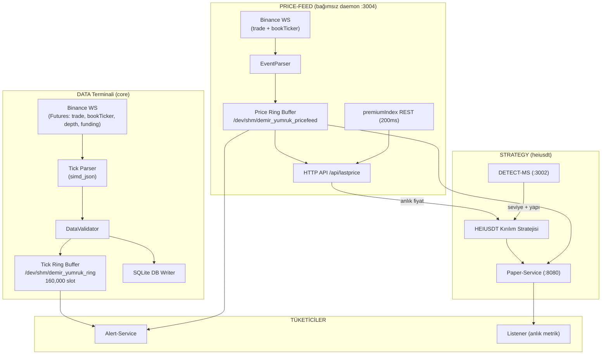

# 🏛️ Cycle Finance — Kurumsal HFT Sistemi

**Proje Türü:** Kurumsal Düzey Yüksek Frekanslı Kripto Ticaret (HFT) Motoru  
**Dil:** Rust (tamamen — Python bağımlılığı yok)  
**Hedef Borsa:** Binance (Futures & Spot)  
**Mimari:** Bare-Metal, Zero-Copy IPC, Multi-Terminal, Actor Model, Event Sourcing, WS + Ring Buffer veri akışı

---

## 📐 Genel Mimari

Sistem, bağımsız süreçler (terminaller/servisler) halinde çalışan bir **mikro-çekirdek mimarisi** kullanır. Veri akışı **Binance WebSocket → EventParser → GenerationalRingBuffer (`/dev/shm`)** üzerinden sağlanır; serileştirme veya kopyalama yoktur.



---

## 🧩 Modül Haritası (17 Crate)

| # | Crate | Rol | Önemli Dosyalar |
|---|-------|-----|-----------------|
| 1 | [core](./core) | Ana orkestratör — 5 terminal modu | `main.rs`, `engine/`, `cli/`, `memory/` |
| 2 | [adapter](./adapter) | Binance WS/REST bağdaştırıcısı | `src/binance.rs` |
| 3 | [os-utils](./os-utils) | Lock-free Ring Buffer (`/dev/shm`) | `src/lib.rs` |
| 4 | [ohlcv-engine](./ohlcv-engine) | OHLCV mum oluşturucu + Binance kline client | `src/lib.rs` |
| 5 | [execution-engine](./execution-engine) | Emir yönetimi + Paper Engine (Actor) | `src/paper/` |
| 6 | [paper-service](./paper-service) | Bağımsız Paper Trading REST servisi (:8080) | `src/api.rs`, `src/bridge.rs` |
| 7 | [risk-worker](./risk-worker) | Risk matrisi & FinOps optimizasyonu | `src/matrix.rs`, `src/finops.rs` |
| 8 | [cold-starter](./cold-starter) | Soğuk başlangıç (geçmiş kline verisi) | `src/lib.rs` |
| 9 | [cold-storage](./cold-storage) | SQLite işlem geçmişi | `src/lib.rs` |
| 10 | [detect-sr](./detect-sr) | Destek/Direnç + FVG algılama | `src/lib.rs` |
| 11 | [detect-trend](./detect-trend) | Trend algılama (EMA + ADX) | `src/lib.rs` |
| 12 | [detect-ms](./detect-ms) | MSMP 2.0 Piyasa Yapısı REST API (:3002) | `src/main.rs` |
| 13 | [detect-liquidity](./detect-liquidity) | Likidite havuzu tespiti | `src/lib.rs` |
| 14 | [detect-pattern](./detect-pattern) | Mum çubuğu patern algılama | `src/lib.rs` |
| 15 | [alert-service](./alert-service) | Sesli fiyat uyarı servisi | `src/engine.rs`, `src/audio.rs` |
| 16 | [price-feed](./price-feed) | Anlık last/mark/index price daemon (:3004) | `src/main.rs` |
| 17 | [heiusdt](./heiusdt) | HEIUSDT stratejisi + listener + alerts + risk_analysis | `src/main.rs`, `src/bin/` |

---

## 🖥️ Terminal Modları (`RUN_MODE` — `core` binary)

| Mod | Kullanım | Açıklama |
|-----|----------|----------|
| DATA | `RUN_MODE=DATA ./target/debug/core` | Canlı Binance WS → ring buffer + DB |
| STRATEGY | `RUN_MODE=STRATEGY ./target/debug/core` | HEIUSDT kırılım stratejisini spawn eder |
| BACKTEST | `RUN_MODE=BACKTEST CSV_PATH=... ./target/debug/core` | CSV üzerinden simülasyon |
| CORRELATION | `RUN_MODE=CORRELATION ./target/debug/core` | Korelasyon analizi |
| PAPER | `RUN_MODE=PAPER ./target/debug/core` | Paper CLI |

---

## 💹 Price Feed — Anlık Fiyat Merkezi (:3004)

Data merkezi; sistemde tanımlı tüm sembollerin **last / mark / index / bid / ask** fiyatlarını sağlar.

**Mimari** (DATA terminaliyle birebir aynı):
```
Binance WS (fstream) → EventParser → RingBuffer (/dev/shm/demir_yumruk_pricefeed)
                                     ├── last (trade) + bid/ask (bookTicker) → gecikmesiz WS
                                     └── mark/index (premiumIndex REST, 200ms) → pratikte gecikmesiz
```

**HTTP API:**
| Endpoint | Açıklama |
|----------|----------|
| `GET /api/lastprice` | Tüm semboller: `{last, mark, index, bid, ask}` |
| `GET /api/lastprice/{SYMBOL}` | Tek sembol (örn. `HEIUSDT`) |
| `GET /health` | Durum + anlık fiyatlar |

**Tüketiciler (gecikmesiz ring okuyucuları):**
- **Alert-Service** — price-feed ring'inden spin-loop ile okur (poll yok)
- **Paper-Service** — price-feed ring'inden fiyat beslemesi alır (index dahil)
- **HEIUSDT stratejisi** — anlık fiyatı price-feed'ten alır

Semboller `alerts.toml`'dan + HEIUSDT olarak otomatik toplanır; `PRICE_FEED_SYMBOLS` env ile override edilebilir.

---

## 📈 DETECT-MS — MSMP 2.0 Piyasa Yapısı Motoru (:3002)

7 katmanlı matematiksel analiz motoru (REST API):
1. **Session-Based Zaman Pencereleri** (Core/Amplified/Acute)
2. **Dinamik Pivot Çıkarımı** (ATR × 0.25, Tip A/B, Likidite Bölgeleri)
3. **Trend Yapısı** (Log-Regresyon, R², Hurst Üssü)
4. **Stratejik Seviye Envanteri** (Üssel Çürüme, BO Onayı)
5. **Likidite Pool** (VWAP, Volume Profile, BSL/SSL)
6. **Dengesizlik** (FVG + Cumulative Delta Doğrulaması)
7. **Bütünsel Naratif** (ATS, Vakum Bölgesi, Confluence Index)

**API:**
```
GET /api/ms?symbol=HEIUSDT&interval=1m&limit=100
```

Yanıt: `ats`, `trend_label`, `current_price`, `levels[]` (SH/SL + priority_score), `vwap`, `poc`, `hurts`, `r_squared`, `confluence_index`, `fvg_count` vb.

---

## 🎯 HEIUSDT Kırılım Stratejisi (`heiusdt`)

Rust'ta yazılmış; detect-ms seviye/yapı analizi + price-feed anlık fiyatını kullanır.

**Mantık:**
1. detect-ms'ten HEIUSDT 1m, 100 pencere analizi alır.
2. **ATS > 0** (yapı yukarı): en yüksek skorlu direnç (SH) seviyesi kırılırsa → **BUY**.
3. **ATS < 0** (yapı aşağı): en yüksek skorlu destek (SL) seviyesi kırılırsa → **SELL**.
4. Koşul sağlanırsa paper-service'e market emri açar (aynı sembolde pozisyon varsa açmaz).

**Bekleme süresi:** varsayılan 20 pencere (1m → 20 dk). `heiusdt-wait <saniye>` ile shell'den anlık değiştirilebilir (`/tmp/heiusdt_wait_sec.txt` — çalışan strateji bir sonraki döngüde uygular).

**Dayanıklılık:** detect-ms erişilemezse (connection refused) 10 sn'de bir yeniden dener; cycle yeniden başlatıldığında detect-ms otomatik başladığı için hata oluşmaz.

**Kullanım:**
```bash
./target/debug/heiusdt                     # sürekli döngü
./target/debug/heiusdt --once              # tek analiz
./target/debug/heiusdt --once --dry-run    # emirsiz simülasyon
```

---

## 🛰️ Listener — Anlık Metrik Analizi

> ⚠️ **Pozisyon izleyici DEĞİLDİR.** Data merkezinden (price-feed :3004) gelen verilerle sistemde tanımlı **her sembol** için anlık metrik hesaplar.

- Her 2 sn'de price-feed'ten tüm sembollerin `last/mark/index/bid/ask` verilerini çeker
- Tablo çizer + `/tmp/listener_metrics.json`'a yazar
- **Metrikler ŞU AN placeholder** (gerçek metrikler sonra eklenecek)

```bash
./target/debug/listener
```

---

## 🛡️ Paper Service (:8080)

Bağımsız paper trading servisi — Actor Model + Event Sourcing + REST API.

**REST API (JWT korumalı):**
| Endpoint | Açıklama |
|----------|----------|
| `POST /api/v1/auth/login` | Giriş → access/refresh token |
| `POST /api/v1/order` | Emir (Market/Limit) |
| `GET /api/v1/orders` | Açık emirler |
| `GET /api/v1/account/balance` | Bakiye + equity |
| `GET /api/v1/account/positions` | Açık pozisyonlar |
| `GET /api/v1/account/trade-history` | İşlem geçmişi |
| `GET /api/v1/risk/liquidation-price/{symbol}` | Likidasyon fiyatı |
| `GET /metrics` | Prometheus |

**Veri beslemesi:** DATA ring'i + price-feed ring'i (`/demir_yumruk_pricefeed`) — DATA kapalı olsa bile fiyat akışı devam eder.

---

## 🔔 Alert Service

Sesli fiyat uyarıları. Veri kaynağı `alerts.toml`'daki `data_source` ile seçilir:
- `pricefeed` (varsayılan) — price-feed ring'inden **gerçek zamanlı spin-loop**
- `ring` — DATA terminalinin ring'inden
- `binance` — doğrudan Binance WS

**Koşullar:** `above`, `below`, `cross`, `touch`. **Ses:** `spd-say -l tr` (Türkçe konuşma) veya Microsoft-neutral bildirim WAV'i (`paplay`).

**Alarm yönetimi (shell'den)** — `alerts` Rust aracı + otomatik reload:
```bash
alert-list                                          # alarmları listele
alert-add HEIUSDT above 0.22 "ses metni" 30         # ekle
alert-update HEIUSDT above 0.21628 0.22 "yeni ses"  # güncelle
alert-remove HEIUSDT above 0.21628                  # sil
```

---

## 💾 Veri Katmanı

### Paylaşımlı Hafıza (Zero-Copy IPC)

| Ring | Yol | Üretici | Tüketiciler |
|------|-----|---------|-------------|
| Tick | `/dev/shm/demir_yumruk_ring` | DATA (core) | alert, paper |
| Price | `/dev/shm/demir_yumruk_pricefeed` | price-feed | alert, paper, heiusdt |

- `push`: önce veri/len, **seq en son** yazılır (torn-read koruması)
- `read_slot`: çift doğrulama (kopyalama sırasında üretici slot'u ezerse atlanır)

### SQLite (market_data.db)

```sql
CREATE TABLE trades (
    id INTEGER PRIMARY KEY,
    symbol TEXT, side TEXT, entry_price REAL, exit_price REAL,
    qty REAL, pnl REAL, commission REAL, timestamp INTEGER
);
CREATE TABLE funding_rates (
    id INTEGER PRIMARY KEY AUTOINCREMENT,
    symbol TEXT NOT NULL, mark_price REAL NOT NULL,
    index_price REAL NOT NULL DEFAULT 0, funding_rate REAL NOT NULL,
    next_funding_time INTEGER NOT NULL
);
```

### Sled WAL (paper-service)
- Event sourcing; her `DomainEvent` sıralı yazılır, restart'ta otomatik replay

---

## ⚙️ Risk Yönetimi

### TitaniumOrchestrator
- Çoklu strateji (`Vec<Box<dyn Strategy>>`), `catch_unwind` panic koruması
- 1ms timer callback, spin-loop

### Risk Durumları (PaperEngine)
`Ok` · `MaxDrawdownBreached` · `MaxDailyLossBreached` · `MaxLeverageBreached`

### Risk Worker
`matrix.rs` (Tikhonov + Dinamik VWAP) · `finops.rs` (bulut maliyeti) · `cache.rs`

---

## 🖥️ Operasyon — tmux Başlatıcı (`cycle_tmux.sh`)

Tüm sistem tek komutla başlar (`cycle` session):

```
Pencere 0 — Trading (6 panel):
  ┌──────────────┬──────────────┐
  │ 📡 DATA      │ 🛡️ PAPER      │
  ├──────────────┼──────────────┤
  │ 🧠 STRATEGY  │ 🔔 ALERT      │
  ├──────────────┴──────────────┤
  │ 🛰️ LISTENER                 │
  ├─────────────────────────────┤
  │ 💻 SHELL                    │
  └─────────────────────────────┘
Pencere 1 — Monitor (CPU/RAM izleme)
Pencere 2 — DETECT-MS (:3002)
Pencere 3 — HEIUSDT stratejisi
```

```bash
./scripts/cycle_tmux.sh          # derle + başlat + bağlan
./scripts/cycle_tmux.sh kill     # temizle
./scripts/cycle_tmux.sh status   # servis CPU/RAM
./scripts/cycle_tmux.sh attach   # bağlan
```

**Shell paneli komutları** (`source scripts/cycle_env.sh`):
- `cycle-start|kill|status|build`
- `data-start|stop`, `strategy-start|stop`, `paper-start|stop`, `alert-start|stop`
- `listener-start|stop|status`, `pricefeed-start|stop|query`
- `detect-ms-start|stop|query`, `heiusdt-start|stop|query|wait`
- `alert-add|update|remove|list`, `paper-buy|sell|balance|positions|health`
- `heiusdt-wait <saniye>` — strateji bekleme süresi
- `monitor-start`, `db-trades`, `db-size`, `help-cycle`

---

## 📦 Kurulum (`install.sh`)

```bash
./install.sh                # derle + ~/.cycle dizinine kur (17 binary)
./install.sh --prefix /opt  # özel dizin
./install.sh --only-build   # sadece derle
./install.sh --package      # .tar.gz paketi
./install.sh --uninstall    # kaldır

# Kurulan paket
~/.cycle/bin/cycle start|stop|status
source ~/.cycle/cycle-env.sh
```

**Önkoşullar:** `cargo`, `rustc`, `tmux`, `curl`, `jq` (Python **gerekmez** — sistem tamamen Rust).
Ses için: `speech-dispatcher` + `pulseaudio-utils`.

---

## 🗂️ Proje Yapısı

```
PROJE/
├── core/                    # Ana orkestratör (5 terminal modu)
├── adapter/                 # Binance WS/REST bağdaştırıcısı
├── execution-engine/        # Emir motoru + PaperEngineActor
├── paper-service/           # Paper Trading REST servisi (:8080)
├── alert-service/           # Sesli uyarı servisi
├── price-feed/              # Anlık fiyat daemon (:3004)
├── heiusdt/                 # HEIUSDT stratejisi + listener + alerts + risk_analysis
├── detect-ms/               # MSMP 2.0 analiz API (:3002)
├── detect-sr/ detect-trend/ detect-liquidity/ detect-pattern/  # Algılayıcılar
├── ohlcv-engine/            # OHLCV + Binance kline client
├── risk-worker/             # Risk matrisi & FinOps
├── cold-starter/ cold-storage/ os-utils/
├── formal_verification/     # Kani Model Checker
├── scripts/                 # cycle_tmux.sh, cycle_env.sh, monitor.sh, ...
├── k8s/                     # Kubernetes + Chaos senaryoları
├── config/                  # config_v5/v6.toml
├── docs/                    # Teknik dokümantasyon
├── install.sh               # Kurulum paketi
├── alerts.toml              # Alert yapılandırması
└── Cargo.toml               # Workspace (17 crate)
```

---

## 🔒 Formel Doğrulama (Kani)

| Bileşen | Kanıtlanan Özellik |
|---------|--------------------|
| Ring Buffer | `head % slot_count` sınırlar içinde; veri kapasiteyi aşmaz |
| Risk Engine | Bakiye negatife düşmez; drawdown %0–100; kaldıraç limiti |
| Tick Validator | Fiyat/miktar/zaman doğrulaması |

---

## 🧪 Test ve Benchmark

- **Birim testleri:** `core/tests/`, `adapter/tests/`
- **Benchmark:** `core/benches/` — ring buffer + tick parse throughput
- **Risk analizi:** `./target/debug/risk_analysis` (market_data.db)
- **GDPR:** `scripts/gdpr_erasure_test.sh`

---

## 📚 Dokümantasyon

| Dosya | İçerik |
|-------|--------|
| [complete_system_documentation.md](./docs/complete_system_documentation.md) | Tüm sistem mimarisi |
| [bare_metal_plan.md](./docs/bare_metal_plan.md) | Düşük gecikme yol haritası |
| [ring_buffer_schema.md](./docs/ring_buffer_schema.md) | Ring buffer hafıza düzeni |
| [tick_parser_schema.md](./docs/tick_parser_schema.md) | Tick ayrıştırma |
| [db_schema.md](./docs/db_schema.md) | Veritabanı şeması |
