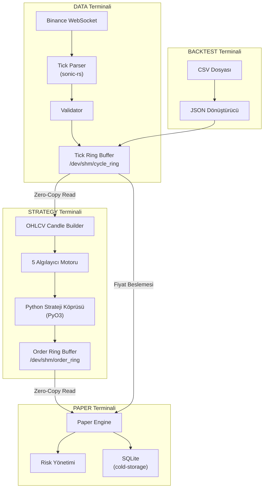
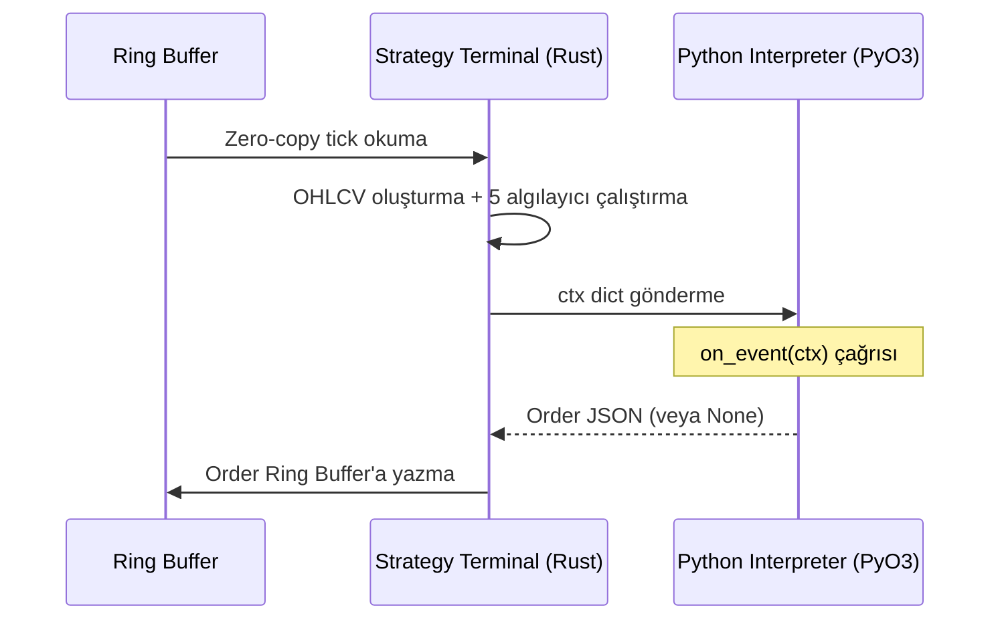

# 🏛️ Cycle Finance v3.0 — Tam Sistem Analizi

**Proje Türü:** Kurumsal Düzey Yüksek Frekanslı Kripto Ticaret (HFT) Motoru  
**Dil:** Rust (çekirdek) + Python (strateji katmanı)  
**Hedef Borsa:** Binance  
**Mimari:** Bare-Metal, Zero-Copy IPC, Multi-Terminal

---

## 📐 Genel Mimari

Sistem, bağımsız terminaller (süreçler) halinde çalışan bir **mikro-çekirdek mimarisi** kullanır. Terminaller arasındaki iletişim `/dev/shm` üzerinde memory-mapped, lock-free **Generational Ring Buffer** ile sağlanır — serileştirme veya kopyalama yoktur.



---

## 🧩 Modül Haritası (14 Crate)

| # | Modül | Rol | Satır* |
|---|-------|-----|--------|
| 1 | [core](./core) | Ana orkestratör — 4 terminal modu | ~500+ |
| 2 | [adapter](./adapter) | Binance WS/REST bağdaştırıcısı | ~300 |
| 3 | [os-utils](./os-utils) | Lock-free Ring Buffer (`/dev/shm`) | ~200 |
| 4 | [ohlcv-engine](./ohlcv-engine) | Gerçek zamanlı OHLCV mum oluşturucu | ~80 |
| 5 | [execution-engine](./execution-engine) | Borsa emir yönetimi (HMAC-SHA256) | ~200 |
| 6 | [risk-worker](./risk-worker) | Paper Trading + Risk yönetimi | ~250 |
| 7 | [cold-starter](./cold-starter) | Soğuk başlangıç (geçmiş kline verisi) | ~50 |
| 8 | [cold-storage](./cold-storage) | SQLite işlem geçmişi | ~80 |
| 9 | [detect-sr](./detect-sr) | Destek/Direnç + FVG algılama | 128 |
| 10 | [detect-trend](./detect-trend) | Trend algılama (EMA + ADX) | 107 |
| 11 | [detect-ms](./detect-ms) | Piyasa Yapısı (BOS/CHoCH) | 117 |
| 12 | [detect-liquidity](./detect-liquidity) | Likidite havuzu tespiti | 93 |
| 13 | [detect-pattern](./detect-pattern) | Mum çubuğu patern algılama | 78 |
| 14 | [formal_verification](./formal_verification) | Kani ile formel doğrulama | ~150 |

---

## 🖥️ Terminal Modları (RUN_MODE)

### 1. DATA Terminali (`RUN_MODE=DATA`)

> Canlı piyasa verisini çeken ana motor.

- **Binance WebSocket** bağlantısı (`btcusdt@trade` stream)
- **sonic-rs** ile ultra-hızlı JSON ayrıştırma → `Tick { price, qty, timestamp, is_buyer_maker }`
- **Tick doğrulama:** Fiyat > 0, Miktar > 0, Zaman damgası ± 60 saniye
- Ring buffer'a yazma: 64 slot × 4096 byte = **256 KB** paylaşımlı hafıza

**CLI Komutları:** `status`, `quit`

---

### 2. STRATEGY Terminali (`RUN_MODE=STRATEGY`)

> Sistemin beyni — veri tüketimi, analiz ve strateji çalıştırma.

**Veri İşleme Pipeline'ı:**

1. Ring buffer'dan tick okuma (zero-copy)
2. `CandleBuilder` ile 1 dakikalık OHLCV mumları oluşturma
3. ≥42 mum biriktiğinde **5 algılayıcıyı** paralel çalıştırma
4. Tüm sonuçları Python `ctx` sözlüğüne paketleme
5. `on_event(ctx)` ile Python stratejisine gönderme
6. Dönen emirleri Order Ring Buffer'a yazma

**CLI Komutları:** `status`, `candles`, `detectors`, `quit`

---

### 3. PAPER Terminali (`RUN_MODE=PAPER`)

> Simüle edilmiş ticaret ve risk yönetimi.

- Order ring buffer'dan emir okuma
- Tick ring buffer'dan canlı fiyat beslemesi (unrealized PnL hesabı)
- **PaperEngine** ile tam portföy yönetimi

**Risk Parametreleri (varsayılan):**

| Parametre | Değer |
|-----------|-------|
| Başlangıç bakiyesi | 10,000 USDT |
| Maks. pozisyon büyüklüğü | 10.0 |
| Maks. drawdown | %5.0 |
| Maks. günlük kayıp | 1,000 USDT |
| Maks. kaldıraç | 20x |
| Komisyon oranı | %0.04 (4 bps) |

**Risk Durumları:** `Ok`, `MaxDrawdownBreached`, `MaxDailyLossBreached`, `MaxLeverageBreached`

**CLI Komutları:** `status`/`balance`, `positions`, `risk`, `history`, `quit`

---

### 4. BACKTEST Terminali (`RUN_MODE=BACKTEST`)

> Geriye dönük simülasyon motoru.

- CSV dosyasından (`timestamp, price, qty`) okuma
- JSON'a dönüştürüp ring buffer'a yazma (10ms aralıkla)
- Strategy terminali verinin kaynağını bilmez — **%100 aynı kod çalışır**

---

## 🔍 Algılayıcı (Detector) Motoru — 5 Modül

### 1. Destek/Direnç Algılama (`detect-sr`)

| Özellik | Detay |
|---------|-------|
| **Pivot S/R** | Kayan pencere ile yerel en yüksek/düşük noktalar |
| **Fair Value Gap (FVG)** | 3 mumlu dengesizlik tespiti (Bullish/Bearish) |
| **Filtreleme** | %0.05 eşik ile benzer seviyeleri birleştirme |

**Çıktı:** `Vec<SrLevel>` + `Vec<Fvg>`

---

### 2. Trend Algılama (`detect-trend`)

| Gösterge | Parametre |
|----------|-----------|
| **Hızlı EMA** | Periyot: 9 |
| **Yavaş EMA** | Periyot: 21 |
| **ADX** | Periyot: 14, Eşik: 25.0 |

**Karar Mantığı:**
- `Bullish` → fast_ema > slow_ema VE adx ≥ 25
- `Bearish` → fast_ema < slow_ema VE adx ≥ 25
- `Sideways` → diğer tüm durumlar

---

### 3. Piyasa Yapısı Algılama (`detect-ms`)

- **Break of Structure (BOS):** Mevcut trendin yönünde kırılma
- **Change of Character (CHoCH):** Trend yönüne karşı kırılma (dönüş sinyali)
- **Order Block:** BOS öncesindeki son ters yönlü mum

**Çıktı:** `(Vec<MsBreak>, Vec<OrderBlock>)`

---

### 4. Likidite Algılama (`detect-liquidity`)

- **Eşit Yüksekler/Düşükler:** %0.02 toleransta eşleşen fiyat seviyeleri
- **Swing Likidite:** Swing high/low noktalarındaki likidite havuzları
- **Sonuç birleştirme:** %0.05 eşik ile deduplikasyon

**Çıktı:** `Vec<LiquidityPool>` (BuySide / SellSide)

---

### 5. Mum Çubuğu Patern Algılama (`detect-pattern`)

| Patern | Koşul |
|--------|-------|
| **Bullish Engulfing** | Gövde önceki mumu tamamen yutuyor (yükseliş) |
| **Bearish Engulfing** | Gövde önceki mumu tamamen yutuyor (düşüş) |
| **Bullish Pin Bar** | Alt fitil ≥ 2× gövde, üst fitil ≤ 0.5× gövde |
| **Bearish Pin Bar** | Üst fitil ≥ 2× gövde, alt fitil ≤ 0.5× gövde |
| **Inside Bar** | Mum tamamen önceki mumun içinde |

---

## 🐍 Python Strateji Köprüsü (PyO3)



**Python'a gönderilen `ctx` sözlüğü:**

```python
{
    "price": 50000.0,
    "qty": 0.1,
    "timestamp": 1691234567890,
    "trend": {"direction": "Bullish", "adx": 32.5, "fast_ema": 50100.0, "slow_ema": 49800.0},
    "sr_levels": [...],
    "fvgs": [...],
    "ms_breaks": [...],
    "order_blocks": [...],
    "liquidity_pools": [...],
    "patterns": [...]
}
```

**Örnek Strateji** ([test_strategy.py](./strategies/test_strategy.py)):
- Bullish trend + BullishEngulfing → **BUY** emri
- Bearish trend + BearishEngulfing → **SELL** emri

---

## 🔒 Güvenlik ve Doğrulama

### Formel Doğrulama (Kani Model Checker)

**Matematiksel olarak kanıtlanan özellikler:**

| Bileşen | Kanıtlanan Özellik |
|---------|---------------------|
| Ring Buffer | `head % slot_count` her zaman sınırlar içinde |
| Ring Buffer | Veri uzunluğu slot kapasitesini asla aşmaz |
| Ring Buffer | Generation counter sıfıra asla dönmez |
| Risk Engine | Bakiye asla negatife düşmez |
| Risk Engine | Drawdown %0–100 aralığında kalır |
| Risk Engine | Pozisyon büyüklüğü limitlere uyar |
| Risk Engine | Komisyon her zaman ≥ 0 |
| Risk Engine | Kaldıraç maksimumu asla aşmaz |
| Tick Validator | Fiyat/miktar/zaman doğrulaması matematiksel olarak sağlam |

---

## 💾 Veri Katmanı

### Paylaşımlı Hafıza (Zero-Copy IPC)

| Ring Buffer | Yol | Boyut | Amaç |
|------------|------|-------|------|
| Tick Ring | `/dev/shm/cycle_ring` | 64 × 4096 = 256 KB | Piyasa verisi |
| Order Ring | `/dev/shm/order_ring` | 16 × 4096 = 64 KB | Emirler |

**Slot yapısı:** `[8 byte generation] [4 byte data_len] [data bytes...]`

### SQLite Veritabanı (cold-storage)

```sql
CREATE TABLE trades (
    id INTEGER PRIMARY KEY,
    symbol TEXT,
    side TEXT,
    entry_price REAL,
    exit_price REAL,
    qty REAL,
    pnl REAL,
    commission REAL,
    timestamp INTEGER
);
```

---

## 🚀 Emir Yürütme Motoru

- **Desteklenen Emir Türleri:** `Market`, `Limit`, `StopMarket`
- **Süre Politikaları:** `GTC` (Good-Til-Cancel), `IOC` (Immediate-or-Cancel), `FOK` (Fill-or-Kill)
- **Kimlik Doğrulama:** HMAC-SHA256 imzalama (Binance API)
- **İşlemler:** Emir gönderme, iptal etme, açık emirleri listeleme

---

## ⚙️ Operasyon ve Dağıtım

### Soğuk Başlangıç (`cold-starter`)
- Sistem açılışında Binance REST API'den geçmiş kline verisi çeker
- Algılayıcıların yeterli mum verisine (≥42) hemen sahip olmasını sağlar

### Kubernetes Dağıtımı (`k8s/`)

| Terminal | Bellek | CPU | Özellik |
|----------|--------|-----|---------|
| DATA | 256 Mi | 500m | `/dev/shm` emptyDir mount |
| STRATEGY | 512 Mi | 1 | `/dev/shm` emptyDir mount |
| PAPER | 256 Mi | 500m | `/dev/shm` emptyDir mount |

### Başlatma Scripti (`scripts/start_all.sh`)
- 3 terminali paralel olarak arka planda başlatır
- SIGINT/SIGTERM ile tüm süreçleri temiz şekilde sonlandırır

---

## 🛠️ Nasıl Derlenir ve Çalıştırılır?

### Önkoşullar (Ubuntu/Debian)
```bash
sudo apt-get update
sudo apt-get install python3.14-dev
```

### Derleme ve Başlatma
```bash
# 1. Veri Okuma Modu (Canlı Piyasa veya Backtest'ten sadece biri çalıştırılmalı)
# Canlı Piyasa:
RUN_MODE=DATA cargo run --release -p core
# VEYA Simülasyon:
RUN_MODE=BACKTEST CSV_PATH="./test_data.csv" cargo run --release -p core

# 2. Risk ve Portföy Yöneticisi (Paper Trading Terminali)
RUN_MODE=PAPER cargo run --release -p core

# 3. Python Strateji Motoru (Strategy Terminali)
RUN_MODE=STRATEGY cargo run --release -p core
```

---

## 📊 Konfigürasyon ([config_v6.toml](./config/config_v6.toml))

```toml
[exchange]
name = "binance"
ws_url = "wss://stream.binance.com:9443/ws"
stream = "btcusdt@trade"

[risk]
max_drawdown_pct = 5.0
max_daily_loss = 1000.0
max_leverage = 20.0
commission_rate = 0.0004
```

---

## 🧪 Test ve Benchmark

- **Birim testleri:** `core/tests/` dizini
- **Benchmark:** `core/benches/ring_bench.rs` — Ring buffer yazma throughput testi (4096 byte mesajlar)
- **Test verileri:** [test_data.csv](./test_data.csv) — Backtest simülasyonu için
- **WebSocket testi:** [test_ws.py](./test_ws.py), [test_depth.py](./test_depth.py)

---

## 📚 Dokümantasyon

| Dosya | İçerik |
|-------|--------|
| [complete_system_documentation.md](./docs/complete_system_documentation.md) | 30 KB — Tüm sistem mimarisi |
| [code_reference.md](./docs/code_reference.md) | API referansı |
| [ring_buffer_schema.md](./docs/ring_buffer_schema.md) | Ring buffer hafıza düzeni |
| [adapter_schema.md](./docs/adapter_schema.md) | Borsa bağdaştırıcı API |
| [execution_schema.md](./docs/execution_schema.md) | Emir yürütme API |
| [tick_parser_schema.md](./docs/tick_parser_schema.md) | Tick ayrıştırma |
| [validator_schema.md](./docs/validator_schema.md) | Doğrulama kuralları |
| [db_schema.md](./docs/db_schema.md) | Veritabanı şeması |
