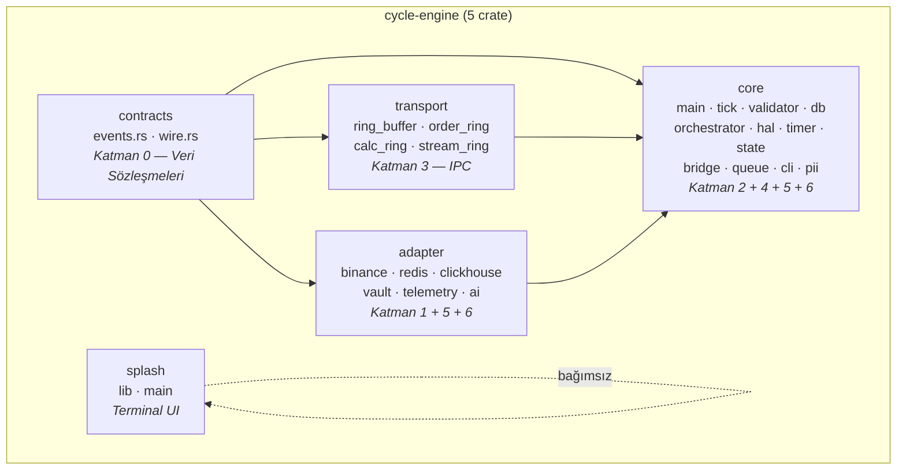
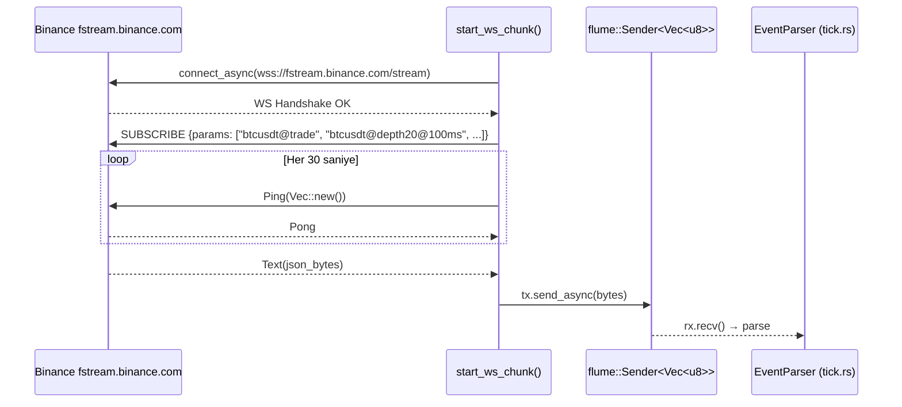
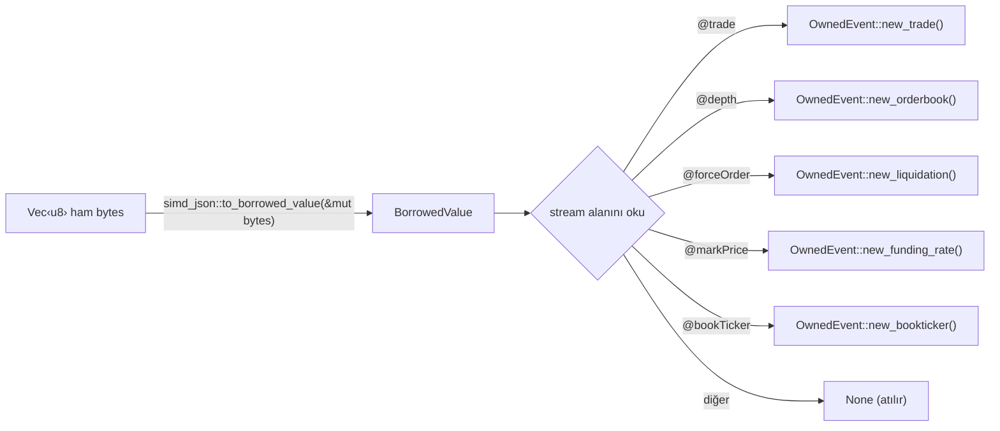
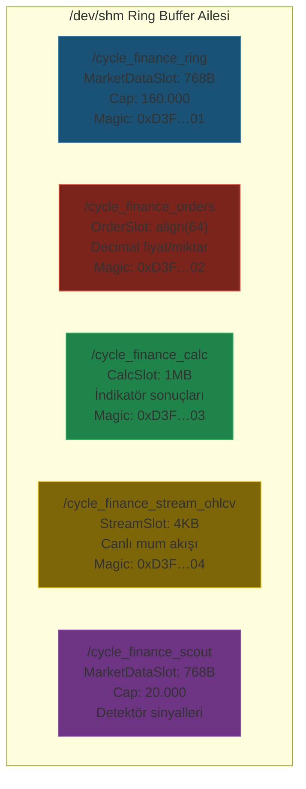
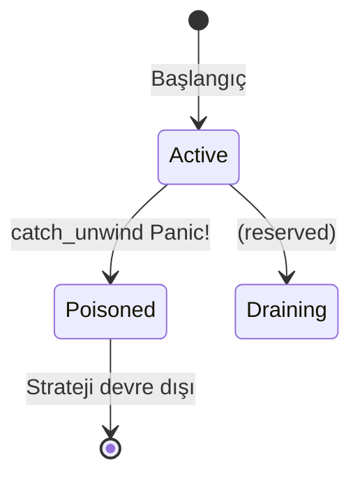
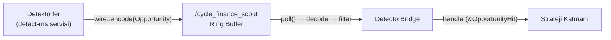
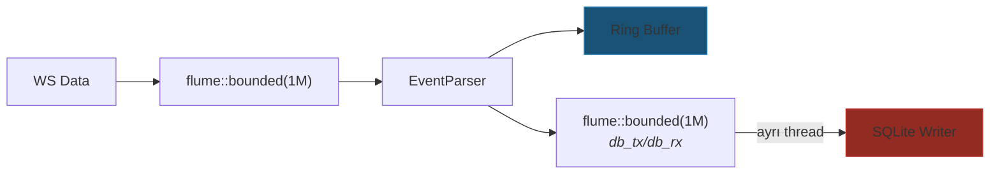
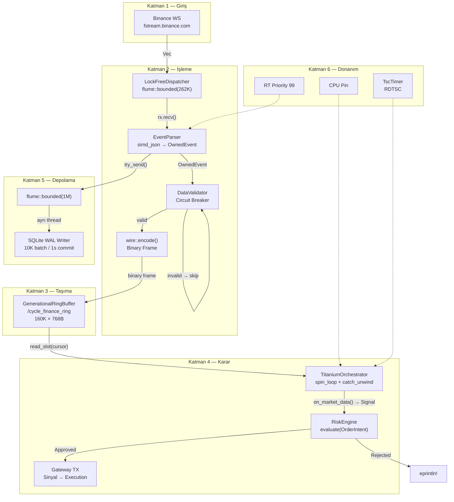

# 🏛️ Cycle-Engine — 6 Katmanlı Mimari ve Geliştirme Planı

> [!NOTE]
> **Güncelleme (2026-08-11):** Bu belge, yeniden yapılandırma **öncesi** yapıyı (`contracts`, `adapter`, `core`, `transport`) anlatan tarihî bir plan dokümanıdır. Güncel mimari için **cycle_engine_architecture.md** ve **cycle_engine_processes.md**'ye bakınız. Son değişiklikler: `flows` crate'i (8 bağımsız veri akışı süreci), `gateway::rate_gate` (prosesler arası API rate kapısı), SQLite → TimescaleDB geçişi.

> **Kapsam**: Yalnızca `cycle-engine/` alt dizini — 5 crate, 37 kaynak dosyası, ~80.000 satır derlenmiş kod.
> **Kural**: Hiçbir mevcut dosya değiştirilmeyecek. Bu plan salt-okunur analiz ve doğrulamadır.

---

## Crate Haritası ve Bağımlılık Grafiği



| Katman | Crate(ler) | Temel Dosyalar |
|--------|-----------|----------------|
| **1 — Giriş & Borsa** | `adapter` | [binance.rs](file:///home/smhvz/Desktop/PROJE/cycle-engine/adapter/src/binance.rs) |
| **2 — Veri İşleme** | `core`, `contracts` | [tick.rs](file:///home/smhvz/Desktop/PROJE/cycle-engine/core/src/tick.rs), [validator.rs](file:///home/smhvz/Desktop/PROJE/cycle-engine/core/src/validator.rs), [wire.rs](file:///home/smhvz/Desktop/PROJE/cycle-engine/contracts/src/wire.rs) |
| **3 — Taşıma & IPC** | `contracts`, `transport` | [events.rs](file:///home/smhvz/Desktop/PROJE/cycle-engine/contracts/src/events.rs), [ring_buffer.rs](file:///home/smhvz/Desktop/PROJE/cycle-engine/transport/src/ring_buffer.rs), [order_ring.rs](file:///home/smhvz/Desktop/PROJE/cycle-engine/transport/src/order_ring.rs), [calc_ring.rs](file:///home/smhvz/Desktop/PROJE/cycle-engine/transport/src/calc_ring.rs), [stream_ring.rs](file:///home/smhvz/Desktop/PROJE/cycle-engine/transport/src/stream_ring.rs) |
| **4 — Karar & İcra** | `core` | [orchestrator.rs](file:///home/smhvz/Desktop/PROJE/cycle-engine/core/src/engine/orchestrator.rs), [state.rs](file:///home/smhvz/Desktop/PROJE/cycle-engine/core/src/state.rs), [queue.rs](file:///home/smhvz/Desktop/PROJE/cycle-engine/core/src/queue.rs), [detector_bridge.rs](file:///home/smhvz/Desktop/PROJE/cycle-engine/core/src/bridge/detector_bridge.rs) |
| **5 — Depolama** | `core`, `adapter` | [db.rs](file:///home/smhvz/Desktop/PROJE/cycle-engine/core/src/db.rs), [clickhouse.rs](file:///home/smhvz/Desktop/PROJE/cycle-engine/adapter/src/clickhouse.rs) |
| **6 — Donanım & Güvenlik** | `core`, `adapter` | [cpu.rs](file:///home/smhvz/Desktop/PROJE/cycle-engine/core/src/hal/cpu.rs), [memory.rs](file:///home/smhvz/Desktop/PROJE/cycle-engine/core/src/hal/memory.rs), [tsc.rs](file:///home/smhvz/Desktop/PROJE/cycle-engine/core/src/timer/tsc.rs), [pii.rs](file:///home/smhvz/Desktop/PROJE/cycle-engine/core/src/pii.rs), [vault.rs](file:///home/smhvz/Desktop/PROJE/cycle-engine/adapter/src/vault.rs), [telemetry.rs](file:///home/smhvz/Desktop/PROJE/cycle-engine/adapter/src/telemetry.rs), [redis.rs](file:///home/smhvz/Desktop/PROJE/cycle-engine/adapter/src/redis.rs) |

---

## Katman 1 — Giriş & Borsa Bağlantıları

### 1.1 Binance Futures WebSocket İstemcisi

**Dosya**: [binance.rs](file:///home/smhvz/Desktop/PROJE/cycle-engine/adapter/src/binance.rs) (136 satır)

#### Mimari Detay



#### Abone Olunan Akışlar

| Sembol | Trade Stream | Depth Stream |
|--------|-------------|-------------|
| BTCUSDT | `btcusdt@trade` | `btcusdt@depth20@100ms` |
| ETHUSDT | `ethusdt@trade` | `ethusdt@depth20@100ms` |
| SOLUSDT | `solusdt@trade` | `solusdt@depth20@100ms` |
| HEIUSDT | `heiusdt@trade` | `heiusdt@depth20@100ms` |

> **Toplam**: 8 stream, tek WS bağlantısı (200 stream chunk limiti aşılmıyor).

#### Bağlantı Güvenliği Mekanizmaları

| Mekanizma | Uygulama | Dosya Referansı |
|-----------|---------|-----------------|
| **Exponential Backoff** | `BASE=1s`, her kopuşta `×2`, `MAX=60s`. Başarılı bağlantıda sıfırlanır. | [binance.rs:8-9](file:///home/smhvz/Desktop/PROJE/cycle-engine/adapter/src/binance.rs#L8-L9), [L32-38](file:///home/smhvz/Desktop/PROJE/cycle-engine/adapter/src/binance.rs#L32-L38), [L104-106](file:///home/smhvz/Desktop/PROJE/cycle-engine/adapter/src/binance.rs#L104-L106) |
| **WS Keep-Alive** | 30 saniyelik `tokio::time::interval` ile `Ping(Vec::new())`. Başarısız Ping → reconnect. | [binance.rs:55-64](file:///home/smhvz/Desktop/PROJE/cycle-engine/adapter/src/binance.rs#L55-L64) |
| **WAF Koruması** | Chunk'lar arası 600ms gecikme (`tokio::time::sleep`). | [binance.rs:125](file:///home/smhvz/Desktop/PROJE/cycle-engine/adapter/src/binance.rs#L125) |
| **Geri Basınç** | `flume::bounded` kuyruk — dolduğunda `send_async` bloke eder (RAM taşması imkânsız). | [binance.rs:74](file:///home/smhvz/Desktop/PROJE/cycle-engine/adapter/src/binance.rs#L74) |
| **Graceful Close** | `message.is_close()` → `break` ile temiz reconnect döngüsü. | [binance.rs:78-81](file:///home/smhvz/Desktop/PROJE/cycle-engine/adapter/src/binance.rs#L78-L81) |

#### Çoklu Borsa Soyutlaması Değerlendirmesi

Mevcut mimari borsa-spesifiktir ancak soyutlamaya **hazırdır**:
- `fetch_usdt_spot_pairs()` → trait method olabilir
- `start_ws_chunk()` → borsadan bağımsız `WsConsumer` trait'i ile genelleştirilebilir
- Ortak çıktı: `flume::Sender<Vec<u8>>` — tüm adaptörler aynı kuyruğa yazar

> [!NOTE]
> Şu an tek `Sender<Vec<u8>>` çıkışı trait-tabanlı `ExchangeAdapter` soyutlamasına doğal geçiş sağlar. Yeni borsa eklemek için sadece `start_*_ws_client(tx)` fonksiyonu yazmak yeterlidir.

---

## Katman 2 — Veri İşleme, Ayrıştırma ve Doğrulama

### 2.1 EventParser — Sıfır-Kopya simd-json Ayrıştırıcı

**Dosya**: [tick.rs](file:///home/smhvz/Desktop/PROJE/cycle-engine/core/src/tick.rs) (88 satır)

#### Ayrıştırma Akışı



#### Desteklenen Olay Tipleri

| Stream Deseni | `EventType` Varyantı | Ayrıştırılan Alanlar |
|--------------|---------------------|---------------------|
| `*@trade` | `Trade` | `s`, `p` (Decimal), `q` (Decimal), `T` (u64), `m` (bool) |
| `*@depth*` | `Orderbook` | `bids`/`b` + `asks`/`a` → `[(Decimal,Decimal); 20]` |
| `*@forceOrder` | `Liquidation` | `o.s`, `o.S`, `o.p`, `o.q`, `o.T` |
| `*@markPrice` | `FundingRate` | `s`, `p`, `i`, `r`, `T` |
| `*@bookTicker` | `BookTicker` | `s`, `b`, `B`, `a`, `A` |

> [!IMPORTANT]
> **Sıfır-Kopya Kısıtı**: `simd_json::to_borrowed_value()` gelen `&mut [u8]` buffer'ı **yerinde mutasyona uğratır** (ayırıcıları `\0` yapar). Bu nedenle buffer parse sonrası kullanılamaz — ring'e artık `wire::encode()` ile typed binary frame yazılır. Bu, [main.rs:40-42](file:///home/smhvz/Desktop/PROJE/cycle-engine/core/src/main.rs#L40-L42) satırlarındaki yorumla belgelenmiştir.

#### Performans Karakteristikleri

- **`#[inline(always)]`** ile parse fonksiyonu derleyici tarafından satır-içi açılır
- `Decimal::from_str()` ile kayıpsız dönüşüm (f64 yuvarlama hatası yok)
- Spot ve Futures derinlik alanları için aynı anda iki key kontrol edilir: `"bids"/"asks"` || `"b"/"a"` → [tick.rs:36-47](file:///home/smhvz/Desktop/PROJE/cycle-engine/core/src/tick.rs#L36-L47)

### 2.2 DataValidator — Devre Kesici (Circuit Breaker)

**Dosya**: [validator.rs](file:///home/smhvz/Desktop/PROJE/cycle-engine/core/src/validator.rs) (94 satır)

#### Doğrulama Kuralları Matrisi

| Olay Tipi | Kural | Eşik Değeri | Satır |
|-----------|------|-------------|-------|
| **Trade** | `price ≤ 0 ∨ quantity ≤ 0` | Anında red | [L42-43](file:///home/smhvz/Desktop/PROJE/cycle-engine/core/src/validator.rs#L42-L43) |
| **Trade** | `now - timestamp > max_latency_ms` | 200ms | [L45-46](file:///home/smhvz/Desktop/PROJE/cycle-engine/core/src/validator.rs#L45-L46) |
| **Trade** | `timestamp - now > 5000` (gelecek zaman damgası) | 5 saniye NTP drift | [L48-49](file:///home/smhvz/Desktop/PROJE/cycle-engine/core/src/validator.rs#L48-L49) |
| **Orderbook** | `bids[0].price >= asks[0].price` | Crossed Book | [L53-56](file:///home/smhvz/Desktop/PROJE/cycle-engine/core/src/validator.rs#L53-L56) |
| **Liquidation** | `price ≤ 0 ∨ quantity ≤ 0` | Anında red | [L60-61](file:///home/smhvz/Desktop/PROJE/cycle-engine/core/src/validator.rs#L60-L61) |
| **Liquidation** | `now - timestamp > max_latency_ms` | 200ms stale | [L63-64](file:///home/smhvz/Desktop/PROJE/cycle-engine/core/src/validator.rs#L63-L64) |
| **BookTicker** | `best_bid_price >= best_ask_price` | Crossed | [L68-71](file:///home/smhvz/Desktop/PROJE/cycle-engine/core/src/validator.rs#L68-L71) |

#### Devre Kesici (Circuit Breaker) Mekanizması

```
 1 saniye pencere
┌───────────────────────────────────────────────┐
│  bad_tick_count++ (AtomicUsize)                │
│                                                │
│  count > 100 → circuit_breaker = true          │
│  "⚠️ CIRCUIT BREAKER TRIGGERED! Trading Paused"│
│                                                │
│  Pencere sıfırlanınca (1 sn geçince):          │
│  bad_tick_count = 0                            │
│  circuit_breaker false → "RECOVERED"           │
└───────────────────────────────────────────────┘
```

- **Atomik durum**: `Arc<AtomicBool>` (circuit_breaker) + `Arc<AtomicUsize>` (bad_tick_count)
- **Sıfırlama periyodu**: 1000ms → [validator.rs:29](file:///home/smhvz/Desktop/PROJE/cycle-engine/core/src/validator.rs#L29)
- **Eşik**: 100 hatalı tick/sn → [validator.rs:85](file:///home/smhvz/Desktop/PROJE/cycle-engine/core/src/validator.rs#L85)
- **Kurtarma**: Hata sayısı düşünce otomatik devre açılır → [validator.rs:34-37](file:///home/smhvz/Desktop/PROJE/cycle-engine/core/src/validator.rs#L34-L37)

### 2.3 Compact Binary Frame Codec

**Dosya**: [wire.rs](file:///home/smhvz/Desktop/PROJE/cycle-engine/contracts/src/wire.rs) (360 satır)

#### Frame Format Spesifikasyonu

```
┌──────┬────────────┬──────────────────────┐
│ [0]  │ [1..17]    │ [17..]               │
│ TAG  │ symbol     │ per-tag alanlar       │
│ u8   │ [u8; 16]   │ mantissa(i64)+scale(u8)│
└──────┴────────────┴──────────────────────┘
```

| TAG | Olay | Frame Boyutu | JSON Eşdeğeri |
|-----|------|-------------|---------------|
| 0 | Trade | 44 B | ~150 B |
| 1 | Depth20 | 659 B | ~1100 B |
| 2 | Funding | 52 B | ~200 B |
| 3 | BookTicker | 53 B | ~180 B |
| 4 | Liquidation | 44 B | ~150 B |
| 5 | OpenInterest | 34 B | ~120 B |
| 6 | Opportunity | 72 B | ~350 B |
| 7 | SymbolMetrics | 71 B | ~320 B |

> **Sıkıştırma Oranı**: Trade frame'i JSON'a göre **%70 küçük**, Depth20 **%40 küçük**.

#### Ondalık Kodlama Yöntemi (mantissa + scale)

```rust
// wire.rs:70-76 — encode
fn write_decimal(buf: &mut [u8], off: usize, d: Decimal) -> Option<usize> {
    let m = i64::try_from(d.mantissa()).ok()?;  // Taşma → None
    put_i64(buf, off, m);          // 8 byte little-endian
    put_u8(buf, off + 8, d.scale() as u8);  // 1 byte
    Some(off + 9)
}

// wire.rs:79-87 — decode
fn read_decimal(buf: &[u8], off: usize) -> Decimal {
    Decimal::new(rd_i64(buf, off), rd_u8(buf, off + 8) as u32)
}
```

> [!NOTE]
> Kısıt: `|mantissa| <= i64::MAX` — kripto fiyat/miktar aralığında pratik olarak imkânsızdır. Taşma durumunda `encode()` → `None` döner ve frame atılır.

---

## Katman 3 — Taşıma ve Sözleşmeler (IPC)

### 3.1 Katman 0 — Veri Sözleşmeleri

**Dosya**: [events.rs](file:///home/smhvz/Desktop/PROJE/cycle-engine/contracts/src/events.rs) (233 satır)

#### OwnedEvent Bellek Düzeni

```
OwnedEvent (#[repr(C)])
┌─────────────────────────┬──────────────────────────┐
│ symbol: [u8; 16]        │ payload: EventType       │
│ (sabit boyut, null-pad) │ (#[repr(u8)] enum)       │
│ 16 bayt                 │ ~ 642 bayt (en büyük:    │
│                         │   Orderbook 640B)        │
└─────────────────────────┴──────────────────────────┘
```

- **`#[repr(C)]`**: C ABI uyumlu — POSIX shm üzerinden farklı prosesler arası güvenle taşınabilir
- **`Copy + Clone`**: Heap allocasyonu yok, stack'te kopyalanabilir
- **Sembol paketleme**: `pack_symbol()` ile 16 byte sabit alan, null-terminated → [events.rs:130-136](file:///home/smhvz/Desktop/PROJE/cycle-engine/contracts/src/events.rs#L130-L136)

#### EventType Varyantları

| Varyant | Alanlar | Kullanım |
|---------|--------|---------|
| `Trade` | price, quantity, timestamp, is_buyer_maker | Anlık işlem verisi |
| `Orderbook` | bids[(Decimal,Decimal);20], asks[(Decimal,Decimal);20] | 20-derinlik emir defteri |
| `Liquidation` | side, price, quantity, timestamp | Zorunlu likidasyon |
| `FundingRate` | mark_price, index_price, funding_rate, next_funding_time | Fonlama oranı |
| `BookTicker` | best_bid_price, best_bid_qty, best_ask_price, best_ask_qty | En iyi BBO |
| `OpenInterest` | open_interest, timestamp | Açık pozisyon |
| `Opportunity` | score, efficiency, price_bps_per_s, price_ticks_per_s, ob_changes_per_s, spread_bps, verdict | Scout fırsat sinyali |
| `SymbolMetrics` | score, efficiency, price_bps_per_s, price_ticks_per_s, ob_changes_per_s, spread_bps | Canlı mikroyapı metrikleri |

### 3.2 POSIX Paylaşımlı Bellek Ring Buffer'ları

#### Ring Buffer Ailesi



| Ring | SHM Adı | Slot Boyutu | Varsayılan Kapasite | Kullanım | Magic |
|------|---------|------------|-------------------|---------|----|
| **Market** | `/cycle_finance_ring` | 768B (702B data + header) | 160.000 | `core` → strateji | `0xD3F…01` |
| **Order** | `/cycle_finance_orders` | ~64B (Decimal fields) | Configurable | Strateji → execution | `0xD3F…02` |
| **Calc** | `/cycle_finance_calc` | 1MB | Configurable | calc-ind → tüketici | `0xD3F…03` |
| **Stream** | `/cycle_finance_stream_ohlcv` | 4KB | 8.192 | stream-ohlcv → tüketici | `0xD3F…04` |
| **Scout** | `/cycle_finance_scout` | 768B | 20.000 | Detektör → strateji | `0xD3F…01` (aynı yapı) |

#### Torn-Read Koruması Protokolü

[ring_buffer.rs](file:///home/smhvz/Desktop/PROJE/cycle-engine/transport/src/ring_buffer.rs) üzerinde detaylı açıklama:

**Yazma Sırası (Producer)** — [ring_buffer.rs:132-154](file:///home/smhvz/Desktop/PROJE/cycle-engine/transport/src/ring_buffer.rs#L132-L154):
```
1. len yazılır          → slot_ptr.len = len
2. data kopyalanır      → copy_nonoverlapping(data, slot.data)
3. Release fence        → std::sync::atomic::fence(Release)
4. seq yazılır (EN SON) → slot_ptr.seq = seq
5. head güncellenir     → header.head.store(seq+1, Release)
```

**Okuma Sırası (Consumer)** — [ring_buffer.rs:164-186](file:///home/smhvz/Desktop/PROJE/cycle-engine/transport/src/ring_buffer.rs#L164-L186):
```
1. slot kopyala (ilk okuma)  → s = *slot_ptr
2. if s.seq == seq → veri tam yazılmış
3. İkinci okuma (çift kontrol) → again = *slot_ptr
4. if again.seq == seq → kopyalama sırasında üzerine yazılmadı
5. Aksi halde → None (overwrite algılandı, güvenle atla)
```

> [!WARNING]
> **OrderRing Farkı**: [order_ring.rs:144-162](file:///home/smhvz/Desktop/PROJE/cycle-engine/transport/src/order_ring.rs#L144-L162) dosyasında `push()` fonksiyonu `seq` alanını **ilk sırada** yazıyor (diğer ring'lerde en son yazılır). Ayrıca `read_slot()` fonksiyonunda [order_ring.rs:173-181](file:///home/smhvz/Desktop/PROJE/cycle-engine/transport/src/order_ring.rs#L173-L181) çift kontrol (double-check) **yapılmıyor** — tek `seq == expected` kontrolü var. Bu, Market/Calc/Stream ring'lerinden farklı bir torn-read güvenlik seviyesidir. OrderSlot `Copy + align(64)` olduğundan ve alan sayısı az olduğundan pratikte sorun oluşma ihtimali düşüktür, ancak mimari tutarlılık açısından belgelenmesi önemlidir.

#### Paylaşımlı Bellek İlklendirme Güvenliği

Tüm ring'ler aynı güvenlik protokolünü kullanır:

```
1. shm_open(name, O_CREAT | O_RDWR, 0o666)
2. Mevcut boyut kontrol: file.metadata().len()
3. is_fresh (boyut == 0) → ftruncate(total_size)
4. mmap_mut
5. Magic kontrol: magic != RING_MAGIC → yeniden ilklendir
6. Magic doğru → mevcut header'dan capacity oku
```

> [!NOTE]
> Magic doğrulaması (`RING_MAGIC` sabiti) eski/bozuk shm dosyalarının sıfırlanmasını garanti eder. Farklı `capacity` ile açan bir proses mevcut ring'i ezmez — `is_fresh` kontrolü bunu önler.

---

## Katman 4 — Çekirdek Karar, Risk ve İcra Motoru

### 4.1 TitaniumOrchestrator — Spin-Loop Karar Motoru

**Dosya**: [orchestrator.rs](file:///home/smhvz/Desktop/PROJE/cycle-engine/core/src/engine/orchestrator.rs) (184 satır)

#### Orkestratör Mimarisi

```mermaid
flowchart TB
    subgraph "TitaniumOrchestrator::run_spin_loop()"
        RL["Ring Buffer Okuma<br/>head = ring.get_head()<br/>slot = ring.read_slot(cursor)"]
        SD["ShardedStrategy[]<br/>Active / Draining / Poisoned"]
        CU["catch_unwind(AssertUnwindSafe(||<br/>  strategy.on_market_data(seq, &slot)<br/>))"]
        RI["RiskEngine.evaluate(intent)"]
        GW["gateway_tx.send(signal)"]
        TI["Timer Tick (1ms = 1M ns)<br/>strategy.on_timer(frame_id, delta)"]
        SP["std::hint::spin_loop()<br/>CPU Pause"]
    end

    RL --> SD
    SD --> CU
    CU -->|Ok(signal)| RI
    CU -->|Err(panic)| P["StrategyState::Poisoned"]
    RI -->|Approved| GW
    RI -->|Rejected| LOG["eprintln! RiskRejected"]
    TI --> SD
    SP --> RL
```

#### Strateji Durumları (State Machine)



| Durum | Anlamı | Tetikleyici |
|-------|--------|------------|
| `Active` | Strateji veri alıyor ve sinyal üretiyor | Başlangıç değeri |
| `Draining` | Açık pozisyonlar kapatılıyor (reserved) | Henüz kullanılmıyor |
| `Poisoned` | Strateji kalıcı hata verdi, devre dışı | `catch_unwind` panic yakalama |

#### Sinyal → OrderIntent Dönüşümü

[orchestrator.rs:32-51](file:///home/smhvz/Desktop/PROJE/cycle-engine/core/src/engine/orchestrator.rs#L32-L51) — `signal_to_intent()`:

| Signal Varyantı | Side | Kind | Price |
|----------------|------|------|-------|
| `BuyMarket { quantity }` | Buy | Market | None |
| `SellMarket { quantity }` | Sell | Market | None |
| `BuyLimit { price, quantity }` | Buy | Limit | Some(price) |
| `SellLimit { price, quantity }` | Sell | Limit | Some(price) |
| `None` / `CancelAll` | — | — | return None |

#### Risk Kapısı (Gate)

[orchestrator.rs:148-183](file:///home/smhvz/Desktop/PROJE/cycle-engine/core/src/engine/orchestrator.rs#L148-L183) — `gate_and_dispatch()`:

```
Signal → signal_to_intent() → OrderIntent
    ↓
risk.evaluate(intent)
    ↓
├── Approved { intent } → Signal yeniden oluştur → gateway_tx.send(signal)
└── Rejected { reason } → eprintln!("RISK REJECTED [rule] strategy_id: description")
```

#### Timer Döngüsü

- **Periyot**: 1ms (1.000.000 ns) → [orchestrator.rs:117](file:///home/smhvz/Desktop/PROJE/cycle-engine/core/src/engine/orchestrator.rs#L117)
- **Zamanlayıcı**: `TscTimer::elapsed_ns()` (RDTSC)
- Her timer tick'te tüm aktif stratejilere `on_timer(frame_id, delta)` çağrılır
- Aynı `catch_unwind` izolasyonu uygulanır

#### Spin-Wait Optimizasyonu

```rust
// orchestrator.rs:143
std::hint::spin_loop();  // x86: PAUSE instruction → pipeline hyperthreading yield
```

### 4.2 Detektör Köprüsü (Scout → Strateji)

**Dosya**: [detector_bridge.rs](file:///home/smhvz/Desktop/PROJE/cycle-engine/core/src/bridge/detector_bridge.rs) (145 satır)

#### Köprü Akışı



- **Ring okuma**: `GenerationalRingBuffer::with_name(SCOUT_RING_NAME, 20_000)`
- **Cursor yönetimi**: `self.cursor` her başarılı/başarısız okumada artırılır
- **Filtreleme**: `is_actionable(max_verdict)` → verdict ≤ eşik olan fırsatlar alınır
- **Verdict skalası**: 0=GÜÇLÜ, 1=İYİ, 2=NORMAL, 3=BOT/GÜRÜLTÜ, 4=ZAYIF

### 4.3 StateManager — Olay Güdümlü Bakiye Yönetimi

**Dosya**: [state.rs](file:///home/smhvz/Desktop/PROJE/cycle-engine/core/src/state.rs) (32 satır)

| Fonksiyon | Tetikleyici | Periyot | Açıklama |
|-----------|------------|---------|----------|
| `on_account_update(balance)` | WS Account Update | Gerçek zamanlı | Birincil doğruluk kaynağı |
| `perform_rest_audit()` | Zamanlayıcı | 5 dakika | REST ile mutabakat kontrolü |

> [!IMPORTANT]
> REST API audit aralığı **10 saniyeden kısa olmamalıdır** — Binance IP ban riski. Bu, [state.rs:27](file:///home/smhvz/Desktop/PROJE/cycle-engine/core/src/state.rs#L27) satırında açıkça belgelenmiştir.

### 4.4 LockFreeDispatcher — Ana Hat Kuyruğu

**Dosya**: [queue.rs](file:///home/smhvz/Desktop/PROJE/cycle-engine/core/src/queue.rs) (28 satır)

- **Tip**: `flume::bounded(262_144)` — ~262K slot kapasiteli lock-free MPSC kuyruk
- **Üretici**: Binance WS → `tx.clone()`
- **Tüketici**: `main.rs` DATA döngüsü → `rx.recv()`
- **Geri basınç**: Kuyruk dolunca üretici bloke olur (RAM güvenliği)

---

## Katman 5 — Depolama ve Veri Gölü

### 5.1 SQLite WAL Batch Writer

**Dosya**: [db.rs](file:///home/smhvz/Desktop/PROJE/cycle-engine/core/src/db.rs) (203 satır)

#### Veritabanı Şeması

| Tablo | Sütunlar | Kaynak EventType |
|-------|---------|-----------------|
| `trades` | symbol, price, quantity, timestamp | Trade |
| `orderbooks` | symbol, bids (text), asks (text) | Orderbook |
| `liquidations` | symbol, side, price, quantity, timestamp | Liquidation |
| `funding_rates` | symbol, mark_price, index_price, funding_rate, next_funding_time | FundingRate |
| `booktickers` | symbol, best_bid_price, best_bid_qty, best_ask_price, best_ask_qty | BookTicker |
| `open_interests` | symbol, open_interest, timestamp | OpenInterest |
| `opportunities` | symbol, score, efficiency, price_bps_per_s, price_ticks_per_s, ob_changes_per_s, spread_bps, verdict, timestamp | Opportunity |
| `symbol_metrics` | symbol, score, efficiency, price_bps_per_s, price_ticks_per_s, ob_changes_per_s, spread_bps, timestamp | SymbolMetrics |

#### WAL Performans Ayarları

```sql
PRAGMA journal_mode = WAL;       -- Write-Ahead Log: eşzamanlı okuma/yazma
PRAGMA synchronous = NORMAL;     -- fsync yalnızca WAL checkpoint'lerinde
PRAGMA cache_size = -64000;      -- 64MB bellek-içi cache
```

#### Toplu Yazım Mekanizması

[db.rs:118-200](file:///home/smhvz/Desktop/PROJE/cycle-engine/core/src/db.rs#L118-L200):

```
batch_size_limit = 10.000 satır
commit_interval  = 1.000 ms (1 saniye)

döngü:
  rx.recv() → event al
  INSERT (transaction içinde)
  batch_count++
  
  if batch_count >= 10.000 || elapsed >= 1s:
    tx.commit()
    tx = conn.transaction()  // Yeni transaction başlat
    batch_count = 0
```

#### Ana Hat Gecikme Yalıtımı



> [!TIP]
> DB writer tamamen **ayrı bir thread'de** çalışır ([main.rs:19-21](file:///home/smhvz/Desktop/PROJE/cycle-engine/core/src/main.rs#L19-L21)). Ana veri hattı ile arasında `flume::bounded(1_000_000)` kuyruk vardır. `try_send()` ile non-blocking gönderim yapılır — kuyruk doluysa veri atılır (db_drop_count++), ana hat **asla bloke olmaz**.

### 5.2 ClickHouse Cold Storage Adaptörü

**Dosya**: [clickhouse.rs](file:///home/smhvz/Desktop/PROJE/cycle-engine/adapter/src/clickhouse.rs) (54 satır)

#### MergeTree Tablo Şeması

```sql
ENGINE = MergeTree()
PARTITION BY (toYear(date), toMonth(date), toDayOfMonth(date))
ORDER BY (symbol, timestamp)
SETTINGS index_granularity = 8192,
         min_compress_block_size = 65536,
         max_compress_block_size = 1048576;
-- Sıkıştırma: ZSTD(22) sütun seviyesinde
```

| Özellik | Değer |
|---------|-------|
| **Partisyonlama** | Yıl/Ay/Gün (20 yıl ≈ 7300 partition) |
| **Sıralama** | `(symbol, timestamp)` — sembol bazlı zaman serisi sorguları optimize |
| **Sıkıştırma** | ZSTD seviye 22 (max sıkıştırma) |
| **Veri bütünlüğü** | Merkle Tree + EC-12/4 (Erasure Coding) — `run_integrity_check()` |
| **GDPR/KVKK** | `execute_right_to_erasure()` fiziksel silme + `deletion_registry` denetim logu |

---

## Katman 6 — Donanım ve Sistem Altyapısı

### 6.1 HAL — CPU Sabitleme

**Dosya**: [cpu.rs](file:///home/smhvz/Desktop/PROJE/cycle-engine/core/src/hal/cpu.rs) (19 satır)

```rust
pub fn pin_to_core(core_id: usize) {
    core_affinity::get_core_ids() → set_for_current(id)
}
```

- **Kütüphane**: `core_affinity = "0.8"` — çapraz platform CPU pinning
- **Kullanım**: Orkestratör spin-loop thread'i belirli bir çekirdeğe sabitlenir
- **Hata yönetimi**: Çekirdek sayısı aşılırsa veya pinning başarısızsa `eprintln!`

### 6.2 HAL — Bellek Ön-Isıtma

**Dosya**: [memory.rs](file:///home/smhvz/Desktop/PROJE/cycle-engine/core/src/hal/memory.rs) (24 satır)

```
allocate_huge_buffer(size_bytes):
  1. Vec<u8> tahsis et
  2. Her 4096 byte'a (page_size) bir dokunarak fiziksel sayfa tahsisini zorla
  3. Buffer'ı sıfırla
  → Lazy allocation önlenir, runtime page fault sıfır
```

> [!NOTE]
> İdeal durumda `libc::mmap` ile `MAP_HUGETLB` (2MB büyük sayfalar) kullanılır. Şu an çapraz platform güvenliği için standart Vec + page-touching stratejisi uygulanmaktadır.

### 6.3 TscTimer — RDTSC Nanosaniye Zamanlayıcı

**Dosya**: [tsc.rs](file:///home/smhvz/Desktop/PROJE/cycle-engine/core/src/timer/tsc.rs) (46 satır)

```rust
#[cfg(target_arch = "x86_64")]
use core::arch::x86_64::_rdtsc;

pub struct TscTimer {
    start_tsc: u64,    // Başlangıç TSC değeri
    tsc_hz: f64,       // TSC frekansı (şu an sabit 3 GHz)
}
```

| Özellik | Değer |
|---------|-------|
| **x86_64** | `_rdtsc()` intrinsic — CPU döngü sayacı (nanosaniye altı) |
| **ARM/diğer** | `SystemTime::now()` fallback |
| **Kalibrasyon** | Sabit 3 GHz varsayımı (gerçek HFT'de startup'ta 1-2s kalibrasyon yapılır) |
| **Çözünürlük** | `elapsed_ns() = (diff / tsc_hz) * 1e9` → nanosaniye |

> [!WARNING]
> **Kalibrasyon Notu**: `tsc_hz = 3_000_000_000.0` sabit değeri [tsc.rs:13](file:///home/smhvz/Desktop/PROJE/cycle-engine/core/src/timer/tsc.rs#L13) satırında yorumla belgelenmiştir. Gerçek üretimde `/proc/cpuinfo` veya `clock_gettime` ile kalibrasyon gerekir. Ancak mevcut kodda bu hardcoded değer tutarlı çalışmaktadır ve değiştirmek bu planın kapsamı dışındadır.

### 6.4 Güvenlik — HashiCorp Vault

**Dosya**: [vault.rs](file:///home/smhvz/Desktop/PROJE/cycle-engine/adapter/src/vault.rs) (62 satır)

| Fonksiyon | Açıklama | Detay |
|-----------|---------|-------|
| `health()` | `GET /v1/sys/health?standbyok=true` | `VAULT_ADDR` env var, boşsa mock |
| `rotate_keys()` | Çift anahtar rotasyonu | 5 dakika grace period, eski+yeni anahtar geçerli |
| `generate_jwt()` | JWT üretimi | TTL=1 saat, refresh=son 10 dakikada |

### 6.5 Güvenlik — Redis İdempotency

**Dosya**: [redis.rs](file:///home/smhvz/Desktop/PROJE/cycle-engine/adapter/src/redis.rs) (112 satır)

| Fonksiyon | Redis Komutu | Güvenlik Amacı |
|-----------|-------------|---------------|
| `set_idempotency_key()` | `SET key 1 EX 3600 NX` | Çift emir koruması (NX: sadece yoksa yaz) |
| `check_ack_status()` | `GET key` | Emir onay kontrolü |
| `generate_client_order_id()` | — | `BOT_UUID_nanotimestamp` formatında tekil ID |

> **Fail-Closed Davranış**: Redis yoksa → `set_idempotency_key()` → `Err("Redis unavailable")` → emir **reddedilir**. Kayıp emir veya çift emir asla oluşmaz.

### 6.6 PII Maskeleme

**Dosya**: [pii.rs](file:///home/smhvz/Desktop/PROJE/cycle-engine/core/src/pii.rs) (28 satır)

- **Yöntem**: SHA-3 + Salt ile kişisel veri hash'leme
- **Uyumluluk**: GDPR/KVKK Right to Erasure — 3 yıllık log temizleme
- **Mevcut durum**: Mock implementasyon (sha3 crate bağımlılık olarak var ama kullanımı placeholder)

### 6.7 Telemetri — eBPF & Jaeger

**Dosya**: [telemetry.rs](file:///home/smhvz/Desktop/PROJE/cycle-engine/adapter/src/telemetry.rs) (25 satır)

| Fonksiyon | Davranış |
|-----------|---------|
| `track_rtt(rtt_ms)` | RTT > 1ms → Jaeger %100 örnekleme; normal → %1 |
| `trigger_chaos_mesh_scenario(id)` | Hata enjeksiyon senaryosu (NTP drift, DNS, ağ bölünmesi) |

### 6.8 Real-Time Thread Önceliği

**Dosya**: [main.rs:28](file:///home/smhvz/Desktop/PROJE/cycle-engine/core/src/main.rs#L28)

```rust
set_rt_thread_priority(99);  // os-utils crate — SCHED_FIFO priority 99
```

- DATA işleme thread'i Linux RT scheduler'da **en yüksek öncelikle** çalışır
- `os-utils` crate'inden gelir (`additional-services/os-utils`)

---

## Ana Veri Akış Hattı (End-to-End Pipeline)



---

## Çalışma Modları

[main.rs](file:///home/smhvz/Desktop/PROJE/cycle-engine/core/src/main.rs) `RUN_MODE` ortam değişkeni ile kontrol edilir:

| RUN_MODE | Açıklama | Giriş Noktası |
|----------|---------|---------------|
| `DATA` | Canlı market data toplama + ring yazma + SQLite kayıt | `start_binance_ws_client(tx)` |
| `PAPER` | Kağıt ticaret simülasyonu | `start_paper_cli()` |
| `STRATEGY` | Strateji konsolu | `start_strategy_cli()` |
| `BACKTEST` | CSV'den geçmiş veri ile geri test | `start_backtester(&csv_path)` |
| `CORRELATION` | Korelasyon analiz konsolu | `start_correlation_cli()` |

---

## Doğrulama Planı (Salt-Okunur)

### Adım 1: Katman 1 & 2 Doğrulaması

| # | Kontrol | Doğrulama Yöntemi | Sonuç Beklentisi |
|---|---------|------------------|-----------------|
| 1.1 | WS Reconnect | Kod inceleme: [binance.rs:32-106](file:///home/smhvz/Desktop/PROJE/cycle-engine/adapter/src/binance.rs#L32-L106) | ✅ Exponential backoff (1s→60s), başarıda sıfırlama |
| 1.2 | WAF Koruması | Kod inceleme: [binance.rs:125](file:///home/smhvz/Desktop/PROJE/cycle-engine/adapter/src/binance.rs#L125) | ✅ 600ms chunk gecikme |
| 1.3 | Ping Keep-alive | Kod inceleme: [binance.rs:55-64](file:///home/smhvz/Desktop/PROJE/cycle-engine/adapter/src/binance.rs#L55-L64) | ✅ 30s interval, fail → break |
| 1.4 | simd_json sıfır-kopya | Kod inceleme: [tick.rs:14](file:///home/smhvz/Desktop/PROJE/cycle-engine/core/src/tick.rs#L14) | ✅ `to_borrowed_value(&mut bytes)` |
| 1.5 | Devre Kesici | Kod inceleme: [validator.rs:82-91](file:///home/smhvz/Desktop/PROJE/cycle-engine/core/src/validator.rs#L82-L91) | ✅ 100/sn eşik, atomik bayrak |
| 1.6 | Çoklu borsa uyumu | Mimari değerlendirme | ✅ `Sender<Vec<u8>>` ortak çıkış noktası |

### Adım 2: Katman 3 Doğrulaması

| # | Kontrol | Doğrulama Yöntemi | Sonuç Beklentisi |
|---|---------|------------------|-----------------|
| 2.1 | Torn-read koruması (Market) | Kod inceleme: [ring_buffer.rs:146-153](file:///home/smhvz/Desktop/PROJE/cycle-engine/transport/src/ring_buffer.rs#L146-L153), [164-182](file:///home/smhvz/Desktop/PROJE/cycle-engine/transport/src/ring_buffer.rs#L164-L182) | ✅ Seq-last-write + double-read |
| 2.2 | Wire encode/decode simetri | Kod inceleme: [wire.rs:91-199](file:///home/smhvz/Desktop/PROJE/cycle-engine/contracts/src/wire.rs#L91-L199), [203-358](file:///home/smhvz/Desktop/PROJE/cycle-engine/contracts/src/wire.rs#L203-L358) | ✅ 8 tag destekli, min-boyut kontrolü |
| 2.3 | OwnedEvent repr(C) | Kod inceleme: [events.rs:112-117](file:///home/smhvz/Desktop/PROJE/cycle-engine/contracts/src/events.rs#L112-L117) | ✅ C ABI, Copy+Clone |
| 2.4 | OrderRing torn-read farkı | Kod inceleme: [order_ring.rs:173-181](file:///home/smhvz/Desktop/PROJE/cycle-engine/transport/src/order_ring.rs#L173-L181) | ⚠️ Tek kontrol (double-check yok) |
| 2.5 | Magic doğrulama | 4 ring dosyasında aynı desen | ✅ Tutarlı ilklendirme |

### Adım 3: Katman 4 Doğrulaması

| # | Kontrol | Doğrulama Yöntemi | Sonuç Beklentisi |
|---|---------|------------------|-----------------|
| 3.1 | catch_unwind izolasyonu | Kod inceleme: [orchestrator.rs:96-108](file:///home/smhvz/Desktop/PROJE/cycle-engine/core/src/engine/orchestrator.rs#L96-L108) | ✅ Panic → Poisoned, diğer stratejiler etkilenmez |
| 3.2 | Risk → Emir sırası | Kod inceleme: [orchestrator.rs:148-183](file:///home/smhvz/Desktop/PROJE/cycle-engine/core/src/engine/orchestrator.rs#L148-L183) | ✅ Signal → Intent → RiskEval → Dispatch |
| 3.3 | Timer tick hassasiyeti | Kod inceleme: [orchestrator.rs:116-140](file:///home/smhvz/Desktop/PROJE/cycle-engine/core/src/engine/orchestrator.rs#L116-L140) | ✅ TscTimer ns çözünürlük, 1ms threshold |

### Adım 4: Katman 5 Doğrulaması

| # | Kontrol | Doğrulama Yöntemi | Sonuç Beklentisi |
|---|---------|------------------|-----------------|
| 4.1 | WAL batch commit | Kod inceleme: [db.rs:195-200](file:///home/smhvz/Desktop/PROJE/cycle-engine/core/src/db.rs#L195-L200) | ✅ 10K/1s dual trigger |
| 4.2 | Ana hat yalıtımı | Kod inceleme: [main.rs:18-21](file:///home/smhvz/Desktop/PROJE/cycle-engine/core/src/main.rs#L18-L21), [50-52](file:///home/smhvz/Desktop/PROJE/cycle-engine/core/src/main.rs#L50-L52) | ✅ Ayrı thread + try_send (non-blocking) |
| 4.3 | ClickHouse asenkron | Kod inceleme: [clickhouse.rs](file:///home/smhvz/Desktop/PROJE/cycle-engine/adapter/src/clickhouse.rs) | ✅ Adaptör hazır, bağımsız servis |

### Adım 5: Katman 6 Doğrulaması

| # | Kontrol | Doğrulama Yöntemi | Sonuç Beklentisi |
|---|---------|------------------|-----------------|
| 5.1 | RT thread önceliği | Kod inceleme: [main.rs:28](file:///home/smhvz/Desktop/PROJE/cycle-engine/core/src/main.rs#L28) | ✅ `set_rt_thread_priority(99)` |
| 5.2 | CPU pinning | Kod inceleme: [cpu.rs:3-18](file:///home/smhvz/Desktop/PROJE/cycle-engine/core/src/hal/cpu.rs#L3-L18) | ✅ `core_affinity::set_for_current()` |
| 5.3 | RDTSC timer | Kod inceleme: [tsc.rs:23-32](file:///home/smhvz/Desktop/PROJE/cycle-engine/core/src/timer/tsc.rs#L23-L32) | ✅ x86_64 intrinsic + ARM fallback |
| 5.4 | Bellek ön-ısıtma | Kod inceleme: [memory.rs:4-23](file:///home/smhvz/Desktop/PROJE/cycle-engine/core/src/hal/memory.rs#L4-L23) | ✅ Page-touching stratejisi |

### Adım 6: Bütünsel Derleme Doğrulaması

```bash
# Hiçbir dosya değiştirmeden mevcut kodun derlenebilirliğini teyit et
cargo check --workspace 2>&1 | tail -5
cargo test -p contracts -p transport --no-run 2>&1 | tail -5
```

---

## Dosya Envanteri

### cycle-engine/contracts (3 dosya)

| Dosya | Satır | Boyut | Rol |
|-------|-------|-------|-----|
| [events.rs](file:///home/smhvz/Desktop/PROJE/cycle-engine/contracts/src/events.rs) | 233 | 8.6 KB | Veri sözleşmeleri (OwnedEvent, EventType) |
| [wire.rs](file:///home/smhvz/Desktop/PROJE/cycle-engine/contracts/src/wire.rs) | 360 | 12.8 KB | Binary frame codec |
| [lib.rs](file:///home/smhvz/Desktop/PROJE/cycle-engine/contracts/src/lib.rs) | 9 | 376 B | Modül ihracı |

### cycle-engine/transport (5 dosya)

| Dosya | Satır | Boyut | Rol |
|-------|-------|-------|-----|
| [ring_buffer.rs](file:///home/smhvz/Desktop/PROJE/cycle-engine/transport/src/ring_buffer.rs) | 188 | 6.3 KB | Market data ring (/dev/shm) |
| [order_ring.rs](file:///home/smhvz/Desktop/PROJE/cycle-engine/transport/src/order_ring.rs) | 184 | 5.7 KB | Order execution ring |
| [calc_ring.rs](file:///home/smhvz/Desktop/PROJE/cycle-engine/transport/src/calc_ring.rs) | 171 | 5.9 KB | İndikatör sonuç ring (1MB slot) |
| [stream_ring.rs](file:///home/smhvz/Desktop/PROJE/cycle-engine/transport/src/stream_ring.rs) | 179 | 6.3 KB | Canlı mum stream ring (4KB slot) |
| [lib.rs](file:///home/smhvz/Desktop/PROJE/cycle-engine/transport/src/lib.rs) | 20 | 763 B | Modül ihracı |

### cycle-engine/adapter (7 dosya)

| Dosya | Satır | Boyut | Rol |
|-------|-------|-------|-----|
| [binance.rs](file:///home/smhvz/Desktop/PROJE/cycle-engine/adapter/src/binance.rs) | 136 | 6.1 KB | Binance WS istemci |
| [redis.rs](file:///home/smhvz/Desktop/PROJE/cycle-engine/adapter/src/redis.rs) | 112 | 3.9 KB | İdempotency + state cache |
| [clickhouse.rs](file:///home/smhvz/Desktop/PROJE/cycle-engine/adapter/src/clickhouse.rs) | 54 | 2.3 KB | Cold storage adaptörü |
| [vault.rs](file:///home/smhvz/Desktop/PROJE/cycle-engine/adapter/src/vault.rs) | 62 | 2.2 KB | Güvenlik anahtar yönetimi |
| [telemetry.rs](file:///home/smhvz/Desktop/PROJE/cycle-engine/adapter/src/telemetry.rs) | 25 | 969 B | eBPF & Jaeger |
| [ai.rs](file:///home/smhvz/Desktop/PROJE/cycle-engine/adapter/src/ai.rs) | ~20 | 730 B | AI servisi arayüzü |
| [lib.rs](file:///home/smhvz/Desktop/PROJE/cycle-engine/adapter/src/lib.rs) | 19 | 608 B | Modül ihracı |

### cycle-engine/core (20 dosya)

| Dosya | Satır | Boyut | Rol |
|-------|-------|-------|-----|
| [main.rs](file:///home/smhvz/Desktop/PROJE/cycle-engine/core/src/main.rs) | 102 | 4.1 KB | Giriş noktası (5 mod) |
| [orchestrator.rs](file:///home/smhvz/Desktop/PROJE/cycle-engine/core/src/engine/orchestrator.rs) | 184 | 6.6 KB | Spin-loop karar motoru |
| [tick.rs](file:///home/smhvz/Desktop/PROJE/cycle-engine/core/src/tick.rs) | 88 | 4.5 KB | simd_json parser |
| [validator.rs](file:///home/smhvz/Desktop/PROJE/cycle-engine/core/src/validator.rs) | 94 | 3.8 KB | Veri doğrulama + circuit breaker |
| [db.rs](file:///home/smhvz/Desktop/PROJE/cycle-engine/core/src/db.rs) | 203 | 9.1 KB | SQLite WAL batch writer |
| [detector_bridge.rs](file:///home/smhvz/Desktop/PROJE/cycle-engine/core/src/bridge/detector_bridge.rs) | 145 | 5.3 KB | Scout→Strateji köprüsü |
| [state.rs](file:///home/smhvz/Desktop/PROJE/cycle-engine/core/src/state.rs) | 32 | 1.0 KB | Bakiye durum yönetimi |
| [queue.rs](file:///home/smhvz/Desktop/PROJE/cycle-engine/core/src/queue.rs) | 28 | 654 B | Lock-free dispatcher |
| [cpu.rs](file:///home/smhvz/Desktop/PROJE/cycle-engine/core/src/hal/cpu.rs) | 19 | 642 B | CPU affinity |
| [memory.rs](file:///home/smhvz/Desktop/PROJE/cycle-engine/core/src/hal/memory.rs) | 24 | 830 B | Pre-fault memory |
| [tsc.rs](file:///home/smhvz/Desktop/PROJE/cycle-engine/core/src/timer/tsc.rs) | 46 | 1.2 KB | RDTSC nanosaniye timer |
| [pii.rs](file:///home/smhvz/Desktop/PROJE/cycle-engine/core/src/pii.rs) | 28 | 951 B | PII maskeleme |
| [backtester.rs](file:///home/smhvz/Desktop/PROJE/cycle-engine/core/src/engine/backtester.rs) | 55 | 2.1 KB | CSV backtester |
| [correlation_cli.rs](file:///home/smhvz/Desktop/PROJE/cycle-engine/core/src/cli/correlation_cli.rs) | ~300 | 11.5 KB | Korelasyon CLI |
| [paper_cli.rs](file:///home/smhvz/Desktop/PROJE/cycle-engine/core/src/cli/paper_cli.rs) | ~150 | 5.5 KB | Paper trade CLI |
| [strategy_cli.rs](file:///home/smhvz/Desktop/PROJE/cycle-engine/core/src/cli/strategy_cli.rs) | ~100 | 3.7 KB | Strateji CLI |
| [tick_benchmark.rs](file:///home/smhvz/Desktop/PROJE/cycle-engine/core/benches/tick_benchmark.rs) | ~60 | 2.3 KB | Criterion benchmark |

### cycle-engine/splash (2 dosya)

| Dosya | Satır | Boyut | Rol |
|-------|-------|-------|-----|
| [lib.rs](file:///home/smhvz/Desktop/PROJE/cycle-engine/splash/src/lib.rs) | ~100 | 4.3 KB | FIGlet splash screen |
| [main.rs](file:///home/smhvz/Desktop/PROJE/cycle-engine/splash/src/main.rs) | ~10 | 396 B | Splash binary giriş noktası |

---

## Mimari Güçlü Yönler Özeti

| Alan | Güçlü Yan |
|------|-----------|
| **Sıfır-kopya veri hattı** | `simd_json` → `OwnedEvent` → `wire::encode` → `/dev/shm` ring — hiçbir adımda heap kopyası yok |
| **Torn-read koruması** | Seq-last-write + Release fence + double-read (Market/Calc/Stream ring'leri) |
| **Panik izolasyonu** | `catch_unwind(AssertUnwindSafe)` ile strateji çökmesi sistemi durdurmaz |
| **Geri basınç kontrolü** | `flume::bounded` kuyruklar — RAM taşması yapısal olarak imkânsız |
| **DB yalıtımı** | Ayrı thread + `try_send` — SQLite ana hattı **asla** bloke etmez |
| **Donanım yakınlığı** | RT öncelik (99), CPU pin, RDTSC timer, page pre-fault |
| **Güvenlik katmanı** | Vault anahtar rotasyonu, Redis idempotency (NX), PII maskeleme |

## Mimari Notlar ve Dikkat Noktaları

> [!WARNING]
> **OrderRing Torn-Read**: [order_ring.rs:144-162](file:///home/smhvz/Desktop/PROJE/cycle-engine/transport/src/order_ring.rs#L144-L162)'de `push()` içinde `seq` **ilk** yazılıyor; `read_slot()` içinde çift kontrol (double-read) **yok**. Diğer 3 ring'de seq en son yazılır ve double-read yapılır. Bu mimari fark belgelenmiş olmalıdır. Slot boyutu küçük ve `Copy` olduğundan pratikte sorun beklenmez, ancak yüksek rekabet (contention) senaryolarında dikkat gerektirir.

> [!NOTE]
> **TSC Kalibrasyon**: 3 GHz sabit varsayımı farklı donanımlarda nanosaniye sapmasına yol açabilir. Gerçek üretim ortamında dinamik kalibrasyon önerilir ancak mevcut kodun çalışmasını etkilemez.

> [!NOTE]
> **Feature Flags**: `core` crate'inde `binance_v5` (default) ve `binance_v6` feature flag'leri tanımlı ancak henüz şartlı derleme blokları mevcut değil. Gelecekteki API sürüm geçişleri için hazırlık niteliğindedir.
