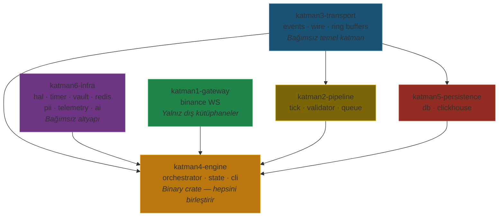

# 🏗️ Cycle-Engine — 6 Katmanlı Klasör Yeniden Yapılandırma Planı

> [!NOTE]
> **Güncelleme (2026-08-11):** Bu plan tamamlanmıştır — 6 katmanlı yapı `gateway`, `pipeline`, `transport`, `engine`, `persistence`, `infra` olarak uygulanmıştır (plan sırasında geçici `katmanX-` isimleri kullanılmıştı). Ayrıca yeni **`flows`** crate'i (8 bağımsız veri akışı süreci) ve `transport::flow::FlowKind` eklenmiş, SQLite kaldırılıp **TimescaleDB**'ye geçilmiştir. Güncel durum için: [cycle_engine_architecture.md](cycle_engine_architecture.md).

> **Kural**: Hiçbir algoritma değişmez. Sadece dosya konumları, `Cargo.toml` bağımlılıkları ve `use`/`mod` import yolları güncellenir.

---

## Mevcut Yapı → Yeni Yapı

```
MEVCUT                                  YENİ
cycle-engine/                           cycle-engine/
├── adapter/  (K1+K5+K6 karışık)       ├── katman1-gateway/
├── contracts/ (K0/K3)                  ├── katman2-pipeline/
├── transport/ (K3)                     ├── katman3-transport/   (contracts + transport birleşik)
├── core/     (K2+K4+K5+K6 karışık)    ├── katman4-engine/
└── splash/                             ├── katman5-persistence/
                                        ├── katman6-infra/
                                        └── splash/              (değişmez)
```

---

## Yeni Dosya Yapısı

```
cycle-engine/
│
├── katman1-gateway/                    ← Borsa Bağlantıları
│   ├── Cargo.toml                       [YENİ]
│   └── src/
│       ├── lib.rs                       [YENİ]
│       └── binance.rs                   ← adapter/src/binance.rs'den taşınır
│
├── katman2-pipeline/                   ← Veri İşleme & Doğrulama
│   ├── Cargo.toml                       [YENİ]
│   └── src/
│       ├── lib.rs                       [YENİ]
│       ├── tick.rs                      ← core/src/tick.rs'den taşınır
│       ├── validator.rs                 ← core/src/validator.rs'den taşınır
│       └── queue.rs                     ← core/src/queue.rs'den taşınır
│
├── katman3-transport/                  ← Sözleşmeler + IPC (contracts & transport birleşik)
│   ├── Cargo.toml                       [YENİ — iki eski Cargo.toml birleşir]
│   └── src/
│       ├── lib.rs                       [YENİ]
│       ├── events.rs                    ← contracts/src/events.rs'den taşınır
│       ├── wire.rs                      ← contracts/src/wire.rs'den taşınır
│       ├── ring_buffer.rs              ← transport/src/ring_buffer.rs'den taşınır
│       ├── order_ring.rs               ← transport/src/order_ring.rs'den taşınır
│       ├── calc_ring.rs                ← transport/src/calc_ring.rs'den taşınır
│       └── stream_ring.rs              ← transport/src/stream_ring.rs'den taşınır
│
├── katman4-engine/                     ← Çekirdek Karar & İcra Motoru
│   ├── Cargo.toml                       [YENİ]
│   ├── benches/
│   │   └── tick_benchmark.rs            ← core/benches/'den taşınır
│   └── src/
│       ├── main.rs                      ← core/src/main.rs'den taşınır
│       ├── lib.rs                       [YENİ]
│       ├── config.rs                    ← core/src/config.rs'den taşınır
│       ├── state.rs                     ← core/src/state.rs'den taşınır
│       ├── bridge.rs                    ← core/src/bridge.rs'den taşınır
│       ├── bridge/
│       │   └── detector_bridge.rs       ← core/src/bridge/'den taşınır
│       ├── engine/
│       │   ├── mod.rs                   ← core/src/engine/'den taşınır
│       │   ├── orchestrator.rs          ← core/src/engine/'den taşınır
│       │   └── backtester.rs            ← core/src/engine/'den taşınır
│       └── cli/
│           ├── mod.rs                   ← core/src/cli/'den taşınır
│           ├── correlation_cli.rs       ← core/src/cli/'den taşınır
│           ├── paper_cli.rs             ← core/src/cli/'den taşınır
│           └── strategy_cli.rs          ← core/src/cli/'den taşınır
│
├── katman5-persistence/                ← Depolama & Veri Gölü
│   ├── Cargo.toml                       [YENİ]
│   └── src/
│       ├── lib.rs                       [YENİ]
│       ├── db.rs                        ← core/src/db.rs'den taşınır
│       └── clickhouse.rs               ← adapter/src/clickhouse.rs'den taşınır
│
├── katman6-infra/                      ← Donanım, Güvenlik & Telemetri
│   ├── Cargo.toml                       [YENİ]
│   └── src/
│       ├── lib.rs                       [YENİ]
│       ├── hal/
│       │   ├── mod.rs                   ← core/src/hal/'den taşınır
│       │   ├── cpu.rs                   ← core/src/hal/'den taşınır
│       │   └── memory.rs               ← core/src/hal/'den taşınır
│       ├── timer/
│       │   ├── mod.rs                   ← core/src/timer/'den taşınır
│       │   └── tsc.rs                   ← core/src/timer/'den taşınır
│       ├── pii.rs                       ← core/src/pii.rs'den taşınır
│       ├── vault.rs                     ← adapter/src/vault.rs'den taşınır
│       ├── redis.rs                     ← adapter/src/redis.rs'den taşınır
│       ├── telemetry.rs                 ← adapter/src/telemetry.rs'den taşınır
│       └── ai.rs                        ← adapter/src/ai.rs'den taşınır
│
└── splash/                             ← Değişmez (bağımsız)
    ├── Cargo.toml
    └── src/
        ├── lib.rs
        └── main.rs
```

---

## Katman Bağımlılık Grafiği



> [!IMPORTANT]
> **Dairesel bağımlılık yoktur.** Bağımlılık yönü her zaman aşağıdan yukarıya akar:
> - K3 (transport) ve K6 (infra) hiçbir cycle-engine crate'ine bağımlı değil
> - K1 (gateway) hiçbir cycle-engine crate'ine bağımlı değil
> - K2 (pipeline) yalnızca K3'e bağımlı
> - K5 (persistence) yalnızca K3'e bağımlı
> - K4 (engine) hepsini birleştirir (binary crate)

---

## Cargo.toml Değişiklikleri

### Workspace Root (`Cargo.toml`) — cycle-engine dışı tek değişiklik

```diff
 members = [
-    "cycle-engine/contracts",
-    "cycle-engine/transport",
-    "cycle-engine/core",
-    "cycle-engine/adapter",
+    "cycle-engine/katman1-gateway",
+    "cycle-engine/katman2-pipeline",
+    "cycle-engine/katman3-transport",
+    "cycle-engine/katman4-engine",
+    "cycle-engine/katman5-persistence",
+    "cycle-engine/katman6-infra",
     "cycle-engine/splash",
```

> [!WARNING]
> Workspace root `Cargo.toml` cycle-engine dışındadır. Bu tek istisna zorunludur — Rust workspace üye listesi güncellenmelidir. Başka hiçbir dosya cycle-engine dışında değişmez.

### katman1-gateway/Cargo.toml

```toml
[package]
name = "katman1-gateway"
version = "0.1.0"
edition = "2021"

[dependencies]
tokio-tungstenite = { workspace = true }
futures-util = { workspace = true }
tokio = { workspace = true }
flume = { workspace = true }
serde_json = { workspace = true }
serde = { workspace = true }
```

### katman2-pipeline/Cargo.toml

```toml
[package]
name = "katman2-pipeline"
version = "0.1.0"
edition = "2021"

[dependencies]
katman3-transport = { path = "../katman3-transport" }
simd-json = { workspace = true }
rust_decimal = { workspace = true }
flume = { workspace = true }
```

### katman3-transport/Cargo.toml

```toml
[package]
name = "katman3-transport"
version = "0.1.0"
edition = "2021"

[dependencies]
rust_decimal = { workspace = true }
libc = { workspace = true }
memmap2 = { workspace = true }
```

### katman4-engine/Cargo.toml

```toml
[package]
name = "katman4-engine"
version = "0.1.0"
edition = "2021"

[lib]
name = "katman4_engine"

[features]
default = ["binance_v5"]
binance_v5 = []
binance_v6 = []

[dependencies]
katman1-gateway = { path = "../katman1-gateway" }
katman2-pipeline = { path = "../katman2-pipeline" }
katman3-transport = { path = "../katman3-transport" }
katman5-persistence = { path = "../katman5-persistence" }
katman6-infra = { path = "../katman6-infra" }
os-utils = { path = "../../additional-services/os-utils" }
execution-engine = { path = "../../execution-engine" }
risk-engine = { path = "../../risk-engine" }
strategies-engine = { path = "../../strategies-engine" }
tokio = { workspace = true }
flume = { workspace = true }
parking_lot = { workspace = true }
crossbeam-channel = { workspace = true }
serde = { workspace = true }
serde_json = { workspace = true }
rust_decimal = { workspace = true }
rustyline = { workspace = true }
chrono = { workspace = true }
reqwest = { workspace = true }
dotenvy = { workspace = true }

[dev-dependencies]
criterion = "0.4"
proptest = { workspace = true }

[[bench]]
name = "tick_benchmark"
harness = false
```

### katman5-persistence/Cargo.toml

```toml
[package]
name = "katman5-persistence"
version = "0.1.0"
edition = "2021"

[dependencies]
katman3-transport = { path = "../katman3-transport" }
rusqlite = { workspace = true }
rust_decimal = { workspace = true }
flume = { workspace = true }
```

### katman6-infra/Cargo.toml

```toml
[package]
name = "katman6-infra"
version = "0.1.0"
edition = "2021"

[dependencies]
core_affinity = { workspace = true }
libc = { workspace = true }
memmap2 = { workspace = true }
sha3 = { workspace = true }
reqwest = { workspace = true }
serde = { workspace = true }
redis = { workspace = true }
tokio = { workspace = true }
```

---

## Import Yolu Güncellemeleri

Dosya içeriklerinde **yalnızca `use` satırları** değişir. Algoritma kodu birebir korunur.

| Eski Import | Yeni Import |
|-------------|-------------|
| `use contracts::events::*` | `use katman3_transport::events::*` |
| `use contracts::wire::*` | `use katman3_transport::wire::*` |
| `use transport::ring_buffer::*` | `use katman3_transport::ring_buffer::*` |
| `use transport::order_ring::*` | `use katman3_transport::order_ring::*` |
| `use adapter::binance::*` | `use katman1_gateway::binance::*` |
| `use proje_core::tick::*` | `use katman2_pipeline::tick::*` |
| `use proje_core::validator::*` | `use katman2_pipeline::validator::*` |
| `use proje_core::queue::*` | `use katman2_pipeline::queue::*` |
| `use proje_core::db::*` | `use katman5_persistence::db::*` |
| `use crate::timer::tsc::*` | `use katman6_infra::timer::tsc::*` |
| `use crate::hal::*` | `use katman6_infra::hal::*` |

---

## Uygulama Sırası

| # | Adım | Açıklama |
|---|------|---------|
| 1 | **K3 oluştur** | `contracts` + `transport` → `katman3-transport` birleştir (bağımsız, ilk kurulmalı) |
| 2 | **K6 oluştur** | `adapter` (vault, redis, telemetry, ai) + `core` (hal, timer, pii) → `katman6-infra` |
| 3 | **K1 oluştur** | `adapter/binance.rs` → `katman1-gateway` |
| 4 | **K2 oluştur** | `core` (tick, validator, queue) → `katman2-pipeline` |
| 5 | **K5 oluştur** | `core/db.rs` + `adapter/clickhouse.rs` → `katman5-persistence` |
| 6 | **K4 oluştur** | `core` geri kalanı → `katman4-engine` (binary crate) |
| 7 | **Workspace güncelle** | Root `Cargo.toml` üye listesini güncelle |
| 8 | **Eski crate'leri sil** | `contracts/`, `transport/`, `adapter/`, `core/` kaldır |
| 9 | **Derleme doğrulaması** | `cargo check --workspace` |

---

## Ne Değişir / Ne Değişmez

| Değişen | Değişmeyen |
|---------|-----------|
| Dosya konumları (klasör yapısı) | Tüm algoritmalar birebir aynı |
| `Cargo.toml` bağımlılık yolları | Fonksiyon imzaları |
| `use` / `mod` import satırları | Veri yapıları (OwnedEvent, EventType, vs.) |
| Crate isimleri | Ring buffer boyutları, eşik değerleri |
| Workspace üye listesi | Circuit breaker mantığı |
| | Wire codec encode/decode |
| | Torn-read koruması |
| | Spin-loop, catch_unwind |

> [!CAUTION]
> Cycle-engine dışındaki crate'ler (`risk-engine`, `strategies-engine`, `execution-engine`, `services-engine/*`) `contracts` ve `transport` crate isimlerine referans veriyorsa, onların da güncellenmesi gerekir. Ancak talimatınız "cycle-engine dışına müdahale etme" olduğu için bu referansları **güncellemeyeceğim**. Eğer dış crate'ler bozulursa ayrıca ele alınması gerekecektir.
