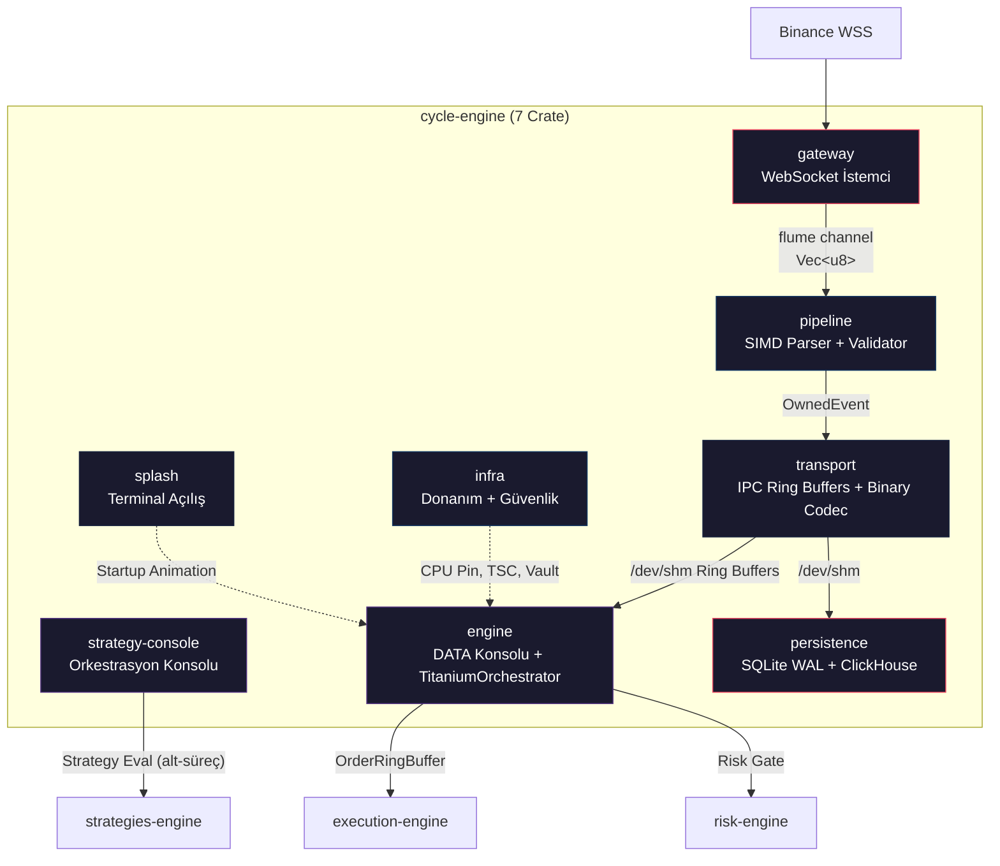
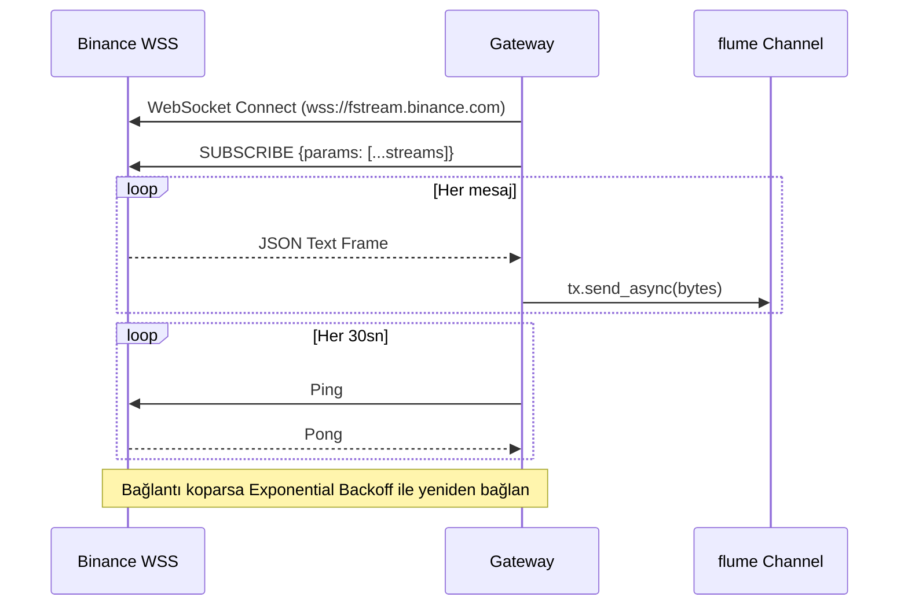
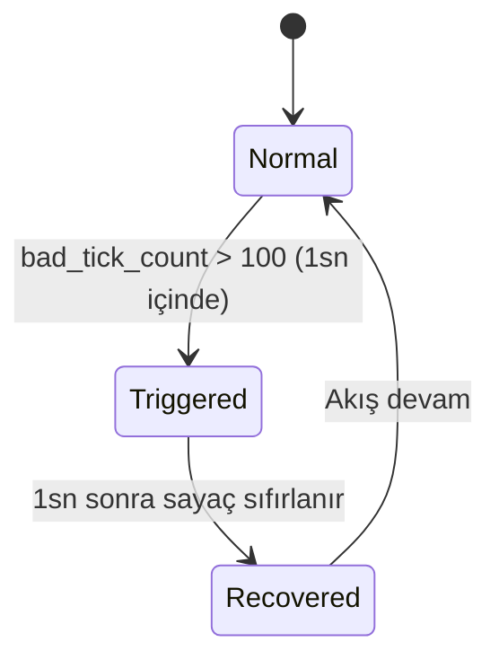
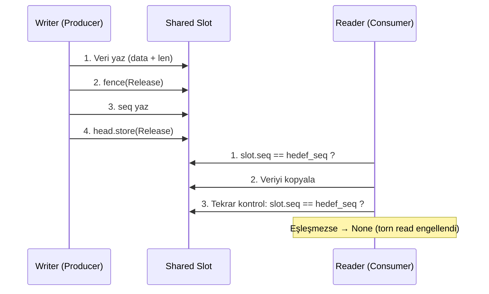
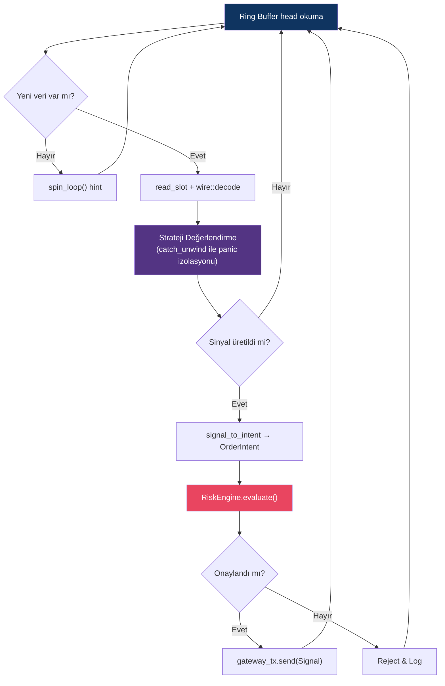
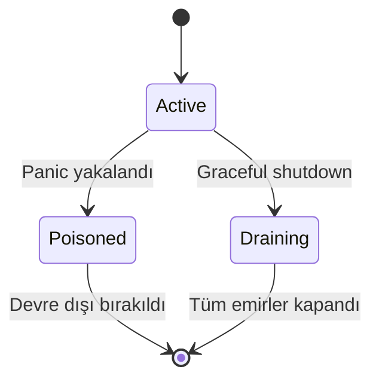
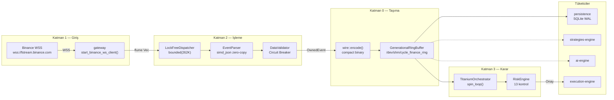
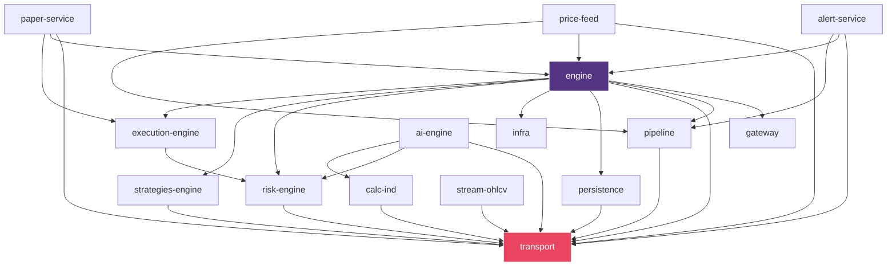
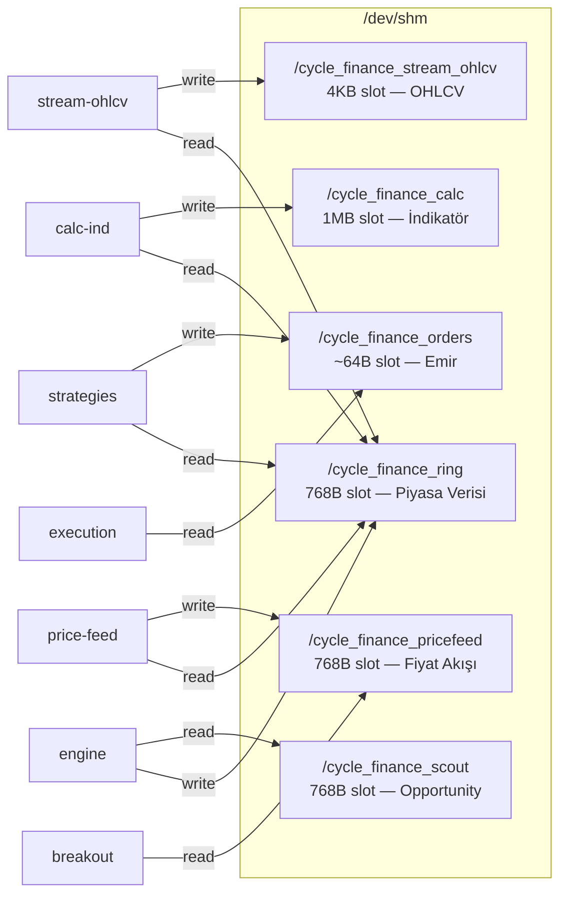

# 🏗️ Cycle-Engine Mimari Dokümanı

> Tüm kaynak kodlar (`*.rs`, `Cargo.toml`) satır satır incelenerek hazırlanmıştır.

---

## 1. Genel Bakış

`cycle-engine`, yüksek frekanslı ticaret (HFT) sisteminin **veri toplama → ayrıştırma → doğrulama → IPC taşıma → orkestrasyon → kalıcılık** zincirini oluşturan çekirdek bileşendir. 7 ayrı Rust crate'inden oluşur ve sistemin Katman 0–2 altyapısını sağlar.



---

## 2. Katmanlı Mimari

| Katman | Crate | Sorumluluk | Gecikme Hedefi |
|:---:|:---|:---|:---:|
| **0** | `transport` | Veri modelleri, binary codec, IPC ring buffer'lar | < 100 ns |
| **1** | `gateway` | Binance WebSocket bağlantıları, reconnect, ping/pong | N/A (ağ) |
| **2** | `pipeline` | SIMD JSON parse, veri doğrulama, circuit breaker | < 1 μs |
| **3** | `engine` | TitaniumOrchestrator (spin-loop) + `strategy-console` (strateji alt-süreç orkestrasyonu) | < 10 μs |
| **4** | `persistence` | SQLite WAL batch write, ClickHouse şeması | Async |
| **5** | `infra` | CPU affinity, RDTSC timer, Vault, Redis, telemetri | N/A |
| **6** | `splash` | FIGlet ASCII animasyonu, terminal UI | N/A |

---

## 3. Crate Detayları

### 3.1 `gateway` — Borsa Bağlantı Katmanı

[gateway/src/binance.rs](file:///home/smhvz/Desktop/PROJE/cycle-engine/gateway/src/binance.rs)

**Sorumluluk:** Binance Futures/Spot WebSocket API'lerine bağlanır, ham JSON baytlarını `flume` kanalına aktarır.

**Ana Fonksiyon:**
```rust
pub async fn start_binance_ws_client(tx: Sender<Vec<u8>>)
```

**Temel Mekanizmalar:**

| Mekanizma | Detay |
|:---|:---|
| **Exponential Backoff** | 1s → 2s → 4s → ... → 60s (tavan), başarılı bağlantıda sıfırlanır |
| **Ping/Pong Heartbeat** | 30 sn aralıkla `Message::Ping`, başarısız olursa reconnect |
| **WAF Koruması** | Chunk'lar arası 600ms gecikme ile rate-limit engelleme |
| **Chunked Connections** | Sembol akışları 200'erli gruplara bölünür, her biri ayrı Tokio task |
| **Akış Türleri** | `@trade`, `@depth20@100ms` |



**Bağımlılıklar:** `tokio-tungstenite`, `futures-util`, `tokio`, `flume`, `serde_json`, `serde`

---

### 3.2 `pipeline` — Veri İşleme Hattı

**Modüller:** [tick.rs](file:///home/smhvz/Desktop/PROJE/cycle-engine/pipeline/src/tick.rs) · [validator.rs](file:///home/smhvz/Desktop/PROJE/cycle-engine/pipeline/src/validator.rs) · [queue.rs](file:///home/smhvz/Desktop/PROJE/cycle-engine/pipeline/src/queue.rs)

#### A. EventParser (tick.rs)

```rust
pub fn parse(bytes: &mut [u8]) -> Option<OwnedEvent>
```

- `simd_json::to_borrowed_value()` ile **zero-copy SIMD parse**
- Desteklenen akış türleri: `@trade`, `@depth`, `@forceOrder`, `@markPrice`, `@bookTicker`

#### B. DataValidator (validator.rs)

```rust
pub fn is_valid(&mut self, event: &OwnedEvent) -> bool
```

| Kontrol | Koşul | Sonuç |
|:---|:---|:---|
| Fiyat/Miktar | `<= 0` | Reject |
| Stale Data | `> 200ms` gecikme | Reject |
| NTP Drift | `> 5000ms` sapma | Reject |
| Crossed Book | `best_bid >= best_ask` | Reject |
| Circuit Breaker | 1sn'de `> 100` bozuk tick | Tüm akışı durdur |

**Circuit Breaker Durum Makinesi:**


#### C. LockFreeDispatcher (queue.rs)

```rust
pub struct LockFreeDispatcher {
    tx: Sender<Vec<u8>>,   // flume bounded(262_144)
    rx: Receiver<Vec<u8>>,
}
```

- 262.144 elemanlı bounded kuyruk → backpressure desteği

**Bağımlılıklar:** `transport`, `simd-json`, `rust_decimal`, `flume`

---

### 3.3 `transport` — IPC Omurgası

**Modüller:** [events.rs](file:///home/smhvz/Desktop/PROJE/cycle-engine/transport/src/events.rs) · [wire.rs](file:///home/smhvz/Desktop/PROJE/cycle-engine/transport/src/wire.rs) · [ring_buffer.rs](file:///home/smhvz/Desktop/PROJE/cycle-engine/transport/src/ring_buffer.rs) · [order_ring.rs](file:///home/smhvz/Desktop/PROJE/cycle-engine/transport/src/order_ring.rs) · [calc_ring.rs](file:///home/smhvz/Desktop/PROJE/cycle-engine/transport/src/calc_ring.rs) · [stream_ring.rs](file:///home/smhvz/Desktop/PROJE/cycle-engine/transport/src/stream_ring.rs)

#### A. Veri Modelleri (events.rs)

```rust
#[repr(C)]
pub struct OwnedEvent {
    pub symbol: [u8; 16],    // Sabit boyutlu sembol (örn: "BTCUSDT\0...")
    pub payload: EventType,
}

#[repr(u8)]
pub enum EventType {
    Trade { price, quantity, timestamp, is_buyer_maker },
    Orderbook { bids: [(Decimal,Decimal); 20], asks: [(Decimal,Decimal); 20] },
    Liquidation { side, price, quantity, timestamp },
    FundingRate { mark_price, index_price, funding_rate, next_funding_time },
    BookTicker { best_bid_price, best_bid_qty, best_ask_price, best_ask_qty },
    OpenInterest { open_interest, timestamp },
    Opportunity { score, efficiency, price_bps_per_s, price_ticks_per_s, ob_changes_per_s, spread_bps, verdict },
    SymbolMetrics { score, efficiency, price_bps_per_s, price_ticks_per_s, ob_changes_per_s, spread_bps },
}
```

#### B. Binary Codec (wire.rs)

| Sabit | Değer | Açıklama |
|:---|:---|:---|
| `DEPTH_FRAME_SIZE` | 659 B | Orderbook 20-derinlik frame boyutu |
| `MAX_FRAME_SIZE` | 659 B | Maksimum frame boyutu |

```rust
pub fn encode(ev: &OwnedEvent, buf: &mut [u8]) -> Option<usize>  // ~659B vs JSON ~1100B (%40+ tasarruf)
pub fn decode(buf: &[u8]) -> Option<OwnedEvent>
```

- `Decimal` → `(mantissa: i64, scale: u8)` dönüşümü ile 9 bayt/değer
- Tag-based compact binary format, sıfır heap allocation

#### C. Ring Buffer'lar (POSIX Shared Memory IPC)

| Ring Buffer | SHM Yolu | Slot Boyutu | Varsayılan Kapasite | Kullanım |
|:---|:---|:---:|:---:|:---|
| `GenerationalRingBuffer` | `/cycle_finance_ring` | 768 B | Parametrik | Piyasa verisi akışı |
| `OrderRingBuffer` | `/cycle_finance_orders` | ~64 B | Parametrik | Emir iletimi |
| `CalcRingBuffer` | `/cycle_finance_calc` | 1 MB | Parametrik | İndikatör/OHLCV sonuçları |
| `StreamRingBuffer` | `/cycle_finance_stream_ohlcv` | 4 KB | 8192 | Canlı OHLCV mum akışı |

**Torn-Read Koruması (Lock-Free Güvenlik):**


**Bellek Düzeni:**
- Tüm slot yapıları `#[repr(C, align(64))]` → CPU Cache Line hizalı (false-sharing yok)
- `AtomicU64` ile lock-free SPMC/MPMC okuma/yazma
- İlk oluşturan süreç `ftruncate` yapar, sonrakiler sadece bağlanır
- Magic number doğrulaması ile eski/bozuk SHM tespiti ve yeniden başlatma

**Bağımlılıklar:** `rust_decimal`, `libc`, `memmap2`

---

### 3.4 `engine` — DATA Konsolu + Strateji Orkestrasyonu

**Modüller:** [orchestrator.rs](file:///home/smhvz/Desktop/PROJE/cycle-engine/engine/src/engine/orchestrator.rs) · [strategy_console.rs](file:///home/smhvz/Desktop/PROJE/cycle-engine/engine/src/engine/strategy_console.rs) · [detector_bridge.rs](file:///home/smhvz/Desktop/PROJE/cycle-engine/engine/src/bridge/detector_bridge.rs)

**İki binary:** `engine` (DATA konsolu — `src/main.rs`) ve `strategy-console` (strateji orkestrasyon konsolu — `src/bin/strategy-console.rs`). `RUN_MODE` ortam değişkeni yoktur; `engine` tek başına DATA, `strategy-console` tek başına orkestrasyon merkezidir. Eski `cli/`, `state.rs`, `config.rs`, `backtester.rs` modülleri kaldırıldı.

#### A. TitaniumOrchestrator

```rust
pub struct TitaniumOrchestrator {
    strategies: Vec<ShardedStrategy>,
    risk_manager: RiskEngine,
    gateway_tx: Sender<Signal>,
}
```

| Metot | Açıklama |
|:---|:---|
| `new()` | Stratejileri yükler, risk engine'i başlatır |
| `run_spin_loop(&mut self, ring: &GenerationalRingBuffer)` | Ana hot-path döngüsü |

**Spin-Loop Mimarisi:**


**Panic İzolasyonu:**
```rust
std::panic::catch_unwind(AssertUnwindSafe(|| strategy.evaluate(event)))
// Panic → StrategyState::Poisoned (motor çökmez)
```

**Strateji Durum Makinesi:**


#### B. DetectorBridge (Scout Ring Okuyucu)

```rust
pub struct DetectorBridge {
    ring: GenerationalRingBuffer,  // /cycle_finance_scout
    cursor: u64,
}
```

- Harici detektörlerin `Opportunity` sinyallerini okur
- `spawn_watcher()` ile arka plan Tokio task'ı başlatır

#### C. STRATEGY Orkestrasyon Konsolu (strategy_console.rs)

[strategy_console.rs](file:///home/smhvz/Desktop/PROJE/cycle-engine/engine/src/engine/strategy_console.rs) `strategy-console` binary'sinin gövdesidir (`src/bin/strategy-console.rs`). DATA konsolundan tamamen bağımsız ayrı bir OS sürecidir — `RUN_MODE` kullanılmaz.

```rust
pub fn run_strategy_console()   // sonsuz döngü: komut kuyruğu + stdin + tick
```

- `strategies-engine::StrategyOrchestrator` barındırır; `services-engine/strategies/` klasörünü yönetir
- Komutlar `/tmp/strategy_cmd.d/*.cmd` kuyruğundan (maildir benzeri, 250ms poll) ve stdin'den (rustyline) okunur
- Durum raporu `/tmp/strategy_status.txt`'e yazılır
- Strateji adları dizin adından gelir; `-strategy` sonek takma adı desteklenir (`breakout` → `breakout-strategy`)
- Alt-süreçleri SIGTERM ile durdurur, `tick()` ölen süreçleri toplar (reap)
- Çıkışta tüm yönetilen stratejiler durdurulur

**Bağımlılıklar:** `gateway`, `pipeline`, `transport`, `persistence`, `infra`, `execution-engine`, `risk-engine`, `strategies-engine`, `tokio`, `flume`, `parking_lot`, `crossbeam-channel`, `rustyline`, `criterion` (bench)

---

### 3.5 `persistence` — Kalıcılık Katmanı

**Modüller:** [db.rs](file:///home/smhvz/Desktop/PROJE/cycle-engine/persistence/src/db.rs) · [clickhouse.rs](file:///home/smhvz/Desktop/PROJE/cycle-engine/persistence/src/clickhouse.rs)

#### A. SQLite WAL Batch Writer (db.rs)

```rust
pub fn start_db_writer(rx: Receiver<OwnedEvent>)
```

| Ayar | Değer |
|:---|:---|
| Journal Mode | WAL |
| Synchronous | NORMAL |
| Cache Size | 64 MB |
| Batch Size | 10.000 kayıt |
| Flush Interval | 1.000 ms |
| Tablolar | `trades`, `orderbooks`, `liquidations`, `funding_rates`, `booktickers`, `open_interests`, `opportunities`, `symbol_metrics` |

- Ayrı thread'de çalışır, ana motoru asla bloke etmez

#### B. ClickHouse Adapter (clickhouse.rs)

```rust
pub struct ClickHouseAdapter {
    deletion_registry: Mutex<HashMap<String, u64>>,
}
```

| Özellik | Detay |
|:---|:---|
| Sıkıştırma | ZSTD(22) |
| Partisyonlama | `toYear/toMonth/toDayOfMonth` |
| GDPR/KVKK | `execute_right_to_erasure()` ile veri silme |
| Veri Bütünlüğü | Merkle Tree + EC-12/4 Erasure Coding doğrulama |

**Bağımlılıklar:** `transport`, `rusqlite`, `rust_decimal`, `flume`

---

### 3.6 `infra` — Altyapı ve Donanım Soyutlama

**Modüller:** [hal/cpu.rs](file:///home/smhvz/Desktop/PROJE/cycle-engine/infra/src/hal/cpu.rs) · [hal/memory.rs](file:///home/smhvz/Desktop/PROJE/cycle-engine/infra/src/hal/memory.rs) · [timer/tsc.rs](file:///home/smhvz/Desktop/PROJE/cycle-engine/infra/src/timer/tsc.rs) · [redis.rs](file:///home/smhvz/Desktop/PROJE/cycle-engine/infra/src/redis.rs) · [vault.rs](file:///home/smhvz/Desktop/PROJE/cycle-engine/infra/src/vault.rs) · [pii.rs](file:///home/smhvz/Desktop/PROJE/cycle-engine/infra/src/pii.rs) · [telemetry.rs](file:///home/smhvz/Desktop/PROJE/cycle-engine/infra/src/telemetry.rs) · [ai.rs](file:///home/smhvz/Desktop/PROJE/cycle-engine/infra/src/ai.rs)

#### A. Donanım Soyutlama (HAL)

| Fonksiyon | Açıklama |
|:---|:---|
| `pin_to_core(core_id)` | CPU affinity — context switch gecikme eliminasyonu |
| `allocate_huge_buffer(size)` | Page pre-faulting — çalışma anında page-fault yok |
| `TscTimer::read_tsc()` | `_rdtsc()` intrinsic ile nanosaniye altı zamanlama |

#### B. Güvenlik ve Uyumluluk

| Bileşen | Özellikler |
|:---|:---|
| **VaultAdapter** | Key rotation, JWT üretimi (1h TTL), health check |
| **RedisAdapter** | Atomik idempotency (`SET NX EX 3600`), fail-closed tasarım |
| **PIIMasker** | SHA-3 + Salt hash, GDPR/KVKK 3 yıl log temizleme |

#### C. Telemetri ve AI

| Bileşen | Özellikler |
|:---|:---|
| **TelemetryAgent** | eBPF RTT tracking, adaptif Jaeger sampling (%1 → %100), Chaos Mesh |
| **AIAdapter** | Isolation Forest anomali skoru, LLM trend etiketi |

**Bağımlılıklar:** `core_affinity`, `libc`, `memmap2`, `sha3`, `reqwest`, `serde`, `redis`, `tokio`

---

### 3.7 `splash` — Terminal Açılış Animasyonu

[splash/src/lib.rs](file:///home/smhvz/Desktop/PROJE/cycle-engine/splash/src/lib.rs)

```rust
pub fn show_splash()
pub fn show_splash_with(metin: &str, total_ms: u64)
```

- FIGlet ASCII banner ("CYCLE FINANCE")
- True Color Matrix yeşili (`\x1B[38;2;0;255;65m`) animasyon
- Terminal boyutuna göre dinamik ortalama
- `ffplay` ile futuristik ses efekti
- Senkronize ilerleme çubuğu (%0 → %100)

---

## 4. Uçtan Uca Veri Akışı



---

## 5. Çapraz-Engine Bağımlılık Haritası



> **`transport` crate'i tüm sistemin IPC omurgasıdır** — 12+ crate doğrudan bağımlıdır.

---

## 6. IPC Ring Buffer Topolojisi



---

## 7. Performans Tasarım İlkeleri

| İlke | Uygulama |
|:---|:---|
| **Zero-Copy** | `simd_json::to_borrowed_value()` — mutable buffer üzerinde parse |
| **Zero-Allocation** | `#[repr(C)]` sabit boyutlu struct'lar, stack-only veri modelleri |
| **Lock-Free IPC** | `AtomicU64` + `fence(Release/Acquire)` ile SPMC ring buffer |
| **Cache-Line Aligned** | `#[repr(C, align(64))]` — false sharing engellenir |
| **CPU Pinning** | `core_affinity::set_for_current()` — context switch yok |
| **RDTSC Timer** | `_rdtsc()` intrinsic — nanosaniye altı ölçüm |
| **Spin-Loop** | `std::hint::spin_loop()` — sıfır syscall bekleme |
| **Compact Binary** | JSON ~1100B → wire ~659B (%40+ tasarruf) |
| **Batch WAL Write** | 10K kayıt veya 1sn → tek SQLite transaction |
| **Panic Isolation** | `catch_unwind()` ile strateji paniklerini izole et |

---

## 8. Güvenlik ve Uyumluluk Kontrolleri

| Kontrol | Mekanizma | Bileşen |
|:---|:---|:---|
| **İdempotency** | Redis `SET NX EX 3600` (fail-closed) | `infra/redis.rs` |
| **Key Rotation** | Vault dual-key + 5dk grace period | `infra/vault.rs` |
| **PII Masking** | SHA-3 + Salt hash | `infra/pii.rs` |
| **GDPR/KVKK** | ClickHouse `ALTER DELETE` + 3 yıl log temizleme | `persistence/clickhouse.rs` |
| **KillSwitch** | `/tmp/exec_kill_switch` dosyası ile acil durdurma | `risk-engine` |
| **Circuit Breaker** | 1sn/100 bad tick → tüm akışı durdur | `pipeline/validator.rs` |

---

## 9. Dosya Yapısı Özeti

```
cycle-engine/
├── gateway/
│   ├── Cargo.toml
│   └── src/
│       ├── lib.rs              # pub mod binance
│       └── binance.rs          # start_binance_ws_client()
├── pipeline/
│   ├── Cargo.toml
│   └── src/
│       ├── lib.rs              # pub mod tick, validator, queue
│       ├── tick.rs             # EventParser::parse() — SIMD JSON
│       ├── validator.rs        # DataValidator — Circuit Breaker
│       └── queue.rs            # LockFreeDispatcher — bounded channel
├── transport/
│   ├── Cargo.toml
│   └── src/
│       ├── lib.rs              # pub mod events, wire, ring_buffer, order_ring, calc_ring, stream_ring
│       ├── events.rs           # OwnedEvent, EventType
│       ├── wire.rs             # encode(), decode() — compact binary
│       ├── ring_buffer.rs      # GenerationalRingBuffer — piyasa verisi IPC
│       ├── order_ring.rs       # OrderRingBuffer — emir IPC
│       ├── calc_ring.rs        # CalcRingBuffer — indikatör IPC (1MB slot)
│       └── stream_ring.rs      # StreamRingBuffer — OHLCV IPC (4KB slot)
├── engine/
│   ├── Cargo.toml
│   ├── benches/
│   │   └── tick_benchmark.rs   # Criterion: parse + wire roundtrip
│   └── src/
│       ├── lib.rs              # pub mod engine, bridge
│       ├── main.rs             # engine (DATA) binary giriş noktası
│       ├── bin/
│       │   └── strategy-console.rs  # strategy-console binary — orkestrasyon konsolu
│       ├── bridge.rs           # pub mod detector_bridge + yeniden export
│       ├── bridge/
│       │   └── detector_bridge.rs   # DetectorBridge — Scout Ring okuyucu
│       └── engine/
│           ├── mod.rs          # pub mod orchestrator, strategy_console
│           ├── orchestrator.rs # TitaniumOrchestrator — spin-loop
│           └── strategy_console.rs  # STRATEGY konsolu — StrategyOrchestrator yönetimi
├── persistence/
│   ├── Cargo.toml
│   └── src/
│       ├── lib.rs              # pub mod db, clickhouse
│       ├── db.rs               # start_db_writer() — SQLite WAL
│       └── clickhouse.rs       # ClickHouseAdapter — data lake
├── infra/
│   ├── Cargo.toml
│   └── src/
│       ├── lib.rs              # pub mod hal, timer, pii, vault, redis, telemetry, ai
│       ├── hal/
│       │   ├── mod.rs
│       │   ├── cpu.rs          # pin_to_core()
│       │   └── memory.rs       # allocate_huge_buffer()
│       ├── timer/
│       │   ├── mod.rs
│       │   └── tsc.rs          # TscTimer — RDTSC intrinsic
│       ├── pii.rs              # PIIMasker — SHA-3
│       ├── redis.rs            # RedisAdapter — idempotency
│       ├── vault.rs            # VaultAdapter — JWT, key rotation
│       ├── telemetry.rs        # TelemetryAgent — Jaeger, Chaos Mesh
│       └── ai.rs               # AIAdapter — Isolation Forest, LLM
├── splash/
│   ├── Cargo.toml
│   └── src/
│       ├── lib.rs              # show_splash(), show_splash_with()
│       └── main.rs             # Terminal animasyonu
├── MIMARI_PLAN.md
├── YAPILANDIRMA_PLANI.md
└── walkthrough.md
```
