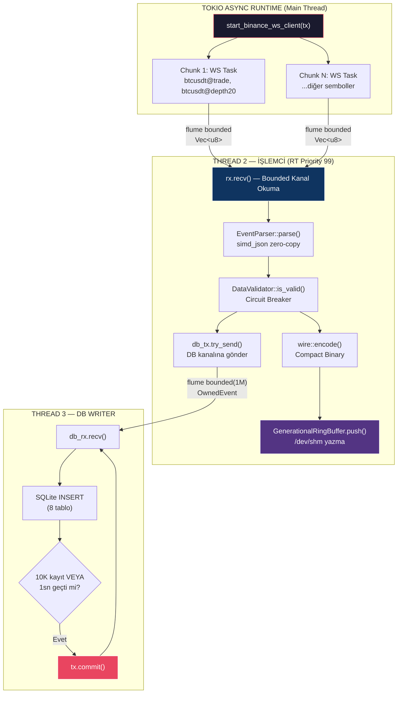
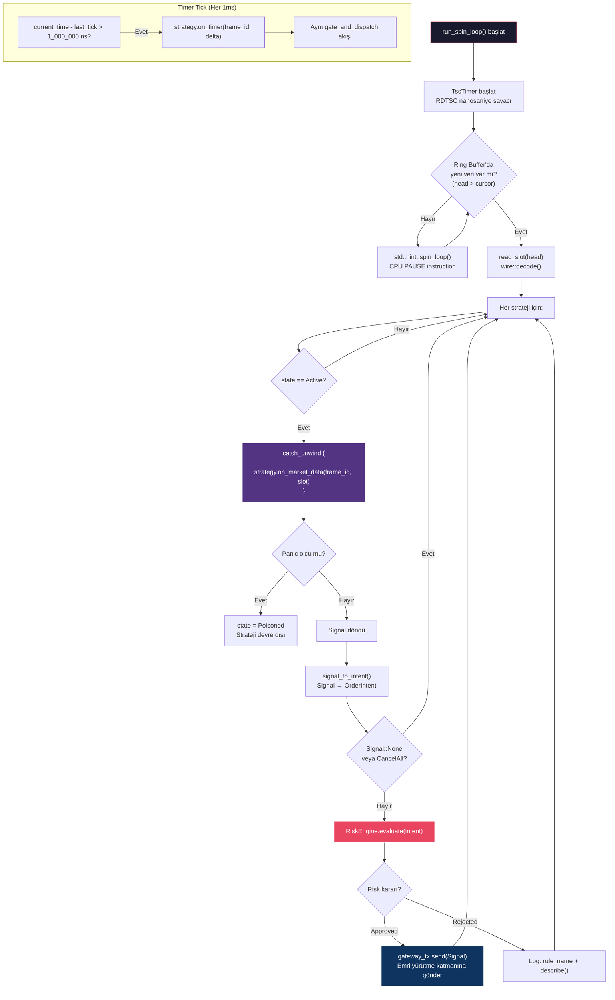
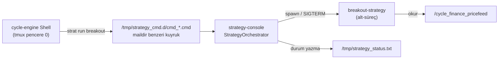
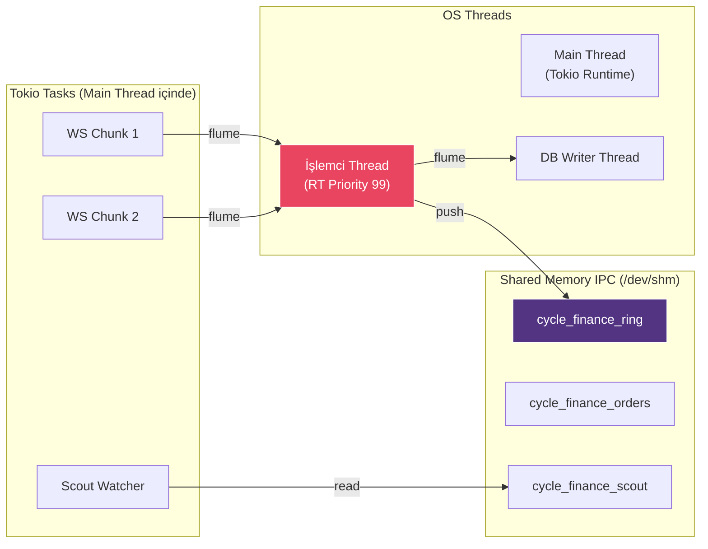

# ⚙️ Cycle-Engine Fonksiyonel Süreçler

`cycle-engine` iki ayrı binary üretir. **`RUN_MODE` yoktur** — her binary tek amaçlıdır:

- `engine` → **DATA konsolu**: canlı piyasa veri toplama + işleme + kayıt
- `strategy-console` → **strateji orkestrasyon merkezi**: stratejileri alt-süreç olarak yönetir (Bölüm 3)

```
cargo run -p engine              → Canlı piyasa veri toplama + işleme + kayıt
./target/debug/strategy-console  → Strateji orkestrasyon merkezi
```

---

## 1. DATA Konsolu — Ana Veri Hattı (Hot Path)

Bu mod, sistemin kalbi olan **gerçek zamanlı veri toplama ve dağıtım** sürecidir. 4 eşzamanlı süreç çalışır:



### Süreç 1: WebSocket Bağlantı Yöneticisi (Tokio Async)

**Dosya:** [gateway/src/binance.rs](file:///home/smhvz/Desktop/PROJE/cycle-engine/gateway/src/binance.rs)

```
start_binance_ws_client(tx)
  ├── fetch_usdt_spot_pairs()
  │     → ["btcusdt@trade", "btcusdt@depth20@100ms", "ethusdt@trade", ...]
  │
  ├── chunks(200) → Her chunk için tokio::spawn
  │     └── start_ws_chunk(tx, chunk, id)
  │           ├── connect_async("wss://fstream.binance.com/stream")
  │           ├── SUBSCRIBE JSON mesajı gönder
  │           └── tokio::select! döngüsü:
  │                 ├── ping_interval.tick() → Ping gönder (30sn)
  │                 └── read.next() → Text mesajı → into_bytes() → tx.send_async()
  │
  └── Chunk'lar arası 600ms gecikme (WAF koruması)
```

**Hata yönetimi:**
- Bağlantı koparsa → Exponential backoff (1s → 2s → 4s → ... → 60s tavan)
- Ping başarısız → Derhal reconnect döngüsüne gir
- Tüketici kanal kapandıysa → Task'ı temiz sonlandır

---

### Süreç 2: Veri İşleme Hattı (RT Priority Thread)

**Dosya:** [engine/src/main.rs:24-69](file:///home/smhvz/Desktop/PROJE/cycle-engine/engine/src/main.rs#L24-L69)

Bu thread `SCHED_FIFO` öncelik 99 ile çalışır (Linux RT scheduler). İşlem adımları:

```
set_rt_thread_priority(99)  ← OS-level realtime öncelik

while let Ok(mut bytes) = rx.recv() {
    ┌─ ADIM 1: PARSE ────────────────────────────────────────┐
    │  EventParser::parse(&mut bytes)                         │
    │  • simd_json zero-copy: buffer'ı yerinde parse eder     │
    │  • @trade → OwnedEvent::new_trade(...)                  │
    │  • @depth → OwnedEvent::new_orderbook(...)              │
    │  • @forceOrder → OwnedEvent::new_liquidation(...)       │
    │  • @markPrice → OwnedEvent::new_funding_rate(...)       │
    │  • @bookTicker → OwnedEvent::new_bookticker(...)        │
    └─────────────────────────────────────────────────────────┘
           │
           ▼
    ┌─ ADIM 2: DOĞRULAMA ────────────────────────────────────┐
    │  DataValidator::is_valid(&owned_event)                   │
    │  • Fiyat/Miktar <= 0 → REJECT                           │
    │  • Gecikme > 200ms (Stale) → REJECT                     │
    │  • NTP Drift > 5000ms → REJECT                          │
    │  • Crossed Book (Bid >= Ask) → REJECT                   │
    │  • 1sn'de 100+ reject → CIRCUIT BREAKER!                │
    └─────────────────────────────────────────────────────────┘
           │
           ▼
    ┌─ ADIM 3: KODLAMA + DAĞITIM ────────────────────────────┐
    │  wire::encode(&owned_event, &mut frame_buf)             │
    │  • OwnedEvent → Compact Binary Frame (max 659B)        │
    │  • Decimal → (mantissa: i64, scale: u8) = 9 byte       │
    │                                                          │
    │  gen_ring.push(&frame_buf[..len])                        │
    │  • /dev/shm/cycle_finance_ring'e atom yazma              │
    │  • Torn-read korumalı: data → fence → seq → head        │
    └─────────────────────────────────────────────────────────┘
           │
           ▼
    ┌─ ADIM 4: DB KANALINA GÖNDERİM ────────────────────────┐
    │  db_tx.try_send(owned_event)                             │
    │  • Non-blocking: Kuyruk doluysa drop (db_drop_count++)   │
    │  • Hot path'i asla bloke etmez                           │
    └─────────────────────────────────────────────────────────┘
           │
           ▼
    ┌─ ADIM 5: PERFORMANS RAPORU (1 saniyede bir) ───────────┐
    │  "[MARKET DATA] Ticks/sec: X | depth: Y | invalid: Z    │
    │   | db_drops: W | Avg Parse: N.NN ns"                    │
    └─────────────────────────────────────────────────────────┘
}
```

---

### Süreç 3: Veritabanı Yazıcı (Ayrı Thread)

**Dosya:** [persistence/src/db.rs](file:///home/smhvz/Desktop/PROJE/cycle-engine/persistence/src/db.rs)

```
start_db_writer(db_rx)
  ├── SQLite bağlantısı aç (WAL modu, 64MB cache)
  ├── 8 tablo oluştur (trades, orderbooks, liquidations, ...)
  └── Batch döngüsü:
        while let Ok(event) = rx.recv() {
            match event.payload {
                Trade → INSERT INTO trades
                Orderbook → INSERT INTO orderbooks (bids/asks string serialize)
                Liquidation → INSERT INTO liquidations
                FundingRate → INSERT INTO funding_rates
                BookTicker → INSERT INTO booktickers
                OpenInterest → INSERT INTO open_interests
                Opportunity → INSERT INTO opportunities
                SymbolMetrics → INSERT INTO symbol_metrics
            }
            batch_count++

            if batch_count >= 10_000 || 1sn geçtiyse {
                tx.commit()     ← Toplu disk yazma
                tx = yeni transaction başlat
            }
        }
```

**Optimizasyon:**
- WAL modu: Okuma ve yazma eşzamanlı çalışabilir
- `synchronous = NORMAL`: Çökme güvenliği ile hız arası denge
- 10K batch: Disk I/O'yu minimize eder
- `try_send`: Ana hat doluysa DB yerine performansı tercih eder

---

### Süreç 4: Ring Buffer Tüketicileri (Harici Süreçler)

Ring buffer'a yazılan veriler diğer bağımsız OS süreçleri tarafından okunur:

| Tüketici | Ring Buffer | Süreç |
|:---|:---|:---|
| `price-feed` | `/cycle_finance_ring` → `/cycle_finance_pricefeed` | Fiyat akışı REST API (:3004) |
| `calc-ind` | `/cycle_finance_ring` → `/cycle_finance_calc` | İndikatör hesaplama (:3007) |
| `stream-ohlcv` | `/cycle_finance_ring` → `/cycle_finance_stream_ohlcv` | OHLCV mum üretimi |
| `alert-service` | `/cycle_finance_ring` | Alarm tetikleme |
| `detect-ms` | `/cycle_finance_ring` | Piyasa yapısı analizi (:3002) |
| `breakout-strategy` | `/cycle_finance_pricefeed` | Kırılım stratejisi |

---

## 2. TitaniumOrchestrator (İç-Süreç Strateji Motoru)

Aynı süreç içinde çalışan, ring buffer'dan veri okuyup stratejileri `catch_unwind` ile değerlendiren spin-loop motorudur. Şu anda hiçbir binary doğrudan başlatmaz; canlı strateji yürütme, ayrı `strategy-console` sürecinin alt-süreç yönetimiyle yapılır (Bölüm 3).

**Dosya:** [engine/src/engine/orchestrator.rs](file:///home/smhvz/Desktop/PROJE/cycle-engine/engine/src/engine/orchestrator.rs)



**İki tetikleyici:**
1. **Market Data:** Ring buffer'a yeni veri yazıldığında stratejiler değerlendirilir
2. **Timer Tick:** Her ~1ms'de stratejilere `on_timer()` çağrısı yapılır (zaman bazlı kararlar)

**Risk kapısı (gate_and_dispatch):**
```
Signal → signal_to_intent() → OrderIntent
  ├── BuyMarket{qty}  → OrderIntent{side:Buy, kind:Market}
  ├── SellMarket{qty}  → OrderIntent{side:Sell, kind:Market}
  ├── BuyLimit{p,q}    → OrderIntent{side:Buy, kind:Limit}
  ├── SellLimit{p,q}   → OrderIntent{side:Sell, kind:Limit}
  └── None/CancelAll   → (atla)

RiskEngine.evaluate(intent) →
  ├── Approved → gateway_tx.send(signal)
  └── Rejected{reason} → log(rule_name, describe)
```

---

## 3. STRATEJİ Orkestrasyon Konsolu (strategy-console)

DATA konsolundan tamamen bağımsız, ayrı bir OS sürecidir. `engine` crate'inden ayrı binary olarak derlenir.

**Dosyalar:** [engine/src/bin/strategy-console.rs](file:///home/smhvz/Desktop/PROJE/cycle-engine/engine/src/bin/strategy-console.rs) · [engine/src/engine/strategy_console.rs](file:///home/smhvz/Desktop/PROJE/cycle-engine/engine/src/engine/strategy_console.rs) · [strategies-engine/src/orchestrator.rs](file:///home/smhvz/Desktop/PROJE/strategies-engine/src/orchestrator.rs)



- `StrategyOrchestrator` (strategies-engine) `services-engine/strategies/` klasörünü tarar; her strateji dizini ayrı alt-süreç olarak yönetilir
- Strateji adları dizin adından gelir; kısa ad takma adı desteklenir (`breakout` → `breakout-strategy`)
- Shell komutları kuyruk dosyasına yazılır, konsol 250ms'de poll eder
- `tick()` ölen alt-süreçleri toplar (reap); `status()` çalışan/mevcut stratejileri raporlar
- Çıkışta tüm yönetilen stratejiler SIGTERM ile durdurulur

| Komut | Açıklama |
|:---|:---|
| `strat run breakout` | Stratejiyi başlat |
| `strat stop breakout` | Stratejiyi durdur |
| `strat restart breakout` | Yeniden başlat |
| `strat list` / `strat status` | Mevcut / çalışan stratejiler |
| `strat attach` | tmux pencere 1'e (🧠 STRATEGY) geç |

> tmux eşlemesi: `1 — 🧠 STRATEGY` → `strategy-console` · `2 — 📡 DATA` → `engine`. Strateji çıktısı DATA ekranına karışmaz.

---

## 4. Detektör Köprüsü (Scout Ring Okuyucu)

**Dosya:** [engine/src/bridge/detector_bridge.rs](file:///home/smhvz/Desktop/PROJE/cycle-engine/engine/src/bridge/detector_bridge.rs)

Harici detektörler (detect-ms, candle-classifier vb.) `/cycle_finance_scout` ring buffer'ına `Opportunity` frame'leri yazar. Bu köprü onları okur.

```
spawn_watcher(handler) → Tokio arka plan task'ı:
  loop {
      bridge.poll(handler)  ← Scout ring'deki yeni Opportunity'leri oku
        ├── read_slot(cursor) → wire::decode()
        ├── EventType::Opportunity → OpportunityHit oluştur
        │     ├── symbol, score, efficiency
        │     ├── price_bps_per_s, price_ticks_per_s
        │     ├── spread_bps, verdict (0=GÜÇLÜ → 4=ZAYIF)
        │     └── is_actionable(max_verdict) filtresi
        └── handler(&hit) çağır

      tokio::time::sleep(100ms)  ← Polling aralığı
  }
```

---

## 5. Thread/Task Haritası Özeti

| # | Süreç | Tip | Öncelik | Bloklanır mı? |
|:---:|:---|:---|:---:|:---:|
| 1 | WebSocket Chunk 1 | Tokio Task | Normal | Async I/O |
| 2 | WebSocket Chunk N | Tokio Task | Normal | Async I/O |
| 3 | Veri İşleme Hattı | OS Thread | **RT 99** | Hayır (spin-loop ready) |
| 4 | DB Writer | OS Thread | Normal | Evet (disk I/O) |
| 5 | Orchestrator Spin-Loop | OS Thread | RT | **Asla** (spin_loop) |
| 6 | Scout Watcher | Tokio Task | Normal | 100ms sleep |
| 7 | Timer Tick | Orkestratör içi | RT | Hayır |
| 8 | strategy-console (orkestrasyon) | Ayrı OS Süreci | Normal | 250ms poll |
| 9 | breakout-strategy (yönetilen alt-süreç) | Ayrı OS Süreci | Normal | Evet (döngü bekleme) |

> 8–9 satırları `engine` DATA konsolundan bağımsız çalışır: `strategy-console`, strateji süreçlerini spawn eder/yönetir (Bölüm 3).


