# 🤖 AI Engine — Tam Kaynak Kodu + Detaylı Analiz

> `ai-engine/`. Bu doküman dizin ağacını, klasör/dosya sözlüğünü, her dosyanın **tam kaynak kodunu** ve **detaylı analizini** (mermaid akış diyagramlarıyla) içerir. Tarih: 2026-08-09

---

## 📂 İçindekiler

- [Dizin Ağacı](#dizin-agac)
- [Klasör ve Dosya Sözlüğü](#klasor-ve-dosya-sozlugu)
- [Detaylı Analiz (mermaid)](#detayl-analiz-mermaid)
- [Tam Kaynak Kodu](#tam-kaynak-kodu)

---

## 🌳 Dizin Ağacı

```
ai-engine/
├── Cargo.toml
    ├── src/config.rs
    ├── src/context.rs
    ├── src/gates.rs
    ├── src/lib.rs
    ├── src/main.rs
        ├── src/agents/coordinator.rs
        ├── src/agents/mod.rs
        ├── src/agents/risk.rs
        ├── src/agents/sentiment.rs
        ├── src/agents/signal.rs
        ├── src/executor/live.rs
        ├── src/executor/mod.rs
        ├── src/executor/paper.rs
        ├── src/llm/anthropic.rs
        ├── src/llm/mod.rs
        ├── src/llm/openai.rs
```

---

## 📖 Klasör ve Dosya Sözlüğü

> `ai-engine/` — **Genel amaç:** LLM ajan katmanı. Bağlamı toplar (fiyat, indikatör, pazar yapısı, pozisyon), üç ajan (sinyal/risk/duygu) paralel karar üretir, koordinatör sentezler, güvenlik kapıları (RiskGate) doğrular ve emri paper ring / canlı execution'a iletir.
| Klasör / Dosya | Anlamı |
|---|---|
| `ai-engine/` | Cycle Finance'ın LLM tabanlı ajan katmanı: bağlam toplama, ajan kararları, risk kapısı ve paper/live icra. |
| `Cargo.toml` | Crate tanımı; workspace bağımlılıkları (axum, tokio, serde, rust_decimal, reqwest) ve yerel crates (transport, risk-engine, calc-ind). |
| `src/main.rs` | Daemon girişi; HTTP status API (127.0.0.1:3110) ve sembol bazlı ana karar döngüsü (`run_cycle`). |
| `src/lib.rs` | Ortak veri tipleri: `Action`, `PriceSnapshot`, `MarketContext`, `SignalOutput`, `RiskOutput`, `SentimentOutput`, `FinalDecision`. |
| `src/config.rs` | `ai.toml` yükleme ve varsayılanlar; providers, schedule, execution, risk, context bölümleri. |
| `src/context.rs` | `ContextBuilder` — price-feed, calc-ind, detect-ms, paper hesabı ve haber kaynağından `MarketContext` üretir. |
| `src/gates.rs` | `RiskGate` — RiskEngine politikası + agent veto + deterministik boyut sınırı; onaylanan kararı executor'a iletir. |
| `src/agents/mod.rs` | Ajan arayüzü (`Agent` trait), `AgentRole`, `AgentOutput` tipleri ve ortak ayrıştırma yardımcıları. |
| `src/agents/signal.rs` | Strateji/sinyal ajanı — LLM'den BUY/SELL/HOLD yönü, güven ve miktar üretir. |
| `src/agents/risk.rs` | Risk/anomali ajanı — risk skoru + `veto` bayrağı üretir (fail-safe). |
| `src/agents/sentiment.rs` | Duygu ajanı — haber başlıklarından -1..+1 sentiment ve trend terimleri çıkarır. |
| `src/agents/coordinator.rs` | Koordinatör ajan — sinyal/risk/duygu çıktılarını tek nihai karara indirger; risk vetosu önceliklidir. |
| `src/executor/mod.rs` | `Executor` — mode (paper/live/both/none) ve approval (auto/human HITL) politikasını uygular. |
| `src/executor/paper.rs` | Paper icra — emri `/cycle_finance_orders` ring'ine yazar (STRATEGY → EXECUTION yolu). |
| `src/executor/live.rs` | Canlı icra — executiond :3010 REST client (JWT login + emir POST). |
| `src/llm/mod.rs` | `LlmProvider` trait, `LlmError` ve config'e göre provider üreten `make_provider` fabrikası. |
| `src/llm/openai.rs` | OpenAI Chat Completions istemcisi (JSON object structured output). |
| `src/llm/anthropic.rs` | Anthropic Messages API istemcisi (JSON structured output). |

---

---

## 🔬 Detaylı Analiz (mermaid)

> Her dosyanın **detaylı açıklaması**, **algoritmik akış diyagramı** (mermaid) ve **"neden kullandık"** gerekçesi. Mermaid diyagramları HTML'de otomatik çizilir. Tarih: 2026-08-09

### `Cargo.toml`
**Detaylı açıklama:** Crate adı `ai-engine`, lib adı `ai_engine` ve edition 2021 olarak tanımlıdır. Bağımlılıkların tamamı workspace'ten (`workspace = true`) devralınır: axum (HTTP API), tokio (async), serde/serde_json (LLM JSON), rust_decimal (hassas fiyat/miktar). Yerel crates'e `path` ile bağlanır: `transport` (order ring shm), `risk-engine` (RiskEngine politikası) ve `calc-ind` (indikatör istemcisi).
**Neden kullandık:**
- Workspace devralımı sürüm çakışmalarını tek noktadan yönetir.
- `path` bağımlılıkları motoru monorepo'nun diğer bileşenlerine sıkı bağlar.
- rust_decimal, fiyat/miktar hesabında float hatası riskini ortadan kaldırır.

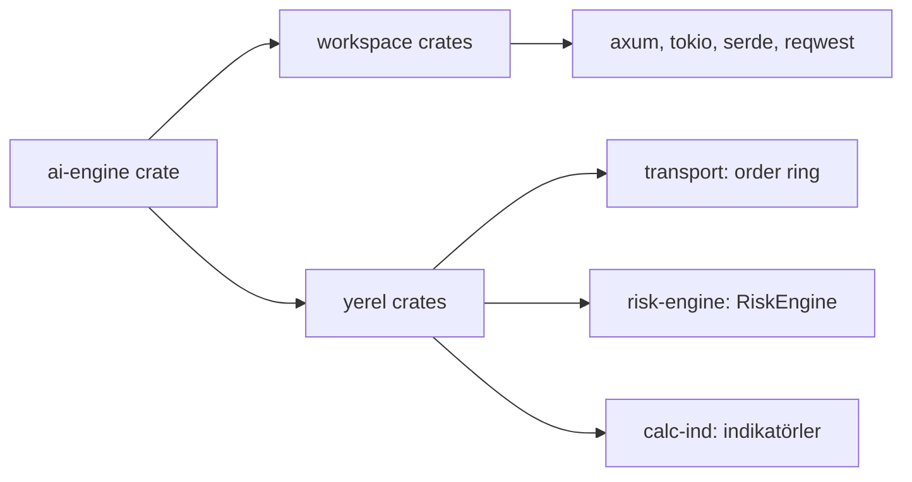

### `src/main.rs`
**Detaylı açıklama:** Daemon giriş noktasıdır; önce `AiConfig::load()` ile ayarları yükler, `make_provider` ile LLM provider'ını kurar (yoksa fail-safe HOLD modu ilan eder), ardından `ContextBuilder`, `RiskGate`, `Executor`, `Coordinator` ve ajanları inşa eder. Arka planda axum ile `/api/health` ve `/api/status` HTTP uçlarını spawn eder. Ana döngüde `run_cycle` her `interval_secs`'te çalışır: her sembol için bağlam kurulur, sağlıksız fiyat kaynağı atlanır, üç ajan paralel çalıştırılır, koordinatör karar verir, risk gate'inden geçirilir ve sonuç özeti `RunSummary` olarak saklanır.
**Neden kullandık:**
- Bağımsız daemon olarak çalışıp HFT ring altyapısıyla HTTP/shm üzerinden haberleşir.
- HTTP status API ile sistem gözlemi ve operasyonel kontrol sağlar.
- Provider yokluğunda çalışmaya devam edip fail-safe HOLD üretir (hiç durmaz).

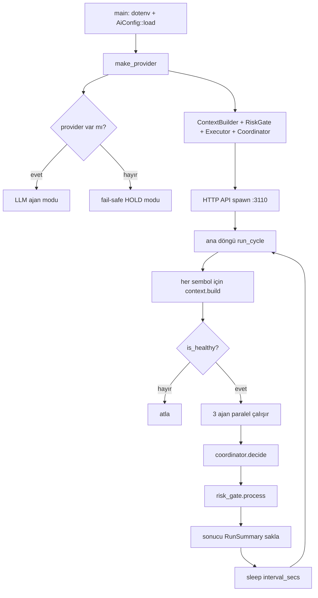

### `src/lib.rs`
**Detaylı açıklama:** Motorun veri sözlüğüdür. `Action` (Buy/Sell/Hold) ve `is_trade` yardımcısı sinyal yönünü tanımlar. `PriceSnapshot`, `IndicatorSnapshot`, `StructureSnapshot` dış servislerden gelen bağlam verisini; `MarketContext` bunların hepsini tek pakette birleştirir (`is_healthy` sağlık kontrolü ve `to_compact_json` token-verimli serileştirme sunar). `SignalOutput`, `RiskOutput`, `SentimentOutput` ajan çıktılarını; `FinalDecision` koordinatörün nihai kararını temsil eder. `now_ms` zaman damgası üretir.
**Neden kullandık:**
- Tüm ajanlar ve katmanlar aynı tipleri paylaşır; serileştirme tek noktadan yönetilir.
- `to_compact_json`, LLM çağrılarında token maliyetini düşürür.
- `FinalDecision::hold` ile hızlı güvenli varsayılan karar üretimi mümkündür.

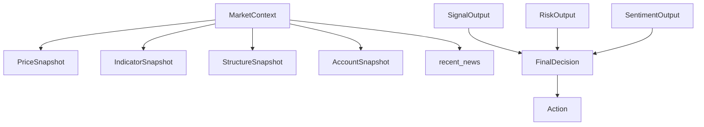

### `src/config.rs`
**Detaylı açıklama:** `ai.toml` dosyasını (veya `AI_CONFIG` env'i) yükler; dosya yoksa veya parse hatası olursa güvenli varsayılanlara döner. `AiConfig` beş bölümden oluşur: `providers` (openai/anthropic/none, model, temperature, max_tokens, timeout), `schedule` (interval, semboller, onay bekleme süresi), `execution` (paper/live/both/none, auto/human onay, execd/paper kimlikleri, max_notional_usdt), `risk` (kapı açık mı, anomaly_veto, risk.toml yolu, başlangıç bakiye) ve `context` (servis URL'leri, aralıklar). LLM API anahtarları env'den (`OPENAI_API_KEY`, `ANTHROPIC_API_KEY`) okunur. Testler varsayılanların ve TOML ayrıştırmanın doğruluğunu doğrular.
**Neden kullandık:**
- Tüm motor davranışı tek TOML dosyasından yapılandırılabilir.
- Varsayılanlara dönüş, yanlış konfigürasyonda bile motorun çalışmasını garanti eder.
- Hassas bilgiler (anahtar, şifre) config'e değil env'e ayrıştırılır.

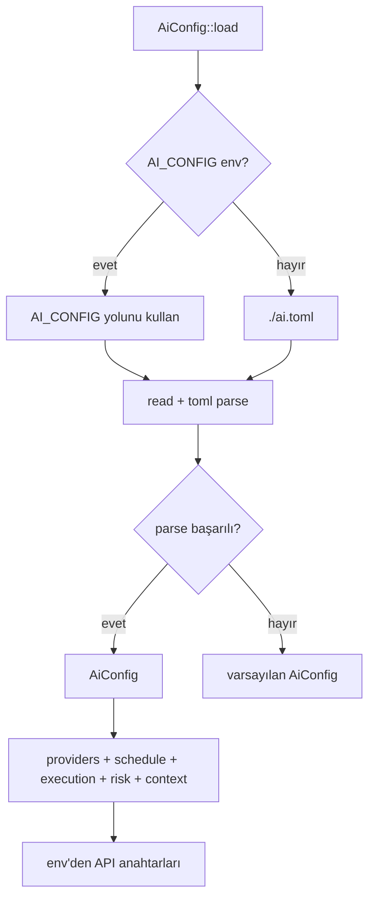

### `src/context.rs`
**Detaylı açıklama:** `ContextBuilder`, sembol başına `MarketContext` üretir. Fiyatı price-feed :3004 `GET /api/lastprice/{symbol}`'den; indikatörleri calc-ind :3007'den (rsi, macd, bbands, vwap, atr her biri ayrı async task; ring sonucu 64MB stack'li ayrı thread ile okunur); piyasa yapısını detect-ms :3002'den alır. Hesap durumunu paper :8080'e JWT ile login olup balance/positions uçlarından çeker; opsiyonel `news_feed_url`'den haber başlıklarını toplar. Fiyat ve yapı paralel (`tokio::join!`) getirilir; hata durumlarında boş/varsayılan snapshot döner (asla panik).
**Neden kullandık:**
- Mevcut ring + REST altyapısını tek bağlam paketine birleştirir (ajanlara tek JSON satırı).
- `tokio::join!` ve paralel spawn ile gecikme minimize edilir (HFT bağlamı).
- Her kaynak hata toleranslıdır; tek kaynak düşse bile bağlam üretilmeye devam eder.

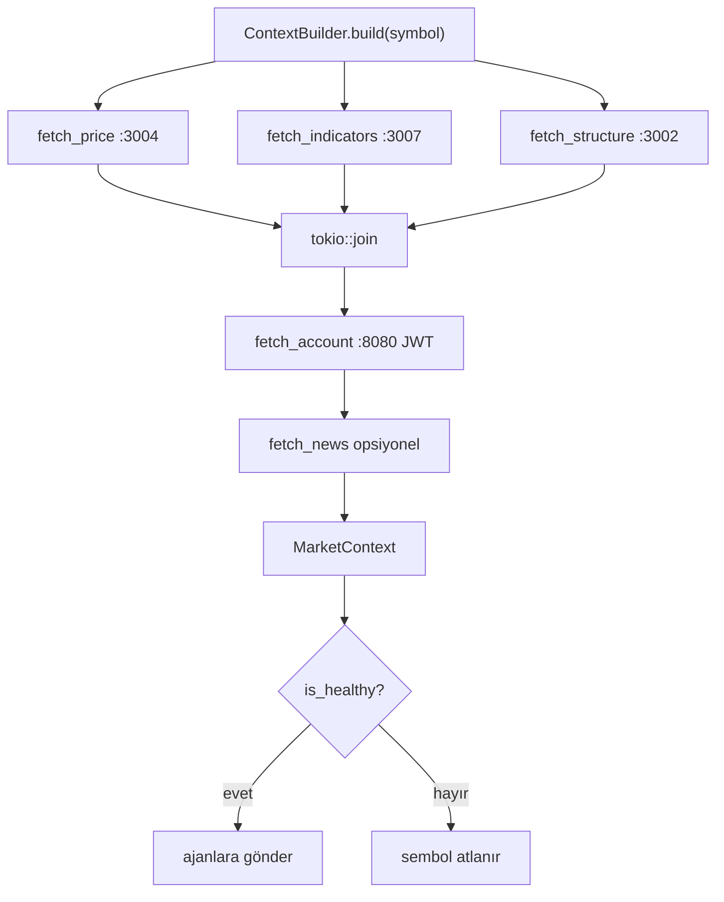

### `src/gates.rs`
**Detaylı açıklama:** `RiskGate` nihai kararı denetim zincirinden geçirir: önce HOLD ve veto bayrakları elenir; `anomaly_veto` açıksa `risk_score >= 0.8` otomatik reddedilir. Ardından deterministik boyut sınırı uygulanır: `quantity = min(quantity, max_notional / mark_price)`; sıfıra düşen miktar Held olur. Emir `OrderIntent`'e çevrilir, `RiskEngine::evaluate`'den (risk.toml politikası) geçer ve onaylanırsa executor'a aktarılır. `on_mark` ile canlı mark fiyatı risk motoruna beslenir (stale-mark reddini önler). Sonuç `GateOutcome` (Executed/Held/Rejected) olarak raporlanır.
**Neden kullandık:**
- LLM kararı ile gerçek emir arasına deterministik güvenlik kapısı koyar.
- RiskEngine politikası + veto + boyut limiti üçlüsü çok katmanlı savunma sağlar.
- HOLD/veto/risk-skoru durumlarında emir hiç dışarı çıkmaz (fail-safe).

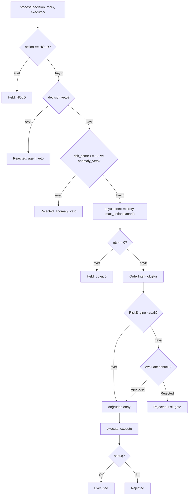

### `src/agents/mod.rs`
**Detaylı açıklama:** Ajan mimarisinin çekirdeğidir. `Agent` trait'i (`id`, `role`, `async run`) tüm ajanların ortak sözleşmesidir; `AgentRole` (Signal/Risk/Sentiment/Coordinator) rol etiketini, `AgentOutput` enum'u ajanların ürettiği tipli çıktıyı taşır. `parse_action` JSON yön string'ini `Action`'a çevirir, `clamp_confidence` ve `clamp_risk` LLM çıktılarını geçerli aralıklara sıkıştırır.
**Neden kullandık:**
- Tek tip trait sayesinde ajanlar yeni eklenebilir/bağımsız test edilebilir.
- `AgentOutput` sayesinde ana döngü çıktı türlerini güvenle match'leyebilir.
- Sıkıştırma fonksiyonları LLM'in aralık dışı değer üretmesini nötralize eder.

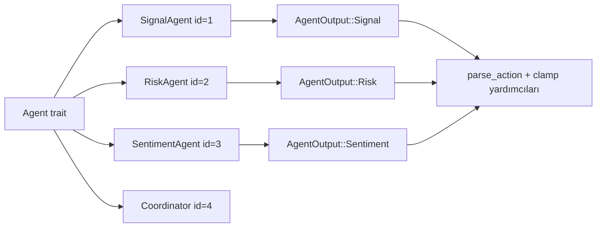

### `src/agents/signal.rs`
**Detaylı açıklama:** Strateji ajanı, `MarketContext`'i compact JSON olarak LLM'e gönderir; sistem promptu BTC/ETH/SOL/VELVETUSDT vadeli işlemler için yalnızca yüksek güvenli fırsatlarda BUY/SELL, belirsizlikte HOLD istemektedir (yapı ve indikatörler çelişiyorsa HOLD). LLM yanıtı `parse_signal` ile ayrıştırılır: `quantity == 0` ise aksiyon zorla HOLD yapılır, güven 0..1'e sıkıştırılır. LLM yoksa veya hata verirse `SignalOutput::default()` (HOLD) döner.
**Neden kullandık:**
- Yön kararını doğal dil kurallarıyla LLM'e bırakarak geleneksel indikatör matrisini esnetir.
- Fail-safe varsayılan (HOLD) sayesinde LLM arızasında asla sinyal üretilmez.
- Prompt kuralları (çelişkide HOLD) kör alım-satımı önler.

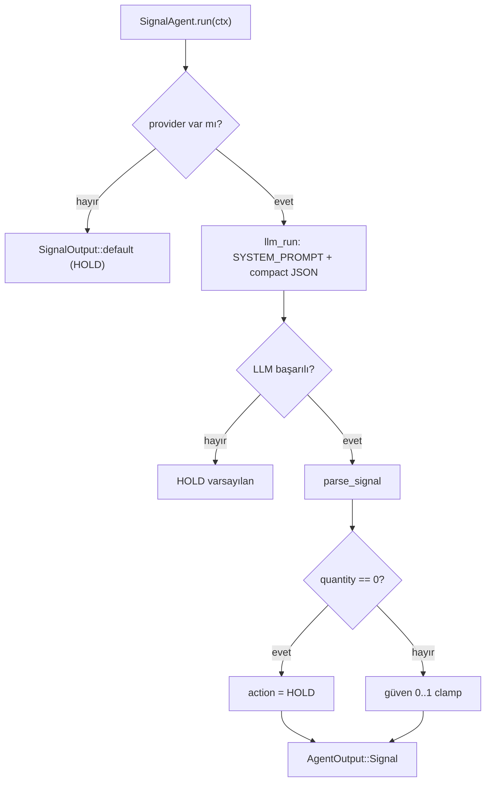

### `src/agents/risk.rs`
**Detaylı açıklama:** Risk ajanı, piyasa bağlamından risk postürü üretir: aşırı volatilite (atr orantısız), kritik seviyelere dayanma (detect-ms level'larına yakınlık) ve anormal indikatör değerleri durumunda `veto=true` döndürmesi prompt ile istenir. LLM yanıtı `parse_risk` ile ayrıştırılır: risk skoru 0..1'e sıkıştırılır, `max_size_bps` 0..10000 ile sınırlanır, veto bayrağı korunur. LLM yoksa/hata varsa nötr (risk_score 0.5, veto=false) döner.
**Neden kullandık:**
- LLM'in piyasa yapısını yorumlayarak insan benzeri risk sezgisi üretmesi amaçlanır.
- `veto` mekanizması koordinatör kararını tamamen iptal edebilen fail-safe anahtardır.
- Nötr varsayılan "fail-open değil, tarafsız" prensibiyle sistemi güvenli tutar.

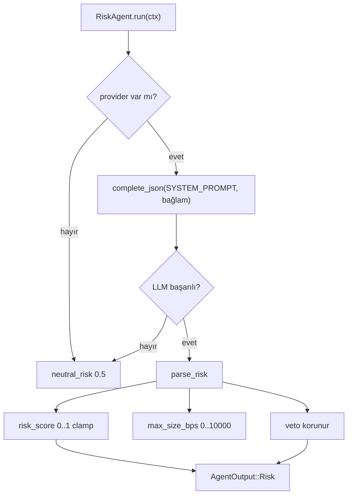

### `src/agents/sentiment.rs`
**Detaylı açıklama:** Duygu ajanı, `ctx.recent_news` içindeki haber başlıklarını birleştirip LLM'e gönderir; -1.0..+1.0 sentiment, trend terimleri ve önyargı (bulut/boğa/nötr/ayı) döndürmesi istenir. Haber listesi boşsa veya LLM yoksa/hata verirse nötr `SentimentOutput::default()` döner. `parse_sentiment` çıktıyı -1..1 aralığına sıkıştırır.
**Neden kullandık:**
- Haber akışından piyasa duyarlılığı çıkararak koordinatörün kararını zenginleştirir.
- Haber kaynağı yokken bile sistem nötr kalarak bozulmaz.
- Koordinatör fallback'te negatif sentimentte miktarı küçültme kararında bu çıktıyı kullanır.

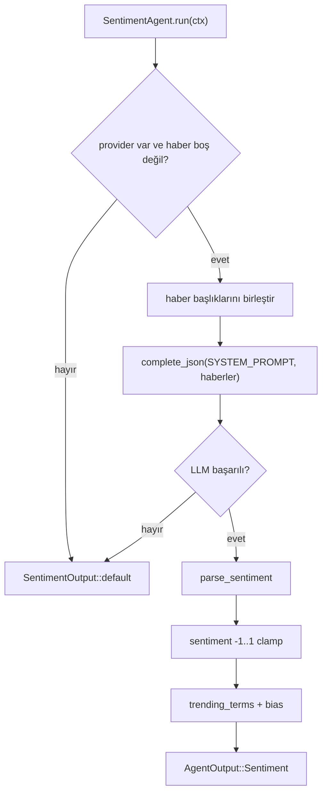

### `src/agents/coordinator.rs`
**Detaylı açıklama:** Koordinatör ajan, üç ajanın çıktısını (signal, risk, sentiment) JSON paketinde LLM'e sunar ve tek `FinalDecision` üretmesini ister. Kurallar prompt'ta sabittir: risk vetosu varsa HOLD + quantity 0; sinyal güveni >= 0.5 altında HOLD; sentiment zıtsa miktar küçültülür; riskli yapıda HOLD. LLM kararı her zaman risk veto kontrolünden geçer (fail-safe öncelik). LLM yoksa/hata varsa deterministik `fallback` çalışır: veto veya düşük güven → HOLD; aksi halde sinyal kararı alınır ve sentiment < -0.3 ise miktar %50 azaltılır. `parse_final` ham JSON'u güvenli `FinalDecision`'a çevirir (miktar 0 → HOLD).
**Neden kullandık:**
- Çoklu ajan görüşünü tek, uygulanabilir karara indirger.
- LLM ve deterministik fallback çift yolu, provider kesintisinde bile karar üretimini sürdürür.
- Risk veto önceliği, en kısıtlayıcı ajanın görüşünü her koşulda uygular.

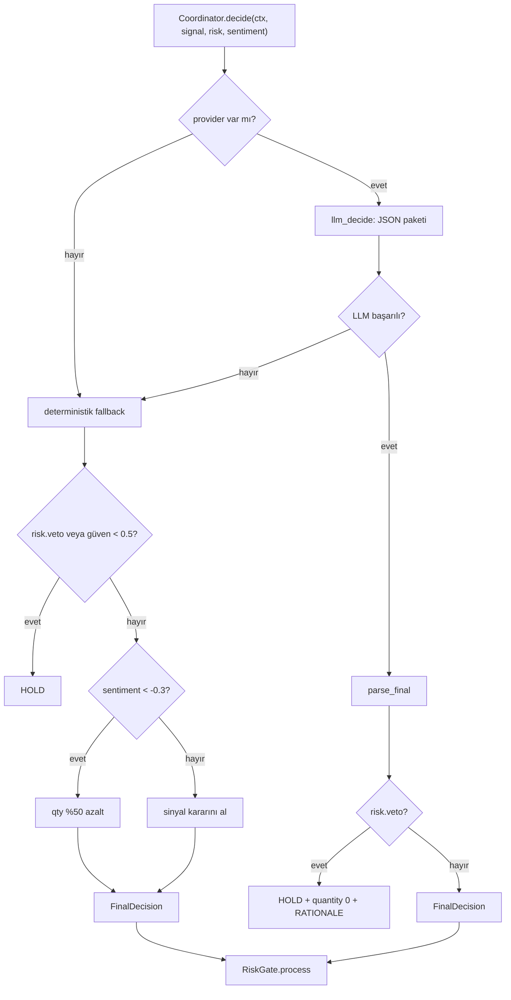

### `src/executor/mod.rs`
**Detaylı açıklama:** `Executor`, gate'ten onaylı emri fiilen dışarıya gönderen soyut katmandır. `mode` (paper/live/both/none) hangi hedefe gidileceğini; `approval` (auto/human) ise HITL politikasını belirler. `human` modunda emir `/tmp/ai_pending.json`'a yazılır ve `/tmp/ai_approve.txt` dosyasına "approve/reject" yazılana kadar `approval_wait_secs` boyunca bekler; zaman aşımı fail-safe reddir. `both` modunda paper ve live sıralı çalıştırılır; paper başarısızsa iptal edilir.
**Neden kullandık:**
- Tek `execute` arayüzüyle paper/live geçişi tamamen config'e bağlanır.
- HITL onayı dosya tabanlı basit bir mekanizmayla insan kontrolü sağlar.
- Zaman aşımı ve red durumları emir göndermeyi güvenle durdurur.

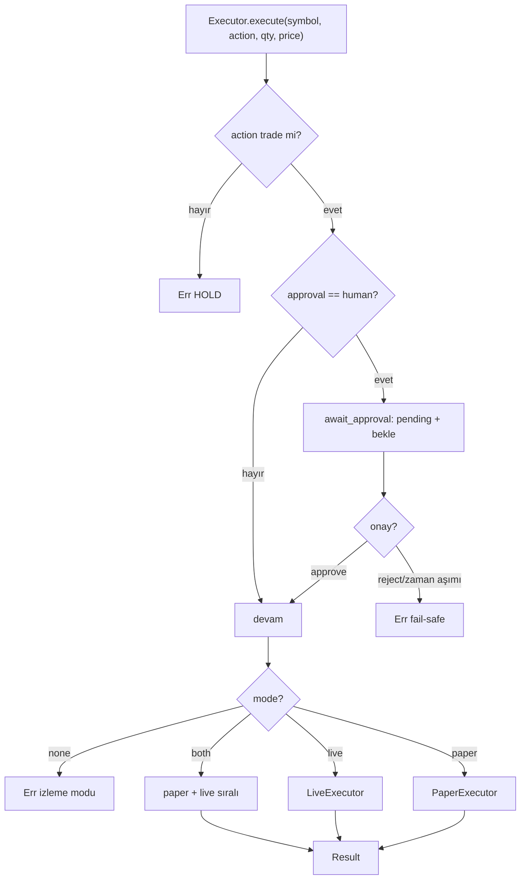

### `src/executor/paper.rs`
**Detaylı açıklama:** Paper icra, emri `/cycle_finance_orders` adlı shared-memory order ring'ine yazar; paper-service bridge bunu alıp aktöre iletir (STRATEGY → EXECUTION yolu). `OrderRingBuffer::new` `catch_unwind` ile sarılır; ring açılamazsa panik yerine `None` döner. Emir, fiyat verilmişse Limit, değilse Market tipiyle, sembol ve miktar baytlarıyla ring'e `push` edilir ve onay mesajı döner.
**Neden kullandık:**
- Gerçek canlı piyasaya dokunmadan tüm emir yaşam döngüsünü uçtan uca test eder.
- shm ring, ajan katmanı ile paper service arasında düşük gecikmeli IPC sağlar.
- `catch_unwind` ile altyapı hatasında daemon çökmeden devam eder.

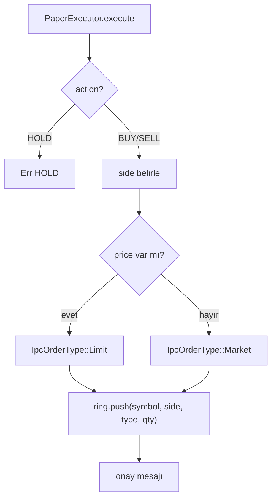

### `src/executor/live.rs`
**Detaylı açıklama:** Canlı icra, executiond :3010'un REST API'sine JWT ile bağlanan client'tır. `execute` önce `/api/v1/auth/login` ile token alır, ardından `/api/v1/orders`'a `client_order_id` (ai_ + ts) ile emir JSON'unu `Bearer` yetkisiyle POST eder. Yanıt başarılıysa durum + gövde döner; değilse hata mesajı üretilir.
**Neden kullandık:**
- Canlı emir gönderimini executiond hizmetine delege ederek gerçek borsa entegrasyonunu ayrıştırır.
- JWT auth, emir uçlarına yetkisiz erişimi engeller.
- Hata durumlarında detaylı yanıt gövdesiyle operatöre geri bildirim verir.

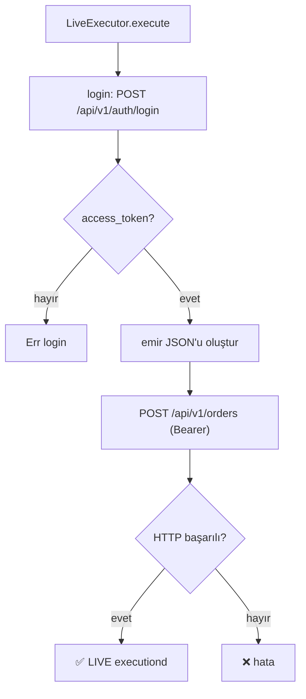

### `src/llm/mod.rs`
**Detaylı açıklama:** LLM katmanının soyutlamasıdır. `LlmProvider` trait'i `name()` ve `complete_json(system, user)` ile provider-agnostik tek arayüz sunar; tüm ajanlar bu trait üzerinden konuşur. `LlmError` ayrıntılı hata tiplerini (NoProvider/Http/Status/Parse/Timeout) taşır. `make_provider` config'deki `provider` alanına ve env anahtarlarına göre OpenAI veya Anthropic provider'ını `Arc<dyn LlmProvider>` olarak üretir; `none` veya anahtar eksikse `None` döner.
**Neden kullandık:**
- OpenAI/Anthropic geçişini tek config değişkenine indirger (satıcı bağımlılığı azalır).
- Ajanlar tüm hata tiplerini tek `LlmError` altında yönetir.
- `None` dönüşü ajanları fail-safe varsayılanlara yönlendirir (asla kör emir).

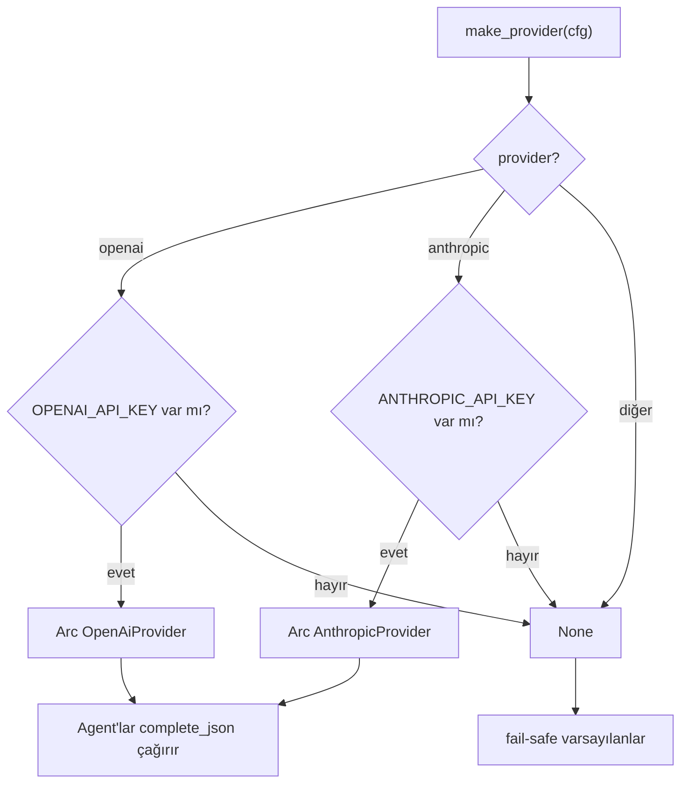

### `src/llm/openai.rs`
**Detaylı açıklama:** OpenAI Chat Completions istemcisidir. İstek gövdesinde `response_format: {type: json_object}` ile structured output zorlanır; system + user mesajları `https://api.openai.com/v1/chat/completions`'a `Bearer` auth ile gönderilir. Yanıt `choices[0].message.content`'ten okunur ve gömülü JSON metni `serde_json::from_str` ile değer tipine çevrilir. Tüm istek `timeout` ile sarılıdır; durum kodu başarısızsa `LlmError::Status` döner.
**Neden kullandık:**
- `json_object` response format, LLM'in şema dışı çıktı üretme ihtimalini azaltır.
- Gömülü JSON'un ayrıştırılması agent'ların doğrudan kendi tiplerine çözmesini sağlar.
- Timeout sarmalayıcı, yavaş yanıtların HFT döngüsünü kilitlemesini önler.

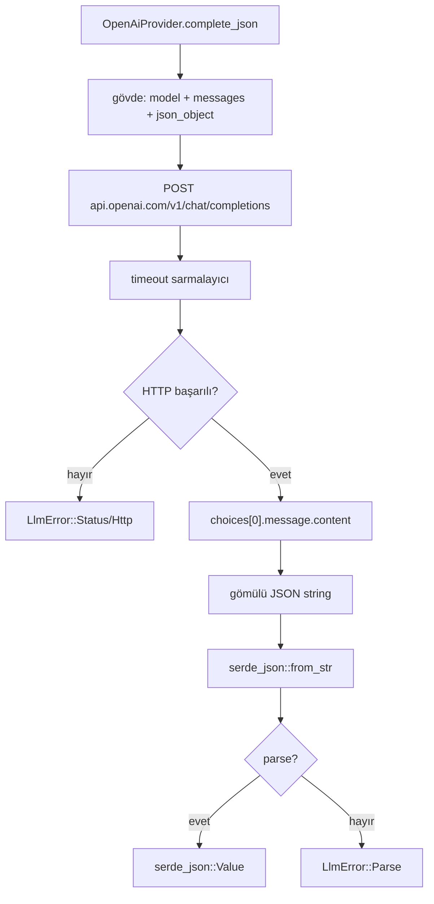

### `src/llm/anthropic.rs`
**Detaylı açıklama:** Anthropic Messages API istemcisidir. İstek `system` alanı ve tek user mesajıyla `https://api.anthropic.com/v1/messages`'e `x-api-key` + `anthropic-version` başlıklarıyla gönderilir; user mesajına "Tek JSON nesnesiyle yanıtla" talimatı eklenir. Yanıt `content[0].text`'ten alınır ve gömülü JSON metni değer tipine çevrilir. Tüm istek `timeout` ile sarılıdır.
**Neden kullandık:**
- Anthropic'in `system` alanı, sistem promptlarının ayrı kanalda verilmesini sağlar.
- `content[0].text` üzerinden gömülü JSON çözümü ajan tipleriyle birebir uyumludur.
- Aynı `LlmProvider` trait'i altında OpenAI ile simetrik kullanım sunar.

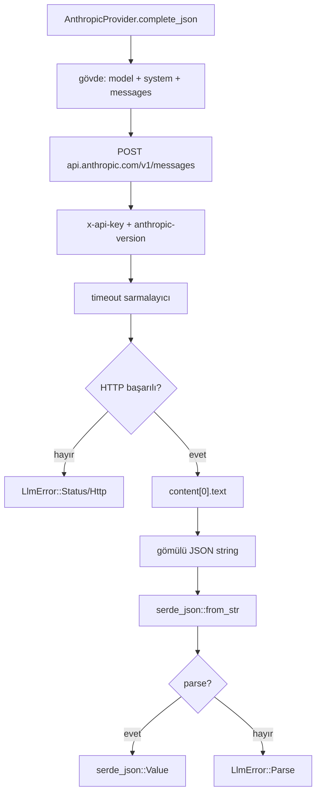

---

## Özet

- **17 dosya analiz edildi** (1 Cargo.toml + 16 Rust dosyası: main.rs, lib.rs, config.rs, context.rs, gates.rs, agents/mod.rs + 4 ajan, executor/mod.rs + 2 icra, llm/mod.rs + 2 provider).
- **17 mermaid diyagramı** oluşturuldu (her dosya için bir tane; kritik akışlar: ajan koordinasyonu, güvenlik kapıları, LLM çağrı akışı, icra ve bağlam toplama dahil).

---

## 📄 Tam Kaynak Kodu

### `ai-engine/Cargo.toml`

```toml
[package]
name = "ai-engine"
version = "0.1.0"
edition = "2021"

[lib]
name = "ai_engine"

[dependencies]
axum = { workspace = true }
tokio = { workspace = true }
serde = { workspace = true }
serde_json = { workspace = true }
rust_decimal = { workspace = true }
reqwest = { workspace = true }
toml = { workspace = true }
chrono = { workspace = true }
dotenvy = { workspace = true }
async-trait = { workspace = true }
parking_lot = { workspace = true }
transport = { path = "../cycle-engine/transport" }
risk-engine = { path = "../risk-engine" }
calc-ind = { version = "0.1.0", path = "../services-engine/calc-ind" }
```

### `ai-engine/src/config.rs`

```rust
//! AI Engine konfigürasyonu — `ai.toml` yükleme ve varsayılanlar.

use serde::Deserialize;
use std::path::{Path, PathBuf};

/// Kök config. `ai.toml` dosyasından yüklenir (yoksa varsayılan).
#[derive(Debug, Clone, Deserialize)]
#[serde(default)]
pub struct AiConfig {
    pub providers: ProvidersConfig,
    pub schedule: ScheduleConfig,
    pub execution: ExecutionConfig,
    pub risk: RiskGateConfig,
    pub context: ContextConfig,
}

#[derive(Debug, Clone, Deserialize)]
#[serde(default)]
pub struct ProvidersConfig {
    /// openai | anthropic | none
    pub provider: String,
    pub openai_model: String,
    pub anthropic_model: String,
    pub temperature: f64,
    pub max_tokens: u32,
    pub timeout_secs: u64,
}

impl Default for ProvidersConfig {
    fn default() -> Self {
        Self {
            provider: "none".into(),
            openai_model: "gpt-4o-mini".into(),
            anthropic_model: "claude-sonnet-4-20250514".into(),
            temperature: 0.2,
            max_tokens: 2048,
            timeout_secs: 60,
        }
    }
}

#[derive(Debug, Clone, Deserialize)]
#[serde(default)]
pub struct ScheduleConfig {
    pub interval_secs: u64,
    pub symbols: Vec<String>,
    pub approval_wait_secs: u64,
}

impl Default for ScheduleConfig {
    fn default() -> Self {
        Self {
            interval_secs: 60,
            symbols: vec![
                "BTCUSDT".into(),
                "ETHUSDT".into(),
                "SOLUSDT".into(),
                "VELVETUSDT".into(),
            ],
            approval_wait_secs: 60,
        }
    }
}

#[derive(Debug, Clone, Deserialize)]
#[serde(default)]
pub struct ExecutionConfig {
    /// paper | live | both | none
    pub mode: String,
    /// auto | human (HITL onayı)
    pub approval: String,
    pub execd_url: String,
    pub execd_user: String,
    pub execd_password: String,
    pub paper_url: String,
    pub paper_admin_user: String,
    pub paper_admin_pass: String,
    /// Deterministik emir boyutu sınırı (USDT).
    pub max_notional_usdt: f64,
}

impl Default for ExecutionConfig {
    fn default() -> Self {
        Self {
            mode: "paper".into(),
            approval: "auto".into(),
            execd_url: "http://127.0.0.1:3010".into(),
            execd_user: "admin".into(),
            execd_password: "changeme123".into(),
            paper_url: "http://127.0.0.1:8080".into(),
            paper_admin_user: "admin".into(),
            paper_admin_pass: "changeme123".into(),
            max_notional_usdt: 1_000.0,
        }
    }
}

#[derive(Debug, Clone, Deserialize)]
#[serde(default)]
pub struct RiskGateConfig {
    pub enable_risk_gate: bool,
    pub anomaly_veto: bool,
    pub risk_config_path: String,
    pub initial_balance_usdt: f64,
}

impl Default for RiskGateConfig {
    fn default() -> Self {
        Self {
            enable_risk_gate: true,
            anomaly_veto: true,
            risk_config_path: "risk.toml".into(),
            initial_balance_usdt: 100_000.0,
        }
    }
}

#[derive(Debug, Clone, Deserialize)]
#[serde(default)]
pub struct ContextConfig {
    pub price_feed_url: String,
    pub detect_ms_url: String,
    pub calc_ind_url: String,
    /// İsteğe bağlı haber kaynağı (boş ise duygu agent'ı nötr kalır).
    pub news_feed_url: String,
    pub indicator_interval: String,
    pub structure_interval: String,
    pub structure_limit: u32,
}

impl Default for ContextConfig {
    fn default() -> Self {
        Self {
            price_feed_url: "http://127.0.0.1:3004".into(),
            detect_ms_url: "http://127.0.0.1:3002".into(),
            calc_ind_url: "http://127.0.0.1:3007".into(),
            news_feed_url: String::new(),
            indicator_interval: "1m".into(),
            structure_interval: "1m".into(),
            structure_limit: 100,
        }
    }
}

impl AiConfig {
    /// `AI_CONFIG` env'inden veya `./ai.toml`'dan yükler; dosya yoksa varsayılan.
    pub fn load() -> Self {
        let path = Self::resolve_path();
        Self::load_from(&path)
    }

    pub fn resolve_path() -> PathBuf {
        std::env::var("AI_CONFIG")
            .map(PathBuf::from)
            .unwrap_or_else(|_| PathBuf::from("ai.toml"))
    }

    pub fn load_from(path: &Path) -> Self {
        match std::fs::read_to_string(path) {
            Ok(content) => toml::from_str::<AiConfig>(&content)
                .unwrap_or_else(|e| {
                    eprintln!("⚠️  ai.toml parse hatası ({e}) — varsayılan config kullanılıyor");
                    AiConfig::default()
                }),
            Err(_) => AiConfig::default(),
        }
    }

    /// LLM API anahtarlarını env'den okur.
    pub fn openai_api_key() -> Option<String> {
        std::env::var("OPENAI_API_KEY").ok().filter(|k| !k.is_empty())
    }

    pub fn anthropic_api_key() -> Option<String> {
        std::env::var("ANTHROPIC_API_KEY").ok().filter(|k| !k.is_empty())
    }
}

impl Default for AiConfig {
    fn default() -> Self {
        Self {
            providers: ProvidersConfig::default(),
            schedule: ScheduleConfig::default(),
            execution: ExecutionConfig::default(),
            risk: RiskGateConfig::default(),
            context: ContextConfig::default(),
        }
    }
}

#[cfg(test)]
mod tests {
    use super::*;

    #[test]
    fn defaults_are_sane() {
        let c = AiConfig::default();
        assert_eq!(c.providers.provider, "none");
        assert_eq!(c.schedule.interval_secs, 60);
        assert_eq!(c.execution.mode, "paper");
        assert!(!c.schedule.symbols.is_empty());
    }

    #[test]
    fn parses_toml() {
        let toml = r#"
[providers]
provider = "openai"
openai_model = "gpt-4o"

[schedule]
interval_secs = 30
symbols = ["BTCUSDT", "ETHUSDT"]

[execution]
mode = "both"
approval = "human"
max_notional_usdt = 500

[risk]
enable_risk_gate = true
anomaly_veto = true
"#;
        let c: AiConfig = toml::from_str(toml).expect("toml parse");
        assert_eq!(c.providers.provider, "openai");
        assert_eq!(c.schedule.interval_secs, 30);
        assert_eq!(c.execution.mode, "both");
        assert_eq!(c.execution.approval, "human");
        assert_eq!(c.execution.max_notional_usdt, 500.0);
    }
}
```

### `ai-engine/src/context.rs`

```rust
//! Bağlam toplayıcı — mevcut ring'lerden ve REST servislerinden sembol başına
//! birleşik `MarketContext` üretir.
//!
//! Kaynaklar:
//!   - fiyat    : price-feed :3004  `GET /api/lastprice/{symbol}`
//!   - indik.   : calc-ind   :3007  `POST /api/calc` + `/cycle_finance_calc` ring okuma
//!   - yapı     : detect-ms  :3002  `GET /api/ms?symbol=&interval=&limit=`
//!   - hesap    : paper      :8080  (JWT) `GET /api/v1/account/{balance,positions}`
//!   - haber    : `news_feed_url` (opsiyonel)

use crate::config::AiConfig;
use crate::{AccountSnapshot, IndicatorSnapshot, MarketContext, PositionSummary, PriceSnapshot, StructureSnapshot, now_ms};
use serde::Deserialize;
use std::collections::HashMap;

const INDICATORS: &[&str] = &["rsi", "macd", "bbands", "vwap", "atr"];

pub struct ContextBuilder {
    client: reqwest::Client,
    price_feed_url: String,
    detect_ms_url: String,
    calc_ind_url: String,
    news_feed_url: String,
    indicator_interval: String,
    structure_interval: String,
    structure_limit: u32,
    paper_url: String,
    paper_user: String,
    paper_pass: String,
}

impl ContextBuilder {
    pub fn new(cfg: &AiConfig) -> Self {
        let paper_url = std::env::var("PAPER_API_ADDR").unwrap_or_else(|_| cfg.execution.paper_url.clone());
        Self {
            client: reqwest::Client::new(),
            price_feed_url: cfg.context.price_feed_url.clone(),
            detect_ms_url: cfg.context.detect_ms_url.clone(),
            calc_ind_url: cfg.context.calc_ind_url.clone(),
            news_feed_url: cfg.context.news_feed_url.clone(),
            indicator_interval: cfg.context.indicator_interval.clone(),
            structure_interval: cfg.context.structure_interval.clone(),
            structure_limit: cfg.context.structure_limit,
            paper_user: std::env::var("PAPER_ADMIN_USER").unwrap_or_else(|_| cfg.execution.paper_admin_user.clone()),
            paper_pass: std::env::var("PAPER_ADMIN_PASS").unwrap_or_else(|_| cfg.execution.paper_admin_pass.clone()),
            paper_url,
        }
    }

    pub async fn build(&self, symbol: &str, all_symbols: &[String]) -> MarketContext {
        let price = self.fetch_price(symbol).await;
        let (indicators, structure) = tokio::join!(
            self.fetch_indicators(symbol),
            self.fetch_structure(symbol),
        );
        let account = self.fetch_account(all_symbols).await;
        let recent_news = self.fetch_news().await;

        MarketContext {
            generated_at_ms: now_ms(),
            price,
            indicators,
            structure,
            account,
            recent_news,
        }
    }

    // ── Fiyat ──────────────────────────────────────────────────────
    async fn fetch_price(&self, symbol: &str) -> PriceSnapshot {
        let url = format!("{}/api/lastprice/{}", self.price_feed_url, symbol);
        let resp = self.client.get(&url).send().await;
        let v: serde_json::Value = match resp {
            Ok(r) => match r.json().await {
                Ok(v) => v,
                Err(_) => return PriceSnapshot::default(),
            },
            Err(_) => return PriceSnapshot::default(),
        };
        let price = &v["price"];
        PriceSnapshot {
            symbol: v["symbol"].as_str().unwrap_or(symbol).to_string(),
            last: price["last"].as_f64().unwrap_or(0.0),
            mark: price["mark"].as_f64().unwrap_or(0.0),
            bid: price["bid"].as_f64().unwrap_or(0.0),
            ask: price["ask"].as_f64().unwrap_or(0.0),
            ts: price["ts"].as_u64().unwrap_or(0),
        }
    }

    // ── İndikatörler (calc-ind + ring) ─────────────────────────────
    async fn fetch_indicators(&self, symbol: &str) -> IndicatorSnapshot {
        let mut out = IndicatorSnapshot { symbol: symbol.to_string(), ..Default::default() };

        let mut handles = Vec::new();
        for ind in INDICATORS {
            let symbol = symbol.to_string();
            let interval = self.indicator_interval.clone();
            let addr = self.calc_ind_url.clone();
            handles.push(tokio::spawn(async move {
                let req = calc_ind::IndRequest::new(&symbol, &interval, None, None, ind);
                let outcome = calc_ind::client::request(&addr, &req).await.map_err(|e| e.to_string());
                match outcome {
                    Ok(id) => {
                        // read_result her slot'ta 1MB CalcSlot kopyalar; tokio blocking
                        // pool'unun 2MB stack'i taşmaz — geniş stack'li ayrı thread kullan.
                        let handle = std::thread::Builder::new()
                            .name("calc-ring-read".into())
                            .stack_size(64 * 1024 * 1024)
                            .spawn(move || calc_ind::client::read_result(id, 2, 50))
                            .map(|h| h.join().ok().flatten())
                            .unwrap_or(None);
                        (ind.to_string(), handle)
                    }
                    Err(_) => (ind.to_string(), None),
                }
            }));
        }

        for h in handles {
            if let Ok((name, res)) = h.await {
                if let Some(res) = res {
                    fill_indicators(&mut out, &name, &res.series);
                }
            }
        }
        out
    }

    // ── Piyasa yapısı (detect-ms) ──────────────────────────────────
    async fn fetch_structure(&self, symbol: &str) -> StructureSnapshot {
        let url = format!(
            "{}/api/ms?symbol={}&interval={}&limit={}",
            self.detect_ms_url, symbol, self.structure_interval, self.structure_limit
        );
        let mut out = StructureSnapshot { symbol: symbol.to_string(), ..Default::default() };
        let Ok(resp) = self.client.get(&url).send().await else {
            return out;
        };
        let Ok(v) = resp.json::<serde_json::Value>().await else {
            return out;
        };
        let ms: Option<MsmpResponse> = serde_json::from_value(v).ok();
        let Some(ms) = ms else { return out };

        out.ats = ms.ats;
        out.hurst = ms.hurst;
        out.r_squared = ms.r_squared;
        out.trend_label = ms.trend_label;
        out.confluence_index = ms.confluence_index;
        out.vwap = ms.vwap;
        out.poc = ms.poc;
        out.bsl_ssl_ratio = ms.bsl_ssl_ratio;
        out.atr = ms.atr;
        out.current_price = ms.current_price;
        out.levels = ms
            .levels
            .iter()
            .take(8)
            .map(|l| format!("{}@{} pri:{}", l.level_type, l.price, l.priority_score))
            .collect();
        out
    }

    // ── Hesap durumu (paper JWT) ───────────────────────────────────
    async fn fetch_account(&self, symbols: &[String]) -> Option<AccountSnapshot> {
        let token = self.paper_token().await?;
        let auth = format!("Bearer {}", token);

        let bal_url = format!("{}/api/v1/account/balance", self.paper_url);
        let pos_url = format!("{}/api/v1/account/positions", self.paper_url);

        let bal_fut = self.client.get(&bal_url).header("Authorization", &auth).send();
        let pos_fut = self.client.get(&pos_url).header("Authorization", &auth).send();

        let (bal, pos) = tokio::join!(bal_fut, pos_fut);
        let bal_v: serde_json::Value = bal.ok()?.json().await.ok()?;
        let pos_v: serde_json::Value = pos.ok()?.json().await.ok()?;

        let mut positions = Vec::new();
        if let Some(arr) = pos_v["positions"].as_array() {
            for p in arr {
                let symbol = p["symbol"].as_str().unwrap_or("").to_string();
                if !symbols.is_empty() && !symbols.contains(&symbol) {
                    continue;
                }
                let qty = p["quantity"].as_f64().or_else(|| p["positionAmt"].as_f64()).unwrap_or(0.0);
                if qty.abs() < 1e-9 {
                    continue;
                }
                positions.push(PositionSummary {
                    symbol,
                    side: p["side"].as_str().or_else(|| p["positionSide"].as_str()).unwrap_or("").to_string(),
                    quantity: qty,
                    entry_price: p["entry_price"].as_f64().or_else(|| p["entryPrice"].as_f64()).unwrap_or(0.0),
                    unrealized_pnl: p["unrealized_pnl"].as_f64().unwrap_or(0.0),
                });
            }
        }

        Some(AccountSnapshot {
            equity: bal_v["equity"].as_str().and_then(|s| s.parse().ok()),
            cash_balance: bal_v["cash_balance"].as_str().and_then(|s| s.parse().ok()),
            positions,
        })
    }

    async fn paper_token(&self) -> Option<String> {
        let url = format!("{}/api/v1/auth/login", self.paper_url);
        let body = serde_json::json!({
            "username": self.paper_user,
            "password": self.paper_pass,
        });
        let resp = self.client.post(&url).json(&body).send().await.ok()?;
        let v: serde_json::Value = resp.json().await.ok()?;
        v["access_token"].as_str().map(str::to_string)
    }

    // ── Haber (opsiyonel dış kaynak) ───────────────────────────────
    async fn fetch_news(&self) -> Vec<String> {
        if self.news_feed_url.trim().is_empty() {
            return Vec::new();
        }
        let Ok(resp) = self.client.get(&self.news_feed_url).send().await else {
            return Vec::new();
        };
        let Ok(v) = resp.json::<serde_json::Value>().await else {
            return Vec::new();
        };
        let mut out = Vec::new();
        if let Some(arr) = v.as_array() {
            for item in arr {
                if let Some(t) = item["title"].as_str().or_else(|| item.as_str()) {
                    out.push(t.to_string());
                }
            }
        } else if let Some(arr) = v["articles"].as_array() {
            for item in arr {
                if let Some(t) = item["title"].as_str() {
                    out.push(t.to_string());
                }
            }
        }
        out
    }
}

fn fill_indicators(out: &mut IndicatorSnapshot, name: &str, series: &HashMap<String, Vec<Option<f64>>>) {
    let last = |key: &str| -> Option<f64> {
        series
            .get(key)
            .and_then(|v| v.iter().rev().find_map(|x| *x))
    };
    match name {
        "rsi" => {
            if let Some(v) = last("rsi") {
                out.rsi = Some(v);
            }
        }
        "macd" => {
            out.macd = last("macd").or_else(|| last("value"));
            out.macd_signal = last("signal");
        }
        "bbands" => {
            out.bbands_upper = last("upper");
            out.bbands_middle = last("middle");
            out.bbands_lower = last("lower");
            out.sma20 = out.bbands_middle;
        }
        "vwap" => out.vwap = last("vwap"),
        "atr" => out.atr = last("atr"),
        _ => {}
    }
}

/// detect-ms raporunun f64 sürümü (Decimal → f64 çözülür).
#[derive(Debug, Default, Deserialize)]
struct MsmpResponse {
    ats: Option<f64>,
    hurst: Option<f64>,
    r_squared: Option<f64>,
    trend_label: Option<String>,
    confluence_index: Option<f64>,
    vwap: Option<f64>,
    poc: Option<f64>,
    bsl_ssl_ratio: Option<f64>,
    atr: Option<f64>,
    levels: Vec<MsmpLevel>,
    current_price: Option<f64>,
}

#[derive(Debug, Default, Deserialize)]
struct MsmpLevel {
    level_type: String,
    price: f64,
    priority_score: f64,
}
```

### `ai-engine/src/gates.rs`

```rust
//! Risk kapısı — `RiskEngine` (risk.toml politikası) + deterministik boyut kırpma
//! + agent veto kuralları. Onaylanan kararlar executor'a gider.

use crate::config::AiConfig;
use crate::executor::Executor;
use crate::{Action, FinalDecision};
use risk_engine::engine::RiskEngine;
use risk_engine::types::{MarkPrice, OrderIntent, OrderKind, Side};
use rust_decimal::prelude::FromPrimitive;
use rust_decimal::Decimal;
use std::path::Path;

/// Gate sonucu — denetim izi/ekran için.
pub enum GateOutcome {
    Executed(String),
    Held(String),
    Rejected(String),
}

impl std::fmt::Display for GateOutcome {
    fn fmt(&self, f: &mut std::fmt::Formatter<'_>) -> std::fmt::Result {
        match self {
            GateOutcome::Executed(msg) => write!(f, "İCRA EDİLDİ: {msg}"),
            GateOutcome::Held(msg) => write!(f, "BEKLEMEDE: {msg}"),
            GateOutcome::Rejected(msg) => write!(f, "REDDEDİLDİ: {msg}"),
        }
    }
}

pub struct RiskGate {
    engine: Option<RiskEngine>,
    anomaly_veto: bool,
    max_notional: Decimal,
}

impl RiskGate {
    pub fn new(cfg: &AiConfig) -> Self {
        let engine = if cfg.risk.enable_risk_gate {
            let policy = risk_engine::config::load_risk_config_from(Path::new(&cfg.risk.risk_config_path))
                .unwrap_or_default();
            let balance = Decimal::from_f64(cfg.risk.initial_balance_usdt)
                .unwrap_or(Decimal::from(100_000));
            Some(RiskEngine::with_policy(balance, policy))
        } else {
            None
        };
        Self {
            engine,
            anomaly_veto: cfg.risk.anomaly_veto,
            max_notional: Decimal::from_f64(cfg.execution.max_notional_usdt)
                .unwrap_or(Decimal::from(1_000)),
        }
    }

    /// Risk engine'ine canlı mark fiyatı besler (stale-mark reddini önler).
    pub fn on_mark(&self, symbol: &str, price: f64) {
        if let Some(eng) = &self.engine {
            let p = Decimal::from_f64(price).unwrap_or_default();
            if p.is_zero() {
                return;
            }
            eng.on_mark(&MarkPrice {
                symbol: symbol.to_string(),
                price: p,
                ts_ms: crate::now_ms(),
            });
        }
    }

    /// Kararı gate'ten geçirir; onaylanırsa executor'a iletir.
    pub async fn process(
        &self,
        decision: &FinalDecision,
        mark_price: Decimal,
        executor: &Executor,
    ) -> GateOutcome {
        if decision.action == Action::Hold {
            return GateOutcome::Held(format!("HOLD — {}", decision.rationale));
        }
        if decision.veto {
            return GateOutcome::Rejected("agent veto".into());
        }

        // Yüksek risk skoru + anomaly_veto açıksa otomatik red.
        if self.anomaly_veto && decision.risk_score >= 0.8 {
            return GateOutcome::Rejected(format!(
                "risk_score {:.2} >= 0.8 (anomaly_veto)",
                decision.risk_score
            ));
        }

        // Deterministik boyut sınırı: max_notional_usdt / mark.
        let mut quantity = decision.quantity;
        if mark_price.is_sign_positive() {
            let cap = self.max_notional / mark_price;
            quantity = quantity.min(cap);
        }
        if quantity.is_zero() || quantity.is_sign_negative() {
            return GateOutcome::Held("boyut sınırı sonrası miktar 0".into());
        }

        let side = match decision.action {
            Action::Buy => Some(Side::Buy),
            Action::Sell => Some(Side::Sell),
            Action::Hold => None,
        };
        let Some(side) = side else {
            return GateOutcome::Held("HOLD".into());
        };

        let intent = OrderIntent {
            strategy_id: 900,
            symbol: decision.symbol.clone(),
            side,
            quantity,
            price: decision.target_price,
            kind: if decision.target_price.is_some() {
                OrderKind::Limit
            } else {
                OrderKind::Market
            },
            reduce_only: false,
            close_position: false,
            leverage: None,
        };

        // RiskEngine onayı (kapalıysa doğrudan onaylı).
        if let Some(eng) = &self.engine {
            match eng.evaluate(intent) {
                risk_engine::types::RiskDecision::Rejected { reason, .. } => {
                    return GateOutcome::Rejected(format!("risk-gate: {}", reason.describe()));
                }
                risk_engine::types::RiskDecision::Approved { .. } => {}
            }
        }

        match executor
            .execute(&decision.symbol, decision.action, quantity, decision.target_price)
            .await
        {
            Ok(msg) => GateOutcome::Executed(msg),
            Err(e) => GateOutcome::Rejected(e),
        }
    }
}
```

### `ai-engine/src/lib.rs`

```rust
//! AI Agent Engine — Cycle Finance yapay zeka katmanı.
//!
//! LLM agent'ları mevcut altyapıdan (ring'ler + REST servisleri) bağlam toplar,
//! strateji/risk/duygu analizi yapar, koordinatör kararı sentezler ve emri
//! risk kapısından geçirip paper (order ring) veya canlı (executiond) icra eder.

pub mod agents;
pub mod config;
pub mod context;
pub mod executor;
pub mod gates;
pub mod llm;

use rust_decimal::Decimal;
use serde::{Deserialize, Serialize};

/// Sinyal yönü.
#[derive(Debug, Clone, Copy, PartialEq, Eq, Serialize, Deserialize)]
#[serde(rename_all = "SCREAMING_SNAKE_CASE")]
pub enum Action {
    Buy,
    Sell,
    Hold,
}

impl Action {
    pub fn as_str(&self) -> &'static str {
        match self {
            Action::Buy => "BUY",
            Action::Sell => "SELL",
            Action::Hold => "HOLD",
        }
    }

    pub fn is_trade(&self) -> bool {
        !matches!(self, Action::Hold)
    }
}

/// Anlık fiyat anlık görüntüsü (price-feed kaynağı).
#[derive(Debug, Clone, Default, Serialize, Deserialize)]
pub struct PriceSnapshot {
    pub symbol: String,
    pub last: f64,
    pub mark: f64,
    pub bid: f64,
    pub ask: f64,
    pub ts: u64,
}

/// İndikatör özeti (calc-ind / ferro_ta_core).
#[derive(Debug, Clone, Default, Serialize, Deserialize)]
pub struct IndicatorSnapshot {
    pub symbol: String,
    pub rsi: Option<f64>,
    pub macd: Option<f64>,
    pub macd_signal: Option<f64>,
    pub bbands_upper: Option<f64>,
    pub bbands_middle: Option<f64>,
    pub bbands_lower: Option<f64>,
    pub vwap: Option<f64>,
    pub atr: Option<f64>,
    pub sma20: Option<f64>,
    pub ema50: Option<f64>,
}

/// Piyasa yapısı özeti (detect-ms MSMP 2.0).
#[derive(Debug, Clone, Default, Serialize, Deserialize)]
pub struct StructureSnapshot {
    pub symbol: String,
    pub ats: Option<f64>,
    pub hurst: Option<f64>,
    pub r_squared: Option<f64>,
    pub trend_label: Option<String>,
    pub confluence_index: Option<f64>,
    pub vwap: Option<f64>,
    pub poc: Option<f64>,
    pub bsl_ssl_ratio: Option<f64>,
    pub atr: Option<f64>,
    pub levels: Vec<String>,
    pub current_price: Option<f64>,
}

/// Açık pozisyon özeti (paper/executiond kaynağı).
#[derive(Debug, Clone, Default, Serialize, Deserialize)]
pub struct PositionSummary {
    pub symbol: String,
    pub side: String,
    pub quantity: f64,
    pub entry_price: f64,
    pub unrealized_pnl: f64,
}

/// Hesap özeti.
#[derive(Debug, Clone, Default, Serialize, Deserialize)]
pub struct AccountSnapshot {
    pub equity: Option<f64>,
    pub cash_balance: Option<f64>,
    pub positions: Vec<PositionSummary>,
}

/// Tek sembol için agent'lara verilen birleşik bağlam.
#[derive(Debug, Clone, Default, Serialize, Deserialize)]
pub struct MarketContext {
    pub generated_at_ms: u64,
    pub price: PriceSnapshot,
    pub indicators: IndicatorSnapshot,
    pub structure: StructureSnapshot,
    pub account: Option<AccountSnapshot>,
    pub recent_news: Vec<String>,
}

impl MarketContext {
    /// Fiyat kaynağı sağlıklı mı? (değilse agent'ları çalıştırma)
    pub fn is_healthy(&self) -> bool {
        self.price.last > 0.0 && self.price.ts > 0
    }

    /// Agent'lara token-verimli tek JSON satırı.
    pub fn to_compact_json(&self) -> String {
        serde_json::to_string(self).unwrap_or_else(|_| "{}".into())
    }
}

/// Strateji/sinyal agent'ı çıktısı.
#[derive(Debug, Clone, Serialize, Deserialize)]
pub struct SignalOutput {
    pub symbol: String,
    pub action: Action,
    /// 0.0 .. 1.0
    pub confidence: f64,
    /// Baz-coin cinsinden miktar.
    pub quantity: Decimal,
    #[serde(default)]
    pub target_price: Option<Decimal>,
    #[serde(default)]
    pub stop_loss: Option<Decimal>,
    pub rationale: String,
}

impl Default for SignalOutput {
    fn default() -> Self {
        Self {
            symbol: String::new(),
            action: Action::Hold,
            confidence: 0.0,
            quantity: Decimal::ZERO,
            target_price: None,
            stop_loss: None,
            rationale: "LLM kullanılamıyor — beklemede".into(),
        }
    }
}

/// Risk/anomali agent'ı çıktısı.
#[derive(Debug, Clone, Default, Serialize, Deserialize)]
pub struct RiskOutput {
    /// 0.0 (çok güvenli) .. 1.0 (çok riskli)
    pub risk_score: f64,
    /// true ise koordinatör kararı iptal edilir (fail-safe).
    pub veto: bool,
    /// Maksimum emir boyutu (baz puan; 10000 = %100).
    pub max_size_bps: Option<u32>,
    pub flags: Vec<String>,
}

/// Duygu/sentiment agent'ı çıktısı.
#[derive(Debug, Clone, Default, Serialize, Deserialize)]
pub struct SentimentOutput {
    /// -1.0 (çok negatif) .. +1.0 (çok pozitif)
    pub sentiment: f64,
    pub trending_terms: Vec<String>,
    pub bias: String,
}

/// Koordinatörün ürettiği nihai karar.
#[derive(Debug, Clone, Serialize, Deserialize)]
pub struct FinalDecision {
    pub symbol: String,
    pub action: Action,
    pub confidence: f64,
    pub quantity: Decimal,
    #[serde(default)]
    pub target_price: Option<Decimal>,
    #[serde(default)]
    pub stop_loss: Option<Decimal>,
    pub risk_score: f64,
    pub sentiment: f64,
    /// true ise emir gönderilmez.
    pub veto: bool,
    pub rationale: String,
    pub ts_ms: u64,
}

impl FinalDecision {
    pub fn hold(symbol: &str, rationale: &str) -> Self {
        Self {
            symbol: symbol.to_string(),
            action: Action::Hold,
            confidence: 0.0,
            quantity: Decimal::ZERO,
            target_price: None,
            stop_loss: None,
            risk_score: 0.5,
            sentiment: 0.0,
            veto: false,
            rationale: rationale.to_string(),
            ts_ms: now_ms(),
        }
    }
}

/// Unix epoch milisaniye.
pub fn now_ms() -> u64 {
    std::time::SystemTime::now()
        .duration_since(std::time::UNIX_EPOCH)
        .map(|d| d.as_millis() as u64)
        .unwrap_or(0)
}
```

### `ai-engine/src/main.rs`

```rust
//! AI Engine — Cycle Finance yapay zeka agent katmanı (daemon).
//!
//! Periyodik döngü: sembol bağlamını toplar → agent'lar paralel çalışır →
//! koordinatör karar verir → risk gate → icra (paper ring / executiond).
//!
//! HTTP:
//!   GET /api/health   → durum
//!   GET /api/status   → son döngü özeti

use ai_engine::agents::Agent;
use ai_engine::agents::{AgentOutput, AgentRole};
use ai_engine::agents::coordinator::Coordinator;
use ai_engine::agents::risk::RiskAgent;
use ai_engine::agents::sentiment::SentimentAgent;
use ai_engine::agents::signal::SignalAgent;
use ai_engine::config::AiConfig;
use ai_engine::context::ContextBuilder;
use ai_engine::executor::Executor;
use ai_engine::gates::{GateOutcome, RiskGate};
use ai_engine::llm::{LlmProvider, make_provider};
use ai_engine::FinalDecision;
use axum::{extract::State, routing::get, Json, Router};
use parking_lot::RwLock;
use rust_decimal::prelude::FromPrimitive;
use rust_decimal::Decimal;
use serde::Serialize;
use std::sync::Arc;
use std::time::Duration;

const HTTP_ADDR: &str = "127.0.0.1:3110";

#[derive(Clone, Serialize)]
struct DecisionView {
    symbol: String,
    action: String,
    confidence: f64,
    quantity: String,
    risk_score: f64,
    sentiment: f64,
    veto: bool,
    rationale: String,
    outcome: String,
}

#[derive(Clone, Serialize)]
struct RunSummary {
    run_id: u64,
    ts_ms: u64,
    provider: String,
    decisions: Vec<DecisionView>,
}

struct AppState {
    started_at: u64,
    provider_name: String,
    last_run: RwLock<Option<RunSummary>>,
}

#[tokio::main]
async fn main() {
    dotenvy::dotenv().ok();
    let cfg = AiConfig::load();

    println!("═══════════════════════════════════════════════════");
    println!("  🤖 AI ENGINE — LLM Agent Katmanı");
    println!("  Semboller  : {}", cfg.schedule.symbols.join(", "));
    println!("  Periyot    : {} sn", cfg.schedule.interval_secs);
    println!("  İcra modu  : {} (onay: {})", cfg.execution.mode, cfg.execution.approval);
    println!("═══════════════════════════════════════════════════");

    let provider = make_provider(&cfg);
    match &provider {
        Some(p) => println!("🤖 LLM provider: {} ({})", p.name(), model_name(&cfg)),
        None => println!(
            "🤖 LLM provider yok → fail-safe HOLD modu.\n   ai.toml [providers] provider + OPENAI_API_KEY/ANTHROPIC_API_KEY ayarlayın."
        ),
    }

    let context_builder = ContextBuilder::new(&cfg);
    let risk_gate = RiskGate::new(&cfg);
    let executor = Executor::new(&cfg);
    let coordinator = Coordinator::new(provider.clone());
    let risk_agent = Arc::new(RiskAgent::new(provider.clone()));
    let sentiment_agent = Arc::new(SentimentAgent::new(provider.clone()));

    let app_state = Arc::new(AppState {
        started_at: ai_engine::now_ms(),
        provider_name: provider.as_ref().map(|p| p.name().to_string()).unwrap_or_else(|| "none".into()),
        last_run: RwLock::new(None),
    });

    // ── HTTP status API ──────────────────────────────────────────
    let router_state = app_state.clone();
    tokio::spawn(async move {
        let app = Router::new()
            .route("/api/health", get(health))
            .route("/api/status", get(status))
            .with_state(router_state);
        let listener = tokio::net::TcpListener::bind(HTTP_ADDR)
            .await
            .expect("ai-engine port bind");
        axum::serve(listener, app).await.expect("ai-engine serve");
    });

    // ── Ana döngü ────────────────────────────────────────────────
    let mut run_id: u64 = 0;
    loop {
        run_id += 1;
        let summary = run_cycle(
            run_id,
            &cfg,
            &provider,
            &context_builder,
            &risk_gate,
            &executor,
            &coordinator,
            &risk_agent,
            &sentiment_agent,
        )
        .await;
        *app_state.last_run.write() = Some(summary);
        tokio::time::sleep(Duration::from_secs(cfg.schedule.interval_secs)).await;
    }
}

fn model_name(cfg: &AiConfig) -> String {
    match cfg.providers.provider.to_ascii_lowercase().as_str() {
        "openai" => cfg.providers.openai_model.clone(),
        "anthropic" => cfg.providers.anthropic_model.clone(),
        _ => "—".into(),
    }
}

#[allow(clippy::too_many_arguments)]
async fn run_cycle(
    run_id: u64,
    cfg: &AiConfig,
    provider: &Option<Arc<dyn LlmProvider>>,
    context_builder: &ContextBuilder,
    risk_gate: &RiskGate,
    executor: &Executor,
    coordinator: &Coordinator,
    risk_agent: &Arc<RiskAgent>,
    sentiment_agent: &Arc<SentimentAgent>,
) -> RunSummary {
    println!("\n━━━━━━━━━━━━━━━━━━━━━━━━━━━━━━━━━━━━━━━━━━━━━━━━━━");
    println!("🔁 DÖNGÜ #{run_id} @ {}", ai_engine::now_ms());
    let mut decisions = Vec::new();

    for symbol in &cfg.schedule.symbols {
        let ctx = context_builder.build(symbol, &cfg.schedule.symbols).await;

        if !ctx.is_healthy() {
            println!("⚠️  {symbol}: fiyat kaynağı sağlıksız — atlandı (price-feed çalışıyor mu?)");
            continue;
        }

        let mark = ctx.price.mark.max(ctx.price.last);
        risk_gate.on_mark(symbol, mark);

        let signal_agent = SignalAgent::new(provider.clone(), symbol);
        let signal_out = signal_agent.run(&ctx).await;
        let risk_out = risk_agent.run(&ctx).await;
        let sentiment_out = sentiment_agent.run(&ctx).await;

        let (signal, risk, sentiment) = match (signal_out, risk_out, sentiment_out) {
            (AgentOutput::Signal(s), AgentOutput::Risk(r), AgentOutput::Sentiment(se)) => (s, r, se),
            _ => unreachable!("agent çıktı türleri sabittir"),
        };

        println!(
            "  🧠 {symbol} sinyal: {} (güven {:.2}, qty {}) | ⚠️ risk: {:.2} veto:{} | 📰 duygu: {:.2}",
            signal.action.as_str(),
            signal.confidence,
            signal.quantity,
            risk.risk_score,
            risk.veto,
            sentiment.sentiment
        );

        let decision = coordinator.decide(&ctx, &signal, &risk, &sentiment).await;
        let mark_dec = Decimal::from_f64(mark).unwrap_or_default();
        let outcome = risk_gate.process(&decision, mark_dec, executor).await;

        println!("  🤖 [{symbol}] {}", outcome);
        decisions.push(decision_view(&decision, &outcome));
    }

    RunSummary {
        run_id,
        ts_ms: ai_engine::now_ms(),
        provider: provider.as_ref().map(|p| p.name().to_string()).unwrap_or_else(|| "none".into()),
        decisions,
    }
}

fn decision_view(d: &FinalDecision, outcome: &GateOutcome) -> DecisionView {
    let outcome_str = match outcome {
        GateOutcome::Executed(m) => format!("executed: {m}"),
        GateOutcome::Held(m) => format!("held: {m}"),
        GateOutcome::Rejected(m) => format!("rejected: {m}"),
    };
    DecisionView {
        symbol: d.symbol.clone(),
        action: d.action.as_str().to_string(),
        confidence: d.confidence,
        quantity: d.quantity.to_string(),
        risk_score: d.risk_score,
        sentiment: d.sentiment,
        veto: d.veto,
        rationale: d.rationale.clone(),
        outcome: outcome_str,
    }
}

async fn health(State(state): State<Arc<AppState>>) -> Json<serde_json::Value> {
    let has_run = state.last_run.read().is_some();
    Json(serde_json::json!({
        "status": "ok",
        "provider": state.provider_name,
        "started_at": state.started_at,
        "last_run": has_run,
        "agents": [
            AgentRole::Signal.as_str(),
            AgentRole::Risk.as_str(),
            AgentRole::Sentiment.as_str(),
            AgentRole::Coordinator.as_str(),
        ],
    }))
}

async fn status(State(state): State<Arc<AppState>>) -> Json<serde_json::Value> {
    match state.last_run.read().as_ref() {
        Some(s) => Json(serde_json::to_value(s).unwrap_or_default()),
        None => Json(serde_json::json!({ "run_id": 0, "note": "henüz döngü çalışmadı" })),
    }
}
```

### `ai-engine/src/agents/coordinator.rs`

```rust
//! Koordinatör agent'ı — sinyal/risk/duygu çıktılarını sentezleyip nihai kararı üretir.
//! Risk agent'ının vetosu her zaman önceliklidir (fail-safe).

use super::{clamp_confidence, parse_action};
use crate::llm::LlmProvider;
use crate::{Action, FinalDecision, MarketContext, RiskOutput, SentimentOutput, SignalOutput, now_ms};
use rust_decimal::prelude::FromPrimitive;
use rust_decimal::Decimal;
use serde::Deserialize;
use std::sync::Arc;

const SYSTEM_PROMPT: &str = r#"Sen Cycle Finance'in baş koordinatörüsün.
Strateji analisti, risk analisti ve sentiment analistinin çıktılarını tek karara indirge.
Kurallar:
1. risk analisti VETO=true verdiyse karar HOLD olmalı, quantity 0.
2. Strateji BUY/SELL ve güven >= 0.5 ise onaylayabilirsin; altında HOLD.
3. Sentiment strateji yönüyle zıtsa quantity'yi küçült (veya HOLD).
4. Fiyat/yapı riskliyse HOLD.
Şu JSON şemasına BİREBİR uy, başka hiçbir şey yazma:
{"action":"BUY|SELL|HOLD","confidence":0.0..1.0,"quantity":sayı_pozitif,"target_price":sayı_veya_null,"stop_loss":sayı_veya_null,"rationale":"kısa Türkçe gerekçe"}"#;

pub struct Coordinator {
    provider: Option<Arc<dyn LlmProvider>>,
}

impl Coordinator {
    pub fn new(provider: Option<Arc<dyn LlmProvider>>) -> Self {
        Self { provider }
    }

    pub async fn decide(
        &self,
        ctx: &MarketContext,
        signal: &SignalOutput,
        risk: &RiskOutput,
        sentiment: &SentimentOutput,
    ) -> FinalDecision {
        match &self.provider {
            Some(p) => match self.llm_decide(p, ctx, signal, risk, sentiment).await {
                Ok(mut d) => {
                    // Risk vetosu her zaman öncelikli.
                    if risk.veto {
                        d.action = Action::Hold;
                        d.quantity = Decimal::ZERO;
                        d.rationale = format!("RISK VETO — {}", risk.flags.join(", "));
                    }
                    d
                }
                Err(e) => {
                    eprintln!("⚠️  [coordinator] LLM hatası: {e}");
                    fallback(signal, risk, sentiment, &ctx.price.symbol)
                }
            },
            None => fallback(signal, risk, sentiment, &ctx.price.symbol),
        }
    }

    async fn llm_decide(
        &self,
        provider: &Arc<dyn LlmProvider>,
        ctx: &MarketContext,
        signal: &SignalOutput,
        risk: &RiskOutput,
        sentiment: &SentimentOutput,
    ) -> Result<FinalDecision, crate::llm::LlmError> {
        let input = serde_json::json!({
            "baglam": ctx.to_compact_json(),
            "strateji": signal,
            "risk": risk,
            "sentiment": sentiment,
        });
        let user = format!("AGENT ÇIKTILARI (JSON):\n{}\n\nNİHAİ KARAR (JSON):", serde_json::to_string(&input).unwrap_or_default());
        let v = provider.complete_json(SYSTEM_PROMPT, &user).await?;
        Ok(parse_final(&v, &ctx.price.symbol))
    }
}

fn fallback(signal: &SignalOutput, risk: &RiskOutput, sentiment: &SentimentOutput, symbol: &str) -> FinalDecision {
    let veto = risk.veto;
    let trade = signal.action.is_trade() && signal.confidence >= 0.5 && !signal.quantity.is_zero();

    if veto || !trade {
        return FinalDecision::hold(
            symbol,
            if veto {
                "RISK VETO (deterministik) — emir gönderilmedi"
            } else {
                "Düşük güven veya HOLD (deterministik)"
            },
        );
    }

    // Sentiment zıtsa miktarı %50 azalt.
    let mut qty = signal.quantity;
    if sentiment.sentiment < -0.3 {
        qty = qty * Decimal::new(5, 1);
    }

    FinalDecision {
        symbol: symbol.to_string(),
        action: signal.action,
        confidence: signal.confidence,
        quantity: qty,
        target_price: signal.target_price,
        stop_loss: signal.stop_loss,
        risk_score: risk.risk_score,
        sentiment: sentiment.sentiment,
        veto,
        rationale: signal.rationale.clone(),
        ts_ms: now_ms(),
    }
}

#[derive(Default, Deserialize)]
struct RawFinal {
    action: Option<String>,
    confidence: Option<f64>,
    quantity: Option<f64>,
    target_price: Option<f64>,
    stop_loss: Option<f64>,
    rationale: Option<String>,
}

fn parse_final(v: &serde_json::Value, symbol: &str) -> FinalDecision {
    let raw: RawFinal = serde_json::from_value(v.clone()).unwrap_or_default();
    let action = raw.action.as_deref().map(parse_action).unwrap_or(Action::Hold);
    let quantity = raw.quantity.and_then(Decimal::from_f64).unwrap_or(Decimal::ZERO).abs();
    let action = if quantity.is_zero() { Action::Hold } else { action };

    FinalDecision {
        symbol: symbol.to_string(),
        action,
        confidence: clamp_confidence(raw.confidence),
        quantity,
        target_price: raw.target_price.and_then(Decimal::from_f64),
        stop_loss: raw.stop_loss.and_then(Decimal::from_f64),
        risk_score: 0.5,
        sentiment: 0.0,
        veto: false,
        rationale: raw.rationale.unwrap_or_else(|| "—".into()),
        ts_ms: now_ms(),
    }
}
```

### `ai-engine/src/agents/mod.rs`

```rust
//! Agent'lar — her biri tek rol üstlenir, `MarketContext` alır, yapılandırılmış
//! çıktı üretir. LLM yoksa fail-safe varsayılana dönerler.

pub mod coordinator;
pub mod risk;
pub mod sentiment;
pub mod signal;

use crate::{Action, MarketContext, RiskOutput, SentimentOutput, SignalOutput};
use async_trait::async_trait;

#[derive(Debug, Clone, Copy, PartialEq, Eq)]
pub enum AgentRole {
    Signal,
    Risk,
    Sentiment,
    Coordinator,
}

impl AgentRole {
    pub fn as_str(&self) -> &'static str {
        match self {
            AgentRole::Signal => "SIGNAL",
            AgentRole::Risk => "RISK",
            AgentRole::Sentiment => "SENTIMENT",
            AgentRole::Coordinator => "COORDINATOR",
        }
    }
}

/// Bir agent'ın ürettiği çıktı.
#[derive(Debug)]
pub enum AgentOutput {
    Signal(SignalOutput),
    Risk(RiskOutput),
    Sentiment(SentimentOutput),
}

/// Ortak agent arayüzü.
#[async_trait]
pub trait Agent: Send + Sync {
    fn id(&self) -> u32;
    fn role(&self) -> AgentRole;
    async fn run(&self, ctx: &MarketContext) -> AgentOutput;
}

/// JSON'daki yön string'ini `Action`'a çevirir.
pub(crate) fn parse_action(s: &str) -> Action {
    match s.trim().to_uppercase().as_str() {
        "BUY" | "LONG" => Action::Buy,
        "SELL" | "SHORT" => Action::Sell,
        _ => Action::Hold,
    }
}

pub(crate) fn clamp_confidence(x: Option<f64>) -> f64 {
    x.unwrap_or(0.0).clamp(0.0, 1.0)
}

pub(crate) fn clamp_risk(x: Option<f64>) -> f64 {
    x.unwrap_or(0.5).clamp(0.0, 1.0)
}
```

### `ai-engine/src/agents/risk.rs`

```rust
//! Risk/anomali agent'ı — piyasa yapısı ve indikatör bağlamından risk postürü üretir.
//! `veto=true` ise koordinatör kararı iptal edilir (fail-safe).

use super::{Agent, AgentOutput, AgentRole, clamp_risk};
use crate::llm::LlmProvider;
use crate::{MarketContext, RiskOutput};
use async_trait::async_trait;
use serde::Deserialize;
use std::sync::Arc;

const SYSTEM_PROMPT: &str = r#"Sen Cycle Finance'in risk analistisin.
Verilen piyasa bağlamına göre risk skoru üret. Aşağıdaki durumlarda VETO=true döndür (fail-safe):
- aşırı volatilite (atr orantısız / fiyat çok hızlı hareketli),
- kritik seviyelere dayanma (fiyat, detect-ms seviyelerine çok yakın),
- anormal indikatör değerleri (rsi aşırı bölgelerde + aşırı geniş bantlar).
Şu JSON şemasına BİREBİR uy, başka hiçbir şey yazma:
{"risk_score":0.0..1.0,"veto":true|false,"max_size_bps":10000_veya_altı,"flags":["kısa etiketler"],"rationale":"kısa Türkçe gerekçe"}"#;

pub struct RiskAgent {
    provider: Option<Arc<dyn LlmProvider>>,
}

impl RiskAgent {
    pub fn new(provider: Option<Arc<dyn LlmProvider>>) -> Self {
        Self { provider }
    }
}

#[async_trait]
impl Agent for RiskAgent {
    fn id(&self) -> u32 {
        2
    }

    fn role(&self) -> AgentRole {
        AgentRole::Risk
    }

    async fn run(&self, ctx: &MarketContext) -> AgentOutput {
        let out = match &self.provider {
            Some(p) => match p
                .complete_json(SYSTEM_PROMPT, &format!("BAĞLAM (JSON):\n{}", ctx.to_compact_json()))
                .await
            {
                Ok(v) => parse_risk(&v),
                Err(e) => {
                    eprintln!("⚠️  [risk] LLM hatası: {e}");
                    neutral_risk()
                }
            },
            None => neutral_risk(),
        };
        AgentOutput::Risk(out)
    }
}

/// LLM yoksa nötr (0.5) risk postürü — fail-open değil, tarafsız.
fn neutral_risk() -> RiskOutput {
    RiskOutput {
        risk_score: 0.5,
        veto: false,
        max_size_bps: None,
        flags: vec!["llm-off".into()],
    }
}

#[derive(Default, Deserialize)]
struct RawRisk {
    risk_score: Option<f64>,
    veto: Option<bool>,
    max_size_bps: Option<f64>,
    flags: Option<Vec<String>>,
    #[allow(dead_code)]
    rationale: Option<String>,
}

fn parse_risk(v: &serde_json::Value) -> RiskOutput {
    let raw: RawRisk = serde_json::from_value(v.clone()).unwrap_or_default();
    RiskOutput {
        risk_score: clamp_risk(raw.risk_score),
        veto: raw.veto.unwrap_or(false),
        max_size_bps: raw
            .max_size_bps
            .filter(|x| x.is_finite() && *x > 0.0)
            .map(|x| x.min(10_000.0) as u32),
        flags: raw.flags.unwrap_or_default(),
    }
}
```

### `ai-engine/src/agents/sentiment.rs`

```rust
//! Duygu/sentiment agent'ı — dış haber kaynağından piyasa duyarlılığını çıkarır.
//! Haber yoksa veya LLM kapalıysa nötr (0.0) döner.

use super::{Agent, AgentOutput, AgentRole};
use crate::llm::LlmProvider;
use crate::{MarketContext, SentimentOutput};
use async_trait::async_trait;
use serde::Deserialize;
use std::sync::Arc;

const SYSTEM_PROMPT: &str = r#"Sen kripto haber sentiment analistisin.
Verilen haber başlıklarından piyasa duyarlılığını -1.0..+1.0 arası ölçekte ver.
(+1 çok pozitif, -1 çok negatif). Şu JSON şemasına BİREBİR uy:
{"sentiment":-1.0..1.0,"trending_terms":["anahtar kelimeler"],"bias":"bulut|boğa|nötr|ayı"}"#;

pub struct SentimentAgent {
    provider: Option<Arc<dyn LlmProvider>>,
}

impl SentimentAgent {
    pub fn new(provider: Option<Arc<dyn LlmProvider>>) -> Self {
        Self { provider }
    }
}

#[async_trait]
impl Agent for SentimentAgent {
    fn id(&self) -> u32 {
        3
    }

    fn role(&self) -> AgentRole {
        AgentRole::Sentiment
    }

    async fn run(&self, ctx: &MarketContext) -> AgentOutput {
        let out = match &self.provider {
            Some(p) if !ctx.recent_news.is_empty() => {
                let news = ctx.recent_news.join("\n- ");
                match p
                    .complete_json(SYSTEM_PROMPT, &format!("HABERLER:\n- {news}\n\nSENTIMENT (JSON):"))
                    .await
                {
                    Ok(v) => parse_sentiment(&v),
                    Err(e) => {
                        eprintln!("⚠️  [sentiment] LLM hatası: {e}");
                        SentimentOutput::default()
                    }
                }
            }
            _ => SentimentOutput::default(),
        };
        AgentOutput::Sentiment(out)
    }
}

#[derive(Default, Deserialize)]
struct RawSentiment {
    sentiment: Option<f64>,
    trending_terms: Option<Vec<String>>,
    bias: Option<String>,
}

fn parse_sentiment(v: &serde_json::Value) -> SentimentOutput {
    let raw: RawSentiment = serde_json::from_value(v.clone()).unwrap_or_default();
    SentimentOutput {
        sentiment: raw.sentiment.unwrap_or(0.0).clamp(-1.0, 1.0),
        trending_terms: raw.trending_terms.unwrap_or_default(),
        bias: raw.bias.unwrap_or_else(|| "nötr".into()),
    }
}
```

### `ai-engine/src/agents/signal.rs`

```rust
//! Strateji/sinyal agent'ı — fiyat, indikatör ve yapı bağlamından alım/satım kararı.

use super::{Agent, AgentOutput, AgentRole, clamp_confidence, parse_action};
use crate::llm::LlmProvider;
use crate::{Action, MarketContext, SignalOutput};
use async_trait::async_trait;
use rust_decimal::prelude::FromPrimitive;
use rust_decimal::Decimal;
use serde::Deserialize;
use std::sync::Arc;

const SYSTEM_PROMPT: &str = r#"Sen Cycle Finance'in strateji/sinyal analistisin.
Verilen piyasa bağlamına göre BTC/ETH/SOL/VELVETUSDT vadeli işlem için yön kararı ver.
Sadece yüksek güvenli fırsatlarda BUY/SELL ver; belirsizlikte HOLD.
Kural: yapı (detect-ms ats/trend) ile indikatörler (rsi/macd/bbands/vwap/atr) çelişiyorsa HOLD.
Şu JSON şemasına BİREBİR uy, başka hiçbir şey yazma:
{"action":"BUY|SELL|HOLD","confidence":0.0..1.0,"quantity":sayı_pozitif,"target_price":sayı_veya_null,"stop_loss":sayı_veya_null,"rationale":"kısa Türkçe gerekçe"}"#;

pub struct SignalAgent {
    provider: Option<Arc<dyn LlmProvider>>,
    symbol: String,
}

impl SignalAgent {
    pub fn new(provider: Option<Arc<dyn LlmProvider>>, symbol: &str) -> Self {
        Self {
            provider,
            symbol: symbol.to_string(),
        }
    }
}

#[async_trait]
impl Agent for SignalAgent {
    fn id(&self) -> u32 {
        1
    }

    fn role(&self) -> AgentRole {
        AgentRole::Signal
    }

    async fn run(&self, ctx: &MarketContext) -> AgentOutput {
        let mut out = SignalOutput::default();
        out.symbol = self.symbol.clone();
        let out = match &self.provider {
            Some(p) => self.llm_run(p, ctx).await,
            None => out,
        };
        AgentOutput::Signal(out)
    }
}

impl SignalAgent {
    async fn llm_run(&self, provider: &Arc<dyn LlmProvider>, ctx: &MarketContext) -> SignalOutput {
        let user = format!(
            "SEMBOL: {}\nBAĞLAM (JSON):\n{}\n\nKARAR (JSON şemasına uy):",
            self.symbol,
            ctx.to_compact_json()
        );
        match provider.complete_json(SYSTEM_PROMPT, &user).await {
            Ok(v) => parse_signal(&v, &self.symbol),
            Err(e) => {
                eprintln!("⚠️  [signal] LLM hatası: {e}");
                let mut s = SignalOutput::default();
                s.symbol = self.symbol.clone();
                s
            }
        }
    }
}

#[derive(Default, Deserialize)]
struct RawSignal {
    action: Option<String>,
    confidence: Option<f64>,
    quantity: Option<f64>,
    target_price: Option<f64>,
    stop_loss: Option<f64>,
    rationale: Option<String>,
}

fn parse_signal(v: &serde_json::Value, symbol: &str) -> SignalOutput {
    let raw: RawSignal = serde_json::from_value(v.clone()).unwrap_or_default();
    let action = raw
        .action
        .as_deref()
        .map(parse_action)
        .unwrap_or(Action::Hold);
    let quantity = raw
        .quantity
        .and_then(Decimal::from_f64)
        .unwrap_or(Decimal::ZERO)
        .abs();

    // Miktar 0 ise emir göndermeyi anlamsız kıl → HOLD.
    let action = if quantity.is_zero() { Action::Hold } else { action };

    SignalOutput {
        symbol: symbol.to_string(),
        action,
        confidence: clamp_confidence(raw.confidence),
        quantity,
        target_price: raw.target_price.and_then(Decimal::from_f64),
        stop_loss: raw.stop_loss.and_then(Decimal::from_f64),
        rationale: raw.rationale.unwrap_or_else(|| "—".into()),
    }
}
```

### `ai-engine/src/executor/live.rs`

```rust
//! Canlı icra — executiond :3010 REST client (JWT auth + emir gönderimi).

use crate::config::AiConfig;
use crate::{Action, now_ms};
use rust_decimal::Decimal;
use serde_json::json;

pub struct LiveExecutor {
    client: reqwest::Client,
    url: String,
    user: String,
    pass: String,
}

impl LiveExecutor {
    pub fn new(cfg: &AiConfig) -> Self {
        Self {
            client: reqwest::Client::new(),
            url: cfg.execution.execd_url.clone(),
            user: cfg.execution.execd_user.clone(),
            pass: cfg.execution.execd_password.clone(),
        }
    }

    pub async fn execute(
        &self,
        symbol: &str,
        action: Action,
        quantity: Decimal,
        price: Option<Decimal>,
    ) -> Result<String, String> {
        let token = self.login().await?;
        let body = json!({
            "symbol": symbol.to_uppercase(),
            "side": action.as_str(),
            "type": if price.is_some() { "LIMIT" } else { "MARKET" },
            "quantity": quantity.to_string(),
            "price": price.map(|p| p.to_string()),
            "client_order_id": format!("ai_{}", now_ms()),
            "reduce_only": false,
        });

        let resp = self
            .client
            .post(format!("{}/api/v1/orders", self.url))
            .header("Authorization", format!("Bearer {token}"))
            .json(&body)
            .send()
            .await
            .map_err(|e| format!("executiond isteği başarısız: {e}"))?;

        let status = resp.status();
        let text = resp
            .text()
            .await
            .map_err(|e| format!("yanıt okunamadı: {e}"))?;

        if status.is_success() {
            Ok(format!("✅ LIVE executiond: {status} {text}"))
        } else {
            Err(format!("❌ LIVE executiond {status}: {text}"))
        }
    }

    async fn login(&self) -> Result<String, String> {
        let resp = self
            .client
            .post(format!("{}/api/v1/auth/login", self.url))
            .json(&json!({ "username": self.user, "password": self.pass }))
            .send()
            .await
            .map_err(|e| format!("executiond login başarısız: {e}"))?;
        let status = resp.status();
        let v: serde_json::Value = resp
            .json()
            .await
            .map_err(|e| format!("login yanıtı ayrıştırılamadı: {e}"))?;
        if !status.is_success() {
            return Err(format!("executiond login {status}: {v}"));
        }
        v["access_token"]
            .as_str()
            .map(str::to_string)
            .ok_or_else(|| "login yanıtında access_token yok".into())
    }
}
```

### `ai-engine/src/executor/mod.rs`

```rust
//! İcra katmanı — paper (order ring) ve canlı (executiond) emir gönderimi.
//! `mode` (paper/live/both/none) ve `approval` (auto/human) burada uygulanır.

pub mod live;
pub mod paper;

use crate::config::AiConfig;
use crate::{Action, now_ms};
use rust_decimal::Decimal;
use std::time::{Duration, Instant};

pub struct Executor {
    mode: String,
    approval: String,
    approval_wait_secs: u64,
    paper: Option<paper::PaperExecutor>,
    live: Option<live::LiveExecutor>,
}

impl Executor {
    pub fn new(cfg: &AiConfig) -> Self {
        let paper = match cfg.execution.mode.as_str() {
            "paper" | "both" => paper::PaperExecutor::new(),
            _ => None,
        };
        let live = match cfg.execution.mode.as_str() {
            "live" | "both" => Some(live::LiveExecutor::new(cfg)),
            _ => None,
        };
        Self {
            mode: cfg.execution.mode.clone(),
            approval: cfg.execution.approval.clone(),
            approval_wait_secs: cfg.schedule.approval_wait_secs,
            paper,
            live,
        }
    }

    pub fn is_enabled(&self) -> bool {
        self.mode != "none"
    }

    /// Emri icra eder. HITL (human-in-the-loop) modunda insan onayı bekler.
    pub async fn execute(
        &self,
        symbol: &str,
        action: Action,
        quantity: Decimal,
        price: Option<Decimal>,
    ) -> Result<String, String> {
        if !action.is_trade() {
            return Err("HOLD emri gönderilmez".into());
        }
        if self.approval == "human" {
            self.await_approval(symbol, action, quantity, price).await?;
        }

        match self.mode.as_str() {
            "none" => Err("execution.mode = none (sadece izleme)".into()),
            "paper" => match &self.paper {
                Some(p) => p.execute(symbol, action, quantity, price),
                None => Err("paper executor başlatılamadı (order ring açılamadı)".into()),
            },
            "live" => match &self.live {
                Some(l) => l.execute(symbol, action, quantity, price).await,
                None => Err("live executor başlatılamadı".into()),
            },
            "both" => {
                let paper_msg = match &self.paper {
                    Some(p) => match p.execute(symbol, action, quantity, price) {
                        Ok(m) => Some(m),
                        Err(e) => return Err(format!("PAPER başarısız: {e}")),
                    },
                    None => None,
                };
                let live_msg = match &self.live {
                    Some(l) => l.execute(symbol, action, quantity, price).await?,
                    None => String::new(),
                };
                Ok(format!(
                    "✅ BOTH: paper={:?} live={}",
                    paper_msg, live_msg
                ))
            }
            other => Err(format!("bilinmeyen execution.mode: {other}")),
        }
    }

    async fn await_approval(
        &self,
        symbol: &str,
        action: Action,
        quantity: Decimal,
        price: Option<Decimal>,
    ) -> Result<(), String> {
        let pending = serde_json::json!({
            "ts_ms": now_ms(),
            "symbol": symbol,
            "action": action.as_str(),
            "quantity": quantity.to_string(),
            "price": price.map(|p| p.to_string()),
        });
        let _ = std::fs::write(
            "/tmp/ai_pending.json",
            serde_json::to_string_pretty(&pending).unwrap_or_default(),
        );
        println!(
            "🕐 ONAY BEKLENİYOR: {symbol} {} {} @ {:?}\n   Onaylamak için: echo approve > /tmp/ai_approve.txt",
            action.as_str(),
            quantity,
            price
        );

        let deadline = Instant::now() + Duration::from_secs(self.approval_wait_secs);
        loop {
            if let Ok(content) = std::fs::read_to_string("/tmp/ai_approve.txt") {
                let c = content.trim().to_ascii_lowercase();
                if c == "approve" || c == "1" || c == "evet" || c == "ok" {
                    let _ = std::fs::remove_file("/tmp/ai_approve.txt");
                    return Ok(());
                }
                if c == "reject" || c == "0" || c == "hayır" || c == "no" {
                    let _ = std::fs::remove_file("/tmp/ai_approve.txt");
                    return Err("insan onayı reddetti — emir gönderilmedi".into());
                }
            }
            if Instant::now() >= deadline {
                return Err("onay zaman aşımı — fail-safe: emir gönderilmedi".into());
            }
            tokio::time::sleep(Duration::from_millis(1000)).await;
        }
    }
}
```

### `ai-engine/src/executor/paper.rs`

```rust
//! Paper icra — emri `/cycle_finance_orders` ring'ine yazar; paper-service bridge
//! bunu alıp actor'e iletir (STRATEGY → EXECUTION yolu).

use crate::{Action, now_ms};
use rust_decimal::Decimal;
use transport::order_ring::{IpcOrderSide, IpcOrderType, OrderRingBuffer};

const ORDER_RING_CAPACITY: usize = 10_000;

pub struct PaperExecutor {
    ring: OrderRingBuffer,
}

impl PaperExecutor {
    /// Ring'i açar. shm açılamazsa `None` (panik yerine güvenli düşüş).
    pub fn new() -> Option<Self> {
        match std::panic::catch_unwind(|| OrderRingBuffer::new(ORDER_RING_CAPACITY)) {
            Ok(ring) => Some(Self { ring }),
            Err(_) => {
                eprintln!("⚠️  paper order ring (/cycle_finance_orders) açılamadı");
                None
            }
        }
    }

    pub fn execute(
        &self,
        symbol: &str,
        action: Action,
        quantity: Decimal,
        price: Option<Decimal>,
    ) -> Result<String, String> {
        let side = match action {
            Action::Buy => IpcOrderSide::Buy,
            Action::Sell => IpcOrderSide::Sell,
            Action::Hold => return Err("HOLD emri gönderilmez".into()),
        };
        let order_type = if price.is_some() {
            IpcOrderType::Limit
        } else {
            IpcOrderType::Market
        };

        self.ring.push(
            symbol.as_bytes(),
            side,
            order_type,
            quantity,
            price.unwrap_or(Decimal::ZERO),
        );

        Ok(format!(
            "✅ PAPER ring: {} {} {} @ {} (ts: {})",
            action.as_str(),
            symbol,
            quantity,
            price.map(|p| p.to_string()).unwrap_or_else(|| "MARKET".into()),
            now_ms()
        ))
    }
}
```

### `ai-engine/src/llm/anthropic.rs`

```rust
//! Anthropic Messages API istemcisi (JSON structured output).

use super::{LlmError, LlmProvider};
use async_trait::async_trait;
use serde_json::json;
use std::time::Duration;

pub struct AnthropicProvider {
    api_key: String,
    model: String,
    temperature: f64,
    max_tokens: u32,
    timeout: Duration,
    client: reqwest::Client,
}

impl AnthropicProvider {
    pub fn new(
        api_key: String,
        model: String,
        temperature: f64,
        max_tokens: u32,
        timeout: Duration,
    ) -> Self {
        Self {
            api_key,
            model,
            temperature,
            max_tokens,
            timeout,
            client: reqwest::Client::new(),
        }
    }
}

#[async_trait]
impl LlmProvider for AnthropicProvider {
    fn name(&self) -> &'static str {
        "anthropic"
    }

    async fn complete_json(&self, system: &str, user: &str) -> Result<serde_json::Value, LlmError> {
        let body = json!({
            "model": self.model,
            "max_tokens": self.max_tokens,
            "system": system,
            "temperature": self.temperature,
            "messages": [
                { "role": "user", "content": format!("{user}\n\nTek JSON nesnesiyle yanıtla.") }
            ]
        });

        let fut = self
            .client
            .post("https://api.anthropic.com/v1/messages")
            .header("x-api-key", &self.api_key)
            .header("anthropic-version", "2023-06-01")
            .json(&body)
            .send();

        let resp = tokio::time::timeout(self.timeout, fut)
            .await
            .map_err(|_| LlmError::Timeout)?
            .map_err(|e| LlmError::Http(e.to_string()))?;

        let status = resp.status();
        let text = resp.text().await.map_err(|e| LlmError::Http(e.to_string()))?;
        if !status.is_success() {
            return Err(LlmError::Status { status, body: text });
        }

        let v: serde_json::Value =
            serde_json::from_str(&text).map_err(|e| LlmError::Parse(e.to_string()))?;
        let content = v["content"][0]["text"]
            .as_str()
            .ok_or_else(|| LlmError::Parse("content[0].text eksik".into()))?;
        serde_json::from_str(content).map_err(|e| LlmError::Parse(e.to_string()))
    }
}
```

### `ai-engine/src/llm/mod.rs`

```rust
//! LLM provider soyutlaması — OpenAI ve Anthropic.
//!
//! Her provider JSON-schema kısıtlı (structured) çıktı üretir; agent'lar
//! `complete_json` sonucunu kendi tiplerine çözer. LLM yoksa (`none`) agent'lar
//! fail-safe varsayılanlara döner — asla kör emir üretilmez.

pub mod anthropic;
pub mod openai;

use crate::config::AiConfig;
use async_trait::async_trait;
use std::sync::Arc;
use std::time::Duration;

/// Provider hataları.
#[derive(Debug)]
pub enum LlmError {
    NoProvider,
    Http(String),
    Status { status: reqwest::StatusCode, body: String },
    Parse(String),
    Timeout,
}

impl std::fmt::Display for LlmError {
    fn fmt(&self, f: &mut std::fmt::Formatter<'_>) -> std::fmt::Result {
        match self {
            LlmError::NoProvider => write!(f, "LLM provider tanımlı değil"),
            LlmError::Http(e) => write!(f, "HTTP hatası: {e}"),
            LlmError::Status { status, body } => write!(f, "LLM {status}: {body}"),
            LlmError::Parse(e) => write!(f, "yanıt ayrıştırılamadı: {e}"),
            LlmError::Timeout => write!(f, "LLM istek zaman aşımı"),
        }
    }
}

impl std::error::Error for LlmError {}

/// Yapılandırılmış JSON döndüren LLM istemcisi.
#[async_trait]
pub trait LlmProvider: Send + Sync {
    fn name(&self) -> &'static str;
    /// System + user prompt verilir, tek JSON nesnesi döner.
    async fn complete_json(&self, system: &str, user: &str) -> Result<serde_json::Value, LlmError>;
}

/// Config + env anahtarlarına göre provider üretir.
/// `none` veya anahtar eksikse `None` → agent'lar varsayılana döner.
pub fn make_provider(cfg: &AiConfig) -> Option<Arc<dyn LlmProvider>> {
    let timeout = Duration::from_secs(cfg.providers.timeout_secs);
    match cfg.providers.provider.to_ascii_lowercase().as_str() {
        "openai" => {
            let key = AiConfig::openai_api_key()?;
            Some(Arc::new(openai::OpenAiProvider::new(
                key,
                cfg.providers.openai_model.clone(),
                cfg.providers.temperature,
                cfg.providers.max_tokens,
                timeout,
            )))
        }
        "anthropic" => {
            let key = AiConfig::anthropic_api_key()?;
            Some(Arc::new(anthropic::AnthropicProvider::new(
                key,
                cfg.providers.anthropic_model.clone(),
                cfg.providers.temperature,
                cfg.providers.max_tokens,
                timeout,
            )))
        }
        _ => None,
    }
}
```

### `ai-engine/src/llm/openai.rs`

```rust
//! OpenAI Chat Completions istemcisi (JSON object structured output).

use super::{LlmError, LlmProvider};
use async_trait::async_trait;
use serde_json::json;
use std::time::Duration;

pub struct OpenAiProvider {
    api_key: String,
    model: String,
    temperature: f64,
    max_tokens: u32,
    timeout: Duration,
    client: reqwest::Client,
}

impl OpenAiProvider {
    pub fn new(
        api_key: String,
        model: String,
        temperature: f64,
        max_tokens: u32,
        timeout: Duration,
    ) -> Self {
        Self {
            api_key,
            model,
            temperature,
            max_tokens,
            timeout,
            client: reqwest::Client::new(),
        }
    }
}

#[async_trait]
impl LlmProvider for OpenAiProvider {
    fn name(&self) -> &'static str {
        "openai"
    }

    async fn complete_json(&self, system: &str, user: &str) -> Result<serde_json::Value, LlmError> {
        let body = json!({
            "model": self.model,
            "messages": [
                { "role": "system", "content": system },
                { "role": "user", "content": user }
            ],
            "temperature": self.temperature,
            "max_tokens": self.max_tokens,
            "response_format": { "type": "json_object" }
        });

        let fut = self
            .client
            .post("https://api.openai.com/v1/chat/completions")
            .header("Authorization", format!("Bearer {}", self.api_key))
            .json(&body)
            .send();

        let resp = tokio::time::timeout(self.timeout, fut)
            .await
            .map_err(|_| LlmError::Timeout)?
            .map_err(|e| LlmError::Http(e.to_string()))?;

        let status = resp.status();
        let text = resp.text().await.map_err(|e| LlmError::Http(e.to_string()))?;
        if !status.is_success() {
            return Err(LlmError::Status { status, body: text });
        }

        let v: serde_json::Value =
            serde_json::from_str(&text).map_err(|e| LlmError::Parse(e.to_string()))?;
        let content = v["choices"][0]["message"]["content"]
            .as_str()
            .ok_or_else(|| LlmError::Parse("choices[0].message.content eksik".into()))?;
        serde_json::from_str(content).map_err(|e| LlmError::Parse(e.to_string()))
    }
}
```
