# 🔬 Cycle Engine — Detaylı Algoritma Analizi

> Her dosyanın **detaylı açıklaması**, **algoritmik akış diyagramı** (mermaid) ve
> **"neden kullandık"** gerekçesi. Mermaid diyagramları HTML'de otomatik çizilir.
> Tarih: 2026-08-09

---

## 📂 İçindekiler

- [contracts — Veri Sözleşmeleri](#contracts--veri-sözleşmeleri)
- [transport — IPC Ring Buffer'lar](#transport--ipc-ring-bufferlar)
- [core — Çekirdek Motor](#core--çekirdek-motor)
- [adapter — Dış Entegrasyonlar](#adapter--dış-entegrasyonlar)
- [splash — Açılış Ekranı](#splash--açılış-ekranı)
- [Genel Mimari Akış (Uçtan Uca)](#genel-mimari-akış-uçtan-uca)

---

## contracts — Veri Sözleşmeleri

### `src/events.rs` — Ortak Veri Modeli

**Detaylı açıklama:** Sistemde akan her market olayı tek bir tip altında toplanır:
`EventType` (8 varyant) ve onu sarmalayan `OwnedEvent` (sembol + payload). Bu dosya
katmanlar arası "dil anlaşmasıdır". `#[repr(u8)]` ve `#[repr(C)]` ile bellek düzeni
sabitlenmiştir — ring buffer'a giren/çıkan verinin bellek düzeni tahmin edilebilir olur.
Sembol `[u8; 16]` sabit boyutlu — heap ayırma yok (hot path için kritik). Ondalıklar
`rust_decimal::Decimal` (mantissa + scale) — float hatası olmadan para/birim kesinliği.

**Neden kullandık:**
- **Sabit boyut, sıfır heap alokasyon:** Hot path'te (tick başına nanosaniye) `String`/`Vec`
  yaratmak allocator yükü demek. `[u8;16]` + `repr(C)` → veri yığında sabit döşenir.
- **`Decimal` yerine `f64` değil:** Kripto fiyat/miktarlarda float hatası para kaybettirir;
  `Decimal` mantissa/scale ile birebir kesinlik verir.
- **Tek tip, çok durum:** 8 ayrı struct yerine tek `EventType` → dispatcher tek `match` ile yönlendirir.
- **`#[inline(always)]` constructor'lar:** Araya fonksiyon çağrısı girmeden veri üretimi.

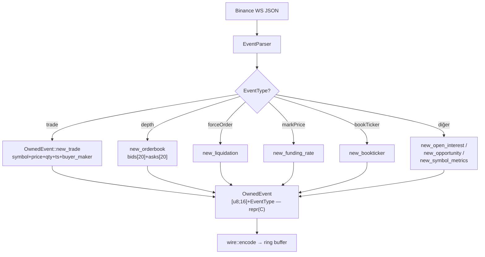

---

### `src/wire.rs` — Compact Binary Codec

**Detaylı açıklama:** `OwnedEvent`'i ring buffer'da ham JSON yerine saklanan compact binary
frame'e çevirir. Format: `[tag:u8][symbol:16B][alanlar]`. Ondalıklar `(i64 mantissa + u8 scale)`
olarak 9 bayt yer kaplar. Depth20 için tüm emirler tek bir scale'e rescale edilir (kayıpsız) —
40 seviye × 16B = 640B. Frame boyutları sabit: Trade 44B, Depth 659B vs JSON ~1100B.
`decode` tarafında güdük frame'lere karşı uzunluk kontrolleri vardır (bozuk veri → `None`).

**Neden kullandık:**
- **JSON'un 2.5 katına kadar daha küçük** → paylaşımlı bellekte daha çok tick, daha az cache yokluğu.
- **Kopyasız taşıma:** JSON parse buffer'ı simdjson tarafından bozulur (ayraçlar `\0` olur);
  binary ise kopyalanmadan olduğu gibi yazılır.
- **Deterministik boyut:** Okuyucu frame sınırını boyuttan bilir, frame'leme protokolü gerekmez.
- **Endian sabit (LE):** x86 üzerinde sıfır dönüşüm; `to_le_bytes` tek komuta iner.

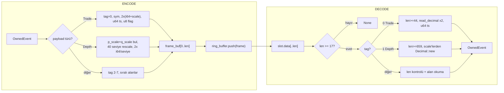

---

## transport — IPC Ring Buffer'lar

### `src/ring_buffer.rs` — GenerationalRingBuffer (Market Data)

**Detaylı açıklama:** POSIX paylaşımlı bellek (`/dev/shm`) üzerinde tek üretici / çok tüketici
dairesel kuyruk. Header (`magic`, `head`, `tail`, `capacity`) ve 768B'lik slot'lar (64B hizalı)
mmap ile işlenir. `ftruncate` yalnızca ilk oluşturan proses yapar — farklı kapasiteyle açan proses
üreticinin belleğini altından büyütmesin diye. `magic` eski/bozuk shm'i tespit edip yeniden
ilklendirir. `push`: veri + len önce yazılır, `seq` **en son** (Release fence) yazılır — okuyucu
torn-read (yarım okuma) görmez. `read_slot`: seq eşleşmesini **iki kez** kontrol eder (kopyalama
sırasında üretici slotu ezerse generational mismatch → `None`).

**Neden kullandık:**
- **Sıfır-kopya IPC:** Süreçler arası veri alışverişi doğrudan ortak RAM'e yazılır — syscall ve
  kopyalama yok. HFT gecikme hedefi bunu gerektirir.
- **Lock-free:** Atomik `head`/`tail`; mutex/condvar yok → cache ping-pong ve context switch olmaz.
- **Torn-read koruması (seq en sonda):** Okuyucu asla yarım/tutarsız frame işlemez.
- **64B hizalı slot:** `MarketDataSlot` tam bir cache line'a oturur → cache thrashing minimum.
- **`/dev/shm` (RAM disk):** Disk I/O'su yok; veri fiziksel RAM'de. C++'a geçmeye gerek yok —
  darboğaz burada değil, I/O'da.

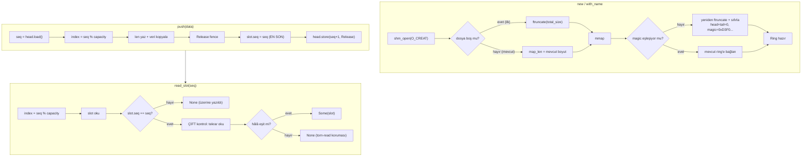

---

### `src/order_ring.rs` — OrderRingBuffer (Emir Kanalı)

**Detaylı açıklama:** Strateji → icra yönünde emir taşıyan ring. `OrderSlot` struct döşeli:
`seq + symbol + side + order_type + quantity(Decimal) + price(Decimal)`. Basit seq eşleşmesi
kullanır. İsim: `/cycle_finance_orders`.

**Neden kullandık:** Emirler de ana veri gibi düşük gecikmeli, kayıpsız bir kanaldan gitmeli.
Decimal'ler slot'a doğrudan gömülür — serileştirme yok. Strateji katmanı (canlı) ile icra katmanı
arasındaki deterministik kanaldır.

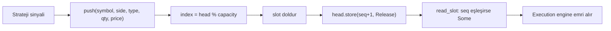

---

### `src/calc_ring.rs` — CalcRingBuffer (İndikatör Sonuçları)

**Detaylı açıklama:** 1MB slot'lu, büyük binary blokları (bir isteğin tüm OHLCV + indikatör çıktısı)
tek slot'ta taşıyan ring. Torn-read koruması aynı: seq en son yazılır, çift kontrol okunur.
Üretici: calc-ind servisi; tüketici: `calc_ind::client`. İsim: `/cycle_finance_calc`.

**Neden kullandık:** `GenerationalRingBuffer`'ın 702B slot'u indikatör serileri için küçüktür.
1MB slot → büyük yanıtlar tek atomik yazımla taşınır, parçalanma yok.

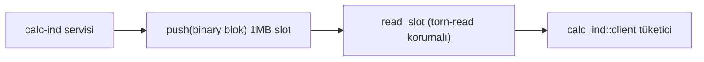

---

### `src/stream_ring.rs` — StreamRingBuffer (Canlı Mum Akışı)

**Detaylı açıklama:** Canlı OHLCV mumlarını 4KB slot'ta taşıyan ring. Slot düzeni:
`[0..8) seq · [8..12) len · [12..) data` — veri `stream_ohlcv::codec` ile binary mumdur.
Varsayılan kapasite 8192 slot (dairesel — eski mumlar üzerine yazılır).
İsim: `/cycle_finance_stream_ohlcv`.

**Neden kullandık:** Tek mum + stream meta bilgisi 702B'ye sığmaz; 4KB deterministic slot mum
akışını kesintisiz taşır. 8192 slot'luk dairesel yapı, tüketici geç kalırsa sonsuz RAM büyümesini önler.

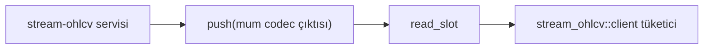

---

## core — Çekirdek Motor

### `src/main.rs` — Giriş Noktası / RUN_MODE Dağıtıcısı

**Detaylı açıklama:** `RUN_MODE` ortam değişkenine göre 5 moddan birini kurar. DATA modu asıl
hattı çalıştırır: 160.000 slot'luk market ring'i, 1M'lik flume DB kanalı, RT-priority (99)
thread'de parse → validate → wire → ring → DB döngüsü, 1sn'lik istatistik raporu (ticks/sn,
parse ortalaması ns), sonra Binance WS istemcisini başlatır. `frame_buf` döngü dışında bir kez
ayrılır — her tick'te allocator'a gidilmez.

**Neden kullandık:**
- **Tek binary, env ile seçim:** 5 mod tek `main`'de — geliştirme/dağıtım basit.
- **RT thread (prio 99):** Parse+encode+push hattı OS zamanlayıcısının önüne geçer → gecikme tutarlı.
- **`frame_buf` yeniden kullanımı:** Hot path'te sıfır heap allocation (hattın en kritik iyileştirmesi).
- **Bounded flume (1M):** DB yazıcı geride kalırsa `try_send` başarısız → sayaç, RAM asla taşmaz.

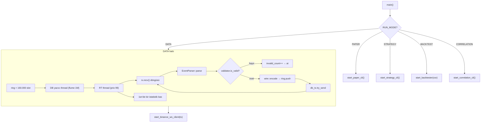

---

### `src/tick.rs` — EventParser (simdjson)

**Detaylı açıklama:** Ham WS JSON'u `simd_json` (SIMD hızlandırmalı, sıfır-kopya) ile parse eder ve
`stream` alanındaki son eke göre `OwnedEvent` üretir: `@trade`, `@depth` (spot `bids`/`asks` veya
futures `b/a`), `@forceOrder` (tasfiye), `@markPrice`, `@bookTicker`. Tüm sayılar string'den
`Decimal::from_str` ile çözülür (float hatası yok).

**Neden kullandık:**
- **simdjson:** En hızlı JSON parser — 1GB/s+ sıralı parse; tick başına nanosaniye tasarruf.
- **Spot/Futures uyumu:** Binance spot (`bids/asks`) ve futures (`b/a`) alan adları farklıdır;
  `or_else` zinciri her ikisini de destekler.
- **`?` operatörü ile fail-fast:** Bozuk alan varsa `None` döner — panik/alloc yok, hata sessizce atlanır.

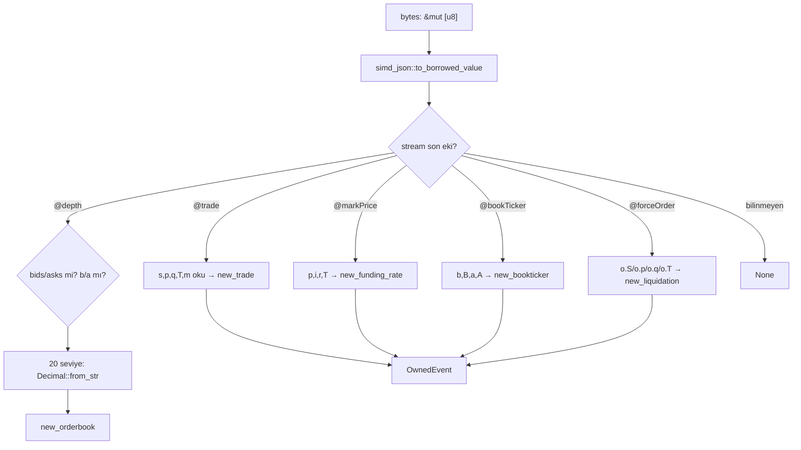

---

### `src/validator.rs` — DataValidator + Circuit Breaker

**Detaylı açıklama:** Her event'i piyasa sağduyusuyla doğrular: fiyat/miktar > 0, geçmiş veri
(stale ≤ 200ms), gelecek zaman (NTP sapması > 5sn → at), crossed book (bid ≥ ask). 1 saniyede
100+ bozuk tick olursa `circuit_breaker` bayrağını kaldırır (HFT durur); sular durulunca otomatik
geri alır. Sayaç saniyede sıfırlanır.

**Neden kullandık:**
- **Kötü veriyle işlem yapmamak:** Stale/crossed veri HFT'de anında zarar demektir — hatalı tick
  zincire sokulmadan kapıda kesilir.
- **Circuit breaker:** Sürekli bozuk veri (kaynak bozulmuş, NTP drift) → sistemi kapatmak yerine
  "işlem yapma" bayrağı; otomatik iyileşme operatör müdahalesi gerektirmez.
- **Atomic bayrak paylaşımı:** Risk/strateji katmanı aynı bayrağı okuyup kendini kilitleyebilir.

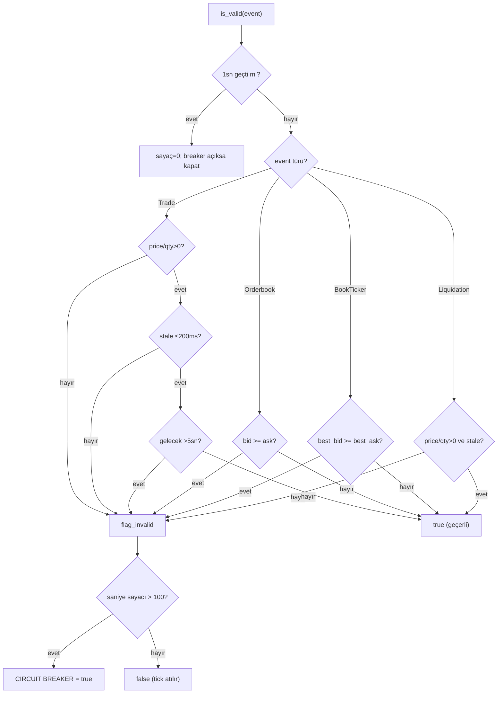

---

### `src/queue.rs` — LockFreeDispatcher

**Detaylı açıklama:** `flume::bounded(262_144)` MPMC kuyruğu sarmalayan ince adaptör. Üretici
(Binance WS) → tüketici (parse thread). Bounded olması kritik: kuyruk dolarsa `send_async` bekler
→ **geri basınç** (backpressure), RAM taşması önlenir.

**Neden kullandık:**
- **flume:** Rust'ın en hızlı bounded kanal implementasyonlarından (MPMC, cache-line optimized).
- **Bounded = geri basınç:** Üretici tüketiciden hızlıysa bekler, veri bellekte birikmez.

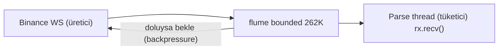

---

### `src/db.rs` — TimescaleDB Batch Yazıcı

**Detaylı açıklama:** `OwnedEvent`'leri 8 tabloya (trades, orderbooks, liquidations, funding_rates,
booktickers, open_interests, opportunities, symbol_metrics) yazan ayrı thread. PRAGMAs:
`journal_mode=WAL`, `synchronous=NORMAL`, büyük cache. Yazma tek transaction içinde birikir,
**10.000 satırda veya 1 saniyede** commit edilir. Orderbook'lar `"fiyat,miktar|..."` string'e
sıkıştırılır (512B ön-ayrımlı String).

**Neden kullandık:**
- **Ayrı thread + batch:** Disk I/O'su hot path'i (RT thread) bloklamaz; tek transaction binlerce
  INSERT'i 1 fsync ile amorti eder.
- **WAL + NORMAL:** Okuma/yazma eşzamanlı, hız/dayanıklılık dengesi (her tick'te fsync değil).
- **Ön-ayrımlı String (`with_capacity`):** Orderbook serileştirmede allocator'ı azaltır.
- **TimescaleDB neden?** Sıfır altyapı, tek dosya; ClickHouse'a akmadan önce yeterli dayanıklılık.

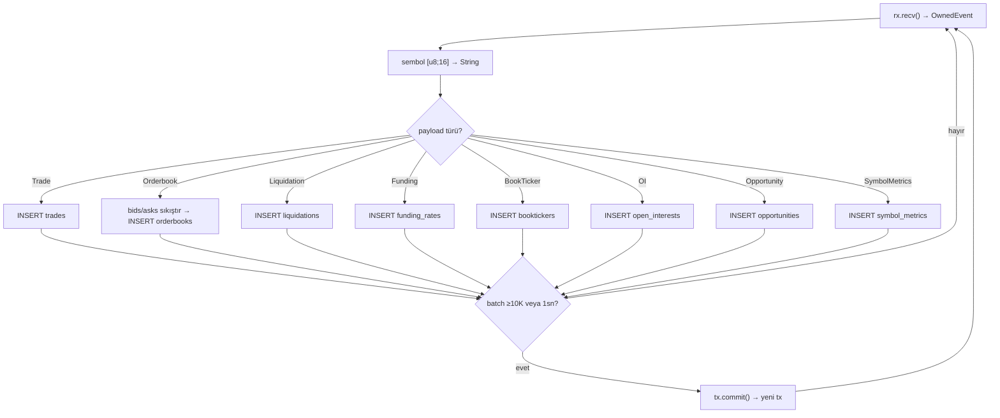

---

### `src/state.rs` — StateManager

**Detaylı açıklama:** Bakiye/durumu WebSocket account-update event'leriyle güncelleyen event-driven
durum yöneticisi. `parking_lot::RwLock` ile korunan `f64` bakiye; 5 dakikada bir REST full audit ile
uzlaştırma (10sn'lik audit yasak — IP ban riski).

**Neden kullandık:** Event-driven durum → poll etmek yok, gecikme yok; tek doğruluk kaynağı WS'tir.
`RwLock` okuma ağırlıklı erişimde hızlı; `parking_lot` std'den hızlı (syscall yok).

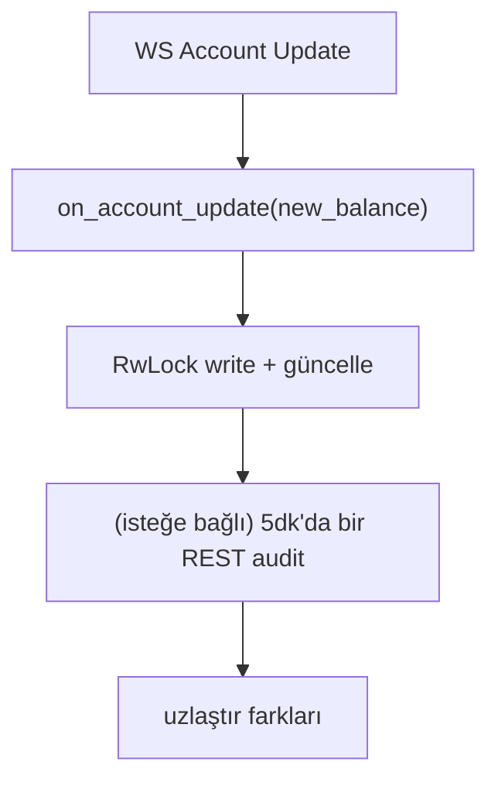

---

### `src/pii.rs` — PIIMasker

**Detaylı açıklama:** KVKK/GDPR uyumu için kişisel veri maskeleme (salt + hash, mock SHA-3) ve
3 yıldan eski logların günlük temizliği.

**Neden kullandık:** Yasal zorunluluk (Right to Erasure). Hâlâ mock — üretimde gerçek `sha3` ve
silme kayıt defteri bağlanacak. Maskelenmeden veri saklamak yasal risk; bu arayüz riski erken kapatır.

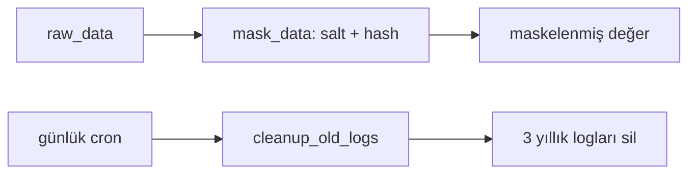

---

### `src/config.rs` — Re-export

**Detaylı açıklama:** Tek satır: `pub use os_utils::config::*;`. Konfigürasyon `os-utils`
crate'inde merkezidir, buradan tüm core'a yayılır.

**Neden kullandık:** Tek yapılandırma kaynağı (single source of truth) — crate'ler arası ortak
ayarların parçalanmaması için.

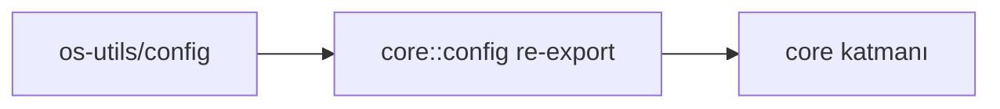

---

### `src/bridge.rs` + `src/bridge/detector_bridge.rs` — Detektör Köprüsü

**Detaylı açıklama:** "Scout" ring'i (`/cycle_finance_scout`, 20.000 slot) detektörler
(mikroyapı, misalignment, candle-classifier) tarafından `Opportunity` frame'leriyle doldurulur.
`DetectorBridge` bu ring'i **tek tüketici** olarak okur: `cursor`'dan `head`'e kadar
`wire::decode` → sadece `Opportunity` olanları handler'a iletir. `spawn_watcher` 100ms'de bir
poll eden tokio task'i açar. Verdict eşiğine göre `is_actionable` filtresi (0=GÜÇLÜ, 1=İYİ sinyal).

**Neden kullandık:**
- **Tek tüketici (single consumer):** Ring'i yalnızca bir okuyucu ilerletir → imleç çakışması/çift işleme olmaz.
- **Üreticiden bağımsız:** Bridge ring'i yaratmaz/oluşturmaz, sadece okur — bağımsız ölçeklenir.
- **100ms poll + no-op:** Yeni frame yoksa `poll` pahalı değil; düşük CPU.
- **Generational skip:** Üzerine yazılmış (geride kalmış) slotlar `read_slot`'ta otomatik atlanır.

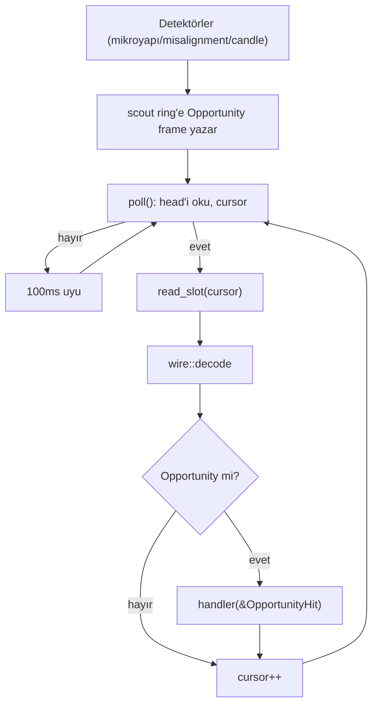

---

### `src/cli/paper_cli.rs` — Paper Trading Terminali

**Detaylı açıklama:** rustyline tabanlı interaktif terminal: `status` (bakiye, PnL, pozisyonlar,
commission), `set leverage <sym> <val>`, `set margin <cross|isolated>`, `exit`.
`risk_engine::accounting::Portfolio` ile 10.000$ başlangıç, %20 max drawdown sanal portföy.
`Mutex<PaperState>` ile korunur.

**Neden kullandık:** Canlı para olmadan strateji/margin kurallarını test etme. (Not: Bu CLI, artık
ayrı `paper-service` (:8080) REST API olarak da var — eski iskelet.)

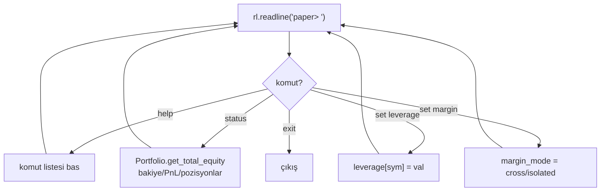

---

### `src/cli/strategy_cli.rs` — Strateji Terminali

**Detaylı açıklama:** `breakout-strategy` binary'sini alt proses olarak spawn eder; `status`
(RUNNING/DURDU), `restart` (kill + yeniden spawn), `exit` komutları sunar.

**Neden kullandık:** Stratejiyi ayrı süreçte izole çalıştırıp terminalden kolayca yönetme (restart =
yeni proses, kirli durum taşınmaz). (Not: `cycle_tmux.sh` bunu zaten kendi penceresinde başlatıyor.)

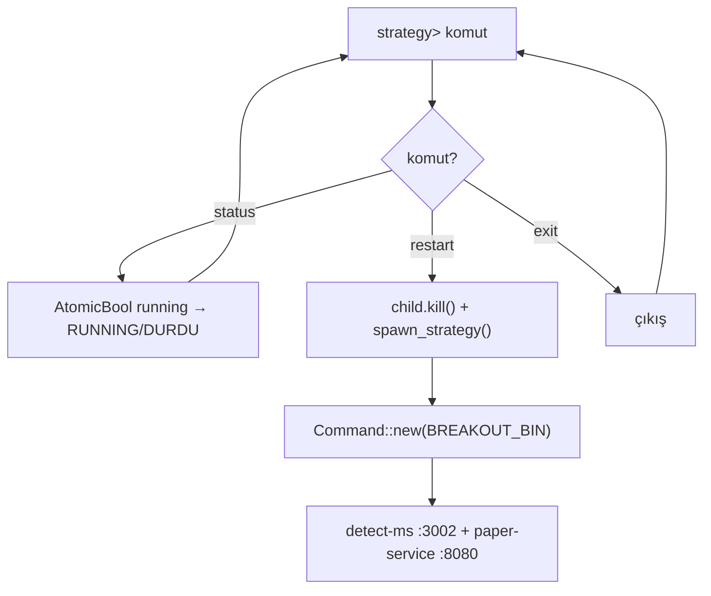

---

### `src/cli/correlation_cli.rs` — Anomali Analiz Terminali

**Detaylı açıklama:** Market ring'inden yalnızca VELVETUSDT trade'lerini okuyup iki pencere
(analiz `window_sec` + takip `track_sec`) üzerinde hacim/fiyat ilişkisini izler.
`flat_threshold` 0.001, `breakout_threshold` 0.005. Üç anomali türü:
1. **EMİLİM:** Hacim patlamış, fiyat yatay → patlama beklenir.
2. **SIĞ TAHTA PUMP:** Hacim yok, fiyat artıyor → çakılma beklenir.
3. **AYI TUZAĞI:** Hacim yok, fiyat düşüyor → fırlama beklenir.

Takip: beklenen yön gerçekleşirse "BAŞARILI", süre dolarsa "BAŞARISIZ" ve 3'lü kümeleme
(aynı tür ×3 → büyük patlama; 3 farklı tür → testere/kararsızlık) uyarısı. 1sn spam koruması.

**Neden kullandık:** Mikroyapı anomalilerini (absorbing, pump/dump izleri) uygun maliyetle yakalamak
için veri hattı üzerinde yüzey analizi. (Not: İsmine rağmen istatistiksel korelasyon katsayısı hesaplamaz.)

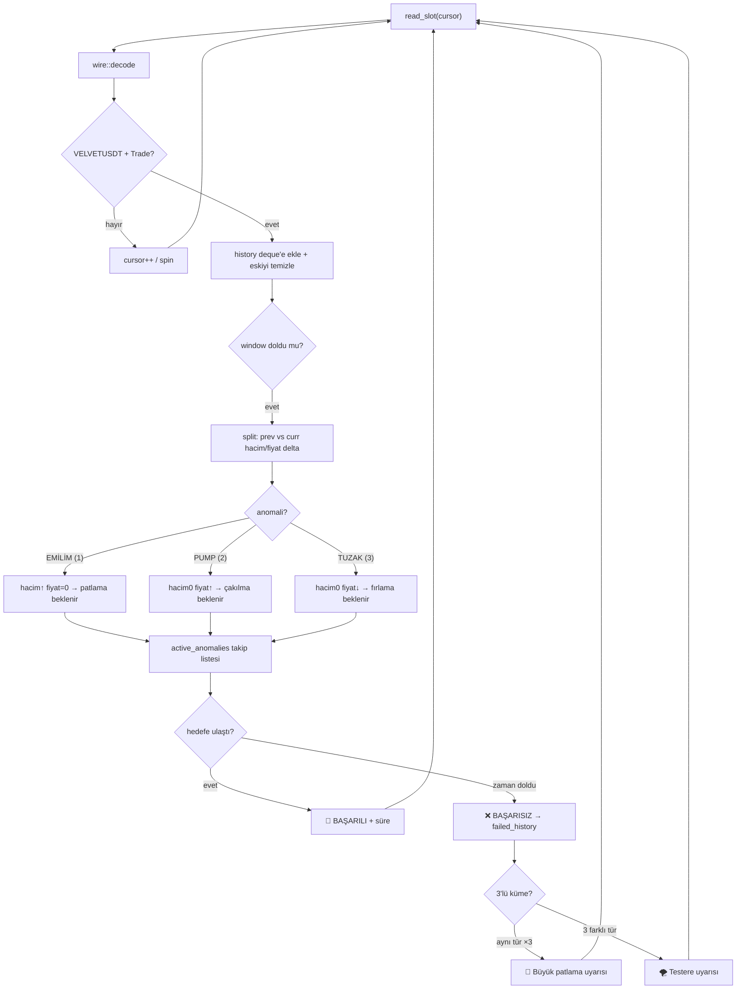

---

### `src/engine/orchestrator.rs` — TitaniumOrchestrator

**Detaylı açıklama:** Canlı strateji motoru. Her strateji `ShardedStrategy` (strateji +
`StrategyState` + sembol) olarak tutulur. `run_spin_loop`: ring'deki her yeni frame için her
Active stratejiye `on_market_data(frame_id, &slot)` çağırır; 1ms'de bir `on_timer`. Her iki çağrı
`catch_unwind` ile sarılır — strateji paniklerse `Poisoned` olur (sistem çökmez). Üretilen `Signal`
`signal_to_intent` → `OrderIntent`, `RiskEngine.evaluate` kapısından geçer: `Approved` ise
gateway'e (`crossbeam Sender<Signal>`) gönderilir, `Rejected` ise loglanır. Spin döngüsü sonunda
`std::hint::spin_loop()` (CPU pause) ile bekleme.

**Neden kullandık:**
- **Spin-loop:** Stratejiye veri beklemeden anında ulaşır (syscall yok) — HFT'de gecikme kritik.
- **Catch-unwind:** Tek stratejinin paniği tüm motoru çökertmesin; sadece o strateji zehirlenir.
- **Risk kapısı:** Stratejiden çıkan her emir risk kurallarından geçmeden gateway'e gidemez.
- **TscTimer:** 1ms zamanlama için CPU döngü sayacı — yüksek çözünürlük.
- **Sharded:** Birden çok strateji/sembol tek döngüde adil işlenir.

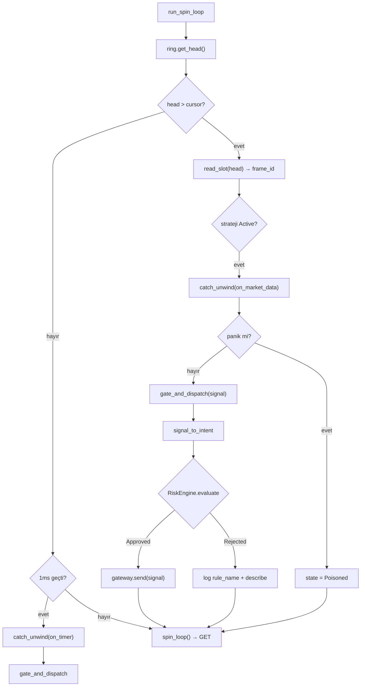

---

### `src/engine/backtester.rs` — Backtest Motoru

**Detaylı açıklama:** CSV okuyup (`symbol,price,quantity,timestamp`) her satırı canlı WS'nin
ürettiği `@trade` JSON formatına çevirerek ring'e basar. 100.000 tick'te bir `yield_now` (ring
taşmasın). Sonunda yüklenen tick sayısı, geçen süre, ticks/sn raporlar.

**Neden kullandık:** Stratejiye "canlı mı backtest mi" sorusunu sordurmadan aynı veri yolundan
beslemek — strateji kodu değişmeden geçmiş veriyle test edilir (ayırt edilemezlik).

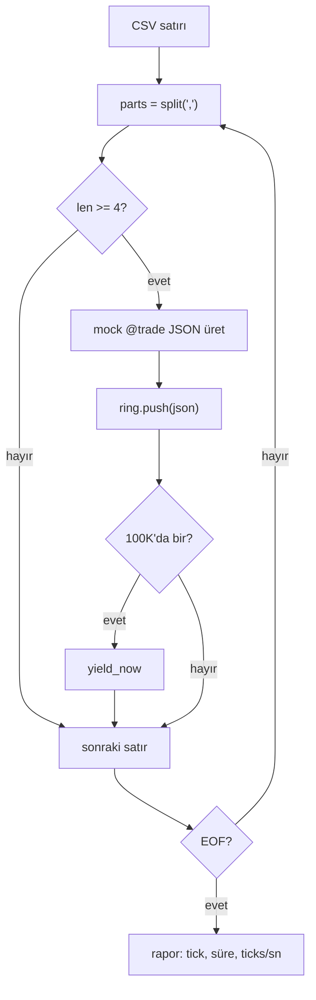

---

### `src/hal/cpu.rs` — CPU Pin

**Detaylı açıklama:** `core_affinity::set_for_current` ile mevcut thread'i istenen çekirdeğe
sabitler (geçerli çekirdek aralığı kontrol edilir).

**Neden kullandık:** RT thread'i sabit bir çekirdeğe bağlamak → cache sıcaklığı korunur, OS'nin
thread'i başka çekirdeğe taşıyıp cache'i boşaltması (migration) önlenir. HFT'de deterministik
gecikme için standart.

```mermaid
flowchart LR
    PIN["pin_to_core(id)"] --> G["get_core_ids"]
    G --> V{"id geçerli?"}
    V -->|"hayır"| E["hata log"]
    V -->|"evet"| S["set_for_current(id)"]
    S --> OK["System PINNED"]
```

---

### `src/hal/memory.rs` — Pre-fault Bellek

**Detaylı açıklama:** `vec![0; size]` ayırır, her 4KB sayfaya dokunarak (write) fiziksel belleği
baştan sayfalatır, sonra sıfırlar. Gerçek `MAP_HUGETLB` (2MB sayfa) yorumu kodda not olarak durur.

**Neden kullandık:** İlk erişimde oluşan page fault hot path'te 1-2ms'lik aksaklık yaratır. Başta
ısıtılan bellek → runtime'da fault yok. Deterministik gecikme.

```mermaid
flowchart LR
    A["vec![0; size]"] --> T["her 4096B'de bir yaz"]
    T --> Z["fill(0) sıfırla"]
    Z --> R["pre-faulted hazır buffer"]
```

---

### `src/timer/tsc.rs` — TscTimer

**Detaylı açıklama:** x86_64'te `_rdtsc` ile CPU döngü sayacından nanosaniye hesaplar (3GHz varsayılan
kalibrasyon); ARM/Mac fallback olarak `SystemTime::as_nanos` kullanır.

**Neden kullandık:** `clock_gettime` sistem çağrısı ~20-50ns; RDTSC ~5-10ns ve syscall değil. 1ms'lik
orchestrator tick'lerinde ve gecikme ölçümlerinde daha kesin.

```mermaid
flowchart LR
    Q["elapsed_ns()"] --> R["read_tsc (RDTSC)"]
    R --> D["diff = now - start"]
    D --> NS["(diff / 3e9) × 1e9"]
    NS --> N["nanosaniye"]
```

---

### `benches/tick_benchmark.rs` — Criterion Benchmark

**Detaylı açıklama:** Hot path'in WCET ölçümleri: `tick_parse_wcet` (simdjson parse),
`wire_encode_trade/decode_trade`, `wire_encode_depth20/decode_depth20`. `black_box` ile derleyici
optimizasyonundan kaçınılır.

**Neden kullandık:** Regresyonu erken yakalamak — parse/encode süresi 1ns artarsa 100K tick/sn'de
ölçülebilir etki yapar. Kriter: darboğazın nerede olduğunu kanıtlamak (I/O'da, CPU'da değil).

```mermaid
flowchart LR
    CR["criterion"] --> P["tick_parse_wcet"]
    CR --> E["wire encode/decode trade + depth20"]
    P --> R["rapor: ns/op, p50/p95/p99"]
    E --> R
```

---

## adapter — Dış Entegrasyonlar

### `src/binance.rs` — Binance Futures WS İstemcisi

**Detaylı açıklama:** Hedef semboller (`btcusdt, ethusdt, solusdt, velvetusdt`) için
`@trade` + `@depth20@100ms` stream'lerini kurar. Tek WS bağlantısına en fazla 200 stream
(Binance sınırı) — stream'ler 600ms arayla açılan chunk'lara bölünür (WAF/DDoS koruması:
eşzamanlı çok bağlantı IP'yi banlar). Her chunk: bağlan → `SUBSCRIBE` → 30sn'de bir Ping (idle
timeout'u kır) → `select!` ile okuma/ping döngüsü. Bağlantı koparsa **üstel geri çekilme**:
1s başlar, her denemede ikiye katlanır, 60s'de tavan; başarı geri çekilme seviyesini sıfırlar.
Her metin mesajı bounded flume kuyruğuna `send_async` ile verilir.

**Neden kullandık:**
- **WebSocket:** Fiyat verisi push tabanlı — REST polling'in gecikmesi ve IP ban riski yok.
- **Kombine stream (`/stream`):** Tek WS, çok sembol/stream → bağlantı maliyeti düşük.
- **600ms chunk aralığı + üstel backoff:** Binance WAF'ını tetiklemeden güvenli yeniden bağlanma;
  60s tavan sonsuz bekleme değil.
- **30sn Ping:** Binance sessiz bağlantıyı kapatır; ping kopuşu erkenden tespit eder.

```mermaid
flowchart TD
    ST["fetch_usdt_spot_pairs"] --> CH["chunks (≤200 stream / chunk)"]
    CH --> SP{"her chunk için"}
    SP --> CN["connect_async"]
    CN -->|"başarısız"| BK["sleep(backoff) + backoff×2 ≤60s"]
    BK --> CN
    CN -->|"başarılı"| RESET["backoff = 1s"]
    RESET --> SUB["SUBSCRIBE"]
    SUB --> LOOP["tokio::select!"]
    LOOP -->|"ping tick (30s)"| PING["send Ping"]
    PING -->|"hata"| DROP["bağlantıyı kır → CN"]
    LOOP -->|"mesaj"| TX["flume kuyruğa send_async"]
    LOOP -->|"close/hata/None"| DROP
    DROP --> CN
```

---

### `src/redis.rs` — RedisAdapter (İdempotency + Durum)

**Detaylı açıklama:** `REDIS_URL`'den bağlanır (varsayılan `redis://127.0.0.1:6379`), sağlığı PING
ile kontrol eder. Emir idempotency anahtarı üretir (`BOT_UUID_nanotimestamp`),
`SET key 1 EX 3600 NX` atomik komutuyla yazar — aynı anahtarla ikinci yazma reddedilir (çift emir
koruması). ACK durumu: anahtar varsa "Confirmed", yoksa "Pending". **Fail-closed:** Redis yoksa
idempotency anahtarı yazılamaz → işlem reddedilir (kayıp veya çoğaltılmış emir olmaz).

**Neden kullandık:**
- **İdempotency:** Ağ gecikmesi/retry yüzünden aynı emrin iki kez iletimi felakettir; atomic
  `SET NX` bunu garantiler.
- **1 saat TTL:** Anahtar otomatik temizlenir — registry şişmez.
- **Fail-closed > fail-open:** Emniyetli taraf hatada "işleme yapma"dır (para riski almaktansa).

```mermaid
flowchart TD
    N["new: REDIS_URL bağlan"] --> H{"PING ok mu?"}
    H -->|"evet"| OK["Connected"]
    H -->|"hayır"| DG["Degraded (fail-closed)"]
    GEN["generate_client_order_id"] --> ID["BOT_UUID_nanos"]
    ID --> SET["SET key 1 EX 3600 NX"]
    SET --> R{"sonuç?"}
    R -->|"Ok(Some)"| W["işlem onaylandı"]
    R -->|"Ok(None)"| D["duplicate → red"]
    R -->|"Err / Redis yok"| FC["fail-closed → red"]
```

---

### `src/clickhouse.rs` — ClickHouseAdapter (Veri Gölü)

**Detaylı açıklama:** Veri gölü şeması üretir: `ticks` tablosu MergeTree, yıl/ay/gün partition
(~20 yılda ~7300 partition), Zstandard sıkıştırma. GDPR "right to erasure" için `DELETE` mutasyonu
+ silme kayıt defteri (hash → kaç kez silindi). Merkle ağacı + EC-12/4 bütünlük kontrolü (mock).

**Neden kullandık:** TimescaleDB geçici; kalıcı analitik veri gölü için ClickHouse (sıkıştırma,
partition, sütun tabanlı sorgu hızı). Uyumluluk denetimi (silme kanıtı) yasal zorunluluk.

```mermaid
flowchart LR
    SC["create_tick_table_schema"] --> P["MergeTree + yıl/ay/gün partition + ZSTD"]
    ER["execute_right_to_erasure"] --> R["DELETE mutasyonu + kayıt defteri"]
    IC["run_integrity_check"] --> MK["Merkle + EC-12/4 simülasyonu"]
```

---

### `src/vault.rs` — VaultAdapter (Anahtar Yönetimi)

**Detaylı açıklama:** `VAULT_ADDR`'den HashiCorp Vault'a bağlanır: `/v1/sys/health` ile sağlık
(initialized/sealed/standby), `rotate_keys` ile çift anahtar rotasyonu (5 dk grace — eski+yeni anahtar
geçerli), `generate_jwt` ile 1 saat TTL'li JWT (süresi bitmeden 10 dk önce yenilenmeli).
`VAULT_ADDR` boşsa mock modu.

**Neden kullandık:** API anahtarlarının merkezi, rotasyonlu yönetimi — kod içine gömülen sırlar yasak.
Grace period anahtar rotasyonu sırasında imza doğrulama hatalarını önler.

```mermaid
flowchart LR
    H["health()"] --> G["GET /v1/sys/health"]
    G --> S["initialized/sealed/standby"]
    RK["rotate_keys()"] --> V["v2 → grace 5dk (v1+v2 geçerli)"]
    J["generate_jwt()"] --> J2["exp=now+3600s, refresh=exp-600s"]
```

---

### `src/ai.rs` — AIAdapter (AI Mikroservisi)

**Detaylı açıklama:** Redis üzerinden Python Isolation Forest mikroservisinin anomali skorunu
(`read_isolation_forest_anomaly_score`) ve LLM trend etiketini (`read_llm_trend_tag`) okur.
Şu an mock: sabit 0.05 skor ve "NEUTRAL" etiket.

**Neden kullandık:** Anomali tespiti (tick gecikmesi, fiyat spikeleri) ve trend duyarlılığı için AI
katmanını ayrı mikroservis olarak ayırmak — AI yükü core'u boğmasın, Redis üzerinden asenkron iletişim.

```mermaid
flowchart LR
    Q["read_isolation_forest_anomaly_score"] --> R["Redis oku"]
    R --> S["skor (0.05 mock)"]
    T["read_llm_trend_tag"] --> R2["Redis oku"]
    R2 --> L["etiket (NEUTRAL mock)"]
```

---

### `src/telemetry.rs` — TelemetryAgent (Gözlemlenebilirlik)

**Detaylı açıklama:** RTT takibi (`track_rtt`): RTT > 1ms ise %100 Jaeger örnekleme tetikler,
değilse %1. Chaos Mesh ile hata senaryoları enjekte eder (ağ bölünmesi, DNS, NTP drift) — mock.

**Neden kullandık:** HFT'de gecikme sapması (RTT spike) ve altyapı arızaları görünür olmalı.
Adaptif örnekleme maliyeti düşük tutarken anomali anında tam iz sağlar.

```mermaid
flowchart LR
    R["track_rtt(rtt_ms)"] --> C{"rtt > 1ms?"}
    C -->|"evet"| J["Jaeger %100 örnekleme"]
    C -->|"hayır"| J2["Jaeger %1 örnekleme"]
    X["trigger_chaos_mesh_scenario"] --> I["hata enjekte: NTP drift/ağ bölünmesi"]
```

---

## splash — Açılış Ekranı

### `src/lib.rs` — show_splash / show_splash_with

**Detaylı açıklama:** "CYCLE FINANCE" yazısını FIGlet fontuyla matrix yeşilinde harf harf çizer;
altında bir yükleme çubuğu tam 3 saniyede dolar (çubuk %100 olduğunda yazı da tam haline ulaşır).
Ekran her karede temizlenir (`\x1B[2J`), yazı ve çubuk yatay/dikey ortalanır. Bitince Enter bekler,
çıkış yapar.

**Neden kullandık:** Tamamen görsel/operasyonel katman — sistemin "canlı olduğu" hissi ve başlatma
sürecinde tek terminal kullanımı. İş mantığı yok; bağımsız binary olması core'u şişirmez.

```mermaid
flowchart TD
    B["show_splash_with(metin, total_ms)"] --> F["FIGfont::standard yükle"]
    F --> SZ["terminal boyutunu oku (ortala)"]
    SZ --> LP{"her harf i"}
    LP --> DR["ekranı temizle"]
    DR --> FG["kısmi metni FIGlet'e çevir + ortala + yeşil bas"]
    FG --> BR["çubuğu %'ye göre doldur + ortala + bas"]
    BR --> SL["step_ms uyu"]
    SL --> LP
    LP -->|"bitti"| ENTER["▶ ENTER bekle"]
    ENTER --> X["ekranı temizle + çıkış"]
```

---

### `src/main.rs` — Bağımsız Binary

**Detaylı açıklama:** `cycle_splash::show_splash()` çağırıp çıkar. tmux başlatıcısı 4'lü ekran
açılmadan önce bunu çalıştırır.

**Neden kullandık:** Splash'ı core'dan tamamen bağımsız tek dosyalık binary yapmak — build süresi
ve bağımlılık yok.

```mermaid
flowchart LR
    M["main()"] --> S["cycle_splash::show_splash()"]
    S --> E["çıkış"]
```

---

## Genel Mimari Akış (Uçtan Uca)

Tüm katmanların tek resimde nasıl birbirine bağlandığı:

```mermaid
flowchart LR
    subgraph ADAPTER["adapter — Dış Dünya"]
        BIN["binance.rs<br>WS → flume kuyruk"]
        REDIS["redis.rs<br>idempotency"]
    end
    subgraph CORE["core — Çekirdek"]
        PARS["tick.rs<br>EventParser (simdjson)"]
        VAL["validator.rs<br>DataValidator"]
        WIRE1["wire::encode"]
        DBW["db.rs<br>TimescaleDB batch yazıcı"]
        ORCH["orchestrator.rs<br>TitaniumOrchestrator"]
    end
    subgraph TRANSPORT["transport — IPC"]
        RING["ring_buffer.rs<br>/cycle_finance_ring"]
        ORD["order_ring.rs<br>/cycle_finance_orders"]
        CALC["calc_ring.rs<br>/cycle_finance_calc"]
        STREAM["stream_ring.rs<br>/cycle_finance_stream_ohlcv"]
    end
    subgraph CONTRACTS["contracts — Sözleşmeler"]
        EV["events.rs<br>OwnedEvent/EventType"]
        WIRE["wire.rs<br>binary codec"]
    end
    BIN --> PARS
    PARS --> VAL
    VAL -->|"geçerli"| WIRE1
    WIRE1 --> RING
    VAL -->|"eşzamanlı"| DBW
    RING --> ORCH
    ORCH --> ORD
    RING --> CALC
    RING --> STREAM
    WIRE1 -. "format tanımı" .-> WIRE
    PARS -. "tip tanımı" .-> EV
    ORCH -. "risk kapısı" .-> REDIS
```

**Hız zinciri (en kritik yol):**
WS → flume (262K) → simdjson parse → validator → wire::encode → `/dev/shm` ring →
orchestrator spin-loop → risk kapısı → gateway. Bu yolun tamamı **tek cache-tamamlı slot'ta**,
allocator/syscall olmadan çalışır. DB yazımı ayrı thread'de, hot path'i asla bloke etmez.

**Neden bu 5 katman?**
- **contracts:** Herkesin anlaştığı veri dili — katmanlar birbirinden bağımsız değişebilir.
- **transport:** Süreçler arası sıfır-kopya iletişim — core ile servisler (, detect-ms,
  execution) aynı bellekten beslenir.
- **core:** Veriyi alır, temizler, dağıtır, stratejiyi yönetir — sistemin beyni.
- **adapter:** Dış dünya (borsa, Redis, ClickHouse, Vault, AI, telemetri) — hepsi değiştirilebilir
  (yeni borsa = yeni adaptör, çekirdek değişmez).
- **splash:** Görsel başlatma deneyimi — iş mantığına karışmaz.

**Performans mantrası (bu dokümanda her kararın arkasındaki sebep):**
1. **Darboğaz I/O'dur, CPU değil** → C++/assembly'ye geçmek gecikmeyi düşürmez; doğru olan
   kopyalama/syscall'i azaltmaktır (ring, flume, frame_buf reuse).
2. **Hot path'te allocator ve syscall yasak** → sabit boyutlu tipler, ön-ayrılmış buffer'lar,
   RDTSC, spin-loop.
3. **Bounded her şey** → kuyruk ve ring sınırlıdır; geri basınç RAM taşmasını önler.
4. **Doğrula ve kır** → validator + circuit breaker kötü verinin zincire girmesini önler.
5. **Borsa bağımsızlığı** → `OwnedEvent` tek dil; yeni borsa eklemek parse'ı (adaptör) değiştirir,
   çekirdeği değil.
