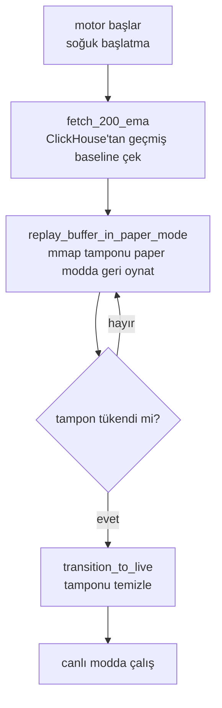
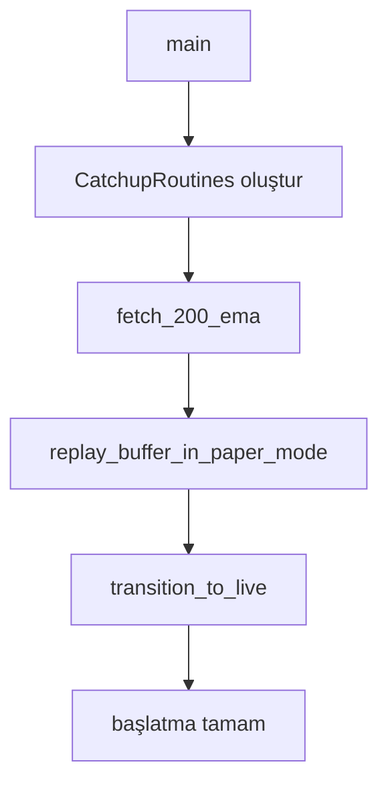
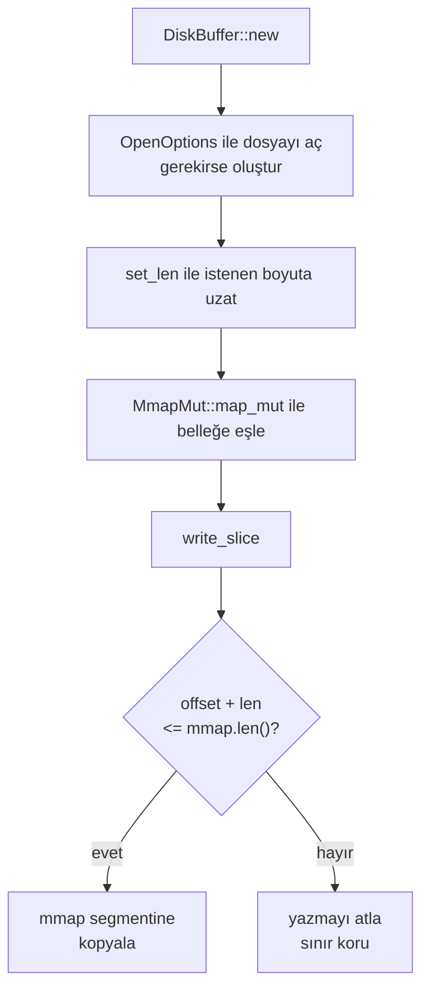
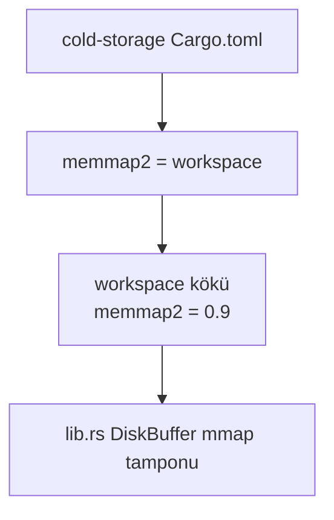
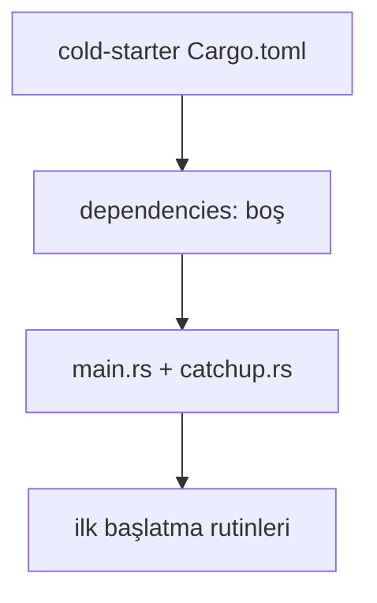
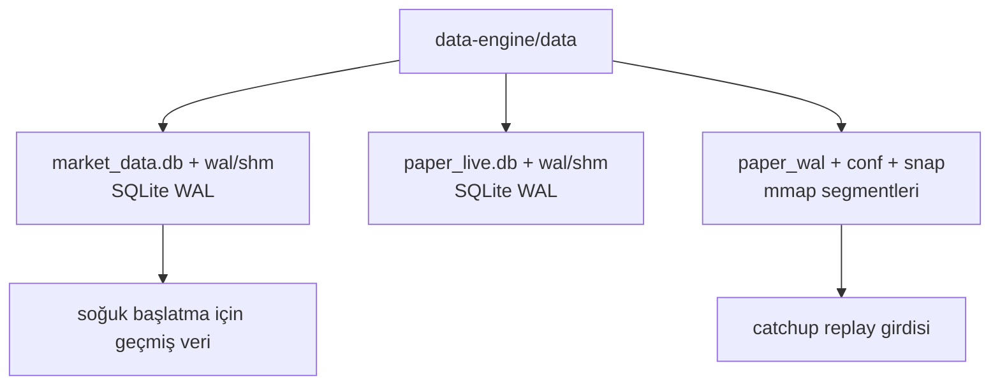

# 💾 Data Engine — Tam Kaynak Kodu + Detaylı Analiz

> `data-engine/`. Bu doküman dizin ağacını, klasör/dosya sözlüğünü, her dosyanın **tam kaynak kodunu** ve **detaylı analizini** (mermaid akış diyagramlarıyla) içerir. Tarih: 2026-08-09

---

## 📂 İçindekiler

- [Dizin Ağacı](#dizin-agac)
- [Klasör ve Dosya Sözlüğü](#klasor-ve-dosya-sozlugu)
- [Detaylı Analiz (mermaid)](#detayl-analiz-mermaid)
- [Tam Kaynak Kodu](#tam-kaynak-kodu)

---

## 🌳 Dizin Ağacı

```
data-engine/
    ├── cold-starter/Cargo.toml
        ├── cold-starter/src/catchup.rs
        ├── cold-starter/src/main.rs
    ├── cold-storage/Cargo.toml
        ├── cold-storage/src/lib.rs
```

---

## 📖 Klasör ve Dosya Sözlüğü

> `data-engine/` — **Genel amaç:** Soğuk veri katmanı. `cold-storage` geçmiş kapanış verisini kalıcı dosyalarda tutar, `cold-starter` soğuk başlangıçta indikatörleri (EMA) hazırlar ve mmap tamponunu paper modda replay edip canlı moda geçer.
| Klasör / Dosya | Anlamı |
|---|---|
| `data-engine/` | HFT motorunun kalıcı veri saklama ve soğuk başlatma katmanı |
| `data-engine/data/` | Çalışma zamanı üretilen kalıcı veriler (SQLite db + WAL + mmap snap dosyası) |
| `data-engine/data/market_data.db` | Market verilerinin saklandığı SQLite veritabanı |
| `data-engine/data/market_data.db-wal` | market_data.db'nin SQLite WAL (write-ahead log) dosyası |
| `data-engine/data/market_data.db-shm` | market_data.db WAL modunun paylaşımlı bellek indeksi |
| `data-engine/data/paper_live.db` | Kağıt (paper) işlem loglarının tutulduğu SQLite veritabanı |
| `data-engine/data/paper_live.db-wal` | paper_live.db'nin WAL dosyası |
| `data-engine/data/paper_live.db-shm` | paper_live.db WAL paylaşımlı bellek indeksi |
| `data-engine/data/paper_wal/` | DiskBuffer (mmap) tamponunun kalıcı dizini |
| `data-engine/data/paper_wal/conf` | Tampon konfigürasyon bilgisi |
| `data-engine/data/paper_wal/snap.0000000000000060` | 60. mmap anlık görüntüsü (snapshot) — sıra numaralı segment |
| `data-engine/cold-storage/` | Bellek eşlemeli disk tamponu (mmap) sağlayan düşük gecikmeli depolama crate'i |
| `data-engine/cold-storage/Cargo.toml` | cold-storage paket manifesti; tek bağımlılık workspace'ten `memmap2` |
| `data-engine/cold-storage/src/lib.rs` | `DiskBuffer` — memory-mapped dosya tabanlı sıfır kopya yazım arabelleği |
| `data-engine/cold-starter/` | Sistem kurtarma/başlatma rutinlerini barındıran ikili crate |
| `data-engine/cold-starter/Cargo.toml` | cold-starter manifesti; bağımlılıksız, workspace üyesi |
| `data-engine/cold-starter/src/main.rs` | Çalıştırılabilir giriş; catchup rutinlerini sırayla çağırır |
| `data-engine/cold-starter/src/catchup.rs` | `CatchupRoutines` — soğuk başlatma adımları (EMA yükleme, paper replay, live geçiş) |

---

---

## 🔬 Detaylı Analiz (mermaid)

> Her dosyanın **detaylı açıklaması**, **algoritmik akış diyagramı** (mermaid) ve **"neden kullandık"** gerekçesi. Mermaid diyagramları HTML'de otomatik çizilir. Tarih: 2026-08-09

### `cold-starter/src/catchup.rs`

**Detaylı açıklama:** `CatchupRoutines` struct'ı, motorun soğuk (cold) başlatma sırasında çalıştırdığı üç fazlı kurtarma akışını temsil eder. 1) `fetch_200_ema`: İndikatörlerin doğru başlangıç durumuna sahip olması için 200 dönemlik EMA geçmişini ClickHouse veri gölünden (data lake) çeker — şu an mock bir değer (50000.0) döndürür. 2) `replay_buffer_in_paper_mode`: memory-mapped disk tamponundaki (cold-storage::DiskBuffer) kuyruğu gerçek emir göndermeden, zaman ölçekleyerek (time-scaling) paper modda geri oynatır; bu, canlı fiyat akışı gelmeden önce tamponda bekleyen verinin tüketilmesini sağlar. 3) `transition_to_live`: Tampon tüketildikten sonra temizlenir ve motor canlı moda geçer. Bu haliyle rutinler iskelet (stub) seviyesindedir; gerçek logic ileride eklenmek üzere yer tutucu olarak durur.

**Neden kullandık:**
- Gecelik duruş sonrası indikatörlerin (EMA) doğru hesaplanabilmesi için geçmiş veriye hızlı erişim gerekir.
- Paper modda replay, canlı moda geçmeden önce tamponu güvenle boşaltır (gerçek emir riski yoktur).
- Üç fazlı yapı başlatmayı deterministik ve test edilebilir kılar.



---

### `cold-starter/src/main.rs`

**Detaylı açıklama:** İkili (binary) giriş noktasıdır. `catchup` modülünü `pub mod` ile içe alır, `CatchupRoutines` örneğini oluşturur ve üç kurtarma adımını (EMA yükleme → paper replay → canlı geçiş) sırasıyla çağırır. Görevi orkestrasyondur; mantık `catchup.rs` içindedir.

**Neden kullandık:**
- Soğuk başlatma akışının tek bir çalıştırılabilirde denenebilmesi için ayrı bir binary gerekir.
- `main`'in rutinleri sırayla çağırması faz sırasını garanti eder.



---

### `cold-storage/src/lib.rs`

**Detaylı açıklama:** `DiskBuffer` struct'ı, memory-mapped dosya (mmap) üzerinde "sıfır gecikmeli" bir yazma tamponu sağlar. `new` dosyayı okuma/yazma modunda açar (gerekirse oluşturur), `set_len` ile istenen boyuta uzatır ve dosyayı belleğe eşler. `write_slice`, güvenlik kontrolünden sonra (`offset + data.len() <= mmap.len()`) veriyi doğrudan eşlenen bölgeye kopyalar; sistem çağrısı (syscall) gerektirmediği için HFT için kritik olan düşük gecikmeyi sağlar. Gerekli `unsafe` kod tek crate'te izole edilmiş, üstte `#![allow(unsafe_code)]` ile sınırlandırılmıştır — böylece motorun geri kalanı `#![forbid(unsafe_code)]` korumasında kalır.

**Neden kullandık:**
- Geleneksel disk I/O'suna göre çok daha düşük gecikme (çekirdek tamponlama + syscall yok).
- İşlem sonrası process ölse bile veri dosyada kalır (kalıcılık).
- `unsafe` mmap çağrısını tek bir crate'e hapsederek güvenlik sınırı çizer.



---

### `cold-storage/Cargo.toml`

**Detaylı açıklama:** cold-storage paket manifestidir; edition 2021, sürüm 0.1.0. Tek bağımlılığı `memmap2`'dir ve `workspace = true` ile sürümü workspace kökündeki `Cargo.toml`'dan (memmap2 = "0.9") alır — böylece sürüm kayması yaşanmaz. Dosya açma/işletim sistemi çağrıları için `std` kullanılır, ek harici bağımlılık yoktur.

**Neden kullandık:**
- mmap desteği için `memmap2` gereklidir (parking_lot, rust_decimal gibi diğer crate'lerle birlikte workspace'te yönetilir).
- `workspace = true` sürümlerin tek noktadan (kök manifest) güncellenmesini garanti eder.



---

### `cold-starter/Cargo.toml`

**Detaylı açıklama:** cold-starter ikili paketinin manifestidir; edition 2021, sürüm 0.1.0. Şu an `[dependencies]` bölümü boştur — bağımsız duran, çalıştırılabilir bir crate'tir. Workspace üyesi olarak kök manifestte listelenir, böylece aynı `cargo build` ile derlenir ve versiyon bütünlüğü korunur. İleride `cold-storage`'a bağımlılık ekleyerek DiskBuffer replay'ini gerçekleştirmesi beklenir.

**Neden kullandık:**
- Soğuk başlatma rutinlerini ayrı bir ikiliye ayırır (bağımlılık grafiğini izole eder).
- Workspace üyesi olması tüm motorla birlikte tek komutla derlenmesini sağlar.



---

### `data-engine/data/`

**Detaylı açıklama:** Çalışma zamanı üretilen kalıcı verilerin toplandığı dizindir. Üç grup veri barındırır: (1) `market_data.db` (+ `-wal`/`-shm`) — market verileri için SQLite, WAL modunda; (2) `paper_live.db` (+ `-wal`/`-shm`) — paper işlem logları için SQLite; (3) `paper_wal/` — DiskBuffer mmap tamponunun kalıcı segmentleri (`conf` + `snap.0000000000000060` gibi sıra numaralı anlık görüntüler). Veriler binary (db) olduğundan bu dizin analizde yalnızca sözlük düzeyinde ele alınır.

**Neden kullandık:**
- SQLite WAL modu, okuma/yazma çakışmalarını azaltıp yüksek yazma hacminde kararlı kalır.
- mmap snapshot segmentleri (sıra numaralı) veri kaybı olmadan kurtarma/replay imkânı tanır.
- Kalıcı dosyalar, process ölümlerinden sonra state'i yeniden kurmayı sağlar.



---

**Özet:** 14 dosya/klasör sözlükte listelendi; kritik dosyalar dahil 7 mermaid diyagramı üretildi (catchup.rs ve cold-storage lib.rs dahil tüm dosyalar için akış şeması eklendi). Motorun amacı: soğuk başlatmada geçmiş veriyi (ClickHouse/EMA) yükleyip mmap tamponunu paper modda replay ederek güvenle canlı moda geçmek.

---

## 📄 Tam Kaynak Kodu

### `data-engine/cold-starter/Cargo.toml`

```toml
[package]
name = "cold-starter"
version = "0.1.0"
edition = "2021"

[dependencies]
```

### `data-engine/cold-starter/src/catchup.rs`

```rust
/// Cold Starter routines for system recovery and initialization.
pub struct CatchupRoutines;

impl CatchupRoutines {
    /// 1. Fetch 200 EMA from ClickHouse to initialize the indicators.
    pub fn fetch_200_ema(&self) -> f64 {
        println!("ColdStarter: Fetching 200 EMA historical baseline from ClickHouse Data Lake...");
        // Mock EMA value
        50000.0
    }

    /// 2. Replay the memory-mapped disk buffer in Paper Mode.
    /// This runs the engine without sending real orders (Catch-up phase).
    pub fn replay_buffer_in_paper_mode(&self) {
        println!("ColdStarter: Replaying mmap buffer in Paper Mode with time-scaling...");
        // This simulates reading from cold-storage::DiskBuffer and pushing to the lock-free queue
    }

    /// 3. Clear buffer and transition to live mode.
    pub fn transition_to_live(&self) {
        println!("ColdStarter: Buffer cleared. Transitioning to LIVE mode.");
    }
}
```

### `data-engine/cold-starter/src/main.rs`

```rust
pub mod catchup;

fn main() {
    println!("Cold Starter initialized");
    let routines = catchup::CatchupRoutines;
    routines.fetch_200_ema();
    routines.replay_buffer_in_paper_mode();
    routines.transition_to_live();
}
```

### `data-engine/cold-storage/Cargo.toml`

```toml
[package]
name = "cold-storage"
version = "0.1.0"
edition = "2021"

[dependencies]
memmap2 = { workspace = true }
```

### `data-engine/cold-storage/src/lib.rs`

```rust
#![allow(unsafe_code)]

use memmap2::MmapMut;
use std::fs::OpenOptions;
use std::path::Path;

/// Buffer implemented using memory-mapped file for zero-latency writing.
/// Contains unsafe code for mmap, isolated from the `#![forbid(unsafe_code)]` core.
pub struct DiskBuffer {
    mmap: MmapMut,
}

impl DiskBuffer {
    pub fn new<P: AsRef<Path>>(path: P, size: u64) -> std::io::Result<Self> {
        let file = OpenOptions::new()
            .read(true)
            .write(true)
            .create(true)
            .open(path)?;
            
        file.set_len(size)?;
        
        let mmap = unsafe { MmapMut::map_mut(&file)? };
        
        Ok(Self { mmap })
    }

    pub fn write_slice(&mut self, offset: usize, data: &[u8]) {
        // This is safe because mmap length is bound by the file size,
        // provided offset + data.len() <= mmap.len().
        if offset + data.len() <= self.mmap.len() {
            self.mmap[offset..offset + data.len()].copy_from_slice(data);
        }
    }
}
```
