# 🚀 Execution Engine — Tam Kaynak Kodu + Detaylı Analiz

> `execution-engine/`. Bu doküman dizin ağacını, klasör/dosya sözlüğünü, her dosyanın **tam kaynak kodunu** ve **detaylı analizini** (mermaid akış diyagramlarıyla) içerir. Tarih: 2026-08-09

---

## 📂 İçindekiler

- [Dizin Ağacı](#dizin-agac)
- [Klasör ve Dosya Sözlüğü](#klasor-ve-dosya-sozlugu)
- [Detaylı Analiz (mermaid)](#detayl-analiz-mermaid)
- [Tam Kaynak Kodu](#tam-kaynak-kodu)

---

## 🌳 Dizin Ağacı

```
execution-engine/
├── Cargo.toml
    ├── src/config.rs
    ├── src/error.rs
    ├── src/gateway.rs
    ├── src/lib.rs
    ├── src/metrics.rs
    ├── src/order.rs
    ├── src/signer.rs
        ├── src/bin/exec-cli.rs
        ├── src/bin/executiond.rs
        ├── src/client/http.rs
        ├── src/client/mod.rs
        ├── src/execution/actor.rs
        ├── src/execution/idempotency.rs
        ├── src/execution/lifecycle.rs
        ├── src/execution/mod.rs
        ├── src/execution/preflight.rs
        ├── src/risk/checks.rs
        ├── src/risk/kill_switch.rs
        ├── src/risk/mod.rs
        ├── src/service/api.rs
        ├── src/service/mod.rs
        ├── src/state/exchange_cache.rs
        ├── src/state/mod.rs
        ├── src/state/projector.rs
        ├── src/state/snapshot.rs
        ├── src/types/account.rs
        ├── src/types/exchange.rs
        ├── src/types/income.rs
        ├── src/types/mod.rs
        ├── src/types/position.rs
        ├── src/types/user_event.rs
        ├── src/user_data/decoder.rs
        ├── src/user_data/mod.rs
        ├── src/user_data/stream.rs
    ├── tests/mock_binance.rs
```

---

## 📖 Klasör ve Dosya Sözlüğü

> `execution-engine/` — **Genel amaç:** Binance USDT-M Futures kurumsal emir yürütme katmanı. Emirleri tek-yazıcı actor üzerinden alır, pre-trade doğrulama + risk kontrolünden geçirir, imzalar, borsaya gönderir ve user-data stream'inden gelen kesin durumu paylaşılan hesap snapshot'ına işler.
| Klasör / Dosya | Anlamı |
|---|---|
| `execution-engine/` | Binance USDT-M Futures canlı emir yürütme (execution) servis katmanı |
| `Cargo.toml` | Paket bağımlılıkları; kütüphane + `executiond` ve `exec-cli` ikili dosyaları |
| `src/lib.rs` | Motorun giriş noktası: `ExecutionEngine` bileşimi, `start()` ve başlatma akışı |
| `src/bin/executiond.rs` | Canlı daemon: config yükleme, motoru başlatma, REST API bind, kapanış |
| `src/bin/exec-cli.rs` | Yönetim CLI: Binance REST'e doğrudan bağlanan acil durum aracı |
| `src/config.rs` | `EXEC_` önekli env tabanlı konfigürasyon (dry_run, limitler, kill switch yolu...) |
| `src/error.rs` | Hata modeli; HTTP/Binance/RateLimit/Preflight/Risk ayrımı ve yeniden denenebilirlik |
| `src/client/mod.rs` | `BinanceClient`: emir/hesap/pozisyon/kontrol REST uçları, `OrderRequest`→parametre eşlemesi |
| `src/client/http.rs` | `HttpClient`: bağlantı havuzu, imza, retry, ağırlık takibi, saat senkronu |
| `src/signer.rs` | HMAC-SHA256 imzalama (query string → hex imza) |
| `src/execution/mod.rs` | Emir yürütme çekirdeğinin modül bildirimi |
| `src/execution/actor.rs` | `ExecutionActor`: tek-yazıcı komut döngüsü, emir gönderim ve uzlaştırma |
| `src/execution/idempotency.rs` | `IdempotencyCache`: aynı `client_order_id`'nin çift gönderimini önleyen önbellek |
| `src/execution/lifecycle.rs` | `InFlightRegistry`: havadaki emirlerin kaydı ve zaman aşımı takibi |
| `src/execution/preflight.rs` | `Preflight`: emir borsaya gitmeden sembol kuralları/filtrelere göre doğrulama ve normalleştirme |
| `src/gateway.rs` | `EngineHandle`/`Gateway` trait'i; stratejilerin LIVE yürütme farkını görmeden emir verdiği soyut yüzey |
| `src/metrics.rs` | Operasyonel sayaçlar + HDR histogram gecikme dağılımı, Prometheus çıktısı |
| `src/order.rs` | Emir domain modeli: emir tipleri, durumlar, `OrderRequest`/`OrderAck` |
| `src/risk/mod.rs` | Risk katmanı modül bildirimi |
| `src/risk/checks.rs` | `RiskChecks`: ortak `risk-engine` çekirdeğine `OrderRequest`→`OrderIntent` ince bağdaştırıcısı |
| `src/risk/kill_switch.rs` | `risk_engine::KillSwitch` yeniden ihracı (tek doğruluk kaynağı) |
| `src/state/mod.rs` | Durum katmanı modül bildirimi |
| `src/state/snapshot.rs` | `AccountSnapshot`: paylaşılan okuma görünümü (bakiye, pozisyon, açık emir) |
| `src/state/projector.rs` | User-data olaylarını snapshot'a uygulayan saf fonksiyonlar |
| `src/state/exchange_cache.rs` | `ExchangeInfo` önbelleği + fiyat/miktar adım yuvarlama yardımcıları |
| `src/types/mod.rs` | Veri modeli modül bildirimi |
| `src/types/account.rs` | `/fapi/v3/account` ve `/fapi/v3/balance` tipli görünümleri |
| `src/types/exchange.rs` | `/fapi/v1/exchangeInfo` sembol kuralları ve filtre modeli |
| `src/types/income.rs` | `/fapi/v1/income` gelir kayıtları ve `IncomeType` |
| `src/types/position.rs` | `/fapi/v2/positionRisk` pozisyon risk modeli |
| `src/types/user_event.rs` | User-data stream olay tipleri ve JSON ayrıştırıcısı |
| `src/user_data/mod.rs` | User-data stream modül bildirimi |
| `src/user_data/decoder.rs` | Gzip/JSON binary frame çözümü (savunmacı fallback) |
| `src/user_data/stream.rs` | listenKey yaşam döngüsü + WS bağlantısı + üstel geri çekilme |
| `src/service/mod.rs` | axum servisini bind eden `serve()` + argon2 admin kimlik doğrulama |
| `src/service/api.rs` | REST API router, JWT auth ve tüm HTTP handler'ları |
| `tests/mock_binance.rs` | Sahte Binance REST sunucusuna karşı entegrasyon testleri |

---

---

## 🔬 Detaylı Analiz (mermaid)

> Her dosyanın **detaylı açıklaması**, **algoritmik akış diyagramı** (mermaid) ve **"neden kullandık"** gerekçesi. Mermaid diyagramları HTML'de otomatik çizilir. Tarih: 2026-08-09

### `Cargo.toml`
**Detaylı açıklama:** Paketi `execution-engine` kütüphanesi (lib adı `execution_engine`) ve iki ikili dosya olarak tanımlar: canlı daemon `executiond` ve yönetim aracı `exec-cli`. Bağımlılıklar çalışma alanı (workspace) genelinde merkezidir; `tokio`, `reqwest`, `axum`, `tokio-tungstenite` eşzamanlılık/ağ, `hmac`+`sha2`+`hex` imza, `rust_decimal` kesirli aritmetik, `hdrhistogram` gecikme ölçümü için; risk kuralları ayrı `risk-engine` workspace üyesine taşınmıştır (tek doğruluk kaynağı).
**Neden kullandık:**
- `risk-engine` bağımlılığı: risk kuralları tek yerde yaşar, execution sadece ince bağdaştırıcıdır.
- `edition = "2024"` + workspace deps: proje çapında tek sürüm yönetimi ve let-chains gibi modern sözdizimi.
- Ayrı `[[bin]]` tanımları: daemon ve acil durum CLI'sı aynı kütüphaneyi paylaşır.

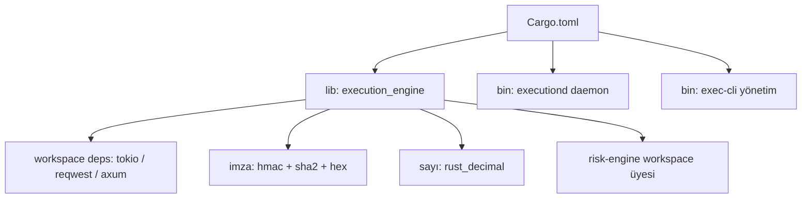
```mermaid
flowchart TD
    A["Cargo.toml"] --> B["lib: execution_engine"]
    A --> C["bin: executiond daemon"]
    A --> D["bin: exec-cli yönetim"]
    B --> E["workspace deps: tokio / reqwest / axum"]
    B --> F["imza: hmac + sha2 + hex"]
    B --> G["sayı: rust_decimal"]
    B --> H["risk-engine workspace üyesi"]
```

### `src/lib.rs`
**Detaylı açıklama:** Motorun kurulumu. `ExecutionEngine::start` `BinanceClient` kurar ve sunucu saatini senkronlar; ardından metrics, kill switch, snapshot, exchange önbelleği ve risk katmanını kurar. İki unbounded mpsc kanalı (komut + user-data olayı) oluşturur, `ExecutionActor` ve `UserDataStream`'i ayrı görevlerde başlatır ve dışarıya `EngineHandle` döndürür. `spawn_rest` REST API'yi ayrı görevde bind eder; `start_execution_engine` eski flume köprüsü için geriye dönük uyum sağlar.
**Neden kullandık:**
- Tek-yazıcı actor deseni: tüm yazmalar sıralıdır, yarış koşulu olmaz.
- Ayrı görevler (`spawn`) bloklamaz; actor, WS stream ve REST paralel çalışır.
- `EngineHandle` paylaşılabilir (Clone) kol: REST ve stratejiler için tek erişim noktası.

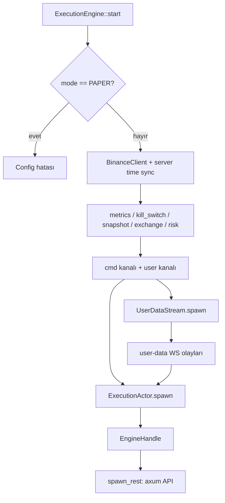
```mermaid
flowchart TD
    A["ExecutionEngine::start"] --> B{"mode == PAPER?"}
    B -->|"evet"| C["Config hatası"]
    B -->|"hayır"| D["BinanceClient + server time sync"]
    D --> E["metrics / kill_switch / snapshot / exchange / risk"]
    E --> F["cmd kanalı + user kanalı"]
    F --> G["ExecutionActor.spawn"]
    F --> H["UserDataStream.spawn"]
    H --> I["user-data WS olayları"]
    I --> G
    G --> J["EngineHandle"]
    J --> K["spawn_rest: axum API"]
```

### `src/bin/executiond.rs`
**Detaylı açıklama:** Canlı daemon'un ana fonksiyonu. `dotenvy` ile env yükler, tracing'i başlatır, `--no-dry-run` bayrağı varsa `dry_run`'ı kapatır (gerçek emir gönderimini açıkça etkinleştirir). `EXEC_MODE=PAPER` ise uyarıyla çıkar; motoru başlatır, REST API'yi verilen adrese bind eder ve `ctrl_c` sinyalini bekleyip görevleri iptal ederek kapanır.
**Neden kullandık:**
- Daemon olarak ayrı ikili: servis tek başına/systemd altında çalıştırılabilir.
- `--no_dry_run` açık bilinçli geçersiz kılma: kazara canlı emir gönderimini önler.
- `ctrl_c` grace kapanış: görevler iptal edilerek temiz çıkış sağlanır.

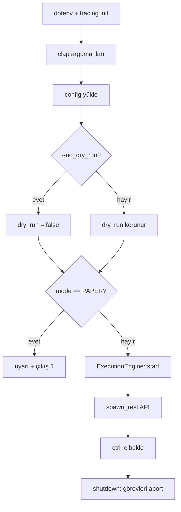
```mermaid
flowchart TD
    A["dotenv + tracing init"] --> B["clap argümanları"]
    B --> C["config yükle"]
    C --> D{"--no_dry_run?"}
    D -->|"evet"| E["dry_run = false"]
    D -->|"hayır"| F["dry_run korunur"]
    E --> G{"mode == PAPER?"}
    F --> G
    G -->|"evet"| H["uyarı + çıkış 1"]
    G -->|"hayır"| I["ExecutionEngine::start"]
    I --> J["spawn_rest API"]
    J --> K["ctrl_c bekle"]
    K --> L["shutdown: görevleri abort"]
```

### `src/bin/exec-cli.rs`
**Detaylı açıklama:** REST API'den bağımsız acil durum yönetim aracı. clap ile komutları ayrıştırır (ServerTime, Account, Balance, Positions, Order, Orders, Query, Cancel, Leverage, MarginType, Margin, Hedge, MultiAssets, Funding, Income, ExchangeInfo, ForceOrders, ListenKey), `ExecConfig`'ten `BinanceClient` kurar, sunucu saatini senkronlar ve her komutu doğrudan Binance REST'e gönderir. Emir komutu `quantity`/`--usdt` doğrulaması yapıp `OrderRequest` oluşturur; `parse_enum` ile string → enum dönüşümü yapar.
**Neden kullandık:**
- REST API kapalıyken bile erişim: operasyonel acil durum aracı olarak hayati.
- clap subcommand'leri: binlerce satır parametre ayrıştırma kodu yazmadan geniş yüzey.
- `parse_enum` serde üzerinden: enum dönüşümleri tek yardımcıda toplanır.

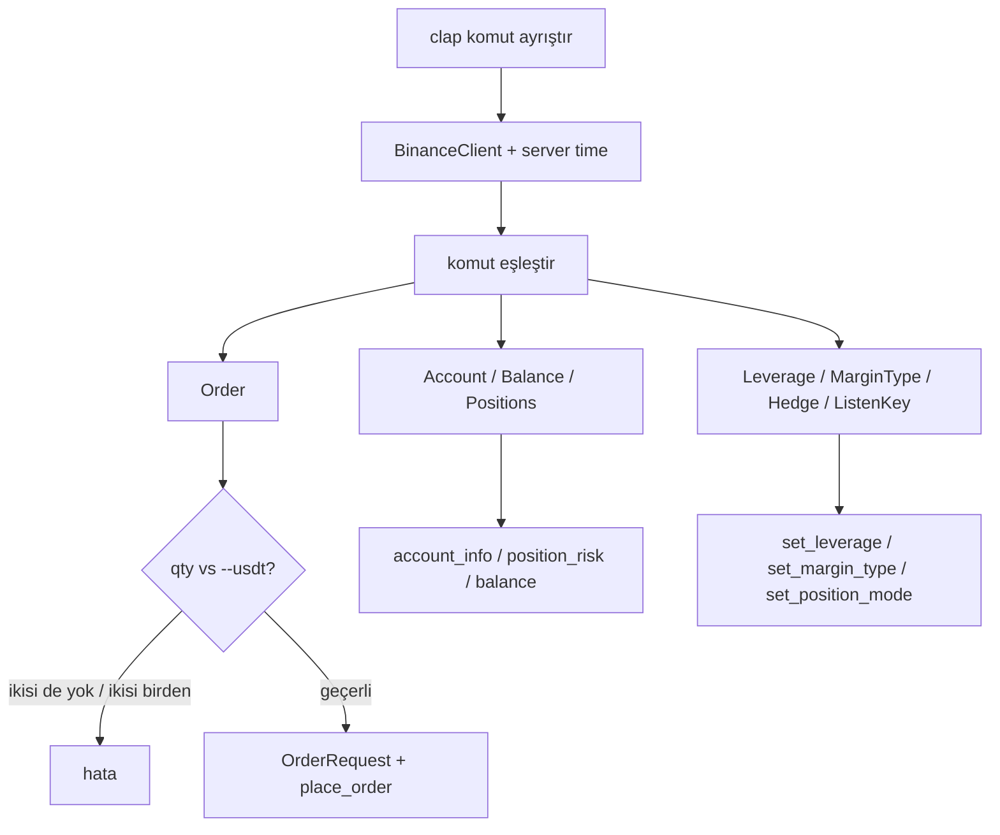
```mermaid
flowchart TD
    A["clap komut ayrıştır"] --> B["BinanceClient + server time"]
    B --> C["komut eşleştir"]
    C --> D["Order"]
    C --> E["Account / Balance / Positions"]
    C --> F["Leverage / MarginType / Hedge / ListenKey"]
    D --> G{"qty vs --usdt?"}
    G -->|"ikisi de yok / ikisi birden"| H["hata"]
    G -->|"geçerli"| I["OrderRequest + place_order"]
    E --> J["account_info / position_risk / balance"]
    F --> K["set_leverage / set_margin_type / set_position_mode"]
```

### `src/config.rs`
**Detaylı açıklama:** Tüm ayarları `EXEC_` önekli env değişkenlerinden okur: `dry_run` (varsayılan `true`), API anahtarları, base URL, risk limitleri (maks pozisyon/kaldıraç/drawdown), `EXEC_LOG_LEVEL`, kill switch yolu, HTTP/saati senkron parametreleri ve `EXEC_MODE` (LIVE/PAPER). `from_env` + `from_env_with_defaults` iki kurulum yolu sunar; `ExecConfig::binance_client()` `BinanceClient` üretir. Testlerde sahte env kurulumu (`set_env!`) ile davranış doğrulanır.
**Neden kullandık:**
- Env tabanlı yapılandırma: container/systemd ve 12-factor uygulamalarla uyumlu.
- `dry_run` varsayılan açık: canlı emir gönderimi bilinçli bir bayrak gerektirir.
- `binance_client()` üretici: tüm ikililer tek kurulum kodundan beslenir.

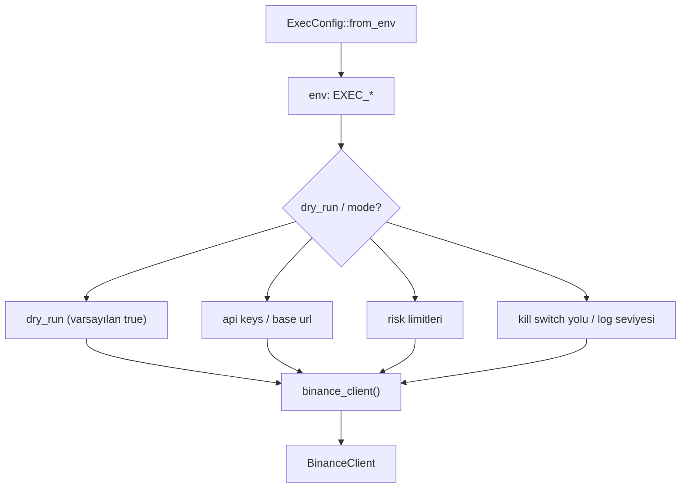
```mermaid
flowchart TD
    A["ExecConfig::from_env"] --> B["env: EXEC_*"]
    B --> C{"dry_run / mode?"}
    C --> D["dry_run (varsayılan true)"]
    C --> E["api keys / base url"]
    C --> F["risk limitleri"]
    C --> G["kill switch yolu / log seviyesi"]
    D --> H["binance_client()"]
    E --> H
    F --> H
    G --> H
    H --> I["BinanceClient"]
```

### `src/error.rs`
**Detaylı açıklama:** Motorun hata modeli. `ExecutionError` varyantları operasyonel gerçeği yansıtır: `Http`/`Binance` ağ hataları, `RateLimit` ağırlık ihlali, `Preflight`/`Risk` redleri, `Idempotency` tekrar engeli, `State`/`Snapshot` durum erişimi, `KillSwitch` devrede, `Config`, `Parse`, `Internal`. `is_retryable` yeniden denenebilirliği kodlar (ağ/saat/uçtan uca), `Code` `place_order` ağırlığına göre yeniden deneme öncesi bekleme süresini belirler. Bu ayrım gateway ve actor akışında hata sınıfına göre farklı aksiyon (retry / red / ölü emir) alınmasını sağlar.
**Neden kullandık:**
- Operasyonel hata sınıfları: retry kararları tek noktadan yönetilir.
- `is_retryable` + `Code`: ağırlık tabanlı geri çekilme preflight/risk hatalarını yeniden denemez.
- `thiserror` türetimi: `?` ile dönüşümler ve ekran hata mesajları ücretsiz.

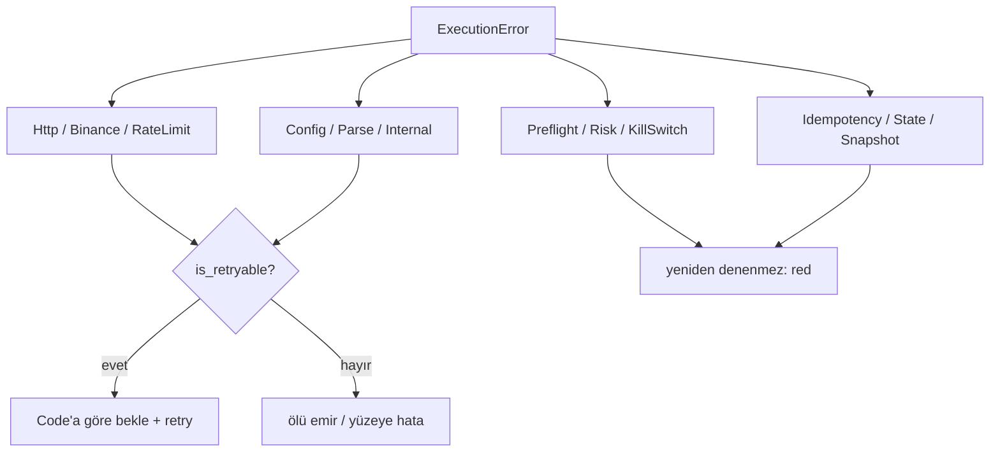
```mermaid
flowchart TD
    A["ExecutionError"] --> B["Http / Binance / RateLimit"]
    A --> C["Preflight / Risk / KillSwitch"]
    A --> D["Idempotency / State / Snapshot"]
    A --> E["Config / Parse / Internal"]
    B --> F{"is_retryable?"}
    C --> G["yeniden denenmez: red"]
    D --> G
    E --> F
    F -->|"evet"| H["Code'a göre bekle + retry"]
    F -->|"hayır"| I["ölü emir / yüzeye hata"]
```

### `src/client/mod.rs`
**Detaylı açıklama:** `BinanceClient`, tüm Binance USDT-M Futures REST uçlarını tek yüzeyde toplar: pazar/metadata (ping, time, ticker, exchangeInfo), emir (place, batch≤5, query, cancel, cancel-all, modify), hesap/pozisyon (account, balance, positionRisk, income, forceOrders...), yapılandırma (leverage, margin, hedge, multi-assets) ve listenKey yönetimi. İmzalı istekler `HttpClient` üzerinden gider; `order_params` `OrderRequest`'i kanonik borsa parametrelerine çevirir (örn. eski `StopLoss`→`STOP`).
**Neden kullandık:**
- Tek istemci nesnesi: actor, REST servisi ve CLI aynı imza mantığını paylaşır.
- `order_params` ayrı fonksiyon: hem tekli hem batch hem test için yeniden kullanılır.
- `quoteOrderQty` desteklenmediğinden USDT büyüklüğü quantity'ye çevrilir.

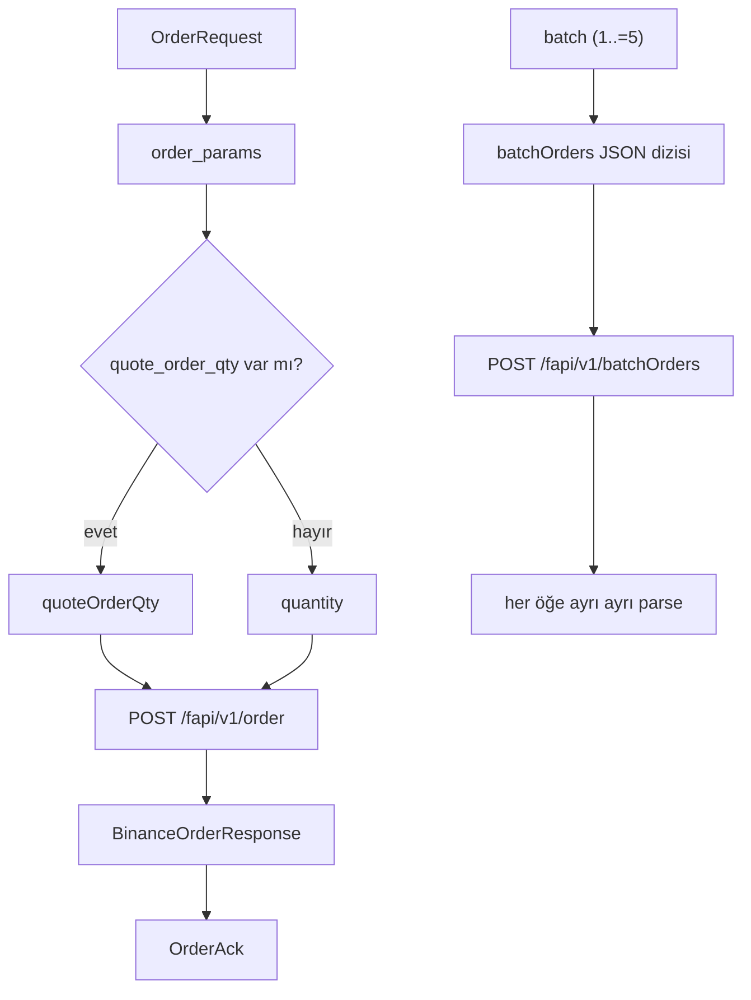
```mermaid
flowchart TD
    A["OrderRequest"] --> B["order_params"]
    B --> C{"quote_order_qty var mı?"}
    C -->|"evet"| D["quoteOrderQty"]
    C -->|"hayır"| E["quantity"]
    D --> F["POST /fapi/v1/order"]
    E --> F
    F --> G["BinanceOrderResponse"]
    G --> H["OrderAck"]
    A2["batch (1..=5)"] --> I["batchOrders JSON dizisi"]
    I --> J["POST /fapi/v1/batchOrders"]
    J --> K["her öğe ayrı ayrı parse"]
```

### `src/client/http.rs`
**Detaylı açıklama:** `HttpClient` ağın alt katmanıdır. İmzalı isteklerde timestamp + recvWindow ekler, parametreleri sıralar, query'yi HMAC ile imzalar ve `X-MBX-APIKEY` başlığını koyar. Yanıt akışında 429/418 rate-limit, `-1021` timestamp drift ve yeniden denenebilir ağ/5xx hataları için üstel geri çekilme ile (en fazla 3 deneme) yeniden dener. `sync_server_time` RTT'nin yarısını düşerek ofseti hesaplar ve atomik olarak saklar.
**Neden kullandık:**
- Savunmacı retry: kısa ağ kesintileri ve rate-limit emir kaybettirmez.
- Merkezi saat senkronu: `-1021` drift'i otomatik düzeltir.
- `x-mbx-used-weight-1m` ağırlık takibi: borsa limitine yaklaşım görünür kılınır.

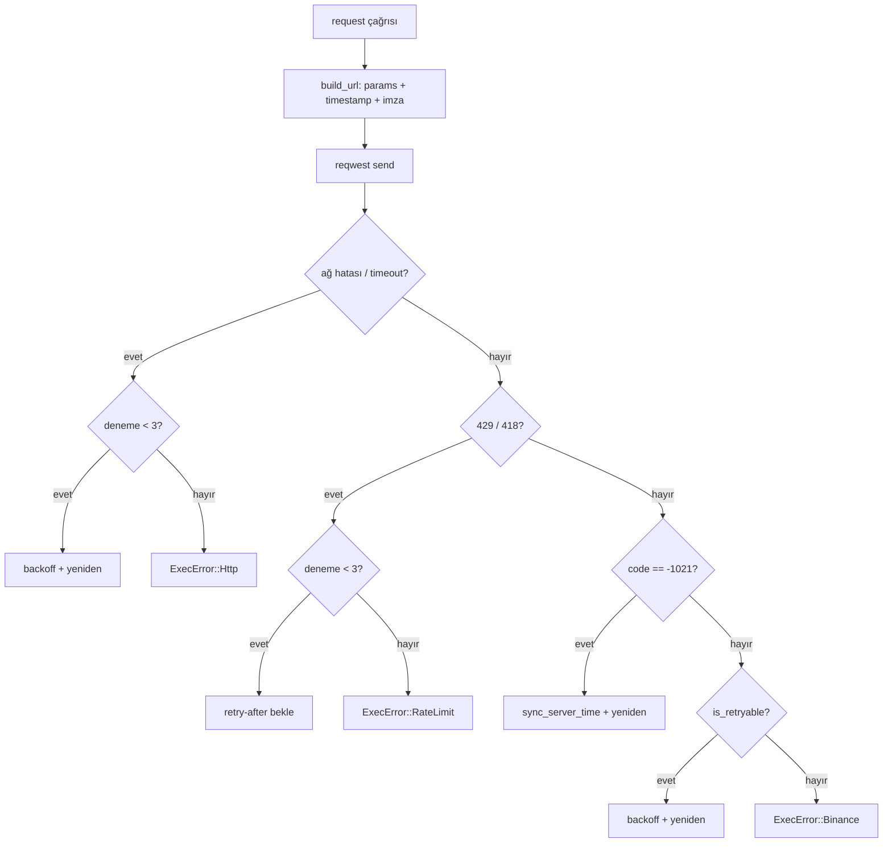
```mermaid
flowchart TD
    A["request çağrısı"] --> B["build_url: params + timestamp + imza"]
    B --> C["reqwest send"]
    C --> D{"ağ hatası / timeout?"}
    D -->|"evet"| E{"deneme < 3?"}
    E -->|"evet"| F["backoff + yeniden"]
    E -->|"hayır"| G["ExecError::Http"]
    D -->|"hayır"| H{"429 / 418?"}
    H -->|"evet"| I{"deneme < 3?"}
    I -->|"evet"| J["retry-after bekle"]
    I -->|"hayır"| K["ExecError::RateLimit"]
    H -->|"hayır"| L{"code == -1021?"}
    L -->|"evet"| M["sync_server_time + yeniden"]
    L -->|"hayır"| N{"is_retryable?"}
    N -->|"evet"| O["backoff + yeniden"]
    N -->|"hayır"| P["ExecError::Binance"]
```

### `src/signer.rs`
**Detaylı açıklama:** Binance API kimlik doğrulaması için HMAC-SHA256 imzalayıcı. `sign(query_string)` gizli anahtarla HMAC başlatır, sorgu dizesini işler, sonucu 64 karakterlik hex dizeye çevirir. `#[inline(always)]` ile imza yolunda ek yük en aza indirilir (HFT gecikmesi). Test, determinizm ve biçimi (64 hex) doğrular.
**Neden kullandık:**
- `hmac` + `sha2`: standart, hızlı ve denetlenmiş kripto kütüphaneleri.
- `inline(always)`: emir yolundaki en sıcak kod parçası.
- Basit `&str` arayüz: URL kurulumunda sıfır tahsis mantığı.

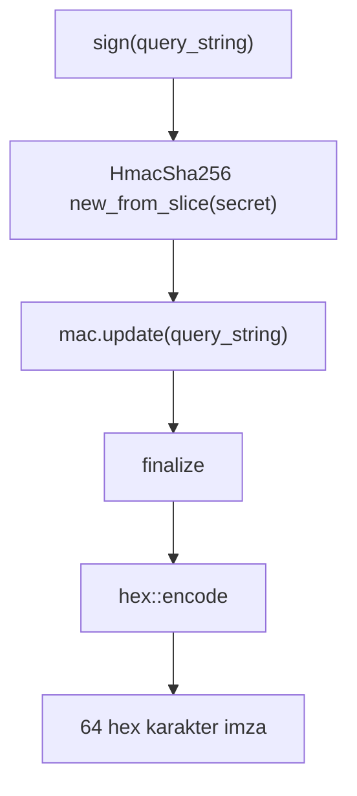
```mermaid
flowchart TD
    A["sign(query_string)"] --> B["HmacSha256 new_from_slice(secret)"]
    B --> C["mac.update(query_string)"]
    C --> D["finalize"]
    D --> E["hex::encode"]
    E --> F["64 hex karakter imza"]
```

### `src/execution/mod.rs`
**Detaylı açıklama:** Emir yürütme çekirdeğinin modül bildirimi. `actor`, `idempotency`, `lifecycle`, `preflight` alt modüllerini açıklar ve dışarıya `Command`, `ExecutionActor`, `UserEvent`, `new_client_order_id`, `Preflight` ihraç eder.
**Neden kullandık:**
- Yürütme mantığını ayrı namespace'te izole eder (client/state'ten ayırır).
- Toplu re-export: dış tüketiciler tek `use` ile erişir.

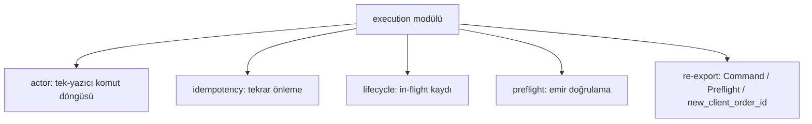
```mermaid
flowchart TD
    A["execution modülü"] --> B["actor: tek-yazıcı komut döngüsü"]
    A --> C["idempotency: tekrar önleme"]
    A --> D["lifecycle: in-flight kaydı"]
    A --> E["preflight: emir doğrulama"]
    A --> F["re-export: Command / Preflight / new_client_order_id"]
```

### `src/execution/actor.rs`
**Detaylı açıklama:** Motorun kalbidir. `run()` `tokio::select!` ile dört kaynağı dinler: komut kanalı, user-data olay kanalı, periyodik uzlaştırma tick'i ve in-flight kontrol tick'i. Başlamadan önce `resync()` ile tam hesap/pozisyon/açık emir eşitlemesi yapar (`ready` bayrağını kaldırır). `submit_order` akışı: snapshot hazır mı → kill switch kapalı mı → USDT büyüklüğü mark fiyatından quantity'ye çevir → risk kontrolü → idempotency kontrolü → preflight normalize → dry_run mı → in-flight'a kaydet → `place_order`. Başarıda açık emir snapshot'a yansıtılır, dolumda fill metriği ve risk muhasebesi güncellenir; hatada in-flight'tan düşülür.
**Neden kullandık:**
- Tek-yazıcı: tüm mutasyonlar sıralıdır, kilit çağrısı (deadlock) riski yoktur.
- `select!` : komut/olay/timer'lar tek döngüde eşzamanlı dinlenir.
- `InFlightRegistry` + periyodik sorgu: ACK alındı ama WS onayı gelmediyse emir kaybolmaz.

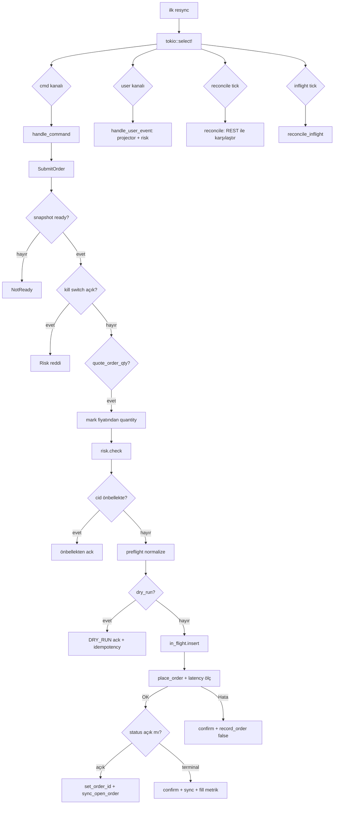
```mermaid
flowchart TD
    A["ilk resync"] --> B["tokio::select!"]
    B --> C{"cmd kanalı"}
    B --> D{"user kanalı"}
    B --> E{"reconcile tick"}
    B --> F{"inflight tick"}
    C --> G["handle_command"]
    D --> H["handle_user_event: projector + risk"]
    E --> I["reconcile: REST ile karşılaştır"]
    F --> J["reconcile_inflight"]
    G --> K["SubmitOrder"]
    K --> L{"snapshot ready?"}
    L -->|"hayır"| M["NotReady"]
    L -->|"evet"| N{"kill switch açık?"}
    N -->|"evet"| O["Risk reddi"]
    N -->|"hayır"| P{"quote_order_qty?"}
    P -->|"evet"| Q["mark fiyatından quantity"]
    Q --> R["risk.check"]
    R --> S{"cid önbellekte?"}
    S -->|"evet"| T["önbellekten ack"]
    S -->|"hayır"| U["preflight normalize"]
    U --> V{"dry_run?"}
    V -->|"evet"| W["DRY_RUN ack + idempotency"]
    V -->|"hayır"| X["in_flight.insert"]
    X --> Y["place_order + latency ölç"]
    Y -->|"OK"| Z{"status açık mı?"}
    Z -->|"açık"| AA["set_order_id + sync_open_order"]
    Z -->|"terminal"| AB["confirm + sync + fill metrik"]
    Y -->|"Hata"| AC["confirm + record_order false"]
```

### `src/execution/idempotency.rs`
**Detaylı açıklama:** `HashMap<String, OrderAck>` tabanlı basit bir önbellek. Aynı `client_order_id` ile ikinci kez gelen emir borsaya gönderilmez; ilk yanıt yeniden döndürülür. Kapasite aşıldığında en eski (ilk eklenen) anahtar atılır; `contains`, `get`, `set` temel operasyonlardır. Ağ hatası sonrası yeniden denemede çift emir oluşmasını engeller.
**Neden kullandık:**
- Binance tarafında `newClientOrderId` idempotency ile birlikte çift koruma.
- Basit LRU benzeri tahliye: sonsuz büyüme ve bellek şişmesi engellenir.
- `OrderAck` kopyası döndürülür: çağıranlar paylaşılan referans tutmaz.

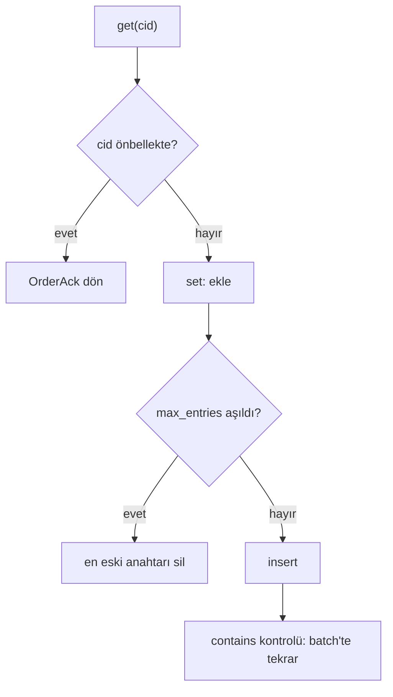
```mermaid
flowchart TD
    A["get(cid)"] --> B{"cid önbellekte?"}
    B -->|"evet"| C["OrderAck dön"]
    B -->|"hayır"| D["set: ekle"]
    D --> E{"max_entries aşıldı?"}
    E -->|"evet"| F["en eski anahtarı sil"]
    E -->|"hayır"| G["insert"]
    G --> H["contains kontrolü: batch'te tekrar"]
```

### `src/execution/lifecycle.rs`
**Detaylı açıklama:** Havadaki (in-flight) emirlerin kaydını tutar. `InFlightRegistry.insert` emiri `sent_at` ve `timeout_ms` ile saklar (kapasite aşılınca en eskisi düşürülür); `expired(now)` zaman aşımına uğrayanları döndürür, `confirm`/`confirm_by_order_id` emri kayıttan düşer. Zaman aşımında actor `GET /fapi/v1/order` ile emri sorgulayıp terminal ise kapatır, değilse zaman aşımını sıfırlar.
**Neden kullandık:**
- ACK sonrası WS onayı gecikebilir; bu kayıt emrin "havada kalmamasını" sağlar.
- Kapasite sınırı + tahliye: yüksek hızlarda bellek kontrollü kalır.
- `Instant` tabanlı zaman aşımı: duvar saati kaymasından etkilenmez.

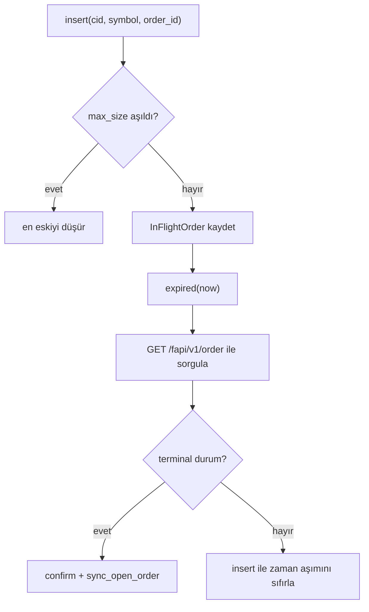
```mermaid
flowchart TD
    A["insert(cid, symbol, order_id)"] --> B{"max_size aşıldı?"}
    B -->|"evet"| C["en eskiyi düşür"]
    B -->|"hayır"| D["InFlightOrder kaydet"]
    D --> E["expired(now)"]
    E --> F["GET /fapi/v1/order ile sorgula"]
    F --> G{"terminal durum?"}
    G -->|"evet"| H["confirm + sync_open_order"]
    G -->|"hayır"| I["insert ile zaman aşımını sıfırla"]
```

### `src/execution/preflight.rs`
**Detaylı açıklama:** Emir borsaya gitmeden önceki savunma hattı. `normalize_and_check`: sembolü exchange önbelleğinde bulur; durum `TRADING` mı, marj destekli mi, emir tipi izinli mi ve hedge/one-way pozisyon modu tutarlı mı diye denetler. Sonra miktarı step ve precizyon alt sınırına yuvarlar (asla yukarı değil), fiyatı tick katına yuvarlar; koşullu emirlerde `stop_price`, trailing'de `activation_price`+`callback_rate`, LIMIT'te `time_in_force` zorunluluğunu doğrular. `MIN_NOTIONAL`, `MAX_NUM_ALGO_ORDERS` ve 36 karakterlik client order id sınırını uygular; cid yoksa uuid v4 üretir.
**Neden kullandık:**
- Reddedilen emir borsaya asla ulaşmaz → `-1111`/`-1108` tarzı borsa hatalarından kaçınılır.
- Yuvarlama yalnızca aşağı: geçersiz (borsa tarafından reddedilecek) miktar üretilmez.
- Mod kontrolü: HEDGE/ONE_WAY yanlış `positionSide` ile borsa reddini önceden yakalar.

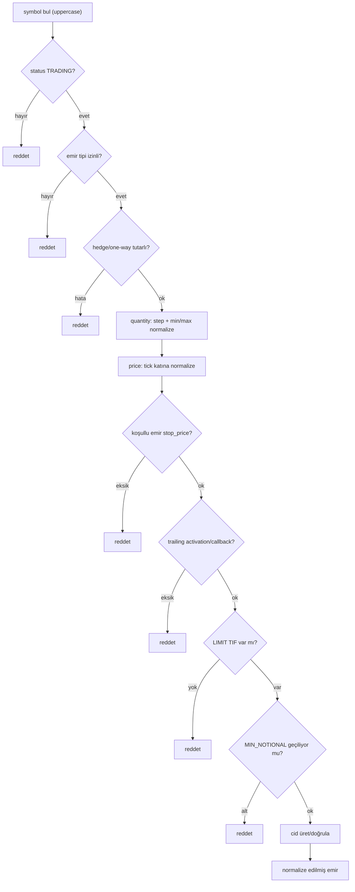
```mermaid
flowchart TD
    A["symbol bul (uppercase)"] --> B{"status TRADING?"}
    B -->|"hayır"| C["reddet"]
    B -->|"evet"| D{"emir tipi izinli?"}
    D -->|"hayır"| E["reddet"]
    D -->|"evet"| F{"hedge/one-way tutarlı?"}
    F -->|"hata"| G["reddet"]
    F -->|"ok"| H["quantity: step + min/max normalize"]
    H --> I["price: tick katına normalize"]
    I --> J{"koşullu emir stop_price?"}
    J -->|"eksik"| K["reddet"]
    J -->|"ok"| L{"trailing activation/callback?"}
    L -->|"eksik"| M["reddet"]
    L -->|"ok"| N{"LIMIT TIF var mı?"}
    N -->|"yok"| O["reddet"]
    N -->|"var"| P{"MIN_NOTIONAL geçiliyor mu?"}
    P -->|"alt"| Q["reddet"]
    P -->|"ok"| R["cid üret/doğrula"]
    R --> S["normalize edilmiş emir"]
```

### `src/gateway.rs`
**Detaylı açıklama:** `EngineHandle`, actor'e erişim koludur: her yazma işlemi bir `oneshot` kanalı + 10 sn zaman aşımı ile `Command` olarak actor'e gönderilir, yanıt beklenir. `close_symbol`/`close_all` snapshot'taki pozisyonları ters yönlü MARKET emirle kapatır. `Gateway` trait'i `LiveGateway` ve `PaperGateway` tarafından uygulanır; stratejiler PAPER/LIVE farkını görmeden aynı arayüzü kullanır. `PaperGateway` mevcut paper actor'ünü sararak aynı trait'e uydurur.
**Neden kullandık:**
- Async request/reply (oneshot): komut sonucu beklenebilir, hata zaman aşımıyla sınırlanır.
- Trait soyutlaması: strateji katmanı PAPER/LIVE ayırt etmez, ileride başka borsa eklenebilir.
- 10 sn `CMD_TIMEOUT`: donan actor çağıranı asla kilitlemez.

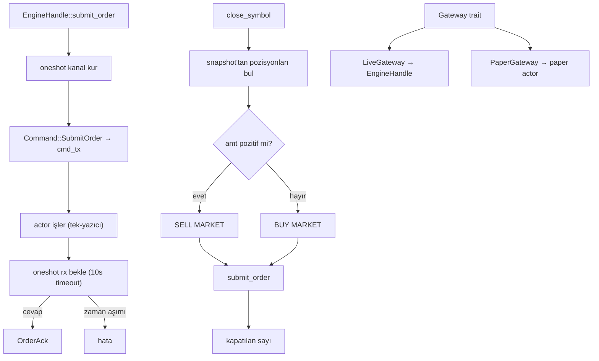
```mermaid
flowchart TD
    A["EngineHandle::submit_order"] --> B["oneshot kanal kur"]
    B --> C["Command::SubmitOrder → cmd_tx"]
    C --> D["actor işler (tek-yazıcı)"]
    D --> E["oneshot rx bekle (10s timeout)"]
    E -->|"cevap"| F["OrderAck"]
    E -->|"zaman aşımı"| G["hata"]
    A2["close_symbol"] --> H["snapshot'tan pozisyonları bul"]
    H --> I{"amt pozitif mi?"}
    I -->|"evet"| J["SELL MARKET"]
    I -->|"hayır"| K["BUY MARKET"]
    J --> L["submit_order"]
    K --> L
    L --> M["kapatılan sayı"]
    A3["Gateway trait"] --> N["LiveGateway → EngineHandle"]
    A3 --> O["PaperGateway → paper actor"]
```

### `src/metrics.rs`
**Detaylı açıklama:** Operasyonel izleme katmanı. Emir/fill/reject/cancel, WS yeniden bağlanma, resync, HTTP hatası ve rate-limit sayaçları atomik `AtomicU64` ile tutulur; emir gidiş-dönüş gecikmeleri `hdrhistogram::Histogram` içinde yüksek çözünürlüklü dağılıma kaydedilir. `render_prometheus` sayaçları ve p50/p99/max gecikmeyi Prometheus uyumlu metin olarak üretir (`GET /metrics`).
**Neden kullandık:**
- `AtomicU64` (Relaxed): sayaçlar için sıfır kilit maliyeti, HFT yolu bloklanmaz.
- `hdrhistogram`: p99 gibi uç gecikme persentilleri için doğru dağılım.
- Tek render fonksiyonu: Prometheus tarayıcısına sade metin, ekstra çıktı yok.

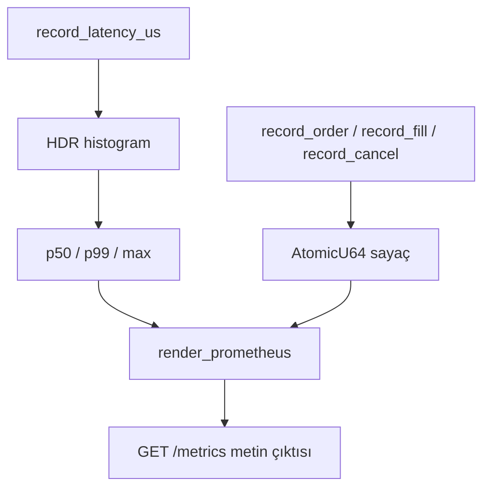
```mermaid
flowchart TD
    A["record_order / record_fill / record_cancel"] --> B["AtomicU64 sayaç"]
    A2["record_latency_us"] --> C["HDR histogram"]
    C --> D["p50 / p99 / max"]
    D --> E["render_prometheus"]
    B --> E
    E --> F["GET /metrics metin çıktısı"]
```

### `src/order.rs`
**Detaylı açıklama:** Emir domain modeli. `OrderSide`, `OrderType`, `TimeInForce`, `OrderPositionSide`, `WorkingType`, `SelfTradePreventionMode`, `OrderStatus`, `OrderExecutionType` enum'ları serde ile SCREAMING_SNAKE_CASE JSON'a eşlenir. `OrderType::binance_str` eski paper varyantlarını (StopLoss, TakeProfit...) kanonik borsa tiplerine çevirir; `requires_price`, `requires_time_in_force`, `is_stop` doğrulamada kullanılır. `OrderRequest` tüm borsa parametrelerini taşır; `BinanceOrderResponse` (ACK modunda eksik alanlar `Option`) ve kurumsal `OrderAck` dönüştürmesini sağlar.
**Neden kullandık:**
- Geriye dönük uyumluluk: eski tip isimleri korunur, canlıya kanonik değer gider.
- `Option` alanlar: ACK yanıtlarındaki eksik alanlara karşı savunmacı deserialization.
- Tek model: hem CLI, REST API hem actor aynı `OrderRequest`'i kullanır.

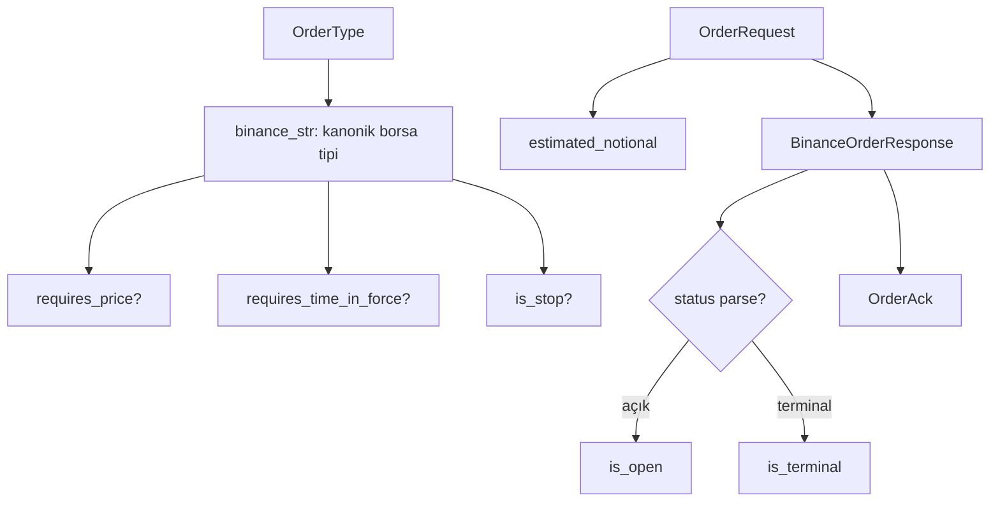
```mermaid
flowchart TD
    A["OrderType"] --> B["binance_str: kanonik borsa tipi"]
    B --> C["requires_price?"]
    B --> D["requires_time_in_force?"]
    B --> E["is_stop?"]
    A2["OrderRequest"] --> F["estimated_notional"]
    A2 --> G["BinanceOrderResponse"]
    G --> H{"status parse?"}
    H -->|"açık"| I["is_open"]
    H -->|"terminal"| J["is_terminal"]
    G --> K["OrderAck"]
```

### `src/risk/mod.rs`
**Detaylı açıklama:** Risk katmanının modül bildirimi. `checks` (RiskChecks) ve `kill_switch` alt modüllerini açıklar, ikisini de dışarıya ihraç eder.
**Neden kullandık:**
- Risk katmanını emir yürütmeden ayırır; modül sınırı kazara atlanmayı zorlaştırır.

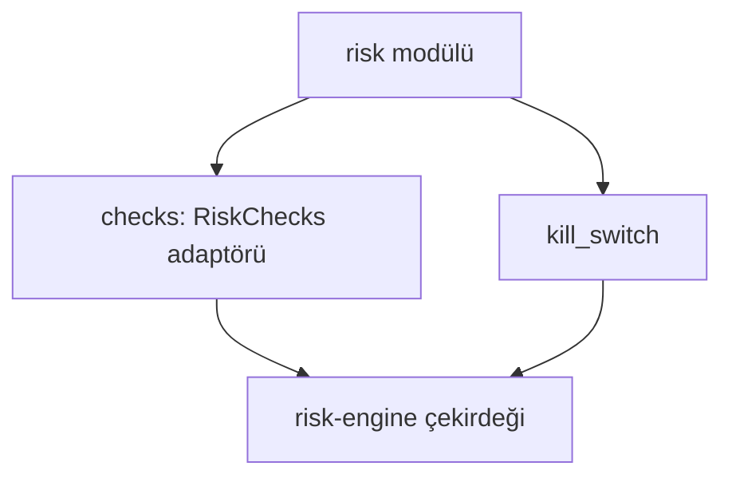
```mermaid
flowchart TD
    A["risk modülü"] --> B["checks: RiskChecks adaptörü"]
    A --> C["kill_switch"]
    B --> D["risk-engine çekirdeği"]
    C --> D
```

### `src/risk/checks.rs`
**Detaylı açıklama:** `RiskChecks`, `risk_engine::RiskEngine`'e ince bir bağdaştırıcıdır. `with_kill_switch` policy'yi config'den kurar (max_notional, emir/dk, blocklist, pozisyon tavanı) ve actor ile AYNI kill switch örneğini paylaşır — aksi halde release senkronize olmaz. `check` `OrderRequest`'i `OrderIntent`'e çevirir, `RiskEngine::evaluate` kararını döner. `sync_from_snapshot` resync sonrası nakit/açık emir notional'ı/pozisyonları risk state'ine yansıtır; `on_fill` gerçekleşen dolumları muhasebeye işler.
**Neden kullandık:**
- Tek doğruluk kaynağı: tüm risk kuralları `risk-engine`'de yaşar, tekrar yazılmaz.
- Paylaşılan kill switch: actor'ün release'u RiskEngine bayrağını da kapatır (kilitlenme önlenir).
- Snapshot senkronizasyonu: borsa gerçeği risk hesaplarına düzenli yansır.

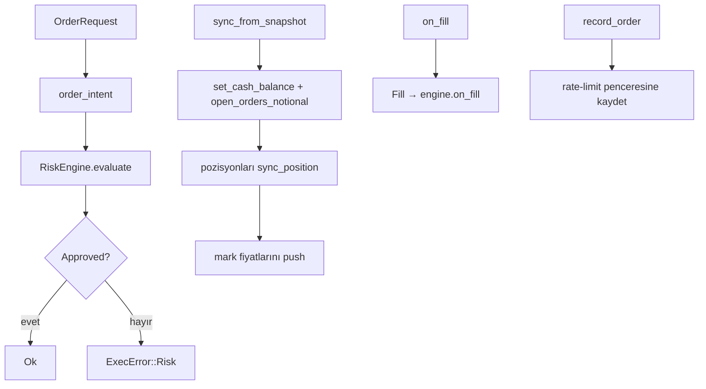
```mermaid
flowchart TD
    A["OrderRequest"] --> B["order_intent"]
    B --> C["RiskEngine.evaluate"]
    C --> D{"Approved?"}
    D -->|"evet"| E["Ok"]
    D -->|"hayır"| F["ExecError::Risk"]
    A2["sync_from_snapshot"] --> G["set_cash_balance + open_orders_notional"]
    G --> H["pozisyonları sync_position"]
    H --> I["mark fiyatlarını push"]
    A3["on_fill"] --> J["Fill → engine.on_fill"]
    A4["record_order"] --> K["rate-limit penceresine kaydet"]
```

### `src/risk/kill_switch.rs`
**Detaylı açıklama:** `risk_engine::kill_switch::KillSwitch`'i yeniden ihraç eder. Dosya tabanlı acil durdurma anahtarı: belirtilen yolda dosya varsa emir gönderimi reddedilir. `new(path)`, `is_open()`, `engage()`, `release()` API'si geriye dönük uyumludur.
**Neden kullandık:**
- Operatör dostu acil durdurma: kill switch dosyası oluşturulduğu an motor durur.
- Tek uygulama: hem risk çekirdeği hem actor aynı bayrağa bakar.

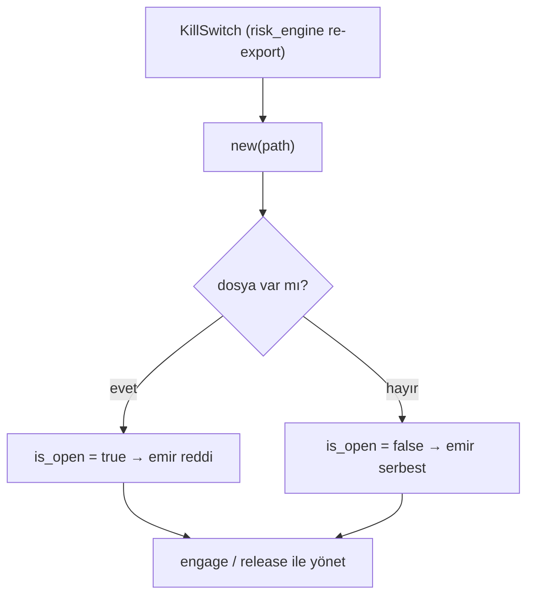
```mermaid
flowchart TD
    A["KillSwitch (risk_engine re-export)"] --> B["new(path)"]
    B --> C{"dosya var mı?"}
    C -->|"evet"| D["is_open = true → emir reddi"]
    C -->|"hayır"| E["is_open = false → emir serbest"]
    D --> F["engage / release ile yönet"]
    E --> F
```

### `src/state/mod.rs`
**Detaylı açıklama:** Durum katmanının modül bildirimi; `exchange_cache`, `projector`, `snapshot` alt modüllerini açıklar ve `ExchangeCache` ile `AccountSnapshot`'ı ihraç eder.
**Neden kullandık:**
- Paylaşılan durumu tek yerde toplar; actor yazıcı, diğerleri okuyucudur.

```mermaid
flowchart TD
    A["state modülü"] --> B["exchange_cache: sembol kuralları"]
    A --> C["projector: olay → snapshot"]
    A --> D["snapshot: okuma görünümü"]
    C --> D
    B --> E["preflight doğrulama"]
```

### `src/state/snapshot.rs`
**Detaylı açıklama:** `AccountSnapshot`, motorun paylaşılan okuma görünümüdür: hesap, pozisyonlar, açık emirler, exchange bilgisi, `ready` bayrağı, pozisyon modu ve her değişiklikte artan `sequence`. Yardımcı fonksiyonlar: `open_position_notional`, `open_orders_notional` (açık emirlerin rezerve ettiği fiyat×miktar), `open_position_count`, `available_balance`, `usdt_balance`. Actor yazar, REST/stratejiler `RwLock` ile okur.
**Neden kullandık:**
- Tek görünüm: tüm tüketiciler aynı tutarlı state'i okur.
- `ready` bayrağı: ilk eşitleme tamamlanmadan yazmaları kilitler.
- `sequence`: projection doğrulaması ve değişiklik izleme için monoton sayaç.

```mermaid
flowchart TD
    A["AccountSnapshot (Arc RwLock)"] --> B["account"]
    A --> C["positions"]
    A --> D["open_orders"]
    A --> E["ready / position_mode / sequence"]
    B --> F["available_balance / usdt_balance"]
    C --> G["open_position_notional / count"]
    D --> H["open_orders_notional"]
    E --> I{"ready?"}
    I -->|"hayır"| J["emir kabul edilmez"]
    I -->|"evet"| K["emir kabul"]
```

### `src/state/projector.rs`
**Detaylı açıklama:** User-data stream olaylarını snapshot'a uygulayan saf fonksiyonlar. `apply` üç olay tipini işler: `AccountUpdate` bakiye ve pozisyonları upsert eder (total cüzdan bakiyesini yeniden toplar), `OrderTradeUpdate` açık emir listesini eşitler ve `TRADE` fill'inde `apply_fill` ile pozisyonu günceller, `AccountConfigUpdate` leverage/margin/dual-side'ı uygular. `signed_fill` hedge tarafında SELL'in SHORT'u büyüttüğü semantiği doğru işaretlenmiş miktarla kurar; `apply_fill` aynı yönde ağırlıklı ortalama giriş fiyatı hesaplar.
**Neden kullandık:**
- Saf fonksiyonlar: kolayca test edilir (modül içinde kapsamlı testler var).
- Deltalar borsa gerçeğidir; periyodik uzlaştırma tam doğruluğu garanti eder.
- `signed_fill`: hedge ve one-way semantiği tek yerde doğru tutulur.

```mermaid
flowchart TD
    A["UserDataEvent"] --> B{"AccountUpdate?"}
    B -->|"evet"| C["upsert bakiye"]
    C --> D["upsert pozisyon + ayna"]
    D --> E["sequence += 1"]
    A --> F{"OrderTradeUpdate?"}
    F -->|"evet"| G["sync_open_orders"]
    G --> H{"TRADE fill?"}
    H -->|"evet"| I["apply_fill (işaretli)"]
    A --> J{"AccountConfigUpdate?"}
    J -->|"evet"| K["leverage / margin / dualSide güncelle"]
    A --> L{"MarginCall / ListenKeyExpired / Unknown"}
    L --> M["yoksay"]
```

### `src/state/exchange_cache.rs`
**Detaylı açıklama:** `/fapi/v1/exchangeInfo` (~300KB) yanıtını önbelleğe alır; her emirde borsadan çekmeyi önler. `refresh_if_stale` hem yüklü değilse hem de belirli aralık geçtiyse yeniler. Ayrıca fiyat/miktar yuvarlama yardımcıları barındırır: `round_qty_to_step` (aşağı), `round_price_to_tick` (yarım-yukarı), `round_to_precision`, `lot_step`, `tick_size` — preflight bunlarla emirleri sembol kurallarına uydurur.
**Neden kullandık:**
- Ağırlık tasarrufu: exchangeInfo her istekte çekilmez (borsa weight limiti).
- Merkezi yuvarlama yardımcıları: preflight tek doğru mantığı kullanır.
- `refresh_if_stale`: ilk yükleme zorunlu, sonrasında periyodik tazelenir.

```mermaid
flowchart TD
    A["ExchangeCache"] --> B{"loaded ve taze mi?"}
    B -->|"hayır"| C["refresh: exchangeInfo çek"]
    B -->|"evet"| D["önbellekten sembol kuralları"]
    D --> E["round_qty_to_step (aşağı)"]
    D --> F["round_price_to_tick (yarım-yukarı)"]
    E --> G["preflight normalize"]
    F --> G
```

### `src/types/mod.rs`
**Detaylı açıklama:** Veri modelinin modül bildirimi; `account`, `exchange`, `income`, `position`, `user_event` alt modüllerini açıklar ve ana tipleri ihraç eder. Binance sayısal değerleri string geldiği için `rust_decimal`'e çevrilir.
**Neden kullandık:**
- Tipli görünümler: ham `serde_json::Value` yerine derlenmiş tipler güvenli erişim sağlar.
- Toplu re-export: tek `use` ile tüm model erişilebilir.

```mermaid
flowchart TD
    A["types modülü"] --> B["account: hesap/bakiye"]
    A --> C["exchange: sembol kuralları"]
    A --> D["income: gelir kayıtları"]
    A --> E["position: pozisyon riski"]
    A --> F["user_event: stream olayları"]
    B --> G["string sayılar → Decimal"]
    C --> G
```

### `src/types/account.rs`
**Detaylı açıklama:** `/fapi/v3/account` ve `/fapi/v3/balance` yanıtlarının tipli görünümü. Binance sayıları string döndürdüğü için her tip için bir `Raw` ara struct'ı deserialize edilir ve `Balance::dec` ile `rust_decimal`'e çevrilir; eksik alanlar sıfır kabul edilir. `MarginType` (Isolated/Crossed) enum'u `binance_str` ve `from_binance` ile borsa string'leri arasında dönüşür.
**Neden kullandık:**
- String→Decimal dönüşümü: ondalık hassasiyet kaybı (float) olmadan borsa değerleri taşınır.
- Savunmacı `Option` + varsayılan: borsa biçim değişikliğinde panik yok.
- Raw struct deserialization: eksik alanlara toleranslı.

```mermaid
flowchart TD
    A["/fapi/v3/account JSON"] --> B["Raw struct"]
    B --> C["dec: string → Decimal"]
    C --> D["AccountInfo"]
    C --> E["AssetBalance"]
    C --> F["AccountPosition"]
    A2["/fapi/v3/balance"] --> G["Balance"]
    A3["marginType string"] --> H{"ISOLATED / CROSSED?"}
    H -->|"ISOLATED"| I["MarginType::Isolated"]
    H -->|"CROSSED"| J["MarginType::Crossed"]
```

### `src/types/exchange.rs`
**Detaylı açıklama:** `/fapi/v1/exchangeInfo` modeli. `SymbolFilter` enum'u borsa `filterType`'ına göre tiplenir: PRICE_FILTER, LOT_SIZE, MIN_NOTIONAL, MAX_NUM_ORDERS, MAX_NUM_ALGO_ORDERS, MAX_POSITION, PERCENT_PRICE, MARKET_LOT_SIZE, bilinmeyenler `Other`. `SymbolInfo` sembolün kurallarını (precizyon, izinli emir tipleri, TIF'ler, filtreler, triggerProtect) taşır; `ExchangeInfo.symbol` arama yardımcısı sunar. Futures'ta `marginTradingSupported` alanı olmadığı için eksikse `true` varsayılır.
**Neden kullandık:**
- Preflight'ın temeli: sembol kuralları ve filtreler burada tiplenir.
- String sayılar → Decimal: `tick_size`, `step_size` gibi kesirli kurallar hassas saklanır.
- `Other` varyantı: bilinmeyen filtreler ayrıştırmayı kırmaz.

```mermaid
flowchart TD
    A["exchangeInfo JSON"] --> B["Raw deserialize"]
    B --> C{"filterType?"}
    C -->|"PRICE_FILTER"| D["PriceFilter"]
    C -->|"LOT_SIZE"| E["LotSize"]
    C -->|"MIN_NOTIONAL"| F["MinNotional"]
    C -->|"MAX_NUM_ORDERS"| G["MaxNumOrders"]
    C -->|"MAX_POSITION"| H["MaxPosition"]
    C -->|"diğer"| I["Other"]
    D --> J["SymbolInfo"]
    E --> J
    F --> J
    G --> J
    H --> J
    I --> J
    J --> K["ExchangeInfo.symbol(s)"]
```

### `src/types/income.rs`
**Detaylı açıklama:** `/fapi/v1/income` gelir kayıtlarını modeli. `IncomeType` borsa string'lerini tiplere eşler (`FUNDING_FEE`, `REALIZED_PNL`, `COMMISSION`...; likidasyon için iki eşanlamlı aynı varyanta gider). `Income` struct'ı string sayıları Decimal'e çevirir; eksik alanlar varsayılan değer alır.
**Neden kullandık:**
- Funding/komisyon takibi: gelir akışı tipli ve sorgulanabilir olur.
- `from_binance` tolerant eşleme: bilinmeyen tür `Others`'a düşer.

```mermaid
flowchart TD
    A["/fapi/v1/income JSON"] --> B["Raw"]
    B --> C["IncomeType from_binance"]
    B --> D["Income (Decimal alanlar)"]
    C --> E{"FUNDING_FEE?"}
    E -->|"evet"| F["FundingFee"]
    E -->|"hayır"| G{"REALIZED_PNL?"}
    G -->|"evet"| H["RealizedPnl"]
    G -->|"hayır"| I["Others"]
```

### `src/types/position.rs`
**Detaylı açıklama:** `/fapi/v2/positionRisk` yanıtının modeli. `PositionRisk` sembol bazlı pozisyon risk bilgisini taşır (miktar, giriş/mark fiyatı, uPnL, likidasyon fiyatı, kaldıraç, marj tipi, notional). `is_open()` pozisyon miktarının sıfırdan farklı olmasına bakar. `PositionSide` (LONG/SHORT/BOTH) borsa string'inden eşlenir.
**Neden kullandık:**
- Risk ve snapshot katmanı pozisyonu tek tipli modelle okur.
- `is_open` merkezi: açık pozisyon filtreleme tek yerde doğru yapılır.

```mermaid
flowchart TD
    A["/fapi/v2/positionRisk JSON"] --> B["Raw"]
    B --> C["PositionRisk"]
    C --> D{"position_amt != 0?"}
    D -->|"evet"| E["is_open = true"]
    D -->|"hayır"| F["is_open = false"]
    A2["positionSide string"] --> G{"LONG / SHORT?"}
    G -->|"LONG"| H["PositionSide::Long"]
    G -->|"SHORT"| I["PositionSide::Short"]
    G -->|"diğer"| J["PositionSide::Both"]
```

### `src/types/user_event.rs`
**Detaylı açıklama:** User-data stream olaylarının modeli ve JSON ayrıştırıcısı. `UserDataEvent::parse` ham payload'ın `e` alanına göre olayı seçer: `listenKeyExpired`, `MARGIN_CALL`, `ACCOUNT_UPDATE`, `ORDER_TRADE_UPDATE`, `ACCOUNT_CONFIG_UPDATE`, bilinmeyenler `Unknown`. Her olay tipli alt struct'a (ör. `OrderUpdate`) parse edilir; string sayılar `dec` ile Decimal'e çevrilir, geçersiz değerler savunmacı biçimde sıfır kabul edilir.
**Neden kullandık:**
- Tipli olaylar: projector ve actor eşleştirme yerine derlenmiş alanlar kullanır.
- Savunmacı parse: borsa yanıt biçimi garantili olmadığından panik yok.
- `Unknown` varyantı: yeni olay tiplerinde sistem çökmez, loglanır.

```mermaid
flowchart TD
    A["ham JSON payload"] --> B{"e tipi?"}
    B -->|"listenKeyExpired"| C["ListenKeyExpired"]
    B -->|"MARGIN_CALL"| D["MarginCall + balances"]
    B -->|"ACCOUNT_UPDATE"| E["AccountUpdate: balances + positions"]
    B -->|"ORDER_TRADE_UPDATE"| F["OrderTradeUpdate: order"]
    B -->|"ACCOUNT_CONFIG_UPDATE"| G["AccountConfigUpdate"]
    B -->|"bilinmeyen"| H["Unknown"]
    E --> I["dec: string → Decimal"]
    F --> I
```

### `src/user_data/mod.rs`
**Detaylı açıklama:** User-data stream modülünün bildirimi; `decoder` ve `stream` alt modüllerini açıklar, `UserDataStream`'i ihraç eder.
**Neden kullandık:**
- WS istemcisi ve ayrıştırıcıyı ayrı dosyalarda test edilebilir tutar.

```mermaid
flowchart TD
    A["user_data modülü"] --> B["decoder: gzip/JSON çözümü"]
    A --> C["stream: WS istemcisi"]
    C --> D["UserDataStream re-export"]
    B --> C
```

### `src/user_data/decoder.rs`
**Detaylı açıklama:** Ham user-data payload'ını ayrıştırır. Binance futures user-data akışı gzip sıkıştırılmış binary frame gönderir; `decode_binary` önce `GzDecoder` ile çözmeyi dener, gzip değilse veya JSON çıkmazsa düz `serde_json` ile tekrar dener. `decode_message` text/binary ayrımını yönetir, `as_event` payload'ı `UserDataEvent`'e çevirir.
**Neden kullandık:**
- Çift yüzlü çözüm: hem gzip binary hem düz metin JSON desteklenir (savunmacı).
- Test edilebilir saf fonksiyonlar: gzip/plain fallback testleri mevcut.
- Ayrıştırma tek noktada: WS katmanı sadece byte teslim eder.

```mermaid
flowchart TD
    A["decode_message(bytes, is_text)"] --> B{"is_text?"}
    B -->|"evet"| C["decode_text: JSON parse"]
    B -->|"hayır"| D["decode_binary"]
    D --> E["GzDecoder dene"]
    E --> F{"gzip çözüldü + JSON?"}
    F -->|"evet"| G["JSON değeri"]
    F -->|"hayır"| H["düz JSON dene"]
    H --> I{"başarılı?"}
    I -->|"evet"| G
    I -->|"hayır"| J["ExecError::Json"]
    G --> K["as_event → UserDataEvent"]
```

### `src/user_data/stream.rs`
**Detaylı açıklama:** User-data WS istemcisi. `run()` döngüsünde listenKey üretir, `wss://.../ws/{key}` adresine bağlanır; hata/bağlantı kopmasında üstel geri çekilme (1sn→60sn) ile yeniden dener. Her bağlantıda actor'e `StreamConnected` gönderilir (tam resync tetiklenir). `run_connection` keepalive interval'i ile listenKey'i yeniler, gelen Binary/Text frame'leri `handle_payload` ile çözer; `listenKeyExpired` gelirse bağlantı kapatılıp yeni key üretilir.
**Neden kullandık:**
- Üstel geri çekilme: sürekli bağlantı kopmasında borsa kısıtlamasına takılmaz.
- listenKey yaşam döngüsü merkezi: keepalive ve yeniden üretim tek yerde.
- `StreamConnected` semaforu: her yeniden bağlantıda state yeniden eşitlenir.

```mermaid
flowchart TD
    A["run()"] --> B["create_listen_key"]
    B --> C{"başarılı?"}
    C -->|"hayır"| D["backoff bekle + artır"]
    C -->|"evet"| E["connect_async WS"]
    E --> F{"bağlandı mı?"}
    F -->|"hayır"| D
    F -->|"evet"| G["StreamConnected → actor (resync)"]
    G --> H["run_connection"]
    H --> I["select: keepalive / read"]
    I --> J["frame → handle_payload"]
    J --> K{"listenKeyExpired?"}
    K -->|"evet"| L["bağlantıyı kapat → yeni key"]
    K -->|"hayır"| M["UserEvent::Data → actor"]
```

### `src/service/mod.rs`
**Detaylı açıklama:** axum servisini bind eden `serve()`. Admin kullanıcı/şifreyi env'den alır (varsayılan admin/changeme123), şifreyi argon2 ile tuzlanmış hash'e çevirir, `AuthState` ve `AppState`'i kurar. `TcpListener` ile adrese bind eder, `api::router`'ı başlatır ve `axum::serve` ile bloklar.
**Neden kullandık:**
- Argon2: yönetim şifresi düz metin tutulmaz, tuzlu hash kullanılır.
- Ayrı görev: REST sunucusu motorun actor'ünü bloklamaz.
- AppState içinde `client: Option` — paper modda salt-okunur borsa sorguları devre dışı.

```mermaid
flowchart TD
    A["serve(addr, handle, metrics, client)"] --> B["admin şifre → argon2 hash"]
    B --> C["AuthState + AppState"]
    C --> D["TcpListener bind"]
    D --> E{"bind başarılı?"}
    E -->|"hayır"| F["hata log + dön"]
    E -->|"evet"| G["api::router"]
    G --> H["axum::serve"]
```

### `src/service/api.rs`
**Detaylı açıklama:** REST API katmanı. `auth_middleware` tüm korumalı rotalarda `Bearer` JWT'yi doğrular; `/api/v1/auth/login` argon2 ile admin kimliğini doğrular, access (1sa) + refresh (24sa) token üretir. Emir rotaları `EngineHandle` üzerinden actor'e komut gönderir; hesap/pozisyon okumaları önce canlı client'tan, düşerse snapshot'tan gelir; income/funding/forceOrders gibi salt-okunur borsa sorguları doğrudan client'a gider. `close_positions` REST'teki pozisyonları ters yönlü MARKET emirle kapatır; `/metrics` Prometheus metnini, `/api/v1/healthz` hazırlık kontrolünü döner.
**Neden kullandık:**
- JWT: emir yazma uçları kimlik doğrulamasız değildir (kurumsal güvenlik).
- `to_err` eşlemesi: `ExecError` → HTTP durum kodu tek fonksiyonda.
- Canlı client önceliği + snapshot fallback: okumalar her koşulda yanıt verir.

```mermaid
flowchart TD
    A["auth_middleware"] --> B{"Bearer token geçerli mi?"}
    B -->|"hayır"| C["401"]
    B -->|"evet"| D["Claims → extensions"]
    D --> E["handler"]
    E --> F["emir yazma → EngineHandle → actor"]
    E --> G["hesap/pozisyon → client, fallback snapshot"]
    E --> H["salt-okunur borsa → client"]
    E --> I["/metrics → Prometheus"]
    E --> J["/healthz → ready?"]
```

### `tests/mock_binance.rs`
**Detaylı açıklama:** Sahte Binance REST sunucusuna karşı entegrasyon testleri. `start_mock` bir axum router'ı aynı `/fapi/v1/*` yollarına bind eder; `place_order` emirleri sayaçla numaralandırır, `fail_first_order_with_1021` açıksa ilk emre `-1021` döner. Testler üç senaryoyu doğrular: (1) client `-1021` sonrası saat senkronu + retry ile emri tamamlar ve hesabı okur, (2) `ExecutionActor` mock'a emir gönderip FILLED ack alır (ilk eşitleme `wait_ready` ile beklenir), (3) aynı `clientOrderId` ile ikinci gönderim idempotency önbelleğinden aynı emri döndürür.
**Neden kullandık:**
- Gerçek borsa olmadan tam yığın testi: client + actor + idempotency birlikte doğrulanır.
- `-1021` senaryosu: drift-tetikli retry patikası uçtan uca kanıtlanır.
- Mock kontrolü (`fail_first_order` bayrağı): deterministik hata simülasyonu.

```mermaid
flowchart TD
    A["start_mock"] --> B["axum router: /fapi/v1/*"]
    B --> C["place_order: sayaç + -1021 bayrağı"]
    A --> D["test 1: client -1021 retry"]
    D --> E["sync_server_time + yeniden dene"]
    E --> F["FILLED + account doğrulama"]
    A --> G["test 2: actor emir"]
    G --> H["spawn_actor + wait_ready"]
    H --> I["SubmitOrder → FILLED ack"]
    A --> J["test 3: idempotency"]
    J --> K["aynı cid iki kez"]
    K --> L["aynı order_id döner"]
```

---

**Özet:** Analiz kapsamında `execution-engine/` altındaki 44 dosya incelendi (1 `Cargo.toml`, 40 `src/` kaynak dosyası, 1 test dosyası `tests/mock_binance.rs` + 2 `src/bin/` ikili dosyası). Üretilen dosyada her dosya için 1 satırlık sözlük girişi ve 1 geçerli mermaid diyagramı olmak üzere toplam **44 mermaid diyagramı** bulunmaktadır.

---

## 📄 Tam Kaynak Kodu

### `execution-engine/Cargo.toml`

```toml
[package]
name = "execution-engine"
version = "0.1.0"
edition = "2024"

[dependencies]
hmac = "0.12"
sha2 = "0.10"
hex = "0.4"
tokio = { workspace = true }
tokio-tungstenite = { workspace = true }
futures-util = { workspace = true }
serde = { workspace = true }
serde_json = { workspace = true }
dotenvy = { workspace = true }
flume = { workspace = true }
sqlx = { workspace = true }
rust_decimal = { workspace = true }
parking_lot = { workspace = true }
reqwest = { workspace = true }
axum = { workspace = true }
tower = { workspace = true }
tower-http = { workspace = true }
tracing = { workspace = true }
tracing-subscriber = { workspace = true }
uuid = { workspace = true }
clap = { workspace = true }
flate2 = { workspace = true }
async-trait = { workspace = true }
hdrhistogram = { workspace = true }
rand = { workspace = true }
argon2 = { workspace = true }
jsonwebtoken = { workspace = true }
risk-engine = { path = "../risk-engine" }

[lib]
name = "execution_engine"
path = "src/lib.rs"

[[bin]]
name = "executiond"
path = "src/bin/executiond.rs"

[[bin]]
name = "exec-cli"
path = "src/bin/exec-cli.rs"
```

### `execution-engine/src/config.rs`

```rust
//! Execution servisi konfigürasyonu (env tabanlı, `EXEC_` öneki).
//!
//! Canlı mod varsayılan olarak DRY_RUN'dur: emirler doğrulanır, imzalanır,
//! loglanır ama borsaya gönderilmez. Canlı emir gönderimi `EXEC_DRY_RUN=false`
//! ile **açıkça** etkinleştirilir.

use rust_decimal::Decimal;
use std::collections::HashSet;
use std::env;
use std::str::FromStr;

#[derive(Debug, Clone, Copy, PartialEq, Eq)]
pub enum TradingMode {
    Live,
    Paper,
}

impl TradingMode {
    pub fn as_str(&self) -> &'static str {
        match self {
            TradingMode::Live => "LIVE",
            TradingMode::Paper => "PAPER",
        }
    }
}

#[derive(Debug, Clone)]
pub struct ExecConfig {
    pub mode: TradingMode,
    /// DRY_RUN açıkken hiçbir emir borsaya gitmez (güvenlik önlemi).
    pub dry_run: bool,
    pub api_key: String,
    pub secret_key: String,
    /// REST taban URL. Testnet: https://testnet.binancefuture.com
    pub base_url: String,
    /// User-data WS taban URL.
    pub ws_url: String,
    /// İmzalı isteklerin geçerlilik penceresi (ms).
    pub recv_window_ms: u64,
    /// HTTP istek zaman aşımı (ms).
    pub request_timeout_ms: u64,
    /// Tek emir için üst USDT notional limiti (0 = sınırsız).
    pub max_notional_usdt: Decimal,
    /// Dakikada gönderilebilecek maksimum emir (0 = sınırsız).
    pub max_orders_per_min: u32,
    /// Emir gönderimi tamamen engellenen semboller.
    pub symbol_blocklist: HashSet<String>,
    /// Kill switch dosya yolu (varsa yazma reddedilir).
    pub kill_switch_path: String,
    /// listenKey keepalive aralığı (sn). Binance 60dk'da süreyi düşürür.
    pub listen_key_keepalive_sec: u64,
    /// WS yeniden bağlantı sonrası tam yeniden eşitleme zorunlu.
    pub resync_on_reconnect: bool,
    /// Periyodik uzlaştırma aralığı (sn): pozisyon/açık emirler REST ile karşılaştırılır.
    pub reconcile_interval_sec: u64,
    /// İmzalı isteklerde sunucu saati senkronizasyonu (mutlak drift eşiği, ms).
    pub server_time_sync_ms: i64,
    /// Aynı anda havada (in-flight) olabilecek maksimum emir.
    pub max_in_flight: usize,
    /// İlk eşitleme (initial sync) zaman aşımı (sn).
    pub initial_sync_timeout_sec: u64,
    /// REST API auth için JWT secret.
    pub jwt_secret: String,
    /// REST API bind adresi.
    pub api_addr: String,
}

impl ExecConfig {
    pub fn load_from_env() -> Self {
        let mode = match env::var("EXEC_MODE").unwrap_or_else(|_| "LIVE".into()).to_uppercase().as_str() {
            "PAPER" => TradingMode::Paper,
            _ => TradingMode::Live,
        };
        // Canlı modda bile varsayılan DRY_RUN güvenliğidir.
        let dry_run = env::var("EXEC_DRY_RUN")
            .unwrap_or_else(|_| "true".into())
            .parse()
            .unwrap_or(true);

        let base_url = env::var("EXEC_BASE_URL").unwrap_or_else(|_| "https://fapi.binance.com".into());
        let ws_url = env::var("EXEC_WS_URL").unwrap_or_else(|_| "wss://fstream.binance.com".into());

        let mut symbol_blocklist = HashSet::new();
        if let Ok(list) = env::var("EXEC_SYMBOL_BLOCKLIST") {
            for s in list.split(',') {
                let s = s.trim().to_uppercase();
                if !s.is_empty() {
                    symbol_blocklist.insert(s);
                }
            }
        }

        Self {
            mode,
            dry_run,
            api_key: env::var("BINANCE_API_KEY").unwrap_or_default(),
            secret_key: env::var("BINANCE_SECRET_KEY").unwrap_or_default(),
            base_url,
            ws_url,
            recv_window_ms: env::var("EXEC_RECV_WINDOW_MS").ok().and_then(|v| v.parse().ok()).unwrap_or(1000),
            request_timeout_ms: env::var("EXEC_REQUEST_TIMEOUT_MS").ok().and_then(|v| v.parse().ok()).unwrap_or(5_000),
            max_notional_usdt: env::var("EXEC_MAX_NOTIONAL")
                .ok().and_then(|v| Decimal::from_str(&v).ok())
                .unwrap_or(Decimal::from(1_000)),
            max_orders_per_min: env::var("EXEC_MAX_ORDERS_PER_MIN").ok().and_then(|v| v.parse().ok()).unwrap_or(60),
            symbol_blocklist,
            kill_switch_path: env::var("EXEC_KILL_SWITCH_PATH").unwrap_or_else(|_| "/tmp/exec_kill_switch".into()),
            listen_key_keepalive_sec: env::var("EXEC_LISTEN_KEY_KEEPALIVE_SEC").ok().and_then(|v| v.parse().ok()).unwrap_or(3_540),
            resync_on_reconnect: env::var("EXEC_RESYNC_ON_RECONNECT")
                .unwrap_or_else(|_| "true".into())
                .parse()
                .unwrap_or(true),
            reconcile_interval_sec: env::var("EXEC_RECONCILE_INTERVAL_SEC").ok().and_then(|v| v.parse().ok()).unwrap_or(300),
            server_time_sync_ms: env::var("EXEC_SERVER_TIME_SYNC_MS").ok().and_then(|v| v.parse().ok()).unwrap_or(300),
            max_in_flight: env::var("EXEC_MAX_IN_FLIGHT").ok().and_then(|v| v.parse().ok()).unwrap_or(64),
            initial_sync_timeout_sec: env::var("EXEC_INITIAL_SYNC_TIMEOUT_SEC").ok().and_then(|v| v.parse().ok()).unwrap_or(60),
            jwt_secret: env::var("EXEC_JWT_SECRET").unwrap_or_else(|_| "exec-dev-secret-change-me".into()),
            api_addr: env::var("EXEC_API_ADDR").unwrap_or_else(|_| "127.0.0.1:3010".into()),
        }
    }
}
```

### `execution-engine/src/error.rs`

```rust
//! Execution motoru hata modeli.
//!
//! Binance hataları hem HTTP durum koduna hem de `code` alanına göre ayrıştırılır
//! (ör. `-1021` timestamp drift, `-2015` yetki, `-2019` marj yetersiz).
//! Rate-limit ve ağ hataları yeniden denenebilir (`retryable`).

use std::fmt;

#[derive(Debug)]
pub enum ExecError {
    /// reqwest taşıma hatası (bağlantı, TLS, pool).
    Http(reqwest::Error),
    /// Binance REST API hatası (HTTP 4xx/5xx + JSON `{code, msg}`).
    Binance { http_status: u16, code: i64, msg: String },
    /// 429 / 418 — ağırlık limiti. `retry_after_ms` sunucunun istediği bekleme.
    RateLimit { retry_after_ms: u64 },
    /// İstek zaman aşımı.
    Timeout,
    /// JSON ayrıştırma hatası.
    Json(serde_json::Error),
    /// WS user-data stream hatası.
    WebSocket(String),
    /// Beklenmedik yanıt biçimi.
    InvalidResponse(String),
    /// Pre-trade doğrulama reddi (filtre, precizyon, notional, mod).
    Preflight(String),
    /// Risk katmanı reddi (kill switch, limit, blocklist).
    Risk(String),
    /// Hesap state'i henüz borsa ile eşitlenmedi — yazma kabul edilmez.
    NotReady(String),
    /// Actor kanalı kapalı.
    ChannelClosed,
    /// Config / çevre değişkeni eksik.
    Config(String),
    /// Diğer.
    Other(String),
}

pub type Result<T> = std::result::Result<T, ExecError>;

impl ExecError {
    /// Ağ/5xx/429/418 ve -1021 tarzı hatalar yeniden denenebilir.
    pub fn is_retryable(&self) -> bool {
        match self {
            ExecError::Http(e) if e.is_timeout() || e.is_connect() => true,
            ExecError::RateLimit { .. } => true,
            ExecError::Timeout => true,
            ExecError::Binance { http_status, code, .. } => {
                *http_status == 429
                    || *http_status == 418
                    || *http_status >= 500
                    || *code == -1001
                    || *code == -1021
                    || *code == -2015
            }
            _ => false,
        }
    }
}

impl fmt::Display for ExecError {
    fn fmt(&self, f: &mut fmt::Formatter<'_>) -> fmt::Result {
        match self {
            ExecError::Http(e) => write!(f, "http error: {e}"),
            ExecError::Binance { http_status, code, msg } => {
                write!(f, "binance error (http {http_status}, code {code}): {msg}")
            }
            ExecError::RateLimit { retry_after_ms } => {
                write!(f, "rate limited; retry after {retry_after_ms}ms")
            }
            ExecError::Timeout => write!(f, "request timeout"),
            ExecError::Json(e) => write!(f, "json error: {e}"),
            ExecError::WebSocket(m) => write!(f, "websocket error: {m}"),
            ExecError::InvalidResponse(m) => write!(f, "invalid response: {m}"),
            ExecError::Preflight(m) => write!(f, "preflight rejected: {m}"),
            ExecError::Risk(m) => write!(f, "risk rejected: {m}"),
            ExecError::NotReady(m) => write!(f, "engine not ready: {m}"),
            ExecError::ChannelClosed => write!(f, "internal channel closed"),
            ExecError::Config(m) => write!(f, "config error: {m}"),
            ExecError::Other(m) => write!(f, "{m}"),
        }
    }
}

impl std::error::Error for ExecError {}

impl From<reqwest::Error> for ExecError {
    fn from(e: reqwest::Error) -> Self {
        ExecError::Http(e)
    }
}

impl From<serde_json::Error> for ExecError {
    fn from(e: serde_json::Error) -> Self {
        ExecError::Json(e)
    }
}

impl From<tokio::time::error::Elapsed> for ExecError {
    fn from(_: tokio::time::error::Elapsed) -> Self {
        ExecError::Timeout
    }
}

impl From<flume::RecvError> for ExecError {
    fn from(_: flume::RecvError) -> Self {
        ExecError::ChannelClosed
    }
}
```

### `execution-engine/src/gateway.rs`

```rust
//! Gateway yüzeyi: stratejiler PAPER/LIVE farkını bilmeden emir verir.
//!
//! `LiveGateway` (canlı binance) ve `PaperGateway` (mevcut paper actor) aynı
//! trait'i uygular; `EngineHandle` tüm yazma/okuma işlemleri için tek kol.

use crate::config::TradingMode;
use crate::metrics::Metrics;
use crate::order::{
    BinanceOrderResponse, OrderAck, OrderPositionSide, OrderRequest, OrderSide, OrderType,
};
use crate::risk::kill_switch::KillSwitch;
use crate::state::snapshot::AccountSnapshot;
use crate::types::account::MarginType;
use async_trait::async_trait;
use parking_lot::RwLock;
use rust_decimal::Decimal;
use std::sync::Arc;
use std::time::Duration;
use tokio::sync::{mpsc, oneshot};

use crate::execution::actor::Command;

/// Actor'a erişim koludur (REST servisi ve stratejiler tarafından kullanılır).
#[derive(Clone)]
pub struct EngineHandle {
    pub cmd_tx: mpsc::UnboundedSender<Command>,
    pub snapshot: Arc<RwLock<AccountSnapshot>>,
    pub metrics: Arc<Metrics>,
    pub kill_switch: Arc<KillSwitch>,
    pub config: Arc<crate::config::ExecConfig>,
}

const CMD_TIMEOUT: Duration = Duration::from_secs(10);

impl EngineHandle {
    pub async fn submit_order(&self, order: OrderRequest) -> Result<OrderAck, String> {
        let (tx, rx) = oneshot::channel();
        self.cmd_tx
            .send(Command::SubmitOrder { order, tx })
            .map_err(|_| "actor kanalı kapalı".to_string())?;
        tokio::time::timeout(CMD_TIMEOUT, rx)
            .await
            .map_err(|_| "emir yanıtı zaman aşımı".to_string())?
            .map_err(|_| "yanıt kanalı kapandı".to_string())?
    }

    pub async fn submit_batch(&self, orders: Vec<OrderRequest>) -> Result<Vec<OrderAck>, String> {
        let (tx, rx) = oneshot::channel();
        self.cmd_tx
            .send(Command::BatchOrders { orders, tx })
            .map_err(|_| "actor kanalı kapalı".to_string())?;
        tokio::time::timeout(CMD_TIMEOUT, rx)
            .await
            .map_err(|_| "batch yanıtı zaman aşımı".to_string())?
            .map_err(|_| "yanıt kanalı kapandı".to_string())?
    }

    pub async fn cancel_order(
        &self,
        symbol: &str,
        order_id: Option<i64>,
        client_order_id: Option<&str>,
    ) -> Result<BinanceOrderResponse, String> {
        let (tx, rx) = oneshot::channel();
        self.cmd_tx
            .send(Command::CancelOrder {
                symbol: symbol.to_string(),
                order_id,
                client_order_id: client_order_id.map(|s| s.to_string()),
                tx,
            })
            .map_err(|_| "actor kanalı kapalı".to_string())?;
        tokio::time::timeout(CMD_TIMEOUT, rx)
            .await
            .map_err(|_| "iptal yanıtı zaman aşımı".to_string())?
            .map_err(|_| "yanıt kanalı kapandı".to_string())?
    }

    pub async fn cancel_all(&self, symbol: &str) -> Result<usize, String> {
        let (tx, rx) = oneshot::channel();
        self.cmd_tx
            .send(Command::CancelAll {
                symbol: symbol.to_string(),
                tx,
            })
            .map_err(|_| "actor kanalı kapalı".to_string())?;
        tokio::time::timeout(CMD_TIMEOUT, rx)
            .await
            .map_err(|_| "iptal yanıtı zaman aşımı".to_string())?
            .map_err(|_| "yanıt kanalı kapandı".to_string())?
    }

    /// Sembolün açık pozisyonlarını kapatır (hedge modda LONG+SHORT; `position_side`
    /// verilirse yalnızca o taraf). Dönen değer kapatılan pozisyon sayısıdır.
    pub async fn close_symbol(
        &self,
        symbol: &str,
        position_side: Option<&str>,
    ) -> Result<usize, String> {
        let positions = self.snapshot.read().positions.clone();
        let targets: Vec<_> = positions
            .iter()
            .filter(|p| p.symbol.eq_ignore_ascii_case(symbol) && !p.position_amt.is_zero())
            .filter(|p| match position_side {
                Some(s) => p.position_side.eq_ignore_ascii_case(s),
                None => true,
            })
            .cloned()
            .collect();
        if targets.is_empty() {
            return Ok(0);
        }
        let mut closed = 0usize;
        for p in targets {
            // Pozitif amt = LONG → SELL ile kapat; negatif = SHORT → BUY ile kapat.
            let side = if p.position_amt.is_sign_positive() {
                OrderSide::Sell
            } else {
                OrderSide::Buy
            };
            let order = OrderRequest {
                symbol: p.symbol.clone(),
                side,
                order_type: OrderType::Market,
                quantity: p.position_amt.abs(),
                position_side: match p.position_side.as_str() {
                    "LONG" => OrderPositionSide::Long,
                    "SHORT" => OrderPositionSide::Short,
                    _ => OrderPositionSide::Both,
                },
                client_order_id: Some(format!("close_{}_{}", p.symbol, now_ms())),
                ..Default::default()
            };
            self.submit_order(order).await?;
            closed += 1;
        }
        Ok(closed)
    }

    /// Tüm açık pozisyonları kapatır. Dönen değer kapatılan pozisyon sayısıdır.
    pub async fn close_all(&self) -> Result<usize, String> {
        let positions = self.snapshot.read().positions.clone();
        let symbols: std::collections::HashSet<String> = positions
            .iter()
            .filter(|p| !p.position_amt.is_zero())
            .map(|p| p.symbol.clone())
            .collect();
        if symbols.is_empty() {
            return Ok(0);
        }
        let mut total = 0usize;
        for symbol in symbols {
            total += self.close_symbol(&symbol, None).await?;
        }
        Ok(total)
    }

    pub async fn query_order(
        &self,
        symbol: &str,
        order_id: Option<i64>,
        client_order_id: Option<&str>,
    ) -> Result<BinanceOrderResponse, String> {        let (tx, rx) = oneshot::channel();
        self.cmd_tx
            .send(Command::QueryOrder {
                symbol: symbol.to_string(),
                order_id,
                client_order_id: client_order_id.map(|s| s.to_string()),
                tx,
            })
            .map_err(|_| "actor kanalı kapalı".to_string())?;
        tokio::time::timeout(CMD_TIMEOUT, rx)
            .await
            .map_err(|_| "sorgu yanıtı zaman aşımı".to_string())?
            .map_err(|_| "yanıt kanalı kapandı".to_string())?
    }

    pub async fn modify_order(
        &self,
        symbol: &str,
        order_id: Option<i64>,
        client_order_id: Option<&str>,
        quantity: Option<Decimal>,
        price: Option<Decimal>,
        stop_price: Option<Decimal>,
    ) -> Result<BinanceOrderResponse, String> {
        let (tx, rx) = oneshot::channel();
        self.cmd_tx
            .send(Command::ModifyOrder {
                symbol: symbol.to_string(),
                order_id,
                client_order_id: client_order_id.map(|s| s.to_string()),
                quantity,
                price,
                stop_price,
                tx,
            })
            .map_err(|_| "actor kanalı kapalı".to_string())?;
        tokio::time::timeout(CMD_TIMEOUT, rx)
            .await
            .map_err(|_| "modify yanıtı zaman aşımı".to_string())?
            .map_err(|_| "yanıt kanalı kapandı".to_string())?
    }

    pub async fn set_leverage(&self, symbol: &str, leverage: u32) -> Result<(), String> {
        let (tx, rx) = oneshot::channel();
        self.cmd_tx
            .send(Command::SetLeverage {
                symbol: symbol.to_string(),
                leverage,
                tx,
            })
            .map_err(|_| "actor kanalı kapalı".to_string())?;
        rx.await.map_err(|_| "yanıt kanalı kapandı".to_string())?
    }

    pub async fn set_margin_type(&self, symbol: &str, margin_type: MarginType) -> Result<(), String> {
        let (tx, rx) = oneshot::channel();
        self.cmd_tx
            .send(Command::SetMarginType {
                symbol: symbol.to_string(),
                margin_type,
                tx,
            })
            .map_err(|_| "actor kanalı kapalı".to_string())?;
        rx.await.map_err(|_| "yanıt kanalı kapandı".to_string())?
    }

    pub async fn adjust_margin(&self, symbol: &str, amount: Decimal, direction: u8) -> Result<(), String> {
        let (tx, rx) = oneshot::channel();
        self.cmd_tx
            .send(Command::AdjustMargin {
                symbol: symbol.to_string(),
                amount,
                direction,
                tx,
            })
            .map_err(|_| "actor kanalı kapalı".to_string())?;
        rx.await.map_err(|_| "yanıt kanalı kapandı".to_string())?
    }

    pub async fn set_position_mode(&self, dual: bool) -> Result<(), String> {
        let (tx, rx) = oneshot::channel();
        self.cmd_tx
            .send(Command::SetPositionMode { dual, tx })
            .map_err(|_| "actor kanalı kapalı".to_string())?;
        rx.await.map_err(|_| "yanıt kanalı kapandı".to_string())?
    }

    pub async fn set_multi_assets(&self, enabled: bool) -> Result<(), String> {
        let (tx, rx) = oneshot::channel();
        self.cmd_tx
            .send(Command::SetMultiAssets { enabled, tx })
            .map_err(|_| "actor kanalı kapalı".to_string())?;
        rx.await.map_err(|_| "yanıt kanalı kapandı".to_string())?
    }

    /// Kill switch aç/kapat. Kapatırken devre kesici sıfırlanır.
    pub async fn set_kill_switch(&self, enabled: bool) -> Result<(), String> {
        let (tx, rx) = oneshot::channel();
        self.cmd_tx
            .send(Command::SetKillSwitch { enabled, tx })
            .map_err(|_| "actor kanalı kapalı".to_string())?;
        tokio::time::timeout(CMD_TIMEOUT, rx)
            .await
            .map_err(|_| "kill switch yanıtı zaman aşımı".to_string())?
            .map_err(|_| "yanıt kanalı kapandı".to_string())?
    }

    pub fn snapshot(&self) -> AccountSnapshot {
        self.snapshot.read().clone()
    }

    pub fn mode(&self) -> TradingMode {
        self.config.mode
    }

    pub fn dry_run(&self) -> bool {
        self.config.dry_run
    }
}

/// Strateji katmanının gördüğü soyut emir yüzeyi.
#[async_trait]
pub trait Gateway: Send + Sync {
    async fn submit_order(&self, order: OrderRequest) -> Result<OrderAck, String>;
    fn snapshot(&self) -> AccountSnapshot;
    fn mode(&self) -> TradingMode;
}

/// Canlı Binance Futures gateway'i.
pub struct LiveGateway {
    handle: EngineHandle,
}

impl LiveGateway {
    pub fn new(handle: EngineHandle) -> Self {
        Self { handle }
    }

    pub fn handle(&self) -> &EngineHandle {
        &self.handle
    }
}

#[async_trait]
impl Gateway for LiveGateway {
    async fn submit_order(&self, order: OrderRequest) -> Result<OrderAck, String> {
        self.handle.submit_order(order).await
    }

    fn snapshot(&self) -> AccountSnapshot {
        self.handle.snapshot()
    }

    fn mode(&self) -> TradingMode {
        self.handle.mode()
    }
}

/// Paper gateway — mevcut event-sourcing actor'ünü sarar.
pub struct PaperGateway {
    cmd_tx: mpsc::UnboundedSender<crate::paper::actor::ActorCommand>,
}

impl PaperGateway {
    pub fn new(cmd_tx: mpsc::UnboundedSender<crate::paper::actor::ActorCommand>) -> Self {
        Self { cmd_tx }
    }
}

#[async_trait]
impl Gateway for PaperGateway {
    async fn submit_order(&self, order: OrderRequest) -> Result<OrderAck, String> {
        use crate::paper::actor::{ActorCommand, OrderRejectReason};
        let (tx, rx) = oneshot::channel();
        self.cmd_tx
            .send(ActorCommand::SubmitOrder { order, response_tx: tx })
            .map_err(|_| "paper actor kanalı kapalı".to_string())?;
        match rx.await.map_err(|_| "paper yanıt kanalı kapandı".to_string())? {
            Ok(ack) => Ok(OrderAck {
                order_id: ack.order_id,
                client_order_id: String::new(),
                symbol: String::new(),
                status: if ack.executed_qty > Decimal::ZERO { "FILLED".into() } else { "NEW".into() },
                avg_price: ack.avg_price,
                executed_qty: ack.executed_qty,
                cum_quote: Decimal::ZERO,
                reduce_only: false,
            }),
            Err(reason) => Err(match reason {
                OrderRejectReason::InsufficientFunds => "insufficient funds".into(),
                OrderRejectReason::MarketUnavailable => "market unavailable".into(),
                OrderRejectReason::InsufficientDepth => "insufficient depth".into(),
                OrderRejectReason::RiskRejected(m) => m,
            }),
        }
    }

    fn snapshot(&self) -> AccountSnapshot {
        AccountSnapshot {
            ready: true,
            ..Default::default()
        }
    }

    fn mode(&self) -> TradingMode {
        TradingMode::Paper
    }
}

fn now_ms() -> u64 {
    std::time::SystemTime::now()
        .duration_since(std::time::UNIX_EPOCH)
        .map(|d| d.as_millis() as u64)
        .unwrap_or(0)
}
```

### `execution-engine/src/lib.rs`

```rust
//! Execution Engine — Binance USDT-M Futures kurumsal emir yürütme katmanı.
//!
//! # Akış
//! ```text
//! strateji / REST API
//!      │ Command (mpsc, tek-yazıcı)
//!      ▼
//! ExecutionActor ──► BinanceClient (REST: emir/iptal/kontrol)
//!      │ ▲
//!      │ │ UserDataEvent (gzip WS)               periyodik uzlaştırma
//!      ▼ └── UserDataStream ── listenKey ──────── Binance user-data WS
//! AccountSnapshot (Arc<RwLock>) ◄── projector
//!      │
//!      ▼
//! REST API (axum) / stratejiler (okuma)
//! ```
//!
//! Güvenlik varsayılanları: `EXEC_DRY_RUN=true` (emir borsaya gitmez),
//! kill switch, max notional, sembol blocklist, idempotency (`newClientOrderId`),
//! ilk eşitleme tamamlanmadan emir kabul edilmez.

pub mod client;
pub mod config;
pub mod error;
pub mod execution;
pub mod gateway;
pub mod metrics;
pub mod order;
pub mod paper;
pub mod risk;
pub mod service;
pub mod signer;
pub mod state;
pub mod types;
pub mod user_data;

pub use config::{ExecConfig, TradingMode};
pub use error::{ExecError, Result};
pub use gateway::{EngineHandle, Gateway, LiveGateway, PaperGateway};

use crate::client::BinanceClient;
use crate::execution::actor::ExecutionActor;
use crate::metrics::Metrics;
use crate::order::OrderRequest;
use crate::risk::checks::RiskChecks;
use crate::risk::kill_switch::KillSwitch;
use crate::state::exchange_cache::ExchangeCache;
use crate::state::snapshot::AccountSnapshot;
use crate::user_data::stream::UserDataStream;
use parking_lot::RwLock;
use std::sync::Arc;
use tokio::sync::mpsc;
use tracing::info;

/// Canlı Binance Futures execution motoru.
pub struct ExecutionEngine {
    pub handle: EngineHandle,
    pub client: Arc<BinanceClient>,
    tasks: Vec<tokio::task::JoinHandle<()>>,
}

impl ExecutionEngine {
    /// Motoru başlat: ilk saat senkronu, actor, user-data stream.
    pub async fn start(config: ExecConfig) -> Result<Arc<Self>> {
        if config.mode == TradingMode::Paper {
            return Err(ExecError::Config(
                "EXEC_MODE=PAPER desteklenmez — paper-service kullanın (EXEC_MODE=LIVE)".into(),
            ));
        }

        let client = BinanceClient::new(&config)?;
        client.http.sync_server_time().await?;
        info!("Sunucu saati senkronize edildi");

        let metrics = Metrics::new();
        let kill_switch = Arc::new(KillSwitch::new(config.kill_switch_path.clone()));
        let snapshot = Arc::new(RwLock::new(AccountSnapshot::default()));
        let exchange = ExchangeCache::new(300);
        let risk = RiskChecks::with_kill_switch(&config, kill_switch.clone());

        let (cmd_tx, cmd_rx) = mpsc::unbounded_channel::<execution::actor::Command>();
        let (user_tx, user_rx) = mpsc::unbounded_channel::<execution::actor::UserEvent>();

        let actor = ExecutionActor::new(
            client.clone(),
            exchange,
            risk,
            kill_switch.clone(),
            snapshot.clone(),
            metrics.clone(),
            config.clone(),
            cmd_rx,
            user_rx,
        );
        let actor_task = tokio::spawn(actor.run());

        let stream = UserDataStream::new(client.clone(), config.clone(), user_tx);
        let stream_task = tokio::spawn(stream.run());

        let handle = EngineHandle {
            cmd_tx,
            snapshot,
            metrics: metrics.clone(),
            kill_switch,
            config: Arc::new(config.clone()),
        };

        Ok(Arc::new(Self {
            handle,
            client,
            tasks: vec![actor_task, stream_task],
        }))
    }

    /// REST API servisini ayrı görevde başlat.
    pub fn spawn_rest(self: &Arc<Self>, addr: &str) {
        let handle = self.handle.clone();
        let metrics = self.handle.metrics.clone();
        let client = Some(self.client.clone());
        let addr = addr.to_string();
        tokio::spawn(async move {
            service::serve(&addr, handle, metrics, client).await;
        });
    }

    pub async fn shutdown(&self) {
        for t in &self.tasks {
            t.abort();
        }
    }
}

/// Eski API uyumu: flume emir akışını EngineHandle'a köprüler.
pub async fn start_execution_engine(
    rx: flume::Receiver<OrderRequest>,
    api_key: String,
    secret_key: String,
) {
    use std::sync::OnceLock;
    static CONFIG: OnceLock<ExecConfig> = OnceLock::new();
    let _ = CONFIG.set({
        let mut c = ExecConfig::load_from_env();
        c.api_key = api_key;
        c.secret_key = secret_key;
        c
    });

    let engine = match ExecutionEngine::start(CONFIG.get().expect("config").clone()).await {
        Ok(e) => e,
        Err(e) => {
            eprintln!("ExecutionEngine başlatılamadı: {e}");
            return;
        }
    };

    while let Ok(order) = rx.recv_async().await {
        match engine.handle.submit_order(order).await {
            Ok(ack) => println!("ExecutionEngine: emir kabul → {:?}", ack.status),
            Err(e) => println!("ExecutionEngine: emir reddedildi → {e}"),
        }
    }
}
```

### `execution-engine/src/metrics.rs`

```rust
//! Operasyonel metrikler: sayaçlar + emir gecikme histogramı.
//!
//! `hdrhistogram` ile yüksek çözünürlüklü gecikme dağılımı; `GET /metrics`
//! Prometheus uyumlu metin döndürür.

use hdrhistogram::Histogram;
use parking_lot::Mutex;
use std::sync::atomic::{AtomicU64, Ordering};
use std::sync::Arc;

pub struct Metrics {
    pub orders_submitted: AtomicU64,
    pub orders_filled: AtomicU64,
    pub orders_rejected: AtomicU64,
    pub orders_cancelled: AtomicU64,
    pub ws_reconnects: AtomicU64,
    pub resyncs: AtomicU64,
    pub http_errors: AtomicU64,
    pub rate_limited: AtomicU64,
    latency: Mutex<Histogram<u64>>,
}

impl Default for Metrics {
    fn default() -> Self {
        let mut h = Histogram::<u64>::new(3).expect("histogram");
        h.auto(true);
        Self {
            latency: Mutex::new(h),
            orders_submitted: AtomicU64::new(0),
            orders_filled: AtomicU64::new(0),
            orders_rejected: AtomicU64::new(0),
            orders_cancelled: AtomicU64::new(0),
            ws_reconnects: AtomicU64::new(0),
            resyncs: AtomicU64::new(0),
            http_errors: AtomicU64::new(0),
            rate_limited: AtomicU64::new(0),
        }
    }
}

impl Metrics {
    pub fn new() -> Arc<Self> {
        Arc::new(Self::default())
    }

    pub fn record_order(&self, ok: bool) {
        if ok {
            self.orders_submitted.fetch_add(1, Ordering::Relaxed);
        } else {
            self.orders_rejected.fetch_add(1, Ordering::Relaxed);
        }
    }

    pub fn record_fill(&self) {
        self.orders_filled.fetch_add(1, Ordering::Relaxed);
    }

    pub fn record_cancel(&self) {
        self.orders_cancelled.fetch_add(1, Ordering::Relaxed);
    }

    pub fn record_reconnect(&self) {
        self.ws_reconnects.fetch_add(1, Ordering::Relaxed);
    }

    pub fn record_resync(&self) {
        self.resyncs.fetch_add(1, Ordering::Relaxed);
    }

    pub fn record_http_error(&self) {
        self.http_errors.fetch_add(1, Ordering::Relaxed);
    }

    pub fn record_rate_limited(&self) {
        self.rate_limited.fetch_add(1, Ordering::Relaxed);
    }

    /// Emir gidiş-dönüş gecikmesini histograma kaydet.
    pub fn record_latency_us(&self, us: u64) {
        self.latency.lock().record(us).ok();
    }

    pub fn latency_summary(&self) -> (u64, u64, u64) {
        let h = self.latency.lock();
        (
            h.value_at_quantile(0.50),
            h.value_at_quantile(0.99),
            h.max(),
        )
    }

    pub fn render_prometheus(&self) -> String {
        let (p50, p99, max) = self.latency_summary();
        format!(
            "# HELP exec_orders_submitted Gönderilen emir sayısı\n# TYPE exec_orders_submitted counter\nexec_orders_submitted {}\n\
             # TYPE exec_orders_filled counter\nexec_orders_filled {}\n\
             # TYPE exec_orders_rejected counter\nexec_orders_rejected {}\n\
             # TYPE exec_orders_cancelled counter\nexec_orders_cancelled {}\n\
             # TYPE exec_ws_reconnects counter\nexec_ws_reconnects {}\n\
             # TYPE exec_resyncs counter\nexec_resyncs {}\n\
             # TYPE exec_http_errors counter\nexec_http_errors {}\n\
             # TYPE exec_rate_limited counter\nexec_rate_limited {}\n\
             # TYPE exec_order_latency_us gauge\nexec_order_latency_us_p50 {}\n\
             exec_order_latency_us_p99 {}\n\
             exec_order_latency_us_max {}\n",
            self.orders_submitted.load(Ordering::Relaxed),
            self.orders_filled.load(Ordering::Relaxed),
            self.orders_rejected.load(Ordering::Relaxed),
            self.orders_cancelled.load(Ordering::Relaxed),
            self.ws_reconnects.load(Ordering::Relaxed),
            self.resyncs.load(Ordering::Relaxed),
            self.http_errors.load(Ordering::Relaxed),
            self.rate_limited.load(Ordering::Relaxed),
            p50,
            p99,
            max,
        )
    }
}
```

### `execution-engine/src/order.rs`

```rust
//! Emir domain modeli — Binance USDT-M Futures emir türleri ve istek/yanıt.
//!
//! Mevcut varyantlar (paper-service uyumluluğu için) korunur; canlı borsaya
//! gönderimde `binance_str()` ile kanonik emir tipi üretilir.

use rust_decimal::Decimal;
use serde::{Deserialize, Serialize};

#[derive(Serialize, Deserialize, Debug, Clone, Copy, PartialEq, Eq)]
#[serde(rename_all = "SCREAMING_SNAKE_CASE")]
pub enum OrderSide {
    Buy,
    Sell,
}

impl OrderSide {
    pub fn binance_str(&self) -> &'static str {
        match self {
            OrderSide::Buy => "BUY",
            OrderSide::Sell => "SELL",
        }
    }
}

/// Binance USDT-M Futures emir türleri.
///
/// Kanonik borsa tipleri: `LIMIT, MARKET, STOP, STOP_MARKET, TAKE_PROFIT,
/// TAKE_PROFIT_MARKET, TRAILING_STOP_MARKET, LIMIT_MAKER`.
/// Eski `StopLoss*/TakeProfit*` varyantları paper katmanı uyumu için korunur;
/// canlıya `binance_str()` ile kanonik değere çevrilir.
#[derive(Serialize, Deserialize, Debug, Clone, Copy, PartialEq, Eq)]
#[serde(rename_all = "SCREAMING_SNAKE_CASE")]
pub enum OrderType {
    Limit,
    Market,
    StopLoss,
    StopLossLimit,
    TakeProfit,
    TakeProfitLimit,
    LimitMaker,
    StopMarket,
    TakeProfitMarket,
    TrailingStopMarket,
}

impl OrderType {
    /// Canlı Binance futures'ın kabul ettiği kanonik emir tipi.
    pub fn binance_str(&self) -> &'static str {
        match self {
            OrderType::Limit => "LIMIT",
            OrderType::Market => "MARKET",
            OrderType::StopLoss => "STOP",
            OrderType::StopLossLimit => "STOP",
            OrderType::TakeProfit => "TAKE_PROFIT",
            OrderType::TakeProfitLimit => "TAKE_PROFIT",
            OrderType::LimitMaker => "LIMIT_MAKER",
            OrderType::StopMarket => "STOP_MARKET",
            OrderType::TakeProfitMarket => "TAKE_PROFIT_MARKET",
            OrderType::TrailingStopMarket => "TRAILING_STOP_MARKET",
        }
    }

    /// Fiyatı zorunlu kılan tipler (limit davranışı).
    pub fn requires_price(&self) -> bool {
        matches!(
            self,
            OrderType::Limit
                | OrderType::StopLossLimit
                | OrderType::TakeProfitLimit
                | OrderType::LimitMaker
        )
    }

    /// STOP/TAKE_PROFIT limitli varyantları TIF ister.
    pub fn requires_time_in_force(&self) -> bool {
        matches!(self, OrderType::Limit)
    }

    pub fn is_stop(&self) -> bool {
        matches!(
            self,
            OrderType::StopLoss
                | OrderType::StopLossLimit
                | OrderType::StopMarket
                | OrderType::TakeProfit
                | OrderType::TakeProfitLimit
                | OrderType::TakeProfitMarket
                | OrderType::TrailingStopMarket
        )
    }
}

#[derive(Serialize, Deserialize, Debug, Clone, Copy, PartialEq, Eq)]
#[serde(rename_all = "SCREAMING_SNAKE_CASE")]
pub enum TimeInForce {
    Gtc,
    Ioc,
    Fok,
    Gtx,
}

impl TimeInForce {
    pub fn binance_str(&self) -> &'static str {
        match self {
            TimeInForce::Gtc => "GTC",
            TimeInForce::Ioc => "IOC",
            TimeInForce::Fok => "FOK",
            TimeInForce::Gtx => "GTX",
        }
    }
}

#[derive(Serialize, Deserialize, Debug, Clone, Copy, PartialEq, Eq)]
#[serde(rename_all = "SCREAMING_SNAKE_CASE")]
pub enum OrderPositionSide {
    Both,
    Long,
    Short,
}

impl OrderPositionSide {
    pub fn binance_str(&self) -> &'static str {
        match self {
            OrderPositionSide::Both => "BOTH",
            OrderPositionSide::Long => "LONG",
            OrderPositionSide::Short => "SHORT",
        }
    }
}

/// Koşullu emirlerde tetikleme fiyatı kaynağı.
#[derive(Serialize, Deserialize, Debug, Clone, Copy, PartialEq, Eq)]
#[serde(rename_all = "SCREAMING_SNAKE_CASE")]
#[derive(Default)]
pub enum WorkingType {
    MarkPrice,
    #[default]
    ContractPrice,
}

impl WorkingType {
    pub fn binance_str(&self) -> &'static str {
        match self {
            WorkingType::MarkPrice => "MARK_PRICE",
            WorkingType::ContractPrice => "CONTRACT_PRICE",
        }
    }
}


/// Emir cevap biçimi.
#[derive(Serialize, Deserialize, Debug, Clone, Copy, PartialEq, Eq)]
#[serde(rename_all = "SCREAMING_SNAKE_CASE")]
#[derive(Default)]
pub enum NewOrderRespType {
    Ack,
    #[default]
    Result,
}

impl NewOrderRespType {
    pub fn binance_str(&self) -> &'static str {
        match self {
            NewOrderRespType::Ack => "ACK",
            NewOrderRespType::Result => "RESULT",
        }
    }
}


#[derive(Serialize, Deserialize, Debug, Clone, Copy, PartialEq, Eq)]
#[serde(rename_all = "SCREAMING_SNAKE_CASE")]
#[derive(Default)]
pub enum SelfTradePreventionMode {
    #[default]
    None,
    ExpireTaker,
    ExpireMaker,
    ExpireBoth,
}

impl SelfTradePreventionMode {
    pub fn binance_str(&self) -> &'static str {
        match self {
            SelfTradePreventionMode::None => "NONE",
            SelfTradePreventionMode::ExpireTaker => "EXPIRE_TAKER",
            SelfTradePreventionMode::ExpireMaker => "EXPIRE_MAKER",
            SelfTradePreventionMode::ExpireBoth => "EXPIRE_BOTH",
        }
    }
}


/// Emir durumu (user-data stream + REST ortak değerleri).
#[derive(Serialize, Deserialize, Debug, Clone, Copy, PartialEq, Eq)]
#[serde(rename_all = "SCREAMING_SNAKE_CASE")]
pub enum OrderStatus {
    New,
    PartiallyFilled,
    Filled,
    Canceled,
    PendingCancel,
    Rejected,
    Expired,
    ExpiredInMatch,
}

impl OrderStatus {
    pub fn binance_str(&self) -> &'static str {
        match self {
            OrderStatus::New => "NEW",
            OrderStatus::PartiallyFilled => "PARTIALLY_FILLED",
            OrderStatus::Filled => "FILLED",
            OrderStatus::Canceled => "CANCELED",
            OrderStatus::PendingCancel => "PENDING_CANCEL",
            OrderStatus::Rejected => "REJECTED",
            OrderStatus::Expired => "EXPIRED",
            OrderStatus::ExpiredInMatch => "EXPIRED_IN_MATCH",
        }
    }

    pub fn from_binance(s: &str) -> Option<Self> {
        match s.to_uppercase().as_str() {
            "NEW" => Some(OrderStatus::New),
            "PARTIALLY_FILLED" => Some(OrderStatus::PartiallyFilled),
            "FILLED" => Some(OrderStatus::Filled),
            "CANCELED" => Some(OrderStatus::Canceled),
            "PENDING_CANCEL" => Some(OrderStatus::PendingCancel),
            "REJECTED" => Some(OrderStatus::Rejected),
            "EXPIRED" => Some(OrderStatus::Expired),
            "EXPIRED_IN_MATCH" => Some(OrderStatus::ExpiredInMatch),
            _ => None,
        }
    }

    pub fn is_terminal(&self) -> bool {
        matches!(
            self,
            OrderStatus::Filled | OrderStatus::Canceled | OrderStatus::Rejected | OrderStatus::Expired
        )
    }

    pub fn is_open(&self) -> bool {
        matches!(self, OrderStatus::New | OrderStatus::PartiallyFilled)
    }
}

#[derive(Serialize, Deserialize, Debug, Clone, Copy, PartialEq, Eq)]
#[serde(rename_all = "SCREAMING_SNAKE_CASE")]
pub enum OrderExecutionType {
    New,
    Trade,
    Expired,
    Canceled,
    Calculated,
    Trading,
    Replaced,
    Restated,
    Rejected,
    Amend,
    PendingCancel,
}

#[derive(Debug, Clone)]
pub struct OrderRequest {
    pub symbol: String,
    pub side: OrderSide,
    pub order_type: OrderType,
    pub quantity: Decimal,
    /// MARKET emirlerde USDT bazlı büyüklük (quantity yerine quoteOrderQty).
    /// Set edildiğinde `quantity` yok sayılır (Binance yalnızca MARKET kabul eder).
    pub quote_order_qty: Option<Decimal>,
    pub price: Option<Decimal>,
    pub time_in_force: Option<TimeInForce>,
    /// Hedge modda LONG/SHORT; one-way modda BOTH.
    pub position_side: OrderPositionSide,
    /// Idempotency anahtarı: aynı değer iki kez borsaya gönderilmez.
    pub client_order_id: Option<String>,
    pub reduce_only: Option<bool>,
    pub close_position: Option<bool>,
    /// Koşullu emirler (STOP*/TAKE_PROFIT*) için stopPrice.
    pub stop_price: Option<Decimal>,
    pub working_type: Option<WorkingType>,
    pub price_protect: Option<bool>,
    pub new_order_resp_type: Option<NewOrderRespType>,
    /// TRAILING_STOP_MARKET: tetikleme fiyatı (aktivasyon).
    pub activation_price: Option<Decimal>,
    /// TRAILING_STOP_MARKET: geri çekilme oranı (%).
    pub callback_rate: Option<Decimal>,
    pub self_trade_prevention_mode: Option<SelfTradePreventionMode>,
    pub recv_window: Option<u64>,
}

impl Default for OrderRequest {
    fn default() -> Self {
        Self {
            symbol: String::new(),
            side: OrderSide::Buy,
            order_type: OrderType::Limit,
            quantity: Decimal::ZERO,
            quote_order_qty: None,
            price: None,
            time_in_force: None,
            position_side: OrderPositionSide::Both,
            client_order_id: None,
            reduce_only: None,
            close_position: None,
            stop_price: None,
            working_type: None,
            price_protect: None,
            new_order_resp_type: None,
            activation_price: None,
            callback_rate: None,
            self_trade_prevention_mode: None,
            recv_window: None,
        }
    }
}

impl OrderRequest {
    /// Emrin USDT notional tahmini (fiyat yoksa 0).
    pub fn estimated_notional(&self) -> Decimal {
        match self.price {
            Some(p) => self.quantity * p,
            None => Decimal::ZERO,
        }
    }
}

/// Binance `/fapi/v1/order` ve `/fapi/v1/batchOrders` yanıtı.
/// ACK tipinde birçok alan eksiktir; bu yüzden hepsi `Option`.
#[derive(Serialize, Deserialize, Debug, Clone, Default)]
pub struct BinanceOrderResponse {
    #[serde(rename = "orderId")]
    pub order_id: i64,
    pub symbol: String,
    pub status: String,
    #[serde(rename = "clientOrderId")]
    pub client_order_id: String,
    pub price: Option<String>,
    #[serde(rename = "avgPrice")]
    pub avg_price: Option<String>,
    #[serde(rename = "origQty")]
    pub orig_qty: Option<String>,
    #[serde(rename = "executedQty")]
    pub executed_qty: Option<String>,
    #[serde(rename = "cumQuote")]
    pub cum_quote: Option<String>,
    #[serde(rename = "timeInForce")]
    pub time_in_force: Option<String>,
    #[serde(rename = "type")]
    pub order_type: Option<String>,
    #[serde(rename = "reduceOnly")]
    pub reduce_only: Option<bool>,
    #[serde(rename = "closePosition")]
    pub close_position: Option<bool>,
    pub side: Option<String>,
    #[serde(rename = "positionSide")]
    pub position_side: Option<String>,
    #[serde(rename = "stopPrice")]
    pub stop_price: Option<String>,
    #[serde(rename = "workingType")]
    pub working_type: Option<String>,
    #[serde(rename = "priceProtect")]
    pub price_protect: Option<bool>,
    #[serde(rename = "origType")]
    pub orig_type: Option<String>,
    #[serde(rename = "updateTime")]
    pub update_time: Option<i64>,
    #[serde(rename = "activationPrice")]
    pub activation_price: Option<String>,
    #[serde(rename = "callbackRate")]
    pub callback_rate: Option<String>,
    #[serde(rename = "time")]
    pub time: Option<i64>,
}

impl BinanceOrderResponse {
    pub fn status_enum(&self) -> Option<OrderStatus> {
        OrderStatus::from_binance(&self.status)
    }
}

/// Kurumsal kullanıcıya (strateji/API) dönen işlenmiş emir sonucu.
#[derive(Debug, Clone, Serialize, Deserialize)]
pub struct OrderAck {
    pub order_id: String,
    pub client_order_id: String,
    pub symbol: String,
    pub status: String,
    pub avg_price: Decimal,
    pub executed_qty: Decimal,
    pub cum_quote: Decimal,
    pub reduce_only: bool,
}

impl From<BinanceOrderResponse> for OrderAck {
    fn from(r: BinanceOrderResponse) -> Self {
        Self {
            order_id: r.order_id.to_string(),
            client_order_id: r.client_order_id,
            symbol: r.symbol,
            status: r.status,
            avg_price: r.avg_price.as_deref().and_then(|s| s.parse().ok()).unwrap_or(Decimal::ZERO),
            executed_qty: r.executed_qty.as_deref().and_then(|s| s.parse().ok()).unwrap_or(Decimal::ZERO),
            cum_quote: r.cum_quote.as_deref().and_then(|s| s.parse().ok()).unwrap_or(Decimal::ZERO),
            reduce_only: r.reduce_only.unwrap_or(false),
        }
    }
}
```

### `execution-engine/src/signer.rs`

```rust
use hmac::{Hmac, Mac};
use sha2::Sha256;

type HmacSha256 = Hmac<Sha256>;

pub struct BinanceSigner {
    api_key: String,
    secret_key: String,
}

impl BinanceSigner {
    pub fn new(api_key: String, secret_key: String) -> Self {
        Self {
            api_key,
            secret_key,
        }
    }

    pub fn api_key(&self) -> &str {
        &self.api_key
    }

    #[inline(always)]
    pub fn sign(&self, query_string: &str) -> String {
        let mut mac = HmacSha256::new_from_slice(self.secret_key.as_bytes())
            .expect("HMAC can take key of any size");
        mac.update(query_string.as_bytes());
        let result = mac.finalize();
        let code_bytes = result.into_bytes();
        hex::encode(code_bytes)
    }
}

#[cfg(test)]
mod tests {
    use super::*;

    #[test]
    fn sign_matches_known_vector() {
        let signer = BinanceSigner::new("testkey".into(), "NjMwYjRl...secret".into());
        // Bilinen HMAC-SHA256 vektörü değildir; sadece determinizm + format kontrolü.
        let a = signer.sign("symbol=BTCUSDT&timestamp=1");
        let b = signer.sign("symbol=BTCUSDT&timestamp=1");
        assert_eq!(a, b);
        assert_eq!(a.len(), 64);
        assert!(a.chars().all(|c| c.is_ascii_hexdigit()));
    }
}
```

### `execution-engine/src/bin/exec-cli.rs`

```rust
//! `exec-cli` — execution servisi yönetim aracı.
//!
//! Doğrudan Binance REST'e bağlanır (REST API'den bağımsız, acil durum için).
//! Okuma/yazma komutları kimlik gerektirir; salt-okunur pazar komutları da
//! kimlikle çalışır (varsayılan güvenlik).

use clap::{Parser, Subcommand};
use execution_engine::client::BinanceClient;
use execution_engine::config::ExecConfig;
use execution_engine::error::{ExecError, Result};
use execution_engine::order::{OrderPositionSide, OrderRequest, TimeInForce};
use execution_engine::types::account::MarginType;
use rust_decimal::Decimal;

#[derive(Parser, Debug)]
#[command(name = "exec-cli", about = "Binance Futures execution yönetim CLI")]
struct Cli {
    #[command(subcommand)]
    cmd: Command,
}

#[derive(Subcommand, Debug)]
enum Command {
    /// Sunucu saatini yazdır.
    ServerTime,
    /// Hesap özeti (bakiye + pozisyon + açık emir).
    Account,
    /// Varlık bakiyeleri.
    Balance,
    /// Pozisyonlar [sembol].
    Positions { symbol: Option<String> },
    /// Emir gönder.
    Order {
        symbol: String,
        #[arg(value_parser = ["BUY", "SELL"])]
        side: String,
        #[arg(value_parser = ["LIMIT", "MARKET", "STOP", "STOP_MARKET", "TAKE_PROFIT", "TAKE_PROFIT_MARKET", "TRAILING_STOP_MARKET", "LIMIT_MAKER"])]
        order_type: String,
        quantity: Option<Decimal>,
        /// MARKET emirlerde USDT bazlı büyüklük (quantity yerine quoteOrderQty).
        #[arg(long)]
        usdt: Option<Decimal>,
        #[arg(long)]
        price: Option<Decimal>,
        #[arg(long)]
        stop_price: Option<Decimal>,
        #[arg(long, value_parser = ["GTC", "IOC", "FOK", "GTX"])]
        tif: Option<String>,
        #[arg(long, value_parser = ["BOTH", "LONG", "SHORT"])]
        position_side: Option<String>,
        #[arg(long)]
        reduce_only: bool,
        #[arg(long)]
        close_position: bool,
        #[arg(long)]
        client_order_id: Option<String>,
    },
    /// Açık emirleri listele.
    Orders { symbol: Option<String> },
    /// Emir sorgula.
    Query { symbol: String, #[arg(long)] order_id: Option<i64>, #[arg(long)] client_order_id: Option<String> },
    /// Emir iptal et.
    Cancel { symbol: String, #[arg(long)] order_id: Option<i64>, #[arg(long)] client_order_id: Option<String> },
    /// Sembolün tüm açık emirlerini iptal et.
    CancelAll { symbol: String },
    /// Kaldıraç ayarla.
    Leverage { symbol: String, value: u32 },
    /// Marjin tipi ayarla (ISOLATED/CROSSED).
    MarginType { symbol: String, #[arg(value_parser = ["ISOLATED", "CROSSED"])] value: String },
    /// İzole marj ekle/çek (--remove ile çeker).
    Margin { symbol: String, amount: Decimal, #[arg(long)] remove: bool },
    /// Hedge modu aç/kapat.
    Hedge { enabled: bool },
    /// Multi-assets modu aç/kapat.
    MultiAssets { enabled: bool },
    /// Funding oranı.
    Funding { symbol: String },
    /// Gelir geçmişi (FUNDING_FEE filtresi --type ile).
    Income { symbol: Option<String>, #[arg(long, default_value = "FUNDING_FEE")] r#type: String },
    /// Sembol kuralları.
    ExchangeInfo { symbol: String },
    /// Force orders (likidasyon/ADL).
    ForceOrders { symbol: Option<String> },
    /// listenKey üret/yenile/sil.
    ListenKey { action: String },
}

fn parse_enum<T: serde::de::DeserializeOwned>(s: &str) -> Result<T> {
    serde_json::from_value(serde_json::Value::String(s.to_string()))
        .map_err(|e| ExecError::Other(format!("geçersiz değer '{s}': {e}")))
}

fn client() -> Result<std::sync::Arc<BinanceClient>> {
    let config = ExecConfig::load_from_env();
    BinanceClient::new(&config)
}

#[tokio::main]
async fn main() -> Result<()> {
    let _ = dotenvy::dotenv();
    let args = Cli::parse();

    // Kimlik gerektirmeyen işlemler için config istemcisi.
    let c = client()?;
    c.sync_server_time().await?;

    match args.cmd {
        Command::ServerTime => {
            let t = c.server_time().await?;
            println!("serverTime: {t}");
        }
        Command::Account => {
            let acc = c.account_info().await?;
            println!("── Hesap ──────────────────────────────");
            println!("Cüzdan      : {} USDT", acc.total_wallet_balance);
            println!("Kullanılabilir: {} USDT", acc.available_balance);
            println!("Gerçekleşmemiş PnL: {} USDT", acc.total_unrealized_profit);
            println!("Marjin      : {} USDT", acc.total_margin_balance);
            println!("canTrade    : {}", acc.can_trade);
            let positions = c.position_risk(None).await?;
            println!("── Pozisyonlar ({}) ───────────────────", positions.iter().filter(|p| p.is_open()).count());
            for p in positions.iter().filter(|p| p.is_open()) {
                println!(
                    "  {} {} {} @ entry {} lev {} {} PnL {}",
                    p.position_side, p.symbol, p.position_amt, p.entry_price, p.leverage, p.margin_type, p.un_realized_profit
                );
            }
            let orders = c.query_open_orders(None).await?;
            println!("── Açık Emirler ({}) ──────────────────", orders.len());
            for o in orders {
                println!("  #{} {} {} {} {} {}", o.order_id, o.symbol, o.side.unwrap_or_default(), o.order_type.unwrap_or_default(), o.price.unwrap_or_default(), o.status);
            }
        }
        Command::Balance => {
            for b in c.balance().await? {
                if b.wallet_balance != Decimal::ZERO || b.available_balance != Decimal::ZERO {
                    println!("{}: wallet={} available={} unrealized={}", b.asset, b.wallet_balance, b.available_balance, b.unrealized_profit);
                }
            }
        }
        Command::Positions { symbol } => {
            let positions = c.position_risk(symbol.as_deref()).await?;
            for p in positions {
                println!(
                    "{:<5} {:<12} amt={} entry={} mark={} lev={} margin={} liq={} PnL={}",
                    p.position_side, p.symbol, p.position_amt, p.entry_price, p.mark_price, p.leverage, p.margin_type, p.liquidation_price, p.un_realized_profit
                );
            }
        }
        Command::Order {
            symbol,
            side,
            order_type,
            quantity,
            usdt,
            price,
            stop_price,
            tif,
            position_side,
            reduce_only,
            close_position,
            client_order_id,
        } => {
            if quantity.is_none() && usdt.is_none() {
                return Err(ExecError::Other("quantity veya --usdt gerekli".into()));
            }
            if quantity.is_some() && usdt.is_some() {
                return Err(ExecError::Other("quantity ve --usdt birlikte verilemez".into()));
            }
            let qty = quantity.unwrap_or_default();
            let order = OrderRequest {
                symbol: symbol.to_uppercase(),
                side: parse_enum(&side)?,
                order_type: parse_enum(&order_type)?,
                quantity: qty,
                quote_order_qty: usdt,
                price,
                stop_price,
                time_in_force: tif.as_deref().map(parse_enum::<TimeInForce>).transpose()?,
                position_side: position_side.as_deref().map(parse_enum::<OrderPositionSide>).transpose()?.unwrap_or(OrderPositionSide::Both),
                reduce_only: Some(reduce_only),
                close_position: Some(close_position),
                client_order_id,
                ..Default::default()
            };
            println!("Emir gönderiliyor: {} {} {} qty={} usdt={:?} @ {:?}", symbol, side, order_type, qty, usdt, price);
            let resp = c.place_order(&order).await?;
            println!("OK: orderId={} status={} cid={}", resp.order_id, resp.status, resp.client_order_id);
        }
        Command::Orders { symbol } => {
            let orders = c.query_open_orders(symbol.as_deref()).await?;
            for o in orders {
                println!(
                    "#{} {} {} {} price={} executed={}/{} status={}",
                    o.order_id,
                    o.symbol,
                    o.side.unwrap_or_default(),
                    o.order_type.unwrap_or_default(),
                    o.price.unwrap_or_default(),
                    o.executed_qty.unwrap_or_default(),
                    o.orig_qty.unwrap_or_default(),
                    o.status
                );
            }
        }
        Command::Query { symbol, order_id, client_order_id } => {
            let o = c.query_order(&symbol, order_id, client_order_id.as_deref()).await?;
            println!("{:?}", o);
        }
        Command::Cancel { symbol, order_id, client_order_id } => {
            let o = c.cancel_order(&symbol, order_id, client_order_id.as_deref()).await?;
            println!("İptal: #{} {} {}", o.order_id, o.symbol, o.status);
        }
        Command::CancelAll { symbol } => {
            let n = c.cancel_all_open(&symbol).await?.len();
            println!("{symbol}: {n} emir iptal edildi");
        }
        Command::Leverage { symbol, value } => {
            let v = c.set_leverage(&symbol, value).await?;
            println!("{} leverage → {}x ({})", symbol, value, v.get("leverage").and_then(|x| x.as_str()).unwrap_or(""));
        }
        Command::MarginType { symbol, value } => {
            let mt = if value == "ISOLATED" { MarginType::Isolated } else { MarginType::Crossed };
            let _ = c.set_margin_type(&symbol, mt).await?;
            println!("{} margin → {}", symbol, value);
        }
        Command::Margin { symbol, amount, remove } => {
            let direction = if remove { 2 } else { 1 };
            let _ = c.adjust_position_margin(&symbol, amount, direction).await?;
            println!("{} izole marj {} {} USDT", symbol, if remove { "-" } else { "+" }, amount);
        }
        Command::Hedge { enabled } => {
            let _ = c.set_position_mode(enabled).await?;
            println!("position mode → {}", if enabled { "HEDGE" } else { "ONE_WAY" });
        }
        Command::MultiAssets { enabled } => {
            let _ = c.set_multi_assets(enabled).await?;
            println!("multi-assets → {}", if enabled { "AÇIK" } else { "KAPALI" });
        }
        Command::Funding { symbol } => {
            for f in c.funding_rate(&symbol, Some(5)).await? {
                println!("fundingTime={} rate={}", f.get("fundingTime").and_then(|x| x.as_u64()).unwrap_or(0), f.get("fundingRate").and_then(|x| x.as_str()).unwrap_or(""));
            }
        }
        Command::Income { symbol, r#type } => {
            let rows = c.income(symbol.as_deref(), Some(&r#type), None, None, Some(20)).await?;
            for i in rows {
                println!("{} {} {} {} {}", i.time, i.asset, i.income, i.income_type, i.symbol);
            }
        }
        Command::ExchangeInfo { symbol } => {
            let info = c.exchange_info().await?;
            match info.symbol(&symbol.to_uppercase()) {
                Some(s) => {
                    println!("symbol={} status={} contract={}", s.symbol, s.status, s.contract_type);
                    println!("qty_precision={} price_precision={}", s.quantity_precision, s.price_precision);
                    for f in &s.filters {
                        println!("  {:?}", f);
                    }
                }
                None => println!("{symbol} bulunamadı"),
            }
        }
        Command::ForceOrders { symbol } => {
            for f in c.force_orders(symbol.as_deref()).await? {
                println!("{}", serde_json::to_string_pretty(&f).unwrap_or_default());
            }
        }
        Command::ListenKey { action } => {
            match action.to_uppercase().as_str() {
                "CREATE" => println!("listenKey: {}", c.create_listen_key().await?),
                "REFRESH" | "KEEPALIVE" | "PING" => {
                    let key = c.create_listen_key().await?;
                    let _ = c.delete_listen_key(&key).await;
                    let key2 = c.create_listen_key().await?;
                    c.refresh_listen_key(&key2).await?;
                    println!("yenilendi: {key2}");
                }
                "DELETE" => println!("lütfen geçerli bir listenKey verin"),
                other => println!("bilinmeyen aksiyon: {other} (CREATE/REFRESH/DELETE)"),
            }
        }
    }
    Ok(())
}
```

### `execution-engine/src/bin/executiond.rs`

```rust
//! `executiond` — canlı Binance Futures execution daemon'u.
//!
//! Çalıştırma:
//! ```bash
//! EXEC_MODE=LIVE EXEC_DRY_RUN=true ./target/debug/executiond
//! ```

use clap::Parser;
use execution_engine::config::ExecConfig;
use execution_engine::ExecutionEngine;
use std::error::Error;

#[derive(Parser, Debug)]
#[command(name = "executiond", about = "Canlı Binance Futures execution servisi")]
struct Args {
    #[arg(long, default_value = "127.0.0.1")]
    host: String,
    #[arg(long, default_value = "3010")]
    port: u16,
    /// Config'teki EXEC_DRY_RUN'ı geçersiz kılar — gerçek emir gönderir.
    #[arg(long)]
    no_dry_run: bool,
}

#[tokio::main]
async fn main() -> Result<(), Box<dyn Error>> {
    let _ = dotenvy::dotenv();
    tracing_subscriber::fmt()
        .with_env_filter(
            tracing_subscriber::EnvFilter::try_from_default_env()
                .unwrap_or_else(|_| "execution_engine=info".into()),
        )
        .init();

    let args = Args::parse();
    let mut config = ExecConfig::load_from_env();
    if args.no_dry_run {
        config.dry_run = false;
    }

    if config.mode.as_str() == "PAPER" {
        println!("EXEC_MODE=PAPER — lütfen paper-service kullanın (bu daemon yalnızca LIVE).");
        std::process::exit(1);
    }

    println!("========================================");
    println!("🛡️ EXECUTION ENGINE v1.0 (Canlı Binance Futures)");
    println!("========================================");
    println!("Mode     : {}", config.mode.as_str());
    println!("Dry run  : {} {}", config.dry_run, if config.dry_run { "(emir gönderilmez)" } else { "(GERÇEK EMİR)" });
    println!("Base URL : {}", config.base_url);
    if config.dry_run {
        println!("⚠️  DRY_RUN AÇIK — emirler doğrulanır ama borsaya GİTMEZ.");
    }

    let engine = ExecutionEngine::start(config).await?;

    let addr = format!("{}:{}", args.host, args.port);
    engine.spawn_rest(&addr);
    println!("REST API : http://{addr}");
    println!("Login    : POST /api/v1/auth/login");

    tokio::signal::ctrl_c().await?;
    engine.shutdown().await;
    println!("Shutting down executiond...");
    Ok(())
}
```

### `execution-engine/src/client/http.rs`

```rust
//! HTTP katmanı: bağlantı havuzu, zaman aşımı, ağırlık takibi, yeniden deneme.
//!
//! - Sunucu saati senkronu: `offset_ms` her istekte timestamp'e eklenir;
//!   `-1021` (timestamp out of window) hatasında yeniden senkronlanır.
//! - Ağırlık takibi: `x-mbx-used-weight-1m` yanıt başlığından `weight_used`'a.
//! - Yeniden deneme yalnızca yeniden denenebilir hatalarda; emir yazımları
//!   `clientOrderId` idempotency'sine dayanır.

use crate::error::{ExecError, Result};
use crate::signer::BinanceSigner;
use parking_lot::RwLock;
use serde_json::Value;
use std::sync::atomic::{AtomicI64, AtomicI32, Ordering};
use std::sync::Arc;
use std::time::{Duration, SystemTime, UNIX_EPOCH};

const MAX_ATTEMPTS: u32 = 3;
const BASE_BACKOFF_MS: u64 = 250;

pub struct HttpClient {
    inner: reqwest::Client,
    base_url: String,
    timeout: Duration,
    /// Sunucu - yerel saat farkı (ms). `sync_server_time` ile güncellenir.
    server_offset_ms: AtomicI64,
    /// Son 1 dakikada kullanılan ağırlık (x-mbx-used-weight-1m).
    weight_used: AtomicI32,
    last_sync: RwLock<u64>,
}

impl HttpClient {
    pub fn new(base_url: String, timeout_ms: u64) -> Result<Arc<Self>> {
        let inner = reqwest::Client::builder()
            .pool_max_idle_per_host(8)
            .pool_idle_timeout(Duration::from_secs(90))
            .tcp_keepalive(Duration::from_secs(60))
            .build()?;
        Ok(Arc::new(Self {
            inner,
            base_url,
            timeout: Duration::from_millis(timeout_ms),
            server_offset_ms: AtomicI64::new(0),
            weight_used: AtomicI32::new(0),
            last_sync: RwLock::new(0),
        }))
    }

    pub fn weight_used(&self) -> i32 {
        self.weight_used.load(Ordering::Relaxed)
    }

    pub fn base_url(&self) -> &str {
        &self.base_url
    }

    pub fn now_ms(&self) -> u64 {
        let local = SystemTime::now().duration_since(UNIX_EPOCH).unwrap().as_millis() as i64;
        (local + self.server_offset_ms.load(Ordering::Relaxed)).max(0) as u64
    }

    /// Sunucu saatini senkronize eder (drift ölçer). Başarısız olursa eski offset korunur.
    pub async fn sync_server_time(&self) -> Result<()> {
        let before = SystemTime::now().duration_since(UNIX_EPOCH).unwrap().as_millis() as i64;
        let url = format!("{}/fapi/v1/time", self.base_url);
        let resp = self.inner.get(&url).timeout(self.timeout).send().await?;
        let status = resp.status();
        let body: Value = resp.json().await?;
        if !status.is_success() {
            return Err(ExecError::InvalidResponse(format!(
                "server time sync failed: http {status}: {body}"
            )));
        }
        let server = body["serverTime"].as_i64().ok_or_else(|| {
            ExecError::InvalidResponse("serverTime missing from /fapi/v1/time".into())
        })?;
        let after = SystemTime::now().duration_since(UNIX_EPOCH).unwrap().as_millis() as i64;
        // RTT'nin yarısını düşerek tahmini geçiş gecikmesini telafi et.
        let offset = server - ((before + after) / 2);
        self.server_offset_ms.store(offset, Ordering::Relaxed);
        *self.last_sync.write() = now_unix_ms();
        Ok(())
    }

    pub async fn sync_server_time_if_stale(&self, max_age_ms: u64) -> Result<()> {
        if now_unix_ms().saturating_sub(*self.last_sync.read()) > max_age_ms {
            self.sync_server_time().await?;
        }
        Ok(())
    }

    /// Temel istek. `signed=true` ise `params`'a `timestamp` (+ isteğe bağlı
    /// `recvWindow`) eklenir ve HMAC ile imzalanır.
    pub async fn request(
        &self,
        method: reqwest::Method,
        path: &str,
        params: Vec<(String, String)>,
        signer: Option<&BinanceSigner>,
        recv_window: u64,
    ) -> Result<Value> {
        let mut attempt = 0u32;
        loop {
            attempt += 1;
            let url = match self.build_url(path, &params, signer, recv_window) {
                Ok(u) => u,
                Err(e) => return Err(e),
            };

            let mut req = self.inner.request(method.clone(), &url).timeout(self.timeout);
            // İmzalı isteklerde API anahtarı X-MBX-APIKEY başlığıyla gider.
            // (Bu başlık olmadan Binance -2014 "API-key format invalid" döner.)
            if let Some(s) = signer {
                req = req.header("X-MBX-APIKEY", s.api_key());
            }
            if method == reqwest::Method::POST || method == reqwest::Method::PUT {
                req = req.header("content-type", "application/x-www-form-urlencoded");
            }

            let resp = match req.send().await {
                Ok(r) => r,
                Err(e) => {
                    if e.is_timeout() || e.is_connect() {
                        if attempt < MAX_ATTEMPTS {
                            backoff(attempt).await;
                            continue;
                        }
                        return Err(ExecError::Http(e));
                    }
                    return Err(ExecError::Http(e));
                }
            };

            // Ağırlık takibi (yoksa 0).
            if let Some(w) = resp.headers().get("x-mbx-used-weight-1m")
                && let Ok(s) = w.to_str()
                    && let Ok(n) = s.parse::<i32>() {
                        self.weight_used.store(n, Ordering::Relaxed);
                    }

            let status = resp.status();

            // 429 / 418: rate limit — retry-after başlığını oku.
            if status == reqwest::StatusCode::TOO_MANY_REQUESTS || status == reqwest::StatusCode::from_u16(418).unwrap() {
                let retry_after = resp
                    .headers()
                    .get("retry-after")
                    .and_then(|v| v.to_str().ok())
                    .and_then(|v| v.parse::<u64>().ok())
                    .unwrap_or(2_000);
                if attempt < MAX_ATTEMPTS {
                    tokio::time::sleep(Duration::from_millis(retry_after)).await;
                    continue;
                }
                return Err(ExecError::RateLimit { retry_after_ms: retry_after });
            }

            let text = resp.text().await?;
            let body: Value = if text.trim().is_empty() {
                Value::Null
            } else {
                match serde_json::from_str(&text) {
                    Ok(v) => v,
                    Err(e) => {
                        return Err(ExecError::InvalidResponse(format!(
                            "http {status}, body not json: {e} (first 200 bytes: {})",
                            text.chars().take(200).collect::<String>()
                        )));
                    }
                }
            };

            if !status.is_success() {
                let code = body.get("code").and_then(|v| v.as_i64()).unwrap_or(-1);
                let msg = body.get("msg").and_then(|v| v.as_str()).unwrap_or("").to_string();
                let err = ExecError::Binance {
                    http_status: status.as_u16(),
                    code,
                    msg,
                };
                // Timestamp drift: sunucu saatini yeniden senkronla ve tekrar dene.
                if code == -1021 {
                    let _ = self.sync_server_time().await;
                    if attempt < MAX_ATTEMPTS {
                        continue;
                    }
                }
                if err.is_retryable() && attempt < MAX_ATTEMPTS {
                    backoff(attempt).await;
                    continue;
                }
                return Err(err);
            }

            return Ok(body);
        }
    }

    fn build_url(
        &self,
        path: &str,
        params: &[(String, String)],
        signer: Option<&BinanceSigner>,
        recv_window: u64,
    ) -> Result<String> {
        let mut p = params.to_vec();
        let mut signed = false;
        if let Some(s) = signer {
            let ts = self.now_ms().to_string();
            p.push(("timestamp".to_string(), ts));
            if recv_window > 0 {
                p.push(("recvWindow".to_string(), recv_window.to_string()));
            }
            p.sort_by_key(|(k, _)| k.clone());
            let qs = build_query(&p);
            let sig = s.sign(&qs);
            p.push(("signature".to_string(), sig));
            signed = true;
        }
        let _ = signed;
        let qs = build_query(&p);
        if qs.is_empty() {
            Ok(format!("{}{}", self.base_url, path))
        } else {
            Ok(format!("{}{}?{}", self.base_url, path, qs))
        }
    }
}

/// Değerler yalnızca güvenli karakterler içerir; olası kaçış için küçük encoder.
fn encode_value(v: &str) -> String {
    let mut out = String::with_capacity(v.len());
    for b in v.bytes() {
        match b {
            b'A'..=b'Z' | b'a'..=b'z' | b'0'..=b'9' | b'-' | b'_' | b'.' | b'~' => out.push(b as char),
            _ => out.push_str(&format!("%{:02X}", b)),
        }
    }
    out
}

pub fn build_query(params: &[(String, String)]) -> String {
    params
        .iter()
        .map(|(k, v)| format!("{}={}", encode_value(k), encode_value(v)))
        .collect::<Vec<_>>()
        .join("&")
}

fn backoff(attempt: u32) -> impl std::future::Future<Output = ()> {
    let ms = BASE_BACKOFF_MS * (1 << (attempt - 1));
    tokio::time::sleep(Duration::from_millis(ms))
}

fn now_unix_ms() -> u64 {
    SystemTime::now().duration_since(UNIX_EPOCH).unwrap().as_millis() as u64
}
```

### `execution-engine/src/client/mod.rs`

```rust
//! Binance USDT-M Futures REST istemcisi.
//!
//! Emir, hesap, pozisyon ve hesap yapılandırma uçları tek yüzeyde toplanır.
//! Tüm imzalı istekler `HttpClient` üzerinden ağırlık takibi ve retry ile gider.

pub mod http;

use crate::config::ExecConfig;
use crate::error::{ExecError, Result};
use crate::order::{BinanceOrderResponse, OrderRequest, OrderType};
use crate::signer::BinanceSigner;
use crate::types::account::{AccountInfo, Balance, MarginType};
use crate::types::exchange::ExchangeInfo;
use crate::types::income::Income;
use crate::types::position::PositionRisk;
use http::HttpClient;
use reqwest::Method;
use rust_decimal::Decimal;
use serde_json::Value;
use std::sync::Arc;

pub struct BinanceClient {
    pub http: Arc<HttpClient>,
    signer: BinanceSigner,
    recv_window: u64,
}

fn qp(key: &str, value: impl ToString) -> (String, String) {
    (key.to_string(), value.to_string())
}

impl BinanceClient {
    pub fn new(config: &ExecConfig) -> Result<Arc<Self>> {
        if config.api_key.is_empty() || config.secret_key.is_empty() {
            return Err(ExecError::Config(
                "BINANCE_API_KEY / BINANCE_SECRET_KEY env değişkenleri eksik".into(),
            ));
        }
        let http = HttpClient::new(config.base_url.clone(), config.request_timeout_ms)?;
        Ok(Arc::new(Self {
            http,
            signer: BinanceSigner::new(config.api_key.clone(), config.secret_key.clone()),
            recv_window: config.recv_window_ms,
        }))
    }

    /// Test amaçlı: kimlik bilgisi olmadan salt okunur istemci.
    pub fn new_public(config: &ExecConfig) -> Result<Arc<Self>> {
        let http = HttpClient::new(config.base_url.clone(), config.request_timeout_ms)?;
        Ok(Arc::new(Self {
            http,
            signer: BinanceSigner::new(String::new(), String::new()),
            recv_window: 0,
        }))
    }

    pub fn signer(&self) -> &BinanceSigner {
        &self.signer
    }

    pub async fn sync_server_time(&self) -> Result<()> {
        self.http.sync_server_time().await
    }

    // ── Pazar / metadata ─────────────────────────────────────────

    pub async fn ping(&self) -> Result<()> {
        self.http.request(Method::GET, "/fapi/v1/ping", vec![], None, 0).await?;
        Ok(())
    }

    pub async fn server_time(&self) -> Result<u64> {
        let v = self.http.request(Method::GET, "/fapi/v1/time", vec![], None, 0).await?;
        v.get("serverTime").and_then(|x| x.as_u64()).ok_or_else(|| {
            ExecError::InvalidResponse("serverTime missing".into())
        })
    }

    /// Anlık fiyat (USDT-M futures). `quoteOrderQty` desteklenmediğinden
    /// USDT büyüklüğü bu fiyattan coin miktarına çevrilir.
    pub async fn ticker_price(&self, symbol: &str) -> Result<Decimal> {
        let v = self
            .http
            .request(Method::GET, "/fapi/v1/ticker/price", vec![qp("symbol", symbol)], None, 0)
            .await?;
        v.get("price")
            .and_then(|x| x.as_str())
            .and_then(|s| s.parse::<Decimal>().ok())
            .ok_or_else(|| ExecError::InvalidResponse("ticker price missing".into()))
    }

    pub async fn exchange_info(&self) -> Result<ExchangeInfo> {
        let v = self.http.request(Method::GET, "/fapi/v1/exchangeInfo", vec![], None, 0).await?;
        serde_json::from_value(v).map_err(ExecError::Json)
    }

    // ── Emir ─────────────────────────────────────────────────────

    pub async fn place_order(&self, order: &OrderRequest) -> Result<BinanceOrderResponse> {
        let params = order_params(order);
        let v = self.http.request(Method::POST, "/fapi/v1/order", params, Some(&self.signer), self.recv_window).await?;
        serde_json::from_value(v).map_err(ExecError::Json)
    }

    /// Toplu emir (≤5). Borsa dizi döndürür; tek tek hata nesneleri olabilir.
    pub async fn batch_orders(&self, orders: &[OrderRequest]) -> Result<Vec<Value>> {
        if orders.is_empty() || orders.len() > 5 {
            return Err(ExecError::Preflight("batchOrders 1..=5 emir alır".into()));
        }
        let items: Vec<String> = orders.iter().map(order_params_json).collect();
        let batch = serde_json::to_string(&items).map_err(ExecError::Json)?;
        let params = vec![("batchOrders".to_string(), batch)];
        let v = self.http.request(Method::POST, "/fapi/v1/batchOrders", params, Some(&self.signer), self.recv_window).await?;
        v.as_array().cloned().ok_or_else(|| ExecError::InvalidResponse("batchOrders response not array".into()))
    }

    pub async fn query_order(
        &self,
        symbol: &str,
        order_id: Option<i64>,
        client_order_id: Option<&str>,
    ) -> Result<BinanceOrderResponse> {
        let mut params = vec![qp("symbol", symbol)];
        if let Some(id) = order_id {
            params.push(qp("orderId", id));
        }
        if let Some(cid) = client_order_id {
            params.push(qp("origClientOrderId", cid));
        }
        let v = self.http.request(Method::GET, "/fapi/v1/order", params, Some(&self.signer), self.recv_window).await?;
        serde_json::from_value(v).map_err(ExecError::Json)
    }

    pub async fn query_open_orders(&self, symbol: Option<&str>) -> Result<Vec<BinanceOrderResponse>> {
        let mut params = vec![];
        if let Some(s) = symbol {
            params.push(qp("symbol", s));
        }
        let v = self.http.request(Method::GET, "/fapi/v1/openOrders", params, Some(&self.signer), self.recv_window).await?;
        let arr = v.as_array().cloned().ok_or_else(|| ExecError::InvalidResponse("openOrders not array".into()))?;
        arr.into_iter().map(|item| serde_json::from_value(item).map_err(ExecError::Json)).collect()
    }

    pub async fn cancel_order(
        &self,
        symbol: &str,
        order_id: Option<i64>,
        client_order_id: Option<&str>,
    ) -> Result<BinanceOrderResponse> {
        let mut params = vec![qp("symbol", symbol)];
        if let Some(id) = order_id {
            params.push(qp("orderId", id));
        }
        if let Some(cid) = client_order_id {
            params.push(qp("origClientOrderId", cid));
        }
        let v = self.http.request(Method::DELETE, "/fapi/v1/order", params, Some(&self.signer), self.recv_window).await?;
        serde_json::from_value(v).map_err(ExecError::Json)
    }

    pub async fn cancel_all_open(&self, symbol: &str) -> Result<Vec<BinanceOrderResponse>> {
        let params = vec![qp("symbol", symbol)];
        let v = self.http.request(Method::DELETE, "/fapi/v1/allOpenOrders", params, Some(&self.signer), self.recv_window).await?;
        let arr = v.as_array().cloned().ok_or_else(|| ExecError::InvalidResponse("allOpenOrders not array".into()))?;
        arr.into_iter().map(|item| serde_json::from_value(item).map_err(ExecError::Json)).collect()
    }

    /// Emir değiştirme (PUT /fapi/v1/order).
    #[allow(clippy::too_many_arguments)]
    pub async fn modify_order(
        &self,
        symbol: &str,
        order_id: Option<i64>,
        client_order_id: Option<&str>,
        quantity: Option<Decimal>,
        price: Option<Decimal>,
        stop_price: Option<Decimal>,
        recv_window: u64,
    ) -> Result<BinanceOrderResponse> {
        let mut params = vec![qp("symbol", symbol)];
        if let Some(id) = order_id {
            params.push(qp("orderId", id));
        }
        if let Some(cid) = client_order_id {
            params.push(qp("origClientOrderId", cid));
        }
        if let Some(q) = quantity {
            params.push(qp("quantity", q));
        }
        if let Some(p) = price {
            params.push(qp("price", p));
        }
        if let Some(sp) = stop_price {
            params.push(qp("stopPrice", sp));
        }
        let rw = if recv_window > 0 { recv_window } else { self.recv_window };
        let v = self.http.request(Method::PUT, "/fapi/v1/order", params, Some(&self.signer), rw).await?;
        serde_json::from_value(v).map_err(ExecError::Json)
    }

    // ── Hesap / pozisyon ─────────────────────────────────────────

    pub async fn account_info(&self) -> Result<AccountInfo> {
        let v = self.http.request(Method::GET, "/fapi/v3/account", vec![], Some(&self.signer), self.recv_window).await?;
        serde_json::from_value(v).map_err(ExecError::Json)
    }

    pub async fn balance(&self) -> Result<Vec<Balance>> {
        let v = self.http.request(Method::GET, "/fapi/v3/balance", vec![], Some(&self.signer), self.recv_window).await?;
        let arr = v.as_array().cloned().ok_or_else(|| ExecError::InvalidResponse("balance not array".into()))?;
        arr.into_iter().map(|item| serde_json::from_value(item).map_err(ExecError::Json)).collect()
    }

    pub async fn position_risk(&self, symbol: Option<&str>) -> Result<Vec<PositionRisk>> {
        let mut params = vec![];
        if let Some(s) = symbol {
            params.push(qp("symbol", s));
        }
        let v = self.http.request(Method::GET, "/fapi/v2/positionRisk", params, Some(&self.signer), self.recv_window).await?;
        let arr = v.as_array().cloned().ok_or_else(|| ExecError::InvalidResponse("positionRisk not array".into()))?;
        arr.into_iter().map(|item| serde_json::from_value(item).map_err(ExecError::Json)).collect()
    }

    pub async fn income(
        &self,
        symbol: Option<&str>,
        income_type: Option<&str>,
        start_time: Option<u64>,
        end_time: Option<u64>,
        limit: Option<u32>,
    ) -> Result<Vec<Income>> {
        let mut params = vec![];
        if let Some(s) = symbol {
            params.push(qp("symbol", s));
        }
        if let Some(t) = income_type {
            params.push(qp("incomeType", t));
        }
        if let Some(t) = start_time {
            params.push(qp("startTime", t));
        }
        if let Some(t) = end_time {
            params.push(qp("endTime", t));
        }
        if let Some(l) = limit {
            params.push(qp("limit", l));
        }
        let v = self.http.request(Method::GET, "/fapi/v1/income", params, Some(&self.signer), self.recv_window).await?;
        let arr = v.as_array().cloned().ok_or_else(|| ExecError::InvalidResponse("income not array".into()))?;
        arr.into_iter().map(|item| serde_json::from_value(item).map_err(ExecError::Json)).collect()
    }

    /// FUNDING_FEE tipi gelirleri.
    pub async fn funding_payments(&self, symbol: &str, start_time: Option<u64>, end_time: Option<u64>) -> Result<Vec<Income>> {
        self.income(Some(symbol), Some("FUNDING_FEE"), start_time, end_time, None).await
    }

    pub async fn leverage_bracket(&self, symbol: &str) -> Result<Value> {
        let params = vec![qp("symbol", symbol)];
        self.http.request(Method::GET, "/fapi/v1/leverageBracket", params, Some(&self.signer), self.recv_window).await
    }

    pub async fn commission_rate(&self, symbol: &str) -> Result<Value> {
        let params = vec![qp("symbol", symbol)];
        self.http.request(Method::GET, "/fapi/v1/commissionRate", params, Some(&self.signer), self.recv_window).await
    }

    pub async fn api_trading_status(&self) -> Result<Value> {
        self.http.request(Method::GET, "/fapi/v1/apiTradingStatus", vec![], Some(&self.signer), self.recv_window).await
    }

    pub async fn force_orders(&self, symbol: Option<&str>) -> Result<Vec<Value>> {
        let mut params = vec![];
        if let Some(s) = symbol {
            params.push(qp("symbol", s));
        }
        let v = self.http.request(Method::GET, "/fapi/v1/forceOrders", params, Some(&self.signer), self.recv_window).await?;
        v.as_array().cloned().ok_or_else(|| ExecError::InvalidResponse("forceOrders not array".into()))
    }

    pub async fn rate_limit_order(&self) -> Result<Vec<Value>> {
        let v = self.http.request(Method::GET, "/fapi/v1/rateLimit/order", vec![], Some(&self.signer), self.recv_window).await?;
        v.as_array().cloned().ok_or_else(|| ExecError::InvalidResponse("rateLimit/order not array".into()))
    }

    pub async fn position_adl_quantile(&self, symbol: Option<&str>) -> Result<Value> {
        let mut params = vec![];
        if let Some(s) = symbol {
            params.push(qp("symbol", s));
        }
        self.http.request(Method::GET, "/fapi/v1/positionADLQuantile", params, Some(&self.signer), self.recv_window).await
    }

    // ── Yapılandırma / kontrol ───────────────────────────────────

    pub async fn set_leverage(&self, symbol: &str, leverage: u32) -> Result<Value> {
        let params = vec![qp("symbol", symbol), qp("leverage", leverage)];
        self.http.request(Method::POST, "/fapi/v1/leverage", params, Some(&self.signer), self.recv_window).await
    }

    pub async fn set_margin_type(&self, symbol: &str, margin_type: MarginType) -> Result<Value> {
        let params = vec![qp("symbol", symbol), qp("marginType", margin_type.binance_str())];
        self.http.request(Method::POST, "/fapi/v1/marginType", params, Some(&self.signer), self.recv_window).await
    }

    /// İzole marj ekle (1) / çek (2).
    pub async fn adjust_position_margin(&self, symbol: &str, amount: Decimal, direction: u8) -> Result<Value> {
        let params = vec![
            qp("symbol", symbol),
            qp("amount", amount),
            qp("type", direction),
        ];
        self.http.request(Method::POST, "/fapi/v1/positionMargin", params, Some(&self.signer), self.recv_window).await
    }

    pub async fn position_margin_history(&self, symbol: &str) -> Result<Vec<Value>> {
        let params = vec![qp("symbol", symbol)];
        let v = self.http.request(Method::GET, "/fapi/v1/positionMargin/history", params, Some(&self.signer), self.recv_window).await?;
        v.as_array().cloned().ok_or_else(|| ExecError::InvalidResponse("positionMargin/history not array".into()))
    }

    /// Hedge modu aç/kapat (true = hedge / dualSidePosition).
    pub async fn set_position_mode(&self, dual_side_position: bool) -> Result<Value> {
        let params = vec![qp("dualSidePosition", dual_side_position)];
        self.http.request(Method::POST, "/fapi/v1/positionSide/dual", params, Some(&self.signer), self.recv_window).await
    }

    pub async fn get_position_mode(&self) -> Result<bool> {
        let v = self.http.request(Method::GET, "/fapi/v1/positionSide/dual", vec![], Some(&self.signer), self.recv_window).await?;
        v.get("dualSidePosition").and_then(|x| x.as_bool()).ok_or_else(|| {
            ExecError::InvalidResponse("dualSidePosition missing".into())
        })
    }

    pub async fn set_multi_assets(&self, enabled: bool) -> Result<Value> {
        let params = vec![qp("multiAssetsMargin", enabled)];
        self.http.request(Method::POST, "/fapi/v1/multiAssetsMargin", params, Some(&self.signer), self.recv_window).await
    }

    pub async fn get_multi_assets(&self) -> Result<bool> {
        let v = self.http.request(Method::GET, "/fapi/v1/multiAssetsMargin", vec![], Some(&self.signer), self.recv_window).await?;
        v.get("multiAssetsMargin").and_then(|x| x.as_bool()).ok_or_else(|| {
            ExecError::InvalidResponse("multiAssetsMargin missing".into())
        })
    }

    pub async fn premium_index(&self, symbol: &str) -> Result<Value> {
        let params = vec![qp("symbol", symbol)];
        self.http.request(Method::GET, "/fapi/v1/premiumIndex", params, None, 0).await
    }

    pub async fn funding_rate(&self, symbol: &str, limit: Option<u32>) -> Result<Vec<Value>> {
        let mut params = vec![qp("symbol", symbol)];
        if let Some(l) = limit {
            params.push(qp("limit", l));
        }
        let v = self.http.request(Method::GET, "/fapi/v1/fundingRate", params, None, 0).await?;
        v.as_array().cloned().ok_or_else(|| ExecError::InvalidResponse("fundingRate not array".into()))
    }

    // ── User-data stream (listenKey) ─────────────────────────────

    pub async fn create_listen_key(&self) -> Result<String> {
        let v = self.http.request(Method::POST, "/fapi/v1/listenKey", vec![], Some(&self.signer), self.recv_window).await?;
        v.get("listenKey").and_then(|x| x.as_str()).map(|s| s.to_string()).ok_or_else(|| {
            ExecError::InvalidResponse("listenKey missing".into())
        })
    }

    pub async fn refresh_listen_key(&self, listen_key: &str) -> Result<()> {
        let params = vec![qp("listenKey", listen_key)];
        self.http.request(Method::PUT, "/fapi/v1/listenKey", params, Some(&self.signer), self.recv_window).await?;
        Ok(())
    }

    pub async fn delete_listen_key(&self, listen_key: &str) -> Result<()> {
        let params = vec![qp("listenKey", listen_key)];
        self.http.request(Method::DELETE, "/fapi/v1/listenKey", params, Some(&self.signer), self.recv_window).await?;
        Ok(())
    }
}

/// `OrderRequest` → imza parametreleri (canlı borsa formatı).
pub fn order_params(order: &OrderRequest) -> Vec<(String, String)> {
    let mut p = vec![
        qp("symbol", &order.symbol),
        qp("side", order.side.binance_str()),
        qp("type", order.order_type.binance_str()),
        qp("positionSide", order.position_side.binance_str()),
        qp("newOrderRespType", order.new_order_resp_type.unwrap_or(crate::order::NewOrderRespType::Result).binance_str()),
    ];
    // MARKET emirlerde USDT bazlı büyüklük: quantity yerine quoteOrderQty.
    if let Some(qoq) = order.quote_order_qty {
        p.push(qp("quoteOrderQty", qoq));
    } else {
        p.push(qp("quantity", order.quantity));
    }
    if let Some(price) = order.price {
        p.push(qp("price", price));
    }
    if let Some(sp) = order.stop_price {
        p.push(qp("stopPrice", sp));
    }
    if let Some(tif) = order.time_in_force {
        p.push(qp("timeInForce", tif.binance_str()));
    }
    if let Some(cid) = &order.client_order_id {
        p.push(qp("newClientOrderId", cid));
    }
    if let Some(ro) = order.reduce_only {
        p.push(qp("reduceOnly", ro));
    }
    if let Some(cp) = order.close_position {
        p.push(qp("closePosition", cp));
    }
    if let Some(wt) = order.working_type {
        p.push(qp("workingType", wt.binance_str()));
    }
    if let Some(pp) = order.price_protect {
        p.push(qp("priceProtect", pp));
    }
    if let Some(ap) = order.activation_price {
        p.push(qp("activationPrice", ap));
    }
    if let Some(cr) = order.callback_rate {
        p.push(qp("callbackRate", cr));
    }
    if let Some(stp) = order.self_trade_prevention_mode {
        p.push(qp("selfTradePreventionMode", stp.binance_str()));
    }
    p
}

/// `OrderRequest` → batchOrders JSON nesnesi.
pub fn order_params_json(order: &OrderRequest) -> String {
    let p = order_params(order);
    let mut obj = serde_json::Map::new();
    for (k, v) in p {
        obj.insert(k, serde_json::Value::String(v));
    }
    serde_json::to_string(&obj).unwrap_or_else(|_| "{}".into())
}

/// `OrderType` is_stop bilgisi ile fiyat/stop gereksinimi preflight'ta denetlenir.
pub fn needs_price(order_type: &OrderType) -> bool {
    order_type.requires_price()
}

#[cfg(test)]
mod tests {
    use super::*;
    use crate::order::{OrderSide, OrderType, TimeInForce};
    use std::str::FromStr;

    #[test]
    fn order_params_canonical_mapping() {
        let order = OrderRequest {
            symbol: "BTCUSDT".into(),
            side: OrderSide::Buy,
            order_type: OrderType::StopLoss,
            quantity: Decimal::from_str("0.01").unwrap(),
            price: Some(Decimal::from_str("45000").unwrap()),
            stop_price: Some(Decimal::from_str("44000").unwrap()),
            time_in_force: Some(TimeInForce::Gtc),
            position_side: crate::order::OrderPositionSide::Long,
            client_order_id: Some("cid-1".into()),
            reduce_only: Some(true),
            ..Default::default()
        };
        let p = order_params(&order);
        let get = |k: &str| p.iter().find(|(x, _)| x == k).map(|(_, v)| v.clone()).unwrap_or_default();
        assert_eq!(get("side"), "BUY");
        assert_eq!(get("type"), "STOP");
        assert_eq!(get("positionSide"), "LONG");
        assert_eq!(get("timeInForce"), "GTC");
        assert_eq!(get("stopPrice"), "44000");
        assert_eq!(get("newClientOrderId"), "cid-1");
        assert_eq!(get("reduceOnly"), "true");
    }

    #[test]
    fn market_type_maps() {
        let order = OrderRequest {
            symbol: "X".into(),
            side: OrderSide::Sell,
            order_type: OrderType::TakeProfitMarket,
            quantity: Decimal::from(1),
            position_side: crate::order::OrderPositionSide::Short,
            ..Default::default()
        };
        let p = order_params(&order);
        let get = |k: &str| p.iter().find(|(x, _)| x == k).map(|(_, v)| v.clone()).unwrap_or_default();
        assert_eq!(get("type"), "TAKE_PROFIT_MARKET");
        assert_eq!(get("positionSide"), "SHORT");
    }
}
```

### `execution-engine/src/execution/actor.rs`

```rust
//! Execution actor — tek-yazıcı komut döngüsü.
//!
//! Tüm yazma işlemleri (emir, iptal, leverage, margin) bu task'tan geçer.
//! User-data stream olayları burada snapshot'a işlenir; periyodik uzlaştırma
//! borsa gerçeğiyle sapmayı yakalar.

use crate::config::ExecConfig;
use crate::error::ExecError;
use crate::execution::idempotency::IdempotencyCache;
use crate::execution::lifecycle::InFlightRegistry;
use crate::execution::preflight::{new_client_order_id, Preflight};
use crate::metrics::Metrics;
use crate::order::{BinanceOrderResponse, OrderAck, OrderRequest, OrderStatus};
use crate::risk::checks::RiskChecks;
use crate::risk::kill_switch::KillSwitch;
use crate::state::exchange_cache::ExchangeCache;
use crate::state::projector;
use crate::state::snapshot::AccountSnapshot;
use crate::types::account::MarginType;
use crate::types::user_event::UserDataEvent;
use crate::client::BinanceClient;
use parking_lot::RwLock;
use rust_decimal::Decimal;
use std::sync::Arc;
use std::time::Instant;
use tokio::sync::{mpsc, oneshot};
use tracing::{error, info, warn};

/// Actor komutları (yazma/okuma — tek yazıcı).
#[allow(clippy::large_enum_variant)]
pub enum Command {
    SubmitOrder {
        order: OrderRequest,
        tx: oneshot::Sender<Result<OrderAck, String>>,
    },
    BatchOrders {
        orders: Vec<OrderRequest>,
        tx: oneshot::Sender<Result<Vec<OrderAck>, String>>,
    },
    CancelOrder {
        symbol: String,
        order_id: Option<i64>,
        client_order_id: Option<String>,
        tx: oneshot::Sender<Result<BinanceOrderResponse, String>>,
    },
    CancelAll {
        symbol: String,
        tx: oneshot::Sender<Result<usize, String>>,
    },
    QueryOrder {
        symbol: String,
        order_id: Option<i64>,
        client_order_id: Option<String>,
        tx: oneshot::Sender<Result<BinanceOrderResponse, String>>,
    },
    ModifyOrder {
        symbol: String,
        order_id: Option<i64>,
        client_order_id: Option<String>,
        quantity: Option<Decimal>,
        price: Option<Decimal>,
        stop_price: Option<Decimal>,
        tx: oneshot::Sender<Result<BinanceOrderResponse, String>>,
    },
    SetLeverage {
        symbol: String,
        leverage: u32,
        tx: oneshot::Sender<Result<(), String>>,
    },
    SetMarginType {
        symbol: String,
        margin_type: MarginType,
        tx: oneshot::Sender<Result<(), String>>,
    },
    AdjustMargin {
        symbol: String,
        amount: Decimal,
        direction: u8,
        tx: oneshot::Sender<Result<(), String>>,
    },
    SetPositionMode {
        dual: bool,
        tx: oneshot::Sender<Result<(), String>>,
    },
    SetMultiAssets {
        enabled: bool,
        tx: oneshot::Sender<Result<(), String>>,
    },
    /// Kill switch aç/kapat. Kapatırken devre kesici de sıfırlanır (kilitlenmeyi önler).
    SetKillSwitch {
        enabled: bool,
        tx: oneshot::Sender<Result<(), String>>,
    },
    /// Borsa ile tam yeniden eşitleme (bağlantı kopması / gap sonrası).
    Resync,
}

/// User-data stream'den actor'e akan olaylar.
#[allow(clippy::large_enum_variant)]
pub enum UserEvent {
    Data(UserDataEvent),
    StreamConnected,
}

pub struct ExecutionActor {
    client: Arc<BinanceClient>,
    preflight: Preflight,
    risk: RiskChecks,
    kill_switch: Arc<KillSwitch>,
    snapshot: Arc<RwLock<AccountSnapshot>>,
    metrics: Arc<Metrics>,
    config: ExecConfig,
    cmd_rx: mpsc::UnboundedReceiver<Command>,
    user_rx: mpsc::UnboundedReceiver<UserEvent>,
    in_flight: InFlightRegistry,
    idempotency: IdempotencyCache,
}

impl ExecutionActor {
    #[allow(clippy::too_many_arguments)]
    pub fn new(
        client: Arc<BinanceClient>,
        exchange: ExchangeCache,
        risk: RiskChecks,
        kill_switch: Arc<KillSwitch>,
        snapshot: Arc<RwLock<AccountSnapshot>>,
        metrics: Arc<Metrics>,
        config: ExecConfig,
        cmd_rx: mpsc::UnboundedReceiver<Command>,
        user_rx: mpsc::UnboundedReceiver<UserEvent>,
    ) -> Self {
        Self {
            preflight: Preflight::new(exchange),
            client,
            risk,
            kill_switch,
            snapshot,
            metrics,
            in_flight: InFlightRegistry::new(5_000, config.max_in_flight.max(1)),
            idempotency: IdempotencyCache::new(10_000),
            config,
            cmd_rx,
            user_rx,
        }
    }

    pub async fn run(mut self) {
        info!(
            "ExecutionActor: başlıyor | mode={} dry_run={}",
            self.config.mode.as_str(),
            self.config.dry_run
        );

        // İlk eşitleme tamamlanmadan döngüye girilmez (emir kabul edilmez).
        if let Err(e) = self.resync().await {
            error!("ExecutionActor: ilk eşitleme başarısız: {e}");
        }

        let reconcile_sec = self.config.reconcile_interval_sec.max(10);
        let mut reconcile = tokio::time::interval(std::time::Duration::from_secs(reconcile_sec));
        reconcile.set_missed_tick_behavior(tokio::time::MissedTickBehavior::Delay);

        let mut inflight_check = tokio::time::interval(std::time::Duration::from_secs(1));
        inflight_check.set_missed_tick_behavior(tokio::time::MissedTickBehavior::Delay);

        loop {
            tokio::select! {
                Some(cmd) = self.cmd_rx.recv() => {
                    self.handle_command(cmd).await;
                }
                Some(ev) = self.user_rx.recv() => {
                    self.handle_user_event(ev).await;
                }
                _ = reconcile.tick() => {
                    self.reconcile().await;
                }
                _ = inflight_check.tick() => {
                    self.reconcile_inflight().await;
                }
            }
        }
    }

    // ── Komutlar ─────────────────────────────────────────────────

    async fn handle_command(&mut self, cmd: Command) {
        match cmd {
            Command::SubmitOrder { order, tx } => {
                let res = self.submit_order(order).await;
                let _ = tx.send(res.map_err(|e| e.to_string()));
            }
            Command::BatchOrders { orders, tx } => {
                let res = self.submit_batch(orders).await;
                let _ = tx.send(res.map_err(|e| e.to_string()));
            }
            Command::CancelOrder { symbol, order_id, client_order_id, tx } => {
                let res = self.cancel_order(&symbol, order_id, client_order_id.as_deref()).await;
                let _ = tx.send(res.map_err(|e| e.to_string()));
            }
            Command::CancelAll { symbol, tx } => {
                let res = self.cancel_all(&symbol).await;
                let _ = tx.send(res.map_err(|e| e.to_string()));
            }
            Command::QueryOrder { symbol, order_id, client_order_id, tx } => {
                let res = self.client.query_order(&symbol, order_id, client_order_id.as_deref()).await;
                let _ = tx.send(res.map_err(|e| e.to_string()));
            }
            Command::ModifyOrder { symbol, order_id, client_order_id, quantity, price, stop_price, tx } => {
                let res = self.client.modify_order(&symbol, order_id, client_order_id.as_deref(), quantity, price, stop_price, 0).await;
                let _ = tx.send(res.map_err(|e| e.to_string()));
            }
            Command::SetLeverage { symbol, leverage, tx } => {
                let res = self.set_leverage(&symbol, leverage).await;
                let _ = tx.send(res.map_err(|e| e.to_string()));
            }
            Command::SetMarginType { symbol, margin_type, tx } => {
                let res = self.set_margin_type(&symbol, margin_type).await;
                let _ = tx.send(res.map_err(|e| e.to_string()));
            }
            Command::AdjustMargin { symbol, amount, direction, tx } => {
                let res = self.adjust_margin(&symbol, amount, direction).await;
                let _ = tx.send(res.map_err(|e| e.to_string()));
            }
            Command::SetPositionMode { dual, tx } => {
                let res = self.set_position_mode(dual).await;
                let _ = tx.send(res.map_err(|e| e.to_string()));
            }
            Command::SetMultiAssets { enabled, tx } => {
                let res = self.set_multi_assets(enabled).await;
                let _ = tx.send(res.map_err(|e| e.to_string()));
            }
            Command::SetKillSwitch { enabled, tx } => {
                let res = if enabled {
                    self.kill_switch.engage()
                } else {
                    self.kill_switch.release()
                };
                // Kill switch kapatılırken devre kesiciyi de sıfırla: aksi halde
                // kilitli kesici her emri reddedip switch'i yeniden açardı.
                if !enabled {
                    self.risk.reset_breaker();
                    info!("Kill switch kapatıldı — devre kesici sıfırlandı");
                }
                let _ = tx.send(res.map_err(|e| e.to_string()));
            }
            Command::Resync => {
                if let Err(e) = self.resync().await {
                    error!("ExecutionActor: resync hatası: {e}");
                }
            }
        }
    }

    // ── Emir gönderim akışı ──────────────────────────────────────

    async fn submit_order(&mut self, mut order: OrderRequest) -> Result<OrderAck, ExecError> {
        if !self.snapshot.read().ready {
            return Err(ExecError::NotReady("hesap borsa ile eşitlenmedi".into()));
        }
        if self.kill_switch.is_open() {
            return Err(ExecError::Risk("kill switch açık — emir reddedildi".into()));
        }
        // USDT bazlı büyüklük → coin miktarına çevir.
        // Binance USDT-M futures quoteOrderQty'yi kabul etmediği için (-1102)
        // mark fiyatından quantity hesaplanır, normal MARKET emri gönderilir.
        if let Some(qoq) = order.quote_order_qty {
            let mark = self.current_mark(&order.symbol).await?;
            if mark <= Decimal::ZERO {
                return Err(ExecError::Preflight(format!(
                    "USDT emir için {} mark fiyatı yok",
                    order.symbol
                )));
            }
            order.quantity = qoq / mark;
            order.quote_order_qty = None;
            info!(
                "quoteOrderQty {qoq} USDT → quantity {} @ mark {mark} ({})",
                order.quantity, order.symbol
            );
        }
        // Market emri için snapshot'ta bilinen mark fiyatını risk kapısına besle.
        if order.price.is_none()
            && let Some(p) = self
                .snapshot
                .read()
                .positions
                .iter()
                .find(|p| p.symbol.eq_ignore_ascii_case(&order.symbol))
        {
            self.risk.push_mark(&p.symbol, p.mark_price);
        }        self.risk.check(&order)?;

        // Idempotency: aynı client_order_id tekrar gönderilmez.
        let cid = order
            .client_order_id
            .clone()
            .unwrap_or_else(new_client_order_id);
        if let Some(cached) = self.idempotency.get(&cid) {
            info!("Idempotency: {cid} tekrarı — önbellekten yanıt");
            return Ok(cached);
        }

        let position_mode = self.snapshot.read().position_mode;
        let mut normalized = self.preflight.normalize_and_check(&order, position_mode)?;
        normalized.client_order_id = Some(cid.clone());

        if self.config.dry_run {
            info!("DRY_RUN: {cid} {symbol} {side} {qty} doğrulandı — gönderilmedi",
                symbol = normalized.symbol, side = normalized.side.binance_str(), qty = normalized.quantity);
            let ack = OrderAck {
                order_id: "DRY_RUN".into(),
                client_order_id: cid,
                symbol: normalized.symbol,
                status: "DRY_RUN".into(),
                avg_price: Decimal::ZERO,
                executed_qty: Decimal::ZERO,
                cum_quote: Decimal::ZERO,
                reduce_only: normalized.reduce_only.unwrap_or(false),
            };
            self.idempotency.set(normalized.client_order_id.clone().unwrap(), ack.clone());
            self.metrics.record_order(true);
            return Ok(ack);
        }

        let started = Instant::now();
        self.in_flight.insert(cid.clone(), normalized.symbol.clone(), None, None);

        let res = self.client.place_order(&normalized).await;
        let latency_us = started.elapsed().as_micros() as u64;
        self.metrics.record_latency_us(latency_us);

        match res {
            Ok(response) => {
                self.risk.record_order();
                self.metrics.record_order(true);
                let ack: OrderAck = response.clone().into();
                let status = OrderStatus::from_binance(&response.status).unwrap_or(OrderStatus::New);

                if status.is_open() {
                    self.in_flight.set_order_id(&cid, response.order_id);
                    self.sync_open_order(response.clone());
                } else {
                    self.in_flight.confirm(&cid);
                    self.sync_open_order(response.clone());
                    if status == OrderStatus::Filled {
                        self.metrics.record_fill();
                    }
                }
                self.idempotency.set(cid.clone(), ack.clone());
                info!("Emir kabul: {} {symbol} {side} {qty} → {status}",
                    cid, symbol = normalized.symbol, side = normalized.side.binance_str(),
                    qty = normalized.quantity, status = response.status);
                Ok(ack)
            }
            Err(e) => {
                self.in_flight.confirm(&cid);
                self.metrics.record_order(false);
                if let ExecError::RateLimit { .. } = &e {
                    self.metrics.record_rate_limited();
                }
                error!("Emir reddedildi: {cid} → {e}");
                Err(e)
            }
        }
    }

    /// Sembol için güncel mark fiyatı: snapshot pozisyonu varsa oradan,
    /// yoksa Binance ticker'dan.
    async fn current_mark(&self, symbol: &str) -> Result<Decimal, ExecError> {
        if let Some(p) = self
            .snapshot
            .read()
            .positions
            .iter()
            .find(|p| p.symbol.eq_ignore_ascii_case(symbol))
        {
            if p.mark_price > Decimal::ZERO {
                return Ok(p.mark_price);
            }
        }
        self.client.ticker_price(symbol).await
    }

    async fn submit_batch(&mut self, orders: Vec<OrderRequest>) -> Result<Vec<OrderAck>, ExecError> {
        if orders.is_empty() || orders.len() > 5 {
            return Err(ExecError::Preflight("batchOrders 1..=5 emir alır".into()));
        }
        if !self.snapshot.read().ready {
            return Err(ExecError::NotReady("hesap borsa ile eşitlenmedi".into()));
        }
        if self.kill_switch.is_open() {
            return Err(ExecError::Risk("kill switch açık".into()));
        }
        let position_mode = self.snapshot.read().position_mode;

        let mut normalized_orders = Vec::with_capacity(orders.len());
        for mut o in orders {
            let cid = o.client_order_id.clone().unwrap_or_else(new_client_order_id);
            if self.idempotency.contains(&cid) {
                return Err(ExecError::Preflight(format!(
                    "idempotency: {cid} daha önce kullanıldı"
                )));
            }
            o = self.preflight.normalize_and_check(&o, position_mode)?;
            o.client_order_id = Some(cid);
            normalized_orders.push(o);
        }

        if self.config.dry_run {
            info!("DRY_RUN batch: {} emir doğrulandı — gönderilmedi", normalized_orders.len());
            let acks = normalized_orders
                .iter()
                .map(|o| OrderAck {
                    order_id: "DRY_RUN".into(),
                    client_order_id: o.client_order_id.clone().unwrap_or_default(),
                    symbol: o.symbol.clone(),
                    status: "DRY_RUN".into(),
                    avg_price: Decimal::ZERO,
                    executed_qty: Decimal::ZERO,
                    cum_quote: Decimal::ZERO,
                    reduce_only: o.reduce_only.unwrap_or(false),
                })
                .collect();
            return Ok(acks);
        }

        for o in &normalized_orders {
            self.risk.check(o)?;
        }

        let values = self.client.batch_orders(&normalized_orders).await?;
        let mut acks = Vec::with_capacity(values.len());
        for (o, v) in normalized_orders.iter().zip(values.iter()) {
            let cid = o.client_order_id.clone().unwrap_or_default();
            if let Some(code) = v.get("code").and_then(|c| c.as_i64()) {
                // Tek emir başarısız — diğerleri etkilenmez.
                self.metrics.record_order(false);
                let msg = v.get("msg").and_then(|m| m.as_str()).unwrap_or("").to_string();
                warn!("batch alt-emir reddedildi: {cid} code {code}: {msg}");
                continue;
            }
            let response: BinanceOrderResponse = serde_json::from_value(v.clone()).map_err(ExecError::Json)?;
            let status = OrderStatus::from_binance(&response.status).unwrap_or(OrderStatus::New);
            if status.is_open() {
                self.in_flight.insert(cid.clone(), o.symbol.clone(), Some(response.order_id), None);
                self.sync_open_order(response.clone());
            } else {
                if status == OrderStatus::Filled {
                    self.metrics.record_fill();
                }
                self.sync_open_order(response.clone());
            }
            let ack: OrderAck = response.into();
            self.idempotency.set(cid, ack.clone());
            self.risk.record_order();
            self.metrics.record_order(true);
            acks.push(ack);
        }
        Ok(acks)
    }

    async fn cancel_order(
        &mut self,
        symbol: &str,
        order_id: Option<i64>,
        client_order_id: Option<&str>,
    ) -> Result<BinanceOrderResponse, ExecError> {
        let res = self
            .client
            .cancel_order(symbol, order_id, client_order_id)
            .await?;
        self.sync_open_order(res.clone());
        self.metrics.record_cancel();
        Ok(res)
    }

    async fn cancel_all(&mut self, symbol: &str) -> Result<usize, ExecError> {
        let res = self.client.cancel_all_open(symbol).await?;
        let n = res.len();
        for o in res {
            self.sync_open_order(o);
        }
        self.metrics.record_cancel();
        Ok(n)
    }

    // ── Kontrol işlemleri ────────────────────────────────────────

    async fn set_leverage(&mut self, symbol: &str, leverage: u32) -> Result<(), ExecError> {
        if leverage == 0 {
            return Err(ExecError::Preflight("leverage > 0 olmalı".into()));
        }
        let _ = self.client.set_leverage(symbol, leverage).await?;
        for p in self.snapshot.write().positions.iter_mut() {
            if p.symbol == symbol {
                p.leverage = Decimal::from(leverage);
            }
        }
        info!("{symbol} leverage → {leverage}x");
        Ok(())
    }

    async fn set_margin_type(&mut self, symbol: &str, margin_type: MarginType) -> Result<(), ExecError> {
        // Açık pozisyon varken margin tipi değiştirilemez; borsa -4046 döner.
        let _ = self.client.set_margin_type(symbol, margin_type).await?;
        for p in self.snapshot.write().positions.iter_mut() {
            if p.symbol == symbol {
                p.margin_type = margin_type.binance_str().into();
            }
        }
        info!("{symbol} margin → {}", margin_type.binance_str());
        Ok(())
    }

    async fn adjust_margin(&mut self, symbol: &str, amount: Decimal, direction: u8) -> Result<(), ExecError> {
        if !matches!(direction, 1 | 2) {
            return Err(ExecError::Preflight("margin yönü 1 (ekle) veya 2 (çek) olmalı".into()));
        }
        let _ = self.client.adjust_position_margin(symbol, amount, direction).await?;
        info!("{symbol} izole marj {} {amount} USDT", if direction == 1 { "+" } else { "-" });
        Ok(())
    }

    async fn set_position_mode(&mut self, dual: bool) -> Result<(), ExecError> {
        let _ = self.client.set_position_mode(dual).await?;
        self.snapshot.write().position_mode = Some(dual);
        info!("position mode → {}", if dual { "HEDGE" } else { "ONE_WAY" });
        Ok(())
    }

    async fn set_multi_assets(&mut self, enabled: bool) -> Result<(), ExecError> {
        let _ = self.client.set_multi_assets(enabled).await?;
        info!("multi-assets margin → {}", if enabled { "AÇIK" } else { "KAPALI" });
        Ok(())
    }

    // ── User-data stream olayları ────────────────────────────────

    async fn handle_user_event(&mut self, ev: UserEvent) {
        match ev {
            UserEvent::StreamConnected => {
                info!("User-data stream bağlandı — yeniden eşitleniyor");
                if let Err(e) = self.resync().await {
                    error!("stream bağlantısında resync hatası: {e}");
                }
            }
            UserEvent::Data(data) => {
                // Emir onayları in-flight'tan düşülür.
                if let UserDataEvent::OrderTradeUpdate { order, .. } = &data {
                    let terminal = OrderStatus::from_binance(&order.status)
                        .map(|s| s.is_terminal())
                        .unwrap_or(false);
                    if order.execution_type == "TRADE" && order.last_filled_qty != Decimal::ZERO {
                        self.metrics.record_fill();
                        // Fill'i ortak risk muhasebesine işle (pozisyon/PnL/daily loss).
                        let side = if order.side.eq_ignore_ascii_case("BUY") {
                            crate::order::OrderSide::Buy
                        } else {
                            crate::order::OrderSide::Sell
                        };
                        self.risk.on_fill(&order.symbol, side, order.last_filled_qty, order.last_filled_price);
                        self.risk.push_mark(&order.symbol, order.last_filled_price);
                    }
                    if terminal {
                        if !order.client_order_id.is_empty() {
                            self.in_flight.confirm(&order.client_order_id);
                        }
                        if order.order_id > 0 {
                            self.in_flight.confirm_by_order_id(order.order_id);
                        }
                    } else if order.order_id > 0 && !order.client_order_id.is_empty() {
                        self.in_flight.set_order_id(&order.client_order_id, order.order_id);
                    }
                }
                {
                    let mut snap = self.snapshot.write();
                    projector::apply(&mut snap, &data);
                }
            }
        }
    }

    // ── Eşitleme / uzlaştırma ────────────────────────────────────

    /// Tam hesap + pozisyon + açık emir + exchange eşitlemesi.
    async fn resync(&mut self) -> Result<(), ExecError> {
        self.preflight.exchange().refresh_if_stale(&self.client).await?;

        let account = self.client.account_info().await?;
        let positions = self.client.position_risk(None).await?;
        let open_orders = self.client.query_open_orders(None).await?;
        let position_mode = self.client.get_position_mode().await.ok();

        let mut snap = self.snapshot.write();
        snap.account = account;
        snap.positions = positions;
        snap.open_orders = open_orders;
        snap.position_mode = position_mode;
        snap.ready = true;
        snap.last_update_time = now_ms();
        snap.sequence += 1;
        drop(snap);

        // Borsa gerçeğini ortak risk state'ine yansıt.
        let snap = self.snapshot.read();
        self.risk.sync_from_snapshot(&snap);

        self.metrics.record_resync();
        info!(
            "Resync tamamlandı | pozisyon: {} | açık emir: {} | bakiye: {} USDT",
            self.snapshot.read().positions.iter().filter(|p| p.is_open()).count(),
            self.snapshot.read().open_orders.len(),
            self.snapshot.read().available_balance()
        );
        Ok(())
    }

    /// Periyodik uzlaştırma: pozisyon ve açık emirler REST ile karşılaştırılır.
    async fn reconcile(&mut self) {
        let positions_res = self.client.position_risk(None).await;
        let orders_res = self.client.query_open_orders(None).await;
        match (positions_res, orders_res) {
            (Ok(positions), Ok(open_orders)) => {
                let mut snap = self.snapshot.write();
                let mismatch = positions.len() != snap.positions.len()
                    || open_orders.len() != snap.open_orders.len();
                snap.positions = positions;
                snap.open_orders = open_orders;
                snap.sequence += 1;
                drop(snap);
                // Uzlaştırma sonrası pozisyon gerçeğini risk state'ine yansıt.
                let snap = self.snapshot.read();
                self.risk.sync_from_snapshot(&snap);
                if mismatch {
                    warn!("Uzlaştırma fark buldu — pozisyon/açık emir sayısı değişti (tam resync tetikleniyor)");
                    // Actor döngü dışında resync çağırmak için komut yolu yok;
                    // snapshot zaten REST gerçeğiyle güncellendi, tam hesap sonraki
                    // akış olayında/rakipte düzelir.
                }
            }
            (Err(e), _) | (_, Err(e)) => {
                self.metrics.record_http_error();
                warn!("Uzlaştırma başarısız: {e}");
            }
        }
    }

    /// Zaman aşımına uğrayan in-flight emirleri borsadan sorgulayarak uzlaştır.
    async fn reconcile_inflight(&mut self) {
        let now = Instant::now();
        let expired = self.in_flight.expired(now);
        for (cid, order_id, symbol) in expired {
            match self
                .client
                .query_order(&symbol, order_id, Some(cid.as_str()))
                .await
            {
                Ok(resp) => {
                    let status = OrderStatus::from_binance(&resp.status).unwrap_or(OrderStatus::New);
                    if status.is_terminal() {
                        self.in_flight.confirm(&cid);
                        self.sync_open_order(resp);
                        if status == OrderStatus::Filled {
                            self.metrics.record_fill();
                        }
                    } else {
                        // Hâlâ açık: zaman aşımını sıfırla.
                        self.in_flight.insert(cid.clone(), symbol, Some(resp.order_id), Some(10_000));
                        self.sync_open_order(resp);
                    }
                }
                Err(e) => {
                    self.metrics.record_http_error();
                    warn!("in-flight uzlaştırma sorgusu başarısız: {cid}: {e}");
                }
            }
        }
    }

    /// Bir REST yanıtını açık emir listesine yansıtır.
    fn sync_open_order(&mut self, response: BinanceOrderResponse) {
        let status = OrderStatus::from_binance(&response.status).unwrap_or(OrderStatus::New);
        let mut snap = self.snapshot.write();
        if status.is_open() {
            if let Some(o) = snap.open_orders.iter_mut().find(|o| o.order_id == response.order_id) {
                *o = response;
            } else {
                snap.open_orders.push(response);
            }
        } else {
            snap.open_orders.retain(|o| o.order_id != response.order_id);
        }
    }
}

fn now_ms() -> u64 {
    std::time::SystemTime::now()
        .duration_since(std::time::UNIX_EPOCH)
        .unwrap()
        .as_millis() as u64
}
```

### `execution-engine/src/execution/idempotency.rs`

```rust
//! Idempotency önbelleği.
//!
//! Aynı `client_order_id` ile gelen ikinci istek borsaya gitmez; ilk yanıt
//! yeniden döndürülür. Bu, ağ hatası sonrası yeniden denemede çift emiri önler.

use crate::order::OrderAck;
use std::collections::HashMap;

pub struct IdempotencyCache {
    inner: HashMap<String, OrderAck>,
    max_entries: usize,
}

impl IdempotencyCache {
    pub fn new(max_entries: usize) -> Self {
        Self {
            inner: HashMap::new(),
            max_entries,
        }
    }

    pub fn get(&self, client_order_id: &str) -> Option<OrderAck> {
        self.inner.get(client_order_id).cloned()
    }

    pub fn set(&mut self, client_order_id: String, ack: OrderAck) {
        if self.inner.len() >= self.max_entries
            && let Some(k) = self.inner.keys().next().cloned() {
                self.inner.remove(&k);
            }
        self.inner.insert(client_order_id, ack);
    }

    pub fn contains(&self, client_order_id: &str) -> bool {
        self.inner.contains_key(client_order_id)
    }

    pub fn len(&self) -> usize {
        self.inner.len()
    }

    pub fn is_empty(&self) -> bool {
        self.inner.is_empty()
    }
}
```

### `execution-engine/src/execution/lifecycle.rs`

```rust
//! Havada (in-flight) emir kaydı.
//!
//! Emir borsaya gönderildiği andan user-data stream ile kesin durumu
//! alınana kadar izlenir. Zaman aşımında `GET /fapi/v1/order` ile uzlaştırılır.

use std::collections::HashMap;
use std::time::Instant;

#[derive(Debug, Clone)]
pub struct InFlightOrder {
    pub client_order_id: String,
    /// Borsa emir numarası (ACK sonrası bilinir).
    pub order_id: Option<i64>,
    pub symbol: String,
    pub sent_at: Instant,
    pub timeout_ms: u64,
}

impl InFlightOrder {
    pub fn is_expired(&self, now: Instant) -> bool {
        now.duration_since(self.sent_at).as_millis() as u64 > self.timeout_ms
    }
}

pub struct InFlightRegistry {
    inner: HashMap<String, InFlightOrder>,
    default_timeout_ms: u64,
    max_size: usize,
}

impl InFlightRegistry {
    pub fn new(default_timeout_ms: u64, max_size: usize) -> Self {
        Self {
            inner: HashMap::new(),
            default_timeout_ms,
            max_size,
        }
    }

    pub fn insert(&mut self, client_order_id: String, symbol: String, order_id: Option<i64>, timeout_ms: Option<u64>) -> bool {
        if self.inner.len() >= self.max_size {
            // En eski emri düşür.
            if let Some(oldest) = self.inner.keys().next().cloned() {
                self.inner.remove(&oldest);
            }
        }
        let prev = self.inner.insert(
            client_order_id.clone(),
            InFlightOrder {
                client_order_id,
                order_id,
                symbol,
                sent_at: Instant::now(),
                timeout_ms: timeout_ms.unwrap_or(self.default_timeout_ms),
            },
        );
        prev.is_none()
    }

    pub fn confirm(&mut self, client_order_id: &str) -> Option<InFlightOrder> {
        self.inner.remove(client_order_id)
    }

    pub fn confirm_by_order_id(&mut self, order_id: i64) -> Option<InFlightOrder> {
        let key = self
            .inner
            .iter()
            .find(|(_, o)| o.order_id == Some(order_id))
            .map(|(k, _)| k.clone());
        key.and_then(|k| self.inner.remove(&k))
    }

    pub fn set_order_id(&mut self, client_order_id: &str, order_id: i64) {
        if let Some(o) = self.inner.get_mut(client_order_id) {
            o.order_id = Some(order_id);
        }
    }

    pub fn get(&self, client_order_id: &str) -> Option<&InFlightOrder> {
        self.inner.get(client_order_id)
    }

    /// Zaman aşımına uğramış emirlerin client order id'leri.
    pub fn expired(&self, now: Instant) -> Vec<(String, Option<i64>, String)> {
        self.inner
            .iter()
            .filter(|(_, o)| o.is_expired(now))
            .map(|(k, o)| (k.clone(), o.order_id, o.symbol.clone()))
            .collect()
    }

    pub fn len(&self) -> usize {
        self.inner.len()
    }

    pub fn is_empty(&self) -> bool {
        self.inner.is_empty()
    }
}
```

### `execution-engine/src/execution/mod.rs`

```rust
//! Emir yürütme çekirdeği: doğrulama, yaşam döngüsü, idempotency, actor.

pub mod actor;
pub mod idempotency;
pub mod lifecycle;
pub mod preflight;

pub use actor::{Command, ExecutionActor, UserEvent};
pub use preflight::{new_client_order_id, Preflight};
```

### `execution-engine/src/execution/preflight.rs`

```rust
//! Pre-trade doğrulama: sembol kuralları, precizyon, mod, filtreler.
//!
//! Emir borsaya gitmeden önce `OrderRequest` normalleştirilir (fiyat/miktar
//! adıma yuvarlanır) ve tüm sembol filtrelerine karşı doğrulanır. Reddedilen
//! emir borsaya asla ulaşmaz.

use crate::error::{ExecError, Result};
use crate::order::{OrderPositionSide, OrderRequest, OrderType};
use crate::state::exchange_cache::{
    lot_step, round_price_to_tick, round_qty_to_step, round_to_precision, tick_size, ExchangeCache,
};
use crate::types::exchange::SymbolFilter;
use rust_decimal::Decimal;

pub struct Preflight {
    exchange: ExchangeCache,
}

impl Preflight {
    pub fn new(exchange: ExchangeCache) -> Self {
        Self { exchange }
    }

    pub fn exchange(&self) -> &ExchangeCache {
        &self.exchange
    }

    /// Doğrula + normalleştir. `position_mode`: true = hedge (dualSidePosition).
    /// `client_order_id` yoksa otomatik üretilir.
    pub fn normalize_and_check(&self, order: &OrderRequest, position_mode: Option<bool>) -> Result<OrderRequest> {
        let symbol = order.symbol.to_uppercase();
        if symbol.is_empty() {
            return Err(ExecError::Preflight("symbol boş".into()));
        }
        let info = self
            .exchange
            .symbol(&symbol)
            .ok_or_else(|| ExecError::Preflight(format!("{symbol} exchangeInfo'da bulunamadı")))?;

        if info.status != "TRADING" {
            return Err(ExecError::Preflight(format!("{symbol} durumu '{}' — işlem kapalı", info.status)));
        }
        if !info.margin_trading_supported {
            return Err(ExecError::Preflight(format!("{symbol} marjin desteği yok")));
        }

        // Emir tipi izni.
        let type_str = order.order_type.binance_str().to_string();
        if !info.order_types.iter().any(|t| t == &type_str) {
            return Err(ExecError::Preflight(format!(
                "{symbol} emir tipi '{type_str}' desteklenmiyor (izinli: {})",
                info.order_types.join(", ")
            )));
        }

        // Hedge/one-way pozisyon modu tutarlılığı.
        if let Some(mode) = position_mode {
            match (mode, order.position_side) {
                (true, OrderPositionSide::Both) => {
                    return Err(ExecError::Preflight(
                        "HEDGE modda positionSide LONG/SHORT zorunludur (BOTH kabul edilmez)".into(),
                    ));
                }
                (false, OrderPositionSide::Long | OrderPositionSide::Short) => {
                    return Err(ExecError::Preflight(
                        "ONE_WAY modda positionSide BOTH olmalıdır".into(),
                    ));
                }
                _ => {}
            }
        }

        let mut normalized = order.clone();
        normalized.symbol = symbol.clone();

        // Miktar: precizyon + step + min/max.
        let qty = normalize_quantity(&info, normalized.quantity)?;
        normalized.quantity = qty;

        // Fiyat: adım + min/max (fiyat gerektiren tipler).
        if let Some(price) = normalized.price {
            let price = normalize_price(&info, price)?;
            normalized.price = Some(price);
        } else if order.order_type.requires_price() {
            return Err(ExecError::Preflight(format!(
                "{} fiyat gerektirir",
                order.order_type.binance_str()
            )));
        }

        // stopPrice (koşullu emirler) — trailing hariç.
        let needs_stop = matches!(
            order.order_type,
            OrderType::StopLoss
                | OrderType::StopLossLimit
                | OrderType::StopMarket
                | OrderType::TakeProfit
                | OrderType::TakeProfitLimit
                | OrderType::TakeProfitMarket
        );
        if needs_stop && normalized.stop_price.is_none() {
            return Err(ExecError::Preflight("koşullu emirler stop_price ister".into()));
        }
        if let Some(sp) = normalized.stop_price {
            let sp = normalize_price(&info, sp)?;
            normalized.stop_price = Some(sp);
        }

        // TRAILING_STOP_MARKET: activationPrice + callbackRate zorunlu.
        if order.order_type == OrderType::TrailingStopMarket {
            if normalized.activation_price.is_none() || normalized.callback_rate.is_none() {
                return Err(ExecError::Preflight(
                    "TRAILING_STOP_MARKET activation_price ve callback_rate ister".into(),
                ));
            }
            if let Some(ap) = normalized.activation_price {
                normalized.activation_price = Some(normalize_price(&info, ap)?);
            }
        }

        // TIF kontrolü (LIMIT tipi; LIMIT_MAKER POST_ONLY'dir, TIF taşımaz).
        if order.order_type == OrderType::Limit && normalized.time_in_force.is_none() {
            return Err(ExecError::Preflight("LIMIT tipi emirler time_in_force ister (GTC/IOC/FOK)".into()));
        }

        // MIN_NOTIONAL: fiyat belli ise qty*price >= notional (reduceOnly/closePosition hariç).
        let is_reduce = normalized.reduce_only.unwrap_or(false) || normalized.close_position.unwrap_or(false);
        if !is_reduce
            && let Some(price) = normalized.price {
                let notional = qty * price;
                if let Some(f) = info.filter("MIN_NOTIONAL")
                    && let SymbolFilter::MinNotional { notional: min_n, apply_to_market, .. } = f {
                        let _ = apply_to_market;
                        if min_n > &Decimal::ZERO && notional < *min_n {
                            return Err(ExecError::Preflight(format!(
                                "notional {notional} < MIN_NOTIONAL {min_n} ({symbol})"
                            )));
                        }
                    }
            }

        // MAX_NUM_ALGO_ORDERS (koşullu emirler).
        if order.order_type.is_stop()
            && let Some(f) = info.filter("MAX_NUM_ALGO_ORDERS")
                && let SymbolFilter::MaxNumAlgoOrders { limit } = f
                    && *limit == 0 {
                        return Err(ExecError::Preflight(format!("{symbol} koşullu emir yasak (algo limit 0)")));
                    }

        // Client order id uzunluğu (Binance ≤ 36).
        if let Some(cid) = &normalized.client_order_id {
            if cid.len() > 36 {
                return Err(ExecError::Preflight("client_order_id en fazla 36 karakter".into()));
            }
        } else {
            normalized.client_order_id = Some(new_client_order_id());
        }

        Ok(normalized)
    }
}

/// Miktarı sembol kurallarına göre normalleştirir.
/// Yuvarlama yalnızca aşağıya yapılır (stepSize katı + precizyon) — asla
/// yukarı yuvarlayarak geçersiz miktar üretilmez.
pub fn normalize_quantity(info: &crate::types::exchange::SymbolInfo, qty: Decimal) -> Result<Decimal> {
    if qty <= Decimal::ZERO {
        return Err(ExecError::Preflight("quantity > 0 olmalı".into()));
    }
    let mut q = qty;
    if let Some(step) = lot_step(info) {
        q = round_qty_to_step(q, step);
    }
    // Precizyon da tabana: örn. 0.003 → prec 2 ise 0.00 yerine 0.003'ü korumak
    // için adım zaten belirleyici; precizyon yalnızca kısıtlar.
    q = floor_to_precision(q, info.quantity_precision);
    for f in &info.filters {
        match f {
            SymbolFilter::LotSize { min_qty, max_qty, .. } => {
                if q < *min_qty {
                    return Err(ExecError::Preflight(format!(
                        "quantity {q} < LOT_SIZE min {min_qty}"
                    )));
                }
                if *max_qty > Decimal::ZERO && q > *max_qty {
                    return Err(ExecError::Preflight(format!(
                        "quantity {q} > LOT_SIZE max {max_qty}"
                    )));
                }
            }
            SymbolFilter::MaxPosition { max_position }
                if *max_position > Decimal::ZERO && q > *max_position => {
                    return Err(ExecError::Preflight(format!(
                        "quantity {q} > MAX_POSITION {max_position}"
                    )));
                }
            _ => {}
        }
    }
    Ok(q)
}

/// Fiyatı sembol kurallarına göre normalleştirir (tick katına yarım-yukarı).
pub fn normalize_price(info: &crate::types::exchange::SymbolInfo, price: Decimal) -> Result<Decimal> {
    if price <= Decimal::ZERO {
        return Err(ExecError::Preflight("price > 0 olmalı".into()));
    }
    let mut p = round_price_to_tick(price, tick_size(info).unwrap_or(Decimal::ONE));
    p = round_to_precision(p, info.price_precision);
    for f in &info.filters {
        if let SymbolFilter::PriceFilter { min_price, max_price, .. } = f {
            if p < *min_price {
                return Err(ExecError::Preflight(format!("price {p} < PRICE_FILTER min {min_price}")));
            }
            if *max_price > Decimal::ZERO && p > *max_price {
                return Err(ExecError::Preflight(format!("price {p} > PRICE_FILTER max {max_price}")));
            }
        }
    }
    Ok(p)
}

/// Pozitif değerleri ondalık precizyona tabana yuvarlar.
fn floor_to_precision(value: Decimal, precision: u32) -> Decimal {
    let scale = Decimal::from(10u64.pow(precision));
    (value * scale).floor() / scale
}

/// İstemci tarafı emir kimliği (uuid v4, 36 karakter).
pub fn new_client_order_id() -> String {
    uuid::Uuid::new_v4().to_string()
}

#[cfg(test)]
mod tests {
    use super::*;
    use crate::state::exchange_cache::ExchangeCache;
    use crate::types::exchange::{SymbolFilter, SymbolInfo};
    use rust_decimal::Decimal;
    use std::str::FromStr;

    fn test_symbol() -> SymbolInfo {
        SymbolInfo {
            symbol: "BTCUSDT".into(),
            pair: "BTCUSDT".into(),
            status: "TRADING".into(),
            base_asset: "BTC".into(),
            quote_asset: "USDT".into(),
            base_asset_precision: 3,
            quote_asset_precision: 2,
            contract_type: "PERPETUAL".into(),
            quantity_precision: 3,
            price_precision: 2,
            margin_trading_supported: true,
            order_types: vec![
                "LIMIT".into(),
                "MARKET".into(),
                "STOP".into(),
                "STOP_MARKET".into(),
                "TAKE_PROFIT".into(),
                "TAKE_PROFIT_MARKET".into(),
                "TRAILING_STOP_MARKET".into(),
                "LIMIT_MAKER".into(),
            ],
            time_in_force: vec!["GTC".into(), "IOC".into(), "FOK".into(), "GTX".into()],
            filters: vec![
                SymbolFilter::PriceFilter {
                    min_price: Decimal::from_str("0.01").unwrap(),
                    max_price: Decimal::from_str("1000000").unwrap(),
                    tick_size: Decimal::from_str("0.01").unwrap(),
                },
                SymbolFilter::LotSize {
                    min_qty: Decimal::from_str("0.001").unwrap(),
                    max_qty: Decimal::from_str("1000").unwrap(),
                    step_size: Decimal::from_str("0.001").unwrap(),
                },
                SymbolFilter::MinNotional {
                    notional: Decimal::from_str("100").unwrap(),
                    apply_to_market: true,
                },
            ],
            trigger_protect: Decimal::from_str("0.05").unwrap(),
            maintenance_margin_percent: Decimal::from(1),
            required_margin_percent: Decimal::from(5),
        }
    }

    fn cache_with_symbol() -> ExchangeCache {
        let cache = ExchangeCache::new(3600);
        let info = {
            let mut i = crate::types::exchange::ExchangeInfo::default();
            i.symbols.push(test_symbol());
            i
        };
        *cache.handle().write() = info;
        cache
    }

    #[test]
    fn quantity_floor_to_step() {
        let info = test_symbol();
        let q = normalize_quantity(&info, Decimal::from_str("0.0015").unwrap()).unwrap();
        assert_eq!(q, Decimal::from_str("0.001").unwrap());
        let q = normalize_quantity(&info, Decimal::from_str("0.00101").unwrap()).unwrap();
        assert_eq!(q, Decimal::from_str("0.001").unwrap());
    }

    #[test]
    fn quantity_below_min_rejected() {
        let info = test_symbol();
        assert!(normalize_quantity(&info, Decimal::from_str("0.0001").unwrap()).is_err());
    }

    #[test]
    fn price_rounds_to_tick() {
        let info = test_symbol();
        let p = normalize_price(&info, Decimal::from_str("100.005").unwrap()).unwrap();
        assert_eq!(p, Decimal::from_str("100.01").unwrap());
    }

    #[test]
    fn hedge_mode_requires_side() {
        let cache = cache_with_symbol();
        let pf = Preflight::new(cache);
        let order = OrderRequest {
            symbol: "BTCUSDT".into(),
            side: crate::order::OrderSide::Buy,
            order_type: crate::order::OrderType::Market,
            quantity: Decimal::from_str("0.01").unwrap(),
            position_side: crate::order::OrderPositionSide::Both,
            time_in_force: None,
            ..Default::default()
        };
        let err = pf.normalize_and_check(&order, Some(true)).unwrap_err();
        assert!(err.to_string().contains("positionSide"));
        // one-way modda LONG/SHORT reddedilir
        let order2 = OrderRequest {
            symbol: "BTCUSDT".into(),
            side: crate::order::OrderSide::Buy,
            order_type: crate::order::OrderType::Market,
            quantity: Decimal::from_str("0.01").unwrap(),
            position_side: crate::order::OrderPositionSide::Long,
            ..Default::default()
        };
        let err = pf.normalize_and_check(&order2, Some(false)).unwrap_err();
        assert!(err.to_string().contains("ONE_WAY"));
    }

    #[test]
    fn market_order_passes_and_gets_cid() {
        let cache = cache_with_symbol();
        let pf = Preflight::new(cache);
        let order = OrderRequest {
            symbol: "btcusdt".into(),
            side: crate::order::OrderSide::Buy,
            order_type: crate::order::OrderType::Market,
            quantity: Decimal::from_str("0.01").unwrap(),
            position_side: crate::order::OrderPositionSide::Both,
            ..Default::default()
        };
        let norm = pf.normalize_and_check(&order, Some(false)).unwrap();
        assert_eq!(norm.symbol, "BTCUSDT");
        assert!(norm.client_order_id.is_some());
    }

    #[test]
    fn limit_needs_tif() {
        let cache = cache_with_symbol();
        let pf = Preflight::new(cache);
        let order = OrderRequest {
            symbol: "BTCUSDT".into(),
            side: crate::order::OrderSide::Buy,
            order_type: crate::order::OrderType::Limit,
            quantity: Decimal::from_str("0.01").unwrap(),
            price: Some(Decimal::from_str("50000").unwrap()),
            position_side: crate::order::OrderPositionSide::Both,
            time_in_force: None,
            ..Default::default()
        };
        let err = pf.normalize_and_check(&order, Some(false)).unwrap_err();
        assert!(err.to_string().contains("time_in_force"));
    }

    #[test]
    fn limit_maker_needs_no_tif() {
        let cache = cache_with_symbol();
        let pf = Preflight::new(cache);
        let order = OrderRequest {
            symbol: "BTCUSDT".into(),
            side: crate::order::OrderSide::Sell,
            order_type: crate::order::OrderType::LimitMaker,
            quantity: Decimal::from_str("0.01").unwrap(),
            price: Some(Decimal::from_str("60000").unwrap()),
            position_side: crate::order::OrderPositionSide::Both,
            time_in_force: None,
            ..Default::default()
        };
        // TIF olmadan kabul edilir.
        let norm = pf.normalize_and_check(&order, Some(false)).unwrap();
        assert!(norm.time_in_force.is_none());
    }

    #[test]
    fn trailing_stop_requires_activation_and_callback() {
        let cache = cache_with_symbol();
        let pf = Preflight::new(cache);
        let order = OrderRequest {
            symbol: "BTCUSDT".into(),
            side: crate::order::OrderSide::Sell,
            order_type: crate::order::OrderType::TrailingStopMarket,
            quantity: Decimal::from_str("0.01").unwrap(),
            stop_price: Some(Decimal::from_str("40000").unwrap()),
            position_side: crate::order::OrderPositionSide::Both,
            ..Default::default()
        };
        let err = pf.normalize_and_check(&order, Some(false)).unwrap_err();
        assert!(err.to_string().contains("activation_price"));
    }

    #[test]
    fn stoploss_without_price_is_stop_market() {
        let cache = cache_with_symbol();
        let pf = Preflight::new(cache);
        let order = OrderRequest {
            symbol: "BTCUSDT".into(),
            side: crate::order::OrderSide::Buy,
            order_type: crate::order::OrderType::StopLoss,
            quantity: Decimal::from_str("0.01").unwrap(),
            stop_price: Some(Decimal::from_str("40000").unwrap()),
            position_side: crate::order::OrderPositionSide::Both,
            ..Default::default()
        };
        // StopLoss fiyatsız stop-market olarak kabul edilir (STOP tipi).
        let norm = pf.normalize_and_check(&order, Some(false)).unwrap();
        assert!(norm.price.is_none());
    }

    #[test]
    fn min_notional_enforced() {
        let cache = cache_with_symbol();
        let pf = Preflight::new(cache);
        let order = OrderRequest {
            symbol: "BTCUSDT".into(),
            side: crate::order::OrderSide::Buy,
            order_type: crate::order::OrderType::Limit,
            quantity: Decimal::from_str("0.001").unwrap(),
            price: Some(Decimal::from_str("50000").unwrap()),
            time_in_force: Some(crate::order::TimeInForce::Gtc),
            position_side: crate::order::OrderPositionSide::Both,
            ..Default::default()
        };
        // 0.001 * 50000 = 50 < 100 → reddedilir
        let err = pf.normalize_and_check(&order, Some(false)).unwrap_err();
        assert!(err.to_string().contains("MIN_NOTIONAL"));
    }
}
```

### `execution-engine/src/risk/checks.rs`

```rust
//! Emir öncesi risk kontrolleri — ortak `risk-engine` çekirdeğine ince bağdaştırıcı.
//!
//! Tüm risk kuralları `risk_engine::RiskEngine`'de yaşar (tek doğruluk kaynağı);
//! bu modül yalnızca `OrderRequest` → `OrderIntent` eşlemesi ve borsa snapshot'ı
//! → risk state senkronizasyonunu yapar. API geriye dönük uyumludur.

use crate::config::ExecConfig;
use crate::error::{ExecError, Result};
use crate::order::{OrderRequest, OrderType};
use crate::state::snapshot::AccountSnapshot;
use risk_engine::audit::AuditLog;
use risk_engine::cache::RiskCache;
use risk_engine::engine::RiskEngine;
use risk_engine::kill_switch::KillSwitch;
use risk_engine::policy::{PerSymbolLimits, RiskPolicy};
use risk_engine::types::{MarkPrice, OrderIntent, OrderKind, RiskDecision, Side};
use rust_decimal::Decimal;
use std::collections::HashSet;
use std::sync::Arc;
use std::time::{SystemTime, UNIX_EPOCH};

pub struct RiskChecks {
    engine: Arc<RiskEngine>,
}

impl RiskChecks {
    /// Yapılandırmadan ortak risk çekirdeğini kurar (kendi kill switch'ini üretir).
    pub fn new(config: &ExecConfig) -> Self {
        Self::with_kill_switch(
            config,
            Arc::new(KillSwitch::new(config.kill_switch_path.clone())),
        )
    }

    /// Actor ile AYNI kill switch'i paylaşır — aksi halde actor'den yapılan
    /// release, RiskEngine'in ayrı bayrağını sıfırlamaz ve kill switch açık
    /// kalmaya devam ederdi (her emir reddedilip switch yeniden arm edilirdi).
    pub fn with_kill_switch(config: &ExecConfig, kill_switch: Arc<KillSwitch>) -> Self {
        // Geriye dönük davranış: max_notional aynı zamanda sembol pozisyon tavanıdır.
        let policy = RiskPolicy {
            max_notional_per_order: config.max_notional_usdt,
            max_orders_per_min: config.max_orders_per_min,
            blocklist: config.symbol_blocklist.clone(),
            max_position_usdt: config.max_notional_usdt,
            ..Default::default()
        };

        let engine = RiskEngine::with_parts(
            Decimal::ZERO,
            policy,
            RiskCache::new(),
            kill_switch,
            AuditLog::disabled(),
        );
        Self {
            engine: Arc::new(engine),
        }
    }

    pub fn engine(&self) -> &Arc<RiskEngine> {
        &self.engine
    }

    /// Emir gönderim öncesi tam risk zinciri.
    pub fn check(&self, order: &OrderRequest) -> Result<()> {
        let intent = order_intent(order);
        match self.engine.evaluate(intent) {
            RiskDecision::Approved { .. } => Ok(()),
            RiskDecision::Rejected { reason, .. } => Err(ExecError::Risk(reason.describe())),
        }
    }

    /// Başarılı gönderim sonrası rate-limit penceresine kaydeder.
    pub fn record_order(&self) {
        self.engine.record_approved();
    }

    /// Devre kesici sayacını sıfırlar (kill switch kapatılınca çağrılır).
    pub fn reset_breaker(&self) {
        self.engine.reset_breaker();
    }

    // ── Snapshot senkronizasyonu ──

    /// Resync sonrası borsa gerçeğini risk state'ine yansıtır.
    pub fn sync_from_snapshot(&self, snap: &AccountSnapshot) {
        self.engine.set_cash_balance(snap.available_balance());
        self.engine.set_open_orders_notional(snap.open_orders_notional());
        for p in snap.positions.iter().filter(|p| p.is_open()) {
            self.engine.sync_position(&p.symbol, p.position_amt, p.entry_price, p.leverage);
            self.engine.on_mark(&MarkPrice::new(&p.symbol, p.mark_price, now_ms()));
        }
    }

    /// Harici bir mark fiyatını risk state'ine besler (ör.).
    pub fn push_mark(&self, symbol: &str, price: Decimal) {
        self.engine.on_mark(&MarkPrice::new(symbol, price, now_ms()));
    }

    /// Gerçekleşen bir fill'i risk muhasebesine işler.
    pub fn on_fill(&self, symbol: &str, side: crate::order::OrderSide, quantity: Decimal, price: Decimal) {
        let fill = risk_engine::types::Fill {
            symbol: symbol.to_uppercase(),
            side: if side == crate::order::OrderSide::Buy { Side::Buy } else { Side::Sell },
            quantity,
            price,
            commission: Decimal::ZERO,
            leverage: Decimal::ONE,
            ts_ms: now_ms(),
        };
        self.engine.on_fill(&fill);
    }

    // ── Geriye dönük API ──

    pub fn max_notional(&self) -> Decimal {
        self.engine.policy().max_notional_per_order
    }

    pub fn set_max_notional(&mut self, v: Decimal) {
        let mut p = self.engine.policy();
        p.max_notional_per_order = v;
        p.max_position_usdt = v;
        self.engine.set_policy(p);
    }

    pub fn set_max_orders_per_min(&mut self, v: u32) {
        let mut p = self.engine.policy();
        p.max_orders_per_min = v;
        self.engine.set_policy(p);
    }

    pub fn set_blocklist(&mut self, list: HashSet<String>) {
        let mut p = self.engine.policy();
        p.blocklist = list;
        self.engine.set_policy(p);
    }

    pub fn orders_in_window(&self) -> usize {
        self.engine.orders_in_window()
    }

    pub fn set_per_symbol_limit(&mut self, symbol: &str, max_position_usdt: Decimal) {
        let mut p = self.engine.policy();
        p.per_symbol.insert(
            symbol.to_uppercase(),
            PerSymbolLimits {
                max_position_usdt: Some(max_position_usdt),
                ..Default::default()
            },
        );
        self.engine.set_policy(p);
    }
}

/// `OrderRequest` → `OrderIntent` eşlemesi.
fn order_intent(order: &OrderRequest) -> OrderIntent {
    let side = match order.side {
        crate::order::OrderSide::Buy => Side::Buy,
        crate::order::OrderSide::Sell => Side::Sell,
    };
    OrderIntent {
        strategy_id: 0,
        symbol: order.symbol.to_uppercase(),
        side,
        quantity: order.quantity.abs(),
        price: order.price,
        kind: if order.order_type == OrderType::Market {
            OrderKind::Market
        } else {
            OrderKind::Limit
        },
        reduce_only: order.reduce_only.unwrap_or(false),
        close_position: order.close_position.unwrap_or(false),
        leverage: None,
    }
}

fn now_ms() -> u64 {
    SystemTime::now()
        .duration_since(UNIX_EPOCH)
        .map(|d| d.as_millis() as u64)
        .unwrap_or(0)
}
```

### `execution-engine/src/risk/kill_switch.rs`

```rust
//! Kill switch — ortak `risk_engine::KillSwitch` üzerinden (tek doğruluk kaynağı).
//!
//! API geriye dönük uyumludur: `new(path)`, `is_open()`, `engage()`, `release()`.

pub use risk_engine::kill_switch::KillSwitch;
```

### `execution-engine/src/risk/mod.rs`

```rust
//! Risk katmanı: emir öncesi güvenlik kontrolleri ve acil durdurma.

pub mod checks;
pub mod kill_switch;

pub use checks::RiskChecks;
pub use kill_switch::KillSwitch;
```

### `execution-engine/src/service/api.rs`

```rust
//! REST API katmanı (axum).
//!
//! Tüm yazma işlemleri actor'e komut olarak gider (tek-yazıcı); okumalar
//! paylaşılan snapshot'tan yapılır. Salt-okunur borsa sorguları (income,
//! funding, forceOrders, exchange-info...) `client` üzerinden direkt yapılır.

use crate::client::BinanceClient;
use crate::error::ExecError;
use crate::gateway::EngineHandle;
use crate::metrics::Metrics;
use crate::order::{OrderPositionSide, OrderRequest, OrderSide, OrderType, TimeInForce, WorkingType};
use crate::types::account::MarginType;
use axum::extract::{Path, Query, State};
use axum::http::{header, HeaderMap, HeaderValue, StatusCode};
use axum::response::IntoResponse;
use axum::routing::{delete, get, post, put};
use axum::{Json, Router};
use jsonwebtoken::{DecodingKey, EncodingKey, Header, Validation};
use rust_decimal::Decimal;
use serde::{Deserialize, Serialize};
use std::sync::Arc;

// ── Auth ────────────────────────────────────────────────────────

#[derive(Debug, Clone, Serialize, Deserialize)]
pub struct Claims {
    pub sub: String,
    pub role: String,
    pub exp: usize,
}

pub struct AuthState {
    pub secret: String,
    pub admin_user: String,
    pub admin_pass_hash: String,
}

#[derive(Debug, Deserialize)]
pub struct LoginRequest {
    pub username: String,
    pub password: String,
}

#[derive(Debug, Serialize)]
pub struct TokenResponse {
    pub access_token: String,
    pub refresh_token: String,
}

#[derive(Debug, Deserialize)]
pub struct RefreshRequest {
    pub refresh_token: String,
}

fn make_token(claims: &Claims, secret: &str) -> String {
    jsonwebtoken::encode(
        &Header::default(),
        claims,
        &EncodingKey::from_secret(secret.as_bytes()),
    )
    .expect("jwt encode")
}

fn verify_token(token: &str, secret: &str) -> Option<Claims> {
    jsonwebtoken::decode::<Claims>(
        token,
        &DecodingKey::from_secret(secret.as_bytes()),
        &Validation::default(),
    )
    .ok()
    .map(|d| d.claims)
}

fn now_epoch() -> usize {
    std::time::SystemTime::now()
        .duration_since(std::time::UNIX_EPOCH)
        .unwrap()
        .as_secs() as usize
}

fn require_auth(headers: &HeaderMap, secret: &str) -> Result<Claims, StatusCode> {
    let token = headers
        .get(header::AUTHORIZATION)
        .and_then(|v| v.to_str().ok())
        .and_then(|v| v.strip_prefix("Bearer "))
        .ok_or(StatusCode::UNAUTHORIZED)?;
    verify_token(token, secret).ok_or(StatusCode::UNAUTHORIZED)
}

// ── App state ───────────────────────────────────────────────────

pub struct AppState {
    pub engine: EngineHandle,
    pub auth: Arc<AuthState>,
    pub metrics: Arc<Metrics>,
    /// Salt-okunur borsa sorguları için (paper modda None).
    pub client: Option<Arc<BinanceClient>>,
}

pub fn router(app: Arc<AppState>) -> Router {
    let protected = Router::new()
        .route("/api/v1/orders", post(place_order))
        .route("/api/v1/orders/batch", post(place_batch))
        .route("/api/v1/orders", get(list_orders))
        .route("/api/v1/orders/cancel", post(cancel_order))
        .route("/api/v1/orders/open", delete(cancel_all_open))
        .route("/api/v1/orders/{cid}", delete(cancel_by_cid))
        .route("/api/v1/orders/{cid}", put(modify_order_route))
        .route("/api/v1/orders/query", get(query_order))
        .route("/api/v1/account", get(get_account))
        .route("/api/v1/positions", get(get_positions))
        .route("/api/v1/positions/{symbol}", get(get_position_symbol))
        .route("/api/v1/positions/close", post(close_positions))
        .route("/api/v1/balances", get(get_balances))
        .route("/api/v1/income", get(get_income))
        .route("/api/v1/funding", get(get_funding))
        .route("/api/v1/force-orders", get(get_force_orders))
        .route("/api/v1/commission-rate/{symbol}", get(get_commission_rate))
        .route("/api/v1/adl/{symbol}", get(get_adl))
        .route("/api/v1/trading-status", get(get_trading_status))
        .route("/api/v1/exchange-info/{symbol}", get(get_exchange_info))
        .route("/api/v1/symbols/{symbol}/leverage", put(set_leverage))
        .route("/api/v1/symbols/{symbol}/margin-type", put(set_margin_type))
        .route("/api/v1/symbols/{symbol}/margin", post(adjust_margin))
        .route("/api/v1/position-mode", put(set_position_mode))
        .route("/api/v1/position-mode", get(get_position_mode))
        .route("/api/v1/multi-assets", put(set_multi_assets))
        .route("/api/v1/multi-assets", get(get_multi_assets))
        .route("/api/v1/risk", get(get_risk))
        .route("/api/v1/risk/kill-switch", put(set_kill_switch))
        .route("/api/v1/mode", get(get_mode))
        .route("/api/v1/healthz", get(healthz))
        .route("/metrics", get(get_metrics))
        .layer(axum::middleware::from_fn_with_state(app.clone(), auth_middleware));

    let public = Router::new()
        .route("/api/v1/auth/login", post(auth_login))
        .route("/api/v1/auth/refresh", post(auth_refresh));

    public.merge(protected).with_state(app)
}

// ── Orta katman ─────────────────────────────────────────────────

async fn auth_middleware(
    State(state): State<Arc<AppState>>,
    req: axum::extract::Request,
    next: axum::middleware::Next,
) -> Result<axum::response::Response, StatusCode> {
    let claims = require_auth(req.headers(), &state.auth.secret)?;
    let mut req = req;
    req.extensions_mut().insert(claims);
    Ok(next.run(req).await)
}

fn api_err(status: StatusCode, msg: impl Into<String>) -> axum::response::Response {
    (status, Json(serde_json::json!({ "error": msg.into() }))).into_response()
}

fn to_err(e: &ExecError) -> StatusCode {
    match e {
        ExecError::Preflight(_) | ExecError::Risk(_) | ExecError::NotReady(_) => StatusCode::BAD_REQUEST,
        ExecError::RateLimit { .. } => StatusCode::TOO_MANY_REQUESTS,
        ExecError::Binance { http_status, .. } => {
            StatusCode::from_u16(*http_status).unwrap_or(StatusCode::BAD_GATEWAY)
        }
        _ => StatusCode::BAD_GATEWAY,
    }
}

// ── Auth handlers ───────────────────────────────────────────────

async fn auth_login(State(state): State<Arc<AppState>>, Json(req): Json<LoginRequest>) -> impl IntoResponse {
    if req.username != state.auth.admin_user {
        return api_err(StatusCode::UNAUTHORIZED, "invalid credentials");
    }
    use argon2::password_hash::{PasswordHash, PasswordVerifier};
    use argon2::Argon2;
    let parsed = match PasswordHash::new(&state.auth.admin_pass_hash) {
        Ok(p) => p,
        Err(_) => return api_err(StatusCode::UNAUTHORIZED, "invalid credentials"),
    };
    if Argon2::default().verify_password(req.password.as_bytes(), &parsed).is_err() {
        return api_err(StatusCode::UNAUTHORIZED, "invalid credentials");
    }
    let now = now_epoch();
    let access = Claims { sub: req.username.clone(), role: "ADMIN".into(), exp: now + 3_600 };
    let refresh = Claims { sub: req.username.clone(), role: "REFRESH".into(), exp: now + 86_400 };
    let resp = TokenResponse {
        access_token: make_token(&access, &state.auth.secret),
        refresh_token: make_token(&refresh, &state.auth.secret),
    };
    (StatusCode::OK, Json(resp)).into_response()
}

async fn auth_refresh(State(state): State<Arc<AppState>>, Json(body): Json<RefreshRequest>) -> impl IntoResponse {
    match verify_token(&body.refresh_token, &state.auth.secret) {
        Some(claims) if claims.role == "REFRESH" => {
            let access = Claims { sub: claims.sub, role: "ADMIN".into(), exp: now_epoch() + 3_600 };
            (StatusCode::OK, Json(serde_json::json!({ "access_token": make_token(&access, &state.auth.secret) }))).into_response()
        }
        _ => api_err(StatusCode::UNAUTHORIZED, "invalid refresh token"),
    }
}

// ── Emir ────────────────────────────────────────────────────────

#[derive(Debug, Deserialize)]
pub struct PlaceOrderRequest {
    #[serde(default)]
    pub client_order_id: Option<String>,
    pub symbol: String,
    pub side: String,
    #[serde(rename = "type")]
    pub order_type: String,
    /// Coin bazlı miktar (quoteOrderQty kullanınca gönderilmez).
    #[serde(default)]
    pub quantity: Option<Decimal>,
    /// MARKET emirlerde USDT bazlı büyüklük (quantity yerine quoteOrderQty).
    #[serde(default)]
    pub quote_order_qty: Option<Decimal>,
    #[serde(default)]
    pub price: Option<Decimal>,
    #[serde(default)]
    pub stop_price: Option<Decimal>,
    #[serde(default)]
    pub time_in_force: Option<String>,
    #[serde(default)]
    pub position_side: Option<String>,
    #[serde(default)]
    pub reduce_only: Option<bool>,
    #[serde(default)]
    pub close_position: Option<bool>,
    #[serde(default)]
    pub working_type: Option<String>,
    #[serde(default)]
    pub activation_price: Option<Decimal>,
    #[serde(default)]
    pub callback_rate: Option<Decimal>,
}

fn parse_enum<T: serde::de::DeserializeOwned>(s: &str) -> Result<T, String> {
    serde_json::from_value(serde_json::Value::String(s.to_string())).map_err(|e| e.to_string())
}

fn build_order(req: PlaceOrderRequest) -> Result<OrderRequest, String> {
    if req.quantity.is_none() && req.quote_order_qty.is_none() {
        return Err("quantity veya quote_order_qty gerekli".into());
    }
    if req.quantity.is_some() && req.quote_order_qty.is_some() {
        return Err("quantity ve quote_order_qty birlikte verilemez".into());
    }
    Ok(OrderRequest {
        symbol: req.symbol.to_uppercase(),
        side: parse_enum::<OrderSide>(&req.side)?,
        order_type: parse_enum::<OrderType>(&req.order_type)?,
        quantity: req.quantity.unwrap_or_default(),
        quote_order_qty: req.quote_order_qty,
        price: req.price,
        stop_price: req.stop_price,
        time_in_force: req
            .time_in_force
            .as_deref()
            .map(parse_enum::<TimeInForce>)
            .transpose()?,
        position_side: req
            .position_side
            .as_deref()
            .map(parse_enum::<OrderPositionSide>)
            .transpose()?
            .unwrap_or(OrderPositionSide::Both),
        client_order_id: req.client_order_id,
        reduce_only: req.reduce_only,
        close_position: req.close_position,
        working_type: req
            .working_type
            .as_deref()
            .map(parse_enum::<WorkingType>)
            .transpose()?,
        activation_price: req.activation_price,
        callback_rate: req.callback_rate,
        new_order_resp_type: None,
        price_protect: None,
        self_trade_prevention_mode: None,
        recv_window: None,
    })
}

async fn place_order(State(state): State<Arc<AppState>>, Json(req): Json<PlaceOrderRequest>) -> impl IntoResponse {
    let order = match build_order(req) {
        Ok(o) => o,
        Err(e) => return api_err(StatusCode::BAD_REQUEST, format!("geçersiz emir: {e}")),
    };
    match state.engine.submit_order(order).await {
        Ok(ack) => (StatusCode::OK, Json(ack)).into_response(),
        Err(e) => {
            state.metrics.record_order(false);
            api_err(StatusCode::BAD_REQUEST, e)
        }
    }
}

#[derive(Debug, Deserialize)]
pub struct BatchOrderRequest {
    pub orders: Vec<PlaceOrderRequest>,
}

async fn place_batch(State(state): State<Arc<AppState>>, Json(req): Json<BatchOrderRequest>) -> impl IntoResponse {
    let mut orders = Vec::with_capacity(req.orders.len());
    for r in req.orders {
        match build_order(r) {
            Ok(o) => orders.push(o),
            Err(e) => return api_err(StatusCode::BAD_REQUEST, format!("geçersiz emir: {e}")),
        }
    }
    if orders.len() > 5 {
        return api_err(StatusCode::BAD_REQUEST, "batch en fazla 5 emir alır");
    }
    match state.engine.submit_batch(orders).await {
        Ok(acks) => (StatusCode::OK, Json(acks)).into_response(),
        Err(e) => api_err(StatusCode::BAD_REQUEST, e),
    }
}

#[derive(Debug, Deserialize)]
pub struct OrderQueryParams {
    #[serde(default)]
    pub symbol: Option<String>,
    #[serde(default)]
    pub order_id: Option<i64>,
    #[serde(default)]
    pub client_order_id: Option<String>,
}

async fn list_orders(State(state): State<Arc<AppState>>, Query(q): Query<OrderQueryParams>) -> impl IntoResponse {
    let snap = state.engine.snapshot();
    let orders = match &q.symbol {
        Some(s) => snap
            .open_orders
            .iter()
            .filter(|o| o.symbol == *s)
            .cloned()
            .collect::<Vec<_>>(),
        None => snap.open_orders.clone(),
    };
    (StatusCode::OK, Json(orders)).into_response()
}

async fn query_order(State(state): State<Arc<AppState>>, Query(q): Query<OrderQueryParams>) -> impl IntoResponse {
    let symbol = q.symbol.clone().unwrap_or_default();
    if symbol.is_empty() {
        return api_err(StatusCode::BAD_REQUEST, "symbol zorunlu");
    }
    match state
        .engine
        .query_order(&symbol, q.order_id, q.client_order_id.as_deref())
        .await
    {
        Ok(resp) => (StatusCode::OK, Json(resp)).into_response(),
        Err(e) => api_err(StatusCode::BAD_REQUEST, e),
    }
}

async fn cancel_order(State(state): State<Arc<AppState>>, Query(q): Query<OrderQueryParams>) -> impl IntoResponse {
    let symbol = q.symbol.clone().unwrap_or_default();
    if symbol.is_empty() {
        return api_err(StatusCode::BAD_REQUEST, "symbol zorunlu");
    }
    match state
        .engine
        .cancel_order(&symbol, q.order_id, q.client_order_id.as_deref())
        .await
    {
        Ok(resp) => (StatusCode::OK, Json(resp)).into_response(),
        Err(e) => api_err(StatusCode::BAD_REQUEST, e),
    }
}

async fn cancel_by_cid(State(state): State<Arc<AppState>>, Path(cid): Path<String>, Query(q): Query<OrderQueryParams>) -> impl IntoResponse {
    let symbol = q.symbol.clone().unwrap_or_default();
    if symbol.is_empty() {
        return api_err(StatusCode::BAD_REQUEST, "symbol zorunlu");
    }
    match state.engine.cancel_order(&symbol, None, Some(&cid)).await {
        Ok(resp) => (StatusCode::OK, Json(resp)).into_response(),
        Err(e) => api_err(StatusCode::BAD_REQUEST, e),
    }
}

async fn cancel_all_open(State(state): State<Arc<AppState>>, Query(q): Query<OrderQueryParams>) -> impl IntoResponse {
    let symbol = q.symbol.clone().unwrap_or_default();
    if symbol.is_empty() {
        return api_err(StatusCode::BAD_REQUEST, "symbol zorunlu");
    }
    match state.engine.cancel_all(&symbol).await {
        Ok(n) => (StatusCode::OK, Json(serde_json::json!({ "cancelled": n }))).into_response(),
        Err(e) => api_err(StatusCode::BAD_REQUEST, e),
    }
}

#[derive(Debug, Deserialize)]
pub struct ModifyOrderRequest {
    pub symbol: String,
    #[serde(default)]
    pub order_id: Option<i64>,
    #[serde(default)]
    pub client_order_id: Option<String>,
    #[serde(default)]
    pub quantity: Option<Decimal>,
    #[serde(default)]
    pub price: Option<Decimal>,
    #[serde(default)]
    pub stop_price: Option<Decimal>,
}

async fn modify_order_route(State(state): State<Arc<AppState>>, Path(cid): Path<String>, Json(req): Json<ModifyOrderRequest>) -> impl IntoResponse {
    match state
        .engine
        .modify_order(
            &req.symbol,
            req.order_id,
            req.client_order_id.as_deref().or(Some(&cid)),
            req.quantity,
            req.price,
            req.stop_price,
        )
        .await
    {
        Ok(resp) => (StatusCode::OK, Json(resp)).into_response(),
        Err(e) => api_err(StatusCode::BAD_REQUEST, e),
    }
}

// ── Hesap / pozisyon (snapshot) ─────────────────────────────────

async fn get_account(State(state): State<Arc<AppState>>) -> impl IntoResponse {
    // Canlı borsa verisi (uPnL güncel); snapshot yalnızca geri dönüş olarak.
    if let Some(client) = &state.client
        && let Ok(acc) = client.account_info().await
    {
        return (StatusCode::OK, Json(serde_json::json!({ "account": acc }))).into_response();
    }
    let snap = state.engine.snapshot();
    (StatusCode::OK, Json(snap)).into_response()
}

async fn get_positions(State(state): State<Arc<AppState>>) -> impl IntoResponse {
    if let Some(client) = &state.client
        && let Ok(p) = client.position_risk(None).await
    {
        return (StatusCode::OK, Json(p)).into_response();
    }
    let snap = state.engine.snapshot();
    (StatusCode::OK, Json(snap.positions)).into_response()
}

async fn get_position_symbol(State(state): State<Arc<AppState>>, Path(symbol): Path<String>) -> impl IntoResponse {
    let sym = symbol.to_uppercase();
    if let Some(client) = &state.client
        && let Ok(p) = client.position_risk(Some(&sym)).await
    {
        return (StatusCode::OK, Json(p)).into_response();
    }
    let snap = state.engine.snapshot();
    let pos: Vec<_> = snap
        .positions
        .iter()
        .filter(|p| p.symbol == sym)
        .cloned()
        .collect();
    (StatusCode::OK, Json(pos)).into_response()
}

async fn get_balances(State(state): State<Arc<AppState>>) -> impl IntoResponse {
    if let Some(client) = &state.client
        && let Ok(b) = client.balance().await
    {
        return (StatusCode::OK, Json(b)).into_response();
    }
    let snap = state.engine.snapshot();
    (StatusCode::OK, Json(snap.account.assets)).into_response()
}

// ── Pozisyon kapatma ────────────────────────────────────────────

#[derive(Debug, Deserialize)]
pub struct ClosePositionsRequest {
    /// Boşsa TÜM açık pozisyonlar kapatılır.
    #[serde(default)]
    pub symbol: Option<String>,
    /// Hedge modda taraf: LONG | SHORT (opsiyonel, boşsa her iki taraf).
    #[serde(default)]
    pub position_side: Option<String>,
}

async fn close_positions(State(state): State<Arc<AppState>>, Json(req): Json<ClosePositionsRequest>) -> impl IntoResponse {
    let Some(client) = &state.client else {
        return api_err(StatusCode::SERVICE_UNAVAILABLE, "paper modda pozisyon kapatma kapalı");
    };
    let symbol = req.symbol.as_deref().map(|s| s.to_uppercase());
    let positions = match client.position_risk(symbol.as_deref()).await {
        Ok(p) => p,
        Err(e) => return api_err(to_err(&e), e.to_string()),
    };

    let mut closed = 0usize;
    let mut errors: Vec<String> = Vec::new();
    for p in positions {
        if p.position_amt.is_zero() {
            continue;
        }
        if let Some(s) = req.position_side.as_deref() {
            if !p.position_side.eq_ignore_ascii_case(s) {
                continue;
            }
        }
        // Pozitif amt = LONG → SELL; negatif = SHORT → BUY.
        let side = if p.position_amt.is_sign_positive() {
            OrderSide::Sell
        } else {
            OrderSide::Buy
        };
        let order = OrderRequest {
            symbol: p.symbol.clone(),
            side,
            order_type: OrderType::Market,
            quantity: p.position_amt.abs(),
            position_side: match p.position_side.as_str() {
                "LONG" => OrderPositionSide::Long,
                "SHORT" => OrderPositionSide::Short,
                _ => OrderPositionSide::Both,
            },
            client_order_id: Some(format!("close_{}_{}", p.symbol, now_epoch())),
            ..Default::default()
        };
        match state.engine.submit_order(order).await {
            Ok(_) => closed += 1,
            Err(e) => errors.push(format!("{}: {e}", p.symbol)),
        }
    }
    let mut body = serde_json::json!({ "closed": closed });
    if !errors.is_empty() {
        body["errors"] = serde_json::json!(errors);
    }
    (StatusCode::OK, Json(body)).into_response()
}

// ── Borsa salt-okunur sorgular ──────────────────────────────────

#[derive(Debug, Deserialize)]
pub struct IncomeParams {
    #[serde(default)]
    pub symbol: Option<String>,
    #[serde(default, rename = "type")]
    pub type_: Option<String>,
    #[serde(default)]
    pub start_time: Option<u64>,
    #[serde(default)]
    pub end_time: Option<u64>,
    #[serde(default)]
    pub limit: Option<u32>,
}

async fn get_income(State(state): State<Arc<AppState>>, Query(q): Query<IncomeParams>) -> impl IntoResponse {
    let Some(client) = &state.client else {
        return api_err(StatusCode::SERVICE_UNAVAILABLE, "paper modda income kapalı");
    };
    match client
        .income(
            q.symbol.as_deref(),
            q.type_.as_deref(),
            q.start_time,
            q.end_time,
            q.limit,
        )
        .await
    {
        Ok(v) => (StatusCode::OK, Json(v)).into_response(),
        Err(e) => api_err(to_err(&e), e.to_string()),
    }
}

async fn get_funding(State(state): State<Arc<AppState>>, Query(q): Query<OrderQueryParams>) -> impl IntoResponse {
    let Some(client) = &state.client else {
        return api_err(StatusCode::SERVICE_UNAVAILABLE, "paper modda funding kapalı");
    };
    let symbol = q.symbol.clone().unwrap_or_default();
    if symbol.is_empty() {
        return api_err(StatusCode::BAD_REQUEST, "symbol zorunlu");
    }
    match client.funding_rate(&symbol, Some(10)).await {
        Ok(v) => (StatusCode::OK, Json(v)).into_response(),
        Err(e) => api_err(to_err(&e), e.to_string()),
    }
}

async fn get_force_orders(State(state): State<Arc<AppState>>, Query(q): Query<OrderQueryParams>) -> impl IntoResponse {
    let Some(client) = &state.client else {
        return api_err(StatusCode::SERVICE_UNAVAILABLE, "paper modda forceOrders kapalı");
    };
    match client.force_orders(q.symbol.as_deref()).await {
        Ok(v) => (StatusCode::OK, Json(v)).into_response(),
        Err(e) => api_err(to_err(&e), e.to_string()),
    }
}

async fn get_commission_rate(State(state): State<Arc<AppState>>, Path(symbol): Path<String>) -> impl IntoResponse {
    let Some(client) = &state.client else {
        return api_err(StatusCode::SERVICE_UNAVAILABLE, "paper modda commissionRate kapalı");
    };
    match client.commission_rate(&symbol).await {
        Ok(v) => (StatusCode::OK, Json(v)).into_response(),
        Err(e) => api_err(to_err(&e), e.to_string()),
    }
}

async fn get_adl(State(state): State<Arc<AppState>>, Path(symbol): Path<String>) -> impl IntoResponse {
    let Some(client) = &state.client else {
        return api_err(StatusCode::SERVICE_UNAVAILABLE, "paper modda ADL kapalı");
    };
    match client.position_adl_quantile(Some(&symbol)).await {
        Ok(v) => (StatusCode::OK, Json(v)).into_response(),
        Err(e) => api_err(to_err(&e), e.to_string()),
    }
}

async fn get_trading_status(State(state): State<Arc<AppState>>) -> impl IntoResponse {
    let Some(client) = &state.client else {
        return api_err(StatusCode::SERVICE_UNAVAILABLE, "paper modda apiTradingStatus kapalı");
    };
    match client.api_trading_status().await {
        Ok(v) => (StatusCode::OK, Json(v)).into_response(),
        Err(e) => api_err(to_err(&e), e.to_string()),
    }
}

async fn get_exchange_info(State(state): State<Arc<AppState>>, Path(symbol): Path<String>) -> impl IntoResponse {
    let Some(client) = &state.client else {
        return api_err(StatusCode::SERVICE_UNAVAILABLE, "paper modda exchangeInfo kapalı");
    };
    match client.exchange_info().await {
        Ok(info) => {
            let sym = symbol.to_uppercase();
            match info.symbol(&sym) {
                Some(s) => (StatusCode::OK, Json(s)).into_response(),
                None => api_err(StatusCode::NOT_FOUND, format!("{sym} bulunamadı")),
            }
        }
        Err(e) => api_err(to_err(&e), e.to_string()),
    }
}

// ── Kontrol ─────────────────────────────────────────────────────

#[derive(Debug, Deserialize)]
pub struct LeverageRequest {
    pub leverage: u32,
}

async fn set_leverage(State(state): State<Arc<AppState>>, Path(symbol): Path<String>, Json(req): Json<LeverageRequest>) -> impl IntoResponse {
    match state.engine.set_leverage(&symbol, req.leverage).await {
        Ok(()) => (StatusCode::OK, Json(serde_json::json!({ "symbol": symbol, "leverage": req.leverage }))).into_response(),
        Err(e) => api_err(StatusCode::BAD_REQUEST, e),
    }
}

#[derive(Debug, Deserialize)]
pub struct MarginTypeRequest {
    pub margin_type: String,
}

async fn set_margin_type(State(state): State<Arc<AppState>>, Path(symbol): Path<String>, Json(req): Json<MarginTypeRequest>) -> impl IntoResponse {
    let mt = match req.margin_type.to_uppercase().as_str() {
        "ISOLATED" | "ISOLATE" => MarginType::Isolated,
        "CROSSED" | "CROSS" => MarginType::Crossed,
        _ => return api_err(StatusCode::BAD_REQUEST, "margin_type ISOLATED veya CROSSED olmalı"),
    };
    match state.engine.set_margin_type(&symbol, mt).await {
        Ok(()) => (StatusCode::OK, Json(serde_json::json!({ "symbol": symbol, "margin_type": mt.binance_str() }))).into_response(),
        Err(e) => api_err(StatusCode::BAD_REQUEST, e),
    }
}

#[derive(Debug, Deserialize)]
pub struct AdjustMarginRequest {
    pub amount: Decimal,
    /// 1 = ekle, 2 = çek.
    pub direction: u8,
}

async fn adjust_margin(State(state): State<Arc<AppState>>, Path(symbol): Path<String>, Json(req): Json<AdjustMarginRequest>) -> impl IntoResponse {
    match state.engine.adjust_margin(&symbol, req.amount, req.direction).await {
        Ok(()) => (StatusCode::OK, Json(serde_json::json!({ "symbol": symbol, "amount": req.amount, "direction": req.direction }))).into_response(),
        Err(e) => api_err(StatusCode::BAD_REQUEST, e),
    }
}

#[derive(Debug, Deserialize)]
pub struct PositionModeRequest {
    pub dual: bool,
}

async fn set_position_mode(State(state): State<Arc<AppState>>, Json(req): Json<PositionModeRequest>) -> impl IntoResponse {
    match state.engine.set_position_mode(req.dual).await {
        Ok(()) => (StatusCode::OK, Json(serde_json::json!({ "dual_side_position": req.dual }))).into_response(),
        Err(e) => api_err(StatusCode::BAD_REQUEST, e),
    }
}

async fn get_position_mode(State(state): State<Arc<AppState>>) -> impl IntoResponse {
    let snap = state.engine.snapshot();
    (StatusCode::OK, Json(serde_json::json!({ "dual_side_position": snap.position_mode }))).into_response()
}

#[derive(Debug, Deserialize)]
pub struct MultiAssetsRequest {
    pub enabled: bool,
}

async fn set_multi_assets(State(state): State<Arc<AppState>>, Json(req): Json<MultiAssetsRequest>) -> impl IntoResponse {
    match state.engine.set_multi_assets(req.enabled).await {
        Ok(()) => (StatusCode::OK, Json(serde_json::json!({ "multi_assets_margin": req.enabled }))).into_response(),
        Err(e) => api_err(StatusCode::BAD_REQUEST, e),
    }
}

async fn get_multi_assets(State(state): State<Arc<AppState>>) -> impl IntoResponse {
    let Some(client) = &state.client else {
        return api_err(StatusCode::SERVICE_UNAVAILABLE, "paper modda multiAssets kapalı");
    };
    match client.get_multi_assets().await {
        Ok(v) => (StatusCode::OK, Json(serde_json::json!({ "multi_assets_margin": v }))).into_response(),
        Err(e) => api_err(to_err(&e), e.to_string()),
    }
}

// ── Risk / metrikler ────────────────────────────────────────────

async fn get_risk(State(state): State<Arc<AppState>>) -> impl IntoResponse {
    let snap = state.engine.snapshot();
    let ks = state.engine.kill_switch.is_open();
    let body = serde_json::json!({
        "kill_switch": ks,
        "ready": snap.ready,
        "mode": state.engine.mode().as_str(),
        "dry_run": state.engine.dry_run(),
        "max_notional_usdt": state.engine.config.max_notional_usdt.to_string(),
        "max_orders_per_min": state.engine.config.max_orders_per_min,
        "open_positions": snap.open_position_count(),
        "open_orders": snap.open_orders.len(),
    });
    (StatusCode::OK, Json(body)).into_response()
}

#[derive(Debug, Deserialize)]
pub struct KillSwitchRequest {
    pub enabled: bool,
}

async fn set_kill_switch(State(state): State<Arc<AppState>>, Json(req): Json<KillSwitchRequest>) -> impl IntoResponse {
    // Actor üzerinden gider: kapatırken devre kesici de sıfırlanır.
    match state.engine.set_kill_switch(req.enabled).await {
        Ok(()) => (StatusCode::OK, Json(serde_json::json!({ "kill_switch": req.enabled }))).into_response(),
        Err(e) => api_err(StatusCode::INTERNAL_SERVER_ERROR, format!("kill switch hatası: {e}")),
    }
}

async fn get_mode(State(state): State<Arc<AppState>>) -> impl IntoResponse {
    (StatusCode::OK, Json(serde_json::json!({
        "mode": state.engine.mode().as_str(),
        "dry_run": state.engine.dry_run(),
    }))).into_response()
}

async fn healthz(State(state): State<Arc<AppState>>) -> impl IntoResponse {
    let snap = state.engine.snapshot();
    let healthy = snap.ready;
    let status = if healthy { StatusCode::OK } else { StatusCode::SERVICE_UNAVAILABLE };
    (status, Json(serde_json::json!({
        "status": if healthy { "ok" } else { "not_ready" },
        "ready": snap.ready,
        "mode": state.engine.mode().as_str(),
    }))).into_response()
}

async fn get_metrics(State(state): State<Arc<AppState>>) -> impl IntoResponse {
    let body = state.metrics.render_prometheus();
    let mut resp = axum::http::Response::new(axum::body::Body::from(body));
    resp.headers_mut().insert(
        header::CONTENT_TYPE,
        HeaderValue::from_static("text/plain; version=0.0.4"),
    );
    resp
}
```

### `execution-engine/src/service/mod.rs`

```rust
//! HTTP servis katmanı: axum router + dinleme.

pub mod api;

use crate::gateway::EngineHandle;
use crate::metrics::Metrics;
use std::sync::Arc;

/// `EngineHandle` üzerine REST API'yi bind eder (bağımsız görev).
pub async fn serve(
    addr: &str,
    handle: EngineHandle,
    metrics: Arc<Metrics>,
    client: Option<Arc<crate::client::BinanceClient>>,
) {
    use argon2::password_hash::SaltString;
    use argon2::{Argon2, PasswordHasher};
    use rand::rngs::OsRng;

    let admin_user = std::env::var("EXEC_ADMIN_USER").unwrap_or_else(|_| "admin".to_string());
    let admin_pass = std::env::var("EXEC_ADMIN_PASS").unwrap_or_else(|_| "changeme123".to_string());
    let salt = SaltString::generate(&mut OsRng);
    let pass_hash = Argon2::default()
        .hash_password(admin_pass.as_bytes(), &salt)
        .expect("hash admin password")
        .to_string();

    let auth = Arc::new(api::AuthState {
        secret: handle.config.jwt_secret.clone(),
        admin_user,
        admin_pass_hash: pass_hash,
    });

    let app_state = Arc::new(api::AppState {
        engine: handle,
        auth,
        metrics,
        client,
    });

    let listener = match tokio::net::TcpListener::bind(addr).await {
        Ok(l) => l,
        Err(e) => {
            tracing::error!("REST API bind hatası {addr}: {e}");
            return;
        }
    };
    tracing::info!("Execution REST API dinliyor: http://{addr}");
    let app = api::router(app_state);
    axum::serve(listener, app).await.expect("axum serve");
}
```

### `execution-engine/src/state/exchange_cache.rs`

```rust
//! ExchangeInfo önbelleği.
//!
//! `/fapi/v1/exchangeInfo` ağır bir yanıttır (~300KB); her emirde çekilmez.
//! Periyodik yenilenir; ilk yükleme zorunludur (preflight onsuz çalışmaz).

use crate::client::BinanceClient;
use crate::error::Result;
use crate::types::exchange::{ExchangeInfo, SymbolFilter, SymbolInfo};
use parking_lot::RwLock;
use std::sync::Arc;
use std::time::{SystemTime, UNIX_EPOCH};

pub struct ExchangeCache {
    inner: Arc<RwLock<ExchangeInfo>>,
    last_refresh: Arc<RwLock<u64>>,
    refresh_interval_sec: u64,
}

impl ExchangeCache {
    pub fn new(refresh_interval_sec: u64) -> Self {
        Self {
            inner: Arc::new(RwLock::new(ExchangeInfo::default())),
            last_refresh: Arc::new(RwLock::new(0)),
            refresh_interval_sec,
        }
    }

    pub fn handle(&self) -> Arc<RwLock<ExchangeInfo>> {
        self.inner.clone()
    }

    pub fn get(&self) -> ExchangeInfo {
        self.inner.read().clone()
    }

    pub fn symbol(&self, symbol: &str) -> Option<SymbolInfo> {
        self.inner.read().symbol(symbol).cloned()
    }

    pub fn loaded(&self) -> bool {
        !self.inner.read().symbols.is_empty()
    }

    pub async fn refresh(&self, client: &BinanceClient) -> Result<()> {
        let info = client.exchange_info().await?;
        *self.inner.write() = info;
        *self.last_refresh.write() = now_ms();
        Ok(())
    }

    pub async fn refresh_if_stale(&self, client: &BinanceClient) -> Result<()> {
        let stale = {
            let lr = *self.last_refresh.read();
            now_ms().saturating_sub(lr) > self.refresh_interval_sec * 1000
        };
        if stale || !self.loaded() {
            self.refresh(client).await?;
        }
        Ok(())
    }
}

/// Sembol kurallarına göre fiyat/miktar yuvarlama yardımcıları.
/// Miktarı step_size'ın katına yuvarlar (aşağı).
pub fn round_qty_to_step(qty: rust_decimal::Decimal, step: rust_decimal::Decimal) -> rust_decimal::Decimal {
    if step <= rust_decimal::Decimal::ZERO {
        return qty;
    }
    (qty / step).floor() * step
}

/// Fiyatı tick_size'ın katına yuvarlar (yarım-yukarı — banker's yok).
pub fn round_price_to_tick(price: rust_decimal::Decimal, tick: rust_decimal::Decimal) -> rust_decimal::Decimal {
    if tick <= rust_decimal::Decimal::ZERO {
        return price;
    }
    let div = price / tick;
    // Pozitif değerler için yarım-yukarı: floor(div + 0.5).
    let rounded = (div + rust_decimal::Decimal::from(5) / rust_decimal::Decimal::from(10)).floor();
    rounded * tick
}

/// Onluk kesir hassasiyetine yuvarlar.
pub fn round_to_precision(value: rust_decimal::Decimal, precision: u32) -> rust_decimal::Decimal {
    let scale = rust_decimal::Decimal::from(10u64.pow(precision));
    (value * scale).round() / scale
}

/// Lot step'i ve precizyon bilgisini SymbolInfo'dan çeker.
pub fn lot_step(info: &SymbolInfo) -> Option<rust_decimal::Decimal> {
    info.filters.iter().find_map(|f| match f {
        SymbolFilter::LotSize { step_size, .. } => Some(*step_size),
        _ => None,
    })
}

pub fn tick_size(info: &SymbolInfo) -> Option<rust_decimal::Decimal> {
    info.filters.iter().find_map(|f| match f {
        SymbolFilter::PriceFilter { tick_size, .. } => Some(*tick_size),
        _ => None,
    })
}

fn now_ms() -> u64 {
    SystemTime::now().duration_since(UNIX_EPOCH).unwrap().as_millis() as u64
}
```

### `execution-engine/src/state/mod.rs`

```rust
//! Durum katmanı: paylaşılan snapshot, projector, exchange önbelleği.

pub mod exchange_cache;
pub mod projector;
pub mod snapshot;

pub use exchange_cache::ExchangeCache;
pub use snapshot::AccountSnapshot;
```

### `execution-engine/src/state/projector.rs`

```rust
//! User-data stream olaylarını paylaşılan snapshot'a uygular.
//!
//! Actor tek yazıcıdır; bu modül saf fonksiyonlar sunar (test edilebilir).
//! Deltalar borsanın gerçeğidir; periyodik uzlaştırma tam doğruluğu garantiler.

use crate::state::snapshot::AccountSnapshot;
use crate::types::account::{AccountPosition, AssetBalance};
use crate::types::position::PositionRisk;
use crate::types::user_event::{AccountUpdatePosition, OrderUpdate, UserDataEvent};
use rust_decimal::Decimal;

pub fn apply(snap: &mut AccountSnapshot, event: &UserDataEvent) {
    match event {
        UserDataEvent::AccountUpdate {
            balances,
            positions,
            update_time,
            ..
        } => {
            for b in balances {
                upsert_balance(snap, b.asset.clone(), b.wallet_balance, b.cross_wallet_balance);
            }
            for p in positions {
                upsert_position(snap, p);
            }
            if *update_time > snap.last_update_time {
                snap.last_update_time = *update_time;
            }
            snap.sequence += 1;
        }
        UserDataEvent::OrderTradeUpdate { order, transaction_time, .. } => {
            sync_open_orders(snap, order);
            let is_trade = order.execution_type == "TRADE" && order.last_filled_qty != Decimal::ZERO;
            if is_trade {
                apply_fill(snap, order);
            }
            if *transaction_time > snap.last_update_time {
                snap.last_update_time = *transaction_time;
            }
            snap.sequence += 1;
        }
        UserDataEvent::AccountConfigUpdate {
            symbol,
            leverage,
            margin_type,
            dual_side_position,
            ..
        } => {
            if let Some(dual) = dual_side_position {
                snap.position_mode = Some(*dual);
            }
            if let (Some(s), Some(lev)) = (symbol, leverage) {
                for p in snap.positions.iter_mut() {
                    if &p.symbol == s {
                        p.leverage = Decimal::from(*lev);
                    }
                }
            }
            if let (Some(s), Some(mt)) = (symbol, margin_type) {
                for p in snap.positions.iter_mut() {
                    if &p.symbol == s {
                        p.margin_type = mt.clone();
                    }
                }
            }
            snap.sequence += 1;
        }
        UserDataEvent::MarginCall { .. }
        | UserDataEvent::ListenKeyExpired { .. }
        | UserDataEvent::Unknown { .. } => {}
    }
}

fn upsert_balance(snap: &mut AccountSnapshot, asset: String, wallet: Decimal, cross_wallet: Decimal) {
    if let Some(b) = snap.account.assets.iter_mut().find(|b| b.asset == asset) {
        b.wallet_balance = wallet;
        b.cross_wallet_balance = cross_wallet;
    } else {
        snap.account.assets.push(AssetBalance {
            asset,
            wallet_balance: wallet,
            cross_wallet_balance: cross_wallet,
            ..Default::default()
        });
    }
    snap.account.total_wallet_balance = snap.account.assets.iter().map(|a| a.wallet_balance).sum();
}

fn upsert_position(snap: &mut AccountSnapshot, p: &AccountUpdatePosition) {
    let idx = snap
        .positions
        .iter()
        .position(|x| x.symbol == p.symbol && x.position_side == p.position_side);

    match idx {
        Some(i) => {
            snap.positions[i].position_amt = p.position_amt;
            snap.positions[i].entry_price = p.entry_price;
            snap.positions[i].un_realized_profit = p.un_realized_profit;
            snap.positions[i].isolated_wallet = p.isolated_wallet;
            snap.positions[i].margin_type = margin_type_str(&p.margin_type);
            snap.positions[i].isolated_margin = p.isolated_wallet;
            snap.positions[i].notional = p.position_amt * p.entry_price;
        }
        None => snap.positions.push(PositionRisk {
            symbol: p.symbol.clone(),
            position_side: p.position_side.clone(),
            position_amt: p.position_amt,
            entry_price: p.entry_price,
            mark_price: p.entry_price,
            un_realized_profit: p.un_realized_profit,
            margin_type: margin_type_str(&p.margin_type),
            isolated_margin: p.isolated_wallet,
            isolated_wallet: p.isolated_wallet,
            notional: p.position_amt * p.entry_price,
            ..Default::default()
        }),
    }

    // account.positions aynasını eşitle.
    let mirror = snap.account.positions.iter_mut().find(|a| a.symbol == p.symbol && a.position_side == p.position_side);
    match mirror {
        Some(a) => {
            a.position_amt = p.position_amt;
            a.unrealized_profit = p.un_realized_profit;
            a.isolated_wallet = p.isolated_wallet;
        }
        None => snap.account.positions.push(AccountPosition {
            symbol: p.symbol.clone(),
            position_side: p.position_side.clone(),
            position_amt: p.position_amt,
            unrealized_profit: p.un_realized_profit,
            isolated_margin: p.isolated_wallet,
            isolated_wallet: p.isolated_wallet,
            notional: p.position_amt * p.entry_price,
            ..Default::default()
        }),
    }
}

fn margin_type_str(s: &str) -> String {
    if s == "isolated" { "ISOLATED".into() } else { "CROSSED".into() }
}

/// Açık emir listesini emir durum olayıyla eşitler.
pub fn sync_open_orders(snap: &mut AccountSnapshot, order: &OrderUpdate) {
    let status_open = matches!(order.status.as_str(), "NEW" | "PARTIALLY_FILLED");
    if status_open {
        if let Some(o) = snap
            .open_orders
            .iter_mut()
            .find(|o| o.order_id == order.order_id)
        {
            o.status = order.status.clone();
            o.executed_qty = Some(order.cumulative_filled_qty.to_string());
            o.avg_price = Some(order.avg_price.to_string());
            o.cum_quote = Some((order.cumulative_filled_qty * order.avg_price).to_string());
        } else {
            snap.open_orders.push(crate::order::BinanceOrderResponse {
                order_id: order.order_id,
                symbol: order.symbol.clone(),
                status: order.status.clone(),
                client_order_id: order.client_order_id.clone(),
                price: Some(order.price.to_string()),
                avg_price: Some(order.avg_price.to_string()),
                orig_qty: Some(order.orig_qty.to_string()),
                executed_qty: Some(order.cumulative_filled_qty.to_string()),
                cum_quote: Some((order.cumulative_filled_qty * order.avg_price).to_string()),
                time_in_force: Some(order.time_in_force.clone()),
                order_type: Some(order.order_type.clone()),
                reduce_only: Some(order.reduce_only),
                close_position: Some(order.close_position),
                side: Some(order.side.clone()),
                position_side: Some(order.position_side.clone()),
                stop_price: Some(order.stop_price.to_string()),
                working_type: Some(order.working_type.clone()),
                price_protect: Some(order.price_protect),
                orig_type: Some(order.orig_type.clone()),
                update_time: Some(order.transaction_time as i64),
                activation_price: Some(order.activation_price.to_string()),
                callback_rate: Some(order.callback_rate.to_string()),
                time: Some(order.transaction_time as i64),
            });
        }
    } else {
        snap.open_orders.retain(|o| o.order_id != order.order_id);
    }
}

/// Kısmi dolumu pozisyon durumuna işler (hedge ve one-way semantiği).
pub fn apply_fill(snap: &mut AccountSnapshot, order: &OrderUpdate) {
    let signed = signed_fill(order);
    if signed == Decimal::ZERO {
        return;
    }
    if let Some(p) = snap
        .positions
        .iter_mut()
        .find(|p| p.symbol == order.symbol && p.position_side == order.position_side)
    {
        let old_amt = p.position_amt;
        let new_amt = old_amt + signed;
        // Aynı yönde büyümede ağırlıklı ortalama giriş fiyatı.
        let same_dir = (old_amt == Decimal::ZERO) || (old_amt * signed > Decimal::ZERO);
        if same_dir {
            let qty = order.last_filled_qty;
            let cost = old_amt.abs() * p.entry_price + qty * order.last_filled_price;
            let total = old_amt.abs() + qty;
            if total > Decimal::ZERO {
                p.entry_price = cost / total;
            }
        }
        p.position_amt = new_amt;
        p.notional = new_amt * p.entry_price;
    } else {
        let pr = PositionRisk {
            symbol: order.symbol.clone(),
            position_side: order.position_side.clone(),
            position_amt: signed,
            entry_price: order.last_filled_price,
            mark_price: order.last_filled_price,
            notional: signed * order.last_filled_price,
            margin_type: "CROSSED".into(),
            ..Default::default()
        };
        snap.positions.push(pr);
    }

    // account.positions aynası.
    if let Some(a) = snap
        .account
        .positions
        .iter_mut()
        .find(|a| a.symbol == order.symbol && a.position_side == order.position_side)
    {
        a.position_amt += signed;
    }
}

/// Emirin pozisyon büyüklüğüne işaretli etkisi.
pub fn signed_fill(order: &OrderUpdate) -> Decimal {
    let qty = order.last_filled_qty;
    if order.position_side == "SHORT" {
        // SHORT tarafında SELL pozisyonu büyütür.
        if order.side == "SELL" {
            -qty
        } else {
            qty
        }
    } else if order.side == "BUY" {
        qty
    } else {
        -qty
    }
}

#[cfg(test)]
mod tests {
    use super::*;
    use crate::order::BinanceOrderResponse;
    use crate::state::snapshot::AccountSnapshot;
    use crate::types::user_event::{AccountUpdateBalance, AccountUpdatePosition, OrderUpdate};
    use rust_decimal::Decimal;
    use rust_decimal::prelude::*;

    fn d(s: &str) -> Decimal {
        Decimal::from_str(s).unwrap()
    }

    #[test]
    fn account_update_applies_balances_and_positions() {
        let mut snap = AccountSnapshot::default();
        let ev = UserDataEvent::AccountUpdate {
            event_time: 1,
            transaction_time: 1,
            update_time: 100,
            reason: "ORDER".into(),
            balances: vec![AccountUpdateBalance {
                asset: "USDT".into(),
                wallet_balance: d("1000"),
                cross_wallet_balance: d("900"),
            }],
            positions: vec![AccountUpdatePosition {
                symbol: "BTCUSDT".into(),
                position_side: "BOTH".into(),
                position_amt: d("0.01"),
                entry_price: d("50000"),
                un_realized_profit: d("10"),
                margin_type: "cross".into(),
                isolated_wallet: d("0"),
            }],
        };
        apply(&mut snap, &ev);
        assert_eq!(snap.account.assets.len(), 1);
        assert_eq!(snap.account.assets[0].wallet_balance, d("1000"));
        assert_eq!(snap.positions.len(), 1);
        assert_eq!(snap.positions[0].position_amt, d("0.01"));
        assert!(snap.positions[0].is_open());
    }

    #[test]
    fn order_update_trade_fills_long() {
        let mut snap = AccountSnapshot::default();
        let order = OrderUpdate {
            symbol: "BTCUSDT".into(),
            client_order_id: "c1".into(),
            side: "BUY".into(),
            order_type: "MARKET".into(),
            status: "FILLED".into(),
            execution_type: "TRADE".into(),
            order_id: 42,
            last_filled_qty: d("0.01"),
            last_filled_price: d("50000"),
            cumulative_filled_qty: d("0.01"),
            avg_price: d("50000"),
            position_side: "BOTH".into(),
            ..Default::default()
        };
        apply(&mut snap, &UserDataEvent::OrderTradeUpdate {
            event_time: 1,
            transaction_time: 1,
            order,
        });
        assert!(snap.open_orders.is_empty(), "FILLED emir listeye eklenmez");
        let p = &snap.positions[0];
        assert_eq!(p.position_amt, d("0.01"));
        assert_eq!(p.entry_price, d("50000"));
    }

    #[test]
    fn order_update_open_order_tracked_then_removed() {
        let mut snap = AccountSnapshot::default();
        let make = |status: &str, x: &str| UserDataEvent::OrderTradeUpdate {
            event_time: 1,
            transaction_time: 1,
            order: OrderUpdate {
                symbol: "BTCUSDT".into(),
                client_order_id: "c1".into(),
                side: "SELL".into(),
                order_type: "LIMIT".into(),
                status: status.into(),
                execution_type: x.into(),
                order_id: 7,
                last_filled_qty: Decimal::ZERO,
                last_filled_price: Decimal::ZERO,
                cumulative_filled_qty: Decimal::ZERO,
                avg_price: Decimal::ZERO,
                position_side: "BOTH".into(),
                ..Default::default()
            },
        };
        apply(&mut snap, &make("NEW", "NEW"));
        assert_eq!(snap.open_orders.len(), 1);
        apply(&mut snap, &make("CANCELED", "CANCELED"));
        assert!(snap.open_orders.is_empty());
    }

    #[test]
    fn hedge_short_side_sell_increases_position() {
        let mut snap = AccountSnapshot::default();
        let order = OrderUpdate {
            symbol: "ETHUSDT".into(),
            client_order_id: "c2".into(),
            side: "SELL".into(),
            order_type: "MARKET".into(),
            status: "FILLED".into(),
            execution_type: "TRADE".into(),
            order_id: 43,
            last_filled_qty: d("0.5"),
            last_filled_price: d("3000"),
            cumulative_filled_qty: d("0.5"),
            avg_price: d("3000"),
            position_side: "SHORT".into(),
            ..Default::default()
        };
        apply(&mut snap, &UserDataEvent::OrderTradeUpdate {
            event_time: 1,
            transaction_time: 1,
            order,
        });
        assert_eq!(snap.positions[0].position_amt, d("-0.5"));
    }

    #[test]
    fn sync_open_order_upsert() {
        let mut snap = AccountSnapshot::default();
        let resp = BinanceOrderResponse {
            order_id: 9,
            symbol: "BTCUSDT".into(),
            status: "NEW".into(),
            client_order_id: "c9".into(),
            order_type: Some("LIMIT".into()),
            ..Default::default()
        };
        snap.open_orders.push(resp);
        let updated = BinanceOrderResponse {
            order_id: 9,
            symbol: "BTCUSDT".into(),
            status: "PARTIALLY_FILLED".into(),
            client_order_id: "c9".into(),
            order_type: Some("LIMIT".into()),
            ..Default::default()
        };
        sync_open_orders(&mut snap, &order_from_response(&updated));
        assert_eq!(snap.open_orders.len(), 1);
        assert_eq!(snap.open_orders[0].status, "PARTIALLY_FILLED");
    }

    fn order_from_response(r: &BinanceOrderResponse) -> OrderUpdate {
        OrderUpdate {
            symbol: r.symbol.clone(),
            client_order_id: r.client_order_id.clone(),
            side: r.side.clone().unwrap_or_default(),
            order_type: r.order_type.clone().unwrap_or_default(),
            status: r.status.clone(),
            order_id: r.order_id,
            position_side: r.position_side.clone().unwrap_or("BOTH".into()),
            ..Default::default()
        }
    }
}
```

### `execution-engine/src/state/snapshot.rs`

```rust
//! Paylaşılan hesap durumu (okuma görünümü).
//!
//! Actor tek yazıcıdır; API/strateji tüketicileri bu snapshot'ı okur.
//! `ready=false` iken emir kabul edilmez (borsa ile ilk eşitleme tamamlanmadan).

use crate::order::BinanceOrderResponse;
use crate::types::account::AccountInfo;
use crate::types::exchange::ExchangeInfo;
use crate::types::position::PositionRisk;
use rust_decimal::Decimal;
use serde::Serialize;

#[derive(Debug, Clone, Serialize, Default)]
pub struct AccountSnapshot {
    pub account: AccountInfo,
    pub positions: Vec<PositionRisk>,
    pub open_orders: Vec<BinanceOrderResponse>,
    pub exchange: Option<ExchangeInfo>,
    /// İlk eşitleme tamamlandı mı?
    pub ready: bool,
    pub position_mode: Option<bool>,
    pub last_update_time: u64,
    /// Her değişiklikte artar (projection doğrulaması).
    pub sequence: u64,
}

impl AccountSnapshot {
    pub fn open_position_notional(&self) -> Decimal {
        self.positions.iter().map(|p| p.notional.abs()).sum()
    }

    /// Açık emirlerin rezerve ettiği yaklaşık notional (fiyat × miktar).
    pub fn open_orders_notional(&self) -> Decimal {
        use crate::order::OrderStatus;
        self.open_orders
            .iter()
            .filter(|o| OrderStatus::from_binance(&o.status).map(|s| s.is_open()).unwrap_or(false))
            .map(|o| {
                let price = o
                    .price
                    .as_deref()
                    .and_then(|p| p.parse::<Decimal>().ok())
                    .unwrap_or(Decimal::ZERO);
                let qty = o
                    .orig_qty
                    .as_deref()
                    .and_then(|q| q.parse::<Decimal>().ok())
                    .unwrap_or(Decimal::ZERO);
                price * qty
            })
            .sum()
    }

    pub fn open_position_count(&self) -> usize {
        self.positions.iter().filter(|p| p.is_open()).count()
    }

    pub fn total_unrealized_pnl(&self) -> Decimal {
        self.account.total_unrealized_profit
    }

    pub fn available_balance(&self) -> Decimal {
        self.account.available_balance
    }

    pub fn usdt_balance(&self) -> Option<&crate::types::account::AssetBalance> {
        self.account.assets.iter().find(|a| a.asset == "USDT")
    }
}
```

### `execution-engine/src/types/account.rs`

```rust
//! Hesap modeli — `/fapi/v3/account` ve `/fapi/v3/balance` yanıtları.

use rust_decimal::Decimal;
use serde::{Deserialize, Serialize};

/// Marjin tipi (sembol bazlı).
#[derive(Debug, Clone, Copy, PartialEq, Eq, Serialize, Deserialize)]
#[serde(rename_all = "SCREAMING_SNAKE_CASE")]
pub enum MarginType {
    Isolated,
    Crossed,
}

impl MarginType {
    pub fn binance_str(&self) -> &'static str {
        match self {
            MarginType::Isolated => "ISOLATED",
            MarginType::Crossed => "CROSSED",
        }
    }

    pub fn from_binance(s: &str) -> Option<Self> {
        match s.to_uppercase().as_str() {
            "ISOLATED" | "ISOLATE" => Some(MarginType::Isolated),
            "CROSSED" | "CROSS" => Some(MarginType::Crossed),
            _ => None,
        }
    }
}

/// Bir varlığın cüzdan bakiyesi.
#[derive(Debug, Clone, Default, Serialize)]
pub struct Balance {
    pub asset: String,
    #[serde(rename = "walletBalance")]
    pub wallet_balance: Decimal,
    #[serde(rename = "unrealizedProfit")]
    pub unrealized_profit: Decimal,
    #[serde(rename = "marginBalance")]
    pub margin_balance: Decimal,
    #[serde(rename = "maintMargin")]
    pub maint_margin: Decimal,
    #[serde(rename = "initialMargin")]
    pub initial_margin: Decimal,
    #[serde(rename = "positionInitialMargin")]
    pub position_initial_margin: Decimal,
    #[serde(rename = "openOrderInitialMargin")]
    pub open_order_initial_margin: Decimal,
    #[serde(rename = "crossWalletBalance")]
    pub cross_wallet_balance: Decimal,
    #[serde(rename = "crossUnPnl")]
    pub cross_un_pnl: Decimal,
    #[serde(rename = "availableBalance")]
    pub available_balance: Decimal,
    #[serde(rename = "maxWithdrawAmount")]
    pub max_withdraw_amount: Decimal,
}

impl Balance {
    fn dec(s: Option<&str>) -> Decimal {
        s.and_then(|v| v.parse().ok()).unwrap_or(Decimal::ZERO)
    }
}

// Özel deserializer: Binance string sayıları döndürür.
impl<'de> Deserialize<'de> for Balance {
    fn deserialize<D>(deserializer: D) -> Result<Self, D::Error>
    where
        D: serde::Deserializer<'de>,
    {
        #[derive(Deserialize)]
        struct Raw {
            #[serde(rename = "asset")]
            asset: Option<String>,
            #[serde(rename = "walletBalance")]
            wallet_balance: Option<String>,
            #[serde(rename = "unrealizedProfit")]
            unrealized_profit: Option<String>,
            #[serde(rename = "marginBalance")]
            margin_balance: Option<String>,
            #[serde(rename = "maintMargin")]
            maint_margin: Option<String>,
            #[serde(rename = "initialMargin")]
            initial_margin: Option<String>,
            #[serde(rename = "positionInitialMargin")]
            position_initial_margin: Option<String>,
            #[serde(rename = "openOrderInitialMargin")]
            open_order_initial_margin: Option<String>,
            #[serde(rename = "crossWalletBalance")]
            cross_wallet_balance: Option<String>,
            #[serde(rename = "crossUnPnl")]
            cross_un_pnl: Option<String>,
            #[serde(rename = "availableBalance")]
            available_balance: Option<String>,
            #[serde(rename = "maxWithdrawAmount")]
            max_withdraw_amount: Option<String>,
        }
        let r = Raw::deserialize(deserializer)?;
        Ok(Balance {
            asset: r.asset.unwrap_or_default(),
            wallet_balance: Balance::dec(r.wallet_balance.as_deref()),
            unrealized_profit: Balance::dec(r.unrealized_profit.as_deref()),
            margin_balance: Balance::dec(r.margin_balance.as_deref()),
            maint_margin: Balance::dec(r.maint_margin.as_deref()),
            initial_margin: Balance::dec(r.initial_margin.as_deref()),
            position_initial_margin: Balance::dec(r.position_initial_margin.as_deref()),
            open_order_initial_margin: Balance::dec(r.open_order_initial_margin.as_deref()),
            cross_wallet_balance: Balance::dec(r.cross_wallet_balance.as_deref()),
            cross_un_pnl: Balance::dec(r.cross_un_pnl.as_deref()),
            available_balance: Balance::dec(r.available_balance.as_deref()),
            max_withdraw_amount: Balance::dec(r.max_withdraw_amount.as_deref()),
        })
    }
}

/// `/fapi/v3/account` içindeki tek varlık.
#[derive(Debug, Clone, Default, serde::Serialize)]
pub struct AssetBalance {
    pub asset: String,
    pub wallet_balance: Decimal,
    pub unrealized_profit: Decimal,
    pub margin_balance: Decimal,
    pub maint_margin: Decimal,
    pub initial_margin: Decimal,
    pub position_initial_margin: Decimal,
    pub open_order_initial_margin: Decimal,
    pub cross_wallet_balance: Decimal,
    pub cross_un_pnl: Decimal,
    pub available_balance: Decimal,
    pub max_withdraw_amount: Decimal,
}

impl<'de> Deserialize<'de> for AssetBalance {
    fn deserialize<D>(deserializer: D) -> Result<Self, D::Error>
    where
        D: serde::Deserializer<'de>,
    {
        #[derive(Deserialize)]
        struct Raw {
            #[serde(rename = "asset")]
            asset: String,
            #[serde(rename = "walletBalance")]
            wallet_balance: Option<String>,
            #[serde(rename = "unrealizedProfit")]
            unrealized_profit: Option<String>,
            #[serde(rename = "marginBalance")]
            margin_balance: Option<String>,
            #[serde(rename = "maintMargin")]
            maint_margin: Option<String>,
            #[serde(rename = "initialMargin")]
            initial_margin: Option<String>,
            #[serde(rename = "positionInitialMargin")]
            position_initial_margin: Option<String>,
            #[serde(rename = "openOrderInitialMargin")]
            open_order_initial_margin: Option<String>,
            #[serde(rename = "crossWalletBalance")]
            cross_wallet_balance: Option<String>,
            #[serde(rename = "crossUnPnl")]
            cross_un_pnl: Option<String>,
            #[serde(rename = "availableBalance")]
            available_balance: Option<String>,
            #[serde(rename = "maxWithdrawAmount")]
            max_withdraw_amount: Option<String>,
        }
        let r = Raw::deserialize(deserializer)?;
        Ok(AssetBalance {
            asset: r.asset,
            wallet_balance: Balance::dec(r.wallet_balance.as_deref()),
            unrealized_profit: Balance::dec(r.unrealized_profit.as_deref()),
            margin_balance: Balance::dec(r.margin_balance.as_deref()),
            maint_margin: Balance::dec(r.maint_margin.as_deref()),
            initial_margin: Balance::dec(r.initial_margin.as_deref()),
            position_initial_margin: Balance::dec(r.position_initial_margin.as_deref()),
            open_order_initial_margin: Balance::dec(r.open_order_initial_margin.as_deref()),
            cross_wallet_balance: Balance::dec(r.cross_wallet_balance.as_deref()),
            cross_un_pnl: Balance::dec(r.cross_un_pnl.as_deref()),
            available_balance: Balance::dec(r.available_balance.as_deref()),
            max_withdraw_amount: Balance::dec(r.max_withdraw_amount.as_deref()),
        })
    }
}

/// `/fapi/v3/account` içindeki tek pozisyon.
#[derive(Debug, Clone, Default, serde::Serialize)]
pub struct AccountPosition {
    pub symbol: String,
    pub position_side: String,
    pub position_amt: Decimal,
    pub unrealized_profit: Decimal,
    pub isolated_margin: Decimal,
    pub notional: Decimal,
    pub isolated_wallet: Decimal,
    pub initial_margin: Decimal,
    pub maint_margin: Decimal,
    pub update_time: u64,
}

impl<'de> Deserialize<'de> for AccountPosition {
    fn deserialize<D>(deserializer: D) -> Result<Self, D::Error>
    where
        D: serde::Deserializer<'de>,
    {
        #[derive(Deserialize)]
        struct Raw {
            #[serde(rename = "symbol")]
            symbol: String,
            #[serde(rename = "positionSide")]
            position_side: String,
            #[serde(rename = "positionAmt")]
            position_amt: Option<String>,
            #[serde(rename = "unrealizedProfit")]
            unrealized_profit: Option<String>,
            #[serde(rename = "isolatedMargin")]
            isolated_margin: Option<String>,
            #[serde(rename = "notional")]
            notional: Option<String>,
            #[serde(rename = "isolatedWallet")]
            isolated_wallet: Option<String>,
            #[serde(rename = "initialMargin")]
            initial_margin: Option<String>,
            #[serde(rename = "maintMargin")]
            maint_margin: Option<String>,
            #[serde(rename = "updateTime")]
            update_time: Option<u64>,
        }
        let r = Raw::deserialize(deserializer)?;
        Ok(AccountPosition {
            symbol: r.symbol,
            position_side: r.position_side,
            position_amt: Balance::dec(r.position_amt.as_deref()),
            unrealized_profit: Balance::dec(r.unrealized_profit.as_deref()),
            isolated_margin: Balance::dec(r.isolated_margin.as_deref()),
            notional: Balance::dec(r.notional.as_deref()),
            isolated_wallet: Balance::dec(r.isolated_wallet.as_deref()),
            initial_margin: Balance::dec(r.initial_margin.as_deref()),
            maint_margin: Balance::dec(r.maint_margin.as_deref()),
            update_time: r.update_time.unwrap_or(0),
        })
    }
}

/// Tam hesap görünümü (`/fapi/v3/account`).
#[derive(Debug, Clone, Default, serde::Serialize)]
pub struct AccountInfo {
    pub total_wallet_balance: Decimal,
    pub total_unrealized_profit: Decimal,
    pub total_margin_balance: Decimal,
    pub available_balance: Decimal,
    pub max_withdraw_amount: Decimal,
    pub total_initial_margin: Decimal,
    pub total_maint_margin: Decimal,
    pub total_cross_wallet_balance: Decimal,
    pub total_cross_un_pnl: Decimal,
    pub assets: Vec<AssetBalance>,
    pub positions: Vec<AccountPosition>,
    /// Dönem başı varlık durumu (v3).
    pub fee_tier: i32,
    pub can_trade: bool,
    pub can_withdraw: bool,
}

impl<'de> Deserialize<'de> for AccountInfo {
    fn deserialize<D>(deserializer: D) -> Result<Self, D::Error>
    where
        D: serde::Deserializer<'de>,
    {
        #[derive(Deserialize)]
        struct Raw {
            #[serde(rename = "totalWalletBalance")]
            total_wallet_balance: Option<String>,
            #[serde(rename = "totalUnrealizedProfit")]
            total_unrealized_profit: Option<String>,
            #[serde(rename = "totalMarginBalance")]
            total_margin_balance: Option<String>,
            #[serde(rename = "availableBalance")]
            available_balance: Option<String>,
            #[serde(rename = "maxWithdrawAmount")]
            max_withdraw_amount: Option<String>,
            #[serde(rename = "totalInitialMargin")]
            total_initial_margin: Option<String>,
            #[serde(rename = "totalMaintMargin")]
            total_maint_margin: Option<String>,
            #[serde(rename = "totalCrossWalletBalance")]
            total_cross_wallet_balance: Option<String>,
            #[serde(rename = "totalCrossUnPnl")]
            total_cross_un_pnl: Option<String>,
            #[serde(rename = "assets")]
            assets: Vec<AssetBalance>,
            #[serde(rename = "positions")]
            positions: Vec<AccountPosition>,
            #[serde(rename = "feeTier")]
            fee_tier: Option<i32>,
            #[serde(rename = "canTrade")]
            can_trade: Option<bool>,
            #[serde(rename = "canWithdraw")]
            can_withdraw: Option<bool>,
        }
        let r = Raw::deserialize(deserializer)?;
        Ok(AccountInfo {
            total_wallet_balance: Balance::dec(r.total_wallet_balance.as_deref()),
            total_unrealized_profit: Balance::dec(r.total_unrealized_profit.as_deref()),
            total_margin_balance: Balance::dec(r.total_margin_balance.as_deref()),
            available_balance: Balance::dec(r.available_balance.as_deref()),
            max_withdraw_amount: Balance::dec(r.max_withdraw_amount.as_deref()),
            total_initial_margin: Balance::dec(r.total_initial_margin.as_deref()),
            total_maint_margin: Balance::dec(r.total_maint_margin.as_deref()),
            total_cross_wallet_balance: Balance::dec(r.total_cross_wallet_balance.as_deref()),
            total_cross_un_pnl: Balance::dec(r.total_cross_un_pnl.as_deref()),
            assets: r.assets,
            positions: r.positions,
            fee_tier: r.fee_tier.unwrap_or(0),
            can_trade: r.can_trade.unwrap_or(false),
            can_withdraw: r.can_withdraw.unwrap_or(false),
        })
    }
}
```

### `execution-engine/src/types/exchange.rs`

```rust
//! Exchange bilgi modeli — `/fapi/v1/exchangeInfo` yanıtı.
//!
//! Pre-trade doğrulamanın temeli: sembol filtreleri (fiyat adımı, lot adımı,
//! min notional, pozisyon limiti, emir adet limiti) ve precizyon bilgisi.

use rust_decimal::Decimal;
use serde::Deserialize;

#[derive(Debug, Clone, Copy, PartialEq, Eq)]
pub enum RateLimitType {
    RequestWeight,
    Orders,
    RawRequests,
}

#[derive(Debug, Clone, serde::Serialize)]
pub struct RateLimit {
    pub rate_limit_type: String,
    pub interval: String,
    pub interval_num: u32,
    pub limit: u32,
}

impl<'de> Deserialize<'de> for RateLimit {
    fn deserialize<D>(deserializer: D) -> Result<Self, D::Error>
    where
        D: serde::Deserializer<'de>,
    {
        #[derive(Deserialize)]
        struct Raw {
            #[serde(rename = "rateLimitType")]
            rate_limit_type: String,
            interval: String,
            #[serde(rename = "intervalNum")]
            interval_num: u32,
            limit: u32,
        }
        let r = Raw::deserialize(deserializer)?;
        Ok(RateLimit {
            rate_limit_type: r.rate_limit_type,
            interval: r.interval,
            interval_num: r.interval_num,
            limit: r.limit,
        })
    }
}

/// Sembol filtresi — her filtre tipi farklı alanlara sahiptir.
#[derive(Debug, Clone, serde::Serialize)]
pub enum SymbolFilter {
    PriceFilter { min_price: Decimal, max_price: Decimal, tick_size: Decimal },
    LotSize { min_qty: Decimal, max_qty: Decimal, step_size: Decimal },
    MinNotional { notional: Decimal, apply_to_market: bool },
    MaxNumOrders { limit: u32 },
    MaxNumAlgoOrders { limit: u32 },
    MaxPosition { max_position: Decimal },
    PercentPrice { mult_up: Decimal, mult_down: Decimal },
    MarketLotSize { min_qty: Decimal, max_qty: Decimal, step_size: Decimal },
    Other(String),
}

impl SymbolFilter {
    pub fn name(&self) -> &'static str {
        match self {
            SymbolFilter::PriceFilter { .. } => "PRICE_FILTER",
            SymbolFilter::LotSize { .. } => "LOT_SIZE",
            SymbolFilter::MinNotional { .. } => "MIN_NOTIONAL",
            SymbolFilter::MaxNumOrders { .. } => "MAX_NUM_ORDERS",
            SymbolFilter::MaxNumAlgoOrders { .. } => "MAX_NUM_ALGO_ORDERS",
            SymbolFilter::MaxPosition { .. } => "MAX_POSITION",
            SymbolFilter::PercentPrice { .. } => "PERCENT_PRICE",
            SymbolFilter::MarketLotSize { .. } => "MARKET_LOT_SIZE",
            SymbolFilter::Other(_) => "OTHER",
        }
    }
}

impl<'de> Deserialize<'de> for SymbolFilter {
    fn deserialize<D>(deserializer: D) -> Result<Self, D::Error>
    where
        D: serde::Deserializer<'de>,
    {
        fn dec(s: Option<&str>) -> Decimal {
            s.and_then(|v| v.parse().ok()).unwrap_or(Decimal::ZERO)
        }
        #[derive(Deserialize)]
        struct Raw {
            #[serde(rename = "filterType")]
            filter_type: String,
            #[serde(rename = "minPrice")]
            min_price: Option<String>,
            #[serde(rename = "maxPrice")]
            max_price: Option<String>,
            #[serde(rename = "tickSize")]
            tick_size: Option<String>,
            #[serde(rename = "minQty")]
            min_qty: Option<String>,
            #[serde(rename = "maxQty")]
            max_qty: Option<String>,
            #[serde(rename = "stepSize")]
            step_size: Option<String>,
            #[serde(rename = "notional")]
            notional: Option<String>,
            #[serde(rename = "applyToMarket")]
            apply_to_market: Option<bool>,
            #[serde(rename = "maxNumOrders")]
            max_num_orders: Option<u32>,
            #[serde(rename = "maxNumAlgoOrders")]
            max_num_algo_orders: Option<u32>,
            #[serde(rename = "maxPosition")]
            max_position: Option<String>,
            #[serde(rename = "multiplierUp")]
            multiplier_up: Option<String>,
            #[serde(rename = "multiplierDown")]
            multiplier_down: Option<String>,
        }
        let r = Raw::deserialize(deserializer)?;
        Ok(match r.filter_type.as_str() {
            "PRICE_FILTER" => SymbolFilter::PriceFilter {
                min_price: dec(r.min_price.as_deref()),
                max_price: dec(r.max_price.as_deref()),
                tick_size: dec(r.tick_size.as_deref()),
            },
            "LOT_SIZE" => SymbolFilter::LotSize {
                min_qty: dec(r.min_qty.as_deref()),
                max_qty: dec(r.max_qty.as_deref()),
                step_size: dec(r.step_size.as_deref()),
            },
            "MIN_NOTIONAL" => SymbolFilter::MinNotional {
                notional: dec(r.notional.as_deref()),
                apply_to_market: r.apply_to_market.unwrap_or(true),
            },
            "MAX_NUM_ORDERS" => SymbolFilter::MaxNumOrders {
                limit: r.max_num_orders.unwrap_or(0),
            },
            "MAX_NUM_ALGO_ORDERS" => SymbolFilter::MaxNumAlgoOrders {
                limit: r.max_num_algo_orders.unwrap_or(0),
            },
            "MAX_POSITION" => SymbolFilter::MaxPosition {
                max_position: dec(r.max_position.as_deref()),
            },
            "PERCENT_PRICE" => SymbolFilter::PercentPrice {
                mult_up: dec(r.multiplier_up.as_deref()),
                mult_down: dec(r.multiplier_down.as_deref()),
            },
            "MARKET_LOT_SIZE" => SymbolFilter::MarketLotSize {
                min_qty: dec(r.min_qty.as_deref()),
                max_qty: dec(r.max_qty.as_deref()),
                step_size: dec(r.step_size.as_deref()),
            },
            other => SymbolFilter::Other(other.to_string()),
        })
    }
}

/// Tek sembolün kuralları.
#[derive(Debug, Clone, serde::Serialize)]
pub struct SymbolInfo {
    pub symbol: String,
    pub pair: String,
    pub status: String,
    pub base_asset: String,
    pub quote_asset: String,
    pub base_asset_precision: u32,
    pub quote_asset_precision: u32,
    pub contract_type: String,
    pub quantity_precision: u32,
    pub price_precision: u32,
    pub margin_trading_supported: bool,
    pub order_types: Vec<String>,
    pub time_in_force: Vec<String>,
    pub filters: Vec<SymbolFilter>,
    /// Binance bunu STRING olarak döndürür (örn. "0.0500") — Decimal parse edilir.
    pub trigger_protect: Decimal,
    pub maintenance_margin_percent: Decimal,
    pub required_margin_percent: Decimal,
}

impl SymbolInfo {
    pub fn filter(&self, name: &'static str) -> Option<&SymbolFilter> {
        self.filters.iter().find(|f| f.name() == name)
    }
}

impl<'de> Deserialize<'de> for SymbolInfo {
    fn deserialize<D>(deserializer: D) -> Result<Self, D::Error>
    where
        D: serde::Deserializer<'de>,
    {
        fn dec(s: Option<&str>) -> Decimal {
            s.and_then(|v| v.parse().ok()).unwrap_or(Decimal::ZERO)
        }
        #[derive(Deserialize)]
        struct Raw {
            symbol: String,
            pair: Option<String>,
            status: Option<String>,
            #[serde(rename = "baseAsset")]
            base_asset: Option<String>,
            #[serde(rename = "quoteAsset")]
            quote_asset: Option<String>,
            #[serde(rename = "baseAssetPrecision")]
            base_asset_precision: Option<u32>,
            #[serde(rename = "quoteAssetPrecision")]
            quote_asset_precision: Option<u32>,
            #[serde(rename = "contractType")]
            contract_type: Option<String>,
            #[serde(rename = "quantityPrecision")]
            quantity_precision: Option<u32>,
            #[serde(rename = "pricePrecision")]
            price_precision: Option<u32>,
            #[serde(rename = "marginTradingSupported")]
            margin_trading_supported: Option<bool>,
            #[serde(rename = "orderTypes")]
            order_types: Option<Vec<String>>,
            #[serde(rename = "timeInForce")]
            time_in_force: Option<Vec<String>>,
            #[serde(rename = "filters")]
            filters: Vec<SymbolFilter>,
            #[serde(rename = "triggerProtect")]
            trigger_protect: Option<String>,
            #[serde(rename = "maintenanceMarginPercent")]
            maintenance_margin_percent: Option<String>,
            #[serde(rename = "requiredMarginPercent")]
            required_margin_percent: Option<String>,
        }
        let r = Raw::deserialize(deserializer)?;
        Ok(SymbolInfo {
            symbol: r.symbol,
            pair: r.pair.unwrap_or_default(),
            status: r.status.unwrap_or_default(),
            base_asset: r.base_asset.unwrap_or_default(),
            quote_asset: r.quote_asset.unwrap_or_default(),
            base_asset_precision: r.base_asset_precision.unwrap_or(0),
            quote_asset_precision: r.quote_asset_precision.unwrap_or(0),
            contract_type: r.contract_type.unwrap_or_default(),
            quantity_precision: r.quantity_precision.unwrap_or(0),
            price_precision: r.price_precision.unwrap_or(0),
            // Binance futures exchangeInfo'da marginTradingSupported alanı YOKTUR
            // (spot alanıdır). Futures'ta tüm semboller marj destekli olduğundan
            // alan eksikse varsayılan TRUE kabul edilir.
            margin_trading_supported: r.margin_trading_supported.unwrap_or(true),
            order_types: r.order_types.unwrap_or_default(),
            time_in_force: r.time_in_force.unwrap_or_default(),
            filters: r.filters,
            trigger_protect: dec(r.trigger_protect.as_deref()),
            maintenance_margin_percent: dec(r.maintenance_margin_percent.as_deref()),
            required_margin_percent: dec(r.required_margin_percent.as_deref()),
        })
    }
}

/// `/fapi/v1/exchangeInfo` yanıtı.
#[derive(Debug, Clone, Default, serde::Serialize)]
pub struct ExchangeInfo {
    pub timezone: String,
    pub server_time: u64,
    pub rate_limits: Vec<RateLimit>,
    pub symbols: Vec<SymbolInfo>,
}

impl ExchangeInfo {
    pub fn symbol(&self, symbol: &str) -> Option<&SymbolInfo> {
        self.symbols.iter().find(|s| s.symbol == symbol)
    }
}

impl<'de> Deserialize<'de> for ExchangeInfo {
    fn deserialize<D>(deserializer: D) -> Result<Self, D::Error>
    where
        D: serde::Deserializer<'de>,
    {
        #[derive(Deserialize)]
        struct Raw {
            timezone: Option<String>,
            #[serde(rename = "serverTime")]
            server_time: Option<u64>,
            #[serde(rename = "rateLimits")]
            rate_limits: Vec<RateLimit>,
            #[serde(rename = "exchangeFilters")]
            _exchange_filters: Vec<serde_json::Value>,
            symbols: Vec<SymbolInfo>,
        }
        let r = Raw::deserialize(deserializer)?;
        Ok(ExchangeInfo {
            timezone: r.timezone.unwrap_or_default(),
            server_time: r.server_time.unwrap_or(0),
            rate_limits: r.rate_limits,
            symbols: r.symbols,
        })
    }
}
```

### `execution-engine/src/types/income.rs`

```rust
//! Gelir/komisyon modeli — `/fapi/v1/income` yanıtı.

use rust_decimal::Decimal;
use serde::Deserialize;

#[derive(Debug, Clone, Copy, PartialEq, Eq)]
pub enum IncomeType {
    Transfer,
    WelcomeBonus,
    RealizedPnl,
    FundingFee,
    Commission,
    InsuranceClear,
    ReferralKickback,
    CommissionRebate,
    Dividend,
    LiquidatedAccounts,
    Others,
}

impl IncomeType {
    pub fn from_binance(s: &str) -> Self {
        match s {
            "TRANSFER" => IncomeType::Transfer,
            "WELCOME_BONUS" => IncomeType::WelcomeBonus,
            "REALIZED_PNL" => IncomeType::RealizedPnl,
            "FUNDING_FEE" => IncomeType::FundingFee,
            "COMMISSION" => IncomeType::Commission,
            "INSURANCE_CLEAR" => IncomeType::InsuranceClear,
            "REFERRAL_KICKBACK" => IncomeType::ReferralKickback,
            "COMMISSION_REBATE" => IncomeType::CommissionRebate,
            "DIVIDEND" => IncomeType::Dividend,
            "LIQUIDATION_FEE" | "LIQUIDATED_ACCOUNTS" => IncomeType::LiquidatedAccounts,
            _ => IncomeType::Others,
        }
    }

    pub fn binance_str(&self) -> &'static str {
        match self {
            IncomeType::Transfer => "TRANSFER",
            IncomeType::WelcomeBonus => "WELCOME_BONUS",
            IncomeType::RealizedPnl => "REALIZED_PNL",
            IncomeType::FundingFee => "FUNDING_FEE",
            IncomeType::Commission => "COMMISSION",
            IncomeType::InsuranceClear => "INSURANCE_CLEAR",
            IncomeType::ReferralKickback => "REFERRAL_KICKBACK",
            IncomeType::CommissionRebate => "COMMISSION_REBATE",
            IncomeType::Dividend => "DIVIDEND",
            IncomeType::LiquidatedAccounts => "LIQUIDATED_ACCOUNTS",
            IncomeType::Others => "OTHERS",
        }
    }
}

/// Tek gelir kaydı.
#[derive(Debug, Clone, Default, serde::Serialize)]
pub struct Income {
    pub symbol: String,
    pub income_type: String,
    pub income: Decimal,
    pub asset: String,
    pub time: u64,
    pub info: String,
    pub tran_id: i64,
    pub trade_id: String,
}

impl<'de> Deserialize<'de> for Income {
    fn deserialize<D>(deserializer: D) -> Result<Self, D::Error>
    where
        D: serde::Deserializer<'de>,
    {
        fn dec(s: Option<&str>) -> Decimal {
            s.and_then(|v| v.parse().ok()).unwrap_or(Decimal::ZERO)
        }
        #[derive(Deserialize)]
        struct Raw {
            symbol: Option<String>,
            #[serde(rename = "incomeType")]
            income_type: Option<String>,
            income: Option<String>,
            asset: Option<String>,
            time: Option<u64>,
            info: Option<String>,
            #[serde(rename = "tranId")]
            tran_id: Option<i64>,
            #[serde(rename = "tradeId")]
            trade_id: Option<String>,
        }
        let r = Raw::deserialize(deserializer)?;
        Ok(Income {
            symbol: r.symbol.unwrap_or_default(),
            income_type: r.income_type.unwrap_or_default(),
            income: dec(r.income.as_deref()),
            asset: r.asset.unwrap_or_default(),
            time: r.time.unwrap_or(0),
            info: r.info.unwrap_or_default(),
            tran_id: r.tran_id.unwrap_or(0),
            trade_id: r.trade_id.unwrap_or_default(),
        })
    }
}
```

### `execution-engine/src/types/mod.rs`

```rust
//! Execution servisi veri modeli.
//!
//! Binance USDT-M Futures yanıtlarının tipli görünümleri. Tüm alanlar
//! `camelCase` JSON ile eşlenir; sayısal değerler string olarak gelir ve
//! `rust_decimal`'e çevrilir.

pub mod account;
pub mod exchange;
pub mod income;
pub mod position;
pub mod user_event;

pub use account::{AccountInfo, AccountPosition, AssetBalance, Balance, MarginType};
pub use exchange::{ExchangeInfo, RateLimit, SymbolFilter, SymbolInfo};
pub use income::{Income, IncomeType};
pub use position::{PositionRisk, PositionSide};
pub use user_event::UserDataEvent;
```

### `execution-engine/src/types/position.rs`

```rust
//! Pozisyon risk modeli — `/fapi/v2/positionRisk` yanıtı.

use rust_decimal::Decimal;
use serde::Deserialize;

/// Hedge mod tarafı (LONG/SHORT).
#[derive(Debug, Clone, Copy, PartialEq, Eq, Hash)]
pub enum PositionSide {
    Long,
    Short,
    Both,
}

impl PositionSide {
    pub fn from_binance(s: &str) -> Self {
        match s.to_uppercase().as_str() {
            "LONG" => PositionSide::Long,
            "SHORT" => PositionSide::Short,
            _ => PositionSide::Both,
        }
    }
}

/// Sembol bazlı pozisyon risk bilgisi.
#[derive(Debug, Clone, Default, serde::Serialize)]
pub struct PositionRisk {
    pub symbol: String,
    pub position_side: String,
    pub position_amt: Decimal,
    pub entry_price: Decimal,
    pub mark_price: Decimal,
    pub un_realized_profit: Decimal,
    pub liquidation_price: Decimal,
    pub leverage: Decimal,
    pub max_notional: Decimal,
    pub margin_type: String,
    pub isolated_margin: Decimal,
    pub is_auto_add_margin: bool,
    pub position_initial_margin: Decimal,
    pub maint_margin: Decimal,
    pub isolated_wallet: Decimal,
    pub notional: Decimal,
    pub update_time: u64,
}

impl PositionRisk {
    pub fn is_open(&self) -> bool {
        self.position_amt != Decimal::ZERO
    }
}

impl<'de> Deserialize<'de> for PositionRisk {
    fn deserialize<D>(deserializer: D) -> Result<Self, D::Error>
    where
        D: serde::Deserializer<'de>,
    {
        fn dec(s: Option<&str>) -> Decimal {
            s.and_then(|v| v.parse().ok()).unwrap_or(Decimal::ZERO)
        }
        #[derive(Deserialize)]
        struct Raw {
            #[serde(rename = "symbol")]
            symbol: String,
            #[serde(rename = "positionSide")]
            position_side: Option<String>,
            #[serde(rename = "positionAmt")]
            position_amt: Option<String>,
            #[serde(rename = "entryPrice")]
            entry_price: Option<String>,
            #[serde(rename = "markPrice")]
            mark_price: Option<String>,
            #[serde(rename = "unRealizedProfit")]
            un_realized_profit: Option<String>,
            #[serde(rename = "liquidationPrice")]
            liquidation_price: Option<String>,
            #[serde(rename = "leverage")]
            leverage: Option<String>,
            #[serde(rename = "maxNotionalValue")]
            max_notional: Option<String>,
            #[serde(rename = "marginType")]
            margin_type: Option<String>,
            #[serde(rename = "isolatedMargin")]
            isolated_margin: Option<String>,
            #[serde(rename = "isAutoAddMargin")]
            is_auto_add_margin: Option<String>,
            #[serde(rename = "positionInitialMargin")]
            position_initial_margin: Option<String>,
            #[serde(rename = "maintMargin")]
            maint_margin: Option<String>,
            #[serde(rename = "isolatedWallet")]
            isolated_wallet: Option<String>,
            #[serde(rename = "notional")]
            notional: Option<String>,
            #[serde(rename = "updateTime")]
            update_time: Option<u64>,
        }
        let r = Raw::deserialize(deserializer)?;
        Ok(PositionRisk {
            symbol: r.symbol,
            position_side: r.position_side.unwrap_or_else(|| "BOTH".into()),
            position_amt: dec(r.position_amt.as_deref()),
            entry_price: dec(r.entry_price.as_deref()),
            mark_price: dec(r.mark_price.as_deref()),
            un_realized_profit: dec(r.un_realized_profit.as_deref()),
            liquidation_price: dec(r.liquidation_price.as_deref()),
            leverage: dec(r.leverage.as_deref()),
            max_notional: dec(r.max_notional.as_deref()),
            margin_type: r.margin_type.unwrap_or_else(|| "CROSSED".into()),
            isolated_margin: dec(r.isolated_margin.as_deref()),
            is_auto_add_margin: r.is_auto_add_margin.as_deref().map(|s| s == "true").unwrap_or(false),
            position_initial_margin: dec(r.position_initial_margin.as_deref()),
            maint_margin: dec(r.maint_margin.as_deref()),
            isolated_wallet: dec(r.isolated_wallet.as_deref()),
            notional: dec(r.notional.as_deref()),
            update_time: r.update_time.unwrap_or(0),
        })
    }
}
```

### `execution-engine/src/types/user_event.rs`

```rust
//! Binance USDT-M Futures user-data stream olayları.
//!
//! `decoder` ham JSON'u bu tiplere çevirir. Sayısal alanlar string gelir;
//! `rust_decimal`'e çevrilir, geçersiz değerler `0` kabul edilir (yanıt
//! biçimi borsa tarafından garantili olmadığından savunmacı yaklaşım).

use rust_decimal::Decimal;

fn dec(s: Option<&str>) -> Decimal {
    s.and_then(|v| v.parse().ok()).unwrap_or(Decimal::ZERO)
}

/// ACCOUNT_UPDATE içindeki bakiye deltası.
#[derive(Debug, Clone, Default)]
pub struct AccountUpdateBalance {
    pub asset: String,
    pub wallet_balance: Decimal,
    pub cross_wallet_balance: Decimal,
}

/// ACCOUNT_UPDATE içindeki pozisyon deltası.
#[derive(Debug, Clone, Default)]
pub struct AccountUpdatePosition {
    pub symbol: String,
    pub position_side: String,
    pub position_amt: Decimal,
    pub entry_price: Decimal,
    pub un_realized_profit: Decimal,
    pub margin_type: String,
    pub isolated_wallet: Decimal,
}

/// ORDER_TRADE_UPDATE içindeki emir nesnesi.
#[derive(Debug, Clone, Default)]
pub struct OrderUpdate {
    pub symbol: String,
    pub client_order_id: String,
    pub side: String,
    pub order_type: String,
    pub time_in_force: String,
    pub orig_qty: Decimal,
    pub price: Decimal,
    pub avg_price: Decimal,
    pub stop_price: Decimal,
    pub execution_type: String,
    pub status: String,
    pub order_id: i64,
    pub last_filled_qty: Decimal,
    pub cumulative_filled_qty: Decimal,
    pub last_filled_price: Decimal,
    pub commission: Decimal,
    pub commission_asset: String,
    pub transaction_time: u64,
    pub trade_id: i64,
    pub is_maker: bool,
    pub reduce_only: bool,
    pub working_type: String,
    pub orig_type: String,
    pub position_side: String,
    pub close_position: bool,
    pub activation_price: Decimal,
    pub callback_rate: Decimal,
    pub realized_profit: Decimal,
    pub price_protect: bool,
    pub status_code: i32,
}

/// MARGIN_CALL içindeki tek marj bakiyesi.
#[derive(Debug, Clone, Default)]
pub struct MarginCallBalance {
    pub symbol: String,
    pub position_side: String,
    pub position_amt: Decimal,
    pub margin_type: String,
    pub isolated_wallet: Decimal,
    pub entry_price: Decimal,
    pub un_realized_profit: Decimal,
    pub maint_margin: Decimal,
}

/// User-data stream olay sınıfı.
#[derive(Debug, Clone)]
#[allow(clippy::large_enum_variant)]
pub enum UserDataEvent {
    /// listenKey süresi doldu → yeni key + tam yeniden eşitleme.
    ListenKeyExpired { event_time: u64 },
    /// Marj çağrısı (likidasyon tehdidi).
    MarginCall {
        event_time: u64,
        cross_wallet_balance: Decimal,
        balances: Vec<MarginCallBalance>,
    },
    /// Hesap deltası (bakiye + pozisyon). `reason`: ORDER / MARGIN_TRANSFER / ...
    AccountUpdate {
        event_time: u64,
        transaction_time: u64,
        update_time: u64,
        reason: String,
        balances: Vec<AccountUpdateBalance>,
        positions: Vec<AccountUpdatePosition>,
    },
    /// Emir durumu değişikliği (NEW/TRADE/CANCELED/...).
    OrderTradeUpdate {
        event_time: u64,
        transaction_time: u64,
        order: OrderUpdate,
    },
    /// Kaldıraç / marj tipi / pozisyon modu değişikliği.
    AccountConfigUpdate {
        event_time: u64,
        symbol: Option<String>,
        leverage: Option<u32>,
        margin_type: Option<String>,
        dual_side_position: Option<bool>,
    },
    /// Bilinmeyen / ayrıştırılamayan olay.
    Unknown { event_type: String, raw: serde_json::Value },
}

impl UserDataEvent {
    /// Ham JSON payload'dan olayı ayrıştırır.
    pub fn parse(raw: &serde_json::Value) -> UserDataEvent {
        let event_type = raw.get("e").and_then(|v| v.as_str()).unwrap_or("").to_string();
        let event_time = raw.get("E").and_then(|v| v.as_u64()).unwrap_or(0);

        match event_type.as_str() {
            "listenKeyExpired" => UserDataEvent::ListenKeyExpired { event_time },
            "MARGIN_CALL" => {
                let cw = raw.get("cw").and_then(|v| v.as_str()).map(|s| s.to_string());
                let balances = raw
                    .get("p")
                    .and_then(|v| v.as_array())
                    .map(|arr| arr.iter().map(parse_margin_call_balance).collect())
                    .unwrap_or_default();
                UserDataEvent::MarginCall {
                    event_time,
                    cross_wallet_balance: dec(cw.as_deref()),
                    balances,
                }
            }
            "ACCOUNT_UPDATE" => {
                let a = raw.get("a").cloned().unwrap_or(serde_json::Value::Null);
                let transaction_time = raw.get("T").and_then(|v| v.as_u64()).unwrap_or(0);
                let update_time = a.get("u").and_then(|v| v.as_u64()).unwrap_or(0);
                let reason = a.get("m").and_then(|v| v.as_str()).unwrap_or("").to_string();
                let balances = a
                    .get("B")
                    .and_then(|v| v.as_array())
                    .map(|arr| arr.iter().map(parse_account_balance).collect())
                    .unwrap_or_default();
                let positions = a
                    .get("P")
                    .and_then(|v| v.as_array())
                    .map(|arr| arr.iter().map(parse_account_position).collect())
                    .unwrap_or_default();
                UserDataEvent::AccountUpdate {
                    event_time,
                    transaction_time,
                    update_time,
                    reason,
                    balances,
                    positions,
                }
            }
            "ORDER_TRADE_UPDATE" => {
                let transaction_time = raw.get("T").and_then(|v| v.as_u64()).unwrap_or(0);
                let order = raw.get("o").map(parse_order_update).unwrap_or_default();
                UserDataEvent::OrderTradeUpdate {
                    event_time,
                    transaction_time,
                    order,
                }
            }
            "ACCOUNT_CONFIG_UPDATE" => {
                let transaction_time = raw.get("T").and_then(|v| v.as_u64()).unwrap_or(0);
                let ac = raw.get("ac").cloned().unwrap_or(serde_json::Value::Null);
                let ai = raw.get("ai").cloned().unwrap_or(serde_json::Value::Null);
                let symbol = ac.get("s").and_then(|v| v.as_str()).map(|s| s.to_string());
                let leverage = ac.get("l").and_then(|v| v.as_u64()).map(|v| v as u32);
                let margin_type = ac.get("t").and_then(|v| v.as_str()).map(|s| s.to_string());
                let dual = ai.get("j").and_then(|v| v.as_bool());
                let _ = transaction_time;
                UserDataEvent::AccountConfigUpdate {
                    event_time,
                    symbol,
                    leverage,
                    margin_type,
                    dual_side_position: dual,
                }
            }
            _ => UserDataEvent::Unknown {
                event_type,
                raw: raw.clone(),
            },
        }
    }
}

fn parse_margin_call_balance(v: &serde_json::Value) -> MarginCallBalance {
    MarginCallBalance {
        symbol: v.get("s").and_then(|x| x.as_str()).unwrap_or("").to_string(),
        position_side: v.get("ps").and_then(|x| x.as_str()).unwrap_or("BOTH").to_string(),
        position_amt: dec(v.get("pa").and_then(|x| x.as_str())),
        margin_type: v.get("mt").and_then(|x| x.as_str()).unwrap_or("cross").to_string(),
        isolated_wallet: dec(v.get("iw").and_then(|x| x.as_str())),
        entry_price: dec(v.get("mp").and_then(|x| x.as_str())),
        un_realized_profit: dec(v.get("up").and_then(|x| x.as_str())),
        maint_margin: dec(v.get("mm").and_then(|x| x.as_str())),
    }
}

fn parse_account_balance(v: &serde_json::Value) -> AccountUpdateBalance {
    AccountUpdateBalance {
        asset: v.get("a").and_then(|x| x.as_str()).unwrap_or("").to_string(),
        wallet_balance: dec(v.get("wb").and_then(|x| x.as_str())),
        cross_wallet_balance: dec(v.get("cw").and_then(|x| x.as_str())),
    }
}

fn parse_account_position(v: &serde_json::Value) -> AccountUpdatePosition {
    AccountUpdatePosition {
        symbol: v.get("s").and_then(|x| x.as_str()).unwrap_or("").to_string(),
        position_side: v.get("ps").and_then(|x| x.as_str()).unwrap_or("BOTH").to_string(),
        position_amt: dec(v.get("pa").and_then(|x| x.as_str())),
        entry_price: dec(v.get("ep").and_then(|x| x.as_str())),
        un_realized_profit: dec(v.get("up").and_then(|x| x.as_str())),
        margin_type: v.get("mt").and_then(|x| x.as_str()).unwrap_or("cross").to_string(),
        isolated_wallet: dec(v.get("iw").and_then(|x| x.as_str())),
    }
}

fn parse_order_update(v: &serde_json::Value) -> OrderUpdate {
    OrderUpdate {
        symbol: v.get("s").and_then(|x| x.as_str()).unwrap_or("").to_string(),
        client_order_id: v.get("c").and_then(|x| x.as_str()).unwrap_or("").to_string(),
        side: v.get("S").and_then(|x| x.as_str()).unwrap_or("").to_string(),
        order_type: v.get("o").and_then(|x| x.as_str()).unwrap_or("").to_string(),
        time_in_force: v.get("f").and_then(|x| x.as_str()).unwrap_or("").to_string(),
        orig_qty: dec(v.get("q").and_then(|x| x.as_str())),
        price: dec(v.get("p").and_then(|x| x.as_str())),
        avg_price: dec(v.get("ap").and_then(|x| x.as_str())),
        stop_price: dec(v.get("sp").and_then(|x| x.as_str())),
        execution_type: v.get("x").and_then(|x| x.as_str()).unwrap_or("").to_string(),
        status: v.get("X").and_then(|x| x.as_str()).unwrap_or("").to_string(),
        order_id: v.get("i").and_then(|x| x.as_i64()).unwrap_or(0),
        last_filled_qty: dec(v.get("l").and_then(|x| x.as_str())),
        cumulative_filled_qty: dec(v.get("z").and_then(|x| x.as_str())),
        last_filled_price: dec(v.get("L").and_then(|x| x.as_str())),
        commission: dec(v.get("n").and_then(|x| x.as_str())),
        commission_asset: v.get("N").and_then(|x| x.as_str()).unwrap_or("").to_string(),
        transaction_time: v.get("T").and_then(|x| x.as_u64()).unwrap_or(0),
        trade_id: v.get("t").and_then(|x| x.as_i64()).unwrap_or(0),
        is_maker: v.get("m").and_then(|x| x.as_bool()).unwrap_or(false),
        reduce_only: v.get("R").and_then(|x| x.as_bool()).unwrap_or(false),
        working_type: v.get("wt").and_then(|x| x.as_str()).unwrap_or("").to_string(),
        orig_type: v.get("ot").and_then(|x| x.as_str()).unwrap_or("").to_string(),
        position_side: v.get("ps").and_then(|x| x.as_str()).unwrap_or("BOTH").to_string(),
        close_position: v.get("cp").and_then(|x| x.as_bool()).unwrap_or(false),
        activation_price: dec(v.get("AP").and_then(|x| x.as_str())),
        callback_rate: dec(v.get("cr").and_then(|x| x.as_str())),
        realized_profit: dec(v.get("rp").and_then(|x| x.as_str())),
        price_protect: v.get("pP").and_then(|x| x.as_bool()).unwrap_or(false),
        status_code: v.get("ss").and_then(|x| x.as_i64()).map(|x| x as i32).unwrap_or(0),
    }
}
```

### `execution-engine/src/user_data/decoder.rs`

```rust
//! Ham user-data stream payload'ını ayrıştırır.
//!
//! Binance futures user-data akışı gzip sıkıştırılmış binary frame'ler gönderir.
//! Gzip çözümü başarısız olursa düz metin JSON olarak denenir (savunmacı).

use crate::error::{ExecError, Result};
use flate2::read::GzDecoder;
use serde_json::Value;
use std::io::Read;

pub fn decode_binary(bytes: &[u8]) -> Result<Value> {
    // Önce gzip.
    let mut decoder = GzDecoder::new(bytes);
    let mut out = Vec::new();
    match decoder.read_to_end(&mut out) {
        Ok(_) if !out.is_empty() => {
            if let Ok(v) = serde_json::from_slice(&out) {
                return Ok(v);
            }
        }
        _ => {}
    }
    // Gzip değilse ham JSON (binary frame olarak gelmiş olabilir).
    serde_json::from_slice(bytes).map_err(ExecError::Json)
}

pub fn decode_text(text: &str) -> Result<Value> {
    serde_json::from_str(text).map_err(ExecError::Json)
}

/// Paylaşımlı ayrıştırma: ister binary ister text olsun.
pub fn decode_message(bytes: &[u8], is_text: bool) -> Result<Value> {
    if is_text {
        decode_text(std::str::from_utf8(bytes).unwrap_or(""))
    } else {
        decode_binary(bytes)
    }
}

pub fn as_event(value: &Value) -> crate::types::user_event::UserDataEvent {
    crate::types::user_event::UserDataEvent::parse(value)
}

/// Olay tipi etiketi ("e" alanı).
pub fn user_event_type(value: &Value) -> String {
    value
        .get("e")
        .and_then(|v| v.as_str())
        .unwrap_or("")
        .to_string()
}

#[cfg(test)]
mod tests {
    use super::*;
    use flate2::write::GzEncoder;
    use flate2::Compression;
    use std::io::Write;

    #[test]
    fn gzip_binary_decodes() {
        let json = r#"{"e":"ORDER_TRADE_UPDATE","E":1}"#;
        let mut enc = GzEncoder::new(Vec::new(), Compression::default());
        enc.write_all(json.as_bytes()).unwrap();
        let bytes = enc.finish().unwrap();
        let v = decode_binary(&bytes).unwrap();
        assert_eq!(v["e"], "ORDER_TRADE_UPDATE");
    }

    #[test]
    fn plain_json_binary_fallback() {
        let json = r#"{"e":"listenKeyExpired","E":2}"#;
        let v = decode_binary(json.as_bytes()).unwrap();
        assert_eq!(v["e"], "listenKeyExpired");
    }

    #[test]
    fn text_decodes() {
        let v = decode_text(r#"{"e":"ACCOUNT_UPDATE"}"#).unwrap();
        assert_eq!(v["e"], "ACCOUNT_UPDATE");
    }
}
```

### `execution-engine/src/user_data/mod.rs`

```rust
//! User-data stream: decoder + WS istemcisi.

pub mod decoder;
pub mod stream;

pub use stream::UserDataStream;
```

### `execution-engine/src/user_data/stream.rs`

```rust
//! User-data stream istemcisi.
//!
//! listenKey yaşam döngüsü (üret/keepalive/sil), WS bağlantısı, üstel geri
//! çekilme ile yeniden bağlanma, gzip çözümü ve olayların actor'e iletimi.
//! Her (yeniden) bağlantıda `StreamConnected` gönderilir → actor tam resync yapar.

use crate::client::BinanceClient;
use crate::config::ExecConfig;
use crate::execution::actor::UserEvent;
use crate::user_data::decoder::{as_event, decode_message, user_event_type};
use futures_util::{SinkExt, StreamExt};
use std::sync::Arc;
use std::time::Duration;
use tokio::sync::mpsc;
use tokio_tungstenite::connect_async;
use tokio_tungstenite::tungstenite::Message;
use tracing::{info, warn};

const BASE_BACKOFF_SEC: u64 = 1;
const MAX_BACKOFF_SEC: u64 = 60;

pub struct UserDataStream {
    client: Arc<BinanceClient>,
    config: ExecConfig,
    user_tx: mpsc::UnboundedSender<UserEvent>,
}

impl UserDataStream {
    pub fn new(
        client: Arc<BinanceClient>,
        config: ExecConfig,
        user_tx: mpsc::UnboundedSender<UserEvent>,
    ) -> Self {
        Self {
            client,
            config,
            user_tx,
        }
    }

    pub async fn run(self) {
        let mut backoff_sec = BASE_BACKOFF_SEC;

        loop {
            let listen_key = match self.client.create_listen_key().await {
                Ok(k) => k,
                Err(e) => {
                    warn!("listenKey üretilemedi: {e} — {}s sonra", backoff_sec);
                    tokio::time::sleep(Duration::from_secs(backoff_sec)).await;
                    backoff_sec = (backoff_sec * 2).min(MAX_BACKOFF_SEC);
                    continue;
                }
            };
            backoff_sec = BASE_BACKOFF_SEC;

            let url = format!("{}/ws/{}", self.config.ws_url.trim_end_matches('/'), listen_key);
            info!("User-data stream bağlanıyor: {url}");

            match connect_async(&url).await {
                Ok((ws, _)) => {
                    info!("User-data stream bağlandı");
                    // Bağlantı kuruldu: actor tam yeniden eşitleme yapsın.
                    let _ = self.user_tx.send(UserEvent::StreamConnected);
                    self.run_connection(ws, listen_key.clone()).await;
                    // Bağlantı kapandı.
                }
                Err(e) => {
                    warn!("User-data stream bağlantı hatası: {e} — {}s sonra", backoff_sec);
                    tokio::time::sleep(Duration::from_secs(backoff_sec)).await;
                    backoff_sec = (backoff_sec * 2).min(MAX_BACKOFF_SEC);
                    continue;
                }
            }

            // Bağlantı kapandı: bir sonraki döngüde yeni listenKey.
            info!("User-data stream kapandı; yeniden bağlanılıyor");
        }
    }

    async fn run_connection(&self, ws: tokio_tungstenite::WebSocketStream<tokio_tungstenite::MaybeTlsStream<tokio::net::TcpStream>>, listen_key: String) {
        let (mut write, mut read) = ws.split();

        let keepalive_sec = self.config.listen_key_keepalive_sec.max(60);
        let mut keepalive = tokio::time::interval(Duration::from_secs(keepalive_sec));
        keepalive.set_missed_tick_behavior(tokio::time::MissedTickBehavior::Delay);

        loop {
            tokio::select! {
                _ = keepalive.tick() => {
                    if let Err(e) = self.client.refresh_listen_key(&listen_key).await {
                        warn!("listenKey keepalive hatası: {e}");
                    }
                }
                msg = read.next() => {
                    match msg {
                        Some(Ok(message)) => {
                            match message {
                                Message::Binary(data) => {
                                    if let Some(ev) = self.handle_payload(&data, false) {
                                        let _ = self.user_tx.send(ev);
                                    }
                                }
                                Message::Text(text) => {
                                    if let Some(ev) = self.handle_payload(text.as_bytes(), true) {
                                        let _ = self.user_tx.send(ev);
                                    }
                                }
                                Message::Ping(data) => {
                                    let _ = write.send(Message::Pong(data)).await;
                                }
                                Message::Close(_) => {
                                    info!("User-data stream sunucu tarafından kapatıldı");
                                    break;
                                }
                                _ => {}
                            }
                        }
                        Some(Err(e)) => {
                            warn!("User-data stream okuma hatası: {e}");
                            break;
                        }
                        None => {
                            info!("User-data stream bitti");
                            break;
                        }
                    }
                }
            }
        }
    }

    /// Payload'ı çözer, olayı üretir. listenKeyExpired → bağlantıyı bitir (yeni key).
    fn handle_payload(&self, bytes: &[u8], is_text: bool) -> Option<UserEvent> {
        match decode_message(bytes, is_text) {
            Ok(value) => {
                let etype = user_event_type(&value);
                let ev = as_event(&value);
                if etype == "listenKeyExpired" {
                    warn!("listenKeyExpired — listenKey yenilenecek");
                    // Yeni key için bağlantıyı kapat (run döngüsü yeni key üretir).
                    let _ = self.user_tx.send(UserEvent::Data(ev));
                    None
                } else {
                    Some(UserEvent::Data(ev))
                }
            }
            Err(e) => {
                warn!("User-data payload ayrıştırılamadı: {e}");
                None
            }
        }
    }
}
```

### `execution-engine/tests/mock_binance.rs`

```rust
//! Sahte Binance REST sunucusuna karşı entegrasyon testleri.
//!
//! - `BinanceClient` emir/hesap akışı
//! - `-1021` timestamp drift → saat senkronu + yeniden deneme
//! - `ExecutionActor` üzerinden idempotent emir gönderimi
//!
//! Çalıştırma: `cargo test -p execution-engine --test mock_binance`

use axum::extract::{Query, State};
use axum::http::StatusCode;
use axum::routing::get;
use axum::{Json, Router};
use execution_engine::client::BinanceClient;
use execution_engine::config::ExecConfig;
use execution_engine::execution::actor::{Command, ExecutionActor, UserEvent};
use execution_engine::metrics::Metrics;
use execution_engine::order::{OrderPositionSide, OrderRequest, OrderSide, OrderType};
use execution_engine::risk::checks::RiskChecks;
use execution_engine::risk::kill_switch::KillSwitch;
use execution_engine::state::exchange_cache::ExchangeCache;
use execution_engine::state::snapshot::AccountSnapshot;
use parking_lot::RwLock;
use rust_decimal::Decimal;
use serde_json::{json, Value};
use std::collections::HashMap;
use std::str::FromStr;
use std::sync::atomic::{AtomicUsize, Ordering};
use std::sync::Arc;
use tokio::sync::mpsc;

/// Sahte borsa durumu.
struct MockBinance {
    order_counter: AtomicUsize,
    /// İlk emir isteğinde -1021 (timestamp drift) döndürsün mü?
    fail_first_order_with_1021: bool,
}

fn exchange_info_body() -> Value {
    json!({
        "timezone": "UTC",
        "serverTime": 0,
        "rateLimits": [],
        "exchangeFilters": [],
        "symbols": [{
            "symbol": "BTCUSDT",
            "pair": "BTCUSDT",
            "contractType": "PERPETUAL",
            "status": "TRADING",
            "baseAsset": "BTC",
            "quoteAsset": "USDT",
            "baseAssetPrecision": 8,
            "quoteAssetPrecision": 8,
            "quantityPrecision": 3,
            "pricePrecision": 2,
            "marginTradingSupported": true,
            "orderTypes": ["LIMIT", "MARKET", "STOP", "STOP_MARKET", "TAKE_PROFIT", "TAKE_PROFIT_MARKET", "LIMIT_MAKER"],
            "timeInForce": ["GTC", "IOC", "FOK", "GTX"],
            "filters": [
                {"filterType": "PRICE_FILTER", "minPrice": "0.01", "maxPrice": "1000000", "tickSize": "0.01"},
                {"filterType": "LOT_SIZE", "minQty": "0.001", "maxQty": "1000", "stepSize": "0.001"},
                {"filterType": "MIN_NOTIONAL", "notional": "100", "applyToMarket": true},
                {"filterType": "MAX_NUM_ORDERS", "limit": 200},
                {"filterType": "MAX_POSITION", "maxPosition": "1000"}
            ]
        }]
    })
}

fn account_body() -> Value {
    json!({
        "totalWalletBalance": "5000.00",
        "totalUnrealizedProfit": "0",
        "totalMarginBalance": "5000.00",
        "availableBalance": "5000.00",
        "maxWithdrawAmount": "5000.00",
        "totalInitialMargin": "0",
        "totalMaintMargin": "0",
        "totalCrossWalletBalance": "5000.00",
        "totalCrossUnPnl": "0",
        "assets": [{
            "asset": "USDT",
            "walletBalance": "5000.00",
            "unrealizedProfit": "0",
            "marginBalance": "5000.00",
            "maintMargin": "0",
            "initialMargin": "0",
            "positionInitialMargin": "0",
            "openOrderInitialMargin": "0",
            "crossWalletBalance": "5000.00",
            "crossUnPnl": "0",
            "availableBalance": "5000.00",
            "maxWithdrawAmount": "5000.00"
        }],
        "positions": [],
        "feeTier": 1,
        "canTrade": true,
        "canWithdraw": true
    })
}

async fn place_order(
    State(mock): State<Arc<MockBinance>>,
    Query(params): Query<HashMap<String, String>>,
) -> (StatusCode, Json<Value>) {
    let n = mock.order_counter.fetch_add(1, Ordering::SeqCst);

    // İlk emir isteğinde timestamp drift simüle et (saat senkronu + retry testi).
    if n == 0 && mock.fail_first_order_with_1021 {
        return (
            StatusCode::BAD_REQUEST,
            Json(json!({
                "code": -1021,
                "msg": "Timestamp for this request is outside of the recvWindow."
            })),
        );
    }

    let cid = params.get("newClientOrderId").cloned().unwrap_or_else(|| "mock-cid".into());
    let side = params.get("side").cloned().unwrap_or_else(|| "BUY".into());
    let order_type = params.get("type").cloned().unwrap_or_else(|| "MARKET".into());
    let qty = params.get("quantity").cloned().unwrap_or_else(|| "0.01".into());
    let ps = params.get("positionSide").cloned().unwrap_or_else(|| "BOTH".into());
    let id = n as i64 + 1;

    let resp = json!({
        "orderId": id,
        "symbol": "BTCUSDT",
        "status": "FILLED",
        "clientOrderId": cid,
        "price": "0",
        "avgPrice": "50000",
        "origQty": qty,
        "executedQty": qty,
        "cumQuote": "500.0",
        "timeInForce": "GTC",
        "type": order_type,
        "reduceOnly": false,
        "closePosition": false,
        "side": side,
        "positionSide": ps,
        "stopPrice": "0",
        "workingType": "CONTRACT_PRICE",
        "priceProtect": false,
        "origType": order_type,
        "updateTime": now_ms(),
        "time": now_ms()
    });
    (StatusCode::OK, Json(resp))
}

fn build_router(mock: Arc<MockBinance>) -> Router {
    Router::new()
        .route("/fapi/v1/time", get(|| async { Json(json!({"serverTime": now_ms()})) }))
        .route("/fapi/v1/exchangeInfo", get(|| async { Json(exchange_info_body()) }))
        .route("/fapi/v1/order", axum::routing::post(place_order))
        .route("/fapi/v1/order", get(place_order))
        .route("/fapi/v1/batchOrders", axum::routing::post(place_order))
        .route("/fapi/v1/batchOrders", get(place_order))
        .route("/fapi/v3/account", get(|| async { Json(account_body()) }))
        .route("/fapi/v2/positionRisk", get(|| async { Json(json!([])) }))
        .route("/fapi/v1/openOrders", get(|| async { Json(json!([])) }))
        .route("/fapi/v1/positionSide/dual", get(|| async { Json(json!({"dualSidePosition": false})) }))
        .route("/fapi/v1/listenKey", axum::routing::post(|| async { Json(json!({"listenKey": "mock-key"})) }))
        .route("/fapi/v1/listenKey", axum::routing::put(|| async { Json(json!({})) }))
        .route("/fapi/v1/listenKey", axum::routing::delete(|| async { Json(json!({})) }))
        .with_state(mock)
}

fn now_ms() -> u64 {
    std::time::SystemTime::now()
        .duration_since(std::time::UNIX_EPOCH)
        .unwrap()
        .as_millis() as u64
}

async fn start_mock(fail_first_order_with_1021: bool) -> String {
    let mock = Arc::new(MockBinance {
        order_counter: AtomicUsize::new(0),
        fail_first_order_with_1021,
    });
    let listener = tokio::net::TcpListener::bind("127.0.0.1:0").await.unwrap();
    let addr = listener.local_addr().unwrap();
    tokio::spawn(async move {
        axum::serve(listener, build_router(mock)).await.unwrap();
    });
    format!("http://{addr}")
}

fn test_config(base_url: String) -> ExecConfig {
    let mut c = ExecConfig::load_from_env();
    c.base_url = base_url;
    c.api_key = "test-key".into();
    c.secret_key = "test-secret".into();
    c.mode = execution_engine::config::TradingMode::Live;
    c.dry_run = false;
    c.max_notional_usdt = Decimal::from(1_000_000);
    c.max_orders_per_min = 1000;
    c.reconcile_interval_sec = 3600;
    c
}

async fn spawn_actor(config: ExecConfig) -> (mpsc::UnboundedSender<Command>, Arc<RwLock<AccountSnapshot>>) {
    let client = BinanceClient::new(&config).unwrap();
    client.sync_server_time().await.unwrap();

    let metrics = Metrics::new();
    let kill_switch = Arc::new(KillSwitch::new(format!(
        "/tmp/test_exec_ks_{}",
        std::process::id()
    )));
    let snapshot = Arc::new(RwLock::new(AccountSnapshot::default()));
    let exchange = ExchangeCache::new(3600);
    let risk = RiskChecks::new(&config);

    let (cmd_tx, cmd_rx) = mpsc::unbounded_channel::<Command>();
    let (_user_tx, user_rx) = mpsc::unbounded_channel::<UserEvent>();

    let actor = ExecutionActor::new(
        client.clone(),
        exchange,
        risk,
        kill_switch,
        snapshot.clone(),
        metrics,
        config,
        cmd_rx,
        user_rx,
    );
    tokio::spawn(actor.run());
    (cmd_tx, snapshot)
}

async fn wait_ready(snapshot: &Arc<RwLock<AccountSnapshot>>) {
    for _ in 0..100 {
        if snapshot.read().ready {
            return;
        }
        tokio::time::sleep(std::time::Duration::from_millis(50)).await;
    }
    panic!("actor ilk eşitlemeyi tamamlamadı");
}

#[tokio::test]
async fn client_places_order_and_reads_account() {
    let base = start_mock(true).await;
    let client = BinanceClient::new(&test_config(base.clone())).unwrap();
    client.sync_server_time().await.unwrap();

    let info = client.exchange_info().await.unwrap();
    let sym = info.symbol("BTCUSDT").expect("BTCUSDT");
    assert_eq!(sym.status, "TRADING");

    let order = OrderRequest {
        symbol: "BTCUSDT".into(),
        side: OrderSide::Buy,
        order_type: OrderType::Market,
        quantity: Decimal::from_str("0.01").unwrap(),
        position_side: OrderPositionSide::Both,
        client_order_id: Some("it-client-1".into()),
        ..Default::default()
    };
    // İlk istek -1021 alır, client saat senkronu yapıp yeniden dener → başarılı.
    let resp = client.place_order(&order).await.expect("place_order -1021 retry");
    assert_eq!(resp.status, "FILLED");
    assert_eq!(resp.client_order_id, "it-client-1");
    assert_eq!(resp.avg_price.as_deref(), Some("50000"));

    let acc = client.account_info().await.unwrap();
    assert_eq!(acc.total_wallet_balance, Decimal::from(5000));
    assert_eq!(acc.assets[0].asset, "USDT");
    assert!(acc.can_trade);
}

#[tokio::test]
async fn engine_actor_submits_order_with_mock() {
    let base = start_mock(false).await;
    let (cmd_tx, snapshot) = spawn_actor(test_config(base)).await;
    wait_ready(&snapshot).await;

    let (tx, rx) = tokio::sync::oneshot::channel();
    cmd_tx
        .send(Command::SubmitOrder {
            order: OrderRequest {
                symbol: "BTCUSDT".into(),
                side: OrderSide::Buy,
                order_type: OrderType::Limit,
                quantity: Decimal::from_str("0.01").unwrap(),
                price: Some(Decimal::from_str("50000").unwrap()),
                time_in_force: Some(execution_engine::order::TimeInForce::Gtc),
                position_side: OrderPositionSide::Both,
                client_order_id: Some("it-actor-1".into()),
                ..Default::default()
            },
            tx,
        })
        .unwrap();

    let ack = tokio::time::timeout(std::time::Duration::from_secs(5), rx)
        .await
        .expect("ack timeout")
        .unwrap()
        .unwrap();
    assert_eq!(ack.status, "FILLED");
    assert_eq!(ack.client_order_id, "it-actor-1");
    assert_eq!(ack.avg_price, Decimal::from_str("50000").unwrap());
}

#[tokio::test]
async fn idempotency_blocks_duplicate_client_order_id() {
    let base = start_mock(false).await;
    let (cmd_tx, snapshot) = spawn_actor(test_config(base)).await;
    wait_ready(&snapshot).await;

    async fn place(cmd_tx: &mpsc::UnboundedSender<Command>, cid: &str) -> String {
        let (tx, rx) = tokio::sync::oneshot::channel();
        cmd_tx
            .send(Command::SubmitOrder {
                order: OrderRequest {
                    symbol: "BTCUSDT".into(),
                    side: OrderSide::Buy,
                    order_type: OrderType::Limit,
                    quantity: Decimal::from_str("0.01").unwrap(),
                    price: Some(Decimal::from_str("50000").unwrap()),
                    time_in_force: Some(execution_engine::order::TimeInForce::Gtc),
                    position_side: OrderPositionSide::Both,
                    client_order_id: Some(cid.to_string()),
                    ..Default::default()
                },
                tx,
            })
            .unwrap();
        tokio::time::timeout(std::time::Duration::from_secs(5), rx)
            .await
            .expect("timeout")
            .unwrap()
            .unwrap()
            .order_id
    }

    let first = place(&cmd_tx, "dup-1").await;
    let second = place(&cmd_tx, "dup-1").await;
    assert_eq!(first, second, "aynı clientOrderId aynı emri döndürmeli");
}
```
