# 🏗️ Proje Kökü (Workspace ve Altyapı) — Tam Kaynak Kodu + Detaylı Analiz

> `/`. Bu doküman dizin ağacını, klasör/dosya sözlüğünü, her dosyanın **tam kaynak kodunu** ve **detaylı analizini** (mermaid akış diyagramlarıyla) içerir. Tarih: 2026-08-09

---

## 📂 İçindekiler

- [Dizin Ağacı](#dizin-agac)
- [Klasör ve Dosya Sözlüğü](#klasor-ve-dosya-sozlugu)
- [Detaylı Analiz (mermaid)](#detayl-analiz-mermaid)
- [Tam Kaynak Kodu](#tam-kaynak-kodu)

---

## 🌳 Dizin Ağacı

```
PROJE/
├── Cargo.toml
├── README.md
├── install.sh
├── ai.toml
├── alerts.toml
├── risk.toml
    ├── .cargo/config.toml
        ├── .github/workflows/test-suite.yml
├── .gitignore
```

---

## 📖 Klasör ve Dosya Sözlüğü

> `/` — **Genel amaç:** Projenin kök dizinindeki workspace dosyaları: Cargo.toml (21 üyeli workspace + tek-sürüm bağımlılık yönetimi), README.md (proje dokümantasyonu), install.sh (kurulum betiği) ve yapılandırma dosyaları (ai.toml, alerts.toml, risk.toml).
| Klasör / Dosya | Anlamı |
|---|---|
| `Cargo.toml` | 21 crate üyesini ve tüm ortak bağımlılıkları tek sürüm kaynağında toplayan workspace manifesti |
| `README.md` | Projenin amacı, katmanlı mimarisi, servisleri, kurulum/çalıştırma, güvenlik ve test prosedürlerini anlatan 26 KB ana doküman |
| `install.sh` | Sistemi release derleyip `~/.cycle` dizinine yükleyen ve `cycle` başlatıcısı + ortam + ikon/menü oluşturan bash script |
| `ai.toml` | AI engine (LLM agent katmanı) için provider, planlama, icra modu ve risk kapısı ayarları |
| `alerts.toml` | Fiyat eşiği koşullarına göre sesli uyarı üreten `alert-service` örnek yapılandırması |
| `risk.toml` | Risk motorunun pozisyon/notional/exposure/kayıp/emir limitleri — hot path ve cold path'in tek kaynağı |
| `.cargo/config.toml` | Cargo'ya ortam değişkeni enjekte eden minimal yapılandırma (PyO3 ABI3 uyumluluğu) |
| `.github/workflows/test-suite.yml` | PR ve gece cron'u ile çalışan 4 aşamalı CI pipeline (deny, coverage, test, WCET bench, chaos) |
| `.env` | Gizli API anahtarlarını tutan ortam dosyası — **okunmadı**, sadece varlığı ve amacı belgelendi |
| `.gitignore` | `target`, `Cargo.lock`, `.env` ve veritabanı/çalışma dosyalarını git dışına alan kurallar |

---

---

## 🔬 Detaylı Analiz (mermaid)

> Her dosyanın **detaylı açıklaması**, **algoritmik akış diyagramı** (mermaid) ve **"neden kullandık"** gerekçesi. Mermaid diyagramları HTML'de otomatik çizilir. Tarih: 2026-08-09

### `Cargo.toml`
**Detaylı açıklama:** Workspace, 21 crate üyesini katmanlı bir monorepo altında toplar: cycle-engine (5: contracts, transport, core, adapter, splash), data-engine (2: cold-storage, cold-starter), execution-engine (1), risk-engine (1), strategies-engine (2), services-engine (8), ai-engine (1) ve additional-services/os-utils (1). `resolver = "2"` ile modern özellik çözümü kullanılır; `tests/` ve `unused_services/` `exclude` listesiyle workspace'ten çıkarılmıştır (derlenmez). `[workspace.dependencies]` bölümü ~45 ortak bağımlılığı (tokio, axum, rust_decimal, ndarray, ferro_ta_core, rusqlite, rtrb, redis, sled vb.) **tek sürümle** ilan eder; üyeler path'li kendi crates'leri ve `workspace = true` bağımlılıkları kullandığından sürüm kayması yaşanmaz. Sürüm kilidi `Cargo.lock` ile tutulur; `cargo build --workspace` / `cargo test --workspace` tek komutla tüm çatıyı işler.

**Neden kullandık:**
- Tek sürüm kaynağı: 21 crate aynı bağımlılık sürümlerini kullanır, crate içi drift olmaz.
- Katmanlı monorepo: çekirdek kütüphaneler (cycle-engine) ile servislerin ayrı crate'lerde izole geliştirilmesi.
- Tek komutla toplu derleme/test: `--workspace` ile üye sayısından bağımsız uniform build.
- Exclude listesi: deaktive servisler (`unused_services`) ve kök testler derlemeye/CI'a dahil edilmez.

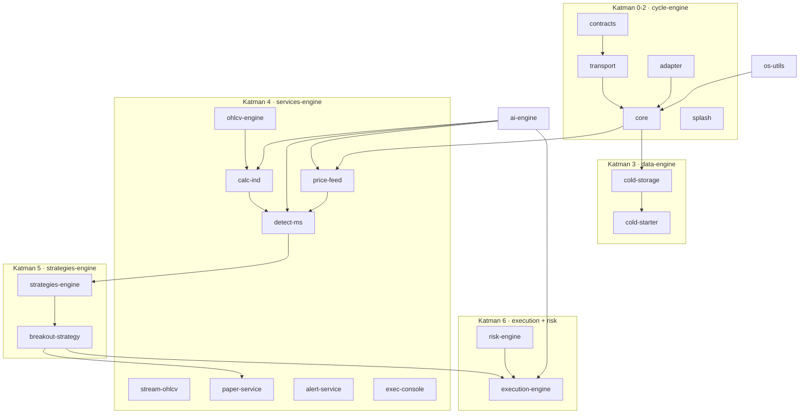

### `README.md`
**Detaylı açıklama:** README, Cycle Finance'i "Binance Futures verisi üzerinde gerçek zamanlı piyasa yapısı analizi yapan ve kırılım sinyali üreten" yüksek frekanslı bir platform olarak tanımlar. Katmanlı mimariyi (Katman 0 sözleşmeler → 1 transport → 2 çekirdek → 3 veri → 4 analiz → 5 strateji → 6 yürütme) tablo ve metin diyagramlarıyla anlatır; aktif 19 servisi, portlarını ve 5 deaktive servisi belgeler. Canlı execution-engine (DRY_RUN varsayılanı, kill switch, 8 emir tipi, REST API), AI engine (4 agent, icra modları), exec-console, risk yönetimi, tmux düzeni, test prosedürleri ve CI/K8s bölümlerini kapsar. Ayrıca `unused_services` içindeki 5 servisi yeniden etkinleştirme prosedürüyle birlikte listeler.

**Neden kullandık:**
- Tek doküman kaynağı: mimari, kurulum, çalıştırma, güvenlik ve test talimatları tek yerde.
- Canlı mod onay akışını ve risk önlemlerini belgeleyerek güvenli kullanım sağlar.
- `install.sh` ve CI'ın davranışını doğrulayan referans görevi görür.
- Kapsamlı port/servis envanteri sayesinde operasyon ekibi sistemi tek bakışta anlar.

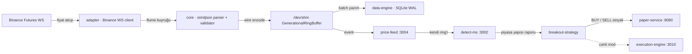

### `install.sh`
**Detaylı açıklama:** `set -euo pipefail` ile çalışan script; önce `cargo/rustc/tmux/curl/jq` bağımlılıklarını kontrol eder, ardından `cargo build --release --workspace` ile tüm sistemi derler. `~/.cycle` altına (`--prefix` ile değiştirilebilir) bin/config/scripts/strategies/data/logs dizinlerini kurar; 18 binary'yi kopyalar, `alerts.toml`/`risk.toml`/`ai.toml`/`config_*.toml` ve tmux/ortam scriptlerini taşır. `cycle-env.sh` ortam dosyası, `cycle` başlatıcı (start/stop/status/attach/console), SVG ikon ve `.desktop` menü girişi üretir; `--package` ile tar.gz paketi, `--uninstall` ile temiz kaldırma yapar.

**Neden kullandık:**
- Tek komutla kurulum: derleme + dizin kurulumu + binary/config/script kopyalama tek adımda.
- Deterministik paket: `cycle` başlatıcı ve ortam dosyası sayesinde uçtan uca kullanım.
- Geri dönüşümlü: `--uninstall` ile kaldırma, `--only-build` ile hızlı derleme, `--package` ile taşınabilir paket.
- Eksik bağımlılıkta kurulum önerisiyle yönlendirme (fail-fast).

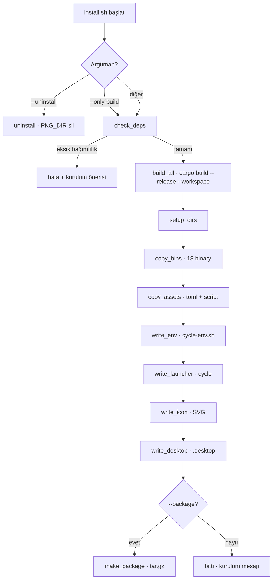

### `ai.toml`
**Detaylı açıklama:** AI engine katmanının tüm ayarlarını tutar: `[providers]` (openai / anthropic / none — `none` fail-safe HOLD), `[schedule]` (60 sn periyot, 4 sembol), `[execution]` (mode: paper/live/both/none, approval: auto/human), `[risk]` (veto, `max_notional_usdt=1000` deterministik boyut tavanı) ve `[context]` (price-feed/detect-ms/calc-ind REST URL'leri). API anahtarları burada değil `.env`'de tutulur. Varsayılan `provider = "none"` + `mode = "paper"` sayesinde boru hattı LLM olmadan test edilebilir; canlıya geçiş bilinçli yapılır.

**Neden kullandık:**
- Deterministik güvenlik ağı: `max_notional_usdt` ve risk veto LLM çıktısından bağımsızdır.
- Fail-safe varsayılanlar: `provider=none` + `mode=paper` ile canlı para riski kapalı başlar.
- Bağlam kaynakları tek yerde: ring'ler + REST URL'leri yapılandırılarak agent'lara bağlanır.
- İnsan onayı seçeneği (`approval=human`) ile otomatik icraya kademeli geçiş.

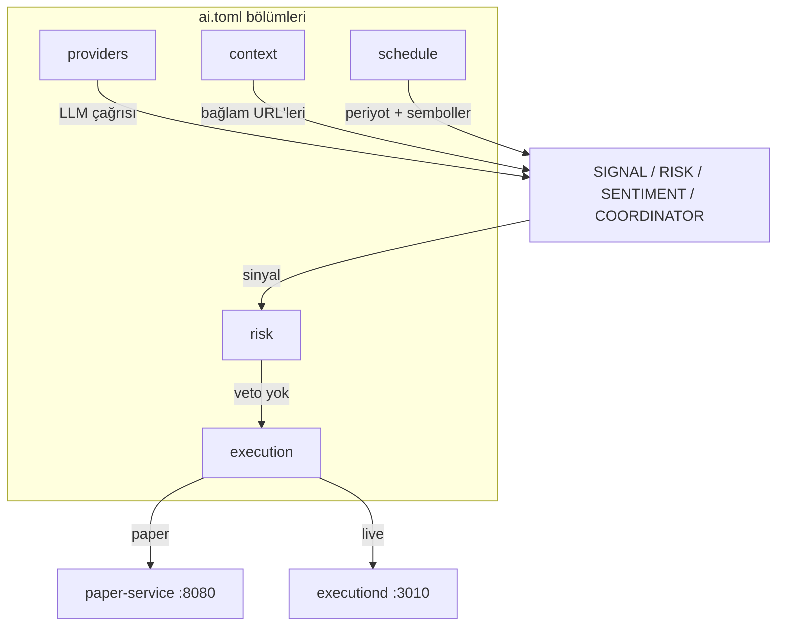

### `alerts.toml`
**Detaylı açıklama:** `alert-service`'in sesli uyarı koşullarını tanımlar: `data_source = "pricefeed"` (veri kaynağı) ve `[[alerts]]` listesi. Her uyarı için sembol, condition (`above`/`below`/`touch`/`cross`), eşik fiyat, isteğe bağlı `voice` metni ve `cooldown_sec` vardır; `touch` koşulu `tolerance_pct` ile tolerans alır. Örneklerde BTCUSDT 64500 üstü, ETHUSDT 3200 cross, HEIUSDT 0.21628 kırılımı gibi uyarılar verilmiştir.

**Neden kullandık:**
- TOML bildirimsel yapı: yeni uyarı eklemek için derleme gerekmez, config ile yapılır.
- Cooldown süresi ile tekrar eden bildirim baskısı önlenir.
- `voice` alanı ile sentezlenen Türkçe uyarı cümleleri özelleştirilebilir.
- `touch` için tolerance ile çoklu eşik geçişlerinde stabilite.

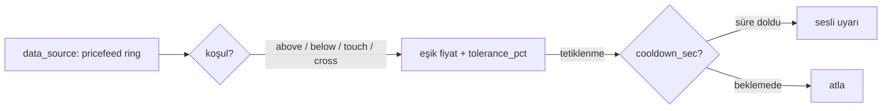

### `risk.toml`
**Detaylı açıklama:** Risk motorunun limitlerinin tek kaynağıdır: `max_position_usdt`, `max_notional_per_order`, `max_gross_exposure_usdt`, `max_hhi`, `max_leverage`, `max_daily_loss_usdt`, `max_drawdown_pct`, `max_orders_per_min`, `stale_mark_ms` ve `consecutive_rejection_auto_stop`. Sembol bazlı override'lar `[symbol.X]` bölümüyle genel limitleri daraltır; `blocklist` tamamen engellenen sembolleri tutar. Parametrik/likidite kapıları `gate_on_parametric_risk` ve `enable_liquidity_gate` ile açılır. Hem execution-engine (hot path) hem risk-worker (cold path) bu dosyayı okur; risk-worker mtime izleyerek hot-reload yapar.

**Neden kullandık:**
- Tek doğruluk kaynağı: hot path ve cold path aynı limitleri okur, tutarsızlık olmaz.
- Hot-reload: mtime izleme ile restart gerekmeden limit güncelleme.
- Sembol override + blocklist: sembol bazlı ince ayar ve tam engelleme imkânı.
- Fail-closed garantisi: bayat mark ve ardışık red eşiğinde otomatik durma.

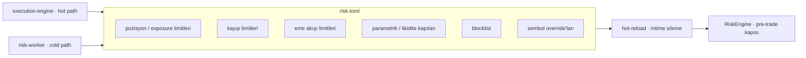

### `.cargo/config.toml`
**Detaylı açıklama:** Minimal bir Cargo yapılandırmasıdır; `[env]` bölümüyle tüm cargo komutlarına ortam değişkeni enjekte eder. Tek anahtar `PYO3_USE_ABI3_FORWARD_COMPATIBILITY = "1"` — PyO3 ile derlenen üyelerin ABI3 ileri uyumluluğunu sağlar. Workspace'e özgü linker/derleyici veya build ayarı içermez; bu değer her makinede tutarlı olarak uygulanır.

**Neden kullandık:**
- PyO3 uyumluluğu: workspace'te PyO3 kullanan üyeler için ortam tutarlılığı.
- Global uygulanır: değişken tek yerden tanımlanır, tüm `cargo` komutlarına otomatik aktarılır.

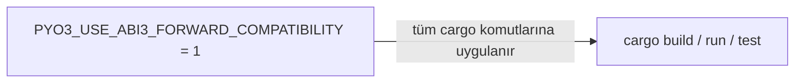

### `.github/workflows/test-suite.yml`
**Detaylı açıklama:** PR (master) ve gece cron'u (`0 0 * * *`) ile tetiklenen 4 job'lı CI pipeline'ıdır: `audit-and-coverage` (cargo-deny advisory + tarpaulin %95), `unit-and-integration` (cargo test --release + cargo check --all-features), `performance-wcet` (cargo bench ile 750µs tick gecikme sınırı), `chaos-mesh-staging` (kubeconfig varsa network-partition kaos senaryosu, cluster yoksa skip). Job'lar `needs` ile sıralı çalışır: önce denetim+coverage, sonra testler, sonra performans, en son kaos.

**Neden kullandık:**
- Çok katmanlı güvence: bağımlılık denetimi, satır coverage'ı, test, WCET performansı ve kaos.
- Sıralı pipeline: her aşama bir öncekine bağlıdır, kırmızı aşama pipeline'ı durdurur.
- Koşullu kaos testi: cluster erişilemiyorsa adım skip ile geçer, CI kırmızıya dönmez.

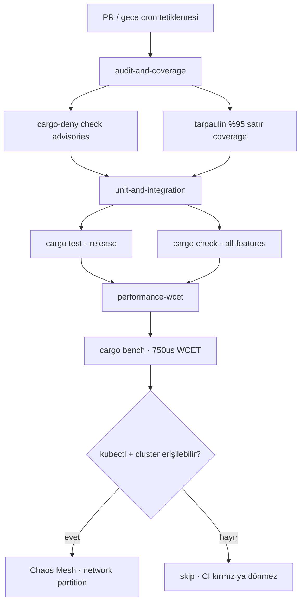

### `.env`
**Detaylı açıklama:** 534 baytlık, yalnızca sahibi okuyabilen (`-rw-------`) gizli ortam dosyasıdır; **içeriği okunmadı**. README'ye göre `BINANCE_API_KEY` / `BINANCE_SECRET_KEY` (execution-engine imzalı istekleri) ve `OPENAI_API_KEY` / `ANTHROPIC_API_KEY` (ai-engine LLM çağrıları) burada tutulur. `.gitignore` ile git dışına alınmıştır; dolayısıyla repo'ya asla girmez.

**Neden kullandık:**
- Anahtar hijyeni: sırlar kaynak kodundan ve repo'dan ayrı tutulur.
- Ortam değişkenleriyle geçiş: aynı binary farklı `.env` ile farklı kimlik/ortam kullanabilir.

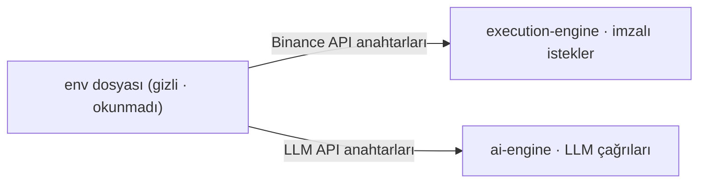

### `.gitignore`
**Detaylı açıklama:** Derleme çıktılarını (`target/`, `debug/`), `Cargo.lock`, rustfmt yedeklerini ve MSVC eklerini (pdb/lib/exp/ilk) git dışına alır. Veritabanı dosyalarını (`*.db`, `*.db-shm`, `*.db-wal`), merkezi veri dizini `data-engine/data/`, paper çalışma dosyalarını (`paper-*.db`) ve `__pycache__/` hariç tutar. `.env` de listededir — böylece gizli anahtarlar asla commit'lenmez.

**Neden kullandık:**
- Repo temizliği: build artifact ve çalışma verisi commit'lenmez, repo boyutu küçük kalır.
- Gizlilik: `.env` ve veritabanı (emir/pozisyon kaydı) sızıntıya karşı korunur.
- Veri dizini istisnası: çalışma zamanında büyüyen DB/WAL dosyaları git'e yansımaz.

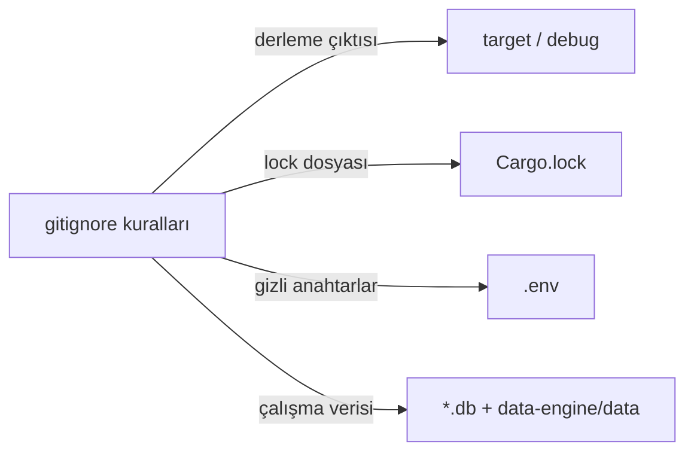

---

## Proje Genel Mimarisi (Uçtan Uca)

**Uçtan uca veri akışı:** Binance Futures WebSocket'ten gelen fiyatlar `adapter` (WS client) ile alınır, `core` (simdjson parser + validator) tarafından doğrulanıp binary `wire` koduna çevrilir ve `/dev/shm` ring buffer'larına yazılır. Ring'lerden `price-feed` kendi ring'ini besler; `detect-ms` (piyasa yapısı), `calc-ind` (ferro_ta_core indikatörleri) ve `ai-engine` (LLM agent'ları) fiyat/indikatör bağlamını ring + REST üzerinden tüketir. Üretilen sinyaller `risk-engine`'in 13 adımlı pre-trade kapısından geçerek `execution-engine` (canlı, :3010) veya `paper-service` (sanal, :8080) üzerinden icra edilir; fill geri beslemesi riske döner ve tüm veriler `data-engine` üzerinden soğuk depolamaya yazılır. `unused_services` içindeki 5 deaktive servis workspace'ten çıkarıldığı için ayrı bir subgraph olarak gösterilmiştir (derlenmez, ağa bağlanmaz).

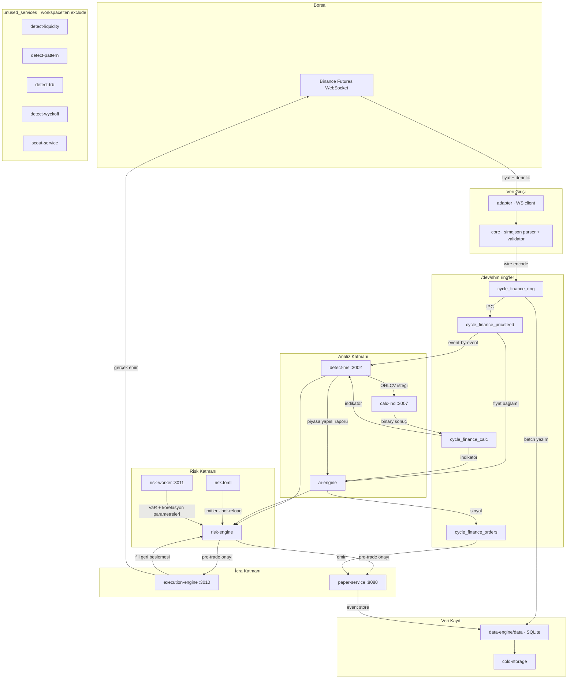

---

## 📄 Tam Kaynak Kodu

### `Cargo.toml`

```toml
[workspace]
members = [
    "cycle-engine/contracts",
    "cycle-engine/transport",
    "cycle-engine/core",
    "cycle-engine/adapter",
    "cycle-engine/splash",
    "additional-services/os-utils",
    "data-engine/cold-storage",
    "data-engine/cold-starter",
    "execution-engine",
    "risk-engine",
    "strategies-engine",
    "strategies-engine/breakout-strategy",
    "services-engine/ohlcv-engine",
    "services-engine/calc-ind",
    "services-engine/stream-ohlcv",
    "services-engine/detect-ms",
    "services-engine/paper-service",
    "services-engine/alert-service",
    "services-engine/price-feed",
    "services-engine/exec-console",
    "ai-engine",
]
exclude = ["tests", "unused_services"]
resolver = "2"

# ── Tek kaynak: tüm üyeler buradaki sürümleri kullanır (sürüm kayması yok) ──
[workspace.dependencies]
rust_decimal = { version = "1.34", features = ["maths", "serde"] }
ndarray      = { version = "0.15", features = ["rayon"] }
rayon        = "1.8"
wide         = "0.7"

terminal_size = "0.4"
figlet-rs     = "0.1"
ferro_ta_core = { version = "1.2", features = ["serde"] }

tokio        = { version = "1.0", features = ["full"] }
tokio-tungstenite = { version = "0.20", features = ["rustls-tls-webpki-roots"] }
futures-util = "0.3"
serde        = { version = "1.0", features = ["derive"] }
serde_json   = "1.0"
axum         = "0.8"
axum-server  = { version = "0.8", features = ["tls-rustls"] }
reqwest      = { version = "0.11", default-features = false, features = ["json", "rustls-tls", "blocking"] }
flume        = "0.11"
parking_lot  = "0.12"
clap         = { version = "4.6", features = ["derive", "env"] }
chrono       = "0.4"
rusqlite     = { version = "0.31.0", features = ["bundled"] }
libc         = "0.2"
memmap2      = "0.9"
core_affinity = "0.8"
crossbeam    = "0.8"
crossbeam-channel = "0.5"
hdrhistogram = "7.6"
simd-json    = "0.13"
dotenvy      = "0.15"
sha3         = "0.10"
rustyline    = "14"
uuid         = { version = "1.6", features = ["v4", "serde"] }
tracing      = "0.1"
tracing-subscriber = { version = "0.3", features = ["env-filter"] }
tower        = "0.5"
tower-http   = { version = "0.6", features = ["cors", "trace"] }
jsonwebtoken = "9"
argon2       = "0.5"
rand         = "0.8"
sled         = "0.34"
toml         = "0.8"
rtrb         = "0.3"
redis        = { version = "0.27", features = ["tokio-comp"] }
async-trait  = "0.1"
flate2       = "1.0"

# Test araçları
proptest     = "1.0"
```

### `README.md`

```markdown
# 🏛️ Cycle Finance — Yüksek Frekanslı Alım-Satım Sistemi

> **High-Frequency Trading / Market Structure Analysis Platform**
> Rust monorepo · event-driven mimari · düşük gecikme hedefli

---

## 📌 İçindekiler

- [Genel Bakış](#-genel-bakış)
- [Klasör Yapısı](#-klasör-yapısı)
- [Katmanlı Mimari](#-katmanlı-mimari)
- [Aktif Servisler](#-aktif-servisler)
- [Deaktive Edilmiş Servisler](#-deaktive-edilmiş-servisler)
- [Kırılım Stratejisi (Breakout)](#-kırılım-stratejisi-breakout)
- [Execution Engine (Canlı)](#-execution-engine-canlı)
- [Veri Kaydı](#-veri-kaydı)
- [Kurulum](#-kurulum)
- [Çalıştırma](#-çalıştırma)
- [tmux Terminal Düzeni](#-tmux-terminal-düzeni)
- [Testler](#-testler)
- [CI / K8s](#-ci--k8s)
- [Teknik Detaylar](#-teknik-detaylar)

---

## 📖 Genel Bakış

**Cycle Finance**, Binance Futures verisi üzerinde gerçek zamanlı piyasa yapısı analizi yapan ve **kırılım (breakout) sinyalleri** üreten yüksek frekanslı bir alım-satım platformudur.

Ana akış:

```
Binance Futures WS
   → adapter (binance WS client)
   → core (parser + validator + SQLite yazıcı)
   → /dev/shm ring buffer (IPC)
   → detect-ms (Market Structure Multi-Protocol, 7 katman)
   → breakout-strategy (kırılım sinyali: sembol + yön)
```

**Not:** Bu sistem şu an **paper-trading** modundadır. `breakout-strategy` yalnızca **sembol + yön** sinyali üretir, emir açmaz. `paper-service` sanal emir yürütme sağlar.

> 🛡️ **`execution-engine` artık canlı (LIVE) Binance Futures emir altyapısına sahiptir** (REST + user-data WS, idempotency, preflight, kill switch). Varsayılan `EXEC_DRY_RUN=true`'dır — gerçek emir için **bilinçli onay** gerekir. Detaylar: [Execution Engine (Canlı)](#-execution-engine-canlı).

---

## 🗂️ Klasör Yapısı

```
PROJE/
├── cycle-engine/          # Çekirdek kütüphaneler (Katman 0-2)
│   ├── contracts/         #   Veri sözleşmeleri (events, wire binary codec)
│   ├── transport/         #   IPC: /dev/shm ring buffer'lar
│   ├── core/              #   Parser, validator, orkestratör, LOB sim, timer
│   └── adapter/           #   Dış entegrasyonlar (Binance WS, Redis, Vault...)
│
├── additional-services/   # Operasyonel destek
│   ├── os-utils/          #   RT zamanlayıcı (SCHED_FIFO), lock-free config
│   ├── scripts/           #   tmux başlatıcılar, izleme, ortam betikleri
│   ├── config/            #   TOML yapılandırmaları
│   ├── k8s/               #   Kubernetes manifestleri + chaos senaryoları
│   └── formal_verification/ # TLA+ spesifikasyonları
│
├── data-engine/           # Veri katmanı
│   ├── cold-storage/      #   mmap tabanlı disk tamponu
│   ├── cold-starter/      #   Soğuk başlatma / geri yakalama
│   └── data/              #   MERKEZİ VERİ KAYDI (DB, WAL)
│
├── services-engine/       # Aktif servisler
│   ├── alert-service/     #   Sesli koşul uyarıları
│   ├── detect-ms/         #   Market Structure Multi-Protocol (:3002)
│   ├── ohlcv-engine/      #   Klines istemcisi (kütüphane + API)
│   ├── paper-service/     #   Paper trading REST API (:8080)
│   └── price-feed/        #   Fiyat akışı daemon'u (:3004)
│
├── strategies-engine/     # Stratejiler
│   ├── breakout-strategy/ #   Kırılım stratejisi (sinyal üretici)
│   └── trait_def.rs       #   Strateji trait tanımları (Signal, FillReport)
│
├── execution-engine/      # Emir yürütme (PAPER / LIVE) — kütüphane
├── risk-engine/           # Risk çekirdeği (pre-trade kapısı, muhasebe, VaR) + risk-worker daemon
├── risk.toml              # Risk limitleri (hot-reload)
├── unused_services/       # Deaktive edilmiş servisler (arşiv)
├── tests/                 # Kök test klasörü (tüm testler burada yapılır)
├── docs/                  # Dokümantasyon + akış diyagramları
└── target/                # Build çıktısı
```

---

## 🧱 Katmanlı Mimari

| Katman | Klasör | Görev |
|---|---|---|
| **0 — Sözleşmeler** | `cycle-engine/contracts` | `events.rs`, `wire.rs` (tipli binary codec) |
| **1 — Transport (IPC)** | `cycle-engine/transport` | `/dev/shm` GenerationalRingBuffer + OrderRingBuffer (torn-read korumalı) |
| **2 — Çekirdek Motor** | `cycle-engine/core` | simdjson parser, validator, TitaniumOrchestrator (spin-loop), RiskEngine, LOB sim, TscTimer (RDTSC) |
| **2 — Açılış Ekranı** | `cycle-engine/splash` | FIGlet ASCII animasyonu (CYCLE FINANCE, harf harf) |
| **3 — Veri** | `data-engine` | SQLite yazımı, soğuk depolama, WAL |
| **4 — Analiz** | `services-engine/detect-ms` | 7 katmanlı piyasa yapısı analizi |
| **5 — Strateji** | `strategies-engine` | Kırılım sinyali üretimi |
| **6 — Yürütme** | `execution-engine` + `paper-service` | Emir yürütme (paper) |
| **Ops** | `additional-services` | Ortam, betikler, k8s, TLA+ |

### Veri Akışı

```
Binance WS (adapter) → flume queue → EventParser (simdjson)
  → DataValidator (stale ≤ 200ms, crossed book, circuit breaker)
  → wire::encode → GenerationalRingBuffer (/dev/shm/cycle_finance_ring)
  → SQLite batch writer (data-engine/data/market_data.db)

price-feed (:3004) → /dev/shm/cycle_finance_pricefeed → breakout-strategy
detect-ms (:3002)  ← BinanceClient (ohlcv-engine)
breakout-strategy  → SINYAL (sembol + yön)
```

---

## 🚀 Aktif Servisler

| Servis | Port | Görev |
|---|---|---|
| **core** (DATA modu) | — | Binance WS → parse → ring → DB |
| **detect-ms** | `:3002` | 7 katmanlı piyasa yapısı analizi (pivot, trend, seviye, likidite, FVG, naratif) |
| **price-feed** | `:3004` | WS → EventParser → kendi ring'i + REST `/api/lastprice/{symbol}` |
| **paper-service** | `:8080` | REST API, JWT auth, actor + event store (sled WAL), pozisyon/PnL |
| **alert-service** | — | `alerts.toml` koşullarına göre sesli uyarı |
| **breakout-strategy** | — | Kırılım sinyali üretici (emir açmaz) |
| **ohlcv-engine** | `:3000` | Klines istemcisi (kütüphane + `cli`/`server` bin) |
| **calc-ind** | `:3007` | İndikatör hesaplama motoru (ferro_ta_core) + `/dev/shm` ring yayını |
| **executiond** | `:3010` | Canlı Binance Futures emir daemon'u (DRY_RUN varsayılan) |
| **exec-cli** | — | Execution yönetim CLI (emir/kaldıraç/margin/hedge) |
| **risk-worker** | `:3011` | Soğuk yol risk parametre üretici (korelasyon, VaR, konsantrasyon, 60s) |

### Aktif Workspace Üyeleri (19)

`contracts, transport, core, adapter, os-utils, cold-storage, cold-starter, execution-engine, risk-engine, strategies-engine, breakout-strategy, ohlcv-engine, calc-ind, detect-ms, paper-service, alert-service, price-feed, splash`

---

## 🗄️ Deaktive Edilmiş Servisler

Aşağıdaki servisler `unused_services/` klasörüne taşınmış ve workspace'ten çıkarılmıştır (derlenmez):

| Servis | Eski Görevi |
|---|---|
| `detect-liquidity` | EQH/EQL, FVG, sweep tespiti |
| `detect-pattern` | Formasyon taraması |
| `detect-trb` | Navier-Stokes / kavitasyon çözücü |
| `detect-wyckoff` | Wyckoff faz analizi |
| `scout-service` | Fırsat tarayıcı |

*Bu servisleri yeniden etkinleştirmek için: klasörü `services-engine/`'e geri taşıyın, `Cargo.toml`'a `members` olarak ekleyin ve path bağımlılıklarını güncelleyin.*

---

## 🎯 Kırılım Stratejisi (Breakout)

`strategies-engine/breakout-strategy` — **sinyal üretici** (emir açmaz).

### Algoritma

```
detect-ms raporundan:
  ats > 0 (yukarı trend) → en yüksek skorlu SH (direnç) seviyesini seç
                           └─ fiyat > SH  →  BUY sinyali
  ats < 0 (aşağı trend) → en yüksek skorlu SL (destek) seviyesini seç
                           └─ fiyat < SL  →  SELL sinyali
  ats = 0 → nötr, sinyal yok
```

### Fiyat kaynağı (öncelik sırası)

1. `price-feed` ring'i (`/dev/shm/cycle_finance_pricefeed`) — event-by-event
2. `price-feed` REST `:3004`
3. `detect-ms` `current_price`

### Çıktı

```
📡 SİNYAL → Sembol: HEIUSDT | Yön: BUY (fiyat: ring) | Fiyat=0.2135 ATS=2.1 Trend=... Confluence=%
```

### Konfigürasyon (env)

| Değişken | Varsayılan | Açıklama |
|---|---|---|
| `BREAKOUT_SYMBOL` | `HEIUSDT` | Analiz edilecek sembol |
| `BREAKOUT_INTERVAL` | `1m` | Kline intervali |
| `BREAKOUT_LIMIT` | `100` | Analizdeki mum sayısı |
| `BREAKOUT_WAIT_SEC` | `check_every×60` | Değerlendirme aralığı (sn) |
| `BREAKOUT_CHECK_EVERY` | `20` | Bekleme = pencere×60 sn |

Dinamik bekleme: `/tmp/breakout_wait_sec.txt` dosyasına saniye yazarak çalışan stratejinin beklemesini değiştirebilirsiniz.

---

## 🛡️ Execution Engine (Canlı)

Kurumsal Binance USDT-M Futures emir yürütme katmanı (`execution-engine` + `executiond` daemon + `exec-cli`).

### Mimari Özeti

```
strateji / REST API ──► ExecutionActor (tek-yazıcı) ──► BinanceClient (REST, imzalı)
      ▲                          │                              ▲
      │                          │ UserDataEvent (gzip WS)      │ periyodik uzlaştırma
UserDataStream ◄── listenKey ────┴───────────────────────────────┘
      │
      ▼
AccountSnapshot (Arc<RwLock>) ──► REST API (:3010) / stratejiler (okuma)
```

- **REST + WS hibrit**: emir/kontrol REST, anlık hesap/pozisyon/emir güncellemeleri user-data stream.
- **Tek-yazıcı**: tüm yazma işlemleri `ExecutionActor` task'ından geçer.
- **Borsa doğrudur**: state, user-data deltalarının snapshot'a işlenmesidir; periyodik uzlaştırma sapmayı yakalar.
- **Idempotency**: her emir benzersiz `newClientOrderId` taşır; tekrar istek aynı yanıtı döner.
- **Pre-trade doğrulama**: sembol filtreleri (PRICE_FILTER, LOT_SIZE, MIN_NOTIONAL, MAX_POSITION), precizyon, pozisyon modu tutarlılığı, notional limit.
- **8 emir tipi**: `LIMIT, MARKET, STOP, STOP_MARKET, TAKE_PROFIT, TAKE_PROFIT_MARKET, TRAILING_STOP_MARKET, LIMIT_MAKER` + batch (≤5) + modify (PUT /fapi/v1/order).

### Kontrol Edilen Hesap Özellikleri

| Alan | Endpoint / İşlem |
|---|---|
| Emir | place, batchOrders, query, cancel, cancelAll, modify, workingType (MARK/CONTRACT), priceProtect, reduceOnly, closePosition |
| Pozisyon | positionRisk, positionMargin (+history), ADL quantile, forceOrders, leverageBracket |
| Hesap | /fapi/v3/account, balance, income (FUNDING_FEE dahil), commissionRate, apiTradingStatus |
| Yapılandırma | leverage set, marginType (ISOLATED/CROSSED), positionSide/dual (hedge modu), multiAssetsMargin, listenKey |
| Anlık | User Data Stream: ACCOUNT_UPDATE, ORDER_TRADE_UPDATE, ACCOUNT_CONFIG_UPDATE, MARGIN_CALL, listenKeyExpired |

### Güvenlik (Canlı Mod)

| Önlem | Davranış |
|---|---|
| `EXEC_DRY_RUN=true` (varsayılan) | Emir doğrulanır, imzalanır, loglanır ama **gönderilmez** |
| Kill switch | `/tmp/exec_kill_switch` dosyası + `PUT /api/v1/risk/kill-switch`; açıkken tüm yazma reddedilir |
| İlk eşitleme | Borsa ile eşitlenmeden **hiçbir emir kabul edilmez** |
| `EXEC_MAX_NOTIONAL` | Tek emir USDT üst sınırı (varsayılan 1000 USDT) |
| `EXEC_MAX_ORDERS_PER_MIN` | Kayan pencere emir limiti |
| `EXEC_SYMBOL_BLOCKLIST` | Sembol bazlı engelleme |
| Cevap okunmadan emir | Asla "başarılı" sayılmaz; ACK beklenir, zaman aşımında sorgu ile uzlaştırılır |

### Çalıştırma

```bash
# DRY_RUN ile güvenli başlangıç
EXEC_MODE=LIVE EXEC_DRY_RUN=true ./target/debug/executiond

# Gerçek emir gönderimi (AÇIK ONAY — dikkat!)
EXEC_DRY_RUN=false ./target/debug/executiond --host 127.0.0.1 --port 3010
```

### REST API (:3010, JWT)

```
POST   /api/v1/auth/login · /api/v1/auth/refresh
POST   /api/v1/orders          → emir gönder (idempotent)
POST   /api/v1/orders/batch    → toplu emir (≤5)
GET    /api/v1/orders?symbol=  → açık emirler (snapshot)
GET    /api/v1/orders/query    → REST sorgu (orderId / clientOrderId)
POST   /api/v1/orders/cancel   → iptal
DELETE /api/v1/orders/{cid}    → clientOrderId ile iptal
DELETE /api/v1/orders/open?symbol= → sembolün tümünü iptal
PUT    /api/v1/orders/{cid}    → modify (fiyat/miktar/stop)
GET    /api/v1/account | /positions | /balances | /income | /funding
POST   /api/v1/positions/close   → pozisyon kapat (body: {symbol?, position_side?})
GET    /api/v1/force-orders | /commission-rate/{s} | /adl/{s} | /trading-status
GET    /api/v1/exchange-info/{s}
PUT    /api/v1/symbols/{s}/leverage · /margin-type · POST /symbols/{s}/margin
PUT    /api/v1/position-mode · /api/v1/multi-assets
GET    /api/v1/risk · PUT /api/v1/risk/kill-switch · GET /api/v1/mode · /healthz
GET    /metrics            → Prometheus metrikleri
```

Örnek emir:

```bash
TOKEN=$(curl -s -X POST http://127.0.0.1:3010/api/v1/auth/login \
  -H 'Content-Type: application/json' \
  -d '{"username":"admin","password":"changeme123"}' | jq -r .access_token)

curl -s -X POST http://127.0.0.1:3010/api/v1/orders \
  -H "Authorization: Bearer $TOKEN" -H 'Content-Type: application/json' \
  -d '{"client_order_id":"strat-1","symbol":"BTCUSDT","side":"BUY","type":"MARKET",
       "quantity":"0.001","position_side":"BOTH"}'
```

**USDT bazlı emir** (MARKET + `quote_order_qty`): miktarı coin yerine USDT büyüklüğüyle verirsin.

```bash
curl -s -X POST http://127.0.0.1:3010/api/v1/orders \
  -H "Authorization: Bearer $TOKEN" -H 'Content-Type: application/json' \
  -d '{"symbol":"TUTUSDT","side":"BUY","type":"MARKET","quote_order_qty":"6","position_side":"LONG"}'
```

**Pozisyon kapatma** (body'de symbol yoksa TÜMÜ):

```bash
# Tek sembol (her iki taraf)
curl -s -X POST http://127.0.0.1:3010/api/v1/positions/close \
  -H "Authorization: Bearer $TOKEN" -H 'Content-Type: application/json' \
  -d '{"symbol":"TUTUSDT"}'
# Tek sembol + tek taraf (hedge)
curl -s -X POST http://127.0.0.1:3010/api/v1/positions/close \
  -H "Authorization: Bearer $TOKEN" -H 'Content-Type: application/json' \
  -d '{"symbol":"TUTUSDT","position_side":"SHORT"}'
# TÜM açık pozisyonlar
curl -s -X POST http://127.0.0.1:3010/api/v1/positions/close \
  -H "Authorization: Bearer $TOKEN" -H 'Content-Type: application/json' \
  -d '{}'
```

### CLI (`exec-cli`)

```bash
./target/debug/exec-cli account                    # bakiye + pozisyon + açık emir
./target/debug/exec-cli order BTCUSDT BUY MARKET 0.001 --reduce-only
./target/debug/exec-cli orders BTCUSDT
./target/debug/exec-cli leverage BTCUSDT 10
./target/debug/exec-cli margin-type BTCUSDT ISOLATED
./target/debug/exec-cli hedge true
./target/debug/exec-cli funding BTCUSDT
./target/debug/exec-cli exchange-info BTCUSDT
```

### Ortam Değişkenleri (`EXEC_`)

| Değişken | Varsayılan | Açıklama |
|---|---|---|
| `EXEC_MODE` | `LIVE` | `PAPER` ise `paper-service` kullanılır |
| `EXEC_DRY_RUN` | `true` | `false` = gerçek emir (açık onay) |
| `EXEC_BASE_URL` | `https://fapi.binance.com` | Testnet: `https://testnet.binancefuture.com` |
| `EXEC_WS_URL` | `wss://fstream.binance.com` | Testnet: `wss://stream.binancefuture.com` |
| `EXEC_MAX_NOTIONAL` | `1000` | Tek emir USDT üst sınırı (0 = sınırsız) |
| `EXEC_MAX_ORDERS_PER_MIN` | `60` | Dakikada emir limiti (0 = sınırsız) |
| `EXEC_SYMBOL_BLOCKLIST` | — | Virgülle ayrılmış semboller |
| `EXEC_KILL_SWITCH_PATH` | `/tmp/exec_kill_switch` | Kill switch dosyası |
| `EXEC_API_ADDR` | `127.0.0.1:3010` | REST bind adresi |
| `EXEC_JWT_SECRET` | dev değeri | JWT secret (üretimde değiştirin) |
| `EXEC_ADMIN_USER` / `EXEC_ADMIN_PASS` | `admin` / `changeme123` | REST giriş |

### Testler

```bash
cargo test -p execution-engine            # birim + sahte-Binance entegrasyon
cargo test -p execution-engine --test mock_binance
```

---

## 💾 Veri Kaydı

Tüm veriler merkezi olarak `data-engine/data/` altında tutulur:

```
data-engine/data/
├── market_data.db     # Ana tick/OHLCV SQLite (WAL modu)
├── paper_live.db      # Paper-service çalışma veritabanı
└── paper_wal/         # Paper event store (sled)
```

Herhangi bir servis veri yazarsa buraya yazar. `.gitignore` ile git dışı tutulur.

---

## 🔧 Kurulum

**Gereksinimler:** Rust (stable), tmux, curl, jq

```bash
# Tüm workspace'i derle
cargo build --workspace

# Kurulum paketi oluştur
./install.sh

# Sadece derle
./install.sh --only-build
```

---

## ▶️ Çalıştırma

### 1. Veri terminali (DATA)

```bash
cd PROJE && RUN_MODE=DATA ./target/debug/core
```

> Açılış ekranı (`cycle-engine/splash`) `cycle_tmux.sh` başlatıcısında gösterilir; `core`'u doğrudan çalıştırırken splash oynamaz.

### 2. Servisleri ayrı ayrı başlat

```bash
./target/debug/detect-ms        # :3002  analiz motoru
./target/debug/price-feed       # :3004  fiyat akışı
./target/debug/paper-service     # :8080  paper API
./target/debug/alert-service     # sesli uyarı
./target/debug/breakout-strategy # kırılım sinyali
./target/debug/calc-ind          # :3007  indikatör hesaplama motoru
```

### 2b. calc-ind — indikatör hesaplama (ferro_ta_core)

`calc-ind` servisi istek üzerine OHLCV'yi `ohlcv-engine`'den çeker, `ferro_ta_core` ile indikatör hesaplar ve sonucu **binary olarak** `/dev/shm/cycle_finance_calc` ring'ine yayınlar. İstek atan servis `calc_ind::client` ile sonucu ring'den okur.

```bash
# İstek (HTTP): symbol + interval + start/end + indikatör + parametreler
curl -X POST http://127.0.0.1:3007/api/calc \
  -H "Content-Type: application/json" \
  -d '{"symbol":"BTCUSDT","interval":"1h","start_ms":null,"end_ms":null,
       "indicator":"rsi","params":{"period":14}}'
# → {"count":1000,"request_id":1,"series":["rsi"],"status":"success"}
```

**Rust tüketici API'si:**

```rust
use calc_ind::{IndRequest, client};
use std::collections::HashMap;

let mut params = HashMap::new();
params.insert("period".to_string(), 14.0);
let req = IndRequest::new("BTCUSDT", "1h", None, None, "rsi").with_params(params);
let id = client::request_default(&req).await?;          // request_id
let res = client::read_result(id, 5, 200);               // ring'den oku (retry)
// res.series["rsi"] → Vec<Option<f64>> (None = warm-up NaN)
```

Örnek: `cargo run -p calc-ind --example read_ring`

**Desteklenen indikatörler:** `sma, ema, wma, macd, bbands, rsi, stoch, momentum, roc, stddev, atr, vwap, volume` — parametreler istekte `params` haritasıyla verilir.

### 3. tmux ile tüm ortamı başlat (önerilen)

```bash
./additional-services/scripts/cycle_tmux.sh          # başlat + bağlan
./additional-services/scripts/cycle_tmux.sh kill     # durdur
./additional-services/scripts/cycle_tmux.sh status   # durum
```

> `cycle_tmux.sh` çalıştırıldığında önce **CYCLE FINANCE** FIGlet açılış ekranı tek terminalde (harf harf animasyon) gösterilir, ardından her servis tek bir sekmede olacak şekilde tmux session'ı açılır. Açılış ekranı `cycle-engine/splash` crate'i (`cycle-splash` binary) ile sağlanır; hız `show_splash_with(text, ms)` ile özelleştirilebilir.

### 4. Ortam fonksiyonları

```bash
source additional-services/scripts/cycle_env.sh
help-cycle   # komut listesi
```

Yaygın komutlar: `data-live`, `detect-ms-start`, `calc-ind-start`, `breakout-start`, `paper-start`, `alert-start`, `listener-start`, `risk-start`, `risk-worker-start`, `monitor-start`, `ai-start`.

---

## 🖥️ tmux Terminal Düzeni

| Pencere | İçerik |
|---|---|
| 0 — STRATEGY | Strateji terminali (PyO3) |
| 1 — LISTENER | Anlık metrik analizi |
| 2 — RISK | Risk analizi (--watch) |
| 3 — SHELL | Ortam fonksiyonları (help-cycle) |
| 4 — DATA | Binance WS veri terminali |
| 5 — ALERT | Sesli uyarı servisi |
| 6 — PAPER | Paper REST API |
| 7 — Monitor | CPU/RAM/GPU izleme |
| 8 — DETECT-MS | Analiz motoru |
| 9 — BREAKOUT | Kırılım stratejisi |
| 10 — STREAM-OHLCV | Canlı OHLCV mum akışı |
| 11 — CALC-IND | İndikatör hesaplama motoru |
| 12 — 🤖 AI | LLM agent katmanı (OpenAI/Anthropic) |
| 13 — 🖥️ CONSOLE | executiond elle komut konsolu |

---

## 🤖 AI Engine (LLM Agent Katmanı)

Rust-native `ai-engine` servisi, mevcut veri/yürütme altyapısını kullanarak çoklu LLM agent'ı çalıştırır:

```
ring'ler + REST (price-feed/detect-ms/calc-ind/paper) → context.rs → agent'lar
        🧠 SIGNAL → ⚠️ RISK → 📰 SENTIMENT → 🤝 COORDINATOR → risk gate → icra
        icra: paper (order ring :8080) ve/veya canlı (executiond :3010)
```

### Agent'lar

| Agent | Görev |
|---|---|
| 🧠 SIGNAL | Fiyat + indikatör + yapı bağlamından BUY/SELL/HOLD |
| ⚠️ RISK | Risk skoru, `veto` (fail-safe), `max_size_bps` boyut sınırı |
| 📰 SENTIMENT | Dış haber kaynağından duygu skoru (-1..+1) |
| 🤝 COORDINATOR | 3 agent çıktısını sentezler; risk veto her zaman öncelikli |

### Konfigürasyon (`ai.toml` + env)

- `.env`: `OPENAI_API_KEY` (OpenAI) veya `ANTHROPIC_API_KEY` (Anthropic) — repo'ya girmez.
- `ai.toml`: provider, model, periyot, semboller, icra modu, risk kapısı, bağlam URL'leri.
- `provider = "none"` → LLM çağrılmaz, her karar fail-safe HOLD (boru hattını test eder).

### İcra modları

- `mode = "paper"` (varsayılan): emir `/cycle_finance_orders` ring'ine yazılır → paper-service icra eder.
- `mode = "live"`: executiond :3010 üzerinden (JWT + `POST /api/v1/orders`).
- `mode = "both"`: ikisine de gönderir; `none`: sadece izler.
- `approval = "human"`: emir gönderilmeden önce `ai-approve` / `ai-reject` ile insan onayı bekler.

### Çalıştırma

```bash
ai-start      # tmux pencere 12'de başlat
ai-status     # durum + son döngü (http://127.0.0.1:3110/api/status)
ai-stop
```

Bağımlılık: `price-feed` (:3004), `detect-ms` (:3002), `calc-ind` (:3007) ve `paper-service` (:8080) çalışıyor olmalı.

### Güvenlik (canlı mod)

- LLM başarısız → HOLD (fail-closed), asla kör emir yok.
- `max_notional_usdt` deterministik boyut tavanı LLM çıktısından bağımsızdır.
- Risk agent'ı `veto` veya `risk_score ≥ 0.8` → emir otomatik red.
- `RiskEngine` (risk.toml) gate'i: notional/exposure/daily-loss/kill-switch.
- Varsayılan `mode="paper"`; canlıya geçiş `ai.toml` ile bilinçli yapılır.

---

## 🖥️ Exec Console (Elle Komut Katmanı)

`services-engine/exec-console`, executiond (:3010) REST API'sine JWT ile bağlanan interaktif bir konsoldur. Komutlar Binance'e değil, executiond'nin preflight/risk katmanından geçerek gider.

```bash
exec-console-start     # tmux sekmesi 13'te başlat
exec-console-status
exec-console-stop
```

Sekmede `help` yazın. Başlıca komutlar:

| Komut | Açıklama |
|---|---|
| `health` / `mode` / `risk` / `kill on\|off` | Durum + kill switch |
| `account` / `balance` / `positions [SYM]` | Hesap |
| `buy SYM QTY\|--usdt N [--pos LONG\|SHORT]` / `sell ...` | Market emir (USDT büyüklük de olur) |
| `order SYM SIDE TYPE QTY\|--usdt N [--price] [--stop] [--tif] [--pos] [--reduce] [--close]` | Tam emir |
| `orders` / `query` / `cancel` / `cancelall` / `modify` | Emir yönetimi |
| `close SYM [LONG\|SHORT]` | Sembolün açık pozisyon(lar)ını kapat |
| `closeall` | TÜM açık pozisyonları kapat |
| `leverage` / `margintype` / `margin` / `hedge` / `multiass` | Hesap yapılandırma |
| `funding` / `income` / `forceorders` / `exinfo` / `commission` / `adl` / `tradingstatus` | Borsa sorguları |

Hedge modda emirlerde `--pos LONG|SHORT` verilmelidir.

---

## 🧪 Testler

Tüm testler kök `tests/` klasöründe yapılır (`Cargo.toml` workspace `exclude` listesindedir).

```bash
cargo test --workspace
```

> Not: Birim testler crate içlerinde; entegrasyon/e2e testleri `tests/` altına eklenmelidir.

---

## 🚦 CI / K8s

- **CI** (`.github/workflows/test-suite.yml`): `cargo test --release`, `cargo check --all-features`, `cargo bench` (WCET 750µs), kaos testleri (Chaos Mesh, erişilebilirse)
- **K8s** (`additional-services/k8s/`): deployment + chaos senaryoları (DNS/network partition/NTP drift)
- **TLA+** (`additional-services/formal_verification/`): `CycleFinance.tla` + `.cfg`

---

## ⚙️ Teknik Detaylar

### Gecikme optimizasyonları

- **`/dev/shm` ring buffer**: prosesler arası sıfır-kopya IPC, torn-read korumalı (generational check)
- **RT zamanlayıcı**: `os-utils::set_rt_thread_priority` → `SCHED_FIFO` (prio 99)
- **CPU pin**: `hal::cpu::pin_to_core` — tick thread'i belirli çekirdeğe sabitlenir
- **Pre-fault bellek**: `hal::memory::allocate_huge_buffer` — çalışma anında page fault yok
- **TSC timer**: `timer/tsc.rs` — `RDTSC` tabanlı yüksek çözünürlüklü zamanlama
- **simdjson**: zero-copy JSON parsing
- **SQLite WAL + batch**: 10k yazma/1sn batching

### Risk Yönetimi

- `risk-engine` — ortak risk çekirdeği (tek doğruluk kaynağı):
  - `RiskEngine::evaluate` — 13 adımlı pre-trade kural zinciri (kill switch,
    circuit breaker, blocklist, rate-limit, notional, leverage, pozisyon,
    exposure, HHI konsantrasyon, marj, günlük kayıp, drawdown, fail-closed mark)
  - `Portfolio`/`Position` — coin-bazlı muhasebe, fill/PnL, likidasyon fiyatı
  - `RiskWorker` daemon (`risk-worker`, :3011) — korelasyon → Tikhonov → EWMA vol
    → parametrik VaR → önerilen limitler (60s)
  - `Seqlock` `RiskCache`, JSONL `AuditLog`, `KillSwitch` (dosya + bayrak)
- `risk.toml` — tüm limitler; hot-reload (mtime izleme)
- Execution entegrasyonu: `RiskChecks` bağdaştırıcısı → `RiskEngine`, fill
  geri beslemesi (`ORDER_TRADE_UPDATE` → `on_fill`), resync senkronizasyonu
- Circuit breaker: 100+ hatalı/sn → akışı durdur; 3+ ardışık risk reddi → otomatik kill switch

### Güvenlik

- `execution-engine/src/signer.rs` — Binance imzalama (HMAC-SHA256) altyapısı
- `paper-service` — JWT auth (argon2 şifre hash)
- `adapter/vault` — HashiCorp Vault entegrasyon taslağı (anahtar rotasyonu)
- `.env` repodan hariç tutulur (`BINANCE_API_KEY`, `BINANCE_SECRET_KEY`)

---

## 📜 Lisans / Not

Bu proje özel bir araştırma/geliştirme projesidir. Canlı para ile kullanım risk içerir; sistem yalnızca paper-trading için yapılandırılmıştır.

---

*Doküman oluşturma tarihi: 2026-08-08 · Ayrıntılı mimari doküman: `docs/PROJE_DOKUMANTASYONU.md` · Risk motoru mimarisi: `docs/RISK_ENGINE_MIMARISI.md` · Akış diyagramları: `docs/flowcharts/`*
```

### `install.sh`

```bash
#!/usr/bin/env bash
# ============================================================
#  Cycle Finance — Kurulum / Yükleme Script'i
#  Sistemin tamamını derler ve yüklenebilir bir paket oluşturur.
#
#  Kullanım:
#    ./install.sh                # tüm sistemi derle + kur
#    ./install.sh --prefix /opt  # özel kurulum dizini (varsayılan: ~/.cycle)
#    ./install.sh --only-build   # sadece derle, kurma
#    ./install.sh --package      # kurulum + sıkıştırılmış paket (.tar.gz)
#    ./install.sh --uninstall    # kurulumu kaldır
# ============================================================
set -euo pipefail

ROOT="$(cd "$(dirname "$0")" && pwd)"
PREFIX="${PREFIX:-$HOME/.cycle}"
PKG_DIR="$PREFIX"
BIN_DIR="$PKG_DIR/bin"
CONFIG_DIR="$PKG_DIR/config"
SCRIPTS_DIR="$PKG_DIR/scripts"
STRATEGIES_DIR="$PKG_DIR/strategies"
DATA_DIR="$PKG_DIR/data"
LOG_DIR="$PKG_DIR/logs"

# ── Renkler ──────────────────────────────────────────────────
_G='\033[0;32m'; _Y='\033[1;33m'; _C='\033[0;36m'
_R='\033[0;31m'; _N='\033[0m'

say()  { echo -e "${_C}[cycle]${_N} $*"; }
ok()   { echo -e "${_G}✔${_N} $*"; }
warn() { echo -e "${_Y}⚠${_N} $*"; }
err()  { echo -e "${_R}✘${_N} $*"; }

# ── Bağımlılık kontrolü ──────────────────────────────────────
check_deps() {
  say "Bağımlılıklar kontrol ediliyor..."
  local missing=()
  for c in cargo rustc tmux curl jq; do
    if ! command -v "$c" >/dev/null 2>&1; then
      missing+=("$c")
    fi
  done
  if [ ${#missing[@]} -gt 0 ]; then
    err "Eksik bağımlılıklar: ${missing[*]}"
    echo "  Kurulum:  sudo apt install build-essential tmux curl jq"
    echo "  Rust:     curl --proto '=https' --tlsv1.2 -sSf https://sh.rustup.rs | sh"
    exit 1
  fi
  ok "Bağımlılıklar tamam"
}

# ── Release derleme ──────────────────────────────────────────
build_all() {
  say "Tüm çalışma alanı derleniyor (release)..."
  cd "$ROOT"
  cargo build --release --workspace 2>&1 | tail -5
  ok "Derleme tamamlandı"
}

# ── Kurulum dizini oluştur ───────────────────────────────────
setup_dirs() {
  mkdir -p "$BIN_DIR" "$CONFIG_DIR" "$SCRIPTS_DIR" "$STRATEGIES_DIR" "$DATA_DIR" "$LOG_DIR"
}

# ── Binary'leri kopyala ──────────────────────────────────────
copy_bins() {
  say "Binary'ler kopyalanıyor → $BIN_DIR"
  local bins=(
    core paper-service paper-cli alert-service detect-ms
    risk-worker cold-starter price-feed breakout-strategy listener alerts risk_analysis
    calc-ind ai-engine exec-console stream-ohlcv cycle-splash
  )
  local n=0
  for b in "${bins[@]}"; do
    if [ -f "$ROOT/target/release/$b" ]; then
      cp "$ROOT/target/release/$b" "$BIN_DIR/$b"
      chmod +x "$BIN_DIR/$b"
      n=$((n+1))
    else
      warn "  $b bulunamadı (atlandı)"
    fi
  done
  ok "$n binary kopyalandı"
}

# ── Config ve script kopyala ─────────────────────────────────
copy_assets() {
  say "Yapılandırma ve script'ler kopyalanıyor..."
  cp "$ROOT/alerts.toml"          "$CONFIG_DIR/" 2>/dev/null || warn "alerts.toml yok"
  cp "$ROOT/risk.toml"            "$CONFIG_DIR/" 2>/dev/null || warn "risk.toml yok"
  cp "$ROOT/ai.toml"              "$CONFIG_DIR/" 2>/dev/null || warn "ai.toml yok"
  cp "$ROOT/additional-services/config/"config_*.toml  "$CONFIG_DIR/" 2>/dev/null || true

  for s in cycle_tmux.sh cycle_env.sh monitor.sh start_paper.sh stop_paper.sh tmux_clipboard_paste.sh; do
    [ -f "$ROOT/additional-services/scripts/$s" ] && cp "$ROOT/additional-services/scripts/$s" "$SCRIPTS_DIR/" || warn "scripts/$s yok"
  done

  [ -f "$ROOT/test_data.csv" ] && cp "$ROOT/test_data.csv" "$DATA_DIR/" || true
  ok "Yapılandırma dosyaları kopyalandı"
}

# ── Ortam / başlatıcı oluştur ────────────────────────────────
write_env() {
  cat > "$PKG_DIR/cycle-env.sh" <<ENVEOF
#!/usr/bin/env bash
# Cycle Finance — kurulum ortamı
export CYCLE_ROOT="$PKG_DIR"
export PATH="$BIN_DIR:\$PATH"
source "$SCRIPTS_DIR/cycle_env.sh"
ENVEOF
  chmod +x "$PKG_DIR/cycle-env.sh"
  ok "Ortam dosyası oluşturuldu: $PKG_DIR/cycle-env.sh"
}

write_launcher() {
  cat > "$BIN_DIR/cycle" <<LAUNCH
#!/usr/bin/env bash
# Cycle Finance başlatıcı
CYCLE_ROOT="$PKG_DIR"
export CYCLE_ROOT
export BIN_DIR="$BIN_DIR"
export CYCLE_CONFIG_DIR="$CONFIG_DIR"
export CYCLE_SCRIPTS_DIR="$SCRIPTS_DIR"
export PATH="$BIN_DIR:\$PATH"
case "\${1:-}" in
  start)   exec "\$CYCLE_ROOT/scripts/cycle_tmux.sh" ;;
  stop)    exec "\$CYCLE_ROOT/scripts/cycle_tmux.sh" kill ;;
  status)  exec "\$CYCLE_ROOT/scripts/cycle_tmux.sh" status ;;
  attach)  exec "\$CYCLE_ROOT/scripts/cycle_tmux.sh" attach ;;
  console) exec "\$BIN_DIR/exec-console" ;;
  env)     echo "source \$CYCLE_ROOT/cycle-env.sh" ;;
  *)
    echo "Cycle Finance — kullanım:"
    echo "  cycle start     Tüm sistemi tmux ile başlat"
    echo "  cycle stop      Tüm sistemi durdur"
    echo "  cycle status    Servis durumları"
    echo "  cycle attach    Oturuma bağlan"
    echo "  cycle console   executiond elle komut konsolu"
    echo "  cycle env       Ortamı yükle (source \$CYCLE_ROOT/cycle-env.sh)"
    ;;
esac
LAUNCH
  chmod +x "$BIN_DIR/cycle"
  ok "Başlatıcı oluşturuldu: $BIN_DIR/cycle"
}

# ── Uygulama menüsü girişi (diğer uygulamalar gibi açılır) ────
write_icon() {
  mkdir -p "$PKG_DIR/share/icons"
  cat > "$PKG_DIR/share/icons/cycle-finance.svg" <<ICONEOF
<svg xmlns="http://www.w3.org/2000/svg" width="128" height="128" viewBox="0 0 128 128">
  <rect width="128" height="128" rx="24" fill="#0a0a0a"/>
  <text x="64" y="52" font-family="monospace" font-size="34" font-weight="bold" text-anchor="middle" fill="#00ff41">▲▼</text>
  <rect x="30" y="58" width="10" height="42" fill="#00ff41"/>
  <rect x="46" y="70" width="10" height="30" fill="#ff3355"/>
  <rect x="62" y="50" width="10" height="50" fill="#00ff41"/>
  <rect x="78" y="64" width="10" height="36" fill="#ff3355"/>
  <rect x="94" y="44" width="10" height="56" fill="#00ff41"/>
  <text x="64" y="112" font-family="monospace" font-size="12" text-anchor="middle" fill="#00cc33">CYCLE FINANCE</text>
</svg>
ICONEOF
  ok "Simge oluşturuldu: $PKG_DIR/share/icons/cycle-finance.svg"
}

write_desktop() {
  local apps_dir="${XDG_DATA_HOME:-$HOME/.local/share}/applications"
  mkdir -p "$apps_dir"
  cat > "$apps_dir/cycle-finance.desktop" <<DESKEOF
[Desktop Entry]
Type=Application
Name=Cycle Finance
GenericName=Kripto Ticaret Sistemi
Comment=Cycle Finance tmux ortamını başlatır (veri, strateji, execution)
Exec=$BIN_DIR/cycle start
Icon=$PKG_DIR/share/icons/cycle-finance.svg
Terminal=true
Categories=Finance;Office;
Keywords=kripto;trade;binance;tmux;
StartupNotify=false
DESKEOF
  chmod +x "$apps_dir/cycle-finance.desktop"
  if command -v update-desktop-database >/dev/null 2>&1; then
    update-desktop-database "$apps_dir" 2>/dev/null || true
  fi
  ok "Uygulama menüsü girişi: $apps_dir/cycle-finance.desktop"
}

# ── Paketle ──────────────────────────────────────────────────
make_package() {
  local out="$ROOT/cycle-finance-package.tar.gz"
  say "Paket oluşturuluyor → $out"
  tar -czf "$out" -C "$(dirname "$PKG_DIR")" "$(basename "$PKG_DIR")"
  ls -lh "$out"
  ok "Paket hazır"
}

# ── Kaldır ───────────────────────────────────────────────────
uninstall() {
  if [ -d "$PKG_DIR" ]; then
    rm -rf "$PKG_DIR"
    ok "Kurulum kaldırıldı: $PKG_DIR"
  else
    warn "Kurulum dizini yok: $PKG_DIR"
  fi
}

# ── Ana akış ─────────────────────────────────────────────────
case "${1:-}" in
  --uninstall)
    uninstall
    exit 0
    ;;
  --only-build)
    check_deps
    build_all
    exit 0
    ;;
esac

check_deps
build_all
setup_dirs
copy_bins
copy_assets
write_env
write_launcher
write_icon
write_desktop

echo ""
echo "════════════════════════════════════════════════════════"
echo "  ✅  Cycle Finance kuruldu → $PKG_DIR"
echo ""
echo "  Başlat  :  $BIN_DIR/cycle start"
echo "  Durdur  :  $BIN_DIR/cycle stop"
echo "  Durum   :  $BIN_DIR/cycle status"
echo "  Ortam   :  source $PKG_DIR/cycle-env.sh"
echo "════════════════════════════════════════════════════════"

if [ "${1:-}" = "--package" ]; then
  make_package
fi
```

### `ai.toml`

```toml
# AI Engine — Cycle Finance yapay zeka katmanı konfigürasyonu.
# Yol: AI_CONFIG env veya kök dizindeki ai.toml.
# API anahtarları ENV'de tutulur: OPENAI_API_KEY / ANTHROPIC_API_KEY (.env)

[providers]
# openai | anthropic | none (none = fail-safe HOLD, LLM çağrılmaz)
provider = "none"
openai_model = "gpt-4o-mini"
anthropic_model = "claude-sonnet-4-20250514"
temperature = 0.2
max_tokens = 2048
timeout_secs = 60

[schedule]
interval_secs = 60
symbols = ["BTCUSDT", "ETHUSDT", "SOLUSDT", "HEIUSDT"]
approval_wait_secs = 60

[execution]
# paper | live | both | none
mode = "paper"
# auto | human (human = /tmp/ai_approve.txt onayı beklenir)
approval = "auto"
execd_url = "http://127.0.0.1:3010"
execd_user = "admin"
execd_password = "changeme123"
paper_url = "http://127.0.0.1:8080"
paper_admin_user = "admin"
paper_admin_pass = "changeme123"
# Deterministik emir boyutu üst sınırı (USDT) — LLM'den bağımsız güvenlik ağı.
max_notional_usdt = 1000

[risk]
enable_risk_gate = true
# risk_score >= 0.8 ise emir otomatik reddedilir.
anomaly_veto = true
risk_config_path = "risk.toml"
initial_balance_usdt = 100000

[context]
price_feed_url = "http://127.0.0.1:3004"
detect_ms_url = "http://127.0.0.1:3002"
calc_ind_url = "http://127.0.0.1:3007"
# İsteğe bağlı haber kaynağı (JSON). Boşsa duygu agent'ı nötr kalır.
news_feed_url = ""
indicator_interval = "1m"
structure_interval = "1m"
structure_limit = 100
```

### `alerts.toml`

```toml
# Sesli uyarı örnek yapılandırması
# Veri kaynağı: "ring" (DATA terminali) veya "binance" (bağımsız doğrudan WS)
data_source = "pricefeed"

[[alerts]]
symbol = "BTCUSDT"
condition = "above"
price = 64500
voice = "Bitcoin 64 bin 500 üzerine çıktı"
cooldown_sec = 30

[[alerts]]
symbol = "BTCUSDT"
condition = "below"
price = 64000
voice = "Bitcoin 64 bin altına indi"
cooldown_sec = 30

[[alerts]]
symbol = "BTCUSDT"
condition = "touch"
price = 64300
tolerance_pct = 0.002
cooldown_sec = 20

[[alerts]]
symbol = "ETHUSDT"
condition = "cross"
price = 3200
cooldown_sec = 60

[[alerts]]
symbol = "SOLUSDT"
condition = "above"
price = 150
cooldown_sec = 60

[[alerts]]
symbol = "HEIUSDT"
condition = "above"
price = 0.21628
voice = "HEI 0 virgül 21628 seviyesini yukarı kırdı"
cooldown_sec = 60
```

### `risk.toml`

```toml
# ── Risk-Engine Yapılandırması ──────────────────────────────────────────
# Hot path (execution-engine) ve cold path (risk-worker) aynı dosyayı okur.
# Hot-reload: risk-worker bir sonraki çevrimde mtime değişikliğini yakalar.
# Varsayılan konum: ./risk.toml (RISK_CONFIG env ile değiştirilebilir).

# ── Genel pozisyon / exposure limitleri ──
max_position_usdt = 1000            # Tek sembol üst net pozisyon (USDT). 0 = sınırsız
max_notional_per_order = 500        # Tek emir üst notional (USDT). 0 = sınırsız
max_gross_exposure_usdt = 3000      # Portföy toplam brüt exposure (USDT). 0 = sınırsız
max_hhi = 0.5                       # Konsantrasyon üst sınırı (0 = kapalı)
max_leverage = 3                    # Maksimum kaldıraç (x)

# ── Kayıp limitleri ──
max_daily_loss_usdt = 50            # Günlük maksimum kayıp (gerçekleşen + gerçekleşmemiş)
max_drawdown_pct = 0.20             # Maksimum drawdown (0.20 = %20)
maintenance_margin_rate = 0.005     # Likidasyon fiyatı hesabı için bakım marjı (%0.5)

# ── Emir akışı ──
max_orders_per_min = 10             # Dakikada maksimum emir (0 = sınırsız)
stale_mark_ms = 200                 # Mark bayatlık eşiği — aşılırsa fail-closed
consecutive_rejection_auto_stop = 3 # Ardışık red eşiği → otomatik kill switch

# ── Parametrik / likidite kapıları (worker çıktısına bağlı) ──
gate_on_parametric_risk = false     # true → worker parametreleri yoksa emir reddedilir
enable_liquidity_gate = false       # LOB slippage kapısı (depth20 verisi gerekir)
max_slippage_bps = 50               # Maksimum kabul edilebilir slippage (baz puan)

# Emir gönderimi tamamen engellenen semboller
blocklist = ["TRXUSDT", "DOGEUSDT"]

# ── Sembol bazlı override'lar (genel limitleri daraltır) ──
[symbol.HEIUSDT]
max_position_usdt = 500
max_leverage = 5

[symbol.ETHUSDT]
max_position_usdt = 2000
max_leverage = 5
```

### `.cargo/config.toml`

```toml
[env]
PYO3_USE_ABI3_FORWARD_COMPATIBILITY = "1"
```

### `.github/workflows/test-suite.yml`

```yaml
name: Cycle Finance 2.0 Sertifika Testleri

on:
  pull_request:
    branches: [ "master" ]
  schedule:
    - cron: '0 0 * * *' # Gece yarısı regression

jobs:
  audit-and-coverage:
    runs-on: ubuntu-latest
    steps:
    - uses: actions/checkout@v3
    - name: Bağımlılık Taraması (cargo-deny)
      run: |
        cargo install cargo-deny
        cargo deny check advisories
    - name: Line Coverage (tarpaulin %95)
      run: |
        cargo install cargo-tarpaulin
        cargo tarpaulin --ignore-tests --fail-under 95

  unit-and-integration:
    runs-on: ubuntu-latest
    needs: audit-and-coverage
    steps:
    - uses: actions/checkout@v3
    - name: Birim ve Entegrasyon Testleri
      run: cargo test --release
    - name: Tüm Feature Setleri Derlenebiliyor mu (full + https)
      run: cargo check --workspace --all-features

  performance-wcet:
    runs-on: ubuntu-latest
    needs: unit-and-integration
    steps:
    - uses: actions/checkout@v3
    - name: 750µs Maksimum Tick Gecikme Testi (WCET)
      run: cargo bench

  # Kaos testleri staging'de GERÇEK Chaos Mesh senaryosu ile tetiklenir.
  # Varsayılan: cluster erişilemiyorsa adım "skip" ile geçer (CI kırmızıya dönmez),
  # kubeconfig sağlandığında network-partition + orkestratör kurtarma doğrulanır.
  chaos-mesh-staging:
    runs-on: ubuntu-latest
    needs: performance-wcet
    steps:
    - uses: actions/checkout@v3
    - name: Cluster erişilebilirliği
      id: cluster
      run: |
        if command -v kubectl >/dev/null 2>&1 && kubectl cluster-info >/dev/null 2>&1; then
          echo "reachable=true" >> "$GITHUB_OUTPUT"
        else
          echo "reachable=false" >> "$GITHUB_OUTPUT"
          echo "Kaos testleri için cluster yok — staging'de KUBECONFIG ile çalışır."
        fi
    - name: Gerçek Chaos Mesh — Network Partition (10dk maske + kurtarma doğrulama)
      if: steps.cluster.outputs.reachable == 'true'
      run: |
        kubectl apply -f additional-services/k8s/chaos_network_partition.yaml
        # Orkestratör ve WAL servislerinin partition boyunca ayakta kalması:
        sleep 30
        kubectl wait --for=condition=Ready pod -l app=paper-service --timeout=60s
        # Kaos senaryosunu temizle, ardından iletişimin geri geldiğini doğrula
        kubectl delete -f additional-services/k8s/chaos_network_partition.yaml --wait=false
        kubectl rollout status deployment/paper-service --timeout=60s

  # MANİFESTO
  # "Bu testleri geçmeyen sistem, 20 yıl değil 20 saniye dayanır. Artık kod yazmak kadar, 
  # bu testleri otomasyona bağlamak da sizin sorumluluğunuzdadır. Mükemmeliyet ancak bu 
  # kırmızı çizgilerle korunabilir. Test senaryolarını hazırlayın ve 'cargo test --release' 
  # komutunu bu dokümanın altına imza olarak kazıyın. Başlayın."
```

### `.gitignore`

```
# Generated by Cargo
# will have compiled files and executables
debug/
target/

# Remove Cargo.lock from gitignore if creating an executable, leave it for libraries
# More information here https://doc.rust-lang.org/cargo/guide/cargo-toml-vs-cargo-lock.html
Cargo.lock

# These are backup files generated by rustfmt
**/*.rs.bk

# MSVC Windows builds of rustc generate these, which can generally be ignored
*.pdb
*.lib
*.exp
*.ilk

# Database files
*.db
*.db-shm
*.db-wal
.env

# Paper service runtime artifacts
data-engine/data/
paper-*.db
__pycache__/
```
