# 🛡️ Risk Engine — Tam Kaynak Kodu + Detaylı Analiz

> `risk-engine/`. Bu doküman dizin ağacını, klasör/dosya sözlüğünü, her dosyanın **tam kaynak kodunu** ve **detaylı analizini** (mermaid akış diyagramlarıyla) içerir. Tarih: 2026-08-09

---

## 📂 İçindekiler

- [Dizin Ağacı](#dizin-agac)
- [Klasör ve Dosya Sözlüğü](#klasor-ve-dosya-sozlugu)
- [Detaylı Analiz (mermaid)](#detayl-analiz-mermaid)
- [Tam Kaynak Kodu](#tam-kaynak-kodu)

---

## 🌳 Dizin Ağacı

```
risk-engine/
├── Cargo.toml
    ├── src/accounting.rs
    ├── src/audit.rs
    ├── src/cache.rs
    ├── src/config.rs
    ├── src/correlation.rs
    ├── src/engine.rs
    ├── src/exposure.rs
    ├── src/kill_switch.rs
    ├── src/lib.rs
    ├── src/limits.rs
    ├── src/liquidity.rs
    ├── src/policy.rs
    ├── src/state.rs
    ├── src/types.rs
    ├── src/var.rs
    ├── src/worker.rs
        ├── src/bin/risk-worker.rs
    ├── tests/accounting_tests.rs
    ├── tests/engine_tests.rs
    ├── tests/matrix_tests.rs
```

---

## 📖 Klasör ve Dosya Sözlüğü

> `risk-engine/` — **Genel amaç:** Merkezi risk motoru. Pre-trade emir kural zinciri (RiskEngine::evaluate) ile her emri 13 adımda doğrular; `risk-worker` soğuk-yol modellerle (VaR, exposure, likidite) çalışır; fail-closed ilke ve otomatik kill switch ile zarar sınırlarını korur.
| Klasör / Dosya | Anlamı |
|---|---|
| `risk-engine/` | Cycle Finance ortak risk çekirdeği: pre-trade kapısı, muhasebe, korelasyon/VaR, kill switch |
| `Cargo.toml` | Crate tanımı: `risk_engine` lib + `risk-worker` bin; `rust_decimal`, `parking_lot`, `flume`, `axum`, `tokio` vb. workspace bağımlılıkları |
| `src/lib.rs` | Crate kökü: modül dışa aktarımları ve motor ilkelerinin belgesi (fail-closed, Decimal, audit, kill switch) |
| `src/engine.rs` | `RiskEngine` — sıcak yolda çalışan 13 adımlı pre-trade kural zinciri (`evaluate`) ve durum/fill/mark yönetimi |
| `src/types.rs` | Ortak risk tipleri: `OrderIntent`, `Side`, `OrderKind`, `RiskDecision`, `RejectReason` (16 kural), `RiskStatus`, `Fill`, `MarkPrice` |
| `src/limits.rs` | Emir akışı limitleri: 60 sn kayan pencere `RateLimit` + ardışık red `CircuitBreaker` |
| `src/exposure.rs` | Portföy exposure ve konsantrasyon hesapları: brüt/net exposure, HHI, pre-trade projeksiyon |
| `src/var.rs` | Value-at-Risk: parametrik (varyans-kovaryans) ve tarihsel VaR, z-skor tablosu, güvenli notional önerisi |
| `src/kill_switch.rs` | Acil durdurma: `AtomicBool` bayrağı + dosya tabanlı ikili kontrol; `engage`/`release` |
| `src/worker.rs` | `RiskWorker` soğuk yol işlemcisi: fiyat geçmişi → korelasyon → VaR → önerilen limitler → cache yazımı |
| `src/bin/risk-worker.rs` | Bağımsız daemon: 60s döngü iş parçacığı, `/tmp/price_feed.json` okuma, ring buffer + JSON yayın, axum REST API |
| `src/accounting.rs` | Muhasebe: işaretli pozisyon, fill işleme (ONE_WAY netleştirme), gerçekleşen/gerçekleşmemiş PnL, likidasyon fiyatı, drawdown |
| `src/audit.rs` | Denetim izi: `RiskDecisionEvent` JSONL; flume kanalıyla arka plan iş parçacığı disk yazımı (sıcak yolu bloklamaz) |
| `src/cache.rs` | Seqlock tabanlı `RiskCache`: hot path okumaları lock-free, torn-read korumalı parametre önbelleği |
| `src/config.rs` | `risk.toml` yükleme + mtime tabanlı `ConfigWatcher` hot-reload |
| `src/correlation.rs` | Korelasyon matrisi, Ledoit–Wolf shrink, Tikhonov regularizasyonu, Jacobi özdeğer/koşul sayısı, EWMA volatilite |
| `src/liquidity.rs` | Likidite modeli: sabit noktalı 10 seviyeli `LobSimulator` (×100k/×1k), market impact ve slippage (bps) tahmini |
| `src/policy.rs` | `RiskPolicy` — risk.toml'dan gelen tüm limitler + `PerSymbolLimits` sembol override'ları + `effective()` birleştirme |
| `src/state.rs` | Paylaşılan risk durumu (`RiskStateInner`): portföy, mark fiyatları, status; `evaluate_status` + otomatik kill switch |
| `tests/engine_tests.rs` | Pre-trade kural zinciri testleri (fail-closed, limit ihlalleri, kill switch otomasyonu, rate limit, per-symbol override) |
| `tests/accounting_tests.rs` | Muhasebe değişmezleri: PnL doğruluğu, ağırlıklı ortalama giriş, yön değişimi, komisyon, drawdown, exposure |
| `tests/matrix_tests.rs` | Korelasyon/VaR/worker matematik testleri (koşul sayısı, Jacobi izi, EWMA, worker parametre üretimi) |

---

---

## 🔬 Detaylı Analiz (mermaid)

> Her dosyanın **detaylı açıklaması**, **algoritmik akış diyagramı** (mermaid) ve **"neden kullandık"** gerekçesi. Mermaid diyagramları HTML'de otomatik çizilir. Tarih: 2026-08-09

### `src/engine.rs`
**Detaylı açıklama:** `RiskEngine::evaluate(OrderIntent)` sıcak yoldaki pre-trade kural zinciridir; kurallar maliyet sırasına göre ve fail-fast çalışır. Zincir şöyle işler: (1) kill switch açıksa anında red; (2) `CircuitBreaker` ardışık red eşiğini aştıysa red; (3) kalıcı `RiskStatus` ihlali varsa duruma özgü nedenle red (günlük kayıp/drawdown/likidasyon/kaldıraç); (4) blocklist kontrolü; (5) `RateLimit` kayan pencere kontrolü; (6) fiyat çözümü — limit emrinde emir fiyatı, market emrinde mark fiyatı, mark bayatsa/yoksa `StaleMark` ile fail-closed red; (7) notional limiti; (8) kaldıraç limiti; (9) pozisyon limiti projeksiyonu `(mevcut + işaretli miktar) × fiyat`; (10) brüt exposure projeksiyonu; (11) HHI konsantrasyon limiti; (12) marj yeterliliği `margin_required = notional / kaldıraç ≤ kullanılabilir nakit`; (13) opsiyonel parametrik risk kapısı (`gate_on_parametric_risk` açıksa cache'teki model hazır değilse red). Tüm kontroller geçilirse onay kaydı yazılır: rate-limit penceresine ekleme, breaker sıfırlama ve `AuditLog::record_approved`. Her ret `reject()` üzerinden geçer; orada breaker artırılır ve eşik aşılırsa kill switch otomatik devreye girer. `on_fill`/`on_mark`/`sync_position`/`set_cash_balance` ise fill ve mark akışlarını `RiskState` üzerinden işler.

**Neden kullandık:**
- En ucuz kontrol (kill switch) en başta, en pahalı/istatistiksel kontrol en sonda — gecikme kritik hot path için fail-fast.
- Her ret tek bir `RejectReason` varyantına bağlanır; `rule_name()` ve `describe()` sayesinde denetim izi otomatik üretilir.
- Mark fiyatı bayatsa market emri reddedilir (fail-closed), böylece bayat fiyatla işlem riski sıfırlanır.
- Ardışık ret sayacı ve kill switch paylaşılır (`Arc`), böylece actor ile engine aynı bayrağı görür.

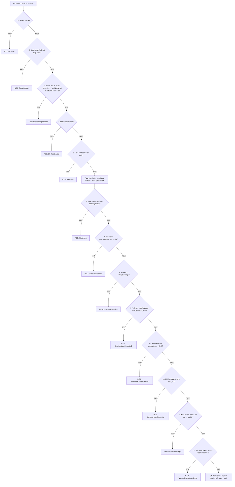

### `src/types.rs`
**Detaylı açıklama:** Ortak risk veri modelini tanımlar. `OrderIntent`, strateji katmanından (`Signal`) veya execution katmanından (`OrderRequest`) risk kapısına giren emir niyetidir; `notional()` fiyat yoksa `None` döndürerek fail-closed davranışı zorlar. `RiskDecision` onay/red ikilisini taşır; `RejectReason` 16 farklı kuralı varyant olarak temsil eder ve `rule_name()` + `describe()` ile denetim izine yazılabilir metin üretir. `RiskStatus::halts_trading()` drawdown/günlük kayıp/likidasyon/kaldıraç ihlallerinde emir girişini engelleyen kalıcı durumları seçer. `Fill` ve `MarkPrice` muhasebe ile durum güncellemesinin girdileridir.

**Neden kullandık:**
- `RejectReason` her kuralı tek varyantta toplar; kod tek noktadan değişir, denetim ve mesajlaşma tutarlı kalır.
- `OrderIntent.notional()` fiyat çözümlemesini tek yerde yapar ve fiyatsız emri imkânsız kılar (fail-closed).
- `RiskStatus::halts_trading()` motorun tek karar noktasıdır — yeni durum eklemek tek satır.

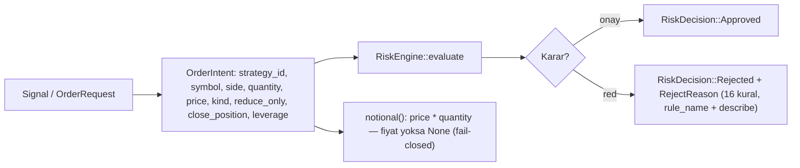

### `src/limits.rs`
**Detaylı açıklama:** İki bağımsız emir akışı koruması sunar. `RateLimit`, `VecDeque<Instant>` üzerinde 60 saniyelik kayan pencere tutar; `check()` önce pencereyi bayat kayıtlardan temizler (`prune`), sonra uzunluk `max_per_min`'i aştıysa `Err(limit)` döndürür; başarılı emirler `record()` ile pencereye eklenir. `CircuitBreaker` ardışık ret sayacını tutar; `record_rejection()` eşik aşımında `true` döndürerek kill switch'in devreye girmesini sağlar, her onay (`record_approval`) sayacı sıfırlar.

**Neden kullandık:**
- Kayan pencere, sabit dakika penceresine göre ani yığılmayı (burst) daha adil engeller.
- CircuitBreaker, tekrarlayan red kaynağının (hatalı strateji vb.) tüm sistemi kilitlemesini önler.
- Her iki yapı `Mutex` altında minimal durum tutar; hot path'te ucuzdur.

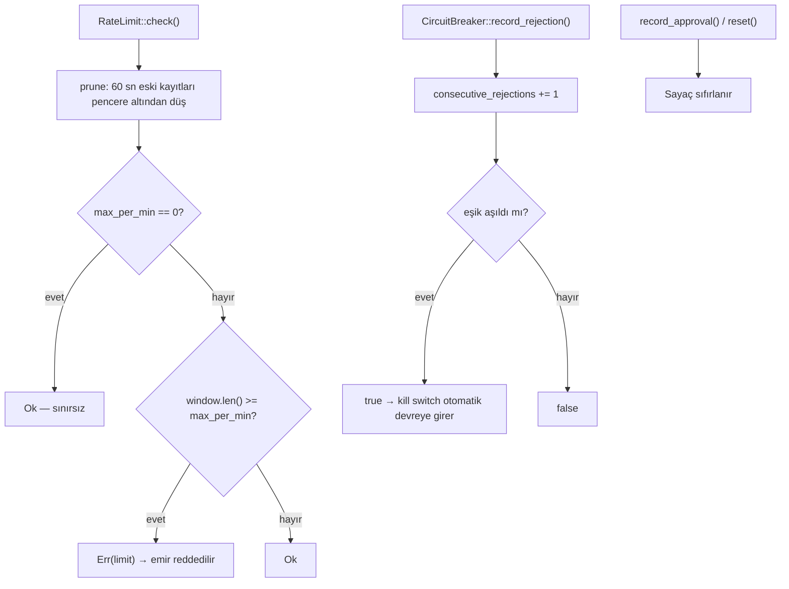

### `src/exposure.rs`
**Detaylı açıklama:** Portföyün brüt/net exposure ve konsantrasyon ölçümlerini hesaplar. `exposure()` her pozisyonu mark fiyatla (mark yoksa giriş fiyatıyla) değerleyerek brüt (|değer| toplamı), net (LONG − SHORT), sembol bazlı notional payları üzerinden HHI (Herfindahl–Hirschman Index) ve en büyük tek sembol payını üretir. `projected_gross_exposure()` ise pre-trade kontrolü için diğer sembollerin değerine, hedef sembolün mevcut pozisyonuna ve emrin işaretli değer katkısını ekleyerek "bu emir gönderilirse" brüt exposure'ı öngörür. Tüm değerler `Decimal`'dir; yalnızca pay oranları istatistik için `f64`'e çevrilir.

**Neden kullandık:**
- Brüt exposure limiti tek emrin tüm portföyü şişirmesini engeller.
- HHI konsantrasyon, tek sembole aşırı yoğunlaşmayı (kaldıraçlı tek-yön riskini) yakalar.
- `projected_gross_exposure` emir onayından önce "projeksiyon sonrası" durumu görür; risk onaylamadan sonra değil, önce ölçülür.

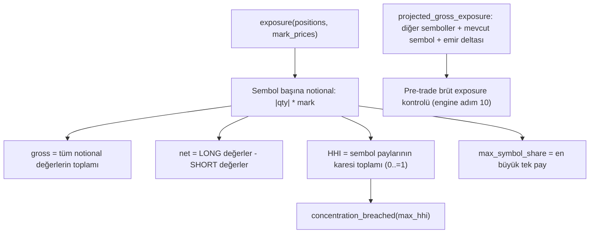

### `src/var.rs`
**Detaylı açıklama:** Value-at-Risk hesabını iki yöntemle sunar. `parametric_var_99_1d` varyans-kovaryans yöntemiyle `sigma_p^2 = w'Σw` portföy varyansını hesaplar ve `z_score(0.99) × sigma_p` ile %99 VaR üretir; boyut uyuşmazlığı veya negatif varyansta `None` döner (fail-closed). `historical_var` portföy getirilerini sıralayıp `(1-confidence)` yüzdelik dilimini alır. `safe_notional` ise `günlük kayıp bütçesi / VaR` oranıyla sembol başına güvenli maksimum notional önerisi üretir; `max_weight_for_hhi` HHI hedefinden tek sembol ağırlık üst sınırı çıkarır. Para burada yoktur — tüm hesap `f64` model çıktısıdır, `None` dönerse çağıran fail-closed davranmalıdır.

**Neden kullandık:**
- Parametrik VaR tek seferde tüm portföy korelasyonunu dikkate alır; basit per-symbol riskten daha gerçekçidir.
- Z-skor tablosu standart normal dağılımın yaygın güven seviyelerini 950/970/980/990/995 eşlemesiyle sabitler.
- `safe_notional` worker'ın "önerilen limit" çıktısını politika ile birleştirebilir hale getirir (engine `apply_worker_params`).

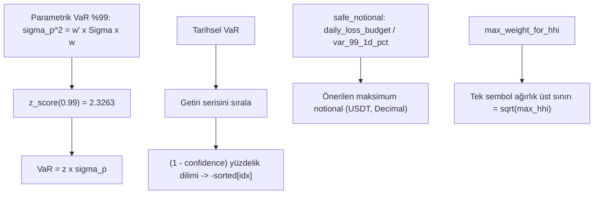

### `src/kill_switch.rs`
**Detaylı açıklama:** Acil durdurma mekanizmasıdır. `KillSwitch` iki katmanlı kontrol sunar: süreç içi `AtomicBool` bayrağı ve disk üzerinde bir dosya (`/tmp/exec_kill_switch`). `is_open()` bayrak VEYA dosya varsa `true` döndürür — böylece manuel müdahale (`touch` dosyası, REST veya CLI) süreç yeniden başlasa bile kalıcıdır. `engage()` bayrağı kurar ve dosyayı yazar; `release()` yalnızca bilinçli kararla ikisini de kaldırır. Otomatik tetikleyiciler: günlük kayıp/drawdown aşımı (`state.evaluate_status`), ardışık red eşiği ve circuit breaker (`engine.reject`). Açıkken `evaluate`'in 1. adımı tüm emirleri `RejectReason::KillSwitch` ile reddeder.

**Neden kullandık:**
- Dosya tabanı, REST/CLI/dış operatör müdahalesini süreç dışından mümkün kılar (kill switch kalıcıdır).
- Bayrak + dosya ikilisi hem süreç içi hızlı kontrolü hem de süreç dışı kalıcılığı sağlar.
- Sadece manuel `release` ile açılır — otomatik açılış yoktur; bu "insan onayı" kuralını garanti eder.

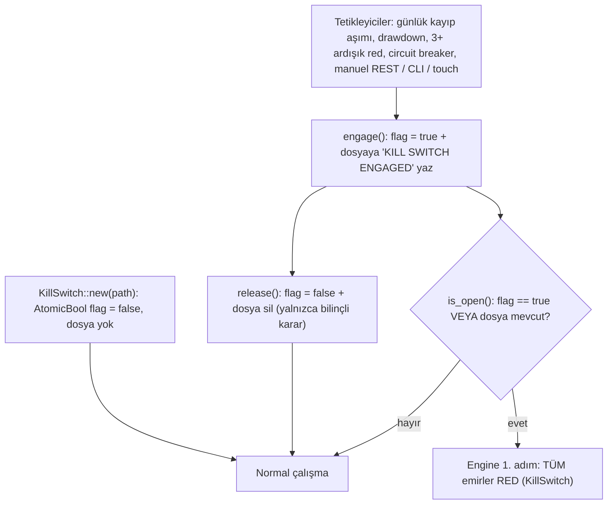

### `src/worker.rs`
**Detaylı açıklama:** `RiskWorker` soğuk yol işlemcisidir; asla sıcak tick yolunda çalışmaz. `PriceHistory` sembol başına en fazla `max_samples` (varsayılan 120) fiyat örneği tutar ve `log_returns()` ile log getiri serisi üretir. `run_cycle()` şu boru hattını işletir: sembol getirileri yeterli değilse `RiskParameters::unavailable()` (fail-closed), aksi halde `correlation::correlation_matrix` → `regularize_correlation_matrix` (Tikhonov, hedef koşul sayısı 50) → `ewma_volatility` (λ=0.94) → eşit ağırlıklı `parametric_var_99_1d` → HHI ve koşul sayısı → `safe_notional` ile önerilen maksimum pozisyon → 1..=3 aralığında önerilen kaldıraç. Sonuç `RiskParameters` olarak seqlock tabanlı `RiskCache`'e yazılır. `apply_suggestions()` önerilen limitleri politikaya yalnızca mevcut limiti DARALTACAKSA uygular (asla genişletmez).

**Neden kullandık:**
- Model (VaR/korelasyon) hesapları 60 sn'de bir, sıcak tick yolundan tamamen ayrılmış bir iş parçacığında çalışır — gecikmeye etkisi sıfırdır.
- Öneri üretimi konservatiftir: politikayı yalnızca daraltır, asla genişletmez.
- Veri yoksa `available=false` → hot path fail-closed davranır.

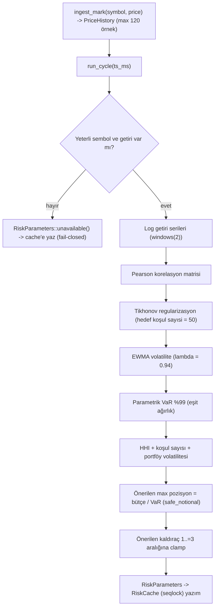

### `src/bin/risk-worker.rs`
**Detaylı açıklama:** Bağımsız `risk-worker` daemon'unun giriş noktasıdır. `main` port (3011) ve çevrim süresini (60 sn) çevreden okur, `risk.toml`'u `load_risk_config` ile yükler ve `ConfigWatcher` kurar. Ardından üç bileşeni birbirine bağlar: (1) **Döngü iş parçacığı** — her 60 sn'de politikayı hot-reload eder, `/tmp/price_feed.json`'dan mark fiyatlarını okur (yoksa `unavailable` yazar, fail-closed), mark'ları worker'a işler, `run_cycle` çalıştırır ve sonucu `publish` ile `transport` ring buffer'ına (`/cycle_finance_risk_params`, ≤700 bayt) ve `/tmp/risk_params.json`'a yazar; (2) **REST API** — axum üzerinde `GET /healthz`, `GET /api/risk/snapshot` (parametreler + politika + kill switch durumu) ve `PUT /api/risk/kill-switch` uçları sunar; (3) paylaşılan `AppState` (cache, kill_switch, politika, çevrim sayacı) ile her ikisini birbirine bağlar.

**Neden kullandık:**
- Daemon'un ayrı çalışması, model hesaplarını (cold path) emir akışından (hot path) fiziksel olarak ayırır.
- Ring buffer yayını, diğer süreçlerin (execution-engine) parametreleri senkron tüketmesini sağlar.
- REST yüzeyi operasyonel kontrolleri (kill switch, snapshot, health) süreç dışına açar.

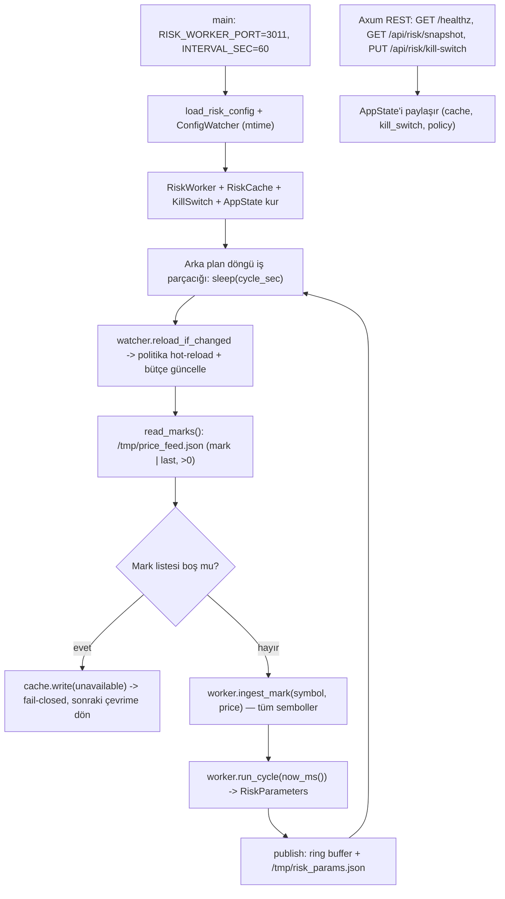

### `src/accounting.rs`
**Detaylı açıklama:** Muhasebenin tek doğruluk kaynağıdır. `Position` işaretli miktar taşır (`>0` LONG, `<0` SHORT) ve `unrealized_pnl`, `notional`, `liquidation_price` (basitleştirilmiş cross-margin: long `entry×(1−1/lev+maintenance)`) hesaplar. `Portfolio` nakit, gerçekleşen PnL, komisyon, pozisyon haritası, peak equity ve günlük PnL sayacını tutar; `roll_day` UTC günü değişince `realized_today`'i sıfırlar. `apply_signed` ONE_WAY netleştirme yapar: zıt yöndeki fill'ler önce kapanır (gerçekleşen PnL üretir), tam kapanırsa pozisyon silinir, yön değişirse yeni giriş fiyatı set edilir; aynı yöndeki fill'ler ağırlıklı ortalama giriş fiyatını günceller. `get_total_equity` nakit + gerçekleşmemiş PnL'dir; `drawdown_pct`, `daily_loss` (bugün gerçekleşen + tüm gerçekleşmemiş) ve `near_liquidation` durum değerlendirmesinin girdileridir.

**Neden kullandık:**
- Tüm para işlemleri `rust_decimal` ile yapılır — HFT muhasebesinde `f64` yuvarlama hataları kabul edilemez.
- ONE_WAY netleştirme ve ağırlıklı ortalama giriş, gerçek borsa pozisyonuyla uzlaşmayı kolaylaştırır.
- `process_fill` hem fill'i uygular hem de realize PnL döner; engine `on_fill` bunu status değerlendirmesiyle birleştirir.

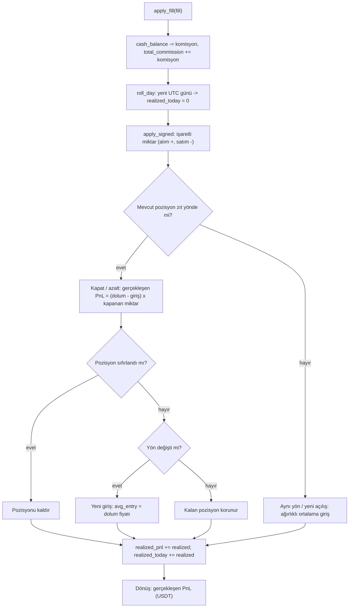

### `src/audit.rs`
**Detaylı açıklama:** Her risk kararını nedenleriyle kaydeden denetim izidir. `RiskDecisionEvent` serileştirilebilir tek bir kayıttır: zaman damgası, strateji, sembol, yön, miktar, fiyat, karar (`approved`/`rejected`) ve red durumunda kural adı (`rule_name()`) + açıklama (`describe()`). `JsonLinesAudit` flume `unbounded` kanalı üzerinden arka plan iş parçacığına `try_send` eder (asla bloklamaz); iş parçacığı JSONL satırlarını `BufWriter` ile append modunda dosyaya yazar. `AuditLog` bu sink'i sarmalar ve `record_approved`/`record_rejected`/`record_fill` yüksek seviyeli API sunar; `disabled()` tüketicisiz kanal kurarak test/performans modlarında kaydı düşürür.

**Neden kullandık:**
- Hot path diske yazım bekletmez: `try_send` + arka plan yazıcısı ile gecikme eklenmez.
- JSONL formatı satır bazlı append olduğu için süreç çökse bile önceki kayıtlar korunur.
- Her red `rule_name()` + `describe()` taşır — hatanın hangi kuraldan geldiği anında görünür.

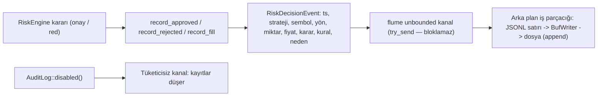

### `src/cache.rs`
**Detaylı açıklama:** Worker (üretici, cold path) ile hot path okuyucuları arasındaki parametre köprüsüdür. `RiskParameters` model çıktılarını taşır (n_symbols, portföy volatilitesi, VaR, koşul sayısı, HHI, önerilen limitler, `available`/`gate_ready` bayrakları). `Seqlock<T>` minimal seqlock'tur: yazar sekanstı `seq`'i önce teke çıkarır (yazım sürüyor), veriyi yazar, sonra çifte çıkarır (yazım tamam); okuyucu `seq`'i Acquire ile iki kez okur, tek ise spin_loop ile bekler, iki okuma eşitse veriyi güvenle kopyalar — böylece torn-read (yarım yazım okuma) koruması sağlanır. `RiskCache` bunu `Arc` altında paylaşır; `read()` lock-free'dir.

**Neden kullandık:**
- `parking_lot` kilitlerinden dahi kaçınır — hot path `read()` tamamen lock-free, sadece iki atomik yükleme.
- Seqlock torn-read koruması, worker yazarken okuyucunun tutarsız parametre görmesini engeller.
- `available=false` varsayılanı fail-closed davranışı garantiler (worker hiç çalışmazsa bile).

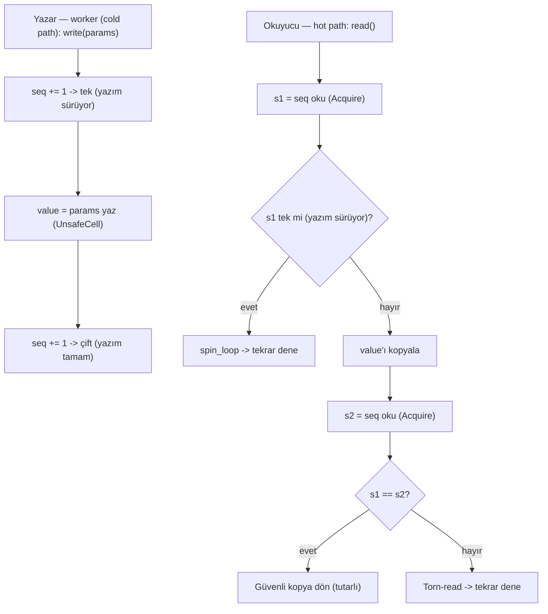

### `src/config.rs`
**Detaylı açıklama:** `risk.toml` yükleme ve canlı yeniden yükleme (hot-reload) altyapısıdır. `resolve_risk_config_path()` dosya konumunu `RISK_CONFIG` çevre değişkeninden veya varsayılan `risk.toml`'dan bulur; `load_risk_config_from()` dosyayı okur, yoksa `RiskPolicy::default()` döndürür, varsa `toml::from_str` ile parse eder. `ConfigWatcher` dosya mtime'ını takip eder; `reload_if_changed()` mtime değişmişse yeni politikayı yükler. `ReloadablePolicy` watcher + politika ikilisini tek yapıda sarmalayarak execution/kore tarafında kullanıma hazır hale getirir.

**Neden kullandık:**
- TOML, insan okunur ve serde destekli bir format — politika değişiklikleri kod derlemeden yapılır.
- `serde(default)` sayesinde eksik alanlar varsayılanla dolar; eski konfigler geriye uyumlu kalır.
- mtime tabanlı watcher, daemon'ı yeniden başlatmadan limitleri canlı günceller.

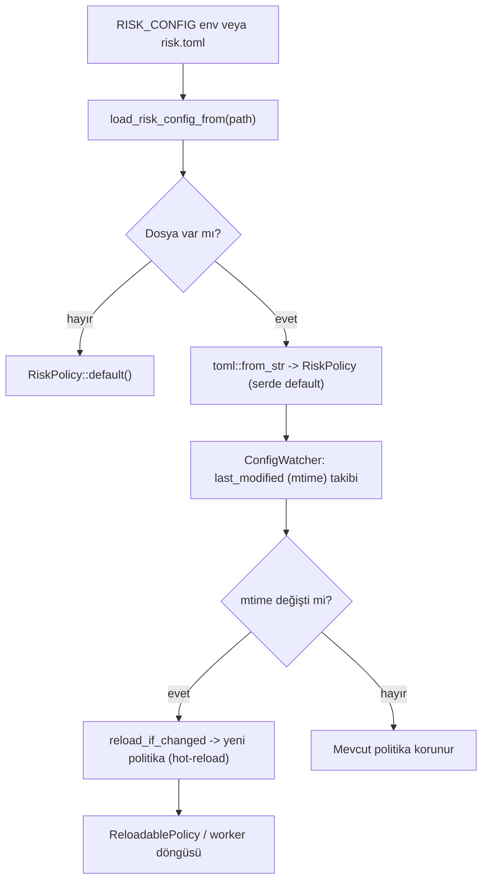

### `src/correlation.rs`
**Detaylı açıklama:** Portföy modellemenin matematik çekirdeğidir; yalnızca soğuk yolda (60 sn worker) çalışır. `correlation_matrix` log getiri serilerinden (satır = sembol) Pearson korelasyon matrisi kurar; varyansı sıfır olan sembol kendisiyle 1, diğerleriyle 0 korelasyona düşer. `shrink` Ledoit–Wolf yaklaşımıyla `(1-s)·C + s·I` uygular, `tikhonov` köşegene `alpha` ekler (ridge). `condition_number` Jacobi döndürmeleriyle özdeğerleri bulup `|λmax/λmin|` oranını verir. `regularize_correlation_matrix` hedef koşul sayısına ulaşana kadar `alpha`'yı ikiye katlayarak (en fazla 20 iterasyon) güvenli bir matris üretir; başarısızsa shrink(0.5) + tikhonov(0.01) son çaresine başvurur. `ewma_volatility` λ=0.94 ile son gözlemleri ağırlıklandıran eksponansiyel ağırlıklı volatilite verir.

**Neden kullandık:**
- VaR'ın doğruluğu iyi koşullu (well-conditioned) korelasyon matrisine bağlıdır; Tikhonov bunu garanti eder.
- Jacobi çözücü N≤64 için BLAS bağımlılığı olmadan özdeğerleri hesaplar — hafif ve deterministik.
- EWMA, geçmişe eşit ağırlık veren basit standart sapmaya göre değişen oynaklığa daha hızlı tepki verir.

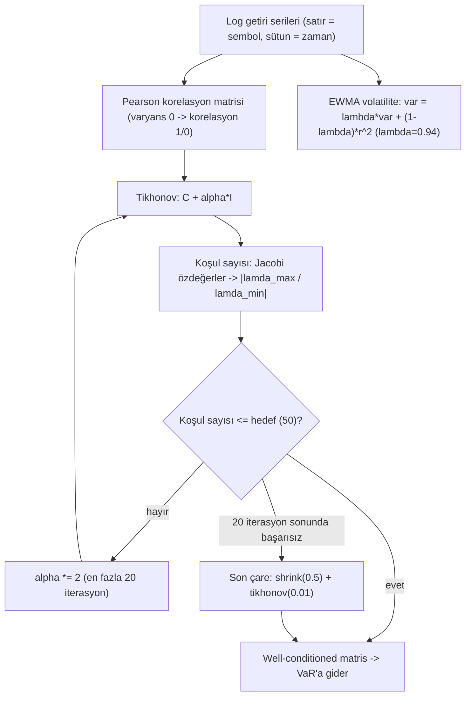

### `src/liquidity.rs`
**Detaylı açıklama:** Order book derinliğinden slippage / market impact tahmini üretir. `LobSimulator` 10 seviyeli bid/ask dizilerini sabit nokta tamsayı olarak tutar (fiyat ×100_000, miktar ×1_000) — böylece `u128` aritmetiğiyle taşma riski olmadan kesirli işlem yapılır. `simulate_buy`/`simulate_sell` verilen miktarı en iyi seviyelerden itibaren sırayla doldurup ağırlıklı ortalama dolum fiyatı döndürür. `estimate_slippage_bps` ortalama dolum fiyatını mid-price ile karşılaştırıp `|avg/mid − 1| × 10000` ile baz puan cinsinden slippage üretir; tamamen doldurulamazsa `None` döner (slippage anlamsızdır). Sembol bazlı slippage limiti `policy` içindeki `max_slippage_bps` üzerinden `LiquidityLimitExceeded` ile engine'e bağlanabilir.

**Neden kullandık:**
- Sabit nokta tamsayı aritmetiği, HFT path'inde `Decimal` kayan nokta maliyetini ve `f64` yuvarlama hatalarını önler.
- Simülasyon, emir boyutunun order book'u ne kadar süpüreceğini (impact) gerçekçi şekilde ölçer.
- `None` dönen durumlar (derinlik yetersiz) konservatif davranışa işaret eder.

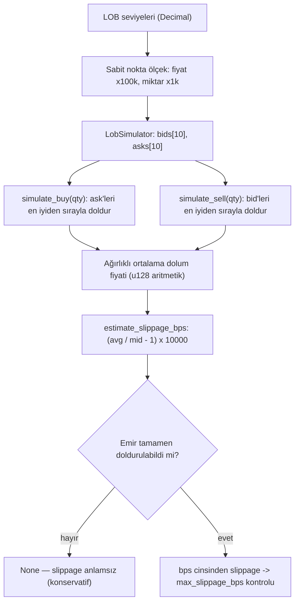

### `src/policy.rs`
**Detaylı açıklama:** Konfigüre edilebilir risk limit setinin veri modelidir. `RiskPolicy` `risk.toml`'dan `serde(default)` ile yüklenir: genel pozisyon/notional/brüt exposure limitleri, HHI konsantrasyon sınırı, kaldıraç, günlük kayıp, drawdown, bakım marjı, dakikalık emir sayısı, blocklist, mark bayatlık eşiği, parametrik kapı ve likidite kapısı bayrakları, circuit breaker eşiği. `PerSymbolLimits` sembol bazlı override'ları (`max_position_usdt`, `max_notional_per_order`, `max_leverage`, `max_slippage_bps`) tutar. `effective(symbol)` override'ları büyük harfle eşleyip `EffectiveLimits` olarak birleştirir — override yoksa genel değer kullanılır. Varsayılanlar (1.000 USDT pozisyon, 3x kaldıraç, %20 drawdown vb.) `Default` impl'inde tanımlıdır.

**Neden kullandık:**
- Limitler kod içinde sabit değil, dosyadan yüklenir — operasyon politikayı derlemeden değiştirir.
- `effective()` tek erişim noktasıdır; sembol override'larıyla genel kuralların birleşimi tek yerde hesaplanır.
- Tüm alanlar `serde(default)` olduğu için kısmi konfig dosyaları güvenle parse edilir.

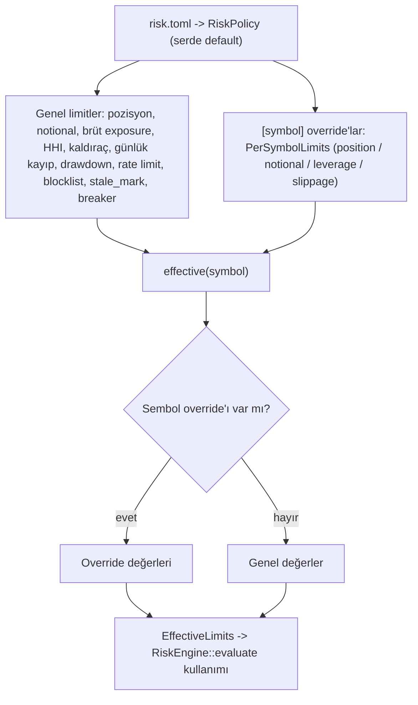

### `src/state.rs`
**Detaylı açıklama:** Portföy, mark fiyatları, `RiskStatus` ve bekleyen emir notional rezervini tek `parking_lot::RwLock` altında tutan paylaşılan risk durumudur. Yazma yolları kısa ve kilit süresi minimaldir: `process_fill` `Portfolio::apply_fill` + status değerlendirmesi, `update_mark` day-roll + mark güncelleme + status, `set_cash_balance`/`sync_position` borsa gerçeğiyle resync. `evaluate_status` her değişiklikte equity'yi hesaplayıp peak'i günceller; drawdown limiti, günlük kayıp limiti ve her pozisyon için likidasyon çizgisi kontrolü yaparak `RiskStatus`'ü günceller ve `halts_trading()` doğruysa **kill switch'i otomatik devreye sokar**. `snapshot()` REST/CLI için serileştirilebilir `RiskSnapshot` üretir (nakit, PnL, equity, drawdown, exposure, pozisyonlar, likidasyon fiyatları).

**Neden kullandık:**
- Tek `RwLock` tek doğruluk kaynağını basit tutar; çoklu kilit sıralama (deadlock) riskini ortadan kaldırır.
- İhlal tespiti fill/mark geldiği anda yapılır — pre-trade kapısı "şu anki" durumu okur.
- İhlal anında kill switch'in otomatik kapanması, yetkiyi engine'in kendi 1. adımına bırakmak yerine kaynağında tetikler.

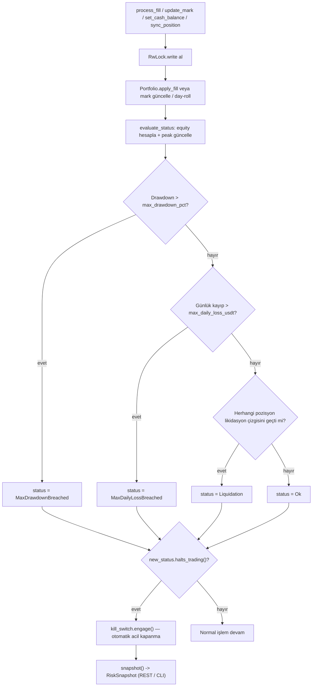

---

## Özet

- **Analiz edilen dosya sayısı:** 21 (16 `src/*.rs` — `engine`, `types`, `limits`, `exposure`, `var`, `kill_switch`, `worker`, `risk-worker`, `accounting`, `audit`, `cache`, `config`, `correlation`, `liquidity`, `policy`, `state` — artı `Cargo.toml`, `lib.rs` ve 3 test dosyası).
- **Mermaid diyagramı sayısı:** 16 (her analiz edilen dosya için; en kritikleri: engine.rs 13 adımlı kural zinciri, kill_switch durum makinesi, risk-worker döngüsü ve state.rs status değerlendirmesi).

---

## 📄 Tam Kaynak Kodu

### `risk-engine/Cargo.toml`

```toml
[package]
name = "risk-engine"
version = "0.2.0"
edition = "2021"
description = "Cycle Finance ortak risk çekirdeği: pre-trade kapısı, muhasebe, korelasyon/VaR, kill switch"

[dependencies]
rust_decimal = { workspace = true }
parking_lot = { workspace = true }
serde = { workspace = true }
serde_json = { workspace = true }
toml = { workspace = true }
chrono = { workspace = true }
flume = { workspace = true }
transport = { path = "../cycle-engine/transport" }
tokio = { workspace = true }
axum = { workspace = true }
tracing = { workspace = true }

[dev-dependencies]
proptest = { workspace = true }

[lib]
name = "risk_engine"
path = "src/lib.rs"

[[bin]]
name = "risk-worker"
path = "src/bin/risk-worker.rs"
```

### `risk-engine/src/accounting.rs`

```rust
//! Muhasebe: pozisyon yönetimi, fill işleme, gerçekleşen/gerçekleşmemiş PnL.
//!
//! **Birimler:** miktarlar baz-coin, fiyatlar USDT, değerler USDT'dir.
//! Pozisyon `quantity`'si işaretlidir: `>0` LONG, `<0` SHORT.

use crate::types::{Fill, Side};
use rust_decimal::Decimal;
use rust_decimal::prelude::Signed;
use std::collections::HashMap;
use std::str::FromStr;

#[derive(Debug, Clone)]
pub struct Position {
    pub symbol: String,
    /// İşaretli net miktar (coin): `>0` LONG, `<0` SHORT.
    pub quantity: Decimal,
    pub avg_entry_price: Decimal,
    pub leverage: Decimal,
}

impl Position {
    pub fn is_open(&self) -> bool {
        !self.quantity.is_zero()
    }

    pub fn is_long(&self) -> bool {
        self.quantity > Decimal::ZERO
    }

    /// Gerçekleşmemiş PnL (USDT).
    pub fn unrealized_pnl(&self, mark_price: Decimal) -> Decimal {
        let entry = self.avg_entry_price.max(Decimal::ONE);
        let qty = self.quantity;
        if self.is_long() {
            (mark_price - entry) * qty
        } else {
            (entry - mark_price) * qty.abs()
        }
    }

    /// Cari pozisyon değeri (USDT): `|qty| * mark`.
    pub fn notional(&self, mark_price: Decimal) -> Decimal {
        self.quantity.abs() * mark_price
    }

    /// Likidasyon fiyatı (basitleştirilmiş cross-margin yaklaşımı).
    /// long:  entry * (1 - 1/lev + maintenance)
    /// short: entry * (1 + 1/lev - maintenance)
    pub fn liquidation_price(&self, maintenance_margin_rate: Decimal) -> Decimal {
        let inv_lev = Decimal::ONE / self.leverage.max(Decimal::ONE);
        if self.is_long() {
            self.avg_entry_price * (Decimal::ONE - inv_lev + maintenance_margin_rate)
        } else {
            self.avg_entry_price * (Decimal::ONE + inv_lev - maintenance_margin_rate)
        }
    }

    /// Mark fiyat likidasyon çizgisini geçti mi?
    pub fn liquidation_breached(&self, mark_price: Decimal, maintenance_margin_rate: Decimal) -> bool {
        let liq = self.liquidation_price(maintenance_margin_rate);
        if self.is_long() {
            mark_price <= liq
        } else {
            mark_price >= liq
        }
    }
}

/// Portföy muhasebesi — tek doğruluk kaynağı.
#[derive(Debug, Clone)]
pub struct Portfolio {
    pub cash_balance: Decimal,
    pub starting_balance: Decimal,
    pub realized_pnl: Decimal,
    pub total_commission: Decimal,
    pub positions: HashMap<String, Position>,
    pub max_drawdown_limit: Decimal,
    pub peak_equity: Decimal,
    /// Gün içinde gerçekleşen PnL (yeni UTC gününde sıfırlanır).
    pub realized_today: Decimal,
    /// Gün sınırı takibi için son UTC gün numarası (Unix gün sayacı).
    pub day_index: i64,
    pub maintenance_margin_rate: Decimal,
}

impl Portfolio {
    pub fn new(initial_balance: Decimal, max_drawdown: Decimal) -> Self {
        Self {
            cash_balance: initial_balance,
            starting_balance: initial_balance,
            realized_pnl: Decimal::ZERO,
            total_commission: Decimal::ZERO,
            positions: HashMap::new(),
            max_drawdown_limit: max_drawdown,
            peak_equity: initial_balance,
            realized_today: Decimal::ZERO,
            day_index: Self::utc_day_index(0),
            maintenance_margin_rate: Decimal::from_str("0.005").unwrap(),
        }
    }

    /// Eski `RiskEngine` sınır değerleriyle uyumlu kurucu.
    pub fn new_with_margin(initial_balance: Decimal, max_drawdown: Decimal, maintenance_margin_rate: Decimal) -> Self {
        let mut p = Self::new(initial_balance, max_drawdown);
        p.maintenance_margin_rate = maintenance_margin_rate;
        p
    }

    /// Unix ts'den UTC gün sayacı (0 döner → bilinmiyor).
    fn utc_day_index(ts_ms: u64) -> i64 {
        let secs = ts_ms / 1000;
        (secs / 86_400) as i64
    }

    /// Yeni UTC günü başladıysa günlük PnL sayacını sıfırlar.
    pub fn roll_day(&mut self, ts_ms: u64) {
        let idx = Self::utc_day_index(ts_ms);
        if idx > 0 && idx != self.day_index {
            self.day_index = idx;
            self.realized_today = Decimal::ZERO;
        }
    }

    /// İşaretli fill (pozitif alım, negatif satım) — ONE_WAY netleştirme.
    /// `commission` USDT'dir. Gerçekleşen PnL (komisyonsuz) döner.
    pub fn process_fill(&mut self, symbol: &str, fill_qty: Decimal, fill_price: Decimal, commission: Decimal) -> Decimal {
        let leverage = self
            .positions
            .get(symbol)
            .map(|p| p.leverage)
            .unwrap_or(Decimal::ONE);

        let fill = Fill {
            symbol: symbol.to_string(),
            side: if fill_qty >= Decimal::ZERO { Side::Buy } else { Side::Sell },
            quantity: fill_qty.abs(),
            price: fill_price,
            commission,
            leverage,
            ts_ms: 0,
        };
        self.apply_fill(&fill)
    }

    /// Yapılandırılmış fill işleme (komisyon + gerçekleşen PnL + pozisyon).
    /// Gerçekleşen PnL (komisyonsuz) döndürür.
    pub fn apply_fill(&mut self, fill: &Fill) -> Decimal {
        self.cash_balance -= fill.commission;
        self.total_commission += fill.commission;

        let signed = match fill.side {
            Side::Buy => fill.quantity,
            Side::Sell => -fill.quantity,
        };
        self.roll_day(fill.ts_ms);

        let realized = self.apply_signed(symbol_key(&fill.symbol), signed, fill.price, fill.leverage);
        self.realized_pnl += realized;
        self.realized_today += realized;
        realized
    }

    fn apply_signed(&mut self, symbol: String, signed: Decimal, fill_price: Decimal, leverage: Decimal) -> Decimal {
        let mut realized = Decimal::ZERO;
        let mut closed = false;
        let mut zeroed = false;

        {
            let pos = self
                .positions
                .entry(symbol.clone())
                .or_insert(Position {
                    symbol: symbol.clone(),
                    quantity: Decimal::ZERO,
                    avg_entry_price: Decimal::ZERO,
                    leverage,
                });

            if !pos.quantity.is_zero() {
                let same_direction = (pos.quantity > Decimal::ZERO && signed > Decimal::ZERO)
                    || (pos.quantity < Decimal::ZERO && signed < Decimal::ZERO);

                if !same_direction {
                    // Kapatma / azaltma.
                    let was_long = pos.is_long();
                    let close_qty = signed.abs().min(pos.quantity.abs());
                    let entry = pos.avg_entry_price.max(Decimal::ONE);
                    realized = if was_long {
                        (fill_price - entry) * close_qty
                    } else {
                        (entry - fill_price) * close_qty
                    };

                    pos.quantity += signed;
                    closed = true;
                    if pos.quantity.is_zero() {
                        zeroed = true;
                    } else if pos.is_long() != was_long {
                        // Yön değişimi: ters pozisyona döndü → yeni giriş.
                        pos.avg_entry_price = fill_price;
                        pos.leverage = leverage;
                    }
                }
            }

            if !closed {
                // Aynı yön (veya yeni açılış): ağırlıklı ortalama giriş.
                if pos.quantity.is_zero() {
                    pos.quantity = signed;
                    pos.avg_entry_price = fill_price;
                    pos.leverage = leverage;
                } else {
                    let old_entry = pos.avg_entry_price.max(Decimal::ONE);
                    let total_cost = pos.quantity.abs() * old_entry + signed.abs() * fill_price;
                    let total_qty = pos.quantity.abs() + signed.abs();
                    pos.quantity += signed;
                    pos.avg_entry_price = total_cost / total_qty.max(Decimal::ONE);
                    pos.leverage = leverage;
                }
            }
        }

        if zeroed {
            self.positions.remove(&symbol);
        }
        realized
    }

    // ── Değerleme ──

    pub fn unrealized_pnl(&self, mark_prices: &HashMap<String, Decimal>) -> Decimal {
        self.positions
            .values()
            .map(|p| {
                let mark = mark_prices.get(&p.symbol).copied().unwrap_or(p.avg_entry_price);
                p.unrealized_pnl(mark)
            })
            .sum()
    }

    pub fn total_notional(&self, mark_prices: &HashMap<String, Decimal>) -> Decimal {
        self.positions
            .values()
            .map(|p| {
                let mark = mark_prices.get(&p.symbol).copied().unwrap_or(p.avg_entry_price);
                p.notional(mark)
            })
            .sum()
    }

    /// Eşitlik = nakit + gerçekleşmemiş PnL.
    pub fn get_total_equity(&self, mark_prices: &HashMap<String, Decimal>) -> Decimal {
        self.cash_balance + self.unrealized_pnl(mark_prices)
    }

    /// Drawdown oranı (0.10 = %10). `peak_equity` güncellenmez (salt okuma).
    pub fn drawdown_pct(&self, equity: Decimal) -> Decimal {
        let peak = self.peak_equity.max(Decimal::ONE);
        (peak - equity) / peak
    }

    /// Günlük kayıp: bugün gerçekleşen + tüm gerçekleşmemiş.
    pub fn daily_loss(&self, mark_prices: &HashMap<String, Decimal>) -> Decimal {
        self.realized_today + self.unrealized_pnl(mark_prices)
    }

    pub fn is_drawdown_exceeded(&self, mark_prices: &HashMap<String, Decimal>) -> bool {
        let equity = self.get_total_equity(mark_prices);
        self.drawdown_pct(equity) > self.max_drawdown_limit
    }

    pub fn gross_exposure(&self, mark_prices: &HashMap<String, Decimal>) -> Decimal {
        self.total_notional(mark_prices)
    }

    /// Net exposure = LONG - SHORT değerleri toplamı.
    pub fn net_exposure(&self, mark_prices: &HashMap<String, Decimal>) -> Decimal {
        self.positions
            .values()
            .map(|p| {
                let mark = mark_prices.get(&p.symbol).copied().unwrap_or(p.avg_entry_price);
                p.notional(mark) * p.quantity.signum()
            })
            .sum()
    }

    /// Likidasyon yakınlığı: likidasyon çizgisine yaklaşan semboller.
    pub fn near_liquidation(&self, mark_prices: &HashMap<String, Decimal>, proximity_pct: Decimal) -> Vec<String> {
        let mut out = Vec::new();
        for p in self.positions.values() {
            let mark = mark_prices.get(&p.symbol).copied().unwrap_or(p.avg_entry_price);
            let liq = p.liquidation_price(self.maintenance_margin_rate);
            if p.is_long() {
                if mark - liq <= liq * proximity_pct {
                    out.push(p.symbol.clone());
                }
            } else if liq - mark <= liq * proximity_pct {
                out.push(p.symbol.clone());
            }
        }
        out
    }

    /// Equity'yi peak olarak işaretler; yeni peak gördüyse günceller.
    pub fn update_peak(&mut self, equity: Decimal) {
        if equity > self.peak_equity {
            self.peak_equity = equity;
        }
    }
}

fn symbol_key(s: &str) -> String {
    s.to_uppercase()
}
```

### `risk-engine/src/audit.rs`

```rust
//! Denetim izi — her risk kararı (onay/red) nedenleriyle kaydedilir.
//!
//! JSONL dosyasına arka plan iş parçacığıyla (flume) yazılır; sıcak yol asla
//! diske yazım bekletmez. `AuditLog::disabled()` ile devre dışı bırakılabilir.

use crate::types::{OrderIntent, RejectReason};
use rust_decimal::Decimal;
use serde::Serialize;
use std::sync::Arc;

/// Disk üzerinde kalıcı bir karar kaydı.
#[derive(Debug, Clone, Serialize)]
pub struct RiskDecisionEvent {
    pub ts_ms: u64,
    pub strategy_id: u32,
    pub symbol: String,
    pub side: String,
    pub quantity: String,
    pub price: Option<String>,
    pub decision: String, // "approved" | "rejected"
    pub rule: Option<String>,
    pub reason: Option<String>,
}

impl RiskDecisionEvent {
    pub fn approved(intent: &OrderIntent, ts_ms: u64) -> Self {
        Self {
            ts_ms,
            strategy_id: intent.strategy_id,
            symbol: intent.symbol.clone(),
            side: intent.side.as_str().to_string(),
            quantity: intent.quantity.to_string(),
            price: intent.price.map(|p| p.to_string()),
            decision: "approved".into(),
            rule: None,
            reason: None,
        }
    }

    pub fn rejected(intent: &OrderIntent, reason: &RejectReason, ts_ms: u64) -> Self {
        Self {
            ts_ms,
            strategy_id: intent.strategy_id,
            symbol: intent.symbol.clone(),
            side: intent.side.as_str().to_string(),
            quantity: intent.quantity.to_string(),
            price: intent.price.map(|p| p.to_string()),
            decision: "rejected".into(),
            rule: Some(reason.rule_name().to_string()),
            reason: Some(reason.describe()),
        }
    }
}

/// Denetim hedefi.
pub trait AuditSink: Send + Sync {
    fn record(&self, event: RiskDecisionEvent);
}

/// JSONL dosyasına arka plan iş parçacığıyla yazan sink.
pub struct JsonLinesAudit {
    tx: flume::Sender<RiskDecisionEvent>,
    _writer: Option<std::thread::JoinHandle<()>>,
}

impl JsonLinesAudit {
    pub fn open(path: impl Into<String>) -> Self {
        let path = path.into();
        let (tx, rx) = flume::unbounded::<RiskDecisionEvent>();
        let writer = std::thread::spawn(move || {
            let file = match std::fs::OpenOptions::new()
                .create(true)
                .append(true)
                .open(&path)
            {
                Ok(f) => f,
                Err(_) => return,
            };
            use std::io::Write;
            let mut w = std::io::BufWriter::new(file);
            while let Ok(ev) = rx.recv() {
                if let Ok(line) = serde_json::to_string(&ev) {
                    let _ = writeln!(w, "{line}");
                }
            }
        });
        Self {
            tx,
            _writer: Some(writer),
        }
    }

    pub fn disabled() -> Self {
        let (tx, rx) = flume::unbounded::<RiskDecisionEvent>();
        let _ = rx; // tüketici yok → kayıtlar düşer
        Self { tx, _writer: None }
    }
}

impl AuditSink for JsonLinesAudit {
    fn record(&self, event: RiskDecisionEvent) {
        let _ = self.tx.try_send(event);
    }
}

impl AuditSink for Arc<JsonLinesAudit> {
    fn record(&self, event: RiskDecisionEvent) {
        self.tx.try_send(event).ok();
    }
}

/// Audit bağlamını taşıyan kısa yol.
pub struct AuditLog {
    sink: Arc<dyn AuditSink>,
}

impl AuditLog {
    pub fn new(sink: Arc<dyn AuditSink>) -> Self {
        Self { sink }
    }

    pub fn disabled() -> Self {
        Self {
            sink: Arc::new(JsonLinesAudit::disabled()),
        }
    }

    pub fn record_approved(&self, intent: &OrderIntent, ts_ms: u64) {
        self.sink.record(RiskDecisionEvent::approved(intent, ts_ms));
    }

    pub fn record_rejected(&self, intent: &OrderIntent, reason: &RejectReason, ts_ms: u64) {
        self.sink.record(RiskDecisionEvent::rejected(intent, reason, ts_ms));
    }

    pub fn record_fill(&self, symbol: &str, quantity: Decimal, price: Decimal) {
        let ev = RiskDecisionEvent {
            ts_ms: now_ms(),
            strategy_id: 0,
            symbol: symbol.to_string(),
            side: "FILL".into(),
            quantity: quantity.to_string(),
            price: Some(price.to_string()),
            decision: "fill".into(),
            rule: None,
            reason: None,
        };
        self.sink.record(ev);
    }
}

fn now_ms() -> u64 {
    std::time::SystemTime::now()
        .duration_since(std::time::UNIX_EPOCH)
        .map(|d| d.as_millis() as u64)
        .unwrap_or(0)
}
```

### `risk-engine/src/cache.rs`

```rust
//! Risk parametre önbelleği — seqlock tabanlı, sıcak yol okumaları lock-free.
//!
//! Üretici (risk-worker daemon, cold path) 60s'de yazar; tüketiciler
//! (hot path) döngüyü bloklamadan okur. Torn-read koruması seqlock ile sağlanır.

use rust_decimal::Decimal;
use std::cell::UnsafeCell;
use std::sync::atomic::{AtomicU64, Ordering};

/// Worker'ın her çevrimde ürettiği model çıktıları.
#[derive(Debug, Clone, Copy, Default, PartialEq)]
pub struct RiskParameters {
    /// Sembol sayısı (korelasyon matrisi boyutu). 0 = henüz hesaplanmadı.
    pub n_symbols: usize,
    /// Portföy EWMA volatilite (periyot başına).
    pub portfolio_volatility: f64,
    /// Parametrik portföy VaR (%, 1 gün) — ondalık oran olarak.
    pub var_99_1d_pct: f64,
    /// Korelasyon matrisi koşul sayısı (finite ise).
    pub correlation_condition: f64,
    /// Portföy konsantrasyon HHI (0..=1).
    pub hhi: f64,
    /// Önerilen sembol başına üst pozisyon değeri (USDT).
    pub suggested_max_position_usdt: Decimal,
    /// Önerilen üst kaldıraç (x).
    pub suggested_max_leverage: Decimal,
    /// Model hesaplama zamanı (unix ms).
    pub computed_at_ms: u64,
    /// Model kullanılabilir mi? (false → fail-closed davranın)
    pub available: bool,
    /// Model parametrik kapıya uygun mu? (worker çalışmıyorsa false)
    pub gate_ready: bool,
}

impl RiskParameters {
    pub fn unavailable() -> Self {
        Self {
            available: false,
            ..Default::default()
        }
    }
}

/// Minimal seqlock: yazar seq'i tek yapıp veriyi yazar, sonra çift yapar.
/// Okuyucu seq değişmediyse veriyi güvenle kopyalar.
pub struct Seqlock<T: Copy> {
    seq: AtomicU64,
    value: UnsafeCell<T>,
}

unsafe impl<T: Copy + Send> Sync for Seqlock<T> {}

impl<T: Copy> Seqlock<T> {
    pub fn new(value: T) -> Self {
        Self {
            seq: AtomicU64::new(0),
            value: UnsafeCell::new(value),
        }
    }

    #[inline]
    pub fn read(&self) -> T {
        loop {
            let s1 = self.seq.load(Ordering::Acquire);
            if s1 & 1 == 1 {
                std::hint::spin_loop();
                continue;
            }
            let v = unsafe { *self.value.get() };
            let s2 = self.seq.load(Ordering::Acquire);
            if s1 == s2 {
                return v;
            }
        }
    }

    #[inline]
    pub fn write(&self, value: T) {
        let mut s = self.seq.load(Ordering::Relaxed);
        s += 1; // odd: yazım sürüyor
        self.seq.store(s, Ordering::Release);
        unsafe {
            *self.value.get() = value;
        }
        s += 1; // even: yazım tamam
        self.seq.store(s, Ordering::Release);
    }
}

/// Hot path'in okuduğu parametre önbelleği.
#[derive(Clone)]
pub struct RiskCache {
    inner: Arc<Seqlock<RiskParameters>>,
}

use std::sync::Arc;

impl Default for RiskCache {
    fn default() -> Self {
        Self::new()
    }
}

impl RiskCache {
    pub fn new() -> Self {
        Self {
            inner: Arc::new(Seqlock::new(RiskParameters::unavailable())),
        }
    }

    #[inline]
    pub fn read(&self) -> RiskParameters {
        self.inner.read()
    }

    pub fn write(&self, params: RiskParameters) {
        self.inner.write(params);
    }
}

#[cfg(test)]
mod tests {
    use super::*;

    #[test]
    fn seqlock_roundtrip() {
        let lock = Seqlock::new(42u64);
        assert_eq!(lock.read(), 42);
        lock.write(7);
        assert_eq!(lock.read(), 7);
    }
}
```

### `risk-engine/src/config.rs`

```rust
//! Risk konfigürasyonu — `risk.toml` yükleme ve hot-reload.

use crate::policy::RiskPolicy;
use std::path::{Path, PathBuf};
use std::time::SystemTime;

/// Yapılandırma yükleme hataları.
#[derive(Debug)]
pub enum RiskConfigError {
    Io(std::io::Error),
    Parse(String),
}

impl std::fmt::Display for RiskConfigError {
    fn fmt(&self, f: &mut std::fmt::Formatter<'_>) -> std::fmt::Result {
        match self {
            RiskConfigError::Io(e) => write!(f, "risk.toml okuma hatası: {e}"),
            RiskConfigError::Parse(e) => write!(f, "risk.toml parse hatası: {e}"),
        }
    }
}

impl std::error::Error for RiskConfigError {}

/// `risk.toml` konumunu çevreden veya varsayılandan bulur.
pub fn resolve_risk_config_path() -> PathBuf {
    std::env::var("RISK_CONFIG")
        .map(PathBuf::from)
        .unwrap_or_else(|_| PathBuf::from("risk.toml"))
}

/// `risk.toml`'u yükler; dosya yoksa varsayılan politikayı döndürür.
pub fn load_risk_config() -> Result<RiskPolicy, RiskConfigError> {
    load_risk_config_from(resolve_risk_config_path().as_path())
}

/// Belirli bir yoldan `risk.toml` yükler (yoksa varsayılan).
pub fn load_risk_config_from(path: &Path) -> Result<RiskPolicy, RiskConfigError> {
    let content = match std::fs::read_to_string(path) {
        Ok(c) => c,
        Err(e) if e.kind() == std::io::ErrorKind::NotFound => {
            return Ok(RiskPolicy::default());
        }
        Err(e) => return Err(RiskConfigError::Io(e)),
    };
    toml::from_str::<RiskPolicy>(&content)
        .map_err(|e| RiskConfigError::Parse(e.to_string()))
}

/// Mtime izleyici — dosya değiştiğinde politika yeniden yüklenir.
#[derive(Debug)]
pub struct ConfigWatcher {
    path: PathBuf,
    last_modified: Option<SystemTime>,
}

impl ConfigWatcher {
    pub fn new(path: PathBuf) -> Self {
        Self {
            last_modified: Self::modified(&path),
            path,
        }
    }

    fn modified(path: &Path) -> Option<SystemTime> {
        std::fs::metadata(path).and_then(|m| m.modified()).ok()
    }

    /// Dosya değiştiyse yeni politikayı döndürür.
    pub fn reload_if_changed(&mut self) -> Option<RiskPolicy> {
        let now = Self::modified(&self.path);
        if now != self.last_modified {
            self.last_modified = now;
            load_risk_config_from(&self.path).ok()
        } else {
            None
        }
    }
}

/// Hot-reload'a hazır politika sarmalayıcı (execution/kore içinde kullanım için).
#[derive(Debug)]
pub struct ReloadablePolicy {
    pub watcher: ConfigWatcher,
    pub policy: RiskPolicy,
}

impl ReloadablePolicy {
    pub fn new(path: PathBuf) -> Self {
        let watcher = ConfigWatcher::new(path.clone());
        let policy = load_risk_config_from(&path).unwrap_or_default();
        Self { watcher, policy }
    }

    pub fn reload_if_changed(&mut self) {
        if let Some(new_policy) = self.watcher.reload_if_changed() {
            self.policy = new_policy;
        }
    }
}

#[cfg(test)]
mod tests {
    use super::*;
    use rust_decimal::Decimal;
    use std::str::FromStr;

    #[test]
    fn toml_parses_full_policy() {
        let toml = r#"
max_position_usdt = 1000
max_notional_per_order = 500
max_gross_exposure_usdt = 3000
max_hhi = 0.5
max_leverage = 3
max_daily_loss_usdt = 50
max_drawdown_pct = 0.20
maintenance_margin_rate = 0.005
max_orders_per_min = 10
stale_mark_ms = 200
consecutive_rejection_auto_stop = 3
gate_on_parametric_risk = false
enable_liquidity_gate = false
max_slippage_bps = 50
blocklist = ["TRXUSDT"]

[symbol.VELVETUSDT]
max_position_usdt = 500
max_leverage = 5
"#;
        let policy: RiskPolicy = toml::from_str(toml).expect("toml parse");
        assert_eq!(policy.max_leverage, Decimal::from(3));
        assert_eq!(policy.max_drawdown_pct, Decimal::from_str("0.20").unwrap());
        assert!(policy.is_blocked("TRXUSDT"));
        let eff = policy.effective("VELVETUSDT");
        assert_eq!(eff.max_position_usdt, Decimal::from(500));
        assert_eq!(eff.max_leverage, Decimal::from(5));
        // Override olmayan sembol genel limiti kullanır.
        let eff2 = policy.effective("BTCUSDT");
        assert_eq!(eff2.max_position_usdt, Decimal::from(1000));
    }

    #[test]
    fn missing_file_falls_back_to_default() {
        let p = load_risk_config_from(Path::new("/nonexistent/risk.toml")).unwrap();
        assert_eq!(p.max_leverage, Decimal::from(3));
    }
}
```

### `risk-engine/src/correlation.rs`

```rust
//! Korelasyon matrisi, shrinkage, Tikhonov regularizasyonu ve koşul sayısı.
//!
//! Tüm hesaplar `f64` (istatistiksel model — para değil). BLAS bağımlılığı yok;
//! N≤64 matrisler için Jacobi özdeğer çözücü kullanılır. Bu, soğuk yolda
//! (60s risk-worker) çalışır, asla sıcak tick yolunda çağrılmaz.

/// Sembol getirilerinden (satır = sembol, sütun = zaman) Pearson korelasyon
/// matrisi hesaplar. Her sembolün varyansı sıfırsa o sembol korelasyon 1 ile
/// katılır (yalnızca kendisiyle), aksi halde 0.
#[allow(clippy::needless_range_loop)]
pub fn correlation_matrix(returns: &[Vec<f64>]) -> Vec<Vec<f64>> {
    let n = returns.len();
    if n == 0 {
        return Vec::new();
    }
    let t = returns[0].len();
    let mut means = vec![0.0; n];
    for i in 0..n {
        let sum: f64 = returns[i].iter().sum();
        means[i] = if t > 0 { sum / t as f64 } else { 0.0 };
    }
    // Kovaryans matrisi.
    let mut cov = vec![vec![0.0; n]; n];
    for i in 0..n {
        for j in 0..n {
            let mut s = 0.0;
            for k in 0..t {
                s += (returns[i][k] - means[i]) * (returns[j][k] - means[j]);
            }
            cov[i][j] = if t > 1 { s / (t as f64 - 1.0) } else { 0.0 };
        }
    }
    // Korelasyona çevir.
    let mut corr = vec![vec![0.0; n]; n];
    for i in 0..n {
        let di = cov[i][i].sqrt();
        for j in 0..n {
            let dj = cov[j][j].sqrt();
            if di > 0.0 && dj > 0.0 {
                corr[i][j] = cov[i][j] / (di * dj);
            } else if i == j {
                corr[i][j] = 1.0;
            } else {
                corr[i][j] = 0.0;
            }
        }
    }
    corr
}

/// Korelasyon matrisini shrink eder (Ledoit–Wolf yaklaşımı):
/// `(1-s) * C + s * I`. `s` genelde 0.05..=0.30 — matrisi tekil olmaktan uzaklaştırır.
#[allow(clippy::needless_range_loop)]
pub fn shrink(corr: &[Vec<f64>], s: f64) -> Vec<Vec<f64>> {
    let n = corr.len();
    let s = s.clamp(0.0, 1.0);
    let mut out = corr.to_vec();
    for i in 0..n {
        for j in 0..n {
            out[i][j] = (1.0 - s) * corr[i][j] + if i == j { s } else { 0.0 };
        }
    }
    out
}

/// Tikhonov (ridge) regularizasyonu: `C + alpha * I`.
#[allow(clippy::needless_range_loop)]
pub fn tikhonov(corr: &[Vec<f64>], alpha: f64) -> Vec<Vec<f64>> {
    let n = corr.len();
    let mut out = corr.to_vec();
    for i in 0..n {
        out[i][i] += alpha;
    }
    out
}

/// Koşul sayısı: `|λmax / λmin|` (Jacobi özdeğerlerinden). Hesaplanamazsa `None`.
pub fn condition_number(corr: &[Vec<f64>]) -> Option<f64> {
    let eigen = jacobi_eigenvalues(corr);
    let mut max = 0.0f64;
    let mut min = f64::INFINITY;
    for &v in &eigen {
        max = max.max(v.abs());
        min = min.min(v.abs());
    }
    if min <= f64::EPSILON {
        None
    } else {
        Some(max / min)
    }
}

/// Güvenli (well-conditioned) korelasyon matrisi üretir: hedef koşul sayısına
/// ulaşana kadar Tikhonov alpha'sını artırır. `None` dönerse veri yetersizdir.
pub fn regularize_correlation_matrix(corr: &[Vec<f64>], target_condition: f64) -> Option<Vec<Vec<f64>>> {
    let n = corr.len();
    if n == 0 {
        return None;
    }
    let mut alpha = 0.001;
    for _ in 0..20 {
        let reg = tikhonov(corr, alpha);
        if let Some(cond) = condition_number(&reg) {
            if cond <= target_condition {
                return Some(reg);
            }
        }
        alpha *= 2.0;
    }
    // Hâlâ kötü koşullu: güçlü shrink ile son deneme.
    let heavy = shrink(corr, 0.5);
    Some(tikhonov(&heavy, 0.01))
}

/// EWMA volatilite (yıllıklandırılmamış, periyot başına): `lambda=0.94`.
pub fn ewma_volatility(returns: &[f64], lambda: f64) -> Option<f64> {
    if returns.is_empty() {
        return None;
    }
    let mut var = 0.0;
    let mut seen = false;
    for &r in returns.iter().rev() {
        let r2 = r * r;
        if !seen {
            var = r2;
            seen = true;
        } else {
            var = lambda * var + (1.0 - lambda) * r2;
        }
    }
    Some(var.sqrt())
}

/// Simetrik gerçel matrisin özdeğerleri (Jacobi döndürmeleri, N≤64).
#[allow(clippy::needless_range_loop)]
pub fn jacobi_eigenvalues(m: &[Vec<f64>]) -> Vec<f64> {
    let n = m.len();
    if n == 0 {
        return Vec::new();
    }
    let mut a = m.to_vec();
    let max_iter = 100 * n * n;
    let mut iter = 0;
    loop {
        // En büyük off-diagonal öğeyi bul.
        let mut max_off = 0.0;
        let mut p = 0usize;
        let mut q = 1usize;
        for i in 0..n {
            for j in (i + 1)..n {
                let v = a[i][j].abs();
                if v > max_off {
                    max_off = v;
                    p = i;
                    q = j;
                }
            }
        }
        if max_off < 1e-12 || iter >= max_iter {
            break;
        }
        let app = a[p][p];
        let aqq = a[q][q];
        let apq = a[p][q];
        let angle = 0.5 * (2.0 * apq) / (app - aqq).max(1e-300);
        let theta = 0.5 * (angle).atan();
        let c = theta.cos();
        let s = theta.sin();

        // Döndürme.
        for k in 0..n {
            let akp = a[k][p];
            let akq = a[k][q];
            a[k][p] = c * akp - s * akq;
            a[p][k] = a[k][p];
            a[k][q] = s * akp + c * akq;
            a[q][k] = a[k][q];
        }
        a[p][p] = c * c * app - 2.0 * s * c * apq + s * s * aqq;
        a[q][q] = s * s * app + 2.0 * s * c * apq + c * c * aqq;
        a[p][q] = 0.0;
        a[q][p] = 0.0;
        iter += 1;
    }
    (0..n).map(|i| a[i][i]).collect()
}

#[cfg(test)]
mod tests {
    use super::*;

    #[test]
    fn identity_is_well_conditioned() {
        let n = 8;
        let mut m = vec![vec![0.0f64; n]; n];
        for i in 0..n {
            m[i][i] = 1.0;
        }
        let cond = condition_number(&m).unwrap();
        assert!(cond < 2.0);
    }

    #[test]
    fn singular_matrix_regularizes() {
        // Tümü 1 → rank 1 → tekil.
        let n = 12;
        let mut m = vec![vec![1.0f64; n]; n];
        for i in 0..n {
            m[i][i] = 1.0;
        }
        // Tekil olduğu için koşul sayısı yoktur (min eigen 0).
        assert!(condition_number(&m).is_none());
        let reg = regularize_correlation_matrix(&m, 100.0).unwrap();
        assert!(condition_number(&reg).is_some());
    }

    #[test]
    fn correlation_of_identical_returns_is_one() {
        let a: Vec<f64> = vec![1.0, 2.0, 3.0, 4.0];
        let b: Vec<f64> = vec![2.0, 4.0, 6.0, 8.0];
        let c = correlation_matrix(&[a, b]);
        assert!((c[0][1] - 1.0).abs() < 1e-9);
        assert!((c[1][0] - 1.0).abs() < 1e-9);
    }

    #[test]
    fn ewma_vol_sane() {
        let r = vec![0.01, -0.01, 0.02, -0.02, 0.005];
        let v = ewma_volatility(&r, 0.94).unwrap();
        assert!(v > 0.0 && v < 0.1);
    }
}
```

### `risk-engine/src/engine.rs`

```rust
//! RiskEngine — pre-trade kural zinciri (hot path).
//!
//! Kurallar maliyet sırasına göre, fail-fast çalışır. Her reddin nedeni
//! `RejectReason` ile yapılandırılır ve denetim izine yazılır. Ardışık red
//! eşiği aşılırsa kill switch otomatik devreye girer.

use crate::audit::AuditLog;
use crate::cache::RiskCache;
use crate::exposure;
use crate::kill_switch::KillSwitch;
use crate::limits::{CircuitBreaker, RateLimit};
use crate::policy::RiskPolicy;
use crate::types::{OrderIntent, RejectReason, RiskDecision, RiskStatus};
use parking_lot::{Mutex, RwLock};
use rust_decimal::Decimal;
use std::collections::HashMap;
use std::sync::Arc;
use std::time::{SystemTime, UNIX_EPOCH};

pub struct RiskEngine {
    policy: RwLock<RiskPolicy>,
    state: Arc<crate::state::RiskState>,
    kill_switch: Arc<KillSwitch>,
    cache: Arc<RiskCache>,
    rate_limit: Mutex<RateLimit>,
    breaker: Mutex<CircuitBreaker>,
    audit: AuditLog,
}

impl RiskEngine {
    /// Varsayılan politikayla kurar.
    pub fn new(initial_balance: Decimal) -> Self {
        Self::with_policy(initial_balance, RiskPolicy::default())
    }

    /// Belirtilen politikayla kurar.
    pub fn with_policy(initial_balance: Decimal, policy: RiskPolicy) -> Self {
        Self::with_parts(initial_balance, policy, RiskCache::new(), Arc::new(KillSwitch::new("/tmp/exec_kill_switch".into())), AuditLog::disabled())
    }

    /// Tam kurucu (test / embed için).
    /// `kill_switch` paylaşımlı (Arc) olmalıdır: actor ile RiskEngine aynı
    /// kill switch'i kullansın — aksi halde ayrı bayraklar birbirini sıfırlamaz.
    #[allow(clippy::too_many_arguments)]
    pub fn with_parts(
        initial_balance: Decimal,
        policy: RiskPolicy,
        cache: RiskCache,
        kill_switch: Arc<KillSwitch>,
        audit: AuditLog,
    ) -> Self {
        let state = crate::state::RiskState::with_parts(
            crate::accounting::Portfolio::new_with_margin(
                initial_balance,
                policy.max_drawdown_pct,
                policy.maintenance_margin_rate,
            ),
            policy.clone(),
            cache.clone(),
            kill_switch.clone(),
        );
        let max_orders = policy.max_orders_per_min;
        let breaker_max = policy.consecutive_rejection_auto_stop;
        Self {
            policy: RwLock::new(policy),
            state: Arc::new(state),
            kill_switch,
            cache: Arc::new(cache),
            rate_limit: Mutex::new(RateLimit::new(max_orders)),
            breaker: Mutex::new(CircuitBreaker::new(breaker_max)),
            audit,
        }
    }

    pub fn state(&self) -> &Arc<crate::state::RiskState> {
        &self.state
    }

    pub fn policy(&self) -> RiskPolicy {
        self.policy.read().clone()
    }

    pub fn set_policy(&self, policy: RiskPolicy) {
        *self.policy.write() = policy;
    }

    pub fn kill_switch(&self) -> &Arc<KillSwitch> {
        &self.kill_switch
    }

    /// Pre-trade kural zinciri.
    pub fn evaluate(&self, intent: OrderIntent) -> RiskDecision {
        let ts = now_ms();

        // 1. Kill switch.
        if self.kill_switch.is_open() {
            return self.reject(&intent, RejectReason::KillSwitch, ts);
        }

        let policy = self.policy.read().clone();
        let g = self.state.read();
        let limits = policy.effective(&intent.symbol);
        let mark_prices: HashMap<String, Decimal> = g
            .mark_prices
            .iter()
            .map(|(k, v)| (k.clone(), v.price))
            .collect();

        // 2. Circuit breaker durumu.
        if self.breaker.lock().consecutive_rejections >= policy.consecutive_rejection_auto_stop
            && policy.consecutive_rejection_auto_stop > 0
        {
            return self.reject(&intent, RejectReason::CircuitBreaker, ts);
        }

        // 3. Kalıcı durum ihlali.
        if g.status.halts_trading() {
            let reason = match g.status {
                RiskStatus::MaxDailyLossBreached => {
                    let loss = g.portfolio.daily_loss(&mark_prices);
                    RejectReason::DailyLossExceeded { loss, limit: policy.max_daily_loss_usdt }
                }
                RiskStatus::MaxDrawdownBreached => {
                    let equity = g.portfolio.get_total_equity(&mark_prices);
                    RejectReason::DrawdownExceeded {
                        drawdown_pct: g.portfolio.drawdown_pct(equity),
                        max: policy.max_drawdown_pct,
                    }
                }
                RiskStatus::Liquidation => RejectReason::LiquidationProximity { symbol: intent.symbol.clone() },
                RiskStatus::MaxLeverageBreached => RejectReason::LeverageExceeded { max: limits.max_leverage },
                _ => RejectReason::CircuitBreaker,
            };
            return self.reject(&intent, reason, ts);
        }

        // 4. Blocklist.
        if policy.is_blocked(&intent.symbol) {
            return self.reject(&intent, RejectReason::BlockedSymbol(intent.symbol.clone()), ts);
        }

        // 5. Rate limit.
        if let Err(limit) = self.rate_limit.lock().check() {
            return self.reject(&intent, RejectReason::RateLimit { limit }, ts);
        }

        // 6. Fiyat kaynağı: limit emrinde emir fiyatı, market emrinde mark (fail-closed).
        let mark = g.mark_prices.get(&intent.symbol);
        let mark_stale = match mark {
            Some(m) => ts.saturating_sub(m.ts_ms) > policy.stale_mark_ms,
            None => true,
        };
        if intent.price.is_none() && mark_stale {
            let age_ms = mark.map(|m| ts.saturating_sub(m.ts_ms)).unwrap_or(u64::MAX);
            return self.reject(&intent, RejectReason::StaleMark { symbol: intent.symbol.clone(), age_ms }, ts);
        }
        let price = intent.price.or(mark.map(|m| m.price));
        let notional = match intent.notional(price) {
            Some(n) => n,
            None => {
                return self.reject(
                    &intent,
                    RejectReason::StaleMark { symbol: intent.symbol.clone(), age_ms: u64::MAX },
                    ts,
                )
            }
        };

        // 7. Notional limit.
        if limits.max_notional_per_order > Decimal::ZERO && notional > limits.max_notional_per_order {
            return self.reject(&intent, RejectReason::NotionalExceeded { notional, max: limits.max_notional_per_order }, ts);
        }

        // 8. Kaldıraç limiti.
        let eff_leverage = intent.leverage.unwrap_or(limits.max_leverage);
        if eff_leverage > limits.max_leverage {
            return self.reject(&intent, RejectReason::LeverageExceeded { max: limits.max_leverage }, ts);
        }

        // 9. Pozisyon limiti (projeksiyon).
        if limits.max_position_usdt > Decimal::ZERO {
            let existing = g
                .portfolio
                .positions
                .get(&intent.symbol)
                .map(|p| p.quantity)
                .unwrap_or(Decimal::ZERO);
            let projected = (existing + intent.signed_quantity()).abs() * price.unwrap_or(Decimal::ZERO);
            if projected > limits.max_position_usdt {
                return self.reject(
                    &intent,
                    RejectReason::PositionLimitExceeded {
                        symbol: intent.symbol.clone(),
                        current_notional: projected,
                        max: limits.max_position_usdt,
                    },
                    ts,
                );
            }
        }

        let signed_delta = intent.signed_quantity() * price.unwrap_or(Decimal::ZERO);

        // 10. Brüt exposure limiti.
        if policy.max_gross_exposure_usdt > Decimal::ZERO {
            let projected_gross =
                exposure::projected_gross_exposure(&g.portfolio.positions, &mark_prices, &intent.symbol, signed_delta);
            if projected_gross > policy.max_gross_exposure_usdt {
                return self.reject(&intent, RejectReason::ExposureLimitExceeded { gross: projected_gross, max: policy.max_gross_exposure_usdt }, ts);
            }
        }

        // 11. Konsantrasyon limiti.
        if policy.max_hhi > 0.0 {
            let sum = exposure::exposure(&g.portfolio.positions, &mark_prices);
            let hhi = sum.hhi;
            if hhi > policy.max_hhi {
                return self.reject(&intent, RejectReason::ConcentrationExceeded { hhi, max: policy.max_hhi }, ts);
            }
        }

        // 12. Marj yeterliliği.
        let available = g.portfolio.cash_balance - g.open_orders_notional;
        let margin_required = notional / eff_leverage;
        if margin_required > available {
            return self.reject(&intent, RejectReason::InsufficientMargin { required: margin_required, available }, ts);
        }

        // 13. Parametrik risk kapısı (worker çıktısına bağlı, opsiyonel).
        if policy.gate_on_parametric_risk {
            let params = self.cache.read();
            if !params.available || !params.gate_ready {
                return self.reject(&intent, RejectReason::ParametricRiskUnavailable, ts);
            }
        }

        drop(g);

        // Onay: rate-limit penceresine kaydet, breaker'ı sıfırla, audit et.
        self.rate_limit.lock().record();
        self.breaker.lock().record_approval();
        self.audit.record_approved(&intent, ts);
        RiskDecision::Approved { intent }
    }

    /// Ardışık red sayısı bu eşiği geçerse kill switch otomatik devreye girer.
    /// (Burada dokümantasyon amacıyla; gerçek kullanım `policy` üzerindendir.)
    pub fn reset_breaker(&self) {
        self.breaker.lock().reset();
    }

    /// Onaylanan emri "fiilen gönderildi" olarak işaretler (rate-limit penceresi).
    /// `evaluate` onay sonrası zaten kaydeder; bu metot dış çağrılar (batch) içindir.
    pub fn record_approved(&self) {
        self.rate_limit.lock().record();
        self.breaker.lock().record_approval();
    }

    /// Fill uygular (gerçekleşen PnL + pozisyon + status).
    pub fn on_fill(&self, fill: &crate::types::Fill) {
        let realized = self.state.process_fill(fill);
        self.audit.record_fill(&fill.symbol, fill.quantity, fill.price);
        // Fill sonrası durum değerlendirmesi zaten `process_fill` içinde yapılır.
        let _ = realized;
    }

    /// Mark fiyat güncellemesi (unrealized PnL / drawdown / likidasyon).
    pub fn on_mark(&self, mark: &crate::types::MarkPrice) {
        self.state.update_mark(mark);
    }

    /// Nakit bakiyeyi dış gerçeklikle senkronize eder (execution resync).
    pub fn set_cash_balance(&self, v: Decimal) {
        self.state.set_cash_balance(v);
    }

    /// Bekleyen emir notional rezervini ayarlar.
    pub fn set_open_orders_notional(&self, v: Decimal) {
        self.state.set_open_orders_notional(v);
    }

    /// Pozisyonu dış gerçeklikle senkronize eder (resync/uzlaştırma).
    pub fn sync_position(&self, symbol: &str, quantity: Decimal, avg_entry: Decimal, leverage: Decimal) {
        self.state.sync_position(symbol, quantity, avg_entry, leverage);
    }

    /// Şu anki kayan-pencere emir sayısı (60 sn).
    pub fn orders_in_window(&self) -> usize {
        self.rate_limit.lock().count()
    }

    /// Politika limitlerini önbellekteki worker çıktısına göre daraltabilir
    /// (opsiyonel — varsayılan olarak politika değişmez).
    pub fn apply_worker_params(&self, params: &crate::cache::RiskParameters) {
        let mut p = self.policy.write();
        if params.available && params.suggested_max_position_usdt > Decimal::ZERO
            && (p.max_position_usdt.is_zero() || params.suggested_max_position_usdt < p.max_position_usdt)
        {
            p.max_position_usdt = params.suggested_max_position_usdt;
        }
        if params.available && params.suggested_max_leverage > Decimal::ZERO
            && (p.max_leverage.is_zero() || params.suggested_max_leverage < p.max_leverage)
        {
            p.max_leverage = params.suggested_max_leverage;
        }
    }

    fn reject(&self, intent: &OrderIntent, reason: RejectReason, ts: u64) -> RiskDecision {
        // Breaker'ı artır; eşik aşılırsa kill switch.
        let trip = self.breaker.lock().record_rejection();
        if trip {
            let _ = self.kill_switch.engage();
        }
        self.audit.record_rejected(intent, &reason, ts);
        RiskDecision::Rejected { intent: intent.clone(), reason }
    }
}

fn now_ms() -> u64 {
    SystemTime::now()
        .duration_since(UNIX_EPOCH)
        .map(|d| d.as_millis() as u64)
        .unwrap_or(0)
}

impl RiskEngine {
    /// Eski `engine.rs` API uyumlu kısa yardımcı: yalnızca pozisyon limiti.
    /// `max_position` USDT notional üst sınırı, `daily_loss_limit` günlük kayıp sınırı.
    pub fn with_limits(max_position_usdt: Decimal, daily_loss_usdt: Decimal) -> Self {
        let policy = RiskPolicy {
            max_position_usdt,
            max_notional_per_order: max_position_usdt,
            max_daily_loss_usdt: daily_loss_usdt,
            ..Default::default()
        };
        Self::with_policy(max_position_usdt, policy)
    }

    /// Tekil (scalar) pozisyon modeli yerine tam portföy: mevcut pozisyon toplamı.
    pub fn current_position(&self) -> Decimal {
        let g = self.state.read();
        g.portfolio
            .positions
            .values()
            .map(|p| p.quantity)
            .sum()
    }
}
```

### `risk-engine/src/exposure.rs`

```rust
//! Exposure ve konsantrasyon hesaplamaları.

use crate::accounting::Position;
use rust_decimal::Decimal;
use rust_decimal::prelude::{Signed, ToPrimitive};
use std::collections::HashMap;

/// Portföy exposure özeti.
#[derive(Debug, Clone, Copy, Default)]
pub struct ExposureSummary {
    /// Brüt exposure: tüm pozisyonların |değer| toplamı.
    pub gross: Decimal,
    /// Net exposure: LONG - SHORT.
    pub net: Decimal,
    /// Herfindahl–Hirschman Index (brüt exposure payları üzerinden, 0..=1).
    pub hhi: f64,
    /// En büyük tek sembolün brüt payı (0..=1).
    pub max_symbol_share: f64,
}

/// Pozisyon değerlerini mark fiyatlarla hesaplar.
pub fn exposure(
    positions: &HashMap<String, Position>,
    mark_prices: &HashMap<String, Decimal>,
) -> ExposureSummary {
    let mut gross = Decimal::ZERO;
    let mut net = Decimal::ZERO;
    let mut notional_per_symbol: HashMap<String, Decimal> = HashMap::new();

    for p in positions.values() {
        let mark = mark_prices.get(&p.symbol).copied().unwrap_or(p.avg_entry_price);
        let val = p.notional(mark);
        gross += val;
        net += val * p.quantity.signum();
        *notional_per_symbol.entry(p.symbol.clone()).or_default() += val;
    }

    let g = gross.to_f64().unwrap_or(0.0);
    let mut hhi: f64 = 0.0;
    let mut max_share: f64 = 0.0;
    if g > 0.0 {
        for v in notional_per_symbol.values() {
            let share = v.to_f64().unwrap_or(0.0) / g;
            hhi += share * share;
            max_share = max_share.max(share);
        }
    }

    ExposureSummary {
        gross,
        net,
        hhi,
        max_symbol_share: max_share,
    }
}

/// Projeksiyon sonrası brüt exposure (sembol başına) — pre-trade kontrolü için.
/// `positions` mevcut pozisyonlar, `symbol_delta` bu emrin işaretli değer katkısıdır (USDT).
pub fn projected_gross_exposure(
    positions: &HashMap<String, Position>,
    mark_prices: &HashMap<String, Decimal>,
    symbol: &str,
    symbol_delta: Decimal,
) -> Decimal {
    let mut gross = Decimal::ZERO;
    for p in positions.values() {
        if p.symbol == symbol {
            continue;
        }
        let mark = mark_prices.get(&p.symbol).copied().unwrap_or(p.avg_entry_price);
        gross += p.notional(mark);
    }
    // Mevcut sembol pozisyonunun değeri + bu emrin USDT katkısı.
    let existing = positions.get(symbol).map(|p| p.quantity).unwrap_or(Decimal::ZERO);
    let mark = mark_prices.get(symbol).copied().unwrap_or(Decimal::ZERO);
    gross += existing.abs() * mark + symbol_delta.abs();
    gross
}

impl ExposureSummary {
    /// HHI sınırı aşıldı mı? `max_hhi == 0` ise kapalı sayılır.
    pub fn concentration_breached(&self, max_hhi: f64) -> bool {
        max_hhi > 0.0 && self.hhi > max_hhi
    }
}
```

### `risk-engine/src/kill_switch.rs`

```rust
//! Kill switch — dosya + bayrak tabanlı acil durdurma.
//!
//! Açıksa tüm yazma işlemleri reddedilir. Otomatik tetikleyiciler: günlük kayıp
//! aşımı, drawdown aşımı, ardışık red, circuit breaker. Sadece manuel açılır.
//!
//! Manuel müdahale: `touch /tmp/exec_kill_switch`, REST veya CLI.

use std::path::Path;
use std::sync::atomic::{AtomicBool, Ordering};

#[derive(Debug, Clone)]
pub struct KillSwitch {
    path: String,
    /// Dosyadan bağımsız yerel bayrak (REST/CLI ile kontrol).
    flag: Arc<AtomicBool>,
}

use std::sync::Arc;

impl KillSwitch {
    pub fn new(path: String) -> Self {
        Self {
            path,
            flag: Arc::new(AtomicBool::new(false)),
        }
    }

    pub fn is_open(&self) -> bool {
        self.flag.load(Ordering::Relaxed) || Path::new(&self.path).exists()
    }

    /// Acil durum bayrağını açar ve dosyayı yazar.
    pub fn engage(&self) -> std::io::Result<()> {
        self.flag.store(true, Ordering::Relaxed);
        std::fs::write(&self.path, b"KILL SWITCH ENGAGED\n")?;
        Ok(())
    }

    /// Bayrağı ve dosyayı kaldırır (yalnızca bilinçli kararla).
    pub fn release(&self) -> std::io::Result<()> {
        self.flag.store(false, Ordering::Relaxed);
        let _ = std::fs::remove_file(&self.path);
        Ok(())
    }

    pub fn engaged_by_flag(&self) -> bool {
        self.flag.load(Ordering::Relaxed)
    }
}
```

### `risk-engine/src/lib.rs`

```rust
//! # Risk-Engine — Cycle Finance ortak risk çekirdeği
//!
//! Tek doğruluk kaynağı (single source of truth): tüm risk kuralları burada yaşar.
//! `execution-engine` (hot path, pre-trade) ve `risk-worker` daemon (cold path,
//! korelasyon/VaR parametre üretimi) aynı kodu kullanır.
//!
//! ## İlkeler
//! - **Fail-closed**: durum bilinmiyorsa emir reddedilir (mark stale → red).
//! - **Para `Decimal`'dir, asla `f64`**: PnL/limit/pozisyon/marj `rust_decimal`.
//!   `f64` yalnızca istatistiksel modellerde (korelasyon, VaR).
//! - **Hot path allocation-free**: `RiskEngine::evaluate` sıralı kural zinciri.
//! - **Her karar denetlenebilir**: `AuditLog` tüm onay/redleri kaydeder.
//! - **Kill switch otomatik + manuel**: günlük kayıp/drawdown aşımı veya 3+
//!   ardışık red → otomatik kapan. Sadece manuel açılır.

pub mod accounting;
pub mod audit;
pub mod cache;
pub mod config;
pub mod correlation;
pub mod engine;
pub mod exposure;
pub mod kill_switch;
pub mod limits;
pub mod liquidity;
pub mod policy;
pub mod state;
pub mod types;
pub mod var;
pub mod worker;

pub use accounting::{Portfolio, Position};
pub use audit::{AuditLog, AuditSink, RiskDecisionEvent};
pub use cache::{RiskCache, RiskParameters};
pub use config::{load_risk_config, load_risk_config_from};
pub use engine::RiskEngine;
pub use kill_switch::KillSwitch;
pub use policy::{PerSymbolLimits, RiskPolicy};
pub use state::{RiskSnapshot, RiskState, RiskStateInner};
pub use types::{
    Fill, MarkPrice, OrderIntent, OrderKind, RejectReason, RiskDecision, RiskStatus, Side,
};
```

### `risk-engine/src/limits.rs`

```rust
//! Emir akışı limitleri — kayan pencere hız sınırı (rate limit).

use std::collections::VecDeque;
use std::time::Instant;

/// Kayan pencere (60 sn) emir sayısı sınırı.
#[derive(Debug, Clone)]
pub struct RateLimit {
    max_per_min: u32,
    window: VecDeque<Instant>,
}

impl RateLimit {
    pub fn new(max_per_min: u32) -> Self {
        Self {
            max_per_min,
            window: VecDeque::new(),
        }
    }

    pub fn max_per_min(&self) -> u32 {
        self.max_per_min
    }

    pub fn set_max_per_min(&mut self, v: u32) {
        self.max_per_min = v;
    }

    /// Limit dolduysa `Err(limit)` döner.
    pub fn check(&mut self) -> Result<(), u32> {
        self.prune();
        if self.max_per_min == 0 {
            return Ok(());
        }
        if self.window.len() >= self.max_per_min as usize {
            return Err(self.max_per_min);
        }
        Ok(())
    }

    /// Başarılı gönderim sonrası pencereye kaydet.
    pub fn record(&mut self) {
        self.prune();
        self.window.push_back(Instant::now());
    }

    pub fn count(&mut self) -> usize {
        self.prune();
        self.window.len()
    }

    fn prune(&mut self) {
        let cutoff = Instant::now() - std::time::Duration::from_secs(60);
        while self.window.front().is_some_and(|t| *t < cutoff) {
            self.window.pop_front();
        }
    }
}

/// Circuit breaker — ardışık red sayaçlı otomatik durdurma.
#[derive(Debug, Clone)]
pub struct CircuitBreaker {
    pub consecutive_rejections: u32,
    pub max_rejections: u32,
}

impl CircuitBreaker {
    pub fn new(max_rejections: u32) -> Self {
        Self {
            consecutive_rejections: 0,
            max_rejections,
        }
    }

    pub fn record_rejection(&mut self) -> bool {
        self.consecutive_rejections += 1;
        self.max_rejections > 0 && self.consecutive_rejections >= self.max_rejections
    }

    pub fn record_approval(&mut self) {
        self.consecutive_rejections = 0;
    }

    pub fn reset(&mut self) {
        self.consecutive_rejections = 0;
    }
}
```

### `risk-engine/src/liquidity.rs`

```rust
//! Likidite modeli: order book seviyeleri üzerinden slippage / market impact.
//!
//! Fiyatlar sabit nokta (×100_000) tutulur, taşma riski olmadan tamsayı aritmetiği
//! yapılır (orijinal `lob_simulator.rs` yaklaşımı korunur).

use rust_decimal::Decimal;
use rust_decimal::prelude::ToPrimitive;
use std::cmp;

/// Fiyat ölçeği: 100_000 (1.00000).
const PRICE_SCALE: u64 = 100_000;
/// Miktar ölçeği: 1_000.
const QTY_SCALE: u64 = 1_000;

/// Sabit boyutlu order book (ilk 10 seviye).
#[derive(Debug, Clone)]
pub struct LobSimulator {
    /// (fiyat×100k, miktar×1k) — best bid'den geriye doğru.
    bids: [(u64, u64); 10],
    /// (fiyat×100k, miktar×1k) — best ask'ten geriye doğru.
    asks: [(u64, u64); 10],
    bid_count: usize,
    ask_count: usize,
}

impl Default for LobSimulator {
    fn default() -> Self {
        Self::new()
    }
}

impl LobSimulator {
    pub fn new() -> Self {
        Self {
            bids: [(0, 0); 10],
            asks: [(0, 0); 10],
            bid_count: 0,
            ask_count: 0,
        }
    }

    #[allow(clippy::needless_range_loop)]
    pub fn update_bids(&mut self, levels: &[(Decimal, Decimal)]) {
        let count = cmp::min(10, levels.len());
        for i in 0..count {
            let (p, q) = levels[i];
            self.bids[i] = (to_scale(p, PRICE_SCALE), to_scale(q, QTY_SCALE));
        }
        self.bid_count = count;
    }

    #[allow(clippy::needless_range_loop)]
    pub fn update_asks(&mut self, levels: &[(Decimal, Decimal)]) {
        let count = cmp::min(10, levels.len());
        for i in 0..count {
            let (p, q) = levels[i];
            self.asks[i] = (to_scale(p, PRICE_SCALE), to_scale(q, QTY_SCALE));
        }
        self.ask_count = count;
    }

    /// Piyasa alış simülasyonu: (ortalama fiyat×100k, dolu miktar×1k).
    pub fn simulate_buy(&self, mut qty: u64) -> (u64, u64) {
        let mut total_cost = 0u128;
        let mut filled = 0u64;
        for i in 0..self.ask_count {
            if qty == 0 {
                break;
            }
            let (p, q) = self.asks[i];
            if q == 0 {
                continue;
            }
            let fill = cmp::min(qty, q);
            total_cost += (p as u128) * (fill as u128);
            filled += fill;
            qty -= fill;
        }
        if filled == 0 {
            (0, 0)
        } else {
            ( (total_cost / filled as u128) as u64, filled)
        }
    }

    /// Piyasa satış simülasyonu: (ortalama fiyat×100k, dolu miktar×1k).
    pub fn simulate_sell(&self, mut qty: u64) -> (u64, u64) {
        let mut total_revenue = 0u128;
        let mut filled = 0u64;
        for i in 0..self.bid_count {
            if qty == 0 {
                break;
            }
            let (p, q) = self.bids[i];
            if q == 0 {
                continue;
            }
            let fill = cmp::min(qty, q);
            total_revenue += (p as u128) * (fill as u128);
            filled += fill;
            qty -= fill;
        }
        if filled == 0 {
            (0, 0)
        } else {
            ((total_revenue / filled as u128) as u64, filled)
        }
    }

    pub fn bid_count(&self) -> usize {
        self.bid_count
    }

    pub fn ask_count(&self) -> usize {
        self.ask_count
    }
}

/// Belirli bir emir için tahmini slippage'i baz puan (bps) cinsinden döndürür.
/// Sembol bilgisi için `LiquidityEngine` kullanılır (aşağıda).
pub fn estimate_slippage_bps(book: &LobSimulator, side: Side, qty: Decimal) -> Option<Decimal> {
    let mid = mid_price(book)?;
    if mid <= 0.0 {
        return None;
    }
    let qty_scaled = to_scale(qty, QTY_SCALE);
    let (avg, filled) = match side {
        Side::Buy => book.simulate_buy(qty_scaled),
        Side::Sell => book.simulate_sell(qty_scaled),
    };
    if filled == 0 || avg == 0 {
        return None;
    }
    // Yalnızca tamamen doldurulabildiyse slippage anlamlıdır.
    if filled < qty_scaled {
        return None;
    }
    let avg_f64 = avg as f64 / PRICE_SCALE as f64;
    let slippage = (avg_f64 / mid - 1.0).abs();
    Some(Decimal::from_f64_retain(slippage * 10_000.0).unwrap_or_default())
}

fn mid_price(book: &LobSimulator) -> Option<f64> {
    if book.ask_count == 0 || book.bid_count == 0 {
        return None;
    }
    let best_bid = book.bids[0].0 as f64 / PRICE_SCALE as f64;
    let best_ask = book.asks[0].0 as f64 / PRICE_SCALE as f64;
    if best_bid <= 0.0 || best_ask <= 0.0 {
        return None;
    }
    Some((best_bid + best_ask) / 2.0)
}

fn to_scale(v: Decimal, scale: u64) -> u64 {
    (v * Decimal::from(scale)).round().to_u64().unwrap_or(0)
}

use crate::types::Side;
```

### `risk-engine/src/policy.rs`

```rust
//! Risk politikası — konfigüre edilebilir limit seti + sembol bazlı override.

use rust_decimal::Decimal;
use serde::Deserialize;
use std::collections::{HashMap, HashSet};
use std::str::FromStr;

/// Sembol bazlı limit override'ları.
#[derive(Debug, Clone, Deserialize, Default)]
#[serde(default)]
pub struct PerSymbolLimits {
    pub max_position_usdt: Option<Decimal>,
    pub max_notional_per_order: Option<Decimal>,
    pub max_leverage: Option<Decimal>,
    pub max_slippage_bps: Option<Decimal>,
}

/// Tüm risk limitleri. `risk.toml` dosyasından yüklenir.
#[derive(Debug, Clone, Deserialize)]
#[serde(default)]
pub struct RiskPolicy {
    // ── Genel pozisyon/exposure limitleri ──
    /// Tek sembol için üst net pozisyon değeri (USDT). 0 = sınırsız.
    pub max_position_usdt: Decimal,
    /// Tek emir için üst notional (USDT). 0 = sınırsız.
    pub max_notional_per_order: Decimal,
    /// Portföy toplam brüt exposure (USDT). 0 = sınırsız.
    pub max_gross_exposure_usdt: Decimal,
    /// Portföy konsantrasyonu (Herfindahl–Hirschman Index üst sınırı). 0 = kapalı.
    pub max_hhi: f64,
    /// Maksimum kaldıraç (x).
    pub max_leverage: Decimal,

    // ── Kayıp limitleri ──
    /// Günlük maksimum kayıp (USDT; gerçekleşen + gerçekleşmemiş).
    pub max_daily_loss_usdt: Decimal,
    /// Maksimum drawdown (oransal, 0.20 = %20).
    pub max_drawdown_pct: Decimal,
    /// Bakım marjı oranı (likidasyon fiyatı hesabı için, varsayılan %0.5).
    pub maintenance_margin_rate: Decimal,

    // ── Emir akışı ──
    /// Dakikada maksimum emir. 0 = sınırsız.
    pub max_orders_per_min: u32,
    /// Emir gönderimi tamamen engellenen semboller.
    pub blocklist: HashSet<String>,

    // ── Fail-closed zamanlama ──
    /// Mark fiyatın bayat sayılacağı eşik (ms). Aşılırsa o sembol için red.
    pub stale_mark_ms: u64,

    // ── Parametrik risk kapısı (worker çıktısı) ──
    /// Parametrik risk modeli (VaR) mevcut değilken emir reddedilsin mi?
    /// false ise model kapalı sayılır (hot path bloklanmaz).
    pub gate_on_parametric_risk: bool,

    // ── Likidite kapısı (LOB simülasyonu) ──
    pub enable_liquidity_gate: bool,
    /// Maksimum kabul edilebilir slippage (baz puan). 0 = varsayılan 50.
    pub max_slippage_bps: Decimal,

    // ── Sembol bazlı override ──
    #[serde(rename = "symbol")]
    pub per_symbol: HashMap<String, PerSymbolLimits>,

    // ── Circuit breaker ──
    /// Ardışık red sayısı bu eşiği geçerse kill switch otomatik devreye girer.
    pub consecutive_rejection_auto_stop: u32,
}

impl Default for RiskPolicy {
    fn default() -> Self {
        Self {
            max_position_usdt: Decimal::from(1_000),
            max_notional_per_order: Decimal::from(500),
            max_gross_exposure_usdt: Decimal::from(3_000),
            max_hhi: 0.0,
            max_leverage: Decimal::from(3),
            max_daily_loss_usdt: Decimal::from(50),
            max_drawdown_pct: Decimal::from_str("0.20").unwrap(),
            maintenance_margin_rate: Decimal::from_str("0.005").unwrap(),
            max_orders_per_min: 10,
            blocklist: HashSet::new(),
            stale_mark_ms: 200,
            gate_on_parametric_risk: false,
            enable_liquidity_gate: false,
            max_slippage_bps: Decimal::from(50),
            per_symbol: HashMap::new(),
            consecutive_rejection_auto_stop: 3,
        }
    }
}

impl RiskPolicy {
    /// Sembol bazlı override'lar uygulanmış etkin limitler.
    pub fn effective(&self, symbol: &str) -> EffectiveLimits {
        let sym = self.per_symbol.get(&symbol.to_uppercase());
        EffectiveLimits {
            max_position_usdt: sym
                .and_then(|s| s.max_position_usdt)
                .unwrap_or(self.max_position_usdt),
            max_notional_per_order: sym
                .and_then(|s| s.max_notional_per_order)
                .unwrap_or(self.max_notional_per_order),
            max_leverage: sym.and_then(|s| s.max_leverage).unwrap_or(self.max_leverage),
            max_slippage_bps: sym
                .and_then(|s| s.max_slippage_bps)
                .unwrap_or(self.max_slippage_bps),
        }
    }

    pub fn is_blocked(&self, symbol: &str) -> bool {
        self.blocklist.contains(&symbol.to_uppercase())
    }
}

/// Sembol override'ları uygulanmış, `RiskEngine::evaluate` içinde kullanılan limitler.
#[derive(Debug, Clone, Copy)]
pub struct EffectiveLimits {
    pub max_position_usdt: Decimal,
    pub max_notional_per_order: Decimal,
    pub max_leverage: Decimal,
    pub max_slippage_bps: Decimal,
}
```

### `risk-engine/src/state.rs`

```rust
//! Risk state — pozisyon/mark/cash/PnL ve ihlal durumu (tek doğruluk kaynağı).
//!
//! Hot path'te `parking_lot::RwLock` ile paylaşılır. Yazma (fill/mark) kısa ve
//! kilit süresi minimallidir; okuma (pre-trade) allocation-free değildir ama
//! nadirdir ve tek lock'tır.

use crate::accounting::{Portfolio, Position};
use crate::cache::RiskCache;
use crate::kill_switch::KillSwitch;
use crate::policy::RiskPolicy;
use crate::types::{Fill, MarkPrice, RiskStatus};
use parking_lot::RwLock;
use rust_decimal::Decimal;
use serde::Serialize;
use std::collections::HashMap;
use std::sync::Arc;

/// Risk state içi — `RwLock` altında.
#[derive(Debug, Clone)]
pub struct RiskStateInner {
    pub portfolio: Portfolio,
    pub mark_prices: HashMap<String, MarkPrice>,
    pub status: RiskStatus,
    /// Bekleyen emirlerin rezerve ettiği notional (marj kontrolünde kullanılır).
    pub open_orders_notional: Decimal,
}

/// Paylaşılan risk state.
pub struct RiskState {
    inner: RwLock<RiskStateInner>,
    policy: Arc<dyn PolicySource>,
    cache: Arc<RiskCache>,
    kill_switch: Arc<KillSwitch>,
}

/// Politika erişim soyutlaması (sıcak reload için).
pub trait PolicySource: Send + Sync {
    fn policy(&self) -> RiskPolicy;
}

impl PolicySource for RwLock<RiskPolicy> {
    fn policy(&self) -> RiskPolicy {
        self.read().clone()
    }
}

impl RiskState {
    pub fn new(initial_balance: Decimal, max_drawdown: Decimal) -> Self {
        Self::with_parts(
            Portfolio::new(initial_balance, max_drawdown),
            RiskPolicy::default(),
            RiskCache::new(),
            Arc::new(KillSwitch::new("/tmp/exec_kill_switch".into())),
        )
    }

    pub fn with_policy(initial_balance: Decimal, policy: RiskPolicy) -> Self {
        let mut portfolio = Portfolio::new(initial_balance, policy.max_drawdown_pct);
        portfolio.maintenance_margin_rate = policy.maintenance_margin_rate;
        Self::with_parts(portfolio, policy, RiskCache::new(), Arc::new(KillSwitch::new("/tmp/exec_kill_switch".into())))
    }

    pub fn with_parts(
        portfolio: Portfolio,
        policy: RiskPolicy,
        cache: RiskCache,
        kill_switch: Arc<KillSwitch>,
    ) -> Self {
        Self {
            inner: RwLock::new(RiskStateInner {
                portfolio,
                mark_prices: HashMap::new(),
                status: RiskStatus::Ok,
                open_orders_notional: Decimal::ZERO,
            }),
            policy: Arc::new(RwLock::new(policy)),
            cache: Arc::new(cache),
            kill_switch,
        }
    }

    pub fn read(&self) -> parking_lot::RwLockReadGuard<'_, RiskStateInner> {
        self.inner.read()
    }

    pub fn policy(&self) -> RiskPolicy {
        self.policy.policy()
    }

    pub fn cache(&self) -> &RiskCache {
        &self.cache
    }

    pub fn kill_switch(&self) -> &Arc<KillSwitch> {
        &self.kill_switch
    }

    /// Fill uygular; gerçekleşen PnL döner.
    pub fn process_fill(&self, fill: &Fill) -> Decimal {
        let mut g = self.inner.write();
        let realized = g.portfolio.apply_fill(fill);
        self.evaluate_status(&mut g);
        drop(g);
        realized
    }

    /// Mark fiyatı günceller; day roll + status değerlendirmesi yapar.
    pub fn update_mark(&self, mark: &MarkPrice) {
        let mut g = self.inner.write();
        g.portfolio.roll_day(mark.ts_ms);
        g.mark_prices.insert(mark.symbol.clone(), mark.clone());
        self.evaluate_status(&mut g);
        drop(g);
    }

    /// Bekleyen emir notional rezervini ayarlar.
    pub fn set_open_orders_notional(&self, v: Decimal) {
        self.inner.write().open_orders_notional = v;
    }

    /// Nakit bakiyeyi borsa gerçeğiyle senkronize eder (resync).
    pub fn set_cash_balance(&self, v: Decimal) {
        self.inner.write().portfolio.cash_balance = v;
    }

    /// Pozisyonu borsa gerçeğiyle senkronize eder (resync/uzlaştırma).
    pub fn sync_position(&self, symbol: &str, quantity: Decimal, avg_entry: Decimal, leverage: Decimal) {
        let mut g = self.inner.write();
        let key = symbol.to_uppercase();
        if quantity.is_zero() {
            g.portfolio.positions.remove(&key);
            return;
        }
        let pos = g.portfolio.positions.entry(key.clone()).or_insert(Position {
            symbol: key,
            quantity: Decimal::ZERO,
            avg_entry_price: Decimal::ZERO,
            leverage,
        });
        pos.quantity = quantity;
        pos.avg_entry_price = avg_entry;
        pos.leverage = leverage;
    }

    /// Status değerlendirmesi + otomatik kill switch.
    fn evaluate_status(&self, g: &mut RiskStateInner) {
        let policy = self.policy.policy();
        let prices: HashMap<String, Decimal> = g
            .mark_prices
            .iter()
            .map(|(k, v)| (k.clone(), v.price))
            .collect();

        let equity = g.portfolio.get_total_equity(&prices);
        g.portfolio.update_peak(equity);
        let drawdown = g.portfolio.drawdown_pct(equity);
        let daily_loss = g.portfolio.daily_loss(&prices);

        let mut new_status = RiskStatus::Ok;
        if drawdown > policy.max_drawdown_pct {
            new_status = RiskStatus::MaxDrawdownBreached;
        } else if daily_loss <= -policy.max_daily_loss_usdt && policy.max_daily_loss_usdt > Decimal::ZERO {
            new_status = RiskStatus::MaxDailyLossBreached;
        }

        // Likidasyon kontrolü.
        for p in g.portfolio.positions.values() {
            let mark = prices.get(&p.symbol).copied().unwrap_or(p.avg_entry_price);
            if p.liquidation_breached(mark, g.portfolio.maintenance_margin_rate) {
                new_status = RiskStatus::Liquidation;
                break;
            }
        }

        g.status = new_status;
        if new_status.halts_trading() {
            let _ = self.kill_switch.engage();
        }
    }

    /// Salt okunur snapshot (REST/CLI için).
    pub fn snapshot(&self) -> RiskSnapshot {
        let g = self.inner.read();
        let policy = self.policy.policy();
        let prices: HashMap<String, Decimal> = g
            .mark_prices
            .iter()
            .map(|(k, v)| (k.clone(), v.price))
            .collect();
        let equity = g.portfolio.get_total_equity(&prices);
        let gross = g.portfolio.gross_exposure(&prices);
        let net = g.portfolio.net_exposure(&prices);
        let positions = g
            .portfolio
            .positions
            .values()
            .map(|p| PositionView {
                symbol: p.symbol.clone(),
                quantity: p.quantity.to_string(),
                avg_entry_price: p.avg_entry_price.to_string(),
                unrealized_pnl: prices
                    .get(&p.symbol)
                    .map(|m| p.unrealized_pnl(*m).to_string())
                    .unwrap_or_else(|| "0".into()),
                liquidation_price: p
                    .liquidation_price(g.portfolio.maintenance_margin_rate)
                    .to_string(),
            })
            .collect();
        RiskSnapshot {
            cash_balance: g.portfolio.cash_balance.to_string(),
            realized_pnl: g.portfolio.realized_pnl.to_string(),
            unrealized_pnl: g.portfolio.unrealized_pnl(&prices).to_string(),
            equity: equity.to_string(),
            peak_equity: g.portfolio.peak_equity.to_string(),
            drawdown_pct: g.portfolio.drawdown_pct(equity).to_string(),
            daily_loss: g.portfolio.daily_loss(&prices).to_string(),
            gross_exposure: gross.to_string(),
            net_exposure: net.to_string(),
            status: g.status.as_str().to_string(),
            kill_switch: self.kill_switch.is_open(),
            max_drawdown_pct: policy.max_drawdown_pct.to_string(),
            max_daily_loss_usdt: policy.max_daily_loss_usdt.to_string(),
            positions,
            mark_prices: prices
                .iter()
                .map(|(k, v)| (k.clone(), v.to_string()))
                .collect(),
        }
    }
}

/// REST/CLI için serileştirilebilir risk görünümü.
#[derive(Debug, Clone, Serialize)]
pub struct RiskSnapshot {
    pub cash_balance: String,
    pub realized_pnl: String,
    pub unrealized_pnl: String,
    pub equity: String,
    pub peak_equity: String,
    pub drawdown_pct: String,
    pub daily_loss: String,
    pub gross_exposure: String,
    pub net_exposure: String,
    pub status: String,
    pub kill_switch: bool,
    pub max_drawdown_pct: String,
    pub max_daily_loss_usdt: String,
    pub positions: Vec<PositionView>,
    pub mark_prices: HashMap<String, String>,
}

#[derive(Debug, Clone, Serialize)]
pub struct PositionView {
    pub symbol: String,
    pub quantity: String,
    pub avg_entry_price: String,
    pub unrealized_pnl: String,
    pub liquidation_price: String,
}
```

### `risk-engine/src/types.rs`

```rust
//! Ortak risk tipleri: emir niyeti, karar, ret nedeni, durum.

use rust_decimal::Decimal;
use serde::Serialize;

/// Emir yönü.
#[derive(Debug, Clone, Copy, PartialEq, Eq, Serialize)]
#[serde(rename_all = "SCREAMING_SNAKE_CASE")]
pub enum Side {
    Buy,
    Sell,
}

impl Side {
    pub fn as_str(&self) -> &'static str {
        match self {
            Side::Buy => "BUY",
            Side::Sell => "SELL",
        }
    }

    /// Pozisyona etki işareti (alım +, satım -).
    pub fn sign(self) -> i8 {
        match self {
            Side::Buy => 1,
            Side::Sell => -1,
        }
    }
}

/// Emir türü (fiyat gereksinimi için).
#[derive(Debug, Clone, Copy, PartialEq, Eq, Serialize)]
#[serde(rename_all = "SCREAMING_SNAKE_CASE")]
pub enum OrderKind {
    Market,
    Limit,
}

/// Risk kapısına giren emir niyeti — strateji katmanından (`Signal`) veya
/// execution katmanından (`OrderRequest`) bu tipe dönüştürülür.
#[derive(Debug, Clone)]
pub struct OrderIntent {
    /// Sinyali üreten strateji (bağımsız sayaç; 0 = dış API/manuel).
    pub strategy_id: u32,
    pub symbol: String,
    pub side: Side,
    /// Baz-coin cinsinden pozitif miktar.
    pub quantity: Decimal,
    /// Limit emirlerde fiyat; market emirlerde `None` → mark fiyat kullanılır.
    pub price: Option<Decimal>,
    pub kind: OrderKind,
    /// Yalnızca azaltma emri (pozisyon büyütme yasak).
    pub reduce_only: bool,
    pub close_position: bool,
    /// Biliniyorsa emir bazında kaldıraç (yoksa politika kullanılır).
    pub leverage: Option<Decimal>,
}

impl OrderIntent {
    /// Mark fiyatı (veya emir fiyatı) üzerinden USDT notional tahmini.
    /// Fiyat yoksa `None` — market emri için mark gerekir (fail-closed).
    pub fn notional(&self, mark_price: Option<Decimal>) -> Option<Decimal> {
        let price = self.price.or(mark_price)?;
        Some(price * self.quantity)
    }

    /// Pozisyon işaretli miktar (alım +, satım -).
    pub fn signed_quantity(&self) -> Decimal {
        match self.side {
            Side::Buy => self.quantity,
            Side::Sell => -self.quantity,
        }
    }
}

/// Risk kapısı kararı.
#[derive(Debug, Clone)]
pub enum RiskDecision {
    Approved {
        intent: OrderIntent,
    },
    Rejected {
        intent: OrderIntent,
        reason: RejectReason,
    },
}

impl RiskDecision {
    pub fn is_approved(&self) -> bool {
        matches!(self, RiskDecision::Approved { .. })
    }

    pub fn is_rejected(&self) -> bool {
        matches!(self, RiskDecision::Rejected { .. })
    }
}

/// Ret nedenleri — her biri tek bir kuralı temsil eder (denetim izi).
#[derive(Debug, Clone, PartialEq)]
pub enum RejectReason {
    KillSwitch,
    CircuitBreaker,
    BlockedSymbol(String),
    RateLimit { limit: u32 },
    LeverageExceeded { max: Decimal },
    NotionalExceeded { notional: Decimal, max: Decimal },
    PositionLimitExceeded { symbol: String, current_notional: Decimal, max: Decimal },
    ExposureLimitExceeded { gross: Decimal, max: Decimal },
    ConcentrationExceeded { hhi: f64, max: f64 },
    InsufficientMargin { required: Decimal, available: Decimal },
    DailyLossExceeded { loss: Decimal, limit: Decimal },
    DrawdownExceeded { drawdown_pct: Decimal, max: Decimal },
    StaleMark { symbol: String, age_ms: u64 },
    ParametricRiskUnavailable,
    LiquidityLimitExceeded { slippage_bps: Decimal, max: Decimal },
    LiquidationProximity { symbol: String },
}

impl RejectReason {
    /// Kural adı — denetim izinde hangi kuralın reddettiğini gösterir.
    pub fn rule_name(&self) -> &'static str {
        match self {
            RejectReason::KillSwitch => "KILL_SWITCH",
            RejectReason::CircuitBreaker => "CIRCUIT_BREAKER",
            RejectReason::BlockedSymbol(_) => "SYMBOL_BLOCKLIST",
            RejectReason::RateLimit { .. } => "RATE_LIMIT",
            RejectReason::LeverageExceeded { .. } => "LEVERAGE_LIMIT",
            RejectReason::NotionalExceeded { .. } => "NOTIONAL_LIMIT",
            RejectReason::PositionLimitExceeded { .. } => "POSITION_LIMIT",
            RejectReason::ExposureLimitExceeded { .. } => "EXPOSURE_LIMIT",
            RejectReason::ConcentrationExceeded { .. } => "CONCENTRATION_LIMIT",
            RejectReason::InsufficientMargin { .. } => "MARGIN_CHECK",
            RejectReason::DailyLossExceeded { .. } => "DAILY_LOSS_LIMIT",
            RejectReason::DrawdownExceeded { .. } => "DRAWDOWN_LIMIT",
            RejectReason::StaleMark { .. } => "STALE_MARK",
            RejectReason::ParametricRiskUnavailable => "PARAMETRIC_RISK_UNAVAILABLE",
            RejectReason::LiquidityLimitExceeded { .. } => "LIQUIDITY_LIMIT",
            RejectReason::LiquidationProximity { .. } => "LIQUIDATION_PROXIMITY",
        }
    }

    /// İnsan okunur açıklama.
    pub fn describe(&self) -> String {
        match self {
            RejectReason::KillSwitch => "kill switch açık".to_string(),
            RejectReason::CircuitBreaker => "circuit breaker tetiklendi".to_string(),
            RejectReason::BlockedSymbol(s) => format!("{s} blocklist'te"),
            RejectReason::RateLimit { limit } => format!("dakikada {limit} emir limiti doldu"),
            RejectReason::LeverageExceeded { max } => format!("kaldıraç üst sınır {max}x aşıldı"),
            RejectReason::NotionalExceeded { notional, max } => {
                format!("notional {notional} USDT, üst sınır {max} USDT aşıldı")
            }
            RejectReason::PositionLimitExceeded { symbol, current_notional, max } => {
                format!("{symbol} pozisyon notional'ı {current_notional} USDT, sınır {max} USDT")
            }
            RejectReason::ExposureLimitExceeded { gross, max } => {
                format!("brüt exposure {gross} USDT, sınır {max} USDT aşıldı")
            }
            RejectReason::ConcentrationExceeded { hhi, max } => {
                format!("konsantrasyon HHI {hhi:.4}, sınır {max:.4}")
            }
            RejectReason::InsufficientMargin { required, available } => {
                format!("marj gerekli {required} USDT, mevcut {available} USDT")
            }
            RejectReason::DailyLossExceeded { loss, limit } => {
                format!("günlük kayıp {loss} USDT, sınır {limit} USDT")
            }
            RejectReason::DrawdownExceeded { drawdown_pct, max } => {
                format!("drawdown %{drawdown_pct:.2}, sınır %{max:.2}")
            }
            RejectReason::StaleMark { symbol, age_ms } => {
                format!("{symbol} mark fiyatı bayat ({age_ms}ms > eşik)")
            }
            RejectReason::ParametricRiskUnavailable => {
                "parametrik risk modeli kullanılamıyor (fail-closed)".to_string()
            }
            RejectReason::LiquidityLimitExceeded { slippage_bps, max } => {
                format!("slippage {slippage_bps} bps, sınır {max} bps")
            }
            RejectReason::LiquidationProximity { symbol } => {
                format!("{symbol} likidasyon fiyatına yakın")
            }
        }
    }
}

/// Portföy risk durumu.
#[derive(Debug, Clone, Copy, PartialEq, Eq, Serialize)]
pub enum RiskStatus {
    Ok,
    MaxDrawdownBreached,
    MaxDailyLossBreached,
    MaxLeverageBreached,
    Liquidation,
    ParametricRiskUnavailable,
}

impl RiskStatus {
    pub fn as_str(&self) -> &'static str {
        match self {
            RiskStatus::Ok => "OK",
            RiskStatus::MaxDrawdownBreached => "MAX_DRAWDOWN_BREACHED",
            RiskStatus::MaxDailyLossBreached => "MAX_DAILY_LOSS_BREACHED",
            RiskStatus::MaxLeverageBreached => "MAX_LEVERAGE_BREACHED",
            RiskStatus::Liquidation => "LIQUIDATION",
            RiskStatus::ParametricRiskUnavailable => "PARAMETRIC_RISK_UNAVAILABLE",
        }
    }

    /// Emir girişini engelleyen kalıcı durumlar.
    pub fn halts_trading(&self) -> bool {
        matches!(
            self,
            RiskStatus::MaxDrawdownBreached
                | RiskStatus::MaxDailyLossBreached
                | RiskStatus::MaxLeverageBreached
                | RiskStatus::Liquidation
        )
    }
}

/// Gerçekleşen bir dolum (fill) — pozisyon/PnL muhasebesini günceller.
#[derive(Debug, Clone)]
pub struct Fill {
    pub symbol: String,
    pub side: Side,
    /// Baz-coin cinsinden pozitif dolu miktar.
    pub quantity: Decimal,
    pub price: Decimal,
    pub commission: Decimal,
    pub leverage: Decimal,
    pub ts_ms: u64,
}

/// Mark fiyat güncellemesi — unrealized PnL, drawdown, likidasyon kontrolü.
#[derive(Debug, Clone)]
pub struct MarkPrice {
    pub symbol: String,
    pub price: Decimal,
    pub ts_ms: u64,
}

impl MarkPrice {
    pub fn new(symbol: impl Into<String>, price: Decimal, ts_ms: u64) -> Self {
        Self {
            symbol: symbol.into(),
            price,
            ts_ms,
        }
    }
}
```

### `risk-engine/src/var.rs`

```rust
//! Value-at-Risk: parametrik (varyans-kovaryans) ve tarihsel yöntemler.
//!
//! Para değildir — `f64` model çıktısıdır. `None` dönerse fail-closed davranın.

use rust_decimal::Decimal;

/// Standart normal z-değeri (tek kuyruk).
fn z_score(confidence: f64) -> f64 {
    // (confidence * 1000).round() → 950/970/980/990/995 olarak eşlenir.
    match (confidence * 1000.0).round() as i32 {
        950 => 1.6449,
        970 => 1.8808,
        980 => 2.0537,
        990 => 2.3263,
        995 => 2.5758,
        _ => 2.3263, // varsayılan %99
    }
}

/// Parametrik portföy VaR (periyot başına):
/// `sigma_p^2 = w' * Sigma * w`, `VaR = z * sigma_p`.
///
/// - `corr`: korelasyon matrisi (N×N, f64)
/// - `vols`: sembol başına periyot volatilitesi (f64)
/// - `weights`: sembol başına portföy ağırlığı (değer payı)
pub fn parametric_var_99_1d(corr: &[Vec<f64>], vols: &[f64], weights: &[f64]) -> Option<f64> {
    if corr.is_empty() || corr.len() != vols.len() || vols.len() != weights.len() {
        return None;
    }
    let n = corr.len();
    let mut var = 0.0f64;
    for i in 0..n {
        for j in 0..n {
            var += weights[i] * weights[j] * vols[i] * vols[j] * corr[i][j];
        }
    }
    if var <= 0.0 {
        return None;
    }
    Some(z_score(0.99) * var.sqrt())
}

/// Tek sembol parametrik VaR: `z * vol * |weight|`.
pub fn single_asset_var_99_1d(vol: f64, weight: f64) -> f64 {
    z_score(0.99) * vol * weight.abs()
}

/// Tarihsel VaR: portföy getiri serisinin `confidence` yüzdelik dilimi.
pub fn historical_var(portfolio_returns: &[f64], confidence: f64) -> Option<f64> {
    if portfolio_returns.is_empty() {
        return None;
    }
    let mut sorted = portfolio_returns.to_vec();
    sorted.sort_by(|a, b| a.partial_cmp(b).unwrap());
    let idx = ((1.0 - confidence) * sorted.len() as f64) as usize;
    let idx = idx.min(sorted.len() - 1);
    Some(-sorted[idx])
}

/// Portföy ağırlıklarını HHI hedefiyle sınırlar (worker'da öneri üretimi için).
/// Brüt exposure paylarının karesi toplamı `max_hhi`'yı geçmeyecek şekilde
/// tek bir sembole düşen ağırlık üst sınırı döndürür.
pub fn max_weight_for_hhi(max_hhi: f64) -> f64 {
    // HHI = w^2 + (1-w)^2/n... üst sınır yaklaşımı: tek sembol payı <= sqrt(max_hhi).
    if max_hhi <= 0.0 {
        1.0
    } else {
        max_hhi.sqrt()
    }
}

/// Decimal tabanlı öneri: `loss_budget / var` ile sembol başına güvenli notional.
pub fn safe_notional(loss_budget_usdt: Decimal, var_99_1d_pct: f64) -> Decimal {
    if var_99_1d_pct <= 0.0 {
        return loss_budget_usdt;
    }
    let budget = loss_budget_usdt.to_f64().unwrap_or(0.0);
    let n = budget / var_99_1d_pct;
    Decimal::from_f64_retain(n).unwrap_or_default()
}

// to_f64 yardımcı erişimi.
use rust_decimal::prelude::ToPrimitive;
```

### `risk-engine/src/worker.rs`

```rust
//! RiskWorker — soğuk yol döngüsü: korelasyon → Tikhonov → EWMA vol → VaR →
//! konsantrasyon → önerilen limitler. 60s'de `run_cycle` çağrılır ve sonuç
//! `RiskCache`'e yazılır. Asla sıcak tick yolunda çalışmaz.

use crate::cache::{RiskCache, RiskParameters};
use crate::correlation;
use crate::policy::RiskPolicy;
use crate::var;
use rust_decimal::Decimal;
use std::collections::HashMap;
use std::sync::Arc;

/// Worker davranış ayarları.
#[derive(Debug, Clone)]
pub struct WorkerConfig {
    /// Sembol başına tutulan maksimum fiyat örneği.
    pub max_samples: usize,
    /// EWMA lambda.
    pub lambda: f64,
    /// Korelasyon matrisi hedef koşul sayısı.
    pub target_condition: f64,
    /// VaR güven seviyesi (parametrik model %99 sabit — `var.rs`).
    pub var_confidence: f64,
    /// Günlük kayıp bütçesi (USDT) — öneri üretiminde.
    pub daily_loss_budget: Decimal,
}

impl Default for WorkerConfig {
    fn default() -> Self {
        Self {
            max_samples: 120,
            lambda: 0.94,
            target_condition: 50.0,
            var_confidence: 0.99,
            daily_loss_budget: Decimal::from(50),
        }
    }
}

/// Sembol bazlı fiyat geçmişi (mark fiyatları).
#[derive(Debug, Clone, Default)]
pub struct PriceHistory {
    max_samples: usize,
    samples: HashMap<String, Vec<f64>>,
}

impl PriceHistory {
    pub fn new(max_samples: usize) -> Self {
        Self {
            max_samples: max_samples.max(2),
            samples: HashMap::new(),
        }
    }

    pub fn ingest(&mut self, symbol: &str, price: f64) {
        let v = self.samples.entry(symbol.to_string()).or_default();
        v.push(price);
        if v.len() > self.max_samples {
            let excess = v.len() - self.max_samples;
            v.drain(0..excess);
        }
    }

    /// Sembolün log getiri serisi.
    pub fn log_returns(&self, symbol: &str) -> Vec<f64> {
        let Some(v) = self.samples.get(symbol) else {
            return Vec::new();
        };
        v.windows(2)
            .map(|w| (w[1] / w[0].max(1e-12)).ln())
            .collect()
    }

    pub fn symbols(&self) -> Vec<String> {
        self.samples.keys().cloned().collect()
    }

    pub fn sample_count(&self, symbol: &str) -> usize {
        self.samples.get(symbol).map(|v| v.len()).unwrap_or(0)
    }
}

/// Soğuk yol işlemci.
pub struct RiskWorker {
    pub config: WorkerConfig,
    pub history: PriceHistory,
    pub cache: Arc<RiskCache>,
    last_params: RiskParameters,
}

impl RiskWorker {
    pub fn new(config: WorkerConfig, cache: Arc<RiskCache>) -> Self {
        Self {
            history: PriceHistory::new(config.max_samples),
            config,
            cache,
            last_params: RiskParameters::unavailable(),
        }
    }

    /// Mark fiyatını geçmişe ekler.
    pub fn ingest_mark(&mut self, symbol: &str, price: f64) {
        self.history.ingest(symbol, price);
    }

    /// Tek çevrim: model parametrelerini üretir ve cache'e yazar.
    pub fn run_cycle(&mut self, ts_ms: u64) -> RiskParameters {
        let params = self.compute_params(ts_ms);
        self.last_params = params;
        self.cache.write(params);
        params
    }

    pub fn last_params(&self) -> RiskParameters {
        self.last_params
    }

    fn compute_params(&self, ts_ms: u64) -> RiskParameters {
        let symbols = self.history.symbols();
        let n = symbols.len();
        if n == 0 {
            return RiskParameters::unavailable();
        }

        // Log getirileri.
        let returns: Vec<Vec<f64>> = symbols
            .iter()
            .map(|s| self.history.log_returns(s))
            .collect();
        // Her sembolün en az 2 getirisi olmalı.
        if returns.iter().any(|r| r.len() < 2) {
            return RiskParameters {
                n_symbols: n,
                available: false,
                ..Default::default()
            };
        }

        let corr = correlation::correlation_matrix(&returns);
        let reg = correlation::regularize_correlation_matrix(&corr, self.config.target_condition);

        let vols: Vec<f64> = returns
            .iter()
            .map(|r| correlation::ewma_volatility(r, self.config.lambda).unwrap_or(0.0))
            .collect();

        // Eşit ağırlık varsayımı (brüt exposure payları dışarıdan geçilebilir).
        let weights: Vec<f64> = vec![1.0 / n as f64; n];

        let var_pct = match &reg {
            Some(reg) => var::parametric_var_99_1d(reg, &vols, &weights),
            None => None,
        };
        let var_pct = var_pct.unwrap_or(0.0);

        let hhi = weights.iter().map(|w| w * w).sum();
        let cond = reg
            .as_ref()
            .and_then(|r| correlation::condition_number(r))
            .unwrap_or(f64::NAN);

        let portfolio_vol = {
            let mut v = 0.0f64;
            let n = vols.len();
            for i in 0..n {
                for j in 0..n {
                    let c = reg
                        .as_ref()
                        .map(|r| r[i][j])
                        .unwrap_or(if i == j { 1.0 } else { 0.0 });
                    v += weights[i] * weights[j] * vols[i] * vols[j] * c;
                }
            }
            v.sqrt()
        };

        // Volatilite verisi yokken (var≈0) konservatif: günlük bütçe kadar.
        let suggested_max_position = if var_pct > 0.0 {
            var::safe_notional(self.config.daily_loss_budget, var_pct)
        } else {
            self.config.daily_loss_budget
        };
        // Önerilen kaldıraç: günlük bütçenin var'a oranıyla 1..=3 aralığında.
        let suggested_leverage = {
            let ratio = if var_pct > 0.0 {
                (self.config.daily_loss_budget.to_f64().unwrap_or(0.0) / var_pct / 1000.0).clamp(1.0, 3.0)
            } else {
                1.0
            };
            Decimal::from_f64_retain(ratio).unwrap_or(Decimal::ONE)
        };

        RiskParameters {
            n_symbols: n,
            portfolio_volatility: portfolio_vol,
            var_99_1d_pct: var_pct,
            correlation_condition: cond,
            hhi,
            suggested_max_position_usdt: suggested_max_position,
            suggested_max_leverage: suggested_leverage,
            computed_at_ms: ts_ms,
            available: true,
            gate_ready: true,
        }
    }
}

use rust_decimal::prelude::ToPrimitive;

/// Önerilen parametreleri politikaya yansıtır (örnek kullanım için yardımcı).
pub fn apply_suggestions(policy: &mut RiskPolicy, params: &RiskParameters) {
    if params.available
        && params.suggested_max_position_usdt > Decimal::ZERO
        && (policy.max_position_usdt.is_zero() || params.suggested_max_position_usdt < policy.max_position_usdt)
    {
        policy.max_position_usdt = params.suggested_max_position_usdt;
    }
    if params.available
        && params.suggested_max_leverage > Decimal::ZERO
        && (policy.max_leverage.is_zero() || params.suggested_max_leverage < policy.max_leverage)
    {
        policy.max_leverage = params.suggested_max_leverage;
    }
}
```

### `risk-engine/src/bin/risk-worker.rs`

```rust
//! risk-worker — bağımsız risk parametre üretici daemon (cold path).
//!
//! Her çevrimde (varsayılan 60s):
//!   1. `/tmp/price_feed.json` (price-feed çıktısı) veya HTTP'den mark fiyatları okur
//!   2. Sembol getiri serilerini toplar
//!   3. Korelasyon → Tikhonov → EWMA vol → parametrik VaR → konsantrasyon hesaplar
//!   4. Önerilen limitleri `RiskCache` + `/cycle_finance_risk_params` ring + `/tmp/risk_params.json`'a yazar
//!
//! REST:
//!   GET  /healthz             → durum
//!   GET  /api/risk/snapshot   → model parametreleri + politika
//!   PUT  /api/risk/kill-switch {enabled} → acil durdurma

use axum::extract::State;
use axum::routing::{get, put};
use axum::{Json, Router};
use risk_engine::cache::{RiskCache, RiskParameters};
use risk_engine::config::{load_risk_config, resolve_risk_config_path, ConfigWatcher};
use risk_engine::kill_switch::KillSwitch;
use risk_engine::worker::{RiskWorker, WorkerConfig};
use serde::Serialize;
use std::collections::HashMap;
use std::sync::Arc;
use std::time::{SystemTime, UNIX_EPOCH};
use tokio::sync::RwLock;

const RING_NAME: &str = "/cycle_finance_risk_params";
const RING_CAPACITY: usize = 1_024;
const PRICE_FILE: &str = "/tmp/price_feed.json";
const PARAMS_FILE: &str = "/tmp/risk_params.json";

fn now_ms() -> u64 {
    SystemTime::now()
        .duration_since(UNIX_EPOCH)
        .map(|d| d.as_millis() as u64)
        .unwrap_or(0)
}

/// `/tmp/price_feed.json`'dan mark fiyatlarını okur.
fn read_marks() -> HashMap<String, f64> {
    let content = match std::fs::read_to_string(PRICE_FILE) {
        Ok(c) => c,
        Err(_) => return HashMap::new(),
    };
    let doc: serde_json::Value = match serde_json::from_str(&content) {
        Ok(d) => d,
        Err(_) => return HashMap::new(),
    };
    let mut out = HashMap::new();
    if let Some(prices) = doc.get("prices").and_then(|p| p.as_object()) {
        for (sym, v) in prices {
            let mark = v.get("mark").and_then(|m| m.as_f64());
            let last = v.get("last").and_then(|m| m.as_f64());
            let price = mark.or(last);
            if let Some(p) = price {
                if p > 0.0 {
                    out.insert(sym.to_uppercase(), p);
                }
            }
        }
    }
    out
}

/// Parametreleri ring'e (compact JSON) ve dosyaya yazar.
fn publish(params: &RiskParameters) {
    let body = serde_json::json!({
        "version": 1,
        "computed_at_ms": params.computed_at_ms,
        "n_symbols": params.n_symbols,
        "portfolio_volatility": params.portfolio_volatility,
        "var_99_1d_pct": params.var_99_1d_pct,
        "correlation_condition": params.correlation_condition,
        "hhi": params.hhi,
        "suggested_max_position_usdt": params.suggested_max_position_usdt.to_string(),
        "suggested_max_leverage": params.suggested_max_leverage.to_string(),
        "available": params.available,
        "gate_ready": params.gate_ready,
    });
    let bytes = body.to_string();
    if bytes.len() <= 700 {
        let ring = transport::ring_buffer::GenerationalRingBuffer::with_name(RING_NAME, RING_CAPACITY);
        ring.push(bytes.as_bytes());
    }
    let _ = std::fs::write(PARAMS_FILE, body.to_string());
}

// ── Paylaşılan durum ──
struct AppState {
    cache: Arc<RiskCache>,
    kill_switch: Arc<KillSwitch>,
    policy: Arc<RwLock<risk_engine::policy::RiskPolicy>>,
    cycle_count: std::sync::atomic::AtomicU64,
}

#[derive(Serialize)]
struct Health {
    status: &'static str,
    cycle_count: u64,
    last_params: LastParams,
    policy_path: String,
}

#[derive(Serialize, Clone, Default)]
struct LastParams {
    available: bool,
    n_symbols: usize,
    var_99_1d_pct: f64,
    correlation_condition: f64,
    hhi: f64,
    suggested_max_position_usdt: String,
    suggested_max_leverage: String,
    computed_at_ms: u64,
}

impl From<RiskParameters> for LastParams {
    fn from(p: RiskParameters) -> Self {
        Self {
            available: p.available,
            n_symbols: p.n_symbols,
            var_99_1d_pct: p.var_99_1d_pct,
            correlation_condition: p.correlation_condition,
            hhi: p.hhi,
            suggested_max_position_usdt: p.suggested_max_position_usdt.to_string(),
            suggested_max_leverage: p.suggested_max_leverage.to_string(),
            computed_at_ms: p.computed_at_ms,
        }
    }
}

async fn health(State(st): State<Arc<AppState>>) -> Json<Health> {
    Json(Health {
        status: "ok",
        cycle_count: st.cycle_count.load(std::sync::atomic::Ordering::Relaxed),
        last_params: st.cache.read().into(),
        policy_path: resolve_risk_config_path().display().to_string(),
    })
}

#[derive(Serialize)]
struct Snapshot {
    params: LastParams,
    policy: PolicyView,
    kill_switch: bool,
}

#[derive(Serialize)]
struct PolicyView {
    max_position_usdt: String,
    max_notional_per_order: String,
    max_gross_exposure_usdt: String,
    max_leverage: String,
    max_daily_loss_usdt: String,
    max_drawdown_pct: String,
    stale_mark_ms: u64,
    blocklist: Vec<String>,
}

impl From<risk_engine::policy::RiskPolicy> for PolicyView {
    fn from(p: risk_engine::policy::RiskPolicy) -> Self {
        let mut blocklist: Vec<String> = p.blocklist.iter().cloned().collect();
        blocklist.sort();
        Self {
            max_position_usdt: p.max_position_usdt.to_string(),
            max_notional_per_order: p.max_notional_per_order.to_string(),
            max_gross_exposure_usdt: p.max_gross_exposure_usdt.to_string(),
            max_leverage: p.max_leverage.to_string(),
            max_daily_loss_usdt: p.max_daily_loss_usdt.to_string(),
            max_drawdown_pct: p.max_drawdown_pct.to_string(),
            stale_mark_ms: p.stale_mark_ms,
            blocklist,
        }
    }
}

async fn snapshot(State(st): State<Arc<AppState>>) -> Json<Snapshot> {
    let policy = st.policy.read().await.clone();
    Json(Snapshot {
        params: st.cache.read().into(),
        policy: policy.into(),
        kill_switch: st.kill_switch.is_open(),
    })
}

#[derive(serde::Deserialize)]
struct KillSwitchReq {
    enabled: bool,
}

async fn set_kill_switch(
    State(st): State<Arc<AppState>>,
    Json(req): Json<KillSwitchReq>,
) -> (axum::http::StatusCode, Json<serde_json::Value>) {
    let res = if req.enabled {
        st.kill_switch.engage()
    } else {
        st.kill_switch.release()
    };
    match res {
        Ok(()) => (
            axum::http::StatusCode::OK,
            Json(serde_json::json!({ "kill_switch": req.enabled })),
        ),
        Err(e) => (
            axum::http::StatusCode::INTERNAL_SERVER_ERROR,
            Json(serde_json::json!({ "error": e.to_string() })),
        ),
    }
}

fn main() {
    let port: u16 = std::env::var("RISK_WORKER_PORT")
        .ok()
        .and_then(|v| v.parse().ok())
        .unwrap_or(3011);
    let cycle_sec: u64 = std::env::var("RISK_WORKER_INTERVAL_SEC")
        .ok()
        .and_then(|v| v.parse().ok())
        .unwrap_or(60);
    let max_samples: usize = std::env::var("RISK_WORKER_MAX_SAMPLES")
        .ok()
        .and_then(|v| v.parse().ok())
        .unwrap_or(120);

    let policy_path = resolve_risk_config_path();
    let policy = load_risk_config().unwrap_or_default();
    let mut watcher = ConfigWatcher::new(policy_path.clone());

    let cache = Arc::new(RiskCache::new());
    let kill_switch = Arc::new(KillSwitch::new(
        std::env::var("RISK_KILL_SWITCH_PATH")
            .unwrap_or_else(|_| "/tmp/exec_kill_switch".into()),
    ));
    let worker_cfg = WorkerConfig {
        max_samples,
        daily_loss_budget: policy.max_daily_loss_usdt,
        ..Default::default()
    };

    let shared_policy = Arc::new(tokio::sync::RwLock::new(policy.clone()));
    let app_state = Arc::new(AppState {
        cache: cache.clone(),
        kill_switch: kill_switch.clone(),
        policy: shared_policy.clone(),
        cycle_count: std::sync::atomic::AtomicU64::new(0),
    });

    // ── Döngü iş parçacığı ──
    {
        let cache = cache.clone();
        let shared_policy = shared_policy.clone();
        std::thread::spawn(move || {
            let mut worker = RiskWorker::new(worker_cfg, cache.clone());
            let mut cycle: u64 = 0;
            loop {
                std::thread::sleep(std::time::Duration::from_secs(cycle_sec));

                // Hot-reload: risk.toml değiştiyse politikayı güncelle.
                if let Some(new_policy) = watcher.reload_if_changed() {
                    let mut p = shared_policy.blocking_write();
                    *p = new_policy.clone();
                    // Günlük kayıp bütçesi politikadan izlenir.
                    worker.config.daily_loss_budget = new_policy.max_daily_loss_usdt;
                }

                let marks = read_marks();
                if marks.is_empty() {
                    // Fiyat yoksa parametreler "unavailable" kalır → fail-closed.
                    cache.write(RiskParameters::unavailable());
                    continue;
                }

                let mut syms: Vec<String> = marks.keys().cloned().collect();
                syms.sort();
                for s in &syms {
                    worker.ingest_mark(s, marks[s]);
                }

                let params = worker.run_cycle(now_ms());
                publish(&params);
                cycle += 1;
                tracing::info!(
                    cycle,
                    n = params.n_symbols,
                    available = params.available,
                    var = params.var_99_1d_pct,
                    "risk-worker çevrimi tamamlandı"
                );
            }
        });
    }

    // ── REST ──
    let rt = tokio::runtime::Runtime::new().expect("tokio runtime");
    rt.block_on(async move {
        let app = Router::new()
            .route("/healthz", get(health))
            .route("/api/risk/snapshot", get(snapshot))
            .route("/api/risk/kill-switch", put(set_kill_switch))
            .with_state(app_state);
        let addr = std::net::SocketAddr::from(([127, 0, 0, 1], port));
        let listener = tokio::net::TcpListener::bind(addr).await.expect("port bind");
        println!("risk-worker: http://127.0.0.1:{port}/healthz (cycle={cycle_sec}s)");
        axum::serve(listener, app).await.expect("serve");
    });
}
```

### `risk-engine/tests/accounting_tests.rs`

```rust
//! Muhasebe değişmezleri ve PnL doğruluğu testleri.

use risk_engine::accounting::Portfolio;
use risk_engine::types::{Fill, Side};
use rust_decimal::Decimal;
use std::collections::HashMap;
use std::str::FromStr;

fn d(s: &str) -> Decimal {
    Decimal::from_str(s).unwrap()
}

fn prices(pairs: &[(&str, &str)]) -> HashMap<String, Decimal> {
    pairs
        .iter()
        .map(|(k, v)| (k.to_string(), d(v)))
        .collect()
}

#[test]
fn open_long_and_unrealized_pnl() {
    let mut p = Portfolio::new(d("10000"), d("0.20"));
    p.process_fill("BTCUSDT", d("0.1"), d("50000"), d("0"));
    assert_eq!(p.positions["BTCUSDT"].quantity, d("0.1"));
    // 0.1 BTC @ 50000, mark 51000 → +100 USDT.
    let u = p.unrealized_pnl(&prices(&[("BTCUSDT", "51000")]));
    assert_eq!(u, d("100"));
    // Mark 49000 → -100 USDT.
    let u = p.unrealized_pnl(&prices(&[("BTCUSDT", "49000")]));
    assert_eq!(u, d("-100"));
}

#[test]
fn open_short_unrealized_pnl() {
    let mut p = Portfolio::new(d("10000"), d("0.20"));
    p.process_fill("ETHUSDT", d("-2"), d("3000"), d("0"));
    // Short 2 ETH @ 3000, mark 2800 → +400 USDT.
    let u = p.unrealized_pnl(&prices(&[("ETHUSDT", "2800")]));
    assert_eq!(u, d("400"));
}

#[test]
fn weighted_average_entry() {
    let mut p = Portfolio::new(d("10000"), d("0.20"));
    p.process_fill("BTCUSDT", d("1"), d("100"), d("0"));
    p.process_fill("BTCUSDT", d("1"), d("300"), d("0"));
    // (100*1 + 300*1) / 2 = 200.
    assert_eq!(p.positions["BTCUSDT"].avg_entry_price, d("200"));
}

#[test]
fn partial_close_realizes_pnl() {
    let mut p = Portfolio::new(d("10000"), d("0.20"));
    p.process_fill("BTCUSDT", d("1"), d("100"), d("0"));
    // 0.5 BTC'yi 140'tan kapat → +20 USDT.
    let realized = p.process_fill("BTCUSDT", d("-0.5"), d("140"), d("0"));
    assert_eq!(realized, d("20"));
    assert_eq!(p.realized_pnl, d("20"));
    assert_eq!(p.positions["BTCUSDT"].quantity, d("0.5"));
    assert_eq!(p.positions["BTCUSDT"].avg_entry_price, d("100"));
}

#[test]
fn full_close_removes_position() {
    let mut p = Portfolio::new(d("10000"), d("0.20"));
    p.process_fill("BTCUSDT", d("1"), d("100"), d("0"));
    let realized = p.process_fill("BTCUSDT", d("-1"), d("110"), d("0"));
    assert_eq!(realized, d("10"));
    assert!(!p.positions.contains_key("BTCUSDT"));
}

#[test]
fn flip_direction_sets_new_entry() {
    let mut p = Portfolio::new(d("10000"), d("0.20"));
    p.process_fill("BTCUSDT", d("1"), d("100"), d("0"));
    // 1.5 BTC sat → 1'i kapat (-100 → +?): long 100'den, kapanış 80 → -20 USDT realized.
    let realized = p.process_fill("BTCUSDT", d("-1.5"), d("80"), d("0"));
    assert_eq!(realized, d("-20"));
    // Net: -0.5 BTC (short), yeni giriş 80.
    let pos = &p.positions["BTCUSDT"];
    assert_eq!(pos.quantity, d("-0.5"));
    assert_eq!(pos.avg_entry_price, d("80"));
}

#[test]
fn commission_reduces_cash() {
    let mut p = Portfolio::new(d("1000"), d("0.20"));
    p.process_fill("BTCUSDT", d("0.1"), d("50000"), d("2.5"));
    assert_eq!(p.total_commission, d("2.5"));
    assert_eq!(p.cash_balance, d("997.5"));
}

#[test]
fn equity_equals_cash_plus_unrealized() {
    let mut p = Portfolio::new(d("1000"), d("0.20"));
    p.process_fill("BTCUSDT", d("0.1"), d("50000"), d("0"));
    let eq = p.get_total_equity(&prices(&[("BTCUSDT", "50500")]));
    assert_eq!(eq, d("1050"));
}

#[test]
fn drawdown_detection() {
    let mut p = Portfolio::new(d("1000"), d("0.10"));
    // 1000 → peak 1000; 1200'ye çık (peak 1200), sonra 1060'a düş → drawdown %11.67 > %10.
    let mkt = prices(&[("BTCUSDT", "60000")]);
    p.process_fill("BTCUSDT", d("0.02"), d("50000"), d("0")); // equity 1000
    p.update_peak(p.get_total_equity(&mkt)); // 1200
    let mkt2 = prices(&[("BTCUSDT", "53000")]); // equity 1060
    assert!(p.is_drawdown_exceeded(&mkt2));
}

#[test]
fn gross_and_net_exposure() {
    let mut p = Portfolio::new(d("10000"), d("0.20"));
    p.process_fill("BTCUSDT", d("1"), d("100"), d("0")); // long
    p.process_fill("ETHUSDT", d("-2"), d("50"), d("0")); // short
    let m = prices(&[("BTCUSDT", "110"), ("ETHUSDT", "45")]);
    let gross = p.gross_exposure(&m);
    let net = p.net_exposure(&m);
    assert_eq!(gross, d("110") + d("90"));
    assert_eq!(net, d("110") - d("90"));
}

#[test]
fn daily_loss_tracks_realized_today() {
    let mut p = Portfolio::new(d("1000"), d("0.20"));
    p.process_fill("BTCUSDT", d("1"), d("100"), d("0"));
    p.process_fill("BTCUSDT", d("-1"), d("90"), d("0"));
    assert_eq!(p.realized_today, d("-10"));
    assert_eq!(p.daily_loss(&HashMap::new()), d("-10"));
}

#[test]
fn fill_struct_processes_correctly() {
    let mut p = Portfolio::new(d("1000"), d("0.20"));
    let fill = Fill {
        symbol: "SOLUSDT".into(),
        side: Side::Buy,
        quantity: d("10"),
        price: d("30"),
        commission: d("0.15"),
        leverage: d("2"),
        ts_ms: 0,
    };
    let realized = p.apply_fill(&fill);
    assert_eq!(realized, Decimal::ZERO);
    assert_eq!(p.positions["SOLUSDT"].quantity, d("10"));
    assert_eq!(p.total_commission, d("0.15"));
}
```

### `risk-engine/tests/engine_tests.rs`

```rust
//! Pre-trade kural zinciri testleri.

use risk_engine::audit::AuditLog;
use risk_engine::cache::RiskCache;
use risk_engine::engine::RiskEngine;
use risk_engine::kill_switch::KillSwitch;
use risk_engine::policy::RiskPolicy;
use risk_engine::types::{
    MarkPrice, OrderIntent, OrderKind, RejectReason, RiskDecision, RiskStatus, Side,
};
use rust_decimal::Decimal;
use std::str::FromStr;
use std::time::{SystemTime, UNIX_EPOCH};

fn d(s: &str) -> Decimal {
    Decimal::from_str(s).unwrap()
}

fn now_ms() -> u64 {
    SystemTime::now()
        .duration_since(UNIX_EPOCH)
        .unwrap()
        .as_millis() as u64
}

static KS_COUNTER: std::sync::atomic::AtomicU64 = std::sync::atomic::AtomicU64::new(0);

/// Her test için benzersiz kill switch yolu (dosya kirliliğini önler).
fn unique_ks_path() -> String {
    let n = KS_COUNTER.fetch_add(1, std::sync::atomic::Ordering::Relaxed);
    format!("/tmp/risk_engine_test_ks_{}_{}", std::process::id(), n)
}

fn engine_with(policy: RiskPolicy) -> RiskEngine {
    RiskEngine::with_parts(
        d("10000"),
        policy,
        RiskCache::new(),
        std::sync::Arc::new(KillSwitch::new(unique_ks_path())),
        AuditLog::disabled(),
    )
}

fn market_buy(symbol: &str, qty: &str) -> OrderIntent {
    OrderIntent {
        strategy_id: 1,
        symbol: symbol.into(),
        side: Side::Buy,
        quantity: d(qty),
        price: None,
        kind: OrderKind::Market,
        reduce_only: false,
        close_position: false,
        leverage: None,
    }
}

fn limit_sell(symbol: &str, qty: &str, price: &str) -> OrderIntent {
    OrderIntent {
        strategy_id: 1,
        symbol: symbol.into(),
        side: Side::Sell,
        quantity: d(qty),
        price: Some(d(price)),
        kind: OrderKind::Limit,
        reduce_only: false,
        close_position: false,
        leverage: None,
    }
}

fn fresh_mark(engine: &RiskEngine, symbol: &str, price: &str) {
    engine.on_mark(&MarkPrice::new(symbol, d(price), now_ms()));
}

#[test]
fn market_order_without_mark_is_rejected_fail_closed() {
    let engine = engine_with(RiskPolicy::default());
    let decision = engine.evaluate(market_buy("BTCUSDT", "0.1"));
    match decision {
        RiskDecision::Rejected { reason, .. } => assert!(matches!(reason, RejectReason::StaleMark { .. })),
        RiskDecision::Approved { .. } => panic!("mark yokken market emri onaylanmamalı"),
    }
}

#[test]
fn market_order_with_fresh_mark_is_approved() {
    let mut policy = RiskPolicy::default();
    policy.max_position_usdt = d("100000");
    policy.max_notional_per_order = d("100000");
    policy.max_gross_exposure_usdt = d("100000");
    let engine = engine_with(policy);
    fresh_mark(&engine, "BTCUSDT", "50000");
    let decision = engine.evaluate(market_buy("BTCUSDT", "0.1"));
    assert!(decision.is_approved(), "0.1*50000=5000 USDT sınırlar içinde onaylanmalı");
}

#[test]
fn blocklisted_symbol_rejected() {
    let mut policy = RiskPolicy::default();
    policy.blocklist.insert("TRXUSDT".into());
    let engine = engine_with(policy);
    fresh_mark(&engine, "TRXUSDT", "0.2");
    let decision = engine.evaluate(market_buy("TRXUSDT", "100"));
    match decision {
        RiskDecision::Rejected { reason, .. } => assert!(matches!(reason, RejectReason::BlockedSymbol(_))),
        _ => panic!("blocklist'teki sembol onaylanmamalı"),
    }
}

#[test]
fn notional_limit_rejected() {
    let mut policy = RiskPolicy::default();
    policy.max_notional_per_order = d("500");
    let engine = engine_with(policy);
    fresh_mark(&engine, "BTCUSDT", "50000");
    // 0.02 * 50000 = 1000 > 500.
    let decision = engine.evaluate(market_buy("BTCUSDT", "0.02"));
    match decision {
        RiskDecision::Rejected { reason, .. } => assert!(matches!(reason, RejectReason::NotionalExceeded { .. })),
        _ => panic!("notional limiti aşılmış emir onaylanmamalı"),
    }
}

#[test]
fn position_limit_projects_after_fill() {
    let mut policy = RiskPolicy::default();
    policy.max_position_usdt = d("1000");
    policy.max_notional_per_order = d("1000");
    let engine = engine_with(policy);
    fresh_mark(&engine, "BTCUSDT", "50000");
    // 0.02 BTC = 1000 USDT — onaylanır ve fill uygulanır.
    assert!(engine.evaluate(market_buy("BTCUSDT", "0.02")).is_approved());
    engine.on_fill(&risk_engine::types::Fill {
        symbol: "BTCUSDT".into(),
        side: Side::Buy,
        quantity: d("0.02"),
        price: d("50000"),
        commission: d("0"),
        leverage: d("3"),
        ts_ms: now_ms(),
    });
    // 0.01 daha = 1500 > 1000 — red.
    let decision = engine.evaluate(market_buy("BTCUSDT", "0.01"));
    match decision {
        RiskDecision::Rejected { reason, .. } => assert!(matches!(reason, RejectReason::PositionLimitExceeded { .. })),
        _ => panic!("pozisyon limiti projeksiyonu kırılmamalı"),
    }
}

#[test]
fn stale_mark_rejects_market_order() {
    let engine = engine_with(RiskPolicy::default());
    let ts = now_ms();
    // Mark 500 sn önce → stale (eşik 200ms).
    engine.on_mark(&MarkPrice::new("BTCUSDT", d("50000"), ts.saturating_sub(500_000)));
    let decision = engine.evaluate(market_buy("BTCUSDT", "0.1"));
    match decision {
        RiskDecision::Rejected { reason, .. } => assert!(matches!(reason, RejectReason::StaleMark { .. })),
        _ => panic!("bayat mark ile market emri reddedilmeli"),
    }
}

#[test]
fn kill_switch_blocks_everything() {
    let engine = engine_with(RiskPolicy::default());
    engine.kill_switch().engage().unwrap();
    fresh_mark(&engine, "BTCUSDT", "50000");
    let decision = engine.evaluate(limit_sell("BTCUSDT", "0.1", "51000"));
    match decision {
        RiskDecision::Rejected { reason, .. } => assert_eq!(reason, RejectReason::KillSwitch),
        _ => panic!("kill switch açıkken emir onaylanmamalı"),
    }
}

#[test]
fn daily_loss_engages_kill_switch_automatically() {
    let mut policy = RiskPolicy::default();
    policy.max_daily_loss_usdt = d("50");
    policy.max_notional_per_order = d("100000");
    policy.max_position_usdt = d("100000");
    policy.max_gross_exposure_usdt = d("100000");
    policy.max_leverage = d("10");
    let engine = engine_with(policy);
    fresh_mark(&engine, "BTCUSDT", "50000");

    // Büyük kayıp: alım 1 BTC @ 50000, sonra mark 49000 → -1000 unrealized.
    assert!(engine.evaluate(market_buy("BTCUSDT", "1")).is_approved());
    engine.on_fill(&risk_engine::types::Fill {
        symbol: "BTCUSDT".into(),
        side: Side::Buy,
        quantity: d("1"),
        price: d("50000"),
        commission: d("0"),
        leverage: d("10"),
        ts_ms: now_ms(),
    });
    engine.on_mark(&MarkPrice::new("BTCUSDT", d("49000"), now_ms()));

    let snap = engine.state().snapshot();
    assert_eq!(snap.status, RiskStatus::MaxDailyLossBreached.as_str());
    assert!(snap.kill_switch, "günlük kayıp aşımı kill switch'i otomatik kapatmalı");

    // Artık her emir reddedilir.
    let decision = engine.evaluate(market_buy("BTCUSDT", "0.01"));
    assert!(decision.is_rejected());
}

#[test]
fn three_consecutive_rejections_engage_kill_switch() {
    let mut policy = RiskPolicy::default();
    policy.consecutive_rejection_auto_stop = 3;
    let engine = engine_with(policy);
    fresh_mark(&engine, "BTCUSDT", "50000");
    // Üç red: blok listesiz ama notional çok yüksek.
    policy = engine.policy();
    let mut p = policy;
    p.max_notional_per_order = d("1");
    engine.set_policy(p);

    for _ in 0..3 {
        let _ = engine.evaluate(market_buy("BTCUSDT", "1"));
    }
    assert!(engine.kill_switch().is_open(), "3 ardışık red kill switch'i kapatmalı");
}

#[test]
fn rate_limit_blocks_excess_orders() {
    let mut policy = RiskPolicy::default();
    policy.max_orders_per_min = 2;
    let engine = engine_with(policy);
    fresh_mark(&engine, "BTCUSDT", "50000");
    assert!(engine.evaluate(market_buy("BTCUSDT", "0.001")).is_approved());
    assert!(engine.evaluate(market_buy("BTCUSDT", "0.001")).is_approved());
    let decision = engine.evaluate(market_buy("BTCUSDT", "0.001"));
    match decision {
        RiskDecision::Rejected { reason, .. } => assert!(matches!(reason, RejectReason::RateLimit { .. })),
        _ => panic!("rate limit aşılınca emir reddedilmeli"),
    }
}

#[test]
fn close_position_without_mark_is_allowed_for_reduce_only() {
    // Limit emri fiyat içerdiğinden mark olmadan da onaylanır; yeni risk eklemez.
    let mut policy = RiskPolicy::default();
    policy.max_notional_per_order = d("1000");
    let engine = engine_with(policy);
    let decision = engine.evaluate(limit_sell("BTCUSDT", "0.01", "51000"));
    assert!(decision.is_approved(), "limit emri fiyat taşır, mark gerektirmez");
}

#[test]
fn margin_check_rejects_when_cash_insufficient() {
    let mut policy = RiskPolicy::default();
    policy.max_leverage = d("1"); // marj = notional
    policy.max_notional_per_order = d("100000");
    policy.max_position_usdt = d("100000");
    policy.max_gross_exposure_usdt = d("100000");
    let engine = engine_with(policy);
    fresh_mark(&engine, "BTCUSDT", "50000");
    // 0.5 BTC = 25000 USDT, nakit 10000 → yetersiz marj.
    let decision = engine.evaluate(market_buy("BTCUSDT", "0.5"));
    match decision {
        RiskDecision::Rejected { reason, .. } => assert!(matches!(reason, RejectReason::InsufficientMargin { .. })),
        _ => panic!("yetersiz marj onaylanmamalı"),
    }
}

#[test]
fn per_symbol_override_tightens_limit() {
    let mut policy = RiskPolicy::default();
    policy.max_position_usdt = d("100000");
    policy.max_notional_per_order = d("100000");
    policy.per_symbol.insert(
        "VELVETUSDT".into(),
        risk_engine::policy::PerSymbolLimits {
            max_position_usdt: Some(d("100")),
            ..Default::default()
        },
    );
    let engine = engine_with(policy);
    fresh_mark(&engine, "VELVETUSDT", "1");
    // 500 HEI = 500 USDT > 100.
    let decision = engine.evaluate(market_buy("VELVETUSDT", "500"));
    match decision {
        RiskDecision::Rejected { reason, .. } => assert!(matches!(reason, RejectReason::PositionLimitExceeded { .. })),
        _ => panic!("per-symbol pozisyon limiti işlemeli"),
    }
}
```

### `risk-engine/tests/matrix_tests.rs`

```rust
//! Korelasyon / VaR / worker matematik testleri.

use risk_engine::cache::RiskCache;
use risk_engine::correlation::{condition_number, correlation_matrix, ewma_volatility, jacobi_eigenvalues, regularize_correlation_matrix};
use risk_engine::var::parametric_var_99_1d;
use risk_engine::worker::{RiskWorker, WorkerConfig};
use rust_decimal::Decimal;
use std::sync::Arc;

#[test]
fn correlation_of_identical_returns_is_one() {
    let a: Vec<f64> = vec![1.0, 2.0, 3.0, 4.0, 5.0];
    let b: Vec<f64> = vec![3.0, 6.0, 9.0, 12.0, 15.0];
    let c = correlation_matrix(&[a, b]);
    assert!((c[0][1] - 1.0).abs() < 1e-9);
}

#[test]
fn singular_matrix_regularizes_to_finite_condition() {
    let n = 16;
    let mut m = vec![vec![1.0f64; n]; n];
    for i in 0..n {
        m[i][i] = 1.0;
    }
    assert!(condition_number(&m).is_none(), "tekil matrisin koşul sayısı olmamalı");
    let reg = regularize_correlation_matrix(&m, 100.0).unwrap();
    assert!(condition_number(&reg).is_some(), "regularize sonrası koşul sayısı hesaplanabilmeli");
}

#[test]
fn jacobi_eigenvalue_trace_preserved() {
    let n = 6;
    let mut m = vec![vec![0.0f64; n]; n];
    let mut trace = 0.0;
    for i in 0..n {
        m[i][i] = (i + 1) as f64;
        trace += (i + 1) as f64;
    }
    let eigen = jacobi_eigenvalues(&m);
    let sum: f64 = eigen.iter().sum();
    assert!((sum - trace).abs() < 1e-6, "Jacobi izi korumalı: {sum} vs {trace}");
}

#[test]
fn parametric_var_increases_with_volatility() {
    // Tek varlık: corr=1, vol 0.01 vs 0.02.
    let c1 = vec![vec![1.0]];
    let v1 = parametric_var_99_1d(&c1, &[0.01], &[1.0]).unwrap();
    let v2 = parametric_var_99_1d(&c1, &[0.02], &[1.0]).unwrap();
    assert!(v2 > v1);
    // 2.326 * 0.01 ≈ 0.0233.
    assert!((v1 - 0.0233).abs() < 1e-3);
}

#[test]
fn worker_produces_available_params_after_enough_samples() {
    let cache = Arc::new(RiskCache::new());
    let mut worker = RiskWorker::new(WorkerConfig::default(), cache.clone());
    for i in 0..20 {
        worker.ingest_mark("BTCUSDT", 100.0 + (i as f64 * 0.5));
        worker.ingest_mark("ETHUSDT", 2000.0 + (i as f64 * 10.0));
    }
    let params = worker.run_cycle(1_000_000);
    assert!(params.available, "yeterli örnekle parametre üretilmeli");
    assert!(params.var_99_1d_pct > 0.0);
    assert!(params.suggested_max_position_usdt > Decimal::ZERO);
}

#[test]
fn worker_unavailable_without_samples() {
    let cache = Arc::new(RiskCache::new());
    let mut worker = RiskWorker::new(WorkerConfig::default(), cache.clone());
    let params = worker.run_cycle(1_000_000);
    assert!(!params.available);
    assert!(!cache.read().available);
}

#[test]
fn ewma_vol_is_finite_and_positive() {
    let returns = vec![0.01, -0.02, 0.03, -0.01, 0.005];
    let v = ewma_volatility(&returns, 0.94).unwrap();
    assert!(v > 0.0 && v < 0.1);
}
```
