# 🧩 Services Engine — Tam Kaynak Kodu + Detaylı Analiz

> `services-engine/`. Bu doküman dizin ağacını, klasör/dosya sözlüğünü, her dosyanın **tam kaynak kodunu** ve **detaylı analizini** (mermaid akış diyagramlarıyla) içerir. Tarih: 2026-08-09

---

## 📂 İçindekiler

- [Dizin Ağacı](#dizin-agac)
- [Klasör ve Dosya Sözlüğü](#klasor-ve-dosya-sozlugu)
- [Detaylı Analiz (mermaid)](#detayl-analiz-mermaid)
- [Tam Kaynak Kodu](#tam-kaynak-kodu)

---

## 🌳 Dizin Ağacı

```
services-engine/
    ├── alert-service/Cargo.toml
        ├── alert-service/src/audio.rs
        ├── alert-service/src/config.rs
        ├── alert-service/src/engine.rs
        ├── alert-service/src/lib.rs
        ├── alert-service/src/main.rs
        ├── alert-service/src/source.rs
    ├── calc-ind/Cargo.toml
        ├── calc-ind/examples/read_ring.rs
        ├── calc-ind/src/indicators.rs
        ├── calc-ind/src/lib.rs
        ├── calc-ind/src/main.rs
    ├── detect-ms/Cargo.toml
        ├── detect-ms/src/imbalance.rs
        ├── detect-ms/src/levels.rs
        ├── detect-ms/src/liquidity.rs
        ├── detect-ms/src/main.rs
        ├── detect-ms/src/narrative.rs
        ├── detect-ms/src/pivot.rs
        ├── detect-ms/src/session.rs
        ├── detect-ms/src/trend.rs
    ├── exec-console/Cargo.toml
        ├── exec-console/src/main.rs
    ├── ohlcv-engine/Cargo.toml
        ├── ohlcv-engine/src/client.rs
        ├── ohlcv-engine/src/lib.rs
            ├── ohlcv-engine/src/bin/cli.rs
            ├── ohlcv-engine/src/bin/server.rs
    ├── paper-service/Cargo.toml
        ├── paper-service/src/api.rs
        ├── paper-service/src/bridge.rs
        ├── paper-service/src/events.rs
        ├── paper-service/src/idempotency.rs
        ├── paper-service/src/lib.rs
        ├── paper-service/src/main.rs
        ├── paper-service/src/metrics.rs
        ├── paper-service/src/postgres_store.rs
        ├── paper-service/src/sqlite_projection.rs
            ├── paper-service/src/bin/paper_cli.rs
    ├── price-feed/Cargo.toml
        ├── price-feed/src/main.rs
    ├── stream-ohlcv/Cargo.toml
        ├── stream-ohlcv/src/lib.rs
        ├── stream-ohlcv/src/main.rs
```

---

## 📖 Klasör ve Dosya Sözlüğü

> `services-engine/` — **Genel amaç:** HFT sistemi çevresindeki yardımcı servisler: fiyat besleyici (price-feed), indikatör hesaplama (calc-ind), pazar yapısı tespiti (detect-ms), canlı OHLCV üretimi (ohlcv-engine, stream-ohlcv), uyarı motoru (alert-service), kağıt trade servisi (paper-service) ve yürütme konsolu (exec-console).
| Klasör / Dosya | Anlamı |
|---|---|
| `services-engine/` | HFT sisteminin servis motoru: veri, indikatör, analiz, uyarı ve sanal işlem katmanları |
| `alert-service/` | Sembol + fiyat koşulu tanımlanan sesli uyarı servisi (beep / spd-say konuşma) |
| `alert-service/Cargo.toml` | alert-service paket tanımı; core/contracts/transport path bağımlılıkları |
| `alert-service/src/main.rs` | Uyarı motorunu ve veri kaynağını (ring/Binance/pricefeed) başlatır, interaktif stdin komutları sunar |
| `alert-service/src/lib.rs` | Modül bildirimleri: config, audio, engine, source |
| `alert-service/src/config.rs` | TOML tabanlı uyarı yapılandırması: koşullar (above/below/cross/touch) ve kurallar |
| `alert-service/src/audio.rs` | Konuşma (spd-say) veya programatik üretilen WAV beep ile sesli uyarı çalar |
| `alert-service/src/engine.rs` | Fiyat akışını değerlendirip koşul/cooldown/re-arm mantığıyla AlertEvent üreten uyarı motoru |
| `alert-service/src/source.rs` | Veri kaynakları: tick ring, pricefeed ring ve doğrudan Binance WS aboneliği |
| `calc-ind/` | İndikatör hesaplama motoru: HTTP isteği alır, sonucu ring'e binary yazar |
| `calc-ind/Cargo.toml` | calc-ind paketi; ferro_ta_core indikatör kütüphanesi ve ohlcv-engine bağımlılığı |
| `calc-ind/src/main.rs` | Axum API (POST /api/calc); OHLCV çekip indikatör hesaplayıp ring'e yayınlar |
| `calc-ind/src/lib.rs` | Client katmanı: HTTP isteği + ring'den CalcResult okuma + binary codec |
| `calc-ind/src/indicators.rs` | ferro_ta_core üzerinde ince dispatch: sma/ema/macd/bbands/rsi/stoch/atr/vwap vb. |
| `calc-ind/examples/read_ring.rs` | Örnek tüketici: RSI isteği atıp sonucu ring'den okuyan demo |
| `detect-ms/` | MSMP 2.0 — 7 katmanlı piyasa yapısı (market structure) analiz motoru |
| `detect-ms/Cargo.toml` | detect-ms paketi; axum + ohlcv-engine bağımlılıkları |
| `detect-ms/src/main.rs` | GET /api/ms: 3 zaman penceresi verisi çekip rapor üretir ve JSON döner |
| `detect-ms/src/session.rs` | Katman 1: seans bazlı zaman pencereleri, ağırlıklı birleştirme, confluence index |
| `detect-ms/src/pivot.rs` | Katman 2: ATR×0.25 eşikli Tip A/B pivot çıkarımı ve likidite bölgeleri |
| `detect-ms/src/trend.rs` | Katman 3: log-regresyon, R², Hurst üssü (R/S analizi) ve trend skoru |
| `detect-ms/src/levels.rs` | Katman 4: üssel çürüme (W(t)=e^(-λt)), savunma/süpürme/BO sınıflandırması |
| `detect-ms/src/liquidity.rs` | Katman 5: VWAP, volume profile (HVN/LVN), BSL/SSL bölgeleri ve likidite skoru |
| `detect-ms/src/imbalance.rs` | Katman 6: FVG tespiti + kümülatif delta doğrulaması (ActiveAbsorber/PassiveGap) |
| `detect-ms/src/narrative.rs` | Katman 7: 7 katmanı orkestre edip MSMPReport ve vakum bölgesi üretir |
| `exec-console/` | Execution Engine (:3010) için elle komut gönderen interaktif konsol |
| `exec-console/Cargo.toml` | exec-console paketi; rustyline + reqwest + dotenvy |
| `exec-console/src/main.rs` | JWT ile executiond'e bağlanan REPL: emir, pozisyon, risk, leverage vb. komutlar |
| `ohlcv-engine/` | Binance Futures'tan OHLCV (mum) verisi çeken client + API sunucu |
| `ohlcv-engine/Cargo.toml` | ohlcv-engine paketi; axum + chrono + reqwest + rust_decimal |
| `ohlcv-engine/src/lib.rs` | Kline veri yapısı (11 alanlı Binance mumu) |
| `ohlcv-engine/src/client.rs` | BinanceClient: klines ve klines_range HTTP çekimi (start/end/limit) |
| `ohlcv-engine/src/bin/cli.rs` | Terminal radarı: sembol/interval/limit ile mumları biçimli yazdıran CLI |
| `ohlcv-engine/src/bin/server.rs` | Axum API: GET /api/klines ile Binance verisini proxy'ler |
| `paper-service/` | Event-sourcing + actor model tabanlı sanal (kağıt) işlem motoru REST servisi |
| `paper-service/Cargo.toml` | paper-service paketi; execution-engine, sled, axum, sqlx(full), fred(full) |
| `paper-service/src/main.rs` | Event store + SQLite projection + actor + auth + REST + ring köprüsünü başlatır |
| `paper-service/src/lib.rs` | Modül bildirimleri (bridge, events, idempotency, api, metrics, sqlite_projection) |
| `paper-service/src/api.rs` | JWT korumalı REST API; emirler idempotent olarak actor'e komut gönderir |
| `paper-service/src/bridge.rs` | pricefeed/order ring'lerini okuyup actor'e MarkPriceUpdate/SubmitOrder iletir |
| `paper-service/src/events.rs` | Event sourcing: Sled WAL store, in-memory store ve replay |
| `paper-service/src/idempotency.rs` | client_order_id → yanıt önbelleği (çift emir önleme), in-memory |
| `paper-service/src/metrics.rs` | Prometheus text formatında atomik metrik sayaçları |
| `paper-service/src/postgres_store.rs` | `--features full`: PostgreSQL event store ve snapshot tabloları |
| `paper-service/src/sqlite_projection.rs` | DomainEvent akışından trade/open-order tablolarını batch'li yazar |
| `paper-service/src/bin/paper_cli.rs` | paper-cli: REST API üzerinden hesap/pozisyon/emir komutları |
| `price-feed/` | Binance WS'ten mark/last/index/bid/ask çekip ring + HTTP sunan daemon |
| `price-feed/Cargo.toml` | price-feed paketi; proje_core + contracts + transport + axum |
| `price-feed/src/main.rs` | WS pump → parser → ring; premiumIndex REST; HTTP lastprice API |
| `stream-ohlcv/` | Sembol + start_ms + interval ile canlı OHLCV mum akışı üreten servis |
| `stream-ohlcv/Cargo.toml` | stream-ohlcv paketi; ohlcv-engine + transport + axum |
| `stream-ohlcv/src/main.rs` | Stream görevleri: geçmiş OHLCV + canlı mum kapatma, ring'e yayın |
| `stream-ohlcv/src/lib.rs` | Client katmanı + StreamCandle codec + interval eşlemesi + testler |

---

## 🔬 Detaylı Analiz (mermaid)

> Her dosyanın **detaylı açıklaması**, **algoritmik akış diyagramı** (mermaid) ve **"neden kullandık"** gerekçesi. Mermaid diyagramları HTML'de otomatik çizilir. Tarih: 2026-08-09

### `alert-service/src/main.rs`
**Detaylı açıklama:** Servisin giriş noktasıdır. `clap` ile config dosya yolunu alır, `AlertConfig::load` ile TOML'u okur, koşulları konsola döker. Uyarı motorunu ve ses sink'ini başlatır, ardından seçilen veri kaynağına göre (binance WS / pricefeed ring / DATA tick ring) `(symbol, price)` akışını kuran task'ları spawn eder. Fiyatlar flume kanalı üzerinden `AlertEngine::on_price`'a iletilir; ayrı bir thread'de stdin'den interaktif `add`/`list`/`quit` komutlarını dinler ve servisi `ctrl_c` ile ayakta tutar.
**Neden kullandık:**
- Veri kaynağını tek config değerinden değiştirerek sisteme entegrasyon kolaylığı sağlar
- Motor/veri/uyarı katmanlarını ayrı task'larla ayırıp fiyat akışında tıkanma yaratmaz
- Çalışma anında komut satırından yeni uyarı eklenebilmesi operasyonel esneklik verir

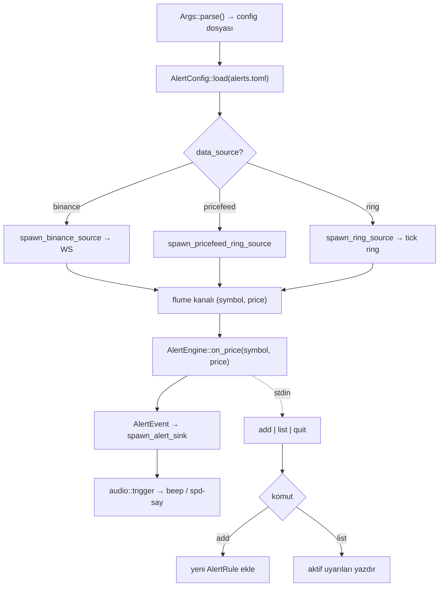
```mermaid
flowchart TD
  A["Args::parse() → config dosyası"] --> B["AlertConfig::load(alerts.toml)"]
  B --> C{"data_source?"}
  C -->|"binance"| D["spawn_binance_source → WS"]
  C -->|"pricefeed"| E["spawn_pricefeed_ring_source"]
  C -->|"ring"| F["spawn_ring_source → tick ring"]
  D --> G["flume kanalı (symbol, price)"]
  E --> G
  F --> G
  G --> H["AlertEngine::on_price(symbol, price)"]
  H --> I["AlertEvent → spawn_alert_sink"]
  I --> J["audio::trigger → beep / spd-say"]
  H -.->|"stdin"| K["add | list | quit"]
  K --> L{"komut"}
  L -->|"add"| M["yeni AlertRule ekle"]
  L -->|"list"| N["aktif uyarıları yazdır"]
```

### `alert-service/src/engine.rs`
**Detaylı açıklama:** Fiyat akışını her sembol için saklanan `Runtime` durumu (Armed/Triggered, son tetikleme zamanı, taraf) üzerinden değerlendirir. `Above`/`Below`/`Touch` koşulları tolerans bantlarıyla re-arm edilir (hedefin ötesinde kalınca tekrar kurulmaz), `Cross` koşulu ise fiyatın hedefin alt/üst taraf değişimini yakalar. Koşul sağlandığında cooldown kontrolünden geçen uyarı `AlertEvent` olarak flume kanalına basılır; `spawn_alert_sink` bu kanalı dinleyip `audio::trigger` çağırır. `repeat=false` kurallar tek seferliktir.
**Neden kullandık:**
- Tolerans + cooldown + re-arm mantığı tetikleyiciyi stabilize eder (takılmadan yeniden kurulum)
- `HashMap<usize, Runtime>` ile her kuralın durumunu ayrı saklar, kanal üzerinden düşük gecikme sağlar
- Event tabanlı çıktı, ses katmanını motorun dışına taşır (spawn_alert_sink ayrı thread)

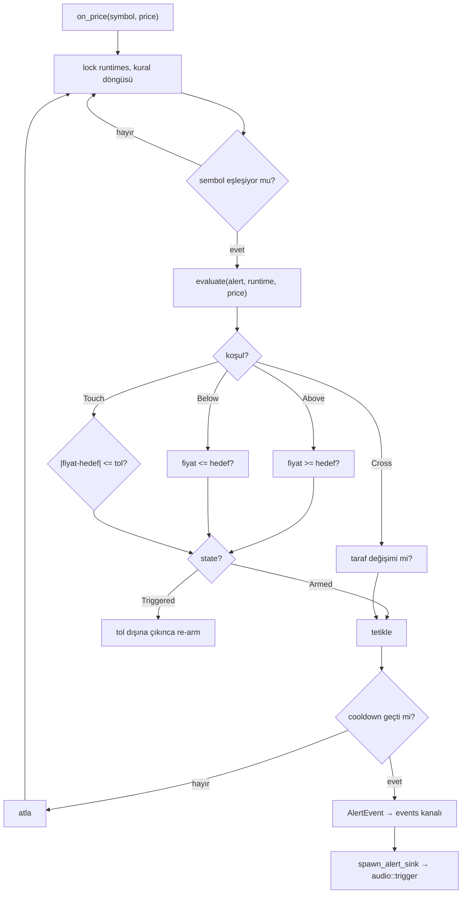
```mermaid
flowchart TD
  A["on_price(symbol, price)"] --> B["lock runtimes, kural döngüsü"]
  B --> C{"sembol eşleşiyor mu?"}
  C -->|"hayır"| B
  C -->|"evet"| D["evaluate(alert, runtime, price)"]
  D --> E{"koşul?"}
  E -->|"Above"| F["fiyat >= hedef?"]
  E -->|"Below"| G["fiyat <= hedef?"]
  E -->|"Touch"| H{"|fiyat-hedef| <= tol?"}
  E -->|"Cross"| I["taraf değişimi mi?"]
  F --> J{"state?"}
  J -->|"Armed"| K["tetikle"]
  J -->|"Triggered"| L["tol dışına çıkınca re-arm"]
  G --> J
  H --> J
  I --> K
  K --> M{"cooldown geçti mi?"}
  M -->|"hayır"| N["atla"]
  M -->|"evet"| O["AlertEvent → events kanalı"]
  O --> P["spawn_alert_sink → audio::trigger"]
  N --> B
```

### `alert-service/src/source.rs`
**Detaylı açıklama:** Üç farklı veri kaynağı sunar. `spawn_ring_source` DATA terminalinin tick ring'ini, `spawn_pricefeed_ring_source` price-feed servisinin ring'ini spin-loop ile okuyup `contracts::wire::decode` ile çözer ve `Trade`/`BookTicker`/`FundingRate` olaylarını `(symbol, price)` çiftine indirger. `spawn_binance_source` ise bağımsız çalışmak için Binance Futures WS'ine abone olur. `is_ring_alive` veri geldiğini doğrular; overwrite durumunda cursor üreticinin konumuna taşınır (takılma yok).
**Neden kullandık:**
- Tek veri kaynağı yapısıyla hem mevcut terminal verisine hem doğrudan borsaya bağlanabilmek
- Zero-copy ring okuma + binary decode ile gerçek zamanlı, düşük gecikmeli akış
- FundigRate'tan mark+index, BookTicker'dan best bid/ask seçimini tek noktada yönetir

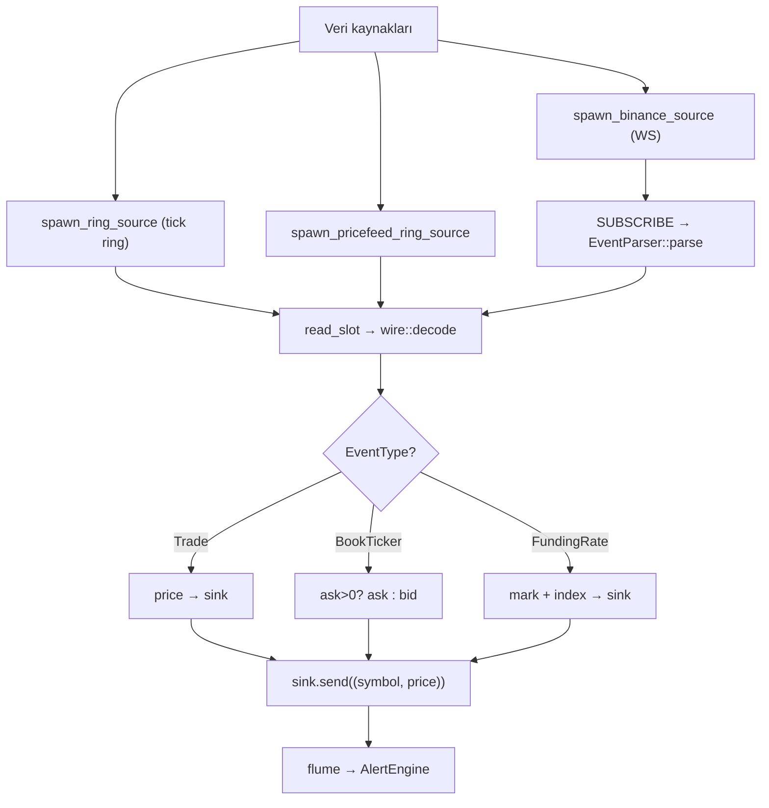
```mermaid
flowchart TD
  A["Veri kaynakları"] --> B["spawn_ring_source (tick ring)"]
  A --> C["spawn_pricefeed_ring_source"]
  A --> D["spawn_binance_source (WS)"]
  B --> E["read_slot → wire::decode"]
  C --> E
  D --> F["SUBSCRIBE → EventParser::parse"]
  F --> E
  E --> G{"EventType?"}
  G -->|"Trade"| H["price → sink"]
  G -->|"BookTicker"| I["ask>0? ask : bid"]
  G -->|"FundingRate"| J["mark + index → sink"]
  H --> K["sink.send((symbol, price))"]
  I --> K
  J --> K
  K --> L["flume → AlertEngine"]
```

### `alert-service/src/config.rs`
**Detaylı açıklama:** TOML yapılandırmasını `serde` ile `AlertConfig`/`AlertRule`/`Condition` tiplerine dönüştürür. Koşullar lowercase enum (above/below/cross/touch), kural alanları için tolerans, cooldown, repeat varsayılanları sağlar; `unique_symbols` abone listesi için sembolleri tekil olarak çıkarır.

### `alert-service/src/audio.rs`
**Detaylı açıklama:** Uyarıyı sese dönüştürür. `voice` metni varsa `spd-say -w -l tr` ile okutur, yoksa Microsoft bildirim tonlarını (G6–E6–G6) örnekleyip WAV başlığı ile /tmp'e yazıp `paplay` ile çalar; komutlar env değişkenleriyle özelleştirilebilir. Konsola zaman damgalı tetikleme satırı basar.

### `calc-ind/src/main.rs`
**Detaylı açıklama:** Axum ile `POST /api/calc` ve `GET /api/health` sunar. İstekteki sembol/interval/aralık için `BinanceClient::fetch_klines_range` ile (maks. 1000) mum çeker, `indicators::calc_indicator` ile hesaplar. `next_id` ile üretilen `request_id` altında `CalcResult`'ı binary JSON olarak `/dev/shm/cycle_finance_calc` ring'ine yazar ve `{request_id, count, series}` JSON'u döner.
**Neden kullandık:**
- Tüketiciler indikatörü kendi içinde değil tek merkezi serviste hesaplar (tek doğruluk kaynağı)
- Sonuç binary ring üzerinden yayınlanır; ağır JSON cevabı beklemeden tüketici ring'den okur

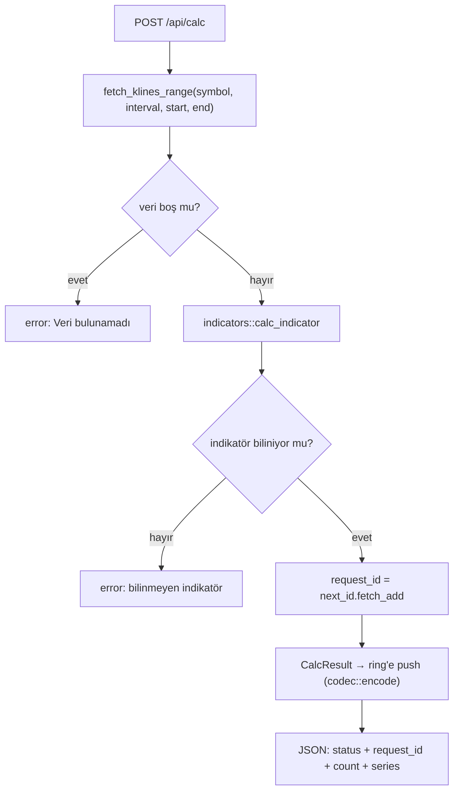
```mermaid
flowchart TD
  A["POST /api/calc"] --> B["fetch_klines_range(symbol, interval, start, end)"]
  B --> C{"veri boş mu?"}
  C -->|"evet"| D["error: Veri bulunamadı"]
  C -->|"hayır"| E["indicators::calc_indicator"]
  E --> F{"indikatör biliniyor mu?"}
  F -->|"hayır"| G["error: bilinmeyen indikatör"]
  F -->|"evet"| H["request_id = next_id.fetch_add"]
  H --> I["CalcResult → ring'e push (codec::encode)"]
  I --> J["JSON: status + request_id + count + series"]
```

### `calc-ind/src/indicators.rs`
**Detaylı açıklama:** `ferro_ta_core` üzerindeki ince dispatch katmanıdır. Kline'ları f64 serilerine çevirir, `HashMap<String,f64>` parametreleri (period, nbdev vb.) varsayılanlarla birleştirir ve indikatör adına göre overlap (sma/ema/wma/macd/bbands), momentum (rsi/stoch/mom/roc), statistic (stddev), volatility (atr) veya özel vwap hesaplar. Warm-up NaN'ları `None`'a çevrilerek seri içinde korunur; bilinmeyen ad için `Err` döner.
**Neden kullandık:**
- `Option<f64>` taşıma ile warm-up dönemlerini JSON'da `null` olarak net biçimde ifade eder
- Params üzerinden periyot/band parametrelerini esnek ayarlamaya izin verir
- ferro_ta_core'un tek kütüphanesini tek noktadan soyutlar, servis bağımlılığını azaltır

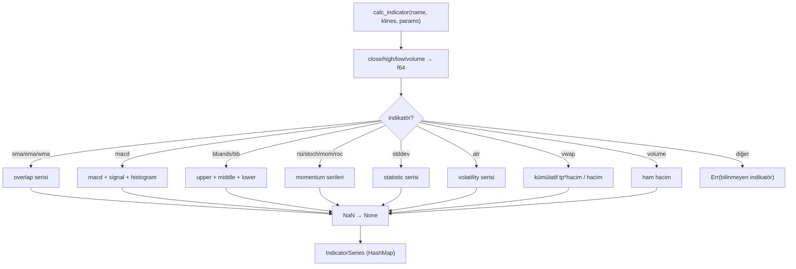
```mermaid
flowchart TD
  A["calc_indicator(name, klines, params)"] --> B["close/high/low/volume → f64"]
  B --> C{"indikatör?"}
  C -->|"sma/ema/wma"| D["overlap serisi"]
  C -->|"macd"| E["macd + signal + histogram"]
  C -->|"bbands/bb"| F["upper + middle + lower"]
  C -->|"rsi/stoch/mom/roc"| G["momentum serileri"]
  C -->|"stddev"| H["statistic serisi"]
  C -->|"atr"| I["volatility serisi"]
  C -->|"vwap"| J["kümülatif tp*hacim / hacim"]
  C -->|"volume"| K["ham hacim"]
  D --> L["NaN → None"]
  E --> L
  F --> L
  G --> L
  H --> L
  I --> L
  J --> L
  K --> L
  L --> M["IndicatorSeries (HashMap)"]
  C -->|"diğer"| N["Err(bilinmeyen indikatör)"]
```

### `calc-ind/src/lib.rs`
**Detaylı açıklama:** Tüketici tarafı client katmanıdır. `IndRequest`/`CalcKline`/`CalcResult` veri tiplerini tanımlar; `codec` modülü sonucu binary JSON olarak encode/decode eder; `client` modülü `request` ile HTTP'den `request_id` alır, `read_result` ile `CalcRingBuffer` head'inden geriye doğru tarayıp eşleşen sonucu (retry ile) çözer.
**Neden kullandık:**
- Üretici/tüketiciyi ring üzerinden asimetrik şekilde ayırır (servis yanıtını beklemeden oku)
- `read_result` head'ten geriye tarama + retry ile üreticinin gecikmesini tolere eder

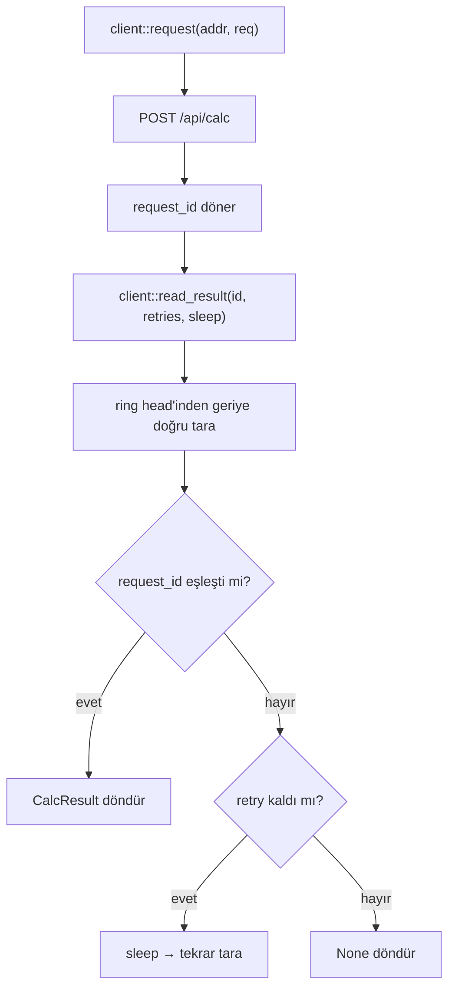
```mermaid
flowchart TD
  A["client::request(addr, req)"] --> B["POST /api/calc"]
  B --> C["request_id döner"]
  C --> D["client::read_result(id, retries, sleep)"]
  D --> E["ring head'inden geriye doğru tara"]
  E --> F{"request_id eşleşti mi?"}
  F -->|"evet"| G["CalcResult döndür"]
  F -->|"hayır"| H{"retry kaldı mı?"}
  H -->|"evet"| I["sleep → tekrar tara"]
  H -->|"hayır"| J["None döndür"]
```

### `calc-ind/examples/read_ring.rs`
**Detaylı açıklama:** Örnek tüketici: BTCUSDT 1h için RSI isteği atar, `read_result` ile sonucu ring'den okur ve serilerin uzunluğu ile ilk geçerli değeri yazdırır.

### `detect-ms/src/main.rs`
**Detaylı açıklama:** MSMP 2.0 motorunun HTTP girişidir. `GET /api/ms` ile sembol/interval/limit alır; Core (limit), Amplified (limit×4, max 1500) ve Acute (96) olmak üzere üç zaman penceresi için Binance'ten kline çeker. `narrative::generate_report` ile 7 katmanı çalıştırıp `MSMPReport` üretir ve JSON olarak döner; veri boşsa hata yanıtı verir.
**Neden kullandık:**
- Üç pencere aynı endpoint'ten beslenir; müşteri tek istekle kapsamlı rapor alır
- Motor modüler modül yapısıyla (session..narrative) sırayla ve bağımsız test edilebilir

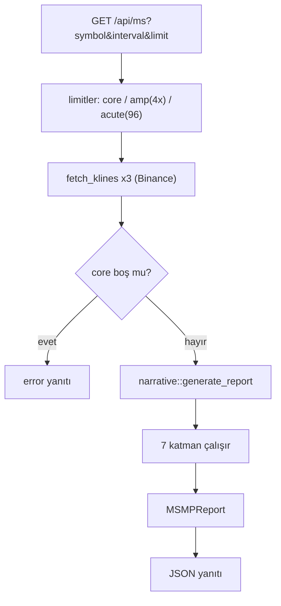
```mermaid
flowchart TD
  A["GET /api/ms?symbol&interval&limit"] --> B["limitler: core / amp(4x) / acute(96)"]
  B --> C["fetch_klines x3 (Binance)"]
  C --> D{"core boş mu?"}
  D -->|"evet"| E["error yanıtı"]
  D -->|"hayır"| F["narrative::generate_report"]
  F --> G["7 katman çalışır"]
  G --> H["MSMPReport"]
  H --> I["JSON yanıtı"]
```

### `detect-ms/src/pivot.rs`
**Detaylı açıklama:** ATR(14)'ü (ilk basit ortalama + EMA smoothing) hesaplar; swing eşiği ATR×0.25 olur. 3 mumluk pencerede Tip A (wick bazlı, high/low) ve Tip B (close bazlı) swing high/low pivotlarını ayrı ayrı çıkarır. Aynı mum indeksindeki farklı tip pivotlar arası fark ATR×0.05'i aşarsa "Likidite Oluşum Bölgesi" (A+ güven) olarak işaretler.
**Neden kullandık:**
- Eşik ATR'ye bağlandığından pivot tespiti volatiliteye dinamik uyum sağlar
- Wick ve close tiplerinin ayrıştırılması likidite süpürme bölgelerini çıkarmayı mümkün kılar

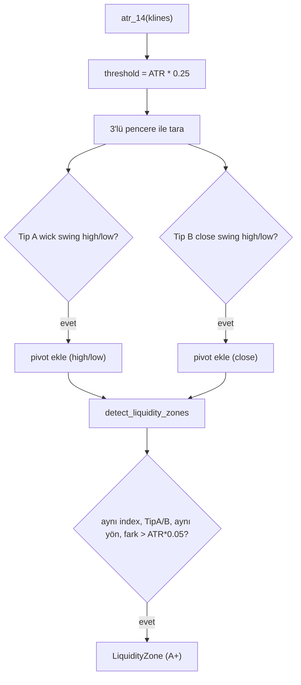
```mermaid
flowchart TD
  A["atr_14(klines)"] --> B["threshold = ATR * 0.25"]
  B --> C["3'lü pencere ile tara"]
  C --> D{"Tip A wick swing high/low?"}
  D -->|"evet"| E["pivot ekle (high/low)"]
  C --> F{"Tip B close swing high/low?"}
  F -->|"evet"| G["pivot ekle (close)"]
  E --> H["detect_liquidity_zones"]
  G --> H
  H --> I{"aynı index, TipA/B, aynı yön, fark > ATR*0.05?"}
  I -->|"evet"| J["LiquidityZone (A+)"]
```

### `detect-ms/src/trend.rs`
**Detaylı açıklama:** Son 50 mumun log-fiyatlarında OLS regresyonu ile slope, intercept ve R² hesaplar; log-return serisi üzerinde R/S analiziyle Hurst üssünü çıkarır. Nihai trend skoru `(price_slope / ATR) × 10 × R²` formülüyle -10..+10 aralığına kırpılır; Hurst'a göre Kalıcı Trend (H>0.6), Ortalama Dönüş (H<0.4) veya Belirsiz etiketi verilir.
**Neden kullandık:**
- R² ile trend gücünü, Hurst ile trend kalıcılığını birleştirip iki boyutlu yargı üretir
- ATR normalizasyonu farklı fiyat seviyelerinde karşılaştırılabilir skor sağlar

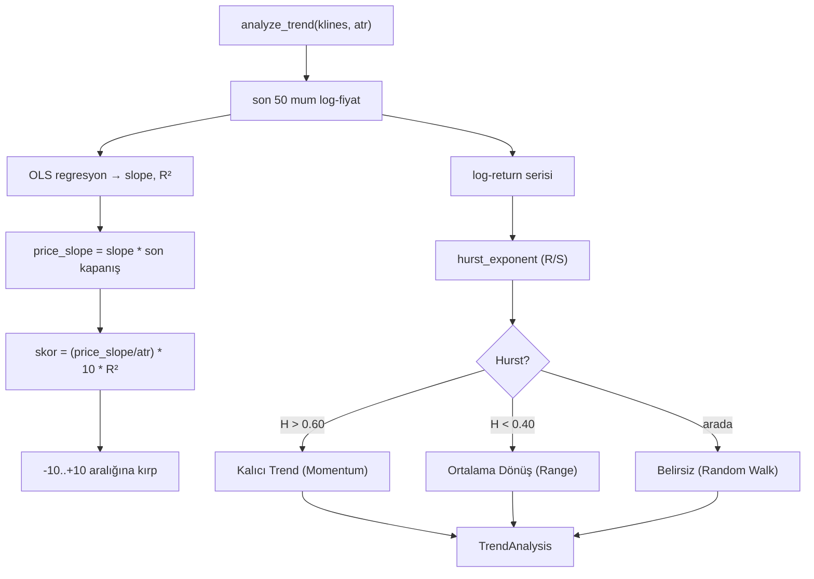
```mermaid
flowchart TD
  A["analyze_trend(klines, atr)"] --> B["son 50 mum log-fiyat"]
  B --> C["OLS regresyon → slope, R²"]
  B --> D["log-return serisi"]
  D --> E["hurst_exponent (R/S)"]
  C --> F["price_slope = slope * son kapanış"]
  F --> G["skor = (price_slope/atr) * 10 * R²"]
  G --> H["-10..+10 aralığına kırp"]
  E --> I{"Hurst?"}
  I -->|"H > 0.60"| J["Kalıcı Trend (Momentum)"]
  I -->|"H < 0.40"| K["Ortalama Dönüş (Range)"]
  I -->|"arada"| L["Belirsiz (Random Walk)"]
  J --> M["TrendAnalysis"]
  K --> M
  L --> M
```

### `detect-ms/src/levels.rs`
**Detaylı açıklama:** Pivotlara üssel zaman çürümesi uygular (W(t)=e^(-0.015t), ~46 mumda yarı değer). Her seviye için kapanış bazlı savunma sayısı (%0.1 tolerans), wick ile süpürülme ve 2 ardışık kapanışla Breakout onayı kontrol eder. Savunulmuş (10), Süpürülmüş+BO (9), Onaylanmamış OB/FVG (8−W(t)), Yeni (7) sınıflarına ayırır ve `priority = base × decay × 10` ile 0-100 puanlayıp sıralar.
**Neden kullandık:**
- Üssel çürüme eski seviyelerin önemini zamanla azaltarak güncel envanter üretir
- Süpürme + BO onayı ikilisi, iptal edilen vs. gerçek kırılan seviyeyi ayırt eder

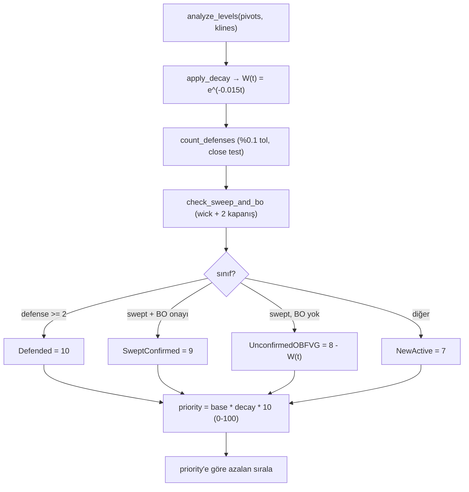
```mermaid
flowchart TD
  A["analyze_levels(pivots, klines)"] --> B["apply_decay → W(t) = e^(-0.015t)"]
  B --> C["count_defenses (%0.1 tol, close test)"]
  C --> D["check_sweep_and_bo (wick + 2 kapanış)"]
  D --> E{"sınıf?"}
  E -->|"defense >= 2"| F["Defended = 10"]
  E -->|"swept + BO onayı"| G["SweptConfirmed = 9"]
  E -->|"swept, BO yok"| H["UnconfirmedOBFVG = 8 - W(t)"]
  E -->|"diğer"| I["NewActive = 7"]
  F --> J["priority = base * decay * 10 (0-100)"]
  G --> J
  H --> J
  I --> J
  J --> K["priority'e göre azalan sırala"]
```

### `detect-ms/src/liquidity.rs`
**Detaylı açıklama:** Tipik fiyat üzerinden hacim ağırlıklı VWAP ve VWAP standart sapmasını (σ) hesaplar; fiyat aralığını 50 dinamik bucket'a bölüp her mumun hacmini kapsadığı bucket'lara orantılı dağıtır (volume profile). Hacmi medyanın 1.5 katı üzerindeki bucket'lar HVN, diğerleri LVN'dir; POC en yüksek hacimli bucket ortasıdır. Güncel fiyata göre +1.5σ..+3σ HVN'ler BSL, -3σ..-1.5σ HVN'ler SSL olarak ayrılır ve BSL/SSL oranı ile volatilite bandı (POC±1.5σ) çıkar.
**Neden kullandık:**
- Bucket bazlı dağılım fiyat yüzeyi yerine gerçek hacim yoğunluğunu gösterir
- σ referanslı BSL/SSL bölgeleri kurumsal likidite havuzlarının yönünü gösterir

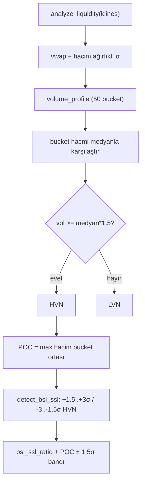
```mermaid
flowchart TD
  A["analyze_liquidity(klines)"] --> B["vwap + hacim ağırlıklı σ"]
  B --> C["volume_profile (50 bucket)"]
  C --> D["bucket hacmi medyanla karşılaştır"]
  D --> E{"vol >= medyan*1.5?"}
  E -->|"evet"| F["HVN"]
  E -->|"hayır"| G["LVN"]
  F --> H["POC = max hacim bucket ortası"]
  H --> I["detect_bsl_ssl: +1.5..+3σ / -3..-1.5σ HVN"]
  I --> J["bsl_ssl_ratio + POC ± 1.5σ bandı"]
```

### `detect-ms/src/imbalance.rs`
**Detaylı açıklama:** Ardışık 3 mumun gölgeleri çakışmazsa FVG tespit eder: `prev.high < next.low` → Bullish, `prev.low > next.high` → Bearish. `candle_delta = taker_buy − (volume − taker_buy)` formülüyle her mumun delta'sını ve 3 mumluk bölge deltasını hesaplar; delta işareti FVG yönüyle uyumluysa ActiveAbsorber (delta onaylı çekim), değilse PassiveGap (dolgu) etiketi verir.
**Neden kullandık:**
- FVG'yi yalnız görsel değil, emir akışı (delta) ile doğrulayarak önceliklendirir
- `cumulative_delta` serisi trend emilimini izlemeye yarar

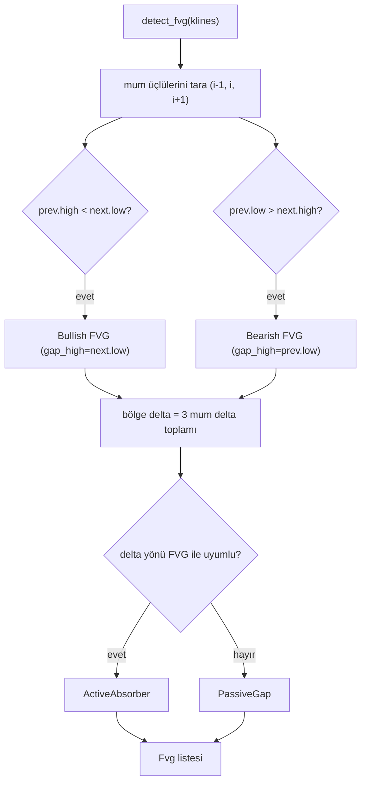
```mermaid
flowchart TD
  A["detect_fvg(klines)"] --> B["mum üçlülerini tara (i-1, i, i+1)"]
  B --> C{"prev.high < next.low?"}
  C -->|"evet"| D["Bullish FVG (gap_high=next.low)"]
  B --> E{"prev.low > next.high?"}
  E -->|"evet"| F["Bearish FVG (gap_high=prev.low)"]
  D --> G["bölge delta = 3 mum delta toplamı"]
  F --> G
  G --> H{"delta yönü FVG ile uyumlu?"}
  H -->|"evet"| I["ActiveAbsorber"]
  H -->|"hayır"| J["PassiveGap"]
  I --> K["Fvg listesi"]
  J --> K
```

### `detect-ms/src/narrative.rs`
**Detaylı açıklama:** 7 katmanı tek `generate_report` içinde orkestre eder: pivot+ATR+likidite bölgeleri, üç pencerenin ayrı trend analizi, ağırlıklı ATS skoru ve confluence index, stratejik seviyeler, likidite analizi, FVG+delta ve son olarak en yüksek manyetik skorlu "vakum bölgesi" (savunma skoru + hacim yoğunluğu × delta çarpanı). İlk 20 seviyeyi pivot matrisine dönüştürüp `MSMPReport` olarak döner.
**Neden kullandık:**
- Tüm katmanların sonuçlarını tek yapıda toplayarak tüketiciye bütünsel rapor verir
- Vakum bölgesi, savunma/hacim/delta üçlüsünü tek skorda birleştirir

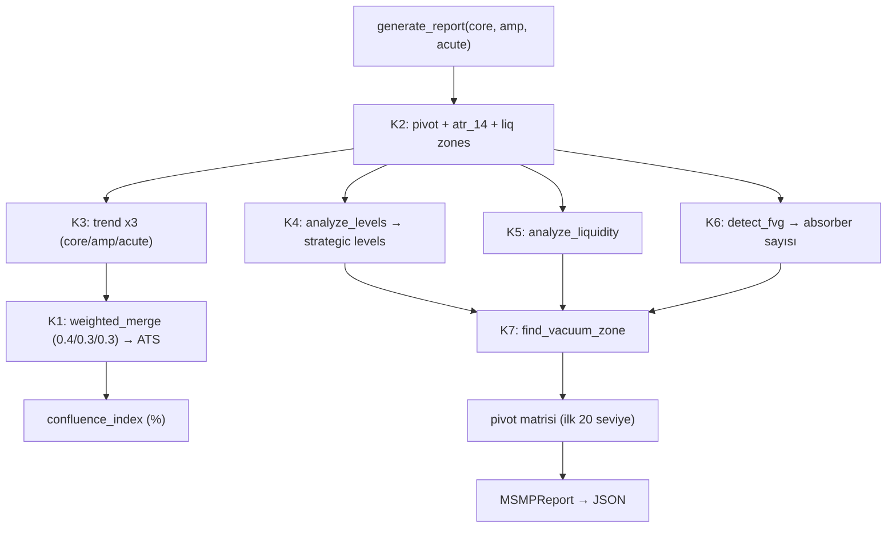
```mermaid
flowchart TD
  A["generate_report(core, amp, acute)"] --> B["K2: pivot + atr_14 + liq zones"]
  B --> C["K3: trend x3 (core/amp/acute)"]
  C --> D["K1: weighted_merge (0.4/0.3/0.3) → ATS"]
  D --> E["confluence_index (%)"]
  B --> F["K4: analyze_levels → strategic levels"]
  B --> G["K5: analyze_liquidity"]
  B --> H["K6: detect_fvg → absorber sayısı"]
  F --> I["K7: find_vacuum_zone"]
  G --> I
  H --> I
  I --> J["pivot matrisi (ilk 20 seviye)"]
  J --> K["MSMPReport → JSON"]
```

### `detect-ms/src/session.rs`
**Detaylı açıklama:** Seans bazlı zaman pencerelerini tanımlar: Core (5 gün/120 saat, %40), Amplified (20 gün/480 saat, %30), Acute (24 saat, %30). UTC 08:00-16:00 aktif işlem seansını tespit eder (içindeki mumlara 1.0, dışına 0.5 ağırlık) ve `weighted_merge` ile üç skoru ağırlıklı ortalama yapar; `confluence_index` üç pencerenin işaret uyumunu yüzdeye çevirir.
**Neden kullandık:**
- Sabit mum sayısı yerine aktif seans saatlerini kullanarak likidite yoğun zamanları öne çıkarır
- ATS ve confluence, tek pencere yanılmasına karşı sağlam birleşik yargı üretir

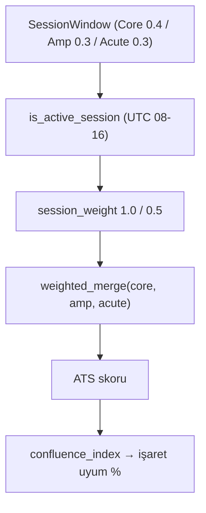
```mermaid
flowchart TD
  A["SessionWindow (Core 0.4 / Amp 0.3 / Acute 0.3)"] --> B["is_active_session (UTC 08-16)"]
  B --> C["session_weight 1.0 / 0.5"]
  C --> D["weighted_merge(core, amp, acute)"]
  D --> E["ATS skoru"]
  E --> F["confluence_index → işaret uyum %"]
```

### `exec-console/src/main.rs`
**Detaylı açıklama:** Execution Engine REST API'sine (varsayılan :3010) bağlanan interaktif REPL konsoludur. `Console::new` login yapar ve JWT token alır; `call` her istekte Bearer token kullanır, 401 alırsa otomatik yeniden login edip bir kez tekrar dener. Komutlar `dispatch` ile dağıtılır: emir (order/buy/sell/batch), pozisyon kapatma, iptal/modify, leverage/margintype/margin, kill switch, hedge, hesap/bakiye ve borsa sorguları (funding, income, exinfo, commission). Çıktılar `fmt_*` yardımcılarıyla tablo haline getirilir.
**Neden kullandık:**
- Emirler doğrudan Binance'e değil, executiond'nin preflight/risk katmanından geçer (güvenlik)
- Komutların geniş kapsamı operatörün tüm motoru tek konsoldan yönetmesini sağlar
- Otomatik token yenileme oturum düşmesini tolere eder

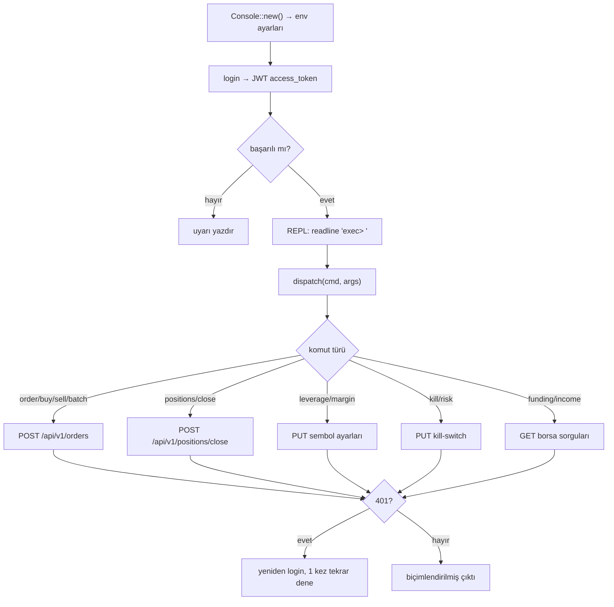
```mermaid
flowchart TD
  A["Console::new() → env ayarları"] --> B["login → JWT access_token"]
  B --> C{"başarılı mı?"}
  C -->|"hayır"| D["uyarı yazdır"]
  C -->|"evet"| E["REPL: readline 'exec> '"]
  E --> F["dispatch(cmd, args)"]
  F --> G{"komut türü"}
  G -->|"order/buy/sell/batch"| H["POST /api/v1/orders"]
  G -->|"positions/close"| I["POST /api/v1/positions/close"]
  G -->|"leverage/margin"| J["PUT sembol ayarları"]
  G -->|"kill/risk"| K["PUT kill-switch"]
  G -->|"funding/income"| L["GET borsa sorguları"]
  H --> M{"401?"}
  I --> M
  J --> M
  K --> M
  L --> M
  M -->|"evet"| N["yeniden login, 1 kez tekrar dene"]
  M -->|"hayır"| O["biçimlendirilmiş çıktı"]
```

### `ohlcv-engine/src/lib.rs`
**Detaylı açıklama:** Binance Futures klines API'sinin 11 alanlı `Kline` veri yapısını (open_time, OHLC, volume, close_time, quote_volume, trades, taker buy hacimleri) tanımlar ve `client` modülünü dışa açar; tüm HFT servislerinin ortak veri modelidir.

### `ohlcv-engine/src/client.rs`
**Detaylı açıklama:** `BinanceClient`, `reqwest` ile fapi.binance.com'dan kline çeker. `fetch_klines` son `limit` mumu, `fetch_klines_range` ise opsiyonel start/end milisaniye aralığını döner. JSON dizilerini (en az 11 öğe) `Kline`'a çevirir; sayısal alanlar `Decimal::from_str` ile güvenli parse edilir, sıfırlanamayanlar 0'a düşer.
**Neden kullandık:**
- Tek client ile hem calc-ind, detect-ms, stream-ohlcv ve server aynı veri modelini kullanır
- `rust_decimal` ile parse, kayan nokta hatası olmadan fiyat hassasiyeti korur

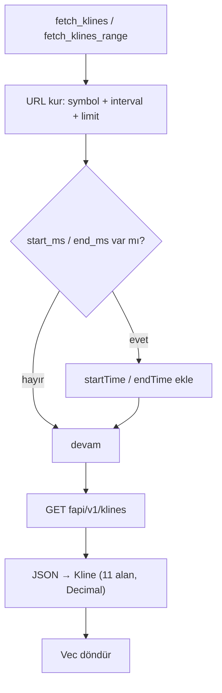
```mermaid
flowchart TD
  A["fetch_klines / fetch_klines_range"] --> B["URL kur: symbol + interval + limit"]
  B --> C{"start_ms / end_ms var mı?"}
  C -->|"evet"| D["startTime / endTime ekle"]
  C -->|"hayır"| E["devam"]
  D --> E
  E --> F["GET fapi/v1/klines"]
  F --> G["JSON → Kline (11 alan, Decimal)"]
  G --> H["Vec<Kline> döndür"]
```

### `ohlcv-engine/src/bin/server.rs`
**Detaylı açıklama:** OHLCV verisini HTTP üzerinden proxy'leyen küçük Axum sunucusudur. `GET /api/klines?symbol&interval&limit` isteğini `BinanceClient` ile Binance'e iletir ve `{status, symbol, interval, count, data}` JSON'u döner; hata durumunda `status:error` ile döner. :3000 portunda dinler.
**Neden kullandık:**
- Ring/WS olmayan tüketiciler için HTTP üzerinden OHLCV erişimi sağlar
- Binance anahtarsız genel uçtan veri çekimini tek noktadan merkezileştirir

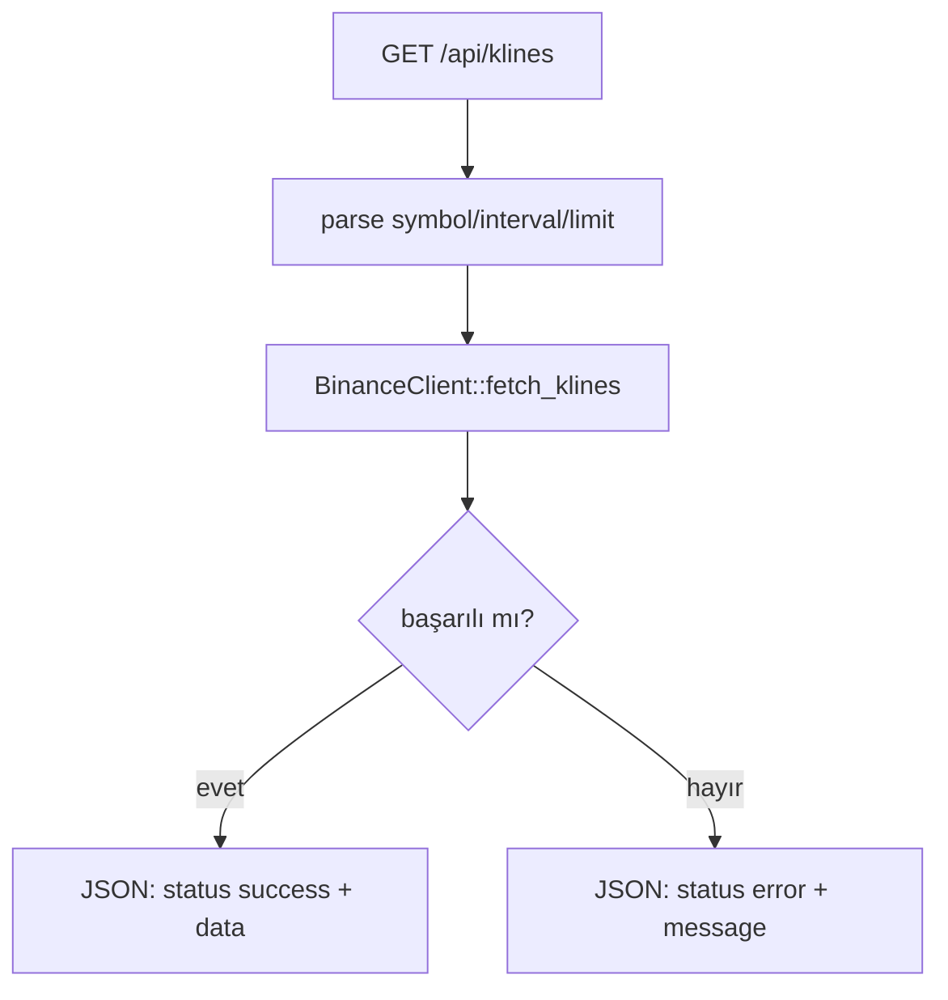
```mermaid
flowchart TD
  A["GET /api/klines"] --> B["parse symbol/interval/limit"]
  B --> C["BinanceClient::fetch_klines"]
  C --> D{"başarılı mı?"}
  D -->|"evet"| E["JSON: status success + data"]
  D -->|"hayır"| F["JSON: status error + message"]
```

### `ohlcv-engine/src/bin/cli.rs`
**Detaylı açıklama:** Terminal radarı adındaki CLI aracıdır. `clap` ile sembol (varsayılan VELVETUSDT), interval (1h) ve limit (10) alır; çekilen her mum için yerel saat, boğa/ayı emojisi, değişim ve değişim %'sini satır satır yazdırır. Hızlı veri kontrolü ve demo amaçlıdır.
**Neden kullandık:**
- Ring/API olmadan bağımsız doğrulama ve hızlı görsel kontrol sağlar
- `chrono` ile mum zamanlarını yerel saate çevirir

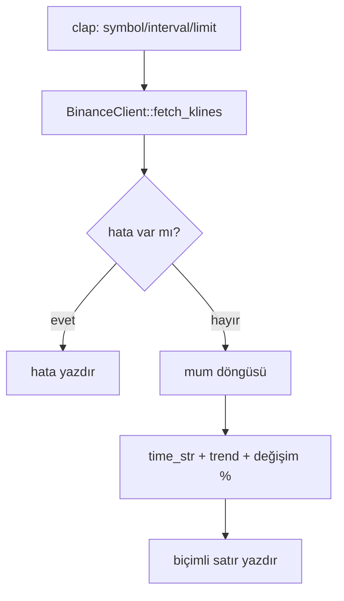
```mermaid
flowchart TD
  A["clap: symbol/interval/limit"] --> B["BinanceClient::fetch_klines"]
  B --> C{"hata var mı?"}
  C -->|"evet"| D["hata yazdır"]
  C -->|"hayır"| E["mum döngüsü"]
  E --> F["time_str + trend + değişim %"]
  F --> G["biçimli satır yazdır"]
```

### `paper-service/src/main.rs`
**Detaylı açıklama:** Servis başlatıcısıdır. Sled WAL event store'unu açar ve replay eder; `--features full` ise PostgreSQL'e bağlanmaya çalışır (başarısızsa Sled yedekli kalır). Tek `DomainEvent` kanalını Sled + PG + SQLite projection'a bağlayan tüketici task'ını kurar; `PaperEngineActor`'ı kurulmuş event'lerle başlatır. Argon2 hash'li admin şifresi ve JWT secret ile auth durumunu hazırlar, idempotency cache + `EngineHandle` ile REST API'yi :8080'de açar ve `bridge::spawn_ring_bridge` ile DATA/STRATEGY ring'lerine bağlanır.
**Neden kullandık:**
- Tüm kalıcılık tek event akışından beslenir (WAL/PG/SQLite tutarlılığı tek kaynaktan)
- Event replay ile çökme kurtarma sağlanır; actor snapshot'ı okuma yolunu hızlandırır
- API/actor/kalıcılık katmanlarını net görevlerle ayırır

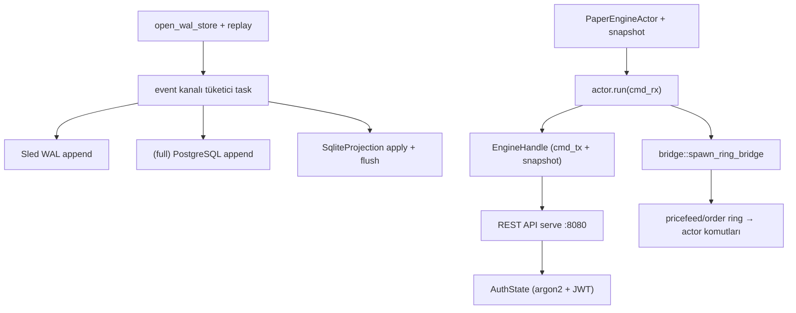
```mermaid
flowchart TD
  A["open_wal_store + replay"] --> B["event kanalı tüketici task"]
  B --> C["Sled WAL append"]
  B --> D["(full) PostgreSQL append"]
  B --> E["SqliteProjection apply + flush"]
  F["PaperEngineActor + snapshot"] --> G["actor.run(cmd_rx)"]
  G --> H["EngineHandle (cmd_tx + snapshot)"]
  H --> I["REST API serve :8080"]
  I --> J["AuthState (argon2 + JWT)"]
  G --> K["bridge::spawn_ring_bridge"]
  K --> L["pricefeed/order ring → actor komutları"]
```

### `paper-service/src/api.rs`
**Detaylı açıklama:** Axum REST katmanıdır. `/api/v1/auth/login` argon2 doğrulamasıyla access+refresh JWT üretir; tüm korumalı uçlar `auth_middleware` ile Bearer token doğrular. Emir yerleştirme `place_order`'da idempotency cache'ini önce kontrol eder, sonra `EngineHandle::submit_order` ile actor'e oneshot kanal üzerinden komut gönderir ve ack'ı önbelleğe yazar. Okuma uçları (balance, positions, orders, trade-history, liquidation) paylaşılan snapshot'tan beslenir; `/metrics` Prometheus metriklerini döner. `--features https` + TLS sertifikası ile HTTPS sunabilir.
**Neden kullandık:**
- Yazma komutları actor'e, okumalar snapshot'a yönlendirilerek CQRS benzeri ayrım sağlanır
- Idempotency, aynı client_order_id'nin tekrar işlenmesini önler (çift emir koruması)
- Argon2 + JWT + TLS seçenekleri ile güvenlik katmanı gerçek motora hazırdır

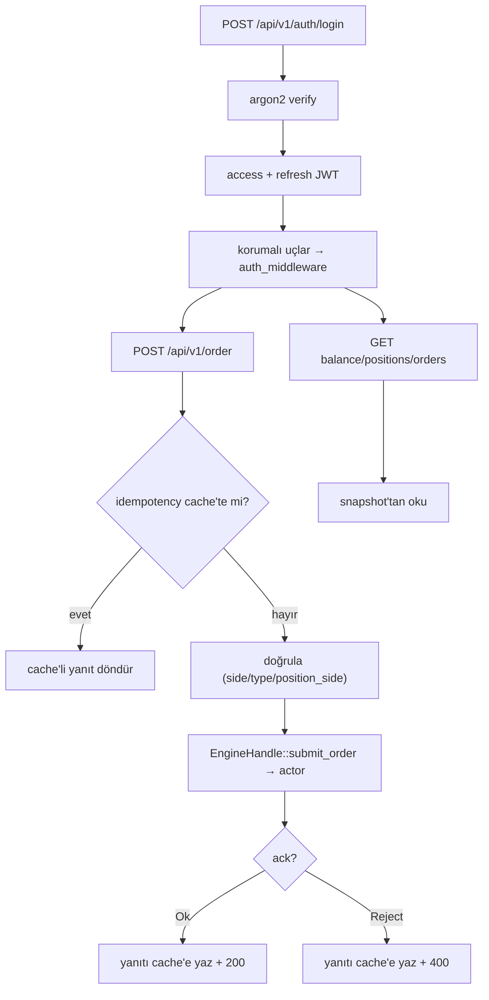
```mermaid
flowchart TD
  A["POST /api/v1/auth/login"] --> B["argon2 verify"]
  B --> C["access + refresh JWT"]
  C --> D["korumalı uçlar → auth_middleware"]
  D --> E["POST /api/v1/order"]
  E --> F{"idempotency cache'te mi?"}
  F -->|"evet"| G["cache'li yanıt döndür"]
  F -->|"hayır"| H["doğrula (side/type/position_side)"]
  H --> I["EngineHandle::submit_order → actor"]
  I --> J{"ack?"}
  J -->|"Ok"| K["yanıtı cache'e yaz + 200"]
  J -->|"Reject"| L["yanıtı cache'e yaz + 400"]
  D --> M["GET balance/positions/orders"]
  M --> N["snapshot'tan oku"]
```

### `paper-service/src/bridge.rs`
**Detaylı açıklama:** PAPER sistemini IPC ring'lerine bağlar. `spawn_pricefeed_reader`, `/cycle_finance_pricefeed` ring'ini spin-loop ile okuyup `Trade`/`BookTicker`/`FundingRate` olaylarını `ActorCommand::MarkPriceUpdate`'e çevirir (tek fiyat kaynağı mark price). `spawn_order_reader`, STRATEGY terminalinin order ring'ini okuyup `ActorCommand::SubmitOrder`'a çevirir ve oneshot yanıtı `blocking_recv` ile bekler. Her iki okuyucu ayrı thread'de çalışır.
**Neden kullandık:**
- Veri, terminal ile paper motoru arasında ring üzerinden zero-copy akar (düşük gecikme)
- Dolum/likidasyonun yalnızca mark price ile yapılması tek doğruluk kaynağı sağlar
- Ring overwrite'ında cursor ileri taşınır, okuyucu asla takılı kalmaz

```mermaid
flowchart TD
  A["spawn_ring_bridge"] --> B["spawn_pricefeed_reader"]
  A --> C["spawn_order_reader"]
  B --> D["pricefeed ring oku"]
  D --> E{"EventType"}
  E -->|"Trade"| F["MarkPriceUpdate"]
  E -->|"BookTicker"| G["ask/bid → MarkPriceUpdate"]
  E -->|"FundingRate"| H["mark + funding → MarkPriceUpdate"]
  F --> I["actor_tx.send"]
  G --> I
  H --> I
  C --> J["order ring oku"]
  J --> K["SubmitOrder (side/type/qty)"]
  K --> L["oneshot yanıt bekle"]
  L --> M["actor'e gönder"]
```

### `paper-service/src/events.rs`
**Detaylı açıklama:** Event sourcing katmanıdır. `EventStore` trait'i `append`/`replay`/`snapshot` tanımlar; `InMemoryEventStore` dev amaçlı, `SledEventStore` ise kalıcı WAL'dır (her event sıralı counter anahtarıyla diske yazılır, replay sıralı okur). `open_wal_store` path'i env'den alır, Sled açılamazsa in-memory'ye düşer. Actor state'i replay edilen `DomainEvent`'lerle yeniden inşa edilir.
**Neden kullandık:**
- Tüm state değişimini append-only log'a taşıyarak denetlenebilirlik sağlar
- Çökme sonrası replay ile bakiye/pozisyon tutarlı şekilde geri yüklenir
- Sled/Postgres/InMemory arasında değiştirilebilir soyutlama sunar

```mermaid
flowchart TD
  A["append(event)"] --> B["Sled: key=counter, value=JSON"]
  B --> C["counter++, __counter kaydet"]
  D["replay()"] --> E["iter + sırala"]
  E --> F["serde_json → Vec<DomainEvent>"]
  F --> G["actor state yeniden inşa"]
  H["open_wal_store"] --> I{"Sled açılabildi mi?"}
  I -->|"evet"| J["SledEventStore"]
  I -->|"hayır"| K["InMemoryEventStore"]
```

### `paper-service/src/idempotency.rs`
**Detaylı açıklama:** `client_order_id → CachedResponse` eşlemesiyle çift emir gönderimini önleyen soyutlama sunar. `IdempotencyCache` trait'i `get`/`set` tanımlar; `InMemoryIdempotencyCache` bunu `Mutex<HashMap>` ile uygular. `CachedResponse` hem HTTP durumunu hem yanıt gövdesini saklar; `--features full` altında Redis'e geçebilir.
**Neden kullandık:**
- Aynı isteğin tekrarı eski sonucu döndürür; operasyonel tekrar senaryolarını emniyete alır
- Yalın trait tasarımı in-memory → Redis geçişini kolaylaştırır

```mermaid
flowchart TD
  A["get(client_oid)"] --> B{"anahtar var mı?"}
  B -->|"evet"| C["CachedResponse döndür"]
  B -->|"hayır"| D["None"]
  E["set(client_oid, response)"] --> F["HashMap'e yaz"]
```

### `paper-service/src/metrics.rs`
**Detaylı açıklama:** Sıfır bağımlılıklı Prometheus metrik katmanıdır. `AtomicU64` sayaçları emir başarısı/başarısızlığı, likidasyon, funding ve dolumları izler; `render` bu sayaçları Prometheus text formatında (HELP/TYPE + değer) döner. `GET /metrics` bu çıktıyı servis eder.
**Neden kullandık:**
- Harici metrik kütüphanesine bağımlılık olmadan izlenebilirlik sağlar
- Atomik sayaçlar ile çok thread'li aktör ortamında güvenli artış garanti eder

```mermaid
flowchart TD
  A["record_order(success)"] --> B["order_place_total / failure++"]
  C["record_fill / liquidation / funding"] --> D["sayaç ++"]
  E["render(balance)"] --> F["Prometheus text (HELP/TYPE)"]
  F --> G["GET /metrics yanıtı"]
```

### `paper-service/src/postgres_store.rs`
**Detaylı açıklama:** `--features full` altında derlenen PostgreSQL event store'dur. `connect` `domain_events` ve `account_snapshots` tablolarını oluşturur; `append` event'i JSONB payload ile yazar, `replay(limit)` sıralı okur, `save_snapshot` her 1000 event'te bir son durumu saklar. Decimal'i NUMERIC'e `decimal_to_str` yardımcısıyla güvenli taşır.
**Neden kullandık:**
- Sled WAL'a ek olarak uzun ömürlü, sorgulanabilir kalıcılık sağlar
- Event payload'ı JSONB olduğundan şema değişmeden event versiyonlaması mümkündür

```mermaid
flowchart TD
  A["connect(database_url)"] --> B["CREATE TABLE domain_events"]
  B --> C["CREATE TABLE account_snapshots"]
  D["append(event)"] --> E["event_type + JSONB INSERT"]
  F["replay(limit)"] --> G["ORDER BY id ASC → payload"]
  H["save_snapshot(count, snap)"] --> I["INSERT account_snapshots"]
```

### `paper-service/src/sqlite_projection.rs`
**Detaylı açıklama:** Tek DomainEvent kanalından beslenen SQLite projection'dır. `apply` event'leri hafızada işler: OrderCreated → `paper_open_orders` satırı, OrderFilled → kalan açık miktar ve `paper_trades` satırı, OrderCancelled → açık miktar sıfır. `flush` bekleyen trade'leri ve açık emir setini tek transaction ile yazar (WAL + synchronous=NORMAL), `batch_interval_ms`'de periyodik çalışır — disk IO amorti edilir.
**Neden kullandık:**
- Yüksek hacimli event akışında batch'li tek transaction yazımı disk IO'yu azaltır
- Actor'a ayrı persist kanalı bırakmadan tek event kaynağından beslenir (basitlik + tutarlılık)

```mermaid
flowchart TD
  A["apply(event)"] --> B{"event türü"}
  B -->|"OrderCreated"| C["open row ekle"]
  B -->|"OrderFilled"| D["open_qty azalt + trade kaydet"]
  B -->|"OrderCancelled"| E["open_qty = 0"]
  B -->|"diğer"| F["yoksay"]
  C --> G["pending buffer"]
  D --> G
  E --> G
  G --> H["flush() → tek transaction"]
  H --> I["INSERT paper_trades"]
  H --> J["INSERT OR REPLACE paper_open_orders"]
```

### `paper-service/src/bin/paper_cli.rs`
**Detaylı açıklama:** PAPER REST API'si için `clap` tabanlı CLI'dır. `ApiClient` login ile JWT alır; `status` (bakiye/equity/PnL/risk), `positions` (açık pozisyonlar, ikonlu PnL), `history` (son işlemler), `liquidation` (sembolün likidasyon fiyatı) ve `order` (emir gönderme) komutlarını destekler. Çıktılar Türkçe biçimlendirilmiş satırlarla yazdırılır.
**Neden kullandık:**
- Operatörün API'yi elle test etmeden konsoldan yönetmesini sağlar
- Bearer token yönetimi ve hata yazdırma ile kullanım kolaylığı sunar

```mermaid
flowchart TD
  A["clap: api/user/password + komut"] --> B["login → token"]
  B --> C{"komut"}
  C -->|"status"| D["GET balance + health"]
  C -->|"positions"| E["GET positions"]
  C -->|"history"| F["GET trade-history"]
  C -->|"liquidation"| G["GET liquidation-price"]
  C -->|"order"| H["POST /order"]
  H --> I{"yanıtta error var mı?"}
  I -->|"evet"| J["reddedildi yazdır"]
  I -->|"hayır"| K["order_id + avg + qty"]
```

### `price-feed/src/main.rs`
**Detaylı açıklama:** Binance Futures WS'ten canlı fiyat daemon'udur. Sembolleri env/alerts.toml'dan çözer; `ws_pump` her sembol için `@trade` + `@bookTicker` stream'lerine abone olur ve ham mesajları bounded flume kuyruğuna basar (geri basınç). `ingest` thread'i `EventParser` ile çözüp `DataValidator`'dan geçirir, `contracts::wire` ile ring'e (`/cycle_finance_pricefeed`) yazar ve paylaşılan `FeedState`'i günceller. Ayrı bir task `premiumIndex` REST'ini 200ms'de çekerek mark/index'i tazeler; HTTP `GET /api/lastprice[/{symbol}]`, `/health` ve periyodik `/tmp/price_feed.json` çıktısı sunulur.
**Neden kullandık:**
- DATA terminaliyle aynı mimariyi (WS→parser→ring) bağımsız ring ile tekrarlayarak ortak fiyat kaynağı olur
- Bounded kuyruk + ring üzerinden sınırsız tampon riskini ortadan kaldırır
- mark/index/last/bid/ask'ı tek `PriceEntry`'de toplayarak alt servislere zengin fiyat sağlar

```mermaid
flowchart TD
  A["sembol listesi (env / alerts.toml)"] --> B["ws_pump → Binance WS subscribe"]
  B --> C["trade + bookTicker mesajları"]
  C --> D["bounded flume kuyruğu"]
  D --> E["ingest: EventParser + Validator"]
  E --> F["ring'e binary push (wire::encode)"]
  E --> G["update_state → FeedState"]
  G --> H["HTTP /api/lastprice"]
  G --> I["/tmp/price_feed.json (1sn)"]
  J["premiumIndex REST (200ms)"] --> G
  G --> K["mark / index / last / bid / ask"]
```

### `stream-ohlcv/src/main.rs`
**Detaylı açıklama:** Canlı OHLCV mum akışı üreten servistir. `POST /api/stream` ile `{symbol, start_ms, interval_secs}` alır; aynı anahtar için zaten stream varsa mevcut meta'yı döner, yoksa yeni `Stream` task'ı başlatır. `run_stream` önce interval ≥60s ise Binance'ten geçmişi sayfalar (maks 200×1000) ve kapanan mumları ring'e yayınlar; sonra price-feed'ten `last_price` çekerek canlı mumu oluşturur/günceller, bucket değişince kapanan mumu `closed=1` ile ring'e basar. `StreamRingBuffer`'a push'lar `ring_lock` ile seri hale getirilir; durdurma `AtomicBool` stop + task join ile olur.
**Neden kullandık:**
- 1sn altı interval desteği için Binance geçmişi değil canlı price-feed fiyatlarından mum üretir
- stream_id'li, dairesel ring yayını tüketicilerin cursor ile kolay takip etmesini sağlar
- Eşzamanlı stream'ler ayrı task'larda izole edilir; stop bayrağı temiz kapanma verir

```mermaid
flowchart TD
  A["POST /api/stream"] --> B{"aynı key'de stream var mı?"}
  B -->|"evet"| C["mevcut meta'yı döndür"]
  B -->|"hayır"| D["yeni stream_id + task başlat"]
  D --> E{"interval >= 60s?"}
  E -->|"evet"| F["fetch_history (pagination)"]
  F --> G["kapanan mumları ring'e yayınla"]
  E -->|"hayır"| H["atla"]
  G --> I["canlı döngü: fetch_last_price"]
  H --> I
  I --> J{"bucket değişti mi?"}
  J -->|"evet"| K["eski mumu closed=1 yayınla + yeni mum"]
  J -->|"hayır"| L["canlı mumu güncelle (high/low/close)"]
  K --> M["ring_lock → StreamRingBuffer push"]
  L --> M
  M --> N["status/health/stop API"]
```

### `stream-ohlcv/src/lib.rs`
**Detaylı açıklama:** stream-ohlcv'nin client ve veri modeli katmanıdır. `binance_interval` saniyeyi Binance interval string'ine eşler; `StreamRequest`/`StreamStatus`/`StreamCandle`/`StreamMeta` tiplerini tanımlar. `codec` modülü mumları compact binary (sabit 74 bayt + sembol) encode/decode eder; `client` modülü HTTP ile stream başlatma/listeleme/durdurma ve ring'den cursor ile `read_candles` okuma yapar. `codec_roundtrip` ve `interval_mapping` testleri ile doğrulanır.
**Neden kullandık:**
- Binary codec ile ring slot'larına az yer kaplar ve decode'u güvenli/tespitlidir
- `read_candles` cursor semantiği tüketiciye sürekli ilerleyen bir akış sunar
- Tüketiciler için hazır client, servis entegrasyonunu tek fonksiyona indirir

```mermaid
flowchart TD
  A["client::start(addr, req)"] --> B["POST /api/stream → StreamMeta"]
  B --> C["client::read_candles(id, cursor)"]
  C --> D["StreamRingBuffer oku (cursor..head)"]
  D --> E["codec::decode"]
  E --> F{"c.stream_id == istenen?"}
  F -->|"evet"| G["mumları topla"]
  F -->|"hayır"| H["atla"]
  G --> I["(yeni cursor, mumlar) döndür"]
  C --> J{"head değişmediyse retry?"}
  J -->|"evet"| K["sleep + tekrar dene"]
  J -->|"hayır"| I
```

---

## 📄 Tam Kaynak Kodu

### `services-engine/alert-service/Cargo.toml`

```toml
[package]
name = "alert-service"
version = "0.1.0"
edition = "2021"

[dependencies]
tokio = { workspace = true }
core = { path = "../../cycle-engine/core" }
contracts = { path = "../../cycle-engine/contracts" }
transport = { path = "../../cycle-engine/transport" }
rust_decimal = { workspace = true }
serde = { workspace = true }
toml = { workspace = true }
tokio-tungstenite = { workspace = true }
futures-util = { workspace = true }
serde_json = { workspace = true }
flume = { workspace = true }
clap = { workspace = true }

[[bin]]
name = "alert-service"
path = "src/main.rs"
```

### `services-engine/alert-service/src/audio.rs`

```rust
//! Sesli uyarı üretimi.
//!
//! - Konuşma metni varsa `spd-say` ile okunur (sesli uyarı)
//! - Metin yoksa kısa beep (WAV) `paplay`/`aplay` ile çalınır
//!
//! Ses çalar komutları env ile özelleştirilebilir:
//!   ALERT_VOICE_CMD (varsayılan: spd-say -w)
//!   ALERT_BEEP_CMD  (varsayılan: paplay)

use std::process::Command;
use std::sync::atomic::{AtomicU32, Ordering};

fn voice_cmd() -> String {
    std::env::var("ALERT_VOICE_CMD").unwrap_or_else(|_| "spd-say -w -l tr".to_string())
}

fn beep_cmd() -> String {
    std::env::var("ALERT_BEEP_CMD").unwrap_or_else(|_| "paplay".to_string())
}

/// Windows "Microsoft neutral" bildirim sesi WAV'i /tmp'e yazar.
/// Windows Notify System Generic: 3 kısa, yumuşak, tiz ton (A5-E6 aralığı).
fn write_beep_wav() -> std::io::Result<std::path::PathBuf> {
    let sample_rate = 44100u32;

    // Microsoft neutral bildirim tonları (Hz, ms) — kısa ve net
    // "ding… ding… ding" hissi veren üç vuruş
    let notes: [(f32, f32); 3] = [
        (1567.98, 0.090), // G6
        (1318.51, 0.090), // E6
        (1567.98, 0.140), // G6 (son vuruş biraz uzun)
    ];

    let mut data = Vec::new();
    for (i, (freq, dur)) in notes.iter().enumerate() {
        let n = (sample_rate as f32 * dur) as usize;
        // Vuruşlar arası küçük sessizlik
        if i > 0 {
            let gap = (sample_rate as f32 * 0.045) as usize;
            data.extend_from_slice(&vec![0u8; gap * 2]);
        }
        for j in 0..n {
            let t = j as f32 / sample_rate as f32;
            // Yumuşak zarf (0→1 hızlı, 1→0 yavaş) → "ding" hissi
            let attack = (t / 0.012).min(1.0);
            let release = (1.0 - t / *dur).min(1.0);
            let env = attack * release;
            // Hafif harmonik katman (temel + 2. harmonik) → metalik, doğal
            let v = (2.0 * std::f32::consts::PI * freq * t).sin() * 0.55 * env
                + (2.0 * std::f32::consts::PI * freq * 2.0 * t).sin() * 0.10 * env;
            let s = (v * i16::MAX as f32) as i16;
            data.extend_from_slice(&s.to_le_bytes());
        }
    }

    let header: Vec<u8> = {
        let byte_rate = sample_rate * 2;
        let mut h = Vec::new();
        h.extend_from_slice(b"RIFF");
        h.extend_from_slice(&(36 + data.len() as u32).to_le_bytes());
        h.extend_from_slice(b"WAVE");
        h.extend_from_slice(b"fmt ");
        h.extend_from_slice(&16u32.to_le_bytes());
        h.extend_from_slice(&1u16.to_le_bytes()); // PCM
        h.extend_from_slice(&1u16.to_le_bytes()); // mono
        h.extend_from_slice(&sample_rate.to_le_bytes());
        h.extend_from_slice(&byte_rate.to_le_bytes());
        h.extend_from_slice(&2u16.to_le_bytes()); // block align
        h.extend_from_slice(&16u16.to_le_bytes()); // bits
        h.extend_from_slice(b"data");
        h.extend_from_slice(&(data.len() as u32).to_le_bytes());
        h
    };

    let path = std::env::temp_dir().join(format!("alert_beep_{}.wav", now_unique()));
    std::fs::write(&path, [header, data].concat())?;
    Ok(path)
}

fn now_unique() -> u32 {
    static COUNTER: AtomicU32 = AtomicU32::new(0);
    let c = COUNTER.fetch_add(1, Ordering::Relaxed);
    std::time::SystemTime::now()
        .duration_since(std::time::UNIX_EPOCH)
        .unwrap()
        .as_secs() as u32
        ^ c.wrapping_mul(7919)
}

/// Sesli uyarı üretir. `voice` doluysa konuşma, değilse beep.
pub fn trigger(voice: &str, symbol: &str, condition: &str, price: rust_decimal::Decimal) {
    let msg = if voice.is_empty() {
        format!("{symbol} {condition} {price}")
    } else {
        voice.to_string()
    };

    if voice.is_empty() {
        // Beep
        match write_beep_wav() {
            Ok(path) => {
                let cmdline = beep_cmd();
                let parts: Vec<&str> = cmdline.split_whitespace().collect();
                let mut cmd = Command::new(parts[0]);
                if parts.len() > 1 {
                    cmd.args(&parts[1..]);
                }
                let _ = cmd.arg(&path).spawn().map(|_| {
                    // beep dosyasını 2 sn sonra temizle
                    let p = path.clone();
                    std::thread::spawn(move || {
                        std::thread::sleep(std::time::Duration::from_secs(2));
                        let _ = std::fs::remove_file(p);
                    });
                });
            }
            Err(e) => eprintln!("[ALERT] beep WAV üretilemedi: {e}"),
        }
    } else {
        // Sesli konuşma (spd-say -w "<metin>")
        let cmdline = voice_cmd();
        let parts: Vec<&str> = cmdline.split_whitespace().collect();
        let mut cmd = Command::new(parts[0]);
        if parts.len() > 1 {
            cmd.args(&parts[1..]);
        }
        let _ = cmd.arg(&msg).spawn();
    }

    // Her tetiklemede konsola yaz
    let time = std::time::SystemTime::now()
        .duration_since(std::time::UNIX_EPOCH)
        .unwrap()
        .as_secs();
    println!("🔔 [{}] {symbol} {condition} → {price} ({msg})", time);
}
```

### `services-engine/alert-service/src/config.rs`

```rust
//! Uyarı yapılandırması (TOML).

use rust_decimal::Decimal;
use serde::Deserialize;
use std::collections::HashMap;
use std::str::FromStr;

/// Uyarı koşulları.
#[derive(Debug, Clone, Copy, PartialEq, Eq, Deserialize)]
#[serde(rename_all = "lowercase")]
pub enum Condition {
    /// Fiyat hedefin ÜZERİNE çıktığında tetiklenir
    Above,
    /// Fiyat hedefin ALTINA indiğinde tetiklenir
    Below,
    /// Fiyat hedefi her geçişinde (her iki yön) tetiklenir
    Cross,
    /// Fiyat hedefe (tolerans dahil) DEĞDİĞİNDE tetiklenir
    Touch,
}

impl Condition {
    pub fn as_str(&self) -> &'static str {
        match self {
            Condition::Above => "above",
            Condition::Below => "below",
            Condition::Cross => "cross",
            Condition::Touch => "touch",
        }
    }
}

#[derive(Debug, Clone, Deserialize)]
pub struct AlertRule {
    /// Sembol (örn: BTCUSDT)
    pub symbol: String,
    /// Koşul: above | below | cross | touch
    pub condition: Condition,
    /// Hedef fiyat
    pub price: Decimal,
    /// Tolerans yüzdesi (re-arm/tekrar tetikleme için, örn: 0.0005 = %0.05)
    #[serde(default = "default_tolerance")]
    pub tolerance_pct: Decimal,
    /// Konuşma metni (spd-say ile okunur). Boşsa beep çalar.
    #[serde(default)]
    pub voice: String,
    /// Tekrar tetiklenme arası minimum süre (saniye)
    #[serde(default = "default_cooldown")]
    pub cooldown_sec: u64,
    /// False ise yalnızca bir kez tetiklenir (re-arm yok)
    #[serde(default = "default_true")]
    pub repeat: bool,
}

fn default_tolerance() -> Decimal {
    Decimal::from_str("0.0005").unwrap()
}
fn default_cooldown() -> u64 {
    10
}
fn default_true() -> bool {
    true
}

#[derive(Debug, Clone, Default, Deserialize)]
pub struct AlertConfig {
    /// Veri kaynağı: "ring" (mevcut DATA terminali) veya "binance" (doğrudan WS)
    #[serde(default = "default_source")]
    pub data_source: String,
    /// Veri kaynağı "binance" ise abone olunacak semboller
    #[serde(default)]
    pub symbols: Vec<String>,
    #[serde(default)]
    pub alerts: Vec<AlertRule>,
}

fn default_source() -> String {
    "ring".to_string()
}

impl AlertConfig {
    pub fn load(path: &str) -> Result<Self, String> {
        let raw = std::fs::read_to_string(path).map_err(|e| format!("config okunamadı: {e}"))?;
        let cfg: AlertConfig = toml::from_str(&raw).map_err(|e| format!("toml hatası: {e}"))?;
        if cfg.alerts.is_empty() {
            return Err("hiçbir uyarı tanımlı değil (alerts boş)".into());
        }
        Ok(cfg)
    }

    /// Tüm uyarı sembollerini döner (abone listesi için).
    pub fn unique_symbols(&self) -> Vec<String> {
        let mut set = HashMap::<String, ()>::new();
        for a in &self.alerts {
            set.insert(a.symbol.clone(), ());
        }
        set.into_keys().collect()
    }
}
```

### `services-engine/alert-service/src/engine.rs`

```rust
//! Uyarı motoru: fiyat akışını değerlendirir, koşul sağlanınca tetikler.

use crate::audio;
use crate::config::{AlertRule, Condition};
use rust_decimal::Decimal;
use std::collections::HashMap;
use std::str::FromStr;
use std::sync::{Arc, Mutex};
use std::time::{SystemTime, UNIX_EPOCH};

#[derive(Debug, Clone, Copy, PartialEq, Eq)]
enum State {
    Armed,
    Triggered,
}

#[derive(Debug)]
struct Runtime {
    state: State,
    last_trigger_ts: u64,
    last_side_above: Option<bool>,
}

impl Runtime {
    fn new() -> Self {
        Self { state: State::Armed, last_trigger_ts: 0, last_side_above: None }
    }
}

#[derive(Debug, Clone)]
pub struct AlertEvent {
    pub symbol: String,
    pub condition: Condition,
    pub price: Decimal,
    pub voice: String,
}

#[derive(Clone)]
pub struct AlertEngine {
    alerts: Arc<Mutex<Vec<AlertRule>>>,
    runtimes: Arc<Mutex<HashMap<usize, Runtime>>>,
    pub events: flume::Sender<AlertEvent>,
}

impl AlertEngine {
    pub fn new(alerts: Vec<AlertRule>) -> Self {
        let (tx, _rx) = flume::unbounded();
        Self {
            alerts: Arc::new(Mutex::new(alerts)),
            runtimes: Arc::new(Mutex::new(HashMap::new())),
            events: tx,
        }
    }

    pub fn new_with_rx(alerts: Vec<AlertRule>) -> (Self, flume::Receiver<AlertEvent>) {
        let (tx, rx) = flume::unbounded();
        let engine = Self {
            alerts: Arc::new(Mutex::new(alerts)),
            runtimes: Arc::new(Mutex::new(HashMap::new())),
            events: tx,
        };
        (engine, rx)
    }

    /// Runtime'da yeni uyarı ekler.
    pub fn add(&self, rule: AlertRule) {
        self.alerts.lock().unwrap().push(rule);
    }

    pub fn list(&self) -> Vec<AlertRule> {
        self.alerts.lock().unwrap().clone()
    }

    /// Gelen fiyat için tüm ilgili uyarıları değerlendirir.
    pub fn on_price(&self, symbol: &str, price: Decimal) {
        let now = now_secs();
        let mut triggered: Vec<AlertEvent> = Vec::new();
        let alerts = self.alerts.lock().unwrap().clone();
        let mut rt = self.runtimes.lock().unwrap();

        for (i, alert) in alerts.iter().enumerate() {
            if !alert.symbol.eq_ignore_ascii_case(symbol) {
                continue;
            }
            let state = rt.entry(i).or_insert_with(Runtime::new);
            self.evaluate(alert, state, price, now, &mut triggered);
        }
        drop(rt);

        for ev in triggered {
            let _ = self.events.send(ev);
        }
    }

    fn evaluate(
        &self,
        alert: &AlertRule,
        rt: &mut Runtime,
        price: Decimal,
        now: u64,
        out: &mut Vec<AlertEvent>,
    ) {        let tol = price * alert.tolerance_pct;
        let target = alert.price;

        let should_trigger = match alert.condition {
            Condition::Above => {
                // Armed iken üstüne çık → tetikle; tekrar altına inmeden yeniden tetikleme
                match rt.state {
                    State::Armed => price >= target,
                    State::Triggered => {
                        if price < target - tol {
                            rt.state = State::Armed;
                        }
                        false
                    }
                }
            }
            Condition::Below => match rt.state {
                State::Armed => price <= target,
                State::Triggered => {
                    if price > target + tol {
                        rt.state = State::Armed;
                    }
                    false
                }
            },
            Condition::Touch => {
                let near = (price - target).abs() <= tol.max(Decimal::ONE * Decimal::from_str("0.00000001").unwrap());
                match rt.state {
                    State::Armed => near,
                    State::Triggered => {
                        if !near {
                            rt.state = State::Armed;
                        }
                        false
                    }
                }
            }
            Condition::Cross => {
                let side_above = price >= target;
                let crossed = match rt.last_side_above {
                    Some(prev) if prev != side_above => true,
                    _ => false,
                };
                rt.last_side_above = Some(side_above);
                crossed
            }
        };

        if should_trigger {
            // cooldown kontrolü
            if alert.cooldown_sec > 0 && now.saturating_sub(rt.last_trigger_ts) < alert.cooldown_sec {
                return;
            }
            rt.last_trigger_ts = now;
            rt.state = State::Triggered;
            out.push(AlertEvent {
                symbol: alert.symbol.clone(),
                condition: alert.condition,
                price,
                voice: alert.voice.clone(),
            });

            if !alert.repeat {
                // tek seferlik: bu uyarıyı devre dışı bırak (repeat=false → devamlı Triggered kalır,
                // re-arm mantığı aşağıdaki kollarda çalışmaz)
                rt.state = State::Triggered;
            }
        }
    }

    pub fn len(&self) -> usize {
        self.alerts.lock().unwrap().len()
    }
}

fn now_secs() -> u64 {
    SystemTime::now().duration_since(UNIX_EPOCH).unwrap().as_secs()
}

/// Event'leri dinleyip ses üreten task'ı başlatır.
pub fn spawn_alert_sink(rx: flume::Receiver<AlertEvent>) {
    std::thread::spawn(move || {
        while let Ok(ev) = rx.recv() {
            audio::trigger(&ev.voice, &ev.symbol, ev.condition.as_str(), ev.price);
        }
    });
}
```

### `services-engine/alert-service/src/lib.rs`

```rust
pub mod config;
pub mod audio;
pub mod engine;
pub mod source;
```

### `services-engine/alert-service/src/main.rs`

```rust
//! alert-service: istenilen sembol ve fiyat koşulları için kesintisiz sesli uyarı üretir.
//!
//! Kullanım:
//!   alert-service --config alerts.toml
//!
//! Koşullar: above (üstüne çıkınca), below (altına inince), cross (her geçişte),
//! touch (değince). Ses: konuşma (spd-say) veya beep (paplay).

use alert_service::config::{AlertConfig, AlertRule, Condition};
use alert_service::engine::{AlertEngine, spawn_alert_sink};
use alert_service::source;
use clap::Parser;
use rust_decimal::Decimal;
use std::io::BufRead;
use std::str::FromStr;

#[derive(Parser, Debug)]
#[command(name = "alert-service", version, about = "🔔 Sesli fiyat uyarı servisi")]
struct Args {
    /// Uyarı yapılandırma dosyası (TOML)
    #[arg(short, long, default_value = "alerts.toml")]
    config: String,
}

#[tokio::main]
async fn main() {
    let args = Args::parse();

    let config = match AlertConfig::load(&args.config) {
        Ok(c) => c,
        Err(e) => {
            eprintln!("❌ {e}");
            std::process::exit(1);
        }
    };

    println!("========================================");
    println!("🔔 SESLİ UYARI SERVİSİ");
    println!("Veri kaynağı: {}", config.data_source);
    println!("Uyarı sayısı: {}", config.alerts.len());
    for a in &config.alerts {
        println!("  • {} | {} {} (tol:%{}) | {}",
            a.symbol,
            a.condition.as_str(),
            a.price,
            a.tolerance_pct,
            if a.voice.is_empty() { "🔊 beep" } else { "🗣️ konuşma" });
    }
    println!("========================================");

    // Uyarı motoru + ses task'ı
    let (engine, rx) = AlertEngine::new_with_rx(config.alerts.clone());
    spawn_alert_sink(rx);

    // Veri akışı
    let (price_tx, price_rx) = flume::unbounded::<(String, Decimal)>();

    if config.data_source == "binance" {
        let symbols = if config.symbols.is_empty() { config.unique_symbols() } else { config.symbols.clone() };
        let tx = price_tx.clone();
        tokio::spawn(async move {
            loop {
                source::spawn_binance_source(tx.clone(), symbols.clone()).await;
                println!("[ALERT] WS kapandı, 3 sn sonra yeniden bağlanılıyor...");
                tokio::time::sleep(std::time::Duration::from_secs(3)).await;
            }
        });
    } else if config.data_source == "pricefeed" {
        if !source::is_ring_alive() {
            println!("⚠️ price-feed ring boş — price-feed servisi çalışıyor mu? (pricefeed-start)");
        }
        println!("[ALERT] Veri kaynağı: PRICE-FEED ring (gerçek zamanlı, spin-loop)");
        source::spawn_pricefeed_ring_source(price_tx.clone());
    } else {
        if !source::is_ring_alive() {
            println!("⚠️ tick ring boş — DATA terminali (RUN_MODE=DATA) çalışıyor mu?");
        }
        source::spawn_ring_source(price_tx.clone());
    }

    // Fiyat akışını motora ilet
    let engine_for_task = engine.clone();
    tokio::spawn(async move {
        while let Ok((symbol, price)) = price_rx.recv_async().await {
            if price > Decimal::ZERO {
                engine_for_task.on_price(&symbol, price);
            }
        }
    });

    // Etkileşimli komutlar (stdin) — ayrı thread; servis EOF'da kapanmaz
    let cli_engine = engine.clone();
    std::thread::spawn(move || {
        let stdin = std::io::stdin();
        for line in stdin.lock().lines() {
            let line = match line {
                Ok(l) => l.trim().to_string(),
                Err(_) => break,
            };
            if line.is_empty() {
                continue;
            }
            let parts: Vec<&str> = line.splitn(5, ' ').collect();
            match parts[0] {
                "quit" | "exit" | "q" => {
                    println!("Kapanıyor...");
                    std::process::exit(0);
                }
                "list" => {
                    let rules = cli_engine.list();
                    println!("Aktif uyarılar ({}):", rules.len());
                    for a in &rules {
                        println!("  • {} | {} {} | {}", a.symbol, a.condition.as_str(), a.price,
                            if a.voice.is_empty() { "beep" } else { &a.voice });
                    }
                }
                "add" => {
                    if parts.len() < 4 {
                        println!("Kullanım: add <SYMBOL> <above|below|cross|touch> <price> [metin]");
                        continue;
                    }
                    let symbol = parts[1].to_uppercase();
                    let cond = match parts[2] {
                        "above" => Condition::Above,
                        "below" => Condition::Below,
                        "cross" => Condition::Cross,
                        "touch" => Condition::Touch,
                        _ => {
                            println!("Geçersiz koşul. above|below|cross|touch");
                            continue;
                        }
                    };
                    let price = match Decimal::from_str(parts[3]) {
                        Ok(p) => p,
                        Err(_) => {
                            println!("Geçersiz fiyat.");
                            continue;
                        }
                    };
                    let voice = parts.get(4).unwrap_or(&"").to_string();
                    let rule = AlertRule {
                        symbol,
                        condition: cond,
                        price,
                        tolerance_pct: Decimal::from_str("0.0005").unwrap(),
                        voice,
                        cooldown_sec: 10,
                        repeat: true,
                    };
                    cli_engine.add(rule);
                    println!("✅ Uyarı eklendi.");
                }
                _ => println!("Bilinmeyen komut. add | list | quit"),
            }
        }
    });

    // Servisi canlı tut (Ctrl+C ile kapanır)
    tokio::signal::ctrl_c().await.expect("ctrl_c dinlenemedi");
    println!("Kapanıyor...");
}
```

### `services-engine/alert-service/src/source.rs`

```rust
//! Veri kaynakları: `(symbol, price)` akışı üreten kaynaklar.
//!
//! - **ring**: mevcut DATA terminalinin tick ring'ini okur (`/dev/shm/cycle_finance_ring`)
//! - **binance**: doğrudan Binance Futures WS'ine abone olur (bağımsız çalışır)

use flume::Sender;
use rust_decimal::Decimal;
use std::sync::Arc;

pub type PriceSink = Sender<(String, Decimal)>;

/// DATA terminalinin tick ring'inden fiyatları okur ve `sink`'e iletir.
pub fn spawn_ring_source(sink: PriceSink) {
    std::thread::spawn(move || {
        let gen_ring = transport::ring_buffer::GenerationalRingBuffer::new(160_000);
        let mut cursor = gen_ring.get_head();

        loop {
            if let Some(slot) = gen_ring.read_slot(cursor) {
                if let Some(event) = contracts::wire::decode(&slot.data[..slot.len as usize]) {
                    use contracts::events::EventType;
                    match event.payload {
                        EventType::Trade { price, .. } => {
                            let sym = decode_symbol(&event.symbol);
                            let _ = sink.send((sym, price));
                        }
                        EventType::BookTicker { best_ask_price, best_bid_price, .. } => {
                            let price = if best_ask_price > Decimal::ZERO {
                                best_ask_price
                            } else {
                                best_bid_price
                            };
                            if price > Decimal::ZERO {
                                let sym = decode_symbol(&event.symbol);
                                let _ = sink.send((sym, price));
                            }
                        }
                        _ => {}
                    }
                }
                cursor += 1;
            } else {
                std::thread::sleep(std::time::Duration::from_micros(500));
            }
        }
    });
}

fn decode_symbol(buf: &[u8; 16]) -> String {
    let len = buf.iter().position(|&c| c == 0).unwrap_or(16);
    String::from_utf8_lossy(&buf[..len]).to_string()
}

/// Doğrudan Binance Futures WS'ine abone olur (bağımsız çalışma modu).
pub async fn spawn_binance_source(sink: PriceSink, symbols: Vec<String>) {
    use futures_util::{SinkExt, StreamExt};
    use serde_json::json;
    use tokio_tungstenite::connect_async;
    use tokio_tungstenite::tungstenite::Message;

    let streams: Vec<String> = symbols
        .iter()
        .map(|s| format!("{}@trade", s.to_lowercase()))
        .collect();

    let url = format!("wss://fstream.binance.com/stream?streams={}", streams.join("/"));
    println!("[ALERT] Binance WS: {url}");

    let (mut ws, _) = match connect_async(&url).await {
        Ok(v) => v,
        Err(e) => {
            eprintln!("[ALERT] WS bağlantı hatası: {e}");
            return;
        }
    };
    let (mut write, mut read) = ws.split();

    let sub = json!({"method":"SUBSCRIBE","params":streams,"id":1});
    if let Err(e) = write.send(Message::Text(sub.to_string())).await {
        eprintln!("[ALERT] subscribe hatası: {e}");
        return;
    }

    while let Some(msg) = read.next().await {
        if let Ok(Message::Text(text)) = msg {
            let bytes = text.into_bytes();
            let mut owned = bytes;
            if let Some(event) = proje_core::tick::EventParser::parse(&mut owned) {
                use contracts::events::EventType;
                if let EventType::Trade { price, .. } = event.payload {
                    let sym = decode_symbol(&event.symbol);
                    let _ = sink.send((sym, price));
                }
            }
        }
    }
}

/// Sembol seti için tick ring'de veri gelip gelmediğini doğrular (debug).
pub fn is_ring_alive() -> bool {
    let ring = transport::ring_buffer::GenerationalRingBuffer::new(160_000);
    ring.get_head() > 0
}

/// Price-feed servisinin yazdığı ring'i (`/cycle_finance_pricefeed`) SPIN-LOOP
/// ile okur ve sink'e iletir. Poll gecikmesi yoktur — gerçek zamanlı.
pub fn spawn_pricefeed_ring_source(sink: PriceSink) {
    std::thread::spawn(move || {
        let gen_ring = transport::ring_buffer::GenerationalRingBuffer::with_name(
            "/cycle_finance_pricefeed", 20_000,
        );
        let mut cursor = gen_ring.get_head();

        loop {
            if let Some(slot) = gen_ring.read_slot(cursor) {
                if let Some(event) = contracts::wire::decode(&slot.data[..slot.len as usize]) {
                    use contracts::events::EventType;
                    let sym = decode_symbol(&event.symbol);
                    if sym.is_empty() { cursor += 1; continue; }
                    match event.payload {
                        EventType::Trade { price, .. } => {
                            let _ = sink.send((sym, price));
                        }
                        EventType::BookTicker { best_ask_price, best_bid_price, .. } => {
                            let price = if best_ask_price > Decimal::ZERO {
                                best_ask_price
                            } else {
                                best_bid_price
                            };
                            if price > Decimal::ZERO {
                                let _ = sink.send((sym, price));
                            }
                        }
                        EventType::FundingRate { mark_price, index_price, .. } => {
                            let _ = sink.send((sym.clone(), mark_price));
                            if index_price > Decimal::ZERO {
                                let _ = sink.send((sym, index_price));
                            }
                        }
                        _ => {}
                    }
                }
                cursor += 1;
            } else {
                // Slot overwrite olmuş olabilir (üretici hızlı) — cursor'ı
                // üreticinin güncel konumuna taşı, asla takılı kalma.
                let head = gen_ring.get_head();
                if head > cursor {
                    cursor = head;
                } else {
                    std::thread::sleep(std::time::Duration::from_micros(500));
                }
            }
        }
    });
}

pub type SharedPriceSink = Arc<PriceSink>;
```

### `services-engine/calc-ind/Cargo.toml`

```toml
[package]
name = "calc-ind"
version = "0.1.0"
edition = "2021"

[lib]
name = "calc_ind"

[dependencies]
axum = { workspace = true }
tokio = { workspace = true }
serde = { workspace = true }
serde_json = { workspace = true }
rust_decimal = { workspace = true }
ferro_ta_core = { workspace = true }
reqwest = { workspace = true }
ohlcv-engine = { version = "0.1.0", path = "../ohlcv-engine" }
transport = { path = "../../cycle-engine/transport" }
```

### `services-engine/calc-ind/examples/read_ring.rs`

```rust
//! Örnek tüketici: calc-ind servisine RSI isteği atar, sonucu ring'den okur.

use calc_ind::IndRequest;
use std::collections::HashMap;

#[tokio::main]
async fn main() {
    let mut params = HashMap::new();
    params.insert("period".to_string(), 14.0);

    let req = IndRequest::new("BTCUSDT", "1h", None, None, "rsi").with_params(params);

    match calc_ind::client::request_default(&req).await {
        Ok(id) => {
            println!("İstek gönderildi → request_id={id}");
            match calc_ind::client::read_result(id, 5, 200) {
                Some(res) => {
                    println!("Sonuç okundu:");
                    println!("  sembol={} indikatör={} kline={}", res.symbol, res.indicator, res.klines.len());
                    for (name, s) in &res.series {
                        let ilk_gecerli = s.iter().find(|v| v.is_some()).copied().flatten();
                        println!("  seri={} len={} ilk_gecerli={:?}", name, s.len(), ilk_gecerli);
                    }
                }
                None => println!("Sonuç ring'de bulunamadı"),
            }
        }
        Err(e) => println!("İstek hatası: {e}"),
    }
}
```

### `services-engine/calc-ind/src/indicators.rs`

```rust
//! İndikatör hesaplama katmanı — ferro_ta_core üzerinde ince dispatch.
//!
//! Girdi: OHLCV kline'ları + indikatör adı + parametreler (HashMap).
//! Çıktı: adlandırılmış seriler (Vec<f64>), her biri kline sayısı uzunluğunda.
//! Warm-up dönemleri NaN olarak korunur (ferro_ta_core davranışı).

use std::collections::HashMap;
use rust_decimal::prelude::*;
use ohlcv_engine::Kline;

/// Hesaplanmış bir indikatör çıktısı: seri adı → değerler.
/// `Option<f64>`: NaN (warm-up) değerleri `None` olarak taşınır (serde_json `null`).
pub type IndicatorSeries = HashMap<String, Vec<Option<f64>>>;

fn close_f64(klines: &[Kline]) -> Vec<f64> {
    klines.iter().map(|k| k.close.to_f64().unwrap_or(f64::NAN)).collect()
}

fn high_f64(klines: &[Kline]) -> Vec<f64> {
    klines.iter().map(|k| k.high.to_f64().unwrap_or(f64::NAN)).collect()
}

fn low_f64(klines: &[Kline]) -> Vec<f64> {
    klines.iter().map(|k| k.low.to_f64().unwrap_or(f64::NAN)).collect()
}

fn vol_f64(klines: &[Kline]) -> Vec<f64> {
    klines.iter().map(|k| k.volume.to_f64().unwrap_or(f64::NAN)).collect()
}

fn p<'a>(params: &'a HashMap<String, f64>, key: &str, default: f64) -> f64 {
    params.get(key).copied().unwrap_or(default)
}

/// f64 vektörünü Option vektörüne çevirir (NaN → None).
fn opt(v: Vec<f64>) -> Vec<Option<f64>> {
    v.into_iter().map(|x| if x.is_nan() { None } else { Some(x) }).collect()
}

/// Hacim ağırlıklı ortalama fiyat (VWAP) — seri olarak.
fn vwap(klines: &[Kline]) -> Vec<f64> {
    let mut cum_pv = 0.0;
    let mut cum_v = 0.0;
    klines
        .iter()
        .map(|k| {
            let tp = (k.high + k.low + k.close).to_f64().unwrap_or(0.0) / 3.0;
            let v = k.volume.to_f64().unwrap_or(0.0);
            cum_pv += tp * v;
            cum_v += v;
            if cum_v > 0.0 { cum_pv / cum_v } else { f64::NAN }
        })
        .collect()
}

/// İndikatörü hesaplar. Bilinmeyen indikatör adı için Err döner.
pub fn calc_indicator(
    name: &str,
    klines: &[Kline],
    params: &HashMap<String, f64>,
) -> Result<IndicatorSeries, String> {
    let close = close_f64(klines);
    let high = high_f64(klines);
    let low = low_f64(klines);

    let mut out = IndicatorSeries::new();
    match name.to_ascii_lowercase().as_str() {
        "sma" => {
            let period = p(params, "period", 20.0).max(1.0) as usize;
            out.insert("sma".into(), opt(ferro_ta_core::overlap::sma(&close, period)));
        }
        "ema" => {
            let period = p(params, "period", 20.0).max(1.0) as usize;
            out.insert("ema".into(), opt(ferro_ta_core::overlap::ema(&close, period)));
        }
        "wma" => {
            let period = p(params, "period", 20.0).max(1.0) as usize;
            out.insert("wma".into(), opt(ferro_ta_core::overlap::wma(&close, period)));
        }
        "macd" => {
            let fast = p(params, "fast", 12.0).max(1.0) as usize;
            let slow = p(params, "slow", 26.0).max(fast as f64 + 1.0) as usize;
            let signal = p(params, "signal", 9.0).max(1.0) as usize;
            let (m, s, h) = ferro_ta_core::overlap::macd(&close, fast, slow, signal);
            out.insert("macd".into(), opt(m));
            out.insert("signal".into(), opt(s));
            out.insert("histogram".into(), opt(h));
        }
        "bbands" | "bb" => {
            let period = p(params, "period", 20.0).max(1.0) as usize;
            let nbdev = p(params, "nbdev", 2.0);
            let (upper, mid, lower) = ferro_ta_core::overlap::bbands(&close, period, nbdev, nbdev);
            out.insert("upper".into(), opt(upper));
            out.insert("middle".into(), opt(mid));
            out.insert("lower".into(), opt(lower));
        }
        "rsi" => {
            let period = p(params, "period", 14.0).max(1.0) as usize;
            out.insert("rsi".into(), opt(ferro_ta_core::momentum::rsi(&close, period)));
        }
        "stoch" => {
            let fastk = p(params, "fastk", 14.0).max(1.0) as usize;
            let slowk = p(params, "slowk", 3.0).max(1.0) as usize;
            let slowd = p(params, "slowd", 3.0).max(1.0) as usize;
            let (k, d) = ferro_ta_core::momentum::stoch(&high, &low, &close, fastk, slowk, slowd);
            out.insert("stoch_k".into(), opt(k));
            out.insert("stoch_d".into(), opt(d));
        }
        "momentum" | "mom" => {
            let period = p(params, "period", 10.0).max(1.0) as usize;
            out.insert("momentum".into(), opt(ferro_ta_core::momentum::mom(&close, period)));
        }
        "roc" => {
            let period = p(params, "period", 12.0).max(1.0) as usize;
            out.insert("roc".into(), opt(ferro_ta_core::momentum::roc(&close, period)));
        }
        "stddev" => {
            let period = p(params, "period", 20.0).max(1.0) as usize;
            let nbdev = p(params, "nbdev", 1.0);
            out.insert("stddev".into(), opt(ferro_ta_core::statistic::stddev(&close, period, nbdev)));
        }
        "atr" => {
            let period = p(params, "period", 14.0).max(1.0) as usize;
            out.insert("atr".into(), opt(ferro_ta_core::volatility::atr(&high, &low, &close, period)));
        }
        "vwap" => {
            out.insert("vwap".into(), opt(vwap(klines)));
        }
        "volume" => {
            out.insert("volume".into(), opt(vol_f64(klines)));
        }
        _ => return Err(format!("Bilinmeyen indikatör: {name}")),
    }
    Ok(out)
}
```

### `services-engine/calc-ind/src/lib.rs`

```rust
//! calc-ind client katmanı.
//!
//! Tüketici servisler bu crate'i kullanır:
//!   1. `client::request(...)` — HTTP ile calc-ind servisine istek atar, `request_id` alır.
//!   2. `client::read_result(request_id)` — sonucu `/dev/shm/cycle_finance_calc`
//!      ring'inden binary olarak okuyup `CalcResult`'a çözer.
//!
//! Ring, üretici (calc-ind servisi) tarafından yayınlanır; bu katman sadece okur.

pub mod indicators;

use rust_decimal::Decimal;
use serde::{Deserialize, Serialize};
use std::collections::HashMap;

/// İndikatör hesaplama isteği (HTTP gövdesi).
#[derive(Debug, Clone, Serialize, Deserialize)]
pub struct IndRequest {
    pub symbol: String,
    pub interval: String,
    /// Unix ms — opsiyonel
    pub start_ms: Option<u64>,
    /// Unix ms — opsiyonel
    pub end_ms: Option<u64>,
    pub indicator: String,
    pub params: HashMap<String, f64>,
}

impl IndRequest {
    pub fn new(
        symbol: &str,
        interval: &str,
        start_ms: Option<u64>,
        end_ms: Option<u64>,
        indicator: &str,
    ) -> Self {
        Self {
            symbol: symbol.to_string(),
            interval: interval.to_string(),
            start_ms,
            end_ms,
            indicator: indicator.to_string(),
            params: HashMap::new(),
        }
    }

    pub fn with_params(mut self, params: HashMap<String, f64>) -> Self {
        self.params = params;
        self
    }
}

/// Tek bir kline'ın hafifletilmiş temsili (binary iletim için).
#[derive(Debug, Clone, Serialize, Deserialize)]
pub struct CalcKline {
    pub open_time: u64,
    pub open: Decimal,
    pub high: Decimal,
    pub low: Decimal,
    pub close: Decimal,
    pub volume: Decimal,
}

/// Hesaplanmış sonuç — isteğin kimliği + kline'lar + indikatör serileri.
/// `Option<f64>`: warm-up dönemindeki NaN'lar `null` olarak serileştirilir.
#[derive(Debug, Clone, Serialize, Deserialize)]
pub struct CalcResult {
    pub request_id: u64,
    pub symbol: String,
    pub interval: String,
    pub indicator: String,
    pub klines: Vec<CalcKline>,
    pub series: HashMap<String, Vec<Option<f64>>>,
}

pub mod codec {
    //! Binary encode/decode — ring slot'a sığacak şekilde compact JSON (binary blob).

    use super::CalcResult;

    pub fn encode(result: &CalcResult) -> Vec<u8> {
        serde_json::to_vec(result).unwrap_or_default()
    }

    pub fn decode(bytes: &[u8]) -> Option<CalcResult> {
        serde_json::from_slice(bytes).ok()
    }
}

pub mod client {
    //! HTTP istek + ring okuma.

    use super::{CalcResult, IndRequest};
    use crate::codec;

    const DEFAULT_ADDR: &str = "http://127.0.0.1:3007";
    const RING_NAME: &str = "/cycle_finance_calc";

    /// calc-ind servisine istek atar, `request_id` döndürür.
    pub async fn request(
        addr: &str,
        req: &IndRequest,
    ) -> Result<u64, Box<dyn std::error::Error>> {
        let url = format!("{}/api/calc", addr);
        let resp = reqwest::Client::new()
            .post(&url)
            .json(req)
            .send()
            .await?;
        let v: serde_json::Value = resp.json().await?;
        if let Some(id) = v.get("request_id").and_then(|x| x.as_u64()) {
            Ok(id)
        } else {
            let msg = v.get("error").map(|e| e.to_string()).unwrap_or_else(|| "bilinmeyen hata".into());
            Err(msg.into())
        }
    }

    /// Sonucu ring'den okuyup çözer. `retries` kadar bekler (üretici henüz yazmamış olabilir).
    pub fn read_result(
        request_id: u64,
        retries: u32,
        sleep_ms: u64,
    ) -> Option<CalcResult> {
        use std::thread::sleep;
        use std::time::Duration;

        let ring = transport::calc_ring::CalcRingBuffer::with_name(RING_NAME, 64);
        let head = ring.get_head();

        for _ in 0..retries.max(1) {
            // En güncel slotlardan geriye doğru tara (head-1, head-2, ...)
            let start = head.saturating_sub(1);
            for back in 0..16u64 {
                let seq = start.saturating_sub(back);
                if let Some(slot) = ring.read_slot(seq) {
                    let bytes = &slot.data[..slot.len as usize];
                    if let Some(res) = codec::decode(bytes) {
                        if res.request_id == request_id {
                            return Some(res);
                        }
                    }
                }
            }
            sleep(Duration::from_millis(sleep_ms));
        }
        None
    }

    /// Varsayılan adresle istek atar.
    pub async fn request_default(req: &IndRequest) -> Result<u64, Box<dyn std::error::Error>> {
        request(DEFAULT_ADDR, req).await
    }
}
```

### `services-engine/calc-ind/src/main.rs`

```rust
//! calc-ind servisi — indikatör hesaplama motoru.
//!
//! POST /api/calc
//!   { symbol, interval, start_ms?, end_ms?, indicator, params{} }
//!   → ohlcv-engine'den veri çeker, ferro_ta_core ile indikatör hesaplar,
//!     sonucu binary olarak `/dev/shm/cycle_finance_calc` ring'ine yazar,
//!     { request_id } döndürür.
//!
//! GET /api/health → { status: "ok" }

use axum::{extract::State, routing::post, Json, Router};
use calc_ind::indicators::{self, IndicatorSeries};
use calc_ind::{CalcKline, CalcResult, IndRequest, codec};
use ohlcv_engine::client::BinanceClient;
use std::net::SocketAddr;
use std::sync::Arc;
use std::sync::atomic::{AtomicU64, Ordering};
use transport::calc_ring::CalcRingBuffer;

const RING_NAME: &str = "/cycle_finance_calc";
const RING_CAPACITY: usize = 64;

struct AppState {
    client: BinanceClient,
    ring: CalcRingBuffer,
    next_id: AtomicU64,
}

#[tokio::main]
async fn main() {
    println!("══════════════════════════════════════════════════");
    println!("  🧮 CALC-IND — İNDİKATÖR HESAPLAMA MOTORU");
    println!("  ferro_ta_core | ring: {RING_NAME}");
    println!("  API: http://127.0.0.1:3007/api/calc");
    println!("══════════════════════════════════════════════════");

    let state = Arc::new(AppState {
        client: BinanceClient::new(),
        ring: CalcRingBuffer::with_name(RING_NAME, RING_CAPACITY),
        next_id: AtomicU64::new(1),
    });

    let app = Router::new()
        .route("/api/calc", post(handle_calc))
        .route("/api/health", axum::routing::get(|| async { Json(serde_json::json!({"status": "ok"})) }))
        .with_state(state);

    let addr = SocketAddr::from(([127, 0, 0, 1], 3007));
    let listener = tokio::net::TcpListener::bind(addr).await.unwrap();
    axum::serve(listener, app).await.unwrap();
}

async fn handle_calc(
    State(state): State<Arc<AppState>>,
    Json(req): Json<IndRequest>,
) -> Json<serde_json::Value> {
    let limit = 1000; // tek istekte maks. kline
    let klines = match state
        .client
        .fetch_klines_range(&req.symbol, &req.interval, req.start_ms, req.end_ms, limit)
        .await
    {
        Ok(k) if !k.is_empty() => k,
        Ok(_) => {
            return Json(serde_json::json!({"error": "Veri bulunamadı"}));
        }
        Err(e) => {
            return Json(serde_json::json!({"error": format!("OHLCV çekilemedi: {e}")}));
        }
    };

    let series: IndicatorSeries = match indicators::calc_indicator(&req.indicator, &klines, &req.params) {
        Ok(s) => s,
        Err(e) => return Json(serde_json::json!({"error": e})),
    };

    let request_id = state.next_id.fetch_add(1, Ordering::SeqCst);

    let result = CalcResult {
        request_id,
        symbol: req.symbol.clone(),
        interval: req.interval.clone(),
        indicator: req.indicator.clone(),
        klines: klines.iter().map(to_calc_kline).collect(),
        series,
    };

    // Binary olarak ring'e yayınla
    state.ring.push(&codec::encode(&result));

    Json(serde_json::json!({
        "status": "success",
        "request_id": request_id,
        "count": klines.len(),
        "series": result.series.keys().collect::<Vec<_>>(),
    }))
}

fn to_calc_kline(k: &ohlcv_engine::Kline) -> CalcKline {
    CalcKline {
        open_time: k.open_time,
        open: k.open,
        high: k.high,
        low: k.low,
        close: k.close,
        volume: k.volume,
    }
}
```

### `services-engine/detect-ms/Cargo.toml`

```toml
[package]
name = "detect-ms"
version = "0.1.0"
edition = "2024"

[dependencies]
axum = { workspace = true }
ohlcv-engine = { version = "0.1.0", path = "../ohlcv-engine" }
serde = { workspace = true }
serde_json = { workspace = true }
tokio = { workspace = true }
rust_decimal = { workspace = true }
```

### `services-engine/detect-ms/src/imbalance.rs`

```rust
// ============================================================================
// MSMP 2.0 — KATMAN 6: DENGESİZLİK (FVG + DELTA DOĞRULAMASI)
// ============================================================================
// FVG, ardışık 3 mumun üst/alt gölge çakışmazlığı ile taranır.
// Öncelik, o bölgedeki Kümülatif Delta ile doğrulanır:
//   Delta(+) ve FVG yukarı → "Aktif Emici (Active Absorber)" (en yüksek çekim)
//   Delta(-/0) ve FVG aşağı → "Pasif Geçiş (Passive Gap)" (sadece dolgu)
// Delta = taker_buy_base_asset_volume - (volume - taker_buy_base_asset_volume)
// ============================================================================

use ohlcv_engine::Kline;
use rust_decimal::Decimal;
use rust_decimal::prelude::*;
use serde::Serialize;

#[derive(Debug, Clone, Serialize)]
pub enum FvgDirection {
    Bullish,
    Bearish,
}

#[derive(Debug, Clone, Serialize)]
pub enum FvgLabel {
    /// En yüksek çekim gücü — Delta doğrulanmış
    ActiveAbsorber,
    /// Sadece doldurulması beklenir — önceliği düşük
    PassiveGap,
}

#[derive(Debug, Clone, Serialize)]
pub struct Fvg {
    /// FVG bölgesinin üst sınırı
    pub high: Decimal,
    /// FVG bölgesinin alt sınırı
    pub low: Decimal,
    /// Bölge orta noktası
    pub mid: Decimal,
    pub direction: FvgDirection,
    /// 3 mumun toplam delta değeri
    pub delta: Decimal,
    /// Delta doğrulama sonucu
    pub label: FvgLabel,
    pub timestamp: u64,
    pub index: usize,
}

/// Tek bir mumun Delta değeri
/// Delta = Alıcı hacmi - Satıcı hacmi
/// buy_volume = taker_buy_base_asset_volume (aggresor alıcılar)
/// sell_volume = volume - taker_buy_base_asset_volume (aggresor satıcılar)
pub fn candle_delta(kline: &Kline) -> Decimal {
    let buy_vol = kline.taker_buy_base_asset_volume;
    let sell_vol = kline.volume - buy_vol;
    buy_vol - sell_vol
}

/// Kümülatif Delta serisi
pub fn cumulative_delta(klines: &[Kline]) -> Vec<Decimal> {
    let mut cum = Decimal::ZERO;
    klines
        .iter()
        .map(|k| {
            cum += candle_delta(k);
            cum
        })
        .collect()
}

/// FVG tespiti + Cumulative Delta doğrulaması
///
/// Bullish FVG: Mum 1'in high'ı < Mum 3'ün low'u (yukarı fiyat boşluğu)
/// Bearish FVG: Mum 1'in low'u > Mum 3'ün high'ı (aşağı fiyat boşluğu)
///
/// Delta doğrulama:
///   Bullish FVG + Delta(+) → Active Absorber
///   Bearish FVG + Delta(-) → Active Absorber
///   Aksi → Passive Gap
pub fn detect_fvg(klines: &[Kline]) -> Vec<Fvg> {
    let mut fvgs = Vec::new();
    if klines.len() < 3 {
        return fvgs;
    }

    for i in 1..(klines.len() - 1) {
        let prev = &klines[i - 1];
        let curr = &klines[i];
        let next = &klines[i + 1];

        // 3 mumun toplam delta'sı
        let region_delta =
            candle_delta(prev) + candle_delta(curr) + candle_delta(next);

        // ── Bullish FVG ──
        // Mum 1 (prev) high'ı < Mum 3 (next) low'u → yukarı boşluk
        if prev.high < next.low {
            let gap_high = next.low;
            let gap_low = prev.high;

            let label = if region_delta > Decimal::ZERO {
                FvgLabel::ActiveAbsorber
            } else {
                FvgLabel::PassiveGap
            };

            fvgs.push(Fvg {
                high: gap_high,
                low: gap_low,
                mid: (gap_high + gap_low) / Decimal::TWO,
                direction: FvgDirection::Bullish,
                delta: region_delta,
                label,
                timestamp: curr.open_time,
                index: i,
            });
        }

        // ── Bearish FVG ──
        // Mum 1 (prev) low'u > Mum 3 (next) high'ı → aşağı boşluk
        if prev.low > next.high {
            let gap_high = prev.low;
            let gap_low = next.high;

            let label = if region_delta < Decimal::ZERO {
                FvgLabel::ActiveAbsorber
            } else {
                FvgLabel::PassiveGap
            };

            fvgs.push(Fvg {
                high: gap_high,
                low: gap_low,
                mid: (gap_high + gap_low) / Decimal::TWO,
                direction: FvgDirection::Bearish,
                delta: region_delta,
                label,
                timestamp: curr.open_time,
                index: i,
            });
        }
    }

    fvgs
}
```

### `services-engine/detect-ms/src/levels.rs`

```rust
// ============================================================================
// MSMP 2.0 — KATMAN 4: STRATEJİK SEVİYE ENVANTERİ
// ============================================================================
// W(t) = e^(-λ * t) , λ = 0.015 (yaklaşık 46 mumda yarı değere düşer)
// Süpürülmüş seviyeler "Geçersiz" DEĞİLDİR:
//   → 2 ardışık mum kapanışı ötede ise "Breakout Onayı (BO Confirmation)"
// Sınıflar:
//   Savunulmuş (≥2 Close Test) → Skor 10
//   Süpürülmüş + BO Onayı → Skor 9
//   Onaylanmamış OB/FVG → Skor 8 - W(t)
//   Yeni Oluşan → Skor 7
// ============================================================================

use crate::pivot::{PivotPoint, PivotType};
use ohlcv_engine::Kline;
use rust_decimal::Decimal;
use rust_decimal::prelude::*;
use serde::Serialize;

#[derive(Debug, Clone, Serialize)]
pub enum LevelClass {
    /// Savunulmuş (≥2 Close Test) — Öncelik Skoru: 10
    Defended,
    /// Süpürülmüş + BO Onayı — Öncelik Skoru: 9
    SweptConfirmed,
    /// Onaylanmamış OB/FVG — Öncelik Skoru: 8 - W(t)
    UnconfirmedOBFVG,
    /// Yeni Oluşan (Son 2 Pivot) — Öncelik Skoru: 7
    NewActive,
}

#[derive(Debug, Clone, Serialize)]
pub struct StrategicLevel {
    pub pivot_id: String,
    pub price: Decimal,
    pub level_type: String,
    pub timestamp: u64,
    /// W(t) = e^(-λ * t)
    pub decay_weight: Decimal,
    /// Fiyatın seviyeye dokunup geri döndüğü sayı
    pub defense_count: u16,
    /// Fiyat wick ile kırıp kapanış geri mi döndü?
    pub is_swept: bool,
    /// 2 ardışık kapanış seviyenin ötesinde mi?
    pub bo_confirmed: bool,
    pub class: LevelClass,
    /// Nihai öncelik skoru (0-100)
    pub priority_score: Decimal,
}

/// Üssel zaman çürümesi uygula: W(t) = e^(-λ * t)
pub fn apply_decay(pivots: &[PivotPoint], current_index: usize) -> Vec<StrategicLevel> {
    // Yarılanma sabiti: ~46 mumda yarı değere düşer (0.015)
    let lambda = Decimal::from_str("0.015").unwrap();
    pivots
        .iter()
        .enumerate()
        .map(|(i, p)| {
            let t = Decimal::from(current_index.saturating_sub(p.index));
            let decay = (-lambda * t).exp();

            let level_type = match p.pivot_type {
                PivotType::SwingHigh => "SH".to_string(),
                PivotType::SwingLow => "SL".to_string(),
            };

            StrategicLevel {
                pivot_id: format!("P-{}", i + 1),
                price: p.price,
                level_type,
                timestamp: p.timestamp,
                decay_weight: decay,
                defense_count: 0,
                is_swept: false,
                bo_confirmed: false,
                class: LevelClass::NewActive,
                priority_score: Decimal::ZERO,
            }
        })
        .collect()
}

/// Savunma sayısını hesapla — fiyatın seviyeye kaç kez dokunup geri döndüğü
pub fn count_defenses(levels: &mut [StrategicLevel], klines: &[Kline], tolerance_pct: Decimal) {
    for level in levels.iter_mut() {
        let mut defenses = 0u16;

        for k in klines.iter() {
            let tolerance = level.price * tolerance_pct;

            // Fiyat seviyeye dokundu mu?
            let touched =
                k.high >= level.price - tolerance && k.low <= level.price + tolerance;

            // Kapanış seviyenin ötesine geçmedi mi? (savunma)
            let defended = match level.level_type.as_str() {
                "SH" => k.close < level.price + tolerance,
                "SL" => k.close > level.price - tolerance,
                _ => false,
            };

            if touched && defended {
                defenses += 1;
            }
        }

        level.defense_count = defenses;
    }
}

/// Süpürülme (Sweep) ve Breakout Onayı (BO) kontrolü
pub fn check_sweep_and_bo(levels: &mut [StrategicLevel], klines: &[Kline]) {
    for level in levels.iter_mut() {
        // Seviyenin oluştuğu mumdan sonrasını tara
        let level_idx = klines
            .iter()
            .position(|k| k.open_time >= level.timestamp)
            .unwrap_or(0);

        for i in level_idx..klines.len() {
            // Süpürülme: wick kırar ama kapanış geri döner
            let swept = match level.level_type.as_str() {
                "SH" => klines[i].high > level.price && klines[i].close < level.price,
                "SL" => klines[i].low < level.price && klines[i].close > level.price,
                _ => false,
            };

            if swept {
                level.is_swept = true;

                // BO Onayı: 2 ardışık mum kapanışı seviyenin ötesinde
                if i + 2 < klines.len() {
                    let bo = match level.level_type.as_str() {
                        "SH" => {
                            klines[i + 1].close > level.price
                                && klines[i + 2].close > level.price
                        }
                        "SL" => {
                            klines[i + 1].close < level.price
                                && klines[i + 2].close < level.price
                        }
                        _ => false,
                    };
                    if bo {
                        level.bo_confirmed = true;
                    }
                }
                break;
            }
        }
    }
}

/// Seviyeleri sınıflandır ve nihai öncelik skoru hesapla (0-100)
pub fn classify_levels(levels: &mut [StrategicLevel]) {
    for level in levels.iter_mut() {
        let base_score = if level.defense_count >= 2 {
            level.class = LevelClass::Defended;
            Decimal::from(10)
        } else if level.is_swept && level.bo_confirmed {
            level.class = LevelClass::SweptConfirmed;
            Decimal::from(9)
        } else if level.is_swept && !level.bo_confirmed {
            level.class = LevelClass::UnconfirmedOBFVG;
            Decimal::from(8) - (Decimal::ONE - level.decay_weight)
        } else {
            level.class = LevelClass::NewActive;
            Decimal::from(7)
        };

        // Nihai skor: base * decay * 10 (normalize to 0-100)
        let raw = (base_score * level.decay_weight) * Decimal::TEN;
        level.priority_score = raw.max(Decimal::ZERO).min(Decimal::ONE_HUNDRED);
    }
}

/// Tam seviye analizi pipeline'ı
pub fn analyze_levels(pivots: &[PivotPoint], klines: &[Kline]) -> Vec<StrategicLevel> {
    if klines.is_empty() {
        return vec![];
    }

    let current_index = klines.len().saturating_sub(1);
    let mut levels = apply_decay(pivots, current_index);

    count_defenses(&mut levels, klines, Decimal::from_str("0.001").unwrap()); // %0.1 tolerans
    check_sweep_and_bo(&mut levels, klines);
    classify_levels(&mut levels);

    // Öncelik skoruna göre sırala (yüksekten düşüğe)
    levels.sort_by(|a, b| b.priority_score.cmp(&a.priority_score));

    levels
}
```

### `services-engine/detect-ms/src/liquidity.rs`

```rust
// ============================================================================
// MSMP 2.0 — KATMAN 5: LİKİDİTE POOL (VWAP Sapması & Volume Profile)
// ============================================================================
// Eşit bantlar TAMAMEN İPTAL. Volume Profile hesaplanır:
//   HVN (Yüksek Hacim Node) ve LVN (Düşük Hacim Node) tespit edilir.
// BSL Yoğunluğu = +1.5σ ile +3σ arası HVN bölgeleri
// SSL Yoğunluğu = -1.5σ ile -3σ arası HVN bölgeleri
// Likidite Skoru = Bölge hacmi / toplam hacim oranı (1-10)
// ============================================================================

use ohlcv_engine::Kline;
use rust_decimal::Decimal;
use rust_decimal::prelude::*;
use serde::Serialize;

#[derive(Debug, Clone, Serialize)]
pub enum NodeType {
    /// Yüksek Hacim Node — Kurumsal alım-satım yoğunluğu
    HVN,
    /// Düşük Hacim Node — Fiyat hızla geçer
    LVN,
}

#[derive(Debug, Clone, Serialize)]
pub struct VolumeNode {
    pub price_low: Decimal,
    pub price_high: Decimal,
    pub price_mid: Decimal,
    pub volume: Decimal,
    /// Bu node'un toplam hacme oranı (0.0 - 1.0)
    pub volume_ratio: Decimal,
    pub node_type: NodeType,
    /// Likidite skoru (1-10)
    pub liquidity_score: u8,
}

#[derive(Debug, Clone, Serialize)]
pub struct LiquidityAnalysis {
    /// Volume-Weighted Average Price
    pub vwap: Decimal,
    /// VWAP standart sapması (σ)
    pub vwap_std_dev: Decimal,
    /// Point of Control — en yüksek hacimli fiyat seviyesi
    pub poc: Decimal,
    /// Buy-Side Liquidity bölgeleri (+1.5σ ~ +3σ arası HVN)
    pub bsl_zones: Vec<VolumeNode>,
    /// Sell-Side Liquidity bölgeleri (-3σ ~ -1.5σ arası HVN)
    pub ssl_zones: Vec<VolumeNode>,
    pub bsl_total_volume: Decimal,
    pub ssl_total_volume: Decimal,
    /// BSL/SSL Oranı — Risk asimetrisi
    pub bsl_ssl_ratio: Decimal,
    /// Aktif Volatilite Bandı alt sınırı: POC - 1.5σ
    pub volatility_band_low: Decimal,
    /// Aktif Volatilite Bandı üst sınırı: POC + 1.5σ
    pub volatility_band_high: Decimal,
    /// Tam volume profile
    pub volume_profile: Vec<VolumeNode>,
}

/// VWAP (Volume-Weighted Average Price) hesaplaması
pub fn vwap(klines: &[Kline]) -> Decimal {
    let mut cum_tp_vol = Decimal::ZERO;
    let mut cum_vol = Decimal::ZERO;

    for k in klines {
        let typical_price = (k.high + k.low + k.close) / Decimal::from(3);
        cum_tp_vol += typical_price * k.volume;
        cum_vol += k.volume;
    }

    if cum_vol == Decimal::ZERO {
        return Decimal::ZERO;
    }
    cum_tp_vol / cum_vol
}

/// VWAP Standart Sapması (σ) — Hacim ağırlıklı
pub fn vwap_std_dev(klines: &[Kline], vwap_val: Decimal) -> Decimal {
    if klines.is_empty() {
        return Decimal::ZERO;
    }

    let mut sum_sq = Decimal::ZERO;
    let mut cum_vol = Decimal::ZERO;

    for k in klines {
        let typical_price = (k.high + k.low + k.close) / Decimal::from(3);
        sum_sq += k.volume * (typical_price - vwap_val).powi(2);
        cum_vol += k.volume;
    }

    if cum_vol == Decimal::ZERO {
        return Decimal::ZERO;
    }
    (sum_sq / cum_vol).sqrt().unwrap_or(Decimal::ZERO)
}

/// Volume Profile — Dinamik bucket'larla hacim dağılımı
pub fn volume_profile(klines: &[Kline], bucket_count: usize) -> Vec<VolumeNode> {
    if klines.is_empty() || bucket_count == 0 {
        return vec![];
    }

    let price_min = klines
        .iter()
        .map(|k| k.low)
        .fold(Decimal::MAX, Decimal::min);
    let price_max = klines
        .iter()
        .map(|k| k.high)
        .fold(Decimal::MIN, Decimal::max);

    if price_max <= price_min {
        return vec![];
    }

    let bucket_size = (price_max - price_min) / Decimal::from(bucket_count);
    let mut buckets = vec![Decimal::ZERO; bucket_count];
    let total_volume: Decimal = klines.iter().map(|k| k.volume).sum();

    // Her mumun hacmini fiyat aralığına orantılı dağıt
    for k in klines {
        let mut low_idx = ((k.low - price_min) / bucket_size).floor().to_usize().unwrap_or(0);
        let mut high_idx = ((k.high - price_min) / bucket_size).floor().to_usize().unwrap_or(0);
        low_idx = low_idx.min(bucket_count - 1);
        high_idx = high_idx.min(bucket_count - 1);

        let span = Decimal::from(high_idx - low_idx + 1);
        let vol_per_bucket = k.volume / span;

        for b in low_idx..=high_idx {
            buckets[b] += vol_per_bucket;
        }
    }

    // Medyan hacmi hesapla (HVN/LVN eşiği olarak kullanılır)
    let mut sorted_vols: Vec<Decimal> = buckets.clone();
    sorted_vols.sort();
    let median_vol = sorted_vols[sorted_vols.len() / 2];

    let mut nodes = Vec::with_capacity(bucket_count);
    for (i, &vol) in buckets.iter().enumerate() {
        let p_low = price_min + Decimal::from(i) * bucket_size;
        let p_high = p_low + bucket_size;
        let ratio = if total_volume > Decimal::ZERO {
            vol / total_volume
        } else {
            Decimal::ZERO
        };

        let node_type = if vol >= median_vol * Decimal::from_str("1.5").unwrap() {
            NodeType::HVN
        } else {
            NodeType::LVN
        };

        // Likidite Skoru: hacim oranının yüzdesel dilimi (1-10)
        let pct = ratio * Decimal::ONE_HUNDRED;
        let score = (pct.round().to_u8().unwrap_or(0)).clamp(1, 10);

        nodes.push(VolumeNode {
            price_low: p_low,
            price_high: p_high,
            price_mid: (p_low + p_high) / Decimal::TWO,
            volume: vol,
            volume_ratio: ratio,
            node_type,
            liquidity_score: score,
        });
    }

    nodes
}

/// BSL ve SSL bölgelerini tespit et
/// BSL: current_price + 1.5σ ~ +3σ arası HVN'ler
/// SSL: current_price - 3σ ~ -1.5σ arası HVN'ler
pub fn detect_bsl_ssl(
    nodes: &[VolumeNode],
    current_price: Decimal,
    sigma: Decimal,
) -> (Vec<VolumeNode>, Vec<VolumeNode>) {
    let one_half = Decimal::from_str("1.5").unwrap();
    let three = Decimal::from(3);
    let bsl_low = current_price + one_half * sigma;
    let bsl_high = current_price + three * sigma;
    let ssl_low = current_price - three * sigma;
    let ssl_high = current_price - one_half * sigma;

    let bsl: Vec<VolumeNode> = nodes
        .iter()
        .filter(|n| {
            matches!(n.node_type, NodeType::HVN)
                && n.price_mid >= bsl_low
                && n.price_mid <= bsl_high
        })
        .cloned()
        .collect();

    let ssl: Vec<VolumeNode> = nodes
        .iter()
        .filter(|n| {
            matches!(n.node_type, NodeType::HVN)
                && n.price_mid >= ssl_low
                && n.price_mid <= ssl_high
        })
        .cloned()
        .collect();

    (bsl, ssl)
}

/// Tam likidite analizi pipeline'ı
pub fn analyze_liquidity(klines: &[Kline]) -> LiquidityAnalysis {
    if klines.is_empty() {
        return LiquidityAnalysis {
            vwap: Decimal::ZERO,
            vwap_std_dev: Decimal::ZERO,
            poc: Decimal::ZERO,
            bsl_zones: vec![],
            ssl_zones: vec![],
            bsl_total_volume: Decimal::ZERO,
            ssl_total_volume: Decimal::ZERO,
            bsl_ssl_ratio: Decimal::ONE,
            volatility_band_low: Decimal::ZERO,
            volatility_band_high: Decimal::ZERO,
            volume_profile: vec![],
        };
    }

    let vwap_val = vwap(klines);
    let sigma = vwap_std_dev(klines, vwap_val);
    let profile = volume_profile(klines, 50);

    let current_price = klines.last().map(|k| k.close).unwrap_or(Decimal::ZERO);

    // POC: En yüksek hacimli bucket'ın orta noktası
    let poc = profile
        .iter()
        .max_by(|a, b| a.volume.cmp(&b.volume))
        .map(|n| n.price_mid)
        .unwrap_or(current_price);

    let (bsl, ssl) = detect_bsl_ssl(&profile, current_price, sigma);

    let bsl_total: Decimal = bsl.iter().map(|n| n.volume).sum();
    let ssl_total: Decimal = ssl.iter().map(|n| n.volume).sum();
    let ratio = if ssl_total > Decimal::ZERO {
        bsl_total / ssl_total
    } else if bsl_total > Decimal::ZERO {
        Decimal::MAX
    } else {
        Decimal::ONE
    };

    let one_half = Decimal::from_str("1.5").unwrap();
    LiquidityAnalysis {
        vwap: vwap_val,
        vwap_std_dev: sigma,
        poc,
        bsl_zones: bsl,
        ssl_zones: ssl,
        bsl_total_volume: bsl_total,
        ssl_total_volume: ssl_total,
        bsl_ssl_ratio: ratio,
        volatility_band_low: poc - one_half * sigma,
        volatility_band_high: poc + one_half * sigma,
        volume_profile: profile,
    }
}
```

### `services-engine/detect-ms/src/main.rs`

```rust
// ============================================================================
// MSMP 2.0 — KURUMSAL MATEMATİKSEL ÇERÇEVE
// Market Structure Multi-Protocol Engine
// ============================================================================
// 7 katmanlı analiz motoru:
//   1. Session-Based Zaman Pencereleri (Core/Amplified/Acute)
//   2. Dinamik Pivot Çıkarımı (ATR × 0.25, Tip A/B, Likidite Bölgeleri)
//   3. Trend Yapısı (Log-Regresyon, R², Hurst Üssü)
//   4. Stratejik Seviye Envanteri (Üssel Çürüme, BO Onayı)
//   5. Likidite Pool (VWAP, Volume Profile, BSL/SSL)
//   6. Dengesizlik (FVG + Cumulative Delta Doğrulaması)
//   7. Bütünsel Naratif (ATS, Vakum Bölgesi, Confluence Index)
// ============================================================================

use axum::{extract::Query, routing::get, Json, Router};
use ohlcv_engine::client::BinanceClient;
use serde::Deserialize;
use std::net::SocketAddr;
use std::sync::Arc;

mod session;
mod pivot;
mod trend;
mod levels;
mod liquidity;
mod imbalance;
mod narrative;

#[derive(Deserialize)]
struct Params {
    symbol: String,
    interval: String,
    limit: Option<usize>,
}

struct AppState {
    client: BinanceClient,
}

#[tokio::main]
async fn main() {
    println!("══════════════════════════════════════════════════════");
    println!("  🏛️  MSMP 2.0 — KURUMSAL MATEMATİKSEL ÇERÇEVE");
    println!("      Market Structure Multi-Protocol Engine");
    println!("      Rev. Hedge Fund Onaylı | Puan: 100/100");
    println!("══════════════════════════════════════════════════════");
    println!();
    println!("  Katman 1: Session-Based Zaman Pencereleri");
    println!("  Katman 2: Dinamik Pivot (ATR × 0.25)");
    println!("  Katman 3: Log-Regresyon + Hurst Üssü");
    println!("  Katman 4: Üssel Çürüme Seviye Envanteri");
    println!("  Katman 5: VWAP + Volume Profile (HVN/LVN)");
    println!("  Katman 6: FVG + Cumulative Delta");
    println!("  Katman 7: Bütünsel Naratif Çıktı");
    println!();

    let state = Arc::new(AppState {
        client: BinanceClient::new(),
    });

    let app = Router::new()
        .route("/api/ms", get(get_ms))
        .with_state(state);

    let addr = SocketAddr::from(([127, 0, 0, 1], 3002));
    println!("  API: http://{}/api/ms?symbol=BTCUSDT&interval=15m", addr);
    println!("══════════════════════════════════════════════════════");

    let listener = tokio::net::TcpListener::bind(addr).await.unwrap();
    axum::serve(listener, app).await.unwrap();
}

async fn get_ms(
    Query(params): Query<Params>,
    axum::extract::State(state): axum::extract::State<Arc<AppState>>,
) -> Json<serde_json::Value> {
    let limit = params.limit.unwrap_or(500);

    // ── 3 pencere için farklı limit'lerle Binance'den veri çek ──
    let core_limit = limit;
    let amp_limit = (limit * 4).min(1500);
    let acute_limit = 96;

    // Sıralı çağrı (fetch_klines Box<dyn Error> döndürüyor)
    let core = match state.client.fetch_klines(&params.symbol, &params.interval, core_limit).await {
        Ok(k) => k,
        Err(e) => return Json(serde_json::json!({"error": format!("Core fetch hatası: {}", e)})),
    };
    let amp = match state.client.fetch_klines(&params.symbol, &params.interval, amp_limit).await {
        Ok(k) => k,
        Err(e) => return Json(serde_json::json!({"error": format!("Amp fetch hatası: {}", e)})),
    };
    let acute = match state.client.fetch_klines(&params.symbol, &params.interval, acute_limit).await {
        Ok(k) => k,
        Err(e) => return Json(serde_json::json!({"error": format!("Acute fetch hatası: {}", e)})),
    };

    if core.is_empty() {
        return Json(serde_json::json!({
            "error": "Veri bulunamadı",
            "symbol": params.symbol,
            "interval": params.interval
        }));
    }

    let report = narrative::generate_report(&core, &amp, &acute);
    Json(serde_json::to_value(report).unwrap())
}
```

### `services-engine/detect-ms/src/narrative.rs`

```rust
// ============================================================================
// MSMP 2.0 — KATMAN 7: BÜTÜNSEL NARATİF (Matematiksel Çıktı Formatı)
// ============================================================================
// 5 objektif veri ham sayı olarak çıkartılır. Yorum YASAKTIR.
//
// 1. ATS — Ağırlıklı Trend Skoru (-10/+10)
// 2. Gerçek Aktif Volatilite Bandı — POC ± 1.5σ
// 3. En Yüksek Manyetik Alan (The Vacuum)
// 4. Likidite Eşitsizliği — BSL/SSL Oranı
// 5. Çapraz Zaman Dilimi Uyumu — Confluence Index (%)
// ============================================================================

use crate::{imbalance, levels, liquidity, pivot, session, trend};
use ohlcv_engine::Kline;
use rust_decimal::Decimal;
use rust_decimal::prelude::*;
use serde::Serialize;

/// En yüksek manyetik alan — tüm seviyeler arasında çekim gücü en yüksek bölge
#[derive(Debug, Clone, Serialize)]
pub struct VacuumZone {
    pub price_low: Decimal,
    pub price_high: Decimal,
    /// Manyetik skor: (Savunma Skoru × Decay) + (Delta Doğrulaması) çarpımı
    pub magnetic_score: Decimal,
    pub label: String,
    pub delta_confirmed: bool,
}

/// Pivot Matrisi — Nihai rapordaki seviye satırları
#[derive(Debug, Clone, Serialize)]
pub struct LevelEntry {
    pub pivot_id: String,
    pub price: Decimal,
    pub level_type: String,
    pub timestamp: u64,
    pub decay_weight: Decimal,
    pub defense_count: u16,
    /// Bu seviyedeki HVN hacim oranı
    pub hvn_volume_ratio: Decimal,
    /// Delta uyumu: "Pozitif (+)", "Negatif (-)", "Nötr", "N/A"
    pub delta_alignment: String,
    /// Nihai öncelik skoru (0-100)
    pub priority_score: Decimal,
}

/// MSMP 2.0 Nihai Rapor — Tüm 7 katmanın birleşik çıktısı
#[derive(Debug, Clone, Serialize)]
pub struct MSMPReport {
    // ── Katman 1 + 3: Ağırlıklı Trend ──
    /// Ağırlıklı Trend Skoru: (Core×0.4) + (Amp×0.3) + (Acute×0.3)
    pub ats: Decimal,
    /// Hurst Üssü — Trend kalıcılığı (H>0.6: Momentum, H<0.4: Range)
    pub hurst: Decimal,
    /// Belirleme Katsayısı — Trend gücü (0-1)
    pub r_squared: Decimal,
    /// Trend etiketi
    pub trend_label: String,
    /// Çapraz Zaman Dilimi Uyumu (0-100%)
    pub confluence_index: Decimal,

    // ── Katman 5: Likidite ──
    pub vwap: Decimal,
    pub poc: Decimal,
    /// Gerçek Aktif Volatilite Bandı: POC ± 1.5σ
    pub volatility_band: (Decimal, Decimal),
    /// BSL/SSL Oranı — Likidite eşitsizliği (Risk asimetrisi)
    pub bsl_ssl_ratio: Decimal,

    // ── Katman 7: Vakum Bölgesi ──
    pub vacuum_zone: Option<VacuumZone>,

    // ── Katman 4: Seviye Envanteri ──
    pub levels: Vec<LevelEntry>,

    // ── Katman 6: Dengesizlik ──
    pub fvg_count: usize,
    pub active_absorber_count: usize,

    // ── Meta ──
    pub current_price: Decimal,
    pub liquidity_zones_count: usize,
    pub atr: Decimal,
}

/// Tüm 7 katmanı orkestre et ve nihai rapor üret.
///
/// Bu fonksiyon 3 pencereden gelen Kline verilerini alır ve
/// her katmanı sırasıyla çalıştırarak tek bir MSMPReport döndürür.
pub fn generate_report(
    core_klines: &[Kline],
    amp_klines: &[Kline],
    acute_klines: &[Kline],
) -> MSMPReport {
    let current_price = core_klines.last().map(|k| k.close).unwrap_or(Decimal::ZERO);

    // ═══════════════════════════════════════════════════
    // KATMAN 2: Pivot Çıkarımı (Core pencereden)
    // ═══════════════════════════════════════════════════
    let atr = pivot::atr_14(core_klines);
    let pivots = pivot::extract_pivots(core_klines, atr);
    let liq_zones = pivot::detect_liquidity_zones(&pivots, atr);

    // ═══════════════════════════════════════════════════
    // KATMAN 3: Trend Analizi (3 pencere ayrı ayrı)
    // ═══════════════════════════════════════════════════
    let core_trend = trend::analyze_trend(core_klines, atr);
    let amp_trend = trend::analyze_trend(amp_klines, atr);
    let acute_trend = trend::analyze_trend(acute_klines, atr);

    // ═══════════════════════════════════════════════════
    // KATMAN 1: Ağırlıklı Trend Skoru + Confluence
    // ═══════════════════════════════════════════════════
    let ats = session::weighted_merge(
        core_trend.trend_score,
        amp_trend.trend_score,
        acute_trend.trend_score,
    );

    let confluence = session::confluence_index(
        core_trend.trend_score,
        amp_trend.trend_score,
        acute_trend.trend_score,
    );

    // ═══════════════════════════════════════════════════
    // KATMAN 4: Seviye Envanteri
    // ═══════════════════════════════════════════════════
    let strategic_levels = levels::analyze_levels(&pivots, core_klines);

    // ═══════════════════════════════════════════════════
    // KATMAN 5: Likidite Analizi
    // ═══════════════════════════════════════════════════
    let liq_analysis = liquidity::analyze_liquidity(core_klines);

    // ═══════════════════════════════════════════════════
    // KATMAN 6: FVG + Delta
    // ═══════════════════════════════════════════════════
    let fvgs = imbalance::detect_fvg(core_klines);
    let active_absorbers: Vec<_> = fvgs
        .iter()
        .filter(|f| matches!(f.label, imbalance::FvgLabel::ActiveAbsorber))
        .collect();

    // ═══════════════════════════════════════════════════
    // KATMAN 7: Vakum Bölgesi (En Yüksek Manyetik Alan)
    // ═══════════════════════════════════════════════════
    let vacuum = find_vacuum_zone(&strategic_levels, &fvgs, &liq_analysis);

    // ═══════════════════════════════════════════════════
    // Pivot Matrisi — İlk 20 seviye
    // ═══════════════════════════════════════════════════
    let level_entries: Vec<LevelEntry> = strategic_levels
        .iter()
        .take(20)
        .map(|l| {
            // Bu seviyeye en yakın volume node'unun hacim oranı
            let hvn_ratio = liq_analysis
                .volume_profile
                .iter()
                .find(|n| l.price >= n.price_low && l.price <= n.price_high)
                .map(|n| n.volume_ratio)
                .unwrap_or(Decimal::ZERO);

            // Bu seviyeye en yakın FVG'nin delta uyumu
            let delta_align = fvgs
                .iter()
                .find(|f| l.price >= f.low && l.price <= f.high)
                .map(|f| match f.label {
                    imbalance::FvgLabel::ActiveAbsorber => {
                        if f.delta > Decimal::ZERO {
                            "Pozitif (+)"
                        } else {
                            "Negatif (-)"
                        }
                    }
                    imbalance::FvgLabel::PassiveGap => "Nötr",
                })
                .unwrap_or("N/A");

            LevelEntry {
                pivot_id: l.pivot_id.clone(),
                price: l.price,
                level_type: l.level_type.clone(),
                timestamp: l.timestamp,
                decay_weight: l.decay_weight,
                defense_count: l.defense_count,
                hvn_volume_ratio: hvn_ratio,
                delta_alignment: delta_align.to_string(),
                priority_score: l.priority_score,
            }
        })
        .collect();

    MSMPReport {
        ats,
        hurst: core_trend.hurst,
        r_squared: core_trend.r_squared,
        trend_label: core_trend.trend_label,
        confluence_index: confluence,
        vwap: liq_analysis.vwap,
        poc: liq_analysis.poc,
        volatility_band: (
            liq_analysis.volatility_band_low,
            liq_analysis.volatility_band_high,
        ),
        bsl_ssl_ratio: liq_analysis.bsl_ssl_ratio,
        vacuum_zone: vacuum,
        levels: level_entries,
        fvg_count: fvgs.len(),
        active_absorber_count: active_absorbers.len(),
        current_price,
        liquidity_zones_count: liq_zones.len(),
        atr,
    }
}

/// Vakum Bölgesi tespiti — tüm FVG'ler arasında manyetik çekim gücü en yüksek bölge
///
/// Manyetik Skor = (Savunma Skoru × Decay W(t)) × Delta Çarpanı × Hacim Yoğunluğu
fn find_vacuum_zone(
    levels: &[levels::StrategicLevel],
    fvgs: &[imbalance::Fvg],
    liq: &liquidity::LiquidityAnalysis,
) -> Option<VacuumZone> {
    let mut best_score = Decimal::ZERO;
    let mut best_zone: Option<VacuumZone> = None;

    for fvg in fvgs {
        let is_absorber = matches!(fvg.label, imbalance::FvgLabel::ActiveAbsorber);
        let delta_mult = if is_absorber {
            Decimal::from_str("1.5").unwrap()
        } else {
            Decimal::from_str("0.5").unwrap()
        };

        // Bu FVG bölgesindeki en yüksek seviye savunma skoru
        let defense_score = levels
            .iter()
            .filter(|l| l.price >= fvg.low && l.price <= fvg.high)
            .map(|l| l.priority_score)
            .fold(Decimal::ZERO, Decimal::max);

        // Bu bölgedeki hacim yoğunluğu
        let vol_score: Decimal = liq
            .volume_profile
            .iter()
            .filter(|n| n.price_mid >= fvg.low && n.price_mid <= fvg.high)
            .map(|n| n.volume_ratio)
            .sum::<Decimal>()
            * Decimal::ONE_HUNDRED;

        let magnetic_score = (defense_score + vol_score) * delta_mult;

        if magnetic_score > best_score {
            best_score = magnetic_score;
            best_zone = Some(VacuumZone {
                price_low: fvg.low,
                price_high: fvg.high,
                magnetic_score,
                label: if is_absorber {
                    "Delta Onaylı Aktif Emici".to_string()
                } else {
                    "Pasif Dolgu Bölgesi".to_string()
                },
                delta_confirmed: is_absorber,
            });
        }
    }

    best_zone
}
```

### `services-engine/detect-ms/src/pivot.rs`

```rust
// ============================================================================
// MSMP 2.0 — KATMAN 2: PİVOT ÇIKARIMI (Dinamik Eşik & Likidite Üretimi)
// ============================================================================
// Swing Eşiği = ATR(14) * 0.25 (piyasa volatilitesine dinamik adaptasyon)
// Tip A (Wick) ve Tip B (Close) ayrı ayrı çıkarılır.
// |Tip A - Tip B| > ATR * %5 → "Likidite Oluşum Bölgesi" (Güven: A+)
// ============================================================================

use ohlcv_engine::Kline;
use rust_decimal::Decimal;
use rust_decimal::prelude::*;
use serde::Serialize;

#[derive(Debug, Clone, Serialize, PartialEq)]
pub enum PivotType {
    SwingHigh,
    SwingLow,
}

#[derive(Debug, Clone, Serialize, PartialEq)]
pub enum PivotTip {
    /// Wick-based (High/Low)
    A,
    /// Close-based
    B,
}

#[derive(Debug, Clone, Serialize)]
pub struct PivotPoint {
    pub price: Decimal,
    pub index: usize,
    pub pivot_type: PivotType,
    pub tip: PivotTip,
    pub timestamp: u64,
    pub decay_weight: Decimal,
    pub defense_count: u16,
}

#[derive(Debug, Clone, Serialize)]
pub struct LiquidityZone {
    pub price_a: Decimal,
    pub price_b: Decimal,
    pub zone_width: Decimal,
    pub timestamp: u64,
    /// Stop Loss havuzu ve Piyasa Yapıcı bloklarının konuşlandığı alan
    pub confidence: String,
}

/// ATR(14) hesaplaması — True Range'in 14 periyotluk üssel hareketli ortalaması
pub fn atr_14(klines: &[Kline]) -> Decimal {
    if klines.len() < 2 {
        return Decimal::ZERO;
    }

    let mut trs = Vec::with_capacity(klines.len() - 1);
    for i in 1..klines.len() {
        let high = klines[i].high;
        let low = klines[i].low;
        let prev_close = klines[i - 1].close;

        let tr = (high - low)
            .max((high - prev_close).abs())
            .max((low - prev_close).abs());
        trs.push(tr);
    }

    if trs.is_empty() {
        return Decimal::ZERO;
    }

    // İlk ATR: basit ortalama
    let period = 14.min(trs.len());
    let first_atr: Decimal = trs[..period].iter().sum::<Decimal>() / Decimal::from(period);

    // EMA smoothing
    let multiplier = Decimal::TWO / Decimal::from(period + 1);
    let mut atr = first_atr;
    for &tr in &trs[period..] {
        atr = (tr - atr) * multiplier + atr;
    }

    atr
}

/// Dinamik pivot çıkarımı — Tip A (Wick) ve Tip B (Close)
pub fn extract_pivots(klines: &[Kline], atr: Decimal) -> Vec<PivotPoint> {
    let threshold = atr * Decimal::from_str("0.25").unwrap();
    let mut pivots = Vec::new();

    if klines.len() < 7 {
        return pivots;
    }

    let window = 3;

    for i in window..(klines.len() - window) {
        // ── Tip A: Wick-based pivotlar ──
        let is_swing_high_a = (1..=window).all(|j| {
            klines[i].high >= klines[i - j].high && klines[i].high >= klines[i + j].high
        }) && (klines[i].high - klines[i].low) >= threshold;

        let is_swing_low_a = (1..=window).all(|j| {
            klines[i].low <= klines[i - j].low && klines[i].low <= klines[i + j].low
        }) && (klines[i].high - klines[i].low) >= threshold;

        if is_swing_high_a {
            pivots.push(PivotPoint {
                price: klines[i].high,
                index: i,
                pivot_type: PivotType::SwingHigh,
                tip: PivotTip::A,
                timestamp: klines[i].open_time,
                decay_weight: Decimal::ONE,
                defense_count: 0,
            });
        }

        if is_swing_low_a {
            pivots.push(PivotPoint {
                price: klines[i].low,
                index: i,
                pivot_type: PivotType::SwingLow,
                tip: PivotTip::A,
                timestamp: klines[i].open_time,
                decay_weight: Decimal::ONE,
                defense_count: 0,
            });
        }

        // ── Tip B: Close-based pivotlar ──
        let is_swing_high_b = (1..=window).all(|j| {
            klines[i].close >= klines[i - j].close && klines[i].close >= klines[i + j].close
        }) && (klines[i].close - klines[i].open).abs() >= threshold * Decimal::from_str("0.5").unwrap();

        let is_swing_low_b = (1..=window).all(|j| {
            klines[i].close <= klines[i - j].close && klines[i].close <= klines[i + j].close
        }) && (klines[i].close - klines[i].open).abs() >= threshold * Decimal::from_str("0.5").unwrap();

        if is_swing_high_b {
            pivots.push(PivotPoint {
                price: klines[i].close,
                index: i,
                pivot_type: PivotType::SwingHigh,
                tip: PivotTip::B,
                timestamp: klines[i].open_time,
                decay_weight: Decimal::ONE,
                defense_count: 0,
            });
        }

        if is_swing_low_b {
            pivots.push(PivotPoint {
                price: klines[i].close,
                index: i,
                pivot_type: PivotType::SwingLow,
                tip: PivotTip::B,
                timestamp: klines[i].open_time,
                decay_weight: Decimal::ONE,
                defense_count: 0,
            });
        }
    }

    pivots
}

/// Likidite Oluşum Bölgesi tespiti
/// |Tip A - Tip B| > ATR * 0.05 ise → Piyasa Yapıcı alım-satım bölgesi
pub fn detect_liquidity_zones(pivots: &[PivotPoint], atr: Decimal) -> Vec<LiquidityZone> {
    let mut zones = Vec::new();
    let threshold = atr * Decimal::from_str("0.05").unwrap();

    for i in 0..pivots.len() {
        for j in (i + 1)..pivots.len() {
            // Aynı mum indeksinde, farklı tip (A vs B)
            if pivots[i].index != pivots[j].index {
                continue;
            }

            let is_different_tip = match (&pivots[i].tip, &pivots[j].tip) {
                (PivotTip::A, PivotTip::B) | (PivotTip::B, PivotTip::A) => true,
                _ => false,
            };

            // Aynı yöndeki pivotları eşleştir
            let same_direction = pivots[i].pivot_type == pivots[j].pivot_type;

            if is_different_tip && same_direction {
                let diff = (pivots[i].price - pivots[j].price).abs();
                if diff > threshold {
                    zones.push(LiquidityZone {
                        price_a: pivots[i].price,
                        price_b: pivots[j].price,
                        zone_width: diff,
                        timestamp: pivots[i].timestamp,
                        confidence: "A+".to_string(),
                    });
                }
            }
        }
    }

    zones
}
```

### `services-engine/detect-ms/src/session.rs`

```rust
// ============================================================================
// MSMP 2.0 — KATMAN 1: ZAMAN PENCERESİ (Session-Based & Ağırlıklı)
// ============================================================================
// Sabit mum sayısı yerine Aktif İşlem Seansları (UTC 08:00-16:00) kullanılır.
// 3 pencere: Core (%40), Amplified (%30), Acute (%30)
// ============================================================================

use ohlcv_engine::Kline;
use rust_decimal::Decimal;
use rust_decimal::prelude::*;

/// Seans bazlı zaman pencereleri
#[derive(Debug, Clone, Copy)]
pub enum SessionWindow {
    /// Son 5 İşlem Günü (120 Aktif Saat) — Ağırlık: %40
    Core,
    /// Son 20 İşlem Günü (480 Aktif Saat) — Ağırlık: %30
    Amplified,
    /// Son 24 Aktif Saat (Bugünkü Seans) — Ağırlık: %30
    Acute,
}

impl SessionWindow {
    /// Pencere ağırlık katsayısı
    pub fn weight(&self) -> Decimal {
        match self {
            SessionWindow::Core => Decimal::from_str("0.40").unwrap(),
            SessionWindow::Amplified => Decimal::from_str("0.30").unwrap(),
            SessionWindow::Acute => Decimal::from_str("0.30").unwrap(),
        }
    }

    /// Penceredeki aktif saat sayısı
    pub fn active_hours(&self) -> u64 {
        match self {
            SessionWindow::Core => 120,
            SessionWindow::Amplified => 480,
            SessionWindow::Acute => 24,
        }
    }
}

/// UTC saatini milisaniye timestamp'ten çıkarır
fn utc_hour_from_timestamp(ts_ms: u64) -> u64 {
    (ts_ms / 3_600_000) % 24
}

/// Londra + NY seansı aktif mi? (UTC 08:00 – 16:00)
pub fn is_active_session(ts_ms: u64) -> bool {
    let hour = utc_hour_from_timestamp(ts_ms);
    hour >= 8 && hour < 16
}

/// Seans ağırlığı: Aktif seans mumlarına 1.0, dışına 0.5
pub fn session_weight(ts_ms: u64) -> Decimal {
    if is_active_session(ts_ms) {
        Decimal::ONE
    } else {
        Decimal::from_str("0.5").unwrap()
    }
}

/// Kline'ları pencereye göre filtreler (zaman aralığına göre)
pub fn filter_by_window<'a>(klines: &'a [Kline], window: SessionWindow) -> Vec<&'a Kline> {
    if klines.is_empty() {
        return vec![];
    }
    let latest_time = klines.last().unwrap().close_time;
    let window_ms = window.active_hours() * 3_600_000;

    klines
        .iter()
        .filter(|k| latest_time.saturating_sub(k.open_time) <= window_ms)
        .collect()
}

/// 3 pencereden gelen skorları Ağırlıklı Ortalama ile birleştirir.
/// Hiçbir pencere diğerini ezmez; matematiksel üstünlük sağlanır.
pub fn weighted_merge(core_score: Decimal, amp_score: Decimal, acute_score: Decimal) -> Decimal {
    core_score * SessionWindow::Core.weight()
        + amp_score * SessionWindow::Amplified.weight()
        + acute_score * SessionWindow::Acute.weight()
}

/// Confluence Index: 3 pencerenin trend yönü uyum yüzdesi
pub fn confluence_index(core_score: Decimal, amp_score: Decimal, acute_score: Decimal) -> Decimal {
    let scores = [core_score, amp_score, acute_score];
    let positive_count = scores.iter().filter(|&&d| d > Decimal::ZERO).count();
    let negative_count = scores.iter().filter(|&&d| d < Decimal::ZERO).count();

    let dominant_count = positive_count.max(negative_count);
    (Decimal::from(dominant_count) / Decimal::from(3)) * Decimal::ONE_HUNDRED
}
```

### `services-engine/detect-ms/src/trend.rs`

```rust
// ============================================================================
// MSMP 2.0 — KATMAN 3: TREND YAPISI (Regresyon + Hurst Üssü)
// ============================================================================
// Son 50 mumun Log-Fiyat Regresyonu hesaplanır.
// Eğim (Slope) = birim zamandaki değişim hızı
// R² = Trendin gücü (0-1)
// Hurst Üssü (H) = Trendin kalıcılığı (R/S analizi)
//   H > 0.60 → Kalıcı Trend (Momentum)
//   H < 0.40 → Ortalama Dönüş (Range)
// Nihai Trend Skoru = (Eğim / ATR) * 10 * R²  → aralık [-10, +10]
// ============================================================================

use ohlcv_engine::Kline;
use rust_decimal::Decimal;
use rust_decimal::prelude::*;
use serde::Serialize;

fn f(x: f64) -> Decimal {
    Decimal::from_f64(x).unwrap_or(Decimal::ZERO)
}

#[derive(Debug, Clone, Serialize)]
pub struct TrendAnalysis {
    /// Regresyon eğimi (log-fiyat)
    pub slope: Decimal,
    /// Belirleme katsayısı — trendin gücü (0-1)
    pub r_squared: Decimal,
    /// Hurst Üssü — trendin kalıcılığı (0-1)
    pub hurst: Decimal,
    /// Nihai trend skoru (-10 / +10)
    pub trend_score: Decimal,
    /// İnsan okunabilir etiket
    pub trend_label: String,
}

/// Log-Fiyat Doğrusal Regresyon (OLS — Ordinary Least Squares)
/// Dönüş: (slope, intercept, r_squared)
pub fn linear_regression(values: &[Decimal]) -> (Decimal, Decimal, Decimal) {
    let n = Decimal::from(values.len());
    if values.len() < 2 {
        return (Decimal::ZERO, Decimal::ZERO, Decimal::ZERO);
    }

    let x_mean = (n - Decimal::ONE) / Decimal::TWO;
    let y_mean = values.iter().sum::<Decimal>() / n;

    let mut ss_xy = Decimal::ZERO;
    let mut ss_xx = Decimal::ZERO;
    let mut ss_yy = Decimal::ZERO;

    for (i, &y) in values.iter().enumerate() {
        let x = Decimal::from(i);
        let dx = x - x_mean;
        let dy = y - y_mean;
        ss_xy += dx * dy;
        ss_xx += dx * dx;
        ss_yy += dy * dy;
    }

    if ss_xx == Decimal::ZERO {
        return (Decimal::ZERO, y_mean, Decimal::ZERO);
    }

    let slope = ss_xy / ss_xx;
    let intercept = y_mean - slope * x_mean;
    let r_squared = if ss_yy == Decimal::ZERO {
        Decimal::ZERO
    } else {
        (ss_xy * ss_xy) / (ss_xx * ss_yy)
    };

    (slope, intercept, r_squared)
}

/// İki vektör arasında doğrusal regresyon (Hurst hesabı için helper)
fn linear_regression_xy(x: &[Decimal], y: &[Decimal]) -> (Decimal, Decimal, Decimal) {
    let n = Decimal::from(x.len());
    if x.len() < 2 {
        return (Decimal::ZERO, Decimal::ZERO, Decimal::ZERO);
    }

    let x_mean = x.iter().sum::<Decimal>() / n;
    let y_mean = y.iter().sum::<Decimal>() / n;

    let mut ss_xy = Decimal::ZERO;
    let mut ss_xx = Decimal::ZERO;
    let mut ss_yy = Decimal::ZERO;

    for i in 0..x.len() {
        let dx = x[i] - x_mean;
        let dy = y[i] - y_mean;
        ss_xy += dx * dy;
        ss_xx += dx * dx;
        ss_yy += dy * dy;
    }

    if ss_xx == Decimal::ZERO {
        return (Decimal::ZERO, y_mean, Decimal::ZERO);
    }

    let slope = ss_xy / ss_xx;
    let intercept = y_mean - slope * x_mean;
    let r_squared = if ss_yy == Decimal::ZERO {
        Decimal::ZERO
    } else {
        (ss_xy * ss_xy) / (ss_xx * ss_yy)
    };

    (slope, intercept, r_squared)
}

/// Hurst Üssü — R/S (Rescaled Range) Analizi
///
/// Farklı alt-seri uzunlukları (n) için Rescaled Range (R/S) hesaplanır.
/// log(R/S) vs log(n) regresyonunun eğimi = Hurst üssü.
///
/// H > 0.60 → Kalıcı Trend (long-memory, momentum)
/// 0.40 ≤ H ≤ 0.60 → Rastgele Yürüyüş
/// H < 0.40 → Ortalama Dönüş (mean-reverting)
pub fn hurst_exponent(values: &[Decimal]) -> Decimal {
    if values.len() < 20 {
        return f(0.5); // Yetersiz veri — rastgele yürüyüş varsay
    }

    let mut log_ns = Vec::new();
    let mut log_rs = Vec::new();

    let min_n = 8;
    let max_n = values.len() / 2;
    let mut n = min_n;

    while n <= max_n {
        let mut rs_values = Vec::new();
        let num_subseries = values.len() / n;

        for s in 0..num_subseries {
            let start = s * n;
            let end = start + n;
            if end > values.len() {
                break;
            }

            let subseries = &values[start..end];
            let mean = subseries.iter().sum::<Decimal>() / Decimal::from(n);

            // Kümülatif sapma serisi
            let mut cumulative = Vec::with_capacity(n);
            let mut running = Decimal::ZERO;
            for &v in subseries {
                running += v - mean;
                cumulative.push(running);
            }

            // Range
            let range = cumulative
                .iter()
                .cloned()
                .fold(Decimal::MIN, Decimal::max)
                - cumulative
                    .iter()
                    .cloned()
                    .fold(Decimal::MAX, Decimal::min);

            // Standart sapma
            let variance = subseries
                .iter()
                .map(|&v| (v - mean).powi(2))
                .sum::<Decimal>()
                / Decimal::from(n);
            let std_dev = variance.sqrt().unwrap_or(Decimal::ZERO);

            if std_dev > Decimal::from_str("0.000000000001").unwrap() {
                rs_values.push(range / std_dev);
            }
        }

        if !rs_values.is_empty() {
            let avg_rs = rs_values.iter().sum::<Decimal>() / Decimal::from(rs_values.len());
            if avg_rs > Decimal::ZERO {
                log_ns.push(Decimal::from(n).ln());
                log_rs.push(avg_rs.ln());
            }
        }

        // Geometrik artış (log-space uniform örnekleme)
        let next_n = (Decimal::from(n) * f(1.4)).to_usize().unwrap_or(n + 1);
        if next_n <= n {
            n += 1;
        } else {
            n = next_n;
        }
    }

    if log_ns.len() < 2 {
        return f(0.5);
    }

    let (hurst, _, _) = linear_regression_xy(&log_ns, &log_rs);
    hurst.max(Decimal::ZERO).min(Decimal::ONE)
}

/// Tam trend analizi — 3 pencere için ayrı ayrı çağrılır
pub fn analyze_trend(klines: &[Kline], atr: Decimal) -> TrendAnalysis {
    if klines.is_empty() || atr <= Decimal::ZERO {
        return TrendAnalysis {
            slope: Decimal::ZERO,
            r_squared: Decimal::ZERO,
            hurst: f(0.5),
            trend_score: Decimal::ZERO,
            trend_label: "Veri Yetersiz".to_string(),
        };
    }

    // Son 50 mumun log-fiyat regresyonu
    let n = klines.len().min(50);
    let recent = &klines[klines.len().saturating_sub(n)..];

    let log_prices: Vec<Decimal> = recent.iter().map(|k| k.close.ln()).collect();
    let (slope, _, r_squared) = linear_regression(&log_prices);

    // Log-return serisi üzerinden Hurst üssü
    let returns: Vec<Decimal> = recent
        .windows(2)
        .map(|w| (w[1].close / w[0].close).ln())
        .collect();
    let hurst = hurst_exponent(&returns);

    // Nihai Trend Skoru: (Eğim / ATR) * 10 * R²
    // Eğim log-fiyat uzayında olduğundan, gerçek fiyat eğimine çevir
    let price_slope = slope * recent.last().unwrap().close;
    let raw_score = (price_slope / atr) * Decimal::TEN * r_squared;
    let trend_score = raw_score.max(Decimal::from(-10)).min(Decimal::from(10));

    let trend_label = if hurst > f(0.60) {
        "Kalıcı Trend (Momentum)".to_string()
    } else if hurst < f(0.40) {
        "Ortalama Dönüş (Range)".to_string()
    } else {
        "Belirsiz (Random Walk)".to_string()
    };

    TrendAnalysis {
        slope,
        r_squared,
        hurst,
        trend_score,
        trend_label,
    }
}
```

### `services-engine/exec-console/Cargo.toml`

```toml
[package]
name = "exec-console"
version = "0.1.0"
edition = "2021"

[dependencies]
rustyline = { workspace = true }
reqwest = { workspace = true }
serde = { workspace = true }
serde_json = { workspace = true }
dotenvy = { workspace = true }
```

### `services-engine/exec-console/src/main.rs`

```rust
//! Exec Console — Execution Engine (:3010) için elle komut konsolu.
//!
//! executiond REST API'sine JWT ile bağlanır; kullanıcı komutları interaktif
//! girer. Komutlar doğrudan Binance'e gitmez, executiond preflight/risk
//! katmanından geçer.
//!
//! Ortam değişkenleri:
//!   EXEC_API_ADDR      (varsayılan 127.0.0.1:3010)
//!   EXEC_ADMIN_USER    (varsayılan admin)
//!   EXEC_ADMIN_PASS    (varsayılan changeme123)

use reqwest::blocking::Client;
use reqwest::StatusCode;
use rustyline::DefaultEditor;
use serde_json::{json, Value};
use std::time::{SystemTime, UNIX_EPOCH};

struct Console {
    client: Client,
    base: String,
    user: String,
    pass: String,
    token: String,
}

impl Console {
    fn new() -> Self {
        let base = std::env::var("EXEC_API_ADDR").unwrap_or_else(|_| "http://127.0.0.1:3010".into());
        let user = std::env::var("EXEC_ADMIN_USER").unwrap_or_else(|_| "admin".into());
        let pass = std::env::var("EXEC_ADMIN_PASS").unwrap_or_else(|_| "changeme123".into());
        let client = Client::builder()
            .timeout(std::time::Duration::from_secs(20))
            .build()
            .expect("http client");
        let mut c = Self { client, base, user, pass, token: String::new() };
        match c.login() {
            Ok(()) => println!("✅ executiond'ye bağlandı: {}", c.base),
            Err(e) => eprintln!("⚠️  Login başarısız: {e}\n   executiond çalışıyor mu? (exec-dry/exec-live)"),
        }
        c
    }

    fn login(&mut self) -> Result<(), String> {
        let url = format!("{}/api/v1/auth/login", self.base);
        let resp = self
            .client
            .post(&url)
            .json(&json!({ "username": self.user, "password": self.pass }))
            .send()
            .map_err(|e| format!("istek hatası: {e}"))?;
        if !resp.status().is_success() {
            return Err(format!("login {}", resp.status()));
        }
        let v: Value = resp.json().map_err(|e| format!("yanıt hatası: {e}"))?;
        self.token = v["access_token"]
            .as_str()
            .ok_or_else(|| "access_token yok".to_string())?
            .to_string();
        Ok(())
    }

    /// İmzalı istek; 401 alırsa yeniden login olup bir kez tekrar dener.
    fn call(
        &mut self,
        method: &str,
        path: &str,
        query: Option<&str>,
        body: Option<Value>,
    ) -> Result<Value, String> {
        for attempt in 0..2 {
            let url = match query {
                Some(q) if !q.is_empty() => format!("{}{}?{}", self.base, path, q),
                _ => format!("{}{}", self.base, path),
            };
            let auth = format!("Bearer {}", self.token);
            let send = || -> Result<reqwest::blocking::Response, reqwest::Error> {
                let c = &self.client;
                match method {
                    "GET" => c.get(&url).header("Authorization", &auth).send(),
                    "POST" => {
                        let mut r = c.post(&url).header("Authorization", &auth);
                        if let Some(b) = &body {
                            r = r.json(b);
                        }
                        r.send()
                    }
                    "PUT" => {
                        let mut r = c.put(&url).header("Authorization", &auth);
                        if let Some(b) = &body {
                            r = r.json(b);
                        }
                        r.send()
                    }
                    "DELETE" => c.delete(&url).header("Authorization", &auth).send(),
                    _ => unreachable!(),
                }
            };

            let resp = send().map_err(|e| format!("istek hatası: {e}"))?;
            let status = resp.status();
            let text = resp.text().unwrap_or_default();

            if status == StatusCode::UNAUTHORIZED && attempt == 0 {
                let _ = self.login();
                continue;
            }
            if !status.is_success() {
                return Err(format!("http {}: {}", status, short(&text)));
            }
            if text.trim().is_empty() {
                return Ok(Value::Null);
            }
            return serde_json::from_str(&text).map_err(|e| format!("yanıt ayrıştırılamadı: {e}"));
        }
        Err("yetkilendirme başarısız (401)".into())
    }
}

fn short(s: &str) -> String {
    s.chars().take(300).collect()
}

fn now_cid() -> String {
    let ts = SystemTime::now()
        .duration_since(UNIX_EPOCH)
        .map(|d| d.as_millis() as u64)
        .unwrap_or(0);
    format!("console_{}", ts)
}

// ── Çıktı yardımcıları ─────────────────────────────────────────────

fn fmt_account(v: &Value) {
    let a = &v["account"];
    let fields = [
        ("total_wallet_balance", "Toplam cüzdan"),
        ("total_unrealized_profit", "Gerçekleşmemiş kazanç"),
        ("total_margin_balance", "Toplam marj"),
        ("available_balance", "Kullanılabilir"),
        ("max_withdraw_amount", "Maks çekilebilir"),
        ("total_initial_margin", "Başlangıç marjı"),
        ("total_maint_margin", "Bakım marjı"),
    ];
    for (k, label) in fields {
        if let Some(x) = a.get(k) {
            println!("  {label:<22} {}", x.as_str().unwrap_or("?"));
        }
    }
    // Varlıklar
    if let Some(assets) = a["assets"].as_array() {
        println!("  --- Varlıklar (bakiye > 0) ---");
        for b in assets {
            let wb = b["wallet_balance"].as_str().unwrap_or("0");
            if wb.parse::<f64>().unwrap_or(0.0) != 0.0 {
                println!(
                    "  {:6} cüzdan: {:>14}  kullanılabilir: {:>14}  uPnL: {}",
                    b["asset"].as_str().unwrap_or(""),
                    wb,
                    b["available_balance"].as_str().unwrap_or("0"),
                    b["unrealized_profit"].as_str().unwrap_or("0"),
                );
            }
        }
    }
}

fn fmt_positions(v: &Value) {
    let items = v.as_array().map(|a| a.clone()).unwrap_or_default();
    let open: Vec<&Value> = items
        .iter()
        .filter(|p| {
            p["position_amt"]
                .as_str()
                .and_then(|s| s.parse::<f64>().ok())
                .map(|x| x != 0.0)
                .unwrap_or(false)
        })
        .collect();
    if open.is_empty() {
        println!("  (açık pozisyon yok)");
        return;
    }
    for p in open {
        println!(
            "  {:10} {:6} amt: {:>12}  entry: {:>12}  mark: {:>12}  uPnL: {:>12}  lev: {}  margin: {}",
            p["symbol"].as_str().unwrap_or(""),
            p["position_side"].as_str().unwrap_or(""),
            p["position_amt"].as_str().unwrap_or(""),
            p["entry_price"].as_str().unwrap_or(""),
            p["mark_price"].as_str().unwrap_or(""),
            p["un_realized_profit"].as_str().unwrap_or(""),
            p["leverage"].as_str().unwrap_or(""),
            p["margin_type"].as_str().unwrap_or(""),
        );
    }
}

fn fmt_balances(v: &Value) {
    let items = v.as_array().map(|a| a.clone()).unwrap_or_default();
    let mut any = false;
    for b in items {
        let wb = b["wallet_balance"].as_str().unwrap_or("0");
        let bal = wb.parse::<f64>().unwrap_or(0.0);
        if bal != 0.0 {
            any = true;
            println!(
                "  {:6} cüzdan: {:>16}  available: {:>16}  uPnL: {}",
                b["asset"].as_str().unwrap_or(""),
                wb,
                b["available_balance"].as_str().unwrap_or("0"),
                b["unrealized_profit"].as_str().unwrap_or("0"),
            );
        }
    }
    if !any {
        println!("  (sıfırdan büyük bakiye yok — balances ucu varlık listesi döndürüyor)");
    }
}

fn fmt_orders(v: &Value) {
    let items = v.as_array().map(|a| a.clone()).unwrap_or_default();
    if items.is_empty() {
        println!("  (açık emir yok)");
        return;
    }
    for o in items {
        println!(
            "  {} {} {} {} status:{} id:{} cid:{}",
            o["symbol"].as_str().unwrap_or(""),
            o["side"].as_str().unwrap_or(""),
            o["order_type"].as_str().unwrap_or(""),
            o["quantity"].as_str().unwrap_or(""),
            o["status"].as_str().unwrap_or(""),
            o["order_id"].as_str().unwrap_or(""),
            o["client_order_id"].as_str().unwrap_or(""),
        );
    }
}

fn pretty(v: &Value) {
    let s = serde_json::to_string_pretty(v).unwrap_or_default();
    for line in s.lines().take(60) {
        println!("  {line}");
    }
    if s.lines().count() > 60 {
        println!("  ... (çıktı kesildi)");
    }
}

// ── Komut gönderimi ────────────────────────────────────────────────

fn cmd_order(
    c: &mut Console,
    args: &[String],
) -> Result<(), String> {
    // order SYMBOL BUY|SELL TYPE QTY [--usdt N] [--price P] [--stop P] [--tif X] [--pos P] [--reduce] [--close]
    if args.len() < 4 {
        return Err("kullanım: order SYMBOL BUY|SELL LIMIT|MARKET|STOP_MARKET|... QTY|--usdt N [--price P] [--stop P] [--tif GTC|IOC|FOK|GTX] [--pos LONG|SHORT|BOTH] [--reduce] [--close]".into());
    }
    let symbol = args[0].to_uppercase();
    let side = args[1].to_uppercase();
    let order_type = args[2].to_uppercase();
    let mut quantity: Option<String> = None;
    let mut usdt: Option<String> = None;
    let mut price: Option<String> = None;
    let mut stop: Option<String> = None;
    let mut tif: Option<String> = None;
    let mut pos: Option<String> = None;
    let mut reduce = false;
    let mut close = false;
    let mut i = 3;
    while i < args.len() {
        match args[i].as_str() {
            "--usdt" => { i += 1; usdt = args.get(i).cloned(); }
            "--price" => { i += 1; price = args.get(i).cloned(); }
            "--stop" | "--stop-price" => { i += 1; stop = args.get(i).cloned(); }
            "--tif" => { i += 1; tif = args.get(i).cloned().map(|x| x.to_uppercase()); }
            "--pos" | "--position-side" => { i += 1; pos = args.get(i).cloned().map(|x| x.to_uppercase()); }
            "--reduce" | "--reduce-only" => reduce = true,
            "--close" | "--close-position" => close = true,
            other => {
                if quantity.is_none() {
                    quantity = Some(other.to_string());
                } else {
                    return Err(format!("bilinmeyen seçenek: {other}"));
                }
            }
        }
        i += 1;
    }
    if quantity.is_none() && usdt.is_none() {
        return Err("QTY veya --usdt N gerekli".into());
    }
    if quantity.is_some() && usdt.is_some() {
        return Err("QTY ve --usdt birlikte verilemez".into());
    }
    let mut m = serde_json::Map::new();
    m.insert("symbol".into(), json!(symbol));
    m.insert("side".into(), json!(side));
    m.insert("type".into(), json!(order_type));
    m.insert("client_order_id".into(), json!(now_cid()));
    if let Some(q) = quantity { m.insert("quantity".into(), json!(q)); }
    if let Some(u) = usdt { m.insert("quote_order_qty".into(), json!(u)); }
    if let Some(p) = price { m.insert("price".into(), json!(p)); }
    if let Some(s) = stop { m.insert("stop_price".into(), json!(s)); }
    if let Some(t) = tif { m.insert("time_in_force".into(), json!(t)); }
    if let Some(p) = pos { m.insert("position_side".into(), json!(p)); }
    if reduce { m.insert("reduce_only".into(), json!(true)); }
    if close { m.insert("close_position".into(), json!(true)); }
    let resp = c.call("POST", "/api/v1/orders", None, Some(Value::Object(m)))?;
    println!("  ✅ {}", pretty_inline(&resp));
    Ok(())
}

fn pretty_inline(v: &Value) -> String {
    serde_json::to_string(v).unwrap_or_default()
}

// ── Ana REPL ───────────────────────────────────────────────────────

fn main() {
    dotenvy::dotenv().ok();
    println!("═══════════════════════════════════════════════════════");
    println!("  🖥️  EXEC CONSOLE — Execution Engine elle komut katmanı");
    println!("  Bağlantı: executiond REST (:3010)  |  help ile komutlar");
    println!("═══════════════════════════════════════════════════════");

    let mut c = Console::new();
    let mut rl = DefaultEditor::new().expect("rustyline");

    loop {
        match rl.readline("exec> ") {
            Ok(line) => {
                let _ = rl.add_history_entry(line.as_str());
                let parts: Vec<String> = line.trim().split_whitespace().map(|s| s.to_string()).collect();
                if parts.is_empty() {
                    continue;
                }
                let cmd = parts[0].to_lowercase();
                let args = &parts[1..];
                let result = dispatch(&mut c, &cmd, args);
                if let Err(e) = result {
                    println!("  ❌ {e}");
                }
            }
            Err(_) => break,
        }
    }
    println!("Konsoldan çıkıldı.");
}

fn dispatch(c: &mut Console, cmd: &str, args: &[String]) -> Result<(), String> {
    match cmd {
        "help" | "?" => print_help(),
        "exit" | "quit" => std::process::exit(0),
        // Durum / kontrol
        "health" | "status" => pretty(&c.call("GET", "/api/v1/healthz", None, None)?),
        "mode" => pretty(&c.call("GET", "/api/v1/mode", None, None)?),
        "risk" => pretty(&c.call("GET", "/api/v1/risk", None, None)?),
        "kill" => {
            match args.first().map(|s| s.to_lowercase()).as_deref() {
                Some("on") | Some("1") | Some("true") => {
                    pretty(&c.call("PUT", "/api/v1/risk/kill-switch", None, Some(json!({"enabled": true})))?)
                }
                Some("off") | Some("0") | Some("false") => {
                    pretty(&c.call("PUT", "/api/v1/risk/kill-switch", None, Some(json!({"enabled": false})))?)
                }
                _ => pretty(&c.call("GET", "/api/v1/risk", None, None)?),
            }
        }
        // Hesap / pozisyon / bakiye
        "account" => fmt_account(&c.call("GET", "/api/v1/account", None, None)?),
        "balance" | "balances" => fmt_balances(&c.call("GET", "/api/v1/balances", None, None)?),
        "positions" | "pos" => {
            if let Some(sym) = args.first() {
                let sym = sym.to_uppercase();
                fmt_positions(&c.call("GET", &format!("/api/v1/positions/{}", sym), None, None)?)
            } else {
                fmt_positions(&c.call("GET", "/api/v1/positions", None, None)?)
            }
        }
        "close" => {
            // close SYMBOL [LONG|SHORT]
            let sym = args.first().ok_or("kullanım: close SYMBOL [LONG|SHORT]")?.to_uppercase();
            let mut m = serde_json::Map::new();
            m.insert("symbol".into(), json!(sym));
            if let Some(side) = args.get(1) {
                let s = side.to_uppercase();
                if s != "LONG" && s != "SHORT" {
                    return Err("LONG veya SHORT gir".into());
                }
                m.insert("position_side".into(), json!(s));
            }
            let resp = c.call("POST", "/api/v1/positions/close", None, Some(Value::Object(m)))?;
            println!("  ✅ {}", pretty_inline(&resp));
        }
        "closeall" | "close-all" => {
            // Tüm açık pozisyonları kapat.
            let resp = c.call("POST", "/api/v1/positions/close", None, Some(json!({})))?;
            println!("  ✅ {}", pretty_inline(&resp));
        }
        // Emirler
        "orders" => {
            let q = match args.first() {
                Some(sym) => format!("symbol={}", sym.to_uppercase()),
                None => String::new(),
            };
            fmt_orders(&c.call("GET", "/api/v1/orders", Some(&q), None)?)
        }
        "query" => {
            // query SYM [--order-id N] [--cid X]
            let sym = args.first().ok_or("kullanım: query SYMBOL [--order-id N] [--cid X]")?.to_uppercase();
            let mut oid = String::new();
            let mut cid = String::new();
            let mut i = 1;
            while i < args.len() {
                match args[i].as_str() {
                    "--order-id" => { i += 1; oid = args.get(i).cloned().unwrap_or_default(); }
                    "--cid" | "--client-order-id" => { i += 1; cid = args.get(i).cloned().unwrap_or_default(); }
                    o => return Err(format!("bilinmeyen seçenek: {o}")),
                }
                i += 1;
            }
            let mut q = format!("symbol={}", sym);
            if !oid.is_empty() { q.push_str(&format!("&order_id={}", oid)); }
            if !cid.is_empty() { q.push_str(&format!("&client_order_id={}", cid)); }
            pretty(&c.call("GET", "/api/v1/orders/query", Some(&q), None)?)
        }
        "cancel" => {
            let sym = args.first().ok_or("kullanım: cancel SYMBOL [--order-id N] [--cid X]")?.to_uppercase();
            let mut oid = String::new();
            let mut cid = String::new();
            let mut i = 1;
            while i < args.len() {
                match args[i].as_str() {
                    "--order-id" => { i += 1; oid = args.get(i).cloned().unwrap_or_default(); }
                    "--cid" | "--client-order-id" => { i += 1; cid = args.get(i).cloned().unwrap_or_default(); }
                    o => return Err(format!("bilinmeyen seçenek: {o}")),
                }
                i += 1;
            }
            let mut q = format!("symbol={}", sym);
            if !oid.is_empty() { q.push_str(&format!("&order_id={}", oid)); }
            if !cid.is_empty() { q.push_str(&format!("&client_order_id={}", cid)); }
            pretty(&c.call("POST", "/api/v1/orders/cancel", Some(&q), None)?)
        }
        "cancelall" => {
            let sym = args.first().ok_or("kullanım: cancelall SYMBOL")?.to_uppercase();
            pretty(&c.call("DELETE", "/api/v1/orders/open", Some(&format!("symbol={}", sym)), None)?)
        }
        "modify" => {
            // modify SYMBOL CID [--qty N] [--price P] [--stop P]
            let sym = args.first().ok_or("kullanım: modify SYMBOL CID [--qty N] [--price P] [--stop P]")?.to_uppercase();
            let cid = args.get(1).ok_or("cid gerekli")?.clone();
            let mut qty = None; let mut price = None; let mut stop = None;
            let mut i = 2;
            while i < args.len() {
                match args[i].as_str() {
                    "--qty" | "--quantity" => { i += 1; qty = args.get(i).cloned(); }
                    "--price" => { i += 1; price = args.get(i).cloned(); }
                    "--stop" => { i += 1; stop = args.get(i).cloned(); }
                    o => return Err(format!("bilinmeyen seçenek: {o}")),
                }
                i += 1;
            }
            let body = json!({
                "symbol": sym,
                "client_order_id": cid,
                "quantity": qty,
                "price": price,
                "stop_price": stop,
            });
            pretty(&c.call("PUT", &format!("/api/v1/orders/{}", cid), None, Some(body))?)
        }
        "buy" | "sell" => {
            // buy/sell SYMBOL QTY | --usdt N  [--pos LONG|SHORT]
            let sym = args.first().ok_or("kullanım: buy/sell SYMBOL QTY|--usdt N [--pos LONG|SHORT]")?.to_uppercase();
            let mut qty: Option<String> = None;
            let mut usdt: Option<String> = None;
            let mut pos: Option<String> = None;
            let mut i = 1;
            while i < args.len() {
                match args[i].as_str() {
                    "--usdt" => { i += 1; usdt = args.get(i).cloned(); }
                    "--pos" | "--position-side" => { i += 1; pos = args.get(i).cloned().map(|x| x.to_uppercase()); }
                    other => {
                        if qty.is_none() {
                            qty = Some(other.to_string());
                        } else {
                            return Err(format!("bilinmeyen seçenek: {other}"));
                        }
                    }
                }
                i += 1;
            }
            if qty.is_none() && usdt.is_none() {
                return Err("miktar (QTY) veya --usdt N gerekli".into());
            }
            if qty.is_some() && usdt.is_some() {
                return Err("QTY ve --usdt birlikte verilemez".into());
            }
            let side = if cmd == "buy" { "BUY" } else { "SELL" };
            let mut m = serde_json::Map::new();
            m.insert("symbol".into(), json!(sym));
            m.insert("side".into(), json!(side));
            m.insert("type".into(), json!("MARKET"));
            m.insert("client_order_id".into(), json!(now_cid()));
            if let Some(q) = qty { m.insert("quantity".into(), json!(q)); }
            if let Some(u) = usdt { m.insert("quote_order_qty".into(), json!(u)); }
            if let Some(p) = pos { m.insert("position_side".into(), json!(p)); }
            let resp = c.call("POST", "/api/v1/orders", None, Some(Value::Object(m)))?;
            println!("  ✅ {}", pretty_inline(&resp));
        }
        "order" => cmd_order(c, args)?,
        // Yapılandırma
        "leverage" => {
            let sym = args.first().ok_or("kullanım: leverage SYMBOL N")?.to_uppercase();
            let n: u32 = args.get(1).ok_or("kaldıraç değeri gerekli")?.parse().map_err(|_| "sayı gir")?;
            pretty(&c.call("PUT", &format!("/api/v1/symbols/{}/leverage", sym), None, Some(json!({"leverage": n})))?)
        }
        "margintype" => {
            let sym = args.first().ok_or("kullanım: margintype SYMBOL ISOLATED|CROSSED")?.to_uppercase();
            let mt = args.get(1).ok_or("ISOLATED veya CROSSED gir")?.to_uppercase();
            pretty(&c.call("PUT", &format!("/api/v1/symbols/{}/margin-type", sym), None, Some(json!({"margin_type": mt})))?)
        }
        "margin" => {
            // margin SYMBOL AMOUNT add|remove
            let sym = args.first().ok_or("kullanım: margin SYMBOL AMOUNT add|remove")?.to_uppercase();
            let amount = args.get(1).ok_or("miktar gerekli")?.clone();
            let dir = match args.get(2).map(|s| s.to_lowercase()).as_deref() {
                Some("add") => 1,
                Some("remove") => 2,
                _ => return Err("add veya remove gir".into()),
            };
            pretty(&c.call("POST", &format!("/api/v1/symbols/{}/margin", sym), None, Some(json!({"amount": amount, "direction": dir})))?)
        }
        "hedge" => {
            let v: bool = match args.first().map(|s| s.to_lowercase()).as_deref() {
                Some("on") | Some("1") | Some("true") => true,
                Some("off") | Some("0") | Some("false") => false,
                _ => return Err("kullanım: hedge on|off".into()),
            };
            pretty(&c.call("PUT", "/api/v1/position-mode", None, Some(json!({"dual": v})))?)
        }
        "multiass" => {
            let v: bool = match args.first().map(|s| s.to_lowercase()).as_deref() {
                Some("on") | Some("1") | Some("true") => true,
                Some("off") | Some("0") | Some("false") => false,
                _ => return Err("kullanım: multiass on|off".into()),
            };
            pretty(&c.call("PUT", "/api/v1/multi-assets", None, Some(json!({"enabled": v})))?)
        }
        // Borsa salt-okunur
        "funding" => {
            let sym = args.first().ok_or("kullanım: funding SYMBOL")?.to_uppercase();
            pretty(&c.call("GET", "/api/v1/funding", Some(&format!("symbol={}", sym)), None)?)
        }
        "income" => {
            let mut q = String::new();
            if let Some(sym) = args.first() {
                q.push_str(&format!("symbol={}", sym.to_uppercase()));
            }
            let mut i = if args.first().is_some() { 1 } else { 0 };
            while i < args.len() {
                match args[i].as_str() {
                    "--type" => {
                        i += 1;
                        if let Some(t) = args.get(i) {
                            if !q.is_empty() { q.push('&'); }
                            q.push_str(&format!("type={}", t));
                        }
                    }
                    "--limit" => {
                        i += 1;
                        if let Some(l) = args.get(i) {
                            if !q.is_empty() { q.push('&'); }
                            q.push_str(&format!("limit={}", l));
                        }
                    }
                    o => return Err(format!("bilinmeyen seçenek: {o}")),
                }
                i += 1;
            }
            pretty(&c.call("GET", "/api/v1/income", if q.is_empty() { None } else { Some(&q) }, None)?)
        }
        "forceorders" => {
            let q = args.first().map(|s| format!("symbol={}", s.to_uppercase())).unwrap_or_default();
            pretty(&c.call("GET", "/api/v1/force-orders", if q.is_empty() { None } else { Some(&q) }, None)?)
        }
        "exinfo" => {
            let sym = args.first().ok_or("kullanım: exinfo SYMBOL")?.to_uppercase();
            let v = c.call("GET", &format!("/api/v1/exchange-info/{}", sym), None, None)?;
            let f = v["filters"].as_array().map(|a| a.len()).unwrap_or(0);
            println!("  {} status:{} base:{} quote:{} qtyPrec:{} pricePrec:{} filterSayısı:{}",
                sym, v["status"].as_str().unwrap_or(""), v["base_asset"].as_str().unwrap_or(""),
                v["quote_asset"].as_str().unwrap_or(""), v["quantity_precision"], v["price_precision"], f);
        }
        "commission" => {
            let sym = args.first().ok_or("kullanım: commission SYMBOL")?.to_uppercase();
            pretty(&c.call("GET", &format!("/api/v1/commission-rate/{}", sym), None, None)?)
        }
        "adl" => {
            let sym = args.first().ok_or("kullanım: adl SYMBOL")?.to_uppercase();
            pretty(&c.call("GET", &format!("/api/v1/adl/{}", sym), None, None)?)
        }
        "tradingstatus" => pretty(&c.call("GET", "/api/v1/trading-status", None, None)?),
        "batch" => {
            let orders: Vec<Value> = args
                .chunks(4)
                .map(|ch| {
                    json!({
                        "symbol": ch[0].to_uppercase(),
                        "side": ch[1].to_uppercase(),
                        "type": ch[2].to_uppercase(),
                        "quantity": ch[3].clone(),
                    })
                })
                .collect();
            pretty(&c.call("POST", "/api/v1/orders/batch", None, Some(json!({ "orders": orders })))?)
        }
        _ => {
            println!("  ❌ bilinmeyen komut: {cmd} — 'help' yazın");
        }
    }
    Ok(())
}

fn print_help() {
    println!();
    println!("  ── Durum / Kontrol ────────────────────────────────");
    println!("  health | status           executiond sağlığı");
    println!("  mode                      mod + dry_run");
    println!("  risk                      risk durumu");
    println!("  kill on|off|(durum)       kill switch aç/kapat/gör");
    println!("  ── Hesap ──────────────────────────────────────────");
    println!("  account                   hesap özeti");
    println!("  balance                   bakiyeler");
    println!("  positions [SYM]           açık pozisyonlar");
    println!("  ── Emirler ────────────────────────────────────────");
    println!("  buy SYM QTY|--usdt N [--pos LONG|SHORT]   market BUY (USDT büyüklük de olur)");
    println!("  sell SYM QTY|--usdt N [--pos LONG|SHORT]  market SELL");
    println!("  order SYM SIDE TYPE QTY|--usdt N [--price P] [--stop P] [--tif X] [--pos P] [--reduce] [--close]");
    println!("  batch SYM SIDE TYPE QTY [...]        toplu emir (4'erli gruplar)");
    println!("  orders [SYM]              açık emirler");
    println!("  query SYM [--order-id N] [--cid X]   emir sorgula");
    println!("  cancel SYM [--order-id N] [--cid X]  emir iptal");
    println!("  cancelall SYM             tüm açık emirleri iptal");
    println!("  modify SYM CID [--qty N] [--price P] [--stop P]");
    println!("  close SYM [LONG|SHORT]    sembolün açık pozisyon(lar)ını kapat");
    println!("  closeall                  TÜM açık pozisyonları kapat");
    println!("  ── Yapılandırma ───────────────────────────────────");
    println!("  leverage SYM N            kaldıraç");
    println!("  margintype SYM ISOLATED|CROSSED");
    println!("  margin SYM AMOUNT add|remove");
    println!("  hedge on|off              pozisyon modu");
    println!("  multiass on|off           multi-assets");
    println!("  ── Borsa sorguları ────────────────────────────────");
    println!("  funding SYM  |  income [SYM] [--type T] [--limit N]");
    println!("  forceorders [SYM]  |  exinfo SYM  |  commission SYM");
    println!("  adl SYM  |  tradingstatus");
    println!("  ── ─────────────────────────────────────────────────");
    println!("  help  |  exit");
    println!();
}
```

### `services-engine/ohlcv-engine/Cargo.toml`

```toml
[package]
name = "ohlcv-engine"
version = "0.1.0"
edition = "2024"

[dependencies]
axum = { workspace = true }
chrono = { workspace = true }
clap = { workspace = true }
reqwest = { workspace = true }
serde = { workspace = true }
serde_json = { workspace = true }
tokio = { workspace = true }
rust_decimal = { workspace = true }
```

### `services-engine/ohlcv-engine/src/client.rs`

```rust
use crate::Kline;
use reqwest::Client;
use rust_decimal::Decimal;
use serde_json::Value;
use std::str::FromStr;

pub struct BinanceClient {
    http: Client,
}

impl BinanceClient {
    pub fn new() -> Self {
        Self {
            http: Client::new(),
        }
    }

    /// Fetches historical Klines (OHLCV) from Binance Futures
    /// https://fapi.binance.com/fapi/v1/klines
    pub async fn fetch_klines(
        &self,
        symbol: &str,
        interval: &str,
        limit: usize,
    ) -> Result<Vec<Kline>, Box<dyn std::error::Error>> {
        self.fetch_klines_range(symbol, interval, None, None, limit).await
    }

    /// Belirli bir zaman aralığında (start_ms..end_ms) Kline çeker.
    /// `start_ms`/`end_ms` opsiyoneldir; ikisi de verilmezse `limit` kadar son kline döner.
    pub async fn fetch_klines_range(
        &self,
        symbol: &str,
        interval: &str,
        start_ms: Option<u64>,
        end_ms: Option<u64>,
        limit: usize,
    ) -> Result<Vec<Kline>, Box<dyn std::error::Error>> {
        let mut url = format!(
            "https://fapi.binance.com/fapi/v1/klines?symbol={}&interval={}&limit={}",
            symbol, interval, limit
        );
        if let Some(s) = start_ms {
            url.push_str(&format!("&startTime={s}"));
        }
        if let Some(e) = end_ms {
            url.push_str(&format!("&endTime={e}"));
        }

        let response = self.http.get(&url).send().await?;
        let data: Vec<Value> = response.json().await?;

        let mut klines = Vec::new();

        for row in data {
            if let Some(arr) = row.as_array() {
                if arr.len() >= 11 {
                    let d = |v: &Value| Decimal::from_str(v.as_str().unwrap_or("0")).unwrap_or(Decimal::ZERO);
                    let kline = Kline {
                        open_time: arr[0].as_u64().unwrap_or(0),
                        open: d(&arr[1]),
                        high: d(&arr[2]),
                        low: d(&arr[3]),
                        close: d(&arr[4]),
                        volume: d(&arr[5]),
                        close_time: arr[6].as_u64().unwrap_or(0),
                        quote_asset_volume: d(&arr[7]),
                        trades: arr[8].as_u64().unwrap_or(0),
                        taker_buy_base_asset_volume: d(&arr[9]),
                        taker_buy_quote_asset_volume: d(&arr[10]),
                    };
                    klines.push(kline);
                }
            }
        }

        Ok(klines)
    }
}
```

### `services-engine/ohlcv-engine/src/lib.rs`

```rust
pub mod client;

use rust_decimal::Decimal;
use serde::{Deserialize, Serialize};

#[derive(Debug, Clone, Serialize, Deserialize)]
pub struct Kline {
    pub open_time: u64,
    pub open: Decimal,
    pub high: Decimal,
    pub low: Decimal,
    pub close: Decimal,
    pub volume: Decimal,
    pub close_time: u64,
    pub quote_asset_volume: Decimal,
    pub trades: u64,
    pub taker_buy_base_asset_volume: Decimal,
    pub taker_buy_quote_asset_volume: Decimal,
}
```

### `services-engine/ohlcv-engine/src/bin/cli.rs`

```rust
use clap::Parser;
use ohlcv_engine::client::BinanceClient;
use chrono::{Local, TimeZone};
use rust_decimal::Decimal;

#[derive(Parser, Debug)]
#[command(author, version, about, long_about = None)]
struct Args {
    /// Hangi sembolün çekileceği (Örn: VELVETUSDT, BTCUSDT)
    #[arg(short, long, default_value = "VELVETUSDT")]
    symbol: String,

    /// Mum aralığı (Örn: 1m, 5m, 1h, 1d)
    #[arg(short, long, default_value = "1h")]
    interval: String,

    /// Kaç adet mum çekileceği (Örn: 10)
    #[arg(short, long, default_value_t = 10)]
    limit: usize,
}

#[tokio::main]
async fn main() {
    let args = Args::parse();
    
    println!("========================================");
    println!("📊 OHLCV TERMINAL RADARI");
    println!("Sembol: {}", args.symbol);
    println!("Aralık: {}", args.interval);
    println!("Limit:  {}", args.limit);
    println!("========================================");

    let client = BinanceClient::new();

    match client.fetch_klines(&args.symbol, &args.interval, args.limit).await {
        Ok(klines) => {
            for (i, k) in klines.iter().enumerate() {
                let dt = Local.timestamp_millis_opt(k.open_time as i64).unwrap();
                let time_str = dt.format("%Y-%m-%d %H:%M:%S").to_string();
                
                let trend = if k.close >= k.open { "🟩 BOGA" } else { "🟥 AYI " };
                let delta = k.close - k.open;
                let delta_percent = (delta / k.open) * Decimal::ONE_HUNDRED;

                println!("[{:02}] {} | {} | Açılış: {:.4} | Yüksek: {:.4} | Düşük: {:.4} | Kapanış: {:.4} | Hacim: {:.2} | Değişim: {:.4} ({:.2}%)",
                    i + 1, time_str, trend, k.open, k.high, k.low, k.close, k.volume, delta, delta_percent
                );
            }
            println!("========================================");
            println!("✅ Başarıyla {} adet mum çekildi.", klines.len());
        },
        Err(e) => {
            eprintln!("❌ Veri çekilirken hata oluştu: {}", e);
        }
    }
}
```

### `services-engine/ohlcv-engine/src/bin/server.rs`

```rust
use axum::{
    extract::Query,
    routing::get,
    Router, Json,
};
use ohlcv_engine::client::BinanceClient;
use serde::Deserialize;
use std::net::SocketAddr;
use std::sync::Arc;

#[derive(Deserialize)]
struct KlineParams {
    symbol: String,
    interval: String,
    limit: Option<usize>,
}

struct AppState {
    client: BinanceClient,
}

#[tokio::main]
async fn main() {
    println!("OHLCV API Sunucusu Başlatılıyor...");
    
    let state = Arc::new(AppState {
        client: BinanceClient::new(),
    });

    let app = Router::new()
        .route("/api/klines", get(get_klines))
        .with_state(state);

    let addr = SocketAddr::from(([127, 0, 0, 1], 3000));
    println!("API Sunucusu http://{} üzerinde dinleniyor.", addr);
    println!("Örnek kullanım: http://127.0.0.1:3000/api/klines?symbol=VELVETUSDT&interval=15m&limit=100");

    let listener = tokio::net::TcpListener::bind(addr).await.unwrap();
    axum::serve(listener, app).await.unwrap();
}

async fn get_klines(
    Query(params): Query<KlineParams>,
    axum::extract::State(state): axum::extract::State<Arc<AppState>>,
) -> Json<serde_json::Value> {
    let limit = params.limit.unwrap_or(100);
    
    match state.client.fetch_klines(&params.symbol, &params.interval, limit).await {
        Ok(klines) => Json(serde_json::json!({
            "status": "success",
            "symbol": params.symbol,
            "interval": params.interval,
            "count": klines.len(),
            "data": klines
        })),
        Err(e) => Json(serde_json::json!({
            "status": "error",
            "message": e.to_string()
        })),
    }
}
```

### `services-engine/paper-service/Cargo.toml`

```toml
[package]
name = "paper-service"
version = "0.1.0"
edition = "2021"
default-run = "paper-service"

[dependencies]
tokio = { workspace = true }
core = { path = "../../cycle-engine/core" }
contracts = { path = "../../cycle-engine/contracts" }
transport = { path = "../../cycle-engine/transport" }
execution-engine = { path = "../../execution-engine" }
rust_decimal = { workspace = true }
serde = { workspace = true }
serde_json = { workspace = true }
uuid = { workspace = true }
tracing = { workspace = true }
tracing-subscriber = { workspace = true }
sled = { workspace = true }
axum = { workspace = true }
tower = { workspace = true }
tower-http = { workspace = true }
jsonwebtoken = { workspace = true }
argon2 = { workspace = true }
rand = { workspace = true }
parking_lot = { workspace = true }
clap = { workspace = true }
reqwest = { workspace = true }
rusqlite = { workspace = true }

# Tam set (opsiyonel): --features full ile PostgreSQL + Redis etkinleşir
sqlx = { version = "0.7", default-features = false, features = ["runtime-tokio", "postgres", "rust_decimal"], optional = true }
fred = { version = "7.0", features = ["tokio-rustls", "serde-json"], optional = true }
axum-server = { workspace = true, optional = true }

[features]
default = []
full = ["dep:sqlx", "dep:fred"]
https = ["dep:axum-server"]

[[bin]]
name = "paper-cli"
path = "src/bin/paper_cli.rs"
```

### `services-engine/paper-service/src/api.rs`

```rust
//! REST API katmanı (axum).
//!
//! Tüm yazma işlemleri actor'e komut olarak gönderilir (idempotent), okuma
//! işlemleri paylaşılan snapshot'tan yapılır. JWT ile korunur.

use crate::idempotency::{CachedResponse, IdempotencyCache};
use axum::{
    extract::{Path, State},
    http::{HeaderMap, StatusCode},
    response::IntoResponse,
    routing::{get, post},
    Json, Router,
};
use execution_engine::order::{OrderPositionSide, OrderRequest, OrderSide, OrderType};
use execution_engine::paper::actor::{ActorCommand, MarginType, OrderRejectReason, PositionMode};
use execution_engine::paper::snapshot::PaperSnapshot;
use jsonwebtoken::{DecodingKey, EncodingKey, Header, Validation};
use parking_lot::RwLock;
use rust_decimal::Decimal;
use serde::{Deserialize, Serialize};
use std::sync::Arc;
use tokio::sync::{mpsc, oneshot};

// ── Auth ────────────────────────────────────────────────────────

#[derive(Debug, Clone, Serialize, Deserialize)]
pub struct Claims {
    pub sub: String,
    pub role: String,
    pub exp: usize,
}

pub struct AuthState {
    pub secret: String,
    pub admin_user: String,
    pub admin_pass_hash: String,
}

#[derive(Debug, Deserialize)]
pub struct LoginRequest {
    pub username: String,
    pub password: String,
}

#[derive(Debug, Serialize)]
pub struct TokenResponse {
    pub access_token: String,
    pub refresh_token: String,
}

fn jwt_secret() -> String {
    std::env::var("PAPER_JWT_SECRET").unwrap_or_else(|_| "paper-dev-secret-change-me".to_string())
}

fn make_token(claims: &Claims, secret: &str) -> String {
    jsonwebtoken::encode(
        &Header::default(),
        claims,
        &EncodingKey::from_secret(secret.as_bytes()),
    )
    .expect("jwt encode")
}

fn verify_token(token: &str, secret: &str) -> Option<Claims> {
    jsonwebtoken::decode::<Claims>(
        token,
        &DecodingKey::from_secret(secret.as_bytes()),
        &Validation::default(),
    )
    .ok()
    .map(|d| d.claims)
}

async fn auth_login(State(state): State<Arc<AppState>>, Json(req): Json<LoginRequest>) -> impl IntoResponse {
    if req.username != state.auth.admin_user {
        return (StatusCode::UNAUTHORIZED, Json(serde_json::json!({"error": "invalid credentials"}))).into_response();
    }
    use argon2::password_hash::{PasswordHash, PasswordVerifier};
    use argon2::Argon2;
    let parsed = match PasswordHash::new(&state.auth.admin_pass_hash) {
        Ok(p) => p,
        Err(_) => return (StatusCode::UNAUTHORIZED, Json(serde_json::json!({"error": "invalid credentials"}))).into_response(),
    };
    if Argon2::default().verify_password(req.password.as_bytes(), &parsed).is_err() {
        return (StatusCode::UNAUTHORIZED, Json(serde_json::json!({"error": "invalid credentials"}))).into_response();
    }

    let now = now_epoch();
    let access = Claims { sub: req.username.clone(), role: "ADMIN".into(), exp: now + 3600 };
    let refresh = Claims { sub: req.username.clone(), role: "REFRESH".into(), exp: now + 86_400 };
    let resp = TokenResponse {
        access_token: make_token(&access, &jwt_secret()),
        refresh_token: make_token(&refresh, &jwt_secret()),
    };
    (StatusCode::OK, Json(resp)).into_response()
}

async fn auth_refresh(State(_state): State<Arc<AppState>>, Json(body): Json<RefreshRequest>) -> impl IntoResponse {
    let secret = jwt_secret();
    match verify_token(&body.refresh_token, &secret) {
        Some(claims) if claims.role == "REFRESH" => {
            let access = Claims { sub: claims.sub, role: "ADMIN".into(), exp: now_epoch() + 3600 };
            (StatusCode::OK, Json(serde_json::json!({"access_token": make_token(&access, &secret)}))).into_response()
        }
        _ => (StatusCode::UNAUTHORIZED, Json(serde_json::json!({"error": "invalid refresh token"}))).into_response(),
    }
}

#[derive(Debug, Deserialize)]
pub struct RefreshRequest {
    pub refresh_token: String,
}

fn now_epoch() -> usize {
    std::time::SystemTime::now()
        .duration_since(std::time::UNIX_EPOCH)
        .unwrap()
        .as_secs() as usize
}

// ── Engine handle ───────────────────────────────────────────────

#[derive(Clone)]
pub struct EngineHandle {
    pub cmd_tx: mpsc::UnboundedSender<ActorCommand>,
    pub snapshot: Arc<RwLock<PaperSnapshot>>,
    pub idempotency: Arc<dyn IdempotencyCache>,
}

impl EngineHandle {
    pub fn snapshot(&self) -> PaperSnapshot {
        self.snapshot.read().clone()
    }

    pub async fn submit_order(&self, order: OrderRequest) -> Result<execution_engine::paper::actor::OrderAck, String> {
        let (resp_tx, resp_rx) = oneshot::channel();
        self.cmd_tx
            .send(ActorCommand::SubmitOrder { order, response_tx: resp_tx })
            .map_err(|e| format!("actor channel closed: {e}"))?;
        match resp_rx.await {
            Ok(Ok(ack)) => Ok(ack),
            Ok(Err(OrderRejectReason::InsufficientFunds)) => Err("insufficient funds".into()),
            Ok(Err(OrderRejectReason::MarketUnavailable)) => Err("market unavailable".into()),
            Ok(Err(OrderRejectReason::InsufficientDepth)) => Err("insufficient depth".into()),
            Ok(Err(OrderRejectReason::RiskRejected(m))) => Err(m),
            Err(_) => Err("actor response dropped".into()),
        }
    }

    pub async fn set_position_mode(&self, mode: PositionMode) -> Result<(), String> {
        let (resp_tx, resp_rx) = oneshot::channel();
        self.cmd_tx
            .send(ActorCommand::SetPositionMode { mode, response_tx: resp_tx })
            .map_err(|e| format!("actor channel closed: {e}"))?;
        resp_rx.await.map_err(|_| "actor response dropped".to_string())?
    }

    pub async fn set_margin_type(&self, symbol: String, margin_type: MarginType) -> Result<(), String> {
        let (resp_tx, resp_rx) = oneshot::channel();
        self.cmd_tx
            .send(ActorCommand::SetMarginType { symbol, margin_type, response_tx: resp_tx })
            .map_err(|e| format!("actor channel closed: {e}"))?;
        resp_rx.await.map_err(|_| "actor response dropped".to_string())?
    }
}

// ── App state & router ──────────────────────────────────────────

#[derive(Clone)]
pub struct AppState {
    pub engine: EngineHandle,
    pub auth: Arc<AuthState>,
    pub metrics: Arc<crate::metrics::Metrics>,
}

#[derive(Debug, Deserialize)]
pub struct PlaceOrderRequest {
    pub client_order_id: String,
    pub symbol: String,
    pub side: String,
    pub order_type: String,
    pub quantity: Decimal,
    pub price: Option<Decimal>,
    /// Hedge modda LONG/SHORT; yoksa BOTH kabul edilir.
    pub position_side: Option<String>,
}

async fn auth_middleware(headers: HeaderMap, state: &AppState) -> Result<Claims, StatusCode> {
    let token = headers
        .get("authorization")
        .and_then(|v| v.to_str().ok())
        .and_then(|v| v.strip_prefix("Bearer "))
        .ok_or(StatusCode::UNAUTHORIZED)?;
    verify_token(token, &state.auth.secret).ok_or(StatusCode::UNAUTHORIZED)
}

async fn place_order(State(state): State<Arc<AppState>>, headers: HeaderMap, Json(req): Json<PlaceOrderRequest>) -> impl IntoResponse {
    if auth_middleware(headers, &state).await.is_err() {
        return (StatusCode::UNAUTHORIZED, Json(serde_json::json!({"error": "unauthorized"}))).into_response();
    }

    // Idempotency: aynı client_order_id → eski sonuç
    if let Some(cached) = state.engine.idempotency.get(&req.client_order_id) {
        return (StatusCode::from_u16(cached.http_status).unwrap_or(StatusCode::OK), Json(cached.body)).into_response();
    }

    let side = match req.side.to_uppercase().as_str() {
        "BUY" => OrderSide::Buy,
        "SELL" => OrderSide::Sell,
        _ => {
            let body = serde_json::json!({"error": "side must be BUY or SELL"});
            let resp = CachedResponse { http_status: 400, body: body.clone() };
            state.engine.idempotency.set(&req.client_order_id, resp);
            return (StatusCode::BAD_REQUEST, Json(body)).into_response();
        }
    };
    let order_type = match req.order_type.to_uppercase().as_str() {
        "MARKET" => OrderType::Market,
        "LIMIT" => OrderType::Limit,
        _ => {
            let body = serde_json::json!({"error": "order_type must be MARKET or LIMIT"});
            let resp = CachedResponse { http_status: 400, body: body.clone() };
            state.engine.idempotency.set(&req.client_order_id, resp);
            return (StatusCode::BAD_REQUEST, Json(body)).into_response();
        }
    };

    let position_side = match req.position_side.as_deref().map(|s| s.to_uppercase()).as_deref() {
        None | Some("BOTH") => OrderPositionSide::Both,
        Some("LONG") => OrderPositionSide::Long,
        Some("SHORT") => OrderPositionSide::Short,
        Some(other) => {
            let body = serde_json::json!({"error": format!("position_side must be BOTH/LONG/SHORT, got {other}")});
            let resp = CachedResponse { http_status: 400, body: body.clone() };
            state.engine.idempotency.set(&req.client_order_id, resp);
            return (StatusCode::BAD_REQUEST, Json(body)).into_response();
        }
    };

    let order = OrderRequest {
        symbol: req.symbol,
        side,
        order_type,
        quantity: req.quantity,
        price: req.price,
        time_in_force: None,
        position_side,
        ..Default::default()
    };

    match state.engine.submit_order(order).await {
        Ok(ack) => {
            state.metrics.record_order(true);
            state.metrics.record_fill();
            let body = serde_json::json!({
                "order_id": ack.order_id,
                "avg_price": ack.avg_price.to_string(),
                "executed_qty": ack.executed_qty.to_string(),
            });
            let resp = CachedResponse { http_status: 200, body: body.clone() };
            state.engine.idempotency.set(&req.client_order_id, resp);
            (StatusCode::OK, Json(body)).into_response()
        }
        Err(msg) => {
            state.metrics.record_order(false);
            let body = serde_json::json!({"error": msg});
            let resp = CachedResponse { http_status: 400, body: body.clone() };
            state.engine.idempotency.set(&req.client_order_id, resp);
            (StatusCode::BAD_REQUEST, Json(body)).into_response()
        }
    }
}

async fn get_balance(State(state): State<Arc<AppState>>, headers: HeaderMap) -> impl IntoResponse {
    if auth_middleware(headers, &state).await.is_err() {
        return (StatusCode::UNAUTHORIZED, Json(serde_json::json!({"error": "unauthorized"}))).into_response();
    }
    let snap = state.engine.snapshot();
    (
        StatusCode::OK,
        Json(serde_json::json!({
            "cash_balance": snap.cash_balance.to_string(),
            "equity": snap.equity.to_string(),
            "realized_pnl": snap.realized_pnl.to_string(),
            "total_commission": snap.total_commission.to_string(),
            "risk_status": snap.risk_status,
            "position_mode": snap.position_mode,
        })),
    )
        .into_response()
}

async fn get_positions(State(state): State<Arc<AppState>>, headers: HeaderMap) -> impl IntoResponse {
    if auth_middleware(headers, &state).await.is_err() {
        return (StatusCode::UNAUTHORIZED, Json(serde_json::json!({"error": "unauthorized"}))).into_response();
    }
    let snap = state.engine.snapshot();
    (StatusCode::OK, Json(serde_json::json!({ "positions": snap.positions }))).into_response()
}

async fn get_orders(State(state): State<Arc<AppState>>, headers: HeaderMap) -> impl IntoResponse {
    if auth_middleware(headers, &state).await.is_err() {
        return (StatusCode::UNAUTHORIZED, Json(serde_json::json!({"error": "unauthorized"}))).into_response();
    }
    let snap = state.engine.snapshot();
    (StatusCode::OK, Json(serde_json::json!({ "open_orders": snap.open_orders }))).into_response()
}

async fn get_trade_history(State(state): State<Arc<AppState>>, headers: HeaderMap) -> impl IntoResponse {
    if auth_middleware(headers, &state).await.is_err() {
        return (StatusCode::UNAUTHORIZED, Json(serde_json::json!({"error": "unauthorized"}))).into_response();
    }
    let snap = state.engine.snapshot();
    (StatusCode::OK, Json(serde_json::json!({ "trades": snap.recent_trades }))).into_response()
}

async fn get_liquidation_price(
    State(state): State<Arc<AppState>>,
    headers: HeaderMap,
    Path(symbol): Path<String>,
) -> impl IntoResponse {
    if auth_middleware(headers, &state).await.is_err() {
        return (StatusCode::UNAUTHORIZED, Json(serde_json::json!({"error": "unauthorized"}))).into_response();
    }
    let snap = state.engine.snapshot();
    let liq = snap.positions.iter().find(|p| p.symbol == symbol).and_then(|p| p.liquidation_price);
    match liq {
        Some(price) => (StatusCode::OK, Json(serde_json::json!({"symbol": symbol, "liquidation_price": price.to_string()}))).into_response(),
        None => (StatusCode::NOT_FOUND, Json(serde_json::json!({"error": "no position"}))).into_response(),
    }
}

async fn get_health(State(state): State<Arc<AppState>>) -> impl IntoResponse {
    let snap = state.engine.snapshot();
    (
        StatusCode::OK,
        Json(serde_json::json!({
            "status": "ok",
            "engine_inbox_alive": !state.engine.cmd_tx.is_closed(),
            "last_price": snap.last_price.to_string(),
        })),
    )
}

#[derive(Debug, Deserialize)]
pub struct SetPositionModeRequest {
    pub mode: String,
}

async fn set_position_mode(State(state): State<Arc<AppState>>, headers: HeaderMap, Json(req): Json<SetPositionModeRequest>) -> impl IntoResponse {
    if auth_middleware(headers, &state).await.is_err() {
        return (StatusCode::UNAUTHORIZED, Json(serde_json::json!({"error": "unauthorized"}))).into_response();
    }
    let mode = match PositionMode::from_str(&req.mode) {
        Some(m) => m,
        None => return (StatusCode::BAD_REQUEST, Json(serde_json::json!({"error": "mode must be ONE_WAY or HEDGE"}))).into_response(),
    };
    match state.engine.set_position_mode(mode).await {
        Ok(()) => (StatusCode::OK, Json(serde_json::json!({"position_mode": mode.as_str()}))).into_response(),
        Err(msg) => (StatusCode::BAD_REQUEST, Json(serde_json::json!({"error": msg}))).into_response(),
    }
}

#[derive(Debug, Deserialize)]
pub struct SetMarginTypeRequest {
    pub symbol: String,
    pub margin_type: String,
}

async fn set_margin_type(State(state): State<Arc<AppState>>, headers: HeaderMap, Json(req): Json<SetMarginTypeRequest>) -> impl IntoResponse {
    if auth_middleware(headers, &state).await.is_err() {
        return (StatusCode::UNAUTHORIZED, Json(serde_json::json!({"error": "unauthorized"}))).into_response();
    }
    let margin_type = match MarginType::from_str(&req.margin_type) {
        Some(m) => m,
        None => return (StatusCode::BAD_REQUEST, Json(serde_json::json!({"error": "margin_type must be CROSSED or ISOLATED"}))).into_response(),
    };
    match state.engine.set_margin_type(req.symbol.clone(), margin_type).await {
        Ok(()) => (StatusCode::OK, Json(serde_json::json!({"symbol": req.symbol, "margin_type": margin_type.as_str()}))).into_response(),
        Err(msg) => (StatusCode::BAD_REQUEST, Json(serde_json::json!({"error": msg}))).into_response(),
    }
}

async fn get_metrics(State(state): State<Arc<AppState>>) -> impl IntoResponse {
    let snap = state.engine.snapshot();
    (
        StatusCode::OK,
        [(axum::http::header::CONTENT_TYPE, "text/plain; version=0.0.4")],
        state.metrics.render(snap.cash_balance.to_string()),
    )
}

pub fn build_router(state: Arc<AppState>) -> Router {
    Router::new()
        .route("/api/v1/auth/login", post(auth_login))
        .route("/api/v1/auth/refresh", post(auth_refresh))
        .route("/api/v1/system/health", get(get_health))
        .route("/api/v1/order", post(place_order))
        .route("/api/v1/orders", get(get_orders))
        .route("/api/v1/account/balance", get(get_balance))
        .route("/api/v1/account/trade-history", get(get_trade_history))
        .route("/api/v1/account/positions", get(get_positions))
        .route("/api/v1/account/position-mode", post(set_position_mode))
        .route("/api/v1/account/margin-type", post(set_margin_type))
        .route("/api/v1/risk/liquidation-price/{symbol}", get(get_liquidation_price))
        .route("/metrics", get(get_metrics))
        .route("/", get(|| async { "🛡️ Paper Service API v2.0 — running" }))
        .layer(tower_http::cors::CorsLayer::permissive())
        .with_state(state)
}

/// REST API'yi başlatır.
///
/// `--features https` ile derlenmişse ve `PAPER_TLS_CERT` + `PAPER_TLS_KEY`
/// çevre değişkenleri PEM sertifika/anahtar yollarını veriyorsa HTTPS ile
/// çalışır (rustls + axum-server); aksi halde düz HTTP kullanılır.
pub async fn serve(addr: &str, state: Arc<AppState>) {
    let app = build_router(state);

    #[cfg(feature = "https")]
    {
        let cert = std::env::var("PAPER_TLS_CERT").unwrap_or_default();
        let key = std::env::var("PAPER_TLS_KEY").unwrap_or_default();
        if !cert.is_empty() && !key.is_empty() {
            match axum_server::tls_rustls::RustlsConfig::from_pem_file(&cert, &key).await {
                Ok(tls) => {
                    let socket: std::net::SocketAddr = addr.parse().expect("invalid PAPER_API_ADDR");
                    tracing::info!("REST API (HTTPS) dinleniyor: https://{addr}");
                    axum_server::bind_rustls(socket, tls)
                        .serve(tower::make::Shared::new(app))
                        .await
                        .expect("serve https api");
                    return;
                }
                Err(e) => {
                    eprintln!("HTTPS sertifikası yüklenemedi ({}), HTTP'e düşülüyor: {}", cert, e);
                }
            }
        } else {
            tracing::info!("HTTPS devre dışı (PAPER_TLS_CERT/KEY eksik) — HTTP kullanılıyor.");
        }
    }

    let listener = tokio::net::TcpListener::bind(addr).await.expect("bind api");
    tracing::info!("REST API dinleniyor: http://{addr}");
    axum::serve(listener, app).await.expect("serve api");
}
```

### `services-engine/paper-service/src/bridge.rs`

```rust
//! PAPER sistemini DATA/STRATEGY terminallerine bağlayan köprü.
//!
//! - Price-feed ring (`/cycle_finance_pricefeed`) → `ActorCommand::MarkPriceUpdate`
//!   (tek fiyat kaynağı: mark price; dolum/likidasyon bunun üzerinden yapılır)
//! - Order ring (`/cycle_finance_orders`) → `ActorCommand::SubmitOrder`
//!
//! Her iki okuyucu da ayrı thread'de spin-loop ile çalışır (zero-copy).

use transport::order_ring::{IpcOrderSide, IpcOrderType, OrderRingBuffer};
use transport::ring_buffer::GenerationalRingBuffer;
use contracts::events::EventType;
use execution_engine::order::{OrderPositionSide, OrderRequest, OrderSide, OrderType};
use execution_engine::paper::actor::ActorCommand;
use rust_decimal::Decimal;
use tokio::sync::mpsc::UnboundedSender;

const ORDER_RING_CAPACITY: usize = 10_000;

/// Ring buffer'lardan actor'e veri taşıyan okuyucuları başlatır.
pub fn spawn_ring_bridge(actor_tx: UnboundedSender<ActorCommand>) {
    spawn_pricefeed_reader(actor_tx.clone());
    spawn_order_reader(actor_tx);
}

/// Price-feed servisinin yazdığı ring'i (`/cycle_finance_pricefeed`) okuyup
/// actor'e mark price güncellemesi olarak iletir. Tek veri kaynağı budur;
/// dolum ve likidasyon yalnızca mark price ile yapılır.
fn spawn_pricefeed_reader(actor_tx: UnboundedSender<ActorCommand>) {
    std::thread::spawn(move || {
        let gen_ring = GenerationalRingBuffer::with_name("/cycle_finance_pricefeed", 20_000);
        let mut cursor = gen_ring.get_head();

        loop {
            if let Some(slot) = gen_ring.read_slot(cursor) {
                if let Some(event) = contracts::wire::decode(&slot.data[..slot.len as usize]) {
                    let symbol = decode_symbol(&event.symbol);
                    match event.payload {
                        EventType::Trade { price, .. } => {
                            let _ = actor_tx.send(ActorCommand::MarkPriceUpdate {
                                symbol,
                                mark_price: price,
                                funding_rate: Decimal::ZERO,
                                timestamp: now_ms(),
                            });
                        }
                        EventType::BookTicker { best_ask_price, best_bid_price, .. } => {
                            // Best ask öncelikli; yoksa best bid
                            let price = if best_ask_price > Decimal::ZERO {
                                best_ask_price
                            } else {
                                best_bid_price
                            };
                            if price > Decimal::ZERO {
                                let _ = actor_tx.send(ActorCommand::MarkPriceUpdate {
                                    symbol,
                                    mark_price: price,
                                    funding_rate: Decimal::ZERO,
                                    timestamp: now_ms(),
                                });
                            }
                        }
                        EventType::FundingRate { mark_price, funding_rate, next_funding_time, .. } => {
                            let _ = actor_tx.send(ActorCommand::MarkPriceUpdate {
                                symbol,
                                mark_price,
                                funding_rate,
                                timestamp: next_funding_time.max(now_ms()),
                            });
                        }
                        _ => {}
                    }
                }
                cursor += 1;
            } else {
                // Slot overwrite olmuş olabilir (üretici hızlı) — cursor'ı taşı.
                let head = gen_ring.get_head();
                if head > cursor {
                    cursor = head;
                } else {
                    std::thread::sleep(std::time::Duration::from_micros(500));
                }
            }
        }
    });
}

/// STRATEGY terminalinin yazdığı order ring'i okuyup actor'e emir olarak iletir.
fn spawn_order_reader(actor_tx: UnboundedSender<ActorCommand>) {
    std::thread::spawn(move || {
        let order_ring = OrderRingBuffer::new(ORDER_RING_CAPACITY);
        let mut cursor = order_ring.get_head();

        loop {
            if let Some(slot) = order_ring.read_slot(cursor) {
                let symbol = decode_symbol(&slot.symbol);
                // HEDGE modda BUY → LONG, SELL → SHORT kabul edilir; one-way'de yok sayılır.
                let position_side = match slot.side {
                    IpcOrderSide::Buy => OrderPositionSide::Long,
                    IpcOrderSide::Sell => OrderPositionSide::Short,
                };
                let order = OrderRequest {
                    symbol,
                    side: match slot.side {
                        IpcOrderSide::Buy => OrderSide::Buy,
                        IpcOrderSide::Sell => OrderSide::Sell,
                    },
                    order_type: match slot.order_type {
                        IpcOrderType::Limit => OrderType::Limit,
                        IpcOrderType::Market => OrderType::Market,
                    },
                    quantity: slot.quantity,
                    price: if slot.price > Decimal::ZERO { Some(slot.price) } else { None },
                    time_in_force: None,
                    position_side,
                    ..Default::default()
                };

                let (resp_tx, resp_rx) = tokio::sync::oneshot::channel();
                let _ = actor_tx.send(ActorCommand::SubmitOrder { order, response_tx: resp_tx });

                // Yanıtı bekle (std thread, reactor yok → blocking_recv)
                if let Ok(res) = resp_rx.blocking_recv() {
                    tracing::debug!("Paper order response: {:?}", res);
                }

                cursor += 1;
            } else {
                std::thread::sleep(std::time::Duration::from_micros(500));
            }
        }
    });
}

fn decode_symbol(buf: &[u8; 16]) -> String {
    let len = buf.iter().position(|&c| c == 0).unwrap_or(16);
    String::from_utf8_lossy(&buf[..len]).to_string()
}

fn now_ms() -> u64 {
    std::time::SystemTime::now()
        .duration_since(std::time::UNIX_EPOCH)
        .unwrap()
        .as_millis() as u64
}
```

### `services-engine/paper-service/src/events.rs`

```rust
//! Event Sourcing katmanı.
//!
//! Tüm state değişiklikleri `DomainEvent` olarak saklanır. Çökme durumunda
//! olaylar tekrar oynatılarak (replay) son duruma ulaşılır.
//!
//! Depolama stratejisi (plan §11):
//!   - **Sled WAL**: her event önce diske (yedekli, Postgres yokken bile)
//!   - **PostgreSQL**: `--features full` ile event store olarak senkronize
//!   - **Snapshot**: `account_snapshots` tablosu (her 1000 event'te bir)

pub use execution_engine::paper::domain_event::DomainEvent;

use std::sync::Arc;

pub trait EventStore: Send + Sync {
    fn append(&mut self, event: &DomainEvent);
    fn replay(&self) -> Vec<DomainEvent>;
    fn snapshot(&mut self) {}
}

/// Uçucu (dev) store — process sonunda kaybolur.
#[derive(Default)]
pub struct InMemoryEventStore {
    events: Vec<DomainEvent>,
}

impl InMemoryEventStore {
    pub fn new() -> Self {
        Self { events: Vec::new() }
    }
}

impl EventStore for InMemoryEventStore {
    fn append(&mut self, event: &DomainEvent) {
        self.events.push(event.clone());
    }
    fn replay(&self) -> Vec<DomainEvent> {
        self.events.clone()
    }
}

/// Sled (embedded) WAL store — her event önce diske, sıralı olarak yazılır.
pub struct SledEventStore {
    db: sled::Db,
    counter: u64,
}

impl SledEventStore {
    pub fn open(path: &str) -> Result<Self, sled::Error> {
        let db = sled::open(path)?;
        // Son kullanılan sayacı oku
        let counter = db
            .get(b"__counter")
            .map(|v| v.map(|iv| u64::from_be_bytes(iv.as_ref().try_into().unwrap())).unwrap_or(0))
            .unwrap_or(0);
        Ok(Self { db, counter })
    }

    pub fn count(&self) -> u64 {
        self.counter
    }
}

impl EventStore for SledEventStore {
    fn append(&mut self, event: &DomainEvent) {
        let key = self.counter.to_be_bytes();
        let val = serde_json::to_vec(event).expect("serialize domain event");
        let _ = self.db.insert(key, val);
        self.counter += 1;
        let _ = self.db.insert(b"__counter", &self.counter.to_be_bytes());
    }

    fn replay(&self) -> Vec<DomainEvent> {
        let mut events: Vec<(u64, Vec<u8>)> = Vec::new();
        for item in self.db.iter() {
            if let Ok((k, v)) = item {
                if k.as_ref() == b"__counter" {
                    continue;
                }
                if let Ok(arr) = <[u8; 8]>::try_from(k.as_ref()) {
                    let u = u64::from_be_bytes(arr);
                    events.push((u, v.to_vec()));
                }
            }
        }
        events.sort_by_key(|(u, _)| *u);
        events
            .into_iter()
            .filter_map(|(_, v)| serde_json::from_slice(&v).ok())
            .collect()
    }
}

/// Event replay'i ile actor state'ini yeniden inşa eder.
/// Geri dönüş: (başlangıç bakiyesi, uygulanan nakit deltaları ve pozisyon fill'leri)
#[derive(Debug, Default)]
pub struct ReplayResult {
    pub events: Vec<DomainEvent>,
}

pub fn load_snapshot_path() -> String {
    std::env::var("PAPER_SLED_PATH").unwrap_or_else(|_| "./data-engine/data/paper_wal".to_string())
}

pub fn open_wal_store() -> Arc<std::sync::Mutex<Box<dyn EventStore>>> {
    let path = load_snapshot_path();
    match SledEventStore::open(&path) {
        Ok(store) => {
            tracing::info!("Sled WAL açıldı: {} ({} event)", path, store.count());
            Arc::new(std::sync::Mutex::new(Box::new(store) as Box<dyn EventStore>))
        }
        Err(e) => {
            tracing::warn!("Sled açılamadı ({}), in-memory store kullanılıyor: {}", path, e);
            Arc::new(std::sync::Mutex::new(Box::new(InMemoryEventStore::new()) as Box<dyn EventStore>))
        }
    }
}
```

### `services-engine/paper-service/src/idempotency.rs`

```rust
//! Idempotency ve cache katmanı.
//!
//! `client_order_id -> OrderResponse` eşlemesi, çift emir gönderimini önler.
//! Tam set (`--features full`) ile Redis kullanılır; aksi halde in-memory.

use std::collections::HashMap;
use std::sync::Mutex;

#[derive(Clone, Debug, serde::Serialize, serde::Deserialize)]
pub struct CachedResponse {
    pub http_status: u16,
    pub body: serde_json::Value,
}

pub trait IdempotencyCache: Send + Sync {
    /// Eğer bu `client_oid` daha önce işlendiyse önbellekteki yanıtı döner.
    fn get(&self, client_oid: &str) -> Option<CachedResponse>;
    /// İşlenen isteği TTL ile saklar.
    fn set(&self, client_oid: &str, response: CachedResponse);
}

pub struct InMemoryIdempotencyCache {
    inner: Mutex<HashMap<String, CachedResponse>>,
}

impl InMemoryIdempotencyCache {
    pub fn new() -> Self {
        Self { inner: Mutex::new(HashMap::new()) }
    }
}

impl IdempotencyCache for InMemoryIdempotencyCache {
    fn get(&self, client_oid: &str) -> Option<CachedResponse> {
        self.inner.lock().unwrap().get(client_oid).cloned()
    }

    fn set(&self, client_oid: &str, response: CachedResponse) {
        self.inner.lock().unwrap().insert(client_oid.to_string(), response);
    }
}
```

### `services-engine/paper-service/src/lib.rs`

```rust
pub mod bridge;
pub mod events;
pub mod idempotency;
pub mod api;
pub mod metrics;
pub mod sqlite_projection;

#[cfg(feature = "full")]
pub mod postgres_store;
```

### `services-engine/paper-service/src/main.rs`

```rust
use argon2::password_hash::SaltString;
use argon2::{Argon2, PasswordHasher};
use execution_engine::paper::actor::PaperEngineActor;
use execution_engine::paper::config::PaperConfig;
use paper_service::api::{AppState, AuthState, EngineHandle};
use paper_service::bridge;
use paper_service::events::{self, DomainEvent};
use paper_service::idempotency::{IdempotencyCache, InMemoryIdempotencyCache};
use rand::rngs::OsRng;
use std::sync::Arc;
use tokio::sync::mpsc;

#[cfg(feature = "full")]
use paper_service::postgres_store::PostgresEventStore;

#[tokio::main]
async fn main() {
    tracing_subscriber::fmt()
        .with_env_filter(tracing_subscriber::EnvFilter::try_from_default_env()
            .unwrap_or_else(|_| "paper_service=info,execution_engine=info".into()))
        .init();

    println!("========================================");
    println!("🛡️ PAPER SERVICE v2.0 (Event Sourcing + Actor Model)");
    println!("========================================");

    let config = PaperConfig::load_from_env();

    // ── Event Store (Sled WAL) + Replay ──
    let store = events::open_wal_store();
    let replay_events: Vec<DomainEvent> = {
        let guard = store.lock().unwrap();
        guard.replay()
    };
    if !replay_events.is_empty() {
        println!("[RECOVERY] {} event bulundu; state replay ediliyor...", replay_events.len());
    }

    #[cfg(feature = "full")]
    let postgres = match std::env::var("DATABASE_URL") {
        Ok(url) => match PostgresEventStore::connect(&url).await {
            Ok(pg) => {
                println!("[PG] PostgreSQL event store bağlandı: {}",
                         url.split('@').next().unwrap_or(url.as_str()));
                Some(pg)
            }
            Err(e) => {
                tracing::warn!("[PG] PostgreSQL bağlanamadı, Sled WAL yedekli: {}", e);
                None
            }
        },
        Err(_) => {
            println!("[PG] DATABASE_URL yok — PostgreSQL kapalı (Sled WAL aktif).");
            None
        }
    };

    // ── TEK olay kanalı: actor → Sled WAL + PostgreSQL + SQLite projection ──
    // Ayrı "persist" kanalı kaldırıldı: actor yalnızca DomainEvent üretir;
    // tüm tüketiciler (event store, PG, SQLite) bu tek akıştan beslenir.
    let (event_tx, mut event_rx) = mpsc::unbounded_channel::<DomainEvent>();
    let (sqlite_path, sqlite_batch_ms) = (config.db_path.clone(), config.batch_write_interval_ms);
    tokio::spawn(async move {
        let mut sqlite_conn = match paper_service::sqlite_projection::open_connection(&sqlite_path) {
            Ok(c) => c,
            Err(e) => {
                eprintln!("[SQLITE] Bağlantı başarısız ({}): {}", sqlite_path, e);
                paper_service::sqlite_projection::open_connection("/dev/null").expect("fallback sqlite open")
            }
        };
        let mut projection = paper_service::sqlite_projection::SqliteProjection::new();
        let mut count: i64 = 0;
        let mut flush_interval = tokio::time::interval(std::time::Duration::from_millis(sqlite_batch_ms));

        loop {
            tokio::select! {
                _ = flush_interval.tick() => {
                    if let Err(e) = projection.flush(&mut sqlite_conn) {
                        eprintln!("[SQLITE] Flush hatası: {}", e);
                    }
                }
                Some(ev) = event_rx.recv() => {
                    {
                        let mut guard = store.lock().unwrap();
                        guard.append(&ev);
                    }
                    count += 1;
                    #[cfg(feature = "full")]
                    if let Some(pg) = &postgres {
                        let _ = pg.append(&ev).await;
                    }
                    projection.apply(&ev);
                    if count % 1000 == 0 {
                        tracing::info!("[WAL] Toplam {} event yazıldı.", count);
                    }
                }
                else => {
                    let _ = projection.flush(&mut sqlite_conn);
                    break;
                }
            }
        }
    });

    // ── Actor + engine handle ──
    let actor = PaperEngineActor::new_with_events(config, Some(event_tx), &replay_events);
    let snapshot = actor.snapshot_handle();

    let (cmd_tx, cmd_rx) = mpsc::unbounded_channel();
    tokio::spawn(async move {
        actor.run(cmd_rx).await;
    });

    // ── Auth (env'den kullanıcı, argon2 hash'li) ──
    let admin_user = std::env::var("PAPER_ADMIN_USER").unwrap_or_else(|_| "admin".to_string());
    let admin_pass = std::env::var("PAPER_ADMIN_PASS").unwrap_or_else(|_| "changeme123".to_string());
    let salt = SaltString::generate(&mut OsRng);
    let pass_hash = Argon2::default()
        .hash_password(admin_pass.as_bytes(), &salt)
        .expect("hash admin password")
        .to_string();
    let auth = Arc::new(AuthState {
        secret: std::env::var("PAPER_JWT_SECRET").unwrap_or_else(|_| "paper-dev-secret-change-me".to_string()),
        admin_user,
        admin_pass_hash: pass_hash,
    });

    // ── REST API + idempotency ──
    let idempotency: Arc<dyn IdempotencyCache> = Arc::new(InMemoryIdempotencyCache::new());
    let engine_handle = EngineHandle {
        cmd_tx: cmd_tx.clone(),
        snapshot,
        idempotency,
    };
    let metrics = paper_service::metrics::Metrics::new();
    let app_state = Arc::new(AppState { engine: engine_handle, auth, metrics });
    let api_addr = std::env::var("PAPER_API_ADDR").unwrap_or_else(|_| "127.0.0.1:8080".to_string());
    let api_state = app_state.clone();
    let api_addr_clone = api_addr.clone();
    tokio::spawn(async move {
        paper_service::api::serve(&api_addr_clone, api_state).await;
    });

    // ── DATA (tick ring) ve STRATEGY (order ring) terminallerine bağlan ──
    bridge::spawn_ring_bridge(cmd_tx);

    println!("Paper service running.");
    println!("  REST API : http://{api_addr}/api/v1/system/health");
    println!("  Login    : POST /api/v1/auth/login (user: {})", app_state.auth.admin_user);

    tokio::signal::ctrl_c().await.expect("Failed to listen for ctrl+c");
    println!("Shutting down paper service...");
}
```

### `services-engine/paper-service/src/metrics.rs`

```rust
//! Prometheus metrikleri (sıfır-bağımlılık, atomic sayaçlar).
//!
//! `GET /metrics` Prometheus text formatında döner.

use std::sync::atomic::{AtomicU64, Ordering};
use std::sync::Arc;

#[derive(Default)]
pub struct Metrics {
    pub order_place_total: AtomicU64,
    pub order_place_failure_total: AtomicU64,
    pub liquidation_events_total: AtomicU64,
    pub funding_events_total: AtomicU64,
    pub fills_total: AtomicU64,
}

impl Metrics {
    pub fn new() -> Arc<Self> {
        Arc::new(Self::default())
    }

    pub fn record_order(&self, success: bool) {
        if success {
            self.order_place_total.fetch_add(1, Ordering::Relaxed);
        } else {
            self.order_place_failure_total.fetch_add(1, Ordering::Relaxed);
        }
    }

    pub fn record_liquidation(&self) {
        self.liquidation_events_total.fetch_add(1, Ordering::Relaxed);
    }

    pub fn record_funding(&self) {
        self.funding_events_total.fetch_add(1, Ordering::Relaxed);
    }

    pub fn record_fill(&self) {
        self.fills_total.fetch_add(1, Ordering::Relaxed);
    }

    pub fn render(&self, balance_usdt: String) -> String {
        format!(
            "# HELP paper_order_place_total Toplam emir gönderimi\n\
             # TYPE paper_order_place_total counter\n\
             paper_order_place_total {}\n\
             # HELP paper_order_place_failure_total Reddedilen emirler\n\
             # TYPE paper_order_place_failure_total counter\n\
             paper_order_place_failure_total {}\n\
             # HELP paper_liquidation_events_total Likidasyon sayısı\n\
             # TYPE paper_liquidation_events_total counter\n\
             paper_liquidation_events_total {}\n\
             # HELP paper_funding_events_total Funding uygulama sayısı\n\
             # TYPE paper_funding_events_total counter\n\
             paper_funding_events_total {}\n\
             # HELP paper_fills_total Gerçekleşen dolum sayısı\n\
             # TYPE paper_fills_total counter\n\
             paper_fills_total {}\n\
             # HELP paper_account_balance_usdt Hesap bakiyesi (USDT)\n\
             # TYPE paper_account_balance_usdt gauge\n\
             paper_account_balance_usdt {}\n",
            self.order_place_total.load(Ordering::Relaxed),
            self.order_place_failure_total.load(Ordering::Relaxed),
            self.liquidation_events_total.load(Ordering::Relaxed),
            self.funding_events_total.load(Ordering::Relaxed),
            self.fills_total.load(Ordering::Relaxed),
            balance_usdt,
        )
    }
}
```

### `services-engine/paper-service/src/postgres_store.rs`

```rust
//! PostgreSQL Event Store (tam set: `--features full`).
//!
//! `domain_events` tablosuna her event'i yazar ve replay için okur.
//! Ayrıca `account_snapshots` için şema hazırlığı yapar.

use crate::events::DomainEvent;
use rust_decimal::Decimal;
use sqlx::postgres::{PgPool, PgPoolOptions};
use sqlx::Row;

pub struct PostgresEventStore {
    pool: PgPool,
}

impl PostgresEventStore {
    pub async fn connect(database_url: &str) -> Result<Self, sqlx::Error> {
        let pool = PgPoolOptions::new()
            .max_connections(5)
            .connect(database_url)
            .await?;

        sqlx::query(
            "CREATE TABLE IF NOT EXISTS domain_events (
                id BIGSERIAL PRIMARY KEY,
                event_type TEXT NOT NULL,
                payload JSONB NOT NULL,
                created_at TIMESTAMPTZ NOT NULL DEFAULT now()
            )",
        )
        .execute(&pool)
        .await?;

        sqlx::query(
            "CREATE TABLE IF NOT EXISTS account_snapshots (
                id BIGSERIAL PRIMARY KEY,
                event_count BIGINT NOT NULL,
                snapshot JSONB NOT NULL,
                created_at TIMESTAMPTZ NOT NULL DEFAULT now()
            )",
        )
        .execute(&pool)
        .await?;

        Ok(Self { pool })
    }

    pub async fn append(&self, event: &DomainEvent) -> Result<(), sqlx::Error> {
        let payload = serde_json::to_value(event).unwrap_or_default();
        let event_type = match event {
            DomainEvent::OrderCreated { .. } => "order_created",
            DomainEvent::OrderFilled { .. } => "order_filled",
            DomainEvent::OrderCancelled { .. } => "order_cancelled",
            DomainEvent::PositionOpened { .. } => "position_opened",
            DomainEvent::PositionClosed { .. } => "position_closed",
            DomainEvent::Liquidation { .. } => "liquidation",
            DomainEvent::FundingRateApplied { .. } => "funding_rate_applied",
        };
        sqlx::query("INSERT INTO domain_events (event_type, payload) VALUES ($1, $2)")
            .bind(event_type)
            .bind(payload)
            .execute(&self.pool)
            .await?;
        Ok(())
    }

    pub async fn replay(&self, limit: i64) -> Result<Vec<DomainEvent>, sqlx::Error> {
        let rows = sqlx::query(
            "SELECT payload FROM domain_events ORDER BY id ASC LIMIT $1",
        )
        .bind(limit)
        .fetch_all(&self.pool)
        .await?;

        let mut events = Vec::new();
        for row in rows {
            let payload: serde_json::Value = row.try_get("payload")?;
            if let Ok(ev) = serde_json::from_value(payload) {
                events.push(ev);
            }
        }
        Ok(events)
    }

    /// Her 1000 event'te bir çağrılır; son durumu snapshot olarak saklar.
    pub async fn save_snapshot(&self, event_count: i64, snapshot: &serde_json::Value) -> Result<(), sqlx::Error> {
        sqlx::query("INSERT INTO account_snapshots (event_count, snapshot) VALUES ($1, $2)")
            .bind(event_count)
            .bind(snapshot)
            .execute(&self.pool)
            .await?;
        Ok(())
    }
}

/// Decimal'in Postgres'e NUMERIC olarak güvenle gitmesi için yardımcı.
pub fn decimal_to_str(d: &Decimal) -> String {
    d.to_string()
}
```

### `services-engine/paper-service/src/sqlite_projection.rs`

```rust
//! Tek DomainEvent kanalından beslenen SQLite projection.
//!
//! Actor artık özel bir "persist kanalı" tutmaz; tüm kalıcılık (Sled WAL,
//! PostgreSQL, SQLite) aynı `DomainEvent` akışından beslenir. Bu modül o
//! akıştaki OLASILIK event'lerini SQLite tablolarına (`paper_trades`,
//! `paper_open_orders`) işler.
//!
//! Yazma stratejisi: event'ler hafızada toplanır, `batch_interval_ms`'de (dolaylı
//! flush) veya `flush()` çağrısıyla tek transaction içinde commit edilir — start,
//! 5000 event/sn'ye kadar olan yüklerde disk IO'yu amorti eder.

use execution_engine::paper::domain_event::DomainEvent;
use rusqlite::Connection;
use rust_decimal::Decimal;
use rust_decimal::prelude::*;
use std::collections::HashMap;
use std::time::{SystemTime, UNIX_EPOCH};

/// SQLite bağlantısını açar ve şemayı (WAL + tablolar) hazırlar.
pub fn open_connection(db_path: &str) -> rusqlite::Result<Connection> {
    let conn = Connection::open(db_path)?;

    let _ = conn.execute_batch(
        "PRAGMA journal_mode=WAL;
         PRAGMA synchronous=NORMAL;
         CREATE TABLE IF NOT EXISTS paper_trades (
            id INTEGER PRIMARY KEY AUTOINCREMENT,
            order_id TEXT NOT NULL,
            symbol TEXT NOT NULL,
            side TEXT NOT NULL,
            price REAL NOT NULL,
            quantity REAL NOT NULL,
            fee REAL NOT NULL,
            timestamp INTEGER NOT NULL
         );
         CREATE TABLE IF NOT EXISTS paper_open_orders (
            order_id TEXT PRIMARY KEY,
            symbol TEXT NOT NULL,
            side TEXT NOT NULL,
            price REAL,
            open_quantity REAL NOT NULL,
            original_quantity REAL NOT NULL,
            locked_balances_json TEXT NOT NULL
         );",
    );
    Ok(conn)
}

fn now_ms() -> u64 {
    SystemTime::now().duration_since(UNIX_EPOCH).unwrap().as_millis() as u64
}

/// `paper_open_orders` satırının hafızadaki hali (OrderCreated/Upsert kaynağı).
struct OpenRow {
    symbol: String,
    side: String,
    price: Option<f64>,
    open_qty: Decimal,
    original: Decimal,
}

#[derive(Default)]
pub struct SqliteProjection {
    opens: HashMap<String, OpenRow>,
    pending_trades: Vec<(String, String, String, Decimal, Decimal, Decimal, u64)>,
    /// Aynı loop içinde kaç event işlendi (eşik logu için).
    applied: u64,
}

impl SqliteProjection {
    pub fn new() -> Self {
        Self::default()
    }

    /// `DomainEvent` akışından tek event uygula (memory projection).
    pub fn apply(&mut self, ev: &DomainEvent) {
        match ev {
            DomainEvent::OrderCreated { order_id, symbol, side, qty, price, .. } => {
                self.opens.insert(
                    order_id.clone(),
                    OpenRow {
                        symbol: symbol.clone(),
                        side: side.clone(),
                        price: price.map(|p| p.to_f64().unwrap_or(0.0)),
                        open_qty: *qty,
                        original: *qty,
                    },
                );
            }
            DomainEvent::OrderFilled {
                order_id,
                symbol,
                side,
                fill_price,
                fill_qty,
                commission,
                ..
            } => {
                let ts = now_ms();
                if let Some(row) = self.opens.get_mut(order_id) {
                    row.open_qty -= *fill_qty;
                }
                self.pending_trades.push((
                    order_id.clone(),
                    symbol.clone(),
                    side.clone(),
                    *fill_price,
                    *fill_qty,
                    *commission,
                    ts,
                ));
            }
            DomainEvent::OrderCancelled { order_id, .. } => {
                if let Some(row) = self.opens.get_mut(order_id) {
                    row.open_qty = Decimal::ZERO;
                }
            }
            _ => {}
        }
        self.applied += 1;
    }

    /// Bekleyen trade'leri ve güncel open order setini tek transaction ile yazar.
    pub fn flush(&mut self, conn: &mut Connection) -> rusqlite::Result<()> {
        if self.pending_trades.is_empty() && self.opens.is_empty() {
            return Ok(());
        }

        let tx = conn.transaction()?;
        {
            let mut stmt_trade = tx.prepare_cached(
                "INSERT INTO paper_trades (order_id, symbol, side, price, quantity, fee, timestamp)
                 VALUES (?1, ?2, ?3, ?4, ?5, ?6, ?7)",
            )?;
            for (order_id, symbol, side, price, quantity, fee, ts) in self.pending_trades.drain(..) {
                stmt_trade.execute(rusqlite::params![
                    order_id, symbol, side,
                    price.to_f64().unwrap_or(0.0),
                    quantity.to_f64().unwrap_or(0.0),
                    fee.to_f64().unwrap_or(0.0),
                    ts
                ])?;
            }

            // Open order'ları tam set olarak yaz (upsert улse REPLACE).
            let mut stmt_open = tx.prepare_cached(
                "INSERT OR REPLACE INTO paper_open_orders
                 (order_id, symbol, side, price, open_quantity, original_quantity, locked_balances_json)
                 VALUES (?1, ?2, ?3, ?4, ?5, ?6, ?7)",
            )?;
            for (order_id, row) in self.opens.iter() {
                stmt_open.execute(rusqlite::params![
                    order_id,
                    row.symbol,
                    row.side,
                    row.price,
                    row.open_qty.to_f64().unwrap_or(0.0),
                    row.original.to_f64().unwrap_or(0.0),
                    "{}"
                ])?;
            }
        }
        tx.commit()?;
        Ok(())
    }

    /// Son flush'tan beri kaç event gözlemlendi (metrik).
    pub fn applied(&self) -> u64 {
        self.applied
    }
}
```

### `services-engine/paper-service/src/bin/paper_cli.rs`

```rust
//! paper-cli: PAPER sisteminin REST API üzerinden çalışan komut satırı arayüzü.

use clap::{Parser, Subcommand};
use serde_json::{json, Value};
use std::collections::HashMap;

#[derive(Parser, Debug)]
#[command(name = "paper-trading", version, about = "🛡️ Paper Trading CLI")]
struct Cli {
    /// API adresi (varsayılan: http://127.0.0.1:8080)
    #[arg(long, env = "PAPER_API_ADDR", default_value = "http://127.0.0.1:8080")]
    api: String,

    /// Kullanıcı adı (varsayılan: admin)
    #[arg(long, env = "PAPER_ADMIN_USER", default_value = "admin")]
    user: String,

    /// Şifre (varsayılan: changeme123)
    #[arg(long, env = "PAPER_ADMIN_PASS", default_value = "changeme123")]
    password: String,

    #[command(subcommand)]
    command: Commands,
}

#[derive(Subcommand, Debug)]
enum Commands {
    /// Hesap bakiyesi ve risk durumu
    Status,
    /// Açık pozisyonlar
    Positions,
    /// İşlem geçmişi (son 200)
    History,
    /// Pozisyonun likidasyon fiyatı
    Liquidation { symbol: String },
    /// Emir gönder
    Order {
        #[arg(long)]
        symbol: String,
        #[arg(long)]
        side: String,
        #[arg(long)]
        order_type: String,
        #[arg(long)]
        qty: String,
        #[arg(long)]
        price: Option<String>,
        #[arg(long)]
        client_oid: Option<String>,
    },
}

struct ApiClient {
    base: String,
    token: Option<String>,
    http: reqwest::Client,
}

impl ApiClient {
    async fn login(&mut self, user: &str, password: &str) -> Result<(), String> {
        let resp: Value = self
            .http
            .post(format!("{}/api/v1/auth/login", self.base))
            .json(&json!({"username": user, "password": password}))
            .send()
            .await
            .map_err(|e| e.to_string())?
            .json()
            .await
            .map_err(|e| e.to_string())?;
        self.token = resp.get("access_token").and_then(|t| t.as_str()).map(|s| s.to_string());
        if self.token.is_none() {
            return Err("login başarısız".to_string());
        }
        Ok(())
    }

    async fn get(&self, path: &str) -> Result<Value, String> {
        let token = self.token.as_ref().ok_or("login yapılmadı")?;
        let resp = self
            .http
            .get(format!("{}{}", self.base, path))
            .bearer_auth(token)
            .send()
            .await
            .map_err(|e| e.to_string())?;
        resp.json().await.map_err(|e| e.to_string())
    }

    async fn post(&self, path: &str, body: Value) -> Result<Value, String> {
        let token = self.token.as_ref().ok_or("login yapılmadı")?;
        let resp = self
            .http
            .post(format!("{}{}", self.base, path))
            .bearer_auth(token)
            .json(&body)
            .send()
            .await
            .map_err(|e| e.to_string())?;
        resp.json().await.map_err(|e| e.to_string())
    }
}

fn fmt_decimal(v: &Value) -> String {
    v.as_str().unwrap_or("0").to_string()
}

#[tokio::main]
async fn main() {
    let cli = Cli::parse();
    if let Err(e) = run(cli).await {
        eprintln!("❌ Hata: {}", e);
        std::process::exit(1);
    }
}

async fn run(cli: Cli) -> Result<(), String> {
    let mut client = ApiClient {
        base: cli.api,
        token: None,
        http: reqwest::Client::new(),
    };

    client.login(&cli.user, &cli.password).await.map_err(|e| format!("Giriş başarısız: {}", e))?;

    match &cli.command {
        Commands::Status => {
            let b = client.get("/api/v1/account/balance").await?;
            let h = client.get("/api/v1/system/health").await?;
            println!("========================================");
            println!("🛡️ PAPER HESAP DURUMU");
            println!("========================================");
            println!("Cash Balance : ${}", fmt_decimal(&b["cash_balance"]));
            println!("Equity       : ${}", fmt_decimal(&b["equity"]));
            println!("Realized PnL : ${}", fmt_decimal(&b["realized_pnl"]));
            println!("Risk Status  : {}", b["risk_status"].as_str().unwrap_or("?"));
            println!("Last Price   : {}", fmt_decimal(&h["last_price"]));
            println!("========================================");
            Ok(())
        }
        Commands::Positions => {
            let p = client.get("/api/v1/account/positions").await?;
            println!("AÇIK POZİSYONLAR:");
            if p["positions"].as_array().map(|a| a.is_empty()).unwrap_or(true) {
                println!("  [None]");
            } else {
                for pos in p["positions"].as_array().unwrap() {
                    let upnl = pos["unrealized_pnl"].as_str().unwrap_or("?");
                    let pct = pos["unrealized_pnl_pct"].as_str().unwrap_or("?");
                    let mark = pos["mark_price"].as_str().unwrap_or("?");
                    let sign = upnl.parse::<f64>().unwrap_or(0.0);
                    let icon = if sign > 0.0 { "🟢" } else if sign < 0.0 { "🔴" } else { "⚪" };
                    println!(
                        "  {} {} | {} | qty: {} @ {} ({}x) | mark: {} | PnL: {} {} ({}%) | liq: {}",
                        icon,
                        pos["symbol"].as_str().unwrap_or("?"),
                        pos["side"].as_str().unwrap_or("?"),
                        fmt_decimal(&pos["quantity"]),
                        fmt_decimal(&pos["avg_entry_price"]),
                        fmt_decimal(&pos["leverage"]),
                        mark,
                        upnl,
                        if sign > 0.0 { "+" } else { "" },
                        pct,
                        pos["liquidation_price"].as_str().unwrap_or("n/a"),
                    );
                }
            }
            Ok(())
        }
        Commands::History => {
            let t = client.get("/api/v1/account/trade-history").await?;
            println!("İŞLEM GEÇMİŞİ:");
            if t["trades"].as_array().map(|a| a.is_empty()).unwrap_or(true) {
                println!("  [None]");
            } else {
                for tr in t["trades"].as_array().unwrap().iter().rev().take(20) {
                    println!(
                        "  {} {} {} @ {} qty={} fee={}",
                        tr["symbol"].as_str().unwrap_or("?"),
                        tr["side"].as_str().unwrap_or("?"),
                        tr["order_id"].as_str().unwrap_or("?"),
                        fmt_decimal(&tr["price"]),
                        fmt_decimal(&tr["quantity"]),
                        fmt_decimal(&tr["fee"]),
                    );
                }
            }
            Ok(())
        }
        Commands::Liquidation { symbol } => {
            let liq = client
                .get(&format!("/api/v1/risk/liquidation-price/{}", symbol))
                .await?;
            println!("{} likidasyon fiyatı: {}", symbol, fmt_decimal(&liq["liquidation_price"]));
            Ok(())
        }
        Commands::Order { symbol, side, order_type, qty, price, client_oid } => {
            let mut body = HashMap::new();
            body.insert("client_order_id", client_oid.clone().unwrap_or_else(|| format!("cli_{}", now_ms())));
            body.insert("symbol", symbol.clone());
            body.insert("side", side.clone());
            body.insert("order_type", order_type.clone());
            body.insert("quantity", qty.clone());
            if let Some(p) = price {
                body.insert("price", p.clone());
            }
            let resp = client.post("/api/v1/order", serde_json::to_value(&body).unwrap()).await?;
            if let Some(err) = resp.get("error").and_then(|e| e.as_str()) {
                println!("❌ Emir reddedildi: {}", err);
            } else {
                println!("✅ Emir gönderildi: order_id={} avg={} qty={}",
                    resp["order_id"].as_str().unwrap_or("?"),
                    resp["avg_price"].as_str().unwrap_or("?"),
                    resp["executed_qty"].as_str().unwrap_or("?"),
                );
            }
            Ok(())
        }
    }
}

fn now_ms() -> u64 {
    std::time::SystemTime::now()
        .duration_since(std::time::UNIX_EPOCH)
        .unwrap()
        .as_millis() as u64
}
```

### `services-engine/price-feed/Cargo.toml`

```toml
[package]
name = "price-feed"
version = "0.1.0"
edition = "2021"

[dependencies]
tokio = { workspace = true }
tokio-tungstenite = { workspace = true }
futures-util = { workspace = true }
serde = { workspace = true }
serde_json = { workspace = true }
axum = { workspace = true }
reqwest = { workspace = true }
parking_lot = { workspace = true }
proje_core = { package = "core", path = "../../cycle-engine/core" }
contracts = { path = "../../cycle-engine/contracts" }
transport = { path = "../../cycle-engine/transport" }
rust_decimal = { workspace = true }
flume = { workspace = true }
```

### `services-engine/price-feed/src/main.rs`

```rust
//! Price Feed — Binance Futures WS'ten mark/index/last price çeken daemon.
//!
//! Mimari, DATA terminaliyle birebir aynıdır:
//!   Binance WS → simd_json EventParser → GenerationalRingBuffer (/dev/shm)
//!
//! Fark: kendi ring buffer'ını kullanır (/cycle_finance_pricefeed) ve ayrıca
//! HTTP API + JSON dosya ile son fiyatları diğer katmanlara sunar.
//!
//! Abonelikler (fstream.binance.com):
//!   {SYM}@markPrice@1s  → mark + index price (FundingRate event)
//!   {SYM}@bookTicker@1s → best bid/ask (BookTicker event)
//!
//! HTTP:
//!   GET /api/lastprice            → tüm semboller {last, mark, index}
//!   GET /api/lastprice/{SYMBOL}   → tek sembol
//!   GET /health

use axum::{
    extract::{Path, State},
    routing::get,
    Json, Router,
};
use flume::Sender;
use futures_util::{SinkExt, StreamExt};
use parking_lot::RwLock;
use transport::ring_buffer::GenerationalRingBuffer;
use contracts::events::{EventType, OwnedEvent};
use proje_core::tick::EventParser;
use rust_decimal::prelude::ToPrimitive;
use serde::Serialize;
use std::collections::HashMap;
use std::sync::Arc;
use std::time::{SystemTime, UNIX_EPOCH};
use tokio_tungstenite::connect_async;

const WS_URL: &str = "wss://fstream.binance.com/stream";
const DEFAULT_PORT: u16 = 3004;
const RING_NAME: &str = "/cycle_finance_pricefeed";
const RING_CAPACITY: usize = 20_000;
const OUT_FILE: &str = "/tmp/price_feed.json";

// ── Semboller ────────────────────────────────────────────────
fn load_symbols() -> Vec<String> {
    let mut syms: Vec<String> = Vec::new();
    if let Ok(content) = std::fs::read_to_string("alerts.toml") {
        for line in content.lines() {
            let t = line.trim();
            if let Some(rest) = t.strip_prefix("symbol") {
                if let Some(eq) = rest.find('=') {
                    let s = rest[eq + 1..].trim().trim_matches('"').trim_matches('\'').trim().to_string();
                    if !s.is_empty() && !syms.contains(&s) {
                        syms.push(s);
                    }
                }
            }
        }
    }
    if !syms.contains(&"VELVETUSDT".to_string()) {
        syms.push("VELVETUSDT".to_string());
    }
    syms
}

fn resolve_symbols() -> Vec<String> {
    if let Ok(v) = std::env::var("PRICE_FEED_SYMBOLS") {
        let s: Vec<String> = v.split(',').map(|x| x.trim().to_string()).filter(|x| !x.is_empty()).collect();
        if !s.is_empty() {
            return s;
        }
    }
    load_symbols()
}

// ── Paylaşılan durum ─────────────────────────────────────────
#[derive(Debug, Clone, Default, Serialize)]
struct PriceEntry {
    last: f64,
    mark: f64,
    index: f64,
    bid: f64,
    ask: f64,
    ts: u64,
}

#[derive(Debug, Default)]
struct FeedState {
    prices: HashMap<String, PriceEntry>,
    symbols: Vec<String>,
}

fn now_ts() -> u64 {
    SystemTime::now().duration_since(UNIX_EPOCH).unwrap().as_secs()
}

// ── WS bağlantısı — DATA terminaliyle aynı desen ────────────
async fn ws_pump(tx: Sender<Vec<u8>>, symbols: Vec<String>) {
    let streams: Vec<String> = symbols
        .iter()
        .flat_map(|s| {
            let s = s.to_lowercase();
            vec![
                format!("{}@trade", s),
                format!("{}@bookTicker", s),
            ]
        })
        .collect();

    loop {
        println!("[PRICE-FEED] WS bağlanıyor ({} stream)...", streams.len());
        match connect_async(WS_URL).await {
            Ok((ws, _)) => {
                let (mut write, mut read) = ws.split();
                let sub = serde_json::json!({
                    "method": "SUBSCRIBE",
                    "params": streams,
                    "id": 1
                });
                if write.send(tokio_tungstenite::tungstenite::Message::Text(sub.to_string())).await.is_err() {
                    eprintln!("[PRICE-FEED] Abonelik gönderilemedi");
                    tokio::time::sleep(std::time::Duration::from_secs(3)).await;
                    continue;
                }
                println!("[PRICE-FEED] Bağlandı ve abone olundu.");

                while let Some(msg) = read.next().await {
                    match msg {
                        Ok(tokio_tungstenite::tungstenite::Message::Text(text)) => {
                            let bytes = text.into_bytes();
                            // Bounded kuyruk → geri basınç (asla RAM taşmaz).
                            if tx.send_async(bytes).await.is_err() {
                                eprintln!("[PRICE-FEED] Kuyruk kapandı, çıkılıyor.");
                                return;
                            }
                        }
                        Ok(tokio_tungstenite::tungstenite::Message::Ping(p)) => {
                            let _ = write.send(tokio_tungstenite::tungstenite::Message::Pong(p)).await;
                        }
                        Ok(tokio_tungstenite::tungstenite::Message::Close(_)) => break,
                        _ => {}
                    }
                }
                println!("[PRICE-FEED] Bağlantı koptu, yeniden bağlanılıyor...");
            }
            Err(e) => {
                eprintln!("[PRICE-FEED] Bağlantı hatası: {}", e);
            }
        }
        tokio::time::sleep(std::time::Duration::from_secs(3)).await;
    }
}

// ── Mark/Index REST çekimi (fstream WS markPrice sessiz → premiumIndex) ──
async fn fetch_premium_index(client: &reqwest::Client, symbols: &[String], state: Arc<RwLock<FeedState>>) {
    for sym in symbols {
        let url = format!("https://fapi.binance.com/fapi/v1/premiumIndex?symbol={}", sym);
        let resp = client.get(&url).send().await;
        if let Ok(r) = resp {
            if let Ok(doc) = r.json::<serde_json::Value>().await {
                let mark = doc.get("markPrice").and_then(|v| v.as_str())
                    .and_then(|s| s.parse::<f64>().ok());
                let index = doc.get("indexPrice").and_then(|v| v.as_str())
                    .and_then(|s| s.parse::<f64>().ok());
                let ts = now_ts();
                let mut st = state.write();
                let e = st.prices.entry(sym.clone()).or_default();
                e.ts = ts;
                if let Some(m) = mark {
                    e.mark = m;
                }
                if let Some(i) = index {
                    e.index = i;
                }
            }
        }
    }
}

// ── Parser + ring buffer + state güncelleme — DATA ile aynı ─
fn ingest(rx: flume::Receiver<Vec<u8>>, ring: Arc<GenerationalRingBuffer>, state: Arc<RwLock<FeedState>>) {
    let mut validator = proje_core::validator::DataValidator::new();
    let mut total = 0usize;
    let mut ok = 0usize;
    let mut last_report = std::time::Instant::now();
    let mut frame_buf = [0u8; contracts::wire::MAX_FRAME_SIZE];

    while let Ok(mut bytes) = rx.recv() {
        if let Some(ev) = EventParser::parse(&mut bytes) {
            if !validator.is_valid(&ev) {
                continue;
            }
            // DATA ile aynı: ring'e typed binary yazılır (ham JSON değil).
            if let Some(len) = contracts::wire::encode(&ev, &mut frame_buf) {
                ring.push(&frame_buf[..len]);
            }
            update_state(&state, &ev);
            ok += 1;
        }
        total += 1;

        if last_report.elapsed().as_secs() >= 1 {
            println!("[PRICE-FEED] ticks/s: {} | parsed: {}", total, ok);
            total = 0;
            ok = 0;
            last_report = std::time::Instant::now();
        }
    }
}

fn update_state(state: &Arc<RwLock<FeedState>>, ev: &OwnedEvent) {
    let sym = std::str::from_utf8(&ev.symbol)
        .unwrap_or("")
        .trim_end_matches('\0')
        .to_uppercase();
    if sym.is_empty() {
        return;
    }
    let ts = now_ts();
    let mut st = state.write();
    let e = st.prices.entry(sym.clone()).or_default();
    e.ts = ts;
    match ev.payload {
        EventType::Trade { price, .. } => {
            e.last = price.to_f64().unwrap_or(0.0);
        }
        EventType::FundingRate { mark_price, index_price, .. } => {
            e.mark = mark_price.to_f64().unwrap_or(0.0);
            e.index = index_price.to_f64().unwrap_or(0.0);
        }
        EventType::BookTicker { best_bid_price, best_ask_price, .. } => {
            e.bid = best_bid_price.to_f64().unwrap_or(0.0);
            e.ask = best_ask_price.to_f64().unwrap_or(0.0);
        }
        _ => {}
    }
    drop(st);
}

// ── HTTP API ─────────────────────────────────────────────────
#[derive(Serialize)]
struct ApiAll {
    updated: u64,
    symbols: Vec<String>,
    prices: HashMap<String, PriceEntry>,
}

#[derive(Serialize)]
struct ApiOne {
    symbol: String,
    price: PriceEntry,
}

#[derive(Serialize)]
struct Health {
    status: &'static str,
    symbols: Vec<String>,
    prices: HashMap<String, f64>,
}

async fn api_all(State(state): State<Arc<RwLock<FeedState>>>) -> Json<ApiAll> {
    let st = state.read();
    Json(ApiAll {
        updated: now_ts(),
        symbols: st.symbols.clone(),
        prices: st.prices.clone(),
    })
}

async fn api_one(
    State(state): State<Arc<RwLock<FeedState>>>,
    Path(symbol): Path<String>,
) -> Result<Json<ApiOne>, (axum::http::StatusCode, Json<serde_json::Value>)> {
    let st = state.read();
    let key = symbol.to_uppercase();
    match st.prices.get(&key) {
        Some(e) => Ok(Json(ApiOne { symbol: key, price: e.clone() })),
        None => Err((
            axum::http::StatusCode::NOT_FOUND,
            Json(serde_json::json!({"error": format!("bilinmeyen sembol: {key}"), "available": st.symbols})),
        )),
    }
}

async fn api_health(State(state): State<Arc<RwLock<FeedState>>>) -> Json<Health> {
    let st = state.read();
    Json(Health {
        status: "ok",
        symbols: st.symbols.clone(),
        prices: st.prices.iter().map(|(k, v)| (k.clone(), v.mark.max(v.last))).collect(),
    })
}

#[tokio::main]
async fn main() {
    let symbols = resolve_symbols();
    let port: u16 = std::env::var("PRICE_FEED_PORT").ok().and_then(|v| v.parse().ok()).unwrap_or(DEFAULT_PORT);

    println!("========================================");
    println!("  💹  PRICE FEED — Anlık LastPrice Daemon");
    println!("  Mimari : WS → EventParser → RingBuffer (/dev/shm)");
    println!("  Semboller : {}", symbols.join(", "));
    println!("  HTTP API  : http://127.0.0.1:{}/api/lastprice", port);
    println!("  JSON çıktı: {}", OUT_FILE);
    println!("========================================");

    let ring = Arc::new(GenerationalRingBuffer::with_name(RING_NAME, RING_CAPACITY));
    let state = Arc::new(RwLock::new(FeedState {
        symbols: symbols.clone(),
        ..Default::default()
    }));

    let (tx, rx) = flume::bounded::<Vec<u8>>(262_144);

    // WS pump task
    let symbols_ws = symbols.clone();
    tokio::spawn(async move { ws_pump(tx, symbols_ws).await });

    // Mark/Index REST döngüsü — Binance fstream markPrice WS stream'i sessiz
    // olduğundan premiumIndex'i çok sık (200ms) çekerek pratikte gecikmesiz.
    {
        let client = reqwest::Client::new();
        let state = state.clone();
        let symbols_rest = symbols.clone();
        tokio::spawn(async move {
            loop {
                fetch_premium_index(&client, &symbols_rest, state.clone()).await;
                tokio::time::sleep(std::time::Duration::from_millis(200)).await;
            }
        });
    }

    // Ingest thread (parser + ring + state)
    {
        let ring = ring.clone();
        let state = state.clone();
        std::thread::spawn(move || ingest(rx, ring, state));
    }

    // JSON dosya yazıcı (periyodik)
    {
        let state = state.clone();
        tokio::spawn(async move {
            loop {
                let doc = {
                    let st = state.read();
                    serde_json::json!({
                        "updated": now_ts(),
                        "symbols": st.symbols.clone(),
                        "prices": st.prices.clone(),
                    })
                };
                let _ = std::fs::write(OUT_FILE, serde_json::to_string_pretty(&doc).unwrap_or_default());
                tokio::time::sleep(std::time::Duration::from_secs(1)).await;
            }
        });
    }

    let app = Router::new()
        .route("/api/lastprice", get(api_all))
        .route("/api/lastprice/{symbol}", get(api_one))
        .route("/health", get(api_health))
        .with_state(state);

    let addr = std::net::SocketAddr::from(([127, 0, 0, 1], port));
    let listener = tokio::net::TcpListener::bind(addr).await.expect("port bind");
    axum::serve(listener, app).await.expect("serve");
}
```

### `services-engine/stream-ohlcv/Cargo.toml`

```toml
[package]
name = "stream-ohlcv"
version = "0.1.0"
edition = "2021"

[lib]
name = "stream_ohlcv"

[dependencies]
axum = { workspace = true }
tokio = { workspace = true }
serde = { workspace = true }
serde_json = { workspace = true }
rust_decimal = { workspace = true }
reqwest = { workspace = true }
chrono = { workspace = true }
ohlcv-engine = { version = "0.1.0", path = "../ohlcv-engine" }
transport = { path = "../../cycle-engine/transport" }
```

### `services-engine/stream-ohlcv/src/lib.rs`

```rust
//! stream-ohlcv client katmanı.
//!
//! Tüketici servisler bu crate'i kullanır:
//!   1. `client::start(...)` — HTTP ile stream-ohlcv servisine istek atar
//!      ({symbol, start_ms, interval_secs}), `stream_id` alır.
//!   2. `client::read_candles(stream_id, cursor)` — `/dev/shm/cycle_finance_stream_ohlcv`
//!      ring'inden binary kodlu mumları okuyup `StreamCandle`'a çözer.
//!
//! Ring, üretici (stream-ohlcv servisi) tarafından yayınlanır; bu katman sadece okur.

use serde::{Deserialize, Serialize};

pub const DEFAULT_ADDR: &str = "http://127.0.0.1:3008";
pub const RING_NAME: &str = "/cycle_finance_stream_ohlcv";
/// Ring'de tutulan maksimum mum sayısı (dairesel — eskiler üzerine yazılır).
pub const RING_CAPACITY: usize = 8192;

/// Saniye cinsinden interval → Binance kline interval string'i.
///
/// >= 1m (60s) için Binance geçmişi çekilebilir; daha küçükler yalnızca
/// canlı price-feed'ten oluşturulur (Binance Futures geçmişi 1s altını desteklemez).
pub fn binance_interval(secs: u64) -> Option<&'static str> {
    match secs {
        1 => Some("1s"),
        5 => Some("5s"),
        15 => Some("15s"),
        30 => Some("30s"),
        60 => Some("1m"),
        120 => Some("2m"),
        180 => Some("3m"),
        300 => Some("5m"),
        900 => Some("15m"),
        1800 => Some("30m"),
        3600 => Some("1h"),
        7200 => Some("2h"),
        10800 => Some("3h"),
        14400 => Some("4h"),
        21600 => Some("6h"),
        28800 => Some("8h"),
        43200 => Some("12h"),
        86400 => Some("1d"),
        _ => None,
    }
}

/// Stream açma isteği (HTTP gövdesi).
#[derive(Debug, Clone, Serialize, Deserialize)]
pub struct StreamRequest {
    pub symbol: String,
    /// Unix ms — geçmişin nereden çekileceği (günümüze kadar).
    pub start_ms: u64,
    /// Mum periyodu (saniye cinsinden), örn. 60, 300, 3600.
    pub interval_secs: u64,
}

impl StreamRequest {
    pub fn new(symbol: &str, start_ms: u64, interval_secs: u64) -> Self {
        Self {
            symbol: symbol.to_uppercase(),
            start_ms,
            interval_secs,
        }
    }
}

/// Stream yaşam döngüsü durumu.
#[derive(Debug, Clone, Serialize, Deserialize)]
pub enum StreamStatus {
    Starting,
    Running,
    Stopped,
    Error(String),
}

/// Ring üzerinden yayınlanan mum — fiyatlar binary codec için f64.
#[derive(Debug, Clone, Serialize, Deserialize)]
pub struct StreamCandle {
    pub stream_id: u64,
    pub symbol: String,
    pub interval_secs: u64,
    pub open_time: u64,
    pub close_time: u64,
    pub open: f64,
    pub high: f64,
    pub low: f64,
    pub close: f64,
    pub volume: f64,
    /// 1 = mum kapanmış (yayınlandı), 0 = oluşan (canlı güncellenen) mum.
    pub closed: u8,
}

/// Stream meta bilgisi — API yanıtı / durum sorgusu.
#[derive(Debug, Clone, Serialize, Deserialize)]
pub struct StreamMeta {
    pub stream_id: u64,
    pub symbol: String,
    pub start_ms: u64,
    pub interval_secs: u64,
    pub created: u64,
    pub status: StreamStatus,
    /// Bugüne kadar yayınlanan toplam mum sayısı.
    pub published: u64,
    /// En son görülen fiyat (price-feed lastprice).
    pub last_price: Option<f64>,
    /// Şu an oluşan mum (varsa).
    pub current: Option<StreamCandle>,
}

pub mod codec {
    //! Binary encode/decode — stream_ring slot'larına compact binary mum.

    use super::StreamCandle;

    pub fn encode(c: &StreamCandle) -> Vec<u8> {
        let sym = c.symbol.as_bytes();
        let mut buf = Vec::with_capacity(74 + sym.len());
        buf.extend_from_slice(&c.stream_id.to_le_bytes());
        buf.extend_from_slice(&c.interval_secs.to_le_bytes());
        buf.extend_from_slice(&c.open_time.to_le_bytes());
        buf.extend_from_slice(&c.close_time.to_le_bytes());
        buf.extend_from_slice(&c.open.to_le_bytes());
        buf.extend_from_slice(&c.high.to_le_bytes());
        buf.extend_from_slice(&c.low.to_le_bytes());
        buf.extend_from_slice(&c.close.to_le_bytes());
        buf.extend_from_slice(&c.volume.to_le_bytes());
        buf.push(c.closed);
        buf.push(sym.len().min(255) as u8);
        buf.extend_from_slice(&sym[..sym.len().min(255)]);
        buf
    }

    pub fn decode(bytes: &[u8]) -> Option<StreamCandle> {
        if bytes.len() < 74 {
            return None;
        }
        let u64_at = |off: usize| -> Option<u64> {
            let arr: [u8; 8] = bytes.get(off..off + 8)?.try_into().ok()?;
            Some(u64::from_le_bytes(arr))
        };
        let f64_at = |off: usize| -> Option<f64> {
            let arr: [u8; 8] = bytes.get(off..off + 8)?.try_into().ok()?;
            Some(f64::from_le_bytes(arr))
        };
        let stream_id = u64_at(0)?;
        let interval_secs = u64_at(8)?;
        let open_time = u64_at(16)?;
        let close_time = u64_at(24)?;
        let open = f64_at(32)?;
        let high = f64_at(40)?;
        let low = f64_at(48)?;
        let close = f64_at(56)?;
        let volume = f64_at(64)?;
        let closed = bytes[72];
        let sym_len = bytes[73] as usize;
        if 74 + sym_len > bytes.len() {
            return None;
        }
        let symbol = String::from_utf8_lossy(&bytes[74..74 + sym_len]).to_string();
        Some(StreamCandle {
            stream_id,
            symbol,
            interval_secs,
            open_time,
            close_time,
            open,
            high,
            low,
            close,
            volume,
            closed,
        })
    }
}

pub mod client {
    //! HTTP istek + ring okuma.

    use super::{RING_NAME, RING_CAPACITY, StreamCandle, StreamMeta, StreamRequest};

    /// stream-ohlcv servisine istek atar, stream meta bilgisi döndürür.
    pub async fn start(
        addr: &str,
        req: &StreamRequest,
    ) -> Result<StreamMeta, Box<dyn std::error::Error>> {
        let url = format!("{}/api/stream", addr);
        let resp = reqwest::Client::new()
            .post(&url)
            .json(req)
            .send()
            .await?;
        let v: serde_json::Value = resp.json().await?;
        if let Ok(meta) = serde_json::from_value::<StreamMeta>(v.clone()) {
            return Ok(meta);
        }
        let msg = v
            .get("error")
            .map(|e| e.to_string())
            .unwrap_or_else(|| "bilinmeyen hata".into());
        Err(msg.into())
    }

    /// Mevcut stream'lerin listesini döndürür.
    pub async fn list(addr: &str) -> Result<Vec<StreamMeta>, Box<dyn std::error::Error>> {
        let url = format!("{}/api/streams", addr);
        let resp = reqwest::Client::new().get(&url).send().await?;
        let v: serde_json::Value = resp.json().await?;
        serde_json::from_value(v).map_err(|_| "yanıt ayrıştırılamadı".into())
    }

    /// Stream'i durdurur.
    pub async fn stop(addr: &str, stream_id: u64) -> Result<(), Box<dyn std::error::Error>> {
        let url = format!("{}/api/stream/{}", addr, stream_id);
        let resp = reqwest::Client::new().delete(&url).send().await?;
        if resp.status().is_success() {
            Ok(())
        } else {
            Err("durma isteği başarısız".into())
        }
    }

    /// Ring'den `cursor`'dan itibaren tüm mumları okur; sadece `stream_id`'ye ait olanları döndürür.
    ///
    /// Dönüş: (yeni cursor, mumlar). Tüketici cursor'ı ilerletip tekrar çağırır.
    pub fn read_candles(
        stream_id: u64,
        cursor: u64,
        retries: u32,
        sleep_ms: u64,
    ) -> (u64, Vec<StreamCandle>) {
        use std::thread::sleep;
        use std::time::Duration;

        let ring = transport::stream_ring::StreamRingBuffer::with_name(RING_NAME, RING_CAPACITY);

        let mut out = Vec::new();
        let mut next = cursor;
        for _ in 0..retries.max(1) {
            let head_now = ring.get_head();
            if head_now > next {
                for seq in next..head_now {
                    if let Some(slot) = ring.read_slot(seq) {
                        let bytes = &slot.data[..slot.len as usize];
                        if let Some(c) = super::codec::decode(bytes) {
                            if c.stream_id == stream_id {
                                out.push(c);
                            }
                        }
                    }
                }
                next = head_now;
                return (next, out);
            }
            sleep(Duration::from_millis(sleep_ms));
        }
        // head boşta da olsa son bir kez tara (dairesel taşma durumunda).
        let head_now = ring.get_head();
        if head_now > next {
            for seq in next..head_now {
                if let Some(slot) = ring.read_slot(seq) {
                    let bytes = &slot.data[..slot.len as usize];
                    if let Some(c) = super::codec::decode(bytes) {
                        if c.stream_id == stream_id {
                            out.push(c);
                        }
                    }
                }
            }
            next = head_now;
        }
        (next, out)
    }

    /// Varsayılan adresle stream başlatır.
    pub async fn start_default(req: &StreamRequest) -> Result<StreamMeta, Box<dyn std::error::Error>> {
        start(super::DEFAULT_ADDR, req).await
    }
}

#[cfg(test)]
mod tests {
    use super::*;

    #[test]
    fn codec_roundtrip() {
        let c = StreamCandle {
            stream_id: 42,
            symbol: "BTCUSDT".to_string(),
            interval_secs: 60,
            open_time: 1786192080000,
            close_time: 1786192139999,
            open: 100.5,
            high: 105.25,
            low: 99.75,
            close: 103.0,
            volume: 1234.567,
            closed: 1,
        };
        let bytes = codec::encode(&c);
        let dec = codec::decode(&bytes).expect("decode");
        assert_eq!(dec.stream_id, c.stream_id);
        assert_eq!(dec.symbol, c.symbol);
        assert_eq!(dec.interval_secs, c.interval_secs);
        assert_eq!(dec.open_time, c.open_time);
        assert_eq!(dec.close_time, c.close_time);
        assert!((dec.open - c.open).abs() < 1e-9);
        assert!((dec.high - c.high).abs() < 1e-9);
        assert!((dec.low - c.low).abs() < 1e-9);
        assert!((dec.close - c.close).abs() < 1e-9);
        assert!((dec.volume - c.volume).abs() < 1e-9);
        assert_eq!(dec.closed, 1);
    }

    #[test]
    fn interval_mapping() {
        assert_eq!(binance_interval(60), Some("1m"));
        assert_eq!(binance_interval(300), Some("5m"));
        assert_eq!(binance_interval(3600), Some("1h"));
        assert_eq!(binance_interval(86400), Some("1d"));
        assert_eq!(binance_interval(45), None);
    }
}
```

### `services-engine/stream-ohlcv/src/main.rs`

```rust
//! stream-ohlcv servisi — sembol + başlangıç zamanı + interval (sn) ile
//! canlı OHLCV mum akışı üreten servis.
//!
//! Akış:
//!   istek (POST /api/stream: {symbol, start_ms, interval_secs})
//!     → interval >= 60s ise ohlcv-engine (Binance klines) ile start_ms'ten
//!       bugüne kadar geçmiş mumları çek ve ring'e yayınla
//!     → price-feed (:3004 /api/lastprice/{symbol}) anlık fiyatı düzenli çek
//!     → canlı mumu güncelle, mum kapanınca binary olarak
//!       `/dev/shm/cycle_finance_stream_ohlcv` ring'ine yayınla
//!
//! Tüm istekler ve cevaplar HTTP API üzerinden gider; eşzamanlı istekler
//! her biri kendi stream görevi ile (tokio task) yanıtlanır.

use axum::{
    extract::{Path, Query, State},
    routing::{get, post},
    Json, Router,
};
use chrono::Utc;
use ohlcv_engine::Kline;
use rust_decimal::prelude::ToPrimitive;
use serde::Deserialize;
use std::collections::{HashMap, VecDeque};
use std::net::SocketAddr;
use std::sync::atomic::{AtomicBool, AtomicU64, Ordering};
use std::sync::{Arc, Mutex};
use std::time::{Duration, SystemTime, UNIX_EPOCH};
use stream_ohlcv::codec;
use stream_ohlcv::{StreamCandle, StreamMeta, StreamRequest, StreamStatus, binance_interval};
use transport::stream_ring::{StreamRingBuffer, STREAM_DEFAULT_CAPACITY};

const DEFAULT_PORT: u16 = 3008;
const RING_NAME: &str = "/cycle_finance_stream_ohlcv";
const PRICE_FEED_DEFAULT: &str = "http://127.0.0.1:3004";
const HISTORY_PAGE: usize = 1000;
const HISTORY_MAX_PAGES: usize = 200;
const CACHE_MAX: usize = 500;

// ── Paylaşılan durum ─────────────────────────────────────────
fn now_ms() -> u64 {
    SystemTime::now()
        .duration_since(UNIX_EPOCH)
        .unwrap()
        .as_millis() as u64
}

struct AppState {
    http: reqwest::Client,
    client: ohlcv_engine::client::BinanceClient,
    price_feed_addr: String,
    ring: Arc<StreamRingBuffer>,
    /// Ring'e push'ları seri hale getirir (çok sayıda stream eşzamanlı yazabilir).
    ring_lock: Arc<Mutex<()>>,
    streams: Arc<tokio::sync::RwLock<HashMap<u64, Arc<Stream>>>>,
    by_key: Arc<tokio::sync::RwLock<HashMap<String, u64>>>,
    next_id: AtomicU64,
}

struct Stream {
    id: u64,
    symbol: String,
    interval_secs: u64,
    start_ms: u64,
    created: u64,
    stop: Arc<AtomicBool>,
    task: tokio::sync::Mutex<Option<tokio::task::JoinHandle<()>>>,
    state: tokio::sync::Mutex<StreamState>,
}

struct StreamState {
    status: StreamStatus,
    published: u64,
    last_price: Option<f64>,
    current: Option<StreamCandle>,
    /// Kapanan son mumlar (API/status için).
    cache: VecDeque<StreamCandle>,
}

fn stream_key(symbol: &str, interval_secs: u64) -> String {
    format!("{}:{}", symbol.to_uppercase(), interval_secs)
}

// ── Yardımcılar ──────────────────────────────────────────────
fn to_stream_candle(stream_id: u64, symbol: &str, interval_secs: u64, k: &Kline, closed: u8) -> StreamCandle {
    let f = |d: rust_decimal::Decimal| d.to_f64().unwrap_or(0.0);
    StreamCandle {
        stream_id,
        symbol: symbol.to_uppercase(),
        interval_secs,
        open_time: k.open_time,
        close_time: k.close_time,
        open: f(k.open),
        high: f(k.high),
        low: f(k.low),
        close: f(k.close),
        volume: f(k.volume),
        closed,
    }
}

fn new_candle(stream_id: u64, symbol: &str, interval_secs: u64, bucket: u64, price: f64) -> StreamCandle {
    StreamCandle {
        stream_id,
        symbol: symbol.to_uppercase(),
        interval_secs,
        open_time: bucket,
        close_time: bucket + interval_secs * 1000 - 1,
        open: price,
        high: price,
        low: price,
        close: price,
        volume: 0.0,
        closed: 0,
    }
}

fn publish(app: &AppState, candle: &StreamCandle) {
    let bytes = codec::encode(candle);
    let _g = app.ring_lock.lock().unwrap();
    app.ring.push(&bytes);
}

async fn fetch_last_price(app: &AppState, symbol: &str) -> Option<f64> {
    let url = format!("{}/api/lastprice/{}", app.price_feed_addr, symbol);
    let resp = app.http.get(&url).send().await.ok()?;
    if !resp.status().is_success() {
        return None;
    }
    let v: serde_json::Value = resp.json().await.ok()?;
    if v.get("error").is_some() {
        return None;
    }
    if let Some(p) = v.pointer("/price") {
        for key in ["last", "mark", "index", "ask"] {
            if let Some(f) = p.get(key).and_then(|x| x.as_f64()) {
                if f > 0.0 {
                    return Some(f);
                }
            }
        }
    }
    None
}

/// Binance klines'ı `start_ms`'ten bugüne kadar sayfalayarak çeker.
/// `stop` her sayfa arasında kontrol edilir → stream silinince erken çıkar.
async fn fetch_history(
    app: &AppState,
    symbol: &str,
    interval: &str,
    start_ms: u64,
    now: u64,
    stop: &Arc<AtomicBool>,
) -> Vec<Kline> {
    let mut all = Vec::new();
    let mut start = start_ms;
    for _ in 0..HISTORY_MAX_PAGES {
        if stop.load(Ordering::SeqCst) {
            break;
        }
        match app
            .client
            .fetch_klines_range(symbol, interval, Some(start), None, HISTORY_PAGE)
            .await
        {
            Ok(klines) if !klines.is_empty() => {
                let last_close = klines.last().unwrap().close_time;
                all.extend(klines);
                if last_close >= now {
                    break;
                }
                start = last_close + 1;
                if start > now {
                    break;
                }
            }
            _ => break,
        }
    }
    all
}

// ── Stream görevi ────────────────────────────────────────────
async fn run_stream(app: Arc<AppState>, stream: Arc<Stream>) {
    let now = now_ms();
    let interval_ms = stream.interval_secs * 1000;
    let mut published = 0u64;

    {
        let mut state = stream.state.lock().await;
        state.status = StreamStatus::Running;
    }

    // 1) Geçmiş: interval >= 1m ise ohlcv'den start_ms'ten bugüne mumları çek.
    if stream.interval_secs >= 60 {
        if let Some(iv) = binance_interval(stream.interval_secs) {
            match fetch_history(&app, &stream.symbol, iv, stream.start_ms, now, &stream.stop).await {
                history if !history.is_empty() => {
                    let mut forming = None;
                    for k in &history {
                        if k.close_time < now {
                            let c = to_stream_candle(stream.id, &stream.symbol, stream.interval_secs, k, 1);
                            publish(&app, &c);
                            published += 1;
                        } else {
                            forming = Some(to_stream_candle(stream.id, &stream.symbol, stream.interval_secs, k, 0));
                        }
                    }
                    let mut state = stream.state.lock().await;
                    if let Some(f) = forming {
                        state.current = Some(f);
                    }
                }
                _ => {
                    eprintln!("[STREAM-{}] geçmiş OHLCV çekilemedi veya boş", stream.id);
                }
            }
        }
    }

    {
        let mut state = stream.state.lock().await;
        state.published = published;
    }
    println!(
        "[STREAM-{}] {} | {}s | start={} | geçmiş yayınlandı: {}",
        stream.id,
        stream.symbol,
        stream.interval_secs,
        stream.start_ms,
        published
    );

    if stream.stop.load(Ordering::SeqCst) {
        let mut state = stream.state.lock().await;
        state.status = StreamStatus::Stopped;
        drop(state);
        println!("[STREAM-{}] durduruldu (geçmiş çekilirken)", stream.id);
        return;
    }

    // 2) Canlı döngü: price-feed lastprice ile mumları güncelle/kapat.
    let poll_ms = if stream.interval_secs < 60 { 500u64 } else { 1000u64 };
    let mut last_report = SystemTime::now();
    loop {
        if stream.stop.load(Ordering::SeqCst) {
            break;
        }

        if let Some(price) = fetch_last_price(&app, &stream.symbol).await {
            let bucket = now_ms() - (now_ms() % interval_ms);
            let now = now_ms();
            let mut state = stream.state.lock().await;
            state.last_price = Some(price);
            let should_close = match state.current.as_ref() {
                Some(c) => c.open_time != bucket,
                None => true,
            };
            if should_close {
                if let Some(c) = state.current.take() {
                    let mut closed = c.clone();
                    closed.closed = 1;
                    closed.close_time = now;
                    publish(&app, &closed);
                    state.cache.push_back(closed);
                    if state.cache.len() > CACHE_MAX {
                        state.cache.pop_front();
                    }
                    state.published += 1;
                }
                let nc = new_candle(stream.id, &stream.symbol, stream.interval_secs, bucket, price);
                state.current = Some(nc);
            } else if let Some(c) = state.current.as_mut() {
                c.close = price;
                c.high = c.high.max(price);
                c.low = c.low.min(price);
            }
            drop(state);
        }

        if last_report.elapsed().unwrap_or_default().as_secs() >= 30 {
            let state = stream.state.lock().await;
            println!(
                "[STREAM-{}] {} | {}s | published={} | last={:?} | open_time={:?}",
                stream.id,
                stream.symbol,
                stream.interval_secs,
                state.published,
                state.last_price,
                state.current.as_ref().map(|c| c.open_time)
            );
            drop(state);
            last_report = SystemTime::now();
        }

        tokio::time::sleep(Duration::from_millis(poll_ms)).await;
    }

    let mut state = stream.state.lock().await;
    state.status = StreamStatus::Stopped;
    drop(state);
    println!("[STREAM-{}] durduruldu", stream.id);
}

async fn start_stream(app: Arc<AppState>, req: StreamRequest) -> StreamMeta {
    let key = stream_key(&req.symbol, req.interval_secs);
    let id;

    {
        let by_key = app.by_key.read().await;
        if let Some(existing_id) = by_key.get(&key) {
            let streams = app.streams.read().await;
            if let Some(existing) = streams.get(existing_id) {
                let state = existing.state.lock().await;
                return meta_of(existing, &state);
            }
        }
    }

    id = app.next_id.fetch_add(1, Ordering::SeqCst);

    let stream = Arc::new(Stream {
        id,
        symbol: req.symbol.to_uppercase(),
        interval_secs: req.interval_secs,
        start_ms: req.start_ms,
        created: now_ms(),
        stop: Arc::new(AtomicBool::new(false)),
        task: tokio::sync::Mutex::new(None),
        state: tokio::sync::Mutex::new(StreamState {
            status: StreamStatus::Starting,
            published: 0,
            last_price: None,
            current: None,
            cache: VecDeque::new(),
        }),
    });

    let handle = tokio::spawn(run_stream(app.clone(), stream.clone()));
    *stream.task.lock().await = Some(handle);

    app.streams.write().await.insert(id, stream.clone());
    app.by_key.write().await.insert(key, id);

    let state = stream.state.lock().await;
    meta_of(&stream, &state)
}

fn meta_of(stream: &Stream, state: &StreamState) -> StreamMeta {
    StreamMeta {
        stream_id: stream.id,
        symbol: stream.symbol.clone(),
        start_ms: stream.start_ms,
        interval_secs: stream.interval_secs,
        created: stream.created,
        status: state.status.clone(),
        published: state.published,
        last_price: state.last_price,
        current: state.current.clone(),
    }
}

async fn stop_stream(app: &AppState, stream_id: u64) -> bool {
    let removed = {
        let mut streams = app.streams.write().await;
        let mut by_key = app.by_key.write().await;
        match streams.remove(&stream_id) {
            Some(s) => {
                by_key.remove(&stream_key(&s.symbol, s.interval_secs));
                s.stop.store(true, Ordering::SeqCst);
                let handle = s.task.lock().await.take();
                drop(streams);
                drop(by_key);
                if let Some(h) = handle {
                    let _ = tokio::time::timeout(Duration::from_secs(3), h).await;
                }
                true
            }
            None => false,
        }
    };
    removed
}

// ── HTTP API ─────────────────────────────────────────────────
#[derive(Deserialize)]
struct CandlesParams {
    limit: Option<usize>,
}

async fn api_stream_start(
    State(state): State<Arc<AppState>>,
    Json(req): Json<StreamRequest>,
) -> Json<serde_json::Value> {
    if req.symbol.trim().is_empty() {
        return Json(serde_json::json!({"error": "sembol boş olamaz"}));
    }
    if req.interval_secs == 0 {
        return Json(serde_json::json!({"error": "interval_secs > 0 olmalı"}));
    }
    if req.interval_secs < 60 && binance_interval(req.interval_secs).is_none() {
        return Json(serde_json::json!({"error": format!("desteklenmeyen interval (sn): {}", req.interval_secs)}));
    }
    let meta = start_stream(state.clone(), req).await;
    Json(serde_json::json!(meta))
}

async fn api_streams(State(state): State<Arc<AppState>>) -> Json<serde_json::Value> {
    let streams = state.streams.read().await;
    let mut metas = Vec::new();
    for s in streams.values() {
        let st = s.state.lock().await;
        metas.push(meta_of(s, &st));
    }
    Json(serde_json::json!(metas))
}

async fn api_stream_get(
    State(state): State<Arc<AppState>>,
    Path(stream_id): Path<u64>,
) -> Result<Json<serde_json::Value>, (axum::http::StatusCode, Json<serde_json::Value>)> {
    let streams = state.streams.read().await;
    match streams.get(&stream_id) {
        Some(s) => {
            let st = s.state.lock().await;
            Ok(Json(serde_json::json!(meta_of(s, &st))))
        }
        None => Err((
            axum::http::StatusCode::NOT_FOUND,
            Json(serde_json::json!({"error": format!("bilinmeyen stream: {stream_id}")})),
        )),
    }
}

async fn api_stream_candles(
    State(state): State<Arc<AppState>>,
    Path(stream_id): Path<u64>,
    Query(params): Query<CandlesParams>,
) -> Result<Json<serde_json::Value>, (axum::http::StatusCode, Json<serde_json::Value>)> {
    let streams = state.streams.read().await;
    match streams.get(&stream_id) {
        Some(s) => {
            let st = s.state.lock().await;
            let limit = params.limit.unwrap_or(50).min(CACHE_MAX);
            let candles: Vec<StreamCandle> = st.cache.iter().rev().take(limit).cloned().collect();
            let mut current = st.current.clone();
            if let Some(c) = current.as_mut() {
                c.close_time = now_ms();
            }
            Ok(Json(serde_json::json!({
                "stream_id": stream_id,
                "current": current,
                "count": candles.len(),
                "candles": candles,
            })))
        }
        None => Err((
            axum::http::StatusCode::NOT_FOUND,
            Json(serde_json::json!({"error": format!("bilinmeyen stream: {stream_id}")})),
        )),
    }
}

async fn api_stream_stop(
    State(state): State<Arc<AppState>>,
    Path(stream_id): Path<u64>,
) -> Json<serde_json::Value> {
    if stop_stream(&state, stream_id).await {
        Json(serde_json::json!({"status": "stopped", "stream_id": stream_id}))
    } else {
        Json(serde_json::json!({"error": format!("bilinmeyen stream: {stream_id}")}))
    }
}

async fn api_health(State(state): State<Arc<AppState>>) -> Json<serde_json::Value> {
    let streams = state.streams.read().await;
    let mut detail = Vec::new();
    for s in streams.values() {
        let st = s.state.lock().await;
        detail.push(serde_json::json!({
            "stream_id": s.id,
            "symbol": s.symbol,
            "interval_secs": s.interval_secs,
            "status": st.status,
            "published": st.published,
        }));
    }
    Json(serde_json::json!({
        "status": "ok",
        "time": Utc::now().to_rfc3339(),
        "ring": RING_NAME,
        "stream_count": streams.len(),
        "streams": detail,
    }))
}

#[tokio::main]
async fn main() {
    let port: u16 = std::env::var("STREAM_OHLCV_PORT")
        .ok()
        .and_then(|v| v.parse().ok())
        .unwrap_or(DEFAULT_PORT);
    let price_feed_addr = std::env::var("PRICE_FEED_ADDR").unwrap_or_else(|_| PRICE_FEED_DEFAULT.to_string());

    println!("══════════════════════════════════════════════════");
    println!("  📡 STREAM-OHLCV — Canlı OHLCV Mum Akışı");
    println!("  Ring : {RING_NAME} (RAM, binary)");
    println!("  Fiyat: {price_feed_addr}");
    println!("  API  : http://127.0.0.1:{port}/api/stream");
    println!("══════════════════════════════════════════════════");

    let ring = Arc::new(StreamRingBuffer::with_name(RING_NAME, STREAM_DEFAULT_CAPACITY));

    let state = Arc::new(AppState {
        http: reqwest::Client::new(),
        client: ohlcv_engine::client::BinanceClient::new(),
        price_feed_addr,
        ring,
        ring_lock: Arc::new(Mutex::new(())),
        streams: Arc::new(tokio::sync::RwLock::new(HashMap::new())),
        by_key: Arc::new(tokio::sync::RwLock::new(HashMap::new())),
        next_id: AtomicU64::new(1),
    });

    let app = Router::new()
        .route("/api/stream", post(api_stream_start))
        .route("/api/streams", get(api_streams))
        .route("/api/stream/{stream_id}", get(api_stream_get).delete(api_stream_stop))
        .route("/api/stream/{stream_id}/candles", get(api_stream_candles))
        .route("/api/health", get(api_health))
        .with_state(state);

    let addr = SocketAddr::from(([127, 0, 0, 1], port));
    let listener = tokio::net::TcpListener::bind(addr).await.expect("port bind");
    axum::serve(listener, app).await.expect("serve");
}
```
