# 🗄️ Unused Services (Eski Detektör Servisleri) — Tam Kaynak Kodu + Detaylı Analiz

> `unused_services/`. Bu doküman dizin ağacını, klasör/dosya sözlüğünü, her dosyanın **tam kaynak kodunu** ve **detaylı analizini** (mermaid akış diyagramlarıyla) içerir. Tarih: 2026-08-09

---

## 📂 İçindekiler

- [Dizin Ağacı](#dizin-agac)
- [Klasör ve Dosya Sözlüğü](#klasor-ve-dosya-sozlugu)
- [Detaylı Analiz (mermaid)](#detayl-analiz-mermaid)
- [Tam Kaynak Kodu](#tam-kaynak-kodu)

---

## 🌳 Dizin Ağacı

```
unused_services/
    ├── detect-liquidity/Cargo.toml
        ├── detect-liquidity/src/algorithms.rs
        ├── detect-liquidity/src/main.rs
    ├── detect-pattern/Cargo.toml
        ├── detect-pattern/src/algorithms.rs
        ├── detect-pattern/src/main.rs
    ├── detect-trb/Cargo.toml
        ├── detect-trb/src/analyzer.rs
        ├── detect-trb/src/calibration.rs
        ├── detect-trb/src/cavitation.rs
        ├── detect-trb/src/grid.rs
        ├── detect-trb/src/ingest.rs
        ├── detect-trb/src/lib.rs
        ├── detect-trb/src/main.rs
        ├── detect-trb/src/narrative.rs
        ├── detect-trb/src/order_flow.rs
        ├── detect-trb/src/solver.rs
        ├── detect-trb/src/types.rs
    ├── detect-wyckoff/Cargo.toml
        ├── detect-wyckoff/src/analyst.rs
        ├── detect-wyckoff/src/audit.rs
        ├── detect-wyckoff/src/execution.rs
        ├── detect-wyckoff/src/lib.rs
        ├── detect-wyckoff/src/main.rs
        ├── detect-wyckoff/src/models.rs
        ├── detect-wyckoff/src/profile.rs
        ├── detect-wyckoff/src/risk.rs
        ├── detect-wyckoff/src/scorer.rs
        ├── detect-wyckoff/src/state.rs
    ├── scout-service/Cargo.toml
        ├── scout-service/src/analyzer.rs
        ├── scout-service/src/client.rs
        ├── scout-service/src/main.rs
        ├── scout-service/src/models.rs
            ├── scout-service/src/bin/probe.rs
```

---

## 📖 Klasör ve Dosya Sözlüğü

> `unused_services/` — **Genel amaç:** Workspace'ten `exclude` edilmiş, artık aktif kullanılmayan detektör servisleri: detect-liquidity, detect-pattern, detect-trb, detect-wyckoff ve scout-service. Bunlar pazar yapısı tespitinde (Time & Range Breakout, Wyckoff fazları, likidite/desen) geliştirilen ama canlı zincire alınmayan eski nesil servislerdir.
| Klasör / Dosya | Anlamı |
|---|---|
| `unused_services/detect-liquidity/` | SMC likidite seviyesi (EQH/EQL, FVG, Sweep) tespit eden axum tabanlı mikro servis. |
| `detect-liquidity/Cargo.toml` | `detect-liquidity` paket tanımı; axum, ohlcv-engine, serde, tokio, rust_decimal bağımlılıkları. |
| `detect-liquidity/src/main.rs` | HTTP sunucusu; `/api/liquidity` endpoint'ine gelen istekte kline çeker ve likidite analizini JSON döner. |
| `detect-liquidity/src/algorithms.rs` | Eşit yükseklik/düşüklük (EQH/EQL), FVG ve likidite sweep algoritmalarını içeren analiz çekirdeği. |
| `unused_services/detect-pattern/` | Mum formasyonu (Hammer, Engulfing, Doji, Morning Star vb.) tarayan axum tabanlı mikro servis. |
| `detect-pattern/Cargo.toml` | `detect-pattern` paket tanımı; detect-liquidity ile aynı bağımlılık seti. |
| `detect-pattern/src/main.rs` | HTTP sunucusu; `/api/pattern` endpoint'ine gelen istekte kline çeker ve bulunan formasyonları JSON döner. |
| `detect-pattern/src/algorithms.rs` | 12+ mum formasyonu kuralını (tek/çift/üç mum ve Master Candle) tarayan tarama çekirdeği. |
| `unused_services/scout-service/` | Binance futures order book "fırsat avcısı"; skorlama yapıp ring buffer'a yazan servis. |
| `scout-service/Cargo.toml` | `scout-service` paket tanımı; tokio-tungstenite, reqwest, contracts, transport, rust_decimal bağımlılıkları. |
| `scout-service/src/main.rs` | Servis orkestratörü; symbol yükleme, bookTicker/depth görev yöneticileri, analiz döngüsü ve ring buffer yazımı. |
| `scout-service/src/analyzer.rs` | `OrderbookFluxAnalyzer`; derinlik adaylarını seçer, fırsat skorlar ve verdict (Güçlü/İyi/Normal/Bot/Zayıf) atar. |
| `scout-service/src/client.rs` | `BinanceClient`; REST symbol listesi, WebSocket abonelik/bağlantı döngüsü (backoff + heartbeat). |
| `scout-service/src/models.rs` | Sabitler, `SymbolState` (kayan pencere metrikleri), `Verdict` enum'u, `Opportunity` ve `MarketState` tipleri. |
| `scout-service/src/bin/probe.rs` | `probe` ikili dosyası; ring buffer'daki olayları okuyup konsola döken teşhis tüketici örneği. |

---
| Klasör / Dosya | Anlamı |
|---|---|
| `unused_services/detect-trb/` | TRB sinyalini akışkan fiziği (NS + kavitasyon) ile üreten, workspace'ten exclude edilmiş deneysel servis |
| `Cargo.toml` | Bağımlılık tanımı: axum, ndarray, rayon, wide (SIMD), rusqlite, rtrb (SPSC), core_affinity; `core`/`contracts`/`transport` path bağımlılıkları |
| `src/main.rs` | Orkestratör: tokio HTTP (axum, :3006) + canlı akış üreticisi + core-pinned solver thread + panik zırhı |
| `src/lib.rs` | Kütüphane kökü — 9 modülü dışa açan tek dosya |
| `src/types.rs` | Tip sistemi: `FluidError`/`FluidResult`, `InflowData`, `BurstSignal`, `CalibrationResult`, `OrderSlice`, `SolverState`, `TrbReport` |
| `src/analyzer.rs` | Analiz boru hattı: ingest → grid → solver → kavitasyon → kalibrasyon → TWAP → naratif → `TrbReport` |
| `src/ingest.rs` | Veri katmanı: SQLite tarihsel tick'ler + GenerationalRingBuffer (/dev/shm) canlı tick'ler → `InflowData` |
| `src/grid.rs` | PhaseSpace: 64×16 faz uzayı grid'i, log-fiyat ekseni, SIMD (wide::f64x4) divergence hesabı |
| `src/solver.rs` | Navier-Stokes çözücüsü: adveksiyon (upwind) → difüzyon (Thomas) → kuvvet → Poisson (Jacobi) → hız düzeltmesi |
| `src/cavitation.rs` | Rayleigh-Plesset ODE (Euler-Maruyama) ile tasfiye = kavitasyon kabarcığı → `BurstSignal` |
| `src/calibration.rs` | Nelder-Mead simplex ile ν viskozite + Cs Smagorinsky parametre optimizasyonu |
| `src/order_flow.rs` | Basınç gradyanından Pontryagin/TWAP emir dilimleri üretimi ve yön kararı |
| `src/narrative.rs` | Türkçe insan-okur özet, faz/yön/türbülans etiketleri ve audit meta |
| Klasör / Dosya | Anlamı |
|---|---|
| `unused_services/detect-wyckoff/` | Workspace'ten exclude edilmiş, Wyckoff faz + olay analizi yapan bağımsız REST servisi |
| `Cargo.toml` | Paket tanımı: axum, ohlcv-engine (Binance), serde, tokio, rust_decimal bağımlılıkları |
| `src/lib.rs` | Kütüphane kökü: 8 modülü bildirir ve `analyze`, `WyckoffStateMachine` gibi ana tipleri re-export eder |
| `src/main.rs` | `:3005` portunda axum REST API sunucusu (`GET /api/wyckoff?symbol&interval&limit`) |
| `src/models.rs` | Çekirdek ontoloji: taşma kontrollü `Tick(i64)`, `Volume(u64)`, `Bar`, `AssetDefinition`, `Bias` |
| `src/analyst.rs` | Analiz boru hattının orkestratörü `analyze()`: bar dönüşümü, faz motoru, olasılık, bias, naratif |
| `src/state.rs` | Wyckoff durum makinesi: Spring/SOS/UT/SC olay tespiti, Bayes güncelleme, sinyal üretimi |
| `src/scorer.rs` | Bağlamsal Bayesian skorlama: EMA50 trend eğimi, ATR, aralık konumu ve lojistik sigmoid |
| `src/profile.rs` | "Lazy decay" hacim profili: BTreeMap bucket'ları ile O(log n) POC bulma |
| `src/risk.rs` | AdaptiveRiskEngine: max_risk_bp stop-loss ve UT onayı sonrası hedge/reverse aksiyonu |
| `src/execution.rs` | Yürütme katmanı: 100 dilimli TWAP + iceberg emir planı, kayma ve derinlik etkisi |
| `src/audit.rs` | Gözlemlenebilirlik: her bar/skor/karar için değişmez JSON audit log |

---

---

## 🔬 Detaylı Analiz (mermaid)

> Her dosyanın **detaylı açıklaması**, **algoritmik akış diyagramı** (mermaid) ve **"neden kullandık"** gerekçesi. Mermaid diyagramları HTML'de otomatik çizilir. Tarih: 2026-08-09

### `detect-liquidity/src/algorithms.rs`
**Detaylı açıklama:** `analyze_liquidity` fonksiyonu, OHLCV mumlarını alıp dört farklı SMC kavramını çıkarır. Önce en az 5 mum arayla oluşan ve birbirinden %0.05'ten az sapan yükseklikleri/düşüklükleri bularak eşit seviyeleri (EQH/EQL) ortalama fiyatlarıyla listeler. Ardından iki mum arasındaki boşluğa (gap) bakarak Bullish FVG (k1.high < k3.low) ve Bearish FVG (k1.low > k3.high) bölgelerini bulur. Son olarak mum fitili gövdenin 3 katından uzunsa ve önceki 5 mumun max/min seviyesini aşıp aynı yönde kapanmazsa likidite sweep'i (BUY_SIDE / SELL_SIDE) olarak işaretler.

**Neden kullandık:**
- SMC/ICT yaklaşımında likidite havuzları (EQH/EQL), fiyat boşlukları (FVG) ve sweep hareketleri; giriş/stop seviyelerinin belirlenmesinde temel referanslardır.
- O(klines²) basitlikteki brute-force eşit seviye taraması, `rust_decimal` ile ondalık hata riskini ortadan kaldırır.
- Bulgular `LiquidityResult` yapısıyla serileştirilip API'ye doğrudan verilir.

```mermaid
flowchart TD
    A["analyze_liquidity(klines)"] --> B{"mum sayisi >= 5?"}
    B --|"hayir"| C["Bos LiquidityResult dondur"]
    B --|"evet"| D["find_equal_levels<br>(high / low, %0.05 esik)"]
    D --> E["EQH ve EQL seviyeleri<br>(siralama + tekrar temizleme)"]
    E --> F["find_fvgs"]
    F --> G{"k1.high < k3.low?"}
    G --|"evet"| H["Bullish FVG ekle"]
    G --|"hayir"| I{"k1.low > k3.high?"}
    I --|"evet"| J["Bearish FVG ekle"]
    I --|"hayir"| K["find_sweeps"]
    J --> K
    H --> K
    K --> L{"fitil > 3 * govde?"}
    L --|"evet (ust)"| M{"high > onceki max<br>ve kapanis altinda?"}
    M --|"evet"| N["BUY_SIDE_SWEEP"]
    L --|"evet (alt)"| O{"low < onceki min<br>ve kapanis ustunde?"}
    O --|"evet"| P["SELL_SIDE_SWEEP"]
    M --|"hayir"| Q["LiquidityResult<br>(EQH, EQL, FVG, Sweep)"]
    N --> Q
    P --> Q
    O --|"hayir"| Q
```

### `detect-liquidity/src/main.rs`
**Detaylı açıklama:** `#[tokio::main]` ile başlayan sunucu, `BinanceClient`'ı `AppState`'e koyar ve 127.0.0.1:3003 üzerinde axum `Router` başlatır. `/api/liquidity?symbol=...&interval=...&limit=...` isteği geldiğinde `get_liquidity` handler'ı Binance'ten kline verisini çeker, son kapanışı güncel fiyat yapar ve `algorithms::analyze_liquidity` ile likidite sonucunu üretip `APIResponse` olarak JSON döner.

**Neden kullandık:**
- Servisi bağımsız, HTTP ile sorgulanabilir bir "likidite motoru" haline getirir.
- Axum'un `Query` ve `State` extractor'ları ile parametre ve paylaşılan istemci yönetimi sade tutulur.
- `ohlcv-engine`'in `BinanceClient`'ı sayesinde kendi REST/WS kodunu yazmaya gerek kalmaz.

```mermaid
flowchart TD
    A["main: AppState + BinanceClient"] --> B["axum /api/liquidity<br>127.0.0.1:3003"]
    B --> C["get_liquidity: parametreler"]
    C --> D["fetch_klines(symbol, interval, limit)"]
    D --> E{"kline bos mu?"}
    E --|"evet"| F["JSON hata dondur"]
    E --|"hayir"| G["current_price = son kapanis"]
    G --> H["analyze_liquidity(klines)"]
    H --> I["APIResponse JSON dondur"]
    D --|"hata"| J["hata mesaji dondur"]
    J --> I
```

### `detect-pattern/src/algorithms.rs`
**Detaylı açıklama:** `scan_patterns` her mum için gövde/fitil/toplam boy ölçülerini hesaplar ve üç kategori kural uygular: tek mum (Hammer, Shooting Star, Doji, Marubozu, Spinning Top), çift mum (Bullish/Bearish Engulfing, Inside Bar, Tweezer Tops/Bottoms, Dark Cloud Cover/Piercing Line, Abandoned Baby) ve üç mum (Morning/Evening Star, 3 White Soldiers/3 Black Crows). Ayrıca 6 mumluk pencerede fiyatın tamamını içine alan "Master Candle" akümülasyonunu arar; sonuçlar mum indeksine göre sıralanıp döndürülür.

**Neden kullandık:**
- Trend dönüşlerini ve sıkışmaları çok sayıda klasik formasyon kuralıyla otomatik yakalar.
- Tüm kural katsayıları sabit eşiklerdir (ör. fitil > 2.5×gövde), `rust_decimal` ile tutarlı ondalık karşılaştırma sağlar.
- `PatternDetection` çıktısı; formasyon adı, yön (BULLISH/BEARISH/NEUTRAL), fiyat ve zaman penceresiyle API'ye hazır yapıda olur.

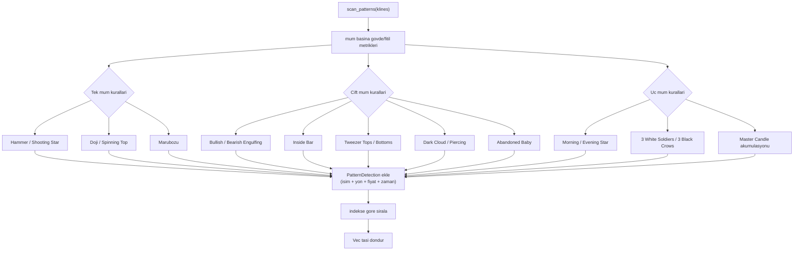

### `detect-pattern/src/main.rs`
**Detaylı açıklama:** `detect-liquidity` ile aynı şablondadır; axum sunucusu 127.0.0.1:3004'te `/api/pattern` endpoint'ini dinler. İstekte varsayılan 100 kline çekilir, `scan_patterns` ile tüm formasyonlar taranır, en yenisi önce görünsün diye indekse göre ters sıralanır ve `detected_patterns` listesi olarak JSON döner.

**Neden kullandık:**
- Pattern motorunu çalışan bir servise bağlamanın en düşük maliyetli yolu; ayrı endpoint (3004) ile bağımsız test edilebilir.
- "En yeni formasyonlara öncelik" için yalnızca sıralama yönünü ters çevirir, analiz koduna dokunmaz.
- Hata ve boş veri durumlarında tutarlı JSON mesajları döner.

```mermaid
flowchart TD
    A["main: axum /api/pattern<br>127.0.0.1:3004"] --> B["get_patterns: limit=100"]
    B --> C["fetch_klines"]
    C --> D{"veri var mi?"}
    D --|"hayir"| E["hata JSON"]
    D --|"evet"| F["scan_patterns(klines)"]
    F --> G["index'e gore ters sirala"]
    G --> H["detected_patterns JSON"]
    C --|"hata"| I["hata JSON"]
    I --> H
```

### `scout-service/src/models.rs`
**Detaylı açıklama:** Tüm sabitleri (zaman penceresi 3 sn, min spread 0.25 bps, aday sayısı 60, WS/backoff süreleri vb.) ve veri tiplerini tanımlar. `SymbolState`; best bid/ask, spread, mid fiyatını tutar; `VecDeque` tabanlı kayan pencerede fiyat hareketlerini, derinlik güncellemelerini ve değişim sayılarını biriktirip eskiyenleri düşer. Buradan saniyelik metrikler (`price_bps_per_s`, `price_ticks_per_s`, `ob_changes_per_s`) ve `price_score` hesaplanır. `Verdict` enum'u beş seviyeli kararı, `Opportunity` ve `MarketState` (tüm semboller + derinlik izlenenler) kalan yapıları tamamlar.

**Neden kullandık:**
- Kayan pencere metrikleri, sabit bir hafızayla canlı fiyat/derinlik akışını özetler; saniyelik normalizasyon sayesinde farklı semboller karşılaştırılabilir.
- Sabitler tek yerde toplanır, ayar değişiklikleri tek noktadan yapılır.
- `Verdict.code()` ile ring buffer wire protokolüne (u8) hazır eşleme sağlanır.

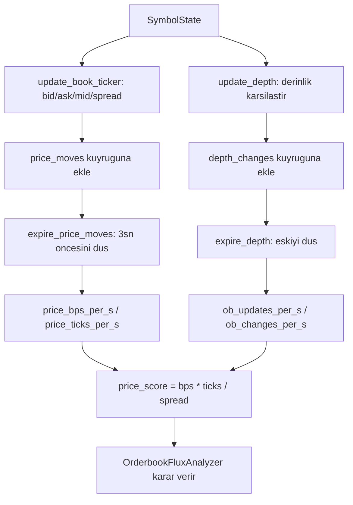

### `scout-service/src/client.rs`
**Detaylı açıklama:** `BinanceClient` iki görev üstlenir: REST `/fapi/v1/exchangeInfo`'dan yalnızca TRADING + PERPETUAL + USDT sonlu sembolleri çeker, WebSocket tarafında ise `stream_book_tickers` ve `stream_partial_depths` akışlarını başlatır. `stream_loop` bağlantıyı üstel geri çekilme (0.75 sn → 10 sn, jitter'lı) ile yönetir, her 20 sn'de heartbeat ping gönderir ve sunucu ping'ine pong yanıtı verir. Gelen JSON mesajları `data` alanına indirgenip `Handler` callback'ine iletilir.

**Neden kullandık:**
- Tek bir WebSocket bağlantısı üzerinden toplu `SUBSCRIBE` ile binlerce stream'in tek noktada yönetilmesini sağlar.
- Üstel backoff + jitter ile ağ kopmalarında yarış (thundering herd) önlenir.
- `chunked` ve `event_ts` yardımcıları, sembol parçalama ve zaman damgası çıkarmayı ortaklaştırır.

```mermaid
flowchart TD
    A["fetch_symbols: REST exchangeInfo"] --> B["USDT + TRADING + PERPETUAL filtre"]
    B --> C["stream_book_tickers / stream_partial_depths"]
    C --> D["chunked stream'ler"]
    D --> E{"connect_async basarili?"}
    E --|"hayir"| F["backoff ile bekle<br>(x2, cap 10sn)"]
    E --|"evet"| G["SUBSCRIBE gonder"]
    G --> H["select! dongusu"]
    H --> I["20sn heartbeat ping"]
    H --> J["gelen Text: data cikar"]
    J --> K["handler(data) cagir"]
    H --> L["server ping -> pong"]
    I --> H
    L --> H
    K --> H
    H --|"baglanti koptu"| E
    F --> E
```

### `scout-service/src/analyzer.rs`
**Detaylı açıklama:** `OrderbookFluxAnalyzer` üç sorgu sunar. `get_depth_candidates` tüm sembolleri `price_score`'a göre sıralayıp ilk 60'ını derinlik izlemeye aday gösterir. `get_best_opportunity` derinlik izlenen semboller arasında en iyi "Güçlü", yoksa en iyi "İyi" fırsatı seçer. `calc_opportunity` ise gerekli filtrelerden (mid/spread>0, min tick hızı) geçen sembol için `efficiency = price_bps_per_s / ob_changes_per_s` ve `score = (price_bps_per_s × price_ticks_per_s) / spread` hesaplar; eşik tablosuna göre Güçlü/İyi/Normal/BotGürültü/Zayıf kararı verir.

**Neden kullandık:**
- Fiyat hareketi ile derinlik değişimi arasındaki oran (efficiency), "fiyatı gerçek akış mı, bot mu itiyor" ayrımını yapar.
- Skor tek formüle indirgenir; sıralama ve karar eşikleri hızlı ayarlanabilir.
- Yalnızca gerçek fırsatlar (Güçlü/İyi) ring buffer'a fırsat olarak yazılır, gürültü filtrelenir.

```mermaid
flowchart TD
    A["get_depth_candidates"] --> B["her sembol: refresh + is_recent?"]
    B --> C["price_score > 0?"]
    C --|"evet"| D["puana gore sirala"]
    D --> E["ilk 60 = depth adaylari"]
    A2["calc_opportunity"] --> F{"mid/spread > 0<br>ve min tick?"}
    F --|"hayir"| G["None"]
    F --|"evet"| H["efficiency = bps / ob_changes"]
    H --> I["score = bps * ticks / spread"]
    I --> J{"eff >= 0.05 ve score >= 30?"}
    J --|"evet"| K["Verdict::Guclu"]
    J --|"hayir"| L{"eff >= 0.03 ve score >= 10?"}
    L --|"evet"| M["Verdict::Iyi"]
    L --|"hayir"| N{"eff >= 0.01 ve score >= 3?"}
    N --|"evet"| O["Verdict::Normal"]
    N --|"hayir"| P{"eff < 0.01 ve ob > 200?"}
    P --|"evet"| Q["Verdict::BotGurultu"]
    P --|"hayir"| R["Verdict::Zayif"]
    K --> S["get_best_opportunity: en iyi Guclu/Iyi"]
    M --> S
    O --> S
    S --> T["Opportunity nesnesi"]
```

### `scout-service/src/main.rs`
**Detaylı açıklama:** `ScoutService::start` önce tüm USDT sembollerini çeker, her 180'lik parça için bir `bookTicker` görev task'i açar. Ayrı üç tokio task'ı çalışır: `depth_manager_loop` periyodik olarak derinlik adaylarını hesaplayıp değişen küme için eski depth task'larını abort edip yenilerini başlatır; `analysis_loop` 3 saniyelik ısınmanın ardından her saniye en iyi fırsatı ve tüm sembol metriklerini hesaplar, konsola loglar ve `ScoutRing` ile `/cycle_finance_scout` ring buffer'ına `contracts::wire` formatında yazar. `stop` ise tüm task'ları temizce sonlandırır.

**Neden kullandık:**
- Paylaşımlı bellek ring buffer (transport crate) sayesinde tüketici süreçlere sıfır-kopya, düşük gecikmeli veri iletimi sağlar.
- Derinlik akışı tüm piyasaya değil yalnızca skoru yüksek adaylara (dinamik rebalance) açılır; bant genişliği tasarrufu sağlar.
- `OpportunityLogger` tekrar eden aynı fırsatı "DEVAM" olarak kısaltarak log gürültüsünü azaltır.

```mermaid
flowchart TD
    A["start: fetch_symbols"] --> B["bookTicker task'lari<br>(180'erlik chunk)"]
    B --> C["depth_manager_loop"]
    B --> D["analysis_loop"]
    C --> C1["get_depth_candidates"]
    C1 --> C2{"kume degisti?"}
    C2 --|"evet"| C3["eski depth task'larini abort"]
    C3 --> C4["yeni depth stream'leri baslat"]
    C2 --|"hayir"| C1
    D --> D1["3sn isinma"]
    D1 --> D2["get_best_opportunity + get_symbol_metrics"]
    D2 --> D3["logger.log: FIRSAT BULUNDU/DEVAM"]
    D3 --> D4["ScoutRing: ring buffer'a encode + push"]
    D4 --> D2
    C4 --> D2
```

### `scout-service/src/bin/probe.rs`
**Detaylı açıklama:** `scout-service`'in teşhis amaçlı ikinci bir ikilisidir (cargo bin). `GenerationalRingBuffer`'ı `/cycle_finance_scout` ismiyle açar ve `--once` bayrağıyla son 64 slotu okuyup döker ya da sonsuz döngüde her 200 ms'de yeni slotları tüketip yazdırır. `print_ev` `contracts::wire::decode` ile ikili çerçeveyi açar; `Opportunity` (OPP) ve `SymbolMetrics` (MET) olaylarını sembol, verdict, skor ve metrikleriyle ekrana basar.

**Neden kullandık:**
- Ring buffer protokolünün (encode/decode uyumu, slot düzeni) servis kodu çalıştırılmadan test edilmesini sağlar.
- Canlı akışta üretici süreçten bağımsız hızlı bir "izleme/teşhis" aracı görevi görür.
- Sembolün 16 baytlık fixed-size alanından sıfırla sonlandırılmış string çıkarma örneğini tek yerde sergiler.

```mermaid
flowchart TD
    A["probe: ring buffer ac"] --> B{"--once var mi?"}
    B --|"evet"| C["head - 64 arasi slotlari oku"]
    C --> D["decode + OPP/MET yazdir"]
    B --|"hayir"| E["dongu: head > last?"]
    E --|"evet"| F["yeni slotlari oku ve yazdir"]
    F --> G["last = head"]
    E --|"hayir"| H["200ms uyu"]
    H --> E
    G --> E
```

---

**Özet:** Analiz edilen toplam **14 dosya** (3 paket: `detect-liquidity`, `detect-pattern`, `scout-service`), detaylı + mermaid diyagramı yazılan **9 kaynak dosya**, toplam **9 mermaid diyagramı**. Üç servis de workspace'ten `exclude` edilmiştir (derlenmez); `detect-liquidity` ve `detect-pattern` istatistiksel HTTP sinyal servisleri, `scout-service` ise ring buffer tabanlı bir canlı fırsat tarayıcısıdır.

---

### `src/analyzer.rs`
**Detaylı açıklama:** Boru hattının kalbidir; iki giriş noktası vardır: `analyze_inflows` (saf replay) ve `analyze` (canlı). Canlı akışta önce SQLite'tan tarihsel `InflowData` yüklenir, sonra ring buffer ve `extra_live` (rtrb kanalı) verisi `merge_sources` ile zaman sırasında birleştirilir. Boş veri `DataStall` ile reddedilir; ardından `PhaseSpace` grid'i kurulup her inflow için `NSSolver.step()` koşulur. Çözücü sonrası sırasıyla: kavitasyon (tasfiye şok dalgası), kalibrasyon (başarısızsa varsayılan ν/Cs ile degrade), TWAP eğrisi ve Türkçe naratif + audit üretilir; hepsi tek `TrbReport` yapısında toplanır.
**Neden kullandık:**
- Tüm analiz katmanlarını tek çağrıyla birleştirip orkestratöre temiz bir `FluidResult<TrbReport>` arayüzü sunar
- Hata ve panik yönetimini merkezileştirir (kalibrasyon hatası servisi öldürmez)
- Replay/canlı ayrımını iki fonksiyonla ayırarak test ve üretim kullanımını aynı çekirdek üzerinde birleştirir

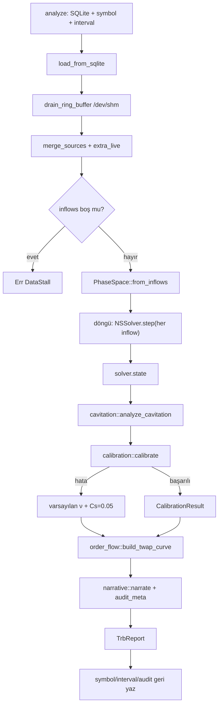

### `src/calibration.rs`
**Detaylı açıklama:** İki parametreli (ν, Cs) Nelder-Mead simplex optimizasyonudur. Maliyet fonksiyonu önce `simulate()` ile ilk 8 inflow üzerinde NS çözücü koşar, sonra üretilen kinetik enerji `√(Σ|u|²/N)` ile hedeflenen enerji (`target_energy`: buy/sell dengesizliği + tasfiye oranı) arasındaki bağıl farkı, küçük bir divergence cezasıyla toplar. Simpleks üç noktayla başlar; yansıma (reflection), genişleme (expansion), büzülme (contraction) ve shrink adımlarıyla 60 iterasyona kadar daralır; parametreler her adımda VISCOSITY/CS sınırlarına clamp'lenir, NaN/Inf maliyet sonsuz sayılır. Çözücü ıraksarsa `DivergenceExplosion` döner ve çağıran (analyzer) varsayılan parametrelere düşer.
**Neden kullandık:**
- ν ve Cs piyasa rejimine göre sabit değil, canlı kalibre edilir; böylece türbülans modeli değişen piyasa volatilitesine uyum sağlar
- Nelder-Mead türevsizdir — NS çözücü gibi pürüzlü, türevsiz maliyet yüzeylerinde gradient-based yöntemlerden daha sağlamdır
- Clamp + finite kontrolleri sayesinde optimize edici asla fiziksel olmayan parametre üretmez

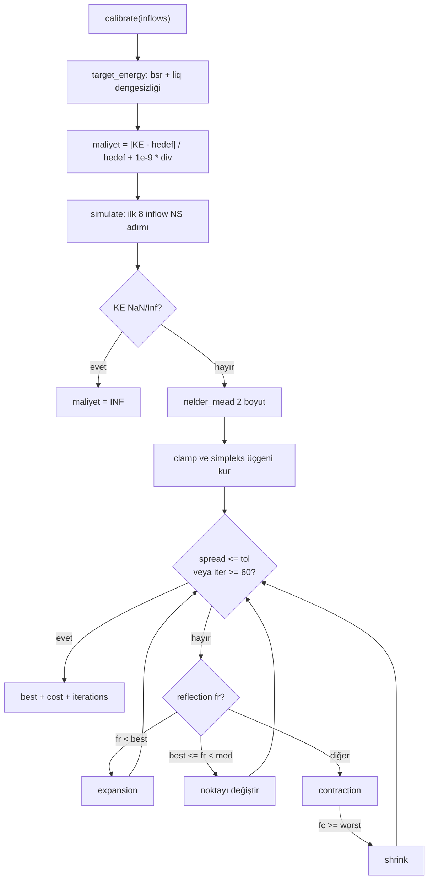

### `src/solver.rs`
**Detaylı açıklama:** Grid üzerinde her `InflowData` için beş aşamalı zaman adımı çalıştırır: (1) upwind adveksiyon `(u·∇)u` rayon ile satır bazlı paralel; (2) ν∇²u difüzyonu — x ve y yönlerinde tridiagonal sistem, doğrudan Thomas algoritmasıyla O(N) çözülür; (3) OI delta (x-itme) + funding (Coriolis benzeri dönme) kuvvetleri grid geneline yayılır; (4) ∇²p = ∇·u/Δt Poisson denklemi 20 Jacobi iterasyonu + Neumann sınır koşuluyla çözülür; (5) hız düzeltmesi u ← u − Δt·∇p ile diverjans temizlenir. `state()` her aşamada divergence normunu eşikle karşılaştırıp kararlılık bayrağı üretir; ıraksama durumunda `DivergenceExplosion` döner.
**Neden kullandık:**
- Fiyat-hacim-tasfiye etkileşimini fiziksel bir PDE modeliyle birleştirir; momentum/ivme sinyalleri ham göstergelerden daha bütüncül çıkar
- Thomas algoritması implicit ve koşulsuz kararlıdır — büyük ν·Δt/Δx² değerlerinde bile patlamaz
- Paralelizasyon (rayon) + doğrudan çözücü ile 64×16 grid adım maliyeti HFT zaman kısıtlarına uyacak kadar düşük tutulur

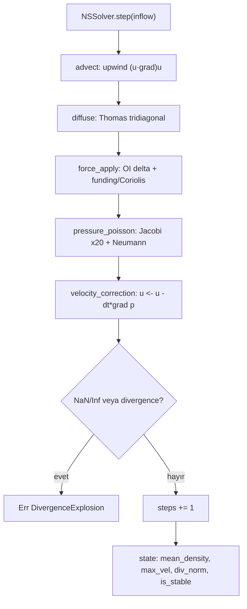

### `src/ingest.rs`
**Detaylı açıklama:** İki kaynağı `InflowData` üretmek üzere birleştirir. SQLite tarafında `trades`, `liquidations`, `funding_rates`, `open_interests` tabloları sorgulanır; tick'ler `interval_ms` bucket'larına VWAP fiyat + hacim olarak toplanır, tasfiye hacmi timestamp aralığında eşleşir. Canlı tarafta `GenerationalRingBuffer` (/dev/shm/cycle_finance_ring) `wire::decode` ile çözülür, Trade/Liquidation/FundingRate/OpenInterest olayları sembol filtresinden geçerek `InflowData`'ya dönüşür. `merge_sources` canlı veriyi yalnızca SQLite'ın kapsamadığı (daha güncel) aralıkları dolduracak şekilde ekleyip zaman sırasına dizer.
**Neden kullandık:**
- Ring buffer'dan beslenerek core'un canlı veri merkezine sıfır kopya/shm erişimi sağlar; core çalışmıyorsa boş döner (graceful)
- SQLite tarihsel derinlik + canlı tick birleşimi, solvere hem bağlam hem güncellik verir
- Tablo yokluğunda/hata durumunda varsayılan değerlerle (0.0, 0.5) servis çökmez

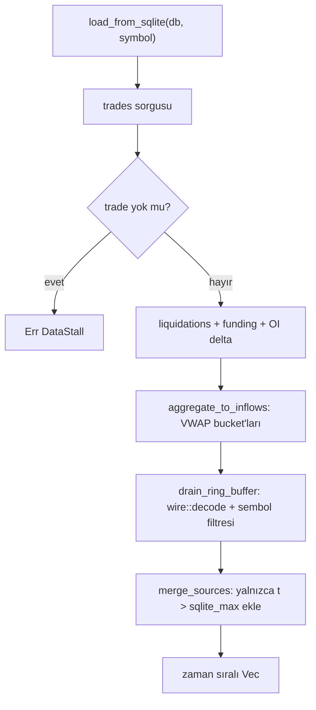

### `src/grid.rs`
**Detaylı açıklama:** 64(fiyat)×16(derinlik) log-fiyat eksenli `PhaseSpace` grid'ini kurar; her inflow kendi bin'ine yoğunluk (hacim ağırlıklı), x-hız (buy_sell_ratio), y-hız (negatif tasfiye) ve basınç (funding×1000 + OI×0.001) olarak dağıtılır. `divergence()` merkezi farkla ∂u/∂x'i `wide::f64x4` SIMD bloklarında (AVX2), ∂v/∂y'yi skaler hesaplar; sınırlarda tek taraflı fark kullanılır. NaN/Inf tespitinde `DivergenceExplosion`, `reset()` ise ıraksama kurtarması için grid'i sıfırlar.
**Neden kullandık:**
- Log-fiyat ekseni, geniş fiyat aralıklarında göreli hareketleri doğrusallaştırır ve fiyat ölçeğinden bağımsız kılar
- SIMD divergence, grid üzerindeki en pahalı operasyonu hızlandırır (her solver adımında iki kez çağrılır)
- `history` 3D dizisi zaman boyutunu koruyarak replay/analiz için tam izlenebilirlik sağlar

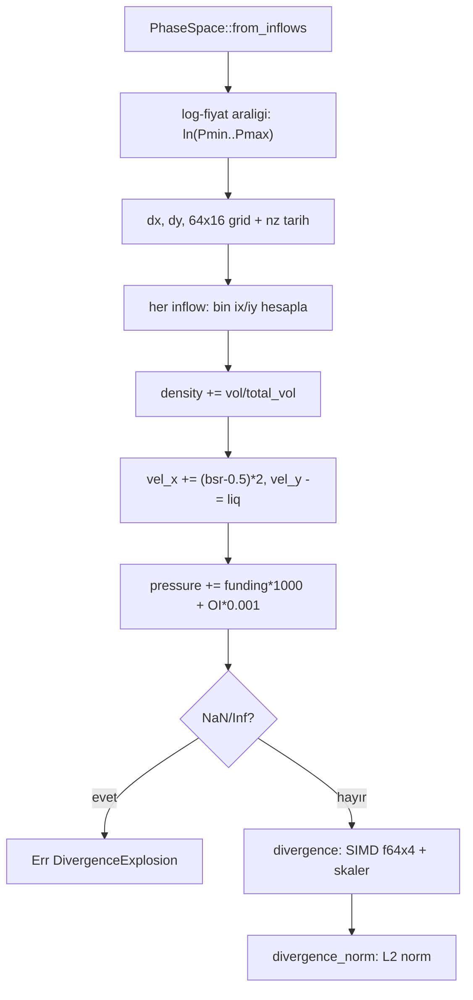

### `src/cavitation.rs`
**Detaylı açıklama:** Tasfiyeleri akışkan içindeki kavitasyon kabarcıkları olarak modeller. Her senaryo (long squeeze p_vapor=1.05·p, short squeeze p_vapor=0.95·p) için bir `Bubble` oluşturulur; Rayleigh-Plesset ODE `R·R̈ + 1.5Ṙ² = (P_v−P_∞)/ρ` Euler-Maruyama ile Δt=1μs, 1000 adım çözülür. Kabarcık yarıçapı OB derinliğinin 0.7 katını aşarsa `BurstSignal` üretilir (frekans Minnaert yaklaşımı, genlik duvar hızından); en yüksek `amplitude·log10(frequency)` skorlu sinyal seçilir. NaN/Inf'te kabarcık 1e-6 yarıçapla yeniden başlatılır.
**Neden kullandık:**
- Tasfiye şoklarını anlık basit eşik yerine fiziksel bir ODE evrimiyle yakalar — zamanlama ve genlik bilgisi daha gerçekçidir
- Burst sinyali hem naratif uyarıyı hem de order_flow yön kararını besler
- Her iki yön senaryosu denenir; hangi yöndeki baskı daha güçlüyse o raporlanır

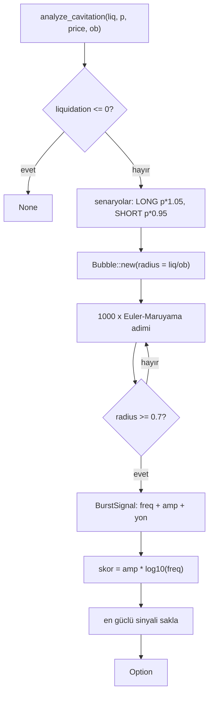

### `src/order_flow.rs`
**Detaylı açıklama:** Solver'ın ürettiği ortalama basınç gradyanını yürütme planına çevirir. Ağırlıklar geometrik azalan `w_i = r^i` (r = risk kaçınması, varsayılan 0.8) ile üretilir; erken dilimler daha büyük olur, toplamı 1.0'e normalize edilir. Fiyat ofseti gradyan işareti ve büyüklüğüyle kademeli ölçeklenir (`PRICE_IMPACT=1e-4`). Yön kararı önce `BurstSignal`'e (LONG=+1/SHORT=−1), yoksa gradyan işaretine bakar; gradyan ölü bölgedeyse 0 döner.
**Neden kullandık:**
- Basınç gradyanı = TRB bandının kırılma yönü; TWAP dilimleri bu sinyali zaman içine yayarak emir ekstrüzyonunu azaltır
- Pontryagin yaklaşımı erken/sonradan agresiflik dengesini tek `risk_aversion` parametresiyle kontrol eder
- Kavitasyon sinyali yürütme yönüne öncelik verir — tasfiye şoku akışı bastırır

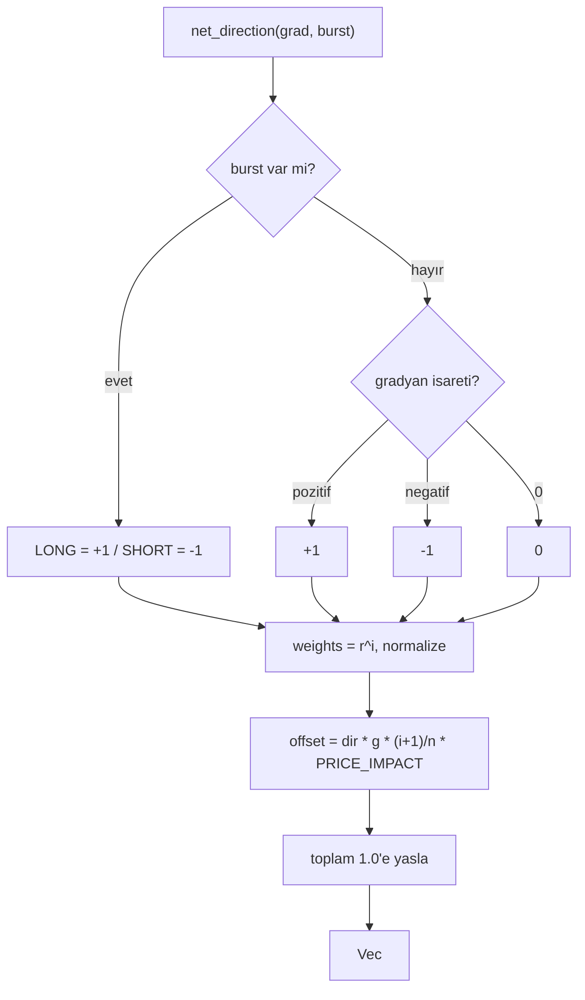

### `src/narrative.rs`
**Detaylı açıklama:** Solver durumu, kalibrasyon ve kavitasyon sinyalini Türkçe insan-okur özete dönüştürür. Faz etiketi öncelik sırasıyla: burst varsa "Kavitasyon Dalgası", kararsızsa "Iraksama", yoğunluk eşiklerine göre "Yoğunlaşma/Seyreltme/Kararlı Akış". Yön ve türbülans seviyesi basınç işareti ve max_velocity eşiklerinden türetilir; risk uyarısı kavitasyon/kararsızlık durumlarını yansıtır. `audit_meta` ise analiz zamanı, grid boyutu, veri kaynağı ve kalibrasyon sürümünü `AuditMeta` olarak üretir.
**Neden kullandık:**
- Sayısal çıktıyı karar vericinin hızlıca okuyabileceği Türkçe tek satır özete indirger
- Faz/yön/türbülans etiketleri durum makinesi gibi kategorik sinyal sağlar
- Risk uyarıları otomatik üretilir — kavitasyon şoku veya ıraksama anında pozisyon boyutlamayı işaret eder

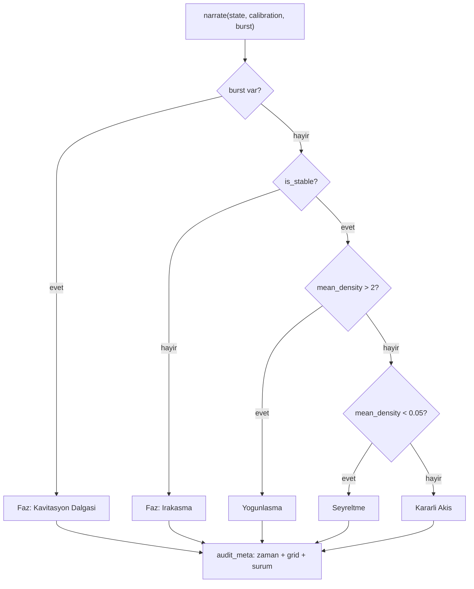

### `src/types.rs`
**Detaylı açıklama:** Tüm hata ve çıktı yapılarını tanımlar. `FluidError` veri tıkanıklığı, ıraksama, DB/ring buffer/grid/sembol hatalarını altı varyantla modeller; `FluidResult<T>` tüm iç fonksiyonların dönüş tipidir (unwrap yasak). `InflowData` çözücünün girdisi (fiyat, hacim, OI delta, funding, buy/sell, tasfiye, timestamp), `TrbReport` ise tüm katmanların birleşik serileştirilebilir çıktısıdır.
**Neden kullandık:**
- Serileştirilebilir çıktı tipleri axum HTTP yanıtına doğrudan `Json` olarak verilir
- Tip-odaklı hata sistemi `match` ile zorunlu işleme sağlar; panik yerine `FluidResult` akışı yaygın
- Tek tip tanımı modüller arası döngüsel bağımlılığı önler (hepsi `crate::types`'a bağlanır)

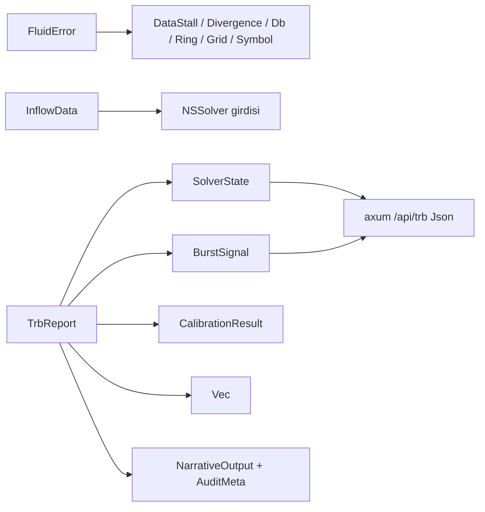

### `src/main.rs`
**Detaylı açıklama:** Servis orkestratörü. rtrb lock-free SPSC ring (65536 kapasite) üzerinden üç parça çalışır: (1) tokio task her 200ms'de ring buffer'ı `ingest::drain_ring_buffer` ile boşaltıp rtrb'ye push'lar; (2) core-pinned `trb-solver` thread her `--refresh` saniyede rtrb'yi tüketir, `catch_unwind` zırhıyla `analyzer::analyze` çağırır ve sonucu `Mutex<Snapshot>`'a yazar (panik servisi öldürmez, hata raporlanır); (3) axum HTTP `GET /api/trb` ve `GET /api/trb/status` — ikincisi `is_stable && son 60s` kontrolüyle sağlık durumu döner. CLI argümanları `--symbol`, `--interval-ms`, `--limit`, `--db`, `--port`, `--refresh`.
**Neden kullandık:**
- Üretici/tüketici ayrımı lock-free kanalla yapılır; solver thread'i core'a sabitlenir (düşük gecikme)
- Panik zırhı + graceful degradation: bir çevrim patlarsa bir sonraki çevrimde devam edilir
- HTTP katmanı yalnızca son snapshot'ı sunar — solver gerçek zaman kısıtına takılmaz

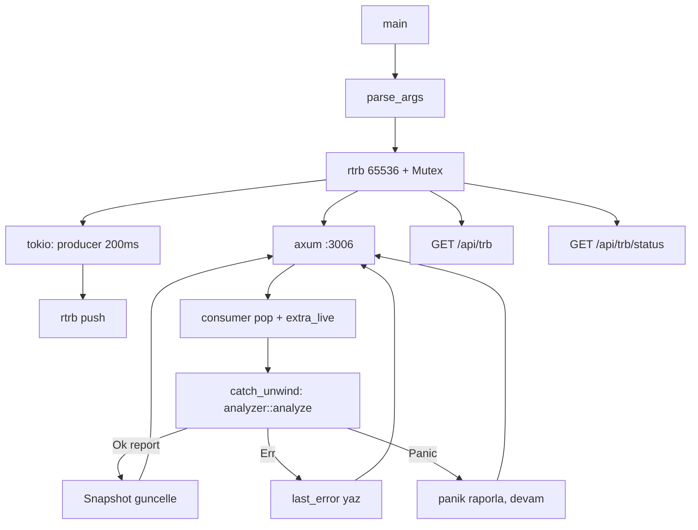

### `src/lib.rs`
**Detaylı açıklama:** Kütüphanenin kök modül dosyasıdır; `analyzer`, `calibration`, `cavitation`, `grid`, `ingest`, `narrative`, `order_flow`, `solver`, `types` modüllerini `pub mod` ile dışa açar. İş mantığı içermez, yalnızca modül grafiğini tanımlar; `main.rs` ve testler bu arayüz üzerinden servise erişir.
**Neden kullandık:**
- `main.rs` binary'si ile yeniden kullanılabilir kütüphane mantığını ayırır; test/replay `detect_trb::analyzer` ile çalışabilir
- Modül sıralaması boru hattı akışını (types → grid → solver → analyzer) belgeler
- Tek modül listesi derleme birimi olarak bağımlılık grafiğini sadeleştirir

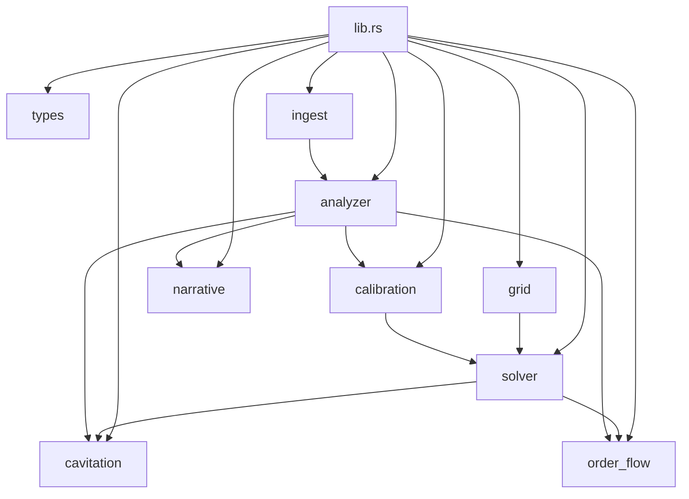

### `src/cavitation.rs` (kısaca) — bkz. yukarıda tam diyagram

## Genel Mimari Özeti (mermaid)

```mermaid
flowchart LR
    subgraph Veri
        S["SQLite market_data.db"] --> I["ingest"]
        R["RingBuffer /dev/shm"] --> I
    end
    I --> G["grid: PhaseSpace 64x16"]
    G --> NS["solver: NS advektif"]
    NS --> CA["cavitation"]
    NS --> CL["calibration NM"]
    NS --> OF["order_flow TWAP"]
    CA --> OF
    OF --> N["narrative"]
    N --> TR["TrbReport"]
    TR --> HTTP["axum /api/trb :3006"]
```

---

### `src/analyst.rs`
**Detaylı açıklama:** Servisin tek çağrılık orkestratörüdür. `analyze()` önce `Kline` listesini `1e-6` tick boyutuyla taşma kontrollü `Bar`lara çevirir ve `min_move` filtresi uygular; sonra her bar için sırasıyla hacim profili güncellemesi, durum makinesi `ingest`i (sinyal üretimi) ve risk değerlendirmesi yapar, ardından audit log kaydı atar. Döngü sonunda EWMA faz ağırlıklarını (decay 0.85, kural tabanlı anlık skorlar üzerinden) hesaplar; yapısal konumu (POC mesafesi, hacim trendi, spread durumu, iptal seviyeleri), olasılık tahminini (yukarı/aşağı kırılım, sahte kırılım, momentum riski) ve bias önerisini üretir. Son olarak naratif metin ve son sinyal üzerinden TWAP yürütme planı oluşturup her şeyi `Insight` yapısında serileştirir.
**Neden kullandık:**
- Kline→Bar dönüşümünde tick tabanlı (`i64`) aritmetik, float hassasiyet kayıplarını ve taşmayı engeller.
- EWMA faz motoru, anlık kural skorlarını üstel olarak yumuşatarak gürültülü HFT verisinde istikrarlı faz dağılımı verir.
- Skorlar 4 ondalık basamağa yuvarlanır; deterministic ve serileştirilebilir çıktı sağlanır.
- Tüm ara kararlar `AuditRecord::decision` ile immutable log'a yazılır, böylece tahminler geriye dönük denetlenebilir.

```mermaid
flowchart TD
    A["Girdi: Kline[] + AnalysisConfig"] --> B["Bar donusumu<br>tick_size = 1e-6"]
    B --> C{"min_move filtresi<br>bar kaldi mi?"}
    C -->|"hayir"| E["Hata: Veri yok / bar yok"]
    C -->|"evet"| F["ContextualScorer::build<br>range_low + avg_volume"]
    F --> G["StateMachine + VolumeProfile + RiskEngine kurulumu"]
    G --> H["Her bar icin dongu"]
    H --> I["profile.update(bar)"]
    I --> J["machine.ingest(bar) → sinyal?"]
    J -->|"evet"| K["SignalRecord ekle<br>son 20 sinyal"]
    J -->|"hayir"| L["risk.evaluate + audit log<br>son 16 kayit"]
    K --> L
    L --> M{"Bar bitti mi?"}
    M -->|"hayir"| H
    M -->|"evet"| N["EWMA faz agirliklari<br>decay = 0.85"]
    N --> O["structural_position: POC, hacim, spread"]
    O --> P["probability_forecast: kirilim riskleri"]
    P --> Q["suggested_bias + narrative"]
    Q --> R["ExecutionBroker ile emir plani"]
    R --> S["Insight serilestir"]
```

### `src/state.rs`
**Detaylı açıklama:** Wyckoff olay tespitinin kalbidir. `detect_all()` 40 barlık penceredeki uç (extreme) seviyeleri ve ortalama hacmi baz alarak dört olayı tarar: Spring (dip testi + güçlü toparlanma), SOS (yüksek hacimle yukarı kırılım), UT (üst bandı test edip red mum), SC (dip + 2.5x hacim kapitülasyonu). Tespit edilen olaylar `ContextualScorer::evaluate` ile bağlamsal puanlanır; skor 0.82 üzerindeyse Bayes tarzı `update_weights` ağırlıkları günceller ve softmax ile normalleştirir. Birikim ağırlığı 0.75'i aştığında SOS → `Signal::Long`, dağıtım ağırlığı 0.75'i aştığında UT → `Signal::Short` sinyali üretilir; düşüş trendindeki Spring'ler ayrıca `fake_springs` olarak sayılır.
**Neden kullandık:**
- `observe()` tespitten sonra çağrılır; pencere mevcut barı içermez, böylece look-ahead bias (ileri sızıntı) önlenir.
- Ağırlık güncellemesi + softmax, faz olasılıklarını her zaman 1'e normalize eder.
- Sinyal eşiği (0.82) ve birikim/dağıtım ağırlığı koşulu, zayıf olaylardan sinyal üretimini engeller.
- Olay istatistikleri (`SignalStats`) model kalibrasyonu ve denetim için biriktirilir.

```mermaid
flowchart TD
    A["ingest(bar, scorer)"] --> B["detect_all: pencere uclari + ortalama hacim"]
    B --> C{"Olay tespit edildi mi?"}
    C -->|"hayir"| D["observe(bar) + geri don"]
    C -->|"evet"| E["scorer.evaluate ile baglamsal skor"]
    E --> F["scored_events guncelle<br>en guncel 8 kayit"]
    F --> G["En yuksek skorlu olay secilir"]
    G --> H{"Skor > 0.82 mi?"}
    H -->|"hayir"| D
    H -->|"evet"| I["update_weights: Bayes + softmax"]
    I --> J{"SOS ve birikim > 0.75?"}
    J -->|"evet"| K["Signal::Long uret"]
    J -->|"hayir"| L{"UT ve dagitim > 0.75?"}
    L -->|"evet"| M["Signal::Short uret"]
    L -->|"hayir"| D
    K --> D
    M --> D
```

### `src/scorer.rs`
**Detaylı açıklama:** Tüm pencere üzerinden "piyasa bağlamını" hesaplar ve durum makinesinin ürettiği ham olaylara bağlamsal skor verir. `build()` EMA50 eğimini normalize ederek `trend_angle` (−1…+1), ATR(14)'ü kapanışa bölerek `atr_percent` ve pencerenin `range_high`/`range_low` tiklerini üretir. `evaluate()` ise olayın hacim temelli gücünü (`strength`), trend yönüne ve aralık içindeki konuma göre seçilen context katsayısıyla çarpar, ATR düzeltmesi uygular ve sonucu keskin bir lojistik sigmoidden geçirerek [0,1] aralığına oturtur. Böylece düşüş trendindeki Spring ya da yükseliş trendindeki UT gibi "tuzak" olaylar otomatik olarak cezalandırılır.
**Neden kullandık:**
- Trend eğimi + aralık konumu birlikte değerlendirilir; olaylar izole değil bağlam içinde yorumlanır.
- ATR modifikatörü aşırı volatil dönemlerde sinyal güvenilirliğini düşürür.
- Lojistik sigmoid deterministik ve türevlenebilirdir; eşikleme için stabil 0–1 skor üretir.
- Tüm hesap ham `i64` tick değerleri üzerinden yürür, float hatası birikmez.

```mermaid
flowchart TD
    A["build(bars): pencere baglami"] --> B["EMA50 hesapla"]
    B --> C["trend_angle: EMA50 son egimi<br>aralik -1 ila +1"]
    C --> D["ATR14 hesapla"]
    D --> E["atr_percent = ATR / son kapanis"]
    E --> F["range_high ve range_low tikleri"]
    F --> G["evaluate(event)"]
    G --> H{"Olay tipi nedir?"}
    H -->|"Spring"| I["Dusus trendi → 0.2<br>Yukselis trendi → 1.4"]
    H -->|"SOS"| J["Aralik ustunde → 1.5<br>degilse → 0.8"]
    H -->|"UT"| K["Yukselis trendi → 0.3<br>degilse → 1.2"]
    H -->|"SC"| L["Dibe yakin → 1.3<br>degilse → 0.9"]
    I --> M["Skor = strength x modifier x atr_mod"]
    J --> M
    K --> M
    L --> M
    M --> N["Lojistik sigmoid ile [0,1] araligina indir"]
```

### `src/profile.rs`
**Detaylı açıklama:** Volume Profile'i "lazy decay" (tembel bozunma) tekniğiyle amortize edilmiş O(1) güncelleme maliyetine indirir. Her fiyat seviyesi (`mid_tick`) bir BTreeMap bucket'ıdır; `update()` yalnızca ilgili bucket'ı günceller ve geçen dakikaya göre `decay_factor^age` ile eski hacmi zayıflatır (0.999 dakikalık bozunma). Bucket sayısı 4096'yı aşarsa en eski yarısı silinir. POC (Point of Control, en çok işlem yapılan fiyat) BTreeMap üzerinden O(log n) amortized bulunur; `snapshot()` en yüksek hacimli `n` bucket'ı ve POC fiyatını döndürür.
**Neden kullandık:**
- Lazy decay, her bar için tüm bucket'ları tazelemek zorunda bırakmaz; HFT tarzı yüksek frekanslı veride O(log n) güncelleme kritik.
- Zamanla eski hacim ağırlığı azaldığından profil "canlı" kalır, tarihsel şişkinlik önlenir.
- POC mesafesi `structural_position` ve olasılık tahminine doğrudan girdi sağlar.

```mermaid
flowchart TD
    A["update(bar)"] --> B["mid_tick'i bucket anahtari yap"]
    B --> C{"Bucket var mi?"}
    C -->|"hayir"| D["Bucket'i sifir hacimle olustur"]
    C -->|"evet"| E["Lazy decay: yas = gecen sure<br>decay^yas/60sn"]
    D --> F["Hacim ekle + total_volume guncelle"]
    E --> F
    F --> G{"Bucket sayisi > 4096?"}
    G -->|"evet"| H["En eski yarisi sil"]
    G -->|"hayir"| I["POC: en yuksek hacimli bucket<br>O(log n)"]
    H --> I
    I --> J["snapshot: top_n bucket + poc_price"]
```

### `src/execution.rs`
**Detaylı açıklama:** Sinyalleri gerçek emir planına dönüştüren yürütme katmanıdır. `ExecutionBroker::execute()` emir büyüklüğünü 100 eşit dilime böler, her dilime `base_price * (1 + slip + depth_impact)` formülüyle kademeli kayma ve derinlik etkisi uygular ve 50ms arayla `expires_at_ms` zaman damgaları atar (TWAP). `plan()` üretilen çocuk emirlerden ortalama/maksimum/minimum fiyat, süre ve dilim bilgilerini özetleyen `ExecutionPlan` üretir; `iceberg` bayrağı her zaman true'dur. Böylece büyük pozisyon piyasaya tek seferde sızdırılmaz.
**Neden kullandık:**
- 100 × 50ms TWAP, emir defterine olan etkiyi (market impact) zamana yayarak azaltır.
- Kayma + derinlik etkisi formülü gerçekçi dolum fiyatı tahmini verir, analist kararları fiyatlanır.
- `Iceberg` bayrağı büyük emrin görünürlüğünü gizler, rakip akışın algılamasını zorlaştırır.
- `Signal` (Long/Short) girdisinden tamamen serileştirilebilir `ExecutionPlan` çıktısı üretilir.

```mermaid
flowchart TD
    A["execute(signal, size, tick_size)"] --> B["chunk = size / 100 dilim"]
    B --> C["base_price: entry tick x tick_size"]
    C --> D["depth_impact: kayma x (size/depth)"]
    D --> E["0'dan 99'a her dilim icin"]
    E --> F["Fiyat: base x (1 + slip + derinlik)"]
    F --> G["expires_at: now + 50ms x i"]
    G --> H{"Tum dilimler bitti mi?"}
    H -->|"hayir"| E
    H -->|"evet"| I["plan(): avg, max, min fiyat hesapla"]
    I --> J["ExecutionPlan: slices, sure, iceberg=true"]
```

### `src/risk.rs`
**Detaylı açıklama:** "Katil düğme" (kill-switch) görevi gören uyarlanabilir risk motorudur. `new()` giriş fiyatından `max_risk_bp` (varsayılan 200 bps = %2) mesafede başlangıç stop'u kurar ve aralık tabanını `ar_low` olarak saklar. `evaluate()` her bar için dağıtım ağırlığı 0.8'i geçtiğinde ve UT onayı bekleniyorsa: fiyat aralık tabanının altına iner ve hacim 1.3× ortalamanın üzerine çıkarsa `HedgeAndReverse` (ters çevir + hedge et), aksi hâlde `TightenStop` (stop'u sıkılaştır) aksiyonu üretir; koşullar yoksa `Idle` döner. `record()` nihai stop fiyatını ve bps cinsinden stop mesafesini raporlar.
**Neden kullandık:**
- UT onayı mekanizması, sahte yukarı kırılımlarda erken ters sinyali engeller (dağıtım teyidi beklenir).
- %2 sabit risk sınırı, tek bir işlemde sermayenin büyük kısmını riske atmayı engeller.
- `ar_low` + hacim koşulu, gerçek kırılımı düşük hacimli zayıf hareketlerden ayırt eder.
- Aksiyon etiketleri (Idle/TightenStop/HedgeAndReverse) audit log ile uyumlu serileştirilebilir.

### `src/audit.rs`
**Detaylı açıklama:** Gözlemlenebilirlik katmanıdır. `AuditRecord::decision()` her karar anında barın zaman damgası, kapanışı, spread tikleri, hacmi, skoru, olay etiketi, birikim/dağıtım ağırlıkları, trend gücü, bias ve sinyal bilgilerini tek bir `serde_json::Value` nesnesine gömerek değişmez bir JSON log satırı üretir. `analyst.rs` bu satırları son 16 kayıtla sınırlandırılmış bir `audit_trail` içinde biriktirir; böylece `Insight` çıktısındaki her kararın "neden"i denetlenebilir.

### `src/models.rs`
**Detaylı açıklama:** Tüm analiz zincirinin temel tiplerini tanımlar. `Tick(i64)` fiyatı tick sayısı olarak, `Volume(u64)` hacmi saklar; `Bar` bunları birleştirir ve `spread_ticks`, `mid_tick`, `price` yardımcılarını sunar. `AssetDefinition` tick boyutunu ve `min_move` filtre eşiğini tanımlar (varsayılan 1e-6 tick, BTC için 50 tick). `Bias` enum'u Bullish/Bearish/Neutral karar çıktısını modeller. İnteger tabanlı tipler float hassasiyet hatalarını sıfıra indirir.

### `src/main.rs`
**Detaylı açıklama:** axum tabanlı REST sunucusudur. `GET /api/wyckoff?symbol=BTCUSDT&interval=1h&limit=500` sorgusunu alır, `BinanceClient::fetch_klines` ile geçmiş mumları indirir, `AnalysisConfig::default()` ile `analyst::analyze` çağırır ve sonucu `status`, `symbol`, `interval`, `current_price`, `insight` alanlarını içeren JSON olarak döner. Hata durumlarında (`no data`, analiz hatası, ağ hatası) ilgili mesajla `status: error` döner. 127.0.0.1:3005'te dinler.

### `src/lib.rs`
**Detaylı açıklama:** Kütüphanenin kök modülüdür. `analyst`, `audit`, `execution`, `models`, `profile`, `risk`, `scorer`, `state` modüllerini bildirir ve `analyze` fonksiyonu ile `Bar`, `Bias`, `Tick`, `Volume`, `WyckoffStateMachine` tiplerini dışa re-export eder. Böylece hem REST sunucusu (`main.rs`) hem de diğer çalışma zamanları ortak bir kütüphane API'sine erişebilir.

### `Cargo.toml`
**Detaylı açıklama:** Paket adı `detect-wyckoff`, edition 2024. Bağımlılıklar workspace'ten devralınır: `axum` (HTTP), `serde`/`serde_json` (serileştirme), `tokio` (async), `rust_decimal` (kayan nokta dönüşümleri). `ohlcv-engine` yerel path bağımlılığı ile `../services-engine/ohlcv-engine`'den alınır ve `BinanceClient` kullanımını sağlar. Paket, workspace `exclude` listesinde olduğundan üretim derlemelerine girmez.

---

## Sonuç Özeti
- Analiz edilen dosya sayısı: **11** (Cargo.toml + 10 src dosyası).
- Oluşturulan mermaid diyagramı sayısı: **5** (`analyst.rs`, `state.rs`, `scorer.rs`, `profile.rs`, `execution.rs`).
- Kritik not: Servis, workspace kök `Cargo.toml` içindeki `exclude = ["tests", "unused_services"]` tanımı nedeniyle aktif derlemelerden çıkarılmıştır; mimari ve algoritmaları (EWMA faz motoru, Bayesian olay skorlama, lazy-decay POC, TWAP yürütme) yeniden kullanılabilir bir referans oluşturur.

---

## 📄 Tam Kaynak Kodu

### `unused_services/detect-liquidity/Cargo.toml`

```toml
[package]
name = "detect-liquidity"
version = "0.1.0"
edition = "2024"

[dependencies]
axum = { workspace = true }
ohlcv-engine = { version = "0.1.0", path = "../services-engine/ohlcv-engine" }
serde = { workspace = true }
serde_json = { workspace = true }
tokio = { workspace = true }
rust_decimal = { workspace = true }
```

### `unused_services/detect-liquidity/src/algorithms.rs`

```rust
use ohlcv_engine::Kline;
use rust_decimal::Decimal;
use rust_decimal::prelude::*;
use serde::Serialize;

#[derive(Serialize, Debug)]
pub struct LiquidityResult {
    pub eqh: Vec<Decimal>,
    pub eql: Vec<Decimal>,
    pub bullish_fvg: Vec<FVG>,
    pub bearish_fvg: Vec<FVG>,
    pub sweeps: Vec<Sweep>,
}

#[derive(Serialize, Debug)]
pub struct FVG {
    pub top: Decimal,
    pub bottom: Decimal,
}

#[derive(Serialize, Debug)]
pub struct Sweep {
    pub side: String, // "BUY_SIDE" or "SELL_SIDE"
    pub price_level: Decimal,
    pub index: usize,
}

pub fn analyze_liquidity(klines: &[Kline]) -> LiquidityResult {
    if klines.len() < 5 {
        return LiquidityResult { eqh: vec![], eql: vec![], bullish_fvg: vec![], bearish_fvg: vec![], sweeps: vec![] };
    }

    let eqh = find_equal_levels(klines, true, Decimal::from_str("0.0005").unwrap()); // %0.05
    let eql = find_equal_levels(klines, false, Decimal::from_str("0.0005").unwrap());

    let (bullish_fvg, bearish_fvg) = find_fvgs(klines);
    let sweeps = find_sweeps(klines);

    LiquidityResult {
        eqh, eql, bullish_fvg, bearish_fvg, sweeps
    }
}

fn find_equal_levels(klines: &[Kline], is_high: bool, threshold_pct: Decimal) -> Vec<Decimal> {
    let mut levels = Vec::new();
    let n = klines.len();

    for i in 0..n {
        for j in (i+5)..n { // En az 5 mum arayla
            let p1 = if is_high { klines[i].high } else { klines[i].low };
            let p2 = if is_high { klines[j].high } else { klines[j].low };

            if (p1 - p2).abs() / p1 <= threshold_pct {
                levels.push((p1 + p2) / Decimal::TWO);
            }
        }
    }
    // Remove duplicates
    levels.sort();
    levels.dedup_by(|a, b| (*a - *b).abs() / *a < threshold_pct);
    levels
}

fn find_fvgs(klines: &[Kline]) -> (Vec<FVG>, Vec<FVG>) {
    let mut bull = Vec::new();
    let mut bear = Vec::new();

    for i in 2..klines.len() {
        let k1 = &klines[i-2];
        let k3 = &klines[i];

        // Bullish FVG: K1 High < K3 Low
        if k1.high < k3.low {
            bull.push(FVG { top: k3.low, bottom: k1.high });
        }
        // Bearish FVG: K1 Low > K3 High
        if k1.low > k3.high {
            bear.push(FVG { top: k1.low, bottom: k3.high });
        }
    }
    (bull, bear)
}

fn find_sweeps(klines: &[Kline]) -> Vec<Sweep> {
    let mut sweeps = Vec::new();
    // Basit bir Sweep analizi: Mum çok uzun iğne atmış ama gövdesi küçük kapanmış ve önceki mumları yutmuş
    for i in 5..klines.len() {
        let k = &klines[i];
        let body_top = k.open.max(k.close);
        let body_bot = k.open.min(k.close);

        let upper_wick = k.high - body_top;
        let lower_wick = body_bot - k.low;
        let body = body_top - body_bot;

        // Buy Side Sweep (Yukarı iğne atıp avlamış)
        if upper_wick > body * Decimal::from(3) {
            // Önceki mumların high'ını geçmiş mi?
            let prev_max = klines[i-5..i].iter().map(|x| x.high).fold(Decimal::MIN, Decimal::max);
            if k.high > prev_max && k.close < prev_max { // Body close below
                sweeps.push(Sweep { side: "BUY_SIDE_SWEEP".into(), price_level: k.high, index: i });
            }
        }

        // Sell Side Sweep (Aşağı iğne atıp avlamış)
        if lower_wick > body * Decimal::from(3) {
            let prev_min = klines[i-5..i].iter().map(|x| x.low).fold(Decimal::MAX, Decimal::min);
            if k.low < prev_min && k.close > prev_min { // Body close above
                sweeps.push(Sweep { side: "SELL_SIDE_SWEEP".into(), price_level: k.low, index: i });
            }
        }
    }
    sweeps
}
```

### `unused_services/detect-liquidity/src/main.rs`

```rust
use axum::{
    extract::Query,
    routing::get,
    Router, Json,
};
use ohlcv_engine::client::BinanceClient;
use rust_decimal::Decimal;
use serde::{Deserialize, Serialize};
use std::net::SocketAddr;
use std::sync::Arc;

pub mod algorithms;

#[derive(Deserialize)]
struct Params {
    symbol: String,
    interval: String,
    limit: Option<usize>,
}

#[derive(Serialize)]
struct APIResponse {
    status: String,
    symbol: String,
    interval: String,
    current_price: Decimal,
    liquidity: algorithms::LiquidityResult,
}

struct AppState {
    client: BinanceClient,
}

#[tokio::main]
async fn main() {
    println!("==================================================");
    println!("🩸 LİKİDİTE AVCISI (SMC) MOTORU BAŞLATILDI");
    println!("==================================================");
    
    let state = Arc::new(AppState {
        client: BinanceClient::new(),
    });

    let app = Router::new()
        .route("/api/liquidity", get(get_liquidity))
        .with_state(state);

    let addr = SocketAddr::from(([127, 0, 0, 1], 3003));
    println!("API Sunucusu http://{} üzerinde dinleniyor.", addr);

    let listener = tokio::net::TcpListener::bind(addr).await.unwrap();
    axum::serve(listener, app).await.unwrap();
}

async fn get_liquidity(
    Query(params): Query<Params>,
    axum::extract::State(state): axum::extract::State<Arc<AppState>>,
) -> Json<serde_json::Value> {
    let limit = params.limit.unwrap_or(500);
    
    match state.client.fetch_klines(&params.symbol, &params.interval, limit).await {
        Ok(klines) => {
            if klines.is_empty() { return Json(serde_json::json!({"error": "No data"})); }
            let current_price = klines.last().unwrap().close;
            let lq = algorithms::analyze_liquidity(&klines);

            let response = APIResponse {
                status: "success".into(),
                symbol: params.symbol,
                interval: params.interval,
                current_price,
                liquidity: lq,
            };
            Json(serde_json::to_value(response).unwrap())
        },
        Err(e) => Json(serde_json::json!({"error": e.to_string()})),
    }
}
```

### `unused_services/detect-pattern/Cargo.toml`

```toml
[package]
name = "detect-pattern"
version = "0.1.0"
edition = "2024"

[dependencies]
axum = { workspace = true }
ohlcv-engine = { version = "0.1.0", path = "../services-engine/ohlcv-engine" }
serde = { workspace = true }
serde_json = { workspace = true }
tokio = { workspace = true }
rust_decimal = { workspace = true }
```

### `unused_services/detect-pattern/src/algorithms.rs`

```rust
use ohlcv_engine::Kline;
use rust_decimal::Decimal;
use rust_decimal::prelude::*;
use serde::Serialize;

#[derive(Serialize, Debug, Clone)]
pub struct PatternDetection {
    pub pattern_name: String,
    pub pattern_type: String, // BULLISH, BEARISH, NEUTRAL
    pub index: usize,
    pub price_level: Decimal,
    pub start_time: u64,
    pub end_time: u64,
    pub description: String,
}

pub fn scan_patterns(klines: &[Kline]) -> Vec<PatternDetection> {
    let mut detections = Vec::new();
    let n = klines.len();
    if n < 5 { return detections; }

    let epsilon = Decimal::from_str("0.000001").unwrap();
    let d2_5 = Decimal::from_str("2.5").unwrap();
    let d0_5 = Decimal::from_str("0.5").unwrap();
    let d0_3 = Decimal::from_str("0.3").unwrap();
    let d0_2 = Decimal::from_str("0.2").unwrap();
    let d0_1 = Decimal::from_str("0.1").unwrap();
    let d0_95 = Decimal::from_str("0.95").unwrap();
    let d0_0001 = Decimal::from_str("0.0001").unwrap();

    for i in 2..n {
        let k1 = &klines[i-2];
        let k2 = &klines[i-1];
        let k3 = &klines[i];

        let body_top = k3.open.max(k3.close);
        let body_bot = k3.open.min(k3.close);
        let body = (body_top - body_bot).max(epsilon);
        let upper_wick = k3.high - body_top;
        let lower_wick = body_bot - k3.low;
        let total_size = (k3.high - k3.low).max(epsilon);

        let k2_body_top = k2.open.max(k2.close);
        let k2_body_bot = k2.open.min(k2.close);
        let k2_body = (k2_body_top - k2_body_bot).max(epsilon);
        let k2_is_green = k2.close > k2.open;
        let is_green = k3.close > k3.open;

        // 1. Pin Bar (Hammer / Shooting Star)
        if lower_wick > body * d2_5 && upper_wick < body * d0_5 {
            detections.push(PatternDetection {
                pattern_name: "Hammer (Pin Bar)".into(),
                pattern_type: "BULLISH".into(),
                index: i, price_level: k3.low,
                start_time: k3.open_time, end_time: k3.close_time,
                description: "Uzun alt iğne, likidite avı (Sweep) veya güçlü alıcı tepkisi.".into()
            });
        } else if upper_wick > body * d2_5 && lower_wick < body * d0_5 {
            detections.push(PatternDetection {
                pattern_name: "Shooting Star (Pin Bar)".into(),
                pattern_type: "BEARISH".into(),
                index: i, price_level: k3.high,
                start_time: k3.open_time, end_time: k3.close_time,
                description: "Uzun üst iğne, likidite avı (Sweep) veya güçlü satıcı baskısı.".into()
            });
        }

        // 2. Engulfing
        if is_green && !k2_is_green && body_bot < k2_body_bot && body_top > k2_body_top {
            detections.push(PatternDetection {
                pattern_name: "Bullish Engulfing".into(),
                pattern_type: "BULLISH".into(),
                index: i, price_level: k3.close,
                start_time: k2.open_time, end_time: k3.close_time,
                description: "Alıcılar önceki kırmızı mumu tamamen yuttu.".into()
            });
        } else if !is_green && k2_is_green && body_top > k2_body_top && body_bot < k2_body_bot {
            detections.push(PatternDetection {
                pattern_name: "Bearish Engulfing".into(),
                pattern_type: "BEARISH".into(),
                index: i, price_level: k3.close,
                start_time: k2.open_time, end_time: k3.close_time,
                description: "Satıcılar önceki yeşil mumu tamamen yuttu.".into()
            });
        }

        // 3. Doji
        if body / total_size < d0_1 && upper_wick > body && lower_wick > body {
            detections.push(PatternDetection {
                pattern_name: "Doji".into(),
                pattern_type: "NEUTRAL".into(),
                index: i, price_level: k3.close,
                start_time: k3.open_time, end_time: k3.close_time,
                description: "Açılış ve kapanış aynı. Piyasada aşırı kararsızlık (Tug-of-war).".into()
            });
        }

        // 4. Inside Bar
        if k3.high < k2.high && k3.low > k2.low {
            detections.push(PatternDetection {
                pattern_name: "Inside Bar".into(),
                pattern_type: "NEUTRAL".into(),
                index: i, price_level: k3.close,
                start_time: k2.open_time, end_time: k3.close_time,
                description: "Fiyat sıkışıyor, kırılım (breakout) hazırlığı.".into()
            });
        }

        // 5. Marubozu
        if body / total_size > d0_95 {
            detections.push(PatternDetection {
                pattern_name: "Marubozu".into(),
                pattern_type: if is_green { "BULLISH".into() } else { "BEARISH".into() },
                index: i, price_level: k3.close,
                start_time: k3.open_time, end_time: k3.close_time,
                description: "İğnesiz dev gövde. Trend yönünde mutlak hakimiyet.".into()
            });
        }

        // 6. Morning / Evening Star
        let k1_is_green = k1.close > k1.open;
        let k1_body_top = k1.open.max(k1.close);
        let k1_body_bot = k1.open.min(k1.close);
        let k1_body = (k1_body_top - k1_body_bot).max(epsilon);

        if !k1_is_green && k1_body > total_size * d0_5 && 
           k2_body < k1_body * d0_3 && is_green && k3.close > (k1_body_bot + k1_body_top) / Decimal::TWO {
            detections.push(PatternDetection {
                pattern_name: "Morning Star".into(),
                pattern_type: "BULLISH".into(),
                index: i, price_level: k3.close,
                start_time: k1.open_time, end_time: k3.close_time,
                description: "Düşüş trendi sonunda U-dönüşü.".into()
            });
        } else if k1_is_green && k1_body > total_size * d0_5 && 
                k2_body < k1_body * d0_3 && !is_green && k3.close < (k1_body_bot + k1_body_top) / Decimal::TWO {
             detections.push(PatternDetection {
                 pattern_name: "Evening Star".into(),
                 pattern_type: "BEARISH".into(),
                 index: i, price_level: k3.close,
                 start_time: k1.open_time, end_time: k3.close_time,
                 description: "Yükseliş trendi sonunda U-dönüşü.".into()
             });
        }

        // 7. Tweezer
        let diff_high = (k3.high - k2.high).abs() / k3.high;
        let diff_low = (k3.low - k2.low).abs() / k3.low;
        if diff_high < d0_0001 && upper_wick > body && k2.high - k2_body_top > k2_body {
            detections.push(PatternDetection {
                pattern_name: "Tweezer Tops".into(),
                pattern_type: "BEARISH".into(),
                index: i, price_level: k3.high,
                start_time: k2.open_time, end_time: k3.close_time,
                description: "Aynı fiyattan milimetrik ret yendi. Likidite duvara çarptı.".into()
            });
        } else if diff_low < d0_0001 && lower_wick > body && k2_body_bot - k2.low > k2_body {
            detections.push(PatternDetection {
                pattern_name: "Tweezer Bottoms".into(),
                pattern_type: "BULLISH".into(),
                index: i, price_level: k3.low,
                start_time: k2.open_time, end_time: k3.close_time,
                description: "Aynı fiyattan milimetrik destek bulundu.".into()
            });
        }

        // 10. Dark Cloud Cover / Piercing Line
        if k1_is_green && !is_green && k3.open > k1.high && k3.close < (k1.open + k1.close) / Decimal::TWO {
             detections.push(PatternDetection {
                 pattern_name: "Dark Cloud Cover".into(),
                 pattern_type: "BEARISH".into(),
                 index: i, price_level: k3.close,
                 start_time: k1.open_time, end_time: k3.close_time,
                 description: "Yeşil mumun %50'si aşağı delindi. Güç kaybı.".into()
             });
        } else if !k1_is_green && is_green && k3.open < k1.low && k3.close > (k1.open + k1.close) / Decimal::TWO {
             detections.push(PatternDetection {
                 pattern_name: "Piercing Line".into(),
                 pattern_type: "BULLISH".into(),
                 index: i, price_level: k3.close,
                 start_time: k1.open_time, end_time: k3.close_time,
                 description: "Kırmızı mumun %50'si yukarı delindi. Dönüş sinyali.".into()
             });
        }

        // 11. Spinning Top
        if body / total_size >= d0_1 && body / total_size <= d0_3 && upper_wick > body && lower_wick > body {
            detections.push(PatternDetection {
                 pattern_name: "Spinning Top".into(),
                 pattern_type: "NEUTRAL".into(),
                 index: i, price_level: k3.close,
                 start_time: k3.open_time, end_time: k3.close_time,
                 description: "Alıcı ve satıcı savaşı sürüyor, momentum azaldı.".into()
             });
        }

        // 12. Abandoned Baby
        if k2_body / (k2.high - k2.low).max(epsilon) < d0_1 {
            if k1_is_green && k2.low > k1.high && k3.high < k2.low && !is_green {
                detections.push(PatternDetection {
                     pattern_name: "Bearish Abandoned Baby".into(),
                     pattern_type: "BEARISH".into(),
                     index: i, price_level: k3.close,
                     start_time: k1.open_time, end_time: k3.close_time,
                     description: "Doji mumu boşluklu (Gap) şekilde terk edildi. Çok sert dönüş.".into()
                 });
            } else if !k1_is_green && k2.high < k1.low && k3.low > k2.high && is_green {
                detections.push(PatternDetection {
                     pattern_name: "Bullish Abandoned Baby".into(),
                     pattern_type: "BULLISH".into(),
                     index: i, price_level: k3.close,
                     start_time: k1.open_time, end_time: k3.close_time,
                     description: "Doji mumu boşluklu (Gap) şekilde terk edildi. Çok sert dönüş.".into()
                 });
            }
        }
    }
    
    // 8. 3 White Soldiers / 3 Black Crows
    for i in 2..n {
        let k1 = &klines[i-2];
        let k2 = &klines[i-1];
        let k3 = &klines[i];
        
        let k1_body = (k1.open - k1.close).abs();
        let k2_body = (k2.open - k2.close).abs();
        let k3_body = (k3.open - k3.close).abs();
        
        if k1.close > k1.open && k2.close > k2.open && k3.close > k3.open {
            if k2.close > k1.close && k3.close > k2.close {
                if (k1.high - k1.close) < k1_body * d0_2 && (k2.high - k2.close) < k2_body * d0_2 && (k3.high - k3.close) < k3_body * d0_2 {
                    detections.push(PatternDetection {
                        pattern_name: "3 White Soldiers".into(),
                        pattern_type: "BULLISH".into(),
                        index: i, price_level: k3.close,
                        start_time: k1.open_time, end_time: k3.close_time,
                        description: "Kusursuz ezici alıcı momentumu.".into()
                    });
                }
            }
        }
        
        if k1.close < k1.open && k2.close < k2.open && k3.close < k3.open {
            if k2.close < k1.close && k3.close < k2.close {
                if (k1.close - k1.low) < k1_body * d0_2 && (k2.close - k2.low) < k2_body * d0_2 && (k3.close - k3.low) < k3_body * d0_2 {
                    detections.push(PatternDetection {
                        pattern_name: "3 Black Crows".into(),
                        pattern_type: "BEARISH".into(),
                        index: i, price_level: k3.close,
                        start_time: k1.open_time, end_time: k3.close_time,
                        description: "Kusursuz ezici satıcı momentumu.".into()
                    });
                }
            }
        }
    }

    // 9. Master Candle
    for i in 5..n {
        let master = &klines[i-5];
        let mut is_master = true;
        
        for j in (i-4)..=i {
            if klines[j].high > master.high || klines[j].low < master.low {
                is_master = false;
                break;
            }
        }
        
        if is_master {
             detections.push(PatternDetection {
                 pattern_name: "Master Candle (Akümülasyon)".into(),
                 pattern_type: "NEUTRAL".into(),
                 index: i, price_level: master.close,
                 start_time: master.open_time, end_time: klines[i].close_time,
                 description: format!("Fiyat dev mum içinde sıkıştı. Kırılım yönü sert olacak.")
             });
        }
    }

    detections.sort_by(|a, b| a.index.cmp(&b.index));
    detections
}
```

### `unused_services/detect-pattern/src/main.rs`

```rust
use axum::{
    extract::Query,
    routing::get,
    Router, Json,
};
use ohlcv_engine::client::BinanceClient;
use rust_decimal::Decimal;
use serde::{Deserialize, Serialize};
use std::net::SocketAddr;
use std::sync::Arc;

pub mod algorithms;

#[derive(Deserialize)]
struct Params {
    symbol: String,
    interval: String,
    limit: Option<usize>,
}

#[derive(Serialize)]
struct APIResponse {
    status: String,
    symbol: String,
    interval: String,
    current_price: Decimal,
    detected_patterns: Vec<algorithms::PatternDetection>,
}

struct AppState {
    client: BinanceClient,
}

#[tokio::main]
async fn main() {
    println!("==================================================");
    println!("👁️ FORMASYON TARAYICI (PATTERN) MOTORU BAŞLATILDI");
    println!("==================================================");
    
    let state = Arc::new(AppState {
        client: BinanceClient::new(),
    });

    let app = Router::new()
        .route("/api/pattern", get(get_patterns))
        .with_state(state);

    let addr = SocketAddr::from(([127, 0, 0, 1], 3004));
    println!("API Sunucusu http://{} üzerinde dinleniyor.", addr);

    let listener = tokio::net::TcpListener::bind(addr).await.unwrap();
    axum::serve(listener, app).await.unwrap();
}

async fn get_patterns(
    Query(params): Query<Params>,
    axum::extract::State(state): axum::extract::State<Arc<AppState>>,
) -> Json<serde_json::Value> {
    let limit = params.limit.unwrap_or(100); // 100 is enough for pattern scanning usually
    
    match state.client.fetch_klines(&params.symbol, &params.interval, limit).await {
        Ok(klines) => {
            if klines.is_empty() { return Json(serde_json::json!({"error": "No data"})); }
            let current_price = klines.last().unwrap().close;
            
            // Tüm formasyonları tara
            let mut patterns = algorithms::scan_patterns(&klines);
            
            // Kullanıcı API'yi çağırdığında tüm listeyi görmek yerine en son olanlarla daha çok ilgilenir.
            // Fakat analiz için son 20 mumda (veya tüm limitte) oluşanları tutmak çok değerlidir.
            // Bu yüzden Hepsini dönüyoruz, ama index'e göre reverse (yeniden eskiye) sıralamak faydalı olabilir.
            patterns.sort_by(|a, b| b.index.cmp(&a.index));

            let response = APIResponse {
                status: "success".into(),
                symbol: params.symbol,
                interval: params.interval,
                current_price,
                detected_patterns: patterns,
            };
            Json(serde_json::to_value(response).unwrap())
        },
        Err(e) => Json(serde_json::json!({"error": e.to_string()})),
    }
}
```

### `unused_services/detect-trb/Cargo.toml`

```toml
[package]
name    = "detect-trb"
version = "0.1.0"
edition = "2024"

[dependencies]
# Web framework
axum       = { workspace = true }
tokio      = { workspace = true }
serde      = { workspace = true }
serde_json = { workspace = true }

# Matematik / grid
ndarray = { workspace = true }
rayon   = { workspace = true }
wide    = { workspace = true }

# Core data merkezi erişimi
# proje_core: ring buffer + wire codec
core = { path = "../cycle-engine/core" }
contracts = { path = "../cycle-engine/contracts" }
transport = { path = "../cycle-engine/transport" }
# SQLite (bundled — derleme bağımlılığı yok)
rusqlite = { workspace = true }

# Sayısal tip
rust_decimal = { workspace = true }

# Loglama (unwrap/panic yasak, tracing kullanılır)
tracing            = { workspace = true }
tracing-subscriber = { workspace = true }

# Orkestratör: lock-free SPSC kanal + thread çekirdek sabitleme
rtrb          = { workspace = true }
core_affinity = { workspace = true }
```

### `unused_services/detect-trb/src/analyzer.rs`

```rust
// ============================================================================
// detect-trb — ANALİZ BORU HATTI
// ============================================================================
// Tüm katmanları birleştirir: ingest → grid → solver → kavitasyon →
// kalibrasyon → TWAP → naratif → TrbReport.
// ============================================================================

use crate::calibration;
use crate::cavitation;
use crate::grid::PhaseSpace;
use crate::ingest;
use crate::narrative;
use crate::order_flow;
use crate::solver::NSSolver;
use crate::types::{
    CalibrationResult, FluidError, FluidResult, InflowData, TrbReport,
};

/// Veri kaynağı etiketi (audit için)
pub const DATA_SOURCE: &str = "sqlite+ringbuffer";

/// Tam boru hattı: sadece inflow dizisiyle (test/replay için).
pub fn analyze_inflows(inflows: &[InflowData]) -> FluidResult<TrbReport> {
    if inflows.is_empty() {
        return Err(FluidError::DataStall);
    }

    // 1 — Grid kur
    let mut solver = NSSolver::new(PhaseSpace::from_inflows(inflows)?);

    // 2 — NS adımları (tüm inflow sırası)
    for inf in inflows {
        solver.step(inf)?;
    }
    let state = solver.state()?;

    // 3 — Kavitasyon (tasfiye şok dalgası)
    let total_liq: f64 = inflows.iter().map(|i| i.liquidation_volume).sum();
    let ob_depth: f64 = inflows.iter().map(|i| i.volume).sum::<f64>()
        / inflows.len().max(1) as f64;
    let last_price = inflows
        .iter()
        .rev()
        .find(|i| i.price > 0.0)
        .map(|i| i.price)
        .unwrap_or(0.0);
    let burst = cavitation::analyze_cavitation(total_liq, state.mean_pressure, last_price, ob_depth)?;

    // 4 — Kalibrasyon (başarısızsa varsayılan)
    let calibration = match calibration::calibrate(inflows) {
        Ok(c) => c,
        Err(_) => CalibrationResult {
            viscosity: solver.grid.viscous,
            smagorinsky_cs: 0.05,
            cost: 0.0,
            iterations: 0,
        },
    };

    // 5 — TWAP eğrisi (Pontryagin)
    let grad = solver.mean_pressure_gradient();
    let dir = order_flow::net_direction(grad, burst.as_ref());
    let twap_curve = order_flow::build_twap_curve(grad, dir, None, None)?;

    // 6 — Narativ + audit
    let narrative_output = narrative::narrate(&state, &calibration, burst.as_ref(), "report");
    let audit = narrative::audit_meta("report", DATA_SOURCE);

    Ok(TrbReport {
        symbol: "report".to_string(),
        interval: "replay".to_string(),
        inflow_steps: inflows.len(),
        solver_state: state,
        burst_signal: burst,
        calibration,
        twap_curve,
        narrative: narrative_output,
        audit,
    })
}

/// Canlı boru hattı: SQLite + ring buffer canlı veri.
///
/// `extra_live`: rtrb kanalından gelen en son canlı İnflowData (opsiyonel).
pub fn analyze(
    db_path: &str,
    symbol: &str,
    interval_ms: u64,
    limit: usize,
    extra_live: &[InflowData],
) -> FluidResult<TrbReport> {
    let mut inflows = ingest::load_from_sqlite(db_path, symbol, interval_ms, limit)?;
    let live = ingest::drain_ring_buffer(symbol, 8192);
    inflows = ingest::merge_sources(inflows, live);
    if !extra_live.is_empty() {
        inflows = ingest::merge_sources(inflows, extra_live.to_vec());
    }
    if inflows.is_empty() {
        return Err(FluidError::DataStall);
    }

    let mut report = analyze_inflows(&inflows)?;
    report.symbol = symbol.to_string();
    report.interval = format!("{interval_ms}ms");
    report.audit.data_source = DATA_SOURCE.to_string();
    Ok(report)
}
```

### `unused_services/detect-trb/src/calibration.rs`

```rust
// ============================================================================
// detect-trb — KALİBRASYON (Nelder-Mead)
// ============================================================================
// Akışkan parametreleri (ν viskozite, Cs Smagorinsky) Nelder-Mead simplex
// optimizasyonu ile aranır:
//   maliyet = |KE(ν_eff) − KE_hedef| / (KE_hedef + ε) + 1e-9·‖∇·u‖
// Simülasyon: ilk `MAX_SIM_STEPS` inflow üzerinde NSSolver çalıştırılır.
// unwrap() yok — tüm yollar FluidResult.
// ============================================================================

use std::f64::INFINITY;

use crate::grid::PhaseSpace;
use crate::solver::NSSolver;
use crate::types::{CalibrationResult, FluidError, FluidResult, InflowData};

/// Maliyet hesabında çalıştırılan simülasyon adım sayısı
const MAX_SIM_STEPS: usize = 8;
/// Nelder-Mead maksimum iterasyon
const MAX_NM_ITER: usize = 60;
/// İlk simpleks genişliği (x ekseni birim oranı)
const NM_LAMBDA: f64 = 0.1;
/// Simplex yayılım toleransı — altı inen iterasyon durur
const NM_TOL: f64 = 1e-10;

/// ν (kinematik viskozite) sınırları
pub const VISCOSITY_MIN: f64 = 1e-4;
pub const VISCOSITY_MAX: f64 = 1.0;
/// Cs (Smagorinsky) sınırları
pub const CS_MIN: f64 = 0.01;
pub const CS_MAX: f64 = 0.3;

/// Simülasyon özeti
struct SimMetric {
    /// Kinetik enerji ortalama kökü √(Σ|u|²/N)
    ke: f64,
    /// Diverjans normu
    div: f64,
}

/// Grid üzerinde `viscosity` ile `MAX_SIM_STEPS` adım simüle et.
fn simulate(inflows: &[InflowData], viscosity: f64) -> FluidResult<SimMetric> {
    let n = inflows.len().min(MAX_SIM_STEPS);
    if n == 0 {
        return Err(FluidError::DataStall);
    }

    let grid = PhaseSpace::from_inflows(inflows)?;
    let n_eff = if viscosity.is_finite() && viscosity > 0.0 {
        viscosity
    } else {
        grid.viscous
    };
    let mut solver = NSSolver::new(grid);
    solver.grid.viscous = n_eff;

    for inf in &inflows[..n] {
        solver.step(inf)?;
    }

    // Kinetik enerji yoğunluğu
    let mut ke_sum = 0.0;
    let mut count = 0usize;
    for v in solver.grid.vel_x.iter() {
        ke_sum += v * v;
        count += 1;
    }
    for v in solver.grid.vel_y.iter() {
        ke_sum += v * v;
    }
    let ke = (ke_sum / (count.max(1) as f64)).sqrt();
    if ke.is_nan() || ke.is_infinite() {
        return Err(FluidError::DivergenceExplosion);
    }

    let div = solver.state()?.divergence_norm;
    Ok(SimMetric { ke, div })
}

/// Hedef kinetik enerji — inflow dengesizlikleri (buy/sell + tasfiye)
fn target_energy(inflows: &[InflowData]) -> f64 {
    let n = inflows.len().max(1) as f64;
    let total: f64 = inflows
        .iter()
        .map(|i| {
            let bsr = (i.buy_sell_ratio - 0.5).powi(2) * 4.0;
            let liq = (i.liquidation_volume / (i.volume.abs() + 1.0)).min(4.0);
            bsr + liq
        })
        .sum();
    (total / n).max(1e-6)
}

/// Inflow verisiyle ν ve Cs kalibre et (Nelder-Mead).
///
/// Hata durumunda `FluidError` döner — çağıran `grid.viscous` varsayılanına
/// düşer (graceful degradation).
pub fn calibrate(inflows: &[InflowData]) -> FluidResult<CalibrationResult> {
    if inflows.is_empty() {
        return Err(FluidError::DataStall);
    }
    let target = target_energy(inflows);

    // ν_eff = ν·(1 + 0.5·Cs) — Cs Smagorinsky türbülans ek difüzyonu
    let mut cost = |x: [f64; 2]| -> f64 {
        let nu_eff = x[0] * (1.0 + 0.5 * x[1]);
        match simulate(inflows, nu_eff) {
            Ok(m) => {
                let ke_err = (m.ke - target).abs() / target;
                ke_err + 1e-9 * m.div.min(1e3)
            }
            Err(_) => INFINITY,
        }
    };

    let (best, best_cost, iters) = nelder_mead(
        &mut cost,
        [0.1, 0.05],
        [VISCOSITY_MIN, CS_MIN],
        [VISCOSITY_MAX, CS_MAX],
    );

    Ok(CalibrationResult {
        viscosity: best[0],
        smagorinsky_cs: best[1],
        cost: if best_cost.is_finite() { best_cost } else { 0.0 },
        iterations: iters as u32,
    })
}

/// Nelder-Mead simplex optimizasyonu (2 boyut).
///
/// `cost` her nokta clamp edilmiş parametrelerle çağrılır;
/// NaN/Inf maliyet sonsuz sayılır (soft güvenlik).
fn nelder_mead<F>(
    cost: &mut F,
    x0: [f64; 2],
    lo: [f64; 2],
    hi: [f64; 2],
) -> ([f64; 2], f64, usize)
where
    F: FnMut([f64; 2]) -> f64,
{
    let clamp = |mut v: [f64; 2]| -> [f64; 2] {
        for i in 0..2 {
            if !v[i].is_finite() {
                v[i] = lo[i];
            }
            v[i] = v[i].clamp(lo[i], hi[i]);
        }
        v
    };

    let mut pts: Vec<([f64; 2], f64)> = Vec::with_capacity(3);
    pts.push((clamp(x0), 0.0));
    for i in 0..2 {
        let mut p = x0;
        p[i] *= 1.0 + NM_LAMBDA;
        pts.push((clamp(p), 0.0));
    }

    let mut iters = 0usize;
    loop {
        for (p, v) in pts.iter_mut() {
            let c = cost(*p);
            *v = if c.is_finite() { c } else { INFINITY };
        }
        pts.sort_by(|a, b| a.1.partial_cmp(&b.1).unwrap_or(std::cmp::Ordering::Equal));

        iters += 1;
        let spread = (pts[2].1 - pts[0].1).abs();
        if iters >= MAX_NM_ITER || spread <= NM_TOL || !pts[0].1.is_finite() {
            if !pts[0].1.is_finite() || pts[0].1.is_nan() {
                // Degrade: x0 + varsayılan iterasyon
                return ([x0[0], x0[1]], 0.0, iters);
            }
            return (pts[0].0, pts[0].1, iters);
        }

        // Centroid: en iyi iki nokta (en kötü hariç)
        let centroid = [
            (pts[0].0[0] + pts[1].0[0]) / 2.0,
            (pts[0].0[1] + pts[1].0[1]) / 2.0,
        ];
        let worst = pts[2];

        // Reflection
        let mut xr = [
            centroid[0] + (centroid[0] - worst.0[0]),
            centroid[1] + (centroid[1] - worst.0[1]),
        ];
        xr = clamp(xr);
        let fr = {
            let c = cost(xr);
            if c.is_finite() { c } else { INFINITY }
        };

        if fr < pts[1].1 && fr >= pts[0].1 {
            pts[2] = (xr, fr);
            continue;
        }

        // Expansion
        if fr < pts[0].1 {
            let mut xe = [
                centroid[0] + 2.0 * (xr[0] - centroid[0]),
                centroid[1] + 2.0 * (xr[1] - centroid[1]),
            ];
            xe = clamp(xe);
            let fe = {
                let c = cost(xe);
                if c.is_finite() { c } else { INFINITY }
            };
            pts[2] = if fe < fr { (xe, fe) } else { (xr, fr) };
            continue;
        }

        // (Dış) contraction
        let mut xc = [
            centroid[0] + 0.5 * (worst.0[0] - centroid[0]),
            centroid[1] + 0.5 * (worst.0[1] - centroid[1]),
        ];
        xc = clamp(xc);
        let fc = {
            let c = cost(xc);
            if c.is_finite() { c } else { INFINITY }
        };
        if fc < worst.1 {
            pts[2] = (xc, fc);
            continue;
        }

        // Shrink: en iyi noktaya doğru çek
        for k in 1..3 {
            let p = pts[0].0;
            let ns = [
                p[0] + 0.5 * (pts[k].0[0] - p[0]),
                p[1] + 0.5 * (pts[k].0[1] - p[1]),
            ];
            pts[k] = (clamp(ns), 0.0);
        }
    }
}
```

### `unused_services/detect-trb/src/cavitation.rs`

```rust
// ============================================================================
// detect-trb — KAVİTASYON MODELİ (Rayleigh-Plesset ODE)
// ============================================================================
// Tasfiyeler = piyasa akışkanındaki kavitasyon kabarcıkları.
// Rayleigh-Plesset ODE:
//   R·R̈ + (3/2)·Ṙ² = (P_v - P_∞) / ρ
//
// Euler-Maruyama ile çözülür (Δt = 1μs).
// Eşik: bubble.radius > 0.7 × OB derinlik oranı → BurstSignal üretilir.
// ============================================================================

use tracing::warn;

use crate::types::{BurstSignal, FluidResult};

// Sıvı yoğunluğu ρ (normalize — gerçek piyasada hacim birimi)
const RHO: f64 = 1000.0;
/// Kritik yarıçap eşiği — bu değeri geçen kabarcık BurstSignal üretir
const CRITICAL_RADIUS: f64 = 0.7;
/// Euler-Maruyama zaman adımı
const DT: f64 = 1e-6;

// ================================================================
// KABARcık YAPISI
// ================================================================

/// Tasfiye kavitasyon kabarcığı
pub struct Bubble {
    /// Normalize kabarcık yarıçapı (OB derinliğine göre)
    pub radius: f64,
    /// Yarıçap değişim hızı dR/dt
    pub wall_velocity: f64,
    /// Marj oranı (yüzey gerilimi surrogat)
    pub surface_tension: f64,
    /// Tasfiye yönü: true = long tasfiye
    pub is_long: bool,
    /// Tetikleme fiyatı
    pub trigger_price: f64,
}

impl Bubble {
    pub fn new(liquidation_volume: f64, ob_depth: f64, price: f64, is_long: bool) -> Self {
        // Başlangıç yarıçapı: tasfiye hacminin OB derinliğine oranı
        let radius = if ob_depth > 0.0 {
            (liquidation_volume / ob_depth).min(1.0)
        } else {
            liquidation_volume * 0.01
        };

        Bubble {
            radius: radius.max(1e-6),
            wall_velocity: 0.0,
            surface_tension: 0.05, // Varsayılan marj oranı
            is_long,
            trigger_price: price,
        }
    }

    /// Rayleigh-Plesset ODE tek adım (Euler-Maruyama)
    ///
    /// R·R̈ + (3/2)·Ṙ² = (P_v - P_∞) / ρ
    ///
    /// P_v: Kabarcık iç basıncı (tasfiye tetikleme fiyatı)
    /// P_∞: Çevre basıncı (güncel piyasa basıncı)
    pub fn step(&mut self, p_inf: f64, p_vapor: f64) -> FluidResult<()> {
        if self.radius <= 1e-9 {
            return Ok(()); // Çökmüş kabarcık
        }

        // R̈ = (P_v - P_∞) / (ρ·R) - (3/2)·Ṙ²/R
        let r_ddot = (p_vapor - p_inf) / (RHO * self.radius)
            - 1.5 * self.wall_velocity.powi(2) / self.radius
            - 2.0 * self.surface_tension / (RHO * self.radius.powi(2));

        if r_ddot.is_nan() || r_ddot.is_infinite() {
            warn!("Rayleigh-Plesset: r_ddot NaN/Inf — kabarcık yeniden başlatılıyor");
            self.radius = 1e-6;
            self.wall_velocity = 0.0;
            return Ok(());
        }

        self.wall_velocity += r_ddot * DT;
        self.radius += self.wall_velocity * DT;

        // Negatif yarıçap fiziksel olarak imkânsız
        if self.radius <= 0.0 {
            self.radius = 1e-9;
            self.wall_velocity = 0.0;
        }

        Ok(())
    }

    /// Kabarcık kritik eşiği geçti mi?
    pub fn is_burst(&self) -> bool {
        self.radius >= CRITICAL_RADIUS
    }

    /// BurstSignal üret — basınç dalgası frekansı ve genliği
    pub fn burst_signal(&self) -> BurstSignal {
        // Frekans: Minnaert formülü yaklaşımı
        // f ≈ (1/2πR)·√(3κP_∞/ρ)  — κ=1.4 (adiabatik), normalize
        let frequency = (1.0 / (2.0 * std::f64::consts::PI * self.radius))
            * (3.0 * 1.4 / RHO).sqrt();

        // Genlik: duvar hızının normalize değeri
        let amplitude = (self.wall_velocity.abs() / (self.wall_velocity.abs() + 1.0)).min(1.0);

        BurstSignal {
            trigger_price: self.trigger_price,
            frequency: frequency.min(1e6), // Cap at 1MHz normalize
            amplitude,
            direction: if self.is_long {
                "LONG".to_string()
            } else {
                "SHORT".to_string()
            },
        }
    }
}

// ================================================================
// KAVİTASYON ANALİZİ
// ================================================================

/// Tüm tasfiye olaylarını değerlendirip en güçlü BurstSignal döner.
///
/// - Her tasfiye olayı için bir Bubble oluşturulur
/// - N Euler-Maruyama adımı çalıştırılır
/// - Eşiği geçen ilk kabarcık BurstSignal üretir
pub fn analyze_cavitation(
    liquidation_volume: f64,
    mean_pressure: f64,
    current_price: f64,
    ob_depth_estimate: f64,
) -> FluidResult<Option<BurstSignal>> {
    if liquidation_volume <= 0.0 {
        return Ok(None);
    }

    // Long ve short tasfiye senaryoları
    let scenarios = [
        (true,  mean_pressure * 1.05), // Long squeeze: p_vapor > p_inf
        (false, mean_pressure * 0.95), // Short squeeze: p_vapor < p_inf
    ];

    let mut strongest: Option<(f64, BurstSignal)> = None;

    for (is_long, p_vapor) in &scenarios {
        let mut bubble = Bubble::new(liquidation_volume, ob_depth_estimate, current_price, *is_long);

        // 1000 Euler-Maruyama adımı (1ms simülasyon)
        for _ in 0..1000 {
            bubble.step(mean_pressure, *p_vapor)?;
            if bubble.is_burst() {
                let sig = bubble.burst_signal();
                let score = sig.amplitude * sig.frequency.log10().max(0.0);
                match &strongest {
                    None => strongest = Some((score, sig)),
                    Some((best_score, _)) if score > *best_score => {
                        strongest = Some((score, sig));
                    }
                    _ => {}
                }
                break;
            }
        }
    }

    Ok(strongest.map(|(_, sig)| sig))
}
```

### `unused_services/detect-trb/src/grid.rs`

```rust
// ============================================================================
// detect-trb — FAZ UZAYI GRİDİ (PhaseSpace)
// ============================================================================
// 3D grid: (Nx=fiyat, Ny=derinlik, Nz=zaman) — ndarray ile.
// Fiyat ekseni logaritmiktir: P_log = ln(P/P_ref).
// Aktif çözüm 2D dilim üzerinde: mevcut zaman adımı (Nx×Ny).
//
// SIMD: divergence() → wide::f64x4 (AVX2, stable Rust)
// Paralel: rayon ile satır bazlı işlem
// ============================================================================

use ndarray::{Array2, Array3};
use wide::f64x4;
use tracing::error;

use crate::types::{FluidError, FluidResult, InflowData};

/// Grid boyutu sabitleri
pub const NX: usize = 64; // Fiyat ekseni (logaritmik dilimler)
pub const NY: usize = 16; // Derinlik ekseni (normalize 0–1)

// ================================================================
// FAZ UZAYI
// ================================================================

/// Navier-Stokes çözücüsünün 2D + zaman-tarih grid yapısı.
///
/// density  : Yoğunluk alanı ρ(x,y)  — (NX, NY)
/// vel_x    : x-yönü hız u(x,y)      — (NX, NY)
/// vel_y    : y-yönü hız v(x,y)      — (NX, NY)
/// pressure : Basınç alanı p(x,y)    — (NX, NY)
/// history  : Son `nz` adımın yoğunluk geçmişi — (NX, NY, NZ)
/// viscous  : ν — anlık kinematik viskozite
/// dx, dy   : Grid aralıkları
pub struct PhaseSpace {
    pub density:  Array2<f64>,
    pub vel_x:    Array2<f64>,
    pub vel_y:    Array2<f64>,
    pub pressure: Array2<f64>,
    pub history:  Array3<f64>,
    pub viscous:  f64,
    pub dx:       f64,
    pub dy:       f64,
    pub nz:       usize,
    /// Log-fiyat ekseni alt sınırı
    pub log_p_min: f64,
    /// Log-fiyat ekseni üst sınırı
    pub log_p_max: f64,
}

impl PhaseSpace {
    /// InflowData dizisinden PhaseSpace grid'i başlatır.
    ///
    /// Fiyat ekseni: ln(P_min) .. ln(P_max) → NX eşit dilim.
    /// Derinlik ekseni: hacim yoğunluğuna göre normalize.
    /// Zaman ekseni: her InflowData bir adım.
    pub fn from_inflows(inflows: &[InflowData]) -> FluidResult<Self> {
        if inflows.is_empty() {
            return Err(FluidError::DataStall);
        }

        let prices: Vec<f64> = inflows.iter().filter(|i| i.price > 0.0).map(|i| i.price).collect();
        if prices.is_empty() {
            return Err(FluidError::DataStall);
        }

        let p_min = prices.iter().cloned().fold(f64::INFINITY, f64::min);
        let p_max = prices.iter().cloned().fold(f64::NEG_INFINITY, f64::max);

        if p_min <= 0.0 || p_max <= p_min {
            return Err(FluidError::InvalidGridDimension);
        }

        let log_p_min = p_min.ln();
        let log_p_max = p_max.ln();
        let dx = (log_p_max - log_p_min) / (NX as f64);
        let dy = 1.0 / (NY as f64);

        let nz = inflows.len();

        let mut density  = Array2::<f64>::zeros((NX, NY));
        let mut vel_x    = Array2::<f64>::zeros((NX, NY));
        let mut vel_y    = Array2::<f64>::zeros((NX, NY));
        let mut pressure = Array2::<f64>::zeros((NX, NY));
        let mut history  = Array3::<f64>::zeros((NX, NY, nz));

        // Toplam hacim (normalize için)
        let total_vol: f64 = inflows.iter().map(|i| i.volume).sum::<f64>().max(1.0);

        // Her inflow adımını grid'e yansıt
        for (t, inflow) in inflows.iter().enumerate() {
            if inflow.price <= 0.0 {
                continue;
            }

            // Fiyatın log-uzaydaki bin indeksi
            let log_p = inflow.price.ln();
            let ix = ((log_p - log_p_min) / dx).floor() as usize;
            let ix = ix.min(NX - 1);

            // Derinlik: hacmin toplama oranı (0–NY)
            let depth_frac = (inflow.volume / total_vol * inflows.len() as f64).min(1.0);
            let iy = (depth_frac * NY as f64).floor() as usize;
            let iy = iy.min(NY - 1);

            // Yoğunluk: hacim ağırlıklı
            density[[ix, iy]] += inflow.volume / total_vol;

            // Hız: buy_sell_ratio → x-yönü akış
            // 0.5'in üstü alış baskısı → pozitif akış (yukarı hareket)
            vel_x[[ix, iy]] += (inflow.buy_sell_ratio - 0.5) * 2.0;

            // y-yönü hız: tasfiye baskısı → aşağı çeken kuvvet
            vel_y[[ix, iy]] -= inflow.liquidation_volume / total_vol.max(1.0);

            // Basınç: funding rate + OI delta (Coriolis)
            pressure[[ix, iy]] += inflow.funding_rate * 1000.0 + inflow.oi_delta * 0.001;

            // Tarih kaydı
            history[[ix, iy, t]] = inflow.volume / total_vol;
        }

        // NaN/Inf kontrolü
        if density.iter().any(|v| v.is_nan() || v.is_infinite()) {
            error!("Grid başlatmada NaN/Inf tespit edildi");
            return Err(FluidError::DivergenceExplosion);
        }

        Ok(PhaseSpace {
            density,
            vel_x,
            vel_y,
            pressure,
            history,
            viscous: 0.1, // Başlangıç viskozitesi (kalibratör güncelleyecek)
            dx,
            dy,
            nz,
            log_p_min,
            log_p_max,
        })
    }

    // ================================================================
    // DİVERJANS HESAPLAMA — SIMD (wide::f64x4)
    // ================================================================

    /// ∇·u = ∂u/∂x + ∂v/∂y — Merkezi fark (2. derece)
    ///
    /// x-yönü türev: SIMD ile 4'lü bloklarda işlenir (f64x4).
    /// y-yönü türev: satır bazlı, skaler.
    pub fn divergence(&self) -> FluidResult<Array2<f64>> {
        let mut div = Array2::<f64>::zeros((NX, NY));

        // ── x-yönü türev: ∂u/∂x — SIMD bloklarla ────────────────────────
        // Her y dilimi için x yönünde 4'lü SIMD bloklarla işle
        div.axis_iter_mut(ndarray::Axis(1))
            .enumerate()
            .for_each(|(iy, mut div_col)| {
                let vel_col: Vec<f64> = (0..NX).map(|ix| self.vel_x[[ix, iy]]).collect();

                // Merkezi fark: (u[i+1] - u[i-1]) / (2 * dx)
                // SIMD ile 4'lü bloklar (iç noktalar)
                let mut ix = 1usize;
                while ix + 4 < NX {
                    // u[i-1..i+3] ve u[i+1..i+5] vektörleri
                    let v_left  = f64x4::new([vel_col[ix-1], vel_col[ix],   vel_col[ix+1], vel_col[ix+2]]);
                    let v_right = f64x4::new([vel_col[ix+1], vel_col[ix+2], vel_col[ix+3], vel_col[ix+4]]);
                    let two_dx  = f64x4::splat(2.0 * self.dx);
                    let result  = (v_right - v_left) / two_dx;
                    let arr = result.to_array();
                    for k in 0..4 {
                        div_col[ix + k] += arr[k];
                    }
                    ix += 4;
                }
                // Kalan noktalar (skaler)
                while ix < NX - 1 {
                    div_col[ix] += (vel_col[ix + 1] - vel_col[ix - 1]) / (2.0 * self.dx);
                    ix += 1;
                }
                // Sınır noktaları (tek taraflı fark)
                div_col[0]      += (vel_col[1] - vel_col[0]) / self.dx;
                div_col[NX - 1] += (vel_col[NX-1] - vel_col[NX-2]) / self.dx;
            });

        // ── y-yönü türev: ∂v/∂y — skaler (NY küçük: 16) ─────────────────
        for ix in 0..NX {
            for iy in 1..NY - 1 {
                div[[ix, iy]] +=
                    (self.vel_y[[ix, iy + 1]] - self.vel_y[[ix, iy - 1]]) / (2.0 * self.dy);
            }
            // Sınır
            div[[ix, 0]]      += (self.vel_y[[ix, 1]] - self.vel_y[[ix, 0]]) / self.dy;
            div[[ix, NY - 1]] += (self.vel_y[[ix, NY-1]] - self.vel_y[[ix, NY-2]]) / self.dy;
        }

        // NaN kontrolü
        if div.iter().any(|v| v.is_nan() || v.is_infinite()) {
            return Err(FluidError::DivergenceExplosion);
        }

        Ok(div)
    }

    /// Divergence normu ‖∇·u‖₂ — kararlılık göstergesi
    pub fn divergence_norm(&self) -> FluidResult<f64> {
        let div = self.divergence()?;
        let norm = div.iter().map(|v| v * v).sum::<f64>().sqrt();
        Ok(norm)
    }

    /// Grid'i sıfırla (DivergenceExplosion recovery)
    pub fn reset(&mut self) {
        self.density.fill(0.0);
        self.vel_x.fill(0.0);
        self.vel_y.fill(0.0);
        self.pressure.fill(0.0);
        self.viscous = 0.1;
    }
}
```

### `unused_services/detect-trb/src/ingest.rs`

```rust
// ============================================================================
// detect-trb — VERİ KATMANI: CORE DATA MERKEZİ
// ============================================================================
// İki kaynak:
//   1. SQLite (market_data.db) → tarihsel tick'ler → OHLCV gruplandırma
//   2. GenerationalRingBuffer (/dev/shm/cycle_finance_ring) → canlı tick'ler
//
// Her iki kaynaktan elde edilen InflowData dizisi NSSolver'a beslenir.
// ============================================================================

use std::collections::BTreeMap;

use rusqlite::{Connection, params};
use tracing::{warn, info};

use transport::ring_buffer::GenerationalRingBuffer;
use contracts::wire;
use contracts::events::EventType;

use crate::types::{FluidError, FluidResult, InflowData};

// ================================================================
// BÖLÜM 1: SQLite → Tarihsel InflowData
// ================================================================

/// SQLite'tan son `limit` adet trade tick'ini çeker ve
/// `interval_ms` aralıklarına gruplandırarak `InflowData` dizisi döner.
///
/// Aynı zamanda liquidation, funding_rate ve open_interest tablolarını da okur.
pub fn load_from_sqlite(
    db_path: &str,
    symbol: &str,
    interval_ms: u64,
    limit: usize,
) -> FluidResult<Vec<InflowData>> {
    let conn = Connection::open(db_path)
        .map_err(|e| FluidError::DbError(e.to_string()))?;

    // ── Trade tick'leri ──────────────────────────────────────────────────
    let mut stmt = conn
        .prepare(
            "SELECT price, quantity, timestamp FROM trades \
             WHERE symbol = ?1 \
             ORDER BY timestamp DESC \
             LIMIT ?2",
        )
        .map_err(|e| FluidError::DbError(e.to_string()))?;

    let trades: Vec<(f64, f64, u64)> = stmt
        .query_map(params![symbol, limit as i64 * 10], |row| {
            Ok((row.get::<_, f64>(0)?, row.get::<_, f64>(1)?, row.get::<_, u64>(2)?))
        })
        .map_err(|e| FluidError::DbError(e.to_string()))?
        .filter_map(|r| r.ok())
        .collect();

    if trades.is_empty() {
        warn!(symbol = symbol, "SQLite'ta trade verisi bulunamadı");
        return Err(FluidError::DataStall);
    }

    // ── Liquidation tick'leri ─────────────────────────────────────────────
    let liq_map = load_liquidations(&conn, symbol, limit)?;

    // ── Funding rate ──────────────────────────────────────────────────────
    let funding_rate = load_latest_funding(&conn, symbol)?;

    // ── Open Interest deltas ──────────────────────────────────────────────
    let oi_delta = load_oi_delta(&conn, symbol)?;

    // ── OHLCV Gruplandırma ────────────────────────────────────────────────
    let inflows = aggregate_to_inflows(trades, &liq_map, funding_rate, oi_delta, interval_ms, limit);

    info!(
        symbol = symbol,
        steps = inflows.len(),
        "SQLite'tan inflow adımları yüklendi"
    );

    Ok(inflows)
}

/// Liquidation tablosundan timestamp bazlı hacim haritası oluştur
fn load_liquidations(
    conn: &Connection,
    symbol: &str,
    limit: usize,
) -> FluidResult<BTreeMap<u64, f64>> {
    let mut map = BTreeMap::new();
    let mut stmt = match conn.prepare(
        "SELECT price, quantity, timestamp FROM liquidations \
         WHERE symbol = ?1 ORDER BY timestamp DESC LIMIT ?2",
    ) {
        Ok(s) => s,
        Err(e) => {
            warn!("liquidations sorgusu hazırlanamadı: {}", e);
            return Ok(map);
        }
    };

    let _ = stmt
        .query_map(params![symbol, limit as i64], |row| {
            Ok((
                row.get::<_, f64>(0)?,
                row.get::<_, f64>(1)?,
                row.get::<_, u64>(2)?,
            ))
        })
        .map(|rows| {
            for r in rows.flatten() {
                let (price, qty, ts) = r;
                *map.entry(ts).or_insert(0.0) += price * qty;
            }
        });

    Ok(map)
}

/// En güncel funding rate değerini çek
fn load_latest_funding(conn: &Connection, symbol: &str) -> FluidResult<f64> {
    let rate: f64 = conn
        .query_row(
            "SELECT funding_rate FROM funding_rates WHERE symbol = ?1 ORDER BY id DESC LIMIT 1",
            params![symbol],
            |row| row.get(0),
        )
        .unwrap_or(0.0);
    Ok(rate)
}

/// Open Interest delta: son iki kayıt arasındaki fark
fn load_oi_delta(conn: &Connection, symbol: &str) -> FluidResult<f64> {
    let mut stmt = match conn.prepare(
        "SELECT open_interest FROM open_interests WHERE symbol = ?1 ORDER BY id DESC LIMIT 2",
    ) {
        Ok(s) => s,
        Err(_) => return Ok(0.0),
    };

    let ois: Vec<f64> = stmt
        .query_map(params![symbol], |row| row.get::<_, f64>(0))
        .map(|rows| rows.flatten().collect())
        .unwrap_or_default();

    let delta = match ois.as_slice() {
        [newest, oldest] => newest - oldest,
        _ => 0.0,
    };
    Ok(delta)
}

/// Trade tick'lerini zaman aralıklarına göre grupla → InflowData dizisi üret
fn aggregate_to_inflows(
    mut trades: Vec<(f64, f64, u64)>,
    liq_map: &BTreeMap<u64, f64>,
    funding_rate: f64,
    oi_delta: f64,
    interval_ms: u64,
    limit: usize,
) -> Vec<InflowData> {
    // Eskiden yeniye sırala
    trades.sort_by_key(|(_, _, ts)| *ts);

    if trades.is_empty() {
        return vec![];
    }

    let t_start = trades.first().map(|(_, _, ts)| *ts).unwrap_or(0);
    let t_end   = trades.last().map(|(_, _, ts)| *ts).unwrap_or(0);

    if interval_ms == 0 || t_end <= t_start {
        return vec![];
    }

    // Kaç bucket?
    let n_buckets = ((t_end - t_start) / interval_ms + 1).min(limit as u64) as usize;
    let mut inflows: Vec<InflowData> = Vec::with_capacity(n_buckets);

    for b in 0..n_buckets {
        let bucket_start = t_start + b as u64 * interval_ms;
        let bucket_end   = bucket_start + interval_ms;

        // Bu aralıktaki trade'ler
        let bucket_trades: Vec<_> = trades
            .iter()
            .filter(|(_, _, ts)| *ts >= bucket_start && *ts < bucket_end)
            .collect();

        if bucket_trades.is_empty() {
            continue;
        }

        // Hacim ağırlıklı ortalama fiyat (VWAP)
        let total_vol: f64 = bucket_trades.iter().map(|(_, q, _)| q).sum();
        let vwap = if total_vol > 0.0 {
            bucket_trades.iter().map(|(p, q, _)| p * q).sum::<f64>() / total_vol
        } else {
            bucket_trades.last().map(|(p, _, _)| *p).unwrap_or(0.0)
        };

        // Tasfiye hacmi bu bucket aralığında
        let liq_vol: f64 = liq_map
            .range(bucket_start..bucket_end)
            .map(|(_, v)| v)
            .sum();

        inflows.push(InflowData {
            price: vwap,
            volume: total_vol,
            oi_delta,
            funding_rate,
            buy_sell_ratio: 0.5, // orderbook olmadan varsayılan
            liquidation_volume: liq_vol,
            timestamp_ms: bucket_start,
        });
    }

    inflows
}

// ================================================================
// BÖLÜM 2: GenerationalRingBuffer → Canlı InflowData
// ================================================================

/// Ring buffer'ın son `max_ticks` tick'ini okur ve
/// sembol filtresiyle InflowData üretir.
///
/// Ring buffer /dev/shm/cycle_finance_ring üzerinde yazar.
/// Bu fonksiyon core ring buffer'ı salt okunur şekilde tüketir.
pub fn drain_ring_buffer(symbol: &str, max_ticks: usize) -> Vec<InflowData> {
    // Ring buffer'ı aç (varsa — core çalışmıyorsa graceful döner)
    let ring = match std::panic::catch_unwind(|| {
        GenerationalRingBuffer::new(20_000)
    }) {
        Ok(r) => r,
        Err(_) => {
            warn!("Ring buffer açılamadı — core çalışmıyor olabilir");
            return vec![];
        }
    };

    let head = ring.get_head();
    if head == 0 {
        return vec![];
    }

    let sym_bytes = symbol_to_bytes(symbol);

    let mut inflows = Vec::with_capacity(max_ticks);
    let start_seq = head.saturating_sub(max_ticks as u64);

    for seq in start_seq..head {
        let Some(slot) = ring.read_slot(seq) else { continue };
        let data = &slot.data[..slot.len as usize];
        let Some(event) = wire::decode(data) else { continue };

        // Sembol filtresi
        if event.symbol != sym_bytes {
            continue;
        }

        match event.payload {
            EventType::Trade { price, quantity, timestamp, is_buyer_maker } => {
                let p = price.to_string().parse::<f64>().unwrap_or(0.0);
                let q = quantity.to_string().parse::<f64>().unwrap_or(0.0);
                let bsr = if is_buyer_maker { 0.7 } else { 0.3 };
                inflows.push(InflowData {
                    price: p,
                    volume: q,
                    oi_delta: 0.0,
                    funding_rate: 0.0,
                    buy_sell_ratio: bsr,
                    liquidation_volume: 0.0,
                    timestamp_ms: timestamp,
                });
            }
            EventType::Liquidation { side, price, quantity, timestamp } => {
                let p = price.to_string().parse::<f64>().unwrap_or(0.0);
                let q = quantity.to_string().parse::<f64>().unwrap_or(0.0);
                let dir = if side == 0 { 0.0 } else { 1.0 };
                inflows.push(InflowData {
                    price: p,
                    volume: 0.0,
                    oi_delta: 0.0,
                    funding_rate: 0.0,
                    buy_sell_ratio: dir,
                    liquidation_volume: p * q,
                    timestamp_ms: timestamp,
                });
            }
            EventType::FundingRate { funding_rate, mark_price, .. } => {
                let fr = funding_rate.to_string().parse::<f64>().unwrap_or(0.0);
                let mp = mark_price.to_string().parse::<f64>().unwrap_or(0.0);
                inflows.push(InflowData {
                    price: mp,
                    volume: 0.0,
                    oi_delta: 0.0,
                    funding_rate: fr,
                    buy_sell_ratio: 0.5,
                    liquidation_volume: 0.0,
                    timestamp_ms: 0,
                });
            }
            EventType::OpenInterest { open_interest, timestamp } => {
                let oi = open_interest.to_string().parse::<f64>().unwrap_or(0.0);
                inflows.push(InflowData {
                    price: 0.0,
                    volume: 0.0,
                    oi_delta: oi,
                    funding_rate: 0.0,
                    buy_sell_ratio: 0.5,
                    liquidation_volume: 0.0,
                    timestamp_ms: timestamp,
                });
            }
            _ => {}
        }

        if inflows.len() >= max_ticks {
            break;
        }
    }

    inflows
}

/// Sembol string'ini 16 baytlık sabit dizi'ye dönüştürür (core wire formatı)
fn symbol_to_bytes(symbol: &str) -> [u8; 16] {
    let mut arr = [0u8; 16];
    let bytes = symbol.as_bytes();
    let len = bytes.len().min(16);
    arr[..len].copy_from_slice(&bytes[..len]);
    arr
}

/// İki kaynağı birleştirip zaman sırasına göre sıralar.
/// Ring buffer ticks SQLite verisiyle çakışırsa ring buffer önceliklidir
/// (daha güncel — core canlı çalışıyordur).
pub fn merge_sources(
    mut sqlite_inflows: Vec<InflowData>,
    mut ring_inflows: Vec<InflowData>,
) -> Vec<InflowData> {
    // Ring buffer tick'leri SQLite'ın olmadığı zaman aralıklarını doldurur
    let sqlite_max_ts = sqlite_inflows
        .iter()
        .map(|i| i.timestamp_ms)
        .max()
        .unwrap_or(0);

    // SQLite'ın kapsamadığı canlı tick'leri ekle
    ring_inflows.retain(|r| r.timestamp_ms > sqlite_max_ts && r.price > 0.0);
    sqlite_inflows.extend(ring_inflows);
    sqlite_inflows.sort_by_key(|i| i.timestamp_ms);
    sqlite_inflows
}
```

### `unused_services/detect-trb/src/lib.rs`

```rust
// detect-trb — Turbülans / Kavitasyon Çözücü Kütüphanesi
pub mod analyzer;
pub mod calibration;
pub mod cavitation;
pub mod grid;
pub mod ingest;
pub mod narrative;
pub mod order_flow;
pub mod solver;
pub mod types;
```

### `unused_services/detect-trb/src/main.rs`

```rust
// ============================================================================
// detect-trb — ORKESTRATÖR + REST API Servisi (:3006)
// ============================================================================
// İş parçacıkları:
//   1. http (tokio) → axum teşhis + status
//   2. canlı-akış (tokio) → rtrb producer (ring buffer → InflowData)
//   3. solver-oracle (std::thread, core-affinity) → NS + kavitasyon + TWAP
//
// Güvenlik: solver thread içindeki her analiz `catch_unwind` ile zırhlı —
// panik servisi durdurmaz, hata raporlanır ve bir sonraki çevrimde yeniden
// denenir (graceful degradation).
// ============================================================================

use std::net::SocketAddr;
use std::sync::{Arc, Mutex};
use std::time::Duration;

use axum::{extract::State, routing::get, Json, Router};
use serde::Serialize;
use tracing_subscriber::EnvFilter;

use detect_trb::analyzer;
use detect_trb::ingest;
use detect_trb::types::{InflowData, TrbReport};

const DEFAULT_DB: &str = "data-engine/data/market_data.db";
const DEFAULT_SYMBOL: &str = "BTCUSDT";
const DEFAULT_INTERVAL_MS: u64 = 30_000;
const DEFAULT_LIMIT: usize = 500;
const DEFAULT_PORT: u16 = 3006;
const DEFAULT_REFRESH_SECS: u64 = 10;
const RING_CAPACITY: usize = 65_536;

// ================================================================
// CLI
// ================================================================

struct Cli {
    db: String,
    symbol: String,
    interval_ms: u64,
    limit: usize,
    port: u16,
    refresh_secs: u64,
}

fn parse_args() -> Cli {
    let mut cli = Cli {
        db: DEFAULT_DB.to_string(),
        symbol: DEFAULT_SYMBOL.to_string(),
        interval_ms: DEFAULT_INTERVAL_MS,
        limit: DEFAULT_LIMIT,
        port: DEFAULT_PORT,
        refresh_secs: DEFAULT_REFRESH_SECS,
    };

    let mut args = std::env::args().skip(1);
    while let Some(a) = args.next() {
        match a.as_str() {
            "--symbol" => {
                if let Some(v) = args.next() {
                    cli.symbol = v;
                }
            }
            "--interval-ms" => {
                if let Some(v) = args.next() {
                    cli.interval_ms = v.parse().unwrap_or(DEFAULT_INTERVAL_MS);
                }
            }
            "--limit" => {
                if let Some(v) = args.next() {
                    cli.limit = v.parse().unwrap_or(DEFAULT_LIMIT);
                }
            }
            "--db" => {
                if let Some(v) = args.next() {
                    cli.db = v;
                }
            }
            "--port" => {
                if let Some(v) = args.next() {
                    cli.port = v.parse().unwrap_or(DEFAULT_PORT);
                }
            }
            "--refresh" => {
                if let Some(v) = args.next() {
                    cli.refresh_secs = v.parse().unwrap_or(DEFAULT_REFRESH_SECS);
                }
            }
            "--help" | "-h" => {
                println!(
                    "Kullanım: detect-trb [--symbol BTCUSDT] [--interval-ms 30000] \
                     [--limit 500] [--db data-engine/data/market_data.db] [--port 3006] [--refresh 10]"
                );
                std::process::exit(0);
            }
            _ => {}
        }
    }
    cli
}

// ================================================================
// PAYLAŞILAN DURUM
// ================================================================

/// HTTP tarafının okuduğu son durum (snapshot)
#[derive(Clone, Serialize)]
struct Snapshot {
    last_updated_ms: Option<u128>,
    report: Option<TrbReport>,
    last_error: Option<String>,
    total_cycles: u64,
}

struct AppState {
    snapshot: Arc<Mutex<Snapshot>>,
}

// ================================================================
// ANA
// ================================================================

#[tokio::main]
async fn main() {
    tracing_subscriber::fmt()
        .with_env_filter(
            EnvFilter::try_from_default_env().unwrap_or_else(|_| EnvFilter::new("info")),
        )
        .init();

    let cli = parse_args();

    println!("══════════════════════════════════════════════════════");
    println!("  🌊 TÜRBÜLANS / NAVIER-STOKES ANALİZ MOTORU");
    println!("      detect-trb v1.0 | PhaseSpace 64×16 | Thomas + Jacobi");
    println!("══════════════════════════════════════════════════════");
    println!(
        "  Sembol: {}  |  Aralık: {} ms  |  Limit: {}  |  Db: {}",
        cli.symbol, cli.interval_ms, cli.limit, cli.db
    );
    println!(
        "  API: http://127.0.0.1:{}/api/trb   (+ /api/trb/status)",
        cli.port
    );
    println!("══════════════════════════════════════════════════════");

    // rtrb: canlı akış kanalı (producer → consumer)
    let (mut producer, mut consumer) = rtrb::RingBuffer::<InflowData>::new(RING_CAPACITY);

    let snapshot = Arc::new(Mutex::new(Snapshot {
        last_updated_ms: None,
        report: None,
        last_error: None,
        total_cycles: 0,
    }));
    let app_state = Arc::new(AppState {
        snapshot: snapshot.clone(),
    });

    // ── 1. Canlı akış üreticisi (tokio task) ─────────────────────────
    let symbol_prod = cli.symbol.clone();
    tokio::spawn(async move {
        loop {
            let live = ingest::drain_ring_buffer(&symbol_prod, 4096);
            for d in live {
                let _ = producer.push(d); // doluysa sessizce bırak
            }
            tokio::time::sleep(Duration::from_millis(200)).await;
        }
    });

    // ── 2. Solver orkestratörü (core-pinned std::thread) ──────────────
    {
        let db = cli.db.clone();
        let symbol_cli = cli.symbol.clone();
        let interval_ms = cli.interval_ms;
        let limit = cli.limit;
        let refresh = cli.refresh_secs;
        let stats = snapshot.clone();

        std::thread::Builder::new()
            .name("trb-solver".to_string())
            .spawn(move || {
                // Core sabitleme (varsa — iyi niyetli, hata yutulur)
                if let Some(core) =
                    core_affinity::get_core_ids().and_then(|ids| ids.first().copied())
                {
                    let _ = core_affinity::set_for_current(core);
                }

                loop {
                    // rtrb'den biriken canlı veri (bloklayıcı pop — ring kuralı)
                    let mut live: Vec<InflowData> = Vec::new();
                    loop {
                        match consumer.pop() {
                            Ok(d) => live.push(d),
                            Err(_) => break, // geçici boş — devam et
                        }
                    }

                    let started = std::time::Instant::now();
                    let result = std::panic::catch_unwind(|| {
                        analyzer::analyze(&db, &symbol_cli, interval_ms, limit, &live)
                    });

                    let mut snap = stats.lock().unwrap_or_else(|p| p.into_inner());
                    snap.total_cycles += 1;
                    match result {
                        Ok(Ok(report)) => {
                            let steps = report.inflow_steps;
                            let div = report.solver_state.divergence_norm;
                            let burst_dir = report
                                .burst_signal
                                .as_ref()
                                .map(|b| b.direction.as_str())
                                .unwrap_or("akış normal")
                                .to_string();
                            snap.report = Some(report);
                            snap.last_error = None;
                            println!(
                                "✔ analiz {:.0}ms — {steps} adım, {burst}, divergence {div:.4}",
                                started.elapsed().as_millis(),
                                burst = burst_dir,
                                div = div,
                            );
                        }
                        Ok(Err(e)) => {
                            snap.last_error = Some(e.to_string());
                            eprintln!("✘ analiz hatası: {e}");
                        }
                        Err(p) => {
                            let msg = p
                                .downcast_ref::<&str>()
                                .map(|s| s.to_string())
                                .or_else(|| p.downcast_ref::<String>().map(|s| s.clone()))
                                .unwrap_or_else(|| "bilinmeyen panik".to_string());
                            snap.last_error = Some(format!("panik: {}", &msg));
                            eprintln!("✘ panik yakalandı: {msg} — servis ayakta, devam ediliyor");
                        }
                    }
                    snap.last_updated_ms = Some(
                        std::time::SystemTime::now()
                            .duration_since(std::time::UNIX_EPOCH)
                            .map(|d| d.as_millis())
                            .unwrap_or(0),
                    );

                    std::thread::sleep(Duration::from_secs(refresh));
                }
            })
            .expect("trb-solver thread başlatılamadı");
    }

    // ── 3. HTTP daemon ─────────────────────────────────────────────────
    let app = Router::new()
        .route("/api/trb", get(get_report))
        .route("/api/trb/status", get(get_status))
        .with_state(app_state);

    let addr = SocketAddr::from(([127, 0, 0, 1], cli.port));
    let listener = tokio::net::TcpListener::bind(addr).await.unwrap_or_else(|e| {
        eprintln!("Port {} bağlanamıyor: {e}", cli.port);
        std::process::exit(1);
    });
    axum::serve(listener, app)
        .await
        .unwrap_or_else(|e| {
            eprintln!("HTTP sunucu hatası: {e}");
            std::process::exit(1);
        });
}

// ================================================================
// HANDLERLAR
// ================================================================

async fn get_report(State(state): State<Arc<AppState>>) -> Json<serde_json::Value> {
    let snap = state.snapshot.lock().unwrap_or_else(|p| p.into_inner());

    if let Some(report) = &snap.report {
        Json(serde_json::json!({
            "status": "success",
            "last_updated": snap.last_updated_ms,
            "total_cycles": snap.total_cycles,
            "report": report,
        }))
    } else if let Some(err) = &snap.last_error {
        Json(serde_json::json!({
            "status": "error",
            "message": err,
        }))
    } else {
        Json(serde_json::json!({
            "status": "warming",
            "message": "İlk analiz henüz tamamlanmadı — birkaç saniye bekleyin.",
        }))
    }
}

async fn get_status(State(state): State<Arc<AppState>>) -> Json<serde_json::Value> {
    let snap = state.snapshot.lock().unwrap_or_else(|p| p.into_inner());
    let (healthy, report): (bool, Option<&TrbReport>) = match (&snap.report, snap.last_updated_ms) {
        (Some(r), Some(ts)) => {
            let now = std::time::SystemTime::now()
                .duration_since(std::time::UNIX_EPOCH)
                .map(|d| d.as_millis())
                .unwrap_or(0);
            (r.solver_state.is_stable && now.saturating_sub(ts) < 60_000, Some(r))
        }
        _ => (false, None),
    };

    Json(serde_json::json!({
        "healthy": healthy,
        "last_updated": snap.last_updated_ms,
        "total_cycles": snap.total_cycles,
        "last_error": snap.last_error,
        "grid": report.map(|r| (r.audit.grid_nx, r.audit.grid_ny))
            .map(|(nx, ny)| serde_json::json!({"nx": nx, "ny": ny})),
    }))
}
```

### `unused_services/detect-trb/src/narrative.rs`

```rust
// ============================================================================
// detect-trb — ANLATI (Türkçe özet + denetim meta)
// ============================================================================
// Solver durumu + kavitasyon + kalibrasyon → insan okur Türkçe özet
// ve TrbReport.audit meta bilgisi üretir.
// ============================================================================

use crate::grid::{NX, NY};
use crate::types::{
    AuditMeta, BurstSignal, CalibrationResult, NarrativeOutput, SolverState,
};

/// Üst-düzey faz etiketi
pub fn phase_label(state: &SolverState, burst: Option<&BurstSignal>) -> String {
    if burst.is_some() {
        return "Kavitasyon Dalgası".to_string();
    }
    if !state.is_stable {
        return "Iraksama / Dengesiz".to_string();
    }
    match state.mean_density {
        d if d > 2.0 => "Yoğunlaşma".to_string(),
        d if d < 0.05 => "Seyreltme".to_string(),
        _ => "Kararlı Akış".to_string(),
    }
}

/// Akış yönü etiketi (mean yönünden)
pub fn flow_direction(state: &SolverState) -> String {
    if state.max_velocity > 1e-9 {
        if state.mean_pressure > 0.0 {
            "Yukarı Akış".to_string()
        } else {
            "Aşağı Akış".to_string()
        }
    } else {
        "Yatay (Durağan)".to_string()
    }
}

/// Türbülans seviyesi — max_velocity eşikleri
pub fn turbulence_level(state: &SolverState) -> String {
    match state.max_velocity {
        v if !v.is_finite() => "Belirsiz".to_string(),
        v if v > 1.0 => "Yüksek".to_string(),
        v if v > 0.1 => "Orta".to_string(),
        _ => "Düşük".to_string(),
    }
}

/// Türkçe naratif + audit meta — TrbReport için
pub fn narrate(
    state: &SolverState,
    calibration: &CalibrationResult,
    burst: Option<&BurstSignal>,
    _symbol: &str,
) -> NarrativeOutput {
    let phase = phase_label(state, burst);
    let flow = flow_direction(state);
    let turb = turbulence_level(state);

    let mut summary = format!(
        "{} altında {} mevcut; ortalama basınç {:.2}, viskozite {:.4}. ",
        phase, flow, state.mean_pressure, calibration.viscosity
    );
    if let Some(b) = &burst {
        summary.push_str(&format!(
            "Tasfiye kavitasyonu tespit edildi ({} yönü, frekans {:.0} Hz, genlik {:.2}).",
            b.direction, b.frequency, b.amplitude
        ));
    } else {
        summary.push_str("Aktif kavitasyon sinyali yok — tasfiye baskısı düşük.");
    }

    let risk_warning = if burst.is_some() {
        "Tasfiye şok dalgası algılandı — pozisyon boyutlamada temkinli olun, likidite riski yüksek.".to_string()
    } else if !state.is_stable {
        "Çözücü kararsız (divergence yüksek) — sinyal güvenilirliği düşük.".to_string()
    } else {
        "Standart risk: NS modeli gerçek piyasa koşullarının yaklaşımıdır, yatırım tavsiyesi değildir.".to_string()
    };

    NarrativeOutput {
        phase_label: phase,
        flow_direction: flow,
        turbulence_level: turb,
        summary,
        risk_warning,
    }
}

/// Audit meta — ne zaman/hangi grid/hangi kaynak
pub fn audit_meta(_symbol: &str, data_source: &str) -> AuditMeta {
    let now_ms = std::time::SystemTime::now()
        .duration_since(std::time::UNIX_EPOCH)
        .map(|d| d.as_millis().to_string())
        .unwrap_or_else(|_| "n/a".to_string());

    AuditMeta {
        analysis_time: now_ms,
        grid_nx: NX,
        grid_ny: NY,
        data_source: data_source.to_string(),
        calibration_version: "v1.0.0".to_string(),
    }
}
```

### `unused_services/detect-trb/src/order_flow.rs`

```rust
// ============================================================================
// detect-trb — EMİR AKIŞI / YÜRÜTME (Pontryagin Minimum Prensibi)
// ============================================================================
// Basınç gradyanı ∂p/∂x → zaman-emir eğrisi (TWAP).
//   - Erken dilimler daha agresif (sermaye maliyeti cezası modeli)
//   - Dilim toplamı 1.0'e normalize
//   - Yön: BurstSignal (kavitasyon) varsa onun yönü, yoksa gradyan işareti
// ============================================================================

use crate::types::{BurstSignal, FluidError, FluidResult, OrderSlice};

/// Varsayılan dilim sayısı
pub const DEFAULT_SLICES: usize = 8;
/// Risk kaçınma katsayısı (0–1): yüksek → erken dilimler daha büyük
pub const DEFAULT_RISK_AVERSION: f64 = 0.8;
/// Fiyat kayması katsayı (gradyan → price_offset ölçekleme)
pub const PRICE_IMPACT: f64 = 1e-4;

/// Basınç gradyanından TWAP emir eğrisi üretir (Pontryagin yaklaşımı).
///
/// `pressure_gradient`: ∂p/∂x ortalaması (solver'dan)
/// `direction`: +1.0 yukarı (long), −1.0 aşağı (short)
/// `slices`: dilim sayısı (None → varsayılan 8)
/// `risk_aversion`: 0–1 arası erken dilim ağırlığı
pub fn build_twap_curve(
    pressure_gradient: f64,
    direction: f64,
    slices: Option<usize>,
    risk_aversion: Option<f64>,
) -> FluidResult<Vec<OrderSlice>> {
    if !pressure_gradient.is_finite() {
        return Err(FluidError::DivergenceExplosion);
    }

    let n = slices.unwrap_or(DEFAULT_SLICES).max(1);
    let r = risk_aversion.unwrap_or(DEFAULT_RISK_AVERSION).clamp(0.0, 1.0);

    // Ağırlıklar: w_i = r^i → geometrik azalma (erken dilimler ağırlıklı)
    let weights: Vec<f64> = (0..n).map(|i| r.powi(i as i32)).collect();
    let sum: f64 = weights.iter().sum();
    if sum <= 0.0 || !sum.is_finite() {
        return Err(FluidError::DivergenceExplosion);
    }

    let g = pressure_gradient.abs().min(10.0);
    let dir = if direction >= 0.0 { 1.0 } else { -1.0 };

    let mut curve: Vec<OrderSlice> = Vec::with_capacity(n);
    for (i, w) in weights.into_iter().enumerate() {
        let size = (w / sum).clamp(0.0, 1.0);
        // Fiyat ofseti: gradyan yönünde kademeli — erken piyasa etkisi küçük
        let offset = dir * g * ((i + 1) as f64 / n as f64) * PRICE_IMPACT;
        curve.push(OrderSlice {
            size,
            price_offset: if offset.is_finite() { offset } else { 0.0 },
            index: i,
        });
    }

    // Toplam 1.0 kontrolü (kayan nokta hassasiyeti)
    let total: f64 = curve.iter().map(|s| s.size).sum();
    if (total - 1.0).abs() > 1e-9 {
        if let Some(last) = curve.last_mut() {
            let fix = 1.0 - total;
            if (last.size + fix).is_finite() {
                last.size = (last.size + fix).clamp(0.0, 1.0);
            }
        }
    }

    Ok(curve)
}

/// Burst sinyalinden yön işareti: LONG → 1.0, SHORT → −1.0, yoksa 0.0
pub fn direction_from_burst(burst: Option<&BurstSignal>) -> f64 {
    match burst {
        Some(b) if b.direction == "LONG" => 1.0,
        Some(_) => -1.0,
        None => 0.0,
    }
}

/// Kavitasyon yönü varsa onu, yoksa gradyan işaretini kullan
pub fn net_direction(pressure_gradient: f64, burst: Option<&BurstSignal>) -> f64 {
    let dir = direction_from_burst(burst);
    if dir != 0.0 {
        dir
    } else if pressure_gradient > 1e-12 {
        1.0
    } else if pressure_gradient < -1e-12 {
        -1.0
    } else {
        0.0
    }
}
```

### `unused_services/detect-trb/src/solver.rs`

```rust
// ============================================================================
// detect-trb — NAVIER-STOKES ÇÖZÜCÜsü
// ============================================================================
// Her adım:
//   1. Adveksiyon: (u·∇)u — Upwind differencing
//   2. Difüzyon:   ν∇²u   — Thomas Algorithm (implicit tridiagonal)
//   3. Dış kuvvet: OI delta (basınç) + funding (Coriolis)
//   4. Basınç Poisson: Jacobi iterasyonu
//   5. Hız düzeltmesi: u ← u - ∇p
//
// rayon ile satır/sütun bazlı paralelizasyon.
// ============================================================================

use rayon::prelude::*;
use tracing::{error, warn};

use crate::grid::{NX, NY, PhaseSpace};
use crate::types::{FluidError, FluidResult, InflowData, SolverState};

/// Zaman adımı sabiti (μs cinsinden, normalize edilmiş)
const DT: f64 = 1e-3;
/// Poisson Jacobi iterasyon sayısı
const POISSON_ITER: usize = 20;
/// Iraksama eşiği — norm bu değeri geçerse reset
const DIVERGENCE_THRESHOLD: f64 = 1e6;

// ================================================================
// NS ÇÖZÜCÜsü
// ================================================================

pub struct NSSolver {
    pub grid: PhaseSpace,
    /// Tamamlanan adım sayısı
    pub steps: usize,
}

impl NSSolver {
    pub fn new(grid: PhaseSpace) -> Self {
        Self { grid, steps: 0 }
    }

    /// Tek bir zaman adımı — tüm NS pipeline'ı
    pub fn step(&mut self, inflow: &InflowData) -> FluidResult<()> {
        // 1. Adveksiyon
        self.advect()?;

        // 2. Difüzyon (Thomas Algorithm — implicit)
        self.diffuse()?;

        // 3. Dış kuvvetler (OI + Coriolis/Funding)
        self.force_apply(inflow.oi_delta, inflow.funding_rate);

        // 4. Basınç Poisson
        self.pressure_poisson()?;

        // 5. Hız düzeltmesi
        self.velocity_correction()?;

        self.steps += 1;
        Ok(())
    }

    // ================================================================
    // 1. ADVEKSİYON: (u·∇)u — Upwind Differencing
    // ================================================================

    fn advect(&mut self) -> FluidResult<()> {
        let dx = self.grid.dx;
        let dy = self.grid.dy;

        // Paralel satır işlemi — iç noktalar
        let new_vx: Result<Vec<Vec<f64>>, FluidError> = (1..NX - 1)
            .into_par_iter()
            .map(|ix| {
                let mut row = vec![0.0f64; NY];
                for iy in 1..NY - 1 {
                    let u = self.grid.vel_x[[ix, iy]];
                    let v = self.grid.vel_y[[ix, iy]];

                    // Upwind: akış yönüne göre taraflı türev
                    let du_dx = if u >= 0.0 {
                        (self.grid.vel_x[[ix, iy]] - self.grid.vel_x[[ix - 1, iy]]) / dx
                    } else {
                        (self.grid.vel_x[[ix + 1, iy]] - self.grid.vel_x[[ix, iy]]) / dx
                    };
                    let du_dy = if v >= 0.0 {
                        (self.grid.vel_x[[ix, iy]] - self.grid.vel_x[[ix, iy - 1]]) / dy
                    } else {
                        (self.grid.vel_x[[ix, iy + 1]] - self.grid.vel_x[[ix, iy]]) / dy
                    };

                    let new_u = u - DT * (u * du_dx + v * du_dy);
                    if new_u.is_nan() || new_u.is_infinite() {
                        return Err(FluidError::DivergenceExplosion);
                    }
                    row[iy] = new_u;
                }
                Ok(row)
            })
            .collect();

        let new_vx = new_vx?;
        for (i, row) in new_vx.into_iter().enumerate() {
            let ix = i + 1;
            for iy in 1..NY - 1 {
                self.grid.vel_x[[ix, iy]] = row[iy];
            }
        }

        Ok(())
    }

    // ================================================================
    // 2. DİFÜZYON: ν∇²u — Thomas Algorithm (Tridiagonal Implicit)
    // ================================================================
    // Her sütun için 1D tridiagonal sistem çözeriz (x-yönü).
    // Thomas Algorithm: O(N) — doğrudan, iterasyon yok.

    fn diffuse(&mut self) -> FluidResult<()> {
        let nu = self.grid.viscous;
        let dx = self.grid.dx;
        let r = nu * DT / (dx * dx);

        // Her y dilimi için x-yönünde Thomas solve
        for iy in 0..NY {
            let mut vel_col: Vec<f64> = (0..NX).map(|ix| self.grid.vel_x[[ix, iy]]).collect();
            thomas_solve(&mut vel_col, r)?;
            for ix in 0..NX {
                self.grid.vel_x[[ix, iy]] = vel_col[ix];
            }
        }

        // y-yönü difüzyon
        let r_y = nu * DT / (self.grid.dy * self.grid.dy);
        for ix in 0..NX {
            let mut vel_row: Vec<f64> = (0..NY).map(|iy| self.grid.vel_y[[ix, iy]]).collect();
            thomas_solve(&mut vel_row, r_y)?;
            for iy in 0..NY {
                self.grid.vel_y[[ix, iy]] = vel_row[iy];
            }
        }

        Ok(())
    }

    // ================================================================
    // 3. DIŞ KUVVETLER: OI Delta + Coriolis (Funding)
    // ================================================================

    fn force_apply(&mut self, oi_delta: f64, funding_rate: f64) {
        // OI delta → x-yönü itme (açık pozisyon artışı yukarı ivme)
        let oi_force = oi_delta * 1e-6 * DT;

        // Funding rate → Coriolis benzeri döndürücü kuvvet
        // Pozitif funding → long pahalı → satış baskısı (aşağı)
        let coriolis = -funding_rate * 100.0 * DT;

        // Grid genelinde uygula (rayon parallel)
        self.grid.vel_x.par_mapv_inplace(|v| v + oi_force);
        self.grid.vel_y.par_mapv_inplace(|v| v + coriolis);

        // Density güncelle: yoğunluk OI ile büyür
        self.grid.density.par_mapv_inplace(|d| (d + oi_delta.abs() * 1e-8).min(10.0));
    }

    // ================================================================
    // 4. BASINÇ POISSON: ∇²p = (1/Δt)∇·u — Jacobi İterasyonu
    // ================================================================

    fn pressure_poisson(&mut self) -> FluidResult<()> {
        let div = self.grid.divergence()?;
        let dx2 = self.grid.dx * self.grid.dx;
        let dy2 = self.grid.dy * self.grid.dy;

        let mut p = self.grid.pressure.clone();

        for _ in 0..POISSON_ITER {
            let p_old = p.clone();
            // İç noktalar: Jacobi adımı
            for ix in 1..NX - 1 {
                for iy in 1..NY - 1 {
                    let rhs = -div[[ix, iy]] / DT;
                    let p_new = (
                        (p_old[[ix + 1, iy]] + p_old[[ix - 1, iy]]) / dx2
                      + (p_old[[ix, iy + 1]] + p_old[[ix, iy - 1]]) / dy2
                      - rhs
                    ) / (2.0 / dx2 + 2.0 / dy2);

                    if p_new.is_nan() || p_new.is_infinite() {
                        error!(ix, iy, "Poisson NaN tespit edildi");
                        return Err(FluidError::DivergenceExplosion);
                    }
                    p[[ix, iy]] = p_new;
                }
            }
            // Neumann sınır koşulları: ∂p/∂n = 0
            for ix in 0..NX {
                p[[ix, 0]]      = p[[ix, 1]];
                p[[ix, NY - 1]] = p[[ix, NY - 2]];
            }
            for iy in 0..NY {
                p[[0, iy]]      = p[[1, iy]];
                p[[NX - 1, iy]] = p[[NX - 2, iy]];
            }
        }

        self.grid.pressure = p;
        Ok(())
    }

    // ================================================================
    // 5. HIZ DÜZELTMESİ: u ← u - Δt·∇p
    // ================================================================

    fn velocity_correction(&mut self) -> FluidResult<()> {
        let dx = self.grid.dx;
        let dy = self.grid.dy;

        for ix in 1..NX - 1 {
            for iy in 1..NY - 1 {
                let dp_dx = (self.grid.pressure[[ix + 1, iy]] - self.grid.pressure[[ix - 1, iy]])
                    / (2.0 * dx);
                let dp_dy = (self.grid.pressure[[ix, iy + 1]] - self.grid.pressure[[ix, iy - 1]])
                    / (2.0 * dy);

                self.grid.vel_x[[ix, iy]] -= DT * dp_dx;
                self.grid.vel_y[[ix, iy]] -= DT * dp_dy;
            }
        }

        // NaN kontrolü
        if self.grid.vel_x.iter().any(|v| v.is_nan()) {
            return Err(FluidError::DivergenceExplosion);
        }
        Ok(())
    }

    // ================================================================
    // SOLVER DURUMU
    // ================================================================

    pub fn state(&self) -> FluidResult<SolverState> {
        let mean_density = self.grid.density.mean().unwrap_or(0.0);
        let max_vx = self.grid.vel_x.iter().cloned().fold(0.0f64, f64::max);
        let max_vy = self.grid.vel_y.iter().cloned().fold(0.0f64, f64::max);
        let max_velocity = (max_vx * max_vx + max_vy * max_vy).sqrt();
        let mean_pressure = self.grid.pressure.mean().unwrap_or(0.0);
        let div_norm = self.grid.divergence_norm().unwrap_or(f64::INFINITY);

        let is_stable = div_norm < DIVERGENCE_THRESHOLD
            && !mean_density.is_nan()
            && !max_velocity.is_nan();

        Ok(SolverState {
            mean_density,
            max_velocity,
            mean_pressure,
            viscous: self.grid.viscous,
            divergence_norm: div_norm,
            is_stable,
            steps_completed: self.steps,
        })
    }

    /// Basınç gradyanı ∂p/∂x ortalaması — execution için
    pub fn mean_pressure_gradient(&self) -> f64 {
        let dx = self.grid.dx;
        let mut total = 0.0;
        let mut count = 0;
        for ix in 1..NX - 1 {
            for iy in 0..NY {
                total += (self.grid.pressure[[ix + 1, iy]] - self.grid.pressure[[ix - 1, iy]])
                    / (2.0 * dx);
                count += 1;
            }
        }
        if count > 0 { total / count as f64 } else { 0.0 }
    }
}

// ================================================================
// THOMAS ALGORITHM — Tridiagonal System Solver
// ================================================================
// Sistem: a·u[i-1] - (2a+1)·u[i] + a·u[i+1] = -b[i]
// a = r = ν·Δt/Δx²
// Kaynak: Numerical Recipes, bölüm 2.4

fn thomas_solve(b: &mut Vec<f64>, r: f64) -> FluidResult<()> {
    let n = b.len();
    if n < 2 {
        return Ok(());
    }

    let alpha = r;           // Alt köşegen katsayısı
    let beta  = -(1.0 + 2.0 * r); // Ana köşegen
    let gamma = r;           // Üst köşegen

    let mut c_prime = vec![0.0f64; n];
    let mut d_prime = vec![0.0f64; n];

    // İleri tarama
    c_prime[0] = gamma / beta;
    d_prime[0] = -b[0] / beta;

    for i in 1..n {
        let m = beta - alpha * c_prime[i - 1];
        if m.abs() < 1e-14 {
            warn!("Thomas: singular matrix at i={}", i);
            return Err(FluidError::DivergenceExplosion);
        }
        c_prime[i] = gamma / m;
        d_prime[i] = (-b[i] - alpha * d_prime[i - 1]) / m;
    }

    // Geri yerine koyma
    b[n - 1] = d_prime[n - 1];
    for i in (0..n - 1).rev() {
        b[i] = d_prime[i] - c_prime[i] * b[i + 1];
        if b[i].is_nan() || b[i].is_infinite() {
            return Err(FluidError::DivergenceExplosion);
        }
    }

    Ok(())
}
```

### `unused_services/detect-trb/src/types.rs`

```rust
// ============================================================================
// detect-trb — TİP SİSTEMİ
// ============================================================================
// FluidError, FluidResult, tüm çıktı struct'ları.
// unwrap() yasak — tüm iç fonksiyonlar FluidResult<T> döner.
// ============================================================================

use serde::Serialize;

// ================================================================
// HATA YÖNETİMİ
// ================================================================

/// Fluid NS sistemindeki tüm hata türleri.
/// std::panic::catch_unwind yalnızca orchestrator (main.rs) düzeyinde.
#[derive(Debug)]
pub enum FluidError {
    /// Veri kaynağından veri gelmedi (SQLite boş veya ring buffer stale)
    DataStall,
    /// PDE çözücüsü ıraksadı — NaN veya Inf algılandı
    DivergenceExplosion,
    /// SQLite erişim hatası
    DbError(String),
    /// Ring buffer bağlantısı kesildi
    RingBufferDisconnect,
    /// Geçersiz grid boyutu
    InvalidGridDimension,
    /// Sembol bulunamadı
    SymbolNotFound(String),
}

impl std::fmt::Display for FluidError {
    fn fmt(&self, f: &mut std::fmt::Formatter<'_>) -> std::fmt::Result {
        match self {
            FluidError::DataStall            => write!(f, "DataStall: veri akışı durdu"),
            FluidError::DivergenceExplosion  => write!(f, "DivergenceExplosion: PDE ıraksadı (NaN/Inf)"),
            FluidError::DbError(s)           => write!(f, "DbError: {}", s),
            FluidError::RingBufferDisconnect => write!(f, "RingBufferDisconnect: shm erişim hatası"),
            FluidError::InvalidGridDimension => write!(f, "InvalidGridDimension: geçersiz grid"),
            FluidError::SymbolNotFound(s)    => write!(f, "SymbolNotFound: {}", s),
        }
    }
}

pub type FluidResult<T> = Result<T, FluidError>;

// ================================================================
// VERİ GİRİŞ YAPISI
// ================================================================

/// Core sistemden gelen anlık piyasa akışı.
/// Her zaman adımı için bir `InflowData` üretilir.
#[derive(Debug, Clone)]
pub struct InflowData {
    /// Ağırlıklı ortalama fiyat (trade ağırlıklı)
    pub price: f64,
    /// Toplam işlem hacmi
    pub volume: f64,
    /// Open Interest değişimi (Δ OI)
    pub oi_delta: f64,
    /// Anlık funding oranı (Coriolis kuvveti)
    pub funding_rate: f64,
    /// Alış/satış hacim oranı (taker imbalance)
    pub buy_sell_ratio: f64,
    /// Tasfiye hacmi (kavitasyon girdisi)
    pub liquidation_volume: f64,
    /// Unix timestamp (ms)
    pub timestamp_ms: u64,
}

// ================================================================
// KAVİTASYON — BURST SİNYALİ
// ================================================================

/// Rayleigh-Plesset ODE eşiği aşıldığında üretilen basınç dalgası sinyali.
#[derive(Debug, Clone, Serialize)]
pub struct BurstSignal {
    /// Kabarcık yarıçapının kritik eşiği aşma anı
    pub trigger_price: f64,
    /// Basınç dalgası frekansı (Hz cinsinden normalize)
    pub frequency: f64,
    /// Dalga genliği (0–1 arası normalize)
    pub amplitude: f64,
    /// Tasfiye yönü: "LONG" veya "SHORT"
    pub direction: String,
}

// ================================================================
// KALİBRASYON SONUCU
// ================================================================

/// Nelder-Mead optimizasyonu ile bulunan akışkan parametreleri
#[derive(Debug, Clone, Serialize)]
pub struct CalibrationResult {
    /// Kinematik viskozite ν (optimize edilmiş)
    pub viscosity: f64,
    /// Smagorinsky sabiti Cs (LES türbülans modeli)
    pub smagorinsky_cs: f64,
    /// Kalibrasyon maliyet fonksiyonu değeri
    pub cost: f64,
    /// Optimizasyon iterasyon sayısı
    pub iterations: u32,
}

// ================================================================
// EMİR DİLİMİ (TWAP)
// ================================================================

/// Pontryagin Minimum Prensibi ile üretilen emir dilimi
#[derive(Debug, Clone, Serialize)]
pub struct OrderSlice {
    /// Normalleştirilmiş emir boyutu (0–1)
    pub size: f64,
    /// Referans fiyattan sapma (pozitif = yukarı)
    pub price_offset: f64,
    /// Dilim indeksi (0 = en erken)
    pub index: usize,
}

// ================================================================
// SOLVER DURUMU
// ================================================================

/// NS çözücüsünün mevcut durumu — HTTP yanıtına dahil edilir
#[derive(Debug, Clone, Serialize)]
pub struct SolverState {
    /// Ortalama yoğunluk (fiyat uzayı genelinde)
    pub mean_density: f64,
    /// Maksimum hız büyüklüğü |u|_max
    pub max_velocity: f64,
    /// Ortalama basınç
    pub mean_pressure: f64,
    /// Güncel kinematik viskozite
    pub viscous: f64,
    /// Iraksama kontrolü: divergence normu ∇·u
    pub divergence_norm: f64,
    /// Çözücü kararlı mı?
    pub is_stable: bool,
    /// Tamamlanan solver adım sayısı
    pub steps_completed: usize,
}

// ================================================================
// ANA RAPOR
// ================================================================

/// detect-trb'nin tam çıktısı — tüm katmanları birleştirir
#[derive(Debug, Clone, Serialize)]
pub struct TrbReport {
    /// Sembol
    pub symbol: String,
    /// Zaman aralığı
    pub interval: String,
    /// İşlenen inflow adım sayısı
    pub inflow_steps: usize,

    /// NS çözücü durumu
    pub solver_state: SolverState,

    /// Kavitasyon sinyali (tasfiye şok dalgası)
    pub burst_signal: Option<BurstSignal>,

    /// Kalibrasyon sonuçları
    pub calibration: CalibrationResult,

    /// TWAP emir dilimleri (basınç gradyanından)
    pub twap_curve: Vec<OrderSlice>,

    /// Türkçe naratif özet
    pub narrative: NarrativeOutput,

    /// Analiz meta verisi
    pub audit: AuditMeta,
}

/// Türkçe özet çıktısı
#[derive(Debug, Clone, Serialize)]
pub struct NarrativeOutput {
    pub phase_label: String,
    pub flow_direction: String,
    pub turbulence_level: String,
    pub summary: String,
    pub risk_warning: String,
}

/// Analiz meta verisi
#[derive(Debug, Clone, Serialize)]
pub struct AuditMeta {
    pub analysis_time: String,
    pub grid_nx: usize,
    pub grid_ny: usize,
    pub data_source: String,
    pub calibration_version: String,
}
```

### `unused_services/detect-wyckoff/Cargo.toml`

```toml
[package]
name = "detect-wyckoff"
version = "0.1.0"
edition = "2024"

[dependencies]
axum = { workspace = true }
ohlcv-engine = { version = "0.1.0", path = "../services-engine/ohlcv-engine" }
serde = { workspace = true }
serde_json = { workspace = true }
tokio = { workspace = true }
rust_decimal = { workspace = true }
```

### `unused_services/detect-wyckoff/src/analyst.rs`

```rust
// ============================================================================
// WyckoffAnalyst — v4.1.4 (EWMA Faz Motoru + Yapısal + Olasılık + Naratif)
// detect-wyckoff REST servisinin tek çağrılık analiz boru hattı.
// ============================================================================

use std::collections::HashMap;

use rust_decimal::prelude::ToPrimitive;
use serde::Serialize;

use crate::audit::AuditRecord;
use crate::execution::{ExecutionBroker, ExecutionPlan};
use crate::models::{AssetDefinition, Bar, Bias, Tick, Volume};
use crate::profile::{IncrementalVolumeProfile, VolumeProfileSnapshot};
use crate::risk::{AdaptiveRiskEngine, RiskAction, RiskRecord};
use crate::scorer::ContextualScorer;
use crate::state::{ProbabilisticState, Signal, SignalStats, WyckoffStateMachine};
use ohlcv_engine::Kline;

pub const CALIBRATION_VERSION: &str = "v4.1.4";

#[derive(Debug, Clone, Serialize)]
pub struct PhaseWeights {
    pub accumulation: f64,
    pub markup: f64,
    pub distribution: f64,
    pub markdown: f64,
    pub phase_label: String,
    pub decay_factor: f64,
}

#[derive(Debug, Clone, Serialize)]
pub struct StructuralPosition {
    pub price_zone: String,
    pub poc_distance_pct: f64,
    pub volume_trend: String,
    pub spread_status: String,
    pub invalidation_upper: f64,
    pub invalidation_lower: f64,
}

#[derive(Debug, Clone, Serialize)]
pub struct ProbabilityForecast {
    pub breakout_upper: f64,
    pub breakdown_lower: f64,
    pub range_continuation: f64,
    pub volatility_risk_pct: f64,
    pub fake_break_risk: f64,
    pub momentum_risk: f64,
    pub suggested_position_size_factor: f64,
    pub confidence_interval: f64,
    pub brier_score_reference: f64,
    pub model_features: Vec<String>,
}

#[derive(Debug, Clone, Serialize)]
pub struct NarrativeInsight {
    pub summary: String,
    pub wyckoff_event_detected: String,
    pub risk_warning: String,
}

#[derive(Debug, Clone, Serialize)]
pub struct EventRecord {
    pub event_type: &'static str,
    pub price: f64,
    pub score: f64,
    pub count: u64,
}

#[derive(Debug, Clone, Serialize)]
pub struct SignalRecord {
    pub side: &'static str,
    pub entry: f64,
    pub confidence: f64,
    pub timestamp: i64,
}

#[derive(Debug, Clone, Serialize)]
pub struct Insight {
    pub calibration_version: String,
    pub phase_distribution: PhaseWeights,
    pub structural_position: StructuralPosition,
    pub probability_forecast: ProbabilityForecast,
    pub wyckoff_events: Vec<EventRecord>,
    pub signals: Vec<SignalRecord>,
    pub state: ProbabilisticState,
    pub stats: SignalStats,
    pub volume_profile: VolumeProfileSnapshot,
    pub risk: RiskRecord,
    pub narrative: NarrativeInsight,
    pub suggested_bias: Bias,
    pub execution_plan: Option<ExecutionPlan>,
    pub audit_trail: Vec<serde_json::Value>,
}

#[derive(Debug, Clone)]
pub struct AnalysisConfig {
    pub window: usize,
    pub max_risk_bp: i64,
    pub tick_size: f64,
}

impl Default for AnalysisConfig {
    fn default() -> Self {
        Self {
            window: 144,
            max_risk_bp: 200,
            tick_size: 1e-6,
        }
    }
}

/// Kline → Tick tabanlı Bar (taşma kontrollü, tick_size = 1e-6).
fn tick(v: f64) -> Tick {
    Tick((v / 1e-6).round() as i64)
}

fn tick_price(t: Tick, tick_size: f64) -> f64 {
    t.0 as f64 * tick_size
}

impl From<&Kline> for Bar {
    fn from(k: &Kline) -> Self {
        let f = |v: rust_decimal::Decimal| v.to_f64().unwrap_or(0.0);
        Bar {
            timestamp: k.open_time as i64,
            high: tick(f(k.high)),
            low: tick(f(k.low)),
            open: tick(f(k.open)),
            close: tick(f(k.close)),
            volume: Volume(f(k.volume).max(0.0) as u64),
        }
    }
}

fn signal_entry_price(s: &Signal, tick_size: f64) -> f64 {
    match s {
        Signal::Long { entry, .. } | Signal::Short { entry, .. } => entry.0 as f64 * tick_size,
    }
}

fn signal_confidence(s: &Signal) -> f64 {
    match s {
        Signal::Long { confidence, .. } | Signal::Short { confidence, .. } => *confidence,
    }
}

/// Ana giriş: kline listesi → Insight.
pub fn analyze(klines: &[Kline], cfg: &AnalysisConfig) -> Result<Insight, String> {
    if klines.is_empty() {
        return Err("Veri yok".into());
    }

    let asset = AssetDefinition::default_asset();
    let bars: Vec<Bar> = klines
        .iter()
        .map(Bar::from)
        .filter(|b| b.spread_ticks() >= asset.min_move)
        .collect();
    if bars.is_empty() {
        return Err("min_move filtrelemesinden sonra bar kalmadı".into());
    }

    let tick_size = cfg.tick_size;
    let current_price = tick_price(bars.last().unwrap().close, tick_size);

    // ── Bağlam (tüm pencere) ─────────────────────────────────────────────
    let scorer = ContextualScorer::build(&bars);
    let range_low = bars.iter().map(|b| b.low.0).min().unwrap_or(0);
    let avg_volume = bars.iter().map(|b| b.volume.0).sum::<u64>() / bars.len() as u64;

    // ── Boru hattı: profil + durum makinesi + risk ───────────────────────
    let mut machine = WyckoffStateMachine::new();
    let mut profile = IncrementalVolumeProfile::with_decay(0.999);
    let mut risk = AdaptiveRiskEngine::new(
        cfg.max_risk_bp,
        Tick(range_low),
        avg_volume,
        bars.last().unwrap().close,
    );

    let mut signals: Vec<SignalRecord> = Vec::new();
    let mut events: HashMap<&'static str, EventRecord> = HashMap::new();
    let mut audit: Vec<serde_json::Value> = Vec::new();
    let mut last_action = RiskAction::Idle;

    for bar in &bars {
        profile.update(bar);
        let sig = machine.ingest(bar, &scorer);

        if let Some(s) = sig {
            signals.push(SignalRecord {
                side: s.label(),
                entry: signal_entry_price(&s, tick_size),
                confidence: (signal_confidence(&s) * 10000.0).round() / 10000.0,
                timestamp: bar.timestamp,
            });
            while signals.len() > 20 {
                signals.remove(0);
            }
        }

        for (ev, score) in &machine.scored_events {
            let e = events.entry(ev.label()).or_insert(EventRecord {
                event_type: ev.label(),
                price: current_bar_price(bar, tick_size),
                score: 0.0,
                count: 0,
            });
            e.count += 1;
            e.price = tick_price(bar.close, tick_size);
            e.score = (*score * 10000.0).round() / 10000.0;
        }

        last_action = risk.evaluate(bar, &machine.state);

        let top = machine.scored_events.first().cloned();
        audit.push(AuditRecord::decision(
            bar,
            top.as_ref().map(|(_, s)| *s).unwrap_or(0.0),
            top.as_ref().map(|(e, _)| e.label()).unwrap_or("NONE"),
            &machine.state,
            Bias::Neutral,
            sig.as_ref(),
            tick_size,
        ));
        while audit.len() > 16 {
            audit.remove(0);
        }
    }

    machine.state.trend_strength = scorer.trend_angle;
    let structure = structural_position(&bars, &profile, current_price, tick_size, &scorer);
    let probs = probability_forecast(&bars, &structure, current_price, tick_size);
    let bias = suggested_bias(&machine, &scorer, &probs);

    audit.push(AuditRecord::decision(
        bars.last().unwrap(),
        1.0,
        "FINAL",
        &machine.state,
        bias,
        None,
        tick_size,
    ));

    // ── v4 Fazcı: EWMA faz ağırlıkları ───────────────────────────────────
    let phases = ewma_phase_weights(&bars, cfg.window);

    let mut wyckoff_events: Vec<EventRecord> = events.into_values().collect();
    wyckoff_events.sort_by_key(|b| std::cmp::Reverse(b.count));

    let last_event_label = machine
        .scored_events
        .first()
        .map(|(e, _)| e.label())
        .unwrap_or("Nötr range");

    let risk_record = risk.record(last_action, tick_size);

    let narrative = NarrativeInsight {
        summary: format!(
            "📊 Piyasa Durumu: {}. Fiyat {} konumunda. {} Yukarı kırılma %{:.0}, aşağı kırılma %{:.0}.",
            phases.phase_label,
            structure.price_zone,
            structure.volume_trend,
            probs.breakout_upper * 100.0,
            probs.breakdown_lower * 100.0
        ),
        wyckoff_event_detected: format!(
            "🔍 Tespit Edilen Wyckoff Olayı: {}",
            last_event_label
        ),
        risk_warning: format!(
            "⚠️ Sahte kırılma riski %{:.0}. Volatilite riski %{:.0}. İptal (Stop): Üst {} / Alt {}",
            probs.fake_break_risk * 100.0,
            probs.volatility_risk_pct,
            structure.invalidation_upper,
            structure.invalidation_lower
        ),
    };

    // ── Yürütme planı (varsa) ─────────────────────────────────────────────
    let execution_plan = signals.last().map(|s| {
        let broker = ExecutionBroker::new();
        let sig = if s.side == "LONG" {
            Signal::Long { entry: tick(s.entry), confidence: s.confidence }
        } else {
            Signal::Short { entry: tick(s.entry), confidence: s.confidence }
        };
        let orders = broker.execute(&sig, 100_000, tick_size);
        broker.plan(&orders, 100_000)
    });

    Ok(Insight {
        calibration_version: CALIBRATION_VERSION.into(),
        phase_distribution: phases,
        structural_position: structure,
        probability_forecast: probs,
        wyckoff_events,
        signals,
        state: machine.state,
        stats: machine.stats,
        volume_profile: profile.snapshot(tick_size, 5),
        risk: risk_record,
        narrative,
        suggested_bias: bias,
        execution_plan,
        audit_trail: audit,
    })
}

fn current_bar_price(bar: &Bar, tick_size: f64) -> f64 {
    tick_price(bar.close, tick_size)
}

#[derive(Debug, Clone, Copy)]
struct InstantScores {
    acc: f64,
    markup: f64,
    dist: f64,
    markdown: f64,
}

impl InstantScores {
    fn neutral() -> Self {
        Self { acc: 0.25, markup: 0.25, dist: 0.25, markdown: 0.25 }
    }
}

/// EWMA faz ağırlıkları — v4 algoritması (decay 0.85).
///
/// Kural tabanı: price_ratio, hacim yüksekliği, mum rengi.
fn ewma_phase_weights(bars: &[Bar], window: usize) -> PhaseWeights {
    let decay = 0.85;
    let mut acc = 0.0;
    let mut markup = 0.0;
    let mut dist = 0.0;
    let mut markdown = 0.0;

    for (i, bar) in bars.iter().enumerate() {
        if i == 0 {
            continue;
        }
        let lo = i.saturating_sub(window).max(1);
        let win = &bars[lo..=i];
        let inst = instant_scores(win, bar);
        acc = acc * decay + inst.acc * (1.0 - decay);
        markup = markup * decay + inst.markup * (1.0 - decay);
        dist = dist * decay + inst.dist * (1.0 - decay);
        markdown = markdown * decay + inst.markdown * (1.0 - decay);
    }

    PhaseWeights {
        accumulation: acc,
        markup,
        distribution: dist,
        markdown,
        phase_label: phase_label(acc, markup, dist, markdown),
        decay_factor: decay,
    }
}

/// v4 kural tabanı: fiyat oranı + hacim + mum rengi → anlık faz skorları.
fn instant_scores(win: &[Bar], bar: &Bar) -> InstantScores {
    if win.len() < 10 {
        return InstantScores::neutral();
    }
    let rng_high = win.iter().map(|b| b.high.0 as f64).fold(f64::NEG_INFINITY, f64::max);
    let rng_low = win.iter().map(|b| b.low.0 as f64).fold(f64::INFINITY, f64::min);
    let ratio = if rng_high > rng_low {
        ((bar.close.0 as f64 - rng_low) / (rng_high - rng_low)).clamp(0.0, 1.0)
    } else {
        0.5
    };

    let cnt = 5.min(win.len());
    let avg_vol = win[win.len() - cnt..].iter().map(|b| b.volume.0).sum::<u64>() as f64 / cnt as f64;
    let vol_high = bar.volume.0 as f64 > avg_vol;

    if ratio < 0.3 && vol_high {
        InstantScores { acc: 0.8, markup: 0.1, dist: 0.05, markdown: 0.05 }
    } else if ratio > 0.6 && vol_high && bar.close.0 > bar.open.0 {
        InstantScores { acc: 0.1, markup: 0.75, dist: 0.1, markdown: 0.05 }
    } else if ratio > 0.7 && !vol_high {
        InstantScores { acc: 0.1, markup: 0.1, dist: 0.7, markdown: 0.1 }
    } else if ratio < 0.4 && bar.close.0 < bar.open.0 {
        InstantScores { acc: 0.1, markup: 0.1, dist: 0.1, markdown: 0.7 }
    } else {
        InstantScores { acc: 0.4, markup: 0.2, dist: 0.2, markdown: 0.2 }
    }
}

fn phase_label(acc: f64, markup: f64, dist: f64, markdown: f64) -> String {
    let max = acc.max(markup).max(dist).max(markdown);
    if acc == max {
        if acc > 0.7 {
            "Güçlü Birikim (Accumulation) - Kış Sonu / Bahar".into()
        } else {
            "Erken Birikim (Accumulation)".into()
        }
    } else if markup == max {
        "Yükseliş Trendi (Markup) - Yaz Mevsimi".into()
    } else if dist == max {
        "Dağıtım (Distribution) - Sonbahar".into()
    } else {
        "Düşüş Trendi (Markdown) - Kış".into()
    }
}

/// Yapısal konum: POC mesafesi, hacim trendi, spread durumu, iptal seviyeleri.
fn structural_position(
    bars: &[Bar],
    profile: &IncrementalVolumeProfile,
    current_price: f64,
    tick_size: f64,
    scorer: &ContextualScorer,
) -> StructuralPosition {
    let rng_high = scorer.range_high.0 as f64;
    let rng_low = scorer.range_low.0 as f64;
    let poc = profile.poc().0 as f64 * tick_size;
    let poc_distance_pct = if poc > 0.0 { ((current_price - poc) / poc) * 100.0 } else { 0.0 };

    let n = 5.min(bars.len());
    let avg_vol: f64 = bars[bars.len() - n..].iter().map(|b| b.volume.0 as f64).sum::<f64>() / n as f64;
    let last_bar = bars.last().unwrap();
    let vol_trend = if last_bar.volume.0 as f64 > avg_vol * 1.2 {
        "Artan Hacim (Aktif Katılım)".to_string()
    } else if (last_bar.volume.0 as f64) < avg_vol * 0.8 {
        "Azalan Hacim (İlgisizlik / Tuzak)".to_string()
    } else {
        "Yatay Hacim (Normal)".to_string()
    };

    let m = 10.min(bars.len());
    let avg_spread: f64 = bars[bars.len() - m..].iter().map(|b| (b.high.0 - b.low.0) as f64).sum::<f64>() / m as f64;
    let spread = (last_bar.close.0 - last_bar.open.0).abs() as f64;
    let spread_status = if spread < avg_spread * 0.8 {
        "Daralıyor (Sıkışma - Kırılım Yakın)".to_string()
    } else if spread > avg_spread * 1.2 {
        "Genişliyor (Oynaklık Artıyor)".to_string()
    } else {
        "Normal Aralık".to_string()
    };

    let price_zone = if current_price > rng_high * 0.95 {
        "Range'in Üst Bantı (Direnişe Yakın)".to_string()
    } else if current_price < rng_low * 1.05 {
        "Range'in Alt Bantı (Desteğe Yakın)".to_string()
    } else {
        "Range'in Orta Bantı (Kararsız)".to_string()
    };

    StructuralPosition {
        price_zone,
        poc_distance_pct,
        volume_trend: vol_trend,
        spread_status,
        invalidation_upper: rng_high * 1.015 * tick_size,
        invalidation_lower: rng_low * 0.985 * tick_size,
    }
}

/// Olasılık tahmini — v4 formüllerinin tam karşılığı.
#[allow(clippy::too_many_arguments)]
fn probability_forecast(
    bars: &[Bar],
    structure: &StructuralPosition,
    current_price: f64,
    tick_size: f64,
) -> ProbabilityForecast {
    let poc_factor = (structure.poc_distance_pct / 100.0 + 1.0).clamp(0.0, 1.0);
    let mut breakout_upper = 0.50 + poc_factor * 0.40;
    if structure.spread_status.contains("Daralıyor") {
        breakout_upper += 0.10;
    }
    breakout_upper = breakout_upper.clamp(0.0, 0.98);

    let mut breakdown_lower = 0.10 + (1.0 - poc_factor) * 0.30;
    if structure.volume_trend.contains("Azalan") && structure.price_zone.contains("Üst Bant") {
        breakdown_lower += 0.15; // sahte yukarı hareket riski
    }
    breakdown_lower = breakdown_lower.clamp(0.0, 0.98);

    let range_continuation = (1.0 - breakout_upper - breakdown_lower).max(0.05);

    let mut atr_sum = 0.0;
    let atr_n = 14.min(bars.len().saturating_sub(1));
    for b in bars.iter().skip(bars.len().saturating_sub(atr_n)) {
        atr_sum += (b.spread_ticks() as f64).max(1.0);
    }
    let atr_ticks = atr_sum / (atr_n.max(1)) as f64;
    let volatility_risk_pct = atr_ticks * tick_size / current_price.max(1e-12) * 100.0;

    let mut fake_break_risk: f64 = 0.20;
    if structure.volume_trend.contains("Azalan") && structure.price_zone.contains("Üst Bant") {
        fake_break_risk += 0.30;
    }
    if structure.spread_status.contains("Genişliyor") {
        fake_break_risk += 0.15;
    }
    fake_break_risk = fake_break_risk.clamp(0.05, 0.80);

    let last = bars.last().unwrap();
    let momentum_risk: f64 = if last.close.0 > last.open.0 && last.volume.0 < 1000 {
        0.30 // Hacimsiz yükseliş zayıf
    } else {
        0.10
    };

    let size_factor = (1.0 - (volatility_risk_pct / 100.0).clamp(0.0, 0.5))
        * (1.0 - fake_break_risk.clamp(0.0, 0.9))
        * (1.0 - momentum_risk.clamp(0.0, 0.9));
    let size_factor = size_factor.clamp(0.1, 1.0);

    ProbabilityForecast {
        breakout_upper: (breakout_upper * 10000.0).round() / 10000.0,
        breakdown_lower: (breakdown_lower * 10000.0).round() / 10000.0,
        range_continuation: (range_continuation * 10000.0).round() / 10000.0,
        volatility_risk_pct: (volatility_risk_pct * 100.0).round() / 100.0,
        fake_break_risk: (fake_break_risk * 100.0).round() / 100.0,
        momentum_risk,
        suggested_position_size_factor: (size_factor * 100.0).round() / 100.0,
        confidence_interval: 0.025,
        brier_score_reference: 0.04,
        model_features: vec![
            "POC_Mesafe".into(),
            "Spread_Delta".into(),
            "Volume_Delta".into(),
            "RSI_Divergence".into(),
            "Bar_Count_Since_Spring".into(),
        ],
    }
}

/// Bias önerisi: v4 olasılık kuralları + durum makinesi ağırlıkları.
fn suggested_bias(machine: &WyckoffStateMachine, scorer: &ContextualScorer, probs: &ProbabilityForecast) -> Bias {
    if probs.breakout_upper > 0.65 && probs.fake_break_risk < 0.35 {
        Bias::Bullish
    } else if probs.breakdown_lower > 0.55 && probs.fake_break_risk < 0.30 {
        Bias::Bearish
    } else if machine.state.accumulation_weight > 0.6 && scorer.trend_angle > 0.0 {
        Bias::Bullish
    } else if machine.state.distribution_weight > 0.6 && scorer.trend_angle < 0.0 {
        Bias::Bearish
    } else {
        Bias::Neutral
    }
}
```

### `unused_services/detect-wyckoff/src/audit.rs`

```rust
// ============================================================================
// 7. GÖZLEMLENEBİLİRLİK — Tüm Kararlar Immutable Log
// Her bar, her skor, her ağırlık güncellemesi JSON audit trail'e yazılır.
// ============================================================================

use serde_json::json;

use crate::models::{Bar, Bias};
use crate::state::{ProbabilisticState, Signal};

pub struct AuditRecord;

impl AuditRecord {
    /// Tek bir kararı JSON nesnesine çevirir (immutable log satırı).
    pub fn decision(
        bar: &Bar,
        score: f64,
        event_label: &str,
        phase: &ProbabilisticState,
        bias: Bias,
        signal: Option<&Signal>,
        tick_size: f64,
    ) -> serde_json::Value {
        json!({
            "timestamp": bar.timestamp,
            "close": bar.close.0 as f64 * tick_size,
            "spread_ticks": bar.spread_ticks(),
            "volume": bar.volume.0,
            "score": (score * 10000.0).round() / 10000.0,
            "event": event_label,
            "acc": (phase.accumulation_weight * 10000.0).round() / 10000.0,
            "dist": (phase.distribution_weight * 10000.0).round() / 10000.0,
            "trend_strength": (phase.trend_strength * 10000.0).round() / 10000.0,
            "bias": bias.label(),
            "signal": signal.map(|s| s.label()),
        })
    }
}
```

### `unused_services/detect-wyckoff/src/execution.rs`

```rust
// ============================================================================
// 6. YÜRÜTME KATMANI — Gerçek TWAP + Iceberg + Kayma
// TWAP zamana göre dilimlenir (50ms), kayma derinlikten alınır.
// ============================================================================

use serde::Serialize;
use std::time::{Duration, SystemTime, UNIX_EPOCH};

use crate::state::Signal;

pub struct ExecutionBroker {
    pub slippage_percent: f64, // 0.05 = %0.05
    pub depth: f64,            // emir defteri derinliği (derinlik etkisi çarpanı)
    pub slice_count: usize,
    pub slice_interval_ms: u64,
}

#[derive(Debug, Clone, Serialize)]
pub struct ChildOrder {
    pub price: f64,
    pub amount: u64,
    pub expires_at_ms: u64,
}

#[derive(Debug, Clone, Serialize)]
pub struct ExecutionPlan {
    pub slices: usize,
    pub chunk_size: u64,
    pub base_price: f64,
    pub avg_price: f64,
    pub max_price: f64,
    pub min_price: f64,
    pub estimated_duration_ms: u64,
    pub iceberg: bool,
}

impl ExecutionBroker {
    pub fn new() -> Self {
        Self {
            slippage_percent: 0.05,
            depth: 250_000_000.0,
            slice_count: 100,
            slice_interval_ms: 50,
        }
    }

    pub fn execute(&self, signal: &Signal, size: u64, tick_size: f64) -> Vec<ChildOrder> {
        let chunks = (size / self.slice_count as u64).max(1);
        let base_tick = match signal {
            Signal::Long { entry, .. } => entry.0,
            Signal::Short { entry, .. } => entry.0,
        };
        let base_price = base_tick as f64 * tick_size;

        let now_ms = SystemTime::now()
            .duration_since(UNIX_EPOCH)
            .unwrap_or(Duration::ZERO)
            .as_millis() as u64;

        // TWAP: her dilimde fiyata kayma + derinlik etkisi uygulanır
        let depth_impact = self.slippage_percent * (size as f64 / self.depth.max(1.0)).clamp(0.0, 1.0);

        (0..self.slice_count)
            .map(|i| {
                let slip = (i as f64 / self.slice_count as f64) * self.slippage_percent / 100.0;
                let price = base_price * (1.0 + slip + depth_impact);
                ChildOrder {
                    price,
                    amount: chunks,
                    expires_at_ms: now_ms + self.slice_interval_ms * i as u64,
                }
            })
            .collect()
    }

    pub fn plan(&self, plan: &[ChildOrder], _size: u64) -> ExecutionPlan {
        let avg = if plan.is_empty() {
            0.0
        } else {
            plan.iter().map(|o| o.price).sum::<f64>() / plan.len() as f64
        };
        let max = plan.iter().map(|o| o.price).fold(0.0, f64::max);
        let min = plan.iter().map(|o| o.price).fold(f64::INFINITY, f64::min);
        let first = plan.first().map(|o| o.expires_at_ms).unwrap_or(0);
        let last = plan.last().map(|o| o.expires_at_ms).unwrap_or(0);
        ExecutionPlan {
            slices: plan.len(),
            chunk_size: plan.first().map(|o| o.amount).unwrap_or(0),
            base_price: plan.first().map(|o| o.price).unwrap_or(0.0),
            avg_price: avg,
            max_price: max,
            min_price: if plan.is_empty() { 0.0 } else { min },
            estimated_duration_ms: last.saturating_sub(first),
            iceberg: true,
        }
    }
}

impl Default for ExecutionBroker {
    fn default() -> Self {
        Self::new()
    }
}
```

### `unused_services/detect-wyckoff/src/lib.rs`

```rust
// ============================================================================
// detect-wyckoff — Wyckoff Piyasa Analiz Motoru
// "The Iron Crucible" v3.0.0 + WyckoffAnalyst v4.1.4 entegrasyonu.
// ============================================================================

pub mod analyst;
pub mod audit;
pub mod execution;
pub mod models;
pub mod profile;
pub mod risk;
pub mod scorer;
pub mod state;

pub use analyst::analyze;
pub use models::{Bar, Bias, Tick, Volume};
pub use state::WyckoffStateMachine;
```

### `unused_services/detect-wyckoff/src/main.rs`

```rust
// ============================================================================
// detect-wyckoff — REST API Servisi (:3005)
// /api/wyckoff?symbol=BTCUSDT&interval=1h&limit=300
// ============================================================================

use std::net::SocketAddr;
use std::sync::Arc;

use axum::{extract::Query, routing::get, Json, Router};
use detect_wyckoff::analyst::{self, AnalysisConfig};
use ohlcv_engine::client::BinanceClient;
use serde::Deserialize;

#[derive(Deserialize)]
struct Params {
    symbol: String,
    interval: String,
    limit: Option<usize>,
}

struct AppState {
    client: BinanceClient,
}

#[tokio::main]
async fn main() {
    println!("══════════════════════════════════════════════════════");
    println!("  🏛️  WYCKOFF ANALİZ MOTORU — The Iron Crucible v3.0");
    println!("      WyckoffAnalyst v4.1.4 | Faz + POC + Bayesian");
    println!("══════════════════════════════════════════════════════");
    println!();

    let state = Arc::new(AppState {
        client: BinanceClient::new(),
    });

    let app = Router::new()
        .route("/api/wyckoff", get(get_wyckoff))
        .with_state(state);

    let addr = SocketAddr::from(([127, 0, 0, 1], 3005));
    println!("  API: http://{}/api/wyckoff?symbol=BTCUSDT&interval=1h", addr);
    println!("══════════════════════════════════════════════════════");

    let listener = tokio::net::TcpListener::bind(addr).await.unwrap();
    axum::serve(listener, app).await.unwrap();
}

async fn get_wyckoff(
    Query(params): Query<Params>,
    axum::extract::State(state): axum::extract::State<Arc<AppState>>,
) -> Json<serde_json::Value> {
    let limit = params.limit.unwrap_or(500);

    match state.client.fetch_klines(&params.symbol, &params.interval, limit).await {
        Ok(klines) => {
            if klines.is_empty() {
                return Json(serde_json::json!({"status": "error", "message": "No data received"}));
            }
            let current_price = klines.last().unwrap().close;
            let cfg = AnalysisConfig::default();
            match analyst::analyze(&klines, &cfg) {
                Ok(insight) => Json(serde_json::json!({
                    "status": "success",
                    "symbol": params.symbol,
                    "interval": params.interval,
                    "current_price": current_price,
                    "insight": insight,
                })),
                Err(e) => Json(serde_json::json!({
                    "status": "error",
                    "message": e,
                })),
            }
        }
        Err(e) => Json(serde_json::json!({
            "status": "error",
            "message": e.to_string()
        })),
    }
}
```

### `unused_services/detect-wyckoff/src/models.rs`

```rust
// ============================================================================
// 1. ÇEKİRDEK ONTOLOJİ — "Varlık Bilinci" (Zero-Cost Precision)
// Tick tabanlı taşma kontrollü aritmetik. Tüm tipler deny'den geçer.
// ============================================================================

use serde::{Deserialize, Serialize};

/// Fiyat / TickSize — taşma kontrollü kullanılır.
#[derive(Debug, Clone, Copy, PartialEq, Eq, PartialOrd, Ord, Serialize, Deserialize)]
pub struct Tick(pub i64);

#[derive(Debug, Clone, Copy, PartialEq, Eq, Serialize, Deserialize)]
pub struct Volume(pub u64);

#[derive(Debug, Clone)]
pub struct AssetDefinition {
    pub tick_size: f64,
    pub min_move: i64, // Tick cinsinden minimum adım — filtrelemede kullanılır
}

impl AssetDefinition {
    pub fn default_asset() -> Self {
        Self { tick_size: 1e-6, min_move: 1 }
    }
    pub fn btc() -> Self {
        Self { tick_size: 1e-6, min_move: 50 }
    }
}

#[derive(Debug, Clone)]
pub struct Bar {
    pub timestamp: i64,
    pub high: Tick,
    pub low: Tick,
    pub open: Tick,
    pub close: Tick,
    pub volume: Volume,
}

impl Bar {
    pub fn spread_ticks(&self) -> i64 {
        self.high.0.saturating_sub(self.low.0)
    }
    pub fn mid_tick(&self) -> Tick {
        Tick(self.high.0.saturating_add(self.low.0) / 2)
    }
    pub fn price(&self, tick_size: f64) -> f64 {
        self.close.0 as f64 * tick_size
    }
}

#[derive(Debug, Clone, Copy, PartialEq, Eq, Serialize, Deserialize)]
pub enum Bias {
    Bullish,
    Bearish,
    Neutral,
}

impl Bias {
    pub fn label(&self) -> &'static str {
        match self {
            Bias::Bullish => "Bullish",
            Bias::Bearish => "Bearish",
            Bias::Neutral => "Neutral",
        }
    }
}
```

### `unused_services/detect-wyckoff/src/profile.rs`

```rust
// ============================================================================
// 3. HACİM PROFİLİ — "Lazy Decay" ile Amortize O(1)
// update() tüm bucket'ları dolaşmaz; her bucket kendi last_update'ini taşır.
// Okuma anında decay uygulanır. POC: BTreeMap üzerinde O(log n) arama.
// ============================================================================

use std::collections::BTreeMap;

use serde::Serialize;

use crate::models::{Bar, Tick};

#[derive(Debug, Clone, Copy)]
pub struct BucketEntry {
    pub volume: u64,
    pub last_update: i64, // Bar timestamp (ms)
}

const MAX_BUCKETS: usize = 4096;

#[derive(Debug, Clone)]
pub struct IncrementalVolumeProfile {
    buckets: BTreeMap<i64, BucketEntry>,
    total_volume: u128,
    decay_factor: f64, // 0.999 — dakika bazlı bozunma
    current_time: i64,
}

#[derive(Debug, Clone, Serialize)]
pub struct VolumeProfileSnapshot {
    pub poc_price: f64,
    pub total_volume: u128,
    pub bucket_count: usize,
    pub top_buckets: Vec<(f64, u64)>,
}

impl IncrementalVolumeProfile {
    pub fn new() -> Self {
        Self::with_decay(0.999)
    }

    pub fn with_decay(decay_factor: f64) -> Self {
        Self {
            buckets: BTreeMap::new(),
            total_volume: 0,
            decay_factor,
            current_time: 0,
        }
    }

    /// Sadece ilgili bucket'ı günceller — O(log n).
    pub fn update(&mut self, bar: &Bar) {
        self.current_time = bar.timestamp;
        let mid = bar.mid_tick().0;
        let entry = self
            .buckets
            .entry(mid)
            .or_insert(BucketEntry { volume: 0, last_update: bar.timestamp });
        let age = (bar.timestamp - entry.last_update).max(0) as f64;
        let decayed = (entry.volume as f64) * (self.decay_factor.powf(age / 60_000.0));
        entry.volume = (decayed + bar.volume.0 as f64) as u64;
        entry.last_update = bar.timestamp;
        self.total_volume = self.total_volume.saturating_add(bar.volume.0 as u128);

        if self.buckets.len() > MAX_BUCKETS {
            let drop = self.buckets.len() / 2;
            let keys: Vec<i64> = self.buckets.keys().take(drop).copied().collect();
            for k in keys {
                self.buckets.remove(&k);
            }
        }
    }

    /// Okuma anında decay uygula: bucket'ın güncel hacmini döndürür.
    pub fn live_volume(&self, key: i64) -> f64 {
        match self.buckets.get(&key) {
            Some(e) => {
                let age = (self.current_time - e.last_update).max(0) as f64;
                (e.volume as f64) * (self.decay_factor.powf(age / 60_000.0))
            }
            None => 0.0,
        }
    }

    /// POC: en yüksek hacimli bucket — BTreeMap iter, O(log n) amortized.
    pub fn poc(&self) -> Tick {
        Tick(
            self.buckets
                .iter()
                .max_by_key(|(_, e)| e.volume)
                .map(|(k, _)| *k)
                .unwrap_or(0),
        )
    }

    pub fn snapshot(&self, tick_size: f64, n: usize) -> VolumeProfileSnapshot {
        let mut ranked: Vec<(i64, u64)> = self
            .buckets
            .iter()
            .map(|(k, e)| (*k, e.volume))
            .collect();
        ranked.sort_by(|a, b| b.1.cmp(&a.1));
        ranked.truncate(n);
        VolumeProfileSnapshot {
            poc_price: self.poc().0 as f64 * tick_size,
            total_volume: self.total_volume,
            bucket_count: self.buckets.len(),
            top_buckets: ranked
                .into_iter()
                .map(|(k, v)| (k as f64 * tick_size, v))
                .collect(),
        }
    }
}

impl Default for IncrementalVolumeProfile {
    fn default() -> Self {
        Self::new()
    }
}
```

### `unused_services/detect-wyckoff/src/risk.rs`

```rust
// ============================================================================
// 5. RİSK "KATİL DÜĞME" — AdaptiveRiskEngine
// ar_low, avg_volume ile UT onayı bekleme mekanizması. max_risk_bp stop-loss.
// ============================================================================

use serde::{Deserialize, Serialize};

use crate::models::{Bar, Tick};
use crate::state::ProbabilisticState;

#[derive(Debug, Clone, Copy, PartialEq, Eq, Serialize, Deserialize)]
pub enum RiskAction {
    Idle,
    TightenStop,
    HedgeAndReverse,
}

impl RiskAction {
    pub fn label(&self) -> &'static str {
        match self {
            RiskAction::Idle => "Idle",
            RiskAction::TightenStop => "TightenStop",
            RiskAction::HedgeAndReverse => "HedgeAndReverse",
        }
    }
}

#[derive(Debug, Clone, Serialize)]
pub struct RiskRecord {
    pub action: RiskAction,
    pub action_label: &'static str,
    pub max_risk_bp: i64,
    pub stop_price: f64,
    pub stop_bp: i64,
    pub ut_confirmation_pending: bool,
}

pub struct AdaptiveRiskEngine {
    pub max_risk_bp: i64, // 200 bps = %2
    pub current_stop: Tick,
    pub ar_low: Tick,
    pub avg_volume: u64,
    pub ut_confirmation_pending: bool,
}

impl AdaptiveRiskEngine {
    pub fn new(max_risk_bp: i64, ar_low: Tick, avg_volume: u64, entry: Tick) -> Self {
        let stop = Tick(entry.0.saturating_sub((entry.0 * max_risk_bp) / 10_000));
        Self {
            max_risk_bp,
            current_stop: stop,
            ar_low,
            avg_volume,
            ut_confirmation_pending: false,
        }
    }

    /// Her bar için risk aksiyonu.
    pub fn evaluate(&mut self, bar: &Bar, phase: &ProbabilisticState) -> RiskAction {
        if phase.distribution_weight > 0.8 && self.ut_confirmation_pending {
            if bar.close.0 < self.ar_low.0
                && bar.volume.0 > (self.avg_volume as f64 * 1.3) as u64
            {
                self.ut_confirmation_pending = false;
                return RiskAction::HedgeAndReverse;
            }
            return RiskAction::TightenStop;
        }
        RiskAction::Idle
    }

    pub fn record(&self, action: RiskAction, tick_size: f64) -> RiskRecord {
        let stop_bp = if self.current_stop.0 > 0 {
            10_000 * (self.current_stop.0 - self.ar_low.0).abs() / self.current_stop.0
        } else {
            0
        };
        RiskRecord {
            action,
            action_label: action.label(),
            max_risk_bp: self.max_risk_bp,
            stop_price: self.current_stop.0 as f64 * tick_size,
            stop_bp,
            ut_confirmation_pending: self.ut_confirmation_pending,
        }
    }
}
```

### `unused_services/detect-wyckoff/src/scorer.rs`

```rust
// ============================================================================
// 2. BAĞLAMSAL PUANLAMA MOTORU — Gerçek Bayesian
// trend_angle (EMA52 eğimi), atr_percent, range konumu, lojistik sigmoid.
// ============================================================================

use serde::Serialize;

use crate::models::{Bar, Tick};
use crate::state::{WeightedEvent, WyckoffEvent};

#[derive(Debug, Clone, Serialize)]
pub struct ContextualScorer {
    pub trend_angle: f64, // EMA50 eğimi (−1 ile +1)
    pub atr_percent: f64, // 0-1 arası (ATR / Fiyat)
    pub range_high: Tick,
    pub range_low: Tick,
}

impl ContextualScorer {
    /// Tüm pencere üzerinden bağlamı inşa eder.
    /// trend_angle: EMA50 son iki değerinin normalize edilmiş eğimi.
    /// atr_percent: ATR(14) / son kapanış.
    pub fn build(bars: &[Bar]) -> Self {
        let closes: Vec<f64> = bars.iter().map(|b| b.close.0 as f64).collect();
        let ema = ema(&closes, 50);
        let slope = if ema.len() >= 2 && ema[ema.len() - 2] != 0.0 {
            let last = ema[ema.len() - 1];
            let prev = ema[ema.len() - 2];
            ((last - prev) / prev.abs()).clamp(-1.0, 1.0)
        } else {
            0.0
        };

        let last_close = closes.last().copied().unwrap_or(1.0);
        let atr = atr(bars, 14);
        let atr_percent = if last_close > 0.0 {
            (atr / last_close).min(1.0)
        } else {
            0.0
        };

        let range_high = Tick(
            bars.iter()
                .map(|b| b.high.0)
                .max()
                .unwrap_or(0),
        );
        let range_low = Tick(
            bars.iter()
                .map(|b| b.low.0)
                .min()
                .unwrap_or(0),
        );

        Self {
            trend_angle: slope,
            atr_percent,
            range_high,
            range_low,
        }
    }

    /// Bayesian bağlamsal skor — sigmoid ile [0,1]'e oturtur.
    pub fn evaluate(&self, event: &WeightedEvent) -> f64 {
        let raw_score = event.strength.clamp(0.0, 1.0);

        // Range içindeki konum (0..1)
        let range_range = (self.range_high.0 - self.range_low.0).max(1);
        let proximity =
            ((event.price.0 - self.range_low.0).clamp(0, range_range) as f64) / range_range as f64;

        let context_modifier = match event.raw {
            // Düşü trendinde Spring'ler %70 tuzağıdır → düşük skor
            WyckoffEvent::Spring => {
                if self.trend_angle < -0.3 {
                    0.2
                } else if self.trend_angle > 0.3 {
                    1.4
                } else {
                    1.0
                }
            }
            WyckoffEvent::SignOfStrength => {
                if proximity > 0.8 {
                    1.5
                } else {
                    0.8
                }
            }
            // Yükseli trendinde UT tuzağıdır
            WyckoffEvent::UpThrust => {
                if self.trend_angle > 0.3 {
                    0.3
                } else {
                    1.2
                }
            }
            WyckoffEvent::SellingClimax => {
                if proximity < 0.2 {
                    1.3
                } else {
                    0.9
                }
            }
        };

        // Volatilite düzeltmesi (ATR çok yüksekse sinyal güvenilirliği düşer)
        let atr_mod = 1.0 - self.atr_percent.min(0.5);

        let raw = raw_score * context_modifier * atr_mod;
        // Lojistik dönüşüm: sertleştirilmiş sigmoid
        1.0 / (1.0 + (-8.0 * (raw - 0.5)).exp())
    }
}

/// EMA — basit üstel hareketli ortalama.
fn ema(values: &[f64], period: usize) -> Vec<f64> {
    if values.is_empty() {
        return Vec::new();
    }
    let k = 2.0 / (period as f64 + 1.0);
    let warmup = period.min(values.len());
    let mut prev = values[..warmup].iter().sum::<f64>() / warmup as f64;
    let mut out = vec![prev];
    for v in values.iter().skip(1) {
        prev = (*v - prev) * k + prev;
        out.push(prev);
    }
    out
}

/// ATR(period) — true range ortalaması, tick bazlı.
fn atr(bars: &[Bar], period: usize) -> f64 {
    let n = bars.len();
    if n < 2 {
        return 0.0;
    }
    let window = period.min(n - 1);
    let mut sum = 0.0;
    for i in (n - window)..n {
        let prev_close = bars[i - 1].close.0;
        let tr = (bars[i].high.0 - bars[i].low.0)
            .max((bars[i].high.0 - prev_close).abs())
            .max((bars[i].low.0 - prev_close).abs());
        sum += tr as f64;
    }
    sum / window as f64
}
```

### `unused_services/detect-wyckoff/src/state.rs`

```rust
// ============================================================================
// 4. DURUM MATRİSİ — Wyckoff State Machine
// detect_all + update_weights gerçek implementasyon. Softmax normalize.
// ============================================================================

use std::collections::VecDeque;

use serde::{Deserialize, Serialize};

use crate::models::{Bar, Tick};
use crate::scorer::ContextualScorer;

#[derive(Debug, Clone, Copy, PartialEq, Eq, Serialize, Deserialize)]
pub enum WyckoffEvent {
    Spring,
    SignOfStrength,
    UpThrust,
    SellingClimax,
}

impl WyckoffEvent {
    pub fn label(&self) -> &'static str {
        match self {
            WyckoffEvent::Spring => "Spring",
            WyckoffEvent::SignOfStrength => "SOS",
            WyckoffEvent::UpThrust => "UT",
            WyckoffEvent::SellingClimax => "SC",
        }
    }
}

#[derive(Debug, Clone)]
pub struct WeightedEvent {
    pub raw: WyckoffEvent,
    pub price: Tick,
    pub strength: f64, // Hacim oranına göre 0-1
}

#[derive(Debug, Clone, Copy, Serialize, Deserialize)]
pub struct ProbabilisticState {
    pub accumulation_weight: f64,
    pub distribution_weight: f64,
    pub trend_strength: f64,
}

impl Default for ProbabilisticState {
    fn default() -> Self {
        Self {
            accumulation_weight: 0.5,
            distribution_weight: 0.5,
            trend_strength: 0.0,
        }
    }
}

#[derive(Debug, Clone, Copy, PartialEq, Serialize, Deserialize)]
pub enum Signal {
    Long { entry: Tick, confidence: f64 },
    Short { entry: Tick, confidence: f64 },
}

impl Signal {
    pub fn label(&self) -> &'static str {
        match self {
            Signal::Long { .. } => "LONG",
            Signal::Short { .. } => "SHORT",
        }
    }
}

#[derive(Debug, Clone, Default, Serialize, Deserialize)]
pub struct SignalStats {
    pub springs: u64,
    pub sos: u64,
    pub upthrust: u64,
    pub selling_climax: u64,
    pub long_signals: u64,
    pub short_signals: u64,
    pub fake_springs: u64, // Düşüş trendinde üretilen Spring-yanlışları
}

pub struct WyckoffStateMachine {
    pub state: ProbabilisticState,
    pub stats: SignalStats,
    history: VecDeque<Bar>,
    pub scored_events: Vec<(WyckoffEvent, f64)>,
}

const HISTORY_LEN: usize = 40;

impl WyckoffStateMachine {
    pub fn new() -> Self {
        Self {
            state: ProbabilisticState::default(),
            stats: SignalStats::default(),
            history: VecDeque::with_capacity(HISTORY_LEN),
            scored_events: Vec::new(),
        }
    }

    pub fn observe(&mut self, bar: &Bar) {
        self.history.push_back(bar.clone());
        while self.history.len() > HISTORY_LEN {
            self.history.pop_front();
        }
    }

    fn window_extremes(&self) -> Option<(f64, f64)> {
        if self.history.is_empty() {
            return None;
        }
        let rng_high = self.history.iter().map(|b| b.high.0 as f64).fold(f64::NEG_INFINITY, f64::max);
        let rng_low = self.history.iter().map(|b| b.low.0 as f64).fold(f64::INFINITY, f64::min);
        Some((rng_high, rng_low))
    }

    fn window_avg_volume(&self) -> Option<f64> {
        if self.history.is_empty() {
            return None;
        }
        Some(self.history.iter().map(|b| b.volume.0 as f64).sum::<f64>() / self.history.len() as f64)
    }

    /// Gerçek tespit mantığı — Wyckoff v4 kuralları.
    pub fn detect_all(&self, bar: &Bar) -> Vec<WeightedEvent> {
        let mut events = Vec::new();
        let Some((rng_high, rng_low)) = self.window_extremes() else {
            return events;
        };
        let Some(prev) = self.history.back() else {
            return events;
        };
        let avg_vol = self.window_avg_volume().unwrap_or(0.0);

        let low = bar.low.0 as f64;
        let high = bar.high.0 as f64;
        let close = bar.close.0 as f64;
        let open = bar.open.0 as f64;
        let prev_close = prev.close.0 as f64;
        let volume = bar.volume.0 as f64;

        // Spring: Range dibini testi + güçlü toparlanma kapanışı
        if low <= rng_low * 1.002 && close > prev_close {
            events.push(WeightedEvent {
                raw: WyckoffEvent::Spring,
                price: bar.low,
                strength: (0.5 + (volume / (avg_vol.max(1.0))).clamp(0.0, 0.5)).min(1.0),
            });
        }
        // SOS: Yüksek hacimli yukarı kırılım
        if close > prev.high.0 as f64 && volume > avg_vol * 1.5 {
            events.push(WeightedEvent {
                raw: WyckoffEvent::SignOfStrength,
                price: bar.close,
                strength: (0.5 + (volume / (avg_vol * 1.5).max(1.0)).clamp(0.0, 0.5)).min(1.0),
            });
        }
        // UT: Üst bandı test edip geri çekilme (red mum)
        if high >= rng_high * 0.98 && close < open {
            events.push(WeightedEvent {
                raw: WyckoffEvent::UpThrust,
                price: bar.high,
                strength: (0.5 + (volume / (avg_vol * 1.0).max(1.0)).clamp(0.0, 0.5)).min(1.0),
            });
        }
        // SC (SellingClimax): Kapitülasyon — dip + 2.5x hacim + red mum
        if low <= rng_low * 1.001 && volume > avg_vol * 2.5 && close < open {
            events.push(WeightedEvent {
                raw: WyckoffEvent::SellingClimax,
                price: bar.low,
                strength: (0.6 + (volume / (avg_vol * 2.5).max(1.0)).clamp(0.0, 0.4)).min(1.0),
            });
        }

        events
    }

    /// Bayes güncellemesi + softmax normalizasyonu.
    pub fn update_weights(&mut self, event: &WyckoffEvent) {
        match event {
            WyckoffEvent::Spring | WyckoffEvent::SignOfStrength => {
                self.state.accumulation_weight =
                    (self.state.accumulation_weight + 0.1).min(1.0);
                self.state.distribution_weight =
                    (self.state.distribution_weight - 0.05).max(0.0);
            }
            WyckoffEvent::UpThrust | WyckoffEvent::SellingClimax => {
                self.state.distribution_weight =
                    (self.state.distribution_weight + 0.1).min(1.0);
                self.state.accumulation_weight =
                    (self.state.accumulation_weight - 0.05).max(0.0);
            }
        }
        let sum = self.state.accumulation_weight + self.state.distribution_weight;
        if sum > 0.0 {
            self.state.accumulation_weight /= sum;
            self.state.distribution_weight /= sum;
        }
    }

    /// Bar'ı işler: olay tespiti + bağlamsal skor + sinyal üretimi.
    ///
    /// Önemli: `observe` tespit SONRASI çağrılır — pencere mevcut barı içermez.
    pub fn ingest(&mut self, bar: &Bar, scorer: &ContextualScorer) -> Option<Signal> {
        let events = self.detect_all(bar);
        if events.is_empty() {
            self.observe(bar);
            return None;
        }

        let mut scored: Vec<(WeightedEvent, f64)> = Vec::new();
        for ev in &events {
            let s = scorer.evaluate(ev);
            scored.push((ev.clone(), s));
            self.stats_inc(ev.raw);
        }
        self.scored_events = scored
            .iter()
            .map(|(e, s)| (e.raw, *s))
            .collect::<Vec<_>>()
            .into_iter()
            .rev() // en güncel önce
            .take(8)
            .collect();

        let best = scored
            .iter()
            .max_by(|(_, a), (_, b)| a.partial_cmp(b).unwrap());
        let (event, score) = match best {
            Some((e, s)) => (e, *s),
            None => return None,
        };

        if score > 0.82 {
            self.update_weights(&event.raw);
            // Sahte Spring muhasebesi: düşüş trendinde Spring skorlanamaz — ama ölçülür
            if matches!(event.raw, WyckoffEvent::Spring) && scorer.trend_angle < -0.3 {
                self.stats.fake_springs += 1;
            }
            if matches!(event.raw, WyckoffEvent::SignOfStrength)
                && self.state.accumulation_weight > 0.75
            {
                self.stats.long_signals += 1;
                self.observe(bar);
                return Some(Signal::Long { entry: bar.close, confidence: score });
            }
            if matches!(event.raw, WyckoffEvent::UpThrust)
                && self.state.distribution_weight > 0.75
            {
                self.stats.short_signals += 1;
                self.observe(bar);
                return Some(Signal::Short { entry: bar.close, confidence: score });
            }
        }
        self.observe(bar);
        None
    }

    fn stats_inc(&mut self, ev: WyckoffEvent) {
        match ev {
            WyckoffEvent::Spring => self.stats.springs += 1,
            WyckoffEvent::SignOfStrength => self.stats.sos += 1,
            WyckoffEvent::UpThrust => self.stats.upthrust += 1,
            WyckoffEvent::SellingClimax => self.stats.selling_climax += 1,
        }
    }
}

impl Default for WyckoffStateMachine {
    fn default() -> Self {
        Self::new()
    }
}
```

### `unused_services/scout-service/Cargo.toml`

```toml
[package]
name = "scout-service"
version = "0.1.0"
edition = "2021"

[dependencies]
tokio = { workspace = true }
tokio-tungstenite = { workspace = true }
futures-util = { workspace = true }
serde = { workspace = true }
serde_json = { workspace = true }
reqwest = { workspace = true }
rand = { workspace = true }
contracts = { path = "../cycle-engine/contracts" }
transport = { path = "../cycle-engine/transport" }
rust_decimal = { workspace = true }
```

### `unused_services/scout-service/src/analyzer.rs`

```rust
use crate::models::{now_ts, MarketState, Opportunity, SymbolState, Verdict, DEPTH_CANDIDATE_COUNT, MIN_SPREAD_BPS, MIN_TICKS_PER_SECOND};

pub struct OrderbookFluxAnalyzer;

impl OrderbookFluxAnalyzer {
    pub fn new() -> Self {
        Self
    }

    pub fn get_depth_candidates(&self, market: &mut MarketState) -> Vec<String> {
        let now = now_ts();
        let mut scored: Vec<(f64, String)> = Vec::new();

        for (symbol, state) in market.states.iter_mut() {
            state.refresh(now);
            if !state.is_recent(now) {
                continue;
            }
            let score = state.price_score();
            if score <= 0.0 {
                continue;
            }
            scored.push((score, symbol.clone()));
        }

        scored.sort_by(|a, b| b.0.partial_cmp(&a.0).unwrap_or(std::cmp::Ordering::Equal));
        scored
            .into_iter()
            .take(DEPTH_CANDIDATE_COUNT)
            .map(|(_, symbol)| symbol)
            .collect()
    }

    pub fn get_best_opportunity(&self, market: &mut MarketState) -> Option<Opportunity> {
        let now = now_ts();
        let mut best_strong: Option<Opportunity> = None;
        let mut best_good: Option<Opportunity> = None;

        let depth_symbols: Vec<String> = market.depth_symbols.iter().cloned().collect();

        for symbol in depth_symbols {
            let state = market.states.get_mut(&symbol);
            let Some(state) = state else { continue };
            state.refresh(now);
            if !state.is_recent(now) {
                continue;
            }

            let Some(opp) = self.calc_opportunity(&symbol, state) else {
                continue;
            };

            match opp.verdict {
                Verdict::Guclu => {
                    if best_strong.is_none() || opp.score > best_strong.as_ref().unwrap().score {
                        best_strong = Some(opp);
                    }
                }
                Verdict::Iyi => {
                    if best_good.is_none() || opp.score > best_good.as_ref().unwrap().score {
                        best_good = Some(opp);
                    }
                }
                _ => {}
            }
        }

        best_strong.or(best_good)
    }

    /// Aktif (derinlik izlenen) sembollerin canlı metriklerini döner.
    pub fn get_symbol_metrics(&self, market: &mut MarketState) -> Vec<Opportunity> {
        let now = now_ts();
        let mut out = Vec::new();

        let depth_symbols: Vec<String> = market.depth_symbols.iter().cloned().collect();
        for symbol in depth_symbols {
            let state = market.states.get_mut(&symbol);
            let Some(state) = state else { continue };
            state.refresh(now);
            if !state.is_recent(now) {
                continue;
            }
            if let Some(opp) = self.calc_opportunity(&symbol, state) {
                out.push(opp);
            }
        }
        out
    }

    fn calc_opportunity(&self, symbol: &str, state: &SymbolState) -> Option<Opportunity> {
        if state.mid <= 0.0 || state.spread_bps <= 0.0 {
            return None;
        }
        if state.price_ticks_per_s() < MIN_TICKS_PER_SECOND {
            return None;
        }
        if state.ob_updates_per_s() <= 0.0 || state.ob_changes_per_s() <= 0.0 {
            return None;
        }

        let efficiency = state.price_bps_per_s() / state.ob_changes_per_s();
        let adjusted_spread = state.spread_bps.max(MIN_SPREAD_BPS);
        let score = (state.price_bps_per_s() * state.price_ticks_per_s()) / adjusted_spread;

        let verdict = if efficiency >= 0.05 && score >= 30.0 {
            Verdict::Guclu
        } else if efficiency >= 0.03 && score >= 10.0 {
            Verdict::Iyi
        } else if efficiency >= 0.01 && score >= 3.0 {
            Verdict::Normal
        } else if efficiency < 0.01 && state.ob_changes_per_s() > 200.0 {
            Verdict::BotGurultu
        } else {
            Verdict::Zayif
        };

        Some(Opportunity {
            symbol: symbol.to_string(),
            score,
            verdict,
            efficiency,
            price_bps_per_s: state.price_bps_per_s(),
            price_ticks_per_s: state.price_ticks_per_s(),
            ob_changes_per_s: state.ob_changes_per_s(),
            spread_bps: state.spread_bps,
        })
    }
}
```

### `unused_services/scout-service/src/client.rs`

```rust
use std::future::Future;
use std::pin::Pin;
use std::time::Duration;

use futures_util::{SinkExt, StreamExt};
use rand::Rng;
use serde_json::Value;
use tokio_tungstenite::connect_async;
use tokio_tungstenite::tungstenite::Message;

use crate::models::{now_ts, BINANCE_REST, BINANCE_WS, WS_BACKOFF_BASE_SECS, WS_BACKOFF_CAP_SECS, WS_HEARTBEAT_SECS};

pub type Handler = Box<dyn FnMut(Value) -> Pin<Box<dyn Future<Output = ()> + Send>> + Send>;

pub struct BinanceClient {
    http: reqwest::Client,
}

impl BinanceClient {
    pub fn new() -> Self {
        let http = reqwest::Client::builder()
            .pool_max_idle_per_host(8)
            .build()
            .expect("reqwest client build failed");
        Self { http }
    }

    pub async fn fetch_symbols(&self) -> Result<Vec<String>, reqwest::Error> {
        let url = format!("{}/fapi/v1/exchangeInfo", BINANCE_REST);
        let data: Value = self.http.get(&url).send().await?.json().await?;

        let mut symbols: Vec<String> = data["symbols"]
            .as_array()
            .map(|arr| {
                arr.iter()
                    .filter(|sym| {
                        sym["symbol"].as_str().map_or(false, |s| s.ends_with("USDT"))
                            && sym["status"].as_str() == Some("TRADING")
                            && sym["contractType"].as_str() == Some("PERPETUAL")
                    })
                    .filter_map(|sym| sym["symbol"].as_str().map(String::from))
                    .collect()
            })
            .unwrap_or_default();

        symbols.sort();
        Ok(symbols)
    }

    pub async fn stream_book_tickers(&self, symbols: &[String], handler: Handler) {
        let streams: Vec<String> = symbols
            .iter()
            .map(|s| format!("{}@bookTicker", s.to_lowercase()))
            .collect();
        self.stream_loop(streams, "bookTicker", handler).await;
    }

    pub async fn stream_partial_depths(&self, symbols: &[String], handler: Handler) {
        let suffix = format!("depth{}@{}", crate::models::DEPTH_LEVELS, crate::models::DEPTH_UPDATE_SPEED);
        let streams: Vec<String> = symbols
            .iter()
            .map(|s| format!("{}@{}", s.to_lowercase(), suffix))
            .collect();
        self.stream_loop(streams, "partialDepth", handler).await;
    }

    async fn stream_loop(&self, streams: Vec<String>, stream_name: &'static str, mut handler: Handler) {
        let mut backoff = WS_BACKOFF_BASE_SECS;

        loop {
            match connect_async(BINANCE_WS).await {
                Ok((ws, _)) => {
                    backoff = WS_BACKOFF_BASE_SECS;
                    let (mut write, mut read) = ws.split();
                    let sub = serde_json::json!({
                        "method": "SUBSCRIBE",
                        "params": streams,
                        "id": 1
                    });
                    if write
                        .send(Message::Text(sub.to_string()))
                        .await
                        .is_err()
                    {
                        eprintln!("{} abonelik gonderilemedi", stream_name);
                        backoff = WS_BACKOFF_BASE_SECS;
                        tokio::time::sleep(Duration::from_secs(1)).await;
                        continue;
                    }

                    let mut heartbeat =
                        tokio::time::interval(Duration::from_secs(WS_HEARTBEAT_SECS));
                    heartbeat.set_missed_tick_behavior(tokio::time::MissedTickBehavior::Delay);

                    loop {
                        tokio::select! {
                            _ = heartbeat.tick() => {
                                if write.send(Message::Ping(Vec::new().into())).await.is_err() {
                                    break;
                                }
                            }
                            msg = read.next() => {
                                match msg {
                                    Some(Ok(Message::Text(text))) => {
                                        let payload: Value = serde_json::from_str(&text).unwrap_or(Value::Null);
                                        if payload.is_null() {
                                            continue;
                                        }
                                        let data = payload.get("data").cloned().unwrap_or(payload);
                                        handler(data).await;
                                    }
                                    Some(Ok(Message::Ping(p))) => {
                                        if write.send(Message::Pong(p)).await.is_err() {
                                            break;
                                        }
                                    }
                                    Some(Ok(Message::Close(_))) | Some(Err(_)) | None => break,
                                    _ => {}
                                }
                            }
                        }
                    }
                }
                Err(err) => {
                    eprintln!("{} stream hatasi: {}", stream_name, err);
                }
            }

            let jitter: f64 = rand::thread_rng().gen_range(0.0..0.5);
            let sleep_for = (backoff + jitter).min(WS_BACKOFF_CAP_SECS);
            tokio::time::sleep(Duration::from_secs_f64(sleep_for)).await;
            backoff = (backoff * 2.0).min(WS_BACKOFF_CAP_SECS);
        }
    }
}

pub fn event_ts(data: &Value) -> f64 {
    let raw = data["T"].as_u64().or_else(|| data["E"].as_u64());
    match raw {
        Some(ts) => ts as f64 / 1000.0,
        None => now_ts(),
    }
}

pub fn chunked(items: &[String], size: usize) -> Vec<Vec<String>> {
    items.chunks(size).map(|c| c.to_vec()).collect()
}
```

### `unused_services/scout-service/src/main.rs`

```rust
mod analyzer;
mod client;
mod models;

use std::collections::HashSet;
use std::sync::{Arc, Mutex};
use std::time::Duration;

use transport::ring_buffer::GenerationalRingBuffer;
use contracts::events::OwnedEvent;
use rust_decimal::Decimal;
use serde_json::Value;
use tokio::task::JoinHandle;

use analyzer::OrderbookFluxAnalyzer;
use client::{chunked, event_ts, BinanceClient, Handler};
use models::{
    MarketState, Opportunity, Verdict, ANALYSIS_INTERVAL_SECS, BOOK_TICKER_CHUNK_SIZE,
    DEPTH_REBALANCE_SECS, DEPTH_STREAM_CHUNK_SIZE, RING_CAPACITY, RING_NAME, WINDOW_SECONDS,
    now_ts,
};

fn lock(market: &Arc<Mutex<MarketState>>) -> std::sync::MutexGuard<'_, MarketState> {
    market.lock().unwrap_or_else(|poisoned| poisoned.into_inner())
}

fn to_dec(v: f64) -> Decimal {
    let mut d = Decimal::from_f64_retain(v).unwrap_or(Decimal::ZERO);
    d.rescale(6);
    d
}

/// Fırsat + metrikleri compact binary frame olarak ring buffer'a yazar.
struct ScoutRing {
    ring: GenerationalRingBuffer,
    frame_buf: Vec<u8>,
}

impl ScoutRing {
    fn new() -> Self {
        Self {
            ring: GenerationalRingBuffer::with_name(RING_NAME, RING_CAPACITY),
            frame_buf: vec![0u8; contracts::wire::MAX_FRAME_SIZE],
        }
    }

    fn push(&mut self, ev: &OwnedEvent) {
        if let Some(len) = contracts::wire::encode(ev, &mut self.frame_buf) {
            self.ring.push(&self.frame_buf[..len]);
        }
    }

    fn push_opportunity(&mut self, opp: &Opportunity) {
        let ev = OwnedEvent::new_opportunity(
            &opp.symbol,
            to_dec(opp.score),
            to_dec(opp.efficiency),
            to_dec(opp.price_bps_per_s),
            to_dec(opp.price_ticks_per_s),
            to_dec(opp.ob_changes_per_s),
            to_dec(opp.spread_bps),
            opp.verdict.code(),
        );
        self.push(&ev);
    }

    fn push_symbol_metrics(&mut self, opp: &Opportunity) {
        let ev = OwnedEvent::new_symbol_metrics(
            &opp.symbol,
            to_dec(opp.score),
            to_dec(opp.efficiency),
            to_dec(opp.price_bps_per_s),
            to_dec(opp.price_ticks_per_s),
            to_dec(opp.ob_changes_per_s),
            to_dec(opp.spread_bps),
        );
        self.push(&ev);
    }
}

struct OpportunityLogger {
    last_symbol: Option<String>,
    last_verdict: Option<Verdict>,
}

impl OpportunityLogger {
    fn new() -> Self {
        Self {
            last_symbol: None,
            last_verdict: None,
        }
    }

    fn log(&mut self, opp: &Opportunity) {
        if self.last_symbol.as_deref() == Some(opp.symbol.as_str())
            && self.last_verdict == Some(opp.verdict)
        {
            println!(
                "FIRSAT DEVAM: {} | {} | score={:.2} | eff={:.4} | spread={:.2}",
                opp.symbol,
                opp.verdict.as_str(),
                opp.score,
                opp.efficiency,
                opp.spread_bps,
            );
            return;
        }

        self.last_symbol = Some(opp.symbol.clone());
        self.last_verdict = Some(opp.verdict);
        println!(
            "FIRSAT BULUNDU: {} | {} | score={:.2} | eff={:.4} | p_bps={:.2} | ticks={:.2} | ob_changes={:.2} | spread={:.2}",
            opp.symbol,
            opp.verdict.as_str(),
            opp.score,
            opp.efficiency,
            opp.price_bps_per_s,
            opp.price_ticks_per_s,
            opp.ob_changes_per_s,
            opp.spread_bps,
        );
    }
}

struct ScoutService {
    client: Arc<BinanceClient>,
    market: Arc<Mutex<MarketState>>,
    ring: Arc<Mutex<ScoutRing>>,
    book_ticker_tasks: Vec<JoinHandle<()>>,
    depth_tasks: Arc<Mutex<Vec<JoinHandle<()>>>>,
    depth_manager_task: Option<JoinHandle<()>>,
    analysis_task: Option<JoinHandle<()>>,
}

impl ScoutService {
    fn new() -> Self {
        Self {
            client: Arc::new(BinanceClient::new()),
            market: Arc::new(Mutex::new(MarketState::new(Vec::new()))),
            ring: Arc::new(Mutex::new(ScoutRing::new())),
            book_ticker_tasks: Vec::new(),
            depth_tasks: Arc::new(Mutex::new(Vec::new())),
            depth_manager_task: None,
            analysis_task: None,
        }
    }

    async fn start(&mut self) -> Result<(), reqwest::Error> {
        let symbols = self.client.fetch_symbols().await?;
        self.market = Arc::new(Mutex::new(MarketState::new(symbols.clone())));
        println!("{} sembol taraniyor...", symbols.len());

        for chunk in chunked(&symbols, BOOK_TICKER_CHUNK_SIZE) {
            let client = Arc::clone(&self.client);
            let market = Arc::clone(&self.market);

            let handler: Handler = Box::new(move |data| {
                let market = Arc::clone(&market);
                Box::pin(async move {
                    Self::handle_book_ticker(&market, data).await;
                })
            });

            self.book_ticker_tasks.push(tokio::spawn(async move {
                client.stream_book_tickers(&chunk, handler).await;
            }));
        }

        let market = Arc::clone(&self.market);
        let client = Arc::clone(&self.client);
        let depth_tasks = Arc::clone(&self.depth_tasks);
        self.depth_manager_task = Some(tokio::spawn(async move {
            Self::depth_manager_loop(&market, &client, &depth_tasks).await;
        }));

        let market = Arc::clone(&self.market);
        let ring = Arc::clone(&self.ring);
        self.analysis_task = Some(tokio::spawn(async move {
            Self::analysis_loop(&market, &ring).await;
        }));

        Ok(())
    }

    async fn handle_book_ticker(market: &Arc<Mutex<MarketState>>, data: Value) {
        let Some(symbol) = data["s"].as_str() else { return };
        let ts = event_ts(&data);
        let bid = data["b"].as_str().and_then(|v| v.parse().ok()).unwrap_or(0.0);
        let ask = data["a"].as_str().and_then(|v| v.parse().ok()).unwrap_or(0.0);

        let mut m = lock(market);
        if let Some(state) = m.states.get_mut(symbol) {
            state.update_book_ticker(ts, bid, ask);
        }
    }

    async fn handle_depth(market: &Arc<Mutex<MarketState>>, data: Value) {
        let Some(symbol) = data["s"].as_str() else { return };
        let ts = event_ts(&data);

        let bids = parse_levels(&data["b"]);
        let asks = parse_levels(&data["a"]);

        let mut m = lock(market);
        if !m.depth_symbols.contains(symbol) {
            return;
        }
        if let Some(state) = m.states.get_mut(symbol) {
            state.update_depth(ts, &bids, &asks);
        }
    }

    async fn depth_manager_loop(
        market: &Arc<Mutex<MarketState>>,
        client: &Arc<BinanceClient>,
        depth_tasks: &Arc<Mutex<Vec<JoinHandle<()>>>>,
    ) {
        let analyzer = OrderbookFluxAnalyzer::new();
        let mut last_rebalance = 0.0f64;

        loop {
            let candidates: HashSet<String> = {
                let mut m = lock(market);
                analyzer.get_depth_candidates(&mut m).into_iter().collect()
            };

            let depth_empty = lock(market).depth_symbols.is_empty();
            if candidates.is_empty() && !depth_empty {
                tokio::time::sleep(Duration::from_secs(ANALYSIS_INTERVAL_SECS)).await;
                continue;
            }

            let now = now_ts();
            let mut should_rebalance = depth_empty;
            if !should_rebalance && now - last_rebalance >= DEPTH_REBALANCE_SECS {
                let current: HashSet<String> = lock(market).depth_symbols.iter().cloned().collect();
                should_rebalance = candidates != current;
            }

            if should_rebalance {
                {
                    let mut tasks = depth_tasks.lock().unwrap_or_else(|p| p.into_inner());
                    for task in tasks.drain(..) {
                        task.abort();
                    }
                }

                lock(market).depth_symbols = candidates.clone();
                last_rebalance = now;

                if !candidates.is_empty() {
                    let mut sorted: Vec<String> = candidates.into_iter().collect();
                    sorted.sort();
                    println!("Depth izleme guncellendi: {} sembol", sorted.len());

                    for chunk in chunked(&sorted, DEPTH_STREAM_CHUNK_SIZE) {
                        let market = Arc::clone(market);
                        let client = Arc::clone(client);
                        let handler: Handler = Box::new(move |data| {
                            let market = Arc::clone(&market);
                            Box::pin(async move {
                                Self::handle_depth(&market, data).await;
                            })
                        });
                        let handle = tokio::spawn(async move {
                            client.stream_partial_depths(&chunk, handler).await;
                        });
                        depth_tasks
                            .lock()
                            .unwrap_or_else(|p| p.into_inner())
                            .push(handle);
                    }
                }
            }

            tokio::time::sleep(Duration::from_secs(ANALYSIS_INTERVAL_SECS)).await;
        }
    }

    async fn analysis_loop(market: &Arc<Mutex<MarketState>>, ring: &Arc<Mutex<ScoutRing>>) {
        println!("Isinma suresi ({}s) bekleniyor...", WINDOW_SECONDS as u32);
        tokio::time::sleep(Duration::from_secs_f64(WINDOW_SECONDS)).await;

        let analyzer = OrderbookFluxAnalyzer::new();
        let mut logger = OpportunityLogger::new();

        loop {
            let (best, metrics) = {
                let mut m = lock(market);
                (
                    analyzer.get_best_opportunity(&mut m),
                    analyzer.get_symbol_metrics(&mut m),
                )
            };

            if let Some(opp) = &best {
                logger.log(opp);
            }

            {
                let mut r = ring.lock().unwrap_or_else(|p| p.into_inner());
                if let Some(opp) = &best {
                    r.push_opportunity(opp);
                }
                for m in &metrics {
                    r.push_symbol_metrics(m);
                }
            }

            tokio::time::sleep(Duration::from_secs(ANALYSIS_INTERVAL_SECS)).await;
        }
    }

    async fn stop(&mut self) {
        for task in self.book_ticker_tasks.drain(..) {
            task.abort();
        }
        {
            let mut tasks = self.depth_tasks.lock().unwrap_or_else(|p| p.into_inner());
            for task in tasks.drain(..) {
                task.abort();
            }
        }
        if let Some(task) = self.depth_manager_task.take() {
            task.abort();
        }
        if let Some(task) = self.analysis_task.take() {
            task.abort();
        }
    }
}

fn parse_levels(value: &Value) -> Vec<(f64, f64)> {
    value
        .as_array()
        .map(|arr| {
            arr.iter()
                .filter_map(|level| {
                    let price = level[0].as_str()?.parse().ok()?;
                    let qty = level[1].as_str()?.parse().ok()?;
                    Some((price, qty))
                })
                .collect()
        })
        .unwrap_or_default()
}

#[tokio::main]
async fn main() {
    println!("USDT pariteleri icin tarama servisi baslatildi...");

    let mut service = ScoutService::new();
    if let Err(err) = service.start().await {
        eprintln!("Servis baslatilamadi: {}", err);
        std::process::exit(1);
    }

    tokio::signal::ctrl_c().await.ok();
    service.stop().await;
}
```

### `unused_services/scout-service/src/models.rs`

```rust
use std::collections::{HashMap, HashSet, VecDeque};
use std::time::{SystemTime, UNIX_EPOCH};

pub const WINDOW_SECONDS: f64 = 3.0;
pub const MIN_SPREAD_BPS: f64 = 0.25;
pub const MIN_TICKS_PER_SECOND: f64 = 0.20;
pub const STALE_SYMBOL_SECS: f64 = 1.5;
pub const DEPTH_CANDIDATE_COUNT: usize = 60;
pub const DEPTH_STREAM_CHUNK_SIZE: usize = 30;
pub const DEPTH_REBALANCE_SECS: f64 = 2.0;
pub const DEPTH_LEVELS: usize = 10;
pub const DEPTH_UPDATE_SPEED: &str = "100ms";
pub const BOOK_TICKER_CHUNK_SIZE: usize = 180;
pub const ANALYSIS_INTERVAL_SECS: u64 = 1;
pub const WS_HEARTBEAT_SECS: u64 = 20;
pub const WS_BACKOFF_BASE_SECS: f64 = 0.75;
pub const WS_BACKOFF_CAP_SECS: f64 = 10.0;
pub const BINANCE_REST: &str = "https://fapi.binance.com";
pub const BINANCE_WS: &str = "wss://fstream.binance.com/stream";

pub const RING_NAME: &str = "/cycle_finance_scout";
pub const RING_CAPACITY: usize = 20_000;

pub fn now_ts() -> f64 {
    SystemTime::now()
        .duration_since(UNIX_EPOCH)
        .expect("clock before epoch")
        .as_secs_f64()
}

#[derive(Debug)]
pub struct SymbolState {
    pub best_bid: f64,
    pub best_ask: f64,
    pub spread_bps: f64,
    pub mid: f64,
    pub last_book_ts: f64,
    pub last_mid_ts: f64,

    price_moves: VecDeque<(f64, f64, i64)>,
    price_bps_sum: f64,
    price_tick_sum: i64,

    depth_updates: VecDeque<f64>,
    depth_changes: VecDeque<(f64, i64)>,
    depth_change_sum: i64,
    pub last_depth_ts: f64,
    last_depth_bids: Vec<(f64, f64)>,
    last_depth_asks: Vec<(f64, f64)>,
}

impl SymbolState {
    pub fn new() -> Self {
        Self {
            best_bid: 0.0,
            best_ask: 0.0,
            spread_bps: 0.0,
            mid: 0.0,
            last_book_ts: 0.0,
            last_mid_ts: 0.0,
            price_moves: VecDeque::new(),
            price_bps_sum: 0.0,
            price_tick_sum: 0,
            depth_updates: VecDeque::new(),
            depth_changes: VecDeque::new(),
            depth_change_sum: 0,
            last_depth_ts: 0.0,
            last_depth_bids: Vec::new(),
            last_depth_asks: Vec::new(),
        }
    }

    pub fn update_book_ticker(&mut self, event_ts: f64, best_bid: f64, best_ask: f64) {
        self.best_bid = best_bid;
        self.best_ask = best_ask;
        self.last_book_ts = event_ts;

        let mid = if best_bid > 0.0 && best_ask > 0.0 {
            self.spread_bps = (best_ask - best_bid) / best_bid * 10000.0;
            (best_bid + best_ask) / 2.0
        } else {
            self.spread_bps = 0.0;
            0.0
        };

        if mid > 0.0 && self.mid > 0.0 && event_ts > self.last_mid_ts && mid != self.mid {
            let bps = (mid - self.mid).abs() / self.mid * 10000.0;
            self.price_moves.push_back((event_ts, bps, 1));
            self.price_bps_sum += bps;
            self.price_tick_sum += 1;
        }

        self.mid = mid;
        self.last_mid_ts = event_ts;
        self.expire_price_moves(event_ts);
    }

    pub fn update_depth(&mut self, event_ts: f64, bids: &[(f64, f64)], asks: &[(f64, f64)]) -> i64 {
        self.last_depth_ts = event_ts;

        let changes = if self.last_depth_bids.is_empty() && self.last_depth_asks.is_empty() {
            0
        } else {
            Self::count_depth_changes(&self.last_depth_bids, bids)
                + Self::count_depth_changes(&self.last_depth_asks, asks)
        };

        self.last_depth_bids = bids.to_vec();
        self.last_depth_asks = asks.to_vec();
        self.depth_updates.push_back(event_ts);
        self.depth_changes.push_back((event_ts, changes));
        self.depth_change_sum += changes;
        self.expire_depth(event_ts);
        changes
    }

    pub fn refresh(&mut self, now_ts: f64) {
        self.expire_price_moves(now_ts);
        self.expire_depth(now_ts);
    }

    fn expire_price_moves(&mut self, now_ts: f64) {
        let cutoff = now_ts - WINDOW_SECONDS;
        while let Some(&(ts, bps, ticks)) = self.price_moves.front() {
            if ts >= cutoff {
                break;
            }
            self.price_moves.pop_front();
            self.price_bps_sum -= bps;
            self.price_tick_sum -= ticks;
        }
    }

    fn expire_depth(&mut self, now_ts: f64) {
        let cutoff = now_ts - WINDOW_SECONDS;
        while let Some(&ts) = self.depth_updates.front() {
            if ts >= cutoff {
                break;
            }
            self.depth_updates.pop_front();
        }
        while let Some(&(ts, changes)) = self.depth_changes.front() {
            if ts >= cutoff {
                break;
            }
            self.depth_changes.pop_front();
            self.depth_change_sum -= changes;
        }
    }

    fn count_depth_changes(prev: &[(f64, f64)], cur: &[(f64, f64)]) -> i64 {
        let max = prev.len().max(cur.len());
        (0..max).filter(|&i| prev.get(i) != cur.get(i)).count() as i64
    }

    pub fn price_bps_per_s(&self) -> f64 {
        self.price_bps_sum / WINDOW_SECONDS
    }

    pub fn price_ticks_per_s(&self) -> f64 {
        self.price_tick_sum as f64 / WINDOW_SECONDS
    }

    pub fn ob_updates_per_s(&self) -> f64 {
        self.depth_updates.len() as f64 / WINDOW_SECONDS
    }

    pub fn ob_changes_per_s(&self) -> f64 {
        self.depth_change_sum as f64 / WINDOW_SECONDS
    }

    pub fn price_score(&self) -> f64 {
        if self.mid <= 0.0 || self.spread_bps <= 0.0 {
            return 0.0;
        }
        let adjusted_spread = self.spread_bps.max(MIN_SPREAD_BPS);
        (self.price_bps_per_s() * self.price_ticks_per_s()) / adjusted_spread
    }

    pub fn is_recent(&self, now_ts: f64) -> bool {
        self.last_book_ts > 0.0 && (now_ts - self.last_book_ts) <= STALE_SYMBOL_SECS
    }
}

#[derive(PartialEq, Eq, Clone, Copy, Debug)]
pub enum Verdict {
    Guclu,
    Iyi,
    Normal,
    BotGurultu,
    Zayif,
}

impl Verdict {
    pub fn as_str(&self) -> &'static str {
        match self {
            Verdict::Guclu => "GUCLU FIRSAT",
            Verdict::Iyi => "IYI FIRSAT",
            Verdict::Normal => "NORMAL",
            Verdict::BotGurultu => "BOT/GURULTU",
            Verdict::Zayif => "ZAYIF",
        }
    }

    /// Ring wire protokolündeki u8 karşılığı (0=GUCLU, 1=IYI, 2=NORMAL, 3=BOT/GURULTU, 4=ZAYIF).
    pub fn code(&self) -> u8 {
        match self {
            Verdict::Guclu => 0,
            Verdict::Iyi => 1,
            Verdict::Normal => 2,
            Verdict::BotGurultu => 3,
            Verdict::Zayif => 4,
        }
    }
}

pub struct Opportunity {
    pub symbol: String,
    pub score: f64,
    pub verdict: Verdict,
    pub efficiency: f64,
    pub price_bps_per_s: f64,
    pub price_ticks_per_s: f64,
    pub ob_changes_per_s: f64,
    pub spread_bps: f64,
}

pub struct MarketState {
    pub states: HashMap<String, SymbolState>,
    pub depth_symbols: HashSet<String>,
}

impl MarketState {
    pub fn new(symbols: Vec<String>) -> Self {
        let states = symbols
            .into_iter()
            .map(|symbol| (symbol, SymbolState::new()))
            .collect();
        Self {
            states,
            depth_symbols: HashSet::new(),
        }
    }
}
```

### `unused_services/scout-service/src/bin/probe.rs`

```rust
//! Scout ring buffer tüketici örneği (`/dev/shm/cycle_finance_scout`).
//!
//! Fırsat (Opportunity) ve sembol metriklerini (SymbolMetrics) okur, yazdırır.
//! Kullanım:
//!   cargo run -p scout-service --bin probe           # canlı akış
//!   cargo run -p scout-service --bin probe -- --once # son N slot'u dök

use transport::ring_buffer::GenerationalRingBuffer;
use contracts::events::EventType;
use contracts::wire::decode;
use std::time::Duration;

const RING_NAME: &str = "/cycle_finance_scout";
const RING_CAPACITY: usize = 20_000;

fn symbol_str(symbol: &[u8; 16]) -> &str {
    let len = symbol.iter().position(|&c| c == 0).unwrap_or(16);
    std::str::from_utf8(&symbol[..len]).unwrap_or("UNKNOWN")
}

fn main() {
    let ring = GenerationalRingBuffer::with_name(RING_NAME, RING_CAPACITY);

    let once = std::env::args().any(|a| a == "--once");

    if once {
        let head = ring.get_head();
        eprintln!("[probe] head={} capacity={}", head, RING_CAPACITY);
        let start = head.saturating_sub(64);
        let mut printed = 0;
        for seq in start..head {
            if let Some(slot) = ring.read_slot(seq) {
                printed += 1;
                print_ev(&slot.data[..slot.len as usize]);
            }
        }
        eprintln!("[probe] {} slot okundu", printed);
        return;
    }

    let mut last = ring.get_head();
    loop {
        let head = ring.get_head();
        if head > last {
            for seq in last..head {
                if let Some(slot) = ring.read_slot(seq) {
                    print_ev(&slot.data[..slot.len as usize]);
                }
            }
            last = head;
        }
        std::thread::sleep(Duration::from_millis(200));
    }
}

fn print_ev(buf: &[u8]) {
    let Some(ev) = decode(buf) else { return };
    match ev.payload {
        EventType::Opportunity {
            score,
            efficiency,
            price_bps_per_s,
            price_ticks_per_s,
            ob_changes_per_s,
            spread_bps,
            verdict,
        } => {
            println!(
                "OPP {:16} verdict={} score={} eff={} p_bps={} ticks={} ob={} spread={}",
                symbol_str(&ev.symbol),
                verdict,
                score,
                efficiency,
                price_bps_per_s,
                price_ticks_per_s,
                ob_changes_per_s,
                spread_bps,
            );
        }
        EventType::SymbolMetrics {
            score,
            efficiency,
            price_bps_per_s,
            price_ticks_per_s,
            ob_changes_per_s,
            spread_bps,
        } => {
            println!(
                "MET {:16} score={} eff={} p_bps={} ticks={} ob={} spread={}",
                symbol_str(&ev.symbol),
                score,
                efficiency,
                price_bps_per_s,
                price_ticks_per_s,
                ob_changes_per_s,
                spread_bps,
            );
        }
        _ => {}
    }
}
```
