# Demir Yumruk v3.0 - Tam Sistem Dokümantasyonu

Bu belge, **Demir Yumruk v3.0** HFT Motorunun dosya hiyerarşisini, katmanlı (layer) genel mimarisini ve sistemdeki kritik kod dosyalarının detaylı Mermaid akış şemalarını (Flowcharts) içermektedir.

---

## 1. Proje Dosya Ağacı (Tree)

Sistem 5 ana paket (Crate) üzerinde şekillenmiştir: `core`, `adapter`, `execution-engine`, `os-utils` ve `risk-worker`.

```text
.
├── adapter/
│   ├── Cargo.toml
│   ├── README.md
│   ├── src/
│   │   ├── ai.rs
│   │   ├── binance.rs
│   │   ├── clickhouse.rs
│   │   ├── lib.rs
│   │   ├── redis.rs
│   │   ├── telemetry.rs
│   │   └── vault.rs
│   └── tests/
│       └── integration_suite.rs
├── cold-starter/
│   ├── Cargo.toml
│   └── src/
│       ├── catchup.rs
│       └── main.rs
├── cold-storage/
│   ├── Cargo.toml
│   └── src/
│       └── lib.rs
├── core/
│   ├── benches/
│   │   └── tick_benchmark.rs
│   ├── Cargo.toml
│   ├── src/
│   │   ├── cli/
│   │   │   ├── mod.rs
│   │   │   ├── paper_cli.rs
│   │   │   └── strategy_cli.rs
│   │   ├── config.rs
│   │   ├── db.rs
│   │   ├── engine/
│   │   │   ├── backtester.rs
│   │   │   ├── mod.rs
│   │   │   └── orchestrator.rs
│   │   ├── hal/
│   │   │   ├── cpu.rs
│   │   │   ├── memory.rs
│   │   │   └── mod.rs
│   │   ├── main.rs
│   │   ├── memory/
│   │   │   ├── mod.rs
│   │   │   ├── order_ring.rs
│   │   │   └── ring_buffer.rs
│   │   ├── pii.rs
│   │   ├── queue.rs
│   │   ├── ring_buffer.rs
│   │   ├── risk/
│   │   │   ├── engine.rs
│   │   │   ├── lob_simulator.rs
│   │   │   ├── mod.rs
│   │   │   └── portfolio.rs
│   │   ├── state.rs
│   │   ├── strategy/
│   │   │   ├── impls/
│   │   │   │   ├── imbalance.rs
│   │   │   │   └── mod.rs
│   │   │   ├── mod.rs
│   │   │   ├── python_bridge.rs
│   │   │   └── trait_def.rs
│   │   ├── tick.rs
│   │   ├── timer/
│   │   │   ├── mod.rs
│   │   │   └── tsc.rs
│   │   └── validator.rs
│   └── tests/
│       └── tick_tests.rs
├── execution-engine/
│   ├── Cargo.toml
│   └── src/
│       ├── lib.rs
│       ├── order.rs
│       ├── paper/
│       │   ├── account.rs
│       │   ├── actor.rs
│       │   ├── config.rs
│       │   ├── db_writer.rs
│       │   ├── hybrid_book.rs
│       │   └── mod.rs
│       └── signer.rs
├── os-utils/
│   ├── Cargo.toml
│   └── src/
│       ├── config.rs
│       └── lib.rs
├── risk-worker/
│   ├── Cargo.toml
│   ├── src/
│   │   ├── cache.rs
│   │   ├── finops.rs
│   │   ├── main.rs
│   │   └── matrix.rs
│   └── tests/
│       └── matrix_tests.rs
├── scripts/
│   └── risk_analysis.py
├── strategies/
│   └── test_strategy.py
└── test_ws.py
```

---

## 2. Genel Katman (Layer) Mimarisi

Sistemin bütünsel olarak veriyi alıp emre dönüştürdüğü Lock-Free (Kilitsiz) hat.

```mermaid
flowchart TD
    subgraph L1 ["Katman 1: Veri ve Adaptör (adapter)"]
        WS[Binance WebSocket\n(adapter/src/binance.rs)]
    end
    
    subgraph L2 ["Katman 2: Veri Yolu (Zero-Copy IPC)"]
        RB[(Generational Ring Buffer\n/dev/shm)]
    end
    
    subgraph L3 ["Katman 3: Strateji ve Karar (core/strategy)"]
        Py[Python Strateji Motoru\nPyO3 Entegrasyonu]
        Rust[Rust Native Stratejiler]
    end
    
    subgraph L4 ["Katman 4: Emir Yolu (Zero-Copy IPC)"]
        OR[(Order Ring Buffer\n/dev/shm)]
    end
    
    subgraph L5 ["Katman 5: Risk ve Çalıştırma (Risk & Execution)"]
        Port[Portfolio Risk Motoru\n(core/src/risk/portfolio.rs)]
        Exec[Execution Engine\n(Canlı Borsa API)]
    end
    
    WS -->|Ağdan Gelen Ham Veri| L2
    L2 -->|Sıfır Kopya Okuma| Py
    L2 -->|Sıfır Kopya Okuma| Rust
    Py -->|Al/Sat Kararı| L4
    Rust -->|Al/Sat Kararı| L4
    L4 -->|Emri Oku| Port
    Port -->|Risk Onayı| Exec
```

---

## 3. Kod Dosyaları Akış Şemaları (File Flowcharts)

Aşağıda projenin kalbini oluşturan kritik kod dosyalarının iç çalışma algoritmaları bulunmaktadır. *(Not: `mod.rs` gibi sadece diğer dosyaları dışa aktaran boş dosyalar ve basit yapılandırma betikleri atlanmıştır).*

### 3.1. `core/src/main.rs` (Ana Yönlendirici - Orchestrator)
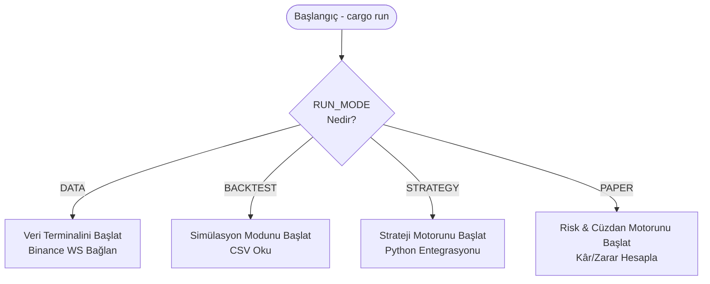

### 3.2. `core/src/memory/ring_buffer.rs` (Sıfır-Kopya Hafıza)
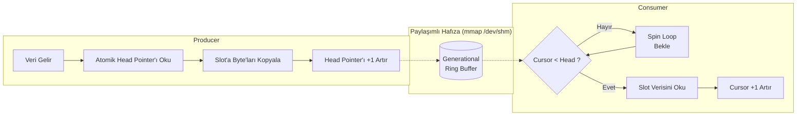

### 3.3. `core/src/memory/order_ring.rs` (Emir Hafıza Kuyruğu)
```mermaid
flowchart TD
    Strategy[Strateji Karar Verdi] --> PushOrder[Order::new() Oluştur]
    PushOrder --> RingWrite[OrderRingBuffer.push()]
    RingWrite --> CheckCap{Kapasite\nDoldu mu?}
    CheckCap -- Evet --> Overwrite[En Eski Verinin\nÜstüne Yaz]
    CheckCap -- Hayır --> WriteData[Hafızaya Yaz & Pointer Artır]
```

### 3.4. `core/src/strategy/python_bridge.rs` (Python Strateji Köprüsü)
```mermaid
flowchart TD
    RustEnv[Rust Ortamı] --> PyGIL[PyO3 GIL Al]
    PyGIL --> PyInit[test_strategy.py Dosyasını\nPyModule Olarak Yükle]
    
    RustEvent[OwnedEvent Geldi] --> Decode[Sembol ve Verileri\nRust Struct'ından Oku]
    Decode --> ToDict[PyDict::new_bound ile\nSözlüğe Çevir]
    ToDict --> CallPy[Python on_event() Fonksiyonunu\nSözlük ile Çağır]
```

### 3.5. `core/src/cli/strategy_cli.rs` (Strateji Motoru Döngüsü)
```mermaid
flowchart TD
    Start[CLI Başlar] --> Setup[Ring Buffer & PythonBridge Başlat]
    
    subgraph ArkaPlanDongusu ["Arka Plan Döngüsü"]
        L1[Sonsuz Loop] --> L2{read_slot(cursor)}
        L2 -- Yok --> Spin[spin_loop]
        Spin --> L1
        L2 -- Var --> Parse[EventParser::parse]
        Parse --> Exec[PythonBridge.on_event]
        Exec --> Inc[cursor += 1]
        Inc --> L1
    end
```

### 3.6. `core/src/risk/portfolio.rs` (Risk ve Portföy Motoru)
```mermaid
flowchart TD
    Init[Portfolio Yarat\n(10K USD, %20 Drawdown)] --> Wait[Emir Bekle]
    
    Wait --> Fill[process_fill Çağrılır]
    Fill --> CalcComm[Bakiye -= Komisyon]
    
    CalcComm --> CheckDir{Pozisyonu\nKapatıyor mu?}
    CheckDir -- Evet --> Realized[Gerçekleşen PnL Hesapla\nBakiyeye Ekle]
    CheckDir -- Hayır --> Avg[Ortalama Giriş Fiyatını\nGüncelle]
    
    Realized --> CheckDD[is_drawdown_exceeded()]
    Avg --> CheckDD
```

### 3.7. `core/src/engine/backtester.rs` (CSV Simülatörü)
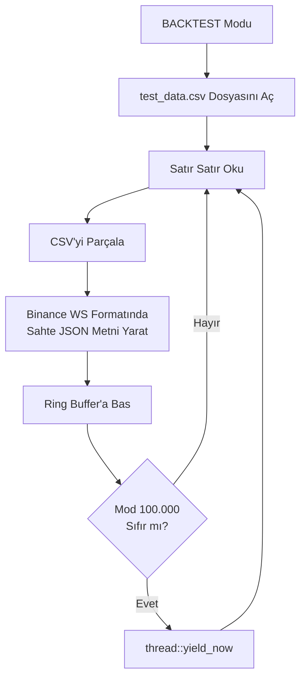

### 3.8. `adapter/src/binance.rs` (Binance WebSocket Adaptörü)
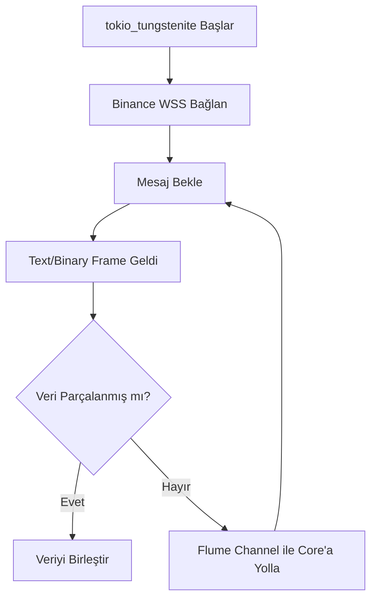

### 3.9. `core/src/tick.rs` (JSON Byte Ayrıştırıcı)
```mermaid
flowchart TD
    Input[WS'den Ham Byte Array Gelir] --> Parse[simd_json::to_borrowed_value]
    Parse --> CheckStream{stream\n@trade mi?}
    
    CheckStream -- Evet --> Trade[Sembol, Fiyat, Miktar Oku]
    Trade --> CreateTrade[OwnedEvent::new_trade()]
    
    CheckStream -- Hayır --> CheckBook{stream\n@bookTicker mı?}
    CheckBook -- Evet --> Book[Bids/Asks Oku]
    Book --> CreateBook[OwnedEvent::new_book()]
```

### 3.10. `core/src/hal/cpu.rs` & `hal/memory.rs` (Donanım Seviyesi İzolasyon)
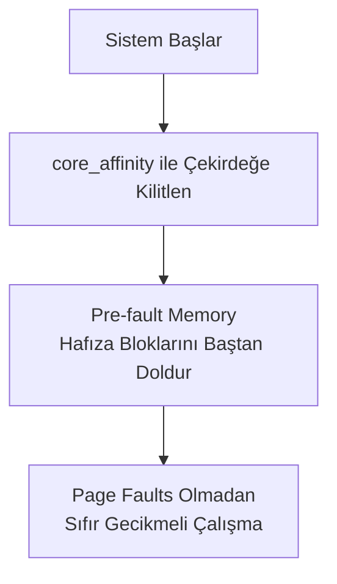

### 3.11. `core/src/timer/tsc.rs` (Nanosaniye Hassasiyetli RDTSC Saati)
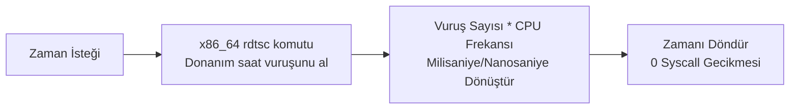

### 3.12. `execution-engine/src/paper/hybrid_book.rs` (Sanal Emir Defteri)
```mermaid
flowchart TD
    RecvOrder[OrderRequest Al] --> CheckType{Limit mi\nMarket mi?}
    CheckType -- Limit --> Insert[Bids/Asks Ağacına Ekle]
    CheckType -- Market --> Match[LOB Simulator ile Eşleştir]
    
    Match --> Result[Emir Gerçekleşme (Fill) Döndür]
    Result --> Notify[Paper CLI'a Bildir]
```

### 3.13. `risk-worker/src/matrix.rs` (Risk Matrisi İşçisi)
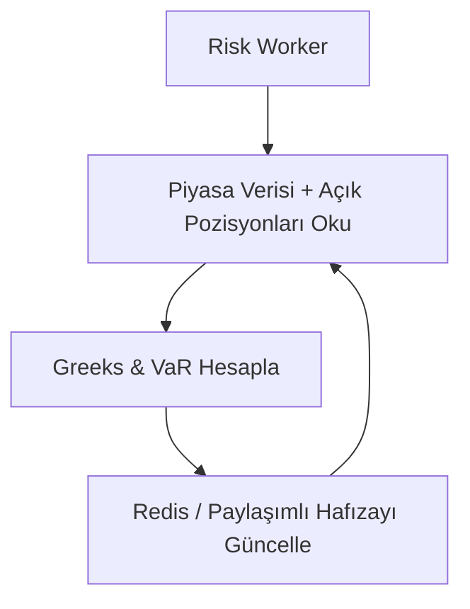

### 3.14. `adapter/src/clickhouse.rs` (Analitik Veritabanı Yazıcısı)
```mermaid
flowchart TD
    Recv[Veri Kuyruğundan Oku] --> Batch[Hafızada 10.000 Kayıt Biriktir]
    Batch --> Send[ClickHouse DB'ye\nTek Seferde (Bulk) HTTP POST]
```

---
*Demir Yumruk v3.0, minimum gecikme ve maksimum öngörülebilirlik üzerine kurulmuştur.*
# Demir Yumruk v3.0 - Tüm Dosyaların Akış Şemaları

Bu belge projedeki **tüm** dosyaları istisnasız barındırır.

### `Cargo.toml`
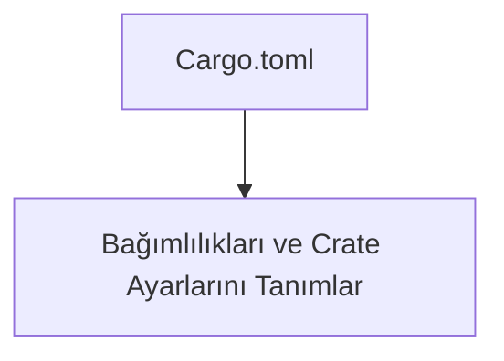
### `generate_final_md.py`
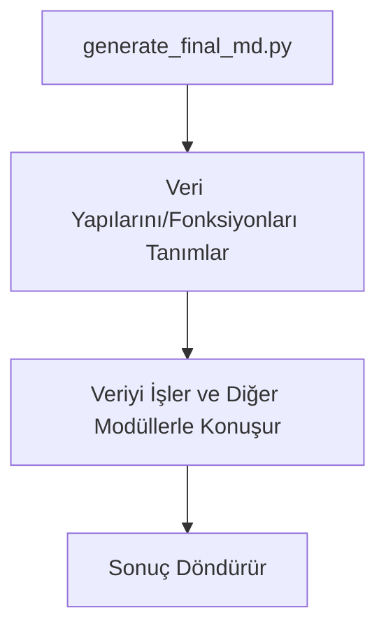
### `generate_flowcharts.py`
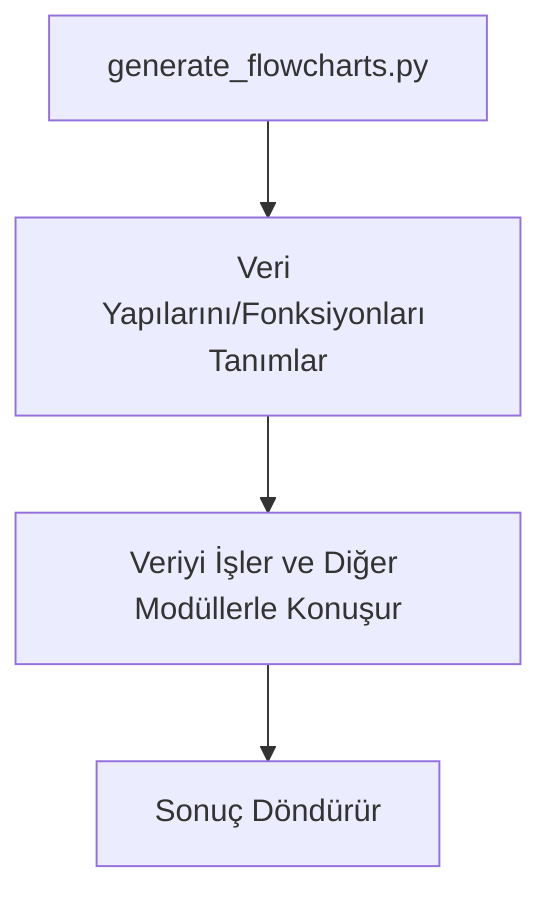
### `test_depth.py`
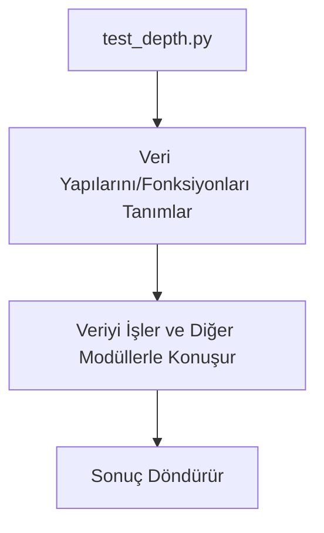
### `test_ws.py`
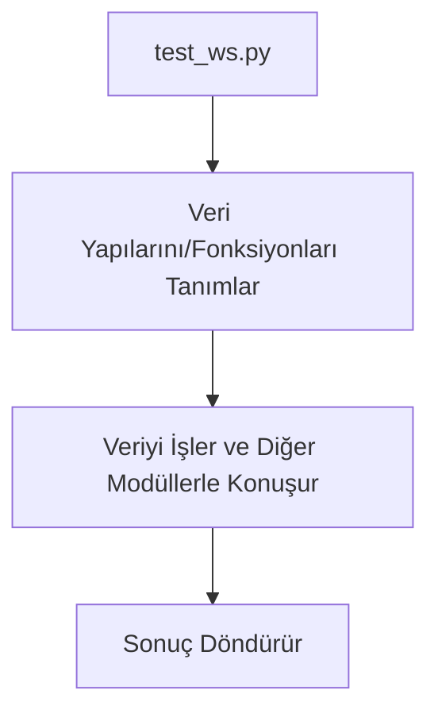
### `execution-engine/Cargo.toml`
```mermaid
flowchart TD
    Start[Cargo.toml] --> Config[Bağımlılıkları ve Crate Ayarlarını Tanımlar]
```
### `execution-engine/src/lib.rs`
```mermaid
flowchart TD
    Start[lib.rs] --> Init[Veri Yapılarını/Fonksiyonları Tanımlar]
    Init --> Process[Veriyi İşler ve Diğer Modüllerle Konuşur]
    Process --> Return[Sonuç Döndürür]
```
### `execution-engine/src/order.rs`
```mermaid
flowchart TD
    Start[order.rs] --> Init[Veri Yapılarını/Fonksiyonları Tanımlar]
    Init --> Process[Veriyi İşler ve Diğer Modüllerle Konuşur]
    Process --> Return[Sonuç Döndürür]
```
### `execution-engine/src/signer.rs`
```mermaid
flowchart TD
    Start[signer.rs] --> Init[Veri Yapılarını/Fonksiyonları Tanımlar]
    Init --> Process[Veriyi İşler ve Diğer Modüllerle Konuşur]
    Process --> Return[Sonuç Döndürür]
```
### `execution-engine/src/paper/account.rs`
```mermaid
flowchart TD
    Start[account.rs] --> Init[Veri Yapılarını/Fonksiyonları Tanımlar]
    Init --> Process[Veriyi İşler ve Diğer Modüllerle Konuşur]
    Process --> Return[Sonuç Döndürür]
```
### `execution-engine/src/paper/actor.rs`
```mermaid
flowchart TD
    Start[actor.rs] --> Init[Veri Yapılarını/Fonksiyonları Tanımlar]
    Init --> Process[Veriyi İşler ve Diğer Modüllerle Konuşur]
    Process --> Return[Sonuç Döndürür]
```
### `execution-engine/src/paper/config.rs`
```mermaid
flowchart TD
    Start[config.rs] --> Init[Veri Yapılarını/Fonksiyonları Tanımlar]
    Init --> Process[Veriyi İşler ve Diğer Modüllerle Konuşur]
    Process --> Return[Sonuç Döndürür]
```
### `execution-engine/src/paper/db_writer.rs`
```mermaid
flowchart TD
    Start[db_writer.rs] --> Init[Veri Yapılarını/Fonksiyonları Tanımlar]
    Init --> Process[Veriyi İşler ve Diğer Modüllerle Konuşur]
    Process --> Return[Sonuç Döndürür]
```
### `execution-engine/src/paper/hybrid_book.rs`
```mermaid
flowchart TD
    RecvOrder[OrderRequest Al] --> CheckType{Limit mi\nMarket mi?}
    CheckType -- Limit --> Insert[Bids/Asks Ağacına Ekle]
    CheckType -- Market --> Match[LOB Simulator ile Eşleştir]
    Match --> Result[Emir Gerçekleşme (Fill) Döndür]
    Result --> Notify[Paper CLI'a Bildir]
```
### `execution-engine/src/paper/mod.rs`
```mermaid
flowchart TD
    Start[mod.rs] --> Export[Alt modülleri (submodules) dışa aktarır (export)]
```
### `os-utils/Cargo.toml`
```mermaid
flowchart TD
    Start[Cargo.toml] --> Config[Bağımlılıkları ve Crate Ayarlarını Tanımlar]
```
### `os-utils/src/config.rs`
```mermaid
flowchart TD
    Start[config.rs] --> Init[Veri Yapılarını/Fonksiyonları Tanımlar]
    Init --> Process[Veriyi İşler ve Diğer Modüllerle Konuşur]
    Process --> Return[Sonuç Döndürür]
```
### `os-utils/src/lib.rs`
```mermaid
flowchart TD
    Start[lib.rs] --> Init[Veri Yapılarını/Fonksiyonları Tanımlar]
    Init --> Process[Veriyi İşler ve Diğer Modüllerle Konuşur]
    Process --> Return[Sonuç Döndürür]
```
### `config/config_v5.toml`
```mermaid
flowchart TD
    Start[config_v5.toml] --> Config[Bağımlılıkları ve Crate Ayarlarını Tanımlar]
```
### `config/config_v6.toml`
```mermaid
flowchart TD
    Start[config_v6.toml] --> Config[Bağımlılıkları ve Crate Ayarlarını Tanımlar]
```
### `risk-worker/Cargo.toml`
```mermaid
flowchart TD
    Start[Cargo.toml] --> Config[Bağımlılıkları ve Crate Ayarlarını Tanımlar]
```
### `risk-worker/src/cache.rs`
```mermaid
flowchart TD
    Start[cache.rs] --> Init[Veri Yapılarını/Fonksiyonları Tanımlar]
    Init --> Process[Veriyi İşler ve Diğer Modüllerle Konuşur]
    Process --> Return[Sonuç Döndürür]
```
### `risk-worker/src/finops.rs`
```mermaid
flowchart TD
    Start[finops.rs] --> Init[Veri Yapılarını/Fonksiyonları Tanımlar]
    Init --> Process[Veriyi İşler ve Diğer Modüllerle Konuşur]
    Process --> Return[Sonuç Döndürür]
```
### `risk-worker/src/main.rs`
```mermaid
flowchart TD
    Start[main.rs] --> Init[Veri Yapılarını/Fonksiyonları Tanımlar]
    Init --> Process[Veriyi İşler ve Diğer Modüllerle Konuşur]
    Process --> Return[Sonuç Döndürür]
```
### `risk-worker/src/matrix.rs`
```mermaid
flowchart TD
    Start[Risk Worker] --> Listen[Piyasa Verisi + Açık Pozisyonları Oku]
    Listen --> Calc[Greeks & VaR Hesapla]
    Calc --> UpdateCache[Redis / Paylaşımlı Hafızayı Güncelle]
    UpdateCache --> Listen
```
### `risk-worker/tests/matrix_tests.rs`
```mermaid
flowchart TD
    Start[matrix_tests.rs] --> Init[Veri Yapılarını/Fonksiyonları Tanımlar]
    Init --> Process[Veriyi İşler ve Diğer Modüllerle Konuşur]
    Process --> Return[Sonuç Döndürür]
```
### `.cargo/config.toml`
```mermaid
flowchart TD
    Start[config.toml] --> Config[Bağımlılıkları ve Crate Ayarlarını Tanımlar]
```
### `scripts/risk_analysis.py`
```mermaid
flowchart TD
    Start[risk_analysis.py] --> Init[Veri Yapılarını/Fonksiyonları Tanımlar]
    Init --> Process[Veriyi İşler ve Diğer Modüllerle Konuşur]
    Process --> Return[Sonuç Döndürür]
```
### `core/Cargo.toml`
```mermaid
flowchart TD
    Start[Cargo.toml] --> Config[Bağımlılıkları ve Crate Ayarlarını Tanımlar]
```
### `core/benches/tick_benchmark.rs`
```mermaid
flowchart TD
    Start[tick_benchmark.rs] --> Init[Veri Yapılarını/Fonksiyonları Tanımlar]
    Init --> Process[Veriyi İşler ve Diğer Modüllerle Konuşur]
    Process --> Return[Sonuç Döndürür]
```
### `core/src/config.rs`
```mermaid
flowchart TD
    Start[config.rs] --> Init[Veri Yapılarını/Fonksiyonları Tanımlar]
    Init --> Process[Veriyi İşler ve Diğer Modüllerle Konuşur]
    Process --> Return[Sonuç Döndürür]
```
### `core/src/db.rs`
```mermaid
flowchart TD
    Start[db.rs] --> Init[Veri Yapılarını/Fonksiyonları Tanımlar]
    Init --> Process[Veriyi İşler ve Diğer Modüllerle Konuşur]
    Process --> Return[Sonuç Döndürür]
```
### `core/src/main.rs`
```mermaid
flowchart TD
    Start([Başlangıç - cargo run]) --> ReadEnv{RUN_MODE\nNedir?}
    ReadEnv -->|DATA| DataMode[Veri Terminalini Başlat\nBinance WS Bağlan]
    ReadEnv -->|BACKTEST| BacktestMode[Simülasyon Modunu Başlat\nCSV Oku]
    ReadEnv -->|STRATEGY| StrategyMode[Strateji Motorunu Başlat\nPython Entegrasyonu]
    ReadEnv -->|PAPER| PaperMode[Risk & Cüzdan Motorunu Başlat\nKâr/Zarar Hesapla]
```
### `core/src/pii.rs`
```mermaid
flowchart TD
    Start[pii.rs] --> Init[Veri Yapılarını/Fonksiyonları Tanımlar]
    Init --> Process[Veriyi İşler ve Diğer Modüllerle Konuşur]
    Process --> Return[Sonuç Döndürür]
```
### `core/src/queue.rs`
```mermaid
flowchart TD
    Start[queue.rs] --> Init[Veri Yapılarını/Fonksiyonları Tanımlar]
    Init --> Process[Veriyi İşler ve Diğer Modüllerle Konuşur]
    Process --> Return[Sonuç Döndürür]
```
### `core/src/ring_buffer.rs`
```mermaid
flowchart TD
    Start[ring_buffer.rs] --> Init[Veri Yapılarını/Fonksiyonları Tanımlar]
    Init --> Process[Veriyi İşler ve Diğer Modüllerle Konuşur]
    Process --> Return[Sonuç Döndürür]
```
### `core/src/state.rs`
```mermaid
flowchart TD
    Start[state.rs] --> Init[Veri Yapılarını/Fonksiyonları Tanımlar]
    Init --> Process[Veriyi İşler ve Diğer Modüllerle Konuşur]
    Process --> Return[Sonuç Döndürür]
```
### `core/src/tick.rs`
```mermaid
flowchart TD
    Input[WS'den Ham Byte Array Gelir] --> Parse[simd_json::to_borrowed_value]
    Parse --> CheckStream{stream\n@trade mi?}
    CheckStream -- Evet --> Trade[Sembol, Fiyat, Miktar Oku]
    Trade --> CreateTrade[OwnedEvent::new_trade()]
    CheckStream -- Hayır --> CheckBook{stream\n@bookTicker mı?}
    CheckBook -- Evet --> Book[Bids/Asks Oku]
    Book --> CreateBook[OwnedEvent::new_book()]
```
### `core/src/validator.rs`
```mermaid
flowchart TD
    Start[validator.rs] --> Init[Veri Yapılarını/Fonksiyonları Tanımlar]
    Init --> Process[Veriyi İşler ve Diğer Modüllerle Konuşur]
    Process --> Return[Sonuç Döndürür]
```
### `core/src/cli/mod.rs`
```mermaid
flowchart TD
    Start[mod.rs] --> Export[Alt modülleri (submodules) dışa aktarır (export)]
```
### `core/src/cli/paper_cli.rs`
```mermaid
flowchart TD
    Start[paper_cli.rs] --> Init[Veri Yapılarını/Fonksiyonları Tanımlar]
    Init --> Process[Veriyi İşler ve Diğer Modüllerle Konuşur]
    Process --> Return[Sonuç Döndürür]
```
### `core/src/cli/strategy_cli.rs`
```mermaid
flowchart TD
    Start[CLI Başlar] --> Setup[Ring Buffer & PythonBridge Başlat]
    subgraph ArkaPlanDongusu ["Arka Plan Döngüsü"]
        L1[Sonsuz Loop] --> L2{read_slot(cursor)}
        L2 -- Yok --> Spin[spin_loop]
        Spin --> L1
        L2 -- Var --> Parse[EventParser::parse]
        Parse --> Exec[PythonBridge.on_event]
        Exec --> Inc[cursor += 1]
        Inc --> L1
    end
```
### `core/src/strategy/mod.rs`
```mermaid
flowchart TD
    Start[mod.rs] --> Export[Alt modülleri (submodules) dışa aktarır (export)]
```
### `core/src/strategy/python_bridge.rs`
```mermaid
flowchart TD
    RustEnv[Rust Ortamı] --> PyGIL[PyO3 GIL Al]
    PyGIL --> PyInit[test_strategy.py Dosyasını\nPyModule Olarak Yükle]
    RustEvent[OwnedEvent Geldi] --> Decode[Sembol ve Verileri\nRust Struct'ından Oku]
    Decode --> ToDict[PyDict::new_bound ile\nSözlüğe Çevir]
    ToDict --> CallPy[Python on_event() Fonksiyonunu\nSözlük ile Çağır]
```
### `core/src/strategy/trait_def.rs`
```mermaid
flowchart TD
    Start[trait_def.rs] --> Init[Veri Yapılarını/Fonksiyonları Tanımlar]
    Init --> Process[Veriyi İşler ve Diğer Modüllerle Konuşur]
    Process --> Return[Sonuç Döndürür]
```
### `core/src/strategy/impls/imbalance.rs`
```mermaid
flowchart TD
    Start[imbalance.rs] --> Init[Veri Yapılarını/Fonksiyonları Tanımlar]
    Init --> Process[Veriyi İşler ve Diğer Modüllerle Konuşur]
    Process --> Return[Sonuç Döndürür]
```
### `core/src/strategy/impls/mod.rs`
```mermaid
flowchart TD
    Start[mod.rs] --> Export[Alt modülleri (submodules) dışa aktarır (export)]
```
### `core/src/engine/backtester.rs`
```mermaid
flowchart TD
    Start[BACKTEST Modu] --> Open[test_data.csv Dosyasını Aç]
    Open --> Loop[Satır Satır Oku]
    Loop --> ParseCSV[CSV'yi Parçala]
    ParseCSV --> BuildJSON[Binance WS Formatında\nSahte JSON Metni Yarat]
    BuildJSON --> Push[Ring Buffer'a Bas]
    Push --> Limit{Mod 100.000\nSıfır mı?}
    Limit -- Evet --> Yield[thread::yield_now]
    Limit -- Hayır --> Loop
    Yield --> Loop
```
### `core/src/engine/mod.rs`
```mermaid
flowchart TD
    Start[mod.rs] --> Export[Alt modülleri (submodules) dışa aktarır (export)]
```
### `core/src/engine/orchestrator.rs`
```mermaid
flowchart TD
    Start[orchestrator.rs] --> Init[Veri Yapılarını/Fonksiyonları Tanımlar]
    Init --> Process[Veriyi İşler ve Diğer Modüllerle Konuşur]
    Process --> Return[Sonuç Döndürür]
```
### `core/src/risk/engine.rs`
```mermaid
flowchart TD
    Start[engine.rs] --> Init[Veri Yapılarını/Fonksiyonları Tanımlar]
    Init --> Process[Veriyi İşler ve Diğer Modüllerle Konuşur]
    Process --> Return[Sonuç Döndürür]
```
### `core/src/risk/lob_simulator.rs`
```mermaid
flowchart TD
    Start[lob_simulator.rs] --> Init[Veri Yapılarını/Fonksiyonları Tanımlar]
    Init --> Process[Veriyi İşler ve Diğer Modüllerle Konuşur]
    Process --> Return[Sonuç Döndürür]
```
### `core/src/risk/mod.rs`
```mermaid
flowchart TD
    Start[mod.rs] --> Export[Alt modülleri (submodules) dışa aktarır (export)]
```
### `core/src/risk/portfolio.rs`
```mermaid
flowchart TD
    Init[Portfolio Yarat\n(10K USD, %20 Drawdown)] --> Wait[Emir Bekle]
    Wait --> Fill[process_fill Çağrılır]
    Fill --> CalcComm[Bakiye -= Komisyon]
    CalcComm --> CheckDir{Pozisyonu\nKapatıyor mu?}
    CheckDir -- Evet --> Realized[Gerçekleşen PnL Hesapla\nBakiyeye Ekle]
    CheckDir -- Hayır --> Avg[Ortalama Giriş Fiyatını\nGüncelle]
    Realized --> CheckDD[is_drawdown_exceeded()]
    Avg --> CheckDD
```
### `core/src/hal/cpu.rs`
```mermaid
flowchart TD
    Start[Sistem Başlar] --> Affinity[core_affinity ile Çekirdeğe Kilitlen]
    Affinity --> Memory[Pre-fault Memory\nHafıza Bloklarını Baştan Doldur]
    Memory --> Run[Page Faults Olmadan\nSıfır Gecikmeli Çalışma]
```
### `core/src/hal/memory.rs`
```mermaid
flowchart TD
    Start[memory.rs] --> Init[Veri Yapılarını/Fonksiyonları Tanımlar]
    Init --> Process[Veriyi İşler ve Diğer Modüllerle Konuşur]
    Process --> Return[Sonuç Döndürür]
```
### `core/src/hal/mod.rs`
```mermaid
flowchart TD
    Start[mod.rs] --> Export[Alt modülleri (submodules) dışa aktarır (export)]
```
### `core/src/memory/mod.rs`
```mermaid
flowchart TD
    Start[mod.rs] --> Export[Alt modülleri (submodules) dışa aktarır (export)]
```
### `core/src/memory/order_ring.rs`
```mermaid
flowchart TD
    Strategy[Strateji Karar Verdi] --> PushOrder[Order::new() Oluştur]
    PushOrder --> RingWrite[OrderRingBuffer.push()]
    RingWrite --> CheckCap{Kapasite\nDoldu mu?}
    CheckCap -- Evet --> Overwrite[En Eski Verinin\nÜstüne Yaz]
    CheckCap -- Hayır --> WriteData[Hafızaya Yaz & Pointer Artır]
```
### `core/src/memory/ring_buffer.rs`
```mermaid
flowchart LR
    subgraph Yazan ["Producer"]
        W1[Veri Gelir] --> W2[Atomik Head Pointer'ı Oku]
        W2 --> W3[Slot'a Byte'ları Kopyala]
        W3 --> W4[Head Pointer'ı +1 Artır]
    end
    subgraph PaylasimliHafiza ["Paylaşımlı Hafıza (mmap /dev/shm)"]
        R[(Generational\nRing Buffer)]
    end
    subgraph Okuyan ["Consumer"]
        C1[Spin Loop\nBekle] --> C2{Cursor < Head ?}
        C2 -- Evet --> C3[Slot Verisini Oku]
        C2 -- Hayır --> C1
        C3 --> C4[Cursor +1 Artır]
    end
    W4 -.-> R
    R -.-> C2
```
### `core/src/timer/mod.rs`
```mermaid
flowchart TD
    Start[mod.rs] --> Export[Alt modülleri (submodules) dışa aktarır (export)]
```
### `core/src/timer/tsc.rs`
```mermaid
flowchart LR
    Call[Zaman İsteği] --> ASM[x86_64 rdtsc komutu\nDonanım saat vuruşunu al]
    ASM --> Calc[Vuruş Sayısı * CPU Frekansı\nMilisaniye/Nanosaniye Dönüştür]
    Calc --> Ret[Zamanı Döndür\n0 Syscall Gecikmesi]
```
### `core/tests/tick_tests.rs`
```mermaid
flowchart TD
    Start[tick_tests.rs] --> Init[Veri Yapılarını/Fonksiyonları Tanımlar]
    Init --> Process[Veriyi İşler ve Diğer Modüllerle Konuşur]
    Process --> Return[Sonuç Döndürür]
```
### `adapter/Cargo.toml`
```mermaid
flowchart TD
    Start[Cargo.toml] --> Config[Bağımlılıkları ve Crate Ayarlarını Tanımlar]
```
### `adapter/src/ai.rs`
```mermaid
flowchart TD
    Start[ai.rs] --> Init[Veri Yapılarını/Fonksiyonları Tanımlar]
    Init --> Process[Veriyi İşler ve Diğer Modüllerle Konuşur]
    Process --> Return[Sonuç Döndürür]
```
### `adapter/src/binance.rs`
```mermaid
flowchart TD
    Start[tokio_tungstenite Başlar] --> Sub[Binance WSS Bağlan]
    Sub --> Listen[Mesaj Bekle]
    Listen --> Recv[Text/Binary Frame Geldi]
    Recv --> Chunk{Veri Parçalanmış mı?}
    Chunk -- Evet --> Concat[Veriyi Birleştir]
    Chunk -- Hayır --> SendFlume[Flume Channel ile Core'a Yolla]
    SendFlume --> Listen
```
### `adapter/src/clickhouse.rs`
```mermaid
flowchart TD
    Recv[Veri Kuyruğundan Oku] --> Batch[Hafızada 10.000 Kayıt Biriktir]
    Batch --> Send[ClickHouse DB'ye\nTek Seferde (Bulk) HTTP POST]
```
### `adapter/src/lib.rs`
```mermaid
flowchart TD
    Start[lib.rs] --> Init[Veri Yapılarını/Fonksiyonları Tanımlar]
    Init --> Process[Veriyi İşler ve Diğer Modüllerle Konuşur]
    Process --> Return[Sonuç Döndürür]
```
### `adapter/src/redis.rs`
```mermaid
flowchart TD
    Start[redis.rs] --> Init[Veri Yapılarını/Fonksiyonları Tanımlar]
    Init --> Process[Veriyi İşler ve Diğer Modüllerle Konuşur]
    Process --> Return[Sonuç Döndürür]
```
### `adapter/src/telemetry.rs`
```mermaid
flowchart TD
    Start[telemetry.rs] --> Init[Veri Yapılarını/Fonksiyonları Tanımlar]
    Init --> Process[Veriyi İşler ve Diğer Modüllerle Konuşur]
    Process --> Return[Sonuç Döndürür]
```
### `adapter/src/vault.rs`
```mermaid
flowchart TD
    Start[vault.rs] --> Init[Veri Yapılarını/Fonksiyonları Tanımlar]
    Init --> Process[Veriyi İşler ve Diğer Modüllerle Konuşur]
    Process --> Return[Sonuç Döndürür]
```
### `adapter/tests/integration_suite.rs`
```mermaid
flowchart TD
    Start[integration_suite.rs] --> Init[Veri Yapılarını/Fonksiyonları Tanımlar]
    Init --> Process[Veriyi İşler ve Diğer Modüllerle Konuşur]
    Process --> Return[Sonuç Döndürür]
```
### `cold-storage/Cargo.toml`
```mermaid
flowchart TD
    Start[Cargo.toml] --> Config[Bağımlılıkları ve Crate Ayarlarını Tanımlar]
```
### `cold-storage/src/lib.rs`
```mermaid
flowchart TD
    Start[lib.rs] --> Init[Veri Yapılarını/Fonksiyonları Tanımlar]
    Init --> Process[Veriyi İşler ve Diğer Modüllerle Konuşur]
    Process --> Return[Sonuç Döndürür]
```
### `strategies/test_strategy.py`
```mermaid
flowchart TD
    Start[test_strategy.py] --> Init[Veri Yapılarını/Fonksiyonları Tanımlar]
    Init --> Process[Veriyi İşler ve Diğer Modüllerle Konuşur]
    Process --> Return[Sonuç Döndürür]
```
### `cold-starter/Cargo.toml`
```mermaid
flowchart TD
    Start[Cargo.toml] --> Config[Bağımlılıkları ve Crate Ayarlarını Tanımlar]
```
### `cold-starter/src/catchup.rs`
```mermaid
flowchart TD
    Start[catchup.rs] --> Init[Veri Yapılarını/Fonksiyonları Tanımlar]
    Init --> Process[Veriyi İşler ve Diğer Modüllerle Konuşur]
    Process --> Return[Sonuç Döndürür]
```
### `cold-starter/src/main.rs`
```mermaid
flowchart TD
    Start[main.rs] --> Init[Veri Yapılarını/Fonksiyonları Tanımlar]
    Init --> Process[Veriyi İşler ve Diğer Modüllerle Konuşur]
    Process --> Return[Sonuç Döndürür]
```
