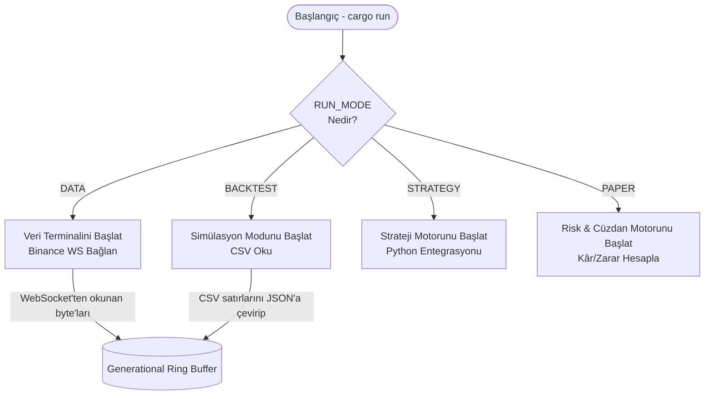
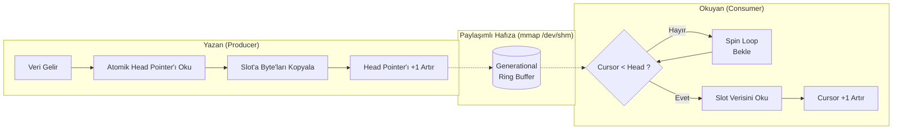
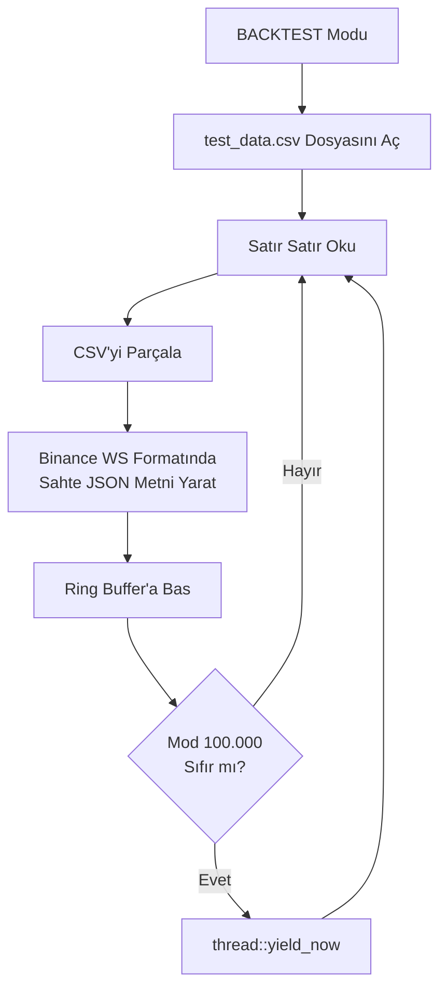
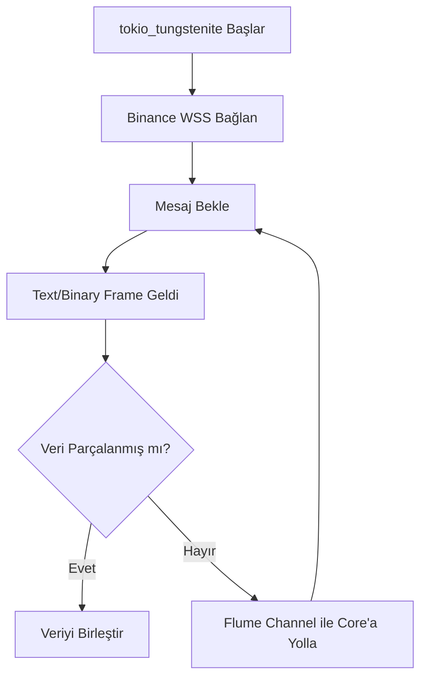

# Demir Yumruk v3.0 - Detaylı Dosya ve Modül Akış Şemaları

Bu belge, projenin her bir kritik kod dosyasının (module) iç işleyişini gösteren Mermaid akış şemalarını barındırır.

## 1. Yönlendirici (Orchestrator)
**Dosya:** `core/src/main.rs`


## 2. Sıfır-Kopya Hafıza (Generational Ring Buffer)
**Dosya:** `core/src/memory/ring_buffer.rs`


## 3. Emir Hafıza Kuyruğu (Order Ring Buffer)
**Dosya:** `core/src/memory/order_ring.rs`
```mermaid
flowchart TD
    Strategy[Strateji Karar Verdi] --> PushOrder[Order::new() Oluştur]
    PushOrder --> RingWrite[OrderRingBuffer.push()]
    RingWrite --> CheckCap{Kapasite\nDoldu mu?}
    CheckCap -- Evet --> Overwrite[En Eski Verinin\nÜstüne Yaz]
    CheckCap -- Hayır --> WriteData[Hafızaya Yaz & Pointer Artır]
    
    WriteData -.-> Paper[PAPER/LIVE Terminali Okur]
```

## 4. Python Strateji Köprüsü
**Dosya:** `core/src/strategy/python_bridge.rs`
```mermaid
flowchart TD
    RustEnv[Rust Ortamı] --> PyGIL[PyO3 GIL Al]
    PyGIL --> PyInit[test_strategy.py Dosyasını\nPyModule Olarak Yükle]
    
    RustEvent[OwnedEvent Geldi] --> Decode[Sembol ve Verileri\nRust Struct'ından Oku]
    Decode --> ToDict[PyDict::new_bound ile\nSözlüğe Çevir]
    ToDict --> CallPy[Python on_event() Fonksiyonunu\nSözlük ile Çağır]
```

## 5. Strateji CLI Motoru
**Dosya:** `core/src/cli/strategy_cli.rs`
```mermaid
flowchart TD
    Start[CLI Başlar] --> Setup[Ring Buffer & PythonBridge Başlat]
    
    subgraph ArkaPlanDongusu ["Arka Plan Döngüsü"]
        L1[Sonsuz Loop] --> L2{read_slot(cursor)}
        L2 -- Yok --> Spin[spin_loop]
        Spin --> L1
        L2 -- Var --> Parse[EventParser::parse]
        Parse --> Exec[PythonBridge.on_event]
        Exec --> Inc[cursor += 1]
        Inc --> L1
    end
```

## 6. Risk ve Portföy Yönetimi
**Dosya:** `core/src/risk/portfolio.rs`
```mermaid
flowchart TD
    Init[Portfolio Yarat\n(10K USD, %20 Drawdown)] --> Wait[Emir Bekle]
    
    Wait --> Fill[process_fill Çağrılır]
    Fill --> CalcComm[Bakiye -= Komisyon]
    
    CalcComm --> CheckDir{Pozisyonu\nKapatıyor mu?}
    CheckDir -- Evet --> Realized[Gerçekleşen PnL Hesapla\nBakiyeye Ekle]
    CheckDir -- Hayır --> Avg[Ortalama Giriş Fiyatını\nGüncelle]
    
    Realized --> CheckDD[is_drawdown_exceeded()]
    Avg --> CheckDD
```

## 7. CSV Simülatörü (Backtester)
**Dosya:** `core/src/engine/backtester.rs`


## 8. Binance WebSocket Adaptörü
**Dosya:** `adapter/src/binance.rs`


## 9. Veri Ayrıştırıcı (Event Parser)
**Dosya:** `core/src/tick.rs`
```mermaid
flowchart TD
    Input[WS'den Ham Byte Array Gelir] --> Parse[simd_json::to_borrowed_value]
    Parse --> CheckStream{stream\n@trade mi?}
    
    CheckStream -- Evet --> Trade[Sembol, Fiyat, Miktar Oku]
    Trade --> CreateTrade[OwnedEvent::new_trade()]
    
    CheckStream -- Hayır --> CheckBook{stream\n@bookTicker mı?}
    CheckBook -- Evet --> Book[Bids/Asks Oku]
    Book --> CreateBook[OwnedEvent::new_book()]
    
    CreateTrade --> Output[OwnedEvent Döndür]
    CreateBook --> Output
```
