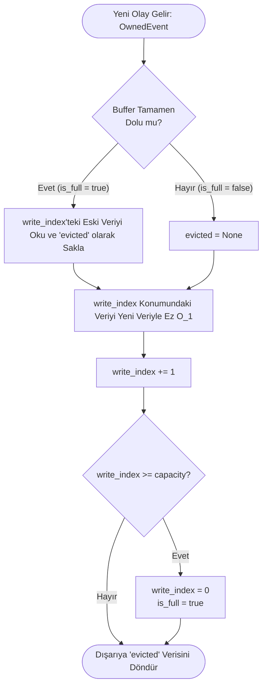

# Algoritmik Şema: `ring_buffer.rs`

Bu dosya, HFT sisteminin kalbi olan **Sıfır Tahsisli (Zero-Allocation)** hafıza yönetimini sağlar. Sistem çalışırken işletim sisteminden asla yeni RAM talep edilmez (`malloc` çağrılmaz), bunun yerine önceden ayrılmış sabit bir bellek bloğu (Array/Slice) üzerinde sonsuz bir döngüde yazma işlemi yapılır.

## Akış Şeması (Flowchart)

## Algoritmik Adımlar

1. **İnitializasyon (Başlatma):** Sistem başladığında 160.000 elemanlı devasa bir Dizi (Array) oluşturulur ve içi boş verilerle doldurulur. İşletim sisteminden ~100MB RAM tek seferde alınır.
2. **Ekleme (`push`):**
   - Yeni bir `OwnedEvent` (Örn: Trade, Liquidation) gelir.
   - Eğer Ring Buffer daha önce tam tur attıysa (`is_full`), şu an yazacağımız noktada önceden kalma çok eski bir veri vardır. Bu eski veri hafızadan okunup geçici bir değişkene (`evicted`) kopyalanır.
   - **Ezme:** Gelen yeni veri, dizideki `write_index` sırasına doğrudan kopyalanır. Bu işlem $O(1)$ karmaşıklığa sahiptir.
3. **İndeks Yönetimi:**
   - `write_index` bir artırılır.
   - Eğer `write_index` dizinin kapasitesini aşarsa (160.000), indeks sıfırlanır (`write_index = 0`) ve dizinin en başına dönülür. Bu sayede bellek asla şişmez (Memory Leak oluşmaz).
4. **Geri Dönüş (Return):**
   - Eğer eski bir veri ezildiyse (Evicted), bu eski veri `Option<OwnedEvent>` olarak fonksiyonun çağrıldığı yere (main.rs) geri döndürülür. Ana motor bu çöp veriyi alıp Veritabanına (SQLite) gönderir.
